# ネットワーキング概念の詳細解説

> **最終更新**: February 22, 2026

このドキュメントでは、Ciliumを理解するために必要な主要なネットワーキング概念を詳しく解説します。コンテナネットワーキング、オーバーレイネットワーク、ルーティングプロトコルなど、Ciliumの基盤となる技術概念を取り上げます。

## 学習目標

このドキュメントを通じて、以下を理解できます。
- OSIモデルとTCP/IPスタックの基本構造、および各レイヤーの役割
- コンテナネットワーキングの基本原則と実装方法
- オーバーレイネットワークとアンダーレイネットワークの違い
- NAT、ルーティング、DNSなどの主要なネットワーキング概念がCiliumでどのように活用されるか

## 目次

1. [OSIモデルとTCP/IPスタック](#osi-model-and-tcpip-stack)
2. [コンテナネットワーキングの基礎](#container-networking-basics)
3. [オーバーレイネットワーク](#overlay-networks)
4. [ネットワークアドレス変換（NAT）](#network-address-translation-nat)
5. [ルーティングプロトコル](#routing-protocols)
6. [DNSとサービスディスカバリー](#dns-and-service-discovery)
7. [ロードバランシングの概念](#load-balancing-concepts)
8. [ネットワークセキュリティの基礎](#network-security-basics)

## OSIモデルとTCP/IPスタック

> **主要な概念**: OSIモデルは、ネットワーク通信を7つの抽象レイヤーに分類する概念的なフレームワークであり、複雑なネットワーキング処理を理解しやすくします。

OSI（Open Systems Interconnection）モデルは、ネットワーク通信を7つの抽象レイヤーに分類する概念的なフレームワークです。各レイヤーは特定のネットワーキング機能を担当し、複雑なネットワーキング処理を分解して理解しやすくします。

### OSIモデルとTCP/IPモデルの比較

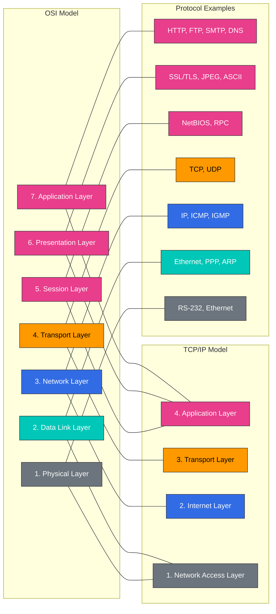

### OSI 7層モデル

1. **物理層**
   - ビットストリームを電気、光、または無線信号に変換する
   - ケーブル、スイッチ、ハブなどの物理デバイスを含む
   - データ単位: ビット

2. **データリンク層**
   - 物理ネットワーク上のノード間のデータ転送を担当する
   - MAC（Media Access Control）アドレスを使用したデバイス識別
   - エラー検出と訂正
   - データ単位: フレーム
   - EthernetおよびWi-Fiプロトコルはこのレイヤーで動作する

3. **ネットワーク層**
   - 異なるネットワーク間のパケットルーティングを担当する
   - 論理アドレッシング（IPアドレス）
   - 経路決定とパケット転送
   - データ単位: パケット
   - IP（Internet Protocol）はこのレイヤーの中核プロトコルである

4. **トランスポート層**
   - エンドツーエンド通信の制御
   - データの分割と再構成
   - フロー制御とエラー回復
   - データ単位: セグメント
   - TCP（Transmission Control Protocol）およびUDP（User Datagram Protocol）はこのレイヤーの主要なプロトコルである

5. **セッション層**
   - 通信セッションの確立、維持、終了
   - 同期とダイアログ制御
   - チェックポイントの設定と回復
   - NetBIOSおよびRPC（Remote Procedure Call）はこのレイヤーの例である

6. **プレゼンテーション層**
   - データ形式の変換と暗号化
   - 文字エンコーディング、データ圧縮、暗号化/復号化
   - SSL/TLS、JPEG、ASCIIはこのレイヤーの例である

7. **アプリケーション層**
   - ユーザーインターフェイスとアプリケーションサービスを提供する
   - メール、ファイル転送、Webブラウジングなどのサービス
   - HTTP、FTP、SMTP、DNSはこのレイヤーの例である

### CiliumとOSIモデルの関係

Ciliumは複数のOSIレイヤーで動作します。

| OSIレイヤー | Ciliumの機能 | 例 |
|-----------|----------------|---------|
| L2（データリンク） | ARP処理、MACフィルタリング | ノード間のMACアドレス検証 |
| L3（ネットワーク） | IPルーティング、CIDRベースのポリシー | Pod間のIPルーティング |
| L4（トランスポート） | ポートベースのフィルタリング、コネクショントラッキング | Serviceポートのアクセス制御 |
| L7（アプリケーション） | HTTP、gRPC、Kafkaフィルタリング | APIパスベースのアクセス制御 |

### TCP/IPスタック

TCP/IPスタックは、インターネットの基盤を構成する一連のプロトコルであり、OSIモデルを簡略化した4層モデルです。

1. **ネットワークインターフェイス層**
   - OSIモデルの物理層およびデータリンク層に対応する
   - 物理ネットワークメディアとのインターフェイスを担当する
   - EthernetやWi-Fiなどのプロトコルを含む

2. **インターネット層**
   - OSIモデルのネットワーク層に対応する
   - IP（Internet Protocol）を使用したパケットルーティング
   - ICMP（Internet Control Message Protocol）およびARP（Address Resolution Protocol）を含む

3. **トランスポート層**
   - OSIモデルのトランスポート層と同じ
   - TCPおよびUDPプロトコルを含む
   - コネクション型（TCP）およびコネクションレス型（UDP）通信を提供する

4. **アプリケーション層**
   - OSIモデルのセッション層、プレゼンテーション層、アプリケーション層を統合する
   - HTTP、SMTP、FTP、DNSなどのプロトコルを含む
   - ユーザーアプリケーションとネットワーク間のインターフェイスを提供する

### レイヤー別のCilium機能

Ciliumはさまざまなネットワークレイヤーで機能を提供します。

- **L2（データリンク層）**: MACアドレスベースのフィルタリング、ARPスプーフィング防止
- **L3（ネットワーク層）**: IPアドレスベースのルーティングとフィルタリング、IPAM
- **L4（トランスポート層）**: ポートベースのフィルタリング、ロードバランシング、コネクショントラッキング
- **L7（アプリケーション層）**: HTTP、gRPC、Kafkaなどに対するプロトコル認識型フィルタリングとロードバランシング

## コンテナネットワーキングの基礎

コンテナネットワーキングは、コンテナ化されたアプリケーション同士、および外部と通信できるようにする仕組みです。Kubernetesなどのコンテナオーケストレーションプラットフォームでは、さまざまなネットワーキングモデルとソリューションが使用されます。

### コンテナネットワークインターフェイス（CNI）

CNI（Container Network Interface）は、コンテナランタイムとネットワークプラグイン間の標準インターフェイスを定義します。これにより、さまざまなネットワーキングソリューションをコンテナプラットフォームに統合できます。

#### CNIの主要コンポーネント:

1. **プラグイン**: ネットワークインターフェイスの作成と設定を担当する実行可能ファイル
2. **設定ファイル**: プラグインの動作を定義するJSON形式のファイル
3. **IPAM（IP Address Management）**: IPアドレスの割り当てと管理を担当するモジュール

#### CNIプラグインの主な責務:

- コンテナネットワーク名前空間へのインターフェイスの追加/削除
- IPアドレスの割り当てと解放
- ルーティングテーブルの設定
- ネットワークポリシーの適用

### コンテナネットワーキングモデル

コンテナネットワーキングモデルには複数の種類があり、それぞれ異なるユースケースや要件に適しています。

#### 1. ブリッジネットワーキング

- ホスト上に仮想ブリッジを作成してコンテナを接続する
- 各コンテナは仮想Ethernet（veth）ペアを通じてブリッジに接続する
- 同一ホスト上のコンテナ間で効率的に通信できる
- Dockerのデフォルトネットワーキングモード

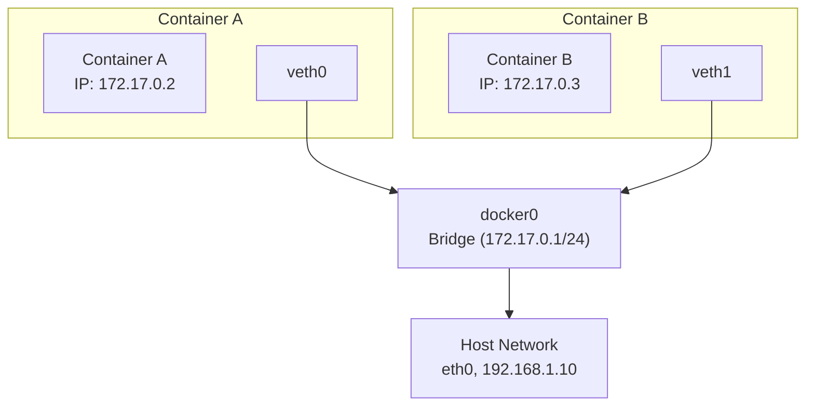

#### 2. ホストネットワーキング

- コンテナがホストのネットワーク名前空間を直接使用する
- 個別のネットワーク分離がない
- 最高のネットワークパフォーマンスを提供する
- ポート競合の可能性がある

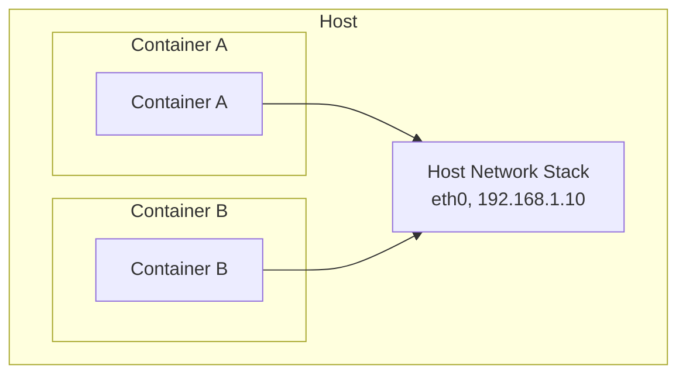

#### 3. オーバーレイネットワーキング

- 複数のホストにまたがるコンテナ間の通信をサポートする
- VXLANやGENEVEなどのカプセル化プロトコルを使用する
- 大規模クラスターに適している
- Cilium、Calico、Flannelなどでサポートされている

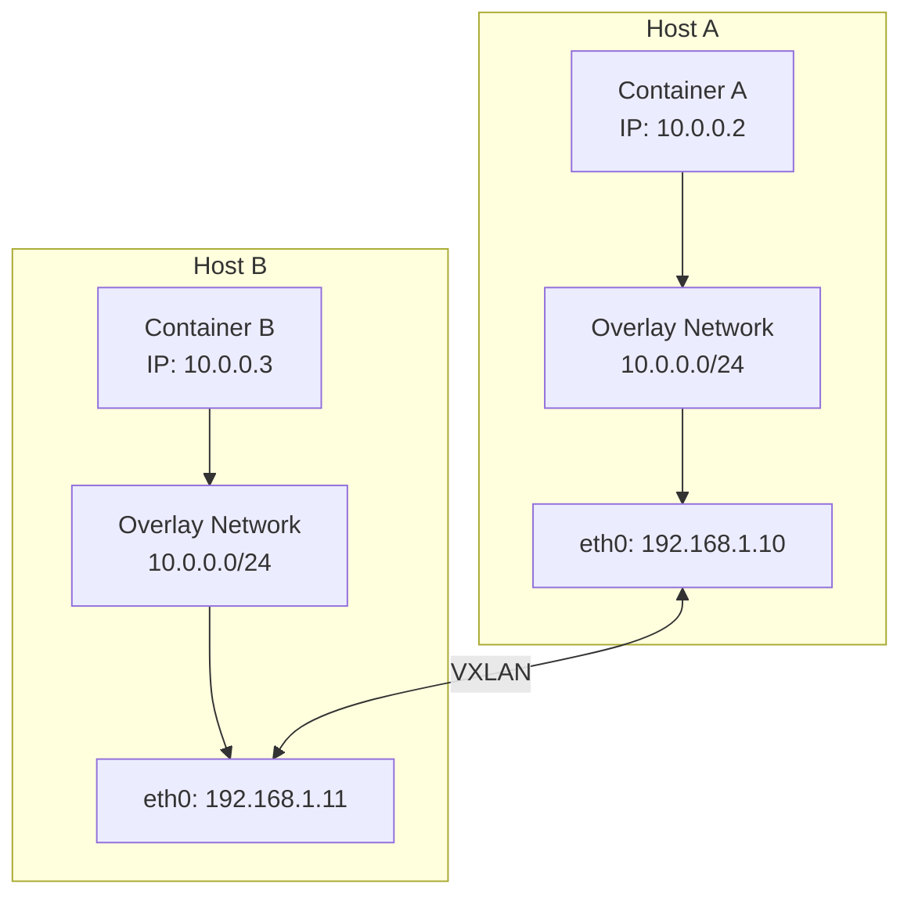

#### 4. アンダーレイネットワーキング（直接ルーティング）

- 物理ネットワークインフラストラクチャを直接活用する
- カプセル化のオーバーヘッドがない
- ネットワークインフラストラクチャを制御できることが必要
- BGPなどのルーティングプロトコルと統合できる

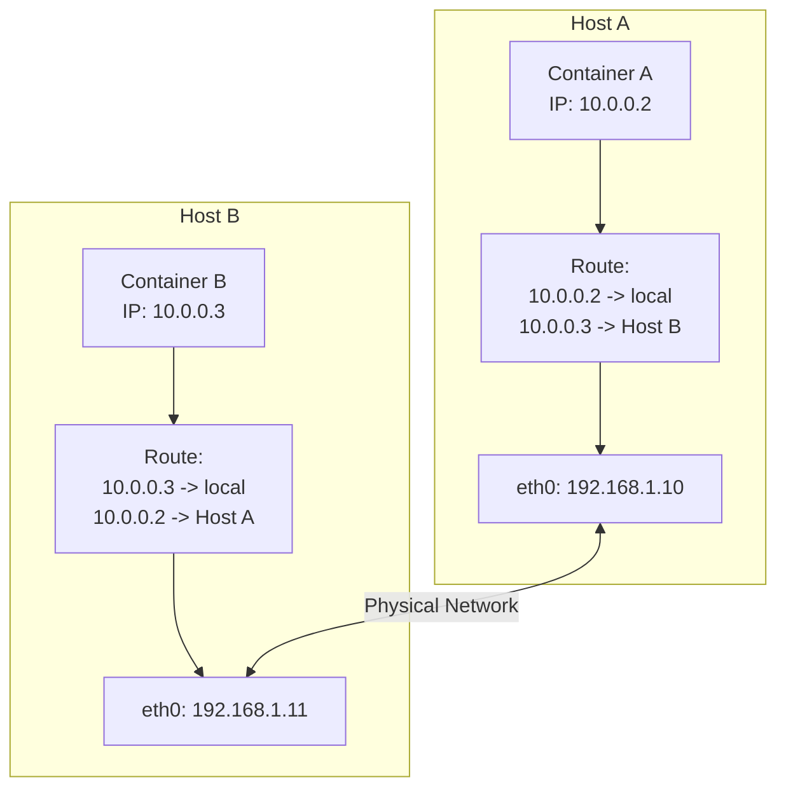

### Kubernetesネットワーキングモデル

Kubernetesには、すべてのPodがNATなしで相互に通信できなければならないという基本要件があります。これを実現するため、以下のネットワーキングモデルを定義しています。

1. **Pod間通信**: すべてのPodはNATなしで相互に通信できなければならない
2. **NodeからPodへの通信**: NodeはNATなしですべてのPodと通信できなければならない
3. **Podから外部への通信**: Podは外部ネットワークと通信できなければならない（通常はNATを使用）

#### Kubernetesネットワークコンポーネント:

1. **Podネットワーク**: クラスター内のすべてのPodを接続するネットワーク
2. **Serviceネットワーク**: Podの集合に安定したエンドポイントを提供する
3. **クラスターDNS**: サービスディスカバリーのためのDNSサービス
4. **Ingress/Egress**: クラスター外部との通信を管理する

### Ciliumのコンテナネットワーキングアプローチ

CiliumはeBPFを活用して、高性能でスケーラブルなコンテナネットワーキングソリューションを提供します。

1. **eBPFベースのデータパス**: カーネル内で直接パケットを処理する
2. **多様なネットワーキングモードのサポート**: オーバーレイ（VXLAN、Geneve）とアンダーレイ（直接ルーティング）
3. **高度なロードバランシング**: kube-proxy置換機能
4. **ネットワークポリシー**: L3-L7レベルのきめ細かなポリシー
5. **統合IPAM**: さまざまなIPアドレス割り当て戦略をサポート

## オーバーレイネットワーク

オーバーレイネットワークは、既存のネットワークインフラストラクチャの上に仮想ネットワークレイヤーを構築する技術です。この技術により、物理ネットワークトポロジーとは独立して仮想ネットワークトポロジーを作成できます。コンテナ環境では、複数のホストにまたがるコンテナ間通信を可能にするために広く使用されています。

### オーバーレイネットワークの仕組み

オーバーレイネットワークはカプセル化技術を使用して動作します。元のパケットは別のパケット内にカプセル化され、物理ネットワークを通じて送信されます。

1. **パケットカプセル化**: 元のパケット（内側のパケット）を新しいヘッダーと、場合によっては新しいトレーラーで包む。
2. **トンネリング**: カプセル化されたパケットを物理ネットワーク経由で宛先ホストへ送信する。
3. **パケットデカプセル化**: 宛先ホストで外側のヘッダーを取り除き、元のパケットを取り出す。
4. **パケット転送**: 元のパケットを宛先コンテナへ転送する。

### 主なオーバーレイネットワークプロトコル

#### VXLAN（Virtual Extensible LAN）

VXLANは、コンテナネットワーキングで最も広く使用されるオーバーレイプロトコルの1つです。

- **VXLAN Tunnel Endpoint（VTEP）**: パケットのカプセル化とデカプセル化を担当する
- **VXLAN Network Identifier（VNI）**: 最大16,777,216個の仮想ネットワークをサポートする
- **UDPカプセル化**: VXLANパケットはUDPポート4789経由で送信される
- **MAC-in-UDPカプセル化**: 元のL2フレームをUDPパケットにカプセル化する

VXLANパケット構造:
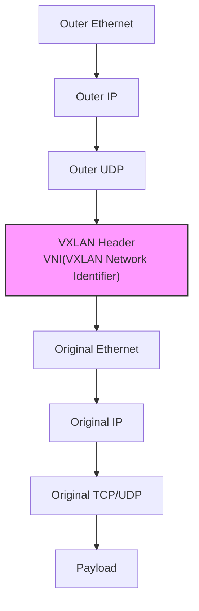

#### GENEVE（Generic Network Virtualization Encapsulation）

GENEVEは、VXLANの制限を克服するために設計された、より柔軟なオーバーレイプロトコルです。

- **拡張可能なオプションヘッダー**: さまざまなメタデータをサポートする
- **プロトコル非依存**: さまざまな仮想化技術とともに使用できる
- **UDPカプセル化**: UDPポート6081経由で送信される
- **柔軟なトンネリング**: さまざまなネットワーク仮想化要件をサポートする

#### IPsec

IPsecは、IPパケットレベルでセキュリティサービスを提供するプロトコルスイートです。

- **認証と暗号化**: データの完全性と機密性を保証する
- **トランスポートモードとトンネルモード**: さまざまなデプロイシナリオをサポートする
- **Security Association（SA）**: 通信当事者間のセキュリティパラメーターを定義する
- **Internet Key Exchange（IKE）**: セキュリティキー管理を自動化する

### オーバーレイネットワークの利点と欠点

#### 利点:

- **柔軟性**: 物理ネットワークトポロジーとは独立して仮想ネットワークを設定できる
- **スケーラビリティ**: 大規模なネットワークセグメントと多数のエンドポイントをサポートする
- **分離**: 異なるテナントまたはアプリケーション間のネットワーク分離を提供する
- **互換性**: 既存のネットワークインフラストラクチャと連携できる

#### 欠点:

- **オーバーヘッド**: カプセル化によりパケットサイズと処理オーバーヘッドが増加する
- **MTUに関する考慮事項**: カプセル化によりMaximum Transmission Unit（MTU）が減少する
- **複雑性**: トラブルシューティングとデバッグがより複雑になる場合がある
- **レイテンシー**: カプセル化およびデカプセル化時にわずかなレイテンシーが追加される

### Ciliumのオーバーレイネットワーク

CiliumはVXLANやGeneveなどのオーバーレイプロトコルをサポートし、eBPFを活用して効率的なパケット処理を提供します。

- **eBPFベースのVXLAN処理**: カーネル内で直接パケットをカプセル化およびデカプセル化する
- **効率的なルーティング**: 最適化されたパスを通じたパケット転送
- **暗号化オプション**: IPsecまたはWireGuardによる暗号化オーバーレイ
- **直接ルーティングとのハイブリッド**: 必要に応じてオーバーレイと直接ルーティングを組み合わせられる

#### Cilium VXLAN設定例:

```yaml
apiVersion: v1
kind: ConfigMap
metadata:
  name: cilium-config
  namespace: kube-system
data:
  tunnel: "vxlan"
  enable-ipv4: "true"
  enable-ipv6: "false"
  ipv4-range: "10.0.0.0/16"
  ipv4-tunnel-endpoint-selector: "kubernetes.io/hostname"
```

## ネットワークアドレス変換（NAT）

ネットワークアドレス変換（NAT）は、IPパケットの送信元または宛先アドレスを変更するプロセスです。NATは主に、プライベートネットワーク上のデバイスがパブリックインターネットと通信できるようにするため、またはネットワークアドレス空間が重複する2つのネットワーク間で通信できるようにするために使用されます。

### NATの主な種類

#### 1. Source NAT（SNAT）

Source NATは、パケットの送信元IPアドレスを変更します。通常、プライベートネットワーク上のデバイスがインターネットにアクセスする際に使用されます。

- **仕組み**: 内部ホストのプライベートIPアドレスをパブリックIPアドレスに変換する
- **ユースケース**: インターネットアクセス、アウトバウンド接続
- **トラッキング**: NATテーブルに接続状態を保存する

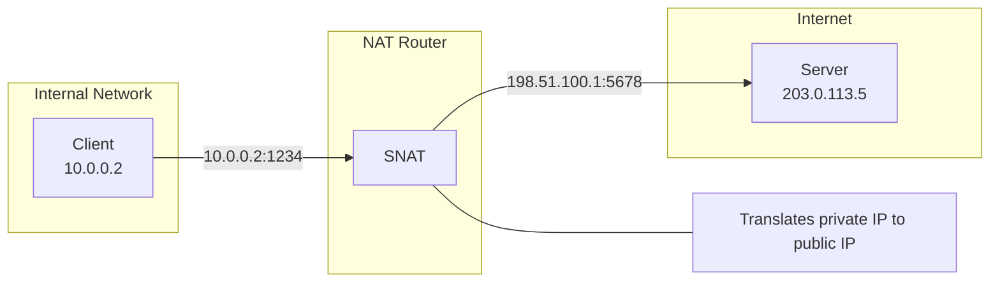

#### 2. Destination NAT（DNAT）

Destination NATは、パケットの宛先IPアドレスを変更します。通常、パブリックインターネットからプライベートネットワーク上のサービスへアクセスする際に使用されます。

- **仕組み**: パブリックIPアドレスを内部ホストのプライベートIPアドレスに変換する
- **ユースケース**: ポートフォワーディング、ロードバランシング、インバウンド接続
- **設定**: 特定のポートまたはポート範囲のマッピングを定義する

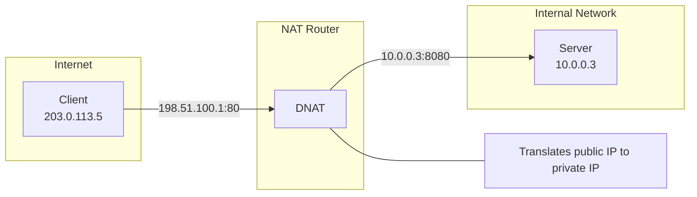

#### 3. Port Address Translation（PAT）

PATは、IPアドレスとポート番号の両方を変更します。これにより、複数の内部ホストが1つのパブリックIPアドレスを共有できます。

- **仕組み**: 内部ホストのIP:ポートの組み合わせを、単一のパブリックIPの異なるポートに変換する
- **ユースケース**: IPアドレスの節約、多数の内部ホストのサポート
- **制限**: 利用可能なポート数（約65,000）に制限される

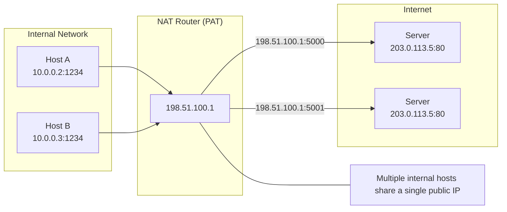

#### 4. 双方向NAT

双方向NATは、送信元アドレスと宛先アドレスの両方を変更します。これにより、ネットワークアドレス空間が重複する2つのネットワーク間で通信できます。

- **仕組み**: 双方向のアドレス変換
- **ユースケース**: ネットワーク統合、アドレス空間の競合解決
- **複雑性**: 設定とメンテナンスがより複雑

### NATの利点と欠点

#### 利点:

- **IPアドレスの節約**: 限られた数のパブリックIPアドレスで多数の内部ホストをサポートする
- **セキュリティの強化**: 内部ネットワークトポロジーを隠蔽する
- **ネットワーク分離**: アドレス空間が重複するネットワークを接続できる
- **柔軟なネットワーク設計**: 内部ネットワークを再設定せずにISPを変更できる

#### 欠点:

- **コネクショントラッキングのオーバーヘッド**: 状態テーブルの維持にリソースが必要
- **特定のプロトコルの問題**: 一部のプロトコルはNATと互換性がない場合がある
- **エンドツーエンド接続性の喪失**: 直接的なピアツーピア通信が困難になる
- **複雑なトラブルシューティング**: NAT関連の問題のデバッグは複雑になる場合がある

### KubernetesとCiliumにおけるNAT

#### KubernetesにおけるNAT

KubernetesはさまざまなシナリオでNATを使用します。

1. **クラスター外部との通信**: Podがクラスター外部と通信する際のSNAT
2. **Serviceの実装**: Cluster IP ServiceはDNATを使用してトラフィックをPodにリダイレクトする
3. **NodePort Service**: Node IP:ポートからPodへのDNAT
4. **LoadBalancer Service**: 外部ロードバランサーIPからPodへのDNAT

#### CiliumにおけるNAT

CiliumはeBPFを活用して、効率的なNAT実装を提供します。

1. **eBPFベースのNAT**: カーネル内で直接NATを実行する
2. **高性能なコネクショントラッキング**: 最適化されたBPFマップを使用した接続状態の追跡
3. **NATポリシー**: きめ細かなNATルールを定義できる
4. **マスカレーディング**: Podからクラスター外部への通信に対する自動SNAT

#### Cilium NAT設定例:

```yaml
apiVersion: v1
kind: ConfigMap
metadata:
  name: cilium-config
  namespace: kube-system
data:
  # Enable masquerading for communication outside the cluster
  enable-ipv4-masquerade: "true"

  # Use eBPF-based masquerading
  enable-bpf-masquerade: "true"

  # NAT map size setting
  bpf-nat-global-max: "262144"

  # Exclude specific CIDRs from masquerading
  ipv4-masquerade-exclude-cidr: "10.0.0.0/8,172.16.0.0/12,192.168.0.0/16"
```

## ルーティングプロトコル

ルーティングプロトコルは、ネットワーク内でパケットが送信元から宛先まで移動する最適な経路を決定するルールと手順を定義します。これらのプロトコルは、ネットワークトポロジーの変更への適応、トラフィックの効率的な転送、ネットワーク障害の回避において重要な役割を果たします。

### ルーティングプロトコルの分類

#### 1. Interior Gateway Protocols（IGP）

Interior Gateway Protocolsは、単一のAutonomous System（AS）内でルーティング情報を交換するために使用されます。

##### Distance Vectorプロトコル

- **RIP（Routing Information Protocol）**
  - ホップ数をメトリックとして使用する
  - 最大15ホップの制限
  - 実装が簡単で、小規模ネットワークに適している
  - 30秒ごとにルーティングテーブル全体を更新する

- **EIGRP（Enhanced Interior Gateway Routing Protocol）**
  - 帯域幅、遅延、負荷、信頼性を考慮した複合メトリック
  - 差分更新のみを送信する
  - 高速な収束
  - Cisco独自プロトコル（以前は）

##### Link Stateプロトコル

- **OSPF（Open Shortest Path First）**
  - Dijkstraのアルゴリズムを使用して最短経路を計算する
  - エリアベースの階層構造
  - 高速な収束
  - 大規模ネットワークをサポートする
  - Link State Advertisement（LSA）を通じてトポロジー情報を交換する

- **IS-IS（Intermediate System to Intermediate System）**
  - OSPFに類似したLink Stateプロトコル
  - 大規模なサービスプロバイダーネットワークで広く使用される
  - 複数のネットワークレイヤーをサポートする
  - 効率的なルーティング更新

#### 2. Exterior Gateway Protocols（EGP）

Exterior Gateway Protocolsは、異なるAutonomous System間でルーティング情報を交換するために使用されます。

- **BGP（Border Gateway Protocol）**
  - インターネットの中核ルーティングプロトコル
  - パスベクタープロトコル
  - ポリシーベースのルーティング決定
  - TCP上の信頼性の高いセッション
  - パス属性（ASパス、ローカルプリファレンスなど）による経路選択
  - iBGP（内部BGP）およびeBGP（外部BGP）のバリアント

### コンテナネットワーキングにおけるルーティングプロトコル

コンテナ環境では、従来のルーティングプロトコルがコンテナ固有のルーティングメカニズムとともに使用されます。

#### 1. BGPを使用したコンテナネットワーキング

BGPは、以下の理由からコンテナネットワーキングで人気が高まっています。

- **直接ルーティング**: オーバーレイのオーバーヘッドなしにPod IPを直接ルーティングする
- **スケーラビリティ**: 大規模クラスターおよびマルチクラスター環境をサポートする
- **既存ネットワークとの統合**: データセンターのネットワークインフラストラクチャと統合する
- **高可用性**: 複数経路と高速フェイルオーバーをサポートする

#### 2. コンテナネットワークのルーティングメカニズム

- **ホストベースルーティング**: 各Nodeが自身のPod CIDRのルーティング情報をアドバタイズする
- **集中型ルーティング**: コントローラーがルーティング決定を一元管理する
- **分散型ルーティング**: Node間でルーティング情報を直接交換する
- **ポリシーベースルーティング**: トラフィック特性に基づくルーティング決定

### Ciliumにおけるルーティング

CiliumはeBPFを使用して効率的なルーティングを実装し、さまざまなルーティングモードをサポートします。

#### 1. ネイティブルーティング（直接ルーティング）

ネイティブルーティングモードでは、Ciliumはオーバーレイカプセル化なしにPod IPを直接ルーティングします。

- **仕組み**: 各Nodeが自身のPod CIDRのルーティング情報をアドバタイズする
- **利点**: カプセル化のオーバーヘッドがなく、最適なパフォーマンス
- **要件**: Node間にルーティング可能なネットワークが必要
- **ユースケース**: パフォーマンスが重要なワークロード、単一サブネットのクラスター

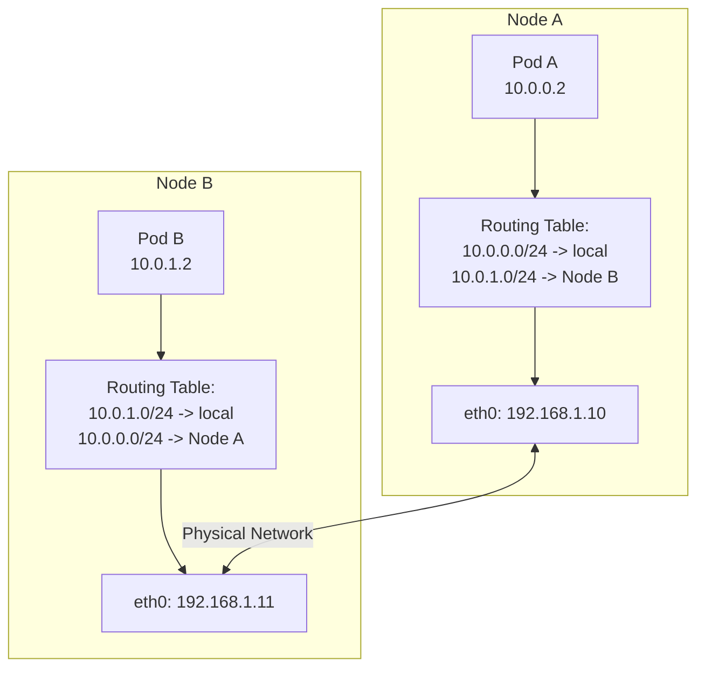

#### 2. BGPルーティング

Ciliumは、Pod IPを物理ネットワークインフラストラクチャと統合するためのBGPルーティングをサポートします。

- **仕組み**: CiliumはBGPピアリングを通じてPod CIDRをアドバタイズする
- **利点**: 既存ネットワークインフラストラクチャとの統合、高可用性
- **コンポーネント**: BGPピアリング、ルートフィルタリング、コミュニティ属性
- **ユースケース**: データセンターネットワークとの統合、マルチクラスター環境

#### 3. オーバーレイルーティング

Ciliumは、VXLANやGeneveなどのオーバーレイプロトコルを使用して、Node間でPodトラフィックをルーティングできます。

- **仕組み**: Node間で送信するためにPodパケットをカプセル化する
- **利点**: ネットワークインフラストラクチャの要件を最小化し、柔軟なデプロイを実現する
- **ユースケース**: クラウド環境、複雑なネットワークトポロジー

#### 4. ハイブリッドルーティング

Ciliumは、直接ルーティングとオーバーレイルーティングを組み合わせるハイブリッドアプローチをサポートします。

- **仕組み**: 可能な場合は直接ルーティングを使用し、それ以外ではオーバーレイを使用する
- **利点**: パフォーマンスと柔軟性のバランス
- **ユースケース**: 混在ネットワーク環境、クラウドおよびオンプレミスのデプロイ

### Ciliumルーティング設定例

#### ネイティブルーティング設定:

```yaml
apiVersion: v1
kind: ConfigMap
metadata:
  name: cilium-config
  namespace: kube-system
data:
  tunnel: "disabled"
  enable-auto-direct-node-routes: "true"
  ipv4-native-routing-cidr: "10.0.0.0/16"
```

#### BGPルーティング設定:

```yaml
apiVersion: v1
kind: ConfigMap
metadata:
  name: cilium-config
  namespace: kube-system
data:
  tunnel: "disabled"
  enable-bgp: "true"
  bgp-announce-pod-cidr: "true"
  bgp-config-path: "/var/lib/cilium/bgp/config.yaml"
```

#### オーバーレイルーティング設定:

```yaml
apiVersion: v1
kind: ConfigMap
metadata:
  name: cilium-config
  namespace: kube-system
data:
  tunnel: "vxlan"
  enable-ipv4: "true"
  ipv4-range: "10.0.0.0/16"
```

## DNSとサービスディスカバリー

DNS（Domain Name System）とサービスディスカバリーは、特に動的なコンテナ環境において、現代のネットワークアプリケーションで重要な役割を果たします。これらのメカニズムはサービスの場所を抽象化し、アプリケーションがネットワークトポロジーの変更に適応できるようにします。

### DNS（Domain Name System）

DNSは、人間が判読できるドメイン名をIPアドレスに変換する分散システムです。

#### DNSの仕組み

1. **階層型名前空間**: ドメイン名はドットで区切られた階層構造で構成される（例: www.example.com）
2. **分散データベース**: 世界中に分散したDNSサーバーのネットワーク
3. **反復クエリと再帰クエリ**: クライアントリクエストを処理する2つの主な方法
4. **キャッシュ**: パフォーマンス向上のための結果の一時保存

#### DNSレコードの種類

- **Aレコード**: ドメイン名をIPv4アドレスにマッピングする
- **AAAAレコード**: ドメイン名をIPv6アドレスにマッピングする
- **CNAMEレコード**: ドメイン名のエイリアス（正規名）
- **MXレコード**: メールサーバーを指定する
- **SRVレコード**: 特定のサービスを提供するサーバーを指定する
- **TXTレコード**: テキスト情報を保存する（主に検証およびポリシーで使用）
- **PTRレコード**: IPアドレスからドメイン名への逆引きマッピング（逆引きDNS）

#### DNS名前解決プロセス

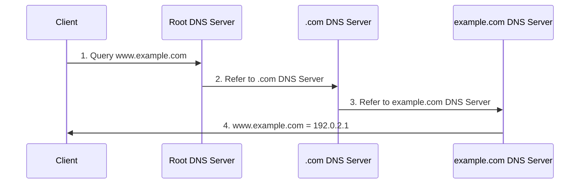

### コンテナ環境におけるサービスディスカバリー

サービスディスカバリーとは、利用可能なサービスを自動的に検出し、ネットワーク上の場所を特定するプロセスです。コンテナ環境では、動的に作成・削除されるサービスを効果的に管理するうえで特に重要です。

#### サービスディスカバリーのアプローチ

1. **DNSベースのサービスディスカバリー**
   - Serviceが登録されるとDNSレコードを作成する
   - クライアントは標準DNSルックアップを通じてServiceを検出する
   - シンプルで広くサポートされている
   - 例: Kubernetes DNS、CoreDNS

2. **Key-Value Storeベースのサービスディスカバリー**
   - 一元化されたKey-Value StoreにService情報を保存する
   - クライアントはStoreをクエリしてServiceを検出する
   - 豊富なメタデータをサポートする
   - 例: etcd、Consul、ZooKeeper

3. **APIベースのサービスディスカバリー**
   - 専用APIを通じてService情報を提供する
   - クライアントはAPIを呼び出してServiceを検出する
   - 複雑なクエリとフィルタリングをサポートする
   - 例: Kubernetes API Server

4. **メッシュベースのサービスディスカバリー**
   - サービスメッシュインフラストラクチャがサービスディスカバリーを処理する
   - クライアント側のロードバランシングとルーティングをサポートする
   - 高度なトラフィック管理機能
   - 例: Istio、Linkerd

### KubernetesにおけるDNSとサービスディスカバリー

Kubernetesは、クラスター内のサービスディスカバリーのための組み込みメカニズムを提供します。

#### Kubernetes Services

Kubernetes Servicesは、Podの集合に安定したエンドポイントを提供します。

- **ClusterIP**: クラスター内からのみアクセス可能な仮想IP
- **NodePort**: すべてのNode上の特定ポートを通じてアクセス可能
- **LoadBalancer**: 外部ロードバランサーを通じてアクセス可能
- **ExternalName**: 外部ServiceのDNSエイリアス

#### Kubernetes DNS

Kubernetesは、サービスディスカバリーをサポートするためにクラスターDNSサービス（通常はCoreDNS）を実行します。

- **Service DNS**: `<service-name>.<namespace>.svc.cluster.local`
- **Pod DNS**: `<pod-ip>.<namespace>.pod.cluster.local`
- **Headless Services**: Service名がすべてのPod IPのDNSレコードに解決される

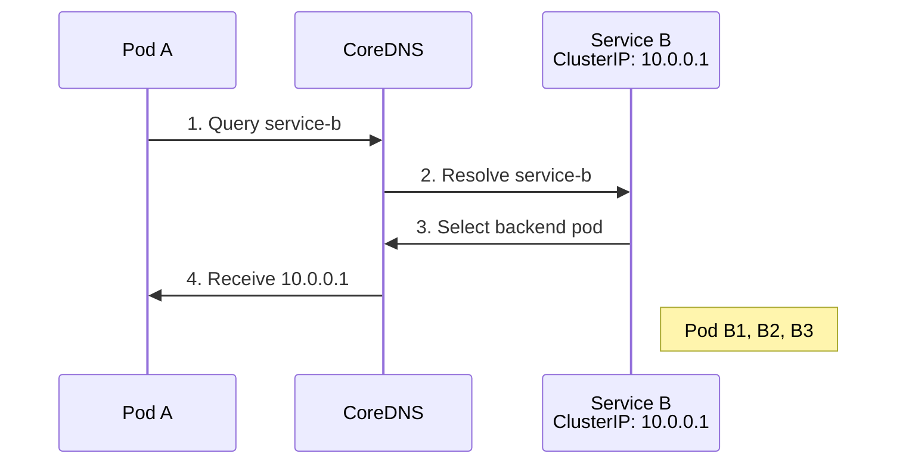

#### Kubernetesサービスディスカバリーメカニズム

1. **環境変数**: アクティブなServiceの環境変数が各Podに挿入される
2. **DNS**: クラスターDNSによるService名の名前解決
3. **API Server**: Kubernetes APIを直接クエリしてService情報を取得する
4. **Endpointオブジェクト**: ServiceバックエンドPodのIPおよびポート情報を提供する

### CiliumにおけるDNSとサービスディスカバリー

CiliumはKubernetesのサービスディスカバリーメカニズムと統合し、追加機能を提供します。

#### CiliumのDNSベースポリシー

CiliumはDNS名に基づいてネットワークポリシーを定義できます。

- **DNS名ベースのフィルタリング**: 特定のドメイン名に対するアクセス制御
- **ワイルドカードサポート**: `*.example.com`のようなパターンマッチング
- **FQDNポリシー**: Fully Qualified Domain Name（FQDN）に基づくポリシー

```yaml
apiVersion: "cilium.io/v2"
kind: CiliumNetworkPolicy
metadata:
  name: "dns-policy"
spec:
  endpointSelector:
    matchLabels:
      app: myapp
  egress:
  - toFQDNs:
    - matchName: "api.example.com"
    - matchPattern: "*.api.example.com"
```

#### Ciliumのサービスディスカバリー拡張

Ciliumは、Kubernetesのサービスディスカバリーを強化する複数の機能を提供します。

1. **eBPFベースのService実装**:
   - kube-proxy置換
   - カーネル内での直接Serviceロードバランシング
   - パフォーマンスと機能の向上

2. **グローバルService**:
   - 複数クラスターにまたがるサービスディスカバリー
   - クラスター間ロードバランシング
   - 統合されたService名前空間

3. **Serviceアフィニティ**:
   - セッションアフィニティのサポート
   - 送信元IPに基づく一貫したバックエンド選択
   - ステートフル接続のサポート

4. **ヘルスチェック統合**:
   - バックエンドのヘルス監視
   - 非正常なバックエンドの自動削除
   - 障害の高速検出と回復

#### Cilium Service設定例:

```yaml
apiVersion: v1
kind: ConfigMap
metadata:
  name: cilium-config
  namespace: kube-system
data:
  # Enable kube-proxy replacement
  enable-k8s-services: "true"
  kube-proxy-replacement: "strict"

  # Enable DNS policy support
  enable-fqdn-filter: "true"

  # Configure service affinity
  enable-session-affinity: "true"

  # Enable global services
  enable-global-services: "true"
```

## ロードバランシングの概念

ロードバランシングは、ネットワークトラフィックを複数のサーバーまたはバックエンドServiceに分散して、リソース使用率を最適化し、スループットを向上させ、レイテンシーを削減し、高可用性を確保する技術です。コンテナ環境では、動的に変化するバックエンドインスタンス間でトラフィックを効果的に分散することが特に重要です。

### ロードバランシングの種類

#### 1. L4（トランスポート層）ロードバランシング

L4ロードバランシングは、IPアドレスやポート番号などのトランスポート層情報に基づいてトラフィックを分散します。

- **仕組み**: TCP/UDPヘッダー情報に基づくルーティング決定
- **利点**: 高速処理、低オーバーヘッド、暗号化されたトラフィックを処理可能
- **欠点**: アプリケーション層情報に基づく高度なルーティングを実行できない
- **ユースケース**: TCP/UDPベースのService、高性能要件

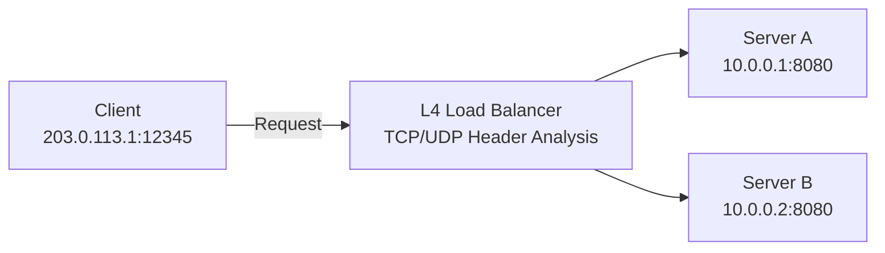

#### 2. L7（アプリケーション層）ロードバランシング

L7ロードバランシングは、HTTPヘッダー、URL、Cookieなどのアプリケーション層情報に基づいてトラフィックを分散します。

- **仕組み**: HTTP/HTTPSリクエスト内容を検査してルーティングを決定する
- **利点**: コンテンツベースのルーティング、高度なトラフィック管理、セキュリティ機能
- **欠点**: より高い処理オーバーヘッド、暗号化トラフィックにはSSL終端が必要
- **ユースケース**: Webアプリケーション、マイクロサービス、API Gateway

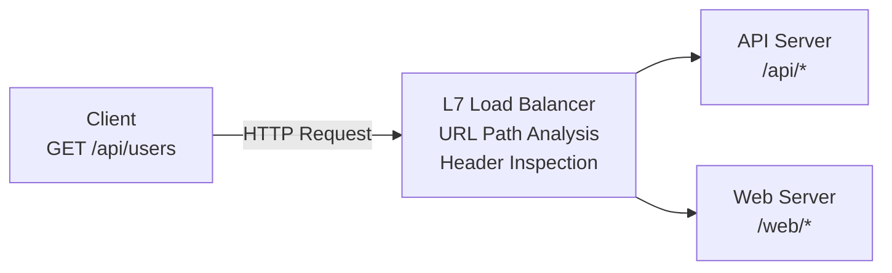

### ロードバランシングアルゴリズム

ロードバランシングアルゴリズムは、バックエンドサーバーへのトラフィックの分散方法を決定します。

#### 1. ラウンドロビン

- **仕組み**: 各バックエンドサーバーに順番にリクエストを分散する
- **利点**: 実装が簡単で、均等に分散できる
- **欠点**: サーバー容量の違いや現在の負荷を考慮しない
- **バリアント**: Weighted Round Robin（サーバー容量に基づいて重みを適用）

#### 2. 最小接続数

- **仕組み**: アクティブな接続数が最も少ないサーバーに新しいリクエストを転送する
- **利点**: サーバー負荷を考慮し、長時間接続に有効
- **欠点**: 接続数が常に負荷を正確に反映するとは限らない
- **バリアント**: Weighted Least Connections（サーバー容量に基づいて重みを適用）

#### 3. IPハッシュ

- **仕組み**: クライアントIPアドレスをハッシュ化して一貫したバックエンドサーバー選択を行う
- **利点**: セッション永続性を提供し、同じクライアントを同じサーバーにルーティングする
- **欠点**: 分散が不均一になる可能性や、特定のサーバーが過負荷になる可能性がある
- **バリアント**: Source-Destination IP Hash（送信元IPと宛先IPの両方を考慮）

#### 4. 最小応答時間

- **仕組み**: 応答時間が最も短いサーバーにリクエストを転送する
- **利点**: パフォーマンスと可用性を考慮し、レイテンシーに敏感なアプリケーションに適している
- **欠点**: 応答時間の測定オーバーヘッド、ネットワーク変動の影響を受ける
- **バリアント**: Weighted Response Time（サーバー容量と応答時間の両方を考慮）

#### 5. ランダム選択

- **仕組み**: バックエンドサーバーをランダムに選択する
- **利点**: 実装が簡単で、特別な状態追跡が不要
- **欠点**: 分散が不均一になる可能性がある
- **バリアント**: Weighted Random Selection（サーバー容量に基づいて確率を調整）

### ロードバランサーのデプロイモデル

#### 1. ハードウェアロードバランサー

- **特徴**: 専用の物理機器
- **利点**: 高性能、信頼性、専用ハードウェアアクセラレーション
- **欠点**: コスト、スケーラビリティの制限、柔軟性の欠如
- **例**: F5 BIG-IP、Citrix ADC、A10 Networks

#### 2. ソフトウェアロードバランサー

- **特徴**: 汎用サーバー上で動作するソフトウェア
- **利点**: 柔軟性、コスト効率、プログラマビリティ
- **欠点**: 一般にハードウェアロードバランサーより低性能
- **例**: NGINX、HAProxy、Envoy

#### 3. クラウドロードバランサー

- **特徴**: クラウドプロバイダーが管理するサービス
- **利点**: 管理オーバーヘッドの削減、自動スケーリング、高可用性
- **欠点**: ベンダーロックイン、カスタマイズの制限
- **例**: AWS ELB/ALB/NLB、Google Cloud Load Balancing、Azure Load Balancer

#### 4. コンテナネイティブロードバランサー

- **特徴**: コンテナ環境向けに最適化されたロードバランシング
- **利点**: コンテナオーケストレーションとの統合、動的なサービスディスカバリー
- **欠点**: コンテナ環境に特化している
- **例**: Kubernetes Services、Istio、Cilium

### Kubernetesにおけるロードバランシング

Kubernetesは複数レベルのロードバランシングを提供します。

#### 1. Serviceロードバランシング

- **ClusterIP**: クラスター内部のロードバランシング
- **NodePort**: Nodeポートを通じた外部アクセス
- **LoadBalancer**: 外部ロードバランサーのプロビジョニング
- **ExternalName**: 外部ServiceのDNSエイリアス

#### 2. Ingress Controller

- L7ロードバランシングとルーティング
- URLベースのルーティング、SSL終端、認証
- さまざまな実装: NGINX、Traefik、HAProxy、Istio

#### 3. サービスメッシュ

- マイクロサービス間の高度なトラフィック管理
- きめ細かなルーティング、トラフィック分割、障害注入
- 例: Istio、Linkerd、Consul Connect

### Ciliumにおけるロードバランシング

CiliumはeBPFを使用して効率的なロードバランシングを実装します。

#### 1. eBPFベースのロードバランシング

- **kube-proxy置換**: カーネル内での直接Serviceロードバランシング
- **パフォーマンス向上**: ネットワークスタックのバイパスによるレイテンシー削減
- **スケーラビリティ**: 大規模なServiceとエンドポイントをサポートする
- **コネクショントラッキングの最適化**: 効率的な状態管理

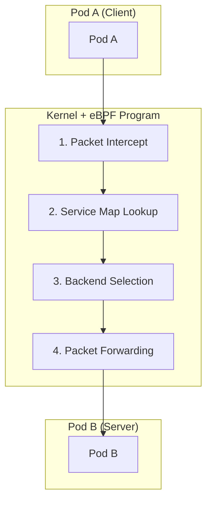

#### 2. ロードバランシングアルゴリズム

Ciliumはさまざまなロードバランシングアルゴリズムをサポートします。

- **ラウンドロビン**: デフォルトアルゴリズム、均等な分散
- **Maglev**: 送信元IPに基づく一貫したバックエンド選択
- **セッションアフィニティ**: クライアントIPに基づく永続的な接続
- **Maglev Timeout**: 指定時間後の再分散

#### 3. L7ロードバランシング

CiliumはL7（アプリケーション層）ロードバランシングもサポートします。

- **HTTPヘッダーベースのルーティング**: 特定のヘッダー値に基づくルーティング
- **URLパスベースのルーティング**: URLパターンに基づくトラフィック分散
- **gRPCルーティング**: gRPCメソッドとメタデータに基づくルーティング
- **Kafkaルーティング**: Kafkaトピックとメッセージキーに基づくルーティング

#### 4. グローバルServiceロードバランシング

Ciliumは複数のクラスターにまたがるロードバランシングをサポートします。

- **クラスター間ロードバランシング**: 複数クラスターにまたがるバックエンド間のトラフィック分散
- **ロケーション認識ルーティング**: レイテンシーと場所を考慮したバックエンド選択
- **フェイルオーバー**: クラスター障害時の自動フェイルオーバー

#### Ciliumロードバランシング設定例:

```yaml
apiVersion: v1
kind: ConfigMap
metadata:
  name: cilium-config
  namespace: kube-system
data:
  # Enable kube-proxy replacement
  kube-proxy-replacement: "strict"

  # Configure load balancing algorithm
  load-balancing-algorithm: "maglev"
  maglev-hash-seed: "Cilium"
  maglev-table-size: "16381"

  # Configure session affinity
  enable-session-affinity: "true"

  # Enable L7 load balancing
  enable-l7-proxy: "true"
```

## ネットワークセキュリティの基礎

ネットワークセキュリティとは、ネットワークインフラストラクチャ、アプリケーション、データを、不正アクセス、悪用、障害、改変から保護する実践です。コンテナ環境では、その動的かつ分散的な性質により、ネットワークセキュリティはさらに重要です。

### 主要なネットワークセキュリティ概念

#### 1. 多層防御

多層防御は、単一のセキュリティメカニズムの障害がシステム全体のセキュリティ侵害につながらないよう、複数のセキュリティレイヤーを実装するアプローチです。

- **複数のセキュリティレイヤー**: ネットワーク、ホスト、アプリケーション、データレベルでの保護
- **冗長な制御**: さまざまなセキュリティメカニズムの組み合わせ
- **障害分離**: 1つのレイヤーの障害が他のレイヤーに影響しない
- **脅威検出と対応**: 各レイヤーでの監視と対応

#### 2. 最小権限の原則

最小権限の原則は、ユーザー、プロセス、またはアプリケーションに、タスクの実行に必要な最小限の権限だけを付与するセキュリティプラクティスです。

- **きめ細かなアクセス制御**: 必要なリソースへのアクセスのみに制限する
- **権限分離**: さまざまな機能に対する権限の分離
- **デフォルト拒否**: 明示的に許可されていないすべてのアクセスを拒否する
- **定期的なレビュー**: 権限の定期的な監査と調整

#### 3. ネットワークセグメンテーション

ネットワークセグメンテーションは、ネットワークをより小さなセグメントまたはゾーンに分割して、セキュリティを強化し、脅威の横方向の移動を制限する技術です。

- **セキュリティゾーン**: 類似したセキュリティ要件を持つシステムをグループ化する
- **マイクロセグメンテーション**: ワークロードレベルでのきめ細かな制御
- **境界保護**: ゾーン間のトラフィックの制御と監視
- **脅威分離**: 侵害による影響範囲を制限する

#### 4. 暗号化

暗号化は、権限のない当事者がデータを読み取れないように変換するプロセスです。

- **転送中の暗号化**: ネットワーク上を移動するデータを保護する（例: TLS/SSL）
- **保存時の暗号化**: ディスクまたはデータベースに保存されたデータを保護する
- **エンドツーエンド暗号化**: 通信経路全体でデータを保護する
- **キー管理**: 暗号化キーの安全な生成、保存、ローテーション

### コンテナネットワーキングのセキュリティ脅威

コンテナ環境には、特有のセキュリティ上の課題があります。

#### 1. ネットワークベースの攻撃

- **DDoS（Distributed Denial of Service）攻撃**: 大量のトラフィックによりServiceの可用性を妨害する
- **ポートスキャン**: 開放ポートと脆弱性を探索する
- **ARPスプーフィング**: Address Resolution Protocolを操作してネットワークトラフィックを傍受する
- **DNSポイズニング**: DNSルックアップを悪意のある宛先へリダイレクトする

#### 2. アプリケーション層の攻撃

- **SQLインジェクション**: 悪意のあるSQLコードを挿入する
- **XSS（Cross-Site Scripting）**: クライアント側スクリプトを挿入する
- **CSRF（Cross-Site Request Forgery）**: 認証済みユーザーを通じて悪意のある操作を実行する
- **コマンドインジェクション**: 悪意のある入力によりシステムコマンドを実行する

#### 3. コンテナ固有の脅威

- **イメージの脆弱性**: 脆弱なコンポーネントを含むコンテナイメージ
- **権限昇格**: コンテナからホストへの権限昇格
- **横方向の移動**: あるコンテナから別のコンテナへの不正アクセス
- **Volume Mountの悪用**: 機密性の高いホストパスへのアクセス

### ネットワークセキュリティ制御

#### 1. ファイアウォール

ファイアウォールは、定義されたセキュリティルールに基づいてネットワークトラフィックをフィルタリングするネットワークセキュリティシステムです。

- **パケットフィルタリング**: IPアドレス、ポート、プロトコルに基づくフィルタリング
- **ステートフルインスペクション**: 接続状態を追跡するコンテキストベースの判断
- **アプリケーション層フィルタリング**: アプリケーションプロトコルの理解と検査
- **次世代ファイアウォール（NGFW）**: 高度な脅威検出および防止機能

#### 2. 侵入検知・防止システム（IDS/IPS）

IDS/IPSは、ネットワークトラフィックを監視し、悪意のある活動を検出またはブロックするシステムです。

- **シグネチャベースの検出**: 既知の攻撃パターンとの照合
- **異常検出**: 通常の動作から逸脱する活動の識別
- **動作監視**: 不審な活動パターンの分析
- **自動対応**: 検出された脅威へのリアルタイム対応

#### 3. ネットワークポリシー

ネットワークポリシーは、ネットワーク内で許可される通信を定義するルールセットです。

- **Ingress制御**: 受信トラフィックの制限
- **Egress制御**: 送信トラフィックの制限
- **きめ細かなポリシー**: ワークロードレベルの通信制御
- **ラベルベースのポリシー**: 動的な環境での柔軟なポリシー適用

#### 4. 暗号化プロトコル

暗号化プロトコルは、ネットワーク上で安全な通信を提供します。

- **TLS/SSL**: WebトラフィックおよびAPI通信の保護
- **IPsec**: ネットワーク層の暗号化
- **WireGuard**: モダンで効率的なVPNプロトコル
- **mTLS（mutual TLS）**: クライアントとサーバーの両方を認証する

### Kubernetesにおけるネットワークセキュリティ

Kubernetesは、コンテナ化されたアプリケーションのネットワークセキュリティのために複数のメカニズムを提供します。

#### 1. ネットワークポリシー

Kubernetes Network Policyは、Pod間の通信を制御する仕様です。

- **Pod Selector**: ラベルに基づいてポリシーの対象となるPodを選択する
- **Ingressルール**: 受信トラフィックを制御する
- **Egressルール**: 送信トラフィックを制御する
- **CIDRベースのルール**: IP範囲に基づくフィルタリング

```yaml
apiVersion: networking.k8s.io/v1
kind: NetworkPolicy
metadata:
  name: api-allow
spec:
  podSelector:
    matchLabels:
      app: api
  ingress:
  - from:
    - podSelector:
        matchLabels:
          app: frontend
    ports:
    - protocol: TCP
      port: 8080
  egress:
  - to:
    - podSelector:
        matchLabels:
          app: database
    ports:
    - protocol: TCP
      port: 5432
```

#### 2. サービスメッシュセキュリティ

サービスメッシュは、マイクロサービス間の通信を管理および保護するインフラストラクチャレイヤーです。

- **mTLS**: Service間の暗号化通信
- **認証と認可**: Service IDの検証とアクセス制御
- **トラフィックポリシー**: きめ細かなルーティングとアクセス制御
- **可観測性**: Service間通信の可視性

#### 3. セキュリティコンテキスト

セキュリティコンテキストは、Podとコンテナの権限およびアクセス制御の設定を定義します。

- **権限の制限**: 非rootユーザーとして実行する
- **Capabilityの制限**: 必要なLinux Capabilityのみを許可する
- **読み取り専用ファイルシステム**: 変更不能なコンテナファイルシステム
- **seccompとAppArmor**: システムコールとアプリケーション動作を制限する

### Ciliumのネットワークセキュリティ機能

CiliumはeBPFを活用して、強力なネットワークセキュリティ機能を提供します。

#### 1. IDベースのセキュリティ

Ciliumは、IPアドレスではなくワークロードIDに基づいてセキュリティポリシーを適用します。

- **ラベルベースのポリシー**: 動的な環境で一貫したセキュリティを実現する
- **Service Accountベースのポリシー**: Kubernetes Service Accountに基づくアクセス制御
- **DNSベースのポリシー**: FQDNに基づくEgress制御
- **API認識型セキュリティ**: HTTPメソッドとパスに基づくフィルタリング

#### 2. 透過的な暗号化

Ciliumは、アプリケーションを変更せずにネットワークトラフィックを暗号化できます。

- **IPsec**: Node間トラフィックのネットワーク層暗号化
- **WireGuard**: モダンで効率的な暗号化プロトコル
- **透過的な統合**: アプリケーションを変更せずに暗号化を適用する
- **キーのローテーション**: 暗号化キー管理を自動化する

#### 3. 脅威検出と可視性

Ciliumは、ネットワークアクティビティの詳細な可視性と脅威検出機能を提供します。

- **Hubble**: ネットワークフローの監視と分析
- **フローログ**: Pod間通信の詳細なログ
- **異常検出**: 異常なネットワークパターンの識別
- **セキュリティイベントアラート**: ポリシー違反および攻撃試行に対するアラート

#### 4. L3-L7ポリシー適用

Ciliumは、ネットワーク層からアプリケーション層まで包括的なポリシー適用を提供します。

- **L3/L4ポリシー**: IPおよびポートベースのフィルタリング
- **L7 HTTPフィルタリング**: URL、メソッド、ヘッダーベースの制御
- **L7 gRPCフィルタリング**: gRPCメソッドとメタデータベースの制御
- **L7 Kafkaフィルタリング**: Kafkaトピックとメッセージベースの制御

#### Ciliumネットワークセキュリティ設定例:

```yaml
apiVersion: "cilium.io/v2"
kind: CiliumNetworkPolicy
metadata:
  name: "secure-api"
spec:
  endpointSelector:
    matchLabels:
      app: api
  ingress:
  - fromEndpoints:
    - matchLabels:
        app: frontend
    toPorts:
    - ports:
      - port: "8080"
        protocol: TCP
      rules:
        http:
        - method: "GET"
          path: "/api/v1/products"
  egress:
  - toEndpoints:
    - matchLabels:
        app: database
    toPorts:
    - ports:
      - port: "5432"
        protocol: TCP
  - toFQDNs:
    - matchName: "api.external-service.com"
    toPorts:
    - ports:
      - port: "443"
        protocol: TCP
```

### ネットワークセキュリティのベストプラクティス

#### 1. デフォルト拒否ポリシー

- 明示的に許可されたトラフィックのみを許可するデフォルト拒否ポリシーを実装する
- 必要な通信経路のみを開放する
- 定期的なポリシーレビューと不要なルールの削除
- ポリシー変更の監査証跡を維持する

#### 2. 多層防御アプローチ

- 複数のセキュリティレイヤーを実装する
- ネットワーク、ホスト、アプリケーションレベルの保護を組み合わせる
- さまざまなセキュリティメカニズムによる冗長な制御
- 単一障害点を排除する

#### 3. 最小権限ネットワーキング

- 必要最小限のネットワークアクセスのみを許可する
- Serviceごとにきめ細かなポリシーを定義する
- 不要なポートとプロトコルをブロックする
- 定期的なアクセスレビューと調整

#### 4. 継続的な監視と監査

- ネットワークトラフィックとポリシー違反を監視する
- 異常と潜在的な脅威を検出する
- セキュリティイベントに対するアラートと対応
- 定期的なセキュリティ監査と脆弱性評価

## クイズ

この章で学んだ内容をテストするには、[トピッククイズ](../../quizzes/networking/cilium/networking-concepts-quiz.md)に挑戦してください。
