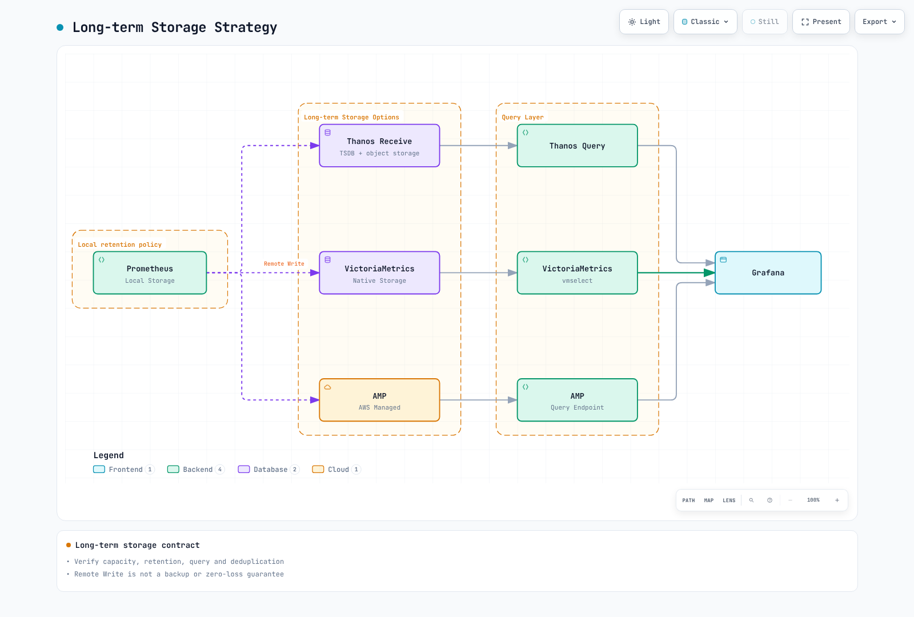
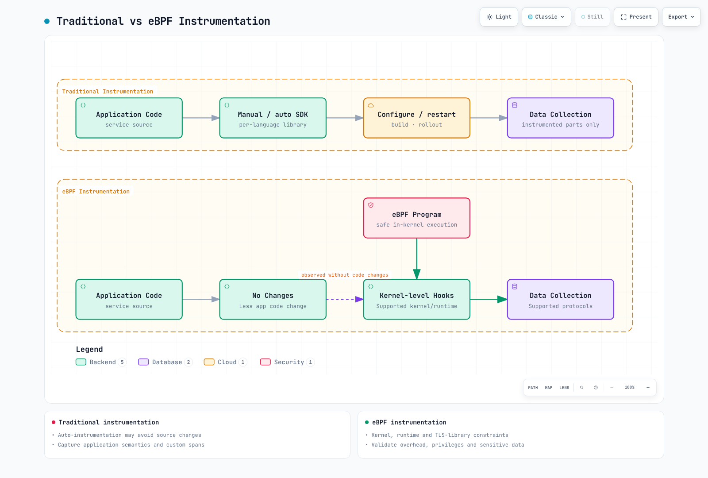
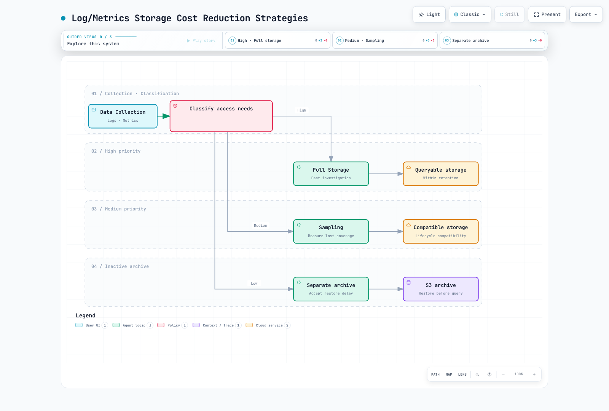
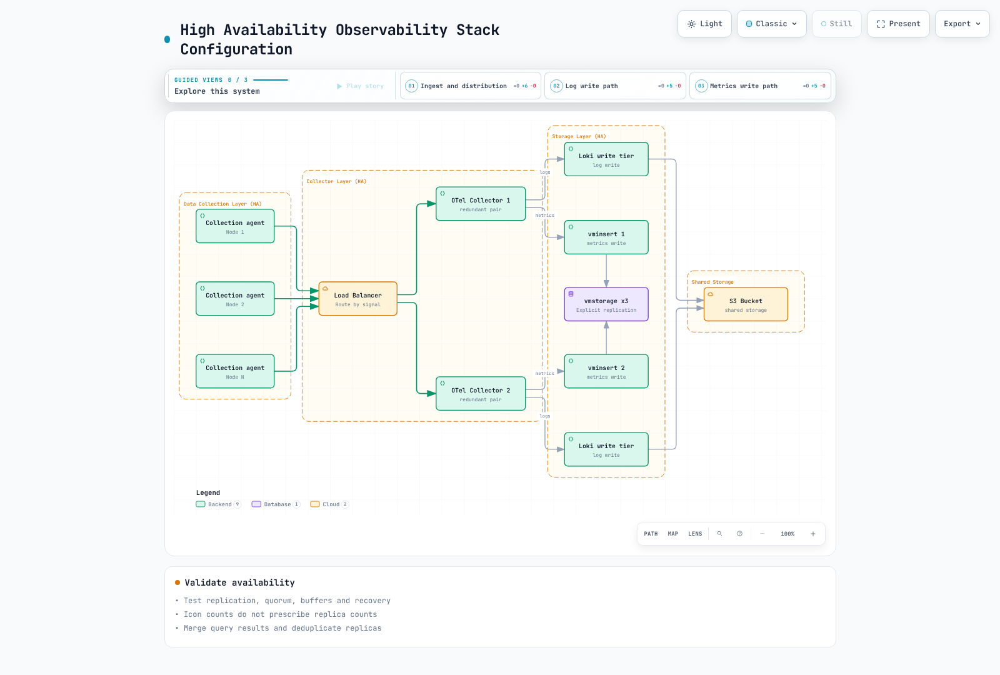
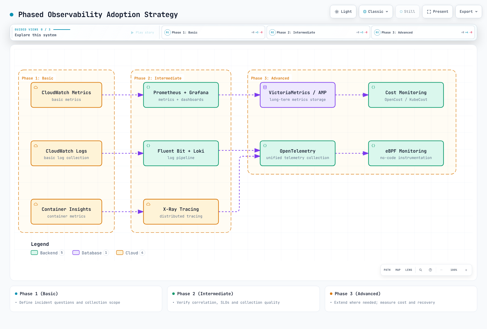

# EKS Observability 最適化ガイド

> **検証済みのサンプルバージョン**: Prometheus 3.14.0 · OTel Collector Contrib 0.160.0 · Alertmanager 0.34.0 · OpenCost 1.121.2/chart 2.5.31

> **最終更新**: September 13, 2026

インシデント時の問い、収集品質、計測されたコストを中心に Observability を最適化します。ノード数だけでは、取り込み量、クエリ負荷、保持コスト、必要な人員を予測できません。この章では、[完全な設定例](https://github.com/Atom-oh/kubernetes-docs/tree/main/examples/observability/optimization)を使用し、クラスターのインストールについてはデプロイメントガイドにリンクします。ネイティブテストでは合成データを使用します。これらは本番のキャパシティベンチマークではありません。

<span id="table-of-contents"></span>

## 目次

- [1. Observability の 3 つの柱の概要](#1-overview-of-the-three-pillars-of-observability)
- [2. Logging ソリューションの比較](#2-logging-solution-comparison)
- [3. Metrics の収集と保存](#3-metrics-collection-and-storage)
- [4. 分散トレーシング](#4-distributed-tracing)
- [5. eBPF ベースのノーコードモニタリング](#5-ebpf-based-no-code-monitoring)
- [6. コストモニタリング](#6-cost-monitoring)
- [7. 統合 Observability ダッシュボード](#7-unified-observability-dashboard)
- [8. 運用上の課題と解決策](#8-operational-challenges-and-solutions)
- [9. ベストプラクティスと次のステップ](#9-best-practices-and-next-steps)

<span id="_1-1-relationship-between-logging-metrics-and-tracing"></span>

<span id="_1-2-role-of-each-pillar-and-selection-criteria"></span>

<span id="_1-3-overall-eks-observability-architecture"></span>

<span id="1-overview-of-the-three-pillars-of-observability"></span>

## 1. Observability の 3 つの柱の概要

Logs はイベントを記述し、metrics は時間経過に伴う振る舞いを要約し、traces は計装されたリクエストパスを記述します。trace がない、またはダッシュボードが静かであることは、Service が健全であることの証明にはなりません。collector のドロップ、キュー、export の失敗、scrape の健全性を同じ運用ビューに含めます。


[🔍 インタラクティブな図を表示](https://www.atomai.click/kubernetes-docs/archmaps/en-observability-09-observability-optimization-0.html)

metrics には上限のある service/route/status ラベルを使用し、高カーディナリティの request ID は適切に制御された logs/traces に格納します。trace は必ずしも完全ではありません。計装、propagation、sampling、保持のすべてが影響します。


[🔍 インタラクティブな図を表示](https://www.atomai.click/kubernetes-docs/archmaps/en-observability-09-observability-optimization-1.html)

agent と gateway の責務は異なります。node agent はローカル logs を読み取り、gateway は一元化されたポリシーを適用できます。tail sampling には trace affinity が必要であり、任意の DaemonSet replica をランダムな load balancer の背後に配置しても正しく実行できません。

<span id="_2-1-log-storage-comparison"></span>

<span id="_2-2-log-agent-comparison"></span>

<span id="_2-3-fluent-bit-loki-configuration-example-for-eks"></span>

<span id="2-logging-solution-comparison"></span>

## 2. Logging ソリューションの比較

| Backend | 有用な特性 | コストと運用上の制約 |
|---|---|---|
| CloudWatch Logs | マネージドの取り込み、保持、Logs Insights | Region、log class、取り込み、ストレージ、クエリスキャン、quota |
| OpenSearch | インデックス化された検索と分析 | プロビジョニング済み/サーバーレスのキャパシティ、インデックス作成、replica、ストレージ、クエリ負荷 |
| Loki | ラベルインデックス化された logs、LogQL、object storage | コンピューティング、cache、object request、保持、query fanout、運用 |
| ClickHouse | SQL 分析、schema、圧縮の選択肢 | コンピューティング、ストレージ、replication、取り込み schema、クエリチューニング |

どの選択肢も、普遍的に最速または最安というわけではありません。同じ入力量、圧縮、保持、可用性、クエリレイテンシ、サポート範囲で比較してください。object storage の料金だけでは、Loki や Tempo の総コストにはなりません。マネージドサービスにも quota があります。

### Agent と container log の形式

Fluent Bit、Fluentd、Vector は、plugin、言語、buffering、デプロイメントモデルが異なります。「15 MB」や「毎秒 200K メッセージ」といった固定的な主張には、再現可能なワークロード、バージョン、ハードウェアが必要です。record サイズ、parser コスト、retry、backpressure を測定してください。

最新の EKS containerd logs は CRI framing を使用します。Docker JSON parser を無条件に適用したり、`/var/lib/docker/containers` が存在すると仮定したりしないでください。サポートされる container/CRI parser を使用し、複数行メッセージを処理し、host logs は読み取り専用で mount し、offset/buffer は別の書き込み可能な場所に保存します。Kubernetes metadata enrichment には対応する ServiceAccount/RBAC が必要です。ConfigMap だけでは collector はデプロイされません。

Loki ラベルは cluster、namespace、service などの安定した次元に制限します。すべての Pod ラベルを自動コピーすると、stream が爆発的に増えることがあります。現在の完全な profile については、[collector ガイド](./logging/05-collectors.md)と [Loki ガイド](./logging/01-loki.md)に従ってください。インストール前に、対象の Service、schema、storage、IAM、network control を確認します。

### Filtering はパーセンテージ sampling ではない

JSON を `level` フィールドに parse した後、Fluent Bit filter のフラグメントで正確な DEBUG/TRACE レベルを除外できます。

```ini
[FILTER]
    Name     grep
    Match    application.*
    Exclude  level ^(DEBUG|TRACE)$
```

このフラグメントには、対応する input/parser/output pipeline が必要です。任意のメッセージテキストに「DEBUG」が含まれるだけで record を破棄しないでください。Fluent Bit の throttle `Rate` と `Window` は、10% の確率 sampler ではなく、移動ウィンドウの rate limit を実装します。filtering の前に、ドロップした record を測定し、インシデント/監査要件を維持してください。

CloudWatch では、文書化された `cloudwatch_logs` オプションを使用します。`log_format json` と古い `max_batch_size`/`max_batch_put_limit` のスニペットは、有効な汎用 JSON-output/batching 設定ではありません。plugin が batching を処理するため、pin されたバージョンのオプションを確認してください。group 作成時に使用する `log_retention_days` 設定は、既存のすべての group の保持を確立するものではありません。

<span id="_3-1-metrics-storage-comparison"></span>

<span id="_3-2-cardinality-management-strategy"></span>

<span id="_3-3-improving-query-performance-with-recording-rules"></span>

<span id="_3-4-long-term-storage-strategy"></span>

<span id="3-metrics-collection-and-storage"></span>

## 3. Metrics の収集と保存

Prometheus にはローカル TSDB storage があります。sharding、remote write、query/aggregation layer により、そのデプロイメントモデルを拡張できます。VictoriaMetrics の single-node 製品と cluster 製品は、可用性と replication の特性が異なります。AMP はマネージドですが、workspace quota と設定可能な保持期間があります。これらはいずれも、無制限の保持、「3 つの storage Pod」からの自動 replication、またはすべての拡張 query で同一のセマンティクスを意味するものではありません。

### 無関係な metrics をドロップしない cardinality 管理

サンプルの `prometheus.yaml` は、1 つの既知の histogram の選択した bucket だけをドロップします。non-histogram metrics、`_sum`、`_count`、SLO bucket の `le="0.5"`、および `+Inf` は保持します。

```yaml
- source_labels:
  - __name__
  - le
  regex: lab_http_request_duration_seconds_bucket;(0\.005|0\.01|0\.025|0\.05|0\.25)
  action: drop
```

`.*_bucket;...` だけにマッチする `action: keep` は、マッチしないすべての metric と、多くの場合 `+Inf` も削除します。histogram bucket を変更すると quantile の精度に影響します。可能な場合は計装 schema を優先し、SLO で必要な bucket を保持してください。Prometheus 3 は classic histogram の `le` 値を正規化します。たとえば `1` は `1.0` になります。実際に取り込まれたラベルにマッチさせてください。

`relabel_configs` は scrape 前に検出された target を変更し、`metric_relabel_configs` は scrape された sample を変更します。ラベルを削除しても sample は集約されず、重複 series が発生する可能性があります。discovery の `__meta_*` ラベルは、自動的に永続的な sample ラベルになるわけではありません。source でラベルを減らし、残ったラベルセットが一意であることを確認してください。

### Recording rule と保持

繰り返しの計算には、`service`、`cluster`、namespace key が一貫した recording rule を使用します。node-exporter は通常、target を `instance` で識別します。追加されていない `node` ラベルで group 化しないでください。collector 自体の診断に必要な metrics を、すべての `go_.*` または `promhttp_.*` family とともに無条件にドロップしてはいけません。



[🔍 インタラクティブな図を表示](https://www.atomai.click/kubernetes-docs/archmaps/en-observability-09-observability-optimization-2.html)

remote-write queue は backup でも、lossless delivery の保証でもありません。WAL/queue のキャパシティ、retry 動作、authentication、network interruption、receiver の上限を計画してください。Thanos sidecar/block upload architecture は、ここで示す Thanos Receive path とは異なります。

Prometheus Operator では、`replicas: 2` と `shards: 3` は 6 つの Prometheus Pod を意味します。6 つすべてに対する PVC と memory を予算化し、selector を設定し、shard をマージして HA replica を deduplicate する query layer を提供してください。deduplicate されていない remote-write receiver に送る 2 つの replica は、データを二重計上する可能性があります。CRD field とサポートされている専用 query 設定を pin された operator に照らして検証してください。競合する汎用 argument を追加しないでください。

<span id="_4-1-opentelemetry-overview-and-architecture"></span>

<span id="_4-2-tracing-backend-comparison"></span>

<span id="_4-3-sampling-strategies"></span>

<span id="_4-4-otel-collector-daemonset-configuration-for-eks"></span>

<span id="4-distributed-tracing"></span>

## 4. 分散トレーシング

Tempo は trace-ID lookup に加え、TraceQL もサポートしています。Jaeger 2 は明示的に選択された storage を持つ OTel ベースの architecture を使用します。X-Ray は AWS backend です。古い SDK version を普遍的なものとして扱うのではなく、現在の OTel/ADOT integration ガイダンスを使用してください。trace 単位と S3 の価格だけを比較するのではなく、取り込み、query、storage、運用を考慮します。


[🔍 インタラクティブな図を表示](https://www.atomai.click/kubernetes-docs/archmaps/en-observability-09-observability-optimization-3.html)

### Sampling と affinity

head sampling は、完全な request outcome が判明する前に決定します。collector の probabilistic sampling も telemetry が collector に到達した後に発生し、SDK の head decision と同じではありません。tail sampling は、すでに upstream でドロップされた span を回復できません。

デフォルトの `trace-complete` strategy では、`decision_wait` は受信した span に対する timer-based decision を制御します。これは、すべての span が到着したことや trace が完了したことを証明しません。1 つの trace ID のすべての span を同じ sampler に route してください。buffer は、到着 rate × wait time に burst と span-size の headroom を加えてサイズ設定します。capacity overflow、巨大な trace、restart、遅延した span により、すべての error trace を保持するという保証が損なわれる場合があります。

loopback 専用の `collector-tail-local.yaml` は、EKS manifest ではなく合成デモです。これは 1,000-trace buffer、2 秒の decision wait、192 MiB の memory-limiter 設定を使用します。本番値は測定された traces と container memory の headroom に基づいて調整してください。ポリシーは次のとおりです。

```yaml
decision_wait: 2s
num_traces: 1000
maximum_trace_size_bytes: 1048576
policies:
- name: errors
  type: status_code
  status_code:
    status_codes:
    - ERROR
- name: slow
  type: latency
  latency:
    threshold_ms: 1000
- name: baseline
  type: probabilistic
  probabilistic:
    sampling_percentage: 10
```

これらの positive policy では、マッチする error/slow trace は保持され、その他の trace は probabilistic policy の対象になります。これは、全体の volume が 90% 削減されることを意味しません。drop/composite/inverted policy には異なる decision semantics があります。「最初にマッチした rule が勝つ」と一般化しないでください。この例では、特定の名前が付いた `sensitive_data` span attribute だけを削除します。export 前に、明示的な data policy を通じて span name、event、resource attribute、application log を sanitization してください。

cluster deployment については、[OTel ガイド](./tracing/03-opentelemetry.md)と [observability stack lab](../labs/observability/02-observability-stack-lab.md)を使用してください。Operator injection annotation には、Operator、対応する `Instrumentation` resource、サポートされた runtime image、workload の restart が必要です。OTLP HTTP/4318 と gRPC/4317、TLS/authentication を一致させてください。annotation だけで instrumentation がインストールされるわけではありません。

<span id="_5-1-why-ebpf-monitoring"></span>

<span id="_5-2-coroot-automatic-service-maps-and-latency-analysis"></span>

<span id="_5-3-pixie-now-new-relic-kubernetes-specific-observability"></span>

<span id="_5-4-cilium-hubble-network-flow-observation"></span>

<span id="_5-5-kepler-energy-consumption-monitoring"></span>

<span id="5-ebpf-based-no-code-monitoring"></span>

## 5. eBPF ベースのノーコードモニタリング



[🔍 インタラクティブな図を表示](https://www.atomai.click/kubernetes-docs/archmaps/en-observability-09-observability-optimization-4.html)

eBPF は、サポートされる protocol、kernel、runtime において source の変更を減らすことができます。business semantics、すべての language/library、またはすべての TLS traffic を自動的に capture するわけではありません。uprobe はサポートされる library boundary で plaintext を観測することがありますが、これは汎用的な TLS decryption ではありません。privilege、機微な payload の capture、kernel compatibility、測定された overhead を評価してください。SDK auto-instrumentation も application source の変更を回避できますが、restart/configuration が必要になる場合があります。

| Tool | 現在のデプロイメントに関する考慮事項 |
|---|---|
| Coroot | 従来の `coroot/coroot` chart は非推奨です。文書化された Operator/Coroot CR flow を使用してください。operator chart 0.9.10 と CE chart 0.3.3 は別の component です。agent の privilege、storage、authentication を確認します。 |
| Pixie | kernel/protocol prerequisite と control-plane の選択肢を持つ open-source project です。in-cluster storage であっても export された query/result が不可能になるわけではありません。実際の access と data path を確認してください。 |
| Cilium Hubble | 対応する Cilium deployment が必要です。flow visibility、L7 policy/proxy coverage、有効化された metrics は異なります。application 全体の distributed tracing の代替ではありません。 |
| Kepler | version 0.10+ で古い 0.7 architecture が書き換えられました。現在の metrics と deployment prerequisite は異なります。古い privileged/BPF DaemonSet をコピーしないでください。 |

Kepler 0.11.4 では、`pod_namespace`/`pod_name` を持つ `kepler_pod_cpu_watts` や `kepler_pod_cpu_joules_total` などの CPU metrics が文書化されています。hardware energy access と attribution は実際の host で機能する必要があります。通常の virtual EKS node が host RAPL data を公開する保証はありません。測定精度を主張する前に、release の deployment および hardware support documentation を参照してください。

```promql
# A watts gauge already measures power.
sum by (pod_namespace) (kepler_pod_cpu_watts)

# J/s = W; multiplying by 1000 would give milliwatts.
rate(kepler_pod_cpu_joules_total[5m])
```

readiness や実行中の exporter は、正しい hardware measurement を確立するものではありません。EKS Auto Mode と Fargate には異なる host-access constraint があります。特権 node agent をあらゆる場所に適用するのではなく、サポートされる instrumentation を確認してください。authentication と network access を設定するまで、Hubble/Coroot/OpenCost UI は private に保ってください。

<span id="_6-1-kubecost-opencost-installation-and-configuration"></span>

<span id="_6-2-cost-allocation-by-namespace-team"></span>

<span id="_6-3-cloudwatch-cost-optimization"></span>

<span id="_6-4-log-metrics-storage-cost-reduction-strategies"></span>

<span id="6-cost-monitoring"></span>

## 6. コストモニタリング

### OpenCost と allocation

`opencost-values.yaml` は chart 2.5.31/app 1.121.2 を対象とし、既存の Prometheus を選択して Cloud Cost ingestion を無効化します。endpoint は、workload/resource と cost data を含む OpenCost が必要とする metrics を含むものに置き換えてください。単に到達可能であるだけでは不十分です。保護された Prometheus endpoint には、承認済みの authentication/CA handling を設定してください。

```bash
helm repo add opencost https://opencost.github.io/opencost-helm-chart
helm repo update opencost
helm upgrade --install opencost opencost/opencost --version 2.5.31   -n opencost --create-namespace -f opencost-values.yaml
kubectl -n opencost port-forward service/opencost 9003:9003 --address 127.0.0.1
# In another terminal:
curl --fail --get http://127.0.0.1:9003/allocation/compute   --data-urlencode 'window=7d' --data-urlencode 'aggregate=namespace'
```

7 日間のリクエスト出力には、十分な input history が必要です。allocation estimate は AWS invoice ではありません。`team`、`cost-center`、cluster、namespace ラベルを標準化し、idle/shared-cost allocation を定義したうえで、CUR/Data Exports、credit、discount、amortization と比較してください。AWS Cloud Cost reconciliation には、サポートされる `cloudIntegrationSecret` 形式、CUR/Athena/S3 prerequisite、scope を限定した identity permission が必要です。古い `exporter.aws.athenaProjectID` フラグメントのようなサポートされていない値では、その integration は確立されません。AWS access key を values file に置かないでください。

### Retention と archive の安全性

retention を変更する前に log group を inventory します。

```bash
aws logs describe-log-groups --log-group-name-prefix /eks/production/   --query 'logGroups[].{name:logGroupName,retention:retentionInDays,storedBytes:storedBytes}'   --output json
```

承認済みの retention policy を、infrastructure configuration を通じて明示的に選択した group に適用してください。`storedBytes == 0` は log group が未使用であることを意味しません。subscription、producer、audit requirement、将来の write が依存している場合があります。「空の」group を一括削除したり、tab 区切りの CLI text を 1 行につき 1 つの log-group name として扱ったりしないでください。



[🔍 インタラクティブな図を表示](https://www.atomai.click/kubernetes-docs/archmaps/en-observability-09-observability-optimization-5.html)

アクティブな Loki/Tempo block を無条件に Glacier に transition しないでください。backend は即時 read を必要とすることがあり、archive された object をオンデマンドで restore するとは限りません。backend の retention/compaction を object lifecycle rule と調整し、retrieval をテストしてください。compression、filtering、retention による節約は重複します。独立しているかのようにそのパーセンテージを加算しないでください。

<span id="_7-1-grafana-based-unified-dashboard-configuration"></span>

<span id="_7-2-log-metrics-trace-correlation-exemplars"></span>

<span id="_7-3-alerting-strategy-preventing-alert-fatigue"></span>

<span id="_7-4-slo-sli-based-monitoring"></span>

<span id="7-unified-observability-dashboard"></span>

## 7. 統合 Observability ダッシュボード

対応する `prometheus`、`loki`、`tempo` UID、現在の `tracesToLogsV2`、実際の HTTP/TLS endpoint を使用した pin 済み provisioning については、[Grafana ガイド](./grafana/README.md)を使用してください。environment variable だけでは data source は作成されません。exemplar の label name と JSON trace field は、計装済み application と一致する必要があります。

Prometheus feature switch は、`prometheus.yml` の `global.enable_features` ではなく、その command line または operator がサポートする `enableFeatures` field に置く必要があります。この例では `storage.exemplars.max_exemplars` を使用しています。exemplar storage を有効にするときは、version に適した feature flag も使用してください。application 側では、登録済み collector と OpenMetrics exposition が必要です。exemplar instrumentation で、生の request path や sample されていない/無効な trace ID を避けてください。

### Request SLO、burn rate、残りの budget

request ベースの 99.9% availability SLO では、許容される bad request は、定義された window において `total requests × 0.001` です。これは自動的に 43 分間の downtime になるわけではありません。time ベースと request ベースの SLI では denominator が異なります。

`slo-rules.yaml` は short-window error ratio と 30 日間の request-weighted ratio を分離します。

```promql
# Recent burn rate:
service:http_5xx:ratio_5m / 0.001

# Remaining 30-day request budget:
1 - service:http_5xx:ratio_30d / 0.001
```

30 日間の ratio は、最新の 5 分間 ratio ではなく、numerator と denominator に `increase(counter[30d])` を使用します。十分な history を確保し、collection gap を監視してください。exhaust した budget は負になることがあります。欠損/ゼロ traffic は完全な availability になるのではなく、未定義のままです。histogram count で割った `le="0.5"` bucket は、500 ms 以内の request の割合であり、「500 ms 未満の p99 値の割合」ではありません。

この例では、1h/5m の burn threshold 14.4 と 6h/30m の threshold 6 を組み合わせています。30 日の objective では、これらは例示的な fast/sustained burn policy であり、普遍的な severity 設定ではありません。evaluation window、traffic confidence、response policy は Service owner とともに調整してください。短い window の estimate が 1 つ threshold を超えたからといって、deployment を自動的に suspend しないでください。

### Alert routing

`alertmanager.yaml` は、現在の matcher、Asia/Seoul の off-hours、空でない cluster/node ラベルで保護された inhibition を提供します。欠損ラベルはそれ以外では等しいと比較され、無関係な alert を silence する可能性があります。その `review-only` receiver には意図的に integration がありません。何も送信せずに routing を検証します。運用で使用する前に、承認済みの contact、Secret-backed webhook/routing key、明示的な receiver policy を追加し、delivery と inhibition をテストしてください。evaluation、grouping、repeat interval、pending duration、mute schedule は異なる目的を果たします。

<span id="_8-1-responding-to-exploding-log-metrics-storage-costs"></span>

<span id="_8-2-eks-auto-mode-node-monitoring"></span>

<span id="_8-3-cross-tool-data-correlation-analysis"></span>

<span id="_8-4-maintaining-monitoring-system-performance-at-large-scale"></span>

<span id="_8-5-high-availability-observability-stack-configuration"></span>

<span id="8-operational-challenges-and-solutions"></span>

## 8. 運用上の課題と解決策


[🔍 インタラクティブな図を表示](https://www.atomai.click/kubernetes-docs/archmaps/en-observability-09-observability-optimization-6.html)

計算された p99 series 自体は exemplar metadata を保持しません。元の計装済み series から exemplar を query し、次に trace retention と log field を確認してください。データに解決されない trace link は、UI の破損ではなく sampling/retention の不一致を意味する場合があります。

EKS Auto Mode には、Kubernetes Events と node Conditions を発行する node monitoring agent が含まれます。これらの signal と node health を workload metrics とともに読み取ってください。PodMonitor は Pod と名前付き container port を選択します。node label を選択しても、node metrics が魔法のように公開されるわけではありません。CloudWatch Observability の add-on/operator は agent をインストールし、permission/configuration を必要とします。standalone ConfigMap では Container Insights は有効になりません。



[🔍 インタラクティブな図を表示](https://www.atomai.click/kubernetes-docs/archmaps/en-observability-09-observability-optimization-7.html)

collection、queue、receiver、storage、query layer で failure をテストしてください。PDB は尊重される場合に voluntary disruption を制約しますが、node loss 時の可用性を保証するものではありません。replication factor、quorum、AZ placement、stateful storage、read-path aggregation はそれぞれ別の要件です。現在の stack に、廃止された Simple Scalable/Tempo 2 ingester の例を混在させず、現在の Loki/Tempo deployment mode に従ってください。

<span id="_9-1-phased-adoption-strategy"></span>

<span id="_9-2-cost-benefit-analysis"></span>

<span id="_9-3-checklist"></span>

<span id="_9-4-related-documents-and-quizzes"></span>

<span id="9-best-practices-and-next-steps"></span>

## 9. ベストプラクティスと次のステップ



[🔍 インタラクティブな図を表示](https://www.atomai.click/kubernetes-docs/archmaps/en-observability-09-observability-optimization-8.html)

baseline を確立します。signal ごとの bytes/day、active series、新規 series churn、samples/second、spans/second、sample retention、query scan volume、retention、buffer loss、recovery time、運用努力です。現在の Region 固有の料金と、交渉済みの条件を使用してください。仮定上の月額 $5,000 の baseline と $2,500 の target では、節約を見積もる前に実際の cost category を帰属させてください。どの tool の切り替えも 50% の節約を保証しません。

一度に 1 つの測定可能な変更を rollout してください。インシデント調査の成功、SLO coverage、ドロップした data、請求額を前後で比較します。有害な filter を元に戻し、診断を復元できるだけの data を維持してください。deployment duration は permission、team experience、validation、migration に依存します。固定された「1 ～ 2 日」の schedule は確約ではありません。

### Validation と制限

ネイティブチェックでは、Prometheus configuration と 9 つの rule、実際の合成 scrape に対する選択的 bucket relabeling、30 日の request budget を含む 7 つの SLO assertion、実際の Collector tail-sampling pipeline、Alertmanager configuration、pin 済み OpenCost Helm render を対象としました。本番 workload、billing reconciliation、Kubernetes/eBPF installation、外部 notification はありませんでした。diagram/browser check は review report に個別に記録されています。

### 関連資料

- [Prometheus ガイド](./metrics/01-prometheus.md)
- [Grafana ダッシュボード](./grafana/README.md)
- [Observability 最適化クイズ](../quizzes/observability/09-observability-optimization-quiz.md)

## 参考資料

- [Collector tail sampling v0.160.0](https://github.com/open-telemetry/opentelemetry-collector-contrib/tree/v0.160.0/processor/tailsamplingprocessor)
- [Prometheus configuration](https://prometheus.io/docs/prometheus/latest/configuration/configuration/)
- [Prometheus alerting configuration](https://prometheus.io/docs/alerting/latest/configuration/)
- [AMP workspace retention configuration](https://docs.aws.amazon.com/prometheus/latest/APIReference/API_UpdateWorkspaceConfiguration.html)
- [EKS Auto Mode troubleshooting](https://docs.aws.amazon.com/eks/latest/userguide/auto-troubleshoot.html)
- [CloudWatch Observability add-on](https://docs.aws.amazon.com/eks/latest/userguide/cloudwatch.html)
- [Kepler v0.11.4](https://github.com/sustainable-computing-io/kepler/tree/v0.11.4)
- [Coroot Helm charts](https://github.com/coroot/helm-charts/tree/main/charts)
- [OpenCost Helm chart](https://github.com/opencost/opencost-helm-chart/tree/main/charts/opencost)
- [Pixie](https://github.com/pixie-io/pixie)
