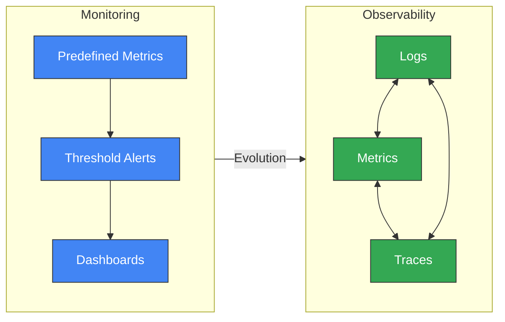
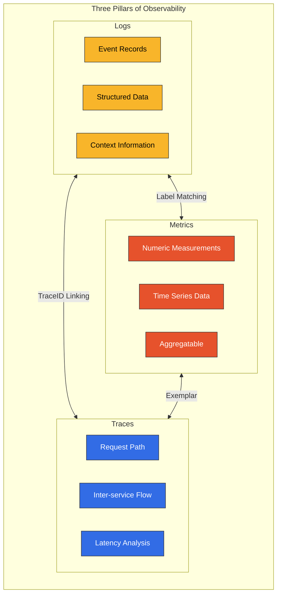
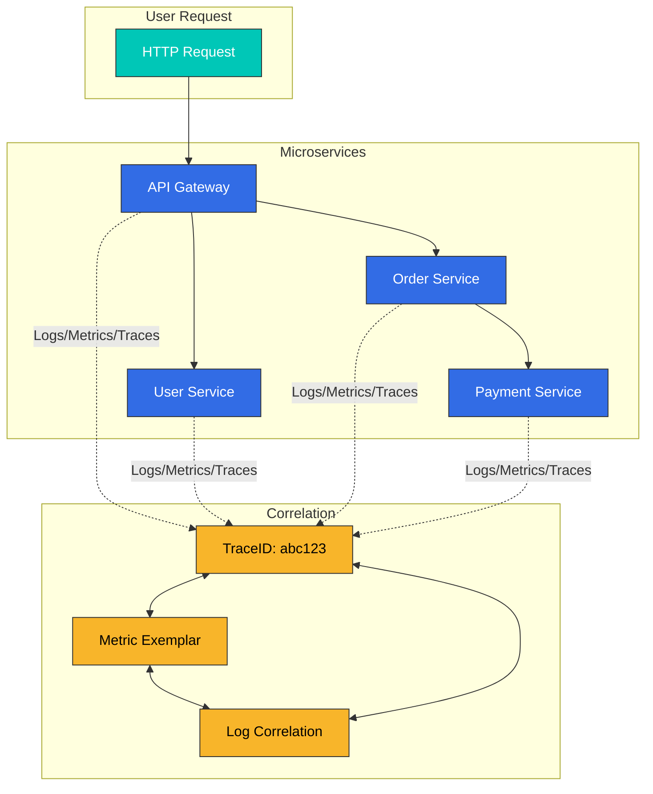
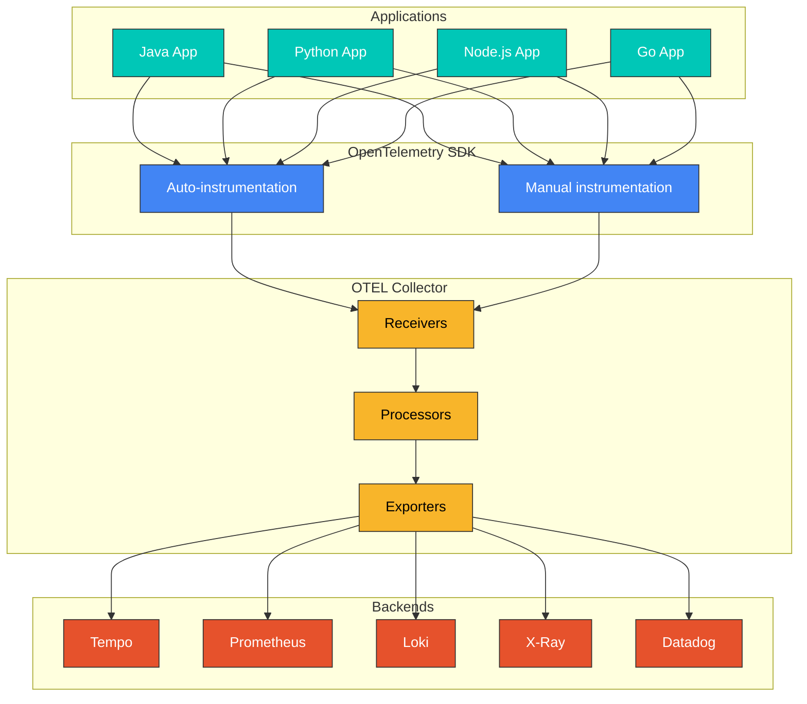
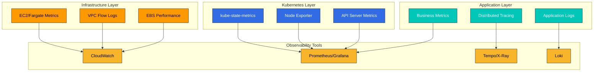
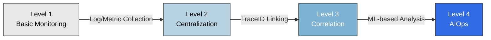

# 可観測性（Observability）の概要

> **最終更新**: February 20, 2026

## はじめに

現代の分散システム、特に Kubernetes ベースのマイクロサービスアーキテクチャでは、外部出力からシステムの内部状態を観察して理解する能力が不可欠です。これを **可観測性（Observability）** と呼びます。

## 可観測性（Observability）と Monitoring の比較

可観測性と Monitoring はしばしば同じ意味で使われますが、両者には根本的な違いがあります。

| 観点 | Monitoring | 可観測性（Observability） |
|--------|-----------|---------------|
| **アプローチ** | 事前定義された Metrics としきい値に基づく | システム出力を通じて内部状態を推論する |
| **質問の種類** | 「何が問題だったのか？」（What） | 「なぜ問題が発生したのか？」（Why） |
| **データの範囲** | 既知の問題の検出 | 未知の問題の探索 |
| **柔軟性** | 事前定義された Dashboard | 動的な Query と探索 |
| **複雑性** | 単純なシステムに適している | 複雑な分散システムに不可欠 |



## 可観測性（Observability）の 3 つの柱

可観測性は、3 種類の主要なデータで構成されます。



### 1. Logs

Logs は、システム内で発生する個々のイベントの記録です。

**特性:**
- 離散的で不変のイベント記録
- Timestamp と Context Information を含む
- 構造化（JSON）または非構造化形式
- Debugging と監査に不可欠

**ユースケース:**
- Error と Exception の追跡
- セキュリティ監査
- コンプライアンス
- 詳細な Debugging

**ツール:** Loki, Elasticsearch, CloudWatch Logs, Fluent Bit

### 2. Metrics

Metrics は、時間の経過に伴う数値測定値です。

**特性:**
- Time Series Data として保存される
- 集計および数式演算をサポートする
- 高いストレージ効率
- 傾向分析に適している

**主要な Metric の種類:**
- **Counter**: 累積的に増加する値（例: Request Count）
- **Gauge**: 現在の状態値（例: CPU 使用率）
- **Histogram**: 分布の測定値（例: Response Time）
- **Summary**: Quantile の計算

**ツール:** Prometheus, VictoriaMetrics, CloudWatch Metrics, Datadog

### 3. Traces

Traces は、分散システム全体にわたる Request の完全な経路を追跡します。

**特性:**
- Service 間の Request Flow を可視化する
- 各ステップで Latency を測定する
- Bottleneck を特定する
- 依存関係を分析する

**構成要素:**
- **Trace**: 単一の Request の完全な経路
- **Span**: 単一の作業単位
- **SpanContext**: Service 間で伝播される Context

**ツール:** Tempo, Jaeger, X-Ray, Zipkin, Datadog APM

## 3 つの柱の相関関係

3 つの柱は独立しているのではなく相互に接続されており、強力な分析機能を提供します。



### Trace と Log の相関付け

特定の Request に関連するすべての Logs を追跡するために、Logs に TraceID を含めます。

```json
{
  "timestamp": "2025-02-15T10:30:00Z",
  "level": "ERROR",
  "message": "Payment processing failed",
  "traceId": "abc123def456",
  "spanId": "789xyz",
  "service": "payment-service"
}
```

### Metric と Trace の相関付け（Exemplars）

異常発生時に Request を追跡できるよう、Metrics に TraceID をリンクします。

```yaml
# Prometheus Exemplar
http_request_duration_seconds_bucket{le="0.5"} 1000 # {traceID="abc123"}
```

## OpenTelemetry と標準化

OpenTelemetry（OTel）は、可観測性データ収集の業界標準です。



**OpenTelemetry の利点:**
- Vendor に依存しない標準
- 複数言語の SDK をサポート
- Auto-instrumentation 機能
- 複数 Backend のサポート
- 活発なコミュニティ

## EKS 環境向けの可観測性戦略

Amazon EKS で効果的な可観測性を実装するための戦略:

### 1. Layer ベースの可観測性



### 2. 推奨ツールスタック

| 機能 | Open Source | AWS Native | Commercial |
|----------|-------------|------------|------------|
| Metrics | Prometheus, VictoriaMetrics | CloudWatch, AMP | Datadog, New Relic |
| Logs | Loki, Elasticsearch | CloudWatch Logs | Splunk, Datadog |
| Traces | Tempo, Jaeger | X-Ray | Datadog APM, Dynatrace |
| 可視化 | Grafana | CloudWatch Dashboards | Datadog, Dynatrace |

### 3. コスト最適化戦略

- **Sampling**: Trace Data の Sampling によりコストを削減する
- **Retention Policies**: データ保持期間を最適化する
- **Tiered Storage**: 古いデータをより低コストなストレージに移動する
- **Aggregation**: 詳細データではなく集計データを保存する

## 可観測性成熟度モデル



| レベル | 特性 | ツール例 |
|-------|-----------------|---------------|
| レベル 1 | 基本的な Log/Metric の収集 | kubectl logs, CloudWatch |
| レベル 2 | 集中型の可観測性 | Loki, Prometheus, Grafana |
| レベル 3 | 3 つの柱の相関付け | Tempo, Exemplars, TraceID |
| レベル 4 | AIOps、自動異常検出 | Datadog Watchdog, Dynatrace Davis |

## セクションガイド

この可観測性セクションは、以下のように構成されています。

### [Logging](./logging/)
Log の収集、保存、分析のためのツールと戦略:
- Loki: 軽量な Log 集約システム
- Fluent Bit: 高性能 Log Collector
- CloudWatch Logs: AWS Native Logging

### [Metrics](./metrics/)
Time Series Metric の収集と分析:
- Prometheus: 業界標準の Metrics システム
- VictoriaMetrics: 高性能な Prometheus 代替製品
- CloudWatch Metrics: AWS Native Metrics

### [Tracing](./tracing/)
分散 Tracing と Request Flow の分析:
- Tempo: Grafana の分散 Tracing Backend
- X-Ray: AWS Native Distributed Tracing
- OpenTelemetry: 標準化された Instrumentation
- Dynatrace: AI 搭載 APM

### [Grafana (Dashboards)](./grafana/)
統合された可視化と Dashboard:
- Data Source の統合
- Dashboard の設計パターン
- Alert の設定

## はじめに

可観測性の実装を開始するには、以下の順序を推奨します。

1. **Metric Collection を設定する**: Prometheus または VictoriaMetrics をデプロイする
2. **Log Collection を設定する**: Loki と Fluent Bit をデプロイする
3. **Tracing を設定する**: Tempo または X-Ray をデプロイする
4. **可視化**: Grafana ですべての Data Source を接続する
5. **相関付け**: TraceID ベースの Linking を設定する

## 参考資料

- [OpenTelemetry Official Documentation](https://opentelemetry.io/docs/)
- [Grafana LGTM Stack](https://grafana.com/oss/lgtm-stack/)
- [AWS Observability Best Practices](https://aws-observability.github.io/observability-best-practices/)
- [SRE Workbook - Monitoring](https://sre.google/workbook/monitoring/)
