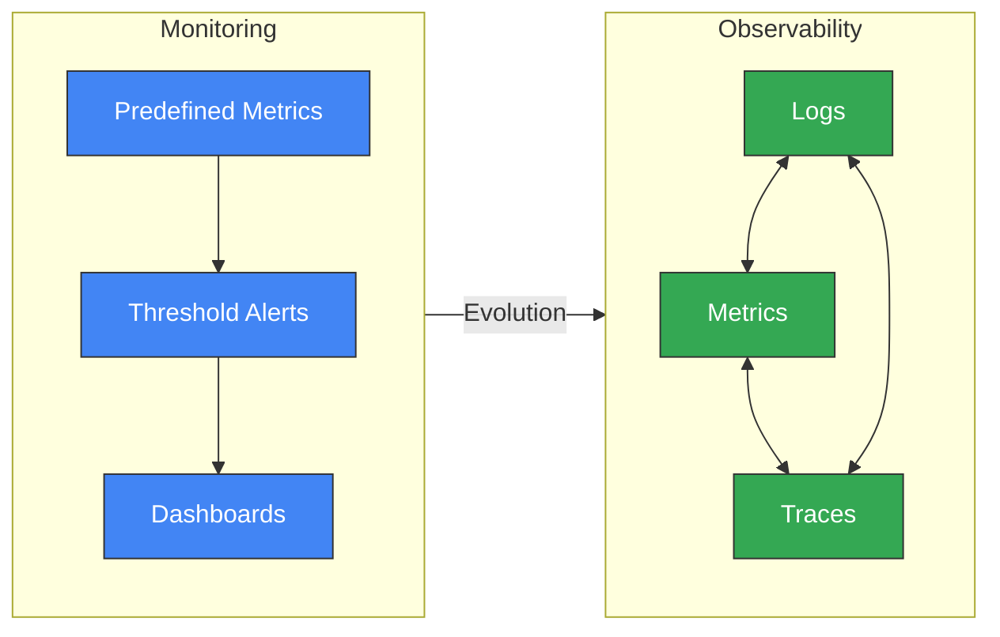
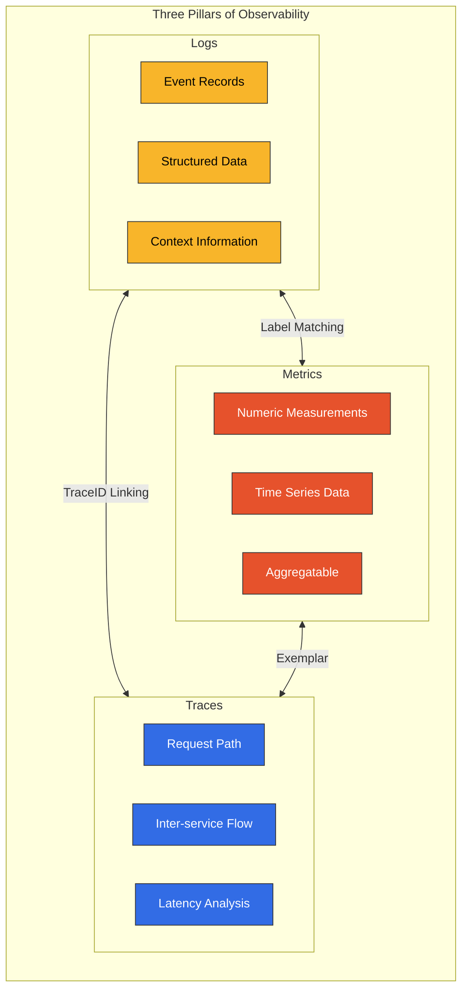
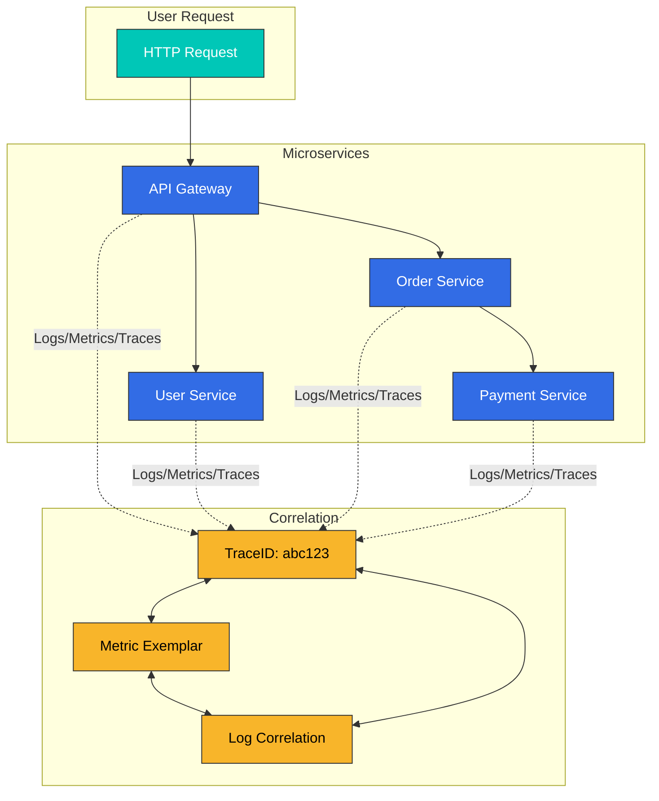
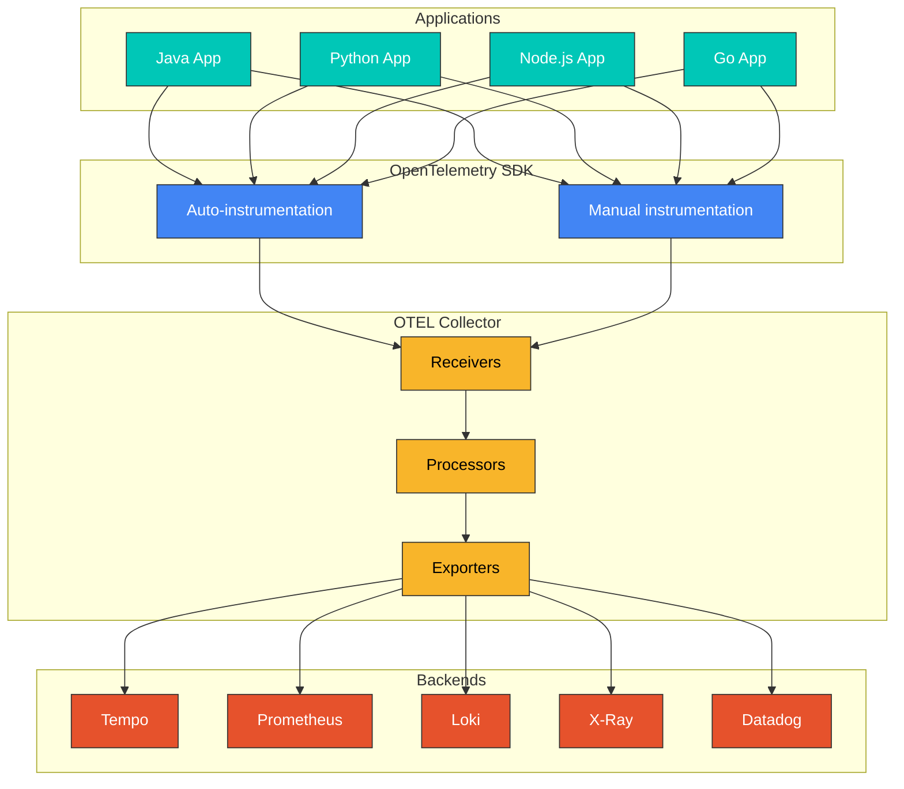
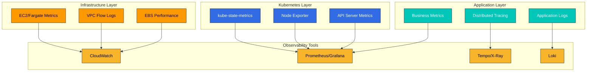
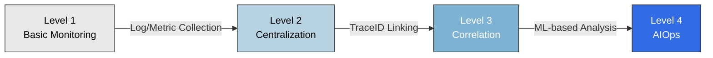

# Observability の概要

> **最終更新**: February 20, 2026

## はじめに

現代の分散システム、特に Kubernetes ベースのマイクロサービスアーキテクチャでは、外部出力からシステムの内部状態を観測・理解する能力が不可欠です。これを **Observability** と呼びます。

## Observability と Monitoring

Observability と Monitoring はしばしば同じ意味で使われますが、両者には根本的な違いがあります。

| 観点 | Monitoring | Observability |
|--------|-----------|---------------|
| **アプローチ** | 事前定義されたメトリクスとしきい値に基づく | システム出力を通じて内部状態を推論する |
| **質問の種類** | 「何が問題だったのか？」（What） | 「なぜ問題が起きたのか？」（Why） |
| **データ範囲** | 既知の問題の検出 | 未知の問題の探索 |
| **柔軟性** | 事前定義されたダッシュボード | 動的なクエリと探索 |
| **複雑性** | 単純なシステムに適している | 複雑な分散システムに不可欠 |



## Observability の 3 つの柱

Observability は 3 つの中核となるデータタイプで構成されます。



### 1. Logs

Logs は、システム内で発生する個々のイベントの記録です。

**特徴:**
- 個別かつ不変のイベント記録
- タイムスタンプとコンテキスト情報を含む
- 構造化（JSON）または非構造化形式
- デバッグと監査に不可欠

**ユースケース:**
- エラーと例外の追跡
- セキュリティ監査
- コンプライアンス
- 詳細なデバッグ

**ツール:** Loki, Elasticsearch, CloudWatch Logs, Fluent Bit

### 2. Metrics

Metrics は、時間の経過に伴う数値測定値です。

**特徴:**
- 時系列データとして保存される
- 集計および数学的演算をサポートする
- 高いストレージ効率
- 傾向分析に適している

**主要な Metric タイプ:**
- **Counter**: 累積的に増加する値（例: リクエスト数）
- **Gauge**: 現在の状態を表す値（例: CPU 使用率）
- **Histogram**: 分布の測定値（例: 応答時間）
- **Summary**: 分位数の計算

**ツール:** Prometheus, VictoriaMetrics, CloudWatch Metrics, Datadog

### 3. Traces

Traces は、分散システム全体にわたるリクエストの完全な経路を追跡します。

**特徴:**
- サービス間のリクエストフローを可視化する
- 各ステップのレイテンシーを測定する
- ボトルネックを特定する
- 依存関係を分析する

**コンポーネント:**
- **Trace**: 単一リクエストの完全な経路
- **Span**: 単一の作業単位
- **SpanContext**: サービス間で伝播されるコンテキスト

**ツール:** Tempo, Jaeger, X-Ray, Zipkin, Datadog APM

## 3 つの柱の相関関係

3 つの柱は独立しているのではなく相互に接続されており、強力な分析機能を提供します。



### Trace から Log への相関付け

特定のリクエストに関連するすべての Log を追跡するため、Logs に TraceID を含めます。

```json
{
  "timestamp": "2025-02-15T10:30:00Z",
  "level": "ERROR",
  "message": "Payment processing failed",
  "traceId": "abc123def456",
  "spanId": "789xyz",
  "service": "payment-service"
}
```

### Metric から Trace への相関付け（Exemplars）

異常発生時にリクエストを追跡できるよう、TraceID を Metrics にリンクします。

```yaml
# Prometheus Exemplar
http_request_duration_seconds_bucket{le="0.5"} 1000 # {traceID="abc123"}
```

## OpenTelemetry と標準化

OpenTelemetry（OTel）は、Observability データ収集の業界標準です。



**OpenTelemetry の利点:**
- ベンダー中立の標準
- 複数の言語 SDK をサポート
- Auto-instrumentation 機能
- 複数バックエンドのサポート
- 活発なコミュニティ

## EKS 環境向け Observability 戦略

Amazon EKS で効果的な Observability を実装するための戦略です。

### 1. レイヤーベースの Observability



### 2. 推奨ツールスタック

| 機能 | Open Source | AWS Native | 商用 |
|----------|-------------|------------|------------|
| Metrics | Prometheus, VictoriaMetrics | CloudWatch, AMP | Datadog, New Relic |
| Logs | Loki, Elasticsearch | CloudWatch Logs | Splunk, Datadog |
| Traces | Tempo, Jaeger | X-Ray | Datadog APM, Dynatrace |
| 可視化 | Grafana | CloudWatch Dashboards | Datadog, Dynatrace |

### 3. コスト最適化戦略

- **Sampling**: Trace データのサンプリングによりコストを削減する
- **Retention Policies**: データ保持期間を最適化する
- **Tiered Storage**: 古いデータをより低コストなストレージへ移動する
- **Aggregation**: 詳細データではなく集計データを保存する

## Observability 成熟度モデル



| レベル | 特徴 | ツール例 |
|-------|-----------------|---------------|
| レベル 1 | 基本的な Log/Metric 収集 | kubectl logs, CloudWatch |
| レベル 2 | 集中型 Observability | Loki, Prometheus, Grafana |
| レベル 3 | 3 つの柱の相関付け | Tempo, Exemplars, TraceID |
| レベル 4 | AIOps、自動異常検出 | Datadog Watchdog, Dynatrace Davis |

## セクションガイド

この Observability セクションは、以下のように構成されています。

### [Logging](./logging/README.md)
Log の収集、保存、分析のためのツールと戦略:
- Loki: 軽量な Log 集約システム
- Fluent Bit: 高性能な Log コレクター
- CloudWatch Logs: AWS ネイティブの Logging

### [Metrics](./metrics/README.md)
時系列 Metric の収集と分析:
- Prometheus: 業界標準の Metrics システム
- VictoriaMetrics: 高性能な Prometheus 代替
- CloudWatch Metrics: AWS ネイティブの Metrics

### [Tracing](./tracing/README.md)
分散 Tracing とリクエストフロー分析:
- Tempo: Grafana の分散 Tracing バックエンド
- X-Ray: AWS ネイティブの分散 Tracing
- OpenTelemetry: 標準化された Instrumentation
- Dynatrace: AI 搭載 APM

### [Grafana (Dashboards)](./grafana/README.md)
統合された可視化とダッシュボード:
- データソース統合
- ダッシュボード設計パターン
- アラート設定

## はじめに

Observability の実装を開始するには、次の順序が推奨されます。

1. **Metric 収集を設定する**: Prometheus または VictoriaMetrics をデプロイする
2. **Log 収集を設定する**: Loki と Fluent Bit をデプロイする
3. **Tracing を設定する**: Tempo または X-Ray をデプロイする
4. **可視化**: Grafana ですべてのデータソースを接続する
5. **相関付け**: TraceID ベースのリンクを設定する

## 参考資料

- [OpenTelemetry 公式ドキュメント](https://opentelemetry.io/docs/)
- [Grafana LGTM Stack](https://grafana.com/oss/lgtm-stack/)
- [AWS Observability ベストプラクティス](https://aws-observability.github.io/observability-best-practices/)
- [SRE Workbook - Monitoring](https://sre.google/workbook/monitoring/)
