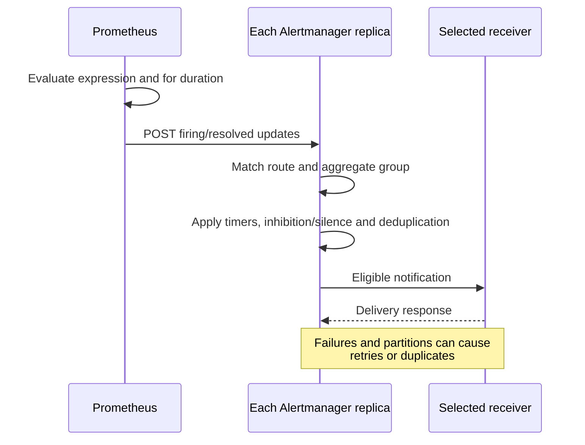
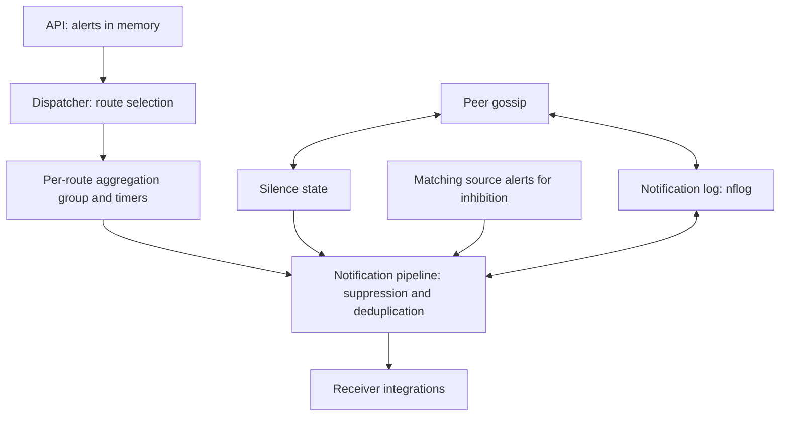
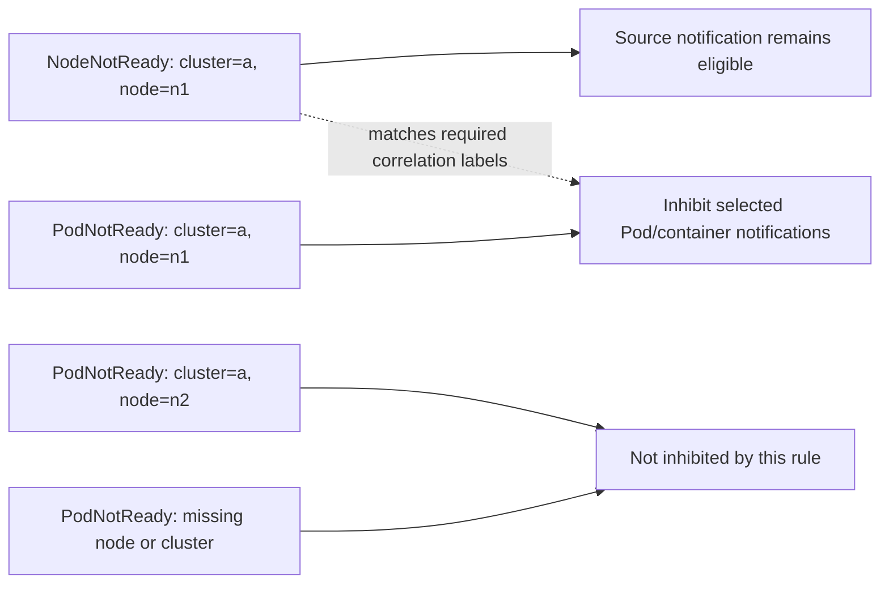
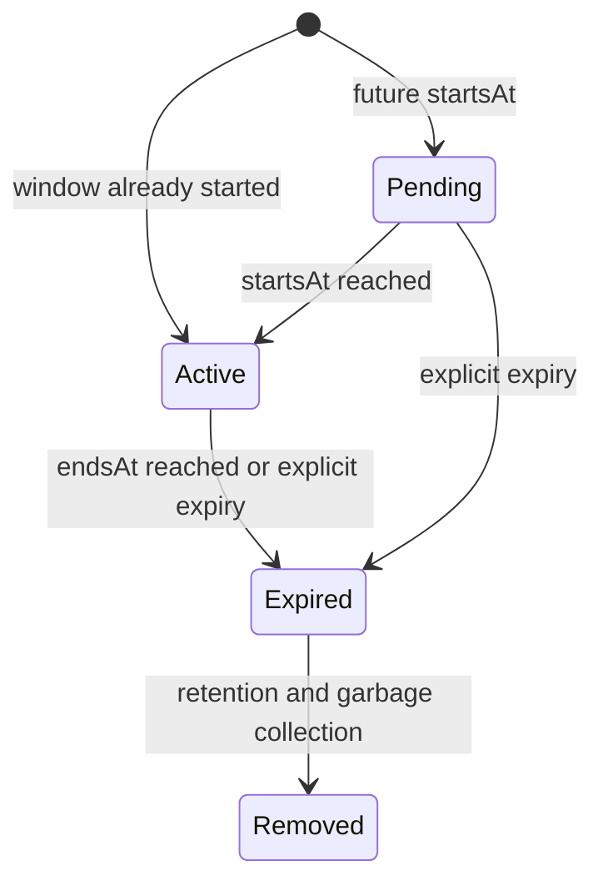

# Prometheus Alertmanager

> **レビュー基準**: Alertmanager 0.34.0; kube-prometheus-stack 90.0.0 / Operator 0.93.1; standalone chart 1.43.1
> **最終更新**: September 13, 2026

## 目次

- [Alertmanager の概要](#alertmanager-overview)
- [アーキテクチャ](#architecture)
- [インストールと設定](#installation-and-configuration)
- [Alert Rule の定義](#defining-alert-rules)
- [ルーティング設定](#routing-configuration)
- [Receiver の設定](#receiver-configuration)
- [Inhibition Rule](#inhibition-rules)
- [Silence](#silencing)
- [Template のカスタマイズ](#template-customization)
- [高可用性設定](#high-availability-configuration)
- [AlertmanagerConfig CRD](#alertmanagerconfig-crd)
- [本番用 Alert Rule の例](#production-alert-rule-examples)
- [トラブルシューティング](#troubleshooting)

---

<span id="alertmanager-overview"></span>

## Alertmanager の概要

Prometheus Alertmanager は、Prometheus server から送信された Alert を処理するコンポーネントです。Alert の重複排除、グループ化、ルーティング、inhibition、silencing などの機能を提供します。

### 主な機能

1. **Grouping** は、route/group の Alert を通知としてまとめます。
2. **Inhibition と silence** は、基になる Prometheus rule 条件を変更せずに通知を抑制します。
3. **Routing** は Receiver を選択します。1 つの Receiver に複数の integration を含めることができます。
4. **HA** は、最終的整合性を伴って silence と notification-log state を共有します。partition 時には通知抑制より重複配信を優先します。これは exactly-once 配信ではありません。

<span id="prometheus-のアラートフロー"></span>

### Prometheus の Alert フロー

Prometheus が rule を評価し、Alertmanager が通知を処理します。このシーケンスは責務を要約したものであり、配信レイテンシーを保証するものではありません。



<span id="architecture"></span>

## アーキテクチャ

### Alertmanager の内部構造

Dispatcher は **route 選択後** に group を作成します。Inhibition、silence/time チェック、notification-log の重複排除は通知パイプラインで動作します。これらは固定された pre-group chain ではありません。Gossip は、Prometheus が各 replica に Alert を送ることの代わりにはなりません。Alert 自体は silence/nflog のように永続化されません。



### コンポーネントの説明

| コンポーネント | 役割 |
|-----------|------|
| **Dispatcher** | ルーティング tree に基づき適切な Receiver へ Alert をルーティングする |
| **Inhibitor** | inhibition rule に従って関連する Alert を抑制する |
| **Silencer** | silence rule に一致する Alert をフィルタリングする |
| **Aggregation Group** | 同一 group の Alert をまとめて処理する |
| **Notification Pipeline** | 実際の Alert 送信を処理する |
| **nflog** | 送信済み Alert を記録する（重複排除用） |

---

<span id="installation-and-configuration"></span>

## インストールと設定

これらは Kubernetes 1.35 Linux worker のベースラインに対する代替例です。2 つの Helm chart と手動 StatefulSet は**異なるインストール所有者**です。いずれか 1 つを選択してください。Chart の render、設定/template、synthetic rule のローカル実行は行いましたが、Kubernetes インストール、実環境 CNI の適用、SaaS 配信、本番容量テストは実施していません。既存インストールには、所有者が確認した values のマージと upgrade 計画が必要であり、このチュートリアルによる無条件の置換は行わないでください。

`monitoring` namespace、hard anti-affinity 用のスケジュール可能な 3 node、適切なデフォルト RWO StorageClass、通知 credential、承認済み network path を準備します。EKS Fargate/Auto Mode と managed control-plane metrics には異なる collection/storage 制約があります。特に、EKS-managed etcd は顧客が scrape する endpoint ではありません。この profile は例に集中するため Grafana と etcd ServiceMonitor を無効にしています。既存 stack のコンポーネントを無効にする指示ではありません。

<span id="helm-kube-prometheus-stack-によるインストール"></span>

### Helm によるインストール（kube-prometheus-stack）

**新規 release** には以下の pin 済み stack profile を使用します。Version 90.0.0 には Operator 0.93.1 と Alertmanager 0.34.0 が含まれます。これは確認済みのベースラインであり、新しい chart が存在しないという主張ではありません。インストール前に cluster RBAC、CRD、PVC、namespace、owner 設定を確認してください。

```bash
helm repo add prometheus-community https://prometheus-community.github.io/helm-charts
helm repo update
helm template prometheus prometheus-community/kube-prometheus-stack   --version 90.0.0 --namespace monitoring --kube-version 1.35.0   -f kube-prometheus-stack-values.yaml > stack-rendered.yaml
# After reviewing the prerequisites and rendered resources:
helm install prometheus prometheus-community/kube-prometheus-stack   --version 90.0.0 --namespace monitoring --create-namespace   -f kube-prometheus-stack-values.yaml --wait --timeout 10m
```

### Alertmanager 専用 Helm Chart

これは stack の追加インストール手順ではなく、**standalone の代替手段**です。これはトップレベルの `replicaCount`、`resources`、`persistence`、`config` を使用します。stack では replica/resources/storage に `alertmanager.alertmanagerSpec` を使用します。以前の混在した values は、どちらの chart も記述どおりに設定していませんでした。

```bash
helm template alertmanager prometheus-community/alertmanager   --version 1.43.1 --namespace monitoring --kube-version 1.35.0   -f alertmanager-values.yaml > alertmanager-rendered.yaml
helm install alertmanager prometheus-community/alertmanager   --version 1.43.1 --namespace monitoring --create-namespace   -f alertmanager-values.yaml --wait --timeout 10m
```

### values.yaml の例

主設定は以下の `alertmanager.yaml` です。その Receiver credential は token 値ではなく file reference です。選択した workload を起動する前に `notification-credentials` と `alertmanager-templates` を作成してください。file の欠落、channel の誤り、無効な provider credential は Helm render の成功では解決されません。

意図する Slack channel 用に Slack で設定済みの**異なる 2 つの Slack incoming-webhook URL**を作成します。`#alerts` 用は `slack-normal-webhook-url`、`#critical-alerts` 用は `slack-critical-webhook-url` です。incoming webhook は `channel` field によって設定済みの channel を上書きできません。両 file は `notification-credentials` の key であり、stack、standalone、manual profile により mount されます。URL-to-channel の設定は provider の前提条件です。ローカル parsing は Slack 配信を検証しません。

**Stack profile — `kube-prometheus-stack-values.yaml`:**

```yaml
grafana:
  enabled: false
alertmanager:
  enabled: true
  config:
    global:
      resolve_timeout: 5m
    route:
      receiver: default-receiver
      group_by:
      - cluster
      - alertname
      - namespace
      group_wait: 30s
      group_interval: 5m
      repeat_interval: 4h
      routes:
      - matchers:
        - severity="critical"
        receiver: critical-receiver
    receivers:
    - name: default-receiver
      slack_configs:
      - api_url_file: /etc/alertmanager/secrets/notification-credentials/slack-normal-webhook-url
        send_resolved: true
        title: '{{ template "slack.custom.title" . }}'
        text: '{{ template "slack.custom.text" . }}'
        color: '{{ template "slack.custom.color" . }}'
    - name: critical-receiver
      slack_configs:
      - api_url_file: /etc/alertmanager/secrets/notification-credentials/slack-critical-webhook-url
        send_resolved: true
        title: '{{ template "slack.custom.title" . }}'
        text: '{{ template "slack.custom.text" . }}'
        color: '{{ template "slack.custom.color" . }}'
      pagerduty_configs:
      - routing_key_file: /etc/alertmanager/secrets/notification-credentials/pagerduty-routing-key
        send_resolved: true
        severity: '{{ if eq .CommonLabels.severity "critical" }}critical{{ else if
          eq .CommonLabels.severity "warning" }}warning{{ else }}info{{ end }}'
        description: '{{ .CommonLabels.alertname }}'
        client: Alertmanager
        client_url: https://alertmanager.example.com
        details:
          cluster: '{{ .CommonLabels.cluster }}'
          namespace: '{{ .CommonLabels.namespace }}'
    inhibit_rules:
    - source_matchers:
      - severity="critical"
      - cluster=~".+"
      - namespace=~".+"
      - alertname=~".+"
      target_matchers:
      - severity="warning"
      - cluster=~".+"
      - namespace=~".+"
      - alertname=~".+"
      equal:
      - cluster
      - namespace
      - alertname
    templates:
    - /etc/alertmanager/configmaps/alertmanager-templates/*.tmpl
  podDisruptionBudget:
    enabled: true
    minAvailable: 2
  alertmanagerSpec:
    replicas: 3
    retention: 120h
    resources:
      requests:
        cpu: 100m
        memory: 256Mi
      limits:
        cpu: 500m
        memory: 512Mi
    podAntiAffinity: hard
    secrets:
    - notification-credentials
    configMaps:
    - alertmanager-templates
    storage:
      volumeClaimTemplate:
        spec:
          accessModes:
          - ReadWriteOnce
          resources:
            requests:
              storage: 10Gi
    automountServiceAccountToken: false
  serviceAccount:
    automountServiceAccountToken: false
prometheus:
  prometheusSpec:
    externalLabels:
      cluster: example-cluster
    ruleSelectorNilUsesHelmValues: false
    ruleSelector:
      matchLabels:
        release: prometheus
    ruleNamespaceSelector:
      matchLabels:
        kubernetes.io/metadata.name: monitoring
kubeEtcd:
  enabled: false
```

**Standalone profile — `alertmanager-values.yaml`:**

```yaml
replicaCount: 3
automountServiceAccountToken: false
resources:
  requests:
    cpu: 100m
    memory: 256Mi
  limits:
    cpu: 500m
    memory: 512Mi
podAntiAffinity: hard
podDisruptionBudget:
  minAvailable: 2
persistence:
  enabled: true
  size: 10Gi
config:
  global:
    resolve_timeout: 5m
  route:
    receiver: default-receiver
    group_by:
    - cluster
    - alertname
    - namespace
    group_wait: 30s
    group_interval: 5m
    repeat_interval: 4h
    routes:
    - matchers:
      - severity="critical"
      receiver: critical-receiver
  receivers:
  - name: default-receiver
    slack_configs:
    - api_url_file: /etc/alertmanager/secrets/notification-credentials/slack-normal-webhook-url
      send_resolved: true
      title: '{{ template "slack.custom.title" . }}'
      text: '{{ template "slack.custom.text" . }}'
      color: '{{ template "slack.custom.color" . }}'
  - name: critical-receiver
    slack_configs:
    - api_url_file: /etc/alertmanager/secrets/notification-credentials/slack-critical-webhook-url
      send_resolved: true
      title: '{{ template "slack.custom.title" . }}'
      text: '{{ template "slack.custom.text" . }}'
      color: '{{ template "slack.custom.color" . }}'
    pagerduty_configs:
    - routing_key_file: /etc/alertmanager/secrets/notification-credentials/pagerduty-routing-key
      send_resolved: true
      severity: '{{ if eq .CommonLabels.severity "critical" }}critical{{ else if eq
        .CommonLabels.severity "warning" }}warning{{ else }}info{{ end }}'
      description: '{{ .CommonLabels.alertname }}'
      client: Alertmanager
      client_url: https://alertmanager.example.com
      details:
        cluster: '{{ .CommonLabels.cluster }}'
        namespace: '{{ .CommonLabels.namespace }}'
  inhibit_rules:
  - source_matchers:
    - severity="critical"
    - cluster=~".+"
    - namespace=~".+"
    - alertname=~".+"
    target_matchers:
    - severity="warning"
    - cluster=~".+"
    - namespace=~".+"
    - alertname=~".+"
    equal:
    - cluster
    - namespace
    - alertname
  templates:
  - /etc/alertmanager/configmaps/alertmanager-templates/*.tmpl
  enabled: true
extraSecretMounts:
- name: notification-credentials
  secretName: notification-credentials
  mountPath: /etc/alertmanager/secrets/notification-credentials
  readOnly: true
extraVolumes:
- name: alertmanager-templates
  configMap:
    name: alertmanager-templates
extraVolumeMounts:
- name: alertmanager-templates
  mountPath: /etc/alertmanager/configmaps/alertmanager-templates
  readOnly: true
hostUsers: true
```

`hostUsers: true` は standalone baseline を従来の user namespace に維持します。Pod user namespace を有効化するには、別途 runtime/platform の確認が必要です。Resource request/limit と 10Gi PVC は例示的な sizing であり、テスト済みの容量主張ではありません。Hard anti-affinity には対象となる 3 node が必要です。PDB は voluntary disruption を制約しますが、すべての障害を防ぐものではありません。

### ConfigMap による直接設定

以下の完全な core 設定は chart profile にも埋め込まれています。manual deployment では `alertmanager.yaml` として保存し、その内容を ConfigMap key `alertmanager.yml` に格納してください。ConfigMap には path と routing metadata が含まれ、**credential は含まれません**。この manual owner を Operator が生成する Secret と混在させないでください。

```yaml
global:
  resolve_timeout: 5m
route:
  receiver: default-receiver
  group_by:
  - cluster
  - alertname
  - namespace
  group_wait: 30s
  group_interval: 5m
  repeat_interval: 4h
  routes:
  - matchers:
    - severity="critical"
    receiver: critical-receiver
receivers:
- name: default-receiver
  slack_configs:
  - api_url_file: /etc/alertmanager/secrets/notification-credentials/slack-normal-webhook-url
    send_resolved: true
    title: '{{ template "slack.custom.title" . }}'
    text: '{{ template "slack.custom.text" . }}'
    color: '{{ template "slack.custom.color" . }}'
- name: critical-receiver
  slack_configs:
  - api_url_file: /etc/alertmanager/secrets/notification-credentials/slack-critical-webhook-url
    send_resolved: true
    title: '{{ template "slack.custom.title" . }}'
    text: '{{ template "slack.custom.text" . }}'
    color: '{{ template "slack.custom.color" . }}'
  pagerduty_configs:
  - routing_key_file: /etc/alertmanager/secrets/notification-credentials/pagerduty-routing-key
    send_resolved: true
    severity: '{{ if eq .CommonLabels.severity "critical" }}critical{{ else if eq
      .CommonLabels.severity "warning" }}warning{{ else }}info{{ end }}'
    description: '{{ .CommonLabels.alertname }}'
    client: Alertmanager
    client_url: https://alertmanager.example.com
    details:
      cluster: '{{ .CommonLabels.cluster }}'
      namespace: '{{ .CommonLabels.namespace }}'
inhibit_rules:
- source_matchers:
  - severity="critical"
  - cluster=~".+"
  - namespace=~".+"
  - alertname=~".+"
  target_matchers:
  - severity="warning"
  - cluster=~".+"
  - namespace=~".+"
  - alertname=~".+"
  equal:
  - cluster
  - namespace
  - alertname
templates:
- /etc/alertmanager/configmaps/alertmanager-templates/*.tmpl
```

```bash
# The directory/files must already contain approved credentials; do not commit them.
credential_dir="$PWD/private-notification-credentials"
chmod 700 "$credential_dir"
chmod 600 "$credential_dir"/*
kubectl -n monitoring create secret generic notification-credentials \
  --from-file=slack-normal-webhook-url="$credential_dir/slack-normal-webhook-url" \
  --from-file=slack-critical-webhook-url="$credential_dir/slack-critical-webhook-url" \
  --from-file=pagerduty-routing-key="$credential_dir/pagerduty-routing-key"
# Optional integrations need their own additional files; rotate existing Secrets separately.
```

```bash
kubectl -n monitoring create configmap alertmanager-config   --from-file=alertmanager.yml=alertmanager.yaml
```

Secret の read/exec permission と通知内容自体を保護してください。有効な integration が必要とする credential file だけを追加します。ConfigMap projection は自動 Alertmanager reload ではありません。選択した owner で確認済みの reload/rollout 機構を使用してください。無効な reload では、最後に正常だった設定が実行中のままになる必要があります。

<span id="アラートルールの定義"></span>
<span id="defining-alert-rules"></span>

## Alert Rule の定義

### PrometheusRule CRD

PrometheusRule は Prometheus instance の**rule label および namespace selector**に一致する必要があります。これらの例では、明示的な stack values に一致する `monitoring` 内の `release: prometheus` を使用します。CR をインストールしただけでは、それが選択または正常に load されたことは証明されません。deployment 後に active rule と scrape label を比較してください。stack の既存 rule set との重複 Alert を避けます。

```yaml
apiVersion: monitoring.coreos.com/v1
kind: PrometheusRule
metadata:
  name: kubernetes-alerts
  namespace: monitoring
  labels:
    release: prometheus
spec:
  groups:
  - name: kubernetes.rules
    interval: 30s
    rules:
    - alert: NodeNotReady
      expr: max by (node) (kube_node_status_condition{condition="Ready",status="true"})
        == 0
      for: 5m
      labels:
        severity: critical
        team: sre
      annotations:
        summary: Node {{ $labels.node }} is not ready
        description: Node {{ $labels.node }} has been not ready for more than 5 minutes.
        runbook_url: https://runbooks.example.com/node-not-ready
```

<span id="アラートルールの構成要素"></span>

### Alert Rule の構成要素

`alert` と `expr` は rule とその expression を識別します。sample 値が zero でも、空でない result vector は active Alert instance を識別します。`for` は rule evaluation をまたいで確認され、scrape interval や通知 deadline ではありません。`labels` は Alert identity/routing に影響します。変化する値は label ではなく `annotations` に保持してください。任意の `keep_firing_for` は、条件が解除された後も一定期間 Firing を維持します。デプロイ済み Prometheus/Operator version でのサポートを確認してください。

<span id="アラートの状態"></span>

### Alert 状態

keep_firing_for 未設定で正の for duration を持つ場合の Prometheus 状態図です。zero-for rule は一致した evaluation 時に即時に fire できます。


[インタラクティブ図](https://www.atomai.click/kubernetes-docs/archmaps/en-observability-alerting-01-alertmanager-2.html)

<span id="routing-configuration"></span>

## ルーティング設定

<span id="ルーティングツリーの構造"></span>

### Routing Tree の構造

以下の**routing-test 設定**はすべての Receiver 名を宣言しますが、integration は空のままです。承認済み integration を接続するまで通知は配信されません。通常、最初に一致する sibling は sibling traversal を停止します。child がより具体的な Receiver を選択できます。

```yaml
route:
  receiver: default-receiver
  group_by:
  - cluster
  - alertname
  - namespace
  group_wait: 30s
  group_interval: 5m
  repeat_interval: 4h
  routes:
  - matchers:
    - severity="critical"
    receiver: critical-receiver
    group_wait: 10s
  - matchers:
    - service=~"foo|bar"
    receiver: service-team
    routes:
    - matchers:
      - owner="team-a"
      receiver: team-a
receivers:
- name: default-receiver
- name: critical-receiver
- name: service-team
- name: team-a
```

<span id="ルーティングフロー"></span>

### Routing フロー

continue=false を使用した label のみの routing です。図では legacy の match/match_re 表記を使用しています。検証済みの同等設定では matchers を使用します。Time-window eligibility は別です。


[インタラクティブ図](https://www.atomai.click/kubernetes-docs/archmaps/en-observability-alerting-01-alertmanager-3.html)

### Matcher

`=`、`!=`、`=~`、`!~` を含む quoted matcher string を使用してください。1 route 内の matcher は AND で結合され、regex semantics は完全に anchor されます。空の/missing label は重要です。旧 `match`/`match_re` field はこの release でも受け入れられますが deprecated です。Group timer は parent route から継承されますが、active/mute time interval は継承されません。

```yaml
# Alternative child-route fragments; attach to a complete configuration.
routes:
  - matchers: ['severity="critical"', 'namespace="production"']
    receiver: prod-critical
  - matchers: ['service=~"(api|web|worker).*"', 'environment=~"prod.*"']
    receiver: prod-team
```

<span id="高度なルーティングの例"></span>

### 高度な Routing の例

夜間 interval を午前 0 時で分割し、**各** interval entry に timezone を指定します。旧 `18:00→09:00` range は native validation に失敗します。この flat 例では、実際の Receiver route に time constraint を設定します。時間外 critical route は `continue: true` を使用します。inactive route も label には一致し、それ以外の場合は後続 sibling を停止するため、business-hours route を飲み込んではなりません。ここでの空の Receiver integration は意図的な test stub です。

```yaml
route:
  receiver: 'null'
  group_by:
  - cluster
  - alertname
  - namespace
  group_wait: 30s
  group_interval: 5m
  repeat_interval: 4h
  routes:
  - matchers:
    - severity="critical"
    receiver: oncall
    active_time_intervals:
    - offhours
    continue: true
  - matchers:
    - team="infra"
    receiver: infra-team
    active_time_intervals:
    - business-hours
  - matchers:
    - team="dev"
    receiver: dev-team
    active_time_intervals:
    - business-hours
  - receiver: team-slack
    active_time_intervals:
    - business-hours
receivers:
- name: 'null'
- name: oncall
- name: infra-team
- name: dev-team
- name: team-slack
time_intervals:
- name: business-hours
  time_intervals:
  - weekdays:
    - monday:friday
    times:
    - start_time: 09:00
      end_time: '18:00'
    location: Asia/Seoul
- name: offhours
  time_intervals:
  - weekdays:
    - monday:friday
    times:
    - start_time: 00:00
      end_time: 09:00
    - start_time: '18:00'
      end_time: '24:00'
    location: Asia/Seoul
  - weekdays:
    - saturday
    - sunday
    location: Asia/Seoul
```

Native label-route test は calendar を評価しません。calendar は release 済み time-interval implementation で、開始/終了 boundary、weekend、UTC/KST offset において別途確認しました。Mute または inactive の通知は parent の fallback に自動転送されません。

<span id="receiver-configuration"></span>

## Receiver の設定

### Slack Receiver

目的の Slack channel にすでに紐付いた、保護された incoming-webhook URL には `api_url_file` を使用します。以下の通常例は `slack-normal-webhook-url` を使用します。critical route は異なる critical file を使用します。[Slack は incoming-webhook の channel override が非サポートであると文書化しています](https://docs.slack.dev/messaging/sending-messages-using-incoming-webhooks/)。確認済み custom template は承認済みの field subset を出力します。すべての label/annotation を dump しないでください。これらには user data や secret が含まれる場合があり、truncation は redaction ではありません。これらは完全な設定用の Receiver fragment です。

```yaml
receivers:
- name: slack-notifications
  slack_configs:
  - api_url_file: /etc/alertmanager/secrets/notification-credentials/slack-normal-webhook-url
    send_resolved: true
    title: '{{ template "slack.custom.title" . }}'
    text: '{{ template "slack.custom.text" . }}'
    color: '{{ template "slack.custom.color" . }}'
```

### PagerDuty Receiver

Events API v2 の `routing_key_file` を使用してください。legacy Prometheus integration は異なる service-key mode を使用し、同じ credential ではありません。両方を設定しないでください。severity はサポートされる PagerDuty 値に map します。任意の Alertmanager severity string が自動的に有効になるわけではありません。これらは完全な設定用の Receiver fragment です。

```yaml
receivers:
- name: pagerduty-critical
  pagerduty_configs:
  - routing_key_file: /etc/alertmanager/secrets/notification-credentials/pagerduty-routing-key
    send_resolved: true
    severity: '{{ if eq .CommonLabels.severity "critical" }}critical{{ else if eq
      .CommonLabels.severity "warning" }}warning{{ else }}info{{ end }}'
    description: '{{ .CommonLabels.alertname }}'
    client: Alertmanager
    client_url: https://alertmanager.example.com
    details:
      cluster: '{{ .CommonLabels.cluster }}'
      namespace: '{{ .CommonLabels.namespace }}'
```

### Email Receiver

`auth_password_file` を使用し、有効な SMTP trust configuration とともに TLS を必須にします。address は placeholder です。relay policy、sender identity、delivery/bounce monitoring を確認してください。これらは完全な設定用の Receiver fragment です。

```yaml
receivers:
- name: email-alerts
  email_configs:
  - to: team@example.com
    from: alertmanager@example.com
    smarthost: smtp.example.com:587
    auth_username: alertmanager@example.com
    auth_password_file: /etc/alertmanager/secrets/notification-credentials/smtp-password
    require_tls: true
    send_resolved: true
    headers:
      Subject: '[{{ .Status | toUpper }}] {{ .CommonLabels.alertname }}'
    html: '{{ template "email.default.html" . }}'
```

### OpsGenie Receiver

これは**既存顧客の移行参照**です。Opsgenie の販売は 2025 年 6 月 4 日に終了し、[Atlassian](https://www.atlassian.com/licensing/opsgenie) によれば support/access は 2027 年 4 月 5 日に終了します。これを新しい長期依存関係として設計しないでください。現在の `responders` 形式と保護された key file を使用します。これらは完全な設定用の Receiver fragment です。

```yaml
receivers:
- name: opsgenie-existing
  opsgenie_configs:
  - api_key_file: /etc/alertmanager/secrets/notification-credentials/opsgenie-api-key
    api_url: https://api.opsgenie.com/
    send_resolved: true
    message: '{{ .CommonLabels.alertname }}'
    priority: '{{ if eq .CommonLabels.severity "critical" }}P1{{ else if eq .CommonLabels.severity
      "warning" }}P3{{ else }}P5{{ end }}'
    responders:
    - name: sre-team
      type: team
```

### Webhook Receiver

Basic authentication には HTTPS が必要です。`insecure_skip_verify: false` は `http://` URL を暗号化しません。所有する Receiver、一致する TLS certificate/trust、mount 済み credential file を提供してください。`max_alerts: 10` の場合、payload は Alert を省略して `truncatedAlerts` を報告することがあります。consumer はこれを処理する必要があります。Receiver は単に generic health response を返すのではなく、Alertmanager webhook contract を実装する必要があります。これらは完全な設定用の Receiver fragment です。

```yaml
receivers:
- name: webhook-receiver
  webhook_configs:
  - url: https://alert-webhook.monitoring.svc:8443/alerts
    send_resolved: true
    max_alerts: 10
    http_config:
      basic_auth:
        username: alertmanager
        password_file: /etc/alertmanager/secrets/notification-credentials/webhook-password
      tls_config:
        ca_file: /etc/alertmanager/secrets/notification-credentials/webhook-ca.crt
        insecure_skip_verify: false
```

### 複数 Receiver の設定

Receiver は `continue` なしで複数 integration に通知できます。provider failure と retry は独立しています。1 provider の成功は、すべての provider での成功を意味しません。この例には、列挙したすべての provider の file と SMTP/TLS 設定が必要です。これらは完全な設定用の Receiver fragment です。

```yaml
receivers:
- name: team-all
  slack_configs:
  - api_url_file: /etc/alertmanager/secrets/notification-credentials/slack-normal-webhook-url
    send_resolved: true
    title: '{{ template "slack.custom.title" . }}'
    text: '{{ template "slack.custom.text" . }}'
    color: '{{ template "slack.custom.color" . }}'
  email_configs:
  - to: team@example.com
    from: alertmanager@example.com
    smarthost: smtp.example.com:587
    auth_username: alertmanager@example.com
    auth_password_file: /etc/alertmanager/secrets/notification-credentials/smtp-password
    require_tls: true
    send_resolved: true
    headers:
      Subject: '[{{ .Status | toUpper }}] {{ .CommonLabels.alertname }}'
    html: '{{ template "email.default.html" . }}'
  pagerduty_configs:
  - routing_key_file: /etc/alertmanager/secrets/notification-credentials/pagerduty-routing-key
    send_resolved: true
    severity: '{{ if eq .CommonLabels.severity "critical" }}critical{{ else if eq
      .CommonLabels.severity "warning" }}warning{{ else }}info{{ end }}'
    description: '{{ .CommonLabels.alertname }}'
    client: Alertmanager
    client_url: https://alertmanager.example.com
    details:
      cluster: '{{ .CommonLabels.cluster }}'
      namespace: '{{ .CommonLabels.namespace }}'
```

<span id="inhibition-ルール"></span>
<span id="inhibition-rules"></span>

## Inhibition Rule

### Inhibition の概念

Inhibition は rule evaluation や保存済み Alert ではなく、一致する**通知**を抑制します。空でない label で関係の scope を限定します。Node condition を理由に cluster 内のすべての Service Alert を抑制することはできません。



<span id="inhibition-ルールの設定"></span>

### Inhibition Rule の設定

最初の rule は kube-state-metrics の `node` label を持つ `NodeNotReady` を使用します。下の Pod rule は `kube_pod_info` で node 情報を追加し、その metric がない場合も enrichment なしの Alert を維持します。missing label は空の値と同様に比較されます。equality matching の前に空でない `cluster`/`node` を必須にしてください。ローカル test では、以前の無関係 Alert の抑制を再現し、guard を検証しました。

`ClusterDown` では、監視対象 cluster が送信できない場合に独立して配信される source Alert が必要です。Database rule には無関係な scrape `instance` label ではなく、安定した共有 `database_id` が必要です。rule を有効化する前にこれらの input を定義してください。

```yaml
route:
  receiver: 'null'
receivers:
- name: 'null'
inhibit_rules:
- source_matchers:
  - alertname="NodeNotReady"
  - cluster=~".+"
  - node=~".+"
  target_matchers:
  - alertname=~"PodNotReady|PodCrashLooping|ContainerOOMKilled"
  - cluster=~".+"
  - node=~".+"
  equal:
  - cluster
  - node
- source_matchers:
  - severity="critical"
  - cluster=~".+"
  - namespace=~".+"
  - alertname=~".+"
  target_matchers:
  - severity="warning"
  - cluster=~".+"
  - namespace=~".+"
  - alertname=~".+"
  equal:
  - cluster
  - namespace
  - alertname
- source_matchers:
  - alertname="ClusterDown"
  - cluster=~".+"
  target_matchers:
  - alertname=~"Node.*"
  - cluster=~".+"
  equal:
  - cluster
- source_matchers:
  - alertname="DatabaseDown"
  - cluster=~".+"
  - database_id=~".+"
  target_matchers:
  - alertname=~"DatabaseConnection.*|DatabaseTimeout.*"
  - cluster=~".+"
  - database_id=~".+"
  equal:
  - cluster
  - database_id
```

<span id="inhibition-の優先順位"></span>

### Inhibition の優先度

list の順序は**優先度システムではありません**。適用可能な inhibition rule は target を抑制できます。非重複の source/target matcher と空でない correlation label により infrastructure→node→service の依存関係を model 化し、その後、無関係な node/cluster と missing label を test してください。広範な `alertname=~".*"` と missing `datacenter` は無関係な incident を mute することがあります。severity だけから因果関係を推論しないでください。

<span id="サイレンス"></span>
<span id="silencing"></span>

## Silence

<span id="サイレンスの作成"></span>

### Silence の作成

Silence の作成/expiry は通知動作を変更します。endpoint、正確な matcher、author、reason、有限の window を確認してください。`--end` には意図して選んだ将来の RFC3339 時刻が必要です。以前の固定された 2025 window では現在の Alert を silence できません。サポートされる TLS/authentication 設定で HTTP access を保護してください。`amtool --http.config.file` は保護された client configuration file を受け付けます。

#### amtool CLI の使用

```bash
# Use an approved authenticated endpoint, or an authorized local port-forward.
: "${ALERTMANAGER_URL:?Set the reviewed Alertmanager URL}"
amtool --alertmanager.url="$ALERTMANAGER_URL" silence add   'alertname="PodCrashLooping"' 'namespace="development"'   --duration=2h --comment="Approved deployment window" --author="operator"
amtool --alertmanager.url="$ALERTMANAGER_URL" silence query
# Copy the specific UUID from the approved operation, never a blanket selection.
: "${SILENCE_ID:?Set the exact silence UUID}"
amtool --alertmanager.url="$ALERTMANAGER_URL" silence expire "$SILENCE_ID"
```

<span id="api-によるサイレンスの作成"></span>

#### API による Silence の作成

この helper の output を `silence.json` として保存して確認し、設定済み authentication を使用して承認済みの `/api/v2/silences` endpoint に POST してください。credential 値を command argument に入れたり、operational data を含む raw API payload を共有したりしないでください。

```python
# Generates a payload only; it makes no API call.
import datetime
import json
now = datetime.datetime.now(datetime.timezone.utc)
print(json.dumps({
    "matchers": [
        {"name": "alertname", "value": "HighCPU", "isRegex": False, "isEqual": True},
        {"name": "namespace", "value": "development", "isRegex": False, "isEqual": True}
    ],
    "startsAt": now.isoformat(),
    "endsAt": (now + datetime.timedelta(hours=2)).isoformat(),
    "createdBy": "operator",
    "comment": "Approved maintenance window"
}, indent=2))
```

<span id="サイレンス管理のベストプラクティス"></span>

### Silence 管理のベストプラクティス

最短の承認済み maintenance/deployment window と、範囲を限定した investigation period を使用してください。「修正されるまで」でも有限の終了時刻と owner review が必要です。4 時間は Alertmanager の制限ではなく、team policy の例です。expiry により抑制は停止しますが、期限切れ record は retention/GC まで残ります。ローカル API test でこの区別を確認しました。Expiry reminder には別途設定した workflow が必要です。



<span id="テンプレートのカスタマイズ"></span>
<span id="template-customization"></span>

## Template のカスタマイズ

### Go Template の基本

通知 template は `Data` を受け取ります。root で `.CommonLabels`、`.CommonAnnotations`、`.GroupLabels`、`.Alerts` を使用します。`range .Alerts` 内では、dot は `.Labels`、`.Annotations`、`.StartsAt` を持つ個別の Alert です。これは Prometheus rule annotation template（`$labels`、`$value`）とは異なります。信頼できない data に `safeHtml`/`safeUrl` を使用して escaping を回避しないでください。Template は mount し、設定に列挙する必要があります。

### Slack Template の例

`slack.tmpl` として保存します。Whitespace trimming により color result は単一の有効な color string になります。承認済み field だけが出力されます。この template は任意の機密 annotation 値を sanitize しません。

```text
{{ define "slack.custom.title" -}}
[{{ .Status | toUpper }}{{ if eq .Status "firing" }}:{{ len .Alerts.Firing }}{{ end }}] {{ .CommonLabels.alertname }}
{{- end }}
{{ define "slack.custom.text" -}}
{{ range .Alerts -}}
*Alert:* {{ .Labels.alertname }}
*Severity:* {{ .Labels.severity }}
*Cluster:* {{ .Labels.cluster }}
*Namespace:* {{ .Labels.namespace }}
*Summary:* {{ printf "%.100s" .Annotations.summary }}
*Started:* {{ .StartsAt.Format "2006-01-02 15:04:05 MST" }}
{{ end -}}
{{- end }}
{{ define "slack.custom.color" -}}
{{ if eq .Status "firing" }}{{ if eq .CommonLabels.severity "critical" }}#ff0000{{ else }}#ff9900{{ end }}{{ else }}#36a64f{{ end }}
{{- end }}
{{ define "custom.message" -}}
{{ .CommonLabels.alertname | title }}
{{ range .Alerts -}}
{{ .Labels.namespace | toUpper }}: {{ printf "%.100s" .Annotations.description }}
{{ .StartsAt.Format "2006-01-02 15:04" }}
{{ end -}}
{{ printf "%.2f%%" 95.5 }}
{{- end }}
```

<span id="template-関数"></span>

### Template Function

`if`、`range`、pipe、および `toUpper`、`title`、`printf`、`date` などの function を使用します。Go template には JavaScript 形式の ternary expression はありません。`printf "%.100s"` は string を rune で制限します。byte `slice` は Korean UTF-8 を分割できます。上記 template は root と alert ごとの context、および numeric formatting を示します。

本番 payload ではなく synthetic notification Data で test してください。

この synthetic template-only input を `synthetic-notification.json` として保存します。その timestamp は Alert を作成または送信しません。

```json
{
  "receiver": "local-test",
  "status": "firing",
  "groupLabels": {
    "alertname": "HighCPU"
  },
  "commonLabels": {
    "alertname": "HighCPU",
    "severity": "critical"
  },
  "commonAnnotations": {},
  "externalURL": "https://alertmanager.example.com",
  "alerts": [
    {
      "status": "firing",
      "labels": {
        "alertname": "HighCPU",
        "namespace": "demo",
        "cluster": "example-cluster",
        "severity": "critical"
      },
      "annotations": {
        "summary": "Synthetic example",
        "description": "Synthetic example"
      },
      "startsAt": "2026-09-13T00:00:00Z",
      "endsAt": "2026-09-13T01:00:00Z",
      "generatorURL": "",
      "fingerprint": "synthetic"
    }
  ]
}
```

```bash
amtool template render --template.glob=slack.tmpl   --template.data=synthetic-notification.json   --template.text='{{ template "slack.custom.title" . }}'
```

<span id="configmap-による-template-の管理"></span>

### ConfigMap による Template 管理

stack profile は `alertmanagerSpec.configMaps` を通じてこの ConfigMap を mount します。standalone profile は明示的な volume を使用します。どちらも `/etc/alertmanager/configmaps/alertmanager-templates/*.tmpl` を設定します。一致する mount/path なしに ConfigMap を作成しても何も起きません。選択した installation owner を通じて reload してください。

```yaml
apiVersion: v1
kind: ConfigMap
metadata:
  name: alertmanager-templates
  namespace: monitoring
data:
  slack.tmpl: '{{ define "slack.custom.title" -}}

    [{{ .Status | toUpper }}{{ if eq .Status "firing" }}:{{ len .Alerts.Firing }}{{
    end }}] {{ .CommonLabels.alertname }}

    {{- end }}

    {{ define "slack.custom.text" -}}

    {{ range .Alerts -}}

    *Alert:* {{ .Labels.alertname }}

    *Severity:* {{ .Labels.severity }}

    *Cluster:* {{ .Labels.cluster }}

    *Namespace:* {{ .Labels.namespace }}

    *Summary:* {{ printf "%.100s" .Annotations.summary }}

    *Started:* {{ .StartsAt.Format "2006-01-02 15:04:05 MST" }}

    {{ end -}}

    {{- end }}

    {{ define "slack.custom.color" -}}

    {{ if eq .Status "firing" }}{{ if eq .CommonLabels.severity "critical" }}#ff0000{{
    else }}#ff9900{{ end }}{{ else }}#36a64f{{ end }}

    {{- end }}

    {{ define "custom.message" -}}

    {{ .CommonLabels.alertname | title }}

    {{ range .Alerts -}}

    {{ .Labels.namespace | toUpper }}: {{ printf "%.100s" .Annotations.description
    }}

    {{ .StartsAt.Format "2006-01-02 15:04" }}

    {{ end -}}

    {{ printf "%.2f%%" 95.5 }}

    {{- end }}

    '
```

<span id="高可用性の設定"></span>
<span id="high-availability-configuration"></span>

## 高可用性設定

<span id="クラスタリングアーキテクチャ"></span>

### Clustering アーキテクチャ

正常で収束した HA の例です。すべての replica が Alert を受信します。図示した単一配信は普遍的な保証ではありません。partition または retry により重複が発生する可能性があります。


[インタラクティブ図](https://www.atomai.click/kubernetes-docs/archmaps/en-observability-alerting-01-alertmanager-6.html)

### StatefulSet の設定

これは、前述の ConfigMap、template、credential Secret を使用する**manual の代替手段**です。API/UI と gossip port は internal Service ですが、ClusterIP であるだけでは認証されません。本番前に適切な network access を適用し、[サポートされる TLS/authentication configuration](https://github.com/prometheus/alertmanager/blob/v0.34.0/docs/https.md) を確認してください。Gossip はデフォルトで暗号化されません。その experimental mutual-TLS transport は異なる TCP-only 動作をします。以下の baseline は通常の TCP/UDP gossip を示しており、検証済みの安全な本番 topology ではありません。

Parallel Pod startup、not-yet-ready peer 用の headless DNS、両方の gossip protocol、persistent state を明示しています。`publishNotReadyAddresses` は peer discovery を支援しますが、unready member を healthy にするわけではありません。Alert 自体は永続化されず、Prometheus が再送信する必要があります。StorageClass/AZ binding、disruption、resource sizing を確認してください。

```yaml
apiVersion: apps/v1
kind: StatefulSet
metadata:
  name: alertmanager-demo
  namespace: monitoring
spec:
  serviceName: alertmanager-demo
  podManagementPolicy: Parallel
  replicas: 3
  selector:
    matchLabels:
      app: alertmanager-demo
  template:
    metadata:
      labels:
        app: alertmanager-demo
    spec:
      automountServiceAccountToken: false
      securityContext:
        runAsNonRoot: true
        runAsUser: 65534
        runAsGroup: 65534
        fsGroup: 65534
        seccompProfile:
          type: RuntimeDefault
      affinity:
        podAntiAffinity:
          requiredDuringSchedulingIgnoredDuringExecution:
          - labelSelector:
              matchLabels:
                app: alertmanager-demo
            topologyKey: kubernetes.io/hostname
      containers:
      - name: alertmanager
        image: quay.io/prometheus/alertmanager:v0.34.0
        args:
        - --config.file=/etc/alertmanager/config-main/alertmanager.yml
        - --storage.path=/alertmanager
        - --data.retention=120h
        - --cluster.listen-address=0.0.0.0:9094
        - --cluster.peer=alertmanager-demo-0.alertmanager-demo.monitoring.svc:9094
        - --cluster.peer=alertmanager-demo-1.alertmanager-demo.monitoring.svc:9094
        - --cluster.peer=alertmanager-demo-2.alertmanager-demo.monitoring.svc:9094
        ports:
        - name: http
          containerPort: 9093
        - name: gossip-tcp
          containerPort: 9094
          protocol: TCP
        - name: gossip-udp
          containerPort: 9094
          protocol: UDP
        securityContext:
          allowPrivilegeEscalation: false
          readOnlyRootFilesystem: true
          capabilities:
            drop:
            - ALL
        readinessProbe:
          httpGet:
            path: /-/ready
            port: http
          periodSeconds: 5
        livenessProbe:
          httpGet:
            path: /-/healthy
            port: http
          initialDelaySeconds: 10
          periodSeconds: 10
        volumeMounts:
        - name: config
          mountPath: /etc/alertmanager/config-main
          readOnly: true
        - name: templates
          mountPath: /etc/alertmanager/configmaps/alertmanager-templates
          readOnly: true
        - name: credentials
          mountPath: /etc/alertmanager/secrets/notification-credentials
          readOnly: true
        - name: storage
          mountPath: /alertmanager
        resources:
          requests:
            cpu: 100m
            memory: 256Mi
          limits:
            cpu: 500m
            memory: 512Mi
      volumes:
      - name: config
        configMap:
          name: alertmanager-config
      - name: templates
        configMap:
          name: alertmanager-templates
      - name: credentials
        secret:
          secretName: notification-credentials
  volumeClaimTemplates:
  - metadata:
      name: storage
    spec:
      accessModes:
      - ReadWriteOnce
      resources:
        requests:
          storage: 10Gi
---
apiVersion: v1
kind: Service
metadata:
  name: alertmanager-demo
  namespace: monitoring
spec:
  clusterIP: None
  publishNotReadyAddresses: true
  selector:
    app: alertmanager-demo
  ports:
  - name: http
    port: 9093
    targetPort: http
  - name: gossip-tcp
    port: 9094
    targetPort: gossip-tcp
    protocol: TCP
  - name: gossip-udp
    port: 9094
    targetPort: gossip-udp
    protocol: UDP
---
apiVersion: policy/v1
kind: PodDisruptionBudget
metadata:
  name: alertmanager-demo
  namespace: monitoring
spec:
  minAvailable: 2
  selector:
    matchLabels:
      app: alertmanager-demo
```

<span id="prometheus-統合設定"></span>

### Prometheus Integration 設定

この fragment を**manual Prometheus owner**の完全な設定にマージします。DNS discovery または全 replica の明示 list のいずれかを選択し、重複した list の両方を使用しないでください。通知を replica 間で load-balance しないでください。Operator stack は独自の alerting discovery を管理します。

`prometheus_replica` は、それ以外は同等な HA Prometheus server を区別するために設定された label である場合のみ削除します。cluster/tenant label は維持してください。無差別な label 削除は無関係な Alert をマージする場合があります。この例は IPv4 DNS A record を使用します。IPv6 ではデプロイ済みの address-family 設定を使用してください。

```yaml
global:
  external_labels:
    cluster: example-cluster
alerting:
  alert_relabel_configs:
  - action: labeldrop
    regex: prometheus_replica
  alertmanagers:
  - dns_sd_configs:
    - names:
      - alertmanager-demo.monitoring.svc.cluster.local
      type: A
      port: 9093
```

## AlertmanagerConfig CRD

### Namespace スコープの設定

package 化された Operator 0.93.1 CRD は引き続き **v1alpha1** を serve/store します。object label を以下の selection overlay に合わせ、承認済み namespace を明示的に選択してください。Default/on-namespace matching は、import した route/inhibition を object の namespace に制限します。これは client が提供した alert label の authentication ではありません。CRD/Secret write access と信頼された Alert ingestion を保護してください。Global `alertmanagerConfiguration` は別 mode であり、ここでは示しません。

```yaml
apiVersion: v1
kind: Namespace
metadata:
  name: team-a
  labels:
    monitoring.example.com/alert-configs: 'true'
---
apiVersion: monitoring.coreos.com/v1alpha1
kind: AlertmanagerConfig
metadata:
  name: team-a-config
  namespace: team-a
  labels:
    alertmanagerConfig: enabled
spec:
  route:
    receiver: team-a-slack
    groupBy:
    - alertname
    - namespace
    matchers:
    - name: namespace
      value: team-a
      matchType: '='
    routes:
    - receiver: team-a-critical
      matchers:
      - name: severity
        value: critical
        matchType: '='
  receivers:
  - name: team-a-slack
    slackConfigs:
    - apiURL:
        name: slack-webhook-secret
        key: normal-webhook-url
      sendResolved: true
  - name: team-a-critical
    slackConfigs:
    - apiURL:
        name: slack-webhook-secret
        key: critical-webhook-url
      sendResolved: true
    pagerdutyConfigs:
    - routingKey:
        name: pagerduty-secret
        key: routing-key
      sendResolved: true
  inhibitRules:
  - sourceMatch:
    - name: severity
      value: critical
      matchType: '='
    - name: cluster
      value: .+
      matchType: =~
    - name: alertname
      value: .+
      matchType: =~
    targetMatch:
    - name: severity
      value: warning
      matchType: '='
    - name: cluster
      value: .+
      matchType: =~
    - name: alertname
      value: .+
      matchType: =~
    equal:
    - cluster
    - namespace
    - alertname
```

<span id="secret-の参照"></span>

### Secret Reference

team-a の例では、`#team-a-alerts` と `#team-a-critical` 用に異なる URL を作成します。これらをそれぞれ `normal-webhook-url` と `critical-webhook-url` として `slack-webhook-secret` に格納します。AlertmanagerConfig はこれらの異なる key を選択します。channel field を変更して 1 webhook の送信先を変更するわけではありません。

これらの Secret より先に namespace を作成し、選択された設定が reconcile されるより前に Secret を作成してください。名前/key は AlertmanagerConfig と一致し、その namespace に存在する必要があります。ローカル credential file は非公開にし、既存 Secret は別途 rotate してください。

```bash
# team-a namespace is declared in team-a-alertmanagerconfig.yaml.
# Supply protected files, without exposing values in argv or committed YAML.
kubectl -n team-a create secret generic slack-webhook-secret \
  --from-file=normal-webhook-url=private-team-a/slack-normal-webhook-url \
  --from-file=critical-webhook-url=private-team-a/slack-critical-webhook-url
kubectl -n team-a create secret generic pagerduty-secret   --from-file=routing-key=private-team-a/pagerduty-routing-key
```

<span id="alertmanager-による-alertmanagerconfig-の選択"></span>

### Alertmanager AlertmanagerConfig の選択

これは Alertmanager API object ではなく、**kube-prometheus-stack values overlay**です。選択した stack profile とマージしてください。以前の `team-a` と `enabled` の label 不一致では設定が選択されませんでした。明示的な namespace label により、すべての namespace を誤って選択することを避けます。

```yaml
alertmanager:
  alertmanagerSpec:
    alertmanagerConfigSelector:
      matchLabels:
        alertmanagerConfig: enabled
    alertmanagerConfigNamespaceSelector:
      matchLabels:
        monitoring.example.com/alert-configs: 'true'
    alertmanagerConfigMatcherStrategy:
      type: OnNamespace
```

<span id="本番環境向けアラートルールの例"></span>
<span id="production-alert-rule-examples"></span>

## 本番用 Alert Rule の例

<span id="node-アラート"></span>

### Node Alert

Node-exporter scrape failure は node が物理的に down している証拠ではありません。`NodeExporterUnavailable` はこの区別を表します。Filesystem space は Kubernetes DiskPressure condition ではないため、rule は `NodeFilesystemSpaceLow` と命名されています。実際の job/instance/device label と read-only filesystem を確認してください。threshold は policy の例であり、普遍的な本番 limit ではありません。

```yaml
apiVersion: monitoring.coreos.com/v1
kind: PrometheusRule
metadata:
  name: node-alerts
  namespace: monitoring
  labels:
    release: prometheus
spec:
  groups:
  - name: node.rules
    rules:
    - alert: NodeExporterUnavailable
      expr: up{job="node-exporter"} == 0
      for: 5m
      labels:
        severity: critical
        team: sre
      annotations:
        summary: Node-exporter scrape unavailable for {{ $labels.instance }}
        description: The node-exporter target has not been scraped successfully for
          at least 5 minutes; inspect the exporter, access and network path. Physical
          node failure is not established.
    - alert: NodeHighCPU
      expr: 100 - (avg by(instance) (rate(node_cpu_seconds_total{mode="idle"}[5m]))
        * 100) > 80
      for: 10m
      labels:
        severity: warning
        team: sre
      annotations:
        summary: High CPU usage on {{ $labels.instance }}
        description: CPU usage is {{ $value | printf "%.2f" }}%
    - alert: NodeHighMemory
      expr: (1 - (node_memory_MemAvailable_bytes / node_memory_MemTotal_bytes)) *
        100 > 90
      for: 10m
      labels:
        severity: warning
        team: sre
      annotations:
        summary: High memory usage on {{ $labels.instance }}
        description: Memory usage is {{ $value | printf "%.2f" }}%
    - alert: NodeFilesystemSpaceLow
      expr: "(100 * node_filesystem_avail_bytes{fstype!~\"tmpfs|overlay\"}\n / node_filesystem_size_bytes{fstype!~\"\
        tmpfs|overlay\"} < 15)\nand (node_filesystem_size_bytes{fstype!~\"tmpfs|overlay\"\
        } > 0)\nand (node_filesystem_readonly{fstype!~\"tmpfs|overlay\"} == 0)"
      for: 5m
      labels:
        severity: warning
        team: sre
      annotations:
        summary: Low disk space on {{ $labels.instance }}
        description: Disk {{ $labels.mountpoint }} has only {{ $value | printf "%.2f"
          }}% free
    - alert: NodeNetworkErrors
      expr: 'rate(node_network_receive_errs_total[5m]) > 10

        or

        rate(node_network_transmit_errs_total[5m]) > 10'
      for: 5m
      labels:
        severity: warning
        team: sre
      annotations:
        summary: Network errors on {{ $labels.instance }}
    interval: 30s
```

<span id="pod-と-container-のアラート"></span>

### Pod と Container の Alert

`PodCrashLooping` では、UID/node enrichment の**前に**各 metric series に `max_over_time(waiting_reason[5m])` を適用し、その結果の observation condition を `10m` 必須にします。Retry gap により instantaneous waiting reason が消える場合があります。bounded window は 5 分より短い gap を橋渡しします。単発の waiting sample は 10 分の hold を満たす前に期限切れになります。これは継続して 10 分 waiting したことではなく、繰り返される observation を検出します。解除は、最後の observation から最大 5 分に scrape/evaluation delay を加えた分だけ遅れる場合があります。

Readiness は Pod phase だけではありません。rule は完了中/削除中の Pod を除外し、CrashLoopBackOff と通常の restart を区別し、最近の restart と最後の OOM reason を組み合わせます。last-termination/deletion metric は kube-state-metrics 2.20.0 で experimental です。利用可否を確認してください。Node enrichment は Pod UID により join し、info がない場合も Alert を維持します。Memory limit は正でなければなりません。CFS-period throttling percentage は CPU-time percentage ではありません。

```yaml
apiVersion: monitoring.coreos.com/v1
kind: PrometheusRule
metadata:
  name: pod-alerts
  namespace: monitoring
  labels:
    release: prometheus
spec:
  groups:
  - name: pod.rules
    rules:
    - alert: PodNotReady
      expr: "(((max by (namespace, pod, uid) (kube_pod_status_ready{condition=\"true\"\
        } == 0)\n and on (namespace, pod, uid)\n max by (namespace, pod, uid) (kube_pod_status_phase{phase=~\"\
        Pending|Running|Unknown\"} == 1))\n unless on (namespace, pod, uid) (kube_pod_deletion_timestamp\
        \ > 0)) * on (namespace, pod, uid) group_left (node) max by (namespace, pod,\
        \ uid, node) (kube_pod_info))\nor on (namespace, pod, uid) ((max by (namespace,\
        \ pod, uid) (kube_pod_status_ready{condition=\"true\"} == 0)\n and on (namespace,\
        \ pod, uid)\n max by (namespace, pod, uid) (kube_pod_status_phase{phase=~\"\
        Pending|Running|Unknown\"} == 1))\n unless on (namespace, pod, uid) (kube_pod_deletion_timestamp\
        \ > 0))"
      for: 15m
      labels:
        severity: warning
        team: sre
      annotations:
        summary: Pod {{ $labels.namespace }}/{{ $labels.pod }} is not ready
        description: A non-terminal, non-deleting Pod remained not ready for 15 minutes.
    - alert: PodCrashLooping
      expr: '((max by (namespace, pod, container, uid) (max_over_time(kube_pod_container_status_waiting_reason{reason="CrashLoopBackOff"}[5m]))
        == 1) * on (namespace, pod, uid) group_left (node) max by (namespace, pod,
        uid, node) (kube_pod_info))

        or on (namespace, pod, container, uid) (max by (namespace, pod, container,
        uid) (max_over_time(kube_pod_container_status_waiting_reason{reason="CrashLoopBackOff"}[5m]))
        == 1)'
      for: 10m
      labels:
        severity: warning
        team: sre
      annotations:
        summary: Recurring CrashLoopBackOff observations for {{ $labels.namespace
          }}/{{ $labels.pod }}
        description: CrashLoopBackOff was observed within each rolling 5-minute window
          for at least 10 minutes. Retry gaps are bridged; recovery can take up to
          5 minutes plus scrape/evaluation delay to clear.
    - alert: ContainerOOMKilled
      expr: "(((max by (namespace, pod, container, uid) (increase(kube_pod_container_status_restarts_total[5m]))\
        \ > 0)\n and on (namespace, pod, container, uid)\n (max by (namespace, pod,\
        \ container, uid) (kube_pod_container_status_last_terminated_reason{reason=\"\
        OOMKilled\"}) == 1)) * on (namespace, pod, uid) group_left (node) max by (namespace,\
        \ pod, uid, node) (kube_pod_info))\nor on (namespace, pod, container, uid)\
        \ ((max by (namespace, pod, container, uid) (increase(kube_pod_container_status_restarts_total[5m]))\
        \ > 0)\n and on (namespace, pod, container, uid)\n (max by (namespace, pod,\
        \ container, uid) (kube_pod_container_status_last_terminated_reason{reason=\"\
        OOMKilled\"}) == 1))"
      for: 0m
      labels:
        severity: warning
        team: sre
      annotations:
        summary: 'Recent restart with last termination reason OOMKilled: {{ $labels.namespace
          }}/{{ $labels.pod }}/{{ $labels.container }}'
        description: A five-minute restart increase plus the last reason is evidence
          of a recent OOM-related restart, not an exact OOM event counter.
    - alert: ContainerCPUThrottled
      expr: '(100 * sum by (namespace, pod, container) (rate(container_cpu_cfs_throttled_periods_total{container!="",container!="POD"}[5m]))
        / sum by (namespace, pod, container) (rate(container_cpu_cfs_periods_total{container!="",container!="POD"}[5m]))
        > 25)

        and on (namespace, pod, container) (sum by (namespace, pod, container) (rate(container_cpu_cfs_periods_total{container!="",container!="POD"}[5m]))
        > 0)'
      for: 10m
      labels:
        severity: warning
        team: sre
      annotations:
        summary: Container CPU throttling periods are high
        description: '{{ $value | printf "%.2f" }}% of measured CFS periods were throttled;
          this is not percentage of CPU time.'
    - alert: ContainerMemoryNearLimit
      expr: '(100 * max by (namespace, pod, container) (container_memory_working_set_bytes{container!="",container!="POD"})
        / max by (namespace, pod, container) (kube_pod_container_resource_limits{resource="memory",unit="byte"})
        > 90)

        and on (namespace, pod, container) (max by (namespace, pod, container) (kube_pod_container_resource_limits{resource="memory",unit="byte"})
        > 0)'
      for: 5m
      labels:
        severity: warning
        team: sre
      annotations:
        summary: Container {{ $labels.container }} memory usage is near limit
        description: Working set is {{ $value | printf "%.2f" }}% of the positive
          configured memory limit.
    interval: 30s
```

<span id="api-server-アラート"></span>

### API Server Alert

確認済み stack ServiceMonitor は `job="apiserver"` を使用します。実際の target label を確認してください。scrape 成功がない場合は discovery/RBAC/TLS/network failure の可能性があり、必ずしも API server failure ではありません。error ratio は total request が存在する場合のみ存在しない 5xx numerator を埋め、zero traffic を除外します。Percent 値には 100 を掛けます。client-certificate histogram は Kubernetes1.35 source では ALPHA であり、request certificate を観測します。最近の quantile は完全な certificate inventory や AWS IAM credential expiry monitor ではありません。

```yaml
apiVersion: monitoring.coreos.com/v1
kind: PrometheusRule
metadata:
  name: apiserver-alerts
  namespace: monitoring
  labels:
    release: prometheus
spec:
  groups:
  - name: apiserver.rules
    rules:
    - alert: KubeAPIServerScrapeUnavailable
      expr: absent(up{job="apiserver"} == 1)
      for: 5m
      labels:
        severity: critical
        team: sre
      annotations:
        summary: No successful API server scrape is observed
        description: Missing targets, credentials, networking or endpoint failure
          require investigation; this alone does not prove the control plane is down.
    - alert: KubeAPIServerLatencyHigh
      expr: "histogram_quantile(0.99,\n  sum(rate(apiserver_request_duration_seconds_bucket{job=\"\
        apiserver\",verb!~\"WATCH|CONNECT\"}[5m]))\n  by (verb, resource, le)\n) >\
        \ 1"
      for: 10m
      labels:
        severity: warning
        team: sre
      annotations:
        summary: API server latency is high
        description: 99th percentile latency for {{ $labels.verb }} {{ $labels.resource
          }} is {{ $value | printf "%.2f" }}s
    - alert: KubeAPIServerErrors
      expr: '(100 * (sum by (job) (rate(apiserver_request_total{job="apiserver",code=~"5.."}[5m]))
        or on (job) (0 * sum by (job) (rate(apiserver_request_total{job="apiserver"}[5m]))))
        / sum by (job) (rate(apiserver_request_total{job="apiserver"}[5m])) > 1)

        and on (job) (sum by (job) (rate(apiserver_request_total{job="apiserver"}[5m]))
        > 0)'
      for: 10m
      labels:
        severity: warning
        team: sre
      annotations:
        summary: API server error rate is high
        description: Error rate is {{ $value | printf "%.2f" }}%
    - alert: KubeClientCertificateExpiration
      expr: "(histogram_quantile(0.01,\n  sum by (job, instance, le) (rate(apiserver_client_certificate_expiration_seconds_bucket{job=\"\
        apiserver\"}[5m]))\n) < 604800)\nand on (job, instance)\n(sum by (job, instance)\
        \ (rate(apiserver_client_certificate_expiration_seconds_count{job=\"apiserver\"\
        }[5m])) > 0)"
      for: 0m
      labels:
        severity: warning
        team: sre
      annotations:
        summary: Recently observed client certificate remaining lifetime is low
        description: The estimated 1st percentile of recent request certificate observations
          is below 7 days; this is not a complete certificate inventory or AWS IAM
          credential expiry check.
    interval: 30s
```

<span id="etcd-アラート"></span>

### etcd Alert

これらの任意 rule は、3 つの expected member と `job="etcd"` を持つ、明示的に scrape された**self-managed etcd** deployment 用です。EKS-managed-etcd check としてデプロイしないでください。`etcd_server_id` は確認した 3.6.5 source に実在します。scrape count が Raft quorum を証明するとは主張せず、観測した ID を distinct count し、no data を処理してください。Database pressure は固定 6GB threshold ではなく、正の設定済み quota を使用します。Physical allocation と logical in-use size は異なります。

```yaml
apiVersion: monitoring.coreos.com/v1
kind: PrometheusRule
metadata:
  name: etcd-alerts
  namespace: monitoring
  labels:
    release: prometheus
spec:
  groups:
  - name: etcd.rules
    rules:
    - alert: EtcdObservedMembersMissing
      expr: 'count(count by (server_id) (etcd_server_id{job="etcd"})) < 3

        or on () absent(etcd_server_id{job="etcd"})'
      for: 5m
      labels:
        severity: critical
        team: sre
      annotations:
        summary: Fewer than the expected three etcd server IDs are observed
        description: This example assumes three configured members and job=etcd. Scrape
          loss or missing metrics is not proof of Raft membership or quorum failure.
    - alert: EtcdNoLeader
      expr: etcd_server_has_leader{job="etcd"} == 0
      for: 1m
      labels:
        severity: critical
        team: sre
      annotations:
        summary: etcd cluster has no leader
    - alert: EtcdHighCommitDuration
      expr: histogram_quantile(0.99, rate(etcd_disk_backend_commit_duration_seconds_bucket{job="etcd"}[5m]))
        > 0.25
      for: 10m
      labels:
        severity: warning
        team: sre
      annotations:
        summary: etcd commit duration is high
        description: 99th percentile commit duration is {{ $value | printf "%.3f"
          }}s
    - alert: EtcdHighFsyncDuration
      expr: histogram_quantile(0.99, rate(etcd_disk_wal_fsync_duration_seconds_bucket{job="etcd"}[5m]))
        > 0.5
      for: 10m
      labels:
        severity: warning
        team: sre
      annotations:
        summary: etcd fsync duration is high
    - alert: EtcdDatabaseSizeLarge
      expr: '(100 * etcd_mvcc_db_total_size_in_bytes{job="etcd"} / etcd_server_quota_backend_bytes{job="etcd"}
        > 80)

        and (etcd_server_quota_backend_bytes{job="etcd"} > 0)'
      for: 5m
      labels:
        severity: warning
        team: sre
      annotations:
        summary: etcd backend database allocation is near its configured quota
        description: Physical allocation is {{ $value | printf "%.2f" }}% of the positive
          backend quota. Check fragmentation and current etcd maintenance guidance.
    interval: 30s
```

<span id="troubleshooting"></span>

## トラブルシューティング

### よくある問題と解決策

<span id="アラートが送信されない"></span>

#### Alert が送信されない

選択/loaded rule、firing state、Alertmanager discovery、Receiver/file 設定、suppression、delivery failure を確認してください。生成された Alertmanager 設定や Secret を log に dump しないでください。provider credential が含まれる可能性があります。共有する前に、範囲を限定した component log を確認し、機密情報をマスキングしてください。状態の確認には設定済みの authenticated API を使用してください。

```bash
# Read-only checks against explicitly selected existing workloads.
: "${CONTEXT:?Set the approved kubectl context}"
kubectl --context="$CONTEXT" -n monitoring get pods,svc
: "${ALERTMANAGER_POD:?Select the actual Pod name}"
kubectl --context="$CONTEXT" -n monitoring logs "$ALERTMANAGER_POD"   -c alertmanager --tail=100 --since=10m
# Local validation of a reviewed configuration file, without printing credentials:
amtool check-config alertmanager.yaml
amtool config routes test --config.file=routing-tree.yaml   --verify.receivers=critical-receiver severity=critical service=foo owner=team-a
```

<span id="重複するアラート"></span>

#### 重複 Alert

同等な Prometheus replica が意図した replica label でのみ異なることを確認し、その label は notification path 上でのみ drop してください。cluster membership/nflog、partition、retry、group change、repeat/retention timing を確認します。`group_by` に `pod` を追加すると group は増えますが、普遍的な duplicate 修正ではありません。

<span id="アラートが誤った-receiver-に送信される"></span>

#### 誤った Receiver に送られる Alert

まず正確な label set と期待する Receiver をローカルで test し、次に time window と実際の delivery を別々に test します。first-match/continue の動作、継承された group parameter、継承されない active/mute interval を確認してください。

<span id="amtool-コマンドリファレンス"></span>

### amtool Command Reference

ローカル config/routes/template check は authenticated API read や silence mutation とは異なります。正確な ID を確認せず、広範な query を直接 silence expiry に pipe しないでください。

```bash
amtool check-config alertmanager.yaml
amtool config routes test --config.file=routing-tree.yaml   --verify.receivers=team-a severity=warning service=foo owner=team-a
: "${ALERTMANAGER_URL:?Set the approved endpoint}"
amtool --alertmanager.url="$ALERTMANAGER_URL" alert query alertname=HighCPU
amtool --alertmanager.url="$ALERTMANAGER_URL" silence query
```

<span id="メトリクスの確認"></span>

### Metric の検証

最初の 6 つの説明は、synthetic local traffic を使用して実際の 0.34.0 `/metrics` HELP output に対して確認しました。counter は累積です。incident analysis では適切な rate/increase window を使用し、reset を考慮してください。試行した notification を成功した delivery と表示しないでください。

| Metric | 意味 |
|---|---|
| `alertmanager_alerts_received_total` | 受信した Alert |
| `alertmanager_alerts_invalid_total` | 無効な受信 Alert |
| `alertmanager_notifications_total` | **試行した** notification。success counter ではない |
| `alertmanager_notifications_failed_total` | 失敗した notification。integration label と retry 動作を確認する |
| `alertmanager_alerts` | state 別の Alert |
| `alertmanager_silences` | 該当する場合、期限切れ record を含む state 別の silence |
| `alertmanager_cluster_members` | gossip 有効時の cluster membership。single-instance gossip-disabled fixture では存在しない |

<span id="デバッグのヒント"></span>

### Debugging のヒント

provider route を有効にする前に、synthetic Alert と所有する local/test Receiver を使用してください。本番 Alert payload を public request-bin service に転送しないでください。`localhost` Receiver は laptop ではなく Alertmanager process の network namespace を意味します。Debug logging は operational data を露出する可能性があるため、範囲を限定し owner の設定を通じて戻す必要があります。

shell API request は YAML fence の外に保持してください。test Alert の POST や設定の reload は意図的な mutation です。承認済み test endpoint に対してのみ実行してください。Webhook response は request が fixture に到達したことを示しますが、end-to-end の本番 incident handling を証明するものではありません。

## 参考資料

- [Alertmanager0.34 configuration](https://github.com/prometheus/alertmanager/blob/v0.34.0/docs/configuration.md)
- [High availability](https://github.com/prometheus/alertmanager/blob/v0.34.0/docs/high_availability.md)
- [Notification template data](https://github.com/prometheus/alertmanager/blob/v0.34.0/docs/notifications.md)
- [Prometheus Operator alerting](https://prometheus-operator.dev/docs/developer/alerting/)
- [kube-prometheus-stack90 values](https://github.com/prometheus-community/helm-charts/blob/kube-prometheus-stack-90.0.0/charts/kube-prometheus-stack/values.yaml)
- [Standalone Alertmanager1.43.1 values](https://github.com/prometheus-community/helm-charts/blob/alertmanager-1.43.1/charts/alertmanager/values.yaml)
- [kube-state-metrics2.20 Pod metrics](https://github.com/kubernetes/kube-state-metrics/blob/v2.20.0/docs/metrics/workload/pod-metrics.md)

## クイズ

[Alertmanager Quiz](../../quizzes/observability/alerting/01-alertmanager-quiz.md) で理解度を確認してください。
