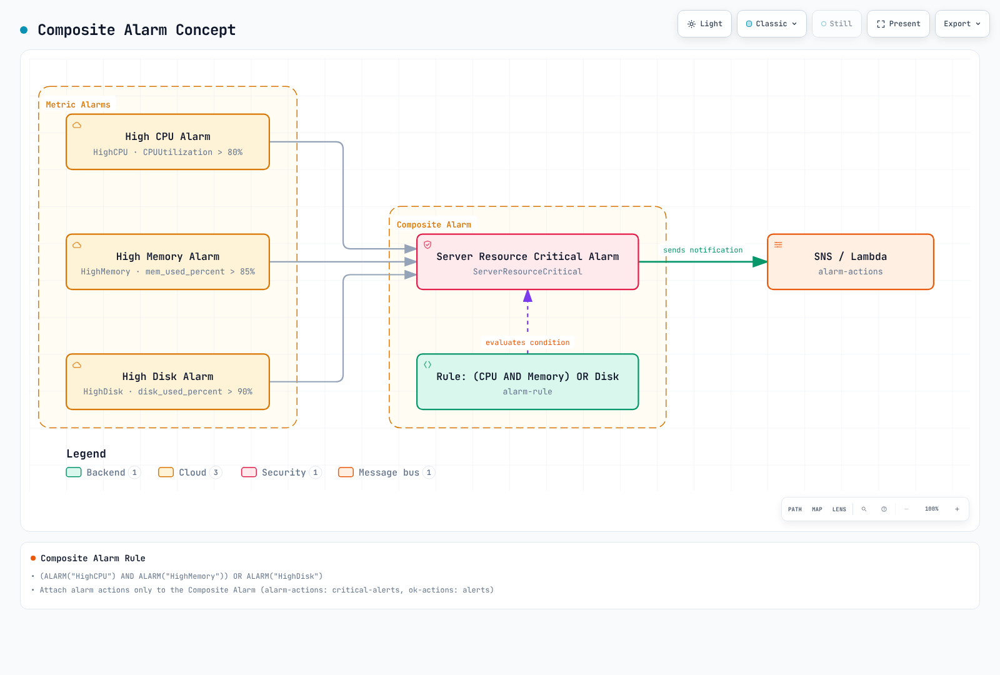
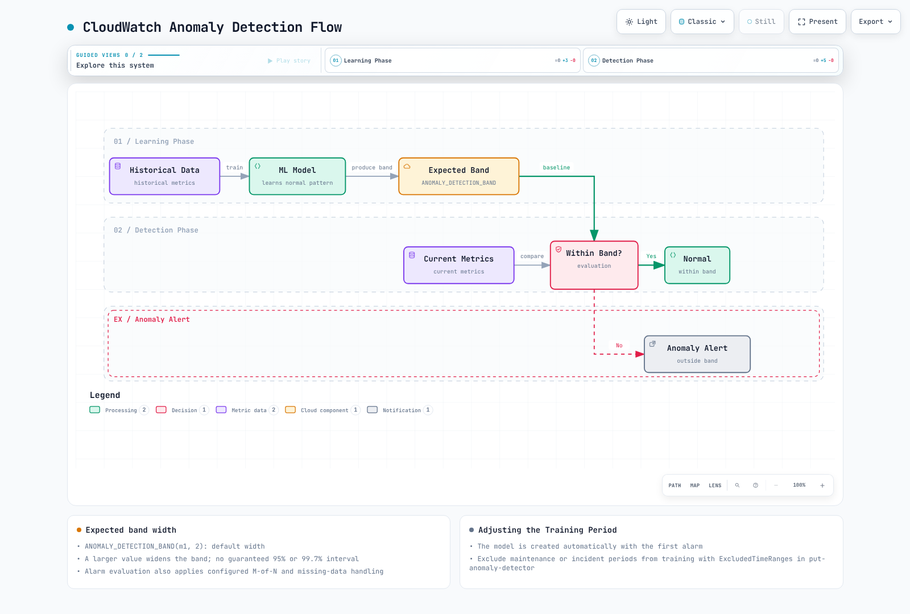
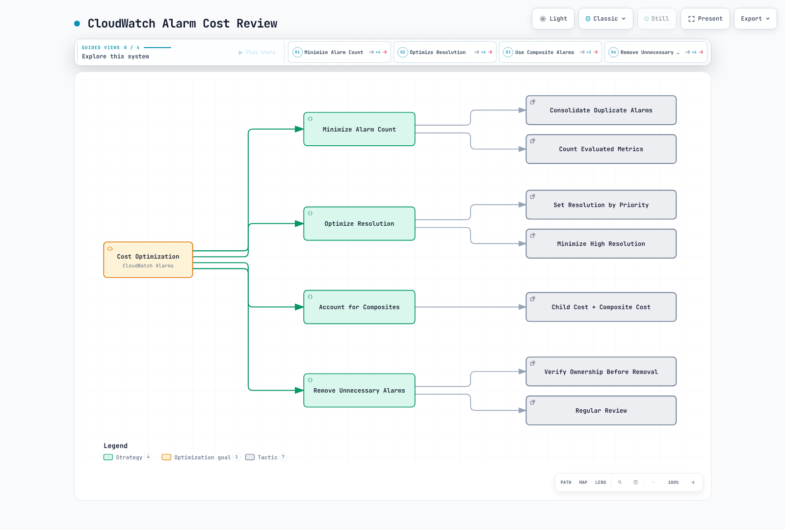

# CloudWatch アラーム

> **最終更新**: September 13, 2026

CLI と Terraform の例では、**従来の CloudWatch メトリクスアラーム**および複合アラームを扱います。CloudWatch は、OTLP エンドポイント経由で取り込まれたメトリクスに対する **PromQL アラーム**と、Logs Insights クエリ結果に対する**ログアラーム**もサポートしています。PromQL アラームでは `PendingPeriod`/`RecoveryPeriod` を使用します。以下の M-of-N および欠損データ設定は、そのままでは適用されません。アカウント、Region、リソース値は例です。作成または更新コマンドを使用する前に、実際のターゲット、IAM 権限、コスト、受信者を確認してください。`PutMetricAlarm`/`PutCompositeAlarm` は既存のアラーム設定を置き換えるため、更新前に現在の設定を保存してください。

## 目次

- [CloudWatch アラームの概要](#cloudwatch-alarms-overview)
- [アーキテクチャ](#architecture)
- [メトリクスアラーム](#metric-alarms)
- [複合アラーム](#composite-alarms)
- [異常検出](#anomaly-detection)
- [SNS 統合](#sns-integration)
- [EventBridge 統合](#eventbridge-integration)
- [Container Insights アラート](#container-insights-alerts)
- [CloudWatch アラームアクション](#cloudwatch-alarm-actions)
- [コスト最適化](#cost-optimization)
- [Prometheus メトリクス統合](#prometheus-metrics-integration)
- [Terraform の例](#terraform-examples)

---

## CloudWatch アラームの概要

Amazon CloudWatch Alarms は、AWS ネイティブモニタリングサービスのアラート機能です。CloudWatch メトリクスに基づいてアラートを作成し、SNS、Lambda、EC2 Auto Scaling などとの統合を通じて自動応答を有効にします。

### 主な機能

1. **メトリクスアラーム**: メトリクス、メトリクス演算、または Metrics Insights クエリを評価
2. **複合アラーム**: 複数のアラーム条件を組み合わせる
3. **異常検出**: 機械学習ベースの異常検出
4. **アラームアクション**: アラート発生時に自動アクションを実行
5. **AWS サービス統合**: EC2、ECS、EKS、Lambda などとのネイティブ統合

### CloudWatch アラームと Prometheus Alertmanager の比較

| 特性 | CloudWatch アラーム | Prometheus Alertmanager |
|----------------|-------------------|-------------------------|
| **タイプ** | AWS マネージドサービス | オープンソース |
| **データソース** | アラームタイプに応じた CloudWatch メトリクス、OTLP メトリクス、またはログ | Prometheus またはその他のクライアントが評価したアラート |
| **評価** | アラームタイプに応じたメトリクス演算、PromQL、または Logs Insights | Prometheus が PromQL を評価し、Alertmanager がアラートをグループ化、抑制、ルーティング |
| **コスト** | アラームタイプ、評価対象メトリクス、クエリ、コントリビューターに依存 | ソフトウェアライセンス料金なし。インフラストラクチャと運用には引き続きコストがかかる |
| **複雑なルーティング** | 限定的 | 高度なルーティングをサポート |
| **AWS 統合** | ネイティブ | 追加設定が必要 |

---

## アーキテクチャ

### CloudWatch アラームの動作フロー


[🔍 インタラクティブな図を表示](https://www.atomai.click/kubernetes-docs/archmaps/en-observability-alerting-02-cloudwatch-alarms-0.html)

### アラーム状態

従来のメトリクスアラームは `INSUFFICIENT_DATA` で始まり、その後 `OK` または `ALARM` に評価されます。欠損データが常に `INSUFFICIENT_DATA` を意味するわけではありません。すべての評価データが欠損している場合、`missing` はデータ不足になります。`notBreaching` は欠損ポイントを正常として補完し、`breaching` は異常として補完し、`ignore` は状態を維持します。評価に十分な追加の実データポイントがある場合、CloudWatch は欠損データの補完設定を使用しません。そのため、包括的な `notBreaching` ポリシーにより、停止したハートビートやコレクターが隠れる可能性があります。複合アラームが `INSUFFICIENT_DATA` になるのは、作成直後のみです。


[🔍 インタラクティブな図を表示](https://www.atomai.click/kubernetes-docs/archmaps/en-observability-alerting-02-cloudwatch-alarms-1.html)

---

## メトリクスアラーム

### 基本的なアラーム作成（Console/CLI）

#### AWS CLI

```bash
# Create CPU utilization alarm
aws cloudwatch put-metric-alarm \
  --alarm-name "HighCPUUtilization" \
  --alarm-description "CPU usage exceeds 80%" \
  --metric-name CPUUtilization \
  --namespace AWS/EC2 \
  --statistic Average \
  --period 300 \
  --threshold 80 \
  --comparison-operator GreaterThanThreshold \
  --evaluation-periods 2 \
  --dimensions Name=InstanceId,Value=i-1234567890abcdef0 \
  --alarm-actions arn:aws:sns:ap-northeast-2:123456789012:alerts \
  --ok-actions arn:aws:sns:ap-northeast-2:123456789012:alerts \
  --treat-missing-data missing
```

### アラーム設定コンポーネント

| パラメータ | 説明 | 例 |
|-----------|-------------|---------|
| `metric-name` | 監視するメトリクスの名前 | `CPUUtilization` |
| `namespace` | メトリクスの名前空間 | `AWS/EC2`, `AWS/EKS` |
| `statistic` | 統計関数 | `Average`, `Sum`, `Maximum`, `Minimum`, `SampleCount` |
| `period` | 評価期間（秒） | `60`, `300`, `3600` |
| `threshold` | しきい値 | `80` |
| `comparison-operator` | 比較演算子 | `GreaterThanThreshold` |
| `evaluation-periods` | 評価期間 N の数 | `3`（M は `datapoints-to-alarm`） |
| `datapoints-to-alarm` | アラームに必要なデータポイント | `3` 個中 `2` |
| `treat-missing-data` | 欠損データの処理 | `notBreaching`, `breaching`, `ignore`, `missing` |

`--statistic p99` ではなく `--extended-statistic p99` を使用してください。N 個のうち M 個の異常ポイントは連続している必要はありません。M を省略すると N と同じになります。`Period` は集計時間であり、通知間隔ではありません。10、20、30 秒の従来のメトリクスアラーム期間は高解像度であり、対応する高解像度データが必要です。60 秒は標準解像度です。Period×N は 7 日間まで、Period が 1 時間未満の場合は 1 日間までに制限されます。Auto Scaling アクションを除き、通常アクションは状態遷移時に実行されます。

### 比較演算子

```yaml
# Available comparison operators
comparison-operators:
  - GreaterThanThreshold           # Greater than
  - GreaterThanOrEqualToThreshold  # Greater than or equal
  - LessThanThreshold              # Less than
  - LessThanOrEqualToThreshold     # Less than or equal
  - LessThanLowerOrGreaterThanUpperThreshold  # Outside range
  - LessThanLowerThreshold         # Below lower bound
  - GreaterThanUpperThreshold      # Above upper bound
```

### メトリクス演算を使用するアラーム

```bash
# Error rate calculation alarm (error count / total requests)
aws cloudwatch put-metric-alarm \
  --alarm-name "HighErrorRate" \
  --alarm-description "Error rate exceeds 5%" \
  --metrics '[
    {
      "Id": "errors",
      "MetricStat": {
        "Metric": {
          "Namespace": "AWS/ApplicationELB",
          "MetricName": "HTTPCode_Target_5XX_Count",
          "Dimensions": [
            {"Name": "LoadBalancer", "Value": "app/my-alb/1234567890"}
          ]
        },
        "Period": 300,
        "Stat": "Sum"
      },
      "ReturnData": false
    },
    {
      "Id": "requests",
      "MetricStat": {
        "Metric": {
          "Namespace": "AWS/ApplicationELB",
          "MetricName": "RequestCount",
          "Dimensions": [
            {"Name": "LoadBalancer", "Value": "app/my-alb/1234567890"}
          ]
        },
        "Period": 300,
        "Stat": "Sum"
      },
      "ReturnData": false
    },
    {
      "Id": "error_rate",
      "Expression": "IF(requests > 0, 100 * FILL(errors, 0) / requests, 0)",
      "ReturnData": true
    }
  ]' \
  --threshold 5 \
  --comparison-operator GreaterThanThreshold \
  --evaluation-periods 2 \
  --alarm-actions arn:aws:sns:ap-northeast-2:123456789012:alerts
```

この式は、ALB によって転送されたリクエストにおけるターゲットの 5xx レスポンスを測定します。ALB が生成したエラーやターゲット選択前の失敗など、ユーザーに見えるすべての失敗を含むわけではありません。リクエストが存在する場合、欠損した 5xx ポイントはゼロで補完されます。リクエストがゼロの場合、ここでは 0% と定義されます。欠損したリクエスト／収集データは別途監視してください。従来のメトリクス演算アラームは、最終的に 1 つの時系列を返す必要があります。`SEARCH` はグラフ用であり、アラーム式には使用できません。`RATE` は、評価範囲が変わるため、スパースなメトリクスでは異なる動作をする場合があります。

### メトリクス演算関数

```yaml
# Commonly used functions
math-functions:
  # Arithmetic operations
  - "m1 + m2"           # Sum
  - "m1 - m2"           # Difference
  - "m1 * m2"           # Product
  - "m1 / m2"           # Division
  - "(m1 / m2) * 100"   # Percentage

  # Statistical functions
  - "AVG(METRICS())"    # Average
  - "SUM(METRICS())"    # Sum
  - "MIN(METRICS())"    # Minimum
  - "MAX(METRICS())"    # Maximum

  # Conditional functions
  - "IF(m1 > 100, m1, 0)"  # Conditional

  # Time-related
  - "RATE(m1)"          # Rate of change
  - "DIFF(m1)"          # Difference
  - "PERIOD(m1)"        # Period

  # Search
  - "SEARCH('{AWS/EC2,InstanceId} MetricName=\"CPUUtilization\"', 'Average', 300)"
```

---

## 複合アラーム

### 複合アラームの概念

複合アラームでは、複数のメトリクスアラームを組み合わせて複雑な条件を定義できます。



[🔍 インタラクティブな図を表示](https://www.atomai.click/kubernetes-docs/archmaps/en-observability-alerting-02-cloudwatch-alarms-2.html)

`CWAgent` のメモリおよびディスクメトリクスには、インストール済みのエージェントと一致する公開済みディメンションセットが必要です。`InstanceId` のみの例が機能するのは、エージェントがその集約を公開している場合のみです。`disk_used_percent` には多くの場合 `path`、`device`、`fstype` もあります。`list-metrics` が返す**完全なディメンションセット**を使用してください。例の子アラームにはアクションがありません。通知を送信するのは複合アラームのみです。

### 複合アラームの作成

```bash
# Create individual alarms
aws cloudwatch put-metric-alarm \
  --alarm-name "HighCPU" \
  --metric-name CPUUtilization \
  --namespace AWS/EC2 \
  --statistic Average \
  --period 300 \
  --threshold 80 \
  --comparison-operator GreaterThanThreshold \
  --evaluation-periods 2 \
  --dimensions Name=InstanceId,Value=i-1234567890abcdef0

aws cloudwatch put-metric-alarm \
  --alarm-name "HighMemory" \
  --metric-name mem_used_percent \
  --namespace CWAgent \
  --statistic Average \
  --period 300 \
  --threshold 85 \
  --comparison-operator GreaterThanThreshold \
  --evaluation-periods 2 \
  --dimensions Name=InstanceId,Value=i-1234567890abcdef0

aws cloudwatch put-metric-alarm \
  --alarm-name "HighDisk" \
  --metric-name disk_used_percent \
  --namespace CWAgent \
  --statistic Average \
  --period 300 \
  --threshold 90 \
  --comparison-operator GreaterThanThreshold \
  --evaluation-periods 2 \
  --dimensions Name=InstanceId,Value=i-1234567890abcdef0

# Create Composite Alarm
aws cloudwatch put-composite-alarm \
  --alarm-name "ServerResourceCritical" \
  --alarm-description "Server resources are critical" \
  --alarm-rule '(ALARM("HighCPU") AND ALARM("HighMemory")) OR ALARM("HighDisk")' \
  --alarm-actions arn:aws:sns:ap-northeast-2:123456789012:critical-alerts \
  --ok-actions arn:aws:sns:ap-northeast-2:123456789012:alerts
```

### アラームルール構文

```yaml
# Composite Alarm rule syntax
rule-syntax:
  # Basic operators
  - "ALARM(alarm-name)"      # Check ALARM state
  - "OK(alarm-name)"         # Check OK state
  - "INSUFFICIENT_DATA(alarm-name)"  # Check INSUFFICIENT_DATA state

  # Logical operators
  - "AND"                    # All conditions met
  - "OR"                     # One or more conditions met
  - "NOT"                    # Negation
  - "()"                     # Grouping

examples:
  # All conditions met
  - "ALARM(A1) AND ALARM(A2) AND ALARM(A3)"

  # One or more met
  - "ALARM(A1) OR ALARM(A2)"

  # Complex condition
  - "(ALARM(A1) AND ALARM(A2)) OR ALARM(A3)"

  # Negation
  - "ALARM(A1) AND NOT ALARM(A2)"

  # M of N pattern (2 or more of 3)
  - "(ALARM(A1) AND ALARM(A2)) OR (ALARM(A1) AND ALARM(A3)) OR (ALARM(A2) AND ALARM(A3))"
```

### アラート抑制パターン

`set-alarm-state` は一時的なテストオーバーライドです。メトリクスアラームはすぐに評価済みの状態に戻り、メンテナンスウィンドウを確立しません。次の例では、外部コントローラーが `MaintenanceMode` アラームの状態を継続的に公開することを前提としています。`ActionsSuppressor` は、評価済み状態を変更せずに複合アクションを抑制します。メンテナンスウィンドウをテストする際は、待機／延長期間を含めてください。

```bash
aws cloudwatch put-composite-alarm  \
  --alarm-name ProductionAlerts  \
  --alarm-rule 'ALARM("HighCPU")'  \
  --actions-suppressor MaintenanceMode  \
  --actions-suppressor-wait-period 60  \
  --actions-suppressor-extension-period 60  \
  --alarm-actions arn:aws:sns:ap-northeast-2:123456789012:alerts
```

---

## 異常検出

### 異常検出の概要

CloudWatch Anomaly Detection は、機械学習を使用してメトリクスの正常パターンを学習し、外れ値を検出します。



[🔍 インタラクティブな図を表示](https://www.atomai.click/kubernetes-docs/archmaps/en-observability-alerting-02-cloudwatch-alarms-3.html)

### 異常検出アラームの作成

```bash
# Anomaly Detection model creation (automatic)
# Model is automatically created when first alarm is created

aws cloudwatch put-metric-alarm \
  --alarm-name "CPUAnomalyDetection" \
  --alarm-description "CPU usage is anomalous" \
  --metrics '[
    {
      "Id": "m1",
      "MetricStat": {
        "Metric": {
          "Namespace": "AWS/EC2",
          "MetricName": "CPUUtilization",
          "Dimensions": [
            {"Name": "InstanceId", "Value": "i-1234567890abcdef0"}
          ]
        },
        "Period": 300,
        "Stat": "Average"
      },
      "ReturnData": true
    },
    {
      "Id": "ad1",
      "Expression": "ANOMALY_DETECTION_BAND(m1, 2)",
      "ReturnData": true
    }
  ]' \
  --threshold-metric-id ad1 \
  --comparison-operator LessThanLowerOrGreaterThanUpperThreshold \
  --evaluation-periods 2 \
  --alarm-actions arn:aws:sns:ap-northeast-2:123456789012:alerts
```

### 異常検出の設定

```yaml
# ANOMALY_DETECTION_BAND function
# ANOMALY_DETECTION_BAND(metric, stddev)
# - metric: Metric to analyze
# - stddev: Standard deviation multiplier (default 2)

examples:
  # Width parameter 2: not a guaranteed 95% confidence interval
  - "ANOMALY_DETECTION_BAND(m1, 2)"

  # Width parameter 3: a wider expected band
  - "ANOMALY_DETECTION_BAND(m1, 3)"

  # More sensitive detection (1 standard deviation)
  - "ANOMALY_DETECTION_BAND(m1, 1)"
```

パラメータはモデルの期待バンド幅を制御します。これは保証されたガウス分布の 95% または 99.7% 区間ではありません。モデルは最大 2 週間の履歴を使用し、それより少ない履歴でも開始できます。以下の除外日付は形式を示すものです。モデルのトレーニング履歴内にある関連する期間に置き換えてください。

### モデルトレーニング期間の調整

```bash
# Add exclusion periods to existing model (maintenance, incident periods, etc.)
aws cloudwatch put-anomaly-detector \
  --namespace AWS/EC2 \
  --metric-name CPUUtilization \
  --stat Average \
  --dimensions Name=InstanceId,Value=i-1234567890abcdef0 \
  --configuration '{
    "ExcludedTimeRanges": [
      {
        "StartTime": "2025-02-15T00:00:00Z",
        "EndTime": "2025-02-15T06:00:00Z"
      }
    ]
  }'
```

---

## SNS 統合

### SNS Topic の作成

```bash
# Create SNS Topic
aws sns create-topic --name eks-alerts

# Add Email subscription
aws sns subscribe \
  --topic-arn arn:aws:sns:ap-northeast-2:123456789012:eks-alerts \
  --protocol email \
  --notification-endpoint team@example.com

# Add SMS subscription
aws sns subscribe \
  --topic-arn arn:aws:sns:ap-northeast-2:123456789012:eks-alerts \
  --protocol sms \
  --notification-endpoint "$VERIFIED_SMS_NUMBER"

# Add Lambda subscription
aws sns subscribe \
  --topic-arn arn:aws:sns:ap-northeast-2:123456789012:eks-alerts \
  --protocol lambda \
  --notification-endpoint arn:aws:lambda:ap-northeast-2:123456789012:function:alert-handler
```

### SNS メッセージフィルタリング

デフォルトの CloudWatch SNS 通知には、例にある `severity` または `environment` メッセージ属性は自動的に含まれません。本文の `NewStateValue` をフィルタリングするには、`FilterPolicyScope=MessageBody` を設定します。このフィルターは `OK` の復旧メッセージを除外します。E メールにはサブスクリプションの確認が必要です。SMS では、検証済み番号、サンドボックス／Region 要件、コストを確認する必要があります。Lambda サブスクリプションには、特定の Topic ARN からの `sns.amazonaws.com` を許可する Lambda リソースポリシーも必要です。

```bash
aws sns set-subscription-attributes  \
  --subscription-arn "$SUBSCRIPTION_ARN"  \
  --attribute-name FilterPolicyScope  \
  --attribute-value MessageBody
aws sns set-subscription-attributes  \
  --subscription-arn "$SUBSCRIPTION_ARN"  \
  --attribute-name FilterPolicy  \
  --attribute-value '{"NewStateValue": ["ALARM"]}'
```

### SNS から Slack への統合（Lambda）

標準の CloudWatch 通知では、SNS Topic と承認済み Slack チャネルを **Amazon Q Developer in chat applications**（旧 AWS Chatbot）を介して接続します。チャネルの IAM ロールとガードレールポリシーを、その通知用途に限定してください。

カスタム Lambda が必要な場合は、シークレットストアから webhook を取得し、その宛先を検証して、接続／読み取りタイムアウトを設定し、レスポンスステータスを確認します。HTTP 429/5xx を成功として報告しないでください。リトライ、デッドレターパス、重複処理を構成してください。SNS は以下の EventBridge エンベロープではなく、`Records[].Sns.Message` を使用します。この章の検証では実際の Slack メッセージは送信しません。

---

## EventBridge 統合

### EventBridge ルールの作成

```bash
# Route CloudWatch Alarm state changes to EventBridge
aws events put-rule \
  --name "CloudWatchAlarmStateChange" \
  --event-pattern '{
    "source": ["aws.cloudwatch"],
    "detail-type": ["CloudWatch Alarm State Change"],
    "detail": {
      "state": {
        "value": ["ALARM"]
      }
    }
  }'

# Add Lambda target
aws events put-targets \
  --rule "CloudWatchAlarmStateChange" \
  --targets '[
    {
      "Id": "AlertHandler",
      "Arn": "arn:aws:lambda:ap-northeast-2:123456789012:function:alert-handler"
    }
  ]'
```

### 自動応答の設定


[🔍 インタラクティブな図を表示](https://www.atomai.click/kubernetes-docs/archmaps/en-observability-alerting-02-cloudwatch-alarms-4.html)

### EventBridge イベントパターン

```json
{
  "source": ["aws.cloudwatch"],
  "detail-type": ["CloudWatch Alarm State Change"],
  "account": ["123456789012"],
  "region": ["ap-northeast-2"],
  "resources": ["arn:aws:cloudwatch:ap-northeast-2:123456789012:alarm:EKS-Node-HighCPU"],
  "detail": {
    "alarmName": ["EKS-Node-HighCPU"],
    "state": {"value": ["ALARM"]}
  }
}
```

`previousState` を `OK` に限定すると、`INSUFFICIENT_DATA → ALARM` を見逃します。正確なアラーム ARN を照合することで、メトリクス演算または複合設定の形式についての前提を避けられます。`put-targets` は Lambda 呼び出し権限を付与しません。ルールの `SourceArn` にスコープを限定した `events.amazonaws.com` 用 Lambda リソースポリシーを追加し、リトライ／デッドレター動作を構成してください。

### 自動復旧 Lambda の例

CPU 使用率が高いだけでは、再起動が適切である証拠にはなりません。この例では、復旧の**入力検査段階**を実装します。状態、アカウント、Region、アラーム ARN を確認した後、メトリクス情報を返します。EventBridge の `dimensions` は、SNS アラームメッセージのディメンションリストとは異なり、オブジェクトです。また、式を先頭にしたクエリと、メトリクスを持たない複合アラームも処理します。

Lambda ハンドラーとともに、[テスト済みのイベントノーマライザーとテスト](https://github.com/Atom-oh/kubernetes-docs/tree/main/examples/observability/cloudwatch-alarms)をパッケージ化します。

```python
from event_normalizer import normalize_alarm_event

def lambda_handler(event, context):
    return normalize_alarm_event(
        event,
        expected_account="123456789012",
        expected_region="ap-northeast-2",
    )
```

この関数は AWS の変更を実行しません。ペイロード検査は送信者を認証しません。追加する修復処理には、明示的なターゲット許可リスト、現在のアラーム／リソース状態の確認、冪等性、クールダウン、最小権限、ロールバックが必要です。

---

## Container Insights アラート

### EKS Container Insights メトリクス

これらの例では、従来の `ContainerInsights` CloudWatch メトリクスパスを使用します。その名前、ディメンション、課金を、拡張オブザーバビリティまたは OTel メトリクスパスと混在させないでください。CloudWatch Agent と Fluent Bit をインストールする[最新の EKS アドオンガイド](https://docs.aws.amazon.com/AmazonCloudWatch/latest/monitoring/install-CloudWatch-Observability-EKS-addon.html)に従い、クラスターの Kubernetes バージョンおよび Region と互換性のあるアドオンバージョンを選択してください。EKS Pod Identity を使用する場合は、まず IAM とエージェント関連付けを構成してください。

`update-addon` は既存のインストールを更新します。初回インストールには `create-addon` を使用します。既存の設定と Pod Identity 関連付けを維持してください。古い `v1.2.0` を固定したり、レビューしていない `latest` Fluentd マニフェストを適用したりせず、利用可能なバージョンをクエリしてデプロイ計画で 1 つ選択してください。

```bash
aws eks describe-addon-versions  \
  --addon-name amazon-cloudwatch-observability  \
  --kubernetes-version "$KUBERNETES_VERSION"  \
  --region "$AWS_REGION"
aws cloudwatch list-metrics  \
  --namespace ContainerInsights  \
  --metric-name pod_number_of_container_restarts  \
  --dimensions Name=ClusterName,Value=my-cluster  \
  --region "$AWS_REGION"
```

### Container Insights アラートの例

```bash
# Cluster aggregate CPU utilization alarm
aws cloudwatch put-metric-alarm \
  --alarm-name "EKS-Node-HighCPU" \
  --metric-name node_cpu_utilization \
  --namespace ContainerInsights \
  --dimensions Name=ClusterName,Value=my-cluster \
  --statistic Average \
  --period 300 \
  --threshold 80 \
  --comparison-operator GreaterThanThreshold \
  --evaluation-periods 2 \
  --alarm-actions arn:aws:sns:ap-northeast-2:123456789012:eks-alerts

# Pod memory utilization alarm
aws cloudwatch put-metric-alarm \
  --alarm-name "EKS-Pod-HighMemory" \
  --metric-name pod_memory_utilization_over_pod_limit \
  --namespace ContainerInsights \
  --dimensions Name=ClusterName,Value=my-cluster Name=Namespace,Value=production \
  --statistic Average \
  --period 300 \
  --threshold 85 \
  --comparison-operator GreaterThanThreshold \
  --evaluation-periods 2 \
  --alarm-actions arn:aws:sns:ap-northeast-2:123456789012:eks-alerts

# One Pod's cumulative restart count (not a five-minute increase)
aws cloudwatch put-metric-alarm \
  --alarm-name "EKS-Pod-Restarts" \
  --metric-name pod_number_of_container_restarts \
  --namespace ContainerInsights \
  --dimensions Name=ClusterName,Value=my-cluster Name=Namespace,Value=production Name=PodName,Value=my-pod \
  --statistic Maximum \
  --period 300 \
  --threshold 3 \
  --comparison-operator GreaterThanThreshold \
  --evaluation-periods 1 \
  --alarm-actions arn:aws:sns:ap-northeast-2:123456789012:eks-alerts
```

CPU の例はクラスター集約です。個別ノードでは、完全な `ClusterName`、`NodeName`、`InstanceId` セットを使用します。`pod_memory_utilization` は**ノードメモリ**で除算しますが、`pod_memory_utilization_over_pod_limit` は Pod の制限値で除算します。いずれかのコンテナにメモリ制限がない場合、後者が存在しない可能性があります。`pod_number_of_container_restarts` は累積値であり、`ClusterName`、`Namespace`、`PodName` を使用します。`Maximum > 3` は観測されたライフタイムカウントが 3 を超えたことを意味します。サンプルを合計しても最近の再起動数はカウントされません。Pod の置き換え、リセット、名前の再利用を考慮してください。最近の増分には、リセットを考慮した PromQL の `increase()` または別途定義したデルタメトリクスを使用します。

### 主要な Container Insights メトリクス

| メトリクス | 説明 | ディメンション |
|--------|-------------|------------|
| `cluster_node_count` | クラスターノード数 | ClusterName |
| `cluster_failed_node_count` | 失敗したノード数 | ClusterName |
| `node_cpu_utilization` | ノード CPU 使用率 | ClusterName, NodeName, InstanceId; または ClusterName |
| `node_memory_utilization` | ノードメモリ使用率 | ClusterName, NodeName, InstanceId; または ClusterName |
| `node_filesystem_utilization` | ノードディスク使用率 | ClusterName, NodeName, InstanceId; または ClusterName |
| `pod_cpu_utilization` | Pod CPU 使用率 | ClusterName, Namespace, PodName |
| `pod_memory_utilization` | Pod メモリ使用率 | ClusterName, Namespace, PodName |
| `pod_number_of_container_restarts` | コンテナ再起動数 | ClusterName, Namespace, PodName |
| `service_number_of_running_pods` | Service ごとの実行中 Pod 数 | ClusterName, Namespace, Service |

---

## CloudWatch アラームアクション

### EC2 アクション

直接実行する EC2 アクションは停止、終了、再起動、復旧です。**開始はサポートされません**。これらの例はインスタンスを変更します。サポート対象インスタンス、権限、停止／復旧の影響を確認した上で、明示的に承認されたターゲットにのみ使用してください。欠損データには `missing` を使用し、変更アクションは `ALARM` にのみアタッチします。メトリクス演算アラームおよび複合アラームは、EC2 アクションを直接実行できません。


```bash
# EC2 instance recovery (on system status check failure)
aws cloudwatch put-metric-alarm \
  --alarm-name "EC2-SystemCheckFailed" \
  --metric-name StatusCheckFailed_System \
  --namespace AWS/EC2 \
  --dimensions Name=InstanceId,Value=i-1234567890abcdef0 \
  --statistic Maximum \
  --period 60 \
  --threshold 1 \
  --comparison-operator GreaterThanOrEqualToThreshold \
  --evaluation-periods 2 \
  --treat-missing-data missing \
  --alarm-actions arn:aws:automate:ap-northeast-2:ec2:recover

# EC2 instance stop
aws cloudwatch put-metric-alarm \
  --alarm-name "EC2-LowUtilization-Stop" \
  --metric-name CPUUtilization \
  --namespace AWS/EC2 \
  --dimensions Name=InstanceId,Value=i-1234567890abcdef0 \
  --statistic Average \
  --period 3600 \
  --threshold 5 \
  --comparison-operator LessThanThreshold \
  --evaluation-periods 24 \
  --treat-missing-data missing \
  --alarm-actions arn:aws:automate:ap-northeast-2:ec2:stop
```

### Auto Scaling アクション

```bash
# Link Auto Scaling policy
aws cloudwatch put-metric-alarm \
  --alarm-name "ASG-ScaleOut" \
  --metric-name CPUUtilization \
  --namespace AWS/EC2 \
  --dimensions Name=AutoScalingGroupName,Value=my-asg \
  --statistic Average \
  --period 300 \
  --threshold 70 \
  --comparison-operator GreaterThanThreshold \
  --evaluation-periods 2 \
  --alarm-actions arn:aws:autoscaling:ap-northeast-2:123456789012:scalingPolicy:xxx:autoScalingGroupName/my-asg:policyName/scale-out

aws cloudwatch put-metric-alarm \
  --alarm-name "ASG-ScaleIn" \
  --metric-name CPUUtilization \
  --namespace AWS/EC2 \
  --dimensions Name=AutoScalingGroupName,Value=my-asg \
  --statistic Average \
  --period 300 \
  --threshold 30 \
  --comparison-operator LessThanThreshold \
  --evaluation-periods 3 \
  --alarm-actions arn:aws:autoscaling:ap-northeast-2:123456789012:scalingPolicy:xxx:autoScalingGroupName/my-asg:policyName/scale-in
```

### Systems Manager アクション

`automation-definition/...` ARN は、任意の SSM Automation runbook を実行するためのサポート対象の直接 `AlarmActions` ターゲットではありません。直接 SSM 統合では、OpsItem など API に列挙されたアクションを使用します。Automation は、**EventBridge SSM Automation ターゲット**または明示的な Lambda/Step Functions ワークフローを介してルーティングしてください。ターゲット実行ロール、`ssm:StartAutomationExecution`、runbook パラメータ、Automation ロールはそれぞれ別にスコープを限定します。ディスクしきい値だけで、任意のファイル削除を許可してはなりません。

---

## コスト最適化

### コスト要因

以下の数値は、2026-09-13 に確認した公式料金ページの**米国東部の例**であり、ソウル向けの見積もりではありません。ターゲット Region の最新料金を確認してください。メトリクスアラームは評価対象メトリクスごとに課金され、複合アラームはアラームごとに課金されます。異常検出には、実際のメトリクスと 2 つのバンドメトリクスが含まれます。複合アラームを追加しても子アラームの料金は残ります。これは通知ノイズを減らしますが、自動的にコストを削減するものではありません。


| 項目 | コスト |
|------|------|
| 標準解像度アラーム（60 秒） | $0.10/アラーム/月 |
| 高解像度アラーム（10 秒） | $0.30/アラーム/月 |
| 標準異常アラーム: 実際のメトリクス 1 つとバンド 2 つ | $0.30/アラーム/月の例 |
| 複合アラーム | $0.50/アラーム/月 |

### コスト最適化戦略



[🔍 インタラクティブな図を表示](https://www.atomai.click/kubernetes-docs/archmaps/en-observability-alerting-02-cloudwatch-alarms-5.html)

### 推奨設定

```yaml
# Cost-effective alarm settings

# Critical: Standard Resolution (60s; only 10/20/30s is high resolution)
critical-alerts:
  period: 60  # 1 minute
  evaluation-periods: 2

# Warning: Standard Resolution
warning-alerts:
  period: 300  # 5 minutes
  evaluation-periods: 2

# Info: Standard Resolution (relaxed detection)
info-alerts:
  period: 900  # 15 minutes
  evaluation-periods: 3
```

### アラームクリーンアップスクリプト

このコマンドは、確認対象となる候補を一覧表示するだけです。`INSUFFICIENT_DATA` はアラームが未使用である証拠ではなく、固定の過去日付が「90 日前」を意味することもありません。別途承認された削除の前に、`StateTransitionedTimestamp` からの経過時間、実際の収集、所有者、複合依存関係を確認してください。`StateUpdatedTimestamp` は状態理由が変わったときにも変化します。これは現在の状態にある時間とは異なります。

```bash
aws cloudwatch describe-alarms  \
  --alarm-types MetricAlarm  \
  --state-value INSUFFICIENT_DATA  \
  --query 'MetricAlarms[].{Name:AlarmName,StateSince:StateTransitionedTimestamp,Updated:StateUpdatedTimestamp}'  \
  --output json
```

---

## Prometheus メトリクス統合

### Amazon Managed Prometheus（AMP）統合

AMP に保存されたメトリクスは、従来の CloudWatch メトリクスに自動コピーされません。要件に一致するパスを選択してください。

- **AMP 内のアラート**: ワークスペースの Prometheus アラートルール → マネージド Alertmanager → サポート対象レシーバー（SNS または PagerDuty）を構成します。
- **CloudWatch PromQL アラーム**: CloudWatch OTLP エンドポイントを介して取り込まれたメトリクスを評価します。これは AMP ワークスペースの直接クエリではありません。
- **従来の CloudWatch メトリクスの再公開**: 別個のエクスポーターで必要な集計のみを定義します。1 つの一貫した固定済み一時的認証情報セットで署名し、タイムアウト、HTTP ステータス、結果タイプ、有限値、タイムスタンプ、ディメンションを検証します。空の結果、NaN、失敗をゼロまたは成功に変換しないでください。これにより、クエリ、カスタムメトリクス、ランタイムのコストと遅延が追加されます。

以前の CPU モード平均は合計 CPU 使用率ではありませんでした。関連しない、または無制限の Pod にまたがるメモリ平均の比率は、各 Pod の制限使用率ではありませんでした。必要なラベルとリセットセマンティクスを保持する PromQL を選択し、ルールをテストして実際に収集されたデータを検証してください。

---

## Terraform の例

以下のブロックで 1 つの例となるモジュールを構成します。実際のリソース値と SNS Topic ポリシーを設定してから、デプロイ前に `terraform plan` を確認してください。例の検証では provider のスキーマ／構文を対象とし、AWS へのデプロイや実際の通知配信は対象としません。


### 基本アラーム

```hcl
# SNS Topic
resource "aws_sns_topic" "alerts" {
  name = "eks-alerts"
}

resource "aws_sns_topic_subscription" "email" {
  topic_arn = aws_sns_topic.alerts.arn
  protocol  = "email"
  endpoint  = "team@example.com"
}

# EC2 CPU alarm
resource "aws_cloudwatch_metric_alarm" "ec2_cpu" {
  alarm_name          = "ec2-high-cpu"
  comparison_operator = "GreaterThanThreshold"
  evaluation_periods  = 2
  metric_name         = "CPUUtilization"
  namespace           = "AWS/EC2"
  period              = 300
  statistic           = "Average"
  threshold           = 80
  alarm_description   = "EC2 CPU usage exceeds 80%"

  dimensions = {
    InstanceId = "i-1234567890abcdef0"
  }

  alarm_actions = [aws_sns_topic.alerts.arn]
  ok_actions    = [aws_sns_topic.alerts.arn]

  treat_missing_data = "missing"
}
```

### メトリクス演算アラーム

```hcl
resource "aws_cloudwatch_metric_alarm" "alb_error_rate" {
  alarm_name          = "alb-high-error-rate"
  comparison_operator = "GreaterThanThreshold"
  evaluation_periods  = 2
  threshold           = 5
  alarm_description   = "ALB error rate exceeds 5%"

  metric_query {
    id          = "errors"
    return_data = false

    metric {
      metric_name = "HTTPCode_Target_5XX_Count"
      namespace   = "AWS/ApplicationELB"
      period      = 300
      stat        = "Sum"

      dimensions = {
        LoadBalancer = "app/my-alb/1234567890"
      }
    }
  }

  metric_query {
    id          = "requests"
    return_data = false

    metric {
      metric_name = "RequestCount"
      namespace   = "AWS/ApplicationELB"
      period      = 300
      stat        = "Sum"

      dimensions = {
        LoadBalancer = "app/my-alb/1234567890"
      }
    }
  }

  metric_query {
    id          = "error_rate"
    expression  = "IF(requests > 0, 100 * FILL(errors, 0) / requests, 0)"
    label       = "Error Rate"
    return_data = true
  }

  alarm_actions = [aws_sns_topic.alerts.arn]
}
```

### 複合アラーム

```hcl
# Individual alarms
resource "aws_cloudwatch_metric_alarm" "cpu_alarm" {
  alarm_name          = "high-cpu"
  comparison_operator = "GreaterThanThreshold"
  evaluation_periods  = 2
  metric_name         = "CPUUtilization"
  namespace           = "AWS/EC2"
  period              = 300
  statistic           = "Average"
  threshold           = 80

  dimensions = {
    InstanceId = "i-1234567890abcdef0"
  }
}

resource "aws_cloudwatch_metric_alarm" "memory_alarm" {
  alarm_name          = "high-memory"
  comparison_operator = "GreaterThanThreshold"
  evaluation_periods  = 2
  metric_name         = "mem_used_percent"
  namespace           = "CWAgent"
  period              = 300
  statistic           = "Average"
  threshold           = 85

  dimensions = {
    InstanceId = "i-1234567890abcdef0"
  }
}

# Composite Alarm
resource "aws_cloudwatch_composite_alarm" "server_critical" {
  alarm_name        = "server-critical"
  alarm_description = "Server CPU and Memory are both high"

  alarm_rule = "ALARM(${aws_cloudwatch_metric_alarm.cpu_alarm.alarm_name}) AND ALARM(${aws_cloudwatch_metric_alarm.memory_alarm.alarm_name})"

  alarm_actions = [aws_sns_topic.alerts.arn]
  ok_actions    = [aws_sns_topic.alerts.arn]
}
```

### EKS Container Insights アラーム

```hcl
resource "aws_cloudwatch_metric_alarm" "eks_node_cpu" {
  alarm_name          = "eks-node-high-cpu"
  comparison_operator = "GreaterThanThreshold"
  evaluation_periods  = 2
  metric_name         = "node_cpu_utilization"
  namespace           = "ContainerInsights"
  period              = 300
  statistic           = "Average"
  threshold           = 80
  alarm_description   = "EKS Node CPU usage exceeds 80%"

  dimensions = {
    ClusterName = "my-eks-cluster"
  }

  alarm_actions = [aws_sns_topic.alerts.arn]
}

resource "aws_cloudwatch_metric_alarm" "eks_pod_restarts" {
  alarm_name          = "eks-pod-restarts"
  comparison_operator = "GreaterThanThreshold"
  evaluation_periods  = 1
  metric_name         = "pod_number_of_container_restarts"
  namespace           = "ContainerInsights"
  period              = 300
  statistic           = "Maximum"
  threshold           = 3
  alarm_description   = "Observed cumulative restart count exceeds 3; not a 5-minute increase"

  dimensions = {
    ClusterName = "my-eks-cluster"
    Namespace   = "production"
    PodName     = "my-pod"
  }

  alarm_actions = [aws_sns_topic.alerts.arn]
}
```

### 異常検出アラーム

```hcl
resource "aws_cloudwatch_metric_alarm" "cpu_anomaly" {
  alarm_name          = "cpu-anomaly-detection"
  comparison_operator = "LessThanLowerOrGreaterThanUpperThreshold"
  evaluation_periods  = 2
  threshold_metric_id = "ad1"
  alarm_description   = "CPU usage is anomalous"

  metric_query {
    id          = "m1"
    return_data = true

    metric {
      metric_name = "CPUUtilization"
      namespace   = "AWS/EC2"
      period      = 300
      stat        = "Average"

      dimensions = {
        InstanceId = "i-1234567890abcdef0"
      }
    }
  }

  metric_query {
    id          = "ad1"
    expression  = "ANOMALY_DETECTION_BAND(m1, 2)"
    label       = "CPUUtilization (Expected)"
    return_data = true
  }

  alarm_actions = [aws_sns_topic.alerts.arn]
}
```

---

## 参考資料

- [CloudWatch アラームタイプ](https://docs.aws.amazon.com/AmazonCloudWatch/latest/monitoring/CloudWatch_Alarms.html)
- [PutMetricAlarm API](https://docs.aws.amazon.com/AmazonCloudWatch/latest/APIReference/API_PutMetricAlarm.html)
- [欠損データの評価](https://docs.aws.amazon.com/AmazonCloudWatch/latest/monitoring/alarms-and-missing-data.html)
- [複合アラームとアクション抑制](https://docs.aws.amazon.com/AmazonCloudWatch/latest/APIReference/API_PutCompositeAlarm.html)
- [メトリクス演算](https://docs.aws.amazon.com/AmazonCloudWatch/latest/monitoring/using-metric-math.html)
- [異常検出](https://docs.aws.amazon.com/AmazonCloudWatch/latest/monitoring/CloudWatch_Anomaly_Detection.html)
- [SNS アラームメッセージスキーマ](https://docs.aws.amazon.com/AmazonCloudWatch/latest/monitoring/Notify_Users_Alarm_Changes.html)
- [SNS フィルターポリシースコープ](https://docs.aws.amazon.com/sns/latest/dg/sns-message-filtering-scope.html)
- [EventBridge アラームイベント](https://docs.aws.amazon.com/AmazonCloudWatch/latest/monitoring/cloudwatch-and-eventbridge.html)
- [EventBridge ターゲット権限](https://docs.aws.amazon.com/eventbridge/latest/userguide/eb-use-resource-based.html)
- [Container Insights メトリクスディメンション](https://docs.aws.amazon.com/AmazonCloudWatch/latest/monitoring/Container-Insights-metrics-EKS.html)
- [CloudWatch Observability EKS アドオン](https://docs.aws.amazon.com/AmazonCloudWatch/latest/monitoring/install-CloudWatch-Observability-EKS-addon.html)
- [CloudWatch 料金](https://aws.amazon.com/cloudwatch/pricing/)
- [PromQL アラーム](https://docs.aws.amazon.com/AmazonCloudWatch/latest/monitoring/alarm-promql.html)
- [ログアラーム](https://docs.aws.amazon.com/AmazonCloudWatch/latest/monitoring/Alarm-On-Logs.html)
- [AMP アラートレシーバー](https://docs.aws.amazon.com/prometheus/latest/userguide/AMP-alertmanager-receiver.html)

## クイズ

[CloudWatch アラームクイズ](../../quizzes/observability/alerting/02-cloudwatch-alarms-quiz.md)で理解度を確認してください。
