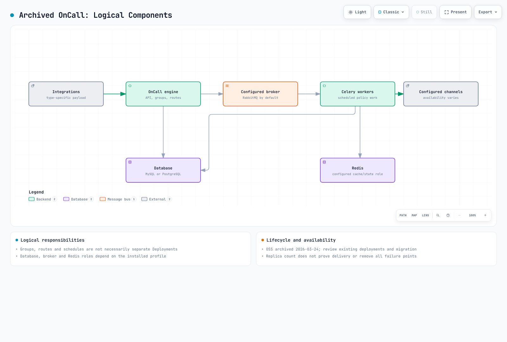
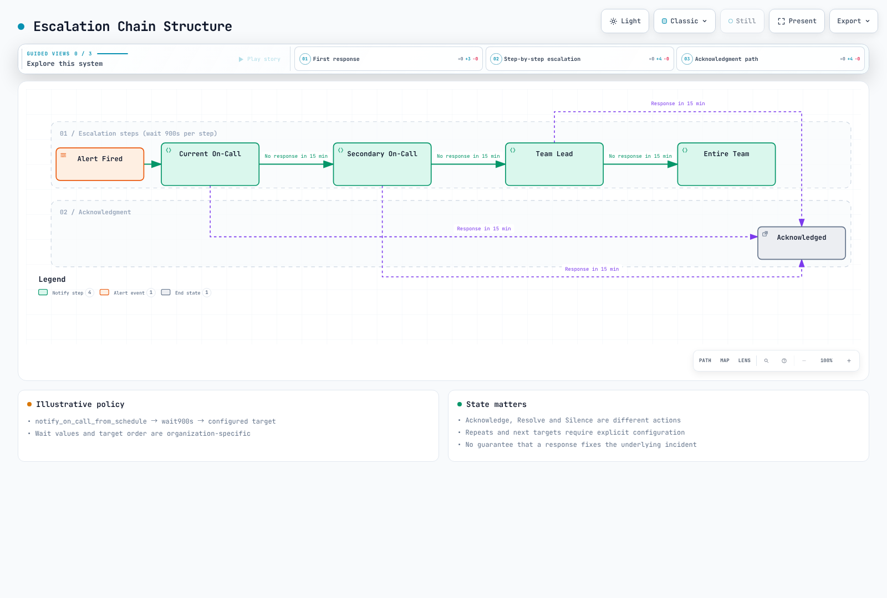
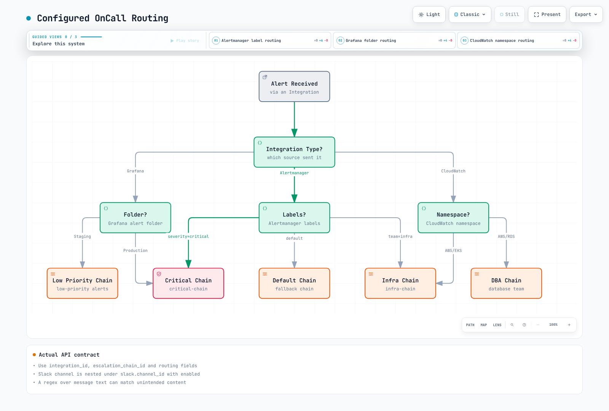
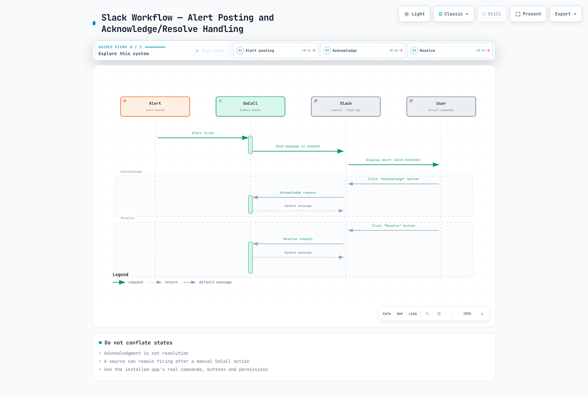
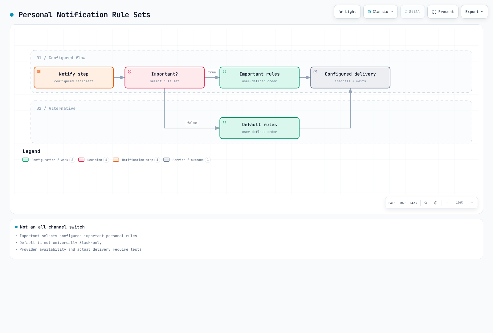

# Grafana OnCall

> **最終更新**: September 13, 2026

## 目次

- [Grafana OnCall の概要](#grafana-oncall-overview)
- [アーキテクチャ](#architecture)
- [インストール](#installation)
- [統合の設定](#integration-setup)
- [オンコールスケジュールの設定](#on-call-schedule-configuration)
- [エスカレーションチェーン](#escalation-chains)
- [アラートのグループ化とルーティング](#alert-grouping-and-routing)
- [ChatOps 統合](#chatops-integration)
- [Grafana IRM 統合](#grafana-irm-integration)
- [モバイルアプリ](#mobile-app)
- [PagerDuty/OpsGenie の比較](#pagerduty-opsgenie-comparison)
- [ベストプラクティス](#best-practices)

---

## Grafana OnCall の概要 {#grafana-oncall-overview}

**Grafana OnCall OSS は 2026-03-24 にアーカイブされました。** リポジトリは `grafana-cold-storage/oncall` に移動し、読み取り専用です。この章は既存インストールのレビューおよび移行を支援するものであり、新規の本番 OSS デプロイを推奨するものではありません。維持管理されている Grafana Cloud IRM の機能、API、プランは個別に確認してください。

**Cloud Connection は 2026-03-24 に終了しました。** Grafana IRM アプリを介した OSS モバイルプッシュ、および Cloud Connection に依存する SMS/音声通知は機能しなくなりました。個別に設定された Twilio やその他の通知サービスは別経路です。これは、すべてのセルフホスト電話/SMS メカニズムが終了したことを意味するものではありません。

レビューしたアーカイブ済みソースは `af0fbd40558c9a63bcf438589894c440fc434a54` です。最新リリースのラベルは v1.16.11 ですが、このソースの Helm chart/appVersion は 1.15.6 です。これらは交換可能なバージョン識別子ではありません。例はこのソースおよび公式 OnCall API ドキュメントに照らして確認しました。実際の OnCall アカウント作成、API 書き込み、通知送信は実行していません。

### 主な機能

1. **オンコールスケジュール管理**: ローテーション、上書き、休日管理
2. **エスカレーションチェーン**: 時間ベースの自動エスカレーション
3. **アラートのグループ化**: 関連するアラートを統合
4. **さまざまな統合**: Alertmanager、Grafana、CloudWatch、Webhook
5. **ChatOps**: Slack、MS Teams、Telegram 統合
6. **通知チャネル**: 利用可否はデプロイ、統合、ユーザールールに依存

### Grafana OnCall vs PagerDuty vs OpsGenie

| 選択肢 | 現在のレビュー基準 |
|---|---|
| OnCall OSS | アーカイブ済みの既存インストール。依存関係、復旧、移行の所有責任 |
| Grafana Cloud IRM / PagerDuty | 保守状況、必要なチャネル/スケジュール/API、リージョン、契約条件を確認 |
| Opsgenie | 2025-06-04 に販売終了。サービス/サポート終了は 2027-04-05 の予定。既存ユーザーには移行計画が必要 |

固定された統合数、古い価格、または主観的な基本/高度のランキングを使って製品を選定しないでください。

---

## アーキテクチャ {#architecture}

### Grafana OnCall コンポーネント

これらは論理的な責務であり、必ずしも別々の Deployment ではありません。インストール済みプロファイルの database.type、broker.type、Redis、engine/Celery の配置、プラグイン接続を確認してください。




[🔍 インタラクティブな図を表示](https://www.atomai.click/kubernetes-docs/archmaps/en-observability-alerting-03-grafana-oncall-0.html)

### アラート処理フロー


[🔍 インタラクティブな図を表示](https://www.atomai.click/kubernetes-docs/archmaps/en-observability-alerting-03-grafana-oncall-1.html)

---

## インストール {#installation}

### Helm によるインストール (EKS)

変更を検討する前に、既存リリース/chart/image digest、データベース、ブローカー、Grafana プラグイン、認証、チャネルの依存関係を棚卸ししてください。helm list、ワークロードイメージ、保護された helm get values/manifest 出力を比較します。values/manifest には実際の認証情報が含まれる可能性があります。チャット、Git、ビルドログではなく、非公開で保管してください。

アーカイブ済み chart には古い cert-manager、ingress-nginx、データベースの依存関係が含まれています。無関係な最新 Grafana chart とアーカイブ済みソースバージョンを混在させたり、単純な helm install コマンドを現在のセキュリティサポートの証拠として扱ったりしないでください。

### 基本的な values.yaml 設定

これらは確認したアーカイブ済み chart に存在する実際のキーです。古い例が暗黙に無視または誤解釈する可能性がある設定と区別します。

| 責務 | アーカイブ済み chart のキー |
|---|---|
| API/engine レプリカ | `engine.replicaCount`。`oncall.replicaCount` ではありません |
| URL | `base_url` と `base_url_protocol` |
| 追加の環境設定 | 生の Kubernetes env リストではなく `env` map |
| 外部 PostgreSQL | `externalPostgresql.db_name`、`existingSecret`、`passwordKey`、TLS オプション |
| 外部 Redis | `externalRedis.existingSecret`、`passwordKey`、`ssl_options` |
| アプリケーション暗号化キー | `oncall.secrets.existingSecret`、`secretKey`、`mirageSecretKey` |
| Telegram/Twilio | ネストされた `oncall.telegram` および `oncall.twilio` 設定 |

デフォルトでは MariaDB、RabbitMQ、Redis、Grafana、ingress-nginx、cert-manager、その他のコンポーネントが有効です。database.type を PostgreSQL に変更しても、MariaDB や無関係な依存関係は自動的に無効になりません。settings.hobby および汎用 Firebase YAML は、検証済みの本番プロファイルではありません。

### 本番用 values.yaml

レプリカを増やすだけでは単一障害点を排除できません。キューの永続性、重複作業、再試行、復旧を含め、engine、Celery、scheduler/beat、データベース、ブローカー/キャッシュ、プラグイン、通知プロバイダー、DNS、証明書の障害をテストしてください。RabbitMQ のブローカー責務を Redis と区別し、実際の broker.type を確認してください。

既存デプロイの所有者は、DB/Redis の TLS 検証、ロール固有のシークレット配布、ネットワークアクセス、バックアップ/復元、移行をレビューする必要があります。インターネット公開の ALB や外部データベースのホスト名があっても、設定が本番対応になるわけではありません。この監査では EKS のデプロイ、HA のテスト、実際の通知プロバイダーの実行は行っていません。

### シークレットの作成

実際の値を --from-literal 引数や平文の Helm values に渡さないでください。承認済みのシークレットストアまたは保護されたファイルを使用し、既存の暗号化キーはデータベースバックアップとともに管理してください。既存インストールの Mirage key/IV を無計画に変更すると、保存済みデータを復号できなくなる可能性があります。公開 API トークン、統合 webhook URL、Slack/Twilio/Telegram の認証情報には、それぞれ異なる権限とローテーション要件があります。

---

## 統合の設定 {#integration-setup}

### Alertmanager 統合

**選択した統合タイプ用に生成された完全な URL** を使用してください。URL 自体がシークレットになることがあるため、保護されたファイルに保存してください。`/api/v1/webhook/<id>/` パスを作り出して公開 API トークンと組み合わせないでください。次の Alertmanager 設定は、現在の matcher と両方の receiver を定義します。通知送信には使用していません。

```yaml
# Materialize the generated integration URL in this protected file.
# This example is not enabled or contacted during the documentation audit.
route:
  receiver: no-page
  group_by: [alertname, cluster, namespace, service]
  group_wait: 30s
  group_interval: 5m
  repeat_interval: 4h
  routes:
    - matchers: ['severity=~"critical|warning"']
      receiver: oncall
receivers:
  - name: no-page
  - name: oncall
    webhook_configs:
      - url_file: /etc/oncall/integration-url
        send_resolved: true
```

amtool 0.34 で構文と 4 つの critical/warning/info/fallback ルーティングケースを検証しました。send_resolved はソースの解決メッセージを転送します。手動による OnCall の解決でソースルールが自動変更されるわけではありません。

### Grafana Alerting 統合

インストール済みの Grafana/OnCall プラグインバージョンに対応する contact point と生成済み統合を確認してください。INI 設定、provisioning YAML、UI API は別物です。古い例では INI に誤って YAML というラベルを付けていました。Grafana Alerting のルール/通知状態と OnCall の alert-group 状態も別です。

### CloudWatch 統合

CloudWatch 固有の統合における SNS 確認、署名、ペイロード処理の要件を使用してください。任意の汎用 webhook に SNS をサブスクライブしても、互換性が保証されるわけではありません。ALARM/OK/INSUFFICIENT_DATA の遷移、確認、重複/再試行、topic/endpoint 権限、実際の配信をテストしてください。この監査では SNS サブスクリプションや alarm action は作成していません。

### Webhook 統合

汎用 webhook ペイロードは、明示的に設定された解析、グループ化、解決テンプレートに一致する必要があります。alert_uid、state、labels を送信しても、すべての統合がそれらを同じように解釈するわけではありません。JSON を適切にシリアライズし、HTTPS 検証、タイムアウト、エラー処理、再試行/重複排除の動作を設計してください。URL、トークン、個人データをログに出さないでください。

公開 API はドキュメント化された**生の Authorization トークン**を使用します。自動的に Bearer を追加しないでください。Grafana service-account-token 認証には X-Grafana-URL も必要です。API origin と統合 webhook は別の認証経路です。

[読み取り専用のインベントリツール](https://github.com/Atom-oh/kubernetes-docs/tree/main/examples/observability/oncall) は GET のみを使用し、ページネーションの origin/collection/count、TLS、リダイレクト、ファイル権限を検証します。その出力にはシークレットの統合 URL や個人データが含まれる場合があります。完全なデータベース/キー/履歴バックアップや、アトミックな移行スナップショットではありません。実際のアカウントへ問い合わせることなく、ローカル TLS fixture テストを 12 件通過しました。

---

## オンコールスケジュールの設定 {#on-call-schedule-configuration}

### スケジュールの概念

タイムゾーン、シフト優先度、上書きをまとめてレビューしてください。レイヤーを primary/secondary と命名しても、バックアップエスカレーションが自動設定されるわけではありません。API/UI で最終的な対応者を確認し、ギャップ、重複、DST、引き継ぎ境界をテストしてください。


[🔍 インタラクティブな図を表示](https://www.atomai.click/kubernetes-docs/archmaps/en-observability-alerting-03-grafana-oncall-2.html)

### スケジュールの作成 (API)

web schedule の `shifts` には、ネストされた shift オブジェクトではなく、**既存 shift の ID** が含まれます。`/api/v1/on_call_shifts/` で shift を作成し、返された ID を `/api/v1/schedules/` の web schedule に追加します。これらは実際の ID/日付を必要とする、オペレーターがレビューしたリクエスト例です。書き込みは実行していません。

```json
{
  "name": "Illustrative weekly rotation",
  "type": "rolling_users",
  "time_zone": "Asia/Seoul",
  "start": "2026-09-14T09:00:00",
  "duration": 604800,
  "frequency": "weekly",
  "interval": 1,
  "week_start": "MO",
  "start_rotation_from_user_index": 0,
  "rolling_users": [
    ["REPLACE_WITH_USER_ID_A"],
    ["REPLACE_WITH_USER_ID_B"]
  ]
}
```

```json
{
  "name": "Illustrative SRE schedule",
  "type": "web",
  "time_zone": "Asia/Seoul",
  "shifts": ["REPLACE_WITH_EXISTING_SHIFT_ID"]
}
```


### ローテーションタイプ

週次繰り返しには `week_start`、正の `interval`、rolling_users の開始ユーザーインデックスが必要です。日次/週次/時間次の繰り返しは、duration のみを変更することと同じではありません。ソース validator は、別個の time_zone とともに start を `YYYY-MM-DDTHH:MM:SS` として受け入れます。古いオフセット付き文字列をコピーしないでください。JSON の日付は例示用のサンプルであり、運用スケジュールではありません。

19 のチェックで、実際の upstream pure validator を実行し、serializer フィールドを確認します。データベースの user/shift の存在や、最終的なカレンダー割り当てを証明するものではありません。

### 上書き設定

このソースでは、上書きは古く想定されていた `/schedules/<id>/overrides/` リクエストではなく、独立した `/api/v1/on_call_shifts/` type です。既存 shift ID を保持しながら、意図した schedule に接続してください。インストール済み API の関連付け/優先度の動作を確認し、限定したテスト期間で最終対応者を確認してください。

```json
{
  "name": "Illustrative temporary replacement",
  "type": "override",
  "time_zone": "Asia/Seoul",
  "start": "2026-09-15T09:00:00",
  "duration": 28800,
  "users": ["REPLACE_WITH_EXISTING_USER_ID"]
}
```


---

## エスカレーションチェーン {#escalation-chains}

### エスカレーションチェーンの構造

Acknowledge、Resolve、Silence は異なる状態です。確認応答は根本的な問題を修正したり、ソースルールを無効化したりしません。実際のポリシーおよび統合状態を使用して、待機、停止、再ページングの条件を確認してください。図の 15 分間のウィンドウは例示的なポリシーであり、製品の保証ではありません。



[🔍 インタラクティブな図を表示](https://www.atomai.click/kubernetes-docs/archmaps/en-observability-alerting-03-grafana-oncall-3.html)

### エスカレーションチェーンの作成

既存 chain、schedule、user の ID と権限を確認し、作成/更新リクエストを個別にレビューしてください。これは完全な chain 作成リクエストではなく、/api/v1/escalation_policies/ 用の**1 つの wait ステップ**です。確認したソースは、秒単位で表す 1 分から 24 時間の wait duration を受け入れます。

```json
{
  "escalation_chain_id": "REPLACE_WITH_EXISTING_CHAIN_ID",
  "position": 1,
  "type": "wait",
  "duration": 900
}
```


### エスカレーションポリシータイプ

ソース serializer は、schedule/user/team/group 通知、wait、時間/回数条件、custom webhook、機能が有効な incident 宣言をサポートします。custom webhook の参照は action_to_trigger です。古い webhook_id や汎用的な repeat_after フィールドを想定しないでください。declare_incident は存在しますが、organization の機能有効化が必要です。

important:true はユーザーに設定された**重要な通知ルール**を選択します。すべてのチャネルへ無条件に配信するわけではありません。ユーザーごとの default/important ルールの順序、待機、チャネル、実際の可用性をレビューしてください。


### 重大度別のエスカレーションチェーン

重大度別の目的、対応時間枠、バックアップ、勤務時間、再ページング動作について合意してください。同じ schedule に再度通知しても、必ず異なる次の対応者に通知することを意味するわけではありません。実際の repeat/conditional-step API フィールドを確認し、1 つの incident に対する重複ページングを防止してください。実際の電話/SMS/webhook 配信には承認済みのテストパスが必要であり、ここでは実行していません。


---

## アラートのグループ化とルーティング {#alert-grouping-and-routing}

### ルート設定

各統合の実際のペイロード、ルート順序、未一致イベントのデフォルトルートを確認してください。Alertmanager、Grafana、CloudWatch のペイロードは異なります。任意のメッセージテキストに一致する regex は誤ルーティングを引き起こす可能性があります。正常、欠損、不正、競合するケースをテストしてください。



[🔍 インタラクティブな図を表示](https://www.atomai.click/kubernetes-docs/archmaps/en-observability-alerting-03-grafana-oncall-4.html)

### ルートの作成

この例では、確認した route serializer に存在するフィールドを使用しています。Slack は古いフラットな slack_channel_id ではなく、ネストされた slack.channel_id/enabled を使用します。実際の integration/chain/channel ID と認可が必要です。regex は特定のペイロード用の例示であり、汎用プロバイダーテンプレートではありません。

```json
{
  "integration_id": "REPLACE_WITH_EXISTING_INTEGRATION_ID",
  "routing_type": "regex",
  "routing_regex": "\"severity\"\\s*:\\s*\"critical\"",
  "position": 0,
  "escalation_chain_id": "REPLACE_WITH_EXISTING_CHAIN_ID",
  "slack": {
    "channel_id": "REPLACE_WITH_EXISTING_SLACK_CHANNEL_ID",
    "enabled": true
  }
}
```


### アラートグループ化の設定

衝突を避けるため、グループ化キーには適切な cluster/environment/namespace/service スコープを含めてください。フィールドが少なすぎると無関係な incident が統合され、無制限の ID はグループを細分化します。古い混在した group_wait/group_interval/resolve_timeout YAML は、汎用的な OnCall 統合スキーマではありません。Alertmanager の timer と OnCall のグループ化/解決テンプレートを区別してください。

テンプレート変数は実際の統合ペイロードから選択してください。payload.labels は保証されておらず、Alertmanager リクエストの最上位に常に存在するわけでもありません。JSON を適切にエスケープし、ユーザー入力を信頼できるコードとして扱わないでください。


---

## ChatOps 統合 {#chatops-integration}

### Slack 統合

インストール済み Slack アプリの OAuth/signing secret、scope、workspace 接続を確認してください。ルートのネストされた Slack 設定を通じて検出済みの slack_channels を参照します。古い POST /slack_channels の例が channel を作成/接続すると想定しないでください。アプリのインストールとユーザー操作には、別の承認済み運用手順が必要であり、ここでは実行していません。


### Slack コマンド

古い /oncall ack、/oncall resolve、/oncall silence のリストは、確認したソースで確立されていません。これは設定可能な root command と /grafana の例を使用します。インストール済みアプリの現在のヘルプ/ドキュメントとボタンを確認してください。slash command は Bash command ではありません。


### Slack ワークフロー

Acknowledge/Resolve/Silence ボタンは、認可されたユーザー操作を通じて OnCall 状態を変更します。配信の確認応答、Slack メッセージの更新、ソース monitor の状態は別です。自動的に逆方向の状態更新が行われると想定しないでください。



[🔍 インタラクティブな図を表示](https://www.atomai.click/kubernetes-docs/archmaps/en-observability-alerting-03-grafana-oncall-5.html)

### MS Teams 統合

Microsoft が現在サポートしている webhook/workflow と card format を確認してください。古い Office connector URL と MessageCard JSON を、汎用的な新規統合としてコピーしないでください。outgoing webhook は YAML を書くだけでインストールされるわけではありません。template context、認証、ペイロード、配信、障害には実際の設定が必要です。Teams メッセージは送信していません。


### Telegram 統合

アーカイブ済み chart は、ネストされた oncall.telegram token/existingSecret/tokenKey 設定と、別個の telegramPolling を使用します。Bash というラベルが付いた古い最上位 telegram.enabled block は、正しい Helm 設定ではありません。bot 認証情報、webhook/polling の所有権、ユーザー連携、現在の可用性を確認してください。bot 作成やユーザーメッセージ送信は実行していません。


---

## Grafana IRM 統合 {#grafana-irm-integration}

### インシデント対応管理

維持管理されている Grafana Cloud IRM の alerting/on-call/incident 機能を、アーカイブ済み OnCall OSS と区別してください。IRM は単なる Grafana Incident の改名ではなく、同一の OSS API、権限、機能範囲を保証するものでもありません。移行先の現在の機能、契約、保持、export/import サポートを確認してください。


[🔍 インタラクティブな図を表示](https://www.atomai.click/kubernetes-docs/archmaps/en-observability-alerting-03-grafana-oncall-6.html)

### インシデントの自動作成

確認したソースには実際の declare_incident ステップが含まれていますが、organization の機能有効化を検証します。任意の severity/title_template YAML を追加しても incident 統合は設定されません。alert group、incident、確認応答、解決、postmortem を区別し、承認済みテストで所有権/状態遷移を確認してください。

---

## モバイルアプリ {#mobile-app}

### モバイルアプリの機能

サポートされるアプリ/デプロイの組み合わせでは、バックエンド接続、OS 権限、ネットワーク、ユーザールールに従って、アラートフィード、状態操作、スケジュール、通知を提供できます。すべてのセルフホストインストールで即時配信やプッシュが機能することは保証されません。


### モバイルアプリの設定

古い mobile.firebase block は、確認したアーカイブ済み chart のキーではありません。任意の Firebase service-account ファイルで動作するプッシュが確立されるわけではありません。Cloud Connection は終了しています。この接続を使用する OSS Grafana IRM アプリのプッシュおよび SMS/音声は利用できません。個別にサポートされる Twilio/notification-service 経路または移行先を設定して検証してください。Firebase project/account やプッシュ通知は作成していません。


### 通知チャネルの優先順位

Important/default は、別々の個人用通知ルールセットを選択します。それらの順序、待機、チャネル、可用性が適用されます。important はすべてのチャネルへの同時配信を意味しません。配信、確認応答、エスカレーション動作をテストしてください。



[🔍 インタラクティブな図を表示](https://www.atomai.click/kubernetes-docs/archmaps/en-observability-alerting-03-grafana-oncall-7.html)

---

<span id="pagerdutyopsgenie-comparison"></span>

## PagerDuty/OpsGenie の比較 {#pagerduty-opsgenie-comparison}

### 機能比較

同一の要件を、実際のプラン、使用状況、契約に照らして比較してください。古いユーザー単価、統合数、基本/高度のランキングは、現在の選定根拠ではありません。schedule/override、条件付きエスカレーション、SSO、保持、API 権限、チャネル/国の制限、サポート、移行コストを確認してください。OnCall OSS はアーカイブ済みであり、Opsgenie は発表済みのライフサイクルに対する移行計画が必要です。


### 移行に関する考慮事項

PagerDuty/Opsgenie から OnCall OSS への新規移行は、もはやデフォルトの方向ではありません。既存の OnCall/終了予定ツールのデータと依存関係を棚卸しし、維持管理された移行先の機能差異と復旧を検証してください。無料のコードであっても、ホスティング、運用、サポート、コミュニケーションのコストはなくなりません。


[🔍 インタラクティブな図を表示](https://www.atomai.click/kubernetes-docs/archmaps/en-observability-alerting-03-grafana-oncall-8.html)

### 移行チェックリスト

- [ ] ユーザー/チーム、スケジュール/タイムゾーン/上書き、チェーン/ルート、テンプレート、統合を棚卸しする
- [ ] 個別のデータベース/キー/設定/履歴バックアップと復旧テストを準備する
- [ ] 移行先の機能、ID マッピング、権限、プライバシー、保持を確認する
- [ ] 合成した発火/解決/欠損/再試行/重複/無応答/引き継ぎケースをテストする
- [ ] 並行運用中の重複ページングを防止し、所有権、切り替え、ロールバック基準を定義する
- [ ] 承認済みの順序でソース URL/トークンを切り替え、検証後に不要なアクセスを廃止する
- [ ] 対応者トレーニングと運用引き継ぎを完了する

固定された 1 ～ 2 週間の重複期間は保証ではなく、API インベントリは完全なバックアップではありません。


---

## ベストプラクティス {#best-practices}

### オンコールスケジュールの設計

実際のタイムゾーン、休日、引き継ぎ、バックアップ、人員配置を使用してスケジュールに合意してください。週次シフト、09:00 の引き継ぎ、または最低 3/4 人は、普遍的な答えではありません。進行中の incident、期限切れになる silence、カバレッジのギャップを引き継いでください。


### エスカレーションの設計

重大度別のアクション/対応目標、バックアップ/管理経路、再ページング、停止条件を文書化してください。割り込みページには実行可能な対応が必要です。緊急でない情報には別の経路を使用できます。important は電話/SMS 配信を保証しません。


### アラート品質管理

繰り返し、誤検知、見逃しイベント、配信失敗、実際の対応結果をレビューしてください。filter/template/grouping/source URL を変更した後にデータと状態遷移を再確認し、安全な復元経路を保持してください。


### オンコールのウェルビーイング

ワークロード、報酬、回復時間、責任についてチームと合意してください。繰り返される incident の原因を減らし、runbook、自動化、引き継ぎを改善してください。具体的なシフト/回復期間は、文脈に応じた運用ポリシーです。


---

## クイズ

[Grafana OnCall クイズ](../../quizzes/observability/alerting/03-grafana-oncall-quiz.md)で知識を確認してください。

## 参考資料

- [OnCall OSS ライフサイクル](https://grafana.com/docs/oncall/latest/)
- [OnCall API リファレンス](https://grafana.com/docs/oncall/latest/oncall-api-reference/)
- [アーカイブ済みソース契約](https://github.com/grafana-cold-storage/oncall/tree/af0fbd40558c9a63bcf438589894c440fc434a54)
- [Opsgenie ライフサイクル](https://www.atlassian.com/software/opsgenie)
- [Cloud Connection の終了と代替手段](https://grafana.com/docs/oncall/latest/set-up/open-source/)
