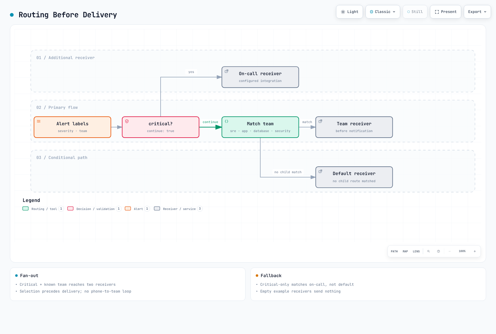

# アラートの概要

> **最終更新**: September 13, 2026


> レビュー基準: Prometheus 3.14.0 および Alertmanager 0.34.0。例では 1 つの cluster と重複排除された series を想定しています。実際の job、label、exporter、metric の可用性を確認してから、threshold を調整してください。ローカルの rule/routing チェックのみを実行しており、cluster または notification channel は検証していません。


## 目次

- [アラートの役割と重要性](#the-role-and-importance-of-alerting)
- [アラートのライフサイクル](#alert-lifecycle)
- [アラート設計の原則](#alert-design-principles)
- [アラートのルーティングとエスカレーション](#alert-routing-and-escalation)
- [オンコールローテーション](#on-call-rotation)
- [EKS 環境におけるアラート戦略](#alerting-strategy-for-eks-environments)
- [ソリューション比較](#solution-comparison)

---

<span id="the-role-and-importance-of-alerting"></span>

## アラートの役割と重要性

### オブザーバビリティの 3 つの柱におけるアラートの位置付け

Metrics、logs、traces は一般的なオブザーバビリティシグナルであり、profiles やその他のシグナルも存在します。rule engine が必ずしもこれら 3 つすべてを直接評価するわけではありません。


[🔍 インタラクティブ図を表示](https://www.atomai.click/kubernetes-docs/archmaps/en-observability-alerting-readme-0.html)

- **Metrics**: システムの定量的な状態（CPU、memory、request count など）
- **Logs**: event の詳細な記録
- **Traces**: 分散システムにおける request のフロー

Prometheus rule は metrics を評価します。logs と traces は backend 固有の rule または派生 metric を通じてアラートに入力されます。検出、通知、人間による acknowledgment は別々の段階であり、配信の成功には独自の monitoring が必要です。

### アラートが必要な理由

1. **プロアクティブな問題対応**: ユーザーが問題を経験する前に issue を検出する
2. **ダウンタイムの最小化**: 迅速な検出と対応により service availability を向上させる
3. **コスト削減**: 自動 monitoring により人件費を削減する
4. **SLA/SLO 準拠**: service level objective を達成するための必須要素
5. **Incident の記録**: 問題発生履歴を追跡して分析する

### 良いアラートと悪いアラート

| 観点 | 良いアラート | 悪いアラート |
|--------|-------------|------------|
| **実行可能性** | 即時の対応が必要 | 情報のみで、対応不要 |
| **明確さ** | 問題が何であるか明確 | 曖昧で不明確 |
| **緊急度** | 緊急度が severity と一致 | すべてが緊急 |
| **頻度** | 適切な頻度 | 頻繁すぎる、または少なすぎる |
| **重複** | 関連するアラートをグループ化 | 同じ issue に対して多数のアラート |

---

<span id="alert-lifecycle"></span>

## アラートのライフサイクル

この図は rule state と incident response を組み合わせています。Prometheus は inactive/pending/firing を使用します。acknowledgment と work-in-progress はオンコールツールに属します。incident をクローズしても firing rule はクリアされません。time series が消失した場合も rule が非アクティブになることがあり、復旧の証拠として扱ってはなりません。


[🔍 インタラクティブ図を表示](https://www.atomai.click/kubernetes-docs/archmaps/en-observability-alerting-readme-1.html)

### 1. 検出

- **Threshold ベース**: 特定の値が構成済みの threshold を超えた場合
- **変化率ベース**: 変化率が異常な場合
- **Anomaly detection**: machine learning ベースの異常パターン検出
- **Log pattern**: 特定の log pattern が発生した場合

```yaml
groups:
  - name: node-alerts
    rules:
      - alert: HighCPUUsage
        expr: 100 * (1 - avg by (cluster, instance) (rate(node_cpu_seconds_total{mode="idle"}[5m]))) > 80
        for: 5m
        labels:
          severity: warning
          team: sre
        annotations:
          summary: "High CPU usage detected"
          description: "CPU usage is above 80% for 5 minutes on {{ $labels.instance }}"
```

### 2. 通知

- **Channel の選択**: Slack、Email、SMS、PagerDuty など
- **Routing**: alert type に基づいて適切な receiver に配信する
- **Grouping**: 関連するアラートをまとめる
- **Deduplication**: 重複通知を削減する。exactly-once の保証はなく、repeat_interval の reminder と retry は発生する可能性があります

### 3. エスカレーション

- **時間ベース**: 指定時間内に応答がなければ次の responder にエスカレーションする
- **Severity ベース**: severity に基づいて異なるエスカレーションパスを使用する
- **自動エスカレーション**: オンコール service で構成します。Alertmanager の repeat_interval は acknowledgment の確認も responder の交代も行いません


[🔍 インタラクティブ図を表示](https://www.atomai.click/kubernetes-docs/archmaps/en-observability-alerting-readme-2.html)

### 4. 解決

- **手動解決**: responder が incident tool で incident をクローズし、rule state は個別に確認する
- **自動解決**: rule と collection health を確認後、integration policy に従って incident state を更新する
- **解決通知**: 問題が修正されたときに解決通知を送信する

---

<span id="alert-design-principles"></span>

## アラート設計の原則

### 1. 実行可能なアラート

人を中断させる page には、即時に実行可能な対応が必要です。情報提供 event や長期的な作業は、代わりに ticket または dashboard に送ることができます。

**悪い例:**
```
Alert: Database connection count increased
```

**良い例:**
```
Alert: Database connection pool exhausted
Action Required: Confirm user impact; inspect pool saturation and connection leaks using the runbook
Runbook: https://example.com/runbooks/replace-db-runbook
```

### 2. アラート疲れの防止

アラートが多すぎると、重要なアラートを見逃す可能性があります。


[🔍 インタラクティブ図を表示](https://www.atomai.click/kubernetes-docs/archmaps/en-observability-alerting-readme-3.html)

**アラート疲れを防止する戦略:**

1. **Threshold の調整**: 敏感すぎる threshold を設定しない
2. **Alert grouping**: 関連するアラートを 1 つにまとめる
3. **Inhibition**: 親 alert が firing のときに子 alert を抑制する
4. **定期的なレビュー**: 不要なアラートを削除する
5. **段階的な導入**: 新しいアラートは最初に低い severity で開始する

### 3. Severity レベル

これらの response time は例示的な組織の policy であり、product SLA や普遍的な推奨事項ではありません。

| Severity | 説明 | Response Time | 例 |
|----------|-------------|---------------|----------|
| **Critical** | service の完全な停止 | 即時（5 分以内） | service 全体の停止、data loss のリスク |
| **High** | 主要機能の障害 | 15 分以内 | payment system error、login failure |
| **Warning** | 潜在的な問題 | 1 時間以内 | disk usage 80%、response latency の増加 |
| **Info** | 情報提供アラート | 営業時間内 | Deployment 完了、backup 成功 |

```yaml
groups:
  - name: disk-alerts
    rules:
      - alert: DiskSpaceCritical
        expr: |
          (100 * node_filesystem_avail_bytes{fstype!~"tmpfs|overlay|squashfs"}
            / node_filesystem_size_bytes{fstype!~"tmpfs|overlay|squashfs"} < 5)
          and node_filesystem_readonly == 0
          and node_filesystem_size_bytes > 0
        for: 5m
        labels:
          severity: critical
          team: sre
        annotations:
          summary: "Disk space critical"
      - alert: DiskSpaceWarning
        expr: |
          (100 * node_filesystem_avail_bytes{fstype!~"tmpfs|overlay|squashfs"}
            / node_filesystem_size_bytes{fstype!~"tmpfs|overlay|squashfs"} < 20)
          and node_filesystem_readonly == 0
          and node_filesystem_size_bytes > 0
        for: 10m
        labels:
          severity: warning
          team: sre
        annotations:
          summary: "Disk space low"
```

### 4. アラートのドキュメント

すべてのアラートには次の情報を含める必要があります。

- **説明**: アラートの意味
- **Impact**: この問題が service に与える影響
- **Action steps**: 問題を解決するためのステップごとのガイド
- **Runbook link**: 詳細な対応手順書

```yaml
annotations:
  summary: "Investigate the affected operation"
  description: "Check the rule expression, its units, labels, and collection health."
  impact: "Document the affected user operation before paging."
  action: "Use the owning team's reviewed runbook; do not scale resources blindly."
  runbook_url: "https://example.com/runbooks/replace-with-reviewed-runbook"
```

---

<span id="alert-routing-and-escalation"></span>

## アラートのルーティングとエスカレーション

### Routing 戦略

アラートはさまざまな条件に基づいて適切な receiver に配信する必要があります。



[🔍 インタラクティブ図を表示](https://www.atomai.click/kubernetes-docs/archmaps/en-observability-alerting-readme-5.html)

### Routing Tree の設計

これは完全な**通知しない** routing-validation configuration です。空の receiver は意図的なものです。本番使用前にレビュー済み integration と Secret file を構成してください。Critical alert はオンコール receiver と一致する team に fan out されます。team label がない場合は default にフォールバックしますが、critical のみの match は default も呼び出しません。grouping delay のため、即時の電話を保証するものではありません。Disk critical は同じ instance/device/mountpoint の warning のみを inhibit します。

```yaml
route:
  receiver: default-receiver
  group_by: [alertname, cluster, namespace, service]
  group_wait: 30s
  group_interval: 5m
  repeat_interval: 4h
  routes:
    - matchers: ['severity="critical"']
      receiver: critical-oncall
      continue: true
    - matchers: ['team="sre"']
      receiver: sre-team
    - matchers: ['team="app"']
      receiver: dev-team
    - matchers: ['team="database"']
      receiver: dba-team
    - matchers: ['team="security"']
      receiver: security-team
receivers:
  - name: default-receiver
  - name: critical-oncall
  - name: sre-team
  - name: dev-team
  - name: dba-team
  - name: security-team
inhibit_rules:
  - source_matchers: ['alertname="DiskSpaceCritical"', 'instance!=""', 'device!=""', 'mountpoint!=""']
    target_matchers: ['alertname="DiskSpaceWarning"', 'instance!=""', 'device!=""', 'mountpoint!=""']
    equal: [cluster, instance, device, mountpoint]
```

### エスカレーション policy

以下は例示です。オンコール service で time zone、acknowledgment window、backup、再 page の動作を構成し、drill でテストしてください。

| ステップ | 時間 | 対象 | Channel |
|------|------|--------|---------|
| 1 | 0 分 | Primary on-call | Slack、PagerDuty |
| 2 | 15 分 | Secondary on-call | Slack、PagerDuty、SMS |
| 3 | 30 分 | Team Lead | Slack、PagerDuty、Phone |
| 4 | 45 分 | Engineering Manager | Phone |
| 5 | 60 分 | CTO/VP Engineering | Phone |

---

<span id="on-call-rotation"></span>

## オンコールローテーション

### オンコールの概念

オンコールとは、指定された期間中に system issue を担当するよう指定された responder を指します。


[🔍 インタラクティブ図を表示](https://www.atomai.click/kubernetes-docs/archmaps/en-observability-alerting-readme-8.html)


### オンコールのベストプラクティス

1. **明確な handoff schedule**: 毎週または隔週の rotation
2. **Handoff process**: シフト交代時に継続中の issue を引き継ぐ
3. **Backup responder**: primary が対応できない場合の backup
4. **適切な compensation**: オンコール手当または代休
5. **Burnout の防止**: 適切な rotation cycle

### オンコールツールの要件

- **Schedule management**: calendar integration、shift management
- **Override**: 一時的な responder の変更
- **Escalation**: 自動エスカレーション
- **Mobile support**: いつでもどこでもアラートを受信
- **Reporting**: オンコール activity の分析

---

<span id="alerting-strategy-for-eks-environments"></span>

## EKS 環境におけるアラート戦略

### EKS 固有のアラート領域


[🔍 インタラクティブ図を表示](https://www.atomai.click/kubernetes-docs/archmaps/en-observability-alerting-readme-4.html)

### レイヤー別のアラート戦略

#### 1. Cluster レベルのアラート

job 名をデプロイ済みの target に置き換えてください。up=0 は scrape failure を証明しますが、完全な API outage を証明するものではありません。absent rule は 1 つの collection scope を対象とします。multi-cluster setup には expected-target inventory と cluster label が必要です。累積的な Cluster Autoscaler error counter には increase を使用します。5 分間存在する最近の increase は、error が 5 分間連続して発生したことを意味しません。この rule は Karpenter または EKS Auto Mode にはそのまま適用できません。

```yaml
groups:
  - name: eks-cluster
    rules:
      - alert: EKSAPIServerScrapeFailed
        expr: up{job="kubernetes-apiservers"} == 0
        for: 1m
        labels:
          severity: critical
          team: sre
        annotations:
          summary: "Prometheus cannot scrape the configured API server target"
      - alert: EKSAPIServerTargetMissing
        expr: absent(up{job="kubernetes-apiservers"})
        for: 5m
        labels:
          severity: warning
          team: sre
        annotations:
          summary: "No API server target series in this Prometheus"
      - alert: EKSNodeNotReady
        expr: kube_node_status_condition{condition="Ready",status="true"} == 0
        for: 5m
        labels:
          severity: critical
          team: sre
        annotations:
          summary: "Node {{ $labels.node }} is not ready"
      - alert: EKSClusterAutoscalerRecentErrors
        expr: increase(cluster_autoscaler_errors_total[10m]) > 0
        for: 5m
        labels:
          severity: warning
          team: sre
        annotations:
          summary: "Cluster Autoscaler recorded failed loops in the last 10 minutes"
```

#### 2. Workload レベルのアラート

CrashLoopBackOff series は retry の間に短時間消失することがあります。この rule は、最近 5 分間の observation window が 10 分間にわたり存在し続けた後に firing します。連続的な現在の Waiting ではなく、繰り返しの observation を検出し、最後の observation から最大 5 分間アクティブのままとなる可能性があります。native rule test は短い transient、繰り返す retry、recovery を区別します。

```yaml
groups:
  - name: eks-workloads
    rules:
      - alert: PodCrashLooping
        expr: max_over_time(kube_pod_container_status_waiting_reason{reason="CrashLoopBackOff"}[5m]) >= 1
        for: 10m
        labels:
          severity: warning
          team: app
        annotations:
          summary: "Pod {{ $labels.namespace }}/{{ $labels.pod }} repeatedly observed in CrashLoopBackOff"
      - alert: PodFrequentRestarts
        expr: increase(kube_pod_container_status_restarts_total[15m]) > 3
        for: 5m
        labels:
          severity: warning
          team: app
        annotations:
          summary: "Pod {{ $labels.namespace }}/{{ $labels.pod }} has frequent restarts"
      - alert: PodNotReady
        expr: |
          (kube_pod_status_ready{condition="true"} == 0)
          and on (namespace, pod, uid)
          (kube_pod_status_phase{phase=~"Pending|Running|Unknown"} == 1)
        for: 15m
        labels:
          severity: warning
          team: app
        annotations:
          summary: "Active pod {{ $labels.namespace }}/{{ $labels.pod }} is not ready"
      - alert: DeploymentReplicasMismatch
        expr: |
          kube_deployment_spec_replicas
            > on (namespace, deployment) kube_deployment_status_replicas_available
        for: 10m
        labels:
          severity: warning
          team: app
        annotations:
          summary: "Deployment {{ $labels.namespace }}/{{ $labels.deployment }} has fewer available replicas than desired"
```

#### 3. Resource レベルのアラート

CFS の例は、経過時間の割合ではなく、**throttled period / total period** を測定します。cAdvisor がこれらの metric を export していることを確認してください。unlimited memory は zero または非常に大きな値として現れる可能性があります。memory rule は明示的な limit を持つ container に制限してください。PVC statistics は CSI driver と volume type に依存します。zero denominator は除外されますが、metric がないことは健全性を証明しません。

```yaml
groups:
  - name: eks-resources
    rules:
      - alert: ContainerCPUThrottling
        expr: |
          (
            sum by (namespace, pod, container) (
              rate(container_cpu_cfs_throttled_periods_total{container!="",container!="POD"}[5m]))
            / sum by (namespace, pod, container) (
              rate(container_cpu_cfs_periods_total{container!="",container!="POD"}[5m]))
          ) > 0.25
          and sum by (namespace, pod, container) (
            rate(container_cpu_cfs_periods_total{container!="",container!="POD"}[5m])) > 0
        for: 5m
        labels:
          severity: warning
          team: app
        annotations:
          summary: "More than 25% of CFS periods throttled for {{ $labels.pod }}/{{ $labels.container }}"
      - alert: ContainerMemoryNearLimit
        expr: |
          (
            container_memory_working_set_bytes{container!="",container!="POD"}
            / container_spec_memory_limit_bytes{container!="",container!="POD"}
          ) > 0.9
          and container_spec_memory_limit_bytes{container!="",container!="POD"} > 0
        for: 5m
        labels:
          severity: warning
          team: app
        annotations:
          summary: "Container {{ $labels.pod }}/{{ $labels.container }} memory is near its reported limit"
      - alert: PVCAlmostFull
        expr: |
          (kubelet_volume_stats_used_bytes / kubelet_volume_stats_capacity_bytes > 0.85)
          and kubelet_volume_stats_capacity_bytes > 0
        for: 5m
        labels:
          severity: warning
          team: sre
        annotations:
          summary: "PVC {{ $labels.namespace }}/{{ $labels.persistentvolumeclaim }} is almost full"
```

### AWS Service Integration アラート

EKS 1.28+ は AWS/EKS に選択された control-plane metric を提供しますが、scraping 用にすべての内部 component を公開するわけではありません。authentication error を調査するには、control-plane log を個別に有効化してください。collection health、API request failure、external probe を使用して availability を評価してください。

| AWS Service | Monitoring 項目 | Alert Tool |
|-------------|------------------|------------|
| EKS Control Plane | API Server availability、authentication error | CloudWatch |
| EC2 (Nodes) | Instance status、system check | CloudWatch |
| EBS | Volume status、IOPS usage | CloudWatch |
| EFS | Throughput、connection count | CloudWatch |
| ALB / NLB | ALB HTTP request/error/response time、NLB flow/TCP reset/target health | CloudWatch: product 固有の metric を使用 |
| VPC / NAT Gateway | NAT metric、個別に有効化した Flow Logs の accepted/rejected record | CloudWatch metrics/Logs。Flow Logs は alarm engine ではありません |

---

<span id="solution-comparison"></span>

## ソリューション比較

### 主なアラートソリューションの比較表

| Product | 役割と運用上の制約 |
|---------|--------------------------------|
| Alertmanager | オープンソースの grouping、routing、inhibition、reminder。hosting と operation が必要。オンコール schedule や acknowledgment ベースの escalation はありません |
| CloudWatch Alarms | AWS metric/supported query を評価し、state を変更して構成済みの action を実行する。schedule は別途必要 |
| Grafana OnCall OSS | 2026-03-24 に archive 済み。新しい production deployment のデフォルト選択肢ではありません |
| Grafana Cloud IRM / PagerDuty | オンコール/escalation の候補。現在の plan、channel、region、contract を確認してください |
| Opsgenie | 2025-06-04 に販売終了。support と service の終了は 2027-04-05 に予定されています。既存ユーザーには migration plan が必要です |

### ソリューション選択ガイド


[🔍 インタラクティブ図を表示](https://www.atomai.click/kubernetes-docs/archmaps/en-observability-alerting-readme-6.html)

#### 状況別の推奨ソリューション

1. Prometheus 重視: Alertmanager を grouping/routing に使用し、必要な channel を接続します。
2. AWS metric 重視: SNS またはサポートされる incident integration を使用して CloudWatch Alarms を評価します。
3. 24 時間対応: staffing、backup、time zone、acknowledgment、escalation、cost に基づいて、保守されているオンコール service を選択します。
4. 既存の Grafana OnCall OSS/Opsgenie: 機能、history、schedule、integration の migration を確認します。

### ハイブリッドアプローチ

ソリューションは組み合わせることができます。CloudWatch は自動的に Alertmanager へ直接送信しません。この例では、オンコール service への SNS/サポート対象 integration を使用しています。Alertmanager を経由した routing には、個別に設計された adapter、authentication、duplicate/resolution の処理が必要です。


[🔍 インタラクティブ図を表示](https://www.atomai.click/kubernetes-docs/archmaps/en-observability-alerting-readme-7.html)

**アーキテクチャ例:**

1. **Prometheus + Alertmanager**: Metric collection と primary alert processing
2. **CloudWatch**: AWS service metric collection
3. **保守されているオンコール service**: オンコール管理と escalation
4. **Slack**: リアルタイムアラートと collaboration

---

## 次のステップ

このセクションでは、アラートの基本概念と戦略について説明しました。各ソリューションの詳細な構成方法については、以下のドキュメントを参照してください。

- [Prometheus Alertmanager](./01-alertmanager.md): オープンソースのアラート管理
- [CloudWatch Alarms](./02-cloudwatch-alarms.md): AWS ネイティブのアラート
- [Grafana OnCall](./03-grafana-oncall.md): 既存 installation のレビューと migration に関する考慮事項

---

## 参考資料

- [Prometheus Alerting Best Practices](https://prometheus.io/docs/practices/alerting/)
- [Google SRE Book - Practical Alerting](https://sre.google/sre-book/practical-alerting/)
- [AWS CloudWatch Alarms Documentation](https://docs.aws.amazon.com/AmazonCloudWatch/latest/monitoring/AlarmThatSendsEmail.html)
- [Grafana OnCall Documentation](https://grafana.com/docs/oncall/latest/)
- [PagerDuty Operations Guide](https://www.pagerduty.com/resources/operations/)

- [Alertmanager configuration](https://prometheus.io/docs/alerting/latest/configuration/)
- [EKS control-plane metrics](https://docs.aws.amazon.com/eks/latest/userguide/cloudwatch.html)
- [Opsgenie lifecycle and migration](https://www.atlassian.com/software/opsgenie)
