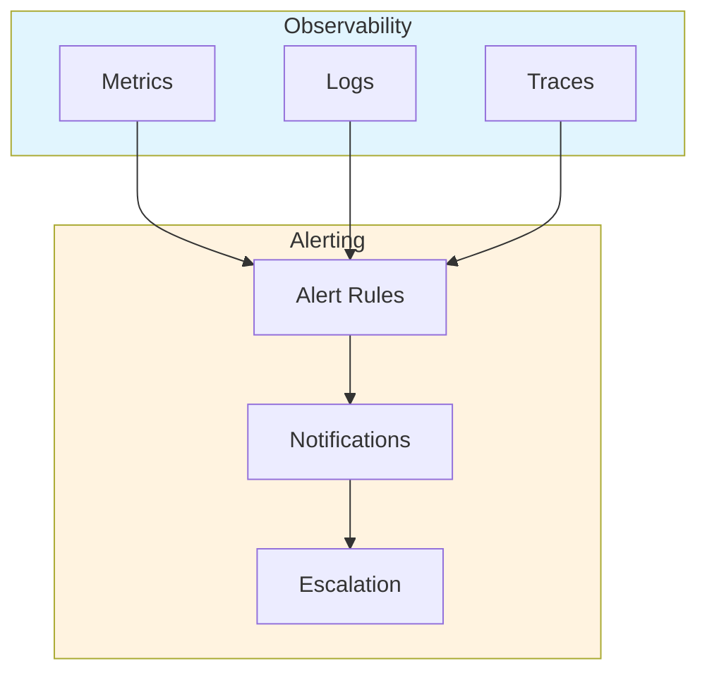
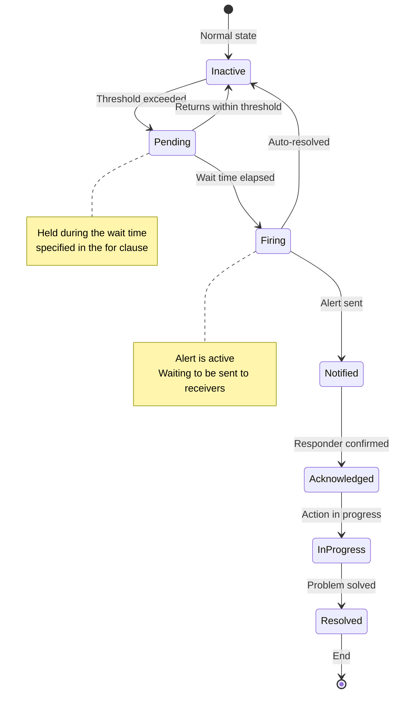
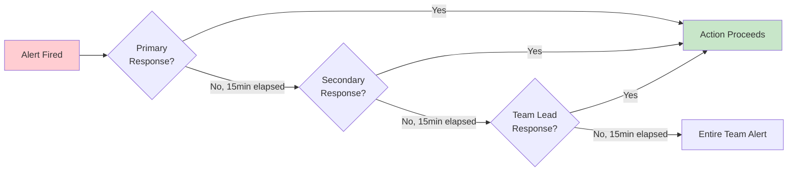
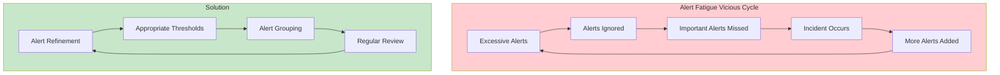
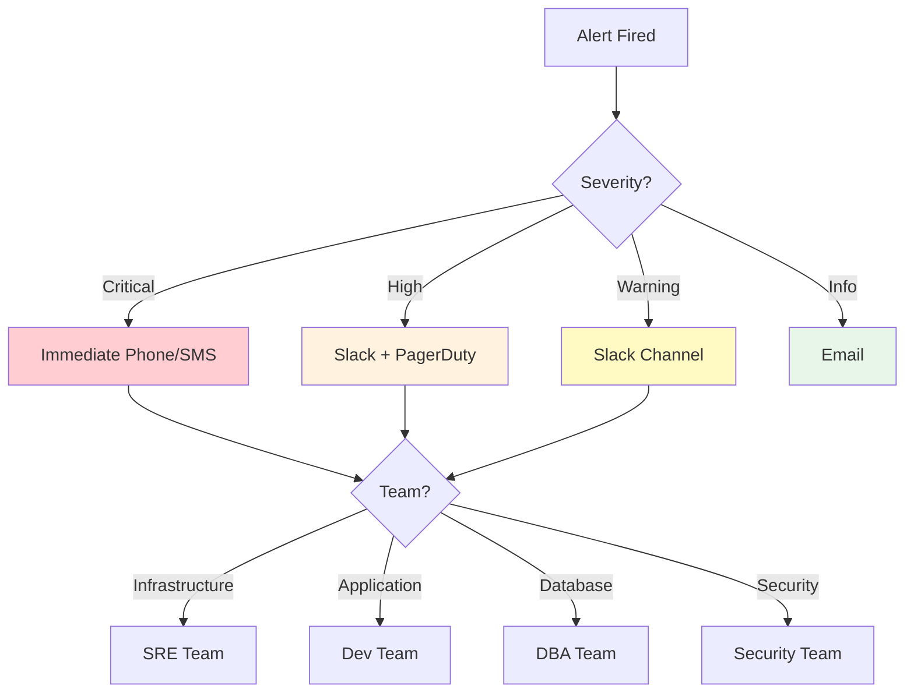
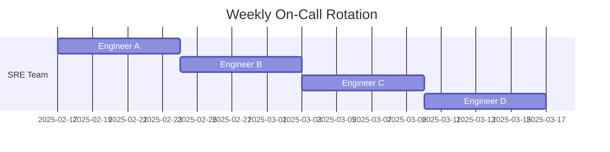
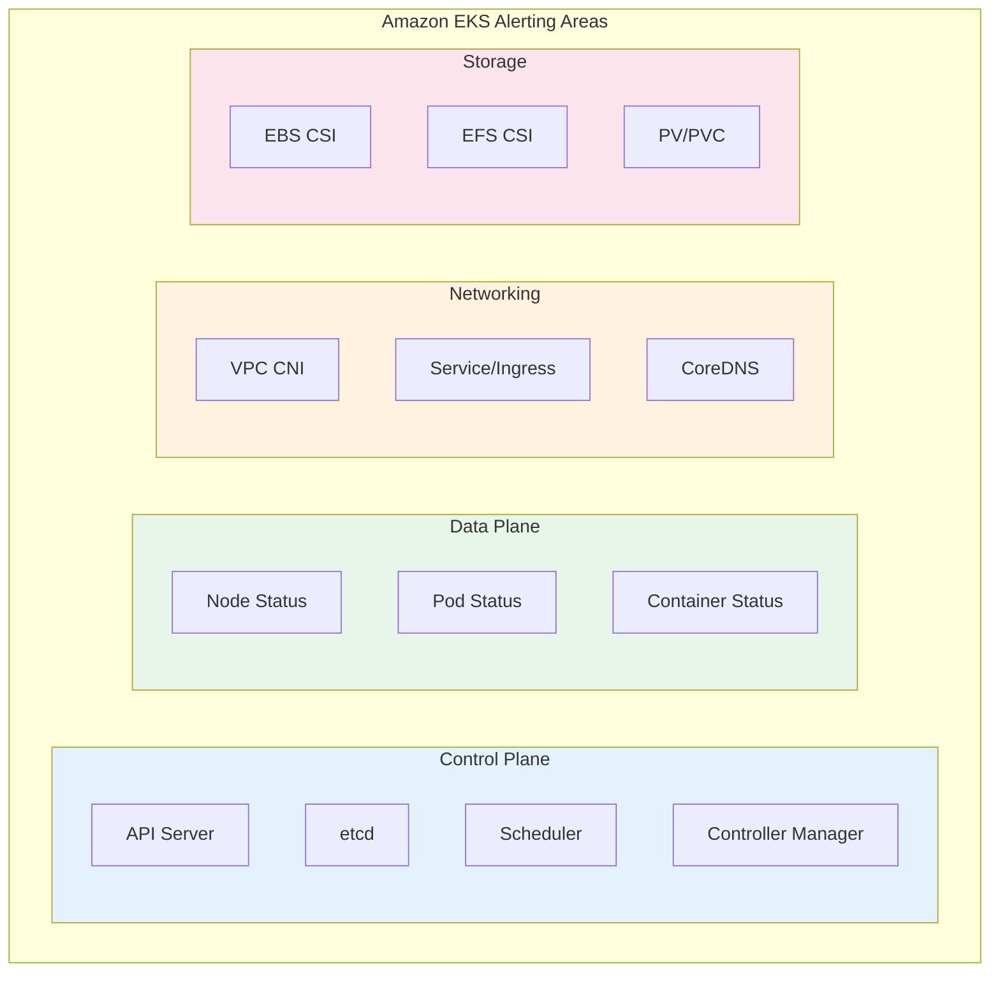
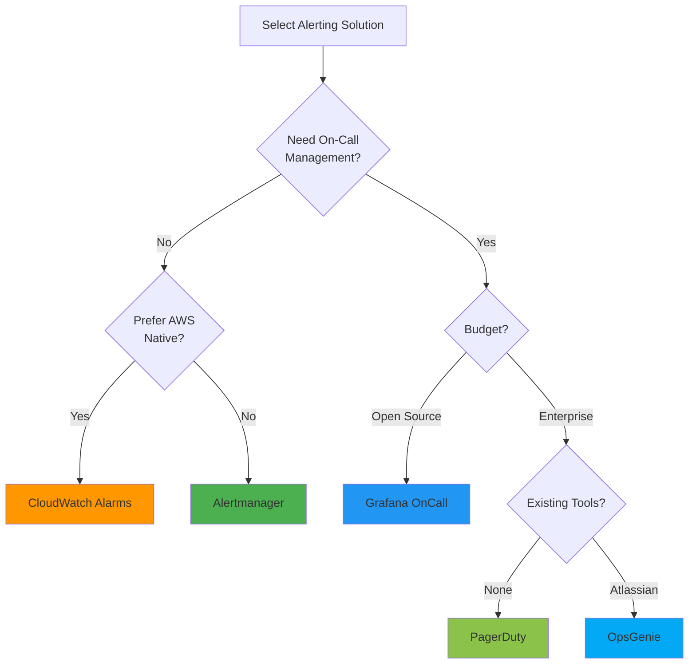
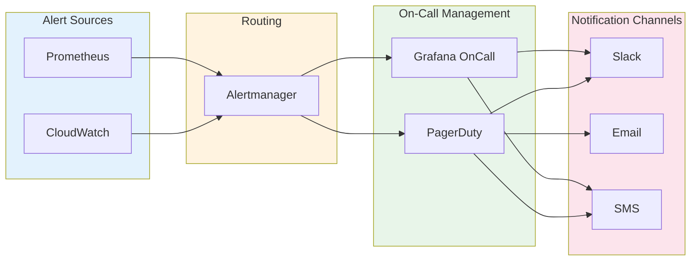

# アラートの概要

> **最終更新**: February 20, 2026

## 目次

- [アラートの役割と重要性](#the-role-and-importance-of-alerting)
- [アラートのライフサイクル](#alert-lifecycle)
- [アラート設計の原則](#alert-design-principles)
- [アラートのルーティングとエスカレーション](#alert-routing-and-escalation)
- [オンコールローテーション](#on-call-rotation)
- [EKS 環境向けアラート戦略](#alerting-strategy-for-eks-environments)
- [ソリューションの比較](#solution-comparison)

---

## アラートの役割と重要性

### オブザーバビリティの 3 本柱におけるアラートの位置付け

現代のオブザーバビリティは、次の 3 つの中核的な柱で構成されています。



- **Metrics**: システムの定量的な状態（CPU、メモリ、リクエスト数など）
- **Logs**: イベントの詳細な記録
- **Traces**: 分散システムにおけるリクエストフロー

**Alerting** は、これら 3 つのデータソースに基づいて異常を検出し、担当者に適時通知することで、迅速な対応を可能にします。

### アラートが必要な理由

1. **プロアクティブな問題対応**: ユーザーが問題を経験する前に問題を検出する
2. **ダウンタイムの最小化**: 迅速な検出と対応によりサービスの可用性を向上させる
3. **コスト削減**: 自動監視により人件費を削減する
4. **SLA/SLO の遵守**: サービスレベル目標を達成するための不可欠な要素
5. **インシデントの記録**: 問題発生履歴を追跡・分析する

### 良いアラートと悪いアラート

| 観点 | 良いアラート | 悪いアラート |
|--------|-------------|------------|
| **対応可能性** | 即時の対応が必要 | 情報のみで、対応不要 |
| **明確性** | 問題が何であるかが明確 | 曖昧で不明確 |
| **緊急度** | 緊急度が重大度と一致している | すべてが緊急扱い |
| **頻度** | 適切な頻度 | 頻度が高すぎる、または低すぎる |
| **重複** | 関連するアラートがグループ化されている | 同じ問題に対して数十件のアラート |

---

## アラートのライフサイクル

アラートは次のライフサイクルをたどります。



### 1. 検出

- **しきい値ベース**: 特定の値が設定済みのしきい値を超えた場合
- **変化率ベース**: 変化率が異常な場合
- **異常検知**: 機械学習ベースの異常パターン検知
- **ログパターン**: 特定のログパターンが発生した場合

```yaml
# Prometheus alert rule example
groups:
  - name: node-alerts
    rules:
      - alert: HighCPUUsage
        expr: 100 - (avg by(instance) (irate(node_cpu_seconds_total{mode="idle"}[5m])) * 100) > 80
        for: 5m  # Alert fires if condition persists for 5 minutes
        labels:
          severity: warning
        annotations:
          summary: "High CPU usage detected"
          description: "CPU usage is above 80% for 5 minutes on {{ $labels.instance }}"
```

### 2. 通知

- **チャネル選択**: Slack、Email、SMS、PagerDuty など
- **ルーティング**: アラートの種類に応じて適切な受信者へ配信する
- **グループ化**: 関連するアラートをまとめる
- **重複排除**: 同一アラートの繰り返し送信を防止する

### 3. エスカレーション

- **時間ベース**: 指定時間内に応答がない場合、次の担当者へエスカレーションする
- **重大度ベース**: 重大度に応じて異なるエスカレーションパスを設定する
- **自動エスカレーション**: 定義済みのルールに従って自動的にエスカレーションする



### 4. 解決

- **手動解決**: 担当者が問題を修正した後にアラートをクローズする
- **自動解決**: Metrics が正常範囲に戻った時点で自動的にクローズする
- **解決通知**: 問題が修正されたときに解決通知を送信する

---

## アラート設計の原則

### 1. 対応可能なアラート

すべてのアラートは、受信者が即時に対応できるようにする必要があります。

**悪い例:**
```
Alert: Database connection count increased
```

**良い例:**
```
Alert: Database connection pool exhausted
Action Required: Scale up database or investigate connection leaks
Runbook: https://wiki.company.com/db-connection-exhausted
```

### 2. アラート疲れの防止

アラートが多すぎると、重要なアラートを見逃す原因になります。



**アラート疲れを防止する戦略:**

1. **しきい値の調整**: 過度に敏感なしきい値を設定しない
2. **アラートのグループ化**: 関連するアラートを 1 つにまとめる
3. **抑制**: 親アラートが発火したときに子アラートを抑制する
4. **定期的なレビュー**: 不要なアラートを削除する
5. **段階的な導入**: 新しいアラートはまず低い重大度から開始する

### 3. 重大度レベル

一貫した重大度システムを定義し、それに従います。

| 重大度 | 説明 | 対応時間 | 例 |
|----------|-------------|---------------|----------|
| **Critical** | サービスの完全な停止 | 即時（5 分以内） | サービス全体の停止、データ損失のリスク |
| **High** | 主要機能の障害 | 15 分以内 | 決済システムのエラー、ログイン障害 |
| **Warning** | 潜在的な問題 | 1 時間以内 | ディスク使用率 80%、レスポンスレイテンシの増加 |
| **Info** | 情報アラート | 営業時間内 | Deployment 完了、バックアップ成功 |

```yaml
# Alert rules by severity example
groups:
  - name: disk-alerts
    rules:
      - alert: DiskSpaceCritical
        expr: (node_filesystem_avail_bytes / node_filesystem_size_bytes) * 100 < 5
        for: 5m
        labels:
          severity: critical
        annotations:
          summary: "Disk space critical"

      - alert: DiskSpaceWarning
        expr: (node_filesystem_avail_bytes / node_filesystem_size_bytes) * 100 < 20
        for: 10m
        labels:
          severity: warning
        annotations:
          summary: "Disk space low"
```

### 4. アラートのドキュメント化

すべてのアラートには次の情報を含める必要があります。

- **説明**: アラートの意味
- **影響**: この問題がサービスに与える影響
- **対応手順**: 問題を解決するためのステップバイステップガイド
- **Runbook リンク**: 詳細な対応手順書

```yaml
annotations:
  summary: "High memory usage on {{ $labels.instance }}"
  description: |
    Memory usage is above 90% on {{ $labels.instance }}.
    Current value: {{ $value | printf "%.2f" }}%
  impact: "Application may experience OOM kills and service degradation"
  action: |
    1. Check for memory leaks: kubectl top pods -n {{ $labels.namespace }}
    2. Review recent deployments
    3. Consider scaling horizontally
  runbook_url: "https://wiki.company.com/runbooks/high-memory"
```

---

## アラートのルーティングとエスカレーション

### ルーティング戦略

アラートは、さまざまな基準に基づいて適切な受信者へ配信する必要があります。



### ルーティングツリーの設計

```yaml
# Alertmanager routing configuration example
route:
  receiver: 'default-receiver'
  group_by: ['alertname', 'cluster', 'service']
  group_wait: 30s
  group_interval: 5m
  repeat_interval: 4h

  routes:
    # Critical alerts - immediate phone call
    - match:
        severity: critical
      receiver: 'pagerduty-critical'
      continue: true

    # Infrastructure team alerts
    - match_re:
        alertname: ^(Node|Disk|CPU|Memory).*
      receiver: 'sre-team'
      routes:
        - match:
            severity: critical
          receiver: 'sre-oncall'

    # Application team alerts
    - match_re:
        namespace: ^(app|api|web).*
      receiver: 'dev-team'

    # Database alerts
    - match_re:
        alertname: ^(MySQL|PostgreSQL|Redis|MongoDB).*
      receiver: 'dba-team'
```

### エスカレーションポリシー

アラートが無視されないように、時間ベースのエスカレーションポリシーを設定します。

| ステップ | 時間 | 対象 | チャネル |
|------|------|--------|---------|
| 1 | 0 分 | プライマリオンコール | Slack、PagerDuty |
| 2 | 15 分 | セカンダリオンコール | Slack、PagerDuty、SMS |
| 3 | 30 分 | チームリード | Slack、PagerDuty、電話 |
| 4 | 45 分 | エンジニアリングマネージャー | 電話 |
| 5 | 60 分 | CTO/VP Engineering | 電話 |

---

## オンコールローテーション

### オンコールの概念

オンコールとは、指定された期間中にシステム問題を担当するよう指定された対応者を指します。



### オンコールのベストプラクティス

1. **明確な引き継ぎスケジュール**: 毎週または隔週でローテーションする
2. **引き継ぎプロセス**: シフト変更時に進行中の問題を引き継ぐ
3. **バックアップ対応者**: プライマリが不在の場合のバックアップを用意する
4. **適切な補償**: オンコール手当または代休
5. **燃え尽き防止**: 適切なローテーションサイクル

### オンコールツールの要件

- **スケジュール管理**: カレンダー統合、シフト管理
- **オーバーライド**: 一時的な対応者の変更
- **エスカレーション**: 自動エスカレーション
- **モバイル対応**: いつでもどこでもアラートを受信する
- **レポート**: オンコール活動の分析

---

## EKS 環境向けアラート戦略

### EKS 固有のアラート領域



### レイヤー別のアラート戦略

#### 1. Cluster レベルのアラート

```yaml
# Cluster-level alert examples
groups:
  - name: eks-cluster
    rules:
      - alert: EKSAPIServerDown
        expr: up{job="kubernetes-apiservers"} == 0
        for: 1m
        labels:
          severity: critical
        annotations:
          summary: "EKS API Server is down"

      - alert: EKSNodeNotReady
        expr: kube_node_status_condition{condition="Ready",status="true"} == 0
        for: 5m
        labels:
          severity: critical
        annotations:
          summary: "Node {{ $labels.node }} is not ready"

      - alert: EKSClusterAutoscalerError
        expr: cluster_autoscaler_errors_total > 0
        for: 5m
        labels:
          severity: warning
        annotations:
          summary: "Cluster Autoscaler is experiencing errors"
```

#### 2. Workload レベルのアラート

```yaml
# Workload-level alert examples
groups:
  - name: eks-workloads
    rules:
      - alert: PodCrashLooping
        expr: rate(kube_pod_container_status_restarts_total[15m]) * 60 * 15 > 3
        for: 5m
        labels:
          severity: warning
        annotations:
          summary: "Pod {{ $labels.pod }} is crash looping"

      - alert: PodNotReady
        expr: |
          sum by (namespace, pod) (
            kube_pod_status_phase{phase=~"Pending|Unknown"}
          ) > 0
        for: 15m
        labels:
          severity: warning
        annotations:
          summary: "Pod {{ $labels.pod }} has been pending for 15 minutes"

      - alert: DeploymentReplicasMismatch
        expr: |
          kube_deployment_spec_replicas != kube_deployment_status_replicas_available
        for: 10m
        labels:
          severity: warning
        annotations:
          summary: "Deployment {{ $labels.deployment }} has replica mismatch"
```

#### 3. Resource レベルのアラート

```yaml
# Resource-level alert examples
groups:
  - name: eks-resources
    rules:
      - alert: ContainerCPUThrottling
        expr: |
          rate(container_cpu_cfs_throttled_seconds_total[5m]) > 0.25
        for: 5m
        labels:
          severity: warning
        annotations:
          summary: "Container {{ $labels.container }} is being CPU throttled"

      - alert: ContainerMemoryNearLimit
        expr: |
          (container_memory_working_set_bytes / container_spec_memory_limit_bytes) > 0.9
        for: 5m
        labels:
          severity: warning
        annotations:
          summary: "Container {{ $labels.container }} memory usage is near limit"

      - alert: PVCAlmostFull
        expr: |
          (kubelet_volume_stats_used_bytes / kubelet_volume_stats_capacity_bytes) > 0.85
        for: 5m
        labels:
          severity: warning
        annotations:
          summary: "PVC {{ $labels.persistentvolumeclaim }} is almost full"
```

### AWS サービス統合アラート

EKS はさまざまな AWS サービスと統合されるため、これらに対するアラートも必要です。

| AWS サービス | 監視項目 | アラートツール |
|-------------|------------------|------------|
| EKS Control Plane | API Server の可用性、認証エラー | CloudWatch |
| EC2 (Nodes) | インスタンスの状態、システムチェック | CloudWatch |
| EBS | ボリュームの状態、IOPS 使用率 | CloudWatch |
| EFS | スループット、接続数 | CloudWatch |
| ALB/NLB | リクエスト数、エラー率、レイテンシ | CloudWatch |
| VPC | ネットワークトラフィック、NAT Gateway | CloudWatch/VPC Flow Logs |

---

## ソリューションの比較

### 主要なアラートソリューションの比較表

| 機能 | Alertmanager | CloudWatch Alarms | Grafana OnCall | PagerDuty | OpsGenie |
|---------|--------------|-------------------|----------------|-----------|----------|
| **種類** | オープンソース | AWS ネイティブ | オープンソース/SaaS | SaaS | SaaS |
| **コスト** | 無料 | アラームごとの料金 | 無料/有料 | 有料 | 有料 |
| **EKS 統合** | Prometheus 統合 | ネイティブ | Alertmanager 統合 | さまざまな統合 | さまざまな統合 |
| **オンコール管理** | なし | なし | はい | はい | はい |
| **エスカレーション** | 基本的 | なし | はい | 高度 | 高度 |
| **モバイルアプリ** | なし | なし | はい | はい | はい |
| **ChatOps** | Webhook | SNS | Slack、Teams | さまざま | さまざま |
| **複雑さ** | 中 | 低 | 中 | 低 | 低 |

### ソリューション選択ガイド



#### 状況別の推奨ソリューション

1. **小規模チーム、コスト重視**: Alertmanager + Slack
2. **全面的に AWS を使用する環境**: CloudWatch Alarms + SNS + Lambda
3. **中規模、オンコールが必要**: Grafana OnCall
4. **大規模組織、複雑なエスカレーション**: PagerDuty
5. **Atlassian エコシステム**: OpsGenie

### ハイブリッドアプローチ

ほとんどの本番環境では、複数のソリューションを組み合わせて使用します。



**推奨アーキテクチャ:**

1. **Prometheus + Alertmanager**: Metrics の収集とプライマリアラート処理
2. **CloudWatch**: AWS サービスの Metrics 収集
3. **Grafana OnCall または PagerDuty**: オンコール管理とエスカレーション
4. **Slack**: リアルタイムアラートとコラボレーション

---

## 次のステップ

このセクションでは、アラートの基本概念と戦略を取り上げました。各ソリューションの詳細な設定方法については、次のドキュメントを参照してください。

- [Prometheus Alertmanager](./01-alertmanager.md): オープンソースのアラート管理
- [CloudWatch Alarms](./02-cloudwatch-alarms.md): AWS ネイティブのアラート
- [Grafana OnCall](./03-grafana-oncall.md): オンコールとインシデント管理

---

## 参考資料

- [Prometheus のアラートに関するベストプラクティス](https://prometheus.io/docs/practices/alerting/)
- [Google SRE Book - 実践的なアラート](https://sre.google/sre-book/practical-alerting/)
- [AWS CloudWatch Alarms ドキュメント](https://docs.aws.amazon.com/AmazonCloudWatch/latest/monitoring/AlarmThatSendsEmail.html)
- [Grafana OnCall ドキュメント](https://grafana.com/docs/oncall/latest/)
- [PagerDuty 運用ガイド](https://www.pagerduty.com/resources/operations/)
