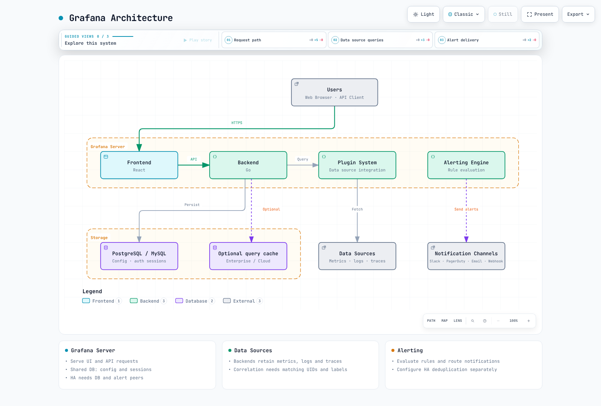

# Grafana Dashboards


> **対応バージョン**: Grafana 13.2.1 · Community Helm chart 13.2.2

> **最終更新**: September 13, 2026

## はじめに

Grafana は Prometheus、Loki、Tempo、CloudWatch などのデータソースにクエリを実行し、ダッシュボードとアラートを提供します。そのメタデータデータベースは、メトリクス・ログ・トレースを保持するバックエンドとは分離されています。[実行可能なサンプル](https://github.com/Atom-oh/kubernetes-docs/tree/main/examples/observability/grafana) は、1 つのクラスター内の既存バックエンドに接続します。バックエンドのデプロイについては [observability スタックラボ](../../labs/observability/02-observability-stack-lab.md) を参照してください。

<span id="key-features"></span>

## アーキテクチャ



[🔍 インタラクティブな図を表示](https://www.atomai.click/kubernetes-docs/archmaps/en-observability-grafana-readme-0.html)

| コンポーネント | 責務 |
|---|---|
| Grafana データベース | ユーザー、ダッシュボード、設定、認証セッション。HA では PostgreSQL/MySQL を共有 |
| データソース | 実際のメトリクス・ログ・トレースのクエリと保持 |
| Grafana Alerting | 評価と通知のルーティング。通知の重複排除には別途 HA 設定が必要 |
| オプションのクエリキャッシュ | Enterprise/Cloud でサポートされる機能。Redis は必須のセッションストアではない |

## Helm デプロイ

<span id="run-installation"></span>

### 基本インストール

デフォルトプロファイルは **1 レプリカ、SQLite、RWO の PVC、Recreate 更新** を使用します。`gp3` StorageClass と CSI ドライバーが必要で、アップグレード中は利用できなくなる可能性があります。HA は別のプロファイルです。チャートはコミュニティリポジトリのもので、バージョンとイメージダイジェストは固定されています。

このリポジトリをチェックアウトし、`endpoints.yaml` の 3 つの URL すべてを **実際の Service とポート** に合わせて編集してください。Tempo 3.x の例では HTTP API ポート 3200 を使用しており、これは OTLP 取り込みポートとは異なります。プレースホルダーのサービス名はバックエンドを作成しません。ラボのバックエンドが mTLS を必要とする場合は、データソースに CA/クライアント証明書の設定を追加してください。平文の HTTP でこれを回避することはできません。

これらのコマンドは新規インストール用です。既存の認証情報は Secret を上書きするのではなく、確立された手順でローテーションしてください。ログイン時には生成されたプライベートなパスワードファイルをローカルで読み取り、その内容を Git、values ファイル、ターミナルログに残さないでください。

```bash
helm repo add grafana-community https://grafana-community.github.io/helm-charts
helm repo update grafana-community
kubectl create namespace monitoring --dry-run=client -o yaml | kubectl apply -f -
cd examples/observability/grafana

umask 077
GRAFANA_STATE=$(mktemp -d "$PWD/.grafana-private.XXXXXX")
printf '%s' admin > "$GRAFANA_STATE/admin-user"
python3 -c 'import secrets; print(secrets.token_hex(24), end="")' > "$GRAFANA_STATE/admin-password"
python3 -c 'import secrets; print(secrets.token_hex(32), end="")' > "$GRAFANA_STATE/secret-key"
python3 -c 'import secrets; print(secrets.token_hex(24), end="")' > "$GRAFANA_STATE/metrics-password"
kubectl -n monitoring create secret generic grafana-admin-credentials \
  --from-file=admin-user="$GRAFANA_STATE/admin-user" \
  --from-file=admin-password="$GRAFANA_STATE/admin-password"
kubectl -n monitoring create secret generic grafana-runtime \
  --from-file=secret-key="$GRAFANA_STATE/secret-key" \
  --from-file=metrics-password="$GRAFANA_STATE/metrics-password"

kubectl apply -f endpoints.yaml
kubectl -n monitoring create configmap grafana-datasources --from-file=datasources.yaml
kubectl -n monitoring create configmap grafana-alerts --from-file=alerts.yaml
kubectl -n monitoring create configmap grafana-docs-dashboards --from-file=dashboard.json
helm upgrade --install grafana grafana-community/grafana --version 13.2.2 \
  --namespace monitoring --values values.yaml --wait
kubectl -n monitoring port-forward service/grafana 3000:80 --address 127.0.0.1
```

`http://localhost:3000` を開きます。Service は ClusterIP で、ポートフォワードはループバックにのみバインドされます。Grafana を外部に公開する前に、認証、TLS、承認済みのネットワーク/アクセスポリシーを設定してください。

### values.yaml の設定

```yaml
replicas: 1
deploymentStrategy:
  type: Recreate
persistence:
  enabled: true
  type: pvc
  storageClassName: gp3
  size: 10Gi
  accessModes:
  - ReadWriteOnce
admin:
  existingSecret: grafana-admin-credentials
  userKey: admin-user
  passwordKey: admin-password
serviceAccount:
  create: true
  name: grafana
  automountServiceAccountToken: false
```

完全なファイルでは、Secret のマウント、固定のデータソース UID、ダッシュボードファイル、一時停止されたアラートを接続します。マウントした ConfigMap によるプロビジョニングでは、ファイルを更新した後に Pod を順番に再起動して、プロビジョニングを再実行させてください。`--reuse-values` で不明な過去の設定を残すのではなく、意図した values ファイルを毎回明示的に指定してください。

### 高可用性

`values-ha.yaml` は 2 レプリカを追加し、共有 PVC を無効化し、`verify-full` を使う外部 PostgreSQL、headless Service、Alerting の gossip を設定します。データベースの HA、バックアップ、リカバリは別途準備してください。1 つの SQLite ファイルを複数の Grafana レプリカで共有しないでください。

サンプルのデータベース/ユーザーは `grafana` です。`host`（証明書に一致する DNS:5432）、`password`、`ca.crt` を含む `grafana-database` Secret を準備し、両方の Pod に同じ `grafana-runtime/secret-key` をマウントしてください。`root_url` は実際の外部 HTTPS アドレスに置き換え、TLS 終端を設定します。既存の SQLite データの移行には別途マイグレーションとリカバリ確認が必要です。データベースの種類を変更してもデータは移行されません。

```bash
helm upgrade --install grafana grafana-community/grafana --version 13.2.2 \
  -n monitoring -f values.yaml -f values-ha.yaml --wait
```

ピアの DNS はリリース名 `grafana` と namespace `monitoring` を前提としています。いずれかが変わる場合は更新してください。Grafana Pod 間の TCP/UDP 9094 と、必要な DNS・データベース・バックエンドへの接続のみを許可します。認証セッションは共有の Grafana データベースに保存されるため、ログインの継続性のために Redis セッションやロードバランサーのアフィニティは必要ありません。

Alerting の HA にはピア接続と重複排除の設定が必要です。デフォルト設定では各ノードで評価が行われる点を考慮してください。バージョン 13.2.1 には `ha_single_node_evaluation` もありますが、この例ではデフォルトのままにしています。重複排除は、ネットワーク分断時に通知が正確に 1 回だけ配信されることを保証しません。ネイティブ検証では Grafana インスタンス 1 台を使用し、この HA プロファイルに対するデータベースのフェイルオーバーは実施していません。

## データソース統合

<span id="data-source-provisioning-via-configmap"></span>

### ファイルプロビジョニングと UID

`datasources.yaml` は Prometheus=`prometheus`、Loki=`loki`、Tempo=`tempo` を固定します。ダッシュボード、アラート、相関リンクは一致する UID を使用しなければなりません。環境変数はプロビジョニングファイル内の値を供給します。変数を設定するだけではデータソースオブジェクトは作成されません。

```yaml
apiVersion: 1
datasources:
- name: Prometheus
  type: prometheus
  uid: prometheus
  url: $PROMETHEUS_URL
  access: proxy
  isDefault: true
  editable: false
  jsonData:
    httpMethod: POST
    exemplarTraceIdDestinations:
    - name: trace_id
      datasourceUid: tempo
- name: Loki
  type: loki
  uid: loki
  url: $LOKI_URL
  access: proxy
  editable: false
  jsonData:
    derivedFields:
    - name: TraceID
      matcherRegex: '"trace_id"\s*:\s*"([a-f0-9]{32})"'
      url: $${__value.raw}
      datasourceUid: tempo
- name: Tempo
  type: tempo
  uid: tempo
  url: $TEMPO_URL
  access: proxy
  editable: false
  jsonData:
    tracesToLogsV2:
      datasourceUid: loki
      tags:
      - key: service.name
        value: service_name
      spanStartTimeShift: -5m
      spanEndTimeShift: 5m
      customQuery: true
      query: '{$${__tags}} | json | trace_id="$${__span.traceId}"'
    tracesToMetrics:
      datasourceUid: prometheus
      tags:
      - key: service.name
        value: service
      queries:
      - name: Request rate
        query: sum(rate(lab_http_requests_total{$${__tags}}[5m]))
    serviceMap:
      datasourceUid: prometheus
    nodeGraph:
      enabled: true
```

これらのリンクは、ラボアプリケーションの `service.name`、Loki の `service_name`、メトリクスラベル `service`、JSON ログフィールド `trace_id` を使用します。他のパイプラインでは実際のラベルに合わせて調整してください。`$${...}` は、ファイルプロビジョニングを通して Grafana の `${...}` リンクマクロを保持します。`${__tags}` は `service="..."` のようなマッチャーに展開されるため、`service="${__tags}"` のように再度囲むと無効なセレクターになります。

Exemplar は選択されたメトリクス観測値をトレースに結び付けるもので、すべてのリクエストのトレースを含むわけではありません。エクスポーターのサポート、Prometheus の exemplar 取り込み、トレースの保持期間が揃っている必要があります。`serviceMap` には、Tempo の metrics-generator が生成したサービスグラフメトリクスが Prometheus に存在する必要があります。UID を設定するだけではサービスグラフは生成されません。

### CloudWatch IRSA

Grafana の ServiceAccount に承認済みの IRSA ロールをアタッチし、その OIDC の信頼関係を正確な namespace/ServiceAccount と `aud` に限定してください。Pod 内でトークンの projection と SDK による認証情報の取得を確認します。データソースの `authType: default` はその認証情報チェーンを使用します。同じロールに対して `assumeRoleArn` を重複して設定しないでください。これは、必要な信頼関係と `sts:AssumeRole` 権限を備えた、意図的な追加のロール引き受けに使用します。

メトリクスクエリには、まず `cloudwatch:ListMetrics` と `cloudwatch:GetMetricData` から始めてください。Logs、EC2、タグ、X-Ray の権限は、使用する機能に対してのみ追加します。リソースレベルの権限がないアクションについては、`Resource: "*"` を適用可能なリージョン条件で制限し、Logs へのアクセスは実際のロググループに絞ってください。すべての AWS 読み取りアクションを 1 つの無条件のワイルドカードステートメントにまとめないでください。デフォルトのサンプルは AWS の認証情報やリソースを作成しません。

<span id="use-method-utilization-saturation-errors"></span>

<span id="red-method-rate-errors-duration"></span>

<span id="_4-golden-signals"></span>

## ダッシュボード設計パターン

`dashboard.json` は 8 つのパネルを持つ完全な JSON です。アプリケーションパネルは [MSA ラボ](../../labs/observability/03-msa-deployment-lab.md) の `lab_http_*` を使用します。Node パネルには node-exporter が必要で、CrashLoop パネルには kube-state-metrics が必要です。

| 手法 | シグナル | 解釈 |
|---|---|---|
| RED: Rate, Errors, Duration | リクエストレート、5xx の割合、ヒストグラムの p99 | 欠損またはゼロのリクエストトラフィックを成功率 100% にしないこと |
| USE: Utilization, Saturation, Errors | CPU/メモリ使用率、ディスクキューの圧力、ネットワークエラー | 重み付き I/O 時間はディスクエラーのカウンターではない |
| Four Golden Signals | Latency, Traffic, Errors, Saturation | 可用性はこの 4 つの名前の 1 つではなく、重要な別個の SLI である |

対応するリクエスト系列が存在する場合にのみ、欠損しているエラー系列をゼロで埋めてください。

```promql
((sum by (service) (rate(lab_http_requests_total{status=~"5.."}[5m])) or 0 * sum by (service) (rate(lab_http_requests_total[5m]))) / (sum by (service) (rate(lab_http_requests_total[5m])) > 0)) * 100
```

分母はゼロトラフィックを除外します。収集の欠損とトラフィックなしは別々に表示してください。`rate(node_disk_io_time_weighted_seconds_total[5m])` は平均的な I/O キューの圧力を推定します。`increase(...)` はディスクエラーを数えるものではありません。`node_load1` は実行可能タスクと I/O 待ちを含み、CPU の飽和を純粋に示す指標ではありません。

<span id="_2-variable-usage"></span>

このダッシュボードは 1 つのクラスターを前提としています。中央のバックエンドで複数クラスターをまとめる場合は、`cluster` ラベルを一貫して付与し、セレクター、グルーピング、join に含めてください。Pod メトリクスの join には少なくとも namespace と pod が必要です。cluster/namespace 変数は、それらのラベルが存在する場合にのみ追加してください。複数選択や全選択には正規表現マッチャーと `${variable:regex}` のエスケープが必要です。変数やフォルダはデータソースのアクセス制御ではありません。

## ダッシュボードのプロビジョニング

### Sidecar

デフォルトのマウントファイル方式のプロファイルでは、Kubernetes API のトークン/RBAC は不要です。ConfigMap を動的に監視する必要がある場合は `values-sidecar.yaml` を追加します。このオプションのプロファイルは namespace スコープの Role を使用し、`monitoring` 内の ConfigMap のみを読み取り、`grafana_dashboard: "true"` を選択します。このラベル/値は設定可能なもので、Grafana 全体の必須要件ではありません。一致する ConfigMap を書き込める人は誰でも、プロビジョニングされる内容を変更できます。

チャートのデフォルトの namespace スコープ Role は Secret も読み取ります。まず `sidecar-role.yaml` の ConfigMap 専用 Role を作成し、`useExistingRole` で参照してください。

```bash
kubectl apply -f sidecar-role.yaml
helm upgrade grafana grafana-community/grafana --version 13.2.2 \
  -n monitoring -f values.yaml -f values-sidecar.yaml
```

このプロバイダーは別の `Sidecar` フォルダを使用し、データソースとアラートの sidecar は無効のままです。`searchNamespace: ALL` や広範な Secret アクセスを、通常のデフォルトとしてコピーしないでください。読み取り専用のプロビジョニング済みダッシュボードへの変更を保持するには、そのソースファイルを更新してください。

### Grafana Operator

Operator によるデプロイでは、まず対応するコントローラー/CRD と、その `GrafanaDashboard`/`GrafanaDatasource` リソースによって選択される `Grafana` インスタンスが必要です。別の Helm デプロイと Operator が所有権を争わないようにしてください。この章で検証しているのは Helm のファイルプロビジョニングであり、Operator のインストールではありません。`panels: [...]` のような省略記法はデプロイ可能な有効な JSON ではありません。ダッシュボードの内容には完全な `dashboard.json` を使用してください。

<span id="alert-rule-configuration"></span>

## アラートルール (Grafana Alerting)

13.2.1 では `[unified_alerting]` を使用し、削除済みのレガシー `[alerting]` 設定は有効にしないでください。この例では、A=CPU のレンジクエリ、B=last リダクション、C=>80 のしきい値を通じてラベルを保持します。多次元のアラートラベルが必要な場合、`classic_conditions` は適していません。

```yaml
apiVersion: 1
groups:
- orgId: 1
  name: grafana-docs
  folder: Observability
  interval: 1m
  rules:
  - uid: docs-high-cpu
    title: Sustained CPU usage
    condition: C
    data:
    - refId: A
      relativeTimeRange:
        from: 300
        to: 0
      datasourceUid: prometheus
      model:
        refId: A
        expr: 100 * (1 - avg by (instance) (rate(node_cpu_seconds_total{mode="idle"}[5m])))
        instant: false
        range: true
        intervalMs: 15000
        maxDataPoints: 43200
    - refId: B
      relativeTimeRange:
        from: 0
        to: 0
      datasourceUid: __expr__
      model:
        refId: B
        type: reduce
        expression: A
        reducer: last
    - refId: C
      relativeTimeRange:
        from: 0
        to: 0
      datasourceUid: __expr__
      model:
        refId: C
        type: threshold
        expression: B
        conditions:
        - type: query
          evaluator:
            type: gt
            params:
            - 80
          operator:
            type: and
          query:
            params:
            - C
          reducer:
            type: last
            params: []
    noDataState: NoData
    execErrState: Error
    for: 5m
    isPaused: true
    annotations:
      summary: High CPU on {{ $labels.instance }}
    labels:
      severity: warning
```

このルールは **一時停止状態** でインストールされます。再開する前に、実データ、評価結果、通知ポリシー、連絡先を検証してください。`for: 5m` は pending 期間で、`interval: 1m` は評価頻度です。NoData/Error を正常として隠さないでください。頻繁な再起動は、コンテナが現在 `CrashLoopBackOff` にあることの証明にはなりません。その状態には waiting reason のメトリクスを使用してください。

Slack/PagerDuty の連絡先は、ドキュメント化されたスキーマと Secret の値を使ってプロビジョニングしてください。組み込みの通知テンプレートを使うか、参照する前にカスタムテンプレートを明示的に定義してください。`slack.title` のような未定義の名前は失敗します。連絡先（contact point）だけではルーティングは成立しません。レシーバーを通知ポリシーにアタッチしてください。実際のテスト送信は承認済みの宛先にのみ行ってください。この監査では外部通知は送信していません。

### Grafana 自身のメトリクス

`/metrics` は別個の Basic 認証を使用します。Prometheus Operator をインストールし、ServiceMonitor の `release` ラベルをそのセレクターに一致させてください。パスワードは Grafana にマウントされたパスワードと一致する必要があります。

```bash
printf '%s' metrics > "$GRAFANA_STATE/metrics-user"
kubectl -n monitoring create secret generic grafana-metrics-auth \
  --from-file=username="$GRAFANA_STATE/metrics-user" \
  --from-file=password="$GRAFANA_STATE/metrics-password"
helm upgrade grafana grafana-community/grafana --version 13.2.2 \
  -n monitoring -f values.yaml -f values-metrics.yaml
```

## 認証とアクセス

外部 HTTPS、IdP のコールバック (`/login/generic_oauth`)、実際のエンドポイント/JWKS、グループクレームを確認したうえで、この INI 断片をチャートの `grafana.ini.auth.generic_oauth` にマッピングしてください。OAuth Secret のファイルマウントは別途追加します。これらのプレースホルダーの IdP エンドポイントは、そのまま動作する SSO 構成ではありません。

```ini
[auth.generic_oauth]
enabled = true
name = Organization SSO
client_id = $__file{/run/grafana-oauth/client-id}
client_secret = $__file{/run/grafana-oauth/client-secret}
scopes = openid profile email groups
auth_url = https://sso.example.com/authorize
token_url = https://sso.example.com/token
api_url = https://sso.example.com/userinfo
use_pkce = true
validate_id_token = true
jwk_set_url = https://sso.example.com/actual-jwks-endpoint
role_attribute_strict = true
allow_assign_grafana_admin = false
role_attribute_path = contains(groups[*], 'grafana-admins') && 'Admin' || contains(groups[*], 'grafana-viewers') && 'Viewer'
allow_sign_up = true
```

`Admin` は組織ロールであり、サーバーレベルの `GrafanaAdmin` とは異なります。厳格なマッピングは、マッピングされたグループ外のユーザーを拒否します。PKCE と ID トークンの署名検証は有効です。対象環境で実際のログイン、グループ変更、失効を検証してください。Viewer は、表示可能なダッシュボード上のクエリを超えて、所属組織のデータソースにクエリを実行できます。したがってフォルダ権限だけでは基盤データへのアクセスを制限できません。

## Grafana Cloud とセルフホストの比較

| 領域 | セルフホスト OSS | Grafana Cloud |
|---|---|---|
| 運用 | 自前の DB、アップグレード、バックアップ、キャパシティ | マネージドサービス。契約と制限を確認 |
| 可用性 | 自分で設計し検証する | SLA は実際のプラン/サービス契約に依存 |
| データソース権限/クエリキャッシュ | これらを OSS の機能と想定しないこと | サポートされる機能とプランを確認 |
| データの所在 | 選択したインフラ/バックエンド | 実際のスタックのリージョン、保持期間、処理条件 |
| プラグイン | 互換性、署名、パッケージングを検証 | サポートされるカタログとスタックのポリシー |

Cloud の Prometheus/Loki の URL とユーザー名は、スタックの Connections ページから取得してください。ID が同一であると想定したり、架空のリージョン URL をコピーしたりしないでください。必要な `metrics:read`/`logs:read` アクセスに絞った Cloud Access Policy トークンを使用し、`secureJsonData.basicAuthPassword` は Secret 経由で供給してください。Grafana のサービスアカウントトークンと Cloud のデータアクセストークンは目的が異なります。

<span id="_1-dashboard-organization"></span>

## ベストプラクティス

Overview、Infrastructure、Kubernetes、Applications、Alerts を目的別に整理してください。単位とデータ欠損時の状態を含めます。リソースを増やす前に、クエリの範囲、頻度、カーディナリティを削減してください。繰り返される計算には recording rule を使用します。廃止された Angular ベースの piechart/worldmap プラグインは、組み込みの Pie chart/Geomap パネルに置き換えてください。追加プラグインは互換性のあるバージョンに固定し、すべての HA ノードに同じバージョンを提供してください。

<span id="_3-performance-optimization"></span>

`[dashboards] min_refresh_interval = 10s` はブラウザーの更新頻度を制限するもので、アラートの評価には影響しません。データベースのプールサイズは、DB の接続上限とレプリカ数に対して見積もってください。OSS の `[caching] enabled/ttl` の設定断片は、Enterprise/Cloud のクエリキャッシュを提供しません。

## 検証範囲と参考資料

シングルインスタンス、HA、metrics、sidecar の各チャートプロファイルをレンダリングしました。実際の Grafana 13.2.1 インスタンスで、データソース、ダッシュボード、一時停止アラートのプロビジョニング、式の評価、メトリクス認証を確認しました。式の評価には合成した Prometheus レスポンスを使用しました。これらの確認では、EKS のデプロイ、実際のバックエンド TLS の検証、HA データベースのフェイルオーバー、SSO/IRSA の完了、外部通知の配信は行っていません。

- [Grafana HA](https://grafana.com/docs/grafana/latest/setup-grafana/set-up-for-high-availability/)
- [Grafana 13.2.1 configuration defaults](https://github.com/grafana/grafana/blob/v13.2.1/conf/defaults.ini)
- [Community Helm chart](https://github.com/grafana-community/helm-charts/tree/main/charts/grafana)
- [Alerting file provisioning](https://grafana.com/docs/grafana/latest/alerting/set-up/provision-alerting-resources/file-provisioning/)
- [Generic OAuth](https://grafana.com/docs/grafana/latest/setup-grafana/configure-access/configure-authentication/generic-oauth/)
- [Data source permissions and caching](https://grafana.com/docs/grafana/latest/administration/data-source-management/)
- [Tempo provisioning](https://grafana.com/docs/grafana/latest/datasources/tempo/configure-tempo-data-source/provision/)
- [Loki configuration](https://grafana.com/docs/grafana/latest/datasources/loki/configure/)

## Quiz

設定と運用上の違いを [Grafana クイズ](../../quizzes/observability/grafana/grafana-quiz.md) で確認してください。
