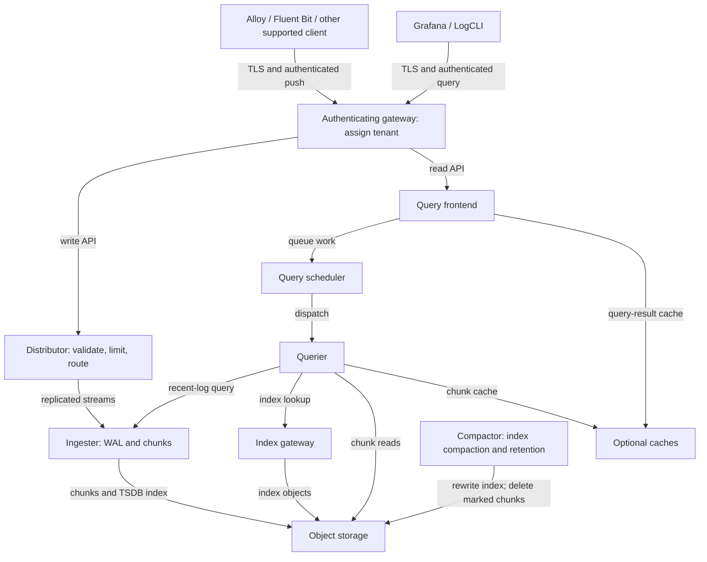

# Grafana Loki

> **最終更新**: September 13, 2026
> **例のベースライン**: Loki 3.7.7 / community Helm chart 18.12.1。ローカルでの設定、レンダリング、LogQL チェックのみを実施。EKS デプロイ、S3 アクセス、負荷テスト、HA/フェイルオーバーテストは未実施。

Loki はログを圧縮チャンクとして保存し、ストリームラベルをインデックス化します。これによりインデックスのオーバーヘッドを削減できる場合がありますが、Elasticsearch/OpenSearch に対して常にコストまたはクエリ速度で優位となるわけではありません。代表的なワークロードで、取り込み、保持、クエリの選択性、オブジェクトリクエスト、コンピューティング、キャッシュ、運用要件を比較してください。

## 概要

| 機能 | 意味と境界 |
|---|---|
| ラベルインデックス | ログ内容をスキャンする前にストリームを選択します。JSON の解析とチャンクのスキャンには依然として処理が必要です。 |
| オブジェクトストレージ | 本番ストレージでは S3 やその他のサポート対象バックエンドを使用できます。ローカルファイルシステムストレージは小規模な実験に有用ですが、共有分散オブジェクトストアではありません。 |
| LogQL | ログパイプラインとログ由来のメトリクスをサポートします。PromQL や SQL と同等に置き換えられるものではありません。 |
| マルチテナンシー | テナント ID によりデータと制限を分離します。認証プロキシは、呼び出し元がアクセスできるテナントを決定する必要があります。 |
| スケーリングとレプリケーション | デプロイメントモード、ring、quorum、ストレージ、障害ドメインに依存します。Replica と WAL だけではロスレス配信を保証しません。 |

Elasticsearch/OpenSearch は異なるインデックスおよび検索モデルを持ちます。Loki はログテキストを検索できますが、通常はまずラベルと時間範囲を絞り込み、一致するチャンクをスキャンします。再現可能な比較なしに、「10 倍安い」「常に高速」「メモリランキング」のような固定的な表現は避けてください。

## アーキテクチャ

この図は、一般的な TSDB/チャンクデプロイメントを示しており、任意または実験的な Loki コンポーネントをすべて示すものではありません。クエリの矢印はリクエスト先のサービスを指し、応答は同じ経路を戻ります。



| コンポーネント | 責務 |
|---|---|
| Distributor | ストリームを検証し、テナントごと/ストリームごとの取り込み制限を適用し、ring を通じて書き込みをルーティングします。バイトレート制限は streams-per-second の設定ではありません。 |
| Ingester | ストリームをバッファリングし、有効な場合は WAL を書き込み、チャンクを構築・フラッシュして最新データを提供します。永続的な WAL ストレージは障害リスクを低減しますが、レプリケーション、バックアップ、またはクライアント再試行の計画に代わるものではありません。 |
| Querier | Ingester から最新データを、インデックス/オブジェクトストア経路から履歴データを読み取り、LogQL を評価して結果をマージします。 |
| Query frontend / scheduler | クエリ処理を分割してキューに入れます。結果キャッシュと制御された再試行は任意です。ランタイム設定キーは `frontend`、Helm のワークロードキーは `queryFrontend` です。 |
| Index gateway | 分散デプロイメントでインデックス検索を提供します。チャンクストアとは別のものです。 |
| Compactor | **インデックスファイル**をコンパクト化し、有効な場合は期限切れのインデックス参照を削除して、マーク済みのチャンクを非同期に削除します。汎用的な小さいログチャンクのマージ機能ではありません。 |

## デプロイメントモード

| モード | 選定の指針 |
|---|---|
| Monolithic, `-target=all` | 小規模なインストールと実験に便利です。chart 18.12.1 はこのモードを `Monolithic` と呼びますが、そのワークロード値は `singleBinary` に残っています。chart のデフォルトは本番適性の根拠にはなりません。 |
| Simple Scalable (SSD) | 履歴上の read/write/backend グループ。SSD は非推奨であり、Loki 4.0 で削除予定です。新しい本番 EKS インストールのデフォルトとして選択するのではなく、明示的な移行を計画してください。 |
| Microservices, chart `Distributed` | Distributor、Ingester、Querier、frontend、scheduler、index gateway、Compactor を分離します。現在の Helm ガイダンスでは、より高い運用複雑性を伴うものの、本番のスケーラビリティ/HA にはこれを推奨しています。 |

古い `<100GB`、`100GB–10TB`、`>10TB` のカテゴリは測定された容量ではありません。ピーク bytes/sec、アクティブストリーム、クエリ並行性、保持、チャンク利用率、障害復旧に合わせてサイズを決めてください。概算のサイジングガイダンスを保証と見なしてはいけません。

## Helm インストール

### 前提条件と所有権

以下は、完全な本番プラットフォームではなく、**新規インストールの設定開始点**です。

- Chart 18.12.1 は Kubernetes `>=1.25.0-0` を宣言しています。マニフェストチェックでは Kubernetes 1.36.2 を使用しました。これはすべての Kubernetes/EKS バージョンまたはプラットフォームのテストではありません。
- プライベートバケット、スコープを限定した IAM role、IRSA 用の EKS OIDC provider、および適切な既存の `gp3` StorageClass をプロビジョニングしてください。そのクラス名は前提であり、EKS 組み込みの保証ではありません。EBS CSI/Auto Mode provisioner、ノード OS、AZ 容量、PVC バインディング、クォータは実際のクラスターと一致している必要があります。
- `.htpasswd` キーを含む `loki-gateway-auth` と、`tls.crt`/`tls.key` を含む `loki-gateway-tls` を準備してください。gateway の実際の DNS 名に対する信頼された証明書を使用します。シークレットはシークレット管理ワークフローで提供し、パスワードや秘密鍵を values ファイルにコミットしないでください。
- gateway は認証されたユーザー名を、呼び出し元指定のテナントヘッダーを上書きする `X-Scope-OrgID` にマッピングします。network policy/セキュリティ境界と namespace RBAC により、Loki コンポーネントポートへの直接アクセスを制限してください。テナントヘッダーだけでは認証になりません。gateway をバイパスすると、その認可もバイパスされます。
- gateway は HTTPS と ClusterIP Service を使用し、ingress は無効です。内部 Loki コンポーネント間のトラフィックには、環境に適したトランスポート/ネットワーク制御が依然として必要です。ここでは ALB、パブリックエンドポイント、完全な network policy はプロビジョニングしません。

### バージョン固定の分散 values

`values-eks.yaml` として保存してください。例の account、role、bucket 名は一貫して置き換えます。schema 開始日は**新しい**ストア用です。アップグレード時には既存のすべての schema エントリを保持してください。

```yaml
deploymentMode: Distributed
loki:
  image:
    tag: 3.7.7
  auth_enabled: true
  analytics:
    reporting_enabled: false
  commonConfig:
    replication_factor: 3
  schemaConfig:
    configs:
    - from: '2026-09-01'
      store: tsdb
      object_store: s3
      schema: v13
      index:
        prefix: loki_index_
        period: 24h
  storage:
    type: s3
    bucketNames:
      chunks: example-loki-chunks-123456789012
      ruler: example-loki-ruler-123456789012
    s3:
      region: ap-northeast-2
  ingester:
    chunk_encoding: snappy
    wal:
      enabled: true
      dir: /var/loki/wal
  compactor:
    working_directory: /var/loki/compactor
    retention_enabled: true
    delete_request_store: s3
    retention_delete_delay: 2h
  limits_config:
    retention_period: 744h
    allow_structured_metadata: true
    ingestion_rate_strategy: global
    ingestion_rate_mb: 10
    ingestion_burst_size_mb: 20
    per_stream_rate_limit: 5MB
    per_stream_rate_limit_burst: 15MB
  runtimeConfig:
    overrides:
      development:
        retention_period: 168h
serviceAccount:
  create: true
  name: loki
  annotations:
    eks.amazonaws.com/role-arn: arn:aws:iam::123456789012:role/loki-s3
singleBinary:
  replicas: 0
read:
  replicas: 0
write:
  replicas: 0
backend:
  replicas: 0
ingester:
  replicas: 3
  zoneAwareReplication:
    enabled: false
  persistence:
    enabled: true
    claims:
    - name: data
      accessModes:
      - ReadWriteOnce
      size: 50Gi
      storageClass: gp3
distributor:
  replicas: 2
querier:
  replicas: 2
queryFrontend:
  replicas: 2
queryScheduler:
  replicas: 2
indexGateway:
  replicas: 2
compactor:
  replicas: 1
  persistence:
    enabled: true
    claims:
    - name: data
      accessModes:
      - ReadWriteOnce
      size: 20Gi
      storageClass: gp3
ruler:
  enabled: false
gateway:
  enabled: true
  replicas: 2
  service:
    type: ClusterIP
    port: 443
  ingress:
    enabled: false
  basicAuth:
    enabled: true
    existingSecret: loki-gateway-auth
  nginxConfig:
    locationSnippet: proxy_set_header X-Scope-OrgID $remote_user;
    ssl: true
    serverSnippet: |-
      ssl_certificate /etc/nginx/tls/tls.crt;
      ssl_certificate_key /etc/nginx/tls/tls.key;
      ssl_protocols TLSv1.2 TLSv1.3;
      if ($tenant_api_allowed = 0) { return 403; }
    httpSnippet: |-
      map $uri $tenant_api_allowed {
        default 0;
        / 1;
        /loki/api/v1/push 1;
        /otlp/v1/logs 1;
        /loki/api/v1/query 1;
        /loki/api/v1/query_range 1;
        /loki/api/v1/labels 1;
        ~^/loki/api/v1/label/[^/]+/values$ 1;
        /loki/api/v1/series 1;
        /loki/api/v1/tail 1;
        /loki/api/v1/index/stats 1;
        /loki/api/v1/index/volume 1;
        /loki/api/v1/index/volume_range 1;
      }
  containerPort: 8443
  metrics:
    enabled: false
  extraVolumes:
  - name: gateway-tls
    secret:
      secretName: loki-gateway-tls
  extraVolumeMounts:
  - name: gateway-tls
    mountPath: /etc/nginx/tls
    readOnly: true
  readinessProbe:
    httpGet:
      path: /
      port: http
      scheme: HTTPS
    initialDelaySeconds: 15
    timeoutSeconds: 1
chunksCache:
  enabled: false
resultsCache:
  enabled: false
sidecar:
  rules:
    enabled: false
lokiCanary:
  enabled: false
test:
  enabled: false
```

テナント gateway は、列挙したデータ API と機密性のない `/` readiness のみを公開します。有効なテナント認証情報でも、`/ingester/shutdown`、`/flush`、`/config`、ring/memberlist/status、削除、ruler 管理の各パスには 403 が返されます。管理には、別途認可された内部アクセス/port-forward を使用してください。allowlist を拡張する前に追加のクライアント API を確認し、バックエンドへの直接アクセスをブロックしたままにしてください。


`loki.*` フィールドはアプリケーションを設定し、トップレベルの `ingester`、`querier`、`compactor`、その他のコンポーネントフィールドは Kubernetes ワークロードを設定します。この例では意図的に Compactor を 1 つ、Ingester を 3 つ使用します。zone-aware replication を無効にしているため、**AZ 耐障害性を主張しません**。本番稼働前に適切な requests/limits、anti-affinity/topology spread、PDB、およびテスト済みの容量を追加してください。古い固定 CPU/メモリサイジング表をコピーしてはいけません。

ruler はここでは無効です。任意の ruler bucket は後の rule 設定用に示しており、オープンソース Loki で必要な管理バケットではありません。enterprise の `admin` bucket はこの例では不要です。例の範囲を明確にするため、cache と synthetic canary/test ワークロードは無効です。適切な容量と認証を用いて別途計画・有効化してください。

```bash
helm repo add grafana-community https://grafana-community.github.io/helm-charts
helm repo update grafana-community

# Review the rendered resources before installing.
helm template loki grafana-community/loki \
  --version 18.12.1 --namespace loki \
  --values values-eks.yaml > loki-rendered.yaml

# Creates/updates resources; run only against the intended cluster.
helm upgrade --install loki grafana-community/loki \
  --version 18.12.1 --namespace loki --create-namespace \
  --values values-eks.yaml

kubectl get pods,services,pvc -n loki
```

既存の release では、まずその間の chart/Loki アップグレードノート、values の変更、schema 互換性、ロールバックの制限を確認してください。古い chart の values をこのファイルで置き換えても、インプレース移行手順にはなりません。

## S3 バックエンドとワークロードアイデンティティ

### IAM と ServiceAccount

この例では IRSA を使用します。ノードプラットフォーム、agent、アプリケーションの AWS SDK 認証情報チェーンがサポートする場合、EKS Pod Identity も選択肢です。IRSA だけが安全な選択肢ではありません。S3 アクセスキーを Loki YAML に埋め込んだり、広範なノード role 権限を継承したりしないでください。

指定した bucket に対する説明用の同一 account policy は次のとおりです。

```json
{
  "Version": "2012-10-17",
  "Statement": [
    {
      "Effect": "Allow",
      "Action": [
        "s3:ListBucket",
        "s3:GetBucketLocation"
      ],
      "Resource": [
        "arn:aws:s3:::example-loki-chunks-123456789012",
        "arn:aws:s3:::example-loki-ruler-123456789012"
      ],
      "Condition": {
        "StringEquals": {
          "aws:ResourceAccount": "123456789012"
        }
      }
    },
    {
      "Effect": "Allow",
      "Action": [
        "s3:GetObject",
        "s3:PutObject",
        "s3:DeleteObject"
      ],
      "Resource": [
        "arn:aws:s3:::example-loki-chunks-123456789012/*",
        "arn:aws:s3:::example-loki-ruler-123456789012/*"
      ],
      "Condition": {
        "StringEquals": {
          "aws:ResourceAccount": "123456789012"
        }
      }
    }
  ]
}
```

Compactor には保持のためのオブジェクト削除権限が必要です。コンポーネントごとに role を分けることで、権限をさらに絞り込めます。SSE-KMS では、選択した暗号化設定に必要な特定の KMS 権限と key policy を追加してください。`s3:*` や広く信頼された role は代替になりません。

IRSA role は、`aud=sts.amazonaws.com` および `sub=system:serviceaccount:loki:loki` を使用して、クラスターの正確な OIDC provider を信頼する必要があります。このスコープを限定した policy を作成・確認し、OIDC provider を関連付けた後、管理者は**role のみ**を作成できます。

```bash
eksctl create iamserviceaccount \
  --cluster="$CLUSTER_NAME" --region="$AWS_REGION" \
  --namespace=loki --name=loki \
  --role-only --role-name=loki-s3 \
  --attach-policy-arn="$LOKI_S3_POLICY_ARN" \
  --approve
```

対象の account/cluster 用にこれらの変数を明示的に設定してください。Helm は `serviceAccount.create: true` を通じて ServiceAccount を所有します。同じ ServiceAccount を eksctl でも作成しないでください。外部システムがそれを所有する場合は、`create: false` を使用し、その名前、annotation、role trust が一致していることを確認してください。

### プライベート bucket の例

この Terraform フラグメントはリソース例であり、テスト済みの apply や完全な root module ではありません。確認済みの AWS provider 設定とグローバルに一意な名前を使用してください。両方の bucket に暗号化と Block Public Access が適用されます。

```hcl
variable "loki_buckets" {
  type = map(string)
  default = {
    chunks = "example-loki-chunks-123456789012"
    ruler  = "example-loki-ruler-123456789012"
  }
}

resource "aws_s3_bucket" "loki" {
  for_each      = var.loki_buckets
  bucket        = each.value
  force_destroy = false
}

resource "aws_s3_bucket_public_access_block" "loki" {
  for_each                = aws_s3_bucket.loki
  bucket                  = each.value.id
  block_public_acls       = true
  block_public_policy     = true
  ignore_public_acls      = true
  restrict_public_buckets = true
}

resource "aws_s3_bucket_server_side_encryption_configuration" "loki" {
  for_each = aws_s3_bucket.loki
  bucket   = each.value.id
  rule {
    apply_server_side_encryption_by_default {
      sse_algorithm = "AES256"
    }
  }
}

resource "aws_s3_bucket_versioning" "loki" {
  for_each = aws_s3_bucket.loki
  bucket   = each.value.id
  versioning_configuration {
    status = "Disabled"
  }
}
```

新規 bucket は、別途設定しない限りバージョニングされません。AWS Terraform provider は、この例のように、バージョニングされていない bucket を作成/インポートする際に `status = "Disabled"` を受け入れます。すでに `Enabled` または `Suspended` の bucket を `Disabled` に戻すことはできません。適切にサポートされた移行を使用し、既存の状態を保持してください。バージョニングが有効な場合、オブジェクトを削除しても古いバージョンが残る可能性があります。非現行バージョンのクリーンアップと legal hold は、Loki のクエリ保持とは別に計画してください。

稼働中の Loki チャンクを、復元が必要な Glacier クラスに移行しないでください。クエリには即時のオブジェクト読み取りが必要であり、アーカイブオブジェクトの復元は通常の Loki 読み取りパスの一部ではありません。スコープのない経過時間ルールで bucket 全体を期限切れにしないでください。インデックスファイル、クラスター状態、delete-request/ruler データには異なるライフサイクルがあります。lifecycle のセーフティネットを使用する場合は、確認済みのチャンク prefix にスコープを限定し、期限を保持期間**と削除遅延の合計**より後に設定してください。Compactor の保持処理が通常は主要な削除メカニズムです。

chart は S3/TSDB ランタイム設定を生成します。レガシーな `tsdb_shipper.shared_store`、`boltdb_shipper.shared_store`、`compactor.shared_store`、`storage_config.aws.sse_encryption` を追加しないでください。Loki 3.7.7 はこれらのフィールドを拒否します。固定されたストレージ/暗号化設定リファレンスを使用してください。

## LogQL

### セレクタ、フィルター、パーサー

すべてのセレクタには、空の値に一致しない matcher が必要です。負の matcher だけでは欠落したラベルを選択できるため、正の非空 matcher を含めてください。これらは独立したクエリであり、複数ステートメントのプログラムではありません。

```logql
{namespace="production"}

{namespace="production", app=~"nginx|apache"}

{namespace=~".+", namespace!="kube-system"}

{app=~".+", app!~"test.*"}
```

行フィルターは大文字と小文字を区別します。正規表現の行フィルターは部分文字列に一致できます。意図した意味を維持できる場合は、選択性の高いフィルターを早い段階に置いてください。クエリから health-check テキストを除外することは、取り込み時にそれらのログを削除することとは異なります。

```logql
{app="nginx"} |= "error"

{app="nginx"} != "healthcheck"

{app="nginx"} |~ "status=[45][0-9]{2}"

{app="nginx"} !~ "GET /health"

{app="nginx"} |= "error" != "timeout"

{namespace="production"} |= "OOMKilled" or "CrashLoopBackOff"
```

最後のクエリは収集されたテキストを検索します。Kubernetes の reason/event はアプリケーションログに自動的に現れません。これに依存する前に、適切な event/runtime ソースを収集してください。

```logql
{app="api"} | json

{app="api"} | json level, message, request_id

{app="api"} | logfmt

{app="nginx"} | regexp `(?P<ip>[\d.]+) - - \[(?P<timestamp>[^\]]+)\]`

{app="nginx"} | pattern `<ip> - - [<_>] "<method> <path> <_>" <status> <size>`

{app="packed"} | unpack
```

`json` は名前付き抽出をサポートします。短縮形式の `json level, message` は 3.7.7 でも有効です。`unpack` には任意の JSON ではなく、互換性のある pack stage で生成された行が必要です。pattern と regexp parser は実際のログ形式に一致する必要があり、どちらにも普遍的な速度保証はありません。

```logql
{app="api"} | json | level="error" | __error__=""

{app="api"} | json | response_time > 1000 | __error__=""

{app="api"} | json | level="error" and request_id!="" | __error__=""

{app="nginx"} | pattern `<ip> - - <_>` | ip != ip("10.0.0.1")

{app="api"} | json | line_format "{{.level}}: {{.message}}"

{app="api"} | json | line_format `{{ if eq .level "error" }}ERROR: {{ end }}{{.message}}`

{app="api"} | json | line_format `{{ .timestamp | toDate "2006-01-02T15:04:05Z07:00" | date "15:04:05" }}`
```

数値の `response_time` の例ではミリ秒を想定しています。秒や別名のフィールドにそのしきい値を適用しないでください。解析/型変換により `__error__` が付加される場合があります。エラーを明示的にフィルターすると、それらのレコードは計算から除外されます。拒否/不正形式のレコードは別途監視してください。

### ログから導出したメトリクス

```logql
rate({app="nginx"}[5m])

(sum(rate({app="api"} | json | __error__="" | level="error" [5m])) or vector(0))
/
sum(rate({app="api"} | json | __error__="" [5m]))

quantile_over_time(0.99,
  {app="api"} | json | unwrap response_time | __error__="" [5m]
) by (endpoint)

topk(10, sum by (error_type) (
  count_over_time({app="api"} | json | __error__="" | level="error" [1h])
))

avg_over_time(
  {app="nginx"} | pattern `<_> - - [<_>] "<_> <path> <_>" <_> <size>`
  | unwrap size | __error__="" [5m]
) by (path)

sum by (app) (count_over_time({namespace="production"} |= "error" [1h]))

absent_over_time({app="critical-service"}[5m])
```

エラー比率は `level="error"` を持つ**正常に解析されたログ行**の割合であり、自動的に HTTP request エラー率となるものではありません。分子のゼロへのフォールバックは、有効なログが存在するのに一致するエラー行がない場合を扱います。トラフィックなし/telemetry 欠損は、依然として別の no-data または非有限の状態であり、健全性の証明ではありません。HTTP SLI では、request ごとに 1 つの access event、有効な status code、sampling、収集範囲を定義してください。

数値変換エラーを除外するため、`__error__=""` フィルターは `unwrap` の**後**に適用してください。`absent_over_time` は選択したデータにおける不在を検出しますが、静かなアプリケーションと collector の障害を区別しません。LogQL は `count(...)` のような vector aggregation もサポートします。これは、ログストリーム式をメトリクス vector として使用することとは異なります。

```logql
{app="api"} | json | response_time > 5000 | __error__="" | line_format `{{.method}} {{.path}}: {{.response_time}}ms`

{app="api"} | json | request_id="example-request" | __error__=""

{app="nginx"} | pattern `<_> - - [<_>] "<method> <path> <_>" <status> <_>`
| status >= 500 and status < 600 | __error__=""

sum by (hour) (
  count_over_time({app="api"} |= "error" | label_format hour=`{{ __timestamp__ | date "15" }}` [24h])
)

sum(count_over_time({app="api"} |= "error" [5m])) > 100
```

時間帯ごとのグループ化はエントリタイムスタンプを使用するため、異なる日をまとめる可能性があります。意図的な時間範囲/タイムゾーンを選び、時系列チャートには Grafana range-query step を使用してください。最後の式は説明用のカウントしきい値です。Deployment を検出するものでも、統計的に有意な急増を証明するものでもありません。`increase(count_over_time(...))` は有効な LogQL の代替ではありません。

## ラベル設計と collector

cluster、namespace、service/app、environment のような有界で有用なインデックスラベルを維持してください。よく知られたラベル名であっても、本質的に低カーディナリティとは限りません。実際の組み合わせと変動を測定してください。request ID、user ID、timestamp、Pod UID/name、client IP は通常、不適切なインデックスラベルです。必要な値は、プライバシー/アクセス方針に基づいてログ内容または structured metadata に保持してください。

| 例 | ストリームへの影響 |
|---|---|
| 2 つの namespace と 3 つの app があり、各 app は一方の namespace にのみ存在する | 自動的に 6 ではなく、観測される組み合わせは 3 つ |
| すべての app が両方の namespace に存在する | 他のラベルの前に最大 6 組み合わせ |
| 一意の request ID をラベルセットに追加する | request ごとに新しいストリームとなる可能性がある |

ラベルごとのカーディナリティの積は、すべての組み合わせが発生し得る場合の**上限**であり、正確なストリーム数ではありません。ストリーム数、取り込みレート、チャンクサイズ、クエリの選択性、cache、ストレージレイテンシはすべてリソース使用量に影響します。古い `<100,000 streams/cluster`、`<10,000/tenant`、`<1,000 values/label` は普遍的な制限ではありません。

Promtail は **March 2, 2026** にサポート終了となりました。Alloy のような保守されている client を使用し、移行ガイドを確認してください。`lambda-promtail` には別のライフサイクルがあります。移行された scrape 設定にも、動作する discovery、RBAC、path/CRI framing、positions、retries、出力認証が必要です。relabel rule だけでは collector になりません。

既存の Alloy pipeline に対し、次の**処理フラグメント**は、フィールドをラベル/structured metadata として使用する前に抽出します。`loki.write.default` がすでに存在し、上流コンポーネントがプレーンなアプリケーション JSON を `loki.process.app.receiver` に転送することを前提としています。完全な設定や CRI parser ではありません。

```alloy
loki.process "app" {
  forward_to = [loki.write.default.receiver]

  stage.json {
    expressions = {
      level      = "level",
      request_id = "request_id",
    }
  }

  stage.labels {
    values = { level = "level" }
  }

  stage.structured_metadata {
    values = { request_id = "request_id" }
  }
}
```

インデックス化する `level` は、制御された値のセットを持つ必要があります。アプリケーション提供データは信頼できるテナントまたは cluster ID ではありません。structured metadata には互換性のある schema（この例では v13）と `allow_structured_metadata` が必要です。これはプライバシーのための redaction 機能ではありません。collector のシークレット参照とファイル権限は別途設定する必要があります。

## パフォーマンスチューニング

これらは Helm ワークロードの replicas/resources ではなく、**Loki ランタイムフラグメント**です。この chart では、`loki.structuredConfig` の下に配置するか、文書化された対応する `loki.ingester`、`loki.frontend`、`loki.querier`、`loki.limits_config` values を使用してください。最終的にマージされた設定をレンダリングして検証してください。

```yaml
ingester:
  chunk_idle_period: 30m
  chunk_block_size: 262144
  chunk_target_size: 1572864
  chunk_retain_period: 1m
  max_chunk_age: 2h
  concurrent_flushes: 32
  wal:
    enabled: true
    dir: /var/loki/wal
    flush_on_shutdown: true
    replay_memory_ceiling: 512MB
querier:
  max_concurrent: 4
frontend:
  max_outstanding_per_tenant: 2048
  compress_responses: true
  log_queries_longer_than: 5s
query_scheduler:
  max_outstanding_requests_per_tenant: 2048
limits_config:
  query_timeout: 5m
  max_query_length: 744h
  max_query_lookback: 744h
  max_query_parallelism: 32
  tsdb_max_query_parallelism: 32
  split_queries_by_interval: 15m
  max_global_streams_per_user: 5000
```

- 取り込み制限は `limits_config` に属します。グローバルテナントレートは正常な Distributor に分配され、burst と per-stream の動作は別個です。制限を引き上げる前に、返された 429 の理由と discarded-samples/bytes メトリクスを調べてください。
- `chunk_idle_period` は、ストリームに新しいデータが到着しなくなってからのフラッシュを制御します。小さなチャンクは、オブジェクトリクエスト、インデックス処理、ストレージオーバーヘッドを増加させる場合があります。メモリ制限は OOM 終了を引き起こすことがありますが、過剰なメモリ需要を防ぐものではありません。
- WAL replay には十分な永続ストレージとメモリが必要です。`replay_memory_ceiling` はプロセス RSS 全体の上限ではありません。計画的な Ingester のスケールダウンには、graceful termination/draining と検証済みのデータ可用性が必要です。CPU のみの HPA では不十分です。
- クエリ timeout、分割、TSDB 並列性、並行性は、fan-out とストレージ負荷に相互に影響します。キューに入れるリクエストや Replica を増やすと、過負荷のバックエンドを悪化させる可能性があります。
- この chart の result/chunk cache はデフォルトで Memcached を使用します。Redis host を指定するコメントは外部 Redis cache を設定しません。サイズ設定/cache テストは別途行い、cache port はプライベートに保ってください。

## 保持

期間を設定するだけでは保持は有効になりません。この例では、24h インデックス期間の TSDB v13 を使用し、Compactor の保持処理を有効にして、`delete_request_store` を提供します。Compactor の marker state は再起動後も存続する必要があります。この例では PVC を使用します。実際の削除は、インデックス更新と削除遅延の後に非同期で行われます。

`744h` は説明用の 31 日ポリシーであり、**Loki のデフォルトではありません**。保持が無効、または保持期間がゼロの場合、ログが自動的に 31 日間だけ保持されるわけではありません。バックアップ/バージョニング/legal-hold の要件は別のものです。

ポリシーを選択した後にのみ、この任意の Helm overlay をマージしてください。

```yaml
loki:
  limits_config:
    retention_period: 744h
    retention_stream:
    - selector: '{namespace="development"}'
      priority: 1
      period: 72h
  runtimeConfig:
    overrides:
      production:
        retention_period: 2160h
        retention_stream:
        - selector: '{namespace="production",level="error"}'
          priority: 2
          period: 2160h
        - selector: '{app="audit-log"}'
          priority: 1
          period: 8760h
      development:
        retention_period: 168h
```

`loki.runtimeConfig` はランタイム override ファイルとその mount をレンダリングします。単独の `runtime-config.yaml` ファイルは自動的に読み込まれません。gateway の username-to-tenant マッピングでは、`development` のような username が対応する override を選択します。

テナントの stream rule はグローバルの stream rule より優先されます。該当リスト内で一致する rule のうち、priority が大きいものが優先され、同じ priority ではより短い期間が選択されます。その後にテナント/グローバルの期間フォールバックが適用されます。selector は、解析済み JSON フィールドや structured metadata ではなく、**インデックス化されたストリームラベル**に一致します。たとえば、上記の `level="error"` ポリシーでは、取り込み時に `level` をインデックス化する必要があります。保持の変更はすでに削除されたログを復元する手段ではありません。固定された release に対して変更を計画し、削除ウィンドウをテストしてください。

## トラブルシューティングと監視

| 症状 | 制限を変更する前の確認事項 |
|---|---|
| Outstanding-query limit | クエリ fan-out、scheduler queue、Querier の並行性、遅いオブジェクトストレージ、高コストな範囲。キュー深度を増やしても、障害を遅らせるだけの場合があります。 |
| Ingestion 429 | テナントのバイトレート/burst、per-stream レート、アクティブストリーム制限を区別します。client には上限付きの retries/backoff と配信損失ポリシーが必要です。 |
| Stream-limit rejection | 実際のラベル組み合わせと変動を調べ、デプロイメントに適したローカル/グローバルの stream-limit 設定を使用してください。10,000 を普遍的なデフォルトとして扱わないでください。 |
| Ingester OOM | アクティブストリーム、チャンク、WAL replay、cache/buffer サイズ、node/container 制限。重複する `ingester:` YAML キーや、Helm resources をランタイム YAML に混在させることを避けてください。 |
| S3 errors | 有効なワークロードアイデンティティ、bucket/region、account/resource 制約、KMS policy、DNS/endpoints、オブジェクト可用性。パブリック bucket や静的アクセスキーで「修正」しないでください。 |
| 書き込み時の “Ingester is shutting down” | 実際のライフサイクル状態**と WAL ディスク圧力**を確認してください。3.7.7 では、WAL disk-full threshold（デフォルト 0.9）が書き込みをスロットリングした場合にも同じエラーを返すことがあります。容量を回復し、保護機構を不用意に無効化しないでください。 |
| org ID がない / 想定外の tenant | Gateway 認証、ヘッダー上書き、直接バックエンドのバイパス。`auth_enabled: true` には tenant ID が必要ですが、パスワードを検証するものではありません。 |

安全に設定した LogCLI 接続、または認証済みの HTTPS gateway を使用してください。たとえば、認証情報は保護された netrc ファイルに保存し、パスワードをコマンドに書いたり証明書検証を無効化したりするのではなく、信頼する CA を使用してください。

```bash
curl --fail --silent --show-error \
  --netrc-file "$LOKI_NETRC_FILE" --cacert "$LOKI_CA_FILE" \
  --get "$LOKI_GATEWAY_URL/loki/api/v1/query_range" \
  --data-urlencode 'query={app="nginx"}' \
  --data-urlencode 'since=1h' \
  --data-urlencode 'limit=100' | jq '.data.stats'

curl --fail --silent --show-error \
  --netrc-file "$LOKI_NETRC_FILE" --cacert "$LOKI_CA_FILE" \
  --get "$LOKI_GATEWAY_URL/loki/api/v1/series" \
  --data-urlencode 'match[]={namespace="production"}' \
  --data-urlencode 'since=1h' | jq '.data | length'
```

URL は対象の HTTPS gateway に設定し、credential-file の権限を制限してクエリウィンドウを制限してください。`start` には絶対的なサポート対象 timestamp が必要です。相対範囲には `since=1h` を使用してください。series API のカウントは要求された間隔内の一致する series であり、必ずしも現在メモリ内でアクティブな stream 数ではありません。

管理診断では、実際の Pod を選択してローカル port-forward を使用してください。

```bash
kubectl get pods -n loki -l app.kubernetes.io/instance=loki
kubectl port-forward -n loki pod/REPLACE_WITH_ACTUAL_POD 13100:3100

# In a second terminal; local administrative connection.
curl --fail http://127.0.0.1:13100/ready
curl --fail http://127.0.0.1:13100/metrics
```

Readiness はエンドツーエンドのストレージ/クエリ健全性の証明ではありません。ring endpoint は選択したコンポーネントに依存します。`/config` 出力は機密性のある運用情報として扱ってください。**`POST /flush` はフラッシュを実行するものであり、status endpoint ではありません**。そのため診断コマンドからは省いています。

これらはスクレイプされた Loki メトリクスに対する Prometheus 式であり、LogQL や完全にインポート可能な Grafana dashboard ではありません。

```promql
sum(rate(loki_distributor_bytes_received_total[5m]))

sum(loki_ingester_memory_streams)

histogram_quantile(0.99,
  sum by (le) (rate(loki_request_duration_seconds_bucket{route=~"loki_api_v1_query.*"}[5m]))
)
```

Distributor bytes は Distributor に到達したデータを示しますが、それだけで耐久性のある取り込みを証明するものではありません。Ingester stream を合計すると Replica も数えます。レイテンシ selector を使用する前に実際の route label を確認し、サンプルなしとレイテンシゼロを区別してください。

## 検証と参考資料

この監査では、リリース SHA digest に対して検証した公式 Loki 3.7.7 binary と chart 18.12.1 を、ローカルの設定/Helm/LogQL チェックに使用しました。これらのチェックは、EKS 権限、TLS secret の有効性、配信保証、S3 保持の実行、本番容量、AZ フェイルオーバーを保証するものではありません。Alloy フラグメントと Terraform リソース例には、完全な設定での統合検証が必要です。

- [バージョン固定の community chart values](https://raw.githubusercontent.com/grafana-community/helm-charts/loki-18.12.1/charts/loki/values.yaml)
- [Helm インストールとデプロイメント推奨事項](https://grafana.com/docs/loki/latest/setup/install/helm/)
- [デプロイメントモード](https://grafana.com/docs/loki/latest/get-started/deployment-modes/) と [アップグレードガイダンス](https://grafana.com/docs/loki/latest/setup/upgrade/)
- [コンポーネント](https://grafana.com/docs/loki/latest/get-started/components/) と [設定リファレンス](https://grafana.com/docs/loki/latest/configure/)
- [認証](https://grafana.com/docs/loki/latest/operations/authentication/) と [テナント分離](https://grafana.com/docs/loki/latest/operations/multi-tenancy/)
- [ログクエリ](https://grafana.com/docs/loki/latest/query/log_queries/)、[メトリクスクエリ](https://grafana.com/docs/loki/latest/query/metric_queries/)、[HTTP API](https://grafana.com/docs/loki/latest/reference/loki-http-api/)
- [カーディナリティ](https://grafana.com/docs/loki/latest/get-started/labels/cardinality/) と [structured metadata](https://grafana.com/docs/loki/latest/get-started/labels/structured-metadata/)
- [保持とオブジェクトストアのライフサイクル](https://grafana.com/docs/loki/latest/operations/storage/retention/)
- [Promtail ライフサイクル](https://grafana.com/docs/loki/latest/send-data/promtail/) と [Alloy 移行](https://grafana.com/docs/alloy/latest/set-up/migrate/from-promtail/)
- [IRSA](https://docs.aws.amazon.com/eks/latest/userguide/iam-roles-for-service-accounts.html) と [EKS Pod Identity](https://docs.aws.amazon.com/eks/latest/userguide/pod-identities.html)

## クイズ

[Loki クイズ](../../quizzes/observability/logging/01-loki-quiz.md)で上記の違いを確認してください。
