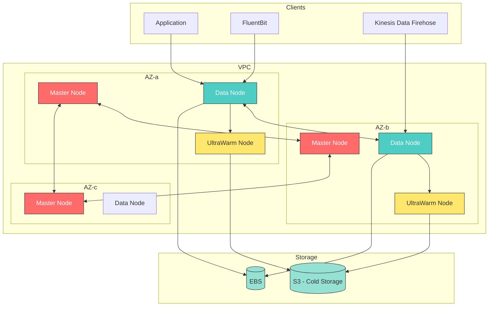
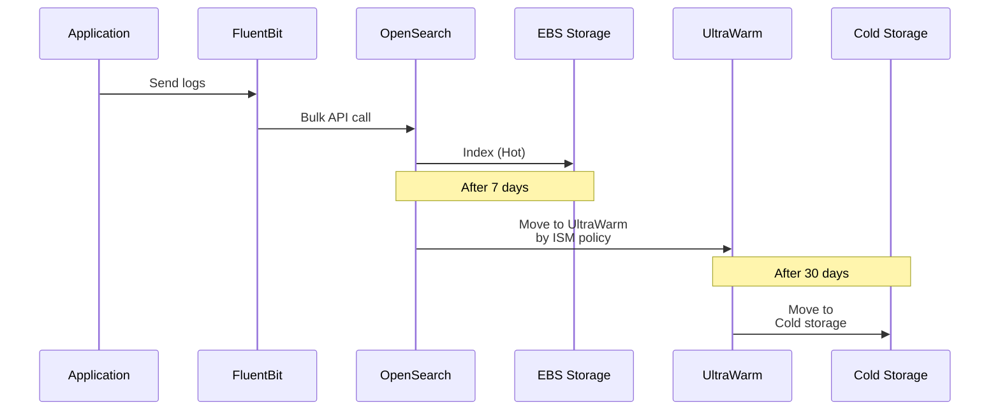

# Amazon OpenSearch Service

> **最終更新**: June 30, 2026

Amazon OpenSearch Service は、リアルタイムのアプリケーション監視、ログ分析、Web サイト検索に使用されるフルマネージドの検索・分析サービスです。Elasticsearch からフォークされた OpenSearch を基盤とし、強力な全文検索機能を提供します。

## 目次

1. [概要](#overview)
2. [アーキテクチャ](#architecture)
3. [Domain の作成](#domain-creation)
4. [Index 管理](#index-management)
5. [データ取り込み](#data-ingestion)
6. [OpenSearch Dashboards](#opensearch-dashboards)
7. [セキュリティ設定](#security-configuration)
8. [コスト最適化](#cost-optimization)
9. [大規模ログ環境での制限事項](#limitations-in-large-scale-log-environments)
10. [Loki との比較](#comparison-with-loki)

---

## 概要

### OpenSearch と Elasticsearch

OpenSearch は、AWS が Elasticsearch 7.10 をフォークして 2021 年に作成したオープンソースプロジェクトです。

| 特徴 | OpenSearch | Elasticsearch |
|----------------|-----------|---------------|
| ライセンス | Apache 2.0 | SSPL/Elastic License |
| マネージドサービス | Amazon OpenSearch Service | Elastic Cloud |
| 互換性 | ES 7.10 API 互換 | 最新バージョン |
| プラグイン | OpenSearch プラグイン | Elastic プラグイン |
| ダッシュボード | OpenSearch Dashboards | Kibana |

### Amazon OpenSearch Service の機能

```
+-------------------------------------------------------------+
|               Amazon OpenSearch Service                      |
+-------------------------------------------------------------+
|  Fully managed        |  Multi-AZ deployment  |  Auto snapshots |
|  Auto patching        |  Encryption (rest/transit) |  VPC integration |
|  Fine-grained Access  |  SAML authentication  |  CloudWatch      |
|  UltraWarm/Cold storage |  Serverless option  |  Cross-cluster   |
+-------------------------------------------------------------+
```

### 主なユースケース

1. **ログ分析**: アプリケーション、インフラストラクチャ、セキュリティログの分析
2. **全文検索**: Web サイト、ドキュメント、製品の検索
3. **セキュリティ分析**: SIEM、脅威検出、コンプライアンス
4. **リアルタイム監視**: アプリケーションパフォーマンス監視
5. **ビジネス分析**: クリックストリーム、ユーザー行動分析

---

## アーキテクチャ

### OpenSearch Cluster アーキテクチャ



### Node の種類

> **参照**: AWS インスタンスタイプのパフォーマンスベンチマークについては、[AWS Instance Benchmark](https://benchmark.aws.atomai.click/) を参照してください。

| Node タイプ | 役割 | 推奨インスタンス |
|-----------|------|---------------------|
| **Master** | Cluster 管理、Index メタデータ | m6g.large.search (3) |
| **Data** | データストレージ、検索/Indexing | r6g.xlarge.search |
| **UltraWarm** | 読み取り専用、コスト効率の高いストレージ | ultrawarm1.medium |
| **Cold** | S3 ベースのアーカイブ | - |

### データフロー



---

## Domain の作成

### AWS Console からの作成

```
1. Access OpenSearch Service console
2. Click "Create domain"
3. Settings:
   - Deployment type: Production
   - Version: OpenSearch 2.x
   - Data nodes: r6g.xlarge.search x 3
   - Master nodes: m6g.large.search x 3
   - EBS: gp3, 500GB per node
   - Network: VPC access
   - Encryption: Enable at-rest and in-transit encryption
   - Enable Fine-grained access control
```

### Terraform による作成

```hcl
# opensearch.tf

# VPC and subnet data
data "aws_vpc" "main" {
  tags = {
    Name = "main-vpc"
  }
}

data "aws_subnets" "private" {
  filter {
    name   = "vpc-id"
    values = [data.aws_vpc.main.id]
  }
  filter {
    name   = "tag:Type"
    values = ["private"]
  }
}

# Security group
resource "aws_security_group" "opensearch" {
  name        = "opensearch-sg"
  description = "Security group for OpenSearch domain"
  vpc_id      = data.aws_vpc.main.id

  ingress {
    description = "HTTPS from VPC"
    from_port   = 443
    to_port     = 443
    protocol    = "tcp"
    cidr_blocks = [data.aws_vpc.main.cidr_block]
  }

  egress {
    from_port   = 0
    to_port     = 0
    protocol    = "-1"
    cidr_blocks = ["0.0.0.0/0"]
  }

  tags = {
    Name = "opensearch-sg"
  }
}

# OpenSearch domain
resource "aws_opensearch_domain" "main" {
  domain_name    = "logs-production"
  engine_version = "OpenSearch_2.11"

  cluster_config {
    instance_type            = "r6g.xlarge.search"
    instance_count           = 3
    zone_awareness_enabled   = true
    dedicated_master_enabled = true
    dedicated_master_type    = "m6g.large.search"
    dedicated_master_count   = 3

    zone_awareness_config {
      availability_zone_count = 3
    }

    # UltraWarm settings
    warm_enabled = true
    warm_type    = "ultrawarm1.medium.search"
    warm_count   = 2

    # Cold Storage settings
    cold_storage_options {
      enabled = true
    }
  }

  # EBS settings
  ebs_options {
    ebs_enabled = true
    volume_type = "gp3"
    volume_size = 500
    iops        = 3000
    throughput  = 250
  }

  # VPC settings
  vpc_options {
    subnet_ids         = slice(data.aws_subnets.private.ids, 0, 3)
    security_group_ids = [aws_security_group.opensearch.id]
  }

  # Encryption settings
  encrypt_at_rest {
    enabled = true
  }

  node_to_node_encryption {
    enabled = true
  }

  domain_endpoint_options {
    enforce_https       = true
    tls_security_policy = "Policy-Min-TLS-1-2-2019-07"
  }

  # Fine-grained Access Control
  advanced_security_options {
    enabled                        = true
    internal_user_database_enabled = true
    master_user_options {
      master_user_name     = "admin"
      master_user_password = var.opensearch_master_password
    }
  }

  # Advanced settings
  advanced_options = {
    "rest.action.multi.allow_explicit_index" = "true"
    "indices.fielddata.cache.size"           = "20"
    "indices.query.bool.max_clause_count"    = "1024"
  }

  # Auto snapshots
  snapshot_options {
    automated_snapshot_start_hour = 23
  }

  # Logging
  log_publishing_options {
    cloudwatch_log_group_arn = aws_cloudwatch_log_group.opensearch_index_slow.arn
    log_type                 = "INDEX_SLOW_LOGS"
    enabled                  = true
  }

  log_publishing_options {
    cloudwatch_log_group_arn = aws_cloudwatch_log_group.opensearch_search_slow.arn
    log_type                 = "SEARCH_SLOW_LOGS"
    enabled                  = true
  }

  log_publishing_options {
    cloudwatch_log_group_arn = aws_cloudwatch_log_group.opensearch_error.arn
    log_type                 = "ES_APPLICATION_LOGS"
    enabled                  = true
  }

  tags = {
    Environment = "production"
    Application = "logging"
  }

  depends_on = [aws_iam_service_linked_role.opensearch]
}

# CloudWatch log groups
resource "aws_cloudwatch_log_group" "opensearch_index_slow" {
  name              = "/aws/opensearch/logs-production/index-slow-logs"
  retention_in_days = 30
}

resource "aws_cloudwatch_log_group" "opensearch_search_slow" {
  name              = "/aws/opensearch/logs-production/search-slow-logs"
  retention_in_days = 30
}

resource "aws_cloudwatch_log_group" "opensearch_error" {
  name              = "/aws/opensearch/logs-production/error-logs"
  retention_in_days = 30
}

# Service-linked role
resource "aws_iam_service_linked_role" "opensearch" {
  aws_service_name = "opensearchservice.amazonaws.com"
}

# CloudWatch log resource policy
resource "aws_cloudwatch_log_resource_policy" "opensearch" {
  policy_name = "opensearch-log-policy"

  policy_document = jsonencode({
    Version = "2012-10-17"
    Statement = [
      {
        Effect = "Allow"
        Principal = {
          Service = "es.amazonaws.com"
        }
        Action = [
          "logs:PutLogEvents",
          "logs:CreateLogStream"
        ]
        Resource = [
          "${aws_cloudwatch_log_group.opensearch_index_slow.arn}:*",
          "${aws_cloudwatch_log_group.opensearch_search_slow.arn}:*",
          "${aws_cloudwatch_log_group.opensearch_error.arn}:*"
        ]
      }
    ]
  })
}

# Outputs
output "opensearch_endpoint" {
  value = aws_opensearch_domain.main.endpoint
}

output "opensearch_dashboard_endpoint" {
  value = aws_opensearch_domain.main.dashboard_endpoint
}
```

---

## Index 管理

### Index Templates

```json
PUT _index_template/logs-template
{
  "index_patterns": ["logs-*"],
  "priority": 100,
  "template": {
    "settings": {
      "number_of_shards": 3,
      "number_of_replicas": 1,
      "refresh_interval": "5s",
      "index.codec": "best_compression",
      "index.mapping.total_fields.limit": 2000,
      "index.translog.durability": "async",
      "index.translog.sync_interval": "30s"
    },
    "mappings": {
      "properties": {
        "@timestamp": {
          "type": "date"
        },
        "level": {
          "type": "keyword"
        },
        "message": {
          "type": "text",
          "analyzer": "standard"
        },
        "kubernetes": {
          "properties": {
            "namespace": { "type": "keyword" },
            "pod_name": { "type": "keyword" },
            "container_name": { "type": "keyword" },
            "labels": { "type": "object" }
          }
        },
        "trace_id": {
          "type": "keyword"
        },
        "span_id": {
          "type": "keyword"
        },
        "http": {
          "properties": {
            "method": { "type": "keyword" },
            "status_code": { "type": "integer" },
            "path": { "type": "keyword" },
            "response_time_ms": { "type": "float" }
          }
        }
      },
      "dynamic_templates": [
        {
          "strings_as_keywords": {
            "match_mapping_type": "string",
            "mapping": {
              "type": "keyword",
              "ignore_above": 1024
            }
          }
        }
      ]
    }
  }
}
```

### ISM (Index State Management) Policies

ISM ポリシーは Index のライフサイクルを自動的に管理します。

```json
PUT _plugins/_ism/policies/logs-lifecycle
{
  "policy": {
    "description": "Log index lifecycle management",
    "default_state": "hot",
    "states": [
      {
        "name": "hot",
        "actions": [
          {
            "rollover": {
              "min_index_age": "1d",
              "min_primary_shard_size": "30gb"
            }
          }
        ],
        "transitions": [
          {
            "state_name": "warm",
            "conditions": {
              "min_index_age": "7d"
            }
          }
        ]
      },
      {
        "name": "warm",
        "actions": [
          {
            "warm_migration": {},
            "replica_count": {
              "number_of_replicas": 0
            },
            "force_merge": {
              "max_num_segments": 1
            }
          }
        ],
        "transitions": [
          {
            "state_name": "cold",
            "conditions": {
              "min_index_age": "30d"
            }
          }
        ]
      },
      {
        "name": "cold",
        "actions": [
          {
            "cold_migration": {
              "timestamp_field": "@timestamp"
            }
          }
        ],
        "transitions": [
          {
            "state_name": "delete",
            "conditions": {
              "min_index_age": "90d"
            }
          }
        ]
      },
      {
        "name": "delete",
        "actions": [
          {
            "delete": {}
          }
        ]
      }
    ],
    "ism_template": [
      {
        "index_patterns": ["logs-*"],
        "priority": 100
      }
    ]
  }
}
```

### Index Aliases

```json
# Create alias for rollover
PUT logs-production-000001
{
  "aliases": {
    "logs-production": {
      "is_write_index": true
    },
    "logs-production-read": {}
  }
}

# Query alias
GET _alias/logs-production

# Manual rollover (for testing)
POST logs-production/_rollover
{
  "conditions": {
    "max_age": "1d",
    "max_primary_shard_size": "30gb"
  }
}
```

---

## データ取り込み

### FluentBit から OpenSearch への直接取り込み

```yaml
# fluent-bit-configmap.yaml
apiVersion: v1
kind: ConfigMap
metadata:
  name: fluent-bit-config
  namespace: logging
data:
  fluent-bit.conf: |
    [SERVICE]
        Flush         5
        Log_Level     info
        Daemon        off
        Parsers_File  parsers.conf
        HTTP_Server   On
        HTTP_Listen   0.0.0.0
        HTTP_Port     2020

    [INPUT]
        Name              tail
        Tag               kube.*
        Path              /var/log/containers/*.log
        Parser            docker
        DB                /var/log/flb_kube.db
        Mem_Buf_Limit     50MB
        Skip_Long_Lines   On
        Refresh_Interval  10

    [FILTER]
        Name                kubernetes
        Match               kube.*
        Kube_URL            https://kubernetes.default.svc:443
        Kube_CA_File        /var/run/secrets/kubernetes.io/serviceaccount/ca.crt
        Kube_Token_File     /var/run/secrets/kubernetes.io/serviceaccount/token
        Merge_Log           On
        K8S-Logging.Parser  On
        K8S-Logging.Exclude On

    [FILTER]
        Name    modify
        Match   *
        Add     cluster_name eks-production
        Add     environment production

    [OUTPUT]
        Name            opensearch
        Match           *
        Host            vpc-logs-production-xxxxx.ap-northeast-2.es.amazonaws.com
        Port            443
        TLS             On
        AWS_Auth        On
        AWS_Region      ap-northeast-2
        Index           logs-production
        Type            _doc
        Logstash_Format On
        Logstash_Prefix logs-production
        Retry_Limit     5
        Buffer_Size     5MB
        Generate_ID     On
        # Compression saves network costs
        Compress        gzip

  parsers.conf: |
    [PARSER]
        Name        docker
        Format      json
        Time_Key    time
        Time_Format %Y-%m-%dT%H:%M:%S.%L
        Time_Keep   On

    [PARSER]
        Name        json
        Format      json
        Time_Key    timestamp
        Time_Format %Y-%m-%dT%H:%M:%S.%LZ
```

### FluentBit DaemonSet（IRSA を使用）

```yaml
# fluent-bit-daemonset.yaml
apiVersion: apps/v1
kind: DaemonSet
metadata:
  name: fluent-bit
  namespace: logging
  labels:
    app: fluent-bit
spec:
  selector:
    matchLabels:
      app: fluent-bit
  template:
    metadata:
      labels:
        app: fluent-bit
    spec:
      serviceAccountName: fluent-bit
      tolerations:
        - key: node-role.kubernetes.io/master
          operator: Exists
          effect: NoSchedule
        - operator: Exists
          effect: NoExecute
        - operator: Exists
          effect: NoSchedule
      containers:
        - name: fluent-bit
          image: public.ecr.aws/aws-observability/aws-for-fluent-bit:2.31.12
          resources:
            limits:
              cpu: 500m
              memory: 500Mi
            requests:
              cpu: 100m
              memory: 100Mi
          volumeMounts:
            - name: varlog
              mountPath: /var/log
              readOnly: true
            - name: varlibdockercontainers
              mountPath: /var/lib/docker/containers
              readOnly: true
            - name: fluent-bit-config
              mountPath: /fluent-bit/etc/
          env:
            - name: AWS_REGION
              value: ap-northeast-2
      volumes:
        - name: varlog
          hostPath:
            path: /var/log
        - name: varlibdockercontainers
          hostPath:
            path: /var/lib/docker/containers
        - name: fluent-bit-config
          configMap:
            name: fluent-bit-config
---
apiVersion: v1
kind: ServiceAccount
metadata:
  name: fluent-bit
  namespace: logging
  annotations:
    eks.amazonaws.com/role-arn: arn:aws:iam::123456789012:role/FluentBitOpenSearchRole
```

### Kinesis Data Firehose 経由の取り込み

```hcl
# firehose.tf
resource "aws_kinesis_firehose_delivery_stream" "opensearch" {
  name        = "logs-to-opensearch"
  destination = "opensearch"

  opensearch_configuration {
    domain_arn            = aws_opensearch_domain.main.arn
    role_arn              = aws_iam_role.firehose.arn
    index_name            = "logs"
    index_rotation_period = "OneDay"
    buffering_interval    = 60
    buffering_size        = 5
    retry_duration        = 300

    vpc_config {
      subnet_ids         = data.aws_subnets.private.ids
      security_group_ids = [aws_security_group.firehose.id]
      role_arn           = aws_iam_role.firehose_vpc.arn
    }

    cloudwatch_logging_options {
      enabled         = true
      log_group_name  = aws_cloudwatch_log_group.firehose.name
      log_stream_name = "opensearch-delivery"
    }

    s3_configuration {
      role_arn           = aws_iam_role.firehose.arn
      bucket_arn         = aws_s3_bucket.backup.arn
      prefix             = "failed/"
      buffering_size     = 10
      buffering_interval = 400
      compression_format = "GZIP"
    }
  }
}
```

---

## OpenSearch Dashboards

### Dashboard アクセスの設定

```bash
# SSH tunnel (for dev/test)
ssh -i key.pem -L 9200:vpc-logs-production-xxx.ap-northeast-2.es.amazonaws.com:443 ec2-user@bastion

# Or access via ALB (recommended for production)
```

### Index Pattern の作成

```
1. Access OpenSearch Dashboards
2. Management > Stack Management > Index Patterns
3. Click "Create index pattern"
4. Index pattern: logs-*
5. Time field: @timestamp
6. Click "Create index pattern"
```

### 検索クエリの例

```json
# Search error logs
GET logs-*/_search
{
  "query": {
    "bool": {
      "must": [
        { "match": { "level": "error" } },
        { "range": { "@timestamp": { "gte": "now-1h" } } }
      ],
      "filter": [
        { "term": { "kubernetes.namespace": "production" } }
      ]
    }
  },
  "sort": [
    { "@timestamp": { "order": "desc" } }
  ],
  "size": 100
}

# Aggregation query - errors by namespace
GET logs-*/_search
{
  "size": 0,
  "query": {
    "range": {
      "@timestamp": { "gte": "now-24h" }
    }
  },
  "aggs": {
    "by_namespace": {
      "terms": {
        "field": "kubernetes.namespace",
        "size": 20
      },
      "aggs": {
        "by_level": {
          "terms": {
            "field": "level",
            "size": 5
          }
        }
      }
    }
  }
}

# Response time percentiles
GET logs-*/_search
{
  "size": 0,
  "query": {
    "bool": {
      "must": [
        { "exists": { "field": "http.response_time_ms" } },
        { "range": { "@timestamp": { "gte": "now-1h" } } }
      ]
    }
  },
  "aggs": {
    "response_time_percentiles": {
      "percentiles": {
        "field": "http.response_time_ms",
        "percents": [50, 75, 90, 95, 99]
      }
    }
  }
}
```

### 可視化の作成

```
# Pie Chart: Log level distribution
1. Visualize > Create visualization > Pie
2. Index pattern: logs-*
3. Buckets > Split slices > Terms > level
4. Save

# Line Chart: Errors over time
1. Visualize > Create visualization > Line
2. Index pattern: logs-*
3. Y-axis: Count
4. X-axis: Date Histogram > @timestamp
5. Add filter: level: error
6. Save

# Data Table: Top error messages
1. Visualize > Create visualization > Data table
2. Index pattern: logs-*
3. Bucket: Terms > message.keyword (Top 10)
4. Add filter: level: error
5. Save
```

---

## セキュリティ設定

### Fine-Grained Access Control (FGAC)

```json
# Create role
PUT _plugins/_security/api/roles/logs-reader
{
  "cluster_permissions": [
    "cluster_composite_ops_ro"
  ],
  "index_permissions": [
    {
      "index_patterns": ["logs-*"],
      "allowed_actions": [
        "read",
        "search"
      ]
    }
  ]
}

# Role mapping (IAM role)
PUT _plugins/_security/api/rolesmapping/logs-reader
{
  "backend_roles": [
    "arn:aws:iam::123456789012:role/DeveloperRole"
  ],
  "users": [
    "developer@example.com"
  ]
}

# Admin role
PUT _plugins/_security/api/roles/logs-admin
{
  "cluster_permissions": [
    "cluster_all"
  ],
  "index_permissions": [
    {
      "index_patterns": ["logs-*"],
      "allowed_actions": ["indices_all"]
    }
  ]
}
```

### Document-Level Security (DLS)

```json
# Role that can only access specific namespace
PUT _plugins/_security/api/roles/team-a-logs
{
  "cluster_permissions": [
    "cluster_composite_ops_ro"
  ],
  "index_permissions": [
    {
      "index_patterns": ["logs-*"],
      "dls": "{\"bool\": {\"must\": [{\"term\": {\"kubernetes.namespace\": \"team-a\"}}]}}",
      "allowed_actions": ["read", "search"]
    }
  ]
}
```

### Field-Level Security (FLS)

```json
# Hide sensitive fields
PUT _plugins/_security/api/roles/logs-restricted
{
  "cluster_permissions": [
    "cluster_composite_ops_ro"
  ],
  "index_permissions": [
    {
      "index_patterns": ["logs-*"],
      "fls": ["~user_id", "~ip_address", "~session_token"],
      "allowed_actions": ["read", "search"]
    }
  ]
}
```

### SAML 認証の設定

```yaml
# opensearch-security-config.yaml
config:
  dynamic:
    authc:
      saml_auth_domain:
        enabled: true
        order: 1
        http_authenticator:
          type: saml
          challenge: true
          config:
            idp:
              metadata_url: https://example.okta.com/app/xxx/sso/saml/metadata
              entity_id: http://www.okta.com/xxx
            sp:
              entity_id: https://vpc-logs-production-xxx.ap-northeast-2.es.amazonaws.com
            kibana_url: https://vpc-logs-production-xxx.ap-northeast-2.es.amazonaws.com/_dashboards
            roles_key: Role
            exchange_key: your-exchange-key
        authentication_backend:
          type: noop
```

---

## コスト最適化

### ストレージ階層化

```
Hot (EBS gp3)    ->    UltraWarm    ->    Cold Storage (S3)
     |                    |                    |
  Day 0-7            Day 7-30            Day 30-90
     |                    |                    |
 Fast queries        Read-only            Archive
 High cost          Medium cost          Low cost
```

### コスト比較（100GB/日を基準）

```
+-----------------+--------------+--------------+--------------+
|  Storage Tier   |  Retention   | Monthly Cost |  Cost per GB |
+-----------------+--------------+--------------+--------------+
| Hot (EBS gp3)   |    7 days    |   ~$500      |   $0.10/GB   |
| UltraWarm       |   23 days    |   ~$350      |   $0.024/GB  |
| Cold Storage    |   60 days    |   ~$120      |   $0.01/GB   |
+-----------------+--------------+--------------+--------------+
| Total (90-day)  |              |   ~$970/mo   |              |
| Hot only        |   90 days    |  ~$2,700/mo  |              |
| Savings         |              |  ~$1,730/mo  |    64% saved |
+-----------------+--------------+--------------+--------------+
```

### Index の最適化

```json
# Compression settings
PUT logs-*/_settings
{
  "index": {
    "codec": "best_compression"
  }
}

# Adjust refresh interval (during ingestion)
PUT logs-*/_settings
{
  "index": {
    "refresh_interval": "30s"
  }
}

# Disable unnecessary fields
PUT _index_template/logs-optimized
{
  "index_patterns": ["logs-*"],
  "template": {
    "mappings": {
      "_source": {
        "enabled": true
      },
      "properties": {
        "message": {
          "type": "text",
          "norms": false,
          "index_options": "docs"
        }
      }
    }
  }
}
```

### Reserved Instances

```bash
# RI purchase recommendations
# - Purchase RI if planning to use for 1+ years
# - All Upfront option is cheapest (up to 36% savings)
# - Partial Upfront: 24% savings
# - No Upfront: 21% savings
```

---

## 大規模ログ環境での制限事項

OpenSearch は全文検索に優れていますが、ログ量が急速に増加すると構造的な制限が顕在化します。

### Inverted Index の非効率性

| 観点 | OpenSearch（Inverted Index） | ClickHouse（カラムナ） |
|--------|---------------------------|---------------------|
| **圧縮率** | 1.5～2 倍のサイズ増加（Index を含む） | 元データ比 5～10 倍の圧縮 |
| **集計クエリ** | 全ドキュメントのスキャンが必要 | 高速なカラム単位のスキャン |
| **ストレージコスト** | 高い（Index + 元データ） | 低い（カラム圧縮） |
| **INSERT コスト** | Indexing による CPU オーバーヘッドが大きい | 軽量なカラム append |

### 集計クエリのパフォーマンス低下

ログ分析で頻繁に使用される集計クエリ（過去 1 時間の ERROR 数、Service ごとのエラー率など）では、OpenSearch は一致するすべてのドキュメントを読み取る必要があるため、データの増加に伴いパフォーマンスが急激に低下します。

```
Query: "Aggregate ERROR log count by service for the last hour"

OpenSearch: Look up document IDs from index → Read each document → Aggregate
           100GB scale: ~2s / 1TB scale: ~25s / 10TB scale: timeout

ClickHouse: Scan only timestamp, level, service columns → Aggregate
           100GB scale: ~0.3s / 1TB scale: ~1s / 10TB scale: ~8s
```

### スケーリングコストの問題

| 1 日あたりのログ量 | OpenSearch 月額コスト（推定） | ClickHouse 月額コスト（推定） | 比率 |
|-----------------|-------------------------------|-------------------------------|-------|
| 100GB | ~$970 | ~$400 | 2.4x |
| 500GB | ~$4,500 | ~$1,200 | 3.8x |
| 1TB | ~$9,000 | ~$2,000 | 4.5x |
| 10TB | ~$80,000+ | ~$10,000 | 8x+ |

> **重要なポイント**: ログクエリパターンを分析すると、ほとんどの環境ではクエリの 90% 以上が「時間範囲 + フィールド条件」ベースです。このパターンは Inverted Index よりカラムナストレージの方がはるかに効率的です。

### ClickHouse への移行判断基準

OpenSearch を継続するか、ClickHouse への移行を検討するかは、以下の基準で判断してください。

| 基準 | OpenSearch を継続 | ClickHouse を検討 |
|----------|----------------|-------------------|
| **1 日あたりのログ量** | 100GB 未満 | 100GB 超 |
| **主なクエリパターン** | 全文検索（キーワードベース） | 時間範囲 + フィールド条件 |
| **集計クエリの割合** | 低い（全体の 20% 未満） | 高い（全体の 50% 超） |
| **コスト感度** | 低い | 高い |
| **全文検索の必要性** | 必須（コア機能） | 任意（あれば便利） |
| **チームの SQL 習熟度** | 低い | 高い |

**移行時の考慮事項:**

```
Phase 1: Query Pattern Analysis (2 weeks)
  └── Analyze actual query logs for full-text search vs field-condition query ratio

Phase 2: Parallel Operation (1-2 months)
  └── Dual-write same logs to both OpenSearch + ClickHouse
  └── Compare query performance and costs

Phase 3: Gradual Migration
  └── Aggregation/dashboard queries → Migrate to ClickHouse first
  └── Queries requiring full-text search → Keep OpenSearch or use ClickHouse tokenbf index
```

---

## Loki との比較

### 機能比較

| 機能 | OpenSearch | Loki |
|---------|-----------|------|
| **全文検索** | 優れている（Lucene ベース） | 制限あり（labels+grep） |
| **クエリ言語** | Query DSL、SQL | LogQL |
| **Indexing** | 全文 | labels のみ |
| **ストレージコスト** | 高い | 低い（オブジェクトストレージ） |
| **複雑な集計** | 優れている | 基本的 |
| **Dashboard** | OpenSearch Dashboards | Grafana |
| **運用の複雑さ** | 高い | 低い |
| **スケーラビリティ** | 水平 | 水平 |
| **マルチテナンシー** | FGAC | ネイティブ |

### ユースケース別の推奨事項

```
OpenSearch recommended:
+-- Full-text search is required
+-- Complex analytics/aggregation queries needed
+-- Compliance requirements (audit logs)
+-- Security analytics (SIEM)
+-- Migrating from existing ELK stack

Loki recommended:
+-- Cost is top priority
+-- Already using Grafana
+-- Simple log search/filtering
+-- Need Prometheus integration
+-- Want to reduce operational burden
```

### 移行時の考慮事項

```yaml
# Migrating from Loki to OpenSearch
considerations:
  - Query rewriting needed (LogQL -> Query DSL)
  - Dashboard rebuild (Grafana -> OpenSearch Dashboards)
  - Index template/mapping design
  - Expected cost increase (3-5x)
  - Increased operational complexity

# Migrating from OpenSearch to Loki
considerations:
  - Loss of full-text search capabilities
  - Limited complex aggregation queries
  - Existing dashboard/alert rebuild
  - Cost savings (60-80%)
  - Operational simplification
```

---

## クイズ

[OpenSearch クイズ](../../quizzes/observability/logging/02-opensearch-quiz.md)で知識を確認しましょう。
