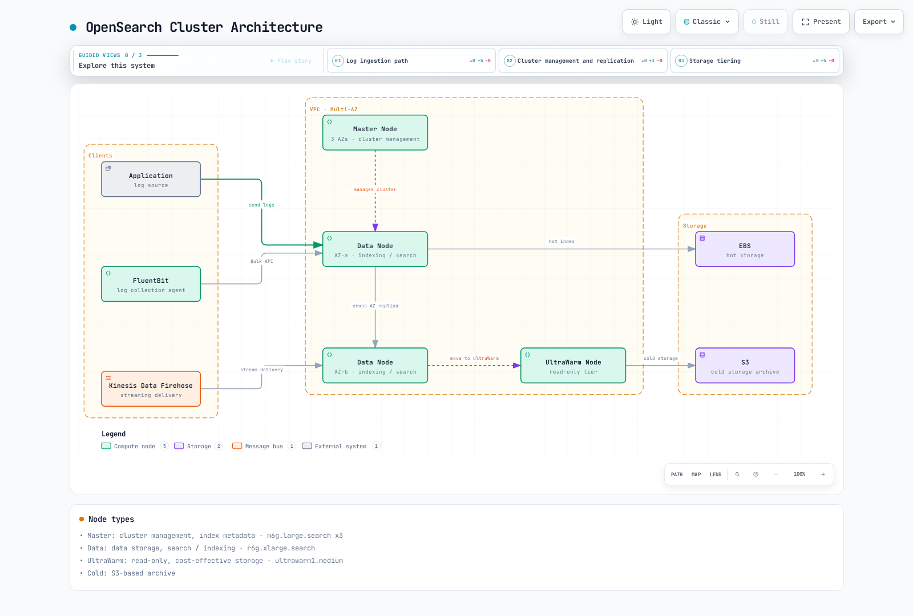

# Amazon OpenSearch Service

> **最終更新**: September 13, 2026
> **サンプルのベースライン**: プロビジョニング型 OpenSearch Service 3.5、Terraform 1.15.7/AWS provider 6.64.0、AWS for Fluent Bit 3.4.15 (Fluent Bit 5.0.9)。ローカル構成の確認のみを行っており、domain、collector、SAML session、またはデータ配信テストはデプロイしていません。

Amazon OpenSearch Service は検索クラスターを管理し、選択した OpenSearch と従来の Elasticsearch OSS バージョンをサポートします。この章では、VPC domain と従来の hot/UltraWarm/cold tier を扱います。Serverless collection と新しい optimized-instance storage option には、別個の構成、API、可用性要件があります。

<span id="table-of-contents"></span>
<span id="opensearch-vs-elasticsearch"></span>
<span id="amazon-opensearch-service-features"></span>
<span id="key-use-cases"></span>

## 概要

OpenSearch は Apache-2.0 ライセンスの検索プロジェクトです。Elasticsearch 7.10 系統であることは、現在のすべての Elasticsearch client、plugin、または API との互換性を意味しません。Elastic の現在のソースライセンスの選択肢には、対象となるソース部分の AGPLv3 と SSPL/Elastic License 2.0 が含まれます。Elasticsearch を単一の不変のライセンスモデルとして扱うのではなく、正確な component と distribution を確認してください。

AWS のサポート表には現在、サポート対象バージョンとして OpenSearch 3.5 が掲載されています。以前の 2.11 の例は **2027 年 11 月 7 日まで標準サポートの対象です**。新しいバージョンが存在するだけでサポート対象外になるわけではありません。既存の domain では、バージョンアップグレードをリクエストする前に、サポートされるアップグレードパス、破壊的変更、snapshot、および client の互換性を確認してください。

OpenSearch Service は、ログ分析、全文検索、aggregation、およびセキュリティ分析ワークフローをサポートできます。サービスを有効にすることや監査ログを保持すること自体は、compliance 要件を満たすものではありません。

<span id="node-types"></span>

## アーキテクチャ

### OpenSearch クラスターアーキテクチャ



[インタラクティブな図を表示](https://www.atomai.click/kubernetes-docs/archmaps/en-observability-logging-02-opensearch-0.html)

この図は概略図であり、正確な replica/AZ レイアウトやサイジング推奨ではありません。図の「Master」ラベルは専用の cluster-management role を意味します。AWS の構成フィールドでは引き続き `dedicated_master_*` を使用します。「Kinesis Data Firehose」は **Amazon Data Firehose** の旧称です。UltraWarm と cold storage はどちらも S3-backed storage を使用します。cold data はクエリの前に UltraWarm にアタッチする必要があります。

| ロールまたは tier | 機能 |
|---|---|
| Dedicated cluster-manager node | クラスター状態、metadata、shard allocation を管理します。3 台が一般的な dedicated-manager 構成です。これらは data replica ではありません。 |
| Data node / hot storage | indexing と querying を行います。EBS の可用性と制限は、選択した instance family によって異なります。 |
| UltraWarm | S3 をバックエンドとする read-only index と、warm-node の cache/compute です。engine、instance、dedicated-manager の前提条件を確認してください。 |
| Cold storage | 別の lifecycle を持つ、デタッチされた index storage です。クエリするには、選択した index を UltraWarm に再アタッチします。 |

Multi-AZ with Standby には追加の topology および replica 要件があります。単に zone awareness を有効にしても、Standby が有効になったり、その可用性保証が確立されたりするわけではありません。VPC Encryption Controls や storage compatibility を含む、現在の instance 制限を確認してください。元の r6g/m6g サイズはサンプル入力であり、benchmark ではありません。

補足リソース: [AWS Instance Benchmark](https://benchmark.aws.atomai.click/)。サービスの capacity には、代表的な OpenSearch workload テストが引き続き必要です。

### データフロー


[インタラクティブな図を表示](https://www.atomai.click/kubernetes-docs/archmaps/en-observability-logging-02-opensearch-1.html)

7/30 日のラベルは、**index-age condition** の例であり、自動のデフォルト値や正確な event-age retention ではありません。ISM は定期的に実行され、migration は非同期です。日付ベースの indexing では、遅れて到着した event や再送された event が、古い read-only index を対象にする可能性があります。migration を有効にする前に、それらの routing または archive 方法を決定してください。

<span id="creation-via-aws-console"></span>

## Domain の作成

### 前提条件

同じ VPC 内の異なる AZ にある 3 つの private subnet、到達可能な client security group、既存の service-linked role、承認済みの administrator/writer/reader IAM role を準備します。この例では異なる subnet ID を検証しますが、AZ、route、capacity、または所有権をリモートで検証するものではありません。

Terraform profile は **IAM-signed API request** と IAM master role を使用します。Terraform state に内部 master password を置くことは避けています。ログを送信する前に、FGAC role mapping を構成してください。Browser SSO は、後で説明する別の access profile です。IAM-principal domain policy には SigV4 が必要であり、署名されていない SAML browser request を自動的に受け入れるものではありません。

### Terraform による作成

この例では commercial AWS partition と Seoul Region を使用します。入力を一貫して置き換え、リージョンでの可用性を確認してください。apply すると resource が作成されます。この監査ではローカル検証のみを実行しました。

```hcl
terraform {
  required_providers {
    aws = {
      source  = "hashicorp/aws"
      version = "6.64.0"
    }
  }
}

variable "region" {
  type    = string
  default = "ap-northeast-2"
}

variable "account_id" {
  type = string
  validation {
    condition     = can(regex("^[0-9]{12}$", var.account_id))
    error_message = "Use the owning AWS account ID."
  }
}

variable "vpc_id" {
  type = string
}

variable "subnet_ids" {
  type = list(string)
  validation {
    condition     = length(var.subnet_ids) == 3 && length(distinct(var.subnet_ids)) == 3
    error_message = "Provide three distinct subnet IDs, one in each intended AZ."
  }
}

variable "client_security_group_ids" {
  type = set(string)
}

variable "admin_role_arn" {
  type = string
}

variable "writer_role_arns" {
  type = set(string)
}

variable "reader_role_arns" {
  type    = set(string)
  default = []
}

provider "aws" {
  region = var.region
}

locals {
  domain_name = "logs-production"
  domain_arn  = "arn:aws:es:${var.region}:${var.account_id}:domain/${local.domain_name}"
  log_types   = toset(["INDEX_SLOW_LOGS", "SEARCH_SLOW_LOGS", "ES_APPLICATION_LOGS", "AUDIT_LOGS"])
  callers     = setunion(toset([var.admin_role_arn]), var.writer_role_arns, var.reader_role_arns)
}

resource "aws_security_group" "search" {
  name_prefix = "logs-search-"
  description = "OpenSearch HTTPS from approved client security groups"
  vpc_id      = var.vpc_id
}

resource "aws_vpc_security_group_ingress_rule" "clients" {
  for_each                     = var.client_security_group_ids
  security_group_id            = aws_security_group.search.id
  referenced_security_group_id = each.value
  from_port                    = 443
  to_port                      = 443
  ip_protocol                  = "tcp"
}

resource "aws_vpc_security_group_egress_rule" "outbound" {
  security_group_id = aws_security_group.search.id
  cidr_ipv4         = "0.0.0.0/0"
  ip_protocol       = "-1"
}

resource "aws_cloudwatch_log_group" "search" {
  for_each          = local.log_types
  name              = "/aws/opensearch/${local.domain_name}/${lower(each.value)}"
  retention_in_days = 30
}

resource "aws_cloudwatch_log_resource_policy" "search" {
  policy_name = "logs-production-opensearch"
  policy_document = jsonencode({
    Version = "2012-10-17"
    Statement = [{
      Effect    = "Allow"
      Principal = { Service = "es.amazonaws.com" }
      Action    = ["logs:CreateLogStream", "logs:PutLogEvents"]
      Resource  = [for group in aws_cloudwatch_log_group.search : "${group.arn}:*"]
      Condition = {
        StringEquals = { "aws:SourceAccount" = var.account_id }
        ArnEquals    = { "aws:SourceArn" = local.domain_arn }
      }
    }]
  })
}

resource "aws_opensearch_domain" "logs" {
  domain_name    = local.domain_name
  engine_version = "OpenSearch_3.5"

  cluster_config {
    instance_type                 = "r6g.xlarge.search"
    instance_count                = 3
    dedicated_master_enabled      = true
    dedicated_master_type         = "m6g.large.search"
    dedicated_master_count        = 3
    zone_awareness_enabled        = true
    multi_az_with_standby_enabled = false
    zone_awareness_config {
      availability_zone_count = 3
    }
    warm_enabled = true
    warm_type    = "ultrawarm1.medium.search"
    warm_count   = 2
    cold_storage_options {
      enabled = true
    }
  }

  ebs_options {
    ebs_enabled = true
    volume_type = "gp3"
    volume_size = 500
  }

  vpc_options {
    subnet_ids         = var.subnet_ids
    security_group_ids = [aws_security_group.search.id]
  }

  encrypt_at_rest {
    enabled = true
  }
  node_to_node_encryption {
    enabled = true
  }
  domain_endpoint_options {
    enforce_https       = true
    tls_security_policy = "Policy-Min-TLS-1-2-PFS-2023-10"
  }
  advanced_security_options {
    enabled                        = true
    internal_user_database_enabled = false
    master_user_options {
      master_user_arn = var.admin_role_arn
    }
  }

  access_policies = jsonencode({
    Version = "2012-10-17"
    Statement = [{
      Effect    = "Allow"
      Principal = { AWS = sort(tolist(local.callers)) }
      Action    = ["es:ESHttp*"]
      Resource  = "${local.domain_arn}/*"
    }]
  })

  dynamic "log_publishing_options" {
    for_each = aws_cloudwatch_log_group.search
    content {
      cloudwatch_log_group_arn = log_publishing_options.value.arn
      log_type                 = log_publishing_options.key
      enabled                  = true
    }
  }

  depends_on = [aws_cloudwatch_log_resource_policy.search]
}

output "domain_endpoint" {
  value = aws_opensearch_domain.logs.endpoint
}

output "dashboards_endpoint" {
  value = aws_opensearch_domain.logs.dashboard_endpoint
}
```

初期サイズ、500GiB EBS volume、30 日の CloudWatch retention は説明用です。この profile は明示的に Standby **なし**の Multi-AZ を使用します。このリファレンスでは outbound security-group access は広範なままです。本番運用の前に、実際にサポートされる接続に対する egress restriction を設計してください。

Domain access policy は、名前を指定した IAM role に HTTP operation を許可します。**FGAC** で index/cluster permission を制限する必要があります。URI ベースの IAM permission だけでは、bulk request body に埋め込まれた index name は制限されません。collector role には、意図した writer mapping のみを付与してください。

プラットフォームの service-linked role は account-level dependency です。デプロイごとに同じ role を作成しようとするのではなく、それを所有する infrastructure state を通じて再利用または import してください。

OpenSearch domain は、14 日間（最大 336）保持される毎時の automated snapshot を受け取ります。古い `automated_snapshot_start_hour` の例は、この OpenSearch profile ではなく、はるかに古い Elasticsearch バージョンに適用されます。Snapshot は recovery mechanism であり、テスト済みの retention/restore plan の代替ではありません。cluster status が red の場合、snapshot が実行されないことがあります。

CloudWatch publishing では、domain configuration の前に scoped resource policy が必要です。slow-log destination を公開しても、すべての slow-log threshold が有効になるわけではありません。また、audit-log publishing はすべての audit event を構成するものではありません。対応する engine/audit setting は意図的に構成してください。ログ内の query と document content にも access および retention control が必要です。

<span id="index-aliases"></span>

## Index 管理

以下の主な collector は、`logs-production-YYYY.MM.DD` という名前の**日次 index**に書き込みます。template、ISM pattern、query の例はこの pattern を使用します。別の rollover 演習を後に示します。2 つの writer strategy を暗黙に組み合わせないでください。

以下の request block は OpenSearch Dashboards Dev Tools の構文を使用します。これらはスタンドアロン JSON file でも、監査で実行される command でもありません。認可済みの data-plane client と目的の domain を使用してください。

### Index Template

```http
PUT _index_template/logs-template
{
  "index_patterns": [
    "logs-production-*"
  ],
  "priority": 100,
  "template": {
    "settings": {
      "number_of_shards": 3,
      "number_of_replicas": 1,
      "refresh_interval": "5s",
      "index.codec": "best_compression",
      "index.translog.durability": "request"
    },
    "mappings": {
      "dynamic": false,
      "properties": {
        "@timestamp": {
          "type": "date"
        },
        "cluster_name": {
          "type": "keyword"
        },
        "environment": {
          "type": "keyword"
        },
        "stream": {
          "type": "keyword"
        },
        "log": {
          "type": "text",
          "index": false
        },
        "kubernetes": {
          "properties": {
            "namespace_name": {
              "type": "keyword"
            },
            "pod_name": {
              "type": "keyword"
            },
            "container_name": {
              "type": "keyword"
            },
            "host": {
              "type": "keyword"
            }
          }
        },
        "app": {
          "properties": {
            "level": {
              "type": "keyword"
            },
            "message": {
              "type": "text",
              "fields": {
                "keyword": {
                  "type": "keyword",
                  "ignore_above": 256
                }
              }
            },
            "error_type": {
              "type": "keyword"
            },
            "trace_id": {
              "type": "keyword"
            },
            "span_id": {
              "type": "keyword"
            },
            "request_id": {
              "type": "keyword"
            },
            "http": {
              "properties": {
                "method": {
                  "type": "keyword"
                },
                "status_code": {
                  "type": "integer"
                },
                "path": {
                  "type": "keyword"
                },
                "response_time_ms": {
                  "type": "float"
                }
              }
            }
          }
        }
      }
    }
  }
}
```

Kubernetes filter は `kubernetes.namespace` ではなく `kubernetes.namespace_name` を生成します。Application JSON は、collector metadata から分離するため `app` の下にネストされています。Application は、文書化された field と unit を出力する必要があります。例では小文字の `app.level` と、`app.http.response_time_ms` の millisecond を使用しています。

collector enrichment 前の、説明用の 1 行 application record を次に示します。

```json
{"level":"error","message":"request failed","error_type":"upstream_timeout","http":{"method":"GET","path":"/orders","status_code":503,"response_time_ms":1250}}
```

`message.keyword` subfield は `app.message.keyword` として明示的に定義されます。`text` mapping だけでは自動的に作成されません。`ignore_above` の上限を超えた値は、その subfield に index されません。任意の message ではなく、aggregation 用に上限のある `error_type` taxonomy を検討してください。

`dynamic: false` は新しい mapped field を制限しますが、**未知の field を `_source` から削除しません**。生の `log` field は search index なしで保存されます。生データの重複、redaction、access を確認してください。`translog.durability: request` は、説明のない async/30s durability のトレードオフより安全なベースラインです。いずれの設定も、すべての storage または replica failure からの recovery を保証するものではありません。

### ISM (Index State Management) Policy

```http
PUT _plugins/_ism/policies/logs-lifecycle
{
  "policy": {
    "description": "Illustrative daily-index hot/warm/cold retention; confirm ownership and late-arrival handling.",
    "schema_version": 1,
    "default_state": "hot",
    "states": [
      {
        "name": "hot",
        "actions": [],
        "transitions": [
          {
            "state_name": "warm",
            "conditions": {
              "min_index_age": "7d"
            }
          }
        ]
      },
      {
        "name": "warm",
        "actions": [
          {
            "warm_migration": {}
          }
        ],
        "transitions": [
          {
            "state_name": "cold",
            "conditions": {
              "min_index_age": "30d"
            }
          }
        ]
      },
      {
        "name": "cold",
        "actions": [
          {
            "cold_migration": {
              "timestamp_field": "@timestamp"
            }
          }
        ],
        "transitions": [
          {
            "state_name": "delete",
            "conditions": {
              "min_index_age": "90d"
            }
          }
        ]
      },
      {
        "name": "delete",
        "actions": [
          {
            "cold_delete": {}
          }
        ],
        "transitions": []
      }
    ],
    "ism_template": [
      {
        "index_patterns": [
          "logs-production-*"
        ],
        "priority": 100
      }
    ]
  }
}
```

この policy は、新しく作成された一致する index にアタッチされます。既存の index には、意図的な policy-attachment operation が必要です。変更前に `_plugins/_ism/explain/INDEX` と policy version を確認してください。

各 action object には 1 つの action（サポートされる retry/timeout metadata を含む）が含まれます。managed `warm_migration`、`cold_migration`、および **`cold_delete`** は、self-managed ISM operation とは異なります。cold index には `cold_delete` が必要であり、ISM cold migration には明示的な timestamp field が必要です。warm migration、replica change、force merge を 1 つの action object にまとめないでください。

ISM は通常、5～8 分ごとに job を評価し、cluster status が red の間は実行されません。index age は index creation から測定されます。90 日後の削除例は組織上の選択であり、普遍的な法的要件や正確な record 単位の expiry ではありません。削除を有効にする前に、late-data behavior、snapshot、recovery を検証してください。

### Index Alias と Rollover

この独立した演習では、prefix `rollover-logs-*` と writer alias を使用します。日次 collector configuration は変更しません。

```http
PUT _index_template/rollover-logs
{
  "index_patterns": [
    "rollover-logs-*"
  ],
  "priority": 100,
  "template": {
    "settings": {
      "number_of_shards": 3,
      "number_of_replicas": 1,
      "plugins.index_state_management.rollover_alias": "rollover-logs-write"
    },
    "mappings": {
      "properties": {
        "@timestamp": {
          "type": "date"
        },
        "message": {
          "type": "text"
        }
      }
    }
  }
}

PUT _plugins/_ism/policies/rollover-logs
{
  "policy": {
    "description": "Independent rollover example; not attached to date-based collector indexes.",
    "schema_version": 1,
    "default_state": "write",
    "states": [
      {
        "name": "write",
        "actions": [
          {
            "rollover": {
              "min_index_age": "1d",
              "min_primary_shard_size": "30gb"
            }
          }
        ],
        "transitions": []
      }
    ],
    "ism_template": [
      {
        "index_patterns": [
          "rollover-logs-*"
        ],
        "priority": 100
      }
    ]
  }
}

PUT rollover-logs-000001
{
  "aliases": {
    "rollover-logs-write": {
      "is_write_index": true
    }
  }
}

POST rollover-logs-write/_doc
{
  "@timestamp": "2026-09-13T00:00:00Z",
  "message": "synthetic rollover example"
}

GET _plugins/_ism/explain/rollover-logs-000001

POST rollover-logs-write/_rollover
{
  "conditions": {
    "max_age": "1d",
    "max_size": "90gb"
  }
}
```

自動 ISM rollover には、rollover alias setting、適切な番号付き index、write alias が必要です。alias が存在するだけでは、日付単位の writer がその alias を使用することはありません。

ISM の `min_primary_shard_size: 30gb` は、単一の primary shard に関するものです。OpenSearch 3.5 の rollover REST parser は `max_age`、`max_docs`、`max_size` を受け入れます。`max_size` は replica を除く**合計 primary-shard storage**を測定します。したがって、90GB の REST 例は、primary-shard あたり 30GB の threshold と同じ条件ではありません。Rollover condition は代替条件であり、すべての threshold を同時に満たす必要はありません。

<span id="direct-ingestion-from-fluentbit-to-opensearch"></span>
<span id="fluentbit-daemonset-using-irsa"></span>

## データ取り込み

### Fluent Bit からの直接取り込み

次の 6 つの resource は、対象となる **Linux EC2 node** 用のリファレンス collector configuration を構成します。Fargate は platform log router を使用します。Windows およびその他の node platform には独自の path と deployment model が必要です。node log reader をデプロイする前に、host path、admission-policy exception、resource need を確認してください。

実際の domain hostname、Region、IRSA role を設定してください。role の OIDC trust は `system:serviceaccount:logging:fluent-bit` と一致する必要があります。また、IAM/data-plane access と FGAC writer role も認可してください。Pod Identity は、互換性のある node/agent/SDK support がある場合にのみ代替手段になります。

```yaml
apiVersion: v1
kind: Namespace
metadata:
  name: logging
---
apiVersion: v1
kind: ServiceAccount
metadata:
  name: fluent-bit
  namespace: logging
  annotations:
    eks.amazonaws.com/role-arn: arn:aws:iam::123456789012:role/FluentBitOpenSearchRole
---
apiVersion: rbac.authorization.k8s.io/v1
kind: ClusterRole
metadata:
  name: fluent-bit-metadata
rules:
- apiGroups:
  - ''
  resources:
  - namespaces
  - pods
  verbs:
  - get
  - list
  - watch
---
apiVersion: rbac.authorization.k8s.io/v1
kind: ClusterRoleBinding
metadata:
  name: fluent-bit-metadata
roleRef:
  apiGroup: rbac.authorization.k8s.io
  kind: ClusterRole
  name: fluent-bit-metadata
subjects:
- kind: ServiceAccount
  name: fluent-bit
  namespace: logging
---
apiVersion: v1
kind: ConfigMap
metadata:
  name: fluent-bit-config
  namespace: logging
data:
  fluent-bit.conf: |
    [SERVICE]
        Flush          5
        Log_Level      info
        HTTP_Server    Off
        storage.path   /buffers/storage
        storage.sync   normal

    [INPUT]
        Name               tail
        Tag                kube.*
        Path               /var/log/containers/*.log
        Exclude_Path       /var/log/containers/fluent-bit-*_logging_fluent-bit-*.log
        multiline.parser   docker, cri
        DB                 /buffers/tail.db
        Mem_Buf_Limit      50MB
        Skip_Long_Lines    On
        Refresh_Interval   10
        storage.type       filesystem

    [FILTER]
        Name                kubernetes
        Match               kube.*
        Kube_Tag_Prefix     kube.var.log.containers.
        Merge_Log           On
        Merge_Log_Key       app
        Keep_Log            On
        Labels              Off
        Annotations         Off
        K8S-Logging.Parser  Off
        K8S-Logging.Exclude Off

    [FILTER]
        Name    modify
        Match   kube.*
        Set     cluster_name example-eks
        Set     environment example

    [OUTPUT]
        Name                    opensearch
        Match                   kube.*
        Host                    REPLACE_WITH_DOMAIN_ENDPOINT
        Port                    443
        tls                     On
        tls.verify              On
        AWS_Auth                On
        AWS_Region              ap-northeast-2
        Suppress_Type_Name      On
        Logstash_Format         On
        Logstash_Prefix         logs-production
        Time_Key                @timestamp
        Generate_ID             On
        Retry_Limit             5
        Buffer_Size             5MB
        Compress                gzip
        storage.total_limit_size 1G
---
apiVersion: apps/v1
kind: DaemonSet
metadata:
  name: fluent-bit
  namespace: logging
spec:
  selector:
    matchLabels:
      app: fluent-bit
  template:
    metadata:
      labels:
        app: fluent-bit
    spec:
      serviceAccountName: fluent-bit
      nodeSelector:
        kubernetes.io/os: linux
      tolerations:
      - operator: Exists
        effect: NoSchedule
      containers:
      - name: fluent-bit
        image: public.ecr.aws/aws-observability/aws-for-fluent-bit:3.4.15@sha256:88e1b56cedb230486afeca6eeb26c5f6bd59c48879d0054d1674d5a58838c607
        args:
        - -c
        - /fluent-bit/custom/fluent-bit.conf
        securityContext:
          runAsUser: 0
          allowPrivilegeEscalation: false
          readOnlyRootFilesystem: true
          capabilities:
            drop:
            - ALL
          seccompProfile:
            type: RuntimeDefault
        resources:
          requests:
            cpu: 100m
            memory: 128Mi
          limits:
            memory: 512Mi
        volumeMounts:
        - name: logs
          mountPath: /var/log
          readOnly: true
        - name: buffers
          mountPath: /buffers
        - name: config
          mountPath: /fluent-bit/custom
          readOnly: true
        - name: tmp
          mountPath: /tmp
        command:
        - /fluent-bit/bin/fluent-bit
      volumes:
      - name: logs
        hostPath:
          path: /var/log
          type: Directory
      - name: buffers
        hostPath:
          path: /var/lib/fluent-bit-opensearch
          type: DirectoryOrCreate
      - name: config
        configMap:
          name: fluent-bit-config
      - name: tmp
        emptyDir: {}
```

image index は pin されており、その Linux amd64/arm64 metadata を確認しました。この image の default CMD は entrypoint script です。この例では **native OpenSearch output** を使用して `/fluent-bit/bin/fluent-bit` を明示的に呼び出します。legacy Go output plugin を load したり、runtime で image をテストしたりしていません。

重要な構成上の関係:

- `multiline.parser docker, cri` はサポートされる container framing を処理します。Kubernetes filter は次に application JSON を `app` の下に merge します。
- read-only の `/var/log` mount は log input 用です。Tail DB と filesystem buffer は別の書き込み可能な node path を使用します。これらは、その node/path が存続する間だけ Pod restart をまたいで保持されます。cross-node durable storage ではありません。
- Metadata RBAC は Pod/namespace の read operation に限定されています。agent 自体が node log を読み取るため、その namespace、role、configuration を保護してください。
- Application annotation は、この例で parsing を暗黙に上書きしたり log を除外したりできません。collector が生成する cluster/environment value は意図的に設定されます。feedback loop を減らすため、collector 自身の log をこの pipeline から除外してください。
- `Suppress_Type_Name On` は、type を使用しない OpenSearch 2.x/3.x API に必要です。`Type _doc` は互換性のある代替ではありません。
- `Logstash_Format On` は日付ベースの index name と `@timestamp` field を作成します。任意の rollover alias には書き込みません。
- retry、`Generate_ID`、memory buffer、output の storage cap は、exactly-once または lossless delivery を保証するものではありません。partial bulk error、oversize line、restart offset、retry limit、disk pressure、late record をテストしてください。output cap はすべての node disk usage を制限するものではありません。

保持される raw log には、`app` の下にも存在するデータが含まれることがあります。保存前に禁止された content を redaction し、rejected record を監視してください。request-body tracing を永続的な diagnostic setting として有効にしないでください。

<span id="ingestion-via-kinesis-data-firehose"></span>

### Amazon Data Firehose を介した取り込み

Data Firehose は、buffering、retry、backup control を備えた代替の managed delivery path です。すべての workload に対して自動的に最も安価または最も単純な選択肢になるわけではありません。Terraform resource の名前は引き続き `aws_kinesis_firehose_delivery_stream` です。

この任意の resource file は、上記の domain と、既存の承認済み delivery-role、subnet、security-group、private backup-bucket input を使用します。

```hcl
variable "firehose_role_arn" {
  type = string
}

variable "firehose_subnet_ids" {
  type = list(string)
}

variable "firehose_security_group_ids" {
  type = list(string)
}

variable "backup_bucket_arn" {
  type = string
}

resource "aws_cloudwatch_log_group" "firehose" {
  name              = "/aws/kinesisfirehose/logs-to-opensearch"
  retention_in_days = 30
}

resource "aws_cloudwatch_log_stream" "firehose" {
  name           = "opensearch-delivery"
  log_group_name = aws_cloudwatch_log_group.firehose.name
}

resource "aws_kinesis_firehose_delivery_stream" "logs" {
  name        = "logs-to-opensearch"
  destination = "opensearch"

  opensearch_configuration {
    domain_arn            = aws_opensearch_domain.logs.arn
    role_arn              = var.firehose_role_arn
    index_name            = "logs-production-firehose"
    index_rotation_period = "OneDay"
    buffering_interval    = 60
    buffering_size        = 5
    retry_duration        = 300
    s3_backup_mode        = "FailedDocumentsOnly"

    vpc_config {
      subnet_ids         = var.firehose_subnet_ids
      security_group_ids = var.firehose_security_group_ids
      role_arn           = var.firehose_role_arn
    }

    cloudwatch_logging_options {
      enabled         = true
      log_group_name  = aws_cloudwatch_log_group.firehose.name
      log_stream_name = aws_cloudwatch_log_stream.firehose.name
    }

    s3_configuration {
      role_arn           = var.firehose_role_arn
      bucket_arn         = var.backup_bucket_arn
      prefix             = "opensearch-failed/"
      buffering_size     = 10
      buffering_interval = 400
      compression_format = "GZIP"
    }
  }
}
```

Delivery role には、関連する OpenSearch/FGAC、S3、CloudWatch、VPC/ENI permission と、必要な KMS permission が必要です。trust と deployer の `iam:PassRole` permission は別のものです。delivery role を domain の caller input と writer mapping に含め、port 443 への VPC connection を許可してください。

`FailedDocumentsOnly` は backup mode を選択します。S3 prefix を `failed/` と名付けるだけでは選択されません。failure と private backup bucket からの replay をテストしてください。Firehose record には timestamp を含む index mapping と互換性のある schema が必要です。サービスは、ここで示した Kubernetes metadata/application envelope を自動的に作成しません。

<span id="dashboard-access-setup"></span>
<span id="create-index-pattern"></span>
<span id="visualization-creation"></span>

## OpenSearch Dashboards

### Access と Index Pattern

承認済みの VPC connectivity と、domain access policy に互換性のある authentication method を使用してください。通常の SSH tunnel だけでは、元の TLS hostname、SSO redirect、または SigV4 signing は保持されません。`https://localhost:9200` を動作しているように見せるために certificate verification を無効にしないでください。ALB は完全な native domain/Dashboards integration recipe ではありません。

認証済み access を構成した後、`logs-production-*` の data view/index pattern を作成し、`@timestamp` を選択します。menu 名は Dashboards のバージョンと有効な experience によって異なります。

### Search Query の例

```http
GET logs-production-*/_search
{
  "query": {
    "bool": {
      "filter": [
        {
          "term": {
            "app.level": "error"
          }
        },
        {
          "range": {
            "@timestamp": {
              "gte": "now-1h"
            }
          }
        },
        {
          "term": {
            "kubernetes.namespace_name": "production"
          }
        }
      ]
    }
  },
  "sort": [
    {
      "@timestamp": {
        "order": "desc"
      }
    }
  ],
  "size": 100
}

GET logs-production-*/_search
{
  "size": 0,
  "query": {
    "bool": {
      "filter": [
        {
          "term": {
            "app.level": "error"
          }
        },
        {
          "range": {
            "@timestamp": {
              "gte": "now-24h"
            }
          }
        }
      ]
    }
  },
  "aggs": {
    "by_namespace": {
      "terms": {
        "field": "kubernetes.namespace_name",
        "size": 20
      },
      "aggs": {
        "by_type": {
          "terms": {
            "field": "app.error_type",
            "size": 10
          }
        }
      }
    }
  }
}

GET logs-production-*/_search
{
  "size": 0,
  "query": {
    "bool": {
      "filter": [
        {
          "exists": {
            "field": "app.http.response_time_ms"
          }
        },
        {
          "range": {
            "@timestamp": {
              "gte": "now-1h"
            }
          }
        }
      ]
    }
  },
  "aggs": {
    "response_time_percentiles": {
      "percentiles": {
        "field": "app.http.response_time_ms",
        "percents": [
          50,
          75,
          90,
          95,
          99
        ]
      }
    }
  }
}
```

これらの例では、完全一致の keyword/time condition に filter context を使用します。2 番目の query は、namespace を aggregation する前に実際に error を filter します。Terms aggregation は選択した top-N set を返し、分散近似や省略された bucket を含むことがあります。すべての namespace の完全な count ではありません。Percentile は近似値であり、mapped millisecond field を使用します。

visualization には、`app.level`、`@timestamp` 上の time histogram、または明示的に mapping された `app.message.keyword`/`app.error_type` field を選択してください。dashboard 内で field name に言及しても、その mapping は作成されません。

<span id="fine-grained-access-control-fgac"></span>
<span id="document-level-security-dls"></span>
<span id="field-level-security-fls"></span>

## セキュリティ構成

### Fine-Grained Access Control

Network access、domain resource policy、FGAC は別個の layer です。Terraform の IAM-principal policy には SigV4 が必要です。security-group rule も、成功した IAM request も、それだけで index access を許可するものではありません。

administrator は、collector 用の writer role と namespace に制限した reader を定義できます。

```http
PUT _plugins/_security/api/roles/logs-writer
{
  "cluster_permissions": [
    "cluster_composite_ops"
  ],
  "index_permissions": [
    {
      "index_patterns": [
        "logs-production-*"
      ],
      "allowed_actions": [
        "create_index",
        "write"
      ]
    }
  ]
}

PUT _plugins/_security/api/rolesmapping/logs-writer
{
  "backend_roles": [
    "arn:aws:iam::123456789012:role/FluentBitOpenSearchRole"
  ]
}

PUT _plugins/_security/api/roles/team-a-logs
{
  "cluster_permissions": [
    "cluster_composite_ops_ro"
  ],
  "index_permissions": [
    {
      "index_patterns": [
        "logs-production-*"
      ],
      "dls": "{\"term\":{\"kubernetes.namespace_name\":\"team-a\"}}",
      "allowed_actions": [
        "read"
      ]
    }
  ]
}

PUT _plugins/_security/api/rolesmapping/team-a-logs
{
  "backend_roles": [
    "arn:aws:iam::123456789012:role/TeamAReaderRole"
  ]
}
```

role ARN を承認済み identity に置き換えてください。その path を使用する場合、writer mapping には Firehose delivery role も含める必要があります。通常の reader に `cluster_all` や master role を付与しないでください。IAM backend-role mapping と internal/SAML username は異なる identity mechanism です。

### Document-Level Security と Field-Level Security

DLS は保存された field によって document を filter します。この例では、namespace metadata は信頼できる collector から提供される必要があります。application が提供する string は tenant identity の証明ではありません。

より制限した reader の場合、以下の**結合された** role は namespace restriction を維持し、選択した response field のみを含めます。

```http
PUT _plugins/_security/api/roles/team-a-limited
{
  "cluster_permissions": [
    "cluster_composite_ops_ro"
  ],
  "index_permissions": [
    {
      "index_patterns": [
        "logs-production-*"
      ],
      "fls": [
        "@timestamp",
        "kubernetes.namespace_name",
        "app.level",
        "app.message"
      ],
      "allowed_actions": [
        "read"
      ],
      "dls": "{\"term\":{\"kubernetes.namespace_name\":\"team-a\"}}"
    }
  ]
}
```

より広い access をすでに持つ identity に restricted role を追加するのではなく、意図した role mapping を使用してください。有効な role の完全な set を評価してください。raw `log` field は、そうでなければ隠される JSON field を重複する可能性があるため、この allowlist には意図的に含まれていません。

FLS は返される field を制御しますが、許可された message string の content は制御しません。`_source`、snapshot、log archive から情報を削除するものではありません。search、get、multi-search、aggregation access をテストし、そもそも禁止されたデータを log に記録しないようにしてください。

### SAML Authentication の設定

Managed OpenSearch Service SAML は、self-managed の `opensearch-security/config.yml` をアップロードするのではなく、**AWS domain configuration API** を通じて構成します。

以下の local helper は、承認済み IdP XML を手作業で escape せずに serialize します。例の administrative group と role-attribute key を、レビュー済みの IdP configuration に置き換えてください。

```python
from pathlib import Path
import json
import xml.etree.ElementTree as ET

metadata = Path("idp-metadata.xml").read_text(encoding="utf-8")
root = ET.fromstring(metadata)
if root.tag.rsplit("}", 1)[-1] != "EntityDescriptor" or not root.get("entityID"):
    raise ValueError("Provide approved metadata for one IdP EntityDescriptor")
options = {
    "SAMLOptions": {
        "Enabled": True,
        "Idp": {"EntityId": root.get("entityID"), "MetadataContent": metadata},
        "MasterBackendRole": "opensearch-admin",
        "RolesKey": "Role",
        "SessionTimeoutMinutes": 60,
    }
}
Path("advanced-security-saml.json").write_text(json.dumps(options, indent=2) + "\n")
```

```bash
aws opensearch update-domain-config \
  --domain-name logs-production --region ap-northeast-2 \
  --advanced-security-options file://advanced-security-saml.json
```

これは payload の例であり、end-to-end SSO deployment ではありません。metadata trust、entity ID、certificate、ACS/Dashboards URL、mapping を検証してください。SAML browser traffic には、対応する domain access-policy design が必要です。`SAMLOptions` を有効にしても、その traffic が上記の IAM-only policy 用の SigV4 に変わるわけではありません。一貫した authentication profile に従い、既存の domain を変更する前に administrator recovery をテストしてください。

<span id="storage-tiering"></span>
<span id="cost-comparison-based-on-100gb-day"></span>
<span id="index-optimization"></span>
<span id="reserved-instances"></span>

## コスト最適化

### Storage と Index Setting

選択した Region、node family/count、replica、EBS、warm-node compute/storage、cold storage、data-transfer/ingestion path の料金を見積もってください。以前の 100GB/day の金額合計と固定 savings percentage には、再現に十分な仮定がありませんでした。現在の budget や測定済みの比較として扱わないでください。

Index compression、refresh interval、shard count、field mapping は、storage/CPU、search freshness、query capability、recovery cost のトレードオフになります。`index.codec` などの static option は creation template で設定します。static-setting change をすべての open production index に無差別に送信しないでください。text position の削除や field の無効化は query を壊す可能性があります。

Reserved Instance の savings は、対象となる usage、Region、term、payment choice によって異なります。1 年という horizon だけでは購入を正当化できず、node discount がすべての storage/delivery charge をなくすわけでもありません。古い固定の 21/24/36% の数値ではなく、現在の料金と測定済みの需要を使用してください。

<span id="inverted-index-inefficiency"></span>
<span id="aggregation-query-performance-degradation"></span>
<span id="scaling-cost-issues"></span>
<span id="clickhouse-migration-decision-criteria"></span>

## 大規模ログ環境における制限

OpenSearch は、多くの aggregation と sort に inverted index と**column-oriented doc value**を組み合わせます。aggregation のために常にすべての完全な `_source` document を再読み込みするわけではありません。mapping、selectivity、shard、cache、segment layout、concurrent work が performance に影響します。

元の OpenSearch/ClickHouse の latency と compression の数値には、再現可能な hardware、version、data、query がありませんでした。それらを普遍的な 100GB migration threshold や、全組織の query の 90% が 1 つの pattern を持つという主張に変えないでください。

同じ data、retention、durability、concurrency 要件で、代表的な全文検索、filter、aggregation、investigative query を比較してください。ingest/backfill cost、schema evolution、permission、dashboard、operational skill、rollback を評価してください。dual-write experiment には reconciliation と cost control が必要です。固定の 2 週間または 2 か月の schedule は保証ではありません。

<span id="feature-comparison"></span>
<span id="recommendations-by-use-case"></span>
<span id="migration-considerations"></span>

## Loki との比較

| 項目 | OpenSearch | Loki |
|---|---|---|
| Index/query model | Mapped field、inverted index、doc value、Query DSL、サポートされる SQL/PPL feature | Stream-label index、chunk scanning、LogQL pipeline/metric |
| Text search | Analyzer、relevance、全文検索 query capability | 選択した stream と time range 内の text filtering/search |
| Access control | Network/IAM/FGAC と構成された document/field control | 認証 gateway、tenant authorization、policy/operational control |
| Cost と operation | プロビジョニング/managed model と workload に依存 | deployment mode、stream、object storage、cache、query に依存 |
| Migration | mapping/query を再構築し、permission/data correctness を検証 | label/metadata/query を再設計し、permission/data correctness を検証 |

どちらの製品も、自動的に compliance の選択肢、最も安価な選択肢、または運用が簡単な選択肢になるわけではありません。Loki は引き続き text search と derived metric をサポートします。migration は固定の 3～5× の cost や 60～80% の savings ルールに当てはめるのではなく、semantics と capability を変更します。

## 検証とリファレンス

ローカルチェックは、Terraform resource configuration と公開済みの data/configuration contract を対象とします。live AWS authorization、Region でサポートされる SKU capacity、collector delivery、ISM transition/deletion、SAML authentication、または query performance を証明するものではありません。実行可能な layer を pull したり container を実行したりせずに、image index/configuration metadata を確認しました。

- [サービス/バージョンサポート](https://docs.aws.amazon.com/opensearch-service/latest/developerguide/what-is.html)
- [サポートされる instance type](https://docs.aws.amazon.com/opensearch-service/latest/developerguide/supported-instance-types.html) と [Multi-AZ](https://docs.aws.amazon.com/opensearch-service/latest/developerguide/managedomains-multiaz.html)
- [VPC access](https://docs.aws.amazon.com/opensearch-service/latest/developerguide/vpc.html)、[access policy](https://docs.aws.amazon.com/opensearch-service/latest/developerguide/ac.html)、[FGAC](https://docs.aws.amazon.com/opensearch-service/latest/developerguide/fgac.html)
- [UltraWarm](https://docs.aws.amazon.com/opensearch-service/latest/developerguide/ultrawarm.html)、[cold storage](https://docs.aws.amazon.com/opensearch-service/latest/developerguide/cold-storage.html)、[managed ISM](https://docs.aws.amazon.com/opensearch-service/latest/developerguide/ism.html)、[ISM policy reference](https://docs.opensearch.org/latest/im-plugin/ism/policies/)
- [Rollover API](https://docs.opensearch.org/latest/api-reference/index-apis/rollover/) と [doc value](https://docs.opensearch.org/latest/field-types/mapping-parameters/doc-values/)
- [Snapshot](https://docs.aws.amazon.com/opensearch-service/latest/developerguide/managedomains-snapshots.html)、[CloudWatch log](https://docs.aws.amazon.com/opensearch-service/latest/developerguide/createdomain-configure-slow-logs.html)、[SAML](https://docs.aws.amazon.com/opensearch-service/latest/developerguide/saml.html)
- [AWS for Fluent Bit release history](https://github.com/aws/aws-for-fluent-bit/blob/mainline/CHANGELOG.md) と [OpenSearch output configuration](https://raw.githubusercontent.com/fluent/fluent-bit-docs/master/pipeline/outputs/opensearch.md)
- [Data Firehose destination configuration](https://docs.aws.amazon.com/firehose/latest/dev/create-destination.html)
- [Current service pricing](https://aws.amazon.com/opensearch-service/pricing/)
- [Elastic licensing FAQ](https://www.elastic.co/pricing/faq/licensing)

## クイズ

[OpenSearch クイズ](../../quizzes/observability/logging/02-opensearch-quiz.md)で、各区別を確認してください。
