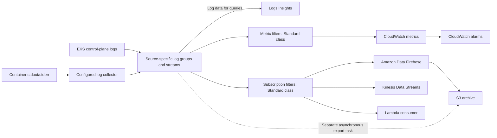

# CloudWatch Logs

> **最終更新**: September 13, 2026
> **確認済みの例**: AWS provider 6.64.0、オプションの CloudWatch Observability Helm chart 6.6.0、手動 AWS for Fluent Bit 3.4.15/Fluent Bit 5.0.9。ローカル設定、SDK、合成ペイロードのみを確認しました。AWS リソース、ログ配信、Insights クエリ、アラームは実行していません。

Amazon CloudWatch Logs は、ログの取り込み、保存、分析を管理します。プロデューサー、アイデンティティ、ネットワーク、保持期間、クォータ、およびダウンストリームコンシューマーの設定は引き続き必要です。EKS コントロールプレーンログ、ワークロードログ、EKS Auto Mode マネージドコンポーネントログは、それぞれ別の収集経路です。

## 目次

1. [概要](#overview)
2. [EKS コントロールプレーンログ](#eks-control-plane-logging)
3. [Container Insights](#container-insights)
4. [FluentBit 統合](#fluentbit-integration)
5. [CloudWatch Logs Insights](#cloudwatch-logs-insights)
6. [サブスクリプションフィルター](#subscription-filters)
7. [コスト最適化](#cost-optimization)

<span id="overview"></span>

## 概要

<span id="cloudwatch-logs-features"></span>

### 機能とログクラス

| 項目 | 確認事項 |
|---|---|
| マネージドサービス | 運用する検索クラスターは不要ですが、コレクターと配信統合には引き続き責任者が必要です |
| キャパシティ | イベントサイズ、API、サブスクリプション、宛先のクォータが適用されます。取り込みは無制限ではありません |
| セキュリティ | IAM、暗号化、データ保護、プライベート接続にはそれぞれ別の設定があります |
| 適時性 | 配信とアラートは非同期です。再試行、重複配信、配信欠落を考慮する必要があります |
| Standard クラス | この章で使用するメトリックフィルターとサブスクリプションをサポートします |
| Infrequent Access | 低い取り込み料金と異なる機能セット。サブスクリプションフィルター、メトリックフィルター、EMF はありません |
| Delivery クラス | S3/Firehose に配信される Lambda ログ用の別オプション。CloudWatch の保持期間は固定で 2 日間、Logs Insights クエリはありません |

ロググループのクラスは作成後に変更できません。Infrequent Access は現在、S3 エクスポート、Logs Insights、データ保護などの機能をサポートしているため、これらを一切サポートしないという古い包括的な説明は正しくありません。収集設計を変更する前に、最新の機能表を確認してください。

<span id="terminology"></span>

### 主要概念



サブスクリプションフィルターの宛先に S3 バケット ARN を指定することは**できません**。Firehose を介した継続的な S3 配信と、非同期の S3 エクスポートタスクは別の経路です。また、CloudWatch Logs バッチを Firehose の OpenSearch 宛先経由で配信することもできません。代わりに、ドキュメント化された CloudWatch から OpenSearch への統合を使用してください。Firehose に直接送信されるアプリケーションレコードは、異なる入力契約です。

| 用語 | 意味 |
|---|---|
| ロググループ | 共通の保持、アクセス、設定の境界。例: `/aws/eks/example-eks/cluster` |
| ログストリーム | グループ内のログイベントのシーケンス |
| ログイベント | タイムスタンプとメッセージ。サービス制限の対象です |
| 保持期間 | サポートされる離散的な保持期間、または保持期間が未設定の場合は無期限 |

<span id="eks-control-plane-logging"></span>

## EKS コントロールプレーンログ

### ログタイプ

5 つのタイプは `api`、`audit`、`authenticator`、`controllerManager`、`scheduler` です。これらはそれぞれ API サーバー診断、監査イベント、IAM 認証、コントローラーマネージャー診断、スケジューリングを対象とします。Worker ノードログとアプリケーションログは別です。

コントロールプレーンログはデフォルトで無効です。診断、セキュリティ、保持の要件に応じてタイプを選択してください。API は以前の表にあった「必須」の選択を強制しません。通常、配信には数分かかり、ベストエフォートです。ログを有効にしても、すでにローテーションされた過去のログは復元されません。

<span id="enable-via-aws-cli"></span>

### 更新を有効化して確認する

既存のクラスターでは、以下を `control-plane-logging.json` として保存します。

```json
{
  "clusterLogging": [
    {
      "types": [
        "api",
        "audit",
        "authenticator",
        "controllerManager",
        "scheduler"
      ],
      "enabled": true
    }
  ]
}
```

```bash
DOCS_CLUSTER=example-eks
DOCS_REGION=ap-northeast-2

aws eks describe-cluster --name "$DOCS_CLUSTER" --region "$DOCS_REGION" \
  --query 'cluster.{version:version,logging:logging}'

UPDATE_ID=$(aws eks update-cluster-config \
  --name "$DOCS_CLUSTER" --region "$DOCS_REGION" \
  --logging file://control-plane-logging.json --query update.id --output text)

aws eks describe-update --name "$DOCS_CLUSTER" --region "$DOCS_REGION" \
  --update-id "$UPDATE_ID" --query 'update.{status:status,errors:errors}'
```

更新は `Successful` に到達する必要があります。リクエストが受け入れられただけでは不十分です。ログ設定の更新には、クラスターサブネットごとに最大 5 個の空き IP アドレスが必要になる場合があります。タイプを無効にするには、既存のログを暗黙にオフにする別の例をコピーするのではなく、その変更を明示的に確認してください。

<span id="configure-with-terraform"></span>

### Terraform の所有権と保持期間

Terraform で管理するクラスターでは、**既存のクラスターリソースを所有する設定**の `enabled_cluster_log_types` を変更します。ログを有効化するためだけに別の `aws_eks_cluster` リソースを作成せず、廃止された Kubernetes 1.29 の作成例をコピーしないでください。

以下の別ファイルは、ロググループと手動コレクターのポリシーを管理します。

```hcl
terraform {
  required_providers {
    aws = {
      source  = "hashicorp/aws"
      version = "6.64.0"
    }
  }
}

variable "region" {
  type    = string
  default = "ap-northeast-2"
}

variable "account_id" {
  type = string
  validation {
    condition     = can(regex("^[0-9]{12}$", var.account_id))
    error_message = "Use the owning account ID."
  }
}

variable "cluster_name" {
  type    = string
  default = "example-eks"
}

provider "aws" {
  region = var.region
}

resource "aws_cloudwatch_log_group" "application" {
  name              = "/aws/containerinsights/${var.cluster_name}/application"
  log_group_class   = "STANDARD"
  retention_in_days = 30

  lifecycle {
    prevent_destroy = true
  }
}

resource "aws_cloudwatch_log_group" "control_plane" {
  name              = "/aws/eks/${var.cluster_name}/cluster"
  log_group_class   = "STANDARD"
  retention_in_days = 30

  lifecycle {
    prevent_destroy = true
  }
}

resource "aws_iam_policy" "collector" {
  name_prefix = "fluent-bit-cloudwatch-"
  policy = jsonencode({
    Version = "2012-10-17"
    Statement = [{
      Effect   = "Allow"
      Action   = ["logs:CreateLogStream", "logs:PutLogEvents"]
      Resource = "${aws_cloudwatch_log_group.application.arn}:*"
    }]
  })
}

output "collector_policy_arn" {
  value = aws_iam_policy.collector.arn
}
```

グループがすでに存在する場合は、その所有者を再利用するか、適用前に意図した状態へインポートしてください。たとえば、コントロールプレーングループはインポート ID `/aws/eks/example-eks/cluster` を使用します。同じグループを「監査」グループとして再宣言しないでください。5 つすべてのコントロールプレーンタイプが、このグループとその保持期間を共有します。

30 日という値は例であり、法的要件ではありません。`prevent_destroy` は Terraform による破棄を防ぎますが、保持期間の短縮や Terraform 外での削除を防ぐものではありません。CloudWatch は保存済みログデータを暗号化します。カスタマー管理 KMS キーには、独自のキーポリシーと運用計画が必要です。

### ロググループ構造

```text
/aws/eks/example-eks/cluster
  kube-apiserver-...          API server
  kube-apiserver-audit-...    Audit
  authenticator-...          IAM authentication
  kube-controller-manager-... Controller manager
  kube-scheduler-...         Scheduler
```

ストリームのサフィックスはローテーションします。古い図の例である `/aws/eks/cluster/logs` は、実際のコントロールプレーングループの命名規則ではありませんでした。

## Container Insights

<span id="container-insights-overview"></span>
<span id="installation-methods"></span>
<span id="cloudwatch-agent-fluentbit-recommended"></span>
<span id="install-via-helm-chart"></span>
<span id="irsa-setup"></span>

### インストールの選択肢

最新の **Amazon CloudWatch Observability EKS add-on** またはその **amazon-cloudwatch-observability** Helm chart を使用してください。以前の ADOT exporter chart と、置換されていないクイックスタート URL は同等のインストールではありません。

add-on では、実際のクラスターと互換性のあるバージョンを検出し、選択した設定スキーマを調べ、ドキュメント化された IAM 関連付けを設定します。chart のバージョンは EKS add-on のバージョン文字列ではありません。

```bash
K8S_VERSION=$(aws eks describe-cluster --name "$DOCS_CLUSTER" \
  --region "$DOCS_REGION" --query cluster.version --output text)
aws eks describe-addon-versions \
  --addon-name amazon-cloudwatch-observability \
  --kubernetes-version "$K8S_VERSION" --region "$DOCS_REGION"
```

オプションの Helm 例では、以下の `cloudwatch-values.yaml` を使用します。従来の Container Insights 経路とコンテナログを選択し、Application Signals と別の OTel Container Insights パイプラインはここでは無効にします。

```yaml
clusterName: example-eks
region: ap-northeast-2
containerInsights:
  enabled: true
containerLogs:
  enabled: true
applicationSignals:
  enabled: false
otelContainerInsights:
  enabled: false
  logs:
    enabled: false
```

```bash
helm repo add aws-observability https://aws-observability.github.io/helm-charts
helm repo update aws-observability
helm upgrade --install cloudwatch-observability \
  aws-observability/amazon-cloudwatch-observability \
  --version 6.6.0 --namespace amazon-cloudwatch --create-namespace \
  --values cloudwatch-values.yaml
```

IAM 権限は**インストール前に**設定してください。この chart では、Fluent Bit DaemonSet が `cloudwatch-agent` ServiceAccount を使用します。その名前と namespace は、選択した Pod Identity association と一致する必要があります。公式の association/role-trust 要件に従ってください。異なる名前の ServiceAccount 用の IRSA ロールでは、手動で作成した `fluent-bit` Pod を認可できません。この chart を EKS 管理の add-on の上にインストールしたり、同じログに対して重複するコレクターを実行したりしないでください。

<span id="collected-logs"></span>

### 収集ログとプラットフォーム

| 一般的なグループサフィックス | 内容と制約 |
|---|---|
| `application` | `/aws/containerinsights/CLUSTER/application` 配下のコンテナ stdout/stderr |
| `dataplane` | 設定済みの kubelet/runtime/VPC CNI/kube-proxy ソース。実際のコンポーネントはプラットフォームにより異なります |
| `host` | 設定済みの Linux ファイル/journal または Windows event logs。すべての OS に `/var/log/messages`、`/var/log/secure`、`/var/log/dmesg` があるわけではありません |
| `performance` | 多くの場合 EMF のパフォーマンスイベント。アプリケーションログメッセージと互換ではありません |

サポート対象の add-on/chart には Linux と Windows の経路がありますが、Application Signals は EKS Windows ではサポートされません。Fargate はこの手動 DaemonSet ではなく、プラットフォームのログルーターを使用します。Hybrid Nodes と Auto Mode は個別に検証してください。従来の EC2 ホストパスがどこでも存在すると仮定しないでください。

EKS Auto Mode の AWS 管理 Karpenter、EBS CSI、load-balancer-controller、IPAM ログは、別の **vended log delivery** 設定を使用します。そのログタイプは `AUTO_MODE_COMPUTE_LOGS`、`AUTO_MODE_BLOCK_STORAGE_LOGS`、`AUTO_MODE_LOAD_BALANCING_LOGS`、`AUTO_MODE_IPAM_LOGS` です。ドキュメント化された `PutDeliverySource` → `PutDeliveryDestination` → `CreateDelivery` フローでは、ロググループ、S3、Firehose をターゲットにできます。これは `PutSubscriptionFilter` や 5 つのコントロールプレーンログタイプの有効化とは別物です。

<span id="fluentbit-integration"></span>

## FluentBit 統合

<span id="fluentbit-configmap"></span>
<span id="fluentbit-daemonset"></span>

### 手動アプリケーションログコレクター

これは、対象となる Linux EC2 ノード向けの**代替アプリケーションログ専用プロファイル**です。完全な Container Insights メトリクスパイプラインをインストールするものではなく、汎用的な host/dataplane 収集を保証するものでもありません。

先に application グループを作成または再利用します。上記のコレクターポリシーは、そのグループに対するストリーム作成とイベント書き込みを許可しますが、意図的にグループの作成や保持期間の変更は許可しません。したがって、手動プロファイルには `cloudwatch:PutMetricData`、`s3:PutObject`、または包括的な `logs:*` 権限は不要です。

OIDC trust が `system:serviceaccount:logging:fluent-bit-cloudwatch`、audience が `sts.amazonaws.com` と一致する承認済み IRSA ロールを準備し、生成したポリシーをアタッチします。`eksctl --role-only` ワークフローでは、manifest が ServiceAccount を所有したままロールを作成できます。ロール ARN、クラスター名、Region を一貫して置き換えてください。

```yaml
apiVersion: v1
kind: Namespace
metadata:
  name: logging
---
apiVersion: v1
kind: ServiceAccount
metadata:
  name: fluent-bit-cloudwatch
  namespace: logging
  annotations:
    eks.amazonaws.com/role-arn: arn:aws:iam::123456789012:role/FluentBitCloudWatchLogsRole
---
apiVersion: rbac.authorization.k8s.io/v1
kind: ClusterRole
metadata:
  name: fluent-bit-cloudwatch-metadata
rules:
- apiGroups:
  - ''
  resources:
  - namespaces
  - pods
  verbs:
  - get
  - list
  - watch
---
apiVersion: rbac.authorization.k8s.io/v1
kind: ClusterRoleBinding
metadata:
  name: fluent-bit-cloudwatch-metadata
roleRef:
  apiGroup: rbac.authorization.k8s.io
  kind: ClusterRole
  name: fluent-bit-cloudwatch-metadata
subjects:
- kind: ServiceAccount
  name: fluent-bit-cloudwatch
  namespace: logging
---
apiVersion: v1
kind: ConfigMap
metadata:
  name: fluent-bit-cloudwatch-config
  namespace: logging
data:
  fluent-bit.conf: |
    [SERVICE]
        Flush         5
        Grace         30
        Log_Level     info
        HTTP_Server   Off
        storage.path  /buffers/storage

    [INPUT]
        Name              tail
        Tag               application.*
        Path              /var/log/containers/*.log
        Exclude_Path      /var/log/containers/fluent-bit-cloudwatch-*_logging_fluent-bit-*.log
        multiline.parser  docker, cri
        DB                /buffers/tail.db
        Mem_Buf_Limit     50MB
        Skip_Long_Lines   On
        Read_from_Head    Off
        storage.type      filesystem

    [FILTER]
        Name                kubernetes
        Match               application.*
        Kube_Tag_Prefix     application.var.log.containers.
        Use_Kubelet         Off
        Merge_Log           On
        Merge_Log_Key       log_processed
        Keep_Log            On
        Labels              Off
        Annotations         Off
        K8S-Logging.Parser  Off
        K8S-Logging.Exclude Off

    [OUTPUT]
        Name                     cloudwatch_logs
        Match                    application.*
        region                   ap-northeast-2
        log_group_name           /aws/containerinsights/example-eks/application
        log_stream_prefix        ${HOST_NAME}-
        auto_create_group        false
        Retry_Limit              5
        storage.total_limit_size 1G
---
apiVersion: apps/v1
kind: DaemonSet
metadata:
  name: fluent-bit-cloudwatch
  namespace: logging
spec:
  selector:
    matchLabels:
      app: fluent-bit-cloudwatch
  template:
    metadata:
      labels:
        app: fluent-bit-cloudwatch
    spec:
      serviceAccountName: fluent-bit-cloudwatch
      nodeSelector:
        kubernetes.io/os: linux
      tolerations:
      - operator: Exists
        effect: NoSchedule
      containers:
      - name: fluent-bit
        image: public.ecr.aws/aws-observability/aws-for-fluent-bit:3.4.15@sha256:88e1b56cedb230486afeca6eeb26c5f6bd59c48879d0054d1674d5a58838c607
        args:
        - -c
        - /fluent-bit/custom/fluent-bit.conf
        securityContext:
          runAsUser: 0
          allowPrivilegeEscalation: false
          readOnlyRootFilesystem: true
          capabilities:
            drop:
            - ALL
          seccompProfile:
            type: RuntimeDefault
        resources:
          requests:
            cpu: 100m
            memory: 128Mi
          limits:
            memory: 512Mi
        volumeMounts:
        - name: logs
          mountPath: /var/log
          readOnly: true
        - name: buffers
          mountPath: /buffers
        - name: config
          mountPath: /fluent-bit/custom
          readOnly: true
        - name: tmp
          mountPath: /tmp
        command:
        - /fluent-bit/bin/fluent-bit
        env:
        - name: HOST_NAME
          valueFrom:
            fieldRef:
              fieldPath: spec.nodeName
      volumes:
      - name: logs
        hostPath:
          path: /var/log
          type: Directory
      - name: buffers
        hostPath:
          path: /var/lib/fluent-bit-cloudwatch
          type: DirectoryOrCreate
      - name: config
        configMap:
          name: fluent-bit-cloudwatch-config
      - name: tmp
        emptyDir: {}
      terminationGracePeriodSeconds: 45
```

ネイティブプラグインは `cloudwatch_logs` です。古い Go プラグインは `cloudwatch` という名前です。image のデフォルトコマンドはエントリポイントスクリプトであるため、手動 manifest は設定とともにネイティブ Fluent Bit バイナリを明示的に起動します。

Tail DB と filesystem buffer は書き込み可能で、読み取り専用のログマウントとは分離されています。Grace は 30 秒、Pod の終了猶予は 45 秒ですが、これによってすべてのバッファ済みデータの配信が保証されるわけではありません。ノード消失、ディスク満杯、長い行、有限の再試行、再起動オフセットによってもログが失われる可能性があります。`Read_from_Head Off` は未確認のファイルに影響します。永続的なオフセットも依然として重要です。

このプロファイルは、ホストネットワークの kubelet アクセスではなく、API サーバーのメタデータ検索を使用します。アプリケーションアノテーションでパースを変更したりログを除外したりすることはできません。カスタムコレクターで、マネージドインストールであるかのように示すため予約済みの `extra_user_agent: container-insights` 値を設定しないでください。

### レコード契約とホストソース

CloudWatch に送信される、補強されたイベントの例は次のとおりです。

```json
{"log":"{\"level\":\"error\",\"message\":\"upstream request failed\",\"error_type\":\"upstream_timeout\",\"http\":{\"response_time_ms\":1250,\"status_code\":503}}","stream":"stderr","kubernetes":{"namespace_name":"production","pod_name":"api-example","container_name":"api"},"log_processed":{"level":"error","message":"upstream request failed","error_type":"upstream_timeout","http":{"response_time_ms":1250,"status_code":503}}}
```

アプリケーションフィールドは `log_processed` 配下にあり、信頼できる Kubernetes メタデータは `kubernetes` 配下にあります。生の `log` 文字列はアプリケーションデータを複製します。収集前に禁止フィールドをマスキングしてください。以下のクエリ、サブスクリプション、メトリックフィルターの例では、この正確な JSON エンベロープと小文字の `level: error` を使用します。

Linux journal 収集が必要な場合は、永続 journal が `/var/log/journal` にあるか、volatile journal が `/run/log/journal` にあるかを確認してください。`systemd` input、適切な unit filter、読み取り専用マウント、別の書き込み可能な DB、出力グループ、IAM 権限を設定します。Docker の古い `/var/lib/docker/containers` パスを無条件にマウントしたり、containerd/Bottlerocket/AL2023 ノードに存在しないテキストファイルを要求したりしないでください。これらのプラットフォーム固有のホスト設定は、手動プロファイルではデプロイされません。

## CloudWatch Logs Insights

これらの例では SQL ではなく **Logs Insights QL** を使用します。対象のロググループと範囲を限定した時間帯を選択してください。ローカルレビューでは公開済みの構文と契約を確認しました。マネージドクエリサービスは呼び出していません。

### 基本クエリ構文

```text
fields @timestamp, @message
| filter @message like /(?i)error/
| sort @timestamp desc
| limit 100
```

大文字小文字を区別しない正規表現には、JavaScript の `/error/i` サフィックスではなく `/(?i)error/` を使用します。テキスト一致は、アプリケーションの構造化された error level ではない語にも一致する可能性があります。

コレクターの JSON エンベロープの場合:

```text
fields jsonParse(@message) as record
| filter record.log_processed.level = "error"
| fields @timestamp, record.log_processed.message as message
| sort @timestamp desc
| limit 100
```

`user_id=12345` を含む実際のテキストフィールドの場合:

```text
fields @timestamp, @message
| parse @message /user_id=(?<user_id>\d+)/
| filter user_id = "12345"
| limit 100
```

任意の JSON キー順序と空白を仮定する glob に依存しないでください。`jsonParse` と明示的なネストフィールドにより、期待するレコード構造が明確になります。

### EKS ログクエリの例

API サーバー診断では、重複する監査ストリームプレフィックスを除外します。

```text
fields @timestamp, @logStream, @message
| filter @logStream like /^kube-apiserver-/
| filter @logStream not like /^kube-apiserver-audit-/
| filter @message like /(?i)error/
| sort @timestamp desc
| limit 50
```

特定の Kubernetes username の監査アクティビティ:

```text
fields jsonParse(@message) as audit
| filter @logStream like /^kube-apiserver-audit-/
| filter audit.user.username = "example-user"
| fields @timestamp, audit.verb as verb, audit.objectRef as objectRef
| sort @timestamp desc
| limit 100
```

Authenticator 診断:

```text
fields @timestamp, @message
| filter @logStream like /^authenticator-/
| filter @message like /(?i)(AccessDenied|Forbidden|unauthorized)/
| sort @timestamp desc
| limit 100
```

Pod 作成/削除の監査イベント:

```text
fields jsonParse(@message) as audit
| filter @logStream like /^kube-apiserver-audit-/
| filter audit.verb in ["create", "delete"]
| filter audit.objectRef.resource = "pods"
| fields @timestamp, audit.verb as verb, audit.objectRef.name as pod
| sort @timestamp desc
| limit 100
```

これらは診断用の検索であり、監査がすべてのアクションを記録することや、テキスト一致が根本原因を確定することの証明ではありません。

### アプリケーションログクエリ

namespace ごとのエラー:

```text
fields jsonParse(@message) as record
| filter record.log_processed.level = "error"
| stats count(*) as error_count by record.kubernetes.namespace_name as namespace
| sort error_count desc
```

定義済みの数値ミリ秒フィールドを使用した低速レスポンス:

```text
fields jsonParse(@message) as record
| filter record.kubernetes.container_name = "api"
| filter record.log_processed.http.response_time_ms > 1000
| fields @timestamp, record.log_processed.http.response_time_ms as response_time_ms
| sort response_time_ms desc
| limit 100
```

時間ごとのイベント数:

```text
stats count(*) as log_count by bin(1h) as bucket
| sort bucket asc
```

`stats` の後では、定義済みの bucket alias をソートします。元のイベント単位の `@timestamp` は、もはやグループ化出力ではありません。

上位のエラーカテゴリー:

```text
fields jsonParse(@message) as record
| filter record.log_processed.level = "error"
| stats count(*) as error_count by record.log_processed.error_type as error_type
| sort error_count desc
| limit 10
```

通常、範囲が限定されたカテゴリーは、すべての一意の完全メッセージでグループ化するより解釈しやすくなります。リクエスト ID や任意のメッセージを無制限のメトリクスディメンションにしないでください。

### 高度なクエリ

```text
fields jsonParse(@message) as record
| filter ispresent(record.log_processed.http.response_time_ms)
| stats pct(record.log_processed.http.response_time_ms, 50) as p50_ms,
        pct(record.log_processed.http.response_time_ms, 90) as p90_ms,
        pct(record.log_processed.http.response_time_ms, 99) as p99_ms
  by bin(5m) as bucket
| sort bucket asc
```

QL の集計は `percentile` ではなく `pct` です。プロデューサーは数値のミリ秒を出力する必要があります。古い nginx の例には、ワイルドカード数の不一致と、作り出されたフィールド位置がありました。

```text
fields @timestamp, @message, @logStream
| filter @message like /Back-off restarting failed container/
| stats count(*) as backoff_log_events by @logStream
| sort backoff_log_events desc
```

これはコンテナの再起動ではなく、一致した**ログイベント**をカウントします。kubelet のイベント/メッセージは、存在しない、繰り返される、または集約される場合があります。実際の再起動数が必要な場合は、適切な Kubernetes 再起動メトリクスを使用してください。

`SOURCE` はコンソールのクエリエディターではなく、CLI/API クエリでサポートされます。

```text
SOURCE logGroups(accountIdentifier:['111122223333'], namePrefix:['/aws/containerinsights/prod-', '/aws/containerinsights/stage-'])
| fields @timestamp, @message, @logStream
| filter @message like /(?i)error/
| sort @timestamp desc
| limit 100
```

`accountIdentifier` は単数形です。クロスアカウントクエリには、承認済みの monitoring/source-account 設定と権限が必要です。2 つ目の account または group に言及しても、そのアクセスは作成されません。account/prefix の選択を省略すると、クエリ範囲が大幅に広がる可能性があります。

<span id="subscription-filters"></span>

## サブスクリプションフィルター

サブスクリプションフィルターは、新しい一致イベントを非同期に転送します。配信は少なくとも 1 回です。重複が発生する場合があります。再試行可能な宛先障害は最大 24 時間再試行できますが、再試行不可能なエラーと継続的な障害では配信を失う可能性があります。クォータ、`DeliveryErrors`、`DeliveryThrottling` を監視してください。サブスクリプションは、すべての過去ログをバックフィルしません。

これらの例の直接 Lambda、Kinesis、Firehose 宛先は、ロググループと同じ account に属します。クロスアカウント配信では、サポートされる logical destination とその destination policy を使用します。任意のクロスアカウント Lambda ARN は代替になりません。

<span id="export-to-s3"></span>

### Firehose を介した S3 へのアーカイブ

このオプションファイルでは、上記のグループ、既存のプライベート S3 バケット、承認済みの Firehose 配信ロールを使用します。

```hcl
variable "firehose_delivery_role_arn" {
  type = string
}

variable "archive_bucket_arn" {
  type = string
}

resource "aws_cloudwatch_log_group" "firehose" {
  name              = "/aws/kinesisfirehose/cloudwatch-archive"
  retention_in_days = 30
}

resource "aws_cloudwatch_log_stream" "firehose" {
  name           = "S3Delivery"
  log_group_name = aws_cloudwatch_log_group.firehose.name
}

resource "aws_kinesis_firehose_delivery_stream" "archive" {
  name        = "cloudwatch-archive"
  destination = "extended_s3"

  extended_s3_configuration {
    role_arn            = var.firehose_delivery_role_arn
    bucket_arn          = var.archive_bucket_arn
    prefix              = "cloudwatch/year=!{timestamp:yyyy}/month=!{timestamp:MM}/day=!{timestamp:dd}/"
    error_output_prefix = "errors/!{firehose:error-output-type}/year=!{timestamp:yyyy}/"
    buffering_size      = 64
    buffering_interval  = 300
    compression_format  = "UNCOMPRESSED"

    cloudwatch_logging_options {
      enabled         = true
      log_group_name  = aws_cloudwatch_log_group.firehose.name
      log_stream_name = aws_cloudwatch_log_stream.firehose.name
    }
  }
}

resource "aws_iam_role" "logs_to_firehose" {
  name_prefix = "cloudwatch-to-firehose-"
  assume_role_policy = jsonencode({
    Version = "2012-10-17"
    Statement = [{
      Effect    = "Allow"
      Principal = { Service = "logs.amazonaws.com" }
      Action    = "sts:AssumeRole"
      Condition = {
        StringEquals = { "aws:SourceAccount" = var.account_id }
        ArnLike      = { "aws:SourceArn" = "arn:aws:logs:${var.region}:${var.account_id}:*" }
      }
    }]
  })
}

resource "aws_iam_role_policy" "logs_to_firehose" {
  role = aws_iam_role.logs_to_firehose.id
  policy = jsonencode({
    Version = "2012-10-17"
    Statement = [{
      Effect   = "Allow"
      Action   = ["firehose:PutRecord", "firehose:PutRecordBatch"]
      Resource = aws_kinesis_firehose_delivery_stream.archive.arn
    }]
  })
}

resource "aws_cloudwatch_log_subscription_filter" "archive" {
  name            = "application-archive"
  log_group_name  = aws_cloudwatch_log_group.application.name
  filter_pattern  = ""
  destination_arn = aws_kinesis_firehose_delivery_stream.archive.arn
  role_arn        = aws_iam_role.logs_to_firehose.arn

  depends_on = [aws_iam_role_policy.logs_to_firehose]
}
```

配信ロールには、レビュー済みの Firehose trust、bucket/prefix アクセス、オプションの KMS 権限、宛先ログ権限が必要です。CloudWatch から Firehose へのロールは別であり、デプロイヤーにはスコープを限定した `iam:PassRole` が必要です。配信エラーログを、それ自体のパイプラインに再度サブスクライブしないでください。

CloudWatch のサブスクリプションレコードは、すでに gzip 圧縮されています。ここでの `UNCOMPRESSED` は**追加の Firehose 圧縮**を無効にします。受信ペイロードをプレーンテキストに変更したり、CloudWatch エンベロープを除去したりするものではありません。コンシューマーは実際のアーカイブ済みレコード形式を処理する必要があります。

展開済み出力が必要な場合は、Firehose のドキュメント化された展開機能を意図的に設定してください。オプションのメッセージ抽出では、`owner`、`logGroup`、`logStream`、その他のエンベロープメタデータが削除されます。vended-log input と CloudWatch-subscription 展開用に構成された stream を混在させず、これらの設定がサポートされない CloudWatch→Firehose→OpenSearch 経路を有効にすると仮定しないでください。

### Lambda で処理する

この例は上記の構造化エンベロープを処理し、コントロールメッセージを無視して、生のログテキストではなくエラーの**要約**を送信します。`log_processor.py` として保存してください。

```python
import base64
import gzip
import hashlib
import io
import json
import os

import boto3

# Example processing limit, not an AWS service quota.
MAX_UNCOMPRESSED_BYTES = 8 * 1024 * 1024


def summarize(event):
    compressed = base64.b64decode(event["awslogs"]["data"], validate=True)
    with gzip.GzipFile(fileobj=io.BytesIO(compressed)) as stream:
        payload = stream.read(MAX_UNCOMPRESSED_BYTES + 1)
    if len(payload) > MAX_UNCOMPRESSED_BYTES:
        raise ValueError("Batch exceeds this example's processing limit")
    batch = json.loads(payload)
    if batch.get("messageType") == "CONTROL_MESSAGE":
        return None
    if batch.get("messageType") != "DATA_MESSAGE":
        raise ValueError("Unsupported subscription message type")

    errors = []
    unparsed = 0
    for item in batch["logEvents"]:
        try:
            record = json.loads(item["message"])
            application = record["log_processed"]
            if not isinstance(application, dict):
                raise ValueError("Expected an application object")
        except (ValueError, KeyError, TypeError):
            unparsed += 1
            continue
        if application.get("level") == "error":
            errors.append(item)
    if not errors:
        return None

    # Raw messages are intentionally excluded from the notification.
    event_keys = [
        hashlib.sha256(
            json.dumps([batch["owner"], batch["logGroup"], batch["logStream"], item["id"]],
                       ensure_ascii=True).encode("utf-8")
        ).hexdigest()
        for item in errors[:20]
    ]
    return {
        "errorCount": len(errors),
        "unparsedRecords": unparsed,
        "sampleEventKeys": event_keys,
    }


def lambda_handler(event, context):
    summary = summarize(event)
    if summary is None:
        return {"notified": False}
    topic_arn = os.environ["ALERT_TOPIC_ARN"]  # Non-secret destination identifier.
    message = json.dumps(summary, ensure_ascii=True)
    if len(message.encode("utf-8")) > 262144:
        raise ValueError("SNS message is too large")
    boto3.client("sns").publish(
        TopicArn=topic_arn,
        Subject="CloudWatch Logs error batch",
        Message=message,
    )
    return {"notified": True, "errorCount": summary["errorCount"]}
```

`ALERT_TOPIC_ARN` は、承認済みの同一 Region topic 用の非機密宛先識別子です。Lambda 実行ロールには、スコープを限定した `sns:Publish` と独自のログ権限、および該当する KMS 権限が必要です。その logging group が同じサブスクリプションを再帰的にフィードしてはなりません。

8MiB の処理上限は、AWS クォータではなく、選択した例の境界です。無効なエンベロープではエラーが発生します。期待されるアプリケーションスキーマ外のレコードは構造化エラーとして扱われません。パース失敗を監視し、障害処理を設定して、デプロイ前にリプレイをテストしてください。SNS の非 SMS メッセージは 1,000 文字ルールではなく **UTF-8 バイト**で制限されます。固定 subject も subject の上限を下回ります。

イベントキーは調査に役立ちますが、**永続的な重複排除ではありません**。繰り返しの呼び出しによって、通知が重複して送信されることがあります。本番コンシューマーには、明示的な冪等性と障害宛先の判断が必要です。

<span id="create-alerts-with-metric-filters"></span>

### メトリックフィルターとアラーム

以下のオプションファイルは、すでにデプロイ済みの、修飾されていない Lambda function ARN を接続し、カウントメトリクス/アラームを作成します。コレクターおよびクエリと同じ JSON フィールドを使用します。

```hcl
variable "processor_function_arn" {
  type = string
}

variable "alerts_topic_arn" {
  type = string
}

resource "aws_lambda_permission" "cloudwatch" {
  statement_id   = "AllowOwnedCloudWatchLogGroup"
  action         = "lambda:InvokeFunction"
  function_name  = var.processor_function_arn
  principal      = "logs.${var.region}.amazonaws.com"
  source_arn     = "${aws_cloudwatch_log_group.application.arn}:*"
  source_account = var.account_id
}

resource "aws_cloudwatch_log_subscription_filter" "processor" {
  name            = "structured-errors"
  log_group_name  = aws_cloudwatch_log_group.application.name
  filter_pattern  = "{ $.log_processed.level = \"error\" }"
  destination_arn = var.processor_function_arn

  depends_on = [aws_lambda_permission.cloudwatch]
}

resource "aws_cloudwatch_log_metric_filter" "errors" {
  name           = "StructuredErrorCount"
  log_group_name = aws_cloudwatch_log_group.application.name
  pattern        = "{ $.log_processed.level = \"error\" }"

  metric_transformation {
    name          = "ErrorCount"
    namespace     = "Example/Logs"
    value         = "1"
    default_value = "0"
    unit          = "Count"
  }
}

resource "aws_cloudwatch_metric_alarm" "high_error_count" {
  alarm_name          = "ExampleHighErrorCount"
  comparison_operator = "GreaterThanThreshold"
  evaluation_periods  = 2
  datapoints_to_alarm = 2
  metric_name         = "ErrorCount"
  namespace           = "Example/Logs"
  period              = 300
  statistic           = "Sum"
  threshold           = 100
  treat_missing_data  = "missing"
  alarm_description   = "More than 100 matching error events in each of two 5-minute periods"
  alarm_actions       = [var.alerts_topic_arn]
}
```

この権限は Lambda サブスクリプションに先行し、ロググループ ARN と source account で制限されます。SNS のアラーム宛先にも適切な topic policy が必要です。function のデプロイ、実行ロールポリシー、topic subscriptions、エンドツーエンドの通知は別の前提条件です。

このアラームはエラー率ではなく**エラー件数**です。5 分間の期間 2 回それぞれで、一致イベントが 100 件を超えた場合です。`default_value = 0` はログが到着しても一致しない場合に適用されます。ログが到着しないことは依然として欠損データを意味する可能性があります。`treat_missing_data = "missing"` は無通信を正常と扱いません。メトリックフィルターは過去イベントをバックフィルせず、重複はカウントに影響する可能性があります。

<span id="_3-archive-to-s3"></span>

### エクスポートタスクと S3 ライフサイクル

範囲を限定した履歴エクスポートには、CloudWatch の別の S3 export task API と、その bucket/KMS 権限を使用します。エクスポートの可用性は最大 12 時間遅れる場合があり、順序は保証されず、サービスは継続的なアーカイブに定期的な export task を推奨していません。

アーカイブのライフサイクルルールは、バケットの単一の設定所有者に属します。既存のルールを 2 つ目の Terraform resource で置き換えるのではなく、レビュー済みの prefix スコープルールをその設定にマージしてください。Standard-IA または Glacier tier を選択する前に、小さなオブジェクトの移行動作、最小保存期間、取り出しコスト、Object Lock を検討してください。

<span id="cost-optimization"></span>

## コスト最適化

### コスト構造

取り込み、保持ストレージ、クエリスキャン、vended delivery、変換、ダウンストリームサービスについて、最新の Region/class/tier 料金を確認してください。Firehose、S3、KMS、Lambda、カスタムメトリクス、アラームは、常に無料とは限りません。古い表では Seoul の料金やゼロコストの「Logs to S3」経路を裏付けていませんでした。

以下は**仮定に基づく計算であり、最新の Region 料金ではありません**。

| 仮定 | 月額計算 |
|---|---|
| 1 日あたり 100GB を 30 日間、仮定した $0.50/GB で取り込み | 3,000 × $0.50 = $1,500 |
| 30 日間の定常状態の保持、仮定保存割合 0.5、$0.03/GB-month | 平均 1,500GB × $0.03 = $45 |
| 1 日あたり 200GB を 30 日間、仮定した $0.005/GB でスキャン | 6,000 × $0.005 = $30 |
| これらの仮定のみの小計 | **$1,575** |

これは初月のストレージランプ、圧縮ベンチマーク、または完全な請求額ではありません。元の $1,576 合計には、日次/月次のクエリ値が混在していました。測定済みの平均保持バイト、スキャン量、最新料金、その他すべての料金カテゴリを使用してください。

<span id="cost-reduction-strategies"></span>
<span id="_1-log-filtering"></span>
<span id="_2-retention-period-optimization"></span>
<span id="_4-adjust-log-levels"></span>

### フィルタリング、保持期間、ログレベル

診断およびセキュリティ要件で破棄を許可しているレコードだけをフィルタリングしてください。Fluent Bit classic configuration は YAML ではありません。このレコード構造では、namespace filter は存在しないフラットフィールド `kubernetes_namespace_name` ではなく、`$kubernetes['namespace_name']` のような record accessor を使用します。

health-check path に言及しているだけで有用なエラーを破棄する、広範な substring filter は避けてください。レビュー済みの event type など、明示的なフィールドを優先し、破棄する例だけでなく保持すべき例も検証してください。

開発、production、監査のニーズには異なる保持期間が適切な場合がありますが、保持期間を変更するとデータが削除される可能性があります。1 つのグループ内のすべてのコントロールプレーンストリームは、そのグループのポリシーを共有します。アプリケーションログレベルはアプリケーションの契約です。アプリケーションが消費して実装しない限り、ConfigMap に `LOG_LEVEL: INFO` を置いても何も起こりません。一時的に増やす詳細度には、アクセス制御、有効期限、ボリューム予算が必要です。

### コスト監視

`LogGroupName` dimension と `Sum` statistic を指定した `IncomingBytes`、`IncomingLogEvents` などの `AWS/Logs` metrics を使用します。これらは取り込みを表すもので、請求額全体を表すものではありません。`@billedDuration` は Lambda field であり、CloudWatch Logs のストレージまたは取り込み課金メトリクスではありません。

```bash
aws logs describe-log-groups --region "$DOCS_REGION" \
  --log-group-name-prefix /aws/containerinsights/example-eks/ \
  --query 'logGroups[].{name:logGroupName,retention:retentionInDays,class:logGroupClass,storedBytes:storedBytes}'

# Example complete month; End is exclusive.
aws ce get-dimension-values --region us-east-1 \
  --time-period Start=2026-08-01,End=2026-09-01 \
  --dimension SERVICE --search-string CloudWatch
```

Cost Explorer filter では返された billing-service 値を使用し、完全なパイプラインを見積もる際には関連サービスを含めてください。`storedBytes` はロググループ属性であり、その名前の `AWS/Logs` metric が保証されるわけではありません。コストを見積もるためにすべてのログをクエリすると、それ自体にクエリ料金が発生する可能性があります。

## 検証と参照

監査では、ローカルの Terraform/Helm 設定、Kubernetes schema、SDK payload types、合成 Lambda events、バイリンガルの例、クイズ回答、Markdown rendering を確認しました。これらの確認は、実際の IAM、コレクター配信、管理された QL 実行、Firehose archives、アラーム配信、実際のコストを証明するものではありません。

- [EKS コントロールプレーンログ](https://docs.aws.amazon.com/eks/latest/userguide/control-plane-logs.html)
- [CloudWatch Observability add-on と Helm インストール](https://docs.aws.amazon.com/AmazonCloudWatch/latest/monitoring/install-CloudWatch-Observability-EKS-addon.html)
- [Auto Mode マネージドコンポーネントログ配信](https://docs.aws.amazon.com/eks/latest/userguide/auto-managed-component-logs.html)
- [ログクラス](https://docs.aws.amazon.com/AmazonCloudWatch/latest/logs/CloudWatch_Logs_Log_Classes.html) と [クォータ](https://docs.aws.amazon.com/AmazonCloudWatch/latest/logs/cloudwatch_limits_cwl.html)
- [Fluent Bit ネイティブ CloudWatch output](https://raw.githubusercontent.com/fluent/fluent-bit-docs/master/pipeline/outputs/cloudwatch.md)
- [QL filter](https://docs.aws.amazon.com/AmazonCloudWatch/latest/logs/CWL_QuerySyntax-Filter.html)、[stats](https://docs.aws.amazon.com/AmazonCloudWatch/latest/logs/CWL_QuerySyntax-Stats.html)、[functions](https://docs.aws.amazon.com/AmazonCloudWatch/latest/logs/CWL_QuerySyntax-operations-functions.html)、[SOURCE](https://docs.aws.amazon.com/AmazonCloudWatch/latest/logs/CWL_QuerySyntax-Source.html)
- [サブスクリプションの例](https://docs.aws.amazon.com/AmazonCloudWatch/latest/logs/SubscriptionFilters.html) と [destination API](https://docs.aws.amazon.com/AmazonCloudWatchLogs/latest/APIReference/API_PutSubscriptionFilter.html)
- [CloudWatch Logs から Firehose への制約](https://docs.aws.amazon.com/firehose/latest/dev/writing-with-cloudwatch-logs.html)、[展開](https://docs.aws.amazon.com/firehose/latest/dev/writing-with-cloudwatch-logs-decompression.html)、[メッセージ抽出](https://docs.aws.amazon.com/firehose/latest/dev/Message_extraction.html)
- [メトリックフィルター](https://docs.aws.amazon.com/AmazonCloudWatch/latest/logs/MonitoringLogData.html)、[S3 export tasks](https://docs.aws.amazon.com/AmazonCloudWatch/latest/logs/S3Export.html)、[CloudWatch Logs サービスメトリクス](https://docs.aws.amazon.com/AmazonCloudWatch/latest/logs/CloudWatch-Logs-Monitoring-CloudWatch-Metrics.html)
- [SNS Publish API](https://docs.aws.amazon.com/sns/latest/api/API_Publish.html) と [最新の CloudWatch 料金](https://aws.amazon.com/cloudwatch/pricing/)

## クイズ

[CloudWatch Logs クイズ](../../quizzes/observability/logging/03-cloudwatch-logs-quiz.md)で違いを確認してください。
