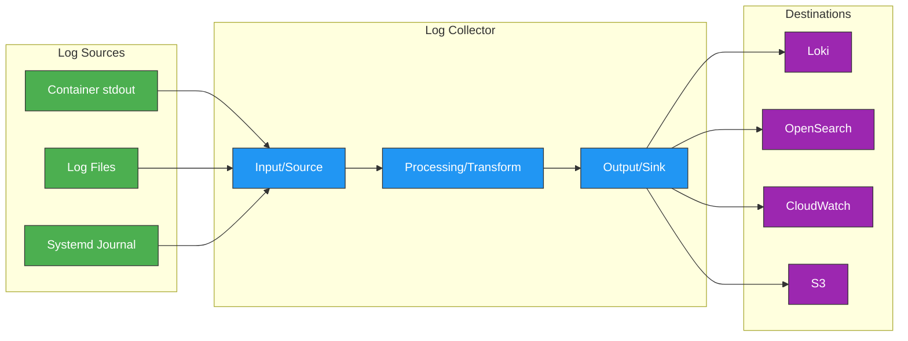
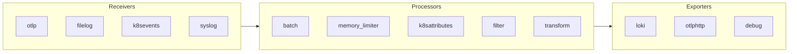
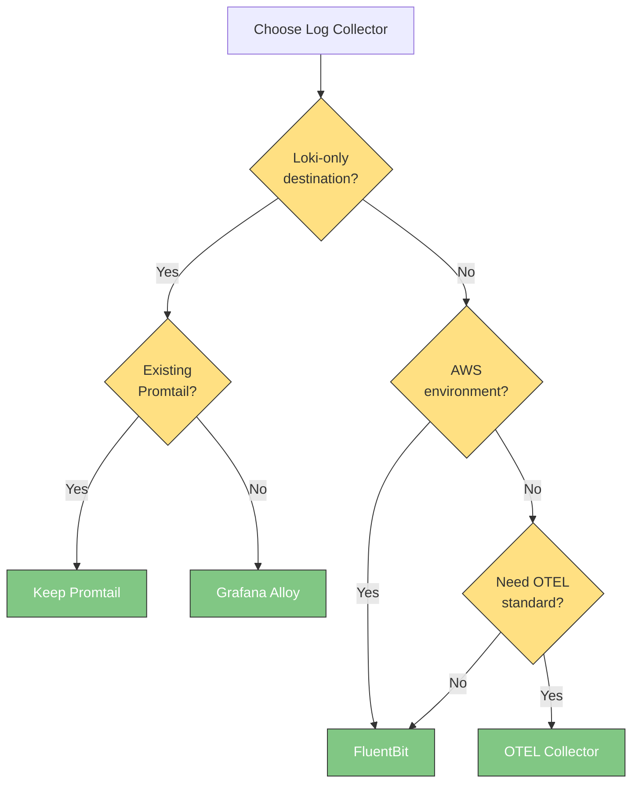

```mermaid
flowchart LR
    subgraph Input["Input Plugins"]
        TAIL[tail]
        SYSLOG[syslog]
        TCP[tcp]
        SYSTEMD[systemd]
    end

    subgraph Parser["Parser"]
        JSON[json]
        REGEX[regex]
        DOCKER[docker]
        CRI[cri]
    end

    subgraph Filter["Filter Plugins"]
        K8S[kubernetes]
        MODIFY[modify]
        GREP[grep]
        LUA[lua]
        MULTILINE[multiline]
    end

    subgraph Buffer["Buffer"]
        MEM[Memory]
        FS[Filesystem]
    end

    subgraph Output["Output Plugins"]
        LOKI[loki]
        ES[opensearch]
        CW[cloudwatch_logs]
        S3[s3]
        KAFKA[kafka]
    end

    Input --> Parser
    Parser --> Filter
    Filter --> Buffer
    Buffer --> Output
```

```mermaid
flowchart LR
    subgraph Discovery["Service Discovery"]
        K8S_SD[kubernetes_sd]
        FILE_SD[file_sd]
        STATIC[static]
    end

    subgraph Scrape["Scrape Targets"]
        PODS[Pod Logs]
        JOURNAL[Journal]
        SYSLOG[Syslog]
    end

    subgraph Pipeline["Pipeline Stages"]
        DOCKER[docker]
        CRI[cri]
        JSON[json]
        REGEX[regex]
        MULTILINE[multiline]
        LABELS[labels]
        TIMESTAMP[timestamp]
        OUTPUT[output]
    end

    subgraph Push["Push to Loki"]
        LOKI[Loki API]
    end

    Discovery --> Scrape
    Scrape --> Pipeline
    Pipeline --> Push
```

# ログコレクターの比較

> **最終更新**: February 23, 2026

Kubernetes 環境でログを収集するためのさまざまなツールがあります。このドキュメントでは、FluentBit、Promtail、Grafana Alloy、OpenTelemetry Collector を詳細に比較し、各ツールの設定方法と最適化戦略を説明します。

## 目次

1. [概要](#overview)
2. [FluentBit](#fluentbit)
3. [Promtail](#promtail)
4. [Grafana Alloy](#grafana-alloy)
5. [OpenTelemetry Collector](#opentelemetry-collector)
6. [比較と選定ガイド](#comparison-and-selection-guide)

---

## 概要

### ログコレクターの役割



### 主な機能

| 機能 | 説明 |
|----------|-------------|
| **Input** | さまざまなソースからログを読み取る |
| **Parsing** | ログ形式を解釈して構造化する |
| **Filtering** | 不要なログを除外する |
| **Transform** | フィールドを追加、変更、削除する |
| **Buffering** | 信頼性のための一時的な保存領域 |
| **Output** | ログを送信先に送る |

---

## FluentBit

### 概要

FluentBit は CNCF プロジェクトであり、C で書かれた軽量なログプロセッサです。軽量版 Fluentd として始まりましたが、独立したプロジェクトへと発展しました。

```
+---------------------------------------------------------+
|                      FluentBit                           |
+---------------------------------------------------------+
|  Language: C                  Memory: ~10MB             |
|  Performance: 100K+ events/s  Plugins: 100+ built-in    |
|  License: Apache 2.0          CNCF: Graduated           |
+---------------------------------------------------------+
```

### アーキテクチャ



### 完全な設定例

```ini
# /fluent-bit/etc/fluent-bit.conf

[SERVICE]
    # Basic settings
    Flush                     5
    Grace                     30
    Daemon                    off
    Log_Level                 info

    # Parser file
    Parsers_File              parsers.conf

    # HTTP server (metrics/healthcheck)
    HTTP_Server               On
    HTTP_Listen               0.0.0.0
    HTTP_Port                 2020

    # Storage (buffering)
    storage.path              /var/log/flb-storage/
    storage.sync              normal
    storage.checksum          off
    storage.backlog.mem_limit 50M
    storage.metrics           on

#---------------------------------------------
# INPUT: Container log collection
#---------------------------------------------
[INPUT]
    Name                      tail
    Tag                       kube.*
    Path                      /var/log/containers/*.log
    # Exclude kube-system
    Exclude_Path              /var/log/containers/*_kube-system_*.log,/var/log/containers/*_kube-public_*.log
    # Parser
    multiline.parser          docker, cri
    # State DB
    DB                        /var/log/flb_kube.db
    DB.locking                true
    # Memory limit
    Mem_Buf_Limit             50MB
    # Skip long lines
    Skip_Long_Lines           On
    # Refresh interval
    Refresh_Interval          10
    # Rotation wait
    Rotate_Wait               30
    # Filesystem buffer
    storage.type              filesystem
    # Handle existing files
    Read_from_Head            Off

#---------------------------------------------
# INPUT: System logs
#---------------------------------------------
[INPUT]
    Name                      systemd
    Tag                       host.systemd
    Systemd_Filter            _SYSTEMD_UNIT=kubelet.service
    Systemd_Filter            _SYSTEMD_UNIT=containerd.service
    Systemd_Filter            _SYSTEMD_UNIT=docker.service
    DB                        /var/log/flb_systemd.db
    Read_From_Tail            On
    Strip_Underscores         On

#---------------------------------------------
# FILTER: Add Kubernetes metadata
#---------------------------------------------
[FILTER]
    Name                      kubernetes
    Match                     kube.*
    # API server settings
    Kube_URL                  https://kubernetes.default.svc:443
    Kube_CA_File              /var/run/secrets/kubernetes.io/serviceaccount/ca.crt
    Kube_Token_File           /var/run/secrets/kubernetes.io/serviceaccount/token
    Kube_Tag_Prefix           kube.var.log.containers.
    # Log merge
    Merge_Log                 On
    Merge_Log_Key             log_processed
    # Auto-detect parser
    K8S-Logging.Parser        On
    K8S-Logging.Exclude       Off
    # Use Kubelet (reduce API server load)
    Use_Kubelet               On
    Kubelet_Port              10250
    # Labels/Annotations
    Labels                    On
    Annotations               Off
    # Buffer
    Buffer_Size               0

#---------------------------------------------
# FILTER: Add/modify fields
#---------------------------------------------
[FILTER]
    Name                      modify
    Match                     *
    # Add cluster info
    Add                       cluster_name eks-production
    Add                       environment production
    Add                       region ap-northeast-2
    # Remove unnecessary fields
    Remove                    stream
    Remove                    _p

#---------------------------------------------
# FILTER: Remove noise
#---------------------------------------------
[FILTER]
    Name                      grep
    Match                     kube.*
    # Exclude health check logs
    Exclude                   log healthcheck
    Exclude                   log readiness
    Exclude                   log liveness
    Exclude                   log health
    Exclude                   log /health
    Exclude                   log /ready
    Exclude                   log /live

#---------------------------------------------
# FILTER: Extract log level (for non-JSON)
#---------------------------------------------
[FILTER]
    Name                      parser
    Match                     kube.*
    Key_Name                  log
    Parser                    extract_level
    Reserve_Data              True
    Preserve_Key              True

#---------------------------------------------
# FILTER: Multiline handling
#---------------------------------------------
[FILTER]
    Name                      multiline
    Match                     kube.*
    multiline.key_content     log
    multiline.parser          java_multiline, python_multiline, go_multiline

#---------------------------------------------
# FILTER: Lua script (advanced processing)
#---------------------------------------------
[FILTER]
    Name                      lua
    Match                     kube.*
    script                    /fluent-bit/scripts/process.lua
    call                      process_log

#---------------------------------------------
# OUTPUT: Loki
#---------------------------------------------
[OUTPUT]
    Name                      loki
    Match                     kube.*
    Host                      loki-gateway.loki.svc.cluster.local
    Port                      80
    Labels                    job=fluentbit, namespace=$kubernetes['namespace_name'], app=$kubernetes['labels']['app'], pod=$kubernetes['pod_name']
    # Batch settings
    BatchWait                 1
    BatchSize                 1048576
    # Line format
    LineFormat                json
    # Auto label extraction
    AutoKubernetesLabels      off
    # Retry
    Retry_Limit               5
    # Tenant (multi-tenancy)
    TenantID                  default

#---------------------------------------------
# OUTPUT: CloudWatch Logs
#---------------------------------------------
[OUTPUT]
    Name                      cloudwatch_logs
    Match                     kube.*
    region                    ap-northeast-2
    log_group_name            /aws/containerinsights/${CLUSTER_NAME}/application
    log_stream_prefix         ${HOST_NAME}-
    auto_create_group         true
    log_retention_days        30
    # Compression
    compress                  gzip
    # Retry
    retry_limit               5

#---------------------------------------------
# OUTPUT: S3 (backup/archive)
#---------------------------------------------
[OUTPUT]
    Name                      s3
    Match                     kube.*
    region                    ap-northeast-2
    bucket                    my-logs-backup
    total_file_size           100M
    upload_timeout            10m
    s3_key_format             /logs/$TAG/%Y/%m/%d/%H/%M/%S
    compression               gzip
    content_type              application/gzip
```

### Parser の設定

```ini
# /fluent-bit/etc/parsers.conf

[PARSER]
    Name        docker
    Format      json
    Time_Key    time
    Time_Format %Y-%m-%dT%H:%M:%S.%L
    Time_Keep   On

[PARSER]
    Name        cri
    Format      regex
    Regex       ^(?<time>[^ ]+) (?<stream>stdout|stderr) (?<logtag>[^ ]*) (?<log>.*)$
    Time_Key    time
    Time_Format %Y-%m-%dT%H:%M:%S.%L%z
    Time_Keep   On

[PARSER]
    Name        json
    Format      json
    Time_Key    timestamp
    Time_Format %Y-%m-%dT%H:%M:%S.%LZ

[PARSER]
    Name        extract_level
    Format      regex
    Regex       (?<level>(DEBUG|INFO|WARN|WARNING|ERROR|FATAL|CRITICAL))

[PARSER]
    Name        nginx
    Format      regex
    Regex       ^(?<remote>[^ ]*) (?<host>[^ ]*) (?<user>[^ ]*) \[(?<time>[^\]]*)\] "(?<method>\S+)(?: +(?<path>[^\"]*?)(?: +\S*)?)?" (?<code>[^ ]*) (?<size>[^ ]*)(?: "(?<referer>[^\"]*)" "(?<agent>[^\"]*)")
    Time_Key    time
    Time_Format %d/%b/%Y:%H:%M:%S %z

[MULTILINE_PARSER]
    Name          java_multiline
    Type          regex
    Flush_timeout 1000
    Rule          "start_state"  "/^\d{4}-\d{2}-\d{2}|^\[?\d{4}[-\/]\d{2}[-\/]\d{2}/"  "cont"
    Rule          "cont"         "/^[\s\t]+|^Caused by:|^[\w\.]+(Exception|Error)/"    "cont"

[MULTILINE_PARSER]
    Name          python_multiline
    Type          regex
    Flush_timeout 1000
    Rule          "start_state"  "/^Traceback|^\d{4}-\d{2}-\d{2}/"  "cont"
    Rule          "cont"         "/^\s+|^[A-Za-z]+Error:/"          "cont"

[MULTILINE_PARSER]
    Name          go_multiline
    Type          regex
    Flush_timeout 1000
    Rule          "start_state"  "/^panic:|^goroutine \d+/"  "cont"
    Rule          "cont"         "/^\s+/"                    "cont"
```

### Lua スクリプトの例

```lua
-- /fluent-bit/scripts/process.lua

function process_log(tag, timestamp, record)
    -- Normalize log level
    if record["level"] then
        record["level"] = string.upper(record["level"])
    elseif record["log"] then
        if string.match(record["log"], "ERROR") then
            record["level"] = "ERROR"
        elseif string.match(record["log"], "WARN") then
            record["level"] = "WARN"
        elseif string.match(record["log"], "DEBUG") then
            record["level"] = "DEBUG"
        else
            record["level"] = "INFO"
        end
    end

    -- Mask sensitive information
    if record["log"] then
        record["log"] = string.gsub(record["log"], "password[=:][^%s]+", "password=***")
        record["log"] = string.gsub(record["log"], "api[_-]?key[=:][^%s]+", "api_key=***")
        record["log"] = string.gsub(record["log"], "token[=:][^%s]+", "token=***")
    end

    -- Limit message length
    if record["log"] and string.len(record["log"]) > 10000 then
        record["log"] = string.sub(record["log"], 1, 10000) .. "...[TRUNCATED]"
    end

    return 1, timestamp, record
end
```

### DaemonSet のデプロイ

```yaml
# fluent-bit-daemonset.yaml
apiVersion: apps/v1
kind: DaemonSet
metadata:
  name: fluent-bit
  namespace: logging
  labels:
    app.kubernetes.io/name: fluent-bit
spec:
  selector:
    matchLabels:
      app.kubernetes.io/name: fluent-bit
  template:
    metadata:
      labels:
        app.kubernetes.io/name: fluent-bit
      annotations:
        prometheus.io/scrape: "true"
        prometheus.io/port: "2020"
        prometheus.io/path: "/api/v1/metrics/prometheus"
    spec:
      serviceAccountName: fluent-bit
      priorityClassName: system-node-critical
      tolerations:
        - operator: Exists
      containers:
        - name: fluent-bit
          image: public.ecr.aws/aws-observability/aws-for-fluent-bit:2.31.12
          imagePullPolicy: IfNotPresent
          ports:
            - name: http
              containerPort: 2020
              protocol: TCP
          livenessProbe:
            httpGet:
              path: /
              port: http
            initialDelaySeconds: 10
            periodSeconds: 30
          readinessProbe:
            httpGet:
              path: /api/v1/health
              port: http
            initialDelaySeconds: 10
            periodSeconds: 30
          resources:
            requests:
              cpu: 100m
              memory: 128Mi
            limits:
              cpu: 500m
              memory: 512Mi
          env:
            - name: HOST_NAME
              valueFrom:
                fieldRef:
                  fieldPath: spec.nodeName
            - name: CLUSTER_NAME
              value: "eks-production"
          volumeMounts:
            - name: varlog
              mountPath: /var/log
              readOnly: true
            - name: varlibdockercontainers
              mountPath: /var/lib/docker/containers
              readOnly: true
            - name: fluent-bit-config
              mountPath: /fluent-bit/etc/
            - name: fluent-bit-scripts
              mountPath: /fluent-bit/scripts/
            - name: flb-storage
              mountPath: /var/log/flb-storage/
      volumes:
        - name: varlog
          hostPath:
            path: /var/log
        - name: varlibdockercontainers
          hostPath:
            path: /var/lib/docker/containers
        - name: fluent-bit-config
          configMap:
            name: fluent-bit-config
        - name: fluent-bit-scripts
          configMap:
            name: fluent-bit-scripts
        - name: flb-storage
          hostPath:
            path: /var/log/flb-storage
            type: DirectoryOrCreate
```

---

## Promtail

### 概要

Promtail は Loki 専用に Grafana Labs が開発したログ収集エージェントです。Loki とともに使用するよう最適化されています。

```
+---------------------------------------------------------+
|                       Promtail                           |
+---------------------------------------------------------+
|  Language: Go                  Memory: ~50MB            |
|  Destination: Loki only        K8s integration: Native  |
|  License: AGPL-3.0             Developer: Grafana Labs  |
+---------------------------------------------------------+
```

### アーキテクチャ



### 完全な設定例

```yaml
# promtail-config.yaml
server:
  http_listen_port: 3101
  grpc_listen_port: 0
  log_level: info

# Position file (offset tracking)
positions:
  filename: /tmp/positions.yaml
  sync_period: 10s
  ignore_invalid_yaml: true

# Loki client settings
clients:
  - url: http://loki-gateway.loki.svc.cluster.local/loki/api/v1/push
    tenant_id: default
    batchwait: 1s
    batchsize: 1048576
    timeout: 10s
    backoff_config:
      min_period: 500ms
      max_period: 5m
      max_retries: 10
    # External labels (added to all logs)
    external_labels:
      cluster: eks-production
      environment: production

# Scrape configs
scrape_configs:
  #-----------------------------------------
  # Kubernetes pod logs
  #-----------------------------------------
  - job_name: kubernetes-pods
    kubernetes_sd_configs:
      - role: pod
        namespaces:
          names: []  # All namespaces

    # Label rewriting
    relabel_configs:
      # Namespace
      - source_labels: [__meta_kubernetes_namespace]
        target_label: namespace

      # Pod name
      - source_labels: [__meta_kubernetes_pod_name]
        target_label: pod

      # Container name
      - source_labels: [__meta_kubernetes_pod_container_name]
        target_label: container

      # App label
      - source_labels: [__meta_kubernetes_pod_label_app]
        target_label: app

      # App name (app.kubernetes.io/name)
      - source_labels: [__meta_kubernetes_pod_label_app_kubernetes_io_name]
        target_label: app
        regex: (.+)

      # Component
      - source_labels: [__meta_kubernetes_pod_label_component]
        target_label: component

      # Node name
      - source_labels: [__meta_kubernetes_pod_node_name]
        target_label: node

      # Set log file path
      - source_labels: [__meta_kubernetes_pod_uid, __meta_kubernetes_pod_container_name]
        target_label: __path__
        separator: /
        replacement: /var/log/pods/*$1/*.log

      # Exclude kube-system namespace
      - source_labels: [__meta_kubernetes_namespace]
        action: drop
        regex: kube-system|kube-public

      # Exclude by specific annotation
      - source_labels: [__meta_kubernetes_pod_annotation_promtail_io_scrape]
        action: drop
        regex: "false"

    # Pipeline stages
    pipeline_stages:
      # Docker/CRI log parsing
      - cri: {}

      # JSON parsing (if possible)
      - json:
          expressions:
            level: level
            message: message
            timestamp: timestamp
            trace_id: trace_id

      # Extract labels
      - labels:
          level:

      # Set timestamp
      - timestamp:
          source: timestamp
          format: RFC3339Nano
          fallback_formats:
            - RFC3339
            - "2006-01-02T15:04:05.999999999Z07:00"

      # Normalize log level
      - template:
          source: level
          template: '{{ ToUpper .Value }}'

      # Output settings
      - output:
          source: message

  #-----------------------------------------
  # System journal logs
  #-----------------------------------------
  - job_name: journal
    journal:
      max_age: 12h
      path: /var/log/journal
      labels:
        job: systemd-journal
    relabel_configs:
      - source_labels: [__journal__systemd_unit]
        target_label: unit
      - source_labels: [__journal__hostname]
        target_label: hostname
    pipeline_stages:
      - labels:
          unit:
          hostname:

  #-----------------------------------------
  # Audit logs (special handling)
  #-----------------------------------------
  - job_name: audit-logs
    static_configs:
      - targets:
          - localhost
        labels:
          job: audit
          __path__: /var/log/audit/audit.log
    pipeline_stages:
      - regex:
          expression: 'type=(?P<type>\w+).*msg=audit\((?P<timestamp>\d+\.\d+):(?P<id>\d+)\)'
      - labels:
          type:
      - timestamp:
          source: timestamp
          format: Unix

# Resource limits
limits_config:
  readline_rate: 100
  readline_burst: 1000
  readline_rate_enabled: true
  max_streams: 10000
```

### DaemonSet のデプロイ

```yaml
# promtail-daemonset.yaml
apiVersion: apps/v1
kind: DaemonSet
metadata:
  name: promtail
  namespace: loki
spec:
  selector:
    matchLabels:
      app.kubernetes.io/name: promtail
  template:
    metadata:
      labels:
        app.kubernetes.io/name: promtail
    spec:
      serviceAccountName: promtail
      tolerations:
        - operator: Exists
      containers:
        - name: promtail
          image: grafana/promtail:2.9.4
          args:
            - -config.file=/etc/promtail/promtail.yaml
            - -config.expand-env=true
          ports:
            - name: http-metrics
              containerPort: 3101
              protocol: TCP
          env:
            - name: HOSTNAME
              valueFrom:
                fieldRef:
                  fieldPath: spec.nodeName
          resources:
            requests:
              cpu: 100m
              memory: 128Mi
            limits:
              cpu: 500m
              memory: 512Mi
          securityContext:
            allowPrivilegeEscalation: false
            capabilities:
              drop:
                - ALL
            readOnlyRootFilesystem: true
          volumeMounts:
            - name: config
              mountPath: /etc/promtail
            - name: run
              mountPath: /run/promtail
            - name: containers
              mountPath: /var/lib/docker/containers
              readOnly: true
            - name: pods
              mountPath: /var/log/pods
              readOnly: true
      volumes:
        - name: config
          configMap:
            name: promtail-config
        - name: run
          hostPath:
            path: /run/promtail
        - name: containers
          hostPath:
            path: /var/lib/docker/containers
        - name: pods
          hostPath:
            path: /var/log/pods
```

---

## Grafana Alloy

### 概要

Grafana Alloy は Grafana Agent の後継で、OpenTelemetry Collector ディストリビューションに基づいています。より柔軟な設定のために River 設定言語を使用します。

```
+---------------------------------------------------------+
|                     Grafana Alloy                        |
+---------------------------------------------------------+
|  Language: Go                  Based on: OTEL Collector |
|  Config: River (HCL-like)      Destinations: Multiple   |
|  License: Apache 2.0           Developer: Grafana Labs  |
+---------------------------------------------------------+
```

### River 設定

```river
// alloy-config.river

// Logging settings
logging {
  level  = "info"
  format = "logfmt"
}

//--------------------------------------------
// Local file source
//--------------------------------------------
local.file_match "pods" {
  path_targets = [{
    __address__ = "localhost",
    __path__    = "/var/log/pods/*/*/*.log",
    job         = "kubernetes-pods",
  }]
}

//--------------------------------------------
// Loki source (file reading)
//--------------------------------------------
loki.source.file "pods" {
  targets    = local.file_match.pods.targets
  forward_to = [loki.process.pods.receiver]

  tail_from_end = true
}

//--------------------------------------------
// Kubernetes discovery
//--------------------------------------------
discovery.kubernetes "pods" {
  role = "pod"
}

//--------------------------------------------
// Label rewriting
//--------------------------------------------
discovery.relabel "pods" {
  targets = discovery.kubernetes.pods.targets

  // Namespace
  rule {
    source_labels = ["__meta_kubernetes_namespace"]
    target_label  = "namespace"
  }

  // Pod name
  rule {
    source_labels = ["__meta_kubernetes_pod_name"]
    target_label  = "pod"
  }

  // Container name
  rule {
    source_labels = ["__meta_kubernetes_pod_container_name"]
    target_label  = "container"
  }

  // App label
  rule {
    source_labels = ["__meta_kubernetes_pod_label_app"]
    target_label  = "app"
  }

  // Exclude kube-system
  rule {
    source_labels = ["__meta_kubernetes_namespace"]
    regex         = "kube-system"
    action        = "drop"
  }

  // Set log path
  rule {
    source_labels = ["__meta_kubernetes_pod_uid", "__meta_kubernetes_pod_container_name"]
    separator     = "/"
    target_label  = "__path__"
    replacement   = "/var/log/pods/*$1/*.log"
  }
}

//--------------------------------------------
// Loki source (Kubernetes)
//--------------------------------------------
loki.source.kubernetes "pods" {
  targets    = discovery.relabel.pods.output
  forward_to = [loki.process.pods.receiver]
}

//--------------------------------------------
// Log processing pipeline
//--------------------------------------------
loki.process "pods" {
  forward_to = [loki.write.default.receiver]

  // CRI parsing
  stage.cri {}

  // Attempt JSON parsing
  stage.json {
    expressions = {
      level     = "level",
      message   = "message",
      timestamp = "timestamp",
      trace_id  = "trace_id",
    }
    drop_malformed = true
  }

  // Extract labels
  stage.labels {
    values = {
      level = null,
    }
  }

  // Normalize level
  stage.template {
    source   = "level"
    template = "{{ ToUpper .Value }}"
  }

  // Set timestamp
  stage.timestamp {
    source = "timestamp"
    format = "RFC3339Nano"
    fallback_formats = [
      "RFC3339",
      "2006-01-02T15:04:05.999999999Z07:00",
    ]
  }

  // Noise filtering
  stage.drop {
    expression = "healthcheck|readiness|liveness"
    drop_counter_reason = "health_check"
  }

  // Output settings
  stage.output {
    source = "message"
  }
}

//--------------------------------------------
// Loki output
//--------------------------------------------
loki.write "default" {
  endpoint {
    url = "http://loki-gateway.loki.svc.cluster.local/loki/api/v1/push"

    tenant_id = "default"

    basic_auth {
      username = env("LOKI_USERNAME")
      password = env("LOKI_PASSWORD")
    }
  }

  external_labels = {
    cluster     = "eks-production",
    environment = "production",
  }
}

//--------------------------------------------
// Metrics export
//--------------------------------------------
prometheus.exporter.self "alloy" {}

prometheus.scrape "alloy" {
  targets    = prometheus.exporter.self.alloy.targets
  forward_to = [prometheus.remote_write.default.receiver]
}

prometheus.remote_write "default" {
  endpoint {
    url = "http://prometheus.monitoring.svc.cluster.local/api/v1/write"
  }
}
```

---

## OpenTelemetry Collector

### 概要

OpenTelemetry Collector は、ベンダー中立のテレメトリデータ収集、処理、エクスポートパイプラインです。

```
+---------------------------------------------------------+
|               OpenTelemetry Collector                    |
+---------------------------------------------------------+
|  Language: Go                  Destinations: Multiple   |
|  Signals: Logs, Metrics, Traces                         |
|  License: Apache 2.0           CNCF: Incubating         |
+---------------------------------------------------------+
```

**OTLP Proto エンコーディングのパフォーマンス上の利点:**

OpenTelemetry Collector は OTLP（OpenTelemetry Protocol）Proto エンコーディングを使用します。JSON と比べてフィールド名が数値タグに置き換えられるため、**送信サイズを 40～60% 削減**できます。

| 指標 | Filebeat/Fluentd (JSON) | OTel Collector (OTLP Proto) | 改善 |
|--------|------------------------|---------------------------|-------------|
| **メッセージエンコーディング** | JSON（フィールド名を含む） | Proto（数値タグ） | サイズを 40～60% 削減 |
| **バッチ送信** | 1,000 events = 1,000 messages | 1,000 events ≈ 7 messages (150/batch) | メッセージ数を 143 倍削減 |
| **スループット** | 16.5 MB/s | 300 MB/s | 18 倍改善 |
| **コア当たりのスループット** | 150 events/s (Fluentd) | 4,000 events/s | 26 倍改善 |

> **実環境の事例**: KakaoPay Securities の Pallas v2 プロジェクトでは、Filebeat/Fluentd から OTel Collector へ移行した際、同一ハードウェアでスループットが 18 倍改善しました。

### アーキテクチャ



### 完全な設定例

```yaml
# otel-collector-config.yaml
receivers:
  #-----------------------------------------
  # OTLP receiver (gRPC/HTTP)
  #-----------------------------------------
  otlp:
    protocols:
      grpc:
        endpoint: 0.0.0.0:4317
      http:
        endpoint: 0.0.0.0:4318

  #-----------------------------------------
  # File log receiver
  #-----------------------------------------
  filelog:
    include:
      - /var/log/pods/*/*/*.log
    exclude:
      - /var/log/pods/*/otel-collector/*.log
    start_at: end
    include_file_path: true
    include_file_name: false
    operators:
      # CRI log parsing
      - type: router
        id: get-format
        routes:
          - output: parser-docker
            expr: 'body matches "^\\\\{"'
          - output: parser-cri
            expr: 'body matches "^[^ Z]+ "'
          - output: parser-containerd
            expr: 'body matches "^[^ Z]+Z"'

      - type: json_parser
        id: parser-docker
        output: extract-metadata

      - type: regex_parser
        id: parser-cri
        regex: '^(?P<time>[^ Z]+) (?P<stream>stdout|stderr) (?P<logtag>[^ ]*) ?(?P<log>.*)$'
        output: extract-metadata
        timestamp:
          parse_from: attributes.time
          layout_type: gotime
          layout: '2006-01-02T15:04:05.999999999Z07:00'

      - type: regex_parser
        id: parser-containerd
        regex: '^(?P<time>[^ ^Z]+Z) (?P<stream>stdout|stderr) (?P<logtag>[^ ]*) ?(?P<log>.*)$'
        output: extract-metadata
        timestamp:
          parse_from: attributes.time
          layout: '%Y-%m-%dT%H:%M:%S.%LZ'

      # Extract metadata from file path
      - type: regex_parser
        id: extract-metadata
        regex: '^.*\/(?P<namespace>[^_]+)_(?P<pod_name>[^_]+)_(?P<uid>[a-f0-9\-]+)\/(?P<container_name>[^\._]+)\/(?P<restart_count>\d+)\.log$'
        parse_from: attributes["log.file.path"]
        cache:
          size: 128

      # Move body
      - type: move
        from: attributes.log
        to: body

      # Stream attribute
      - type: move
        from: attributes.stream
        to: attributes["log.iostream"]

  #-----------------------------------------
  # Kubernetes events receiver
  #-----------------------------------------
  k8s_events:
    auth_type: serviceAccount
    namespaces: [default, production, staging]

processors:
  #-----------------------------------------
  # Memory limiter
  #-----------------------------------------
  memory_limiter:
    check_interval: 1s
    limit_mib: 400
    spike_limit_mib: 100

  #-----------------------------------------
  # Batch processing
  #-----------------------------------------
  batch:
    send_batch_size: 10000
    send_batch_max_size: 11000
    timeout: 5s

  #-----------------------------------------
  # Kubernetes attributes
  #-----------------------------------------
  k8sattributes:
    auth_type: serviceAccount
    passthrough: false
    extract:
      metadata:
        - k8s.namespace.name
        - k8s.pod.name
        - k8s.pod.uid
        - k8s.deployment.name
        - k8s.node.name
        - k8s.container.name
      labels:
        - tag_name: app
          key: app
          from: pod
        - tag_name: component
          key: component
          from: pod
    pod_association:
      - sources:
          - from: resource_attribute
            name: k8s.pod.uid

  #-----------------------------------------
  # Resource addition
  #-----------------------------------------
  resource:
    attributes:
      - key: cluster
        value: eks-production
        action: insert
      - key: environment
        value: production
        action: insert

  #-----------------------------------------
  # Filtering
  #-----------------------------------------
  filter:
    logs:
      exclude:
        match_type: regexp
        bodies:
          - "healthcheck"
          - "readiness"
          - "liveness"
        resource_attributes:
          - key: k8s.namespace.name
            value: "kube-system"

  #-----------------------------------------
  # Transform
  #-----------------------------------------
  transform:
    log_statements:
      - context: log
        statements:
          # Extract log level
          - set(severity_text, "INFO") where severity_text == ""
          - set(severity_text, ConvertCase(severity_text, "upper"))

          # Attempt JSON parsing
          - merge_maps(cache, ParseJSON(body), "insert") where IsMatch(body, "^\\\\{")
          - set(body, cache["message"]) where cache["message"] != nil
          - set(attributes["level"], cache["level"]) where cache["level"] != nil

exporters:
  #-----------------------------------------
  # Loki output
  #-----------------------------------------
  loki:
    endpoint: http://loki-gateway.loki.svc.cluster.local/loki/api/v1/push
    tenant_id: default
    labels:
      attributes:
        k8s.namespace.name: namespace
        k8s.pod.name: pod
        k8s.container.name: container
        app: app
        level: level
      resource:
        cluster: cluster
        environment: environment

  #-----------------------------------------
  # OTLP HTTP output (to other systems)
  #-----------------------------------------
  otlphttp:
    endpoint: http://other-collector:4318
    tls:
      insecure: true

  #-----------------------------------------
  # Debug output
  #-----------------------------------------
  debug:
    verbosity: detailed
    sampling_initial: 5
    sampling_thereafter: 200

service:
  telemetry:
    logs:
      level: info
    metrics:
      address: 0.0.0.0:8888

  pipelines:
    logs:
      receivers: [filelog, otlp, k8s_events]
      processors: [memory_limiter, k8sattributes, resource, filter, transform, batch]
      exporters: [loki]

    logs/debug:
      receivers: [filelog]
      processors: [memory_limiter]
      exporters: [debug]
```

### Routing Connector

OTel Collector の Routing Connector は、ログタイプに基づいてログを異なるパイプラインへルーティングできます。これにより、ログカテゴリごとに異なる処理ロジックと送信先を設定できます。

```yaml
# otel-collector-routing.yaml
connectors:
  routing:
    table:
      - statement: route() where resource.attributes["logtype"] == "mysql"
        pipelines: [logs/mysql]
      - statement: route() where resource.attributes["logtype"] == "nginx"
        pipelines: [logs/nginx]
      - statement: route() where resource.attributes["logtype"] == "app"
        pipelines: [logs/app]

service:
  pipelines:
    # Common ingestion pipeline
    logs/ingestion:
      receivers: [filelog, otlp]
      processors: [memory_limiter, k8sattributes, resource]
      exporters: [routing]

    # MySQL-specific pipeline (slow query analysis)
    logs/mysql:
      receivers: [routing]
      processors: [transform/mysql, batch]
      exporters: [clickhouse/mysql]

    # Nginx-specific pipeline (access log analysis)
    logs/nginx:
      receivers: [routing]
      processors: [transform/nginx, batch]
      exporters: [clickhouse/nginx]

    # General app pipeline
    logs/app:
      receivers: [routing]
      processors: [filter, transform, batch]
      exporters: [clickhouse/app]
```

> **Kafka Topic の統合**: Routing Connector を使用すると、ログタイプごとに分離されていた Kafka Topic を単一 Topic + Collector 内ルーティングに置き換え、Kafka Topic 管理のオーバーヘッドを削減できます。

### ログレベル別プールの分離（大規模環境）

毎日 TB+ のログを処理する環境では、すべてのログを同じ優先度で扱うと、インシデント時に重要なログの収集が遅延する可能性があります。ログレベルごとに OTel Collector プールを分離し、異なる SLA を設定します。

| プール | 目的 | SLA | スケーリング戦略 |
|------|---------|-----|-----------------|
| **Fast** | 重要なイベント、ERROR/FATAL | 2 分以内 | 高優先度で、常に予備リソースを確保 |
| **Common** | 一般的な運用ログ（INFO/WARN） | 15 分以内 | デフォルトの自動スケーリング |
| **Debug** | デバッグ（DEBUG/TRACE） | ベストエフォート | ピーク時にスケールダウン可能 |

**設定例:**

```yaml
# fast-pool (ERROR/FATAL only)
apiVersion: apps/v1
kind: Deployment
metadata:
  name: otel-collector-fast
spec:
  replicas: 3
  template:
    spec:
      containers:
        - name: otel-collector
          resources:
            requests:
              cpu: "2"
              memory: "4Gi"
            limits:
              cpu: "4"
              memory: "8Gi"
---
# common-pool (INFO/WARN)
apiVersion: apps/v1
kind: Deployment
metadata:
  name: otel-collector-common
spec:
  replicas: 5
  template:
    spec:
      containers:
        - name: otel-collector
          resources:
            requests:
              cpu: "1"
              memory: "2Gi"
---
# debug-pool (DEBUG/TRACE)
apiVersion: apps/v1
kind: Deployment
metadata:
  name: otel-collector-debug
spec:
  replicas: 2
  template:
    spec:
      containers:
        - name: otel-collector
          resources:
            requests:
              cpu: 500m
              memory: "1Gi"
```

> **運用上のヒント**: Fast Pool は障害時にも稼働し続ける必要があるため、PriorityClass を `system-cluster-critical` レベルに設定し、専用ノードグループにデプロイしてください。

---

## 比較と選定ガイド

### 機能比較表

| 機能 | FluentBit | Promtail | Grafana Alloy | OTEL Collector |
|---------|-----------|----------|---------------|----------------|
| **メモリ使用量** | ~10-50MB | ~50-100MB | ~50-100MB | ~50-100MB |
| **CPU 使用量** | 低 | 中 | 中 | 中 |
| **設定言語** | INI | YAML | River (HCL) | YAML |
| **Kubernetes 統合** | 優秀 | 優秀 | 優秀 | 優秀 |
| **複数行処理** | 優秀 | 優秀 | 優秀 | 良好 |
| **JSON 解析** | 優秀 | 優秀 | 優秀 | 優秀 |
| **Lua スクリプト** | サポート | 非サポート | 非サポート | 非サポート |
| **WASM プラグイン** | サポート | 非サポート | 非サポート | 非サポート |
| **Loki サポート** | 優秀 | ネイティブ | ネイティブ | 良好 |
| **OpenSearch サポート** | ネイティブ | 非サポート | 非サポート | 良好 |
| **CloudWatch サポート** | ネイティブ | 非サポート | 非サポート | 良好 |
| **Metrics 収集** | サポート | 限定的 | 優秀 | 優秀 |
| **Traces 収集** | 非サポート | 非サポート | 優秀 | ネイティブ |
| **OTLP Proto サポート** | 非サポート | 非サポート | サポート | ネイティブ |
| **コア当たりのスループット** | ~3,000 events/s | ~500 events/s | ~2,000 events/s | ~4,000 events/s |
| **バッファリング** | メモリ/ファイル | メモリ | メモリ | メモリ |

### ユースケース別の推奨事項

```
FluentBit recommended:
+-- AWS environments (CloudWatch, OpenSearch)
+-- Multiple destinations needed
+-- Minimal resource usage required
+-- Complex processing with Lua scripts
+-- Legacy system integration

Promtail recommended:
+-- Loki-only environments
+-- Simple configuration
+-- Grafana stack standardization
+-- Quick start

Grafana Alloy recommended:
+-- Grafana integrated environments (Loki + Prometheus + Tempo)
+-- New projects (Promtail replacement)
+-- River config language preference
+-- Metrics + Logs + Traces integration

OTEL Collector recommended:
+-- Multi-vendor environments
+-- Standardized telemetry pipeline
+-- Existing OTEL instrumented code
+-- Trace-centric environments
```

### 意思決定フロー



---

## クイズ

[ログコレクタークイズ](../../quizzes/observability/logging/05-collectors-quiz.md)で知識を確認しましょう。
