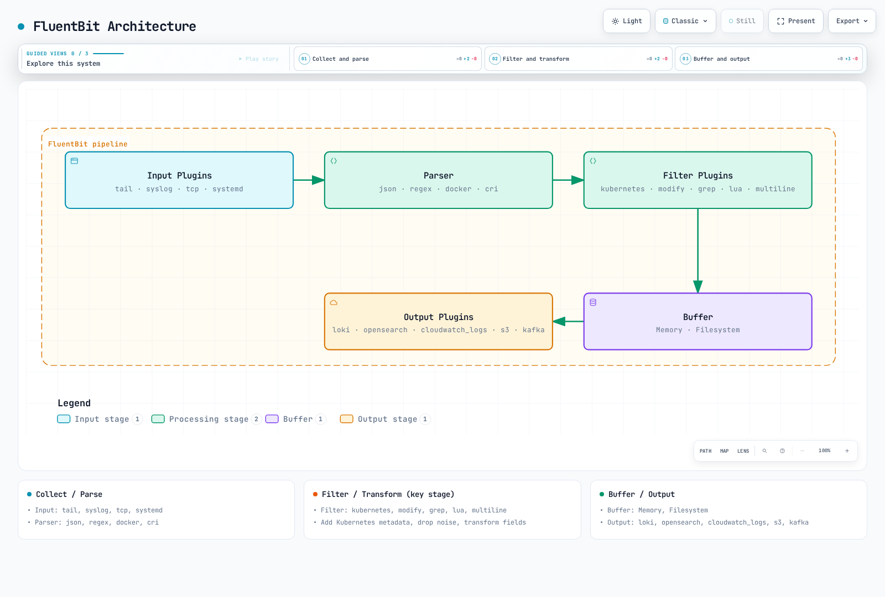
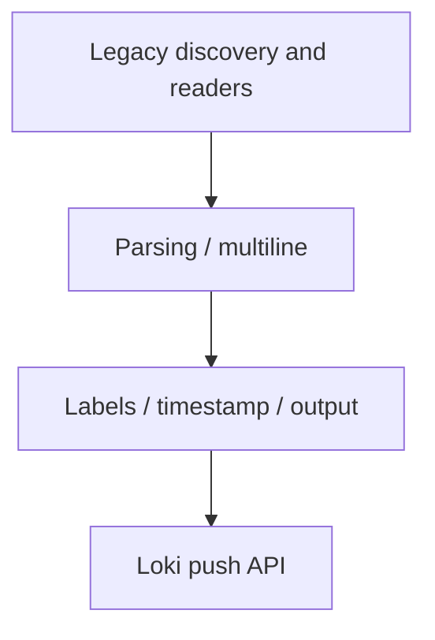
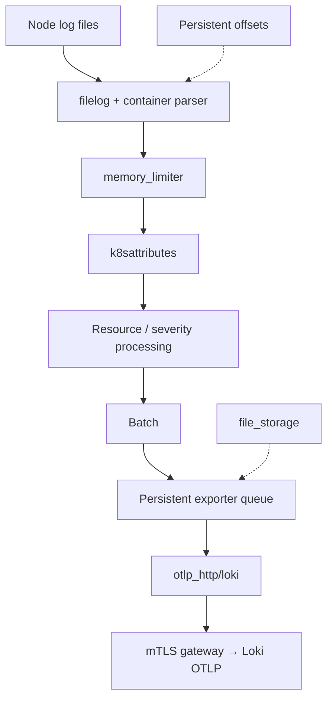
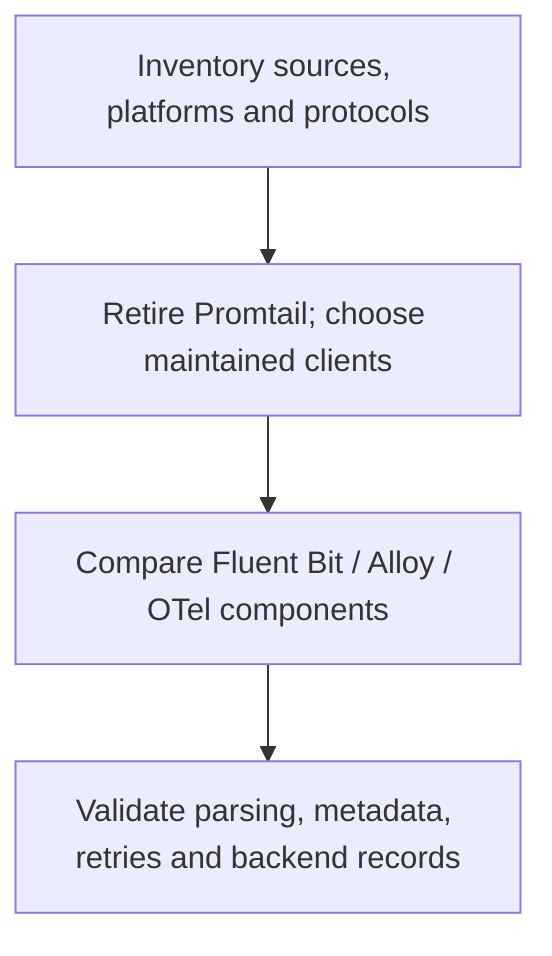

# ログコレクターの比較

> **最終更新**: September 13, 2026

このガイドでは、Fluent Bit、Grafana Alloy、OpenTelemetry Collector を比較し、サポート終了となった Promtail インストールからの移行について説明します。想定上のメモリ使用量や毎秒イベント数のランキングではなく、実際の入力、出力プラグイン、デプロイ権限、障害時の挙動に基づいてコレクターを選択してください。

構成のベースラインは **Fluent Bit 5.1.2**、**Alloy 1.19.2**、および **OpenTelemetry Collector Contrib 0.160.0** です。ディストリビューションのバージョン、含まれるコンポーネント、サポート対象プラットフォームは、別々に確認する必要があります。

## 目次

1. [概要](#overview)
2. [FluentBit](#fluentbit)
3. [Promtail](#promtail)
4. [Grafana Alloy](#grafana-alloy)
5. [OpenTelemetry Collector](#opentelemetry-collector)
6. [比較と選定 (English)](https://www.atomai.click/kubernetes-docs/en/observability/logging/05-collectors#comparison-and-selection-guide)

<span id="overview"></span>

## 概要

### ログコレクターの役割


[インタラクティブな図を表示](https://www.atomai.click/kubernetes-docs/archmaps/en-observability-logging-05-collectors-0.html)

図は可能な送信先を示しています。すべてのコレクターがすべての送信先をネイティブにサポートすること、または複数の出力を有効にすることで、それらすべてにトランザクション配信が行われることを意味するものではありません。

### コア機能

| 機能 | 確認事項 |
|---|---|
| 入力 | ファイル/API 権限、ローテーション、初回読み取り位置、ソースの所有権 |
| パース | アプリケーション JSON やスタックトレースとは分離した、コンテナランタイムのフレーミング |
| 変換/フィルター | 変更または破棄されるレコードとフィールド |
| メタデータ | 正確な Pod/namespace の関連付けと、制御されたラベルのカーディナリティ |
| バッファリング | メモリと永続ストレージ、容量、再試行、オーバーフローポリシー |
| 出力 | 認証、TLS、テナントマッピング、確認応答、送信先の制限 |

ソースごとに、意図した収集経路を1つだけ実行してください。同じファイルを複数のエージェントが読み取る場合、または同じ Pod をファイルリーダーと Kubernetes API リーダーが対象にする場合、ログが重複する可能性があります。オフセット、永続キュー、バックエンドへの取り込み成功は、それぞれ異なる状態です。

| プラットフォーム | 収集時の考慮事項 |
|---|---|
| Linux Kubernetes ノード | ホストファイルエージェントにはノードログのマウントと許可された security context が必要です。journal の場所は異なります |
| Windows ノード | サポート対象の Windows ビルド/設定と実際の Windows パスを使用してください。以下の Linux マニフェストは適用されません |
| EKS Fargate | ホストファイル DaemonSet をインストールしないでください。マネージド Fargate ログルーター、または適切な API/アプリケーションベースの経路を使用します |
| EKS Auto Mode | 利用可能なホストパスとアドオンのサポートを確認してください。マネージドコンポーネントが提供するログはアプリケーションの stdout とは異なります |

例では、**事前に存在するプライベートな mTLS 有効ログゲートウェイ**へ送信します。ゲートウェイは各エージェントのクライアント証明書を信頼し、その DNS 名に一致する証明書を提示し、Loki/OTLP パスをルーティングし、テナントポリシーを適用する必要があります。証明書、DNS、ゲートウェイ設定、NetworkPolicy は前提条件であり、これらのスニペットでは作成されません。

## FluentBit

### 概要

Fluent Bit は、graduated となった Fluentd エコシステムの C ベーステレメトリーエージェントです。現在のビルドはログ、メトリクス、トレース、OpenTelemetry プラグインをサポートしています。古い「トレースなし/OTLP なし」という比較は不正確です。選択したイメージに実際に含まれるプラグインを確認してください。

Fluent Bit 5.1.2 と AWS for Fluent Bit は、それぞれバージョン管理される別のディストリビューションです。AWS イメージタグは、組み込み Fluent Bit のバージョンではありません。この例では、公式の上流イメージとそのマニフェストダイジェストを固定しています。以下でリンクする AWS 固有のガイドでは、独自にレビューしたイメージベースラインを使用しています。

### アーキテクチャ



[インタラクティブな図を表示](https://www.atomai.click/kubernetes-docs/archmaps/en-observability-logging-05-collectors-1.html)

図は論理的な概要として扱ってください。バッファリングは exactly-once を保証するものではなく、フィルタリングによって元のコンテナログファイルが消去されるわけでもありません。ノードストレージを保護し、アプリケーション境界で機密データを制御してください。

### 完全な設定例

これを `fluent-bit.conf` として保存します。コンテナログを収集し、`line_format`、`tenant_id`、`auto_kubernetes_labels` などのオプションを持つ**ネイティブ C の `loki` 出力**を使用します。別途開発された Go プラグインの `LineFormat`、`TenantID`、`BatchWait`、`BatchSize` の名前は、互換的に使用できません。

```ini
[SERVICE]
    Flush                     2
    Grace                     30
    Daemon                    Off
    Log_Level                 info
    HTTP_Server               On
    HTTP_Listen               0.0.0.0
    HTTP_Port                 2020
    Health_Check              On
    storage.path              /var/lib/fluent-bit/storage
    storage.sync              normal
    storage.checksum          On
    storage.backlog.mem_limit 32M

[INPUT]
    Name                      tail
    Tag                       kube.*
    Path                      /var/log/containers/*.log
    Exclude_Path              /var/log/containers/fluent-bit-*_logging_*.log
    multiline.parser          docker, cri
    DB                        /var/lib/fluent-bit/tail.db
    DB.locking                true
    Mem_Buf_Limit             32M
    Skip_Long_Lines           On
    Refresh_Interval          10
    Rotate_Wait               30
    Read_From_Head            Off
    storage.type              filesystem

[FILTER]
    Name                      kubernetes
    Match                     kube.*
    Kube_URL                  https://kubernetes.default.svc:443
    Kube_Tag_Prefix           kube.var.log.containers.
    Merge_Log                 On
    Merge_Log_Key             log_processed
    Keep_Log                  On
    K8S-Logging.Parser         Off
    K8S-Logging.Exclude        Off
    Use_Kubelet               Off
    Labels                    On
    Annotations               Off

[FILTER]
    Name                      lua
    Match                     kube.*
    script                    /fluent-bit/scripts/process.lua
    call                      process_log
    protected_mode            On

[OUTPUT]
    Name                      loki
    Match                     kube.*
    Host                      logs-gateway.logging.svc.cluster.local
    Port                      443
    tls                       On
    tls.verify                On
    tls.verify_hostname       On
    tls.ca_file               /fluent-bit/tls/ca.crt
    tls.crt_file              /fluent-bit/tls/tls.crt
    tls.key_file              /fluent-bit/tls/tls.key
    Labels                    job=fluent-bit,namespace=$kubernetes['namespace_name']
    line_format               json
    auto_kubernetes_labels    Off
    Retry_Limit               5
    storage.total_limit_size  1G
```

tail データベースと filesystem チャンクは、読み取り専用ログマウントではなく書き込み可能な状態マウントを使用します。既存のオフセットはデータベースから再開されます。`Read_From_Head Off` は、ファイルが最初に検出されたときに既存コンテンツをスキップします。変更する前に、意図的なバックフィルポリシーを選択してください。`Skip_Long_Lines On`、有限回数の再試行、有限のストレージではデータが破棄される場合があります。これらの状態を監視してください。

除外設定は、この例自身のコレクター Pod に一致します。namespace またはワークロード名が変わった場合は、namespace 内のすべてのアプリケーションを暗黙に除外するのではなく、この設定を調整してください。この構成では、Kubernetes annotation によりパーサー/除外ポリシーを上書きすることはできません。

この例ではメタデータに API server を使用するため、kubelet の `nodes/proxy` アクセスは必要ありません。`Use_Kubelet` を有効にする場合は、kubelet アドレス、認可、証明書、ネットワークアクセスを個別に確認してください。HTTP メトリクスリスナーは、コレクター UI/health endpoint を公開する許可ではありません。

他の送信先では、対応する出力とワークロードアイデンティティを意図的に選択してください。

- [CloudWatch Logs](03-cloudwatch-logs.md): ネイティブの `cloudwatch_logs`、事前作成済みのロググループ、実際のエージェント ServiceAccount アイデンティティを使用します。サポートされない `compress` オプションを追加したり、作成/保持権限が存在すると仮定したりしないでください。
- [OpenSearch](02-opensearch.md): ネイティブの `opensearch` 出力、選択したバックエンド用の正確な SigV4 service/Region、TLS、typeless API 設定を使用します。
- S3: `s3` 出力専用の書き込み可能な `store_dir`、一意なオブジェクトキーポリシー、バケットプレフィックス権限を設定します。そのバッファリング/アップロード動作は、汎用 filesystem キューとは異なります。バックアップと呼ぶ前に、部分アップロード、再起動後の復旧、取得をテストしてください。

`systemd` 入力を追加する場合は、そのノード OS に存在する journal をマウントし、そのカーソルデータベースを書き込み可能に保ち、そのタグに一致する出力を追加してください。`Match kube.*` 出力しかない `host.systemd` 入力には配信経路がありません。ホストの journal/audit ファイルは EKS control-plane API audit logs ではありません。

### パーサー設定

Tail 入力に組み込まれた `docker, cri` multiline パーサーは、コンテナランタイムのフラグメントを再構成します。これはアプリケーションの Java/Python/Go スタックトレースを連結することとは異なります。

| 形式 | アプローチ |
|---|---|
| Docker JSON エンベロープ | アプリケーション JSON より先にランタイムエンベロープをパースします |
| CRI/containerd/CRI-O | timestamp、stream、partial/full マーカーをパースし、部分レコードを再構成します |
| JSON アプリケーションログ | アプリケーションペイロードだけをパースします。不正な/プレーンテキストのレコードを保持するか明示的に処理します |
| Nginx/logfmt/custom text | すべてのパーサーを無条件に連鎖させるのではなく、そのアプリケーション形式用のパーサーを選択します |
| アプリケーションスタックトレース | stream 境界、サイズ、タイムアウト制限を備えたテスト済み multiline パーサーを使用します |

multiline **filter** を使用する場合は、再出力/順序に関するガイダンスに従ってください。再出力されたレコードを他のフィルターが再処理しないよう、それらより前に配置します。コンテナが交互に出力するケースや timestamp のない例外をテストしてください。汎用的な「行が日付で始まる」という式は、普遍的なスタックトレースパーサーではありません。

### Lua スクリプト例

これを `process.lua` として保存します。ネストされたオブジェクト/配列を含む、パース済みアプリケーションオブジェクト内の選択したキーをマスキングし、未マスキングの raw 重複データを削除します。任意のテキストに含まれるすべてのシークレットや個人識別子を検出するものでは**ありません**。

```lua
-- Redacts selected structured keys; it is not a general PII detector.
local sensitive = {
    password = true, passwd = true, token = true, secret = true,
    api_key = true, ["api-key"] = true, authorization = true
}

local function redact(value, depth)
    if type(value) ~= "table" then
        return value
    end
    if depth > 8 then
        return "[DEPTH_LIMIT]"
    end
    for key, child in pairs(value) do
        if type(key) == "string" and sensitive[string.lower(key)] then
            value[key] = "***"
        elseif type(child) == "table" then
            value[key] = redact(child, depth + 1)
        end
    end
    return value
end

function process_log(tag, timestamp, record)
    local app = record["log_processed"]
    if type(app) == "table" then
        record["log_processed"] = redact(app, 0)
        -- Do not retain an unredacted duplicate of the parsed application JSON.
        record["log"] = nil
        if type(app["level"]) == "string" then
            record["level"] = string.upper(app["level"])
        else
            record["level"] = "UNKNOWN"
        end
    else
        if type(record["log"]) ~= "string" then
            record["log"] = "[NON_STRING_LOG]"
        end
        record["level"] = "UNKNOWN"
    end
    -- 2 changes the record while retaining the original Fluent Bit timestamp.
    return 2, timestamp, record
end
```

たとえば、`password` フィールドはマスキングされますが、`"message": "password=..."` のようなテキストは、資格情報として自動的に認識されません。プレーンテキストログはプレーンテキストのままです。この変換は fail-closed のセキュリティ境界ではありません。ソースファイル、ローカルストレージ、送信先を保護し、より強い保証が必要な場合はアプリケーションログの allowlist を使用してください。

`return 2` は、レコードを変更しながら Fluent Bit の元の timestamp を保持します。型チェックにより、不正な boolean のログレベルによってコールバックがクラッシュすることを避けます。テストではネイティブ Lua インタープリターでこれらの変換を実行しました。完全な Fluent Bit コンテナは実行していません。

### DaemonSet デプロイ

以下を `fluent-bit-workload.yaml` として保存します。`logging` 内の `agent-gateway-client` Secret が必要で、`ca.crt`、`tls.crt`、`tls.key` を含んでいる必要があります。これらはデプロイメント固有の認証情報です。サンプルの秘密鍵を Git に貼り付けないでください。

```yaml
apiVersion: v1
kind: ServiceAccount
metadata:
  name: fluent-bit
  namespace: logging
---
apiVersion: rbac.authorization.k8s.io/v1
kind: ClusterRole
metadata:
  name: log-collector-fluent-bit
rules:
- apiGroups:
  - ''
  resources:
  - pods
  - namespaces
  verbs:
  - get
  - list
  - watch
---
apiVersion: rbac.authorization.k8s.io/v1
kind: ClusterRoleBinding
metadata:
  name: log-collector-fluent-bit
roleRef:
  apiGroup: rbac.authorization.k8s.io
  kind: ClusterRole
  name: log-collector-fluent-bit
subjects:
- kind: ServiceAccount
  name: fluent-bit
  namespace: logging
---
apiVersion: apps/v1
kind: DaemonSet
metadata:
  name: fluent-bit
  namespace: logging
spec:
  selector:
    matchLabels: &id001
      app.kubernetes.io/name: fluent-bit
  template:
    metadata:
      labels: *id001
    spec:
      serviceAccountName: fluent-bit
      nodeSelector:
        kubernetes.io/os: linux
      terminationGracePeriodSeconds: 45
      containers:
      - name: fluent-bit
        image: fluent/fluent-bit:5.1.2@sha256:d792375ca8e53be72fc25716c28f291f32c6fc6f4f31d12d0d14bc78cefe9226
        command:
        - /fluent-bit/bin/fluent-bit
        args:
        - -c
        - /fluent-bit/etc/fluent-bit.conf
        ports:
        - name: metrics
          containerPort: 2020
        securityContext:
          runAsUser: 0
          allowPrivilegeEscalation: false
          readOnlyRootFilesystem: true
          capabilities:
            drop:
            - ALL
        resources:
          requests:
            cpu: 100m
            memory: 128Mi
          limits:
            cpu: 500m
            memory: 512Mi
        livenessProbe:
          httpGet:
            path: /
            port: metrics
          initialDelaySeconds: 10
        readinessProbe:
          httpGet:
            path: /api/v1/health
            port: metrics
          initialDelaySeconds: 10
        volumeMounts:
        - name: logs
          mountPath: /var/log
          readOnly: true
        - name: state
          mountPath: /var/lib/fluent-bit
        - name: config
          mountPath: /fluent-bit/etc
          readOnly: true
        - name: scripts
          mountPath: /fluent-bit/scripts
          readOnly: true
        - name: tls
          mountPath: /fluent-bit/tls
          readOnly: true
        - name: tmp
          mountPath: /tmp
      volumes:
      - name: logs
        hostPath:
          path: /var/log
          type: Directory
      - name: state
        hostPath:
          path: /var/lib/fluent-bit
          type: DirectoryOrCreate
      - name: config
        configMap:
          name: fluent-bit-config
          items:
          - key: fluent-bit.conf
            path: fluent-bit.conf
      - name: scripts
        configMap:
          name: fluent-bit-config
          items:
          - key: process.lua
            path: process.lua
      - name: tls
        secret:
          secretName: agent-gateway-client
      - name: tmp
        emptyDir:
          sizeLimit: 32Mi
```

先に示した設定/スクリプトファイルを保存してから、ワークロードを開始する前にそれらの ConfigMap を作成します。

```bash
kubectl create namespace logging --dry-run=client -o yaml |
  kubectl apply -f -
kubectl -n logging create configmap fluent-bit-config \
  --from-file=fluent-bit.conf --from-file=process.lua \
  --dry-run=client -o yaml | kubectl apply -f -
kubectl apply -f fluent-bit-workload.yaml
kubectl -n logging rollout status daemonset/fluent-bit
```

エージェントは、例のノードログパスを読み取り、専用の状態ディレクトリへ書き込むため root として動作します。追加 capabilities、権限昇格、書き込み可能な root filesystem はありません。HostPath を使用する場合も、適切なクラスター admission policy が必要です。実際のノード OS に合わせて、ファイル権限、SELinux/AppArmor、taint、ストレージを適合させてください。アプリケーションログエージェントを動作させ続けるだけのために、予約された system-critical PriorityClass を付与しないでください。

45 秒の Pod 終了猶予期間は Fluent Bit の 30 秒の猶予期間を上回りますが、長期的な障害中に配信が成功する保証にはなりません。リソース制限は例示です。バックエンドの実レコード、tail オフセット、health、buffer/retry メトリクスを確認してください。Ready な Pod だけでは、取り込みが証明されません。

## Promtail

### 概要

**Promtail は 2026 年3月2日に EOL に達しました。**商用サポートと将来の更新は終了しています。既存のインストールは Alloy または他のサポート対象クライアントに移行してください。新規 Loki デプロイメントで Promtail を選択しないでください。発表された廃止には、別の `lambda-promtail` クライアントは含まれません。

### アーキテクチャ



これは歴史的なデータ経路であり、インストールの推奨ではありません。Loki リポジトリの[ライセンス例外](https://github.com/grafana/loki/blob/v2.9.4/LICENSING.md)では、Promtail ソースを含む `clients/` が Apache-2.0 の対象として挙げられています。Loki server の AGPL ラベルを、すべてのクライアントに適用しないでください。実際の artifact と依存関係のライセンスを確認してください。positions は読み取りを記録するものであり、バックエンド配信の確認済み状態ではありません。

### 完全な設定例

廃止された 2.9.4 イメージをデプロイする代わりに、移行入力として**既存の** `promtail.yaml` を使用します。

```bash
alloy convert --source-format=promtail \
  --report=conversion-report.txt \
  --output=config.alloy promtail.yaml
alloy validate config.alloy
```

生成された設定と診断レポートを確認してください。通常のデプロイ手順として変換エラーを無視しないでください。コンバーターは、ほぼすべてのレガシー機能をサポートしますが、同一動作を無条件に保証するものではありません。

レビュー済みのレガシー設定は正常に変換されましたが、ツールはグローバルな読み取りレート制限が pipeline ごとの `stage.limit` 制限になること、Promtail 独自の tracing 設定には手動移行が必要な場合があること、Alloy は異なる self-metrics を出力することを警告しました。アラート/ダッシュボードを更新し、実データでそれらの変更を確認してください。

### Pipeline Stage の詳細

これらは**個別の概念**であり、すべてのパーサーを順番に実行するレシピではありません。

| Promtail YAML | Alloy 相当 | 重要な違い |
|---|---|---|
| `cri` / `docker` | `stage.cri` / `stage.docker` | 実際のランタイムフレーミングを選択します |
| `json`, `regex`, `logfmt` | 対応する `stage.*` | 正しいソースフィールドと不正データポリシーを選択します |
| `template`, then `labels` | `stage.template`, then `stage.labels` | 値をラベルへコピーする前に正規化します |
| `drop` | `stage.drop` | Promtail の YAML キーは `drop` であり、`stage.drop` ではありません |
| `match` | `stage.match` | 意図した stream にだけ分岐を適用します |
| `metrics` | `stage.metrics` | ラベルセット、idle series、メトリクス名をレビューします |
| `timestamp`, `multiline` | 対応する stage | 時刻形式、stream の分離、制限された待機時間をテストします |
| `output` | `stage.output` | 行を置換すると、相関に必要なフィールドを破棄する場合があります |
| `pack` | `stage.pack` | JSON 行のパッキングは Loki の独立した structured-metadata 機能ではありません |

デフォルトで、クライアント IP、注文 ID、trace ID、または任意のアプリケーションラベルすべてをインデックス化しないでください。Pod と filename のラベルにもカーディナリティコストがあります。ラベル、structured metadata、ログ本文のどれとして利用可能な状態を保つ必要があるかを決定してください。

### DaemonSet デプロイ

廃止されたワークロードを、選択した保守対象コレクターに置き換え、ソース/状態の移行を意図的に維持してください。`/tmp` 配下の positions ファイルは、古い read-only-root の例では永続的でも書き込み可能でもありません。`/run/promtail` へのマウントは、別の場所に書き込む設定を修正しません。

古いリーダーの停止位置、新しいリーダーの開始位置、バックエンドチェックを調整してください。同じログに対して両方のリーダーを無期限に実行しないでください。変換の成功は、Secret mount、Kubernetes RBAC、journal path、状態移行、バックエンド配信を検証するものではありません。

## Grafana Alloy

### 概要

Alloy は、Prometheus と Loki コンポーネントを含む Grafana の OpenTelemetry Collector ディストリビューションです。その設定言語は、旧称 River の **Alloy configuration syntax** と呼ばれます。HCL に似ていますが、Terraform ファイルと互換的に使用できるものではありません。

### River 設定

以下を `config.alloy` として保存します。この例では Linux CRI ログに対して**1つのファイルベース経路**を使用します。Pod Downward API の `spec.nodeName` から非シークレットの `NODE_NAME` を設定し、ノードログファイルをマウントし、書き込み可能で永続的な `--storage.path` を提供してください。

```alloy
logging {
  level = "info"
}

discovery.kubernetes "pods" {
  role = "pod"
  selectors {
    role = "pod"
    field = "spec.nodeName=" + sys.env("NODE_NAME")
  }
}

discovery.relabel "pods" {
  targets = discovery.kubernetes.pods.targets
  rule {
    source_labels = ["__meta_kubernetes_namespace", "__meta_kubernetes_pod_label_app_kubernetes_io_name"]
    regex = "logging;alloy"
    action = "drop"
  }
  rule {
    source_labels = ["__meta_kubernetes_namespace"]
    target_label = "namespace"
  }
  rule {
    source_labels = ["__meta_kubernetes_pod_name"]
    target_label = "pod"
  }
  rule {
    source_labels = ["__meta_kubernetes_pod_container_name"]
    target_label = "container"
  }
  rule {
    source_labels = ["__meta_kubernetes_pod_label_app_kubernetes_io_name"]
    target_label = "service_name"
    regex = "(.+)"
  }
  rule {
    source_labels = ["__meta_kubernetes_pod_uid", "__meta_kubernetes_pod_container_name"]
    separator = "/"
    target_label = "__path__"
    replacement = "/var/log/pods/*$1/*.log"
  }
}

local.file_match "pods" {
  path_targets = discovery.relabel.pods.output
}

loki.source.file "pods" {
  targets = local.file_match.pods.targets
  forward_to = [loki.process.pods.receiver]
  tail_from_end = true
}

loki.process "pods" {
  forward_to = [loki.write.logs.receiver]
  stage.cri {}
  stage.json {
    expressions = {
      level = "level",
    }
    drop_malformed = false
  }
  stage.template {
    source = "level"
    template = "{{ if .Value }}{{ $v := ToUpper .Value }}{{ if or (eq $v \"TRACE\") (eq $v \"DEBUG\") (eq $v \"INFO\") (eq $v \"WARN\") (eq $v \"WARNING\") (eq $v \"ERROR\") (eq $v \"FATAL\") (eq $v \"CRITICAL\") }}{{ $v }}{{ else }}UNKNOWN{{ end }}{{ else }}UNKNOWN{{ end }}"
  }
  stage.labels {
    values = {
      level = "",
    }
  }
  stage.label_drop {
    values = ["filename"]
  }
  // Retain the application line, including its trace ID; do not assume it is safe.
}

loki.write "logs" {
  endpoint {
    url = "https://logs-gateway.logging.svc.cluster.local/loki/api/v1/push"
    batch_wait = "1s"
    batch_size = "1MiB"
    tls_config {
      ca_file = "/etc/alloy/tls/ca.crt"
      cert_file = "/etc/alloy/tls/tls.crt"
      key_file = "/etc/alloy/tls/tls.key"
      insecure_skip_verify = false
    }
  }
  external_labels = {
    cluster = "lab-cluster",
  }
}
```

設定された mTLS 証明書ファイルが存在する必要があります。Kubernetes discovery 権限と対応するゲートウェイポリシーは個別に適用してください。選択した Alloy バイナリでファイルを検証します。

```bash
alloy validate config.alloy
```

severity ラベルは既知のレベルと `UNKNOWN` に制限され、trace ID の検索にはアプリケーション行を引き続き利用できます。これはマスキング pipeline ではありません。filename ラベルは削除されます。Pod/container ラベルは維持され、保持期間/カーディナリティ制限に照らして引き続き評価する必要があります。

API ベースの収集では、ファイルリーダー**ではなく** `loki.source.kubernetes` を使用し、CRI/Docker-envelope stage を削除してください。Kubernetes log API はアプリケーションログ行を提供します。1つの API collector は、ホストマウントなしでクラスターを収集できます。複数のインスタンスでは、意図的な target partitioning またはコンポーネントの参加を設定した Alloy clustering が必要です。単に replica を追加すると収集が重複する可能性があります。

`env()` は、このレビュー済みリリースでは非推奨の関数のままです。非シークレット設定には `sys.env()` を使用してください。environment dump を通じた token の露出よりも、マウントされた credential file または secret-aware component を優先してください。

Alloy の self-metrics は scrape できます。これらを Prometheus `/api/v1/write` に送信するには、有効な remote-write receiver または remote write 用に設計されたバックエンドも必要です。URL だけでは有効になりません。メトリクス/UI アクセスは非公開にしてください。デプロイメント向けに telemetry/reporting を明示的に設定してください。

### Promtail からの移行

ランタイムパース、discovery label、アプリケーションフィールド、offset、破棄レコードポリシー、クライアント認証、self-metric alert をそれぞれ独立して維持してください。未定義の discovery component を含む API-source の例や、既にデコードされた API ログに `stage.docker` parser を適用する例は、完全な移行ではありません。

Alloy 1.19.2 には任意の Loki WAL がありますが、この機能は**experimental でありデフォルトでは無効**です。主要な例では有効にしていません。永続的な source position は耐久性のある acknowledgement queue ではありません。retry limit、source rotation、WAL retention があればそれを個別に評価してください。

## OpenTelemetry Collector

### 概要

OpenTelemetry はベンダー中立のテレメトリー pipeline を提供し、**2026年5月11日に CNCF Graduated project** になりました。必要な receiver/processor/exporter を含むディストリビューションを使用してください。core ディストリビューションにはすべての Contrib component が含まれているわけではありません。

OTLP は Protobuf または JSON を使用できます。wire size は実際のフィールド、resource grouping、compression、transport に依存します。Filebeat/Fluentd も batch 処理できます。フィールド名を Protobuf tag に置き換えても、任意の JSON body または attribute-key string は除去されません。

条件付きの算術例として、ある pipeline が Kafka record ごとに1イベントを保存し、別の pipeline が record ごとに150イベントをパックする場合、後者では1,000イベントに約7レコードが必要です。これはネットワークリクエストの同等な削減や 18 倍の throughput 改善を証明するものではありません。対応するハードウェア、データ、送信先、耐久性設定で完全な pipeline をベンチマークしてください。

### アーキテクチャ



Loki には OTLP endpoint を介して到達します。廃止された Collector `loki` exporter は Contrib 0.160.0 には存在しません。クラスター全体の Kubernetes event と集中 Syslog/OTLP receiver には、それぞれ独自の所有権とデプロイメントモデルが必要です。すべてのノードで event watcher を重複して実行しないでください。

### 完全な設定例

以下を `otel.yaml` として保存します。Contrib の `container` operator をランタイムのパース/再構成とファイルパスの resource metadata に使用します。指定された Kubernetes association では、Pod UID は**resource attribute**である必要があります。単に `attributes.uid` を抽出するだけでは不十分です。

```yaml
extensions:
  file_storage/offsets:
    directory: /var/lib/otelcol/offsets
    create_directory: true
  file_storage/queue:
    directory: /var/lib/otelcol/queue
    create_directory: true
  health_check:
    endpoint: 0.0.0.0:13133

receivers:
  filelog:
    include: [/var/log/pods/*/*/*.log]
    exclude: [/var/log/pods/logging_otel-collector-*/*/*.log]
    start_at: end
    include_file_path: true
    storage: file_storage/offsets
    retry_on_failure:
      enabled: true
      max_elapsed_time: 5m
    operators:
      - type: container
        id: container-parser

processors:
  memory_limiter:
    check_interval: 1s
    limit_mib: 400
    spike_limit_mib: 100
  k8sattributes:
    auth_type: serviceAccount
    filter:
      node_from_env_var: NODE_NAME
    pod_association:
      - sources:
          - from: resource_attribute
            name: k8s.pod.uid
    extract:
      metadata:
        - k8s.namespace.name
        - k8s.pod.name
        - k8s.pod.uid
        - k8s.node.name
        - k8s.container.name
  resource/cluster:
    attributes:
      - key: k8s.cluster.name
        value: lab-cluster
        action: upsert
  transform/application:
    error_mode: ignore
    log_statements:
      - context: log
        statements:
          - 'set(cache["app"], ParseJSON(body)) where IsString(body) and IsMatch(body, "^\\s*\\{")'
          - 'set(severity_text, ConvertCase(cache["app"]["level"], "upper")) where IsMap(cache["app"]) and IsString(cache["app"]["level"])'
          - 'set(severity_number, SEVERITY_NUMBER_ERROR) where severity_text == "ERROR"'
          - 'set(severity_number, SEVERITY_NUMBER_WARN) where severity_text == "WARN" or severity_text == "WARNING"'
          - 'set(severity_number, SEVERITY_NUMBER_INFO) where severity_text == "INFO"'
          - 'set(severity_number, SEVERITY_NUMBER_DEBUG) where severity_text == "DEBUG"'
          - 'set(severity_number, SEVERITY_NUMBER_TRACE) where severity_text == "TRACE"'
          - 'set(severity_number, SEVERITY_NUMBER_FATAL) where severity_text == "FATAL" or severity_text == "CRITICAL"'
  batch:
    send_batch_size: 1024
    send_batch_max_size: 2048
    timeout: 2s

exporters:
  otlp_http/loki:
    endpoint: https://logs-gateway.logging.svc.cluster.local/otlp
    encoding: proto
    compression: gzip
    tls:
      ca_file: /etc/otelcol/tls/ca.crt
      cert_file: /etc/otelcol/tls/tls.crt
      key_file: /etc/otelcol/tls/tls.key
    sending_queue:
      enabled: true
      num_consumers: 2
      queue_size: 128
      storage: file_storage/queue
    retry_on_failure:
      enabled: true
      max_elapsed_time: 5m

service:
  extensions: [file_storage/offsets, file_storage/queue, health_check]
  telemetry:
    logs:
      level: info
    metrics:
      readers:
        - pull:
            exporter:
              prometheus:
                host: 0.0.0.0
                port: 8888
  pipelines:
    logs:
      receivers: [filelog]
      processors: [memory_limiter, k8sattributes, resource/cluster, transform/application, batch]
      exporters: [otlp_http/loki]
```

`NODE_NAME` Downward API 値、読み取り専用のノードログマウント、書き込み可能な `/var/lib/otelcol`、Kubernetes metadata RBAC、クライアント証明書マウントを提供してください。storage extension は、その書き込み可能 volume 内に独自のディレクトリを作成します。デプロイされた環境値で検証してください。

```bash
otelcol-contrib validate --config=otel.yaml
```

exporter は `/otlp` に `/v1/logs` を追加します。ゲートウェイと Loki の OTLP/structured-metadata サポートを適切に設定してください。`service.telemetry.metrics.readers` は、このベースラインにおける古い無効な `address` キーを置き換えます。

`memory_limiter` は再試行可能エラーとともにデータを拒否し、garbage collection を要求できます。これはプロセスメモリ上限や絶対的な OOM 防止を保証するものではありません。上流の再試行動作が重要です。この file receiver は最大5分間再試行しますが、その後に失敗した batch は破棄される可能性があります。queue capacity、disk capacity、shutdown、バックエンド障害もテストが必要です。

アプリケーション body は、プレーンテキストや不正な JSON を含めて保持されます。severity のパースは機密データの除去ではありません。未マスキングの production payload を collector log に不注意にコピーするような、並列の詳細 debug exporter を追加しないでください。

### Routing Connector

この**独立したローカルルーティングのデモ**では、参照されるすべての component が定義され、fallback route が含まれています。OTLP producer は `resource.attributes["logtype"]` を提供します。アプリケーションの JSON body 内のフィールドは、自動的に resource attribute にはなりません。

```yaml
receivers:
  otlp:
    protocols:
      http:
        endpoint: 127.0.0.1:4318

connectors:
  routing:
    default_pipelines: [logs/other]
    table:
      - condition: resource.attributes["logtype"] == "mysql"
        pipelines: [logs/mysql]
      - condition: resource.attributes["logtype"] == "nginx"
        pipelines: [logs/nginx]
      - condition: resource.attributes["logtype"] == "app"
        pipelines: [logs/app]

exporters:
  file/mysql:
    path: /var/lib/otelcol/routed/mysql.json
  file/nginx:
    path: /var/lib/otelcol/routed/nginx.json
  file/app:
    path: /var/lib/otelcol/routed/app.json
  file/other:
    path: /var/lib/otelcol/routed/other.json

service:
  pipelines:
    logs/ingestion:
      receivers: [otlp]
      exporters: [routing]
    logs/mysql:
      receivers: [routing]
      exporters: [file/mysql]
    logs/nginx:
      receivers: [routing]
      exporters: [file/nginx]
    logs/app:
      receivers: [routing]
      exporters: [file/app]
    logs/other:
      receivers: [routing]
      exporters: [file/other]
```

この例を実行する前に、書き込み可能な出力ディレクトリを作成してください。receiver は loopback に bind し、送信先はローカルファイルです。production gateway や ClickHouse deployment ではありません。各実バックエンド、認証、ストレージポリシーを設定してからローカル出力を置き換えてください。

現在の connector は `statement: route() where ...` を受け付けます。これは検証済みであり、誤って削除済みとして扱われるものではありません。ここで使用している `condition` はより明確な形式です。デフォルトの `move` action は、一致したデータを後続の routing から削除します。`copy` は異なる fan-out 動作をします。一致しないレコードには意図した fallback が必要です。

Kafka topic を統合すると、ACL、retention、partition、consumer ownership、障害分離が適切なままである場合にのみ、管理を単純化できる可能性があります。Collector 内の classification は broker isolation を置き換えるものではなく、fan-out を atomic にもしません。producer が制御する routing attribute は tenant authorization boundary ではありません。

### ログレベルプールの分離（大規模環境）

| プール | 目標例 | 必要な制御 |
|---|---|---|
| 高速: ERROR/FATAL | 2分以内に到着 | 予約済み capacity、適切な queue/partition 分離、計測された backlog |
| 通常: INFO/WARN | 15分以内に到着 | 計測された autoscaling と制限された retention/queue |
| Debug: DEBUG/TRACE | ベストエフォート | 明示的な drop/throttle ポリシーと破棄データの可視性 |

これらは例示的な目標であり、計測済み SLA ではありません。3つの Deployment に名前を付けたり replica を割り当てたりするだけでは、データをルーティングしたり、共有され混雑した input queue を分離したりできません。観測された input size、processing、batching、retry に基づき、resource request と limit を設定してください。

一般的なロギングの推奨として予約済みの `system-cluster-critical`/`system-node-critical` class を使用するのではなく、クラスターに適した operator-owned PriorityClass を使用してください。専用ノード、priority、予備 capacity は、あらゆる障害時の可用性を保証するものではありません。

## 比較と選定ガイド

### 機能比較表

| 項目 | Fluent Bit | Promtail | Alloy | OTel Collector Contrib |
|---|---|---|---|---|
| ライフサイクル | 保守対象 | EOL; 移行 | 保守対象 | 保守対象 |
| 設定 | Classic config / YAML | Legacy YAML | Alloy syntax | YAML |
| シグナル | プラグイン依存の logs/metrics/traces | 主に Loki logs | Logs/metrics/traces | コンポーネント依存の logs/metrics/traces |
| Loki 経路 | Native output | Legacy push client | Loki components | OTLP HTTP exporter |
| AWS 出力 | Native plugin を利用可能 | 目的外 | 含まれる component/forwarding path を確認 | 含まれる AWS exporter を確認 |
| 拡張性 | C/plugins、Lua filters、その他ビルド依存のオプション | Legacy pipeline stages | Components and pipelines | Receivers/processors/connectors/exporters |
| 永続性 | Input chunks/state と output 固有の storage | Source positions; 制限付き client buffering | Positions; 任意の experimental Loki WAL | Offset とサポート対象 exporter queue 用の file storage |
| リソース使用量 | 選択した設定を計測 | 過去の計測値のみ | 選択した設定を計測 | 選択した設定を計測 |

ネイティブプラグインのサポートは、OTLP を2つ目の collector に転送することとは異なります。送信先がサポート対象か非サポートかを結論づける前に、インストールしたディストリビューションの実際の component list とバックエンド protocol を確認してください。

### ユースケース別の推奨事項

- 既存の native output integration と、計測済みワークロードに適した node-agent footprint には Fluent Bit を評価してください。
- Grafana/Loki/Prometheus のワークフローおよび Promtail 移行には、意図した1つの source ownership model で Alloy を評価してください。
- 標準 OTLP と、その processor/connector を必要とするマルチベンダー pipeline には OTel Collector を評価してください。
- Promtail は移行してください。既に動作していることだけを理由に維持するのは、サポートされる長期的な選択ではありません。

### 判断フロー



## 参照資料と検証範囲

- [Fluent Bit 5.1.2 のソースと機能](https://github.com/fluent/fluent-bit/tree/v5.1.2)
- [ネイティブ Loki 出力オプション](https://github.com/fluent/fluent-bit/blob/v5.1.2/plugins/out_loki/loki.c)
- [Promtail ライフサイクル](https://grafana.com/docs/loki/latest/send-data/promtail/)
- [Alloy 移行](https://grafana.com/docs/alloy/latest/set-up/migrate/from-promtail/)
- [Alloy Kubernetes API ソース](https://grafana.com/docs/alloy/latest/reference/components/loki/loki.source.kubernetes/)
- [Alloy Loki 出力/WAL](https://grafana.com/docs/alloy/latest/reference/components/loki/loki.write/)
- [Collector Contrib リリース](https://github.com/open-telemetry/opentelemetry-collector-releases/releases/tag/v0.160.0)
- [Filelog receiver](https://github.com/open-telemetry/opentelemetry-collector-contrib/blob/v0.160.0/receiver/filelogreceiver/README.md)
- [Routing connector](https://github.com/open-telemetry/opentelemetry-collector-contrib/blob/v0.160.0/connector/routingconnector/README.md)
- [Memory limiter](https://github.com/open-telemetry/opentelemetry-collector/blob/v0.160.0/processor/memorylimiterprocessor/README.md)
- [OpenTelemetry CNCF ステータス](https://www.cncf.io/projects/opentelemetry/)
- [EKS Fargate logging](https://docs.aws.amazon.com/eks/latest/userguide/fargate-logging.html)

検証は、リリース済み Alloy/Collector の設定チェック、ローカルの合成ログ処理、Lua 変換テスト、公式 plugin/source contract、Kubernetes manifest の形式を対象としています。実際の Kubernetes metadata lookup、node-agent deployment、gateway mTLS、AWS 配信、HA、production load、throughput benchmark は実行していません。

## クイズ

[ログコレクタークイズ](../../quizzes/observability/logging/05-collectors-quiz.md)で理解度を確認してください。
