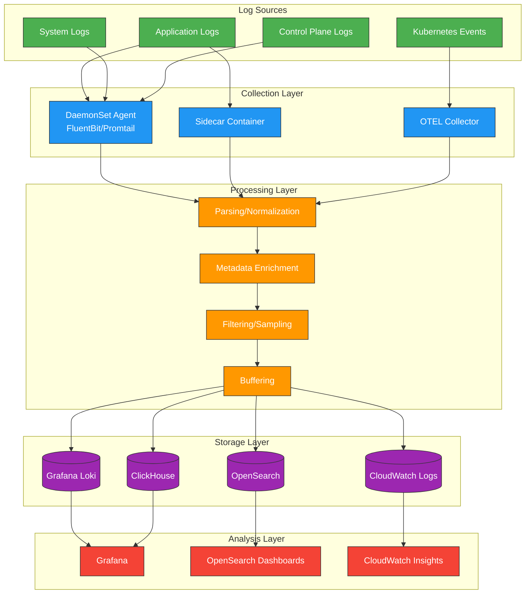
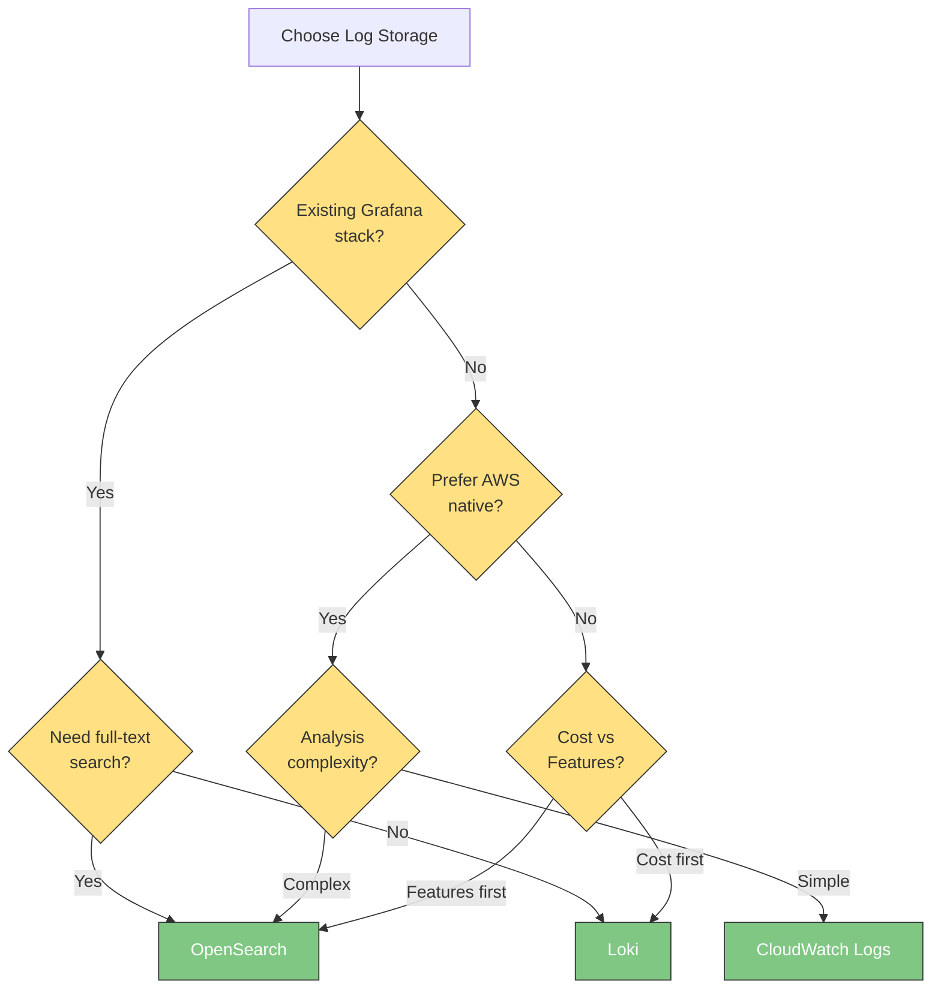

# ロギング

> **最終更新**: February 20, 2026

Kubernetes 環境における効果的なロギングは、システムの可視性、トラブルシューティング、およびセキュリティ監査に不可欠です。このドキュメントでは、ロギングの基礎、ログ収集パイプラインのアーキテクチャ、および EKS 環境向けのロギング戦略について説明します。

## 目次

1. [ロギングの基礎](#logging-fundamentals)
2. [ログ収集パイプラインのアーキテクチャ](#log-collection-pipeline-architecture)
3. [ログストレージの選定基準](#log-storage-selection-criteria)
4. [EKS ロギング戦略](#eks-logging-strategy)
5. [ソリューション比較](#solution-comparison)

***

## ロギングの基礎

### 構造化ロギング

構造化ロギングは、一貫した形式でログメッセージを出力するため、解析と分析が容易になります。非構造化テキストログとは異なり、構造化ログはフィールドと値のペアで構成され、はるかに効率的な検索とフィルタリングを可能にします。

#### 非構造化ログと構造化ログ

```plaintext
# Unstructured log (difficult to parse)
2025-02-15 10:23:45 ERROR Failed to connect to database: connection timeout after 30s

# Structured log (JSON format)
{
  "timestamp": "2025-02-15T10:23:45.123Z",
  "level": "ERROR",
  "message": "Failed to connect to database",
  "error": "connection timeout",
  "timeout_seconds": 30,
  "service": "user-api",
  "pod": "user-api-7d4f8b9c6-x2k9m",
  "namespace": "production",
  "trace_id": "abc123def456"
}
```

#### 構造化ロギングの利点

| 利点                  | 説明                                               |
| ------------------------ | --------------------------------------------------------- |
| **検索効率**    | 特定のフィールドによる高速なフィルタリング                         |
| **一貫性**          | すべての Service で同じ形式                           |
| **相関分析** | trace\_id、request\_id によるリクエストの追跡                 |
| **自動化**           | 解析なしで分析ツールですぐに利用可能      |
| **アラート設定**  | 特定のフィールド値に基づくアラートルールを簡単に作成可能 |

### ログレベル

ログレベルは、メッセージの重要度と重大度を示します。ログレベルを適切に使用することは、効果的なトラブルシューティングとノイズ削減に不可欠です。

| レベル     | 番号 | 目的                                  | 例                                              |
| --------- | ------ | ---------------------------------------- | ---------------------------------------------------- |
| **TRACE** | 0      | 最も詳細なデバッグ情報      | 関数の開始/終了、変数値                 |
| **DEBUG** | 1      | 開発中のデバッグ情報 | SQL クエリ、リクエストパラメータ                      |
| **INFO**  | 2      | 一般的な運用情報          | Service の起動、リクエストの完了                  |
| **WARN**  | 3      | 潜在的な問題状況             | リトライの発生、パフォーマンスの低下           |
| **ERROR** | 4      | エラー発生（回復可能）             | API 呼び出しの失敗、バリデーションの失敗                 |
| **FATAL** | 5      | 重大なエラー（回復不能）           | Service の起動失敗、必須依存関係の欠落 |

#### 環境別の推奨ログレベル

```yaml
# Development environment
LOG_LEVEL: DEBUG

# Staging environment
LOG_LEVEL: INFO

# Production environment
LOG_LEVEL: INFO  # or WARN (for high traffic)
```

### JSON ログ形式

Kubernetes 環境では、JSON 形式が事実上の標準です。ほとんどのログコレクターと分析ツールは JSON をネイティブでサポートしています。

#### 推奨 JSON フィールド

```json
{
  "timestamp": "2025-02-15T10:23:45.123Z",
  "level": "INFO",
  "logger": "com.example.UserService",
  "message": "User login successful",
  "context": {
    "user_id": "user-12345",
    "session_id": "sess-abc123",
    "ip_address": "10.0.1.50"
  },
  "kubernetes": {
    "namespace": "production",
    "pod": "user-api-7d4f8b9c6-x2k9m",
    "container": "user-api",
    "node": "ip-10-0-1-100.ec2.internal"
  },
  "trace": {
    "trace_id": "abc123def456",
    "span_id": "789ghi",
    "parent_span_id": "456def"
  }
}
```

#### 主要フィールドの説明

| フィールドグループ    | フィールド         | 説明                                         |
| -------------- | ------------- | --------------------------------------------------- |
| **基本**      | timestamp     | ISO 8601 形式のタイムスタンプ                           |
|                | level         | ログレベル                                           |
|                | message       | 人間が読めるメッセージ                              |
| **コンテキスト**    | context.\*    | ビジネスロジックに関連する情報                  |
| **Kubernetes** | kubernetes.\* | Pod、namespace などの K8s メタデータ                    |
| **トレース**      | trace.\*      | 分散トレーシング ID（OpenTelemetry 統合） |

***

## ログ収集パイプラインのアーキテクチャ

### アーキテクチャ概要



### レイヤーの責務

#### 1. 収集レイヤー

ログソースから生ログを収集します。

| 方法          | 利点                                   | 欠点                     | 最適な用途                          |
| --------------- | -------------------------------------------- | --------------------------------- | --------------------------------- |
| **DaemonSet**   | リソース効率が高く、一元管理が可能   | ノードごとに 1 つのみ                 | ほとんどの標準ワークロード           |
| **Sidecar**     | アプリケーション単位の分離、カスタム処理 | リソースのオーバーヘッド                 | 特殊なログ形式、マルチテナント |
| **Direct Push** | リアルタイム、柔軟な配信                 | アプリケーションの変更が必要 | 高パフォーマンス要件     |

#### 2. 処理レイヤー

収集したログを正規化し、メタデータを追加します。

```yaml
# FluentBit processing pipeline example
[FILTER]
    Name         kubernetes
    Match        kube.*
    Kube_URL     https://kubernetes.default.svc:443
    Merge_Log    On
    K8S-Logging.Parser  On

[FILTER]
    Name         modify
    Match        *
    Add          cluster_name eks-production
    Add          environment production

[FILTER]
    Name         grep
    Match        *
    Exclude      log HealthCheck
```

#### 3. ストレージレイヤー

処理済みログを保存し、インデックスを作成します。ストレージ方式はソリューションの特性によって異なります。

#### 4. 分析レイヤー

保存されたログを検索し、可視化します。

***

## ログストレージの選定基準

### 主な考慮事項

#### 1. コスト

```
Monthly log volume: Estimated cost based on 1TB (2025)

+------------------+------------------+-----------------+
|     Solution     |   Storage/GB     |   Query Cost    |
+------------------+------------------+-----------------+
| Loki (S3)        | $0.023 (S3)      | Free            |
| OpenSearch       | $0.10-0.15       | Free            |
| CloudWatch       | $0.50 (ingest)   | $0.005/GB scan  |
| ClickHouse       | $0.023 (S3)      | Free            |
+------------------+------------------+-----------------+
```

#### 2. クエリパフォーマンス

| ソリューション       | リアルタイムクエリ | 集計 | 全文検索 | ダッシュボード             |
| -------------- | --------------- | ----------- | ---------------- | --------------------- |
| **Loki**       | 優れている       | 良好        | 制限あり          | Grafana               |
| **OpenSearch** | 優れている       | 優れている   | 優れている        | OpenSearch Dashboards |
| **CloudWatch** | 良好            | 良好        | 良好             | CloudWatch Console    |
| **ClickHouse** | 優れている       | 優れている   | 良好             | Grafana               |

#### 3. 保持期間

```yaml
# Recommended retention policies
regulatory_compliance:
  financial: 7 years
  healthcare: 6 years
  general: 1 year

operational:
  hot_storage: 7-14 days    # Fast queries
  warm_storage: 30-90 days  # Investigation
  cold_storage: 1 year+     # Compliance
```

#### 4. 運用の複雑さ

| ソリューション       | インストール | 運用 | スケーラビリティ |
| -------------- | ------------ | ---------- | ----------- |
| **Loki**       | 低い          | 低い        | 高い        |
| **OpenSearch** | 中程度       | 高い       | 中程度      |
| **CloudWatch** | 非常に低い     | 非常に低い   | 高い        |
| **ClickHouse** | 高い         | 中程度      | 高い        |

***

## EKS ロギング戦略

### ログ収集パターン

#### 1. stdout/stderr パターン（推奨）

コンテナの標準出力/標準エラー経由のロギングは、デフォルトの Kubernetes パターンです。

```yaml
apiVersion: v1
kind: Pod
metadata:
  name: app-pod
spec:
  containers:
  - name: app
    image: myapp:1.0
    # Application outputs logs to stdout/stderr
    # kubelet saves to files in /var/log/containers/
    # DaemonSet agent collects
```

**利点:**

* Kubernetes ネイティブなアプローチ
* 自動ログローテーション管理（`/var/log/containers/`）
* `kubectl logs` コマンドを利用可能
* 別途ボリュームマウントは不要

**ログファイルの場所:**

```bash
# Actual log files
/var/log/containers/<pod-name>_<namespace>_<container-name>-<container-id>.log

# Symbolic links
/var/log/pods/<namespace>_<pod-name>_<pod-uid>/<container-name>/0.log
```

#### 2. Sidecar パターン

ファイルベースのロギングまたは特殊な処理が必要な場合に使用します。

```yaml
apiVersion: v1
kind: Pod
metadata:
  name: app-with-sidecar
spec:
  containers:
  - name: app
    image: legacy-app:1.0
    volumeMounts:
    - name: log-volume
      mountPath: /var/log/app

  - name: log-collector
    image: fluent/fluent-bit:latest
    volumeMounts:
    - name: log-volume
      mountPath: /var/log/app
      readOnly: true
    - name: fluent-bit-config
      mountPath: /fluent-bit/etc/

  volumes:
  - name: log-volume
    emptyDir: {}
  - name: fluent-bit-config
    configMap:
      name: fluent-bit-sidecar-config
```

**ユースケース:**

* レガシーアプリケーション（ファイルロギングのみ）
* マルチテナント環境におけるログの分離
* アプリケーションごとに特殊なパースが必要
* 高いセキュリティ要件

#### 3. DaemonSet パターン（最も一般的）

ノードごとに 1 つのエージェントがすべてのコンテナログを収集します。

```yaml
apiVersion: apps/v1
kind: DaemonSet
metadata:
  name: fluent-bit
  namespace: logging
spec:
  selector:
    matchLabels:
      app: fluent-bit
  template:
    metadata:
      labels:
        app: fluent-bit
    spec:
      serviceAccountName: fluent-bit
      tolerations:
      - operator: Exists  # Deploy on all nodes
      containers:
      - name: fluent-bit
        image: public.ecr.aws/aws-observability/aws-for-fluent-bit:latest
        volumeMounts:
        - name: varlog
          mountPath: /var/log
          readOnly: true
        - name: varlibdockercontainers
          mountPath: /var/lib/docker/containers
          readOnly: true
        resources:
          limits:
            memory: 200Mi
            cpu: 200m
          requests:
            memory: 100Mi
            cpu: 100m
      volumes:
      - name: varlog
        hostPath:
          path: /var/log
      - name: varlibdockercontainers
        hostPath:
          path: /var/lib/docker/containers
```

### EKS コントロールプレーンロギング

EKS コントロールプレーンログは CloudWatch Logs に送信されます。

```bash
# Enable control plane logging via AWS CLI
aws eks update-cluster-config \
  --name my-cluster \
  --logging '{"clusterLogging":[{"types":["api","audit","authenticator","controllerManager","scheduler"],"enabled":true}]}'
```

| ログタイプ              | 説明             | 推奨         |
| --------------------- | ----------------------- | ------------------- |
| **api**               | API server ログ         | 必須            |
| **audit**             | Kubernetes 監査ログ   | 必須（セキュリティ） |
| **authenticator**     | IAM 認証ログ | 推奨         |
| **controllerManager** | Controller manager ログ | 任意            |
| **scheduler**         | Scheduler ログ          | 任意            |

### Container Insights ロギング

```yaml
# CloudWatch Agent ConfigMap
apiVersion: v1
kind: ConfigMap
metadata:
  name: cloudwatch-agent-config
  namespace: amazon-cloudwatch
data:
  cwagentconfig.json: |
    {
      "logs": {
        "metrics_collected": {
          "kubernetes": {
            "cluster_name": "my-cluster",
            "metrics_collection_interval": 60
          }
        },
        "force_flush_interval": 5
      }
    }
```

***

## ソリューション比較

### 機能比較表

| 機能                     | Loki       | OpenSearch     | CloudWatch     | ClickHouse     |
| --------------------------- | ---------- | -------------- | -------------- | -------------- |
| **インストールの複雑さ** | 低い        | 中程度         | なし（マネージド） | 高い           |
| **クエリ言語**          | LogQL      | Lucene/DQL     | Insights QL    | SQL            |
| **全文検索**        | 制限あり    | 優れている     | 良好           | 良好           |
| **スキーマ**                  | スキーマレス | スキーマレス   | スキーマレス   | スキーマ定義済み |
| **圧縮**             | 高い       | 中程度         | N/A            | 非常に高い     |
| **リアルタイムテーリング**       | サポート  | サポート       | 制限あり       | サポート       |
| **アラート**                | Grafana    | 組み込み       | 組み込み       | Grafana        |
| **マルチテナンシー**           | サポート  | サポート       | サポート       | サポート       |
| **S3 バックエンド**              | ネイティブ | スナップショットのみ | N/A            | ネイティブ     |

### ユースケース別の推奨ソリューション

```
+-------------------------------------+---------------------+
|           Use Case                  |  Recommended        |
+-------------------------------------+---------------------+
| Cost optimization is top priority   | Loki + S3           |
| Full-text search and analytics      | OpenSearch          |
| AWS native, simple operations       | CloudWatch Logs     |
| Large-scale analytics, SQL pref.    | ClickHouse          |
| Existing Grafana stack              | Loki                |
| Compliance requirements             | OpenSearch/CloudWatch|
| Startup/small team                  | Loki or CloudWatch  |
| Enterprise/complex analytics        | OpenSearch          |
+-------------------------------------+---------------------+
```

### コストシミュレーション（100GB/月のログに基づく）

```
Estimated monthly cost by solution:

Loki (S3 Simple Scalable):
  +- S3 storage: $2.30
  +- S3 requests: $0.50
  +- EC2 (3x m5.large): $180
  +- Total: ~$183

OpenSearch (3x m5.large):
  +- Instances: $300
  +- EBS storage: $15
  +- Total: ~$315

CloudWatch Logs:
  +- Ingestion: $50
  +- Storage: $3
  +- Queries (estimated): $10
  +- Total: ~$63

ClickHouse (self-hosted):
  +- EC2 (3x m5.large): $180
  +- S3 storage: $2.30
  +- Total: ~$183
```

> **注記**: 実際のコストは、クエリパターン、保持期間、およびリージョンに応じて大きく変動する場合があります。

### 意思決定フローチャート



***

## 次のステップ

各ログストレージソリューションの詳細については、次のドキュメントを参照してください。

* [Grafana Loki](01-loki.md) - コスト効率に優れたログ集約
* [Amazon OpenSearch Service](02-opensearch.md) - 強力な検索と分析
* [CloudWatch Logs](03-cloudwatch-logs.md) - AWS ネイティブロギング
* [ClickHouse](04-clickhouse.md) - 高性能ログ分析
* [ログコレクターの比較](05-collectors.md) - FluentBit、Promtail、Alloy、OTEL

***

## クイズ

[ロギング概要クイズ](https://github.com/Atom-oh/kubernetes-docs/blob/main/en/quizzes/observability/logging/README-quiz.md)で知識を確認しましょう。
