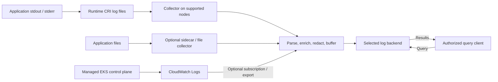

# Logging

> **最終更新**: September 13, 2026

Logging は、アプリケーションの挙動、インフラストラクチャのイベント、監査証跡を結び付けます。
イベントスキーマ、収集の所有責任、配信失敗時の動作、アクセス、
保持、クエリを一体として設計してください。collector や backend の選択だけでは、
完全な記録、tenant 分離、または規制準拠は保証されません。

## Logging の基礎

### 構造化レコードにもパースが必要

JSON はフィールドを明示的にし、検証・検索を容易にしますが、それでもデコード、
timestamp/type のマッピング、container-runtime のフレーミングの正しい処理が必要です。JSON は
プレーンテキストより大きくなる可能性があり、機密データを自動的に削除するものでもありません。
テスト済みの複数行形式が必要な場合を除き、1 行につき 1 イベントを出力してください。

この合成例は、現在のインシデントに関する主張ではなく形式の例示として、
元の 2025 年の timestamp を保持しています:

```json
{
  "timestamp": "2025-02-15T10:23:45.123Z",
  "level": "ERROR",
  "message": "Database connection timed out",
  "service": "example-api",
  "operation": "database.connect",
  "timeout_ms": 30000,
  "trace_id": "4bf92f3577b34da6a3ce929d0e0e4736",
  "span_id": "00f067aa0ba902b7"
}
```

可読性のために展開した JSON を示しています。行指向の producer は、
改行文字を含むメッセージも含め、次のようにエンコードできます:

```python
import json


def encode_log(record):
    # JSON escapes embedded newlines; append exactly one record delimiter.
    return json.dumps(record, ensure_ascii=False, separators=(",", ":")) + "\n"
```

これらはアプリケーションのフィールド規約であり、OTLP wire schema ではありません。
collector/backend のマッピングを、該当する場合は OpenTelemetry の Timestamp、SeverityText/SeverityNumber、
Body、Resource、Attributes、および trace context に設定してください。

Trace ID は 16-byte の値（この表現では 32 桁の 16 進文字）です。
span ID は 8 bytes（16 桁の 16 進文字）です。すべてゼロの ID は無効です。ログごとに新しい無関係な ID ではなく、
実際にアクティブな context を付与してください。span を持たない startup/system レコードでは trace context を省略できます。
このフィールドは、すべての JSON log で必須ではありません。正しい ID だけでは span は作成されず、
service 間の相関も保証されません。

実際に必要な business/context フィールドを収集してください。生の
session token、password、customer data、IP、request body を普遍的なデフォルトフィールドとして推奨しないでください。
identity を含む audit data には正当な目的があるかもしれませんが、
定義済みのアクセス/保持/redaction ポリシーが必要です。アプリケーション JSON に任意の tenant/namespace を
名乗らせるのではなく、routing には信頼できる collector metadata を優先してください。

### Severity は普遍的な 0–5 スケールではない

framework ごとに名前と数値 level は異なります。その意味を明示的にマッピングしてください。
OpenTelemetry log model では、範囲は次のとおりです:

| Severity | SeverityNumber |
| --- | --- |
| TRACE | 1–4 |
| DEBUG | 5–8 |
| INFO | 9–12 |
| WARN | 13–16 |
| ERROR | 17–20 |
| FATAL | 21–24 |

この model ではゼロは未指定の severity を表します。ERROR が常に
recoverable であるとは限らず、label だけで retry/recovery policy は決まりません。
INFO は多くの場合、production operation の出発点です。audit/security event と
一時的に有効化する debugging には、それぞれ固有の要件が必要です。volume を減らすためだけにすべてを
WARN に上げると、必要な証跡を失う可能性があります。

## 収集と処理

以下の layers は必ずしも別プロセスではなく、責務を示します。
宛先は意図的に選択します。すべての record をすべての backend にコピーする要件ではありません。
managed EKS control-plane record は、worker-node log file ではなく CloudWatch を経由して取り込まれます。



| Pattern | 適切な用途と制限 |
| --- | --- |
| stdout/stderr + node collector | 一般的な Linux worker-node path。runtime file と collector permission も重要 |
| File + sidecar | legacy/file-only application または application 固有の処理。shared volume、startup/shutdown、overhead に注意が必要 |
| Application/SDK push | 構造化 event を直接送信可能。buffering、authentication、failure behavior が application に影響する |
| Managed platform router | 例: EKS Fargate の組み込み log router。サポートされる configuration model を使用する |

DaemonSet は、selector、affinity、toleration、
OS、rollout behavior に従って eligible node にスケジュールされます。
これは、すべての node に正常な collector があることや、すべての container が含まれることを証明するものではありません。
複数の collector/rolling overlap により収集が重複する可能性があります。
sidecar は自動的に強力な multi-tenant security boundary にはなりません。

### デフォルトの Linux log path と lifecycle

一般的なデフォルト layout は次のとおりです:

```text
Runtime log files:
  /var/log/pods/<namespace>_<pod>_<uid>/<container>/0.log

Compatibility symlinks pointing to those files:
  /var/log/containers/<pod>_<namespace>_<container>-<container-id>.log
```

Kubelet は runtime の CRI log path を指定し、rotation を管理します。`podLogsDir` により
デフォルト path が変更されることがあり、OS/runtime 固有の layout も異なります。すべての containerd workload に
Docker 専用 mount を追加するのではなく、実際の deployment を確認してください。
`kubectl logs` は現在の log file を公開します。保持されている場合、`--previous` は前の
container instance にアクセスできます。これは過去の log archive ではありません。

rotation は local file の範囲を制限しますが、central retention や backup を実装するものではありません。
node の消失、eviction、削除により、収集前に record が失われる可能性があります。sidecar の
`emptyDir` は同じ pod 内での container restart では存続しますが、pod 削除では存続しません。
collector の offset database、queue、persistent storage は output acknowledgment/retry と合わせて設計する必要があります。
buffering には上限があり、retry により record が重複する可能性があります。
failure 時の loss/duplicate、backlog、storage exhaustion、recovery を測定してください。

record ごとに primary route を選択してください。record を forward しつつ
stdout にも書き出す sidecar は、node collector path と重複する可能性があります。
collector output を再帰的に収集したり、同じ subscription 済み source log group に forward したりしないでください。

### Fluent Bit 処理フラグメント

以下は **classic Fluent Bit configuration** であり、YAML ではありません。これは
filter のみを例示しています。実際の input、CRI/multiline parser、tag format、
RBAC/cache access、storage、output は別途提供して検証してください。

```text
# Fluent Bit classic-format FILTER fragment, not YAML or a complete pipeline.
# Requires matching tail input tags and CRI/Docker parsing.
[FILTER]
    Name               kubernetes
    Match              kube.*
    Kube_Tag_Prefix     kube.var.log.containers.
    Merge_Log          On
    Merge_Log_Key      app
    Keep_Log           On
    K8S-Logging.Parser  Off
    Labels             Off
    Annotations        Off

[FILTER]
    Name               modify
    Match              kube.*
    Set                cluster_name example-cluster
    Set                environment demo
```

`Merge_Log_Key app` は、パースされた application field を collector metadata と分離して保持します。
`Set` は選択した信頼できる cluster/environment value を置き換えます。`Add` では
既に存在する value は変更されません。workload により選択される parser/annotation は、
このフラグメントでは暗黙に信頼されません。`Kube_Tag_Prefix` を実際の input tag に一致させてください。

`Keep_Log On` では、redaction は元の log とパース済み copy の両方を考慮する必要があります。
テスト済みの policy の下でのみ raw copy を削除してください。`HealthCheck` を含むすべての行を
削除しないでください。失敗した health check は、必要な証跡である可能性があります。
application format と failure case を確認した後に、明確に定義された routine event のみを filter してください。

この概要では、不完全な `latest`-image DaemonSet を完全な installation として提示していません。
実際の collector には、pinned image、実際の configuration、
service account/RBAC、正しい mount、permission、resource が必要です。
deployment の詳細については [collector chapter](05-collectors.md) を参照し、選択した
platform/backend configuration を検証してください。

## EKS logging path

### Control-plane log

EKS は `api`、`audit`、`authenticator`、`controllerManager`、`scheduler` の
record を account 内の CloudWatch Logs に直接送信できます。これらは異なる目的に使用されます:
API diagnostics、audit event、IAM authentication diagnostics、controller と
scheduler diagnostics。operation/security requirement に必要な type を選択してください。

この request を `control-plane-logging.json` として保存します:

```json
{
  "clusterLogging": [
    {
      "types": [
        "api",
        "audit",
        "authenticator",
        "controllerManager",
        "scheduler"
      ],
      "enabled": true
    }
  ]
}
```
```bash
export AWS_REGION=ap-northeast-2
export CLUSTER_NAME=my-cluster

# Inspect the existing configuration before choosing a change.
aws eks describe-cluster --name "$CLUSTER_NAME" --region "$AWS_REGION" \
  --query 'cluster.logging'

# This changes the cluster logging configuration and can incur log charges.
aws eks update-cluster-config --name "$CLUSTER_NAME" --region "$AWS_REGION" \
  --logging file://control-plane-logging.json

# Use the actual update ID from the response, then inspect status/errors.
: "${UPDATE_ID:?Set the returned update ID}"
aws eks describe-update --name "$CLUSTER_NAME" --region "$AWS_REGION" \
  --update-id "$UPDATE_ID"
```

logging update は非同期です。EKS は、update に subnet ごと最大 5 個の利用可能な IP address が必要であると
文書化しています。update status、出力された stream、log-group の retention/permission を検証してください。
delivery は best effort で、通常は数分以内です。type を有効化しても、過去のすべての event が backfill されるわけではありません。

audit event は audit policy とその level/stage/exclusion に従います。これらは、
すべての request/body が記録されたことを証明するものではなく、`audit` を有効化するだけで
compliance が確立されるわけでもありません。node DaemonSet は managed control-plane host を読み取りません。
CloudWatch record を他の場所に forward することは、encoding、IAM、delivery、duplicate-handling requirement を持つ
別の subscription/export path です。

### Fargate と Container Insights

EKS Fargate は、`aws-observability` namespace 内の `aws-logging` により設定される
managed Fluent Bit-based router を提供します。文書化された 5,300-character limit と
supported-section/plugin restriction があります。通常の host DaemonSet はそこに install しません。
宛先 permission を設定し、新しい workload log をテストしてください。
Auto Mode/mixed/Windows environment にも、サポートされた collection path が必要です。

namespace には `aws-observability: enabled` label が必要です。文書どおりに Fargate pod execution role に
宛先 permission を付与してください。ConfigMap の変更は既存の pod ではなく、新しい pod に適用されます。
制御された rollout を計画し、delivery を検証してください。


CloudWatch Agent の `logs.metrics_collected.kubernetes` は Container Insights の
performance data を出力します。それだけでは application stdout/stderr log の収集にはなりません。
Fluent Bit または設定済みの OTel log path が application log を別途処理します。
実際の workload/Operator が消費しない限り、ConfigMap は効果を持ちません。
この model と configuration の境界については、レビュー済みの [CloudWatch guide](../metrics/04-cloudwatch-metrics.md) を
参照してください。

## Storage、retention、cost の決定

| Backend | 設計上の質問 |
| --- | --- |
| Loki | LogQL、label-indexed stream/chunk、サポートされる metadata/filter path。label、tenancy/authentication、storage、query capacity を選択する |
| OpenSearch | Search/aggregation API と mapping/index lifecycle。self-managed、managed domain、UltraWarm、Serverless を区別する |
| CloudWatch Logs | managed log group、IAM、retention、Logs Insights QL/SQL/PPL。feature は log class と Region により異なる |
| ClickHouse | column-oriented SQL analytics、schema/order/partition/TTL の選択、および選択する self-managed または cloud storage model |

OpenSearch は常に「S3 snapshot のみ」ではありません。UltraWarm は S3 と caching を使用し、
Serverless は storage と compute を分離します。CloudWatch は user-configured S3 log backend ではありませんが、
個別の export/delivery/integration path をサポートします。product の tenant identifier や sidecar は、
authenticated routing と backend access control の代わりにはなりません。

full-text filtering、indexing、query latency は別の問題です。
代表的な volume、query predicate、concurrency、cold data、recovery をテストしてください。
測定済みの dataset/configuration がないまま、無条件の「優れている/限定的」という評価、
「schemaless は schema がない」という主張、または compression ratio を避けてください。

### Retention には実際の record に対する policy が必要

`financial` を 7 年、`healthcare` を 6 年、または一般 log を 1 年という、普遍的な法的ルールとして扱わないでください。
適用される record category、jurisdiction、contractual requirement、legal hold、
承認済み owner policy を判断してください。hot/warm/cold tier は operation 上の選択であり、
これらの義務を満たした証拠ではありません。replica、object version、backup、export を削除/access plan に含め、
restoration を個別にテストしてください。

### 同等の条件で cost を比較する

以前の 2025 年の table は、GB あたりの storage price と ingestion price を混在させ、self-managed の
query を無料と呼んでいました。後の 100-GB estimate には、再現可能な Region、hour、
retention、capacity、workload の基準がありませんでした。これらは例示的な estimate であり、production measurement ではありません。
date または 1 つの price だけを変更しても修正にはなりません。

ingestion、保持/圧縮済み byte と index overhead、replica、compute、
query scan/capacity、storage request、network transfer、backup、operation work を比較してください。
object-store price は 1 項にすぎません。per-query service charge がなくても、
query は provisioned CPU/memory/I/O を消費します。Loki と S3 が必ず cost 面で有利とは限らず、
名前付き backend が自動的に compliance に適しているわけでもありません。

1. 必要な query、freshness、retention、access、recovery objective を定義する。
2. それらの requirement を満たす deployment model を絞り込む。
3. 代表的な data/query と failure/recovery case を再現する。
4. 完全な cost と operation ownership を比較する。
5. 残る assumption を記録し、production で使用する前に検証する。

## 次の手順と validation scope

Promtail は **2026-03-02** に end of life に達しました。新規作業には Alloy または別のサポート対象 client を使用し、
既存の Promtail deployment の migration を計画してください。引用した notice は `lambda-promtail` を明示的に別扱いにしています。
retirement の主張を拡大解釈しないでください。

- [Loki](01-loki.md)
- [OpenSearch](02-opensearch.md)
- [CloudWatch Logs](03-cloudwatch-logs.md)
- [ClickHouse](04-clickhouse.md)
- [Collectors: Fluent Bit、Alloy、OpenTelemetry](05-collectors.md)

この audit では、source fact、example serialization/ID、request/configuration の
structure を確認しました。EKS logging の変更、collector deployment、tenant/storage provisioning、
legal determination、production cost measurement、delivery/recovery test は実行していません。

## 参考文献

- [Kubernetes logging architecture](https://kubernetes.io/docs/concepts/cluster-administration/logging/)
- [Kubelet legacy log symlinks](https://github.com/kubernetes/kubernetes/blob/v1.36.2/pkg/kubelet/kuberuntime/legacy.go)
- [DaemonSet behavior](https://kubernetes.io/docs/concepts/workloads/controllers/daemonset/)
- [Kubernetes audit policy](https://kubernetes.io/docs/tasks/debug/debug-cluster/audit/)
- [OpenTelemetry logs data model](https://opentelemetry.io/docs/specs/otel/logs/data-model/)
- [W3C Trace Context](https://www.w3.org/TR/trace-context/)
- [EKS control-plane logging](https://docs.aws.amazon.com/eks/latest/userguide/control-plane-logs.html)
- [EKS Fargate log router](https://docs.aws.amazon.com/eks/latest/userguide/fargate-logging.html)
- [Fluent Bit Kubernetes filter source documentation](https://github.com/fluent/fluent-bit-docs/blob/master/pipeline/filters/kubernetes.md)
- [Fluent Bit modify filter](https://github.com/fluent/fluent-bit-docs/blob/master/pipeline/filters/modify.md)
- [Loki architecture](https://grafana.com/docs/loki/latest/get-started/overview/)
- [Promtail end of life](https://grafana.com/docs/loki/latest/send-data/promtail/)
- [OpenSearch UltraWarm](https://docs.aws.amazon.com/opensearch-service/latest/developerguide/ultrawarm.html)
- [OpenSearch Serverless](https://docs.aws.amazon.com/opensearch-service/latest/developerguide/serverless-overview.html)
- [CloudWatch Logs query languages](https://docs.aws.amazon.com/AmazonCloudWatch/latest/logs/AnalyzingLogData.html)
- [CloudWatch log classes](https://docs.aws.amazon.com/AmazonCloudWatch/latest/logs/CloudWatch_Logs_Log_Classes.html)
- [ClickHouse overview](https://github.com/ClickHouse/ClickHouse)

[Quiz](../../quizzes/observability/logging/README-quiz.md)
