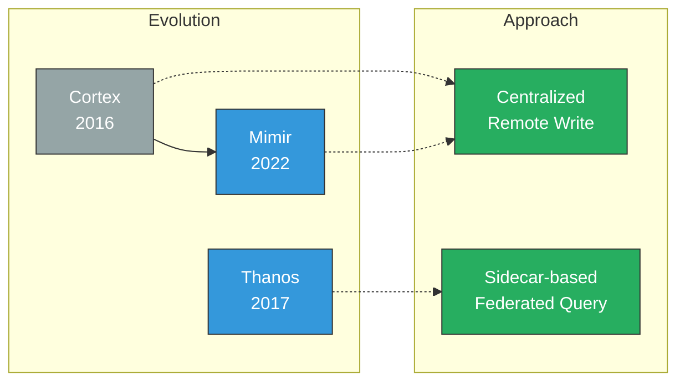
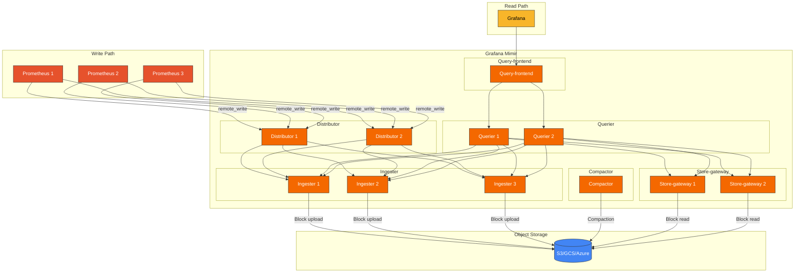
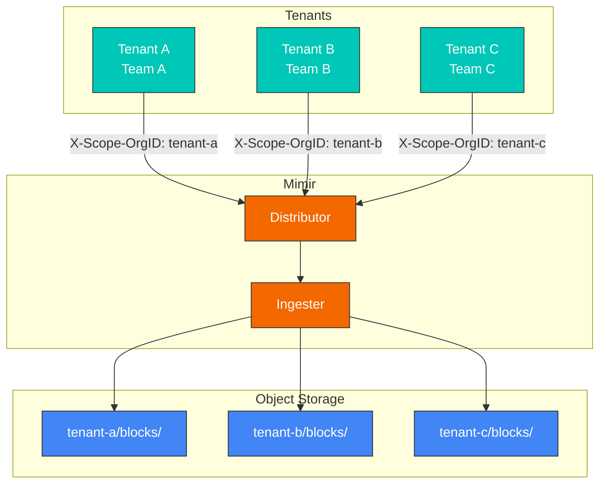
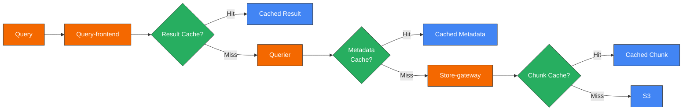
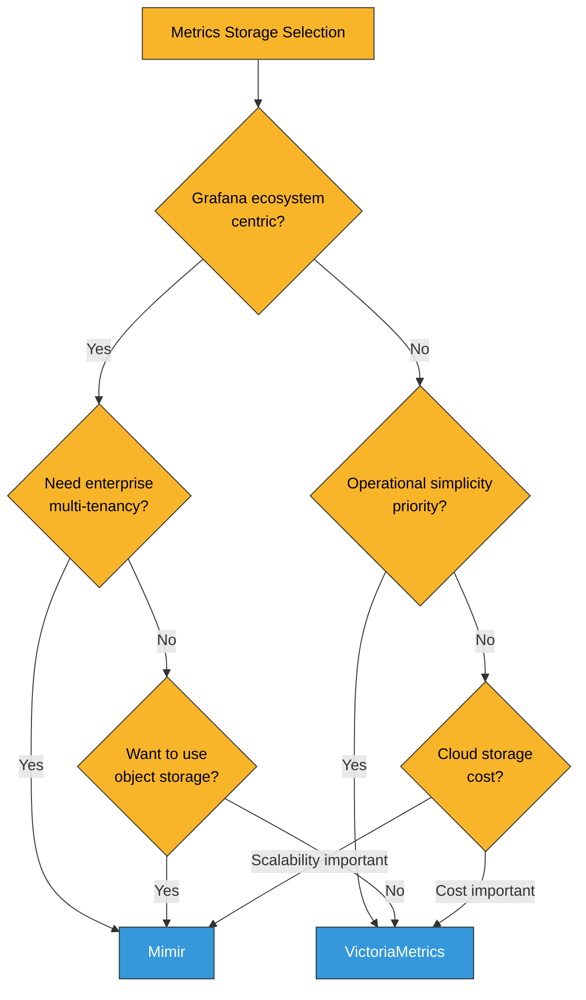

# Grafana Mimir

> **サポート対象バージョン**: Mimir 2.x
> **最終更新**: February 20, 2026

## 目次

- [概要](#introduction)
- [アーキテクチャ](#architecture)
- [コアコンポーネント](#core-components)
- [マルチテナンシー](#multi-tenancy)
- [Helm インストール](#helm-installation)
- [S3 バックエンド設定](#s3-backend-configuration)
- [クエリとデータ保持](#query-and-data-retention)
- [VictoriaMetrics との比較](#comparison-with-victoriametrics)
- [パフォーマンスチューニング](#performance-tuning)
- [ベストプラクティス](#best-practices)
- [トラブルシューティング](#troubleshooting)

## 概要

Grafana Mimir は、Grafana Labs が開発したオープンソースの水平スケーリング可能な長期メトリクスストレージです。Prometheus メトリクス向けのエンタープライズグレードストレージとして、オブジェクトストレージを使用してマルチテナンシー、高可用性、無制限のスケーラビリティを提供します。

### 主な機能

| 機能 | 説明 |
|---------|-------------|
| **水平スケーリング** | 数十億のアクティブな時系列までスケーリング可能 |
| **マルチテナンシー** | ネイティブのテナント分離をサポート |
| **高可用性** | コンポーネントレベルのレプリケーションと自動フェイルオーバー |
| **オブジェクトストレージ** | S3、GCS、Azure Blob などをサポート |
| **100% PromQL 互換** | すべての PromQL クエリをサポート |
| **長期保持** | 無制限のデータ保持期間 |
| **Grafana 統合** | Grafana とのネイティブ統合 |

### Mimir vs Cortex vs Thanos

Mimir は Cortex の後継であり、より優れたパフォーマンスと運用性を提供します。



| 項目 | Mimir | Cortex | Thanos |
|------|-------|--------|--------|
| アーキテクチャ | 集中型 | 集中型 | Sidecar ベース |
| 複雑さ | 中 | 高 | 中 |
| クエリパフォーマンス | 高速 | 中 | 中 |
| 運用オーバーヘッド | 低 | 高 | 中 |
| Prometheus の変更 | 不要 | 不要 | Sidecar が必要 |
| マルチテナンシー | ネイティブ | ネイティブ | 限定的 |

## アーキテクチャ

### 全体アーキテクチャ



### データフロー

1. **書き込みパス**:
   - Prometheus は remote_write 経由でメトリクスを送信します
   - Distributor はテナントを検証し、サンプルを分散します
   - Ingester はメモリに保存し、定期的にブロックをアップロードします

2. **読み取りパス**:
   - Query-frontend はクエリを分割してキャッシュします
   - Querier は Ingester（最新データ）と Store-gateway（履歴データ）にクエリを実行します
   - 結果はマージされて返されます

3. **バックグラウンドプロセス**:
   - Compactor は小さなブロックをより大きなブロックにマージします
   - ダウンサンプリングと保持ポリシーを適用します

## コアコンポーネント

### Distributor

書き込みリクエストの最初のエントリポイントであり、テナント検証とサンプル分散を処理します。

```yaml
# Distributor configuration
distributor:
  ring:
    kvstore:
      store: memberlist
  instance_limits:
    max_inflight_push_requests: 30000
    max_ingestion_rate: 100000
```

**役割**:
- テナント ID の検証
- 時系列の検証（ラベル、サンプル値）
- Hash ring ベースの Ingester 分散
- レプリケーションファクターに基づくレプリケーション

### Ingester

時系列データをメモリに保存し、定期的にオブジェクトストレージへアップロードします。

```yaml
# Ingester configuration
ingester:
  ring:
    replication_factor: 3
    kvstore:
      store: memberlist
  instance_limits:
    max_series: 5000000
    max_inflight_push_requests: 30000

blocks_storage:
  tsdb:
    block_ranges_period: [2h]
    retention_period: 24h
    ship_interval: 1m
```

**役割**:
- 時系列データをメモリに保存
- WAL（Write-Ahead Log）を維持
- TSDB ブロックを作成してアップロード
- 最新データのクエリを処理

### Store-gateway

オブジェクトストレージのブロックをキャッシュしてクエリします。

```yaml
# Store-gateway configuration
store_gateway:
  sharding_ring:
    replication_factor: 3
    kvstore:
      store: memberlist

blocks_storage:
  bucket_store:
    sync_interval: 15m
    bucket_index:
      enabled: true
    chunks_cache:
      backend: memcached
      memcached:
        addresses: dns+memcached:11211
    metadata_cache:
      backend: memcached
      memcached:
        addresses: dns+memcached:11211
```

**役割**:
- オブジェクトストレージのブロックインデックスをキャッシュ
- 履歴データのクエリを処理
- ブロックメタデータとチャンクをキャッシュ

### Compactor

ブロックのコンパクションとダウンサンプリングを実行します。

```yaml
# Compactor configuration
compactor:
  data_dir: /data/compactor
  sharding_ring:
    kvstore:
      store: memberlist
  compaction_interval: 1h
  block_ranges: [2h, 12h, 24h]
  deletion_delay: 12h
```

**役割**:
- 小さなブロックをより大きなブロックにマージ
- 重複データを削除
- 保持ポリシーに基づいてデータを削除
- ブロックインデックスを最適化

### Querier

Ingester と Store-gateway のデータをクエリしてマージします。

```yaml
# Querier configuration
querier:
  max_concurrent: 20
  timeout: 2m
  query_ingesters_within: 13h
```

**役割**:
- PromQL クエリを実行
- Ingester/Store-gateway へ並列クエリ
- 結果をマージして重複排除

### Query-frontend

クエリの最適化とキャッシュを処理します。

```yaml
# Query-frontend configuration
query_frontend:
  align_querier_with_step: true
  cache_results: true
  results_cache:
    backend: memcached
    memcached:
      addresses: dns+memcached:11211
      timeout: 500ms
  split_queries_by_interval: 24h
  max_retries: 5
```

**役割**:
- 大規模なクエリを分割
- 結果をキャッシュ
- クエリキューを管理
- リトライを処理

## マルチテナンシー

Mimir はネイティブのマルチテナンシーをサポートしており、複数のチームや組織のメトリクスを分離できます。

### テナント設定

```yaml
# Add tenant header to Prometheus remote_write
remote_write:
  - url: http://mimir:8080/api/v1/push
    headers:
      X-Scope-OrgID: tenant-1

# Or identify tenant via basic auth
remote_write:
  - url: http://mimir:8080/api/v1/push
    basic_auth:
      username: tenant-1
      password: secret
```

### テナントごとの制限

```yaml
# Mimir configuration
limits:
  # Default limits (all tenants)
  ingestion_rate: 100000
  ingestion_burst_size: 200000
  max_global_series_per_user: 5000000
  max_global_series_per_metric: 50000
  max_label_names_per_series: 30
  max_label_value_length: 2048

# Per-tenant overrides
overrides:
  tenant-1:
    ingestion_rate: 200000
    max_global_series_per_user: 10000000
  tenant-2:
    ingestion_rate: 50000
    max_global_series_per_user: 1000000
```

### テナント分離



## Helm インストール

### mimir-distributed をインストール

```bash
# Add Helm repository
helm repo add grafana https://grafana.github.io/helm-charts
helm repo update

# Install
helm install mimir grafana/mimir-distributed \
  --namespace monitoring \
  --create-namespace \
  -f values.yaml
```

### values.yaml

```yaml
# Global configuration
global:
  # Object storage configuration
  extraEnvFrom:
    - secretRef:
        name: mimir-s3-credentials

# Distributor
distributor:
  replicas: 3
  resources:
    requests:
      cpu: 100m
      memory: 512Mi
    limits:
      cpu: 1000m
      memory: 2Gi

# Ingester
ingester:
  replicas: 3
  persistentVolume:
    enabled: true
    storageClass: gp3
    size: 50Gi
  resources:
    requests:
      cpu: 500m
      memory: 2Gi
    limits:
      cpu: 2000m
      memory: 8Gi
  zoneAwareReplication:
    enabled: true
    zones:
      - name: zone-a
        nodeSelector:
          topology.kubernetes.io/zone: ap-northeast-2a
      - name: zone-b
        nodeSelector:
          topology.kubernetes.io/zone: ap-northeast-2b
      - name: zone-c
        nodeSelector:
          topology.kubernetes.io/zone: ap-northeast-2c

# Store-gateway
store_gateway:
  replicas: 3
  persistentVolume:
    enabled: true
    storageClass: gp3
    size: 20Gi
  resources:
    requests:
      cpu: 200m
      memory: 1Gi
    limits:
      cpu: 1000m
      memory: 4Gi

# Compactor
compactor:
  replicas: 1
  persistentVolume:
    enabled: true
    storageClass: gp3
    size: 50Gi
  resources:
    requests:
      cpu: 500m
      memory: 2Gi
    limits:
      cpu: 2000m
      memory: 8Gi

# Querier
querier:
  replicas: 3
  resources:
    requests:
      cpu: 200m
      memory: 512Mi
    limits:
      cpu: 1000m
      memory: 2Gi

# Query-frontend
query_frontend:
  replicas: 2
  resources:
    requests:
      cpu: 100m
      memory: 256Mi
    limits:
      cpu: 500m
      memory: 1Gi

# Query-scheduler (optional)
query_scheduler:
  enabled: true
  replicas: 2

# Ruler (optional)
ruler:
  enabled: true
  replicas: 2

# Alertmanager (optional, Mimir built-in)
alertmanager:
  enabled: false

# Cache configuration
memcached:
  enabled: true

memcached-queries:
  enabled: true
  replicas: 2

memcached-metadata:
  enabled: true
  replicas: 2

# Minio (for testing, use S3 in production)
minio:
  enabled: false

# Structured configuration
mimir:
  structuredConfig:
    common:
      storage:
        backend: s3
        s3:
          endpoint: s3.ap-northeast-2.amazonaws.com
          region: ap-northeast-2
          bucket_name: my-mimir-bucket

    limits:
      ingestion_rate: 100000
      ingestion_burst_size: 200000
      max_global_series_per_user: 5000000
      compactor_blocks_retention_period: 365d

    blocks_storage:
      tsdb:
        dir: /data/tsdb
      bucket_store:
        sync_dir: /data/tsdb-sync

    compactor:
      data_dir: /data/compactor
```

## S3 バックエンド設定

### IRSA のセットアップ

```bash
# Check OIDC provider
aws eks describe-cluster --name my-cluster --query "cluster.identity.oidc.issuer" --output text

# Create IAM policy
cat <<EOF > mimir-s3-policy.json
{
    "Version": "2012-10-17",
    "Statement": [
        {
            "Effect": "Allow",
            "Action": [
                "s3:PutObject",
                "s3:GetObject",
                "s3:DeleteObject",
                "s3:ListBucket"
            ],
            "Resource": [
                "arn:aws:s3:::my-mimir-bucket",
                "arn:aws:s3:::my-mimir-bucket/*"
            ]
        }
    ]
}
EOF

aws iam create-policy \
  --policy-name MimirS3Policy \
  --policy-document file://mimir-s3-policy.json

# Create service account
eksctl create iamserviceaccount \
  --name mimir \
  --namespace monitoring \
  --cluster my-cluster \
  --attach-policy-arn arn:aws:iam::123456789012:policy/MimirS3Policy \
  --approve
```

### S3 バケット設定

```yaml
# Mimir S3 configuration
mimir:
  structuredConfig:
    common:
      storage:
        backend: s3
        s3:
          endpoint: s3.ap-northeast-2.amazonaws.com
          region: ap-northeast-2
          bucket_name: my-mimir-bucket
          # access_key and secret_key not needed with IRSA

    blocks_storage:
      s3:
        bucket_name: my-mimir-bucket

    ruler_storage:
      s3:
        bucket_name: my-mimir-bucket

    alertmanager_storage:
      s3:
        bucket_name: my-mimir-bucket
```

### S3 バケットライフサイクルポリシー

```json
{
  "Rules": [
    {
      "ID": "CleanupIncompleteMultipartUploads",
      "Status": "Enabled",
      "Filter": {},
      "AbortIncompleteMultipartUpload": {
        "DaysAfterInitiation": 7
      }
    },
    {
      "ID": "TransitionToIA",
      "Status": "Enabled",
      "Filter": {
        "Prefix": "blocks/"
      },
      "Transitions": [
        {
          "Days": 90,
          "StorageClass": "STANDARD_IA"
        }
      ]
    }
  ]
}
```

## クエリとデータ保持

### 保持ポリシー設定

```yaml
mimir:
  structuredConfig:
    limits:
      # Block retention period
      compactor_blocks_retention_period: 365d

    compactor:
      # Deletion delay (recovery time for mistakes)
      deletion_delay: 12h
```

### クエリ最適化設定

```yaml
mimir:
  structuredConfig:
    query_frontend:
      # Query splitting
      split_queries_by_interval: 24h
      # Query step alignment
      align_querier_with_step: true
      # Result caching
      cache_results: true
      results_cache:
        backend: memcached
        memcached:
          addresses: dns+memcached:11211
          timeout: 500ms

    querier:
      # Concurrent queries
      max_concurrent: 20
      # Query timeout
      timeout: 2m
      # Ingester query range
      query_ingesters_within: 13h

    limits:
      # Maximum samples per query
      max_fetched_samples_per_query: 50000000
      # Query range limit
      max_query_length: 30d
      # Maximum query parallelism
      max_query_parallelism: 32
```

### クエリキャッシュ戦略



## VictoriaMetrics との比較

### 詳細比較

| 項目 | Grafana Mimir | VictoriaMetrics |
|------|---------------|-----------------|
| **ライセンス** | AGPL v3 | Apache 2.0 |
| **アーキテクチャ** | マイクロサービス | モノリシック/クラスター |
| **ストレージ** | オブジェクトストレージが必要 | ローカルディスクも可能 |
| **運用の複雑さ** | 高 | 低～中 |
| **クエリ言語** | PromQL | MetricsQL（スーパーセット） |
| **マルチテナンシー** | ネイティブ | サポート |
| **圧縮** | 良好 | 非常に良好 |
| **メモリ効率** | 中 | 高 |
| **コミュニティ** | Grafana Labs | 活発なオープンソース |
| **商用サポート** | Grafana Cloud | VictoriaMetrics Inc. |

### 選定基準



**Mimir を選ぶ場合**:
- Grafana Cloud または Grafana エコシステムを使用している
- エンタープライズグレードのマルチテナンシーが必要
- オブジェクトストレージを活用したい
- 複雑な運用環境を管理できる

**VictoriaMetrics を選ぶ場合**:
- シンプルな運用環境を好む
- ローカルディスクベースのストレージを好む
- 最大の圧縮率とパフォーマンスが重要
- コスト効率を優先する

## パフォーマンスチューニング

### Ingester チューニング

```yaml
ingester:
  ring:
    replication_factor: 3
  instance_limits:
    max_series: 5000000
    max_inflight_push_requests: 30000

blocks_storage:
  tsdb:
    block_ranges_period: [2h]
    retention_period: 24h
    head_compaction_interval: 15m
    head_compaction_concurrency: 4
    wal_compression_enabled: true
```

### Store-gateway チューニング

```yaml
blocks_storage:
  bucket_store:
    sync_interval: 15m
    max_chunk_pool_bytes: 2147483648  # 2GB
    chunk_pool_min_bucket_size_bytes: 16384
    chunk_pool_max_bucket_size_bytes: 524288

    index_cache:
      backend: memcached
      memcached:
        addresses: dns+memcached:11211
        max_item_size: 5242880  # 5MB
        timeout: 450ms

    chunks_cache:
      backend: memcached
      memcached:
        addresses: dns+memcached:11211
        max_item_size: 1048576  # 1MB
        timeout: 450ms
```

### クエリチューニング

```yaml
query_frontend:
  parallelize_shardable_queries: true
  split_queries_by_interval: 24h
  max_retries: 5

  query_sharding:
    enabled: true
    total_shards: 16

querier:
  max_concurrent: 20
  timeout: 2m
```

## ベストプラクティス

### 本番環境チェックリスト

1. **高可用性**
   - Ingester: 最低 3、ゾーン認識レプリケーション
   - Store-gateway: 最低 2
   - Distributor: 最低 2
   - Query-frontend: 最低 2

2. **キャッシュ**
   - 結果キャッシュ: memcached
   - メタデータキャッシュ: memcached
   - チャンクキャッシュ: memcached

3. **モニタリング**
   ```promql
   # Mimir self metrics
   cortex_ingester_active_series
   cortex_distributor_received_samples_total
   cortex_querier_request_duration_seconds
   cortex_compactor_runs_completed_total
   ```

4. **アラートルール**
   ```yaml
   groups:
   - name: mimir
     rules:
     - alert: MimirIngesterUnhealthy
       expr: cortex_ring_members{state="Unhealthy"} > 0
       for: 5m
       labels:
         severity: critical

     - alert: MimirCompactorFailed
       expr: increase(cortex_compactor_runs_failed_total[1h]) > 0
       for: 5m
       labels:
         severity: warning
   ```

### コスト最適化

```yaml
# Use S3 storage classes
blocks_storage:
  s3:
    storage_class: INTELLIGENT_TIERING

# Filter unnecessary metrics
limits:
  drop_labels:
    - pod_template_hash
    - controller_revision_hash

# Downsampling (Enterprise)
compactor:
  downsampling_enabled: true
```

## トラブルシューティング

### よくある問題

#### 1. Ingester OOM

```bash
# Check memory usage
kubectl top pod -l app.kubernetes.io/component=ingester -n monitoring

# Solution: Adjust time series limit
ingester:
  instance_limits:
    max_series: 3000000  # Reduce
```

#### 2. クエリタイムアウト

```bash
# Check slow queries
curl http://query-frontend:8080/api/v1/status/buildinfo

# Solution: Query splitting and parallelization
query_frontend:
  split_queries_by_interval: 12h  # Smaller
  query_sharding:
    total_shards: 32  # Increase
```

#### 3. Compactor の遅延

```bash
# Check Compactor status
curl http://compactor:8080/compactor/ring

# Solution: Increase resources
compactor:
  resources:
    limits:
      cpu: 4000m
      memory: 16Gi
```

### デバッグコマンド

```bash
# Check component status
curl http://distributor:8080/distributor/all_user_stats
curl http://ingester:8080/ingester/ring
curl http://store-gateway:8080/store-gateway/ring
curl http://compactor:8080/compactor/ring

# Check metrics
curl http://distributor:8080/metrics | grep cortex_
curl http://ingester:8080/metrics | grep cortex_

# Check configuration
curl http://distributor:8080/config
```

## 参考資料

- [Grafana Mimir 公式ドキュメント](https://grafana.com/docs/mimir/latest/)
- [Mimir GitHub](https://github.com/grafana/mimir)
- [mimir-distributed Helm Chart](https://github.com/grafana/mimir/tree/main/operations/helm/charts/mimir-distributed)
- [Mimir アーキテクチャ](https://grafana.com/docs/mimir/latest/references/architecture/)

## クイズ

この章の理解度を確認するには、[Grafana Mimir クイズ](../../quizzes/observability/metrics/03-mimir-quiz.md)に挑戦してください。
