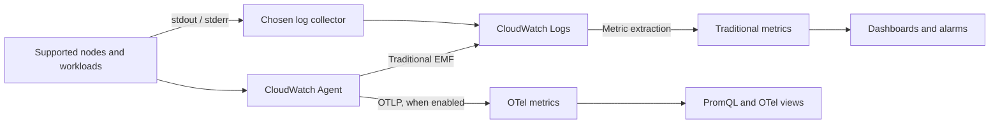

# CloudWatch Metrics

> **最終更新**: September 13, 2026
> Helm の例: amazon-cloudwatch-observability 6.6.0。
> 以下に記載する 4 月/7 月の過去のアナウンスは、実際の日付をそのまま保持しています。

## 概要

CloudWatch はストレージ、クエリ、ダッシュボード、アラームを管理します。それでもチームは
コレクター、ワークロード ID、ネットワークアクセス、カーディナリティ、保持期間、対応の
オーナーシップを設定する必要があります。マネージドバックエンドを使っても、これらの運用責任は
なくなりません。

| トピック | CloudWatch | セルフマネージドの Prometheus / VictoriaMetrics |
| --- | --- | --- |
| バックエンド | AWS マネージドサービス。機能や Region の提供状況は異なる | キャパシティ、ストレージ、アップグレード、復旧を自分で運用 |
| 収集 | AWS サービスメトリクスに加えて、設定したエージェント/SDK/OTLP | Exporter、エージェント、スクレイピング、remote write |
| クエリ | Metric Math、Metrics Insights。OTel メトリクスには PromQL | PromQL / MetricsQL |
| コスト | メトリクス/観測数または OTLP 取り込みモデル、ログ、クエリ、アラーム | コンピュート/ストレージ/ネットワークに加えて運用コスト |
| プラットフォーム | AWS およびサポートされるハイブリッド/マルチクラウド収集 | クラウド中立なデプロイの選択肢 |
| 保持期間 | メトリクスモデルと解像度に依存。ログは別の保持期間を持つ | 設定したストレージ/保持ポリシー |

## Container Insights: メトリクスモデルを選択する

CloudWatch Observability EKS アドオンと Helm チャートは、Operator と収集コンポーネントを
設定します。従来型の Container Insights はパフォーマンスログイベントとそこから抽出された
CloudWatch メトリクスを使用します。OTel ベースの Container Insights は OpenTelemetry
メトリクスを送信し、PromQL を利用できます。これらは命名、ディメンション、課金のモデルが
異なる別個のものです。

| 従来型の `ContainerInsights` メトリクス | 意味とディメンションセットの例 |
| --- | --- |
| `cluster_node_count` | Node 数。`ClusterName` |
| `cluster_failed_node_count` | 障害状態にある Node 数。`ClusterName`。`NotReady` に限定されない |
| `node_cpu_utilization`, `node_memory_utilization` | Node の使用率。`ClusterName`、または `NodeName,ClusterName,InstanceId` |
| `node_network_total_bytes` | **バイト/秒** 単位のネットワークスループット。累積バイトカウンターではない |
| `namespace_number_of_running_pods` | Pod 数。`Namespace,ClusterName` |
| `pod_cpu_utilization`, `pod_memory_utilization` | **Node** の上限に対する Pod の使用量。Pod の上限に対する比率にはドキュメント化された `_over_pod_limit` メトリクスを使用する |
| `pod_number_of_container_restarts` | Pod 内の再起動の合計。`PodName,Namespace,ClusterName` |

ドキュメント化されたリストには `cluster_cpu_utilization` や
`cluster_memory_utilization` は含まれていません。`ClusterName` のみを持つ Node メトリクスが
自動的にキャパシティ加重のクラスター使用率の計算になるわけではありません。公開されている
正確なディメンションセットに一致させてください。一部のフィールドはパフォーマンスログにのみ
現れ、拡張メトリクスは `FullPodName` などの追加セットを持ちます。ログのフィールドから
メトリクス名を創作しないでください。ネットワークの受信/送信メトリクスもレートです。単調増加の
バイトカウンターであるかのように `RATE()` を適用するのは避けてください。

次の図は、従来型のメトリクス抽出、オプションの OTLP メトリクス、アプリケーションログを分けて示しています。



### インストールとプラットフォームの範囲

同じコンポーネントに対して、EKS マネージドアドオンまたは Helm 管理のインストールの
いずれかを使用します。切り替える前にオーナーシップを明確にし、両方を無条件に
インストールしないでください。マネージドアドオンの場合は、実際の Kubernetes バージョン、
アーキテクチャ、コンピュートタイプ、Region との互換性を確認します。Helm のバージョンは
EKS の `v…-eksbuild.…` バージョンではありません。

```bash
# Read-only discovery. Use the intended account, Region and cluster.
export AWS_REGION=ap-northeast-2
export CLUSTER_NAME=my-cluster
K8S_VERSION=$(aws eks describe-cluster --name "$CLUSTER_NAME" \
  --region "$AWS_REGION" --query 'cluster.version' --output text)
aws eks describe-addon-versions \
  --addon-name amazon-cloudwatch-observability \
  --kubernetes-version "$K8S_VERSION" --region "$AWS_REGION" \
  --query 'addons[0].addonVersions[].{version:addonVersion,architectures:architecture,computeTypes:computeTypes,compatibilities:compatibilities}'

# Set ADDON_VERSION to the exact compatible version selected above.
: "${ADDON_VERSION:?Select a compatible EKS add-on version}"
aws eks describe-addon-configuration \
  --addon-name amazon-cloudwatch-observability \
  --addon-version "$ADDON_VERSION" --region "$AWS_REGION" \
  --query configurationSchema --output text > addon-schema.json
```

アドオンについてドキュメント化された IAM 権限とワークロード ID は、別途準備してください。
サポートされるバージョンではアドオンのガイドが EKS Pod Identity を推奨しています。これには
Agent と、実際の namespace/service account に対する association が必要です。
IRSA は代替手段で、クラスターの OIDC プロバイダー、信頼ポリシー、service account の
アノテーションが必要です。ローカルでの `aws sts get-caller-identity` は、その呼び出し元を
特定するだけであり、コレクター内部で使われる認証情報を示すものではありません。

このアドオンは Linux および Windows のワーカー Node で Container Insights をサポートし、
Windows のサポートは 1.5.0 以降です。EKS Windows での Application Signals は
サポートされていません。Fargate はこのホストマウント型 DaemonSet を実行しません。
ドキュメント化された収集方法を使用してください。Auto Mode や混在クラスターについては、
選択したアドオンがサポートするコンピュートタイプと収集要件に照らして確認してください。
すべてのプラットフォームで同一のホストメトリクスが得られると約束しないでください。
ワークロード、コレクター、AWS エンドポイントには、対応するネットワーク経路と RBAC も必要です。

以下の Helm の例は **Linux EC2 ワーカー Node** を対象としています。チャート 6.6.0 は
エージェントイメージ `1.300072.0b1766` を宣言しています。公開されているエージェントの
GitHub リリース `v1.300071.0` は別のリリースチャネルです。チャートはバージョンを固定し、
デフォルトイメージをそのまま使用しています。このレビューはチャートのレンダリングであり、
実際の EKS へのデプロイではありません。

```yaml
# cloudwatch-values.yaml: reviewed Helm chart 6.6.0, Linux EC2 example
clusterName: my-cluster
region: ap-northeast-2
containerInsights:
  enabled: true
containerLogs:
  enabled: true
applicationSignals:
  enabled: false
otelContainerInsights:
  enabled: false
  logs:
    enabled: false
```

このチャートでは、CloudWatch エージェントと Fluent Bit がリリース namespace の
`cloudwatch-agent` service account を使用します。テレメトリを期待する前に、その
Pod Identity association を準備してください。IRSA の場合は、その実際の service account に
アノテーションを設定して維持します。チャートのトップレベルの `roleArn` は EKS IRSA の
ショートカットでは **ありません**。生成される CRD、ClusterRole、Secret、ホストマウント、
node selector を確認してください。Operator は `AmazonCloudWatchAgent` カスタムリソースから
エージェントのワークロードを作成します。`helm template` だけではその reconciliation は
実行されません。

チャート 6.6.0 は、この Linux の例であっても、Windows Node 向けに選択される
Windows 専用のエージェント CR を 2 つレンダリングします。Linux 側の
`applicationSignals.enabled: false` の設定では、それらの Windows CR は削除されません。
この例は Linux のみの Node を前提としています。混在クラスターで使用する前に、生成された
Windows の設定を別途確認してください。

```bash
helm repo add aws-observability https://aws-observability.github.io/helm-charts
helm repo update aws-observability
helm template cloudwatch aws-observability/amazon-cloudwatch-observability \
  --version 6.6.0 --namespace amazon-cloudwatch \
  --include-crds --values cloudwatch-values.yaml > cloudwatch-rendered.yaml

# Installation changes the cluster; run only after reviewing ownership and prerequisites.
helm upgrade --install cloudwatch aws-observability/amazon-cloudwatch-observability \
  --version 6.6.0 --namespace amazon-cloudwatch --create-namespace \
  --values cloudwatch-values.yaml
```

`eksctl utils update-cluster-logging` は **EKS コントロールプレーンのログ** を設定します。
CloudWatch Agent をインストールしたり、Container Insights を有効化したりはしません。

### OTel への移行と過去のアナウンス

現行の OTel Container Insights ガイドは、新規開発には OTel の方式を推奨し、従来型の方式は
メンテナンスモードであると説明しています。OTel はデフォルトで無効です。ガイドはアドオン
6.2.0 以降を要求しています。その最小要件だけでなく、実際に互換性のあるアドオンバージョンと
機能の提供状況を確認してください。

レビュー対象のチャートでは、OTel のメトリクスモデルを評価したうえで
`otelContainerInsights.enabled` を有効にしてください。`containerInsights.enabled: true`
を維持すると移行期間中に両方のメトリクス経路を利用できますが、追加の取り込み量/コストを
評価する必要があります。この例では Fluent Bit がログを収集する間、
`otelContainerInsights.logs.enabled: false` を維持しています。収集を二重化するのではなく、
ログのオーナーシップを意図して選択してください。

OTel メトリクスは `container_cpu_usage_seconds_total` などのソース名を保持し、
ソース/リソース/Kubernetes のメタデータから最大 150 個のラベルをサポートします。従来型の
`PutMetricData` メトリクスには 30 ディメンションという別の上限があります。ラベルを増やすと
ペイロードサイズが増加し、メタデータが露出する可能性があります。無料または無制限の
カーディナリティ予算ではありません。アクセラレーターのメトリクスには、依然としてサポートされる
ドライバー/プラグイン/ツールキットが必要です。

**2026-04-02 のプレビューアナウンス** では、バージニア北部、オレゴン、シドニー、
シンガポール、アイルランドが挙げられていました。これは日付付きのローンチ記録であり、
現在の提供状況や料金表の全体ではありません。**2026-07-06 の Service Events のアナウンス**
は、アクティブな Application Signals アプリケーションのエラー、レイテンシー、デプロイの
イベント、サポートされる Java/Python/JavaScript の計装、およびオプションの関数メトリクスに
ついて説明しています。Application Signals は実際に有効化して計装する必要があります。
上記のメトリクスのみの例では有効になっていません。アナウンスの URL に `/06/` が含まれて
いても、7 月という日付を維持してください。

## CloudWatch Agent の設定

### 正しい従来型 Container Insights JSON

Kubernetes のコレクターは **`logs.metrics_collected.kubernetes`** の下に属します。
このフラグメントはその従来型の収集設定を示すものであり、完全な DaemonSet や ID ポリシー、
生成されるアドオン設定すべての代替ではありません。JSON はインラインコメントを許可しません。

```json
{
  "logs": {
    "metrics_collected": {
      "kubernetes": {
        "cluster_name": "my-cluster",
        "metrics_collection_interval": 60,
        "enhanced_container_insights": true
      }
    }
  }
}
```

`metrics.metrics_collected` の下に 2 つ目の Kubernetes コレクターを置かないでください。
Helm チャートでは、カスタムの `agent.config` が生成されたデフォルトを上書きし、
Application Signals、トレース、その他の設定済み収集を削除してしまう可能性があります。
実際にレンダリングされた有効な設定から始め、維持したい機能を保持してください。
実行中のワークロードがマウントしていない ConfigMap を変更しても効果はありません。

チャート/Operator は service account、ディスカバリー用の RBAC、設定のマウント、
ランタイム固有のホストパスを提供します。手書きの DaemonSet にはそれらすべてが必要で、
そのプラットフォームを考慮しなければなりません。Docker ソケット前提のデプロイを
containerd/Fargate/Auto Mode の環境にコピーして、同等の動作を前提にしないでください。
ホストレベルの収集は特権アクセスです。そのワークロードと service account を変更できる
対象を限定してください。

拡張オブザーバビリティはメトリクスとディメンションを追加しますが、予約キャパシティ関連の
メトリクスのいくつかは従来型のリストにすでに存在します。すべての予約/GPU メトリクスを
拡張専用と見なすのではなく、拡張メトリクスのカタログと課金モデルを確認してください。
GPU/EFA/Neuron の収集も、対応するサポート対象の Node ハードウェアとソフトウェアに依存します。

## カスタムメトリクスの収集

### ターゲットの選択とディメンションラベル

ターゲットごとに収集のオーナーを 1 つに絞ってください。CloudWatch Agent の Prometheus 収集、
ADOT/EMF、または適切な OTLP 経路のいずれかです。すべての DaemonSet レプリカから
すべての Pod をスクレイピングすると、サンプル数と料金が倍増する可能性があります。
シングルトンの Deployment はシンプルなオーナーシップモデルの 1 つです。HA/シャーディングには
検討済みの割り当て戦略が必要です。

この例では、`/metrics` 上の `queue_depth` という **gauge**、`metrics` という名前の
Pod コンテナポート、アノテーション `prometheus.io/scrape: "true"`、および namespace
`default` のラベル `app.kubernetes.io/name` を前提としています。ターゲットは到達可能で
認可されている必要があります。実際のエンドポイントに合わせて TLS/認証を追加してください。
この HTTP スクレイプのフラグメントは、公開されたメトリクスサービスではなく、許可された
内部エンドポイントを前提としています。

以下を `prometheus.yaml` として保存します。名前付きポートを選択し、EMF の宣言が必要とする
**3 つすべて** のラベル値を作成します。EMF のディメンションリストは、存在しないラベルを
作成しません。`Service` に使用する Pod ラベルは論理的なサービス識別子であり、Kubernetes の
Service オブジェクトが存在する証明にはなりません。

```yaml
global:
  scrape_interval: 30s
  scrape_timeout: 10s
scrape_configs:
- job_name: my-app
  kubernetes_sd_configs:
  - role: pod
    namespaces:
      names:
      - default
  relabel_configs:
  - source_labels:
    - __meta_kubernetes_pod_annotation_prometheus_io_scrape
    action: keep
    regex: 'true'
  - source_labels:
    - __meta_kubernetes_pod_container_port_name
    action: keep
    regex: metrics
  - source_labels:
    - __meta_kubernetes_namespace
    target_label: Namespace
  - source_labels:
    - __meta_kubernetes_pod_label_app_kubernetes_io_name
    target_label: Service
  - source_labels:
    - Service
    action: keep
    regex: .+
  - target_label: ClusterName
    replacement: my-cluster
  metric_relabel_configs:
  - source_labels:
    - __name__
    action: keep
    regex: queue_depth
```

### CloudWatch Agent の Prometheus 設定

エージェントの JSON と Prometheus の YAML は別々の 2 つのファイルです。前者はエージェントに
設定された入力パスにマウントし、後者は以下で参照している
`/etc/prometheusconfig/prometheus.yaml` の正確なパスにマウントしてください。これは
別途オーナーが管理するコレクターの設定であり、完全なインストール手順ではなく、
すべての Container Insights DaemonSet に貼り付ける上書き設定でもありません。

```json
{
  "logs": {
    "metrics_collected": {
      "prometheus": {
        "cluster_name": "my-cluster",
        "log_group_name": "/aws/containerinsights/my-cluster/prometheus",
        "prometheus_config_path": "/etc/prometheusconfig/prometheus.yaml",
        "emf_processor": {
          "metric_declaration_dedup": true,
          "metric_namespace": "CustomMetrics",
          "metric_unit": {
            "queue_depth": "Count"
          },
          "metric_declaration": [
            {
              "source_labels": [
                "job"
              ],
              "label_matcher": "^my-app$",
              "dimensions": [
                [
                  "ClusterName",
                  "Namespace",
                  "Service"
                ]
              ],
              "metric_selectors": [
                "^queue_depth$"
              ]
            }
          ]
        }
      }
    }
  }
}
```

公式の従来型 Prometheus 統合がドキュメント化しているのは gauge、counter、summary の
サポートであり、Prometheus のヒストグラムの自動取り込みではありません。counter の差分、
最初のサンプル、リセット、summary のフィールドは、それぞれ独自の解釈が必要です。この例では
意図的に gauge を使用しています。`Average`/`Maximum` はキューの深さを表しますが、
スナップショットを合計しても処理済みリクエスト数にはなりません。適切な場合は OTel の方式を
使用し、その実際のヒストグラム/temporality のマッピングを別途確認してください。

### AWS Distro for OpenTelemetry (ADOT)

**EMF の経路** では、`prometheus` receiver と `awsemf` exporter を持つ ADOT コレクターが
次の `config.yaml` を使用できます。レビュー対象の ADOT リリースは `v0.50.0` です。
自分のデプロイに合わせて、そのイメージ/プラットフォームと有効なコンポーネントを確認して
ください。この exporter は EMF ログイベントを送信し、CloudWatch がそれを従来型メトリクスとして
抽出します。これは、最新の CloudWatch/OTLP のあらゆる経路が EMF を使うという主張では
ありません。

```yaml
receivers:
  prometheus:
    config:
      global:
        scrape_interval: 30s
        scrape_timeout: 10s
      scrape_configs:
      - job_name: my-app
        kubernetes_sd_configs:
        - role: pod
          namespaces:
            names:
            - default
        relabel_configs:
        - source_labels:
          - __meta_kubernetes_pod_annotation_prometheus_io_scrape
          action: keep
          regex: 'true'
        - source_labels:
          - __meta_kubernetes_pod_container_port_name
          action: keep
          regex: metrics
        - source_labels:
          - __meta_kubernetes_namespace
          target_label: Namespace
        - source_labels:
          - __meta_kubernetes_pod_label_app_kubernetes_io_name
          target_label: Service
        - source_labels:
          - Service
          action: keep
          regex: .+
        - target_label: ClusterName
          replacement: my-cluster
        metric_relabel_configs:
        - source_labels:
          - __name__
          action: keep
          regex: queue_depth
processors:
  memory_limiter:
    check_interval: 1s
    limit_mib: 384
    spike_limit_mib: 64
  batch:
    timeout: 10s
exporters:
  awsemf:
    region: ap-northeast-2
    namespace: CustomMetrics
    log_group_name: /aws/containerinsights/my-cluster/prometheus
    dimension_rollup_option: NoDimensionRollup
    metric_declarations:
    - dimensions:
      - - ClusterName
        - Namespace
        - Service
      metric_name_selectors:
      - ^queue_depth$
service:
  pipelines:
    metrics:
      receivers:
      - prometheus
      processors:
      - memory_limiter
      - batch
      exporters:
      - awsemf
```

コレクターは、設定のマウントとそのファイルを指す `--config`、意図した
**Standard クラス** の EMF ロググループ/ストリームへの書き込みを許可されたワークロードの
IAM 認証情報、および limiter と整合するメモリ制限を伴って実行する必要があります。さらに
Kubernetes のディスカバリー用 RBAC と、選択したターゲットおよび AWS Logs へのネットワーク
アクセスも必要です。以下の Role はディスカバリー対象の 1 つの namespace にスコープされて
います。まず `amazon-cloudwatch` namespace を作成し、この SA を実際のコレクターに
バインドしてください。

```yaml
apiVersion: v1
kind: ServiceAccount
metadata:
  name: metrics-scraper
  namespace: amazon-cloudwatch
---
apiVersion: rbac.authorization.k8s.io/v1
kind: Role
metadata:
  name: metrics-pod-discovery
  namespace: default
rules:
- apiGroups:
  - ''
  resources:
  - pods
  verbs:
  - get
  - list
  - watch
---
apiVersion: rbac.authorization.k8s.io/v1
kind: RoleBinding
metadata:
  name: metrics-pod-discovery
  namespace: default
roleRef:
  apiGroup: rbac.authorization.k8s.io
  kind: Role
  name: metrics-pod-discovery
subjects:
- kind: ServiceAccount
  name: metrics-scraper
  namespace: amazon-cloudwatch
```

IAM と Kubernetes RBAC は別のものです。コレクターの SA を、専用の Pod Identity ロール
または正しく設定された IRSA ロールに関連付けてください。この RBAC マニフェストでは
ロールは作成されません。ロググループは事前に作成/所有するか、その作成を明示的に
認可してください。レプリカや namespace を増やす場合は、ターゲットのオーナーシップを
見直し、必要なディスカバリー権限だけを拡張してください。これらの設定フラグメントは、
今回の監査ではデプロイもメトリクス送信も行っていません。

### SDK 経由でのカスタムメトリクス送信

これらは再利用可能なヘルパーであり、単独で実行できる実行ファイルではありません。呼び出し側が
意図した Region、ワークロードの認証情報、タイムアウト、リトライポリシーを設定した
boto3/AWS SDK for Go v2 の CloudWatch クライアントを作成し、再利用します。エラーは
その呼び出し側に伝播します。認証情報は埋め込まれていません。Python のタイムスタンプは
タイムゾーン付きの UTC です。値はアプリケーションのレポート間隔におけるカウントです。
累積カウンターとして扱うのではなく、対応する期間について `Sum` でクエリしてください。
`PutMetricData` には冪等性トークンがないため、結果が不確かなリトライはサンプルを重複させる
可能性があります。テレメトリの送信を exactly-once のビジネス台帳として扱わないでください。

```python
from datetime import datetime, timezone


def put_orders_processed(cloudwatch, count):
    """The caller supplies a configured boto3 CloudWatch client."""
    if isinstance(count, bool) or not isinstance(count, int) or count < 0:
        raise ValueError("count must be a non-negative integer")
    return cloudwatch.put_metric_data(
        Namespace="MyApp/Production",
        MetricData=[{
            "MetricName": "OrdersProcessed",
            "Dimensions": [
                {"Name": "Service", "Value": "order-service"},
                {"Name": "Environment", "Value": "production"},
            ],
            "Timestamp": datetime.now(timezone.utc),
            "Value": count,
            "Unit": "Count",
            "StorageResolution": 60,
        }],
    )
```

```go
package metrics

import (
    "context"
    "time"

    "github.com/aws/aws-sdk-go-v2/aws"
    "github.com/aws/aws-sdk-go-v2/service/cloudwatch"
    "github.com/aws/aws-sdk-go-v2/service/cloudwatch/types"
)

func PutOrdersProcessed(ctx context.Context, client *cloudwatch.Client, count uint64) error {
    _, err := client.PutMetricData(ctx, &cloudwatch.PutMetricDataInput{
        Namespace: aws.String("MyApp/Production"),
        MetricData: []types.MetricDatum{{
            MetricName: aws.String("OrdersProcessed"),
            Dimensions: []types.Dimension{
                {Name: aws.String("Service"), Value: aws.String("order-service")},
                {Name: aws.String("Environment"), Value: aws.String("production")},
            },
            Timestamp: aws.Time(time.Now().UTC()),
            Value: aws.Float64(float64(count)),
            Unit: types.StandardUnitCount,
            StorageResolution: aws.Int32(60),
        }},
    })
    return err
}
```

Namespace、メトリクス名、そして **完全なディメンションセット** が従来型メトリクスを
識別します。`Environment` を省略すると別の識別子をクエリすることになります。カスタム
ディメンションが自動的にすべての集計系列を生成するわけではありません。ドキュメント化された
API の上限内でバッチ処理し、`cloudwatch:namespace` の IAM 条件キーで
`cloudwatch:PutMetricData` を意図した namespace に限定してください。

## Metric Math と異常検出

### Metric Math

関連する系列には、同じ期間、同じディメンション、互換性のある単位を使用してください。
ALB のターゲットエラーとリクエストのメトリクスはカウントなので、このウィジェットは
**Sum** を使用します。実際のロードバランサーのディメンション値と、両方のメトリクスが
それに属していることを確認してください。

```json
{
  "metrics": [
    [{"expression": "IF(m2>0,100*m1/m2)", "label": "Target 5xx / requests (%)", "id": "e1"}],
    ["AWS/ApplicationELB", "HTTPCode_Target_5XX_Count", "LoadBalancer", "app/replace-with-your-alb/id", {"id": "m1", "visible": false}],
    [".", "RequestCount", ".", ".", {"id": "m2", "visible": false}]
  ],
  "view": "timeSeries",
  "region": "ap-northeast-2",
  "period": 60,
  "stat": "Sum"
}
```

CloudWatch の算術演算は欠損データポイントをゼロとして扱い、ゼロ除算は結果を破棄します。
`IF` により、トラフィックがゼロの期間をこの比率から除外します。ターゲット 5xx のカウントが
公開されていないリクエストトラフィックでは、欠損した分子はゼロとして寄与します。この
ドキュメント化された疎なメトリクスの挙動と、収集経路の障害とを区別してください。リクエストの
テレメトリが欠損していることを、エラーゼロの健全な結果として提示してはいけません。

| 式または設定 | 意味 / 制限 |
| --- | --- |
| `SUM(METRICS())`, `AVG(METRICS())` | ウィジェット内のメトリクス時系列を結合する。時間方向の移動平均ではない |
| `AVG(m1)`, `STDDEV(m1)` | 1 つの系列のスカラー要約。単独で最終的な時系列結果にはできない |
| `DIFF(m1)`, `RATE(m1)` | データポイントの差分/レート。ソースのセマンティクス、疎密、リセットを確認する |
| `FILL(m1,0)` | 明示的な補完。独立した鮮度チェックなしに使うとテレメトリ停止を隠す可能性がある |
| メトリクス統計の `p95` | 選択したメトリクスの対象サンプルのパーセンタイル |
| `period: 300`, `stat: "Average"` | 5 分の集計バケット。スライディングな 5 分平均ではない |
| `SEARCH(...)` | ダッシュボード向けの一致するメトリクス系列の配列。直接アラーム化はできない |
| `SLICE(SORT(SEARCH(...), AVG, DESC), 0, 10)` | 評価範囲の平均で一致する系列をランク付けし、10 件を残す |

`PERCENTILE(m1,95)` と `AVG(METRICS()) PERIOD(300)` は有効な Metric Math ではありません。
サポートされている場合は、メトリクス統計として `p95` を選択してください。サービスレベルの
p95 値を平均したりパーセンタイルを取ったりしても、全体のリクエストレイテンシーの p95 は
再構成できません。それには収集レイヤーで互換性のある分布/サンプルの集計が必要です。
CloudWatch Metric Math のセマンティクスと PromQL を混同しないでください。

### 異常検出

CloudWatch Anomaly Detection は、ML を用いて異常なメトリクスパターンを自動的に検出します。

```bash
# Enable anomaly detection via CLI
aws cloudwatch put-anomaly-detector \
  --namespace ContainerInsights \
  --metric-name pod_cpu_utilization \
  --stat Average \
  --dimensions Name=ClusterName,Value=my-cluster

# Create anomaly detection alarm
aws cloudwatch put-metric-alarm \
  --alarm-name "AnomalyDetection-PodCPU" \
  --comparison-operator LessThanLowerOrGreaterThanUpperThreshold \
  --evaluation-periods 2 \
  --metrics '[
    {
      "Id": "m1",
      "MetricStat": {
        "Metric": {
          "Namespace": "ContainerInsights",
          "MetricName": "pod_cpu_utilization",
          "Dimensions": [{"Name": "ClusterName", "Value": "my-cluster"}]
        },
        "Period": 300,
        "Stat": "Average"
      },
      "ReturnData": true
    },
    {
      "Id": "ad1",
      "Expression": "ANOMALY_DETECTION_BAND(m1, 2)",
      "ReturnData": true
    }
  ]' \
  --threshold-metric-id ad1 \
  --alarm-actions arn:aws:sns:ap-northeast-2:123456789012:my-alerts
```

### Terraform による異常検出

```hcl
resource "aws_cloudwatch_metric_alarm" "anomaly_detection" {
  alarm_name          = "pod-cpu-anomaly"
  comparison_operator = "LessThanLowerOrGreaterThanUpperThreshold"
  evaluation_periods  = 2
  threshold_metric_id = "ad1"

  metric_query {
    id          = "m1"
    return_data = true

    metric {
      metric_name = "pod_cpu_utilization"
      namespace   = "ContainerInsights"
      period      = 300
      stat        = "Average"

      dimensions = {
        ClusterName = var.cluster_name
      }
    }
  }

  metric_query {
    id          = "ad1"
    expression  = "ANOMALY_DETECTION_BAND(m1, 2)"
    label       = "Anomaly Detection Band"
    return_data = true
  }

  alarm_actions = [var.alert_topic_arn]

  tags = {
    Environment = "production"
  }
}
```

## ダッシュボードの作成

### CloudFormation

このテンプレートは、Node の CPU/メモリ/数、namespace の Pod 数、ネットワークスループット、
上位 10 件の Pod ビューを保持します。実際に公開されている namespace/ディメンションを
使用してください。`namespace_number_of_running_pods` は Pod の数です。実行中の
**コンテナ** を数えても同じ値にはなりません。カウントのスナップショットには `Average` を
使用し、繰り返しサンプルの `Sum` は使いません。ネットワークメトリクスはすでにバイト/秒
です。上位 10 件のビューは選択した範囲で系列をランク付けするもので、10 個の Pod に対する
別個のアラームではありません。

```yaml
AWSTemplateFormatVersion: '2010-09-09'
Description: Traditional Container Insights dashboard
Parameters:
  ClusterName:
    Type: String
    MinLength: 1
  NamespaceName:
    Type: String
    Default: default
    MinLength: 1
Resources:
  Dashboard:
    Type: AWS::CloudWatch::Dashboard
    Properties:
      DashboardName:
        Fn::Sub: ${AWS::StackName}-${AWS::Region}
      DashboardBody:
        Fn::Sub: |-
          {
            "widgets": [
              {
                "type": "metric",
                "x": 0,
                "y": 0,
                "width": 8,
                "height": 6,
                "properties": {
                  "title": "Node CPU (ClusterName series)",
                  "region": "${AWS::Region}",
                  "period": 60,
                  "stat": "Average",
                  "view": "timeSeries",
                  "metrics": [
                    [
                      "ContainerInsights",
                      "node_cpu_utilization",
                      "ClusterName",
                      "${ClusterName}"
                    ]
                  ]
                }
              },
              {
                "type": "metric",
                "x": 8,
                "y": 0,
                "width": 8,
                "height": 6,
                "properties": {
                  "title": "Node memory (ClusterName series)",
                  "region": "${AWS::Region}",
                  "period": 60,
                  "stat": "Average",
                  "view": "timeSeries",
                  "metrics": [
                    [
                      "ContainerInsights",
                      "node_memory_utilization",
                      "ClusterName",
                      "${ClusterName}"
                    ]
                  ]
                }
              },
              {
                "type": "metric",
                "x": 16,
                "y": 0,
                "width": 8,
                "height": 6,
                "properties": {
                  "title": "Node count",
                  "region": "${AWS::Region}",
                  "period": 60,
                  "stat": "Average",
                  "view": "singleValue",
                  "metrics": [
                    [
                      "ContainerInsights",
                      "cluster_node_count",
                      "ClusterName",
                      "${ClusterName}"
                    ]
                  ]
                }
              },
              {
                "type": "metric",
                "x": 0,
                "y": 6,
                "width": 8,
                "height": 6,
                "properties": {
                  "title": "Running pods in namespace",
                  "region": "${AWS::Region}",
                  "period": 60,
                  "stat": "Average",
                  "view": "timeSeries",
                  "metrics": [
                    [
                      "ContainerInsights",
                      "namespace_number_of_running_pods",
                      "Namespace",
                      "${NamespaceName}",
                      "ClusterName",
                      "${ClusterName}"
                    ]
                  ]
                }
              },
              {
                "type": "metric",
                "x": 8,
                "y": 6,
                "width": 8,
                "height": 6,
                "properties": {
                  "title": "Node network (bytes/second)",
                  "region": "${AWS::Region}",
                  "period": 60,
                  "stat": "Average",
                  "view": "timeSeries",
                  "metrics": [
                    [
                      "ContainerInsights",
                      "node_network_total_bytes",
                      "ClusterName",
                      "${ClusterName}"
                    ]
                  ]
                }
              },
              {
                "type": "metric",
                "x": 16,
                "y": 6,
                "width": 8,
                "height": 6,
                "properties": {
                  "title": "Top 10 pod series by average CPU",
                  "region": "${AWS::Region}",
                  "view": "timeSeries",
                  "period": 60,
                  "metrics": [
                    [
                      {
                        "expression": "SLICE(SORT(SEARCH('{ContainerInsights,ClusterName,Namespace,PodName} MetricName=\"pod_cpu_utilization\" ClusterName=\"${ClusterName}\"', 'Average', 60), AVG, DESC), 0, 10)",
                        "id": "top10",
                        "label": "Pod CPU"
                      }
                    ]
                  ]
                }
              }
            ]
          }
```

### Terraform

以下の HCL フラグメントは、バージョン制約/ロックファイルで固定し、意図したアカウント/Region
向けに設定された AWS provider を持つルートモジュールで使用してください。異常検出、
ダッシュボード、アラームの各例のために、これらの入力を一度だけ宣言します。宣言されていない
トピックリソースを参照するのではなく、既存の SNS トピック ARN を渡してください。

```hcl
variable "cluster_name" {
  type = string
}
variable "namespace_name" {
  type    = string
  default = "default"
}
variable "region" {
  type = string
}
variable "alert_topic_arn" {
  type = string
}
```
```hcl
resource "aws_cloudwatch_dashboard" "eks_monitoring" {
  dashboard_name = "${var.cluster_name}-${var.region}-metrics"
  dashboard_body = jsonencode({
  "widgets": [
    {
      "type": "metric",
      "x": 0,
      "y": 0,
      "width": 8,
      "height": 6,
      "properties": {
        "title": "Node CPU (ClusterName series)",
        "region": "${var.region}",
        "period": 60,
        "stat": "Average",
        "view": "timeSeries",
        "metrics": [
          [
            "ContainerInsights",
            "node_cpu_utilization",
            "ClusterName",
            "${var.cluster_name}"
          ]
        ]
      }
    },
    {
      "type": "metric",
      "x": 8,
      "y": 0,
      "width": 8,
      "height": 6,
      "properties": {
        "title": "Node memory (ClusterName series)",
        "region": "${var.region}",
        "period": 60,
        "stat": "Average",
        "view": "timeSeries",
        "metrics": [
          [
            "ContainerInsights",
            "node_memory_utilization",
            "ClusterName",
            "${var.cluster_name}"
          ]
        ]
      }
    },
    {
      "type": "metric",
      "x": 16,
      "y": 0,
      "width": 8,
      "height": 6,
      "properties": {
        "title": "Node count",
        "region": "${var.region}",
        "period": 60,
        "stat": "Average",
        "view": "singleValue",
        "metrics": [
          [
            "ContainerInsights",
            "cluster_node_count",
            "ClusterName",
            "${var.cluster_name}"
          ]
        ]
      }
    },
    {
      "type": "metric",
      "x": 0,
      "y": 6,
      "width": 8,
      "height": 6,
      "properties": {
        "title": "Running pods in namespace",
        "region": "${var.region}",
        "period": 60,
        "stat": "Average",
        "view": "timeSeries",
        "metrics": [
          [
            "ContainerInsights",
            "namespace_number_of_running_pods",
            "Namespace",
            "${var.namespace_name}",
            "ClusterName",
            "${var.cluster_name}"
          ]
        ]
      }
    },
    {
      "type": "metric",
      "x": 8,
      "y": 6,
      "width": 8,
      "height": 6,
      "properties": {
        "title": "Node network (bytes/second)",
        "region": "${var.region}",
        "period": 60,
        "stat": "Average",
        "view": "timeSeries",
        "metrics": [
          [
            "ContainerInsights",
            "node_network_total_bytes",
            "ClusterName",
            "${var.cluster_name}"
          ]
        ]
      }
    },
    {
      "type": "metric",
      "x": 16,
      "y": 6,
      "width": 8,
      "height": 6,
      "properties": {
        "title": "Top 10 pod series by average CPU",
        "region": "${var.region}",
        "view": "timeSeries",
        "period": 60,
        "metrics": [
          [
            {
              "expression": "SLICE(SORT(SEARCH('{ContainerInsights,ClusterName,Namespace,PodName} MetricName=\"pod_cpu_utilization\" ClusterName=\"${var.cluster_name}\"', 'Average', 60), AVG, DESC), 0, 10)",
              "id": "top10",
              "label": "Pod CPU"
            }
          ]
        ]
      }
    }
  ]
})
}
```

## アラートの設定

以下の CloudFormation テンプレートはダッシュボードのテンプレートとは独立しており、自身の
入力を宣言します。しきい値は例であり、普遍的なインシデント基準ではありません。
`ClusterName` のみの Node 系列は 1 台のホットな Node を隠す可能性があります。Node ごとの
系列と必要な集計を確認してください。アラームの配信と欠損データ時の挙動を検証してください。

```yaml
AWSTemplateFormatVersion: '2010-09-09'
Description: Example traditional metric alarms; tune thresholds
Parameters:
  ClusterName:
    Type: String
    MinLength: 1
  NamespaceName:
    Type: String
    Default: default
    MinLength: 1
  PodMetricName:
    Type: String
    Description: Exact published PodName dimension value
    MinLength: 1
  AlertTopicArn:
    Type: String
    Description: Existing authorized SNS topic with confirmed delivery
    AllowedPattern: ^arn:[^:]+:sns:[^:]+:[0-9]{12}:.+$
Resources:
  HighCPU:
    Type: AWS::CloudWatch::Alarm
    Properties:
      AlarmDescription: Node CPU ClusterName series exceeds the example threshold
      Namespace: ContainerInsights
      MetricName: node_cpu_utilization
      Dimensions:
      - Name: ClusterName
        Value:
          Ref: ClusterName
      Statistic: Average
      Period: 300
      EvaluationPeriods: 2
      DatapointsToAlarm: 2
      Threshold: 80
      ComparisonOperator: GreaterThanThreshold
      TreatMissingData: missing
      AlarmActions:
      - Ref: AlertTopicArn
  HighMemory:
    Type: AWS::CloudWatch::Alarm
    Properties:
      AlarmDescription: Node memory ClusterName series exceeds the example threshold
      Namespace: ContainerInsights
      MetricName: node_memory_utilization
      Dimensions:
      - Name: ClusterName
        Value:
          Ref: ClusterName
      Statistic: Average
      Period: 300
      EvaluationPeriods: 2
      DatapointsToAlarm: 2
      Threshold: 85
      ComparisonOperator: GreaterThanThreshold
      TreatMissingData: missing
      AlarmActions:
      - Ref: AlertTopicArn
  PodRestartTotal:
    Type: AWS::CloudWatch::Alarm
    Properties:
      AlarmDescription: Observed restart total exceeds 5; not five new restarts per
        period
      Namespace: ContainerInsights
      MetricName: pod_number_of_container_restarts
      Dimensions:
      - Name: ClusterName
        Value:
          Ref: ClusterName
      - Name: Namespace
        Value:
          Ref: NamespaceName
      - Name: PodName
        Value:
          Ref: PodMetricName
      Statistic: Maximum
      Period: 300
      EvaluationPeriods: 2
      DatapointsToAlarm: 2
      Threshold: 5
      ComparisonOperator: GreaterThanThreshold
      TreatMissingData: missing
      AlarmActions:
      - Ref: AlertTopicArn
```

再起動のアラームは **合計** を評価するもので、5 分間に 5 回の新しい再起動が起きたことを
評価するものではありません。正確な `PodName` メトリクスディメンションを使用してください。
これは完全な Kubernetes の Pod 名ではなく、ワークロード単位に正規化された名前を表す場合が
あります。Pod の置き換えやメトリクス識別子の変化により、観測値がリセットまたは分割される
ことがあります。直近の再起動に対するアラートには、差分/レートの収集とリセットの挙動を
別途定義して検証してください。

異常検出モデルには適切な履歴が必要であり、インシデントの即時の証拠にはなりません。
ドキュメント化された異常アラームの形式では、観測対象の系列と `ANOMALY_DETECTION_BAND` の
クエリの両方が `ReturnData: true` を持てます。単一出力の math アラームに関する一般的な
ルールを適用して、必要な系列を無条件に削除しないでください。

### Terraform のアラーム

```hcl
resource "aws_cloudwatch_metric_alarm" "high_cpu" {
  alarm_name          = "${var.cluster_name}-node-cpu"
  comparison_operator = "GreaterThanThreshold"
  evaluation_periods  = 2
  datapoints_to_alarm  = 2
  metric_name         = "node_cpu_utilization"
  namespace           = "ContainerInsights"
  period              = 300
  statistic           = "Average"
  threshold           = 80
  treat_missing_data  = "missing"
  alarm_description   = "Node CPU ClusterName series exceeds the example threshold"
  dimensions          = { ClusterName = var.cluster_name }
  alarm_actions       = [var.alert_topic_arn]
  ok_actions          = [var.alert_topic_arn]
}

resource "aws_cloudwatch_metric_alarm" "failed_nodes" {
  alarm_name          = "${var.cluster_name}-failed-nodes"
  comparison_operator = "GreaterThanThreshold"
  evaluation_periods  = 2
  datapoints_to_alarm  = 2
  metric_name         = "cluster_failed_node_count"
  namespace           = "ContainerInsights"
  period              = 60
  statistic           = "Maximum"
  threshold           = 0
  treat_missing_data  = "missing"
  alarm_description   = "Node failure conditions; inspect the actual conditions"
  dimensions          = { ClusterName = var.cluster_name }
  alarm_actions       = [var.alert_topic_arn]
}
```

`cluster_failed_node_count` は NotReady だけでなく、Node の障害状態全般を対象とします。
`TreatMissingData: missing` は、適切な場合にテレメトリの欠落を「データ不足」として可視化
しますが、そのアクションが設定されていない限り、それ自体が通知を送るわけではありません。
収集の健全性チェックを別途用意し、SNS のサブスクリプション、ポリシー、配信を検証して
ください。テンプレート/plan が成功しても、メトリクスにデータポイントがある証明には
なりません。

## コスト最適化

### 課金モデルを収集方法に合わせる

| 経路 | 確認すべきコスト要因 |
| --- | --- |
| 従来型のカスタムメトリクス / `PutMetricData` | 公開されるメトリクス/ディメンションの識別子、API 使用量、クエリ、アラーム |
| 拡張オブザーバビリティ付きの EKS Container Insights | 観測数ベースの階層。パフォーマンスログのストレージとコンテナログは追加 |
| OTel メトリクス | 属性/リソースメタデータを含む OTLP 取り込みバイト数。該当するクエリおよび集約の料金 |
| ログ | 取り込み、ストレージ、クエリスキャン、有効化した機能 |

固定されたソウルリージョンの料金表や、「最初の 10 メトリクス/100 万 API コールは無料」と
いった一律の想定を、すべての製品やアカウントのオファーに適用しないでください。現行の
Region/製品の料金とアカウントの対象要件を確認してください。OTel の料金は従来型の
ユニークメトリクス単位のモデルではありません。ラベルを増やすとバイト数と情報漏えいの
リスクが増えます。従来型と OTel の両方の収集を有効にすると、両方のモデルのコストが
発生する可能性があります。

1 秒粒度のカスタムメトリクスに、メトリクスあたり 10 倍のストレージ料金という普遍的な
規則はありません。`PutMetricData` リクエストの頻度が高くなったり、高解像度アラームを
使うと料金が増える可能性があります。サポートされているリクエストはバッチ化し、必要な
系列のみを収集し、検出目的に照らして解像度を選択してください。標準的なメトリクスの
保持期間では古いサンプルはロールアップされます。「15 か月」は、すべての 1 秒サンプルが
15 か月間クエリ可能なまま残るという意味ではありません。

### 保持期間の設定はデータ削除の判断である

保持期間は、明示的に承認されたロググループに対して設定してください。保持期間を短くすると
既存の履歴が失効する可能性があり、単に将来の課金に関する設定ではありません。保持期間が
未設定のアカウント内すべてのロググループをループして短い期間を設定するようなことは
絶対にしないでください。

```bash
# Inspect exactly one owned log group and its current retention before changing it.
: "${AWS_REGION:?Set the intended Region}"
: "${OWNED_LOG_GROUP:?Set one approved log group name}"
aws logs describe-log-groups --region "$AWS_REGION" \
  --log-group-name-prefix "$OWNED_LOG_GROUP" \
  --query 'logGroups[].{name:logGroupName,retention:retentionInDays,class:logGroupClass}'

# Only after checking exact name, ownership and the approved retention requirement:
aws logs put-retention-policy --region "$AWS_REGION" \
  --log-group-name "$OWNED_LOG_GROUP" --retention-in-days 30
```

プレフィックス指定のクエリは追加のグループを返す可能性があります。正確な名前を確認して
ください。書き込みは `OWNED_LOG_GROUP` のみを使用します。この例示的な 30 日という値を
普遍的なものと見なさず、組織の法務/インシデント対応上の保持要件を適用してください。
繰り返し行う運用では、ロググループを所有する IaC でこれを管理してください。

### Infrequent Access には機能上の制約がある

Standard と Infrequent Access は取り込み料金が異なります。ストレージと Logs Insights の
クエリ料金は同じです。ロググループのクラスは作成後に変更できません。Infrequent Access は
EMF、Container Insights のログ取り込み、メトリクスフィルター、サブスクリプション
フィルター、Live Tail を **サポートしません**。このガイドのパフォーマンス/EMF ログを、
一律の節約策としてそのクラスに移さないでください。サポートされるクエリ機能を踏まえ、
対象となるフォレンジック/アーカイブ用ログについて評価してください。取り込み料金が低い
ことは、オブザーバビリティ全体の請求額が 50% 削減されることを意味しません。

### コストの可視化

コスト分析には、請求される使用量とコスト配分を使用してください。`ListMetrics` は
ディスカバリーであり、請求書でも過去の系列の完全なインベントリでもありません。非アクティブな
メトリクスは表示されない可能性があります。ディメンション **名** を数えても、ユニークな
ディメンション値の組み合わせを測定することにはならず、したがってカーディナリティの測定には
なりません。

CloudWatch の `AWS/Billing` 推定請求額メトリクスは、請求アラートの有効化が必要で、
**us-east-1** に発行されます。該当するアカウント/支払い者のスコープと、実際の
`Currency`/サービスのディメンションを確認してください。これらは定期的に更新され、
支出の上限ではありません。サービスコストの追跡とアラートには AWS Budgets/Cost Explorer を
使用してください。SNS のサブスクリプションも確認し、配信をテストする必要があります。

## ベストプラクティス

- アプリケーションの namespace と、AWS/コレクターが所有する namespace を分離する。Namespace は
  メトリクスの識別子であり、それ自体が IAM のセキュリティ境界ではない。
- 安定したサービス/環境のディメンションを使用する。ユーザー ID、リクエスト ID、生の URL、
  その他の機密性の高い/高カーディナリティなラベルは避ける。ディメンションの欠落や名称変更は識別子を変える。
- `Average`、`Sum`、パーセンタイル、レートを選ぶ前に、各メトリクスを gauge、区間カウント、
  累積カウンター、分布のいずれかに分類する。実際のサンプル/リセットを確認する。
- 検出のウィンドウ、欠損データ時の挙動、配信のオーナーシップをまとめて定義する。
  CPU だけでなく、SLO/顧客影響とリソース/収集の健全性を使用する。
- 収集モデル、固定したバージョン、IAM/SA のオーナーシップ、保持期間の判断、実測コストを
  記録する。サンプルに合わせるだけの理由でモデルを切り替えたり履歴を削除したりしない。

## トラブルシューティング

### メトリクスが出ない、または値が予期しない

まず **選択したモデル** を確認してください。OTel のソース名が、必ずしも従来型の
`ContainerInsights` の名前とは一致しません。Region、namespace、完全なディメンション
セット、要求した時間範囲/統計、収集から可視化までの遅延を確認してください。コレクターの
健全性/ログ、実際にマウントされている設定、スクレイプ対象/ラベルの選択を確認してください。
アノテーションがあるだけでは、ターゲットのポート/パスが正しい保証にはなりません。

```bash
# Read-only checks; use the actual Region and installation owner.
aws eks describe-addon --cluster-name "$CLUSTER_NAME" \
  --addon-name amazon-cloudwatch-observability --region "$AWS_REGION" \
  --query 'addon.{version:addonVersion,status:status,health:health,config:configurationValues}'
kubectl get amazoncloudwatchagents -n amazon-cloudwatch
kubectl get pods,daemonsets,deployments,serviceaccounts -n amazon-cloudwatch

aws cloudwatch list-metrics --region "$AWS_REGION" \
  --namespace ContainerInsights --metric-name node_cpu_utilization \
  --dimensions "Name=ClusterName,Value=$CLUSTER_NAME"

: "${ALARM_NAME:?Set one alarm name}"
aws cloudwatch describe-alarms --alarm-names "$ALARM_NAME" --region "$AWS_REGION"
aws cloudwatch describe-alarm-history --alarm-name "$ALARM_NAME" \
  --history-item-type StateUpdate --region "$AWS_REGION"
```

`describe-addon` はマネージドアドオンに対して有効です。Helm のみでインストールした場合、
対応するアドオンのレコードは存在しません。`ListMetrics` のフィルタリングは、要求した
ディメンションを含むメトリクスに一致し、追加のディメンションを返すことがあります。
クエリの前に返された **完全な** セットを確認してください。ディスカバリーは、直近の
データポイントの存在、履歴インベントリの完全性、現在課金されているカーディナリティを
証明しません。

Kubernetes のディスカバリー認可は、IAM とは別に確認してください。実際のコレクターの
SA/association または IRSA の信頼関係と、そのワークロード内部で選択される認証情報
プロバイダーを確認してください。ローカルの STS コマンドや IAM ポリシーシミュレーションだけでは
エンドツーエンドの認可を証明できません。SCP、リソースポリシー、エンドポイント、実行時の
ID によって結果が変わり得ます。診断中に一時的な認証情報やトークンをログに出力しないで
ください。

### コストが高い、またはアラームが動作しない

請求の使用量カテゴリを使って、重複したスクレイプ、追加のディメンションセット、拡張観測、
OTLP ペイロード、ログ、スキャン、アラーム/クエリの使用量を切り分けてください。不要な
収集はそのオーナー側で削除します。すべてのロググループの保持期間を短縮するのは避けて
ください。動作しないアラームについては、実際のメトリクスデータ、状態の理由、欠損データの
ポリシー、履歴を確認してください。そのうえでアクションの有効化、SNS トピックの権限、
サブスクリプションの確認、配信を検証してください。しきい値を超えていないアラームと、
利用可能なテレメトリがないアラームは異なる状態です。

## 検証の範囲

このガイドは、設定/構造のチェックとデプロイ済みの挙動を区別しています。今回の監査では、
EKS へのインストール、ID/認証情報の参照、メトリクス/ログの送信、保持期間の変更、
CloudFormation/Terraform の apply、実際のアラーム配信、料金の実測はいずれも行って
いません。コレクターのフラグメントには、記載されたランタイム、マウント、RBAC、ID、
ネットワークの前提条件が必要です。運用利用の前に、実際のターゲットとエンドツーエンドの
結果を検証してください。

ローカルでのチェックには、Helm 6.6.0 のレンダリング、エージェント v1.300071.0 の
JSON スキーマ、Stubber を用いた Python 3.12.13/boto3 1.42.97 のリクエスト、HCL の構文、
Markdown/図のレンダリングが含まれます。チャートは、より新しい宣言済みイメージを保持して
います。スキーマのチェックは、実行中のそのバイナリの検証ではありません。ADOT v0.50.0 の
コンポーネントフィールドと Go SDK CloudWatch v1.72.0 の API 型はソースで確認しました。
コレクターの実行も Go のコンパイルも行っていません。Metric Math はリファレンスと算術の
ケースに照らして確認しており、CloudWatch の式エンジンは呼び出していません。

## 参考資料

- [EKS add-on and Helm installation](https://docs.aws.amazon.com/AmazonCloudWatch/latest/monitoring/install-CloudWatch-Observability-EKS-addon.html)
- [Reviewed Helm 6.6.0 release](https://github.com/aws-observability/helm-charts/releases/tag/amazon-cloudwatch-observability-6.6.0)
- [Traditional EKS metrics and dimensions](https://docs.aws.amazon.com/AmazonCloudWatch/latest/monitoring/Container-Insights-metrics-EKS.html)
- [Enhanced EKS metrics](https://docs.aws.amazon.com/AmazonCloudWatch/latest/monitoring/Container-Insights-metrics-enhanced-EKS.html)
- [OTel Container Insights](https://docs.aws.amazon.com/AmazonCloudWatch/latest/monitoring/container-insights-eks-otel.html)
- [OTel quick start](https://docs.aws.amazon.com/AmazonCloudWatch/latest/monitoring/container-insights-eks-otel-quickstart.html)
- [April 2 preview announcement](https://aws.amazon.com/about-aws/whats-new/2026/04/cloudwatch-otel-container-insights-eks/)
- [July 6 Service Events announcement](https://aws.amazon.com/about-aws/whats-new/2026/06/cloudwatch-service-events/)
- [Agent configuration reference](https://docs.aws.amazon.com/AmazonCloudWatch/latest/monitoring/CloudWatch-Agent-Configuration-File-Details.html)
- [Prometheus / EMF configuration](https://docs.aws.amazon.com/AmazonCloudWatch/latest/monitoring/ContainerInsights-Prometheus-Setup-configure.html)
- [ADOT v0.50.0](https://github.com/aws-observability/aws-otel-collector/releases/tag/v0.50.0)
- [PutMetricData API](https://docs.aws.amazon.com/AmazonCloudWatch/latest/APIReference/API_PutMetricData.html)
- [Namespace IAM condition](https://docs.aws.amazon.com/AmazonCloudWatch/latest/monitoring/iam-cw-condition-keys-namespace.html)
- [Metric Math](https://docs.aws.amazon.com/AmazonCloudWatch/latest/monitoring/using-metric-math.html)
- [Dashboard body structure](https://docs.aws.amazon.com/AmazonCloudWatch/latest/monitoring/CloudWatch-Dashboard-Body-Structure.html)
- [Log class capabilities](https://docs.aws.amazon.com/AmazonCloudWatch/latest/logs/CloudWatch_Logs_Log_Classes.html)
- [CloudWatch pricing](https://aws.amazon.com/cloudwatch/pricing/)
- [Billing alarm prerequisites](https://docs.aws.amazon.com/AmazonCloudWatch/latest/monitoring/monitor_estimated_charges_with_cloudwatch.html)

[Quiz](../../quizzes/observability/metrics/04-cloudwatch-metrics-quiz.md)
