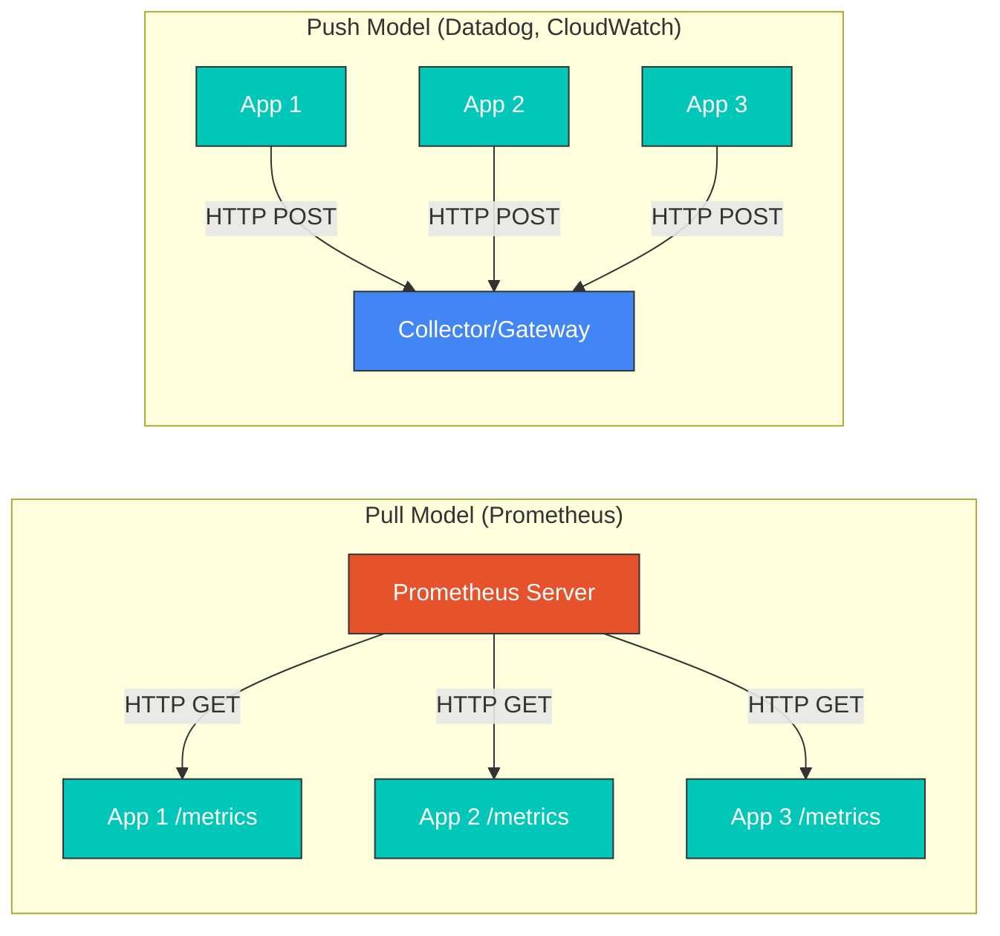
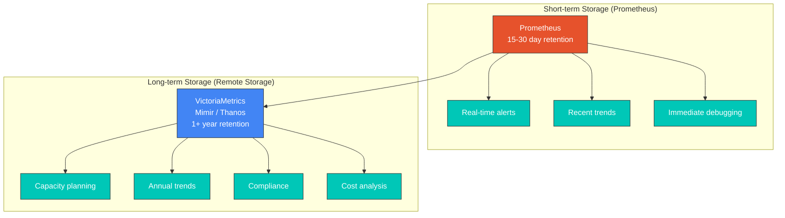
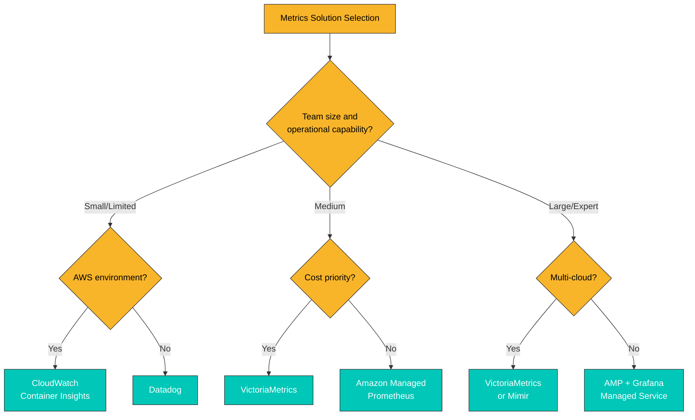
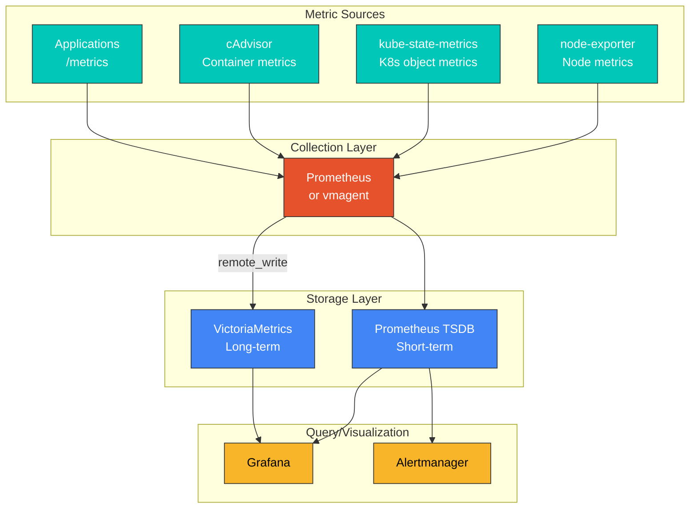

# メトリクス概要

> **最終更新**: February 20, 2026

## 目次

- [メトリクスの基礎](#metrics-fundamentals)
- [メトリクスの種類](#metric-types)
- [Pull モデルと Push モデル](#pull-vs-push-model)
- [カーディナリティとメトリクス設計](#cardinality-and-metric-design)
- [長期ストレージの要件](#long-term-storage-requirements)
- [ソリューションの比較](#solution-comparison)
- [メトリクス収集アーキテクチャ](#metrics-collection-architecture)

## メトリクスの基礎

メトリクスは、システムの状態とパフォーマンスを測定・監視するための定量データです。Kubernetes 環境では、メトリクスはクラスターの健全性の把握、問題の早期検出、キャパシティプランニング、パフォーマンス最適化に不可欠です。

### メトリクスの構成要素

メトリクスは次の要素で構成されます。

```
http_requests_total{method="GET", endpoint="/api/users", status="200"} 1234 1677649200000
      |                              |                                   |        |
  metric name                      labels                              value  timestamp
```

1. **メトリクス名**: 何を測定しているかを識別します
2. **ラベル**: メトリクスを分類するキーと値のペア
3. **値**: 測定された数値データ
4. **タイムスタンプ**: 測定が行われた時刻（ミリ秒単位の Unix 時間）

### メトリクスの命名規則

適切なメトリクス名は次のルールに従います。

```yaml
# Good examples
http_requests_total              # Total request count (Counter)
http_request_duration_seconds    # Request duration (Histogram)
node_memory_usage_bytes          # Memory usage (Gauge)

# Bad examples
requests                         # Too vague
httpRequestDurationMs            # Unit not in name, uses camelCase
```

**命名ルール**:
- snake_case（アンダースコア区切りの小文字）を使用する
- 単位を接尾辞として含める（`_seconds`、`_bytes`、`_total`）
- アプリケーション／ドメインのプレフィックスを使用する（`http_`、`node_`、`kube_`）

## メトリクスの種類

Prometheus 互換のメトリクスシステムでは、4 つの基本的なメトリクス型を使用します。

### 1. Counter

累積値を追跡するメトリクス型です。値は増加するのみで、再起動時に 0 にリセットされます。

```yaml
# Use cases: request count, error count, completed tasks
http_requests_total{method="GET", status="200"} 12345
http_requests_total{method="POST", status="500"} 23

# PromQL query examples
rate(http_requests_total[5m])                    # Requests per second
increase(http_requests_total[1h])                # Increase over 1 hour
```

**特性**:
- 単調に増加する
- 再起動時にリセットされるが、`rate()` 関数が自動補正する
- 合計値ではなく変化率で分析する

### 2. Gauge

増加または減少する現在の状態を表す値です。

```yaml
# Use cases: temperature, memory usage, current connections
node_memory_usage_bytes 8589934592
kube_pod_status_ready{pod="nginx-abc123"} 1
temperature_celsius{location="datacenter-1"} 23.5

# PromQL query examples
node_memory_usage_bytes / node_memory_total_bytes * 100  # Memory usage %
max_over_time(temperature_celsius[1h])                    # Max temp in 1 hour
```

**特性**:
- 現在の状態のスナップショット
- 増加または減少する可能性がある
- ある時点での絶対値として意味を持つ

### 3. Histogram

バケットを使用して値の分布を観測します。レイテンシ、レスポンスサイズなどの分布分析に最適です。

```yaml
# Histogram generates three metrics
http_request_duration_seconds_bucket{le="0.005"} 24054    # Requests <= 5ms
http_request_duration_seconds_bucket{le="0.01"} 33444     # Requests <= 10ms
http_request_duration_seconds_bucket{le="0.025"} 100392   # Requests <= 25ms
http_request_duration_seconds_bucket{le="0.05"} 129389    # Requests <= 50ms
http_request_duration_seconds_bucket{le="0.1"} 133988     # Requests <= 100ms
http_request_duration_seconds_bucket{le="+Inf"} 144320    # Total requests
http_request_duration_seconds_sum 53.42                    # Total duration
http_request_duration_seconds_count 144320                 # Total count

# PromQL query examples
histogram_quantile(0.95, rate(http_request_duration_seconds_bucket[5m]))  # p95 latency
rate(http_request_duration_seconds_sum[5m]) / rate(http_request_duration_seconds_count[5m])  # Average latency
```

**特性**:
- サーバー側でバケットに集約される
- 複数のインスタンスにまたがる分位数を計算できる
- バケット境界はメトリクス定義時に決定される

### 4. Summary

クライアント側で分位数を計算します。Histogram と似ていますが、計算方法が異なります。

```yaml
# Summary generates quantiles and sum/count
http_request_duration_seconds{quantile="0.5"} 0.052      # Median (p50)
http_request_duration_seconds{quantile="0.9"} 0.089     # p90
http_request_duration_seconds{quantile="0.99"} 0.245     # p99
http_request_duration_seconds_sum 29969.50               # Total duration
http_request_duration_seconds_count 562887               # Total count

# PromQL query examples
http_request_duration_seconds{quantile="0.99"}           # p99 latency (direct query)
```

**特性**:
- 分位数はクライアント側で計算される
- 複数のインスタンスにまたがって集約できない
- 正確な分位数を提供する（近似値ではない）

### Histogram と Summary の比較

| 機能 | Histogram | Summary |
|---------|-----------|---------|
| 分位数の計算 | サーバー（クエリ時） | クライアント（収集時） |
| 集約 | インスタンス間で集約可能 | 集約不可 |
| 精度 | バケット境界に基づく近似値 | 正確な分位数 |
| 設定変更 | バケット変更には再デプロイが必要 | 分位数変更には再デプロイが必要 |
| 推奨される使用場面 | SLO/SLI の測定、分散システム | 単一インスタンス、精度が重要な場合 |

## Pull モデルと Push モデル

メトリクス収集には主に 2 つのモデルがあります。



### Pull モデル

Prometheus は代表的な Pull ベースのシステムです。

**利点**:
- 収集対象と収集間隔を一元的に制御できる
- ターゲットの可用性を自動検出できる
- ファイアウォール設定を簡素化できる（インバウンドのみを許可）
- デバッグが容易（エンドポイントを直接クエリできる）

**欠点**:
- 短命な Job からのメトリクス収集が難しい
- NAT／ファイアウォールの背後にあるターゲットへのアクセスが制限される
- Service Discovery が必要

```yaml
# Prometheus scrape configuration example
scrape_configs:
  - job_name: 'kubernetes-pods'
    kubernetes_sd_configs:
      - role: pod
    relabel_configs:
      - source_labels: [__meta_kubernetes_pod_annotation_prometheus_io_scrape]
        action: keep
        regex: true
      - source_labels: [__meta_kubernetes_pod_annotation_prometheus_io_path]
        action: replace
        target_label: __metrics_path__
        regex: (.+)
```

### Push モデル

Datadog、CloudWatch、Graphite などは Push ベースです。

**利点**:
- 短命な Job からのメトリクスを収集できる
- ファイアウォール／NAT 環境で有利
- イベント駆動のメトリクス送信

**欠点**:
- 収集サーバーが過負荷になる可能性がある
- ターゲットの可用性を自動検出しにくい
- クライアント側に送信ロジックが必要

```yaml
# Push example using Pushgateway
# Used for short-lived batch jobs
apiVersion: batch/v1
kind: Job
metadata:
  name: batch-job
spec:
  template:
    spec:
      containers:
      - name: worker
        image: my-batch-job:latest
        env:
        - name: PUSHGATEWAY_URL
          value: "http://pushgateway:9091"
        command:
        - /bin/sh
        - -c
        - |
          # Perform work
          do_work()

          # Push metrics
          cat <<EOF | curl --data-binary @- ${PUSHGATEWAY_URL}/metrics/job/batch_job/instance/${HOSTNAME}
          batch_job_duration_seconds ${DURATION}
          batch_job_records_processed ${RECORDS}
          EOF
      restartPolicy: Never
```

## カーディナリティとメトリクス設計

### カーディナリティとは

カーディナリティは、メトリクスに含まれる一意な時系列の組み合わせ数を指します。高カーディナリティはストレージとクエリのパフォーマンスに直接影響します。

```yaml
# Low cardinality (good)
http_requests_total{method="GET", status="200"}     # method: ~5, status: ~10 = max 50 combinations

# High cardinality (caution needed)
http_requests_total{method="GET", user_id="12345"}  # user_id could be millions

# Very high cardinality (dangerous)
http_requests_total{request_id="abc-123-def"}       # Unique ID per request = infinite growth
```

### カーディナリティの計算

```
Total time series = label1 unique values x label2 unique values x ... x labelN unique values
```

**例**:
- `method`: 5（GET、POST、PUT、DELETE、PATCH）
- `endpoint`: 20
- `status`: 10（200、201、400、401、403、404、500、502、503、504）
- **時系列の合計**: 5 x 20 x 10 = **1,000**

### カーディナリティのベストプラクティス

```yaml
# Bad example: Infinite cardinality
http_request_duration_seconds{
  user_id="12345",           # Unique per user
  request_id="abc-123",      # Unique per request
  timestamp="1677649200"     # New value every second
}

# Good example: Bounded cardinality
http_request_duration_seconds{
  method="GET",              # 5 or fewer
  endpoint="/api/users",     # Dozens
  status_class="2xx"         # 5 (1xx, 2xx, 3xx, 4xx, 5xx)
}
```

**推奨事項**:
1. 無限に増加する可能性があるラベル値を避ける
2. ユーザー ID、リクエスト ID、セッション ID をラベルとして使用しない
3. ステータスコードをグループ化する（200 -> 2xx）
4. URL パスを正規化する（`/users/123` -> `/users/{id}`）

### カーディナリティの監視

```yaml
# Query to detect high cardinality metrics
topk(10, count by (__name__)({__name__=~".+"}))

# Check cardinality of specific metric
count(http_requests_total)

# Check unique values per label
count(count by (endpoint)(http_requests_total))
```

## 長期ストレージの要件

### Prometheus の制限事項

Prometheus は優れたリアルタイム監視ツールですが、長期データストレージには制限があります。



**Prometheus の長期ストレージに関する問題**:

1. **ストレージ効率**: 圧縮率が低く、ディスク使用量が増加する
2. **水平スケーラビリティ**: 単一ノードアーキテクチャによりスケーリングが制限される
3. **高可用性**: ネイティブの HA クラスタリングをサポートしていない
4. **クエリパフォーマンス**: 長い期間にわたるクエリは低速になる

### 長期ストレージが必要な理由

| ユースケース | 必要な保持期間 | 説明 |
|----------|-------------------|-------------|
| リアルタイムアラート | 1～7 日 | 問題の即時検出 |
| トラブルシューティング | 7～30 日 | 最近発生した問題の分析 |
| キャパシティプランニング | 3～12 か月 | 成長傾向の予測 |
| 前年比比較 | 12 か月以上 | YoY 分析 |
| コンプライアンス | 1～7 年 | 監査および法的要件 |
| コスト最適化 | 6～12 か月 | リソース使用パターンの分析 |

### Remote Write アーキテクチャ

```yaml
# Prometheus remote_write configuration
global:
  scrape_interval: 15s

remote_write:
  - url: "http://victoriametrics:8428/api/v1/write"
    queue_config:
      max_samples_per_send: 10000
      batch_send_deadline: 5s
      min_backoff: 30ms
      max_backoff: 5s
      max_shards: 10
      capacity: 2500
    write_relabel_configs:
      # Exclude high cardinality metrics
      - source_labels: [__name__]
        regex: "go_.*"
        action: drop
```

## ソリューションの比較

### 主なメトリクスソリューションの比較

| 機能 | Prometheus | VictoriaMetrics | Mimir | CloudWatch | Datadog |
|---------|------------|-----------------|-------|------------|---------|
| **デプロイモデル** | セルフホスト | セルフホスト | セルフホスト | マネージド | SaaS |
| **スケーラビリティ** | 単一ノード | 水平 | 水平 | 自動スケーリング | 自動スケーリング |
| **高可用性** | Thanos/Cortex が必要 | ネイティブ | ネイティブ | ネイティブ | ネイティブ |
| **データ圧縮** | 中 | 非常に高い（7 倍） | 高 | N/A | N/A |
| **クエリ言語** | PromQL | MetricsQL | PromQL | カスタム構文 | カスタム構文 |
| **長期ストレージ** | 制限あり | 効率的 | 効率的 | 15 か月 | 15 か月 |
| **マルチテナンシー** | 制限あり | サポート | サポート | アカウント分離 | 組織分離 |
| **コスト** | 無料（インフラのみ） | 無料（インフラのみ） | 無料（インフラのみ） | 使用量ベース | ホストベース |
| **セットアップの複雑さ** | 低 | 中 | 高 | 低 | 低 |
| **AWS 統合** | 手動セットアップ | 手動セットアップ | 手動セットアップ | ネイティブ | ネイティブ |

### コスト比較（月額見積もり）

**前提条件**: 1,000 ノード、アクティブな時系列 100 万件、保持期間 30 日

| ソリューション | インフラコスト | サービスコスト | 合計コスト |
|----------|--------------------|--------------| -----------|
| Prometheus + VictoriaMetrics | ~$500 | $0 | ~$500 |
| Amazon Managed Prometheus | ~$200 | ~$1,500 | ~$1,700 |
| CloudWatch | $0 | ~$3,000+ | ~$3,000+ |
| Datadog | $0 | ~$15,000+ | ~$15,000+ |

*実際のコストは使用パターンによって大きく異なる場合があります。*

### 選定ガイド



## メトリクス収集アーキテクチャ

### Kubernetes 環境におけるメトリクス収集の構造



### 主要なメトリクスソース

| コンポーネント | 役割 | 主要メトリクス |
|-----------|------|-------------|
| **node-exporter** | Node レベルのメトリクス | CPU、メモリ、ディスク、ネットワーク |
| **kube-state-metrics** | K8s オブジェクトの状態 | Pod、Deployment、Node のステータス |
| **cAdvisor** | Container メトリクス | Container ごとの CPU、メモリ、I/O |
| **metrics-server** | リソースメトリクス | HPA/VPA 用の CPU、メモリ |

### 次のステップ

各メトリクスソリューションの詳細については、次のドキュメントを参照してください。

1. [Prometheus](./01-prometheus.md) - オープンソース監視の標準
2. [VictoriaMetrics](./02-victoriametrics.md) - 高性能な長期ストレージ
3. [Grafana Mimir](./03-mimir.md) - エンタープライズグレードのメトリクスストレージ
4. [CloudWatch Metrics](./04-cloudwatch-metrics.md) - AWS ネイティブ監視
5. [Datadog](./05-datadog.md) - 統合オブザーバビリティプラットフォーム

## クイズ

この章の理解度を確認するには、[メトリクス概要クイズ](../../quizzes/observability/metrics/00-metrics-overview-quiz.md)に挑戦してください。
