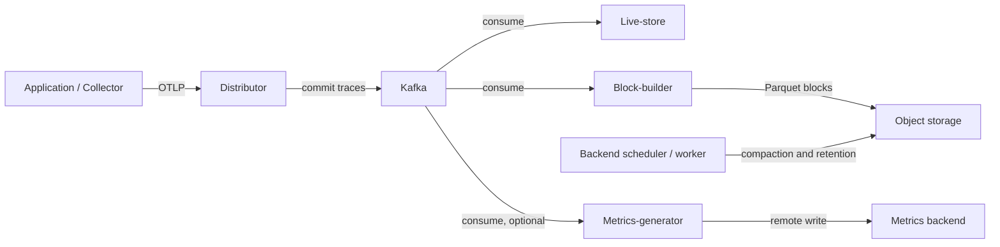
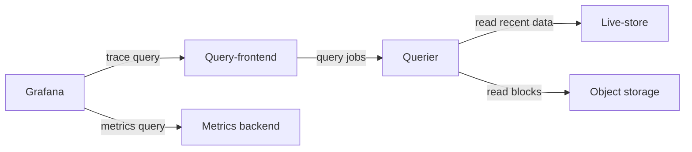

# Grafana Tempo

> **確認済みベースライン**: Tempo 3.0.3; `tempo-distributed` chart 3.6.0 (appVersion 3.0.3)
> **最終更新**: September 13, 2026

## はじめに

Grafana Tempo は、オブジェクトストレージ、Parquet block、および TraceQL を使用して分散トレースを保存・クエリします。TraceID は**保持され、正常に取り込まれたデータ**を特定します。サンプリング、エクスポート失敗、または保持期間によって失われた span を復元することはできません。Tempo は別個の汎用検索データベースを必要としませんが、専用列、メタデータ、キャッシュ、コンピューティング、およびオブジェクトストアへのリクエストには依然としてコストがかかります。

この章では、ローカルのモノリシックな例と、分散 EKS 構成のベースラインを分けて扱います。ローカルバイナリ、クエリコンパイラ、Helm レンダリング、および構成解析を確認しました。EKS Deployment、Kafka 認証、S3 認可、高可用性、および本番環境のサイジングは**実施していません**。

## 主な機能

| 機能 | 範囲 |
|---------|-------|
| オブジェクトストレージ | S3、GCS、Azure Blob。限定された開発用例ではローカルストレージ |
| TraceQL | 属性、期間、ステータス、および構造クエリ。metrics 関数はトレース単位の集約とは別物 |
| プロトコル | OTLP、および Jaeger や Zipkin などのオプション receiver。対応する chart port を有効化 |
| 相関 | 識別子と data source UID が一致する場合、Grafana が trace、log、metric、および exemplar をリンク |
| Deployment モード | モノリシック `target: all`、または Kafka 互換の取り込みキューを使用する microservices |
| Metrics generation | オプションの span metrics と service graph。processor と動作する remote-write 宛先が必要 |

## アーキテクチャ

**Tempo 3 の microservices には Kafka が必要です。モノリシックモードでは不要です。** distributor は Kafka へのコミット後に取り込みを確認応答します。live-store、block-builder、および metrics-generator は独立して消費します。live-store は最近のデータを提供し、block-builder は長期 block を書き込みます。query-frontend は作業を分割し、querier は最近の store またはオブジェクトストレージを読み取ります。



読み取りパス（同じストレージおよび metrics コンポーネント）:



矢印はリクエストとデータフローを示しており、すべてのレスポンスや control-plane 接続を示すものではありません。Grafana は metrics backend を**クエリ**します。metrics-generator が Grafana に metrics を保存するわけではありません。

### コンポーネントの詳細

| コンポーネント | Tempo 3 の責務 | 運用上の考慮事項 |
|-----------|-------------------------|---------------------------|
| Distributor | trace を検証して Kafka partition へルーティング | Backpressure、受信/拒否された byte と span |
| Live-store | 最近の trace クエリとローカル WAL | Consumer lag、ローカル容量、partition 所有権 |
| Block-builder | Kafka を消費し Parquet block を書き込み | Partition 割り当てと object-store スループット |
| Query-frontend / querier | クエリを分割、スケジュール、実行 | Queueing、scan byte、concurrency、cache |
| Backend scheduler / worker | Compaction、retention、バックグラウンドジョブ | Scheduler の協調、worker リソース、失敗したジョブ |
| Metrics-generator | span metrics と service graph を導出 | Cardinality、processor の有効化、remote-write の健全性 |

Tempo 2 の `ingester` および `compactor` 構成は、Tempo 3 のインストール手順ではありません。分散 **2→3 migration はサイドバイサイド**で実行し、互換性のある既存 block（`vParquet4` 以降）、新しい取り込みパス、および制御されたトラフィック切り替えを用います。3→2 へのダウングレードはサポートされません。[公式 migration 手順](https://grafana.com/docs/tempo/latest/set-up-for-tracing/setup-tempo/upgrade/)なしに、競合するインストールから同じ書き込み可能データを参照しないでください。

Kafka の replication、in-sync replica、retention、およびディスク容量が書き込みパスの耐久性を決定します。Tempo replica 数は Kafka の耐久性を確立せず、損失ゼロを保証するものでもありません。chart 3.6.0 では、live-store と block-builder のデータ volume は `emptyDir` です。3 replica は 3 つの永続 PVC を意味しません。

## Helm インストール（分散モード）

### 1. Helm Repository を追加

保守されている community chart と明示的な version を使用します。

```bash
helm repo add grafana-community https://grafana-community.github.io/helm-charts
helm repo update grafana-community
helm show chart grafana-community/tempo-distributed --version 3.6.0
helm show values grafana-community/tempo-distributed --version 3.6.0 > tempo-defaults.yaml
```

chart は Kubernetes `^1.25.0-0` を宣言しています。これは chart の制約であり、すべての Kubernetes/EKS release または add-on 組み合わせのテストマトリクスでは**ありません**。

### 2. values.yaml 構成

以下を `tempo-distributed-values.yaml` として保存します。これはプレースホルダーの account/bucket 名と、分離したテスト用 Kafka address を含む、**レンダリング専用の出発点**です。

```yaml
# Render-only baseline. Read the Kafka security/deployment gates first.
fullnameOverride: tempo
reportingEnabled: false
serviceAccount:
  create: true
  name: tempo
  annotations:
    eks.amazonaws.com/role-arn: arn:aws:iam::123456789012:role/tempo-s3
traces:
  otlp:
    grpc:
      enabled: true
    http:
      enabled: true
ingest:
  kafka:
    address: kafka-bootstrap.kafka.svc.cluster.local:9092
    topic: tempo-traces
    auto_create_topic_enabled: false
storage:
  trace:
    backend: s3
    s3:
      bucket: replace-with-owned-tempo-bucket
      region: ap-northeast-2
      endpoint: s3.ap-northeast-2.amazonaws.com
      insecure: false
backendScheduler:
  config:
    provider:
      compaction:
        compaction:
          block_retention: 336h
metricsGenerator:
  enabled: false
gateway:
  enabled: false
ingress:
  enabled: false
metaMonitoring:
  serviceMonitor:
    enabled: false
tempo:
  structuredConfig:
    distributor:
      receivers:
        otlp:
          protocols:
            grpc:
              max_recv_msg_size_mib: 16
    overrides:
      defaults:
        ingestion:
          rate_limit_bytes: 15000000
          burst_size_bytes: 20000000
```

Deployment 前に、以下の要件を解決してください。

- Kafka topic は別途プロビジョニングして所有します。デフォルトの 3 つの live-store/block-builder replica と `partitions_per_instance: 1` には対応する partition 設計が必要です。Pod をスケールするだけでは、すべての block-builder 割り当ては再分配されません。
- Kafka transport と認証をエンドツーエンドで検証します。Tempo **3.0.3 の Kafka client は SASL/PLAIN を公開しますが、Kafka TLS、SCRAM、または MSK IAM 構成はありません**。PLAIN は暗号化ではありません。この例は安全なドロップイン MSK 手順ではありません。network/proxy ソリューションは bootstrap だけでなく、広告されるすべての broker endpoint をカバーする必要があり、本番利用前に独立してテストする必要があります。
- 次のセクションで示す S3 bucket と role を提供します。正確な ServiceAccount 名と role annotation を設定してください。無関係な ServiceAccount を作成するだけでは不十分です。
- 実際の cluster network control と認証済み transport により、OTLP、query、memberlist、および component RPC へのアクセスを制限します。internal load balancer または `X-Scope-OrgID` header だけでは認証になりません。
- workload 用の resource、scheduling、disruption budget、および storage/recovery policy を設定します。PodDisruptionBudget は任意の eviction を制約し、anti-affinity は配置を制御します。どちらも可用性を証明しません。

受信サイズ制限の単位は **MiB**、取り込み rate/burst field の単位は **byte** です。16 MiB および 15/20 MB の値は例示的な制限であり、測定済み容量ではありません。

オプションの metrics generation には、有効化と、既存の認証済み receiver の両方が必要です。3 つの名前付き certificate file を持つ `tempo-metrics-client` Secret を作成し、URL を置き換えた後にのみ、この 2 番目のファイルをマージしてください。

```yaml
metricsGenerator:
  enabled: true
  config:
    storage:
      remote_write:
        - url: https://metrics-write.example.org/api/v1/write
          send_exemplars: true
          tls_config:
            ca_file: /etc/metrics-tls/ca.crt
            cert_file: /etc/metrics-tls/tls.crt
            key_file: /etc/metrics-tls/tls.key
  extraVolumes:
    - name: metrics-tls
      secret:
        secretName: tempo-metrics-client
  extraVolumeMounts:
    - name: metrics-tls
      mountPath: /etc/metrics-tls
      readOnly: true
overrides:
  defaults:
    metrics_generator:
      processors: [span-metrics, service-graphs]
      generate_native_histograms: both
```

receiver は Prometheus remote write を受け入れる必要があります。exemplar と native histogram にも宛先側のサポートが必要です。この chart のデフォルト generator WAL は ephemeral です。replay/queue/storage の動作は別途検証してください。`send_exemplars: true` を配信保証と解釈しないでください。

### 3. IRSA 構成

この例では、正確な identity `system:serviceaccount:monitoring:tempo` を使用します。role trust は OIDC の `sub` と `aud` claim の両方で制限されます。role は所有する Tempo bucket にのみアクセスを許可します。環境変数や Helm values に static access key を置かないでください。

IRSA はここで示す具体的なパスであり、唯一可能な EKS workload identity ではありません。Pod Identity の代替を使用する場合は、pin した Tempo image が使用する credential provider との互換性を確認する必要があります。また、STS 到達可能性、bucket policy、VPC endpoint、および KMS key policy を検証してください。YAML のレンダリング成功は、これらのいずれも証明しません。

### 4. インストールを実行

最初に、cluster に接続せずレンダリングと検査を行います。

```bash
helm template tempo grafana-community/tempo-distributed \
  --version 3.6.0 --namespace monitoring --kube-version 1.36.2 \
  -f tempo-distributed-values.yaml > tempo-rendered.yaml
```

`--kube-version` はレンダリング機能を選択します。EKS 1.36.2 互換性を認定するものではありません。Service port、Pod identity、ConfigMap、resource 設定、およびオプションの generator 構成を検査してください。レンダリングされた `tempo.yaml` を抽出し、**一致する**バイナリで検証します。

```bash
tempo -config.file=tempo.yaml -config.verify=true
```

これは service 初期化前に終了します。Kafka/S3 には接続せず、任意の receiver 構成を完全には実行しません。**前述の Deployment 要件を解決するまで Helm install を実行しないでください。** その後、rollback/migration plan を含む Deployment プロセスの下で、確認済みの values と所有する release/namespace を使用してください。

ローカルの single-process 確認では、この別ファイルを `tempo-local.yaml` として保存し、OS/architecture に対応する確認済みの公式 Tempo 3.0.3 binary を使用します。

```yaml
target: all
stream_over_http_enabled: true
server:
  http_listen_address: 127.0.0.1
  http_listen_port: 3200
  grpc_listen_address: 127.0.0.1
  grpc_listen_port: 9095
distributor:
  receivers:
    otlp:
      protocols:
        grpc:
          endpoint: 127.0.0.1:4317
        http:
          endpoint: 127.0.0.1:4318
storage:
  trace:
    backend: local
    wal:
      path: ./tempo-data/wal
    local:
      path: ./tempo-data/blocks
live_store:
  wal:
    path: ./tempo-data/live-store/traces
  shutdown_marker_dir: ./tempo-data/live-store/shutdown-marker
  ring:
    instance_addr: 127.0.0.1
    instance_interface_names: [lo]
metrics_generator:
  storage:
    path: ./tempo-data/generator/wal
backend_scheduler:
  local_work_path: ./tempo-data/scheduler
memberlist:
  bind_addr: [127.0.0.1]
  advertise_addr: 127.0.0.1
usage_report:
  reporting_enabled: false
```

```bash
tempo -config.file=tempo-local.yaml -config.verify=true
tempo -config.file=tempo-local.yaml
# In a second terminal:
curl --fail http://127.0.0.1:3200/ready
```

これは loopback に bind し、usage reporting を無効化して `./tempo-data` 配下に書き込みます。この process は Ctrl-C で停止してください。これは Kafka、S3、authentication gateway、または HA の主張がない 1 つのローカル instance です。

## TraceQL クエリ

### 基本構文

直接検索には Grafana Explore の TraceID mode を使用するか、TraceQL intrinsic で完全な 32 桁の 16 進 ID を使用します。

```traceql
{ trace:id = "4bf92f3577b34da6a3ce929d0e0e4736" }
{ resource.service.name = "payment-service" }
{ span.http.response.status_code >= 400 }
{ duration > 1s }
{ status = error }
```

これらは個別のクエリです。span status の `error` は、すべての HTTP status ≥400 と同一ではありません。attribute 名は、送信する SDK の semantic-convention version を反映します。古い `http.status_code` および `db.system` のデータは元の名前で引き続きクエリできます。Tempo は保存済み attribute を自動的に名前変更しません。

### 高度なクエリ例

```traceql
{ span.db.system.name = "postgresql" && duration > 100ms }
{ span.http.route = "/api/payment" && status = error }
{ resource.service.name = "api-gateway" } >> { resource.service.name = "payment-service" }
{ resource.service.name = "order-service" } > { span.db.system.name = "postgresql" }
{ resource.service.name = "order-service" } ~ { resource.service.name = "inventory-service" }
{ trace:rootService = "api-gateway" } | count() > 50
{ duration > 2s } | by(resource.service.name) | avg(duration) > 2s
{ status = error } | rate() by (resource.service.name)
{ } | avg_over_time(duration) by (resource.service.name)
```

- `A >> B` は A に一致する **B descendant** を返します。`A > B` は B に一致する direct child を返します。parent を取得するには、child を parent と説明するのではなく、対応する逆の relationship を使用してください。
- `A ~ B` は sibling に一致します。A→B の network call を確立するものではありません。
- `count()` は**現在の spanset**内の span を数えます。count 前に error へ絞り込むと、trace 内のすべての span ではなく error span を数えます。`traceSpanCount` は有効な intrinsic ではありません。
- `nestedSetParent` はこの release で受け入れられますが、内部の nested-set parent marker であり、nesting-depth counter ではありません。
- `by(...) | avg(...) > ...` はトレース単位の spanset をフィルタします。`rate()` と `avg_over_time(...)` は時系列を生成します。前者は error-span rate であり、**error ratio ではありません**。Grafana または query API で時間間隔を選択してください。duration filter は wall-clock range ではありません。

`{ span.user.id = "synthetic-user-123" }` のようなクエリには、明示的に送信された attribute が必要です。synthetic または承認済みの pseudonymous identifier を使用してください。個人データを tracing の前提条件にしないでください。user ID や query string を含むリテラル URL ではなく、低 cardinality の `http.route` を優先してください。

### Grafana で TraceQL を使用

port **3200** の query-frontend URL で Tempo data source を作成し、Explore → Tempo → Search/TraceQL を選択します。`tempo` UID は log link と exemplar destination で一致している必要があります。query concurrency や limit を上げる前に time range を短縮してください。

## S3 Backend 構成

### S3 Bucket のセットアップ

Block Public Access、bucket-owner-enforced ownership、および encryption を備えた専用 bucket を使用してください。その ownership は 1 つの infrastructure state で管理します。同じ bucket を CLI snippet と Terraform の両方で作成しないでください。

Tempo の `block_retention: 336h` は、バックグラウンド処理によって非同期に適用される retention target であり、厳密な削除期限ではありません。包括的な S3 の「30 日後にすべての object を削除する」policy は compaction や metadata と競合する可能性があります。文書化された backend 対応の lifecycle 設計なしに追加しないでください。versioning が有効な場合、current object を削除しても noncurrent version と料金が残ることがあります。これらの retention と recovery 要件は別途定義してください。

### Terraform による S3 および IRSA のセットアップ

この AWS provider **6.64.0** の例では SSE-S3 と**既存の** cluster OIDC provider を使用します。account、グローバルに一意な bucket 名、および issuer input を置き換えてください。EKS cluster、Kafka、または KMS key は意図的に作成しません。

```hcl
terraform {
  required_version = ">= 1.6.0"
  required_providers {
    aws = {
      source  = "hashicorp/aws"
      version = "6.64.0"
    }
  }
}

variable "region" {
  type    = string
  default = "ap-northeast-2"
}
variable "account_id" {
  type = string
  validation {
    condition     = can(regex("^[0-9]{12}$", var.account_id))
    error_message = "Supply the bucket and role owner account ID."
  }
}
variable "bucket_name" { type = string }
variable "oidc_provider_arn" { type = string }
variable "oidc_issuer_hostpath" {
  type        = string
  description = "Existing cluster OIDC issuer without https://."
}
provider "aws" { region = var.region }

resource "aws_s3_bucket" "tempo" {
  bucket        = var.bucket_name
  force_destroy = false
  lifecycle { prevent_destroy = true }
}
resource "aws_s3_bucket_public_access_block" "tempo" {
  bucket                  = aws_s3_bucket.tempo.id
  block_public_acls       = true
  block_public_policy     = true
  ignore_public_acls      = true
  restrict_public_buckets = true
}
resource "aws_s3_bucket_ownership_controls" "tempo" {
  bucket = aws_s3_bucket.tempo.id
  rule { object_ownership = "BucketOwnerEnforced" }
}
resource "aws_s3_bucket_server_side_encryption_configuration" "tempo" {
  bucket = aws_s3_bucket.tempo.id
  rule {
    apply_server_side_encryption_by_default { sse_algorithm = "AES256" }
  }
}
resource "aws_s3_bucket_policy" "tempo" {
  bucket = aws_s3_bucket.tempo.id
  policy = jsonencode({
    Version = "2012-10-17"
    Statement = [{
      Sid       = "DenyInsecureTransport"
      Effect    = "Deny"
      Principal = "*"
      Action    = "s3:*"
      Resource  = [aws_s3_bucket.tempo.arn, "${aws_s3_bucket.tempo.arn}/*"]
      Condition = { Bool = { "aws:SecureTransport" = "false" } }
    }]
  })
}
resource "aws_iam_role" "tempo" {
  name = "tempo-s3"
  assume_role_policy = jsonencode({
    Version = "2012-10-17"
    Statement = [{
      Effect    = "Allow"
      Principal = { Federated = var.oidc_provider_arn }
      Action    = "sts:AssumeRoleWithWebIdentity"
      Condition = {
        StringEquals = {
          "${var.oidc_issuer_hostpath}:aud" = "sts.amazonaws.com"
          "${var.oidc_issuer_hostpath}:sub" = "system:serviceaccount:monitoring:tempo"
        }
      }
    }]
  })
}
resource "aws_iam_role_policy" "tempo" {
  role = aws_iam_role.tempo.id
  policy = jsonencode({
    Version = "2012-10-17"
    Statement = [
      {
        Effect    = "Allow"
        Action    = ["s3:ListBucket", "s3:GetBucketLocation"]
        Resource  = aws_s3_bucket.tempo.arn
        Condition = { StringEquals = { "aws:ResourceAccount" = var.account_id } }
      },
      {
        Effect    = "Allow"
        Action    = ["s3:GetObject", "s3:PutObject", "s3:DeleteObject", "s3:AbortMultipartUpload"]
        Resource  = "${aws_s3_bucket.tempo.arn}/*"
        Condition = { StringEquals = { "aws:ResourceAccount" = var.account_id } }
      }
    ]
  })
}
output "tempo_role_arn" { value = aws_iam_role.tempo.arn }
output "tempo_bucket" { value = aws_s3_bucket.tempo.id }
```

Helm values では `tempo_role_arn` と `tempo_bucket` を使用します。plan 前に Terraform の format/schema validation を行うことは有用です。適用前に実際の plan と ownership を確認してください。SSE-KMS では、所有する key、互換性のある bucket/Tempo 設定、スコープを限定した `kms:GenerateDataKey`/`kms:Decrypt` permission、および workload を許可する key policy を明示的に指定してください。未定義の `aws_kms_key` reference は完全な構成ではありません。

## Trace-to-Log Correlation（Loki Integration）

### Grafana Data Source 構成

これは**Grafana provisioning file**であり、chart 固有の `values.yaml` ではありません。Grafana chart がサポートするメカニズムで mount してください。3 つの internal URL は、既存の access-controlled Service のプレースホルダーです。

```yaml
apiVersion: 1
datasources:
  - name: Tempo
    uid: tempo
    type: tempo
    access: proxy
    url: http://tempo-query-frontend.monitoring.svc.cluster.local:3200
    jsonData:
      tracesToLogsV2:
        datasourceUid: loki
        spanStartTimeShift: '-1m'
        spanEndTimeShift: '1m'
        tags: [{key: service.name, value: service_name}]
        filterByTraceID: true
        filterBySpanID: false
        customQuery: false
      tracesToMetrics:
        datasourceUid: prometheus
        tags: [{key: service.name, value: service}]
        queries:
          - name: Span request rate
            query: 'sum(rate(traces_spanmetrics_calls_total{$$__tags}[5m]))'
          - name: Span error ratio
            query: '(sum(rate(traces_spanmetrics_calls_total{$$__tags,status_code="STATUS_CODE_ERROR"}[5m])) or (0 * sum(rate(traces_spanmetrics_calls_total{$$__tags}[5m])))) / (sum(rate(traces_spanmetrics_calls_total{$$__tags}[5m])) > 0)'
      serviceMap:
        datasourceUid: prometheus
      nodeGraph:
        enabled: true
  - name: Loki
    uid: loki
    type: loki
    access: proxy
    url: http://loki-gateway.logging.svc.cluster.local
    jsonData:
      derivedFields:
        - name: TraceID
          matcherRegex: '"traceId"\s*:\s*"([0-9a-f]{32})"'
          datasourceUid: tempo
          url: '$${__value.raw}'
  - name: Prometheus
    uid: prometheus
    type: prometheus
    access: proxy
    url: http://prometheus-operated.monitoring.svc.cluster.local:9090
    jsonData:
      httpMethod: POST
      exemplarTraceIdDestinations:
        - name: traceID
          datasourceUid: tempo
```

Tempo の `tracesToLogsV2` は**Trace→Logs**を実装し、Loki の `derivedFields` は**Logs→Trace**を実装します。この例では、OTel の `service.name` attribute を Loki の既存の `service_name` label にマッピングします。collector の mapping を確認してください。この link で label や log record を作り出すことはできません。すべての log に span ID があるわけではないため、span filtering は無効です。

provisioning YAML では、`$$` により Grafana runtime macro 用のリテラル `$` を保持します。`__tags` は label matcher 群に展開されます。`service="..."` の値として埋め込まないでください。error ratio は total series から存在しない error series を補い、total rate が正の場合にのみ除算します。トラフィックゼロと telemetry 不在は空のままです。

span-metrics label の `service` と status 値の `STATUS_CODE_ERROR` は、実際に生成された series と一致する必要があります。exemplar は観測された exemplar label 名を使用します（図示した generator 構成では `traceID`）。他の producer は `trace_id` を使用する場合があります。sampling により、これらの metrics が完全な application request count と異なることがあります。

### Application Logging

OpenTelemetry API 1.44 を使う Python では、`span.is_recording()` ではなく context validity を確認してください。有効な nonrecording span でも log を相関できます。

```python
import datetime
import json
import logging
from opentelemetry import trace


class TraceJsonFormatter(logging.Formatter):
    def format(self, record):
        payload = {
            "timestamp": datetime.datetime.fromtimestamp(
                record.created, datetime.timezone.utc
            ).isoformat(),
            "level": record.levelname,
            "message": record.getMessage(),
        }
        context = trace.get_current_span().get_span_context()
        if context.is_valid:
            payload["traceId"] = f"{context.trace_id:032x}"
            payload["spanId"] = f"{context.span_id:016x}"
        if record.exc_info:
            payload["exception"] = self.formatException(record.exc_info)
        return json.dumps(payload, ensure_ascii=False)


logger = logging.getLogger("payment")
logger.setLevel(logging.INFO)
logger.propagate = False
# Configure once at application startup.
if not logger.handlers:
    handler = logging.StreamHandler()
    handler.setFormatter(TraceJsonFormatter())
    logger.addHandler(handler)
```

これは UTC timestamp、message formatting、および exception を保持し、すべてゼロの trace を生成する代わりに無効な ID を省略します。handler は application startup 時に 1 回設定してください。非同期境界をまたいで OTel context を伝播し、機密 message/exception は発生元で redact してください。

Java では、[tracing overview の scoped MDC helper](README.md#linking-logs-via-traceid)を使用します。現在の `SpanContext` を検証し、logging scope に ID を設定して、`finally` で以前の MDC 値を復元します。単に `MDC.put` を書くだけでは、再利用される thread で以前の request の ID が漏洩する可能性があります。Java API contract は確認済みですが、この章では Java application を実行していません。

## パフォーマンスチューニング

### 取り込みレートの最適化

受信/拒否された byte と span、exporter retry、Kafka producer error、および consumer lag を測定します。memory と queue capacity を確保せずに receiver size、ingestion limit、または replica count を増やすと、ボトルネックを解消するのではなく移動させる可能性があります。生成された metrics を解釈する際は、upstream sampling の前提を保持してください。

tenant limit には `overrides.defaults.ingestion` を、gRPC message size には receiver の `max_recv_msg_size_mib` field を使用します。古い `distributor.rate_limit` block および Tempo 2 の `ingester` tuning block は Tempo 3 を構成しません。

### Compaction の最適化

chart の `backendScheduler.config.provider.compaction.compaction` 設定と、対応する backend-worker 構成で retention を設定します。job age、failure、object-store request、および一時作業領域を監視してください。compaction concurrency を増やすと、object-store traffic と memory が増える可能性があります。旧アーキテクチャ向けに普遍的な「cluster ごとに compactor 1 つ」というルールはありません。

### クエリパフォーマンスの最適化

最初に time range と selectivity を減らし、その後で scanned byte、queueing、querier concurrency、および該当する cache role を検査します。削除済みの `cache:` layout をコピーせず、pin した chart/configuration の cache field を構成してください。object-store hedging は追加 request を犠牲に tail latency を改善する可能性があります。このトレードオフは測定により検証してください。

Tempo 3 の live-store `fail_on_high_lag` のデフォルトは true で、query-frontend の `query_end_cutoff` のデフォルトは 30s です。ごく最近の検索可視性は、直接の TraceID 検索より遅れる可能性があります。空の dashboard を正常に見せるためだけに、これらの保護を無効にしないでください。

### Resource の推奨事項

distributor は intake、live-store は最近の trace volume/lag、block-builder は割り当てられた partition と block size、querier は query concurrency、generator は active series に基づいてサイズ設定します。測定されていない古い Tempo 2 Ingester/Compactor の CPU および disk table は、Tempo 3 の capacity 推奨ではありません。代表的なトラフィック下で CPU、RSS、local/WAL 使用量、Kafka lag、request cost、および saturation を測定してください。

## トラブルシューティング

### よくある問題と解決策

#### 1. Trace data が表示されない

SDK export error、sampling、伝播された context、collector queue、OTLP transport、tenant routing、および retention を確認してください。`/v1/traces` への GET request は取り込みテストではありません。有効な OTLP POST を送信してから、既知の synthetic TraceID をクエリしてください。`/ready` probe の成功だけでは、すべての stage が機能していることを証明しません。

#### 2. S3 permission error

正確な ServiceAccount、role trust、bucket policy、endpoint access、および該当する場合は KMS policy を検査します。Pod 環境変数や projected token をダンプしないでください。Tempo image に AWS CLI や shell が含まれていると想定しないでください。

```bash
kubectl get serviceaccount tempo -n monitoring -o yaml
kubectl get pods -n monitoring -l app.kubernetes.io/instance=tempo \
  -o custom-columns=NAME:.metadata.name,SA:.spec.serviceAccountName
kubectl logs -n monitoring -l app.kubernetes.io/component=block-builder --tail=100
```

診断出力へのアクセスを制限してください。log には運用メタデータや application attribute が含まれる可能性があります。

#### 3. Query timeout

query-frontend/querier log、time range、Kafka lag、利用可能な live-store partition、および S3 throttling を確認します。concurrency は memory と backend limit を測定した後にのみ増やしてください。空の結果、timeout、および telemetry 不足は異なる状態として扱います。

#### 4. Live-store memory pressure

Tempo 3 では、live-store memory、最近のデータ window、block rotation、および partition ownership を検査します。まだ実行中の Tempo 2 Deployment では、migration 中は version に対応する ingester documentation を使用してください。`ingester.max_block_duration: 30m` を Tempo 3 にコピーしても live-store は調整されません。

### 便利なデバッグコマンド

認可された port-forward を使用して、実際の query-frontend を検査します。

```bash
kubectl port-forward -n monitoring service/tempo-query-frontend 3200:3200
# In a second terminal:
curl --fail http://127.0.0.1:3200/ready
curl --fail http://127.0.0.1:3200/metrics
curl --fail http://127.0.0.1:3200/api/traces/4bf92f3577b34da6a3ce929d0e0e4736
```

最後の ID は、その Deployment に実際に存在している必要があります。read-only ring/status endpoint は component 固有です。使用前に pin した API を確認してください。削除された `/ingester/ring`、`/compactor/ring`、および forced-flush command は一般的な Tempo 3 診断ではありません。

### Monitoring Dashboard

Deployment が発行する実際の series を使用し、その target label を追加します。

```promql
sum(rate(tempo_distributor_spans_received_total[5m]))
sum(process_resident_memory_bytes{job=~"tempo.*"})
histogram_quantile(0.99, sum by (le) (rate(tempo_request_duration_seconds_bucket{route="api_search"}[5m])))
```

これらの panel は、それぞれ**受信 span/s**、**process RSS byte**、および**HTTP search request の p99 秒**を意味します。memory selector は scrape job naming を前提としています。まず label を検査してください。byte-write counter は memory ではなく、span count は trace count ではありません。request histogram/route はローカル Tempo 3.0.3 smoke test で観測されたものであり、分散環境のエンドツーエンド latency 測定ではありません。

## 参考資料

- [Tempo 3.0.3 release](https://github.com/grafana/tempo/releases/tag/v3.0.3), [chart 3.6.0 values](https://github.com/grafana-community/helm-charts/blob/tempo-distributed-3.6.0/charts/tempo-distributed/values.yaml)
- [Tempo architecture](https://grafana.com/docs/tempo/latest/introduction/architecture/), [Kafka client implementation](https://github.com/grafana/tempo/blob/v3.0.3/pkg/ingest/writer_client.go)
- [TraceQL syntax](https://grafana.com/docs/tempo/latest/traceql/construct-traceql-queries/), [Grafana provisioning](https://grafana.com/docs/grafana/latest/datasources/tempo/configure-tempo-data-source/provision/)
- [EKS IRSA association](https://docs.aws.amazon.com/eks/latest/userguide/associate-service-account-role.html), [S3 Block Public Access](https://docs.aws.amazon.com/AmazonS3/latest/userguide/access-control-block-public-access.html)

## クイズ

この章は[Tempo クイズ](../../quizzes/observability/tracing/01-tempo-quiz.md)で確認してください。
