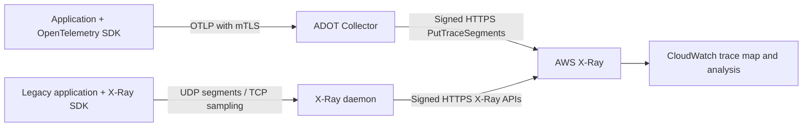
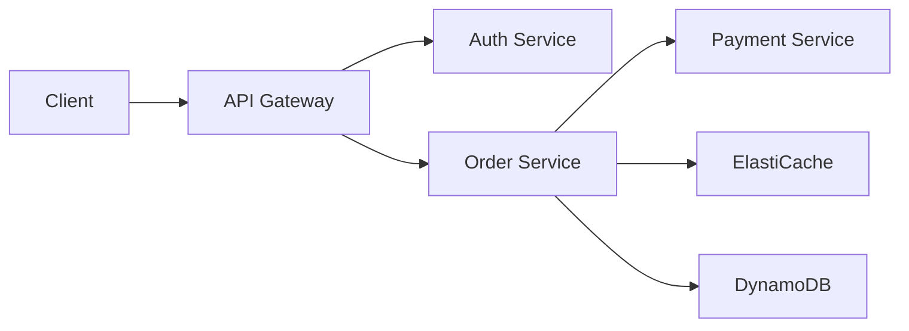

# AWS X-Ray

> **最終更新**: September 13, 2026

## 概要

AWS X-Ray は、分散アプリケーション内のリクエストをトレースおよび分析するための AWS ネイティブサービスです。EKS 環境で X-Ray を使用すると、マイクロサービス間のリクエストフローを可視化し、パフォーマンスボトルネックを特定し、エラーの根本原因を判断できます。

**X-Ray SDK と daemon は 2026 年 2 月 25 日以降メンテナンスモードとなっており**、現在の[サポートタイムライン](https://docs.aws.amazon.com/xray/latest/devguide/xray-sdk-daemon-timeline.html)ではセキュリティ修正のみが提供され、終了日は発表されていません。これはインストルメンテーションのライフサイクルを指すものであり、X-Ray サービスの廃止ではありません。AWS は新しいインストルメンテーションおよび移行には OpenTelemetry を推奨しています。以下の daemon の例は、レガシー互換性のためのパスです。

## 主な機能

| 機能 | 説明 |
|---------|-------------|
| **Service Map** | サービス依存関係の自動可視化 |
| **Request Tracing** | エンドツーエンドのリクエストパス追跡 |
| **Analysis Tools** | レスポンスタイム分布、エラー率分析 |
| **AWS Integration** | Lambda、API Gateway、ECS、EKS のネイティブサポート |
| **Sampling Rules** | 一元化されたサンプリング設定 |
| **Groups and Alerts** | フィルターベースのグループ化と CloudWatch アラート |

## アーキテクチャ

以下は、ここで説明する 2 つの収集方式を示しています。daemon は署名付き HTTPS リクエストを AWS に送信します。UDP/TCP2000 はアプリケーション向けのレガシープロトコルです。構成された ADOT awsxray exporter は、ネイティブ CloudWatch OTLP エンドポイントではなく PutTraceSegments を使用します。



EKS がすべてのアプリケーションを自動的にインストルメントするわけではありません。Lambda/API Gateway およびその他のサービス統合には、それぞれでサポートされたトレース設定と伝播が必要です。ネイティブ CloudWatch OTLP は、以下で説明する Transaction Search および SigV4 の前提条件を持つ別の取り込みパスです。

## X-Ray Daemon のデプロイ

### DaemonSet としてデプロイする

```yaml
# xray-daemon.yaml
apiVersion: v1
kind: ServiceAccount
metadata:
  name: xray-daemon
  namespace: amazon-cloudwatch
  annotations:
    eks.amazonaws.com/role-arn: arn:aws:iam::123456789012:role/xray-daemon-role
---
apiVersion: apps/v1
kind: DaemonSet
metadata:
  name: xray-daemon
  namespace: amazon-cloudwatch
spec:
  selector:
    matchLabels:
      app: xray-daemon
  updateStrategy:
    type: RollingUpdate
  template:
    metadata:
      labels:
        app: xray-daemon
    spec:
      serviceAccountName: xray-daemon
      nodeSelector:
        kubernetes.io/os: linux
      containers:
        - name: xray-daemon
          image: amazon/aws-xray-daemon:3.7.0@sha256:a2303d37f9dd7077c93e596689cb1de12f2ef8333c15b088ba223840164f6bc2
          args: ["-o", "-n", "ap-northeast-2"]
          ports:
            - name: xray-udp
              containerPort: 2000
              protocol: UDP
            - name: xray-tcp
              containerPort: 2000
              protocol: TCP
          resources:
            requests:
              cpu: 50m
              memory: 64Mi
            limits:
              cpu: 100m
              memory: 128Mi
          env:
            - name: AWS_REGION
              value: ap-northeast-2
      tolerations:
        - key: node-role.kubernetes.io/master
          effect: NoSchedule
---
apiVersion: v1
kind: Service
metadata:
  name: xray-daemon
  namespace: amazon-cloudwatch
spec:
  selector:
    app: xray-daemon
  ports:
    - name: xray-udp
      port: 2000
      protocol: UDP
    - name: xray-tcp
      port: 2000
      protocol: TCP
  type: ClusterIP
```

このメンテナンスパスのイメージは、検証済みの公式 3.7.0 マルチアーキテクチャマニフェスト（Linux amd64/arm64）にピン留めされています。エントリーポイントは `/usr/bin/xray` ではなく `/xray` です。`-o` は EC2 メタデータの付加を無効化し、`-n` は Region を指定します。DaemonSet は EKS Fargate 上では実行されません。この ClusterIP Service は別のノードの daemon を選択できるため、ノードローカル配信または UDP の損失なし配信は保証しません。

レガシー SDK クライアントでは、`AWS_XRAY_DAEMON_ADDRESS=xray-daemon.amazon-cloudwatch.svc.cluster.local:2000` を設定します。UDP セグメントと TCP サンプリングトラフィックの両方に到達可能性が必要です。この暗号化されていないレガシーパスは信頼できるワークロードに限定してください。認証済み TLS 収集には OpenTelemetry パスを使用します。producer ごとに収集パスを 1 つ選択してください。


### IRSA 設定

既存の所有者を通じて `amazon-cloudwatch` namespace を作成します。レガシー daemon の `xray-daemon` ServiceAccount は、準備済みの専用 role を参照する必要があります。次の権限ポリシーはセグメント/telemetry のエクスポートおよび一元化されたサンプリング呼び出しを対象としています。Region は実際のデプロイ Region に置き換えてください。

```json
{
  "Version": "2012-10-17",
  "Statement": [
    {
      "Effect": "Allow",
      "Action": [
        "xray:PutTraceSegments",
        "xray:PutTelemetryRecords",
        "xray:GetSamplingRules",
        "xray:GetSamplingTargets",
        "xray:GetSamplingStatisticSummaries"
      ],
      "Resource": "*",
      "Condition": {
        "StringEquals": {
          "aws:RequestedRegion": "ap-northeast-2"
        }
      }
    }
  ]
}
```

これらの X-Ray アクションは `Resource: "*"` を使用し、ここでは `aws:RequestedRegion` で制約されています。daemon のポリシーは、以下のより狭い ADOT ポリシーとは別です。どちらのポリシーも、operator にグループまたはサンプリングルールを作成する権限を与えません。

いずれの collector でも、クラスターに登録された OIDC provider、`aud=sts.amazonaws.com`、および**完全に一致する namespace/ServiceAccount subject**を使用して IRSA role を準備します。以下の trust の例は `adot-collector` 用です。daemon role には代わりに `system:serviceaccount:amazon-cloudwatch:xray-daemon` が必要です。例示の account、Region、OIDC ID は一貫して置き換えてください。

```json
{
  "Version": "2012-10-17",
  "Statement": [
    {
      "Effect": "Allow",
      "Principal": {
        "Federated": "arn:aws:iam::123456789012:oidc-provider/oidc.eks.ap-northeast-2.amazonaws.com/id/EXAMPLE"
      },
      "Action": "sts:AssumeRoleWithWebIdentity",
      "Condition": {
        "StringEquals": {
          "oidc.eks.ap-northeast-2.amazonaws.com/id/EXAMPLE:aud": "sts.amazonaws.com",
          "oidc.eks.ap-northeast-2.amazonaws.com/id/EXAMPLE:sub": "system:serviceaccount:amazon-cloudwatch:adot-collector"
        }
      }
    }
  ]
}
```

IAM/インフラストラクチャの所有者に、意図した role を作成または更新し、一致する権限ポリシーをアタッチしてもらいます。既存の ServiceAccount の所有権を維持してください。一般的なセットアップ手順として `eksctl --override-existing-serviceaccounts` を実行してはいけません。承認済み環境で、レンダリングされた Pod の投影トークン、role ARN、SDK の認証情報解決、および実際の認可を検証してください。ServiceAccount annotation だけでは認可テストにはなりません。

## ADOT Collector のデプロイ

このトレースパイプラインは、Collector/Contrib 0.158.0 に基づく [ADOT Collector 0.50.0](https://github.com/aws-observability/aws-otel-collector/releases/tag/v0.50.0) を使用します。リリース済み ADOT distribution には独自のコンポーネント一覧があります。upstream Contrib リリースのすべてのコンポーネントを含むと想定しないでください。ピン留めした collector バイナリは、合成 OTLP/X-Ray データおよび偽の loopback X-Ray endpoint を用いてローカルで実行されました。AWS 認可、Kubernetes デプロイ、または本番可用性テストは実施されていません。

<a id="adot-collector-daemonset"></a>

### Collector のデプロイと前提条件

この例は、host port なしの中央の **Deployment** と ClusterIP Service 1 つです。HA 構成ではありません。アプリケーションはその DNS endpoint を明示的に選択します。これをインストールしてもアプリケーションはインストルメントされません。DaemonSet は別の配置設計であり、EKS Fargate ではサポートされません。Fargate 上の Deployment には、対応する Fargate profile およびサポートされたリソース/ストレージ/ネットワーク構成が依然として必要です。

これらのリソースを適用する前に、以下を実行してください。

- 前節の namespace と IRSA role を、subject `system:serviceaccount:amazon-cloudwatch:adot-collector` で準備します。
- 既存の Kubernetes Secret `adot-collector-tls` を、承認済みの証明書プロセスを通じて提供します。これには `server.crt`、`server.key`、`ca.crt` が含まれます。サーバー証明書は、たとえば `adot-collector.amazon-cloudwatch.svc.cluster.local` のように実際の Service DNS 名を対象とする必要があります。CA は意図したクライアント証明書を信頼する必要があります。
- 承認済みの CA/クライアント証明書/key ファイルを producer にマウントします。Secret へのアクセス、ポート 4317/4318 と health endpoint へのワークロードアクセスを制限し、証明書ローテーションを計画してください。証明書 private key の内容や AWS 認証情報を環境変数に配置してはいけません。
- cluster/account/Region の値を置き換え、最終的な workload identity を検査します。resource processor はクラスター名を 1 つ明示的に設定します。すべての Pod/node metadata を検出するわけではなく、無関係なクラスターからのトラフィックをこのクラスターのものとして再ラベル付けしてはいけません。

以下の ADOT パイプラインは exporter telemetry を無効化し、従来の X-Ray `PutTraceSegments` エクスポートパスのみを使用するため、workload の権限ポリシーは次のとおりです。

```json
{
  "Version": "2012-10-17",
  "Statement": [
    {
      "Effect": "Allow",
      "Action": ["xray:PutTraceSegments"],
      "Resource": "*",
      "Condition": {
        "StringEquals": {
          "aws:RequestedRegion": "ap-northeast-2"
        }
      }
    }
  ]
}
```

この完全な ConfigMap を、次の workload/Service manifest とともに使用してください。

```yaml
apiVersion: v1
kind: ConfigMap
metadata:
  name: adot-collector-config
  namespace: amazon-cloudwatch
data:
  collector.yaml: |
    receivers:
      otlp:
        protocols:
          grpc:
            endpoint: 0.0.0.0:4317
            tls:
              cert_file: /etc/otel/tls/server.crt
              key_file: /etc/otel/tls/server.key
              client_ca_file: /etc/otel/tls/ca.crt
              min_version: "1.2"
          http:
            endpoint: 0.0.0.0:4318
            tls:
              cert_file: /etc/otel/tls/server.crt
              key_file: /etc/otel/tls/server.key
              client_ca_file: /etc/otel/tls/ca.crt
              min_version: "1.2"
    processors:
      memory_limiter:
        check_interval: 1s
        limit_mib: 400
        spike_limit_mib: 100
      resource:
        attributes:
          - key: cloud.provider
            value: aws
            action: upsert
          - key: k8s.cluster.name
            value: ${env:CLUSTER_NAME}
            action: upsert
      batch:
        timeout: 5s
        send_batch_size: 256
        send_batch_max_size: 512
    exporters:
      awsxray:
        region: ap-northeast-2
        local_mode: true
        index_all_attributes: false
        indexed_attributes:
          - deployment.environment.name
          - app.operation
        telemetry:
          enabled: false
    extensions:
      health_check:
        endpoint: 0.0.0.0:13133
    service:
      extensions: [health_check]
      pipelines:
        traces:
          receivers: [otlp]
          processors: [memory_limiter, resource, batch]
          exporters: [awsxray]
```

```yaml
apiVersion: v1
kind: ServiceAccount
metadata:
  name: adot-collector
  namespace: amazon-cloudwatch
  annotations:
    eks.amazonaws.com/role-arn: arn:aws:iam::123456789012:role/adot-xray-role
automountServiceAccountToken: false
---
apiVersion: apps/v1
kind: Deployment
metadata:
  name: adot-collector
  namespace: amazon-cloudwatch
spec:
  replicas: 1
  selector:
    matchLabels:
      app: adot-collector
  template:
    metadata:
      labels:
        app: adot-collector
    spec:
      serviceAccountName: adot-collector
      nodeSelector:
        kubernetes.io/os: linux
      automountServiceAccountToken: false
      terminationGracePeriodSeconds: 30
      securityContext:
        runAsNonRoot: true
        runAsUser: 4317
        runAsGroup: 4317
        fsGroup: 4317
        seccompProfile:
          type: RuntimeDefault
      containers:
        - name: collector
          image: public.ecr.aws/aws-observability/aws-otel-collector:v0.50.0
          args: ["--config=/conf/collector.yaml"]
          env:
            - name: CLUSTER_NAME
              value: replace-with-cluster-name
            - name: AWS_REGION
              value: ap-northeast-2
            - name: AWS_EC2_METADATA_DISABLED
              value: "true"
            - name: GOMEMLIMIT
              value: 400MiB
          resources:
            requests:
              cpu: 100m
              memory: 256Mi
            limits:
              cpu: 500m
              memory: 512Mi
          securityContext:
            allowPrivilegeEscalation: false
            readOnlyRootFilesystem: true
            capabilities:
              drop: [ALL]
          ports:
            - name: otlp-grpc
              containerPort: 4317
            - name: otlp-http
              containerPort: 4318
            - name: health
              containerPort: 13133
          volumeMounts:
            - name: config
              mountPath: /conf
              readOnly: true
            - name: tls
              mountPath: /etc/otel/tls
              readOnly: true
          readinessProbe:
            httpGet:
              path: /
              port: health
            initialDelaySeconds: 5
          livenessProbe:
            httpGet:
              path: /
              port: health
            initialDelaySeconds: 15
      volumes:
        - name: config
          configMap:
            name: adot-collector-config
        - name: tls
          secret:
            secretName: adot-collector-tls
            defaultMode: 0440
---
apiVersion: v1
kind: Service
metadata:
  name: adot-collector
  namespace: amazon-cloudwatch
spec:
  type: ClusterIP
  selector:
    app: adot-collector
  ports:
    - name: otlp-grpc
      port: 4317
      targetPort: otlp-grpc
    - name: otlp-http
      port: 4318
      targetPort: otlp-http
```

container image は `RUN_IN_CONTAINER=True` を提供します。スタンドアロンのネイティブ collector テストでは、そのカスタム CLI logging を `/opt` から遠ざけるためにこの変数が必要です。その CLI はすべての upstream `otelcol` コマンドと互換ではありません。ローカルテストでは、バージョン指定された AWS バイナリ、テスト証明書、および loopback の宛先のみを使用しました。

提案した構成は、クライアント証明書なしでの拒否と信頼済み証明書での受け入れを含む、5 つのローカル mTLS チェックに合格しました。3 つの Kubernetes リソースは、ローカル OpenAPI schema validation に合格しました。これは実際の Secret、IRSA mutation、CNI policy、scheduling、AWS 権限を検証するものではありません。health endpoint は collector プロセスの正常性を報告するものであり、X-Ray への正常な配信を報告するものではありません。queue、retry、memory pressure、termination、backend failure によって telemetry が失われる可能性はあります。容量を計画し、拒否/ドロップ/export 失敗データを監視してください。

### レガシー X-Ray Receiver と独立した Telemetry パイプライン

ADOT 0.50.0 には `awsxray` receiver も含まれます。サポートされる UDP 構成は次のとおりです。

```yaml
# Receiver fragment only; requires an explicitly connected trace pipeline.
receivers:
  awsxray:
    endpoint: 0.0.0.0:2000
    transport: udp
```

このレガシー receiver は、daemon を介して SDK セグメントを送信する方式の代替です。同じ producer のトレースパスを重複させないでください。また、デフォルトで TCP sampling proxy も開始します。一元化されたサンプリングを使用する場合は、UDP2000 に加え、必要な TCP2000 Service/proxy パスおよびサンプリング権限も構成して制限してください。レガシープロトコルは、OTLP receiver の mTLS 設定では保護されません。ネイティブ監査では OTLP と X-Ray UDP の両方の受信を確認しましたが、リモート AWS サンプリングは実行していません。

metrics、アプリケーションログ、traces には、それぞれ接続されたパイプラインと backend 構成が必要です。`awscloudwatchlogs` exporter を宣言するだけでは trace がログに変換されず、架空の `/aws/xray/traces` log group に書き込まれることもありません。metrics remote-write endpoint についても実際の receiver、認証、TLS 構成が必要であり、X-Ray の前提条件ではありません。

## OpenTelemetry から X-Ray への統合

これらの例では、上記の認証済み collector Service を使用します。producer にはその Service へのアクセスと、マウントされたクライアント TLS ファイルが必要です。collector の AWS 認証情報は必要ありません。これらの例は合成 span を作成し、支払い、データベース、AWS のビジネス操作を実行しません。

正確な検証ベースラインは、Flask3.1.3 を伴う Python SDK/exporter1.44.0、Go1.26.8 を伴う Go SDK/exporter1.44.0、および Java1.66.0 API sources です。これらの pin は、汎用的な AWS 互換性マトリックスでも、すべての言語が同じ最新リリースを持つという主張でもありません。Python と Go はローカルで実行しました。Java API/configuration は tag 付き source で確認しましたが、この監査では JDK/Maven のコンパイルは利用できませんでした。

有限の demo プロセスには、これらの設定を使用します。endpoint には、OTLP/HTTP 用に `/v1/traces` を含めます。クライアント private key は、保護されたマウントファイルに保持してください。この有限のデモでは root span がサンプリングされ、remote parent の決定が尊重されます。すべての root を対象とする demo 設定を無制限の本番トラフィックにコピーするのではなく、測定された本番 sampler を選択してください。汎用 SDK sampler は X-Ray の一元化ルールを自動的に取得しません。

```bash
# Application-process configuration; mounted file paths are not secret contents.
export OTEL_SDK_DISABLED=false
export OTEL_SERVICE_NAME=inventory-demo
export OTEL_TRACES_EXPORTER=otlp
export OTEL_METRICS_EXPORTER=none
export OTEL_LOGS_EXPORTER=none
export OTEL_EXPORTER_OTLP_TRACES_PROTOCOL=http/protobuf
export OTEL_EXPORTER_OTLP_TRACES_ENDPOINT=https://adot-collector.amazon-cloudwatch.svc.cluster.local:4318/v1/traces
export OTEL_EXPORTER_OTLP_TRACES_CERTIFICATE=/etc/otel/client/ca.crt
export OTEL_EXPORTER_OTLP_TRACES_CLIENT_CERTIFICATE=/etc/otel/client/client.crt
export OTEL_EXPORTER_OTLP_TRACES_CLIENT_KEY=/etc/otel/client/client.key
export OTEL_PROPAGATORS=tracecontext
export OTEL_TRACES_SAMPLER=parentbased_always_on
```

### アプリケーション設定 (Java)

`InventoryDemo.java` を既存の Java project に保存します。autoconfiguration は、標準の OTLP endpoint、protocol、CA/client-key/client-certificate ファイル設定を読み取ります。アプリケーション全体を自動的にインストルメントするものではありません。agent/framework がすでに所有している場合は、別の SDK を初期化しないでください。`OpenTelemetrySdk` は Closeable を実装しています。これを閉じると provider の shutdown が調整されますが、完了した method call は backend 配信の証明にはなりません。

```xml
<!-- Dependency fragment for an existing Java17+ Maven project. -->
<dependencies>
  <dependency>
    <groupId>io.opentelemetry</groupId>
    <artifactId>opentelemetry-sdk-extension-autoconfigure</artifactId>
    <version>1.66.0</version>
  </dependency>
  <dependency>
    <groupId>io.opentelemetry</groupId>
    <artifactId>opentelemetry-exporter-otlp</artifactId>
    <version>1.66.0</version>
  </dependency>
</dependencies>
```

```java
import io.opentelemetry.api.trace.Span;
import io.opentelemetry.api.trace.Tracer;
import io.opentelemetry.context.Scope;
import io.opentelemetry.sdk.OpenTelemetrySdk;
import io.opentelemetry.sdk.autoconfigure.AutoConfiguredOpenTelemetrySdk;

// Standalone finite demo; do not create a second SDK when an agent/framework owns it.
public final class InventoryDemo {
    public static void main(String[] args) {
        try (OpenTelemetrySdk sdk = AutoConfiguredOpenTelemetrySdk.builder()
                .build().getOpenTelemetrySdk()) {
            Tracer tracer = sdk.getTracer("inventory-demo");
            Span root = tracer.spanBuilder("inventory.demo").startSpan();
            try (Scope ignored = root.makeCurrent()) {
                root.setAttribute("app.operation", "inventory.demo");
                root.setAttribute("deployment.environment.name", "demo");
                Span child = tracer.spanBuilder("inventory.lookup").startSpan();
                try {
                    child.setAttribute("lookup.result", "demo");
                    // No AWS or database call is performed by this example.
                } finally {
                    child.end();
                }
            } finally {
                root.end();
            }
        } // SDK close shuts down providers/exporters; delivery must still be monitored.
    }
}
```

### アプリケーション設定 (Python)

`opentelemetry-api==1.44.0`、`opentelemetry-sdk==1.44.0`、`opentelemetry-exporter-otlp-proto-http==1.44.0`、`Flask==3.1.3` を使用する分離されたアプリケーション環境を使用してください。次の内容を `payment_demo.py` として保存します。その `/api/payment` endpoint は合成レスポンスを返すだけで、実際の支払いを請求または検証しません。ローカル Flask development server は本番 WSGI デプロイではありません。

```python
"""Synthetic Flask instrumentation example: no payment is processed."""
import os
from pathlib import Path
from urllib.parse import urlparse

from flask import Flask, jsonify, request
from opentelemetry.exporter.otlp.proto.http.trace_exporter import OTLPSpanExporter
from opentelemetry.sdk.resources import Resource
from opentelemetry.sdk.trace import TracerProvider
from opentelemetry.sdk.trace.export import BatchSpanProcessor
from opentelemetry.sdk.trace.sampling import ParentBased, ALWAYS_ON
from opentelemetry.trace import SpanKind
from opentelemetry.trace.propagation.tracecontext import TraceContextTextMapPropagator


def configure_provider():
    endpoint = os.environ["OTEL_EXPORTER_OTLP_TRACES_ENDPOINT"]
    url = urlparse(endpoint)
    if url.scheme != "https" or not url.hostname or url.username or url.password:
        raise ValueError("Configure an HTTPS collector endpoint without URL credentials")
    certs = {
        "certificate_file": os.environ["OTEL_EXPORTER_OTLP_TRACES_CERTIFICATE"],
        "client_certificate_file": os.environ["OTEL_EXPORTER_OTLP_TRACES_CLIENT_CERTIFICATE"],
        "client_key_file": os.environ["OTEL_EXPORTER_OTLP_TRACES_CLIENT_KEY"],
    }
    for path in certs.values():
        if not Path(path).is_file():
            raise ValueError("A required mounted TLS file is missing")
    provider = TracerProvider(
        resource=Resource.create({"service.name": "payment-demo"}),
        # Finite demo traffic only. Select a measured production sampling policy.
        sampler=ParentBased(ALWAYS_ON),
    )
    provider.add_span_processor(BatchSpanProcessor(
        OTLPSpanExporter(endpoint=endpoint, timeout=5, **certs),
        max_queue_size=256, max_export_batch_size=64,
    ))
    return provider


def create_app(provider):
    app = Flask(__name__)
    tracer = provider.get_tracer("payment-demo")
    propagator = TraceContextTextMapPropagator()

    @app.post("/api/payment")
    def payment_demo():
        carrier = {name.lower(): value for name, value in request.headers.items()}
        parent = propagator.extract(carrier)
        with tracer.start_as_current_span(
            "POST /api/payment", context=parent, kind=SpanKind.SERVER
        ) as span:
            span.set_attribute("app.operation", "payment.demo")
            span.set_attribute("deployment.environment.name", "demo")
            span.set_attribute("http.request.method", "POST")
            span.set_attribute("http.route", "/api/payment")
            with tracer.start_as_current_span("validation.demo") as child:
                child.set_attribute("validation.result", "accepted")
            span.set_attribute("http.response.status_code", 202)
            # No request payload/Authorization/user ID is added to telemetry.
            return jsonify(status="demo-only-no-payment-processed"), 202

    return app


if __name__ == "__main__":
    provider = configure_provider()
    try:
        # Local development server only; not a production WSGI deployment.
        create_app(provider).run(host="127.0.0.1", port=8080)
    finally:
        provider.shutdown()
```

### アプリケーション設定 (Go)

次の `go.mod` と `main.go` を別の example directory に保存し、`go mod tidy` で pin 留めされた依存関係を解決して、意図した collector/TLS 環境でのみ実行してください。この sample は有限の span を 2 つ出力します。`DEMO_TRACEPARENT` は任意のデモ用 carrier です。実際の HTTP handler はリクエスト header から抽出し、送信リクエストへ inject する必要があります。SDK を作成するだけでは、すべての HTTP/database library にインストルメンテーションは追加されません。

```text
module example.invalid/xray-otel-demo

go 1.25.0

require (
    go.opentelemetry.io/otel v1.44.0
    go.opentelemetry.io/otel/exporters/otlp/otlptrace/otlptracehttp v1.44.0
    go.opentelemetry.io/otel/sdk v1.44.0
    go.opentelemetry.io/otel/trace v1.44.0
)
```

```go
package main

import (
	"context"
	"fmt"
	"log"
	"net/url"
	"os"
	"time"

	"go.opentelemetry.io/otel/attribute"
	"go.opentelemetry.io/otel/exporters/otlp/otlptrace/otlptracehttp"
	"go.opentelemetry.io/otel/propagation"
	"go.opentelemetry.io/otel/sdk/resource"
	sdktrace "go.opentelemetry.io/otel/sdk/trace"
	"go.opentelemetry.io/otel/trace"
)

func configureProvider(ctx context.Context) (*sdktrace.TracerProvider, error) {
	endpoint := os.Getenv("OTEL_EXPORTER_OTLP_TRACES_ENDPOINT")
	u, err := url.Parse(endpoint)
	if err != nil || u.Scheme != "https" || u.Hostname() == "" || u.User != nil {
		return nil, fmt.Errorf("configure an HTTPS collector endpoint without URL credentials")
	}
	for _, name := range []string{
		"OTEL_EXPORTER_OTLP_TRACES_CERTIFICATE",
		"OTEL_EXPORTER_OTLP_TRACES_CLIENT_CERTIFICATE",
		"OTEL_EXPORTER_OTLP_TRACES_CLIENT_KEY",
	} {
		info, err := os.Stat(os.Getenv(name))
		if err != nil || !info.Mode().IsRegular() {
			return nil, fmt.Errorf("required mounted TLS file is missing: %s", name)
		}
	}
	// This exporter reads the standard signal-specific TLS file environment settings.
	exporter, err := otlptracehttp.New(ctx,
		otlptracehttp.WithEndpointURL(endpoint),
		otlptracehttp.WithTimeout(5*time.Second))
	if err != nil {
		return nil, err
	}
	return sdktrace.NewTracerProvider(
		sdktrace.WithResource(resource.NewSchemaless(
			attribute.String("service.name", "inventory-demo"))),
		// Finite demo only; honors a remote parent's unsampled decision.
		sdktrace.WithSampler(sdktrace.ParentBased(sdktrace.AlwaysSample())),
		sdktrace.WithBatcher(exporter),
	), nil
}

func emitDemo(ctx context.Context, tracer trace.Tracer) {
	ctx, parent := tracer.Start(ctx, "inventory.demo")
	defer parent.End()
	parent.SetAttributes(
		attribute.String("app.operation", "inventory.demo"),
		attribute.String("deployment.environment.name", "demo"))
	_, child := tracer.Start(ctx, "inventory.lookup")
	child.SetAttributes(attribute.String("lookup.result", "demo"))
	child.End()
}

func run() error {
	ctx := context.Background()
	provider, err := configureProvider(ctx)
	if err != nil {
		return err
	}
	// Optional CLI demonstration carrier, not automatic HTTP instrumentation.
	parent := propagation.TraceContext{}.Extract(ctx,
		propagation.MapCarrier{"traceparent": os.Getenv("DEMO_TRACEPARENT")})
	emitDemo(parent, provider.Tracer("inventory-demo"))
	shutdown, cancel := context.WithTimeout(ctx, 10*time.Second)
	defer cancel()
	return provider.Shutdown(shutdown)
}

func main() {
	if err := run(); err != nil {
		log.Fatal(err)
	}
}
```

Python の例は、混在した大文字小文字の incoming header、parent/child identity、unsampled parent、機密 payload の除外、および実際の loopback mTLS OTLP POST を対象とする 13 のチェックに合格しました。Go は、mTLS/protobuf export、W3C identity、unsampled parent、plaintext rejection、TLS ファイル欠落を対象とする 4 つの native test に合格しました。いずれのテストも AWS には接続しておらず、本番アプリケーションのパフォーマンスを実証していません。Java の import、lifecycle、TLS autoconfiguration は source のみで検証されています。

伝播は意図的に選択してください。ここでは W3C Trace Context を使用します。X-Amzn-Trace-Id の相互運用性には、特定の言語/統合に適した AWS propagator が必要になる場合がありますが、W3C trace に X-Ray 固有の ID generator が常に必要なわけではありません。複数の形式を受け入れる場合は、propagator を無差別に組み合わせるのではなく、優先順位と信頼境界を定義してください。非同期作業では parent context を明示的に引き継ぐ必要があります。

## サンプリングルール

### 一元化されたサンプリング設定

X-Ray の一元化ルールは、互換性のある X-Ray remote sampler を使用する producer にのみ適用されます。汎用 OpenTelemetry `parentbased_traceidratio` sampler はこれらのルールを取得せず、ルールを作成しても SDK で remote sampling が有効になるわけではありません。collector の `awsxray` exporter はすでに選択された span をエクスポートします。リクエストを遡って選択するものではありません。

head sampling は、完了したレスポンスが判明する前に決定します。将来の HTTP500 または最終 duration に一致させても、すべての error/slow request の取得は保証できません。従来の X-Ray SDK は `Attributes` を含むルールを無視し、`ResourceARN: "*"` をサポートします。以前の error-attribute ルールは動作する全 error ポリシーではありませんでした。広く一致する “slow” ルールも、最終的な latency を検査しません。

ルールは数値 priority の昇順で一致します。reservoir target と fixed rate はベストエフォートのサンプリング動作であり、到着するリクエストが少ない場合に毎秒 10 trace を保証するものではありません。parent の決定、サポートされる sampler 実装、分散 quota が重要です。

以下は 3 つの独立したリクエストファイルです。AWS API shape はローカルで検証しましたが、AWS には適用していません。

**`sampling-production.json` — 一般的な API リクエストポリシー:**

```json
{
  "SamplingRule": {
    "RuleName": "docs-production-api",
    "ResourceARN": "*",
    "Priority": 1000,
    "FixedRate": 0.05,
    "ReservoirSize": 10,
    "ServiceName": "*",
    "ServiceType": "*",
    "Host": "*",
    "HTTPMethod": "*",
    "URLPath": "/api/*",
    "Version": 1,
    "Attributes": {}
  }
}
```

**`sampling-health.json` — より高い優先度の GET health-check 除外:**

```json
{
  "SamplingRule": {
    "RuleName": "docs-health-checks",
    "ResourceARN": "*",
    "Priority": 100,
    "FixedRate": 0,
    "ReservoirSize": 0,
    "ServiceName": "*",
    "ServiceType": "*",
    "Host": "*",
    "HTTPMethod": "GET",
    "URLPath": "/health*",
    "Version": 1,
    "Attributes": {}
  }
}
```

**`sampling-adaptive.json` — 任意のリクエストスコープの適応型例:**

現在の [SamplingRateBoost](https://docs.aws.amazon.com/xray/latest/api/API_SamplingRateBoost.html) は、最大 rate と cooldown を持つ、anomaly 駆動の一時的な増加をサポートしています。`MaxRate: 0.5` は、50% の相対的な増加ではなく絶対的な sampling-rate cap です。これは遡及的な tail sampling でも、失敗したすべての request を取得する保証でもありません。使用前に producer の adaptive-sampling サポートを確認してください。

```json
{
  "SamplingRule": {
    "RuleName": "docs-adaptive-checkout",
    "ResourceARN": "*",
    "Priority": 200,
    "FixedRate": 0.05,
    "ReservoirSize": 1,
    "ServiceName": "*",
    "ServiceType": "*",
    "Host": "*",
    "HTTPMethod": "POST",
    "URLPath": "/api/checkout*",
    "Version": 1,
    "Attributes": {},
    "SamplingRateBoost": {
      "MaxRate": 0.5,
      "CooldownWindowMinutes": 10
    }
  }
}
```

### サンプリングルールの管理

何かを作成、更新、または削除する前に、意図した account/Region の既存の rule name と priority を検査してください。必要な rule-management 権限を持つ operator role を使用します。collector の書き込み権限だけでは不十分です。

```bash
set -euo pipefail
: "${AWS_REGION:?Set the reviewed Region}"
aws xray get-sampling-rules --region "$AWS_REGION"
aws xray get-sampling-statistic-summaries --region "$AWS_REGION"
# AWS mutation: apply only a reviewed new rule with no conflicting owner.
aws xray create-sampling-rule --region "$AWS_REGION"   --cli-input-json file://sampling-production.json
```

所有する既存ルールには `update-sampling-rule` を使用し、その以前の構成を保持してください。明示的に廃止された所有ルールのみを `delete-sampling-rule` で削除します。lookup の失敗や推測した名前のどちらも、ルールを安全に削除できる証明にはなりません。

error/latency に基づいて完了した trace を保持するには、別途設計された tail-sampling pipeline を評価してください。upstream head drop より前に関連する span を受け取り、各 trace を適切な sampler に保持し、late span と制限された memory を許容する必要があります。すでに破棄された span を復元したり、すべての error を損失なく取得することを約束したりすることはできません。

### フィルター式の例

これらは X-Ray query UI/API 用の filter expression であり、shell command や Logs Insights query ではありません。duration 値の単位は秒です。`> 2` は 2 秒より厳密に大きいことを意味します。producer が実際に出力し index した annotation を選択してください。

```text
service("order-service")
http.status >= 400
responsetime > 2
annotation[environment] = "demo"
service("api-gateway") AND responsetime > 1 AND !fault
edge("api-gateway", "order-service")
```

## Service Map

### Trace Map の使用

CloudWatch の trace map は、X-Ray map と旧 ServiceLens map を統合します。その traffic color はカテゴリを区別します。赤は server fault（HTTP5xx）、黄は client error（HTTP4xx）、紫は throttling（HTTP429）、緑は成功した traffic を表します。任意の latency-warning threshold ではありません。

元の韓国語の図では、以下の topology を使用していました。その値は**例示的な集計平均**として保持しており、実際の測定値、1 trace の加算タイミング、QPS の順位ではありません。outgoing connection が多いことは、Order Service が最も多くの request を受信することを証明しません。



| コンポーネント | 元の例示的な平均 |
|---|---:|
| Client |250ms|
| API Gateway |50ms|
| Auth Service |30ms|
| Order Service |100ms|
| Payment Service |150ms; illustrative error rate2%|
| ElastiCache |5ms|
| DynamoDB |20ms|

### Service Graph を読み取る

```bash
# Read-only AWS API example; requires the approved operator role.
set -euo pipefail
: "${AWS_REGION:?Set the reviewed Region}"
END_TIME=$(date -u +%s)
START_TIME=$((END_TIME - 3600))
aws xray get-service-graph --region "$AWS_REGION"   --start-time "$START_TIME" --end-time "$END_TIME"
# Add --group-name only for a verified existing group.
```

## CloudWatch ServiceLens 統合

### 実際の収集パスを構成する

CloudWatch は trace、metrics、logs を関連付けられますが、これらは実際に収集され、適切な service/trace identifier を共有している必要があります。マウントされていない ConfigMap は agent を構成しません。[CloudWatch Observability EKS add-on](https://docs.aws.amazon.com/AmazonCloudWatch/latest/monitoring/install-CloudWatch-Observability-EKS-addon.html) または承認済みの既存 agent/operator 構成を使用し、その所有者、IAM identity、Secret/CA 設定、サポート対象プラットフォームの動作を維持してください。別の collector がすでに所有する host port で追加の receiver を開始してはいけません。以前の ConfigMap のみでは、この統合は確立されていませんでした。

ネイティブ OTLP trace ingestion は HTTPS endpoint `https://xray.REGION.amazonaws.com/v1/traces`、**SigV4 を使用する HTTP**を使用し、[Transaction Search](https://docs.aws.amazon.com/AmazonCloudWatch/latest/monitoring/CloudWatch-Transaction-Search.html) が必要です。その URL を指定した汎用の unsigned OTLP exporter では不十分です。これは、OTLP span を従来の X-Ray segment document に変換する上記の ADOT awsxray exporter とは異なります。

Transaction Search は構造化 span を CloudWatch `aws/spans` log group に保存します。その index-sampling control は producer head sampling および span ingestion とは別です。X-Ray は W3C 128-bit trace ID をサポートします。従来の segment representation は `1-8hex-24hex` を使用しますが、W3C trace に X-Ray 固有の SDK ID generator が常に必要なわけではありません。実際の upstream/downstream 統合で必要な場合にのみ X-Amzn-Trace-Id propagation を選択し、複数の propagation format を受け入れる場合は優先順位を定義してください。

### Span 分析クエリ

以下は、[文書化された span field](https://docs.aws.amazon.com/AmazonCloudWatch/latest/monitoring/CloudWatch-Transaction-Search-search-analyze-spans.html) に基づく `aws/spans` 用の**独立した Logs Insights QL query**です。まず、ingestion path から実際の field を検査してください。すべての custom span に AWS local-service または HTTP attribute があるわけではありません。`xray.traces` という SQL table は提供されていません。これらの例は、文書化された query/field contract に対して確認されていますが、管理された CloudWatch account では実行されていません。

```text
fields @timestamp, durationNano, attributes.aws.local.service
| filter ispresent(durationNano)
| limit 20

# Separate query: sampled span durations in milliseconds, not request-level SLOs.
filter ispresent(durationNano) and ispresent(attributes.aws.local.service)
| stats count(*) as sampled_spans,
        avg(durationNano) / 1000000 as avg_ms,
        pct(durationNano, 99) / 1000000 as p99_ms
  by attributes.aws.local.service
| sort p99_ms desc

# Separate query: largest sampled HTTP 5xx span counts.
filter attributes.http.response.status_code >= 500
| stats count(*) as sampled_5xx_spans by attributes.aws.local.service
| sort sampled_5xx_spans desc
```

query UI で意図した time range と span/service scope を選択してください。複数の span が 1 つの request に属する場合があります。sampled span count と span-duration percentile は、偏りのない application error rate や request-latency SLO ではありません。request-level rate には、error のない正常な traffic、欠損データ、sampling bias を含む、一貫してスコープされた request metrics を使用してください。降順では最大値が選択されます。

## グループとフィルター

### X-Ray グループの作成

認可された operator role と意図した Region を使用してください。作成前に既存の group を確認し、所有する既存 group には update operation を使用します。以下の demo filter は SDK の例で出力された、明示的に index された environment attribute に一致します。適切な場合は、実際の本番 field/value に置き換えてください。

```bash
set -euo pipefail
: "${AWS_REGION:?Set the reviewed Region}"
aws xray get-groups --region "$AWS_REGION"
# AWS mutations: create only reviewed new groups whose names are not already owned.
aws xray create-group --region "$AWS_REGION" --group-name docs-demo \
  --filter-expression 'annotation[deployment.environment.name] = "demo"'
aws xray create-group --region "$AWS_REGION" --group-name docs-errors \
  --filter-expression 'fault = true OR error = true'
aws xray create-group --region "$AWS_REGION" --group-name docs-slow \
  --filter-expression 'responsetime > 1'
aws xray create-group --region "$AWS_REGION" --group-name docs-payment \
  --filter-expression 'service("payment-demo")'
```

Group は収集された trace をフィルタリングし、関連 metrics を公開します。IAM isolation、retention、producer sampling を定義するものではありません。CloudWatch alarm は別途構成してテストしてください。空の結果は、アプリケーションが正常であることではなく、不一致の attribute、sampling、データ欠落、または誤った time range を意味する可能性があります。

## ベストプラクティス

### 1. Segment と Subsegment の設計

意味のある operation には範囲が限定された name を使用し、parent context を維持してください。以下のレガシー Java SDK fragment は、完全なアプリケーションや実行された AWS operation ではなく、入れ子になった同期処理を示します。X-Ray Java 2.21.1 の Segment/Subsegment は AutoCloseable を実装するため、try-with-resources は有効です。middleware が作成した segment は、2 番目の root を追加するのではなく再利用する必要があります。async/thread transition では、サポートされた明示的な context propagation が必要です。新規コードには OpenTelemetry を推奨します。

```java
// Legacy X-Ray SDK structure fragment; no database/payment/queue call is executed.
// AWSXRay, Segment and Subsegment are from the reviewed X-Ray Java SDK.
try (Segment segment = AWSXRay.beginSegment("ProcessOrder")) {
    segment.putAnnotation("operation", "checkout");
    segment.putAnnotation("environment", "demo");
    try (Subsegment lookup = AWSXRay.beginSubsegment("inventory.lookup")) {
        lookup.putMetadata("operation", "GetItem");
        // Invoke the application's reviewed client here, without recording secrets.
    }
    try (Subsegment payment = AWSXRay.beginSubsegment("payment.authorize")) {
        payment.putAnnotation("payment_method", "card");
    }
    try (Subsegment notification = AWSXRay.beginSubsegment("notification.publish")) {
        notification.putMetadata("operation", "SendMessage");
    }
}
```

### 2. Annotation と Metadata の使用

X-Ray は segment ごとに独立して 50 個ではなく、**trace ごとに最大 50 個の annotation**を index します。意図的に low-cardinality field を使用してください。Metadata は annotation として index されませんが、保存されアクセス可能なままです。redaction や privacy boundary ではありません。収集前に access token、cookie、private key、生の request/response payload、user identifier、SQL parameter を削除してください。Transaction Search の span/log access と retention も確認が必要です。collector の index_all_attributes=false は、index されない attribute を削除しません。

```java
// Synthetic, bounded examples. Never attach complete request/response bodies.
segment.putAnnotation("environment", "demo");
segment.putAnnotation("operation", "checkout");
segment.putMetadata("diagnostics", Map.of(
    "operation", "GetItem",
    "result_category", "success"
));
```

### 3. コスト最適化

選択したパスには、実際の SDK/remote-sampler または collector 構成を使用してください。汎用の sampling.default/errors YAML block は X-Ray API や ADOT 構成ではありません。health-check exclusion をより広範な API rule より前に置き、その効果を測定してください。head sampling は最終的な error の 100% を保証できません。recording、retrieval/scanning、Transaction Search ingestion/indexing、CloudWatch retention、collector capacity を、現在の料金に照らして個別に評価してください。index sampling と producer sampling は異なる control です。一方を減らしても、保存されるすべての span やすべての料金が必ずしも減るわけではありません。

## クイズ

[X-Ray クイズ](../../quizzes/observability/tracing/02-xray-quiz.md)で知識を確認しましょう。
