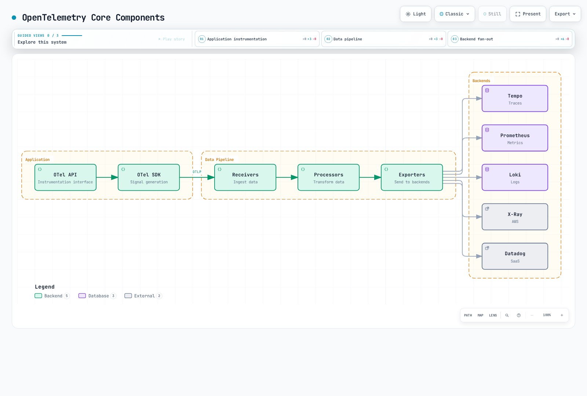
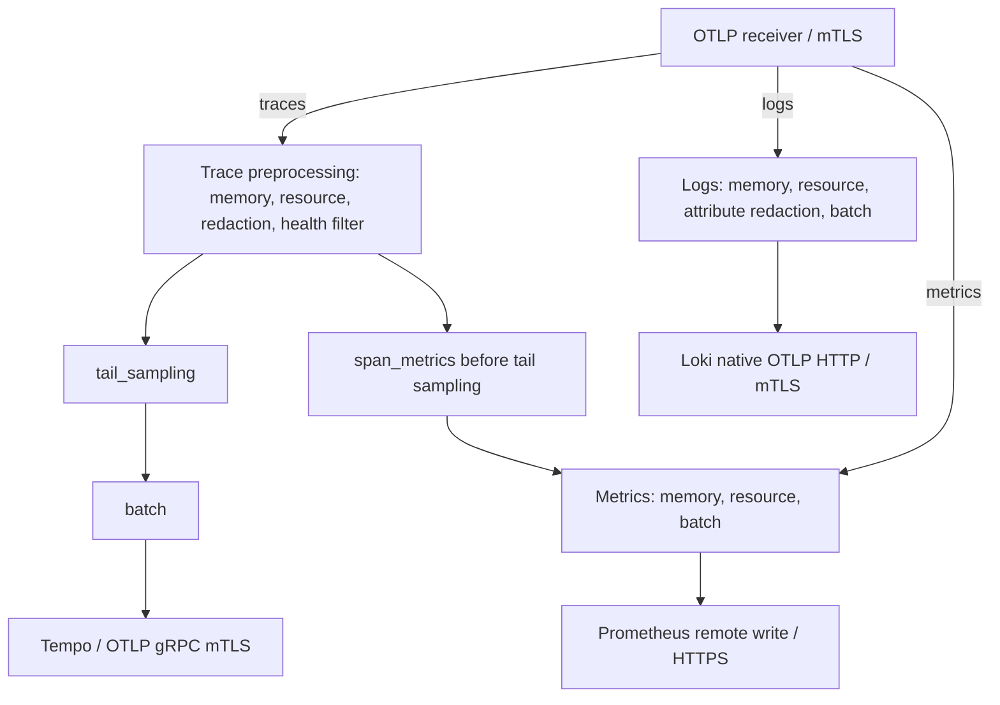

# OpenTelemetry

> **レビュー基準**: Collector Contrib 0.160.0; Operator 0.158.0; 言語バージョンは以下を参照
> **最終更新**: September 13, 2026

## はじめに

OpenTelemetry (OTel) は、クラウドネイティブソフトウェア向けのオブザーバビリティフレームワークです。Traces、Metrics、Logs という 3 つのシグナルを生成、収集、管理するためのベンダー中立な標準を提供します。2026 年 7 月 24 日付の CNCF 回顧記事では、貢献の速度が Kubernetes に次いで高いとされています。プロジェクトの成熟度と、個々の SDK/コンポーネントの安定性は別のものです。

### 2026 年 7 月の更新: CNCF Graduation

OpenTelemetry は **2026 年 5 月**に CNCF の **graduated** ステータスを達成しました。7 月 24 日の記事はその回顧です。これは Foundation の最高成熟度レベルであり、Kubernetes や Prometheus などのプロジェクトも保持しています。Graduation は、プロジェクトのガバナンス、セキュリティプラクティス、採用状況が本番利用向けに検証されたことを示します。回顧では、GenAI semantic conventions、ブラウザ/モバイルのオブザーバビリティ、スキーマのガバナンスとロールアウトツールについて扱っています。背景とロードマップは CNCF ブログ記事の ["OpenTelemetry has graduated… Now what?"](https://www.cncf.io/blog/2026/07/24/opentelemetry-has-graduated-now-what/) を参照してください。

## OpenTelemetry とは

OpenTelemetry は OpenTracing と OpenCensus プロジェクトの統合から生まれました。


[🔍 インタラクティブな図を表示](https://www.atomai.click/kubernetes-docs/archmaps/en-observability-tracing-03-opentelemetry-0.html)

## コアコンセプト

### 3 つのシグナル

この章では、traces、metrics、logs に焦点を当てます。Profiling も発展中のシグナルですが、サポートと安定性は実装によって異なります。Trace/log ID と metric exemplars には、適切な instrumentation と backend の設定が必要です。

| シグナル | 説明 | ユースケース |
|--------|-------------|-----------|
| **Traces** | 分散リクエストトレーシング | レイテンシー分析、依存関係マッピング |
| **Metrics** | 数値測定値 | リソース使用量、SLI/SLO |
| **Logs** | イベント記録 | デバッグ、監査 |

### コアコンポーネント



[🔍 インタラクティブな図を表示](https://www.atomai.click/kubernetes-docs/archmaps/en-observability-tracing-03-opentelemetry-2.html)

図はシグナル別の backend 選択肢を示しています。有効になるのは設定済みの exporter だけであり、以下の基本例ですべての vendor が自動的に有効になるわけではありません。


## OpenTelemetry SDK

Collector、Operator、Java agent、言語 SDK のバージョン番号は独立しています。これらの Linux workload テンプレートは Kubernetes 1.35 スキーマに対して確認されています。アプリケーションイメージ、namespace、証明書、宛先 Service は、それぞれの所有者が準備する必要があります。より広範な Operator マトリクスが、native sidecars などレシピ固有の要件をなくすわけではありません。ローカルチェックは、デプロイ済み EKS アプリケーションを保証するものではありません。

| コンポーネント | 基準と境界 |
|---|---|
| スタンドアロン Collector Contrib | 0.160.0; 実際の binary でコンポーネントとスキーマを確認 |
| Operator | 0.158.0; 互換性テーブルには Kubernetes 1.25–1.36 および cert-manager v1 が記載されている |
| Java agent | 2.31.1、対象 SDK は 1.65.0; Operator のデフォルト Java イメージと同じバージョンではない |
| Python | SDK/exporter 1.44.0、instrumentation/distro 0.65b0; Python ≥3.10 |
| Node.js CommonJS の例 | SDK-node 0.220.0、auto-instrumentations-node 0.78.0、resources 2.9.0、API 1.9.1 |

Operator のデフォルトは Collector 0.158.0 です。以下のスタンドアロン 0.160.0 workloads は、Operator 管理下の Collector のアップグレードではありません。サポート対象 EKS バージョンとの共通範囲を確認してください。最新の Kubernetes リリースが自動的に Operator マトリクスに含まれるわけではありません。

### Auto-instrumentation

2026 年 9 月 13 日時点で、EKS ライフサイクルページは 1.34、1.35、1.36 を standard support として掲載しています。1.35 のスキーマ基準はその一覧と Operator マトリクスに含まれますが、ライブのプラットフォーム/add-on 受け入れチェックに代わるものではありません。

ゼロコード instrumentation はサポート対象ライブラリをフックしますが、任意のビジネス操作を検出するものではありません。プロセスには、直接準備した agent/launcher または Operator injection のいずれかを選んでください。すでに設定済みの provider 上で 2 つ目の SDK を初期化しないでください。以下のアプリケーションイメージは、起動コマンドと依存関係を含む、独自のビルド用プレースホルダーです。

`ecommerce` namespace と、そこに `ca.crt`、`tls.crt`、`tls.key` を含む `otel-client-tls` Secret を準備してください。client 証明書は Collector に受け入れられ、Collector の証明書は `otel-collector.otel.svc.cluster.local` と一致する必要があります。Secret ファイルは読み取り専用でマウントされます。UID/GID のアクセス権はイメージに合わせて調整してください。環境変数には、キーの内容や bearer token ではなく、証明書の**パス**だけを指定します。これらのテンプレートは TLS ポート 4318 上の OTLP HTTP/protobuf を使用します。

#### Java Auto-instrumentation

固定した agent をアプリケーションビルドにダウンロードし、release asset のチェックサムを確認してください。2.31.1 の JAR は 25,107,554 バイトであり、Kubernetes の 1 MiB ConfigMap 上限を超えます。イメージに含めるか Operator injection を使用してください。ConfigMap は agent binary の配布メカニズムではありません。


```bash
curl --fail --location --output opentelemetry-javaagent.jar \
  https://github.com/open-telemetry/opentelemetry-java-instrumentation/releases/download/v2.31.1/opentelemetry-javaagent.jar
printf '%s  %s\n' \
  bbf83c151b6400709e2f225bdd07a04f839d9d13b8b93464241333fd25d3e3ba \
  opentelemetry-javaagent.jar | sha256sum --check -
```

```dockerfile
# Add to the application's existing Dockerfile; not a complete image build.
COPY opentelemetry-javaagent.jar /opt/otel/opentelemetry-javaagent.jar
```
既存の `JAVA_TOOL_OPTIONS` がある場合は agent オプションを統合し、アプリケーションの JVM オプションを破棄しないでください。Deployment selector と Pod labels は一致する必要があります。


```yaml
apiVersion: apps/v1
kind: Deployment
metadata:
  name: order-service
  namespace: ecommerce
spec:
  replicas: 1
  selector:
    matchLabels:
      app: order-service
  template:
    metadata:
      labels:
        app: order-service
    spec:
      automountServiceAccountToken: false
      securityContext:
        fsGroup: 10001
      containers:
      - name: app
        image: registry.example.com/order-service:otel-demo
        env:
        - name: OTEL_SERVICE_NAME
          value: order-service
        - name: OTEL_RESOURCE_ATTRIBUTES
          value: service.namespace=ecommerce,deployment.environment.name=demo
        - name: OTEL_EXPORTER_OTLP_ENDPOINT
          value: https://otel-collector.otel.svc.cluster.local:4318
        - name: OTEL_EXPORTER_OTLP_PROTOCOL
          value: http/protobuf
        - name: OTEL_EXPORTER_OTLP_CERTIFICATE
          value: /var/run/otel-client/ca.crt
        - name: OTEL_EXPORTER_OTLP_CLIENT_CERTIFICATE
          value: /var/run/otel-client/tls.crt
        - name: OTEL_EXPORTER_OTLP_CLIENT_KEY
          value: /var/run/otel-client/tls.key
        - name: OTEL_TRACES_EXPORTER
          value: otlp
        - name: OTEL_METRICS_EXPORTER
          value: otlp
        - name: OTEL_LOGS_EXPORTER
          value: none
        - name: OTEL_TRACES_SAMPLER
          value: parentbased_always_on
        - name: OTEL_METRIC_EXPORT_INTERVAL
          value: '60000'
        - name: JAVA_TOOL_OPTIONS
          value: -javaagent:/opt/otel/opentelemetry-javaagent.jar
        volumeMounts:
        - name: otel-client-tls
          mountPath: /var/run/otel-client
          readOnly: true
      volumes:
      - name: otel-client-tls
        secret:
          secretName: otel-client-tls
          defaultMode: 288
```
#### Python Auto-instrumentation

Flask アプリケーションの場合、対応するパッケージをビルド環境にインストールし、解決されたアプリケーション依存関係をロックしてください。他の framework では対応する instrumentation パッケージが必要です。この例では、Python HTTP のデフォルトを gRPC ポート 4317 へ送信するのではなく、HTTP exporter を明示的に選択しています。


```bash
python -m pip install \
  opentelemetry-api==1.44.0 opentelemetry-sdk==1.44.0 \
  opentelemetry-distro==0.65b0 \
  opentelemetry-instrumentation-flask==0.65b0 \
  opentelemetry-exporter-otlp-proto-http==1.44.0
```

```yaml
apiVersion: apps/v1
kind: Deployment
metadata:
  name: payment-service
  namespace: ecommerce
spec:
  replicas: 1
  selector:
    matchLabels:
      app: payment-service
  template:
    metadata:
      labels:
        app: payment-service
    spec:
      automountServiceAccountToken: false
      securityContext:
        fsGroup: 10001
      containers:
      - name: app
        image: registry.example.com/payment-service:otel-demo
        env:
        - name: OTEL_SERVICE_NAME
          value: payment-service
        - name: OTEL_RESOURCE_ATTRIBUTES
          value: service.namespace=ecommerce,deployment.environment.name=demo
        - name: OTEL_EXPORTER_OTLP_ENDPOINT
          value: https://otel-collector.otel.svc.cluster.local:4318
        - name: OTEL_EXPORTER_OTLP_PROTOCOL
          value: http/protobuf
        - name: OTEL_EXPORTER_OTLP_CERTIFICATE
          value: /var/run/otel-client/ca.crt
        - name: OTEL_EXPORTER_OTLP_CLIENT_CERTIFICATE
          value: /var/run/otel-client/tls.crt
        - name: OTEL_EXPORTER_OTLP_CLIENT_KEY
          value: /var/run/otel-client/tls.key
        - name: OTEL_TRACES_EXPORTER
          value: otlp
        - name: OTEL_METRICS_EXPORTER
          value: otlp
        - name: OTEL_LOGS_EXPORTER
          value: none
        - name: OTEL_TRACES_SAMPLER
          value: parentbased_always_on
        - name: OTEL_METRIC_EXPORT_INTERVAL
          value: '60000'
        volumeMounts:
        - name: otel-client-tls
          mountPath: /var/run/otel-client
          readOnly: true
        command:
        - opentelemetry-instrument
        - python
        - app.py
      volumes:
      - name: otel-client-tls
        secret:
          secretName: otel-client-tls
          defaultMode: 288
```
#### Node.js Auto-instrumentation


```bash
npm install --save-exact \
  @opentelemetry/api@1.9.1 @opentelemetry/resources@2.9.0 \
  @opentelemetry/sdk-node@0.220.0 \
  @opentelemetry/auto-instrumentations-node@0.78.0
# Commit package-lock.json and use npm ci for subsequent application builds.
```
`tracing.cjs` として保存し、application/framework modules より前にロードします。これは CommonJS の例です。ESM のロードには言語ガイドの別セットアップが必要です。SDK は、以下で明示された OTEL exporter/TLS 環境変数を読み取ります。プログラムによる metric readers には、非推奨の単数オプションに代わる `metricReaders` を現在の設定で使用します。アプリケーション自身のリクエストドレイン手順の後に `shutdownTelemetry()` を統合してください。


```javascript
// Load before application/framework modules in a CommonJS application.
const { NodeSDK } = require('@opentelemetry/sdk-node');
const { envDetector } = require('@opentelemetry/resources');
const { getNodeAutoInstrumentations } = require('@opentelemetry/auto-instrumentations-node');

const sdk = new NodeSDK({
  resourceDetectors: [envDetector],
  instrumentations: [
    getNodeAutoInstrumentations({
      '@opentelemetry/instrumentation-fs': { enabled: false },
      '@opentelemetry/instrumentation-http': {
        ignoreIncomingRequestHook: (request) =>
          String(request.url || '').split('?')[0] === '/health',
      },
    }),
  ],
});

// OTEL_* variables configure exporters, protocol, TLS and metric interval.
sdk.start();

// Call after the application's own request-draining step on shutdown.
module.exports = { shutdownTelemetry: () => sdk.shutdown() };
```

```yaml
apiVersion: apps/v1
kind: Deployment
metadata:
  name: notification-service
  namespace: ecommerce
spec:
  replicas: 1
  selector:
    matchLabels:
      app: notification-service
  template:
    metadata:
      labels:
        app: notification-service
    spec:
      automountServiceAccountToken: false
      securityContext:
        fsGroup: 10001
      containers:
      - name: app
        image: registry.example.com/notification-service:otel-demo
        env:
        - name: OTEL_SERVICE_NAME
          value: notification-service
        - name: OTEL_RESOURCE_ATTRIBUTES
          value: service.namespace=ecommerce,deployment.environment.name=demo
        - name: OTEL_EXPORTER_OTLP_ENDPOINT
          value: https://otel-collector.otel.svc.cluster.local:4318
        - name: OTEL_EXPORTER_OTLP_PROTOCOL
          value: http/protobuf
        - name: OTEL_EXPORTER_OTLP_CERTIFICATE
          value: /var/run/otel-client/ca.crt
        - name: OTEL_EXPORTER_OTLP_CLIENT_CERTIFICATE
          value: /var/run/otel-client/tls.crt
        - name: OTEL_EXPORTER_OTLP_CLIENT_KEY
          value: /var/run/otel-client/tls.key
        - name: OTEL_TRACES_EXPORTER
          value: otlp
        - name: OTEL_METRICS_EXPORTER
          value: otlp
        - name: OTEL_LOGS_EXPORTER
          value: none
        - name: OTEL_TRACES_SAMPLER
          value: parentbased_always_on
        - name: OTEL_METRIC_EXPORT_INTERVAL
          value: '60000'
        volumeMounts:
        - name: otel-client-tls
          mountPath: /var/run/otel-client
          readOnly: true
        command:
        - node
        - --require
        - ./tracing.cjs
        - app.cjs
      volumes:
      - name: otel-client-tls
        secret:
          secretName: otel-client-tls
          defaultMode: 288
```
これらの例では、意図的に `OTEL_LOGS_EXPORTER=none` を設定しています。log exporter を有効にしてもアプリケーション stdout は tail されません。適切な logging bridge/handler または log collector をインストールし、最初に payload の露出を確認してください。`parentbased_always_on` sampler も、サンプリングされていない親を尊重します。代わりに 10% の head sampling を選択した場合、tail Collector は破棄された span を復元できません。

### Manual Instrumentation

agent または application によって初期化された OpenTelemetry instance/provider を再利用してください。SDK provider がない場合、API 呼び出しは no-op になる可能性があります。これらの business-workflow span は INTERNAL です。instrumentation 済み HTTP/database client は独自の CLIENT span を作成し、context を伝播します。CLIENT span を手動で作成するだけでは、リクエストの送信も trace context の注入も行われません。

#### Java Manual Instrumentation

アプリケーションは inventory/payment callbacks を提供します。order/customer ID、金額、transaction ID、未加工の exception message は記録されません。これらは application operations であり、payment-service の実装やテスト済み Spring deployment ではありません。


```java
import io.opentelemetry.api.OpenTelemetry;
import io.opentelemetry.api.trace.Span;
import io.opentelemetry.api.trace.SpanKind;
import io.opentelemetry.api.trace.StatusCode;
import io.opentelemetry.api.trace.Tracer;
import io.opentelemetry.context.Scope;

public final class OrderTelemetry {
    private final Tracer tracer;

    public OrderTelemetry(OpenTelemetry telemetry) {
        this.tracer = telemetry.getTracer("example.order-workflow", "1.0.0");
    }

    public void processOrder(Runnable validateInventory, Runnable processPayment) {
        Span parent = tracer.spanBuilder("processOrder")
                .setSpanKind(SpanKind.INTERNAL).startSpan();
        try (Scope ignored = parent.makeCurrent()) {
            parent.addEvent("validation.started");
            child("checkInventory", validateInventory);
            child("processPayment", processPayment);
            parent.addEvent("processing.completed");
        } catch (RuntimeException error) {
            parent.setStatus(StatusCode.ERROR);
            parent.setAttribute("error.type", error.getClass().getName());
            throw error;
        } finally {
            parent.end();
        }
    }

    private void child(String name, Runnable operation) {
        Span span = tracer.spanBuilder(name).setSpanKind(SpanKind.INTERNAL).startSpan();
        try (Scope ignored = span.makeCurrent()) {
            operation.run();
        } catch (RuntimeException error) {
            span.setStatus(StatusCode.ERROR);
            span.setAttribute("error.type", error.getClass().getName());
            throw error;
        } finally {
            span.end();
        }
    }
}
```
#### Python Manual Instrumentation

同期 decorator はネストした span を終了しつつ、結果とエラーを保持します。生の exception event の重複を避けるため、error type のみを記録します。async function には async 対応 wrapper が必要です。独自のパラメーター化された database lookup、validation、persistence、event-publishing callbacks を提供してください。ローカル検証では synthetic callbacks と in-memory exporter を使用しました。


```python
"""Manual spans for synchronous application callbacks; no database is created."""
from functools import wraps
from contextlib import contextmanager
from opentelemetry import trace
from opentelemetry.trace import SpanKind, Status, StatusCode

# Reuse the SDK provider initialized by auto-instrumentation or the application.
tracer = trace.get_tracer("example.user-workflow", "1.0.0")

@contextmanager
def operation(name):
    with tracer.start_as_current_span(
        name, kind=SpanKind.INTERNAL,
        record_exception=False, set_status_on_exception=False,
    ) as span:
        try:
            yield span
        except Exception as error:
            span.set_status(Status(StatusCode.ERROR))
            span.set_attribute("error.type", type(error).__name__)
            raise

def traced(name):
    def decorate(function):
        @wraps(function)
        def wrapped(*args, **kwargs):
            with operation(name):
                return function(*args, **kwargs)
        return wrapped
    return decorate

@traced("get_user")
def get_user(user_id, lookup):
    # lookup is supplied by the application, with parameterized queries.
    # The ID and SQL text are not added to telemetry.
    with operation("lookup_user"):
        result = lookup(user_id)
    trace.get_current_span().set_attribute("app.user.found", result is not None)
    return result

@traced("create_user")
def create_user(user_data, validate, save, publish):
    # These callbacks are the application's own implementations.
    with operation("validate_user_data"):
        validate(user_data)
    with operation("save_user"):
        result = save(user_data)
    with operation("publish_user_event"):
        publish(result)
    return result
```
実際の database/message instrumentation では、`db.system.name`、`db.operation.name`、`messaging.destination.name` など、実装された convention version に従ってください。user ID を SQL telemetry strings にコピーしたり、未加工の query を metric labels として使用したりしないでください。上記の business callbacks は PostgreSQL または Kafka の実行を示すものではありません。

## OTEL Collector

### アーキテクチャ




以下の設定のシグナルルートです。trace-preprocessing ボックスは、2 つの独立した trace pipeline における同等の処理を要約しています。span metrics は tail sampling より前に分岐し、受信 metrics と logs はそれぞれ独自の pipeline を使用します。

### Collector の設定

`otel-collector-config.yaml` として保存してください。これはラボ向けの単一のアクティブな stateful sampling/aggregation instance であり、HA/capacity を保証するものではありません。別の trace pipeline は **tail sampling より前**に metrics を生成します。head-sampled または filter された span は、これらの metrics にも含まれません。これらの counters は一意の end-user requests ではなく観測された spans をカウントします。request SLIs には適切な span kinds と境界付き dimensions を選択してください。cumulative span-metric counters は 0.160.0 では最初にゼロを export します。最初の値をトラフィックなしと解釈する前に、後続の flush を評価してください。

OTLP 対応 Tempo、Prometheus 互換 remote-write receiver、および Loki の native OTLP ingestion を、運用者提供の TLS/authentication gateways とともに準備してください。以下の gateway 名の例は、このガイドが作成する Service ではありません。Prometheus では remote-write receiver を有効にする必要があります（Prometheus 自体を使用する場合は `--web.enable-remote-write-receiver`）。Loki の exporter base は `/otlp` で終わり、HTTP exporter が `/v1/logs` を追加します。必要に応じて Loki structured metadata と信頼済み tenant mapping を設定してください。tenant header は authentication ではありません。

環境変数は既存の証明書と endpoints を識別します。設定されたすべての receivers は mutual TLS を使用し、ワイルドカードの browser CORS や public profiling endpoint は有効化されません。名前付き属性の削除は限定的な制御であり、log bodies、span events、resource attributes、任意の payload の完全な redaction ではありません。SDK 側でもデータを最小化してください。


```yaml
# otel-collector-config.yaml
receivers:
  otlp:
    protocols:
      grpc:
        endpoint: 0.0.0.0:4317
        max_recv_msg_size_mib: 16
        tls:
          cert_file: ${env:OTEL_SERVER_CERT}
          key_file: ${env:OTEL_SERVER_KEY}
          client_ca_file: ${env:OTEL_CLIENT_CA}
      http:
        endpoint: 0.0.0.0:4318
        tls:
          cert_file: ${env:OTEL_SERVER_CERT}
          key_file: ${env:OTEL_SERVER_KEY}
          client_ca_file: ${env:OTEL_CLIENT_CA}

processors:
  memory_limiter:
    check_interval: 1s
    limit_mib: 384
    spike_limit_mib: 96
  resource/cluster:
    attributes:
      - key: k8s.cluster.name
        value: ${env:K8S_CLUSTER_NAME}
        action: insert
  attributes/redact:
    actions:
      - key: http.request.header.authorization
        action: delete
      - key: user.email
        action: delete
      - key: user.id
        action: delete
      - key: customer.id
        action: delete
      - key: db.statement
        action: delete
      - key: db.query.text
        action: delete
  filter/health:
    error_mode: propagate
    traces:
      span:
        - 'attributes["http.route"] == "/health"'
        - 'attributes["http.route"] == "/ready"'
        - 'attributes["http.route"] == "/metrics"'
  tail_sampling:
    decision_wait: 10s
    num_traces: 10000
    expected_new_traces_per_sec: 100
    policies:
      - name: errors
        type: status_code
        status_code:
          status_codes: [ERROR]
      - name: slow
        type: latency
        latency:
          threshold_ms: 1000
      - name: selected-services
        type: string_attribute
        string_attribute:
          key: service.name
          values: [payment-service, order-service]
      - name: baseline
        type: probabilistic
        probabilistic:
          sampling_percentage: 10
  batch:
    timeout: 5s
    send_batch_size: 512
    send_batch_max_size: 1024

connectors:
  span_metrics:
    histogram:
      unit: s
      explicit:
        buckets: [5ms, 10ms, 25ms, 50ms, 100ms, 250ms, 500ms, 1s, 2s, 5s]
    dimensions:
      - name: http.request.method
      - name: http.response.status_code
    aggregation_cardinality_limit: 1000
    metrics_flush_interval: 15s

exporters:
  otlp_grpc/tempo:
    endpoint: ${env:TEMPO_OTLP_GRPC_ENDPOINT}
    tls:
      ca_file: ${env:BACKEND_CA}
      cert_file: ${env:BACKEND_CLIENT_CERT}
      key_file: ${env:BACKEND_CLIENT_KEY}
  prometheus_remote_write:
    endpoint: ${env:PROMETHEUS_REMOTE_WRITE_ENDPOINT}
    tls:
      ca_file: ${env:BACKEND_CA}
      cert_file: ${env:BACKEND_CLIENT_CERT}
      key_file: ${env:BACKEND_CLIENT_KEY}
  otlp_http/loki:
    endpoint: ${env:LOKI_OTLP_HTTP_ENDPOINT}
    tls:
      ca_file: ${env:BACKEND_CA}
      cert_file: ${env:BACKEND_CLIENT_CERT}
      key_file: ${env:BACKEND_CLIENT_KEY}

extensions:
  health_check:
    endpoint: 0.0.0.0:13133
    path: /health

service:
  extensions: [health_check]
  pipelines:
    traces:
      receivers: [otlp]
      processors: [memory_limiter, resource/cluster, attributes/redact, filter/health, tail_sampling, batch]
      exporters: [otlp_grpc/tempo]
    traces/span-metrics:
      receivers: [otlp]
      processors: [memory_limiter, resource/cluster, attributes/redact, filter/health]
      exporters: [span_metrics]
    metrics:
      receivers: [otlp, span_metrics]
      processors: [memory_limiter, resource/cluster, batch]
      exporters: [prometheus_remote_write]
    logs:
      receivers: [otlp]
      processors: [memory_limiter, resource/cluster, attributes/redact, batch]
      exporters: [otlp_http/loki]
  telemetry:
    logs:
      level: info
      encoding: json
    metrics:
      readers:
        - pull:
            exporter:
              prometheus:
                host: 127.0.0.1
                port: 8888
```
positive sampling policies は、順序付き priority ladder ではなく OR 条件です。選択された services は baseline probability とは独立して保持できます。latency は厳密な `>1000 ms` 比較を使用します。timer-based decisions は trace の完了を証明せず、health filter はエラーがあっても一致する spans を意図的に除外します。個別の span を filtering すると、部分的な traces が残る可能性があります。

hard memory limit は 384 MiB、soft limit は 288 MiB で、テンプレート内の 512 MiB container limit より下に余裕を残しています。それでも拒否、retries、queues、bursts は測定が必要です。ここでの batch/trace/cardinality limits はデモ設定であり、benchmark 結果ではありません。

### 単一 instance の workload と設定

`otel` namespace と、`tls.crt`、`tls.key`、`ca.crt` を含む `otel-ingest-tls` / `otel-backend-tls` Secrets を準備してください。関連する Service/gateway 名と一致する certificate SANs、適切な trust bundle、正しい server/client usages を持つ証明書を使用してください。10001 UID/GID のファイルアクセスを調整してください。configuration map にはテキスト設定を含め、private keys は含めません。`Recreate` は、この単一 instance sampler の通常の rolling-surge overlap を停止時間と引き換えに回避しますが、restart をまたいで in-memory traces を保持するものではありません。


```bash
: "${KUBE_CONTEXT:?Set the reviewed cluster context}"
kubectl --context "$KUBE_CONTEXT" -n otel create configmap otel-collector-config \
  --from-file=otel-collector-config.yaml --dry-run=client -o yaml > otel-collector-configmap.yaml
# Inspect the namespace, Secrets, endpoints and workloads before any real apply.
```

```yaml
apiVersion: v1
kind: ServiceAccount
metadata:
  name: otel-collector
  namespace: otel
automountServiceAccountToken: false
---
apiVersion: apps/v1
kind: Deployment
metadata:
  name: otel-collector
  namespace: otel
spec:
  selector:
    matchLabels:
      app: otel-collector
  template:
    metadata:
      labels:
        app: otel-collector
    spec:
      serviceAccountName: otel-collector
      automountServiceAccountToken: false
      nodeSelector:
        kubernetes.io/os: linux
      securityContext:
        runAsNonRoot: true
        runAsUser: 10001
        fsGroup: 10001
        seccompProfile:
          type: RuntimeDefault
      containers:
      - name: collector
        image: otel/opentelemetry-collector-contrib:0.160.0
        args:
        - --config=/conf/otel-collector-config.yaml
        env:
        - name: GOMEMLIMIT
          value: 384MiB
        - name: OTEL_SERVER_CERT
          value: /var/run/otel/ingest/tls.crt
        - name: OTEL_SERVER_KEY
          value: /var/run/otel/ingest/tls.key
        - name: OTEL_CLIENT_CA
          value: /var/run/otel/ingest/ca.crt
        - name: BACKEND_CA
          value: /var/run/otel/backend/ca.crt
        - name: BACKEND_CLIENT_CERT
          value: /var/run/otel/backend/tls.crt
        - name: BACKEND_CLIENT_KEY
          value: /var/run/otel/backend/tls.key
        - name: OTEL_UPSTREAM_ENDPOINT
          value: otel-collector.otel.svc.cluster.local:4317
        - name: K8S_CLUSTER_NAME
          value: REPLACE_WITH_CLUSTER_NAME
        - name: TEMPO_OTLP_GRPC_ENDPOINT
          value: tempo-gateway.tempo.svc.cluster.local:4317
        - name: PROMETHEUS_REMOTE_WRITE_ENDPOINT
          value: https://prometheus-gateway.monitoring.svc.cluster.local/api/v1/write
        - name: LOKI_OTLP_HTTP_ENDPOINT
          value: https://loki-gateway.loki.svc.cluster.local/otlp
        ports:
        - name: otlp-grpc
          containerPort: 4317
        - name: otlp-http
          containerPort: 4318
        resources:
          requests:
            cpu: 100m
            memory: 256Mi
          limits:
            cpu: 500m
            memory: 512Mi
        securityContext:
          allowPrivilegeEscalation: false
          readOnlyRootFilesystem: true
          capabilities:
            drop:
            - ALL
        volumeMounts:
        - name: config
          mountPath: /conf
          readOnly: true
        - name: ingest-tls
          mountPath: /var/run/otel/ingest
          readOnly: true
        - name: backend-tls
          mountPath: /var/run/otel/backend
          readOnly: true
        readinessProbe:
          httpGet:
            path: /health
            port: 13133
        livenessProbe:
          httpGet:
            path: /health
            port: 13133
          initialDelaySeconds: 15
      volumes:
      - name: config
        configMap:
          name: otel-collector-config
      - name: ingest-tls
        secret:
          secretName: otel-ingest-tls
          defaultMode: 288
      - name: backend-tls
        secret:
          secretName: otel-backend-tls
          defaultMode: 288
  replicas: 1
  strategy:
    type: Recreate
---
apiVersion: v1
kind: Service
metadata:
  name: otel-collector
  namespace: otel
spec:
  type: ClusterIP
  selector:
    app: otel-collector
  ports:
  - name: otlp-grpc
    port: 4317
    targetPort: otlp-grpc
  - name: otlp-http
    port: 4318
    targetPort: otlp-http
```
### 任意の収集とエンリッチメント

| 要件 | 必要な個別設定 |
|---|---|
| Legacy Jaeger/Zipkin clients | それらの receiver components は引き続き利用可能です。必要な protocols/ports だけを有効にし、pipeline 内の receiver IDs を一致させてください。削除された Jaeger exporter ではなく、OTLP 経由で Jaeger に export してください。 |
| Collector self-metrics | `service.telemetry.metrics.readers` は現在の Prometheus reader を設定します。古い `address` フィールドは削除されています。意図的に設計された monitor path を通じて loopback endpoint を scrape してください。 |
| Kubernetes cluster metrics | 1 つのアクティブな `k8s_cluster` receiver を実行するか、その leader-elector extension を設定してください。API credentials とレビュー済み RBAC を提供してから、metrics pipeline に接続してください。上記のデフォルト tokenless workloads は、その前提条件を提供しません。 |
| Node/container logs または host metrics | 適切な receiver、mounts、permissions を追加してください。DaemonSet だけでは収集されません。 |
| EC2/EKS resource detection | 必要な detector とその metadata/API access を意図的に設定してください。workload identity を Collector host identity に置き換えないでください。 |
| Span-derived metrics | 明示的な duration unit と境界付き dimensions で `span_metrics` connector を使用してください。古い spanmetrics processor は削除されています。 |

[collector guide](../logging/05-collectors.md) および [Kubernetes cluster receiver](https://github.com/open-telemetry/opentelemetry-collector-contrib/tree/v0.160.0/receiver/k8sclusterreceiver) を参照してください。未使用の receiver/processor を宣言して、それが有効だと想定しないでください。

## EKS Deployment Patterns

これらは代替の deployment patterns であり、無差別に適用する stack ではありません。stateless relay は、3 つすべてのシグナルを上記の単一 sampling tier に転送します。tail sampling と span aggregation を、任意に load-balanced された node/sidecar/HPA tier から除外してください。複数の sampling instances には trace-ID-aware routing と、endpoint changes、in-flight traces、restarts、storage の計画が必要です。Service や HPA だけでは、これらのどれも提供しません。

`otel-relay-config.yaml` を保存し、同じ client-side ConfigMap-generation 手順で `otel-relay-config` を作成してください。`OTEL_UPSTREAM_ENDPOINT` と client certificate は、別途準備した upstream Collector を識別します。relay は sampling decisions に関して stateless です。ただし、その in-memory batching/export queues には依然として failure と shutdown の制限があります。


```yaml
receivers:
  otlp:
    protocols:
      grpc:
        endpoint: 0.0.0.0:4317
        max_recv_msg_size_mib: 16
        tls:
          cert_file: ${env:OTEL_SERVER_CERT}
          key_file: ${env:OTEL_SERVER_KEY}
          client_ca_file: ${env:OTEL_CLIENT_CA}
      http:
        endpoint: 0.0.0.0:4318
        tls:
          cert_file: ${env:OTEL_SERVER_CERT}
          key_file: ${env:OTEL_SERVER_KEY}
          client_ca_file: ${env:OTEL_CLIENT_CA}
processors:
  memory_limiter:
    check_interval: 1s
    limit_mib: 384
    spike_limit_mib: 96
  batch:
    timeout: 5s
    send_batch_size: 512
    send_batch_max_size: 1024
exporters:
  otlp_grpc/upstream:
    endpoint: ${env:OTEL_UPSTREAM_ENDPOINT}
    tls:
      ca_file: ${env:BACKEND_CA}
      cert_file: ${env:BACKEND_CLIENT_CERT}
      key_file: ${env:BACKEND_CLIENT_KEY}
extensions:
  health_check:
    endpoint: 0.0.0.0:13133
    path: /health
service:
  extensions:
  - health_check
  pipelines:
    traces:
      receivers:
      - otlp
      processors:
      - memory_limiter
      - batch
      exporters:
      - otlp_grpc/upstream
    metrics:
      receivers:
      - otlp
      processors:
      - memory_limiter
      - batch
      exporters:
      - otlp_grpc/upstream
    logs:
      receivers:
      - otlp
      processors:
      - memory_limiter
      - batch
      exporters:
      - otlp_grpc/upstream
  telemetry:
    logs:
      level: info
      encoding: json
    metrics:
      readers:
      - pull:
          exporter:
            prometheus:
              host: 127.0.0.1
              port: 8888
```
### DaemonSet Pattern

DaemonSet は、EKS Fargate ではなく、対象となる Linux nodes 上で実行されます。承認済み nodes 用の selectors/tolerations を設定してください。ここには包括的な toleration や hostPort reservation はありません。`internalTrafficPolicy: Local` はこの Service を呼び出し元 node の ready endpoint にのみルーティングし、存在しない場合はトラフィックを破棄します。これは Fargate clients の fallback mechanism ではありません。Applications は明示的に telemetry をこの endpoint に送信する必要があります。


```yaml
apiVersion: apps/v1
kind: DaemonSet
metadata:
  name: otel-agent
  namespace: otel
spec:
  selector:
    matchLabels:
      app: otel-agent
  template:
    metadata:
      labels:
        app: otel-agent
    spec:
      serviceAccountName: otel-collector
      automountServiceAccountToken: false
      nodeSelector:
        kubernetes.io/os: linux
      securityContext:
        runAsNonRoot: true
        runAsUser: 10001
        fsGroup: 10001
        seccompProfile:
          type: RuntimeDefault
      containers:
      - name: collector
        image: otel/opentelemetry-collector-contrib:0.160.0
        args:
        - --config=/conf/otel-relay-config.yaml
        env:
        - name: GOMEMLIMIT
          value: 384MiB
        - name: OTEL_SERVER_CERT
          value: /var/run/otel/ingest/tls.crt
        - name: OTEL_SERVER_KEY
          value: /var/run/otel/ingest/tls.key
        - name: OTEL_CLIENT_CA
          value: /var/run/otel/ingest/ca.crt
        - name: BACKEND_CA
          value: /var/run/otel/backend/ca.crt
        - name: BACKEND_CLIENT_CERT
          value: /var/run/otel/backend/tls.crt
        - name: BACKEND_CLIENT_KEY
          value: /var/run/otel/backend/tls.key
        - name: OTEL_UPSTREAM_ENDPOINT
          value: otel-collector.otel.svc.cluster.local:4317
        ports:
        - name: otlp-grpc
          containerPort: 4317
        - name: otlp-http
          containerPort: 4318
        resources:
          requests:
            cpu: 100m
            memory: 256Mi
          limits:
            cpu: 500m
            memory: 512Mi
        securityContext:
          allowPrivilegeEscalation: false
          readOnlyRootFilesystem: true
          capabilities:
            drop:
            - ALL
        volumeMounts:
        - name: config
          mountPath: /conf
          readOnly: true
        - name: ingest-tls
          mountPath: /var/run/otel/ingest
          readOnly: true
        - name: backend-tls
          mountPath: /var/run/otel/backend
          readOnly: true
        readinessProbe:
          httpGet:
            path: /health
            port: 13133
        livenessProbe:
          httpGet:
            path: /health
            port: 13133
          initialDelaySeconds: 15
      volumes:
      - name: config
        configMap:
          name: otel-relay-config
      - name: ingest-tls
        secret:
          secretName: otel-ingest-tls
          defaultMode: 288
      - name: backend-tls
        secret:
          secretName: otel-backend-tls
          defaultMode: 288
---
apiVersion: v1
kind: Service
metadata:
  name: otel-agent
  namespace: otel
spec:
  type: ClusterIP
  selector:
    app: otel-agent
  ports:
  - name: otlp-grpc
    port: 4317
    targetPort: otlp-grpc
  - name: otlp-http
    port: 4318
    targetPort: otlp-http
  internalTrafficPolicy: Local
```
### Sidecar Pattern

以下の設定を含む別の `otel-sidecar-config` ConfigMap を使用してください。同じ Pod だけが loopback plaintext OTLP receiver を使用し、upstream traffic は mutual TLS を使用します。このプロファイルには、256 MiB sidecar に対して 192 MiB hard / 144 MiB soft limit があります。app image には選択した SDK/agent を含める必要があります。endpoint variable だけで instrumentation が追加されるわけではありません。この Kubernetes 1.35 スキーマ例では native sidecar（`restartPolicy: Always` を持つ `initContainers`、1.33 で GA）を使用しています。その startup probe は app startup より先行し、通常の shutdown では sidecar より先に app containers が停止します。backend delivery と abrupt-failure recovery は引き続き別途確認が必要です。


```yaml
receivers:
  otlp:
    protocols:
      grpc:
        endpoint: 127.0.0.1:4317
      http:
        endpoint: 127.0.0.1:4318
processors:
  memory_limiter:
    check_interval: 1s
    limit_mib: 192
    spike_limit_mib: 48
  batch:
    timeout: 5s
    send_batch_size: 512
    send_batch_max_size: 1024
exporters:
  otlp_grpc/upstream:
    endpoint: ${env:OTEL_UPSTREAM_ENDPOINT}
    tls:
      ca_file: ${env:BACKEND_CA}
      cert_file: ${env:BACKEND_CLIENT_CERT}
      key_file: ${env:BACKEND_CLIENT_KEY}
extensions:
  health_check:
    endpoint: 0.0.0.0:13133
    path: /health
service:
  extensions:
  - health_check
  pipelines:
    traces:
      receivers:
      - otlp
      processors:
      - memory_limiter
      - batch
      exporters:
      - otlp_grpc/upstream
    metrics:
      receivers:
      - otlp
      processors:
      - memory_limiter
      - batch
      exporters:
      - otlp_grpc/upstream
    logs:
      receivers:
      - otlp
      processors:
      - memory_limiter
      - batch
      exporters:
      - otlp_grpc/upstream
  telemetry:
    logs:
      level: info
      encoding: json
    metrics:
      readers:
      - pull:
          exporter:
            prometheus:
              host: 127.0.0.1
              port: 8888
```

```yaml
apiVersion: apps/v1
kind: Deployment
metadata:
  name: order-with-sidecar
  namespace: otel
spec:
  selector:
    matchLabels:
      app: order-with-sidecar
  template:
    metadata:
      labels:
        app: order-with-sidecar
    spec:
      serviceAccountName: otel-collector
      automountServiceAccountToken: false
      nodeSelector:
        kubernetes.io/os: linux
      securityContext:
        runAsNonRoot: true
        runAsUser: 10001
        fsGroup: 10001
        seccompProfile:
          type: RuntimeDefault
      containers:
      - name: app
        image: registry.example.com/order-service:otel-demo
        env:
        - name: OTEL_SERVICE_NAME
          value: order-service
        - name: OTEL_EXPORTER_OTLP_ENDPOINT
          value: http://127.0.0.1:4318
        - name: OTEL_EXPORTER_OTLP_PROTOCOL
          value: http/protobuf
      volumes:
      - name: config
        configMap:
          name: otel-sidecar-config
      - name: backend-tls
        secret:
          secretName: otel-backend-tls
          defaultMode: 288
      initContainers:
      - name: collector
        image: otel/opentelemetry-collector-contrib:0.160.0
        args:
        - --config=/conf/otel-sidecar-config.yaml
        env:
        - name: GOMEMLIMIT
          value: 192MiB
        - name: BACKEND_CA
          value: /var/run/otel/backend/ca.crt
        - name: BACKEND_CLIENT_CERT
          value: /var/run/otel/backend/tls.crt
        - name: BACKEND_CLIENT_KEY
          value: /var/run/otel/backend/tls.key
        - name: OTEL_UPSTREAM_ENDPOINT
          value: otel-collector.otel.svc.cluster.local:4317
        ports:
        - name: otlp-grpc
          containerPort: 4317
        - name: otlp-http
          containerPort: 4318
        resources:
          requests:
            cpu: 100m
            memory: 64Mi
          limits:
            cpu: 500m
            memory: 256Mi
        securityContext:
          allowPrivilegeEscalation: false
          readOnlyRootFilesystem: true
          capabilities:
            drop:
            - ALL
        volumeMounts:
        - name: config
          mountPath: /conf
          readOnly: true
        - name: backend-tls
          mountPath: /var/run/otel/backend
          readOnly: true
        readinessProbe:
          httpGet:
            path: /health
            port: 13133
        livenessProbe:
          httpGet:
            path: /health
            port: 13133
          initialDelaySeconds: 15
        restartPolicy: Always
        startupProbe:
          httpGet:
            path: /health
            port: 13133
          periodSeconds: 2
          failureThreshold: 30
  replicas: 1
```
### Gateway Pattern

この HPA は stateful sampler ではなく stateless **relay** をスケールします。Metrics Server と適切な requests/capacity が前提条件です。3 replicas、preferred anti-affinity、3–10 の範囲は例示的な選択であり、HA や throughput を証明するものではありません。Deployment ベースの collectors は、その実行、storage、networking、receiver 要件を確認した後にのみ、Fargate または Auto Mode 向けに検討できます。


```yaml
apiVersion: apps/v1
kind: Deployment
metadata:
  name: otel-relay
  namespace: otel
spec:
  selector:
    matchLabels:
      app: otel-relay
  template:
    metadata:
      labels:
        app: otel-relay
    spec:
      serviceAccountName: otel-collector
      automountServiceAccountToken: false
      nodeSelector:
        kubernetes.io/os: linux
      securityContext:
        runAsNonRoot: true
        runAsUser: 10001
        fsGroup: 10001
        seccompProfile:
          type: RuntimeDefault
      containers:
      - name: collector
        image: otel/opentelemetry-collector-contrib:0.160.0
        args:
        - --config=/conf/otel-relay-config.yaml
        env:
        - name: GOMEMLIMIT
          value: 384MiB
        - name: OTEL_SERVER_CERT
          value: /var/run/otel/ingest/tls.crt
        - name: OTEL_SERVER_KEY
          value: /var/run/otel/ingest/tls.key
        - name: OTEL_CLIENT_CA
          value: /var/run/otel/ingest/ca.crt
        - name: BACKEND_CA
          value: /var/run/otel/backend/ca.crt
        - name: BACKEND_CLIENT_CERT
          value: /var/run/otel/backend/tls.crt
        - name: BACKEND_CLIENT_KEY
          value: /var/run/otel/backend/tls.key
        - name: OTEL_UPSTREAM_ENDPOINT
          value: otel-collector.otel.svc.cluster.local:4317
        ports:
        - name: otlp-grpc
          containerPort: 4317
        - name: otlp-http
          containerPort: 4318
        resources:
          requests:
            cpu: 100m
            memory: 256Mi
          limits:
            cpu: 500m
            memory: 512Mi
        securityContext:
          allowPrivilegeEscalation: false
          readOnlyRootFilesystem: true
          capabilities:
            drop:
            - ALL
        volumeMounts:
        - name: config
          mountPath: /conf
          readOnly: true
        - name: ingest-tls
          mountPath: /var/run/otel/ingest
          readOnly: true
        - name: backend-tls
          mountPath: /var/run/otel/backend
          readOnly: true
        readinessProbe:
          httpGet:
            path: /health
            port: 13133
        livenessProbe:
          httpGet:
            path: /health
            port: 13133
          initialDelaySeconds: 15
      volumes:
      - name: config
        configMap:
          name: otel-relay-config
      - name: ingest-tls
        secret:
          secretName: otel-ingest-tls
          defaultMode: 288
      - name: backend-tls
        secret:
          secretName: otel-backend-tls
          defaultMode: 288
      affinity:
        podAntiAffinity:
          preferredDuringSchedulingIgnoredDuringExecution:
          - weight: 100
            podAffinityTerm:
              labelSelector:
                matchLabels:
                  app: otel-relay
              topologyKey: kubernetes.io/hostname
  replicas: 3
---
apiVersion: v1
kind: Service
metadata:
  name: otel-relay
  namespace: otel
spec:
  type: ClusterIP
  selector:
    app: otel-relay
  ports:
  - name: otlp-grpc
    port: 4317
    targetPort: otlp-grpc
  - name: otlp-http
    port: 4318
    targetPort: otlp-http
---
apiVersion: autoscaling/v2
kind: HorizontalPodAutoscaler
metadata:
  name: otel-relay
  namespace: otel
spec:
  scaleTargetRef:
    apiVersion: apps/v1
    kind: Deployment
    name: otel-relay
  minReplicas: 3
  maxReplicas: 10
  metrics:
  - type: Resource
    resource:
      name: cpu
      target:
        type: Utilization
        averageUtilization: 70
  - type: Resource
    resource:
      name: memory
      target:
        type: Utilization
        averageUtilization: 80
```

## Kubernetes Operator

Operator 0.158.0 には個別の compatibility matrix があります。その release manifest は準備済みの cert-manager v1 installation を想定しています。廃止された 1.13.3 の例をインストールするのではなく、[cert-manager guide](../../security/10-cert-manager.md) にある、保守された互換リリースを使用してください。既存の owner-managed installation をアップグレードする前に、0.158.0 の CRD changes と default network policies を確認してください。

### Operator Installation


```bash
curl --fail --location --output opentelemetry-operator.yaml \
  https://github.com/open-telemetry/opentelemetry-operator/releases/download/v0.158.0/opentelemetry-operator.yaml
printf '%s  %s\n' \
  3c258efb3d64834a857ce4ed5256af2883dc9c77a300eee465df833ab2354c8e \
  opentelemetry-operator.yaml | sha256sum --check -
# After prerequisites and ownership/upgrade review; this changes the cluster:
: "${KUBE_CONTEXT:?Set the reviewed cluster context}"
kubectl --context "$KUBE_CONTEXT" apply -f opentelemetry-operator.yaml
```
### Instrumentation CR

resource と example app はどちらも `ecommerce` 内にあります。固定された Operator は versioned default instrumentation images を提供します。inject された images を確認し、すべてを `latest` に置き換えないでください。Java/Python defaults は上記で直接インストールするバージョンとは異なります。プロセスごとに 1 つの instrumentation route を使用してください。TLS Secret mounts は引き続き application の責任です。


```yaml
apiVersion: opentelemetry.io/v1alpha1
kind: Instrumentation
metadata:
  name: otel-instrumentation
  namespace: ecommerce
spec:
  exporter:
    endpoint: https://otel-collector.otel.svc.cluster.local:4318
  propagators:
  - tracecontext
  - baggage
  sampler:
    type: parentbased_always_on
  env:
  - name: OTEL_RESOURCE_ATTRIBUTES
    value: service.namespace=ecommerce,deployment.environment.name=demo
  - name: OTEL_EXPORTER_OTLP_PROTOCOL
    value: http/protobuf
  - name: OTEL_EXPORTER_OTLP_CERTIFICATE
    value: /var/run/otel-client/ca.crt
  - name: OTEL_EXPORTER_OTLP_CLIENT_CERTIFICATE
    value: /var/run/otel-client/tls.crt
  - name: OTEL_EXPORTER_OTLP_CLIENT_KEY
    value: /var/run/otel-client/tls.key
  - name: OTEL_TRACES_EXPORTER
    value: otlp
  - name: OTEL_METRICS_EXPORTER
    value: otlp
  - name: OTEL_LOGS_EXPORTER
    value: none
  - name: OTEL_METRIC_EXPORT_INTERVAL
    value: '60000'
```
ここでは W3C Trace Context と baggage を選択しています。B3 は、言語の propagator package と peers がサポートする場合にのみ選択できる任意の interoperability オプションです。credentials や personal data を baggage に入れないでください。propagation は service と trust boundaries をまたぐ可能性があります。

### Auto-instrumentation Injection

annotation は Deployment metadata だけでなく Pod template に属します。`otel-instrumentation` は Pod namespace 内の名前付き resource を選択します。`namespace/name` で別の namespace を明示的に選択できます。namespace-wide annotations もありますが、すべての Pod に対して Java、Python、Node.js を無差別に有効にしないでください。injection は、新しい Pods が admission されたときに発生し、実行中の Pods に遡って適用されることはありません。


```yaml
apiVersion: apps/v1
kind: Deployment
metadata:
  name: order-injected
  namespace: ecommerce
spec:
  replicas: 1
  selector:
    matchLabels:
      app: order-injected
  template:
    metadata:
      labels:
        app: order-injected
      annotations:
        instrumentation.opentelemetry.io/inject-java: otel-instrumentation
    spec:
      automountServiceAccountToken: false
      securityContext:
        fsGroup: 10001
      containers:
      - name: app
        image: registry.example.com/order-injected:otel-demo
        env:
        - name: OTEL_SERVICE_NAME
          value: order-injected
        - name: OTEL_RESOURCE_ATTRIBUTES
          value: service.namespace=ecommerce,deployment.environment.name=demo
        - name: OTEL_EXPORTER_OTLP_ENDPOINT
          value: https://otel-collector.otel.svc.cluster.local:4318
        - name: OTEL_EXPORTER_OTLP_PROTOCOL
          value: http/protobuf
        - name: OTEL_EXPORTER_OTLP_CERTIFICATE
          value: /var/run/otel-client/ca.crt
        - name: OTEL_EXPORTER_OTLP_CLIENT_CERTIFICATE
          value: /var/run/otel-client/tls.crt
        - name: OTEL_EXPORTER_OTLP_CLIENT_KEY
          value: /var/run/otel-client/tls.key
        - name: OTEL_TRACES_EXPORTER
          value: otlp
        - name: OTEL_METRICS_EXPORTER
          value: otlp
        - name: OTEL_LOGS_EXPORTER
          value: none
        - name: OTEL_TRACES_SAMPLER
          value: parentbased_always_on
        - name: OTEL_METRIC_EXPORT_INTERVAL
          value: '60000'
        volumeMounts:
        - name: otel-client-tls
          mountPath: /var/run/otel-client
          readOnly: true
      volumes:
      - name: otel-client-tls
        secret:
          secretName: otel-client-tls
          defaultMode: 288
```
Java、Python、Node.js、.NET、Go、Apache HTTPD、Nginx にはそれぞれ異なる前提条件があります。このリリースでは、Go auto-instrumentation は対象 executable path を必要とし、privileged UID-0 component を inject します。一般的な Restricted-PSS/Fargate レシピではありません。operator feature settings と言語ごとのガイドを確認してください。Python/.NET/Go HTTP defaults は、対応する protocol configuration なしに gRPC endpoint を指すべきではありません。

## Multi-backend Configuration

この fragment をレビュー済み base configuration にマージしてください。これは standalone ではありません。各 backend には独自の endpoint、trust、authorization が必要です。AWS X-Ray は設定済み Region と workload identity を使用します。正確な IAM trust/permissions は [X-Ray guide](./02-xray.md) に従ってください。attribute indexing を無効化しても redaction にはなりません。Datadog api object は、key（引用符付き文字列）と site を含む Secret 管理の api.yaml から取得します。その read-only Secret mount を workload に追加してください。base workload はこれを mount しません。環境変数に key は配置しません。この監査では AWS/Datadog/Jaeger service call は実行されませんでした。


```yaml
exporters:
  awsxray:
    region: ap-northeast-2
    index_all_attributes: false
    telemetry:
      enabled: false
  datadog:
    api: ${file:/var/run/secrets/datadog/api.yaml}
  otlp_grpc/jaeger:
    endpoint: ${env:JAEGER_OTLP_GRPC_ENDPOINT}
    tls:
      ca_file: ${env:BACKEND_CA}
      cert_file: ${env:BACKEND_CLIENT_CERT}
      key_file: ${env:BACKEND_CLIENT_KEY}
service:
  pipelines:
    traces:
      exporters:
      - otlp_grpc/tempo
      - awsxray
      - datadog
      - otlp_grpc/jaeger
```
Fan-out は atomic delivery や backends 間で同一の retention を提供しません。

### 2026 年 7 月の更新: AI Agent Traffic の Network Boundary を観測する

[7 月 8 日の CNCF 記事](https://www.cncf.io/blog/2026/07/08/network-boundary-for-ai-agents-using-nginx-and-opentelemetry/)は、NGINX と OTel を使用する single-node prototype を報告しています。その boundary は、proxy variable を設定するだけでなく、代替 egress paths をブロックする network rules に依存します。spans は設定された proxy から見える traffic を記述します。TLS handling、sampling、collector retention、proxy security も引き続き重要です。これは network control の 1 層であり、agent の decisions が正しいまたは安全であることを確立するものではありません。

### 2026 年 8 月の更新: Slow SQL Queries を Reliability Metrics に抽出する

[8 月 21 日の CNCF 記事](https://www.cncf.io/blog/2026/08/21/how-to-turn-slow-queries-into-actionable-reliability-metrics-with-opentelemetry/)とその [lab](https://github.com/causely-oss/slow-query-lab) は、query duration、traffic-weighted impact、span-derived metrics を anomaly baselines と比較しています。記事の historical examples は、クラスタの capacity measurements ではなく例として扱ってください。記事自体も、生の SQL を metric labels に使用すること、sensitive parameters、cardinality、baseline warm-up について警告しています。lab configuration を採用する前に dimensions をサニタイズし境界付けてください。latency anomaly は症状であり、root cause の証拠ではありません。

## ベストプラクティス

### 1. Resource Attributes を標準化する

| 属性 | 例 / ソース |
|---|---|
| `service.name`, `service.version`, `service.namespace` | `order-service`, `1.2.3`, `ecommerce`; application configuration |
| `deployment.environment.name` | `demo`; 非推奨の `deployment.environment` を置き換える |
| `cloud.provider`, `cloud.region`, `cloud.availability_zone` | Collector host からの推測ではなく、検証済み deployment metadata |
| `k8s.cluster.name`, `k8s.namespace.name`, `k8s.pod.name`, `k8s.deployment.name` | 正しく設定された Kubernetes enrichment または workload metadata |

これは attribute inventory であり、Collector processor YAML ではありません。Resource は producer を識別します。すべての resource attribute を metric labels にコピーすることは避けてください。Pod names、user IDs、raw query text は high cardinality を引き起こす可能性があります。Profiles は追加の発展中シグナルです。このガイドは traces、metrics、logs に焦点を当て、SDK の安定性が一様であるとは主張しません。

### 2. Sampling Strategy

高度な例（errors、2 秒超の latency、50% の critical-service condition、5% の baseline）では、各 positive rule を first-match priority や reserved quota ではなく OR 条件として扱ってください。別の rule によって trace が保持されることがあります。exclusive classes や span-rate budget が必要な場合は、その policy を明示的に設計、テストしてください。head sampling、dropped spans、shard changes、late arrival は引き続き別の制限です。


```yaml
# Replace the base policies list; positive rules are OR conditions, not priorities.
processors:
  tail_sampling:
    policies:
    - name: errors
      type: status_code
      status_code:
        status_codes:
        - ERROR
    - name: slow
      type: latency
      latency:
        threshold_ms: 2000
    - name: critical-services
      type: and
      and:
        and_sub_policy:
        - name: service-name
          type: string_attribute
          string_attribute:
            key: service.name
            values:
            - payment-service
            - order-service
        - name: probabilistic
          type: probabilistic
          probabilistic:
            sampling_percentage: 50
    - name: default
      type: probabilistic
      probabilistic:
        sampling_percentage: 5
```
### 3. Security Considerations

`client_ca_file` のない server TLS は、client certificates を要求することと同じではありません。両方向を保護し、certificate names と lifecycle を検証し、Service/network/backend access を制限してください。sidecar 例における same-Pod loopback plaintext は別の trust boundary です。browser telemetry には wildcard CORS ではなく、独自の origin/authentication/rate-limit 設計が必要です。

attributes processor の `hash` action は SHA-1 を使用します。予測可能な IDs や SQL text を hashing しても匿名化にはなりません。dictionary recovery と linkability は引き続き可能です。まず sensitive values を収集しないようにし、その後 export 前に明確に識別した fields を削除してください。log bodies、span events、resource attributes を個別に確認してください。詳細な debug exporters や profiling endpoints はデータを露出する可能性があるため、一時的で制御された diagnostics にすべきです。

### 検証と制限

ローカル検証では、synthetic OTLP traffic と mTLS loopback endpoints を使用して、trace/log handling と pre-tail span metrics を含む実際の Collector 0.160.0 を使用しました。remote-write check は test sink への HTTPS delivery を確立しましたが、live Prometheus ingestion result ではありません。Python manual spans では SDK 1.44.0 と in-memory exporter を使用しました。Kubernetes/Instrumentation schemas と Node.js syntax は確認しましたが、Java/Node application startup、zero-code injection、実際の backend products、EKS、IAM、autoscaling は実行していません。

### 公式リファレンス

- [Collector 0.160.0 components](https://github.com/open-telemetry/opentelemetry-collector-releases/blob/v0.160.0/distributions/otelcol-contrib/manifest.yaml)
- [Operator 0.158.0 compatibility](https://github.com/open-telemetry/opentelemetry-operator/blob/v0.158.0/docs/getting-started/compatibility.md)
- [Operator auto-instrumentation](https://github.com/open-telemetry/opentelemetry-operator/blob/v0.158.0/docs/auto-instrumentation/README.md)
- [Java agent 2.31.1](https://github.com/open-telemetry/opentelemetry-java-instrumentation/releases/tag/v2.31.1)
- [OTLP exporter configuration](https://opentelemetry.io/docs/languages/sdk-configuration/otlp-exporter/)
- [Collector scaling](https://opentelemetry.io/docs/collector/scaling/)
- [Tail sampling](https://github.com/open-telemetry/opentelemetry-collector-contrib/tree/v0.160.0/processor/tailsamplingprocessor)
- [Span metrics connector](https://github.com/open-telemetry/opentelemetry-collector-contrib/tree/v0.160.0/connector/spanmetricsconnector)
- [Memory limiter](https://github.com/open-telemetry/opentelemetry-collector/tree/v0.160.0/processor/memorylimiterprocessor)
- [Loki native OTLP](https://grafana.com/docs/loki/latest/send-data/otel/)
- [W3C Trace Context](https://www.w3.org/TR/trace-context/)
- [Kubernetes native sidecars](https://kubernetes.io/docs/concepts/workloads/pods/sidecar-containers/)
- [EKS Kubernetes lifecycle](https://docs.aws.amazon.com/eks/latest/userguide/kubernetes-versions.html)
- [OpenTracing CNCF milestones](https://www.cncf.io/projects/opentracing/)
- [OpenCensus Go repository](https://github.com/census-instrumentation/opencensus-go)

## クイズ

[OpenTelemetry クイズ](../../quizzes/observability/tracing/03-opentelemetry-quiz.md)で理解度を確認してください。
