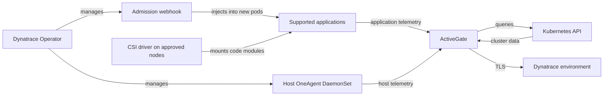

# Dynatrace

> **最終更新**: September 13, 2026

## はじめに

Dynatrace は、アプリケーションとインフラストラクチャのテレメトリーを、トポロジーおよび問題分析と組み合わせます。OneAgent の自動インストルメンテーションは、サポートされるランタイム、デプロイメントモード、権限に依存します。Operator をインストールするだけでは、すべてのシグナルは提供されません。PurePath はサポート対象のリクエスト/コードコンテキストを提供し、Smartscape は観測された依存関係をマッピングします。いずれも、すべてのリクエスト、メソッド、依存関係の取得を保証するものではありません。

このガイドでは、**Dynatrace Operator/chart 1.10.2**、**DynaKube v1beta6**、および **EKS 1.35 Linux EC2-node ベースライン**を使用します。Helm レンダリング、CRD スキーマ、ローカルの例を確認しましたが、EKS インストール、テナント API 呼び出し、ライブ OneAgent インストルメンテーション、または本番環境の容量テストは実行していません。

## 主な機能

| 機能 | 提供内容と要件 |
|---|---|
| **OneAgent** | ホスト/プロセスおよびサポート対象アプリケーションの可視性。モードとホスト権限が重要です。 |
| **自動インストルメンテーション** | サポート対象ランタイム向けのコードモジュール注入。通常、既存の Pod は再作成が必要です。 |
| **Davis AI / Dynatrace Intelligence** | 利用可能なエビデンスに基づく相関、異常、因果分析。 |
| **PurePath** | 分散リクエスト分析。サンプリングとサポート対象テクノロジーがカバレッジに影響します。 |
| **Smartscape** | 網羅的なアセットインベントリではなく、観測されたテレメトリーから推論される関係。 |
| **Full Stack** | アプリケーションおよびインフラストラクチャ機能。RUM、synthetic monitoring、その他のシグナルには個別のセットアップ/消費要件があります。 |

## アーキテクチャ

cloud-native full-stack パスでは、**注入制御**と**テレメトリー転送**を分離します。webhook は新しいアプリケーション Pod を変更し、CSI driver はコードモジュールを提供し、ホスト OneAgent はノード/プロセスのシグナルを収集します。ActiveGate はトラフィックをルーティングし、Kubernetes API をクエリできます。図では、オプションの直接ルートと追加の ingest コンポーネントを省略しています。



<span id="helm-を使用した-eks-へのデプロイ"></span>

## Helm を使用した EKS デプロイメント

### 1. Dynatrace Operator をインストールする

インストール前に、[サポート対象ディストリビューション](https://docs.dynatrace.com/docs/ingest-from/setup-on-k8s/deployment/supported-technologies)と[テクノロジーマトリクス](https://docs.dynatrace.com/docs/ingest-from/technology-support/support-model-and-issues)を比較してください。chart の `kubeVersion >=1.25` 制約は、完全な互換性の表明ではありません。

| 対象 | 確認時点の範囲 |
|---|---|
| サポート対象 Linux EC2 ノード上の EKS 1.35 | マトリクスでは OneAgent/ActiveGate **1.329+** および Operator **1.6+** が必要で、Operator **1.9+** を推奨しています。このガイドでは 1.10.2 に固定します。 |
| Kubernetes 1.36 | OneAgent/ActiveGate の最小バージョンは **1.335** です。プラットフォームとバージョンの組み合わせは別途確認してください。 |
| Kubernetes 1.37 | 確認した Dynatrace マトリクスには記載されていません。新しい Kubernetes リリースがベンダーサポートを確立するわけではありません。 |
| EKS Fargate | [Fargate 固有の EKS ワークフロー](https://docs.dynatrace.com/docs/ingest-from/setup-on-k8s/deployment/marketplaces/eks-dto)を使用する、**CSI なし**のアプリケーションモニタリング。ホスト OneAgent はありません。 |
| Bottlerocket | アプリケーションモニタリングと ActiveGate Kubernetes monitoring。引用したディストリビューション表では OneAgent ホストモニタリングはサポートされていません。 |
| EKS Auto Mode | 一般的な EKS エントリから完全なホストエージェントサポートを推測しないでください。マネージドノードの OS、権限、ベンダーサポートを確認してください。このレシピは Auto Mode では検証していません。 |

メインのレシピには、承認済みでサポート対象の EC2 ノードを使用してください。管理者は、そのプールにカスタムノードラベル `monitoring.example.com/dynatrace-host=true` を適用し、CSI driver を持つノードに監視対象アプリケーションをスケジュールする必要があります。このラベルは配置の慣例であり、セキュリティ境界ではありません。ノードの taint/toleration を明示的に計画し、デフォルトですべての taint を許容しないでください。

CRD、webhook、クラスタ RBAC のインストールには、権限を持つデプロイヤーが必要です。ホスト OneAgent/CSI の権限は、通常の制限されたアプリケーション Namespace には適しません。[Operator のセキュリティ権限](https://docs.dynatrace.com/docs/ingest-from/setup-on-k8s/reference/security)、admission 例外、保護された `dynatrace` Namespace を確認してください。インストールを成功させるためだけに、オプションのクラスタ全体の Secrets/ConfigMaps reader を付与しないでください。

**既存のインストール:** [アップグレードおよび保存済みバージョン移行手順](https://docs.dynatrace.com/docs/ingest-from/setup-on-k8s/guides/deployment-and-configuration/updates-and-maintenance/update-uninstall-operator)に従ってください。クラスタに保存済みの `v1beta1`/`v1beta2` DynaKube がある場合、ドキュメント化されたパスでは **1.8+ の前に Operator 1.7.3 を経由**します。YAML を `v1beta6` に変更しても、永続化されたオブジェクトは移行されません。CRD の `status.storedVersions` を確認してください。これを消去したり、移行チェックを無効にしたりしないでください。以下のインストールコマンドは、旧 1.0 の例から直接アップグレードするものではなく、**新しいリリース**用です。

```bash
kubectl get nodes -l monitoring.example.com/dynatrace-host=true
kubectl get crd dynakubes.dynatrace.com \
  -o jsonpath='{.status.storedVersions}' --ignore-not-found
kubectl create namespace dynatrace
```

### 2. API Token を作成する

テナントの token ファミリーについては、最新の[token および権限ガイド](https://docs.dynatrace.com/docs/ingest-from/setup-on-k8s/deployment/tokens-permissions)を使用してください。

- **最新の Dynatrace platform token:** 専用のサービスユーザーと、環境制限付きの、ドキュメント化された `Kubernetes Operator` および `Kubernetes Ingest` ポリシーを使用します。Operator 権限は、必要な `fleet-management` および `settings` アクションをカバーします。ingestion には対応する `openpipeline`/`storage` 権限を使用します。ユーザー権限と token scope の両方が適用されます。
- **Classic access token:** Operator と ingest の認証情報を分離してください。現在のガイドには、installer/connection/ActiveGate-token の権限が記載されています。`entities.read` は Operator 1.7 以降は不要であり、settings 権限は 1.7 以降オプションです。以前の無制限の権限チェックリストを再利用しないでください。
- 有効にしたシグナルのみを ingest してください。Classic OTLP scope は `openTelemetryTrace.ingest`、`metrics.ingest`、`logs.ingest` です。deployment event と settings write には異なる権限を使用します。

platform-token API 呼び出しには `Bearer` を使用します。Classic access-token 呼び出しには `Api-Token` を使用します。scope 名または header を混在させないでください。スコープ付き認証情報をローテーションし、そのファイルと Kubernetes Secret を読み取れるユーザーを制限してください。

### 3. Secret を作成する

生成した 2 つの token 値を、末尾の改行**なしで**、`apiToken` と `dataIngestToken` という名前の保護されたローカルファイルに配置します。Base64 はエンコードであり、暗号化ではありません。token YAML をコミットしたり、コマンド引数に token 値を入れたり、Pod environment を出力したりしないでください。これは新しい Secret を作成します。既存 Secret のローテーションは、別の制御された操作です。

```bash
token_dir="$PWD/private-dynatrace-tokens"
chmod 700 "$token_dir"
chmod 600 "$token_dir/apiToken" "$token_dir/dataIngestToken"
kubectl create secret generic dynakube --namespace dynatrace \
  --from-file=apiToken="$token_dir/apiToken" \
  --from-file=dataIngestToken="$token_dir/dataIngestToken"
```

### 4. values.yaml の設定

これらは chart **1.10.2** の値です。chart の互換性のある image デフォルトをそのまま使用してください。チューニングが必要な場合、このバージョンではネストされた `resources` ではなく、`operator.requests`/`operator.limits` および `webhook.requests`/`webhook.limits` を使用します。以前の `operator.image.tag` および `operator.resources` の例は、この chart では無視されます。OneAgent/ActiveGate のカスタマイズは、作成した chart key ではなく、適切な DynaKube field に配置します。

```yaml
# values-fullstack.yaml
installCRD: true
debugLogs: false
operator:
  nodeSelector:
    kubernetes.io/os: linux
    monitoring.example.com/dynatrace-host: 'true'
webhook:
  nodeSelector:
    kubernetes.io/os: linux
    monitoring.example.com/dynatrace-host: 'true'
csidriver:
  enabled: true
  nodeSelector:
    kubernetes.io/os: linux
    monitoring.example.com/dynatrace-host: 'true'
```

### 5. Operator をインストールする

公式 OCI chart と固定バージョンを使用してください。このコマンドは **Helm 3** を前提としています。Helm 4 では `--atomic` の代わりに `--rollback-on-failure` を使用します。最初に、レンダリングされた RBAC、CSI host mount、admission 権限を確認してください。Helm rollback は、すべての CRD や外部効果を元に戻すわけではありません。

```bash
helm template dynatrace-operator \
  oci://public.ecr.aws/dynatrace/dynatrace-operator \
  --version 1.10.2 --namespace dynatrace --kube-version 1.35.0 \
  --values values-fullstack.yaml > dynatrace-rendered.yaml

helm install dynatrace-operator \
  oci://public.ecr.aws/dynatrace/dynatrace-operator \
  --version 1.10.2 --namespace dynatrace \
  --values values-fullstack.yaml --atomic --timeout 10m
```

### 6. DynaKube CR の設定

この DynaKube には、監視モードの variant を 1 つだけ使用してください。`ENVIRONMENTID` を承認済みの environment ID に置き換えてください。API URL には Web アプリケーションの `.apps` origin ではなく、`.live.dynatrace.com/api` を使用します。リリース済みの[v1beta6 full-stack sample](https://github.com/Dynatrace/dynatrace-operator/blob/v1.10.2/assets/samples/dynakube/v1beta6/cloudNativeFullStack.yaml)にも `dynatrace-api` が記載されています。これは実際の ActiveGate 機能です。

```yaml
# dynakube-fullstack.yaml
apiVersion: dynatrace.com/v1beta6
kind: DynaKube
metadata:
  name: dynakube
  namespace: dynatrace
spec:
  apiUrl: https://ENVIRONMENTID.live.dynatrace.com/api
  tokens: dynakube
  metadataEnrichment:
    enabled: true
    namespaceSelector:
      matchLabels:
        monitoring.example.com/dynatrace: 'true'
  oneAgent:
    hostGroup: eks-production
    cloudNativeFullStack:
      namespaceSelector:
        matchLabels:
          monitoring.example.com/dynatrace: 'true'
      nodeSelector:
        kubernetes.io/os: linux
        monitoring.example.com/dynatrace-host: 'true'
  activeGate:
    capabilities:
    - routing
    - kubernetes-monitoring
    - dynatrace-api
    replicas: 2
    nodeSelector:
      kubernetes.io/os: linux
      monitoring.example.com/dynatrace-host: 'true'
```

専用のサンプルアプリケーション Namespace を作成するか、所有する設定を通じて既存 Namespace にラベルを付けてください。注入 selector は **webhook mutation** に適用されるものであり、すべての OneAgent host telemetry や ActiveGate の cluster API query には適用されません。`replicas: 2` だけでは、容量も fault-domain redundancy も証明されません。実際のワークロードに合わせて ActiveGate のサイズと分散を設定してください。

```yaml
# application-namespace.yaml
apiVersion: v1
kind: Namespace
metadata:
  name: observability-demo
  labels:
    monitoring.example.com/dynatrace: 'true'
```

### 7. デプロイして検証する

前提条件を検証した後、選択した CR と Namespace を適用します。アプリケーションをロールアウトする前に status を確認してください。通常の rollout 手順を使用して、選択したアプリケーション Pod を再作成してください。既存プロセスは、これらのコマンドによって自動的に再起動されません。

```bash
kubectl apply -f application-namespace.yaml
kubectl apply -f dynakube-fullstack.yaml
kubectl get dynakube dynakube -n dynatrace
kubectl get deploy,ds,sts,pods -n dynatrace
kubectl get dynakube dynakube -n dynatrace -o jsonpath='{.status.conditions}'
```

## Cloud Native Full Stack モード

cloud-native full stack は、webhook/CSI パスを通じたホストモニタリングとアプリケーションコードモジュール注入を組み合わせます。これはアプリケーション専用の sidecar モードでも、汎用的なリソース節約設定でもありません。`oneAgent.hostGroup` は host group を設定します。ホスト agent のリソース override は `cloudNativeFullStack.oneAgentResources` 配下に配置します。任意の limit をそのまま引き継ぐのではなく、サイジングを検証してください。

**Classic Full Stack は** 1.10.2 でも引き続き利用できます。次の完全な代替構成では、ホストベースの注入を使用します。同じ名前の cloud-native CR に追加して適用しないでください。サポート対象のモード移行を選択して計画してください。どちらの full-stack アプローチにもホストアクセスが必要です。

```yaml
# dynakube-classic.yaml
apiVersion: dynatrace.com/v1beta6
kind: DynaKube
metadata:
  name: dynakube
  namespace: dynatrace
spec:
  apiUrl: https://ENVIRONMENTID.live.dynatrace.com/api
  tokens: dynakube
  metadataEnrichment:
    enabled: true
    namespaceSelector:
      matchLabels:
        monitoring.example.com/dynatrace: 'true'
  oneAgent:
    hostGroup: eks-production
    classicFullStack:
      nodeSelector:
        kubernetes.io/os: linux
        monitoring.example.com/dynatrace-host: 'true'
  activeGate:
    capabilities:
    - routing
    - kubernetes-monitoring
    - dynatrace-api
    replicas: 2
    nodeSelector:
      kubernetes.io/os: linux
      monitoring.example.com/dynatrace-host: 'true'
```

## アプリケーション専用モニタリング

`applicationMonitoring` はホスト OneAgent を省略します。CSI は `applicationMonitoring.useCSIDriver` ではなく、**chart-level option** です。CSI を使用しない新しいアプリケーション専用インストールでは、full-stack の値の**代わりに**、以下の `values-app-only.yaml` とアプリケーション専用 CR を使用してください。ベンダーの移行手順なしに、既存の full-stack インストールで CSI を無効にしないでください。

以下の node selector は、引き続き承認済みの EC2 プールを対象とします。EKS Fargate デプロイメントには、引用したワークフローによる対応する Fargate profile と配置設定が必要です。この EC2 レシピは、CSI を無効にするだけで Fargate レシピになるわけではありません。同じ cluster/environment 内で、別々の `hostMonitoring` と `applicationMonitoring` DynaKube を組み合わせないでください。両方が必要な場合は cloud-native full stack を使用してください。

```yaml
# values-app-only.yaml
installCRD: true
debugLogs: false
operator:
  nodeSelector:
    kubernetes.io/os: linux
    monitoring.example.com/dynatrace-host: 'true'
webhook:
  nodeSelector:
    kubernetes.io/os: linux
    monitoring.example.com/dynatrace-host: 'true'
csidriver:
  enabled: false
  nodeSelector:
    kubernetes.io/os: linux
    monitoring.example.com/dynatrace-host: 'true'
```

```yaml
# dynakube-app-only.yaml
apiVersion: dynatrace.com/v1beta6
kind: DynaKube
metadata:
  name: dynakube
  namespace: dynatrace
spec:
  apiUrl: https://ENVIRONMENTID.live.dynatrace.com/api
  tokens: dynakube
  metadataEnrichment:
    enabled: true
    namespaceSelector:
      matchLabels:
        monitoring.example.com/dynatrace: 'true'
  oneAgent:
    applicationMonitoring:
      namespaceSelector:
        matchLabels:
          monitoring.example.com/dynatrace: 'true'
  activeGate:
    capabilities:
    - routing
    - kubernetes-monitoring
    - dynatrace-api
    replicas: 2
    nodeSelector:
      kubernetes.io/os: linux
      monitoring.example.com/dynatrace-host: 'true'
```

<span id="davis-ai-による根本原因分析"></span>

## Davis AI の根本原因分析

### Davis AI の仕組み

次の既存の図は、シグナル相関と問題出力の**概念的な説明**であり、固定された処理アルゴリズムや根本原因の確実性の証明ではありません。Smartscape と PurePath は観測されたコンテキストを提供します。インストルメンテーションが欠けていると、依存関係が隠れることがあります。現在の[Dynatrace Intelligence](https://docs.dynatrace.com/docs/dynatrace-intelligence)には、Preview の追加機能と承認済みの agentic action が含まれています。問題検出だけでは、本番コードまたはインフラストラクチャの変更は許可されません。


[インタラクティブな図を表示](https://www.atomai.click/kubernetes-docs/archmaps/en-observability-tracing-04-dynatrace-1.html)

<span id="問題アラートの設定"></span>

### Problem Alert の設定

以前の `/api/config/v1/alertingProfiles` endpoint は非推奨です。`POST /api/v2/settings/objects` を通じて、[Settings schema `builtin:alerting.profile`](https://docs.dynatrace.com/docs/dynatrace-api/environment-api/settings/schemas/builtin-alerting-profile)を使用してください。最初に `?validateOnly=true` で検証し、multi-status response を含むすべての response item の code を確認してください。検証には引き続き endpoint の write permission が必要であり、notification destination は作成されません。

この body を `alerting-profile.json` として保存します。tag は、Kubernetes label の自動変換ではなく、**すでに存在している必要がある Dynatrace entity tag**です。現在の enum は `ERRORS`（複数形）であり、`PERFORMANCE` は引き続き有効です。

```json
[
  {
    "schemaId": "builtin:alerting.profile",
    "scope": "environment",
    "value": {
      "name": "EKS Production Alerts",
      "severityRules": [
        {
          "severityLevel": "AVAILABILITY",
          "delayInMinutes": 0,
          "tagFilterIncludeMode": "INCLUDE_ANY",
          "tagFilter": [
            "cluster:eks-production"
          ]
        },
        {
          "severityLevel": "ERRORS",
          "delayInMinutes": 5,
          "tagFilterIncludeMode": "INCLUDE_ANY",
          "tagFilter": [
            "environment:production"
          ]
        },
        {
          "severityLevel": "PERFORMANCE",
          "delayInMinutes": 15,
          "tagFilterIncludeMode": "INCLUDE_ANY",
          "tagFilter": [
            "tier:critical"
          ]
        }
      ],
      "eventFilters": []
    }
  }
]
```

### Custom Deployment Event

[Events v2 API](https://docs.dynatrace.com/docs/dynatrace-api/environment-api/events-v2/post-event)は `CUSTOM_DEPLOYMENT` を受け入れます。未検証の service-name string によって selector が拡大されないよう、検証済みの service entity ID を使用してください。以下の helper には Python 3 と `requests` が必要です。デフォルトでは preview を表示し、`--send` を指定した場合に 1 回だけ送信し、redirect に従わず、HTTP success だけでなく**201 body と report ごとの status**を確認します。timeout の場合、受け入れられたかは不明です。この例には idempotency の保証がないため、retry 前に調査してください。

SaaS origin allowlist は意図的に Managed/custom origin を除外しています。それらのデプロイメント向けに適応して確認してください。Classic 呼び出しには `events.ingest` が必要です。platform 呼び出しには、`openpipeline:events.davis:ingest` などのドキュメント化された event-ingest scope と `--scheme Bearer` が必要です。認証情報のみを含む保護された token file を使用してください。これは Dynatrace SDK ではなく HTTP client code であり、import 時には呼び出しを行いません。

```python
# deployment_event.py
"""Prepare one deployment annotation; send only when explicitly requested."""
from pathlib import Path
from urllib.parse import urlsplit
import argparse
import json
import re
import requests

def payload_for(entity_id, version):
    if not isinstance(entity_id, str) or not re.fullmatch(r"SERVICE-[0-9A-F]{16}", entity_id):
        raise ValueError("Use one verified SERVICE entity ID")
    if not isinstance(version, str) or not 1 <= len(version) <= 128:
        raise ValueError("Version must contain 1–128 characters")
    if any(ord(char) < 32 or ord(char) == 127 for char in version):
        raise ValueError("Version must not contain control characters")
    return {
        "eventType": "CUSTOM_DEPLOYMENT",
        "title": f"Deployment {version}",
        "entitySelector": f'type(SERVICE),entityId("{entity_id}")',
        "properties": {"release.version": version, "deployment.source": "ci"},
    }

def send_event(environment_url, token_file, entity_id, version, *, scheme="Api-Token", session=None):
    payload = payload_for(entity_id, version)
    parsed = urlsplit(environment_url)
    if (parsed.scheme != "https" or parsed.username or parsed.password
            or parsed.port not in (None, 443)
            or not re.fullmatch(r"[a-z0-9-]+\.live\.dynatrace\.com", parsed.hostname or "")
            or parsed.path not in ("", "/") or parsed.query or parsed.fragment):
        raise ValueError("Use the approved SaaS environment origin, without .apps or a path")
    if scheme not in ("Api-Token", "Bearer"):
        raise ValueError("Choose the authentication scheme required by the token family")
    token = Path(token_file).read_text(encoding="utf-8")
    if not token or token != token.strip() or any(ord(c) < 33 or ord(c) > 126 for c in token):
        raise ValueError("Token file must contain only the token, without whitespace")
    client = session if session is not None else requests.Session()
    try:
        response = client.post(
            f"https://{parsed.hostname}/api/v2/events/ingest",
            headers={"Authorization": f"{scheme} {token}", "Content-Type": "application/json"},
            json=payload, timeout=(5, 30), allow_redirects=False,
        )
        if response.status_code != 201:
            raise RuntimeError(f"Unexpected event API status: {response.status_code}")
        body = response.json()
        if not isinstance(body, dict):
            raise RuntimeError("Invalid event response")
        results = body.get("eventIngestResults")
        if (type(body.get("reportCount")) is not int or body["reportCount"] != 1
                or not isinstance(results, list) or len(results) != 1
                or not isinstance(results[0], dict) or results[0].get("status") != "OK"
                or not isinstance(results[0].get("correlationId"), str)
                or not results[0]["correlationId"]):
            raise RuntimeError("The response did not confirm one successful event report")
        return results[0]["correlationId"]
    finally:
        if session is None:
            client.close()

if __name__ == "__main__":
    parser = argparse.ArgumentParser()
    parser.add_argument("--entity-id", required=True)
    parser.add_argument("--version", required=True)
    parser.add_argument("--send", action="store_true")
    parser.add_argument("--environment-url")
    parser.add_argument("--token-file")
    parser.add_argument("--scheme", choices=["Api-Token", "Bearer"], default="Api-Token")
    args = parser.parse_args()
    if not args.send:
        print(json.dumps(payload_for(args.entity_id, args.version), indent=2))
    else:
        if not args.environment_url or not args.token_file:
            parser.error("--send requires --environment-url and --token-file")
        print("Event report:", send_event(args.environment_url, args.token_file,
              args.entity_id, args.version, scheme=args.scheme))
```

```bash
python3 deployment_event.py --entity-id SERVICE-0123456789ABCDEF --version 2.3.0
```

上記の ID は例示です。送信前に、環境内の検証済み entity に置き換えてください。送信するには、`--send --environment-url https://ENVIRONMENTID.live.dynatrace.com --token-file /protected/path/events-token` と正しい scheme を明示的に追加します。この独立した CI の責務に Operator credential を再利用しないでください。

## 自動インストルメンテーション

### サポート対象テクノロジー

OneAgent は複数のテクノロジーファミリーをサポートします。次の例をバージョンに依存しない保証として扱うのではなく、[support matrix](https://docs.dynatrace.com/docs/ingest-from/technology-support/support-model-and-issues)で、正確な runtime/framework release、architecture、deployment mode を確認してください。

| ファミリー | マトリクスで確認する例 |
|---|---|
| Java | JVM と Spring/Spring Boot、Micronaut、Quarkus、Jakarta EE のバージョン |
| Node.js | Node runtime と、Express ファミリーのアプリケーションを含む HTTP/framework instrumentation |
| Python | Runtime と Django/Flask/FastAPI instrumentation path |
| .NET | .NET runtime、ASP.NET Core と Windows/.NET Framework deployment の比較 |
| Go | Go version、compilation/build flag、サポート対象 HTTP framework instrumentation |
| PHP | PHP runtime と Laravel/Symfony framework version |

### 自動インストルメンテーションを検証する

environment value や credential をダンプせずに、container name、image、readiness を確認してください。次に、サポート対象アプリケーションを通じて認可済みの test request を送信し、意図した tenant で service/trace visibility を確認してください。Pod readiness だけでは trace delivery を証明できません。[injection selector と opt-out](https://docs.dynatrace.com/docs/ingest-from/setup-on-k8s/guides/deployment-and-configuration/monitoring-and-instrumentation/annotate)を確認してください。`dynatrace.com/inject: "false"` は opt out しますが、`"true"` に設定してもすべての selection rule を override するわけではありません。

```bash
kubectl get pods -n observability-demo \
  -o custom-columns='NAME:.metadata.name,INIT:.spec.initContainers[*].name,IMAGES:.spec.containers[*].image,READY:.status.containerStatuses[*].ready'
```

### Custom Service Definition

[custom Java service API](https://docs.dynatrace.com/docs/dynatrace-api/configuration-api/service-api/custom-services-api/post-rule)は、引き続き `POST /api/config/v1/service/customServices/java` をサポートしています。以下の明示的な method signature は有効な**設定形状**であり、サンプルアプリケーションにその method が含まれることの証明ではありません。`/api/config/v1/service/customServices/java/validator` で body を検証し（成功時は 204）、class、return type、argument、OneAgent サポートを確認してから作成してください。Classic authorization では `WriteConfig` を使用します。platform authorization は endpoint の `settings:objects:write` 要件に従います。

```json
{
  "name": "Payment Gateway",
  "enabled": true,
  "rules": [
    {
      "enabled": true,
      "className": "com.example.payment.PaymentGateway",
      "methodRules": [
        {
          "methodName": "processPayment",
          "returnType": "com.example.payment.PaymentResult",
          "argumentTypes": []
        }
      ]
    }
  ],
  "queueEntryPoint": false
}
```

## Kubernetes Monitoring 統合

### Cluster Metrics

ActiveGate の `kubernetes-monitoring` 機能は、cluster/workload state のために Kubernetes API をクエリします。その scope は application injection とは別です。ActiveGate 専用インストールの場合、次の完全な代替構成には必要な environment URL が含まれます。意図せずに前の同名の DynaKube に重ねて適用しないでください。

```yaml
# dynakube-platform.yaml
apiVersion: dynatrace.com/v1beta6
kind: DynaKube
metadata:
  name: dynakube
  namespace: dynatrace
spec:
  apiUrl: https://ENVIRONMENTID.live.dynatrace.com/api
  tokens: dynakube
  metadataEnrichment:
    enabled: false
  activeGate:
    capabilities:
    - routing
    - kubernetes-monitoring
    - dynatrace-api
    replicas: 2
    nodeSelector:
      kubernetes.io/os: linux
      monitoring.example.com/dynatrace-host: 'true'
```

workload/event/Prometheus monitoring は、現在の platform settings とドキュメント化された capability option を通じて設定してください。以前の任意の `[kubernetes_monitoring] monitor_*` および `kubernetes_namespace_filter` property は、その設定に対する検証済みの代替手段ではありません。追加の権限を付与する前に、実際の RBAC と選択した collection feature を確認してください。

### Prometheus Metric Collection

ドキュメント化された[ActiveGate Prometheus integration](https://docs.dynatrace.com/docs/observe/infrastructure-observability/container-platform-monitoring/kubernetes-monitoring/monitor-prometheus-metrics)では、cluster settings で workload monitoring と annotation 付き exporter を有効にし、意図した network path を許可してください。annotation は **Pod template** に属します。以下の placeholder image を、ポート 8080 の `/metrics` で Prometheus text を実際に提供する所有アプリケーションに置き換えてください。これは完全な Deployment 形状であり、提供される実行可能アプリケーションではありません。

```yaml
# prometheus-application.yaml
apiVersion: apps/v1
kind: Deployment
metadata:
  name: metrics-demo
  namespace: observability-demo
spec:
  replicas: 1
  selector:
    matchLabels:
      app: metrics-demo
  template:
    metadata:
      labels:
        app: metrics-demo
      annotations:
        metrics.dynatrace.com/scrape: 'true'
        metrics.dynatrace.com/port: '8080'
        metrics.dynatrace.com/path: /metrics
    spec:
      automountServiceAccountToken: false
      containers:
      - name: app
        image: registry.example.com/app:metrics-demo
        ports:
        - name: metrics
          containerPort: 8080
      nodeSelector:
        kubernetes.io/os: linux
        monitoring.example.com/dynatrace-host: 'true'
```

この統合は、DynaKube の injection selector とは独立して、Namespace 全体の annotation 付き Pod を検出します。引用した ActiveGate module は、1,000 exporter Pod、Pod あたり 1,000 metrics、Pod あたり 500,000 data point の制限を記載しています。counter、gauge、histogram、summary をサポートしますが、すべての OpenMetrics feature や exemplar をサポートするわけではありません。より大規模なデプロイメントでは、ドキュメント化された Collector/Target Allocator の代替構成とその個別の権限を評価してください。

## コスト構造

### ライセンスモデル

現在の **Dynatrace Platform Subscription (DPS)** 消費と、引き続き **Classic licensing** を使用する契約を区別してください。レートカードと[現在の capability unit](https://www.dynatrace.com/pricing/)を確認してください。ここでは固定ドル価格や保証された節約額を想定していません。

| DPS capability | 消費 unit の例 |
|---|---|
| Full-Stack Monitoring | モード固有のルールに基づく Memory GiB-hours |
| Infrastructure Monitoring | Host-hours |
| Kubernetes Platform Monitoring | ドキュメント化された Full-Stack inclusion rule の対象となる Pod-hours |
| Code Monitoring | Container-hours |
| Logs | 選択した plan における Ingested GiB、retained GiB-days、query consumption |
| Digital experience | RUM session。synthetic action/request は別 unit です。 |
| Application security | capability 固有の memory GiB-hours または host-hours |

full-stack は、無制限の log ingestion、retention、query、RUM、synthetic test を約束するものではありません。年間コミットメント、レートカード、超過使用量が実際の請求額に影響します。

### コスト最適化戦略

- 必要な application injection と signal collection を慎重に選択してください。Namespace injection selector は、host または cluster monitoring の消費量を制限しません。
- テレメトリー量に応じて agent resource のサイズを設定してください。agent container の memory limit は、監視対象 host の RAM に対する課金上限ではありません。
- 現在の capability setting と privacy requirement を使用して、log volume、retention、query pattern、オプションの session replay を制御してください。
- application-only mode では、その個別の memory measurement/minimum rule と、含まれない host infrastructure monitoring を考慮してください。

### Host Unit の計算

以前の `max(memory/16, vCPU/1.5)` 式は誤りでした。[Classic Full-Stack host unit](https://docs.dynatrace.com/docs/license/classic-licensing/application-and-infrastructure-monitoring)は RAM tier を使用します。これらは現在の DPS price model ではなく、**Classic の例**として扱ってください。

| Host の例 | Classic Full-Stack weight | 1 回の完全に整合した時間における DPS host Full-Stack usage |
|---|---:|---:|
| 4 vCPU, 16 GiB RAM | 1 HU | 16 memory GiB-hours |
| 8 vCPU, 32 GiB RAM | 2 HU | 32 memory GiB-hours |
| 2 vCPU, 8 GiB RAM | 0.5 HU | 8 memory GiB-hours |

DPS の物理/仮想 host では、[Full-Stack rule](https://docs.dynatrace.com/docs/license/capabilities/app-infra-observability/full-stack-monitoring)により、memory は 4-GiB minimum で quarter-GiB increment に切り上げられ、対象となる **15-minute calendar interval** が課金されます。固定 memory の場合、usage は `max(4, ceil(memoryGiB × 4) / 4) × coveredIntervals × 0.25` です。総実行時間を単純に丸めるのではなく、calendar interval を数えてください。境界をまたぐと、2 interval が対象になることがあります。application-only/container の計算には異なる minimum および measurement/version rule が適用されます。この host 式をそれらに適用しないでください。

<span id="opentelemetry-との統合"></span>

## OpenTelemetry 統合

Dynatrace の[native OTLP endpoint](https://docs.dynatrace.com/docs/ingest-from/opentelemetry/otlp-api)は、native gRPC や JSON ではなく、**binary Protobuf を使用した HTTP**を受け入れます。Collector はローカル gRPC を受け入れ、HTTP を export できます。以下の完全な設定は Contrib **0.160.0** で解析されました。本番環境では、Dynatrace は独自のサポート対象 Collector distribution と component/version matrix を推奨しています。

[現在の設定ガイド](https://docs.dynatrace.com/docs/ingest-from/opentelemetry/collector/configuration)では delta metric temporality が必要です。`cumulative_to_delta` は cumulative stream を memory 内で追跡します。各 stream を同じ conversion instance にルーティングしてください。最初の observation は baseline を確立し、restart または stream eviction は変換に影響します。25-hour staleness setting は、それより短い reporting interval を前提としており、cardinality budget ではありません。

receiver は loopback にのみ bind するため、ローカル app または同一 Pod の sidecar に適しています。multi-pod gateway には、明示的な認証/TLS receiver access と network control が必要です。environment ID を置き換えてから、`Authorization: "Api-Token REPLACE_WITH_INGEST_TOKEN"` のような完全な map を含む保護された `headers.yaml` を mount してください。実際の token をこの文書、environment variable、ConfigMap に配置しないでください。この例では、前述の Classic の 3 signal ingest scope を使用します。

```yaml
# otel-collector.yaml
receivers:
  otlp:
    protocols:
      grpc:
        endpoint: 127.0.0.1:4317
      http:
        endpoint: 127.0.0.1:4318
processors:
  memory_limiter:
    check_interval: 1s
    limit_mib: 256
    spike_limit_mib: 64
  cumulative_to_delta:
    max_staleness: 25h
  batch:
    timeout: 5s
exporters:
  otlp_http/dynatrace:
    endpoint: https://ENVIRONMENTID.live.dynatrace.com/api/v2/otlp
    headers: ${file:/var/run/secrets/dynatrace/headers.yaml}
service:
  pipelines:
    traces:
      receivers: [otlp]
      processors: [memory_limiter, batch]
      exporters: [otlp_http/dynatrace]
    metrics:
      receivers: [otlp]
      processors: [memory_limiter, cumulative_to_delta, batch]
      exporters: [otlp_http/dynatrace]
    logs:
      receivers: [otlp]
      processors: [memory_limiter, batch]
      exporters: [otlp_http/dynatrace]
```

```bash
otelcol-contrib validate --config=otel-collector.yaml
```

起動前に、**インストール済み distribution の binary**で検証してください。file provider は完全な headers map を消費します。`:key` suffix で subkey を選択することはありません。デフォルトの TLS verification は有効なままです。exporter は `/v1/traces`、`/v1/metrics`、`/v1/logs` を追加します。これらの suffix を base endpoint に重複して追加しないでください。

ActiveGate ingest endpoint には異なる port/path と capability/storage requirement があります。`routing` を有効にするだけでは、すべての OTLP ingest pipeline は作成されません。collector validation またはローカル HTTP test は、tenant acceptance、quota、end-to-end delivery を確立するものではありません。認可済みのデプロイメント後に、partial-success response と server-side visibility を確認してください。

## トラブルシューティング

### よくある問題

| 症状 | 確認事項 |
|---|---|
| CR が拒否される | 提供される API version と現在の CRD field。root の `namespaceSelector`/`hostGroup` および `applicationMonitoring.useCSIDriver` は有効な代替ではありません。 |
| Operator/CSI/ActiveGate が Pending | 承認済み node label、taint、resource、admission restriction、CSI availability。 |
| 注入された module がない | Namespace selector、opt-out annotation、サポート対象 runtime、アプリケーション Pod の再作成。 |
| 認証失敗 | token family、file whitespace、expiry、scope、environment restriction。診断のために token value を出力しないでください。 |
| host telemetry がない | サポート対象 OS と mode、host permission、OneAgent status。application-only は host monitoring を作成しません。 |
| OTLP metric がない | HTTP/protobuf endpoint、delta conversion、stream routing、response detail。 |
| 外部接続がない | DNS、承認済み egress/proxy、信頼された certificate chain。proxy は真に切断された SaaS deployment ではありません。 |

ActiveGate はテレメトリーを buffer でき、一部の ingest 設定には persistent storage が必要ですが、長期的な Grail lakehouse ではありません。container 内で文書化されていない Java CLI path を呼び出すのではなく、現在の Pod/workload status を確認してください。

<span id="log-収集の検証"></span>

### Log Collection の検証

まず Pod と container の名前を一覧表示し、次に明示的に選択した component から制限付きの log を取得します。共有前に diagnostic log と support archive を確認し、機密性の高い application または configuration data をマスキングしてください。agent readiness と log output だけでは、tenant への log ingestion を検証できません。

```bash
kubectl get pods -n dynatrace \
  -o custom-columns='POD:.metadata.name,CONTAINERS:.spec.containers[*].name,READY:.status.containerStatuses[*].ready'
# Replace with names from the preceding output.
dynatrace_pod='REPLACE_WITH_POD_NAME'
dynatrace_container='REPLACE_WITH_CONTAINER_NAME'
kubectl logs -n dynatrace "$dynatrace_pod" -c "$dynatrace_container" \
  --tail=100 --since=10m
```

## クイズ

[Dynatrace Quiz](../../quizzes/observability/tracing/04-dynatrace-quiz.md)で知識を確認してください。
