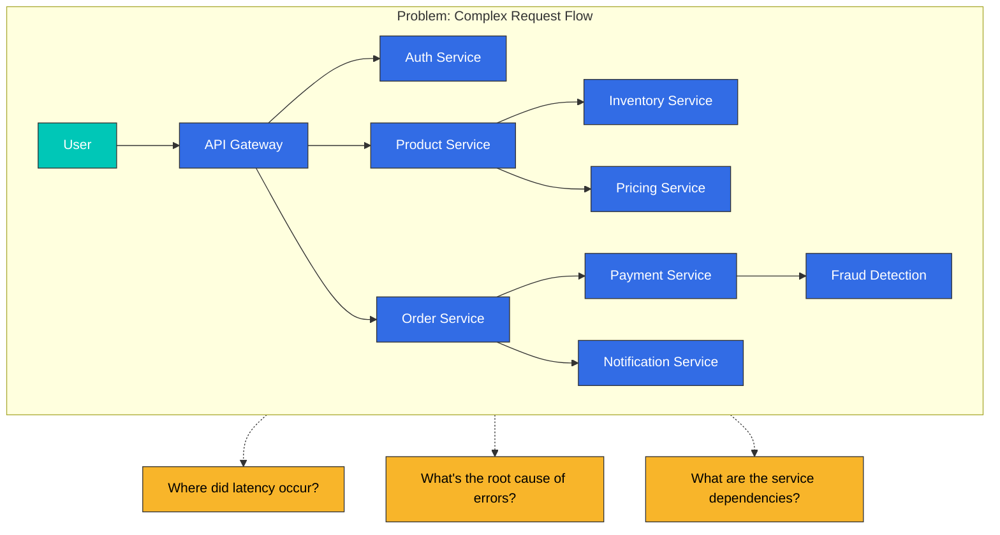
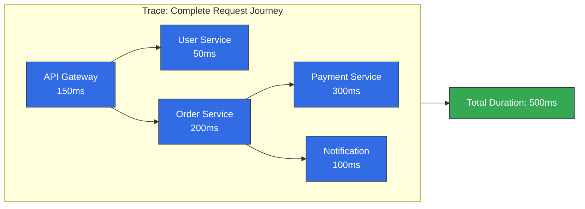
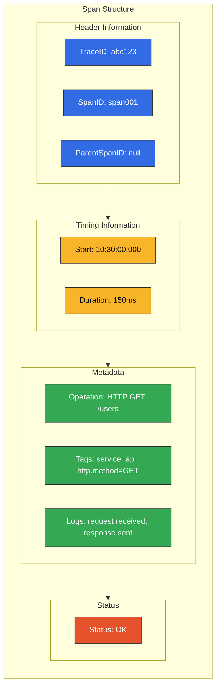
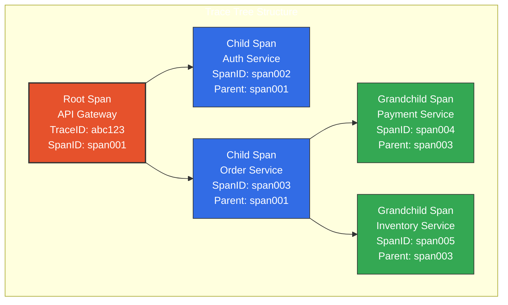
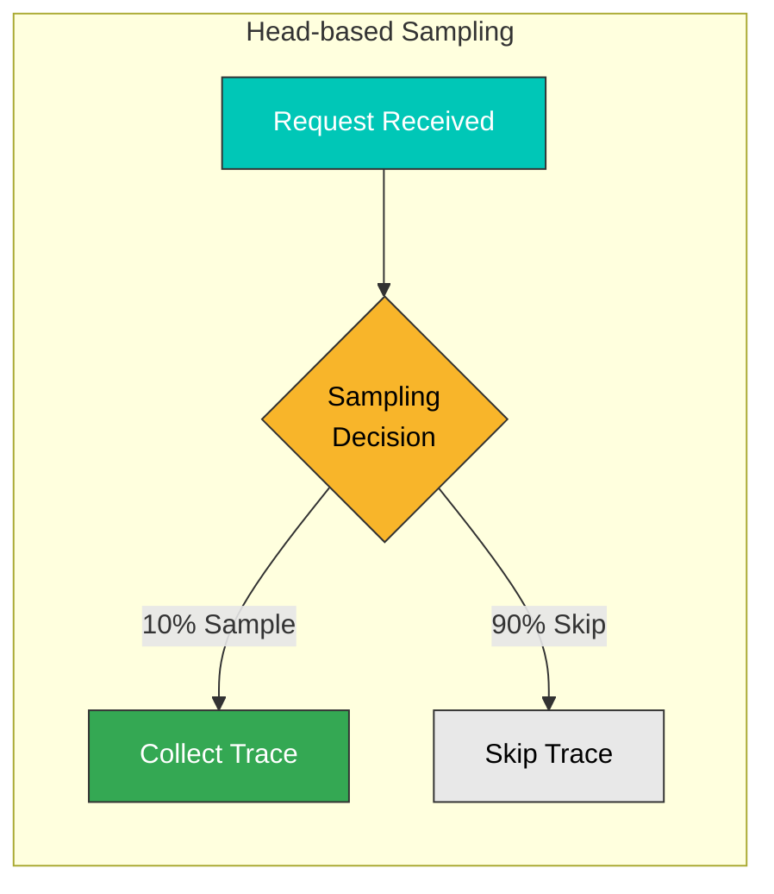
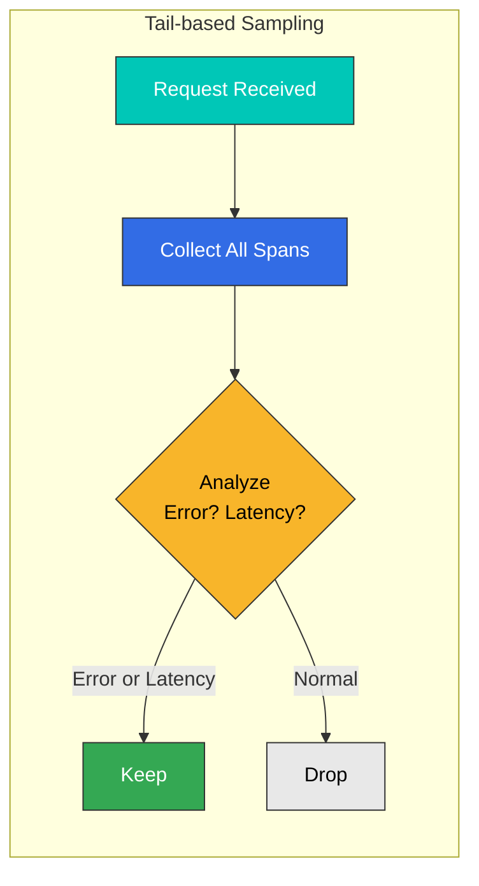
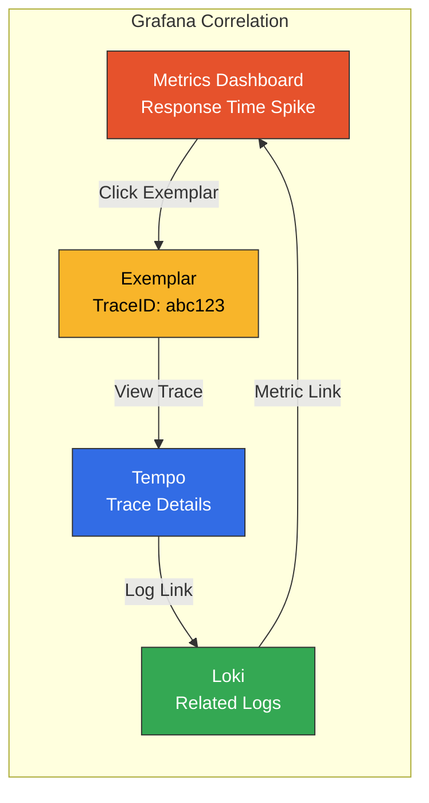
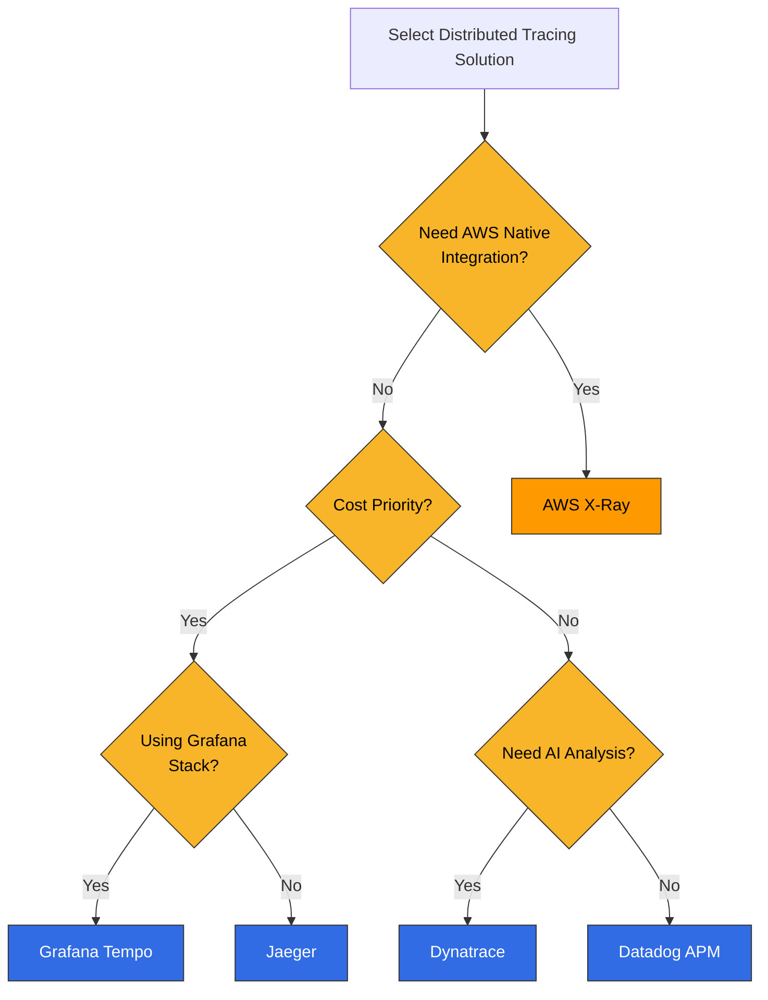

# 分散トレーシングの概要

> **最終更新**: February 20, 2026

## はじめに

分散トレーシング（Distributed Tracing）は、マイクロサービスアーキテクチャにおいて、リクエストが複数の Service を通過する際の完全な経路を追跡する手法です。単一のリクエストが数十の Service を通過する可能性がある現代のシステムでは、分散トレーシングはパフォーマンスのボトルネックを特定し、問題をトラブルシューティングするために不可欠です。

## 分散トレーシングの必要性

### 従来のモニタリングの限界

マイクロサービス環境では、従来のログとメトリクスだけでは次の質問に答えられません。

- リクエストはどの Service を通過したか？
- 各 Service にはどのくらいの時間がかかったか？
- エラーはどこで発生したか？
- Service 間にはどのような依存関係があるか？



## コアコンセプト

### 1. Trace

Trace は、単一のリクエストがたどる完全な経路を表します。リクエストがシステムを通過する際に生成されるすべての操作の集合です。



### 2. Span

Span は、作業の単一単位を表します。各 Span には次の情報が含まれます。

| フィールド | 説明 | 例 |
|-------|-------------|---------|
| **TraceID** | Trace 全体の一意な識別子 | `abc123def456` |
| **SpanID** | 個々の Span の一意な識別子 | `span789` |
| **ParentSpanID** | 親 Span の識別子 | `span456` |
| **Operation Name** | 操作の名前 | `HTTP GET /api/users` |
| **Start Time** | 開始タイムスタンプ | `2025-02-15T10:30:00Z` |
| **Duration** | 所要時間 | `150ms` |
| **Tags** | メタデータ | `http.status_code=200` |
| **Logs** | イベント記録 | `error: connection timeout` |



### 3. Span の関係と階層

Span は親子関係を形成し、ツリー構造を作成します。



### 4. SpanContext

SpanContext は、Service 間で伝播される Trace 情報です。

```yaml
# SpanContext Components
SpanContext:
  trace_id: "abc123def456789"      # Trace identifier
  span_id: "span789"               # Current Span identifier
  trace_flags: "01"                # Sampling flag
  trace_state: "vendor=value"      # Vendor-specific additional info
```

## コンテキスト伝播

Service 間で Trace コンテキストを渡す方法です。

### W3C Trace Context（推奨）

W3C 標準ヘッダーを使用した伝播：

```http
# HTTP Request Headers
traceparent: 00-abc123def456789012345678901234-span12345678-01
tracestate: rojo=00f067aa0ba902b7,congo=t61rcWkgMzE
```

**traceparent の形式：**
```
version-trace_id-parent_id-trace_flags
00     -abc123...-span1234...-01
```

### B3 伝播（Zipkin 互換）

Zipkin で使用される伝播形式：

```http
# Single header format
b3: abc123def456789-span12345678-1-parent12345678

# Multi-header format
X-B3-TraceId: abc123def456789
X-B3-SpanId: span12345678
X-B3-ParentSpanId: parent12345678
X-B3-Sampled: 1
```

### 伝播形式の比較

| 形式 | ヘッダー | 利点 | 欠点 |
|--------|---------|------------|---------------|
| **W3C Trace Context** | `traceparent`, `tracestate` | 標準的、拡張可能 | 比較的新しい |
| **B3 Single** | `b3` | シンプル、単一ヘッダー | Zipkin 固有 |
| **B3 Multi** | `X-B3-*` | デバッグが容易 | ヘッダーが多い |
| **Jaeger** | `uber-trace-id` | Jaeger に最適化 | ベンダーロックイン |

## サンプリング戦略

すべてのリクエストをトレースすると、コストとパフォーマンスの問題が発生します。サンプリングはこれを管理します。

### Head-based Sampling

リクエスト開始時にサンプリングを決定します。



**利点：**
- 実装がシンプル
- オーバーヘッドが低い
- 一貫したサンプリング判断

**欠点：**
- 重要なリクエストを見逃す可能性がある
- エラーやレイテンシーを伴うリクエストをスキップする可能性がある

**設定例：**
```yaml
# OpenTelemetry SDK Configuration
sampling:
  type: parentbased_traceidratio
  ratio: 0.1  # 10% sampling
```

### Tail-based Sampling

リクエスト完了後に、結果に基づいてサンプリングを決定します。



**利点：**
- 重要なリクエスト（エラー、レイテンシー）を見逃さない
- よりインテリジェントなサンプリング
- コスト効率が高い

**欠点：**
- 実装が複雑
- メモリ使用量が多い
- すべての Span を一時的に保存する必要がある

**OTEL Collector Tail Sampling の設定：**
```yaml
processors:
  tail_sampling:
    decision_wait: 10s
    num_traces: 100000
    policies:
      # Collect all error requests
      - name: errors
        type: status_code
        status_code:
          status_codes: [ERROR]
      # Collect slow requests
      - name: slow-requests
        type: latency
        latency:
          threshold_ms: 1000
      # 10% sampling for the rest
      - name: probabilistic
        type: probabilistic
        probabilistic:
          sampling_percentage: 10
```

### サンプリング戦略の比較

| 戦略 | 判断時点 | リソース使用量 | 正確性 | ユースケース |
|----------|---------------|----------------|----------|----------|
| **Head-based** | リクエスト開始時 | 低 | 中 | ほとんどのケース |
| **Tail-based** | リクエスト完了時 | 高 | 高 | エラー／レイテンシー重視 |
| **Adaptive** | 動的 | 中 | 高 | トラフィック変動が大きい場合 |

## Trace・Log・Metric の相関

### TraceID による Log の関連付け

```java
// Java logging example (SLF4J + MDC)
import org.slf4j.MDC;
import io.opentelemetry.api.trace.Span;

public void processOrder(Order order) {
    Span span = Span.current();
    MDC.put("traceId", span.getSpanContext().getTraceId());
    MDC.put("spanId", span.getSpanContext().getSpanId());

    logger.info("Processing order: {}", order.getId());
    // Log output: {"traceId": "abc123", "spanId": "span456", "message": "Processing order: 12345"}
}
```

### Exemplars による Metric の関連付け

```yaml
# Linking TraceID to Prometheus metrics
http_request_duration_seconds_bucket{le="0.5"} 1000 # {traceID="abc123"}
http_request_duration_seconds_bucket{le="1.0"} 1500 # {traceID="def456"}
```

### Grafana での相関



## ソリューションの比較

### 分散トレーシングソリューションの比較

| 機能 | Tempo | X-Ray | Jaeger | Datadog APM | Dynatrace |
|---------|-------|-------|--------|-------------|-----------|
| **タイプ** | オープンソース | AWS マネージド | オープンソース | 商用 SaaS | 商用 SaaS |
| **ストレージ** | Object Storage | AWS 内部 | Cassandra/ES | Datadog | Dynatrace |
| **クエリ言語** | TraceQL | Filter Expressions | - | - | DQL |
| **サンプリング** | Head/Tail | ルールベース | Head | 動的 | 動的 |
| **OTEL サポート** | ネイティブ | ネイティブ | ネイティブ | ネイティブ | ネイティブ |
| **Service Map** | Grafana 統合 | 組み込み | 組み込み | 組み込み | 組み込み |
| **AI 分析** | なし | なし | なし | Watchdog | Davis AI |
| **コスト** | ストレージコストのみ | 使用量ベース | インフラストラクチャコスト | Host/span ベース | Host ベース |
| **EKS 統合** | 手動設定 | ネイティブ | 手動設定 | Agent デプロイ | OneAgent |

### 選定ガイド



## ベストプラクティス

### 1. Instrumentation 戦略

```yaml
# Recommended instrumentation scope
instrumentation:
  # Always instrument
  always:
    - HTTP requests/responses
    - gRPC calls
    - Database queries
    - Message queue operations
    - External API calls

  # Optional instrumentation
  optional:
    - Internal function calls
    - Cache operations
    - File I/O
```

### 2. Span の命名規則

```yaml
# Good examples
- "HTTP GET /api/users/{id}"
- "PostgreSQL SELECT users"
- "Redis GET user:123"
- "Kafka SEND orders"

# Bad examples
- "http call"
- "db query"
- "process"
- "span1"
```

### 3. Tag の標準化

```yaml
# OpenTelemetry Semantic Conventions
tags:
  # HTTP
  http.method: GET
  http.url: https://api.example.com/users
  http.status_code: 200

  # Database
  db.system: postgresql
  db.statement: SELECT * FROM users
  db.operation: SELECT

  # Service
  service.name: user-service
  service.version: 1.2.3
```

## 次のステップ

分散トレーシングの概念を理解したら、以下のセクションで特定のツールの使用方法を学びます。

- [Grafana Tempo](./01-tempo.md): Grafana スタックの分散トレーシングバックエンド
- [AWS X-Ray](./02-xray.md): AWS ネイティブの分散トレーシング
- [OpenTelemetry](./03-opentelemetry.md): 標準化された Instrumentation フレームワーク
- [Dynatrace](./04-dynatrace.md): AI 搭載の APM ソリューション

## クイズ

ツール固有のクイズで知識を確認しましょう。
- [Tempo クイズ](../../quizzes/observability/tracing/01-tempo-quiz.md)
- [X-Ray クイズ](../../quizzes/observability/tracing/02-xray-quiz.md)
- [OpenTelemetry クイズ](../../quizzes/observability/tracing/03-opentelemetry-quiz.md)
- [Dynatrace クイズ](../../quizzes/observability/tracing/04-dynatrace-quiz.md)
