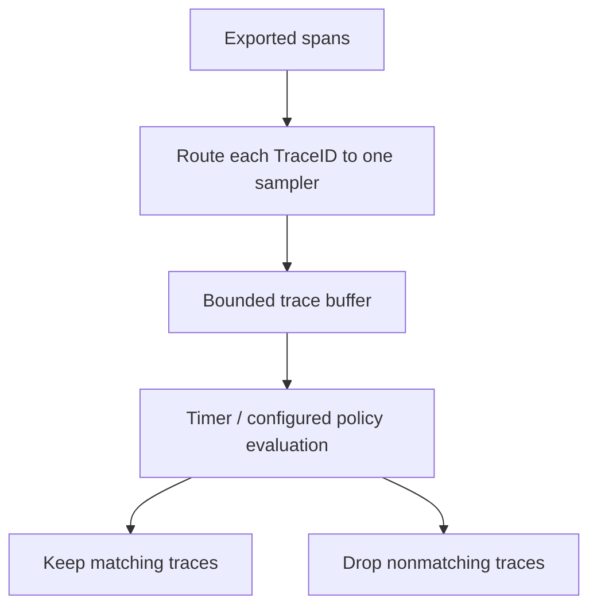
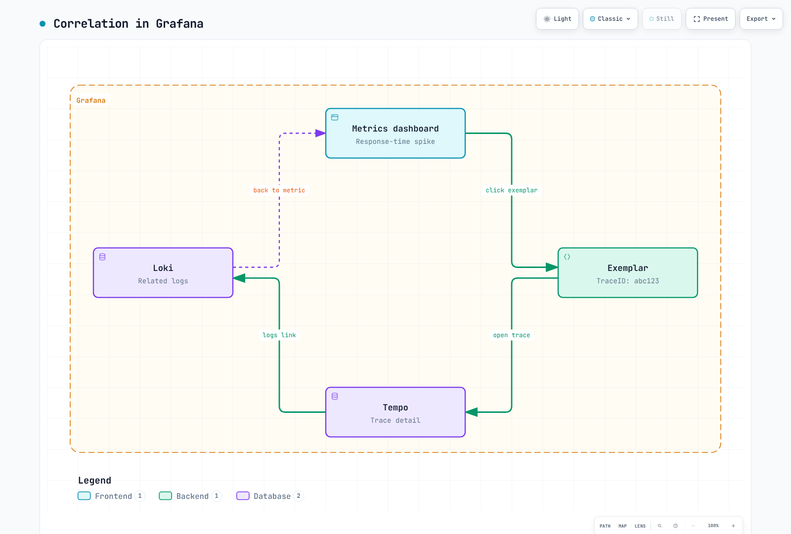

# 分散トレーシングの概要

> **最終更新**: September 13, 2026

## はじめに

分散トレーシングは、プロセス境界をまたぐインストルメント化された操作を記録し、伝播されたコンテキストを通じて関連付けます。保存された trace は、すべての操作またはリクエストがキャプチャされたことの証明ではなく、**観測された Span の集合**です。インストルメンテーション、サンプリング、エクスポート、ストレージ、保持によって、可視化される内容が決まります。

## 分散トレーシングが必要な理由

### 従来のモニタリングの限界

共有コンテキストのないログとメトリクスでは、リクエストの経路とタイミングの再構成が困難になることがあります。trace は、因果関係を表現することで、これらのシグナルを補完します。

- どのインストルメント化された Service が関与したか？
- どの操作が遅延または失敗したか？
- どの処理が重複、待機、または再試行したか？
- どの追加ログとリソースメトリクスが診断を裏付けるか？


[インタラクティブな図を表示](https://www.atomai.click/kubernetes-docs/archmaps/en-observability-tracing-readme-0.html)

この図は、相関付けが役立つ理由を示しています。適切に相関付けされたログではこれらの質問に決して答えられない、あるいは trace 単独で根本原因を証明できる、という意味ではありません。

## コアコンセプト

### 1. Trace

trace は、TraceID を共有する Span をグループ化します。親子関係は、その trace に因果的に関連する処理を表します。インストルメンテーションの欠落またはデータ損失により、ギャップが残る場合があります。

ルート開始からの相対時間（ミリ秒）による、この**説明用のタイムライン**を考えてみましょう。

| Span | 開始 | 終了 | 所要時間 |
|---|---:|---:|---:|
| API gateway root | 0 | 650 | 650 |
| User service | 20 | 70 | 50 |
| Order service | 100 | 600 | 500 |
| Payment service, child of Order | 250 | 550 | 300 |
| Notification service, child of Order | 500 | 600 | 100 |

観測ウィンドウは 650ms です。親の所要時間には子の処理が含まれ、一部の子は重複するため、すべての Span の所要時間を合計すると 1,600ms になります。「クリティカルパス」を算出するために、包含的な親の所要時間をその子孫に加算しないでください。非同期処理とクロックスキューを含め、実際の開始/終了時刻と依存関係を分析してください。

### 2. Span

Span は、1 つのインストルメント化された操作を記述します。

| フィールド | 意味 | 例 |
|---|---|---|
| TraceID | trace の識別子 | `4bf92f3577b34da6a3ce929d0e0e4736` |
| SpanID | この Span の識別子 | `00f067aa0ba902b7` |
| ParentSpanID | 親の Span 識別子。root では存在しない | `b7ad6b7169203331` |
| Name | 低カーディナリティの操作名 | `GET /api/users/{id}` |
| Start / end | タイムスタンプ。所要時間はその差分から得られる | `2025-02-15T10:30:00Z` は説明用のタイムスタンプ |
| Attributes | 型付きメタデータ | `http.response.status_code=200` |
| Events | Span に関連付けられたタイムスタンプ付きイベント | 記録された例外イベント |
| Status | `UNSET`、`OK`、または `ERROR` | インストルメンテーションで別途指定されない限り、成功した HTTP リクエストの Span status は UNSET のままにする |

OpenTelemetry は、Span event をすべてのアプリケーションログのコピーとして扱うのではなく、**attributes** と **events** を使用します。初期 attributes/links は Span 作成時に存在する場合があります。続いて、さらに events/attributes/status の更新を行えます。Span の開始時点では所要時間は不明です。例外の記録と error status の設定は、別個の API 操作です。

### 3. Span の関係と階層


[インタラクティブな図を表示](https://www.atomai.click/kubernetes-docs/archmaps/en-observability-tracing-readme-3.html)

図中の `span001`–`span005` は、有効なワイヤ形式の SpanID ではなく、**記号的なラベル**です。Span が持てる親は最大 1 つです。**Links** は、同一または異なる trace の Span を関連付けられます。これは非同期メッセージング、バッチ、複数の因果的入力を持つ処理で役立ちます。この単純なツリーにはそれらの links は示していません。

### 4. SpanContext

SpanContext は、不変の trace ID/伝播情報です。この YAML は概念的な表現であり、SDK 設定ファイルではありません。

```yaml
SpanContext:
  trace_id: "4bf92f3577b34da6a3ce929d0e0e4736"
  span_id: "00f067aa0ba902b7"
  trace_flags: "01"
  trace_state: "vendor=value"
  is_remote: false
```

OpenTelemetry の TraceID は 16 バイトで、32 個の小文字 16 進文字として表示されます。SpanID は 8 バイトで、16 個の文字として表示されます。有効な SpanContext にはゼロ以外の ID があります。`is_remote` は、抽出されたリモート親とローカルで作成された Span を区別します。`01` は sampled bit を設定します。このフラグは、backend が trace を保存したことの証明ではありません。

Baggage は SpanContext および `tracestate` とは別物です。認証情報や個人情報を伝播コンテキストに配置せず、呼び出し元が指定した trace ID を認証として扱わないでください。

## コンテキスト伝播

伝播は境界をまたいで ID を運びます。それ自体が操作をインストルメント化したり Span をエクスポートしたりするわけではありません。フレームワーク/SDK の propagator を使用して、ヘッダーの inject と extract、および active context の適切な attach/detach を行ってください。

### W3C Trace Context（推奨）

```http
traceparent: 00-4bf92f3577b34da6a3ce929d0e0e4736-00f067aa0ba902b7-01
tracestate: vendor=value
```

バージョン `00` のフィールドは次のとおりです。

```text
version(2 hex)-trace_id(32 hex)-parent_id(16 hex)-trace_flags(2 hex)
```

ワイヤ上の `parent_id` は**送信側 Span の SpanID**であり、受信側が child を作成する際にリモート親として使用されます。送信側自身の ParentSpanID ではありません。無効な長さ、16 進数以外の ID、すべてゼロの ID を例にコピーしてはいけません。任意の文字列からヘッダーを構成するのではなく、実装の検証ルールを使用してください。

### B3 伝播（Zipkin 互換）

B3 では、64 ビットまたは 128 ビットの TraceID と、64 ビットの SpanID を使用できます。次の 2 つの例は、同じ sampled context を運びます。

```http
b3: 4bf92f3577b34da6a3ce929d0e0e4736-00f067aa0ba902b7-1
```

```http
X-B3-TraceId: 4bf92f3577b34da6a3ce929d0e0e4736
X-B3-SpanId: 00f067aa0ba902b7
X-B3-Sampled: 1
```

任意指定の ParentSpanID には固有のルールがあり、ここでは省略しています。B3 は sampling-only および debug 形式もサポートしています。HTTP ヘッダー名では大文字/小文字は区別されません。他のトランスポートでは名前の正規化が必要になる場合があります。両方の B3 形式が存在する場合、仕様に従い single-header 形式が優先されます。

### 伝播形式の比較

| 形式 | 一般的なフィールド | 選定時の考慮事項 |
|---|---|---|
| W3C Trace Context | `traceparent`, `tracestate` | 標準に基づく相互運用性 |
| B3 single | `b3` | 既存の Zipkin/B3 統合 |
| B3 multi | `X-B3-*` | 既存の統合と個別に可視化されるフィールド |
| Jaeger legacy | `uber-trace-id` | レガシー互換性。インストール済み propagator を検証する |

両端を一貫して設定し、HTTP/gRPC/メッセージングの境界をテストしてください。異なる親を extract する、同時に競合する propagator は避けてください。標準化されたヘッダーであっても、proxy、queue、または非同期タスクが保持することを保証するものではありません。

## サンプリング戦略

サンプリングは、保持データとオーバーヘッドを削減できます。また、trace から回答できる質問も変化させます。判断時点、確率/ポリシー、欠落データ時の動作を明示してください。

### Head-based Sampling


[インタラクティブな図を表示](https://www.atomai.click/kubernetes-docs/archmaps/en-observability-tracing-readme-4.html)

10%/90% の分割は、少数回の実行における正確な件数ではなく、設定された確率です。この図は、インストルメンテーション、伝播、配信が機能することを前提としています。「collected」は、すべての child Span が使用可能であることを無条件に保証するものではありません。

標準環境変数をサポートする SDK/autoconfiguration の仕組みでは、次のようにします。

```bash
export OTEL_TRACES_SAMPLER=parentbased_traceidratio
export OTEL_TRACES_SAMPLER_ARG=0.1
```

ParentBased は親の判断を尊重します。比率は、その設定された delegate を使用する root に適用されます。したがって、ローカルの root 比率がゼロであっても、sampled のリモート親は sampled の child 判断を生成できます。選択した言語 SDK の設定サポートを確認してください。作り物の `sampling: {type, ratio}` YAML オブジェクトを、汎用的な SDK 設定として示さないでください。

Head sampling は比較的単純ですが、将来のエラーやレイテンシーを知ることはできません。sampled されなかったリクエストが後に重要になる場合があり、tail sampling では上流で一度も記録/エクスポートされなかった Span を再作成できません。

### Tail-based Sampling

Tail sampling は、ポリシーに対して**受信した** trace データを評価します。すべての Span が完全であるという絶対確実な通知を受け取るわけではありません。



Collector Contrib **0.160.0** はこの processor フラグメントをサポートします。完全な traces pipeline に統合してください。

```yaml
processors:
  tail_sampling:
    decision_wait: 10s
    num_traces: 10000
    policies:
    - name: errors
      type: status_code
      status_code:
        status_codes:
        - ERROR
    - name: slow-requests
      type: latency
      latency:
        threshold_ms: 1000
    - name: probabilistic
      type: probabilistic
      probabilistic:
        sampling_percentage: 10
```

デフォルトの `trace-complete` 戦略では、評価は timer path 上で蓄積された Span を使用します。`decision_wait` は、リクエストの完了を保証するものではなく、受信した trace データから開始されます。現在の processor には、異なる `span-ingest` 戦略もあります。そのポリシー互換性とタイミングは異なります。

status policy は、すべてのアプリケーションエラー文字列ではなく、観測された Span status `ERROR` に一致します。latency policy は、受信した trace 内の最も早い開始時刻と最も遅い終了時刻を使用します。probabilistic policy は追加の対象 trace を保持できるため、通常の trace が常に破棄されるわけではありません。

TraceID のすべての Span を同じ sampler インスタンスにルーティングしてください。遅延到着、decision cache、再起動、上流の sampling/export 失敗、trace 数/バイト制限、buffer eviction を考慮してください。`num_traces` はプロセスメモリの上限ではありません。トラフィックと Span サイズに基づいてサイズを決め、drop/eviction/late-span メトリクスを監視してください。**Tail sampling では、重要なリクエストを見逃さないことを保証できません。**

### サンプリング戦略の比較

| 戦略 | 判断情報 | トレードオフ |
|---|---|---|
| Head | Span 作成時/親の判断時に利用可能な情報 | バッファリングの必要性は低いが、将来の結果を見逃す可能性がある |
| Tail | 受信した Span と設定済みのポリシー/タイミング | より多くの状態とルーティングが必要。未完全な trace は依然として発生しうる |
| Adaptive | 観測されたトラフィックまたは予算に応じて変化するポリシー | 製品/実装固有。制御ループと制限を検証する |

普遍的な「精度: 中/高」の順位付けはありません。保持された母集団が、意図した診断上または統計上の質問に答えられるかを評価してください。すべての error trace を sampling すると、error の割合に意図的なバイアスをかける可能性があります。

## Trace-Log-Metric の相関付け

### TraceID によるログのリンク

フレームワークでサポートされている logging instrumentation を優先してください。SLF4J MDC を手動で使用する場合、操作が例外を送出しても以前の context を復元してください。

```java
import java.util.Map;
import org.slf4j.MDC;
import io.opentelemetry.api.trace.Span;
import io.opentelemetry.api.trace.SpanContext;

public final class TraceMdc {
    private TraceMdc() {}

    public static void run(Runnable operation) {
        Map<String, String> previous = MDC.getCopyOfContextMap();
        try {
            SpanContext context = Span.current().getSpanContext();
            if (context.isValid()) {
                MDC.put("traceId", context.getTraceId());
                MDC.put("spanId", context.getSpanId());
            } else {
                MDC.remove("traceId");
                MDC.remove("spanId");
            }
            operation.run();
        } finally {
            if (previous == null) {
                MDC.clear();
            } else {
                MDC.setContextMap(previous);
            }
        }
    }
}
```

必要な OpenTelemetry/SLF4J 依存関係と互換性のある logging backend を用いて、`TraceMdc.run(() -> logger.info("Processing order"));` を使用してください。encoder/pattern を設定して `traceId` と `spanId` を含めてください。MDC に値を設定するだけでは、出力に表示されません。

この有効性チェックにより、inactive context からすべてゼロの ID をログ記録することを回避します。MDC は thread-local です。OpenTelemetry context と MDC を非同期処理に伝播するには、適切なフレームワークの仕組みが必要です。この helper は同期ログ記録をスコープ対象とし、任意の thread hand-off を解決できるとは主張しません。

### Exemplar によるメトリクスのリンク

これは YAML ではなく、**OpenMetrics exposition text** です。exemplar にはラベルと観測値があり、任意でタイムスタンプを続けられます。

```text
# TYPE http_request_duration_seconds histogram
http_request_duration_seconds_bucket{le="0.5"} 1 # {trace_id="4bf92f3577b34da6a3ce929d0e0e4736"} 0.42
http_request_duration_seconds_bucket{le="+Inf"} 1
http_request_duration_seconds_sum 0.42
http_request_duration_seconds_count 1
# EOF
```

この exemplar は、histogram bucket 内の代表的な 0.42 秒の観測値 1 つです。このリクエストが正確な p99 境界であったことの証明ではありません。exporter/remote-write の保持、backend の exemplar ストレージ、Grafana datasource のリンクのすべてが機能する必要があります。trace sampling/retention により、trace が利用できない exemplar が残ることがあります。

### Grafana での相関付け



[インタラクティブな図を表示](https://www.atomai.click/kubernetes-docs/archmaps/en-observability-tracing-readme-6.html)

この古い図にある短い `abc123` は省略形であり、有効な W3C TraceID ではありません。実際のデータでは完全な ID を使用してください。`trace_id`/`traceId`/`traceID`、datasource UID、time padding、resource/log label mapping を整合させてください。すべてのシグナルにまたがって実際のリクエストを 1 つ検証してください。ナビゲーションリンクだけでは、相関付けが成功したことは証明されません。

## ソリューションの比較

### 分散トレーシングソリューションの比較

| ソリューション | 評価するモデル / 機能 | デプロイとコストに関する考慮事項 |
|---|---|---|
| [Tempo](https://github.com/grafana/tempo/tree/v3.0.3) | TraceQL と Grafana 統合 | コンピューティング、取り込み、ストレージ、クエリ、リクエスト、ネットワーキング。「ストレージコストのみ」ではない |
| [AWS X-Ray](https://docs.aws.amazon.com/xray/latest/devguide/aws-xray.html) | AWS マネージドのリクエストトレーシングとフィルタリング | サポートされるインストルメンテーション/OTel パス、IAM、クォータ、保持、使用量課金 |
| [Jaeger](https://www.jaegertracing.io/docs/2.20/architecture/) | Query/UI と設定可能な collector/storage アーキテクチャ | サポートされる storage、取り込みトポロジー、collector processor を選択する。本質的に head-sampling 専用ではない |
| [Datadog APM](https://docs.datadoghq.com/tracing/) | マネージド APM/search/analytics | Agent/OTel mapping、retention/indexing/sampling、実際のプラン条件 |
| [Dynatrace](https://docs.dynatrace.com/docs/observe/application-observability/distributed-tracing) | OneAgent/OTel ingestion、Grail/DQL の tracing 機能 | デプロイモード、権限、保持、処理、実際の消費量/プラン条件 |

sampling は SDK、collector、backend 固有のコンポーネントで実行できます。「Native OTel support」は、すべての signal attribute、span link、sampling policy、resource limit が製品間で同一であることを意味しません。AI 支援機能は周辺プラットフォームとプランに依存します。これを storage backend の恒久的な yes/no 特性に還元しないでください。

### 選定ガイド

相互運用性、調査ワークフロー、セキュリティ/データレジデンシー、運用上の所有責任、予想ボリュームから始めてください。実際の ingestion/query パスをプロトタイプ化し、同じ retention と信頼性要件の下で総運用コストを比較してください。オープンソースであることも、既存の Grafana stack も、最低コストを保証するものではありません。

## ベストプラクティス

### 1. インストルメンテーション戦略

サポートされているライブラリを使用して、HTTP/gRPC、database client、messaging、external API といった意味のある Service 境界をインストルメント化してください。具体的な診断上の質問に答える場合は、internal/cache/file Span を追加してください。小さな関数ごとに自動的に Span を作成したり、機密性の高い request/query body を公開したりしないでください。

export とともに、context propagation、span kind、error-status の動作、asynchronous link を計画してください。インストルメンテーションのカバレッジと sampling 判断は、別個の制御です。

### 2. Span の命名規則

選択した semantic convention に基づく低カーディナリティの名前を使用してください。

```text
GET /api/users/{id}
SELECT users
GET
send orders
```

Redis 形式の `GET` 名に、`user:123` のような実際のキーを埋め込んではいけません。適切で機密性のない context を attributes に保存してください。ランダム ID、リテラル SQL 値、URL 全体を Span 名に含めないでください。

### 3. Tag の標準化

現在の convention については、SDK が出力する schema と migration mode を確認してください。

```yaml
attributes:
  http.request.method: GET
  http.response.status_code: 200
  http.route: /api/users/{id}
  db.system.name: postgresql
  db.operation.name: SELECT
resource:
  service.name: user-service
  service.version: 1.2.3
```

これは汎用的なインストルメンテーション設定ではなく、attributes の例を説明しています。古いデータでは `http.method`、`http.status_code`、`db.system`、`db.operation`、または `db.statement` を使用している可能性があります。query の名前を変更しても、そのデータは変換されません。`db.query.text` は、レビュー済みのサニタイズポリシーの下でのみキャプチャしてください。リテラル値や認証情報を公開しない、有用な要約を優先してください。

## 次のステップ

- [Grafana Tempo](./01-tempo.md)
- [AWS X-Ray](./02-xray.md)
- [OpenTelemetry](./03-opentelemetry.md)
- [Dynatrace](./04-dynatrace.md)

## 参照資料と検証範囲

- [W3C Trace Context](https://www.w3.org/TR/trace-context/)
- [B3 伝播](https://github.com/openzipkin/b3-propagation)
- [OpenTelemetry Trace API](https://opentelemetry.io/docs/specs/otel/trace/api/)
- [SDK 環境変数](https://opentelemetry.io/docs/specs/otel/configuration/sdk-environment-variables/)
- [Collector 0.160 の tail sampling](https://github.com/open-telemetry/opentelemetry-collector-contrib/blob/v0.160.0/processor/tailsamplingprocessor/README.md)
- [OpenMetrics 仕様](https://github.com/prometheus/OpenMetrics/blob/main/specification/OpenMetrics.md)
- [SLF4J MDC API](https://www.slf4j.org/apidocs/org/slf4j/MDC.html)
- [HTTP semantic conventions](https://opentelemetry.io/docs/specs/semconv/http/http-spans/)
- [Database semantic conventions](https://opentelemetry.io/docs/specs/semconv/db/database-spans/)

ネイティブチェックでは、OpenTelemetry Python API/SDK/B3 1.44.0、prometheus-client の OpenMetrics parser、および Collector Contrib 0.160.0 を合成ローカルデータとともに使用しました。Java MDC コードは、Java runtime を実行せず、API と言語セマンティクスに照らして確認しました。実際の分散アプリケーション、vendor backend、trace-affinity cluster、performance benchmark、cloud deployment はテストしていません。

## クイズ

- [Tempo クイズ](../../quizzes/observability/tracing/01-tempo-quiz.md)
- [X-Ray クイズ](../../quizzes/observability/tracing/02-xray-quiz.md)
- [OpenTelemetry クイズ](../../quizzes/observability/tracing/03-opentelemetry-quiz.md)
- [Dynatrace クイズ](../../quizzes/observability/tracing/04-dynatrace-quiz.md)
