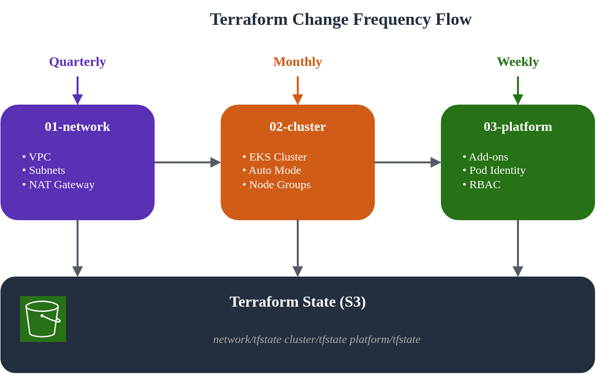
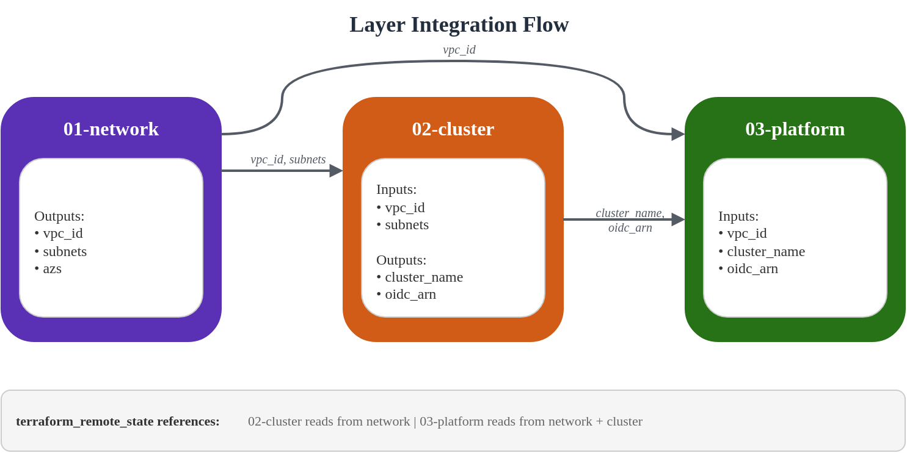

# インフラストラクチャのセットアップ

> **対応バージョン**: Terraform >= 1.10, AWS Provider >= 5.40, EKS >= 1.29 **最終更新**: February 19, 2026

< [目次](./) | [次: NLB Weighted Routing and Blue/Green Clusters](02-infrastructure-advanced.md) >

***

## 概要

このガイドでは、Auto Mode を有効にした Amazon EKS clusters (クラスター) をデプロイするための、本番環境対応の Terraform アーキテクチャを紹介します。3-layer アプローチでは、変更頻度、所有者、blast radius によってインフラストラクチャの関心事を分離し、運用上の安全性を維持しながらチームが独立して作業できるようにします。

**主要な設計原則:**

* **関心事の分離**: 各 layer は明確な所有者と変更パターンを持つ
* **Blast Radius の最小化**: ある layer の変更が誤って他の layer に影響しない
* **State の分離**: layer ごとに独立した Terraform state ファイルを使用する
* **GitOps Ready**: Terraform は AWS インフラストラクチャを管理し、Kubernetes resources は ArgoCD によって管理される

***

## 1. 3-Layer アーキテクチャの紹介

### なぜ Layer を分離するのか？

従来のモノリシックな Terraform 構成には、いくつかの運用上の課題があります。

1. **Plan/Apply 時間が長い**: すべての変更で全 resources の評価が必要になる
2. **Blast Radius**: 1 つの誤設定がインフラストラクチャ全体に影響する可能性がある
3. **チーム間の競合**: 複数のチームが同じ state ファイルを取り合う
4. **変更リスク**: ネットワーク変更とアプリケーション変更をまとめるとデプロイリスクが高まる

3-layer アーキテクチャは、安定性と所有者に基づいてインフラストラクチャを明確な階層に整理することで、これらの課題に対処します。

### Layer の特性

| Layer | 名前     | 変更頻度 | 主な所有者       | Blast Radius | 依存関係               |
| ----- | -------- | -------- | ---------------- | ------------ | ---------------------- |
| 01    | Network  | 四半期ごと | Infrastructure Team | 高         | なし                   |
| 02    | Cluster  | 月次     | Platform Team    | 中           | 01-network             |
| 03    | Platform | 週次     | Platform/App Teams | 低         | 01-network, 02-cluster |

### Directory 構造

```
eks-terraform/
├── 00-shared/
│   ├── variables.tf          # Common variables across all layers
│   ├── backend.tf.template   # Backend configuration template
│   └── providers.tf.template # Provider configuration template
├── 01-network/
│   ├── main.tf               # VPC, subnets, NAT Gateway
│   ├── variables.tf          # Network-specific variables
│   ├── outputs.tf            # VPC ID, subnet IDs for downstream
│   ├── backend.tf            # S3 backend: network/terraform.tfstate
│   └── providers.tf
├── 02-cluster/
│   ├── main.tf               # EKS cluster with Auto Mode
│   ├── data.tf               # Remote state from 01-network
│   ├── variables.tf          # Cluster-specific variables
│   ├── outputs.tf            # Cluster endpoint, OIDC provider
│   ├── backend.tf            # S3 backend: cluster/terraform.tfstate
│   └── providers.tf
└── 03-platform/
    ├── main.tf               # Add-ons, Pod Identity, RBAC
    ├── data.tf               # Remote state from 01-network, 02-cluster
    ├── variables.tf          # Platform-specific variables
    ├── outputs.tf            # Add-on ARNs, role mappings
    ├── backend.tf            # S3 backend: platform/terraform.tfstate
    └── providers.tf
```

### 変更フローの可視化



***

## 2. 00-shared: 共通設定

shared layer には、すべての layer で使用される設定テンプレートと共通変数が含まれます。これにより一貫性を確保し、重複を削減できます。

### S3 Backend 設定

まず、Terraform state 管理用の S3 bucket を作成します。

> **注記**: Terraform 1.10 以降、S3 backend は `use_lockfile = true` によるネイティブ state locking をサポートし、S3 conditional writes を活用します。これにより state locking のための DynamoDB table が不要になります。

```hcl
# 00-shared/bootstrap/main.tf
# Run this once to create backend infrastructure

terraform {
  required_version = ">= 1.10.0"
  required_providers {
    aws = {
      source  = "hashicorp/aws"
      version = ">= 5.40.0"
    }
  }
}

provider "aws" {
  region = var.region
}

variable "region" {
  description = "AWS region"
  type        = string
  default     = "ap-northeast-2"
}

variable "project_name" {
  description = "Project name for resource naming"
  type        = string
  default     = "eks-platform"
}

variable "environment" {
  description = "Environment name"
  type        = string
  default     = "prod"
}

locals {
  bucket_name = "${var.project_name}-${var.environment}-tfstate"
}

# S3 bucket for Terraform state
resource "aws_s3_bucket" "terraform_state" {
  bucket = local.bucket_name

  lifecycle {
    prevent_destroy = true
  }

  tags = {
    Name        = local.bucket_name
    Environment = var.environment
    ManagedBy   = "terraform"
  }
}

resource "aws_s3_bucket_versioning" "terraform_state" {
  bucket = aws_s3_bucket.terraform_state.id
  versioning_configuration {
    status = "Enabled"
  }
}

resource "aws_s3_bucket_server_side_encryption_configuration" "terraform_state" {
  bucket = aws_s3_bucket.terraform_state.id

  rule {
    apply_server_side_encryption_by_default {
      sse_algorithm = "aws:kms"
    }
    bucket_key_enabled = true
  }
}

resource "aws_s3_bucket_public_access_block" "terraform_state" {
  bucket = aws_s3_bucket.terraform_state.id

  block_public_acls       = true
  block_public_policy     = true
  ignore_public_acls      = true
  restrict_public_buckets = true
}

output "state_bucket_name" {
  value = aws_s3_bucket.terraform_state.id
}
```

### 共通変数

```hcl
# 00-shared/variables.tf
# Common variables used across all layers

variable "region" {
  description = "AWS region for all resources"
  type        = string
  default     = "ap-northeast-2"
}

variable "environment" {
  description = "Environment name (dev, staging, prod)"
  type        = string
  default     = "prod"

  validation {
    condition     = contains(["dev", "staging", "prod"], var.environment)
    error_message = "Environment must be dev, staging, or prod."
  }
}

variable "project_name" {
  description = "Project name used for resource naming"
  type        = string
  default     = "eks-platform"

  validation {
    condition     = can(regex("^[a-z][a-z0-9-]{2,20}$", var.project_name))
    error_message = "Project name must be lowercase, start with letter, 3-21 chars."
  }
}

variable "common_tags" {
  description = "Common tags applied to all resources"
  type        = map(string)
  default = {
    ManagedBy = "terraform"
    Project   = "eks-platform"
  }
}

locals {
  # Standard naming convention
  name_prefix = "${var.project_name}-${var.environment}"

  # Merge common tags with environment
  tags = merge(var.common_tags, {
    Environment = var.environment
  })

  # Backend configuration
  state_bucket = "${var.project_name}-${var.environment}-tfstate"
}
```

***

## 3. 01-network: VPC 設定

network layer は基盤となる VPC インフラストラクチャを確立します。この layer は変更頻度が低く、blast radius が大きいため慎重な計画が必要です。

### 設計上の考慮事項

このアーキテクチャでは、**Blue/Green zone design** を使用します。

* **Blue Zone**: ap-northeast-2a (primary)
* **Green Zone**: ap-northeast-2c (secondary)

この cluster ごとの single-zone アプローチには、次の利点があります。

* ステートフル workloads のデータ局所性
* コスト最適化 (cross-AZ traffic の削減)
* 明確な failure domain の分離

### メイン設定

```hcl
# 01-network/main.tf

terraform {
  required_version = ">= 1.10.0"
  required_providers {
    aws = {
      source  = "hashicorp/aws"
      version = ">= 5.40.0"
    }
  }
}

provider "aws" {
  region = var.region

  default_tags {
    tags = local.tags
  }
}

locals {
  name_prefix = "${var.project_name}-${var.environment}"

  tags = {
    Environment = var.environment
    Project     = var.project_name
    ManagedBy   = "terraform"
    Layer       = "network"
  }

  # Availability zones for blue/green clusters
  azs = ["ap-northeast-2a", "ap-northeast-2c"]

  # Subnet CIDR allocation
  # VPC: 10.0.0.0/16 (65,536 IPs)
  # Public subnets:  10.0.0.0/20, 10.0.16.0/20  (4,096 IPs each)
  # Private subnets: 10.0.128.0/18, 10.0.192.0/18 (16,384 IPs each)
  public_subnets  = ["10.0.0.0/20", "10.0.16.0/20"]
  private_subnets = ["10.0.128.0/18", "10.0.192.0/18"]
}

module "vpc" {
  source  = "terraform-aws-modules/vpc/aws"
  version = "~> 5.5"

  name = "${local.name_prefix}-vpc"
  cidr = var.vpc_cidr

  azs             = local.azs
  public_subnets  = local.public_subnets
  private_subnets = local.private_subnets

  # NAT Gateway configuration
  enable_nat_gateway     = true
  single_nat_gateway     = false  # One per AZ for HA
  one_nat_gateway_per_az = true

  # DNS settings
  enable_dns_hostnames = true
  enable_dns_support   = true

  # VPC Flow Logs
  enable_flow_log                      = true
  create_flow_log_cloudwatch_log_group = true
  create_flow_log_cloudwatch_iam_role  = true
  flow_log_max_aggregation_interval    = 60

  # Public subnet tags for EKS load balancers
  public_subnet_tags = {
    "kubernetes.io/role/elb" = "1"
    Type                     = "public"
  }

  # Private subnet tags for EKS internal load balancers
  private_subnet_tags = {
    "kubernetes.io/role/internal-elb" = "1"
    Type                              = "private"
  }

  tags = local.tags
}

# Additional subnet tags for specific clusters
# Blue cluster (ap-northeast-2a)
resource "aws_ec2_tag" "private_subnet_blue_cluster" {
  resource_id = module.vpc.private_subnets[0]
  key         = "kubernetes.io/cluster/${local.name_prefix}-blue"
  value       = "shared"
}

resource "aws_ec2_tag" "public_subnet_blue_cluster" {
  resource_id = module.vpc.public_subnets[0]
  key         = "kubernetes.io/cluster/${local.name_prefix}-blue"
  value       = "shared"
}

# Green cluster (ap-northeast-2c)
resource "aws_ec2_tag" "private_subnet_green_cluster" {
  resource_id = module.vpc.private_subnets[1]
  key         = "kubernetes.io/cluster/${local.name_prefix}-green"
  value       = "shared"
}

resource "aws_ec2_tag" "public_subnet_green_cluster" {
  resource_id = module.vpc.public_subnets[1]
  key         = "kubernetes.io/cluster/${local.name_prefix}-green"
  value       = "shared"
}

# VPC Endpoints for AWS services (reduces NAT costs)
module "vpc_endpoints" {
  source  = "terraform-aws-modules/vpc/aws//modules/vpc-endpoints"
  version = "~> 5.5"

  vpc_id = module.vpc.vpc_id

  endpoints = {
    s3 = {
      service      = "s3"
      service_type = "Gateway"
      route_table_ids = concat(
        module.vpc.private_route_table_ids,
        module.vpc.public_route_table_ids
      )
      tags = { Name = "${local.name_prefix}-s3-endpoint" }
    }
    ecr_api = {
      service             = "ecr.api"
      private_dns_enabled = true
      subnet_ids          = module.vpc.private_subnets
      security_group_ids  = [aws_security_group.vpc_endpoints.id]
      tags                = { Name = "${local.name_prefix}-ecr-api-endpoint" }
    }
    ecr_dkr = {
      service             = "ecr.dkr"
      private_dns_enabled = true
      subnet_ids          = module.vpc.private_subnets
      security_group_ids  = [aws_security_group.vpc_endpoints.id]
      tags                = { Name = "${local.name_prefix}-ecr-dkr-endpoint" }
    }
    sts = {
      service             = "sts"
      private_dns_enabled = true
      subnet_ids          = module.vpc.private_subnets
      security_group_ids  = [aws_security_group.vpc_endpoints.id]
      tags                = { Name = "${local.name_prefix}-sts-endpoint" }
    }
    logs = {
      service             = "logs"
      private_dns_enabled = true
      subnet_ids          = module.vpc.private_subnets
      security_group_ids  = [aws_security_group.vpc_endpoints.id]
      tags                = { Name = "${local.name_prefix}-logs-endpoint" }
    }
  }

  tags = local.tags
}

# Security group for VPC endpoints
resource "aws_security_group" "vpc_endpoints" {
  name        = "${local.name_prefix}-vpc-endpoints-sg"
  description = "Security group for VPC endpoints"
  vpc_id      = module.vpc.vpc_id

  ingress {
    description = "HTTPS from VPC"
    from_port   = 443
    to_port     = 443
    protocol    = "tcp"
    cidr_blocks = [var.vpc_cidr]
  }

  egress {
    description = "All outbound"
    from_port   = 0
    to_port     = 0
    protocol    = "-1"
    cidr_blocks = ["0.0.0.0/0"]
  }

  tags = merge(local.tags, {
    Name = "${local.name_prefix}-vpc-endpoints-sg"
  })
}
```

### 変数

```hcl
# 01-network/variables.tf

variable "region" {
  description = "AWS region"
  type        = string
  default     = "ap-northeast-2"
}

variable "environment" {
  description = "Environment name"
  type        = string
  default     = "prod"
}

variable "project_name" {
  description = "Project name"
  type        = string
  default     = "eks-platform"
}

variable "vpc_cidr" {
  description = "VPC CIDR block"
  type        = string
  default     = "10.0.0.0/16"

  validation {
    condition     = can(cidrnetmask(var.vpc_cidr))
    error_message = "VPC CIDR must be a valid IPv4 CIDR block."
  }
}
```

### Outputs

```hcl
# 01-network/outputs.tf

output "vpc_id" {
  description = "VPC ID"
  value       = module.vpc.vpc_id
}

output "vpc_cidr" {
  description = "VPC CIDR block"
  value       = module.vpc.vpc_cidr_block
}

output "private_subnet_ids" {
  description = "Private subnet IDs"
  value       = module.vpc.private_subnets
}

output "public_subnet_ids" {
  description = "Public subnet IDs"
  value       = module.vpc.public_subnets
}

output "private_subnet_cidrs" {
  description = "Private subnet CIDR blocks"
  value       = module.vpc.private_subnets_cidr_blocks
}

output "public_subnet_cidrs" {
  description = "Public subnet CIDR blocks"
  value       = module.vpc.public_subnets_cidr_blocks
}

output "nat_gateway_ids" {
  description = "NAT Gateway IDs"
  value       = module.vpc.natgw_ids
}

output "azs" {
  description = "Availability zones used"
  value       = module.vpc.azs
}

# Zone-specific outputs for blue/green clusters
output "blue_zone" {
  description = "Blue cluster availability zone"
  value       = module.vpc.azs[0]
}

output "green_zone" {
  description = "Green cluster availability zone"
  value       = module.vpc.azs[1]
}

output "blue_private_subnet_id" {
  description = "Blue cluster private subnet ID"
  value       = module.vpc.private_subnets[0]
}

output "green_private_subnet_id" {
  description = "Green cluster private subnet ID"
  value       = module.vpc.private_subnets[1]
}

output "blue_public_subnet_id" {
  description = "Blue cluster public subnet ID"
  value       = module.vpc.public_subnets[0]
}

output "green_public_subnet_id" {
  description = "Green cluster public subnet ID"
  value       = module.vpc.public_subnets[1]
}

output "vpc_endpoints_sg_id" {
  description = "VPC endpoints security group ID"
  value       = aws_security_group.vpc_endpoints.id
}
```

### Backend 設定

```hcl
# 01-network/backend.tf

terraform {
  backend "s3" {
    bucket         = "eks-platform-prod-tfstate"
    key            = "network/terraform.tfstate"
    region         = "ap-northeast-2"
    encrypt        = true
    use_lockfile   = true
  }
}
```

***

## 4. 02-cluster: EKS Auto Mode

cluster layer は Auto Mode を有効にした EKS をデプロイします。Auto Mode は compute、networking、storage 管理を自動化することで、cluster 運用を簡素化します。

### EKS Auto Mode の理解

EKS Auto Mode は次を提供します。

* **Compute Auto Mode**: 自動的な node provisioning と scaling
* **Network Auto Mode**: 自動 IP 管理を備えた managed VPC CNI
* **Storage Auto Mode**: 動的な storage class provisioning

EKS Auto Mode の詳細については、[EKS Auto Mode の開始](../eks-auto-mode/01-getting-started.md)を参照してください。

### Data Sources

```hcl
# 02-cluster/data.tf

# Reference network layer outputs
data "terraform_remote_state" "network" {
  backend = "s3"

  config = {
    bucket = "eks-platform-prod-tfstate"
    key    = "network/terraform.tfstate"
    region = "ap-northeast-2"
  }
}

# Current AWS account and region
data "aws_caller_identity" "current" {}
data "aws_region" "current" {}

# EKS cluster auth for kubectl provider
data "aws_eks_cluster_auth" "cluster" {
  name = module.eks.cluster_name
}
```

### メイン設定

```hcl
# 02-cluster/main.tf

terraform {
  required_version = ">= 1.10.0"
  required_providers {
    aws = {
      source  = "hashicorp/aws"
      version = ">= 5.40.0"
    }
    kubernetes = {
      source  = "hashicorp/kubernetes"
      version = ">= 2.25.0"
    }
  }
}

provider "aws" {
  region = var.region

  default_tags {
    tags = local.tags
  }
}

provider "kubernetes" {
  host                   = module.eks.cluster_endpoint
  cluster_ca_certificate = base64decode(module.eks.cluster_certificate_authority_data)
  token                  = data.aws_eks_cluster_auth.cluster.token
}

locals {
  name_prefix = "${var.project_name}-${var.environment}"
  cluster_name = "${local.name_prefix}-${var.cluster_color}"

  tags = {
    Environment = var.environment
    Project     = var.project_name
    ManagedBy   = "terraform"
    Layer       = "cluster"
    ClusterColor = var.cluster_color
  }

  # Network outputs from layer 01
  vpc_id             = data.terraform_remote_state.network.outputs.vpc_id
  private_subnet_ids = data.terraform_remote_state.network.outputs.private_subnet_ids
  public_subnet_ids  = data.terraform_remote_state.network.outputs.public_subnet_ids

  # Select subnet based on cluster color
  cluster_subnet_id = var.cluster_color == "blue" ? data.terraform_remote_state.network.outputs.blue_private_subnet_id : data.terraform_remote_state.network.outputs.green_private_subnet_id
}

module "eks" {
  source  = "terraform-aws-modules/eks/aws"
  version = "~> 20.8"

  cluster_name    = local.cluster_name
  cluster_version = var.cluster_version

  # Network configuration
  vpc_id     = local.vpc_id
  subnet_ids = local.private_subnet_ids

  # Cluster endpoint access
  cluster_endpoint_public_access  = true
  cluster_endpoint_private_access = true

  # EKS Auto Mode Configuration
  cluster_compute_config = {
    enabled    = true
    node_pools = ["general-purpose", "system"]
  }

  # Enable Auto Mode for networking
  cluster_kubernetes_network_config = {
    elastic_load_balancing = {
      enabled = true
    }
  }

  # Enable Auto Mode for storage
  cluster_storage_config = {
    block_storage = {
      enabled = true
    }
  }

  # Control plane logging
  cluster_enabled_log_types = [
    "api",
    "audit",
    "authenticator",
    "controllerManager",
    "scheduler"
  ]

  # Encryption configuration
  cluster_encryption_config = {
    provider_key_arn = aws_kms_key.eks.arn
    resources        = ["secrets"]
  }

  # Access configuration - using Access Entries (recommended)
  authentication_mode = "API_AND_CONFIG_MAP"

  # Cluster access entries
  access_entries = {
    # Cluster admin
    admin = {
      kubernetes_groups = []
      principal_arn     = var.cluster_admin_arn
      policy_associations = {
        admin = {
          policy_arn = "arn:aws:eks::aws:cluster-access-policy/AmazonEKSClusterAdminPolicy"
          access_scope = {
            type = "cluster"
          }
        }
      }
    }
  }

  tags = local.tags
}

# KMS key for EKS secrets encryption
resource "aws_kms_key" "eks" {
  description             = "KMS key for EKS ${local.cluster_name} secrets encryption"
  deletion_window_in_days = 7
  enable_key_rotation     = true

  tags = merge(local.tags, {
    Name = "${local.cluster_name}-eks-secrets"
  })
}

resource "aws_kms_alias" "eks" {
  name          = "alias/${local.cluster_name}-eks-secrets"
  target_key_id = aws_kms_key.eks.key_id
}

# CloudWatch Log Group for EKS control plane logs
resource "aws_cloudwatch_log_group" "eks" {
  name              = "/aws/eks/${local.cluster_name}/cluster"
  retention_in_days = var.log_retention_days

  tags = local.tags
}

# Security group rules for cluster
resource "aws_security_group_rule" "cluster_ingress_vpc" {
  description       = "Allow VPC traffic to cluster API"
  type              = "ingress"
  from_port         = 443
  to_port           = 443
  protocol          = "tcp"
  cidr_blocks       = [data.terraform_remote_state.network.outputs.vpc_cidr]
  security_group_id = module.eks.cluster_security_group_id
}
```

### 変数

```hcl
# 02-cluster/variables.tf

variable "region" {
  description = "AWS region"
  type        = string
  default     = "ap-northeast-2"
}

variable "environment" {
  description = "Environment name"
  type        = string
  default     = "prod"
}

variable "project_name" {
  description = "Project name"
  type        = string
  default     = "eks-platform"
}

variable "cluster_color" {
  description = "Cluster color identifier (blue or green)"
  type        = string
  default     = "blue"

  validation {
    condition     = contains(["blue", "green"], var.cluster_color)
    error_message = "Cluster color must be blue or green."
  }
}

variable "cluster_version" {
  description = "EKS cluster version"
  type        = string
  default     = "1.30"
}

variable "cluster_admin_arn" {
  description = "IAM ARN for cluster admin access"
  type        = string
}

variable "log_retention_days" {
  description = "CloudWatch log retention in days"
  type        = number
  default     = 30
}
```

### Outputs

```hcl
# 02-cluster/outputs.tf

output "cluster_name" {
  description = "EKS cluster name"
  value       = module.eks.cluster_name
}

output "cluster_endpoint" {
  description = "EKS cluster API endpoint"
  value       = module.eks.cluster_endpoint
}

output "cluster_certificate_authority_data" {
  description = "Base64 encoded cluster CA certificate"
  value       = module.eks.cluster_certificate_authority_data
  sensitive   = true
}

output "cluster_arn" {
  description = "EKS cluster ARN"
  value       = module.eks.cluster_arn
}

output "cluster_version" {
  description = "EKS cluster Kubernetes version"
  value       = module.eks.cluster_version
}

output "cluster_security_group_id" {
  description = "EKS cluster security group ID"
  value       = module.eks.cluster_security_group_id
}

output "node_security_group_id" {
  description = "EKS node security group ID"
  value       = module.eks.node_security_group_id
}

output "oidc_provider_arn" {
  description = "OIDC provider ARN for IRSA"
  value       = module.eks.oidc_provider_arn
}

output "oidc_provider_url" {
  description = "OIDC provider URL"
  value       = module.eks.cluster_oidc_issuer_url
}

output "cluster_primary_security_group_id" {
  description = "EKS cluster primary security group ID"
  value       = module.eks.cluster_primary_security_group_id
}

output "kms_key_arn" {
  description = "KMS key ARN for secrets encryption"
  value       = aws_kms_key.eks.arn
}

output "cluster_color" {
  description = "Cluster color identifier"
  value       = var.cluster_color
}
```

### Backend 設定

```hcl
# 02-cluster/backend.tf

terraform {
  backend "s3" {
    bucket         = "eks-platform-prod-tfstate"
    key            = "cluster/blue/terraform.tfstate"  # Use cluster/green/ for green cluster
    region         = "ap-northeast-2"
    encrypt        = true
    use_lockfile   = true
  }
}
```

***

## 5. 03-platform: Add-ons と Pod Identity

platform layer は EKS add-ons、Pod Identity (Pod アイデンティティ) associations、アプリケーションチーム向けの access entries を管理します。この layer は、チームのオンボーディングやアプリケーション要件の変化に伴って頻繁に変更されます。

### Data Sources

```hcl
# 03-platform/data.tf

# Reference network layer
data "terraform_remote_state" "network" {
  backend = "s3"

  config = {
    bucket = "eks-platform-prod-tfstate"
    key    = "network/terraform.tfstate"
    region = "ap-northeast-2"
  }
}

# Reference cluster layer
data "terraform_remote_state" "cluster" {
  backend = "s3"

  config = {
    bucket = "eks-platform-prod-tfstate"
    key    = "cluster/${var.cluster_color}/terraform.tfstate"
    region = "ap-northeast-2"
  }
}

# Current AWS account
data "aws_caller_identity" "current" {}
data "aws_region" "current" {}

# EKS cluster auth
data "aws_eks_cluster_auth" "cluster" {
  name = data.terraform_remote_state.cluster.outputs.cluster_name
}
```

### メイン設定

```hcl
# 03-platform/main.tf

terraform {
  required_version = ">= 1.10.0"
  required_providers {
    aws = {
      source  = "hashicorp/aws"
      version = ">= 5.40.0"
    }
    kubernetes = {
      source  = "hashicorp/kubernetes"
      version = ">= 2.25.0"
    }
  }
}

provider "aws" {
  region = var.region

  default_tags {
    tags = local.tags
  }
}

provider "kubernetes" {
  host                   = data.terraform_remote_state.cluster.outputs.cluster_endpoint
  cluster_ca_certificate = base64decode(data.terraform_remote_state.cluster.outputs.cluster_certificate_authority_data)
  token                  = data.aws_eks_cluster_auth.cluster.token
}

locals {
  name_prefix  = "${var.project_name}-${var.environment}"
  cluster_name = data.terraform_remote_state.cluster.outputs.cluster_name
  oidc_provider_arn = data.terraform_remote_state.cluster.outputs.oidc_provider_arn

  tags = {
    Environment  = var.environment
    Project      = var.project_name
    ManagedBy    = "terraform"
    Layer        = "platform"
    ClusterColor = var.cluster_color
  }
}

#------------------------------------------------------------------------------
# EKS Add-ons
#------------------------------------------------------------------------------

# EBS CSI Driver Add-on
resource "aws_eks_addon" "ebs_csi" {
  cluster_name = local.cluster_name
  addon_name   = "aws-ebs-csi-driver"

  addon_version            = var.ebs_csi_version
  resolve_conflicts_on_create = "OVERWRITE"
  resolve_conflicts_on_update = "OVERWRITE"

  pod_identity_association {
    role_arn        = aws_iam_role.ebs_csi.arn
    service_account = "ebs-csi-controller-sa"
  }

  tags = local.tags
}

# EBS CSI Driver IAM Role
resource "aws_iam_role" "ebs_csi" {
  name = "${local.cluster_name}-ebs-csi-role"

  assume_role_policy = jsonencode({
    Version = "2012-10-17"
    Statement = [
      {
        Effect = "Allow"
        Principal = {
          Service = "pods.eks.amazonaws.com"
        }
        Action = [
          "sts:AssumeRole",
          "sts:TagSession"
        ]
      }
    ]
  })

  tags = local.tags
}

resource "aws_iam_role_policy_attachment" "ebs_csi" {
  policy_arn = "arn:aws:iam::aws:policy/service-role/AmazonEBSCSIDriverPolicy"
  role       = aws_iam_role.ebs_csi.name
}

# CoreDNS Add-on (managed by Auto Mode but can be customized)
resource "aws_eks_addon" "coredns" {
  cluster_name = local.cluster_name
  addon_name   = "coredns"

  addon_version            = var.coredns_version
  resolve_conflicts_on_create = "OVERWRITE"
  resolve_conflicts_on_update = "OVERWRITE"

  tags = local.tags
}

#------------------------------------------------------------------------------
# Pod Identity Associations
#------------------------------------------------------------------------------

# ArgoCD Pod Identity
resource "aws_eks_pod_identity_association" "argocd" {
  cluster_name    = local.cluster_name
  namespace       = "argocd"
  service_account = "argocd-server"
  role_arn        = aws_iam_role.argocd.arn

  tags = local.tags
}

resource "aws_iam_role" "argocd" {
  name = "${local.cluster_name}-argocd-role"

  assume_role_policy = jsonencode({
    Version = "2012-10-17"
    Statement = [
      {
        Effect = "Allow"
        Principal = {
          Service = "pods.eks.amazonaws.com"
        }
        Action = [
          "sts:AssumeRole",
          "sts:TagSession"
        ]
      }
    ]
  })

  tags = local.tags
}

# ArgoCD ECR access policy
resource "aws_iam_role_policy" "argocd_ecr" {
  name = "ecr-access"
  role = aws_iam_role.argocd.id

  policy = jsonencode({
    Version = "2012-10-17"
    Statement = [
      {
        Effect = "Allow"
        Action = [
          "ecr:GetAuthorizationToken",
          "ecr:BatchCheckLayerAvailability",
          "ecr:GetDownloadUrlForLayer",
          "ecr:BatchGetImage"
        ]
        Resource = "*"
      }
    ]
  })
}

# External Secrets Operator Pod Identity
resource "aws_eks_pod_identity_association" "external_secrets" {
  cluster_name    = local.cluster_name
  namespace       = "external-secrets"
  service_account = "external-secrets"
  role_arn        = aws_iam_role.external_secrets.arn

  tags = local.tags
}

resource "aws_iam_role" "external_secrets" {
  name = "${local.cluster_name}-external-secrets-role"

  assume_role_policy = jsonencode({
    Version = "2012-10-17"
    Statement = [
      {
        Effect = "Allow"
        Principal = {
          Service = "pods.eks.amazonaws.com"
        }
        Action = [
          "sts:AssumeRole",
          "sts:TagSession"
        ]
      }
    ]
  })

  tags = local.tags
}

# External Secrets Secrets Manager access
resource "aws_iam_role_policy" "external_secrets_sm" {
  name = "secrets-manager-access"
  role = aws_iam_role.external_secrets.id

  policy = jsonencode({
    Version = "2012-10-17"
    Statement = [
      {
        Effect = "Allow"
        Action = [
          "secretsmanager:GetSecretValue",
          "secretsmanager:DescribeSecret",
          "secretsmanager:ListSecrets"
        ]
        Resource = "arn:aws:secretsmanager:${data.aws_region.current.name}:${data.aws_caller_identity.current.account_id}:secret:${var.project_name}/*"
      },
      {
        Effect = "Allow"
        Action = [
          "ssm:GetParameter",
          "ssm:GetParameters",
          "ssm:GetParametersByPath"
        ]
        Resource = "arn:aws:ssm:${data.aws_region.current.name}:${data.aws_caller_identity.current.account_id}:parameter/${var.project_name}/*"
      }
    ]
  })
}

# Application Pod Identity (ECR pull)
resource "aws_eks_pod_identity_association" "app_ecr" {
  for_each = toset(var.app_namespaces)

  cluster_name    = local.cluster_name
  namespace       = each.value
  service_account = "default"
  role_arn        = aws_iam_role.app_ecr.arn

  tags = local.tags
}

resource "aws_iam_role" "app_ecr" {
  name = "${local.cluster_name}-app-ecr-role"

  assume_role_policy = jsonencode({
    Version = "2012-10-17"
    Statement = [
      {
        Effect = "Allow"
        Principal = {
          Service = "pods.eks.amazonaws.com"
        }
        Action = [
          "sts:AssumeRole",
          "sts:TagSession"
        ]
      }
    ]
  })

  tags = local.tags
}

resource "aws_iam_role_policy_attachment" "app_ecr" {
  policy_arn = "arn:aws:iam::aws:policy/AmazonEC2ContainerRegistryReadOnly"
  role       = aws_iam_role.app_ecr.name
}

#------------------------------------------------------------------------------
# Access Entries for Teams
#------------------------------------------------------------------------------

# Developer access (namespace-scoped)
resource "aws_eks_access_entry" "developers" {
  for_each = var.developer_roles

  cluster_name  = local.cluster_name
  principal_arn = each.value.arn
  type          = "STANDARD"

  tags = local.tags
}

resource "aws_eks_access_policy_association" "developers" {
  for_each = var.developer_roles

  cluster_name  = local.cluster_name
  principal_arn = each.value.arn
  policy_arn    = "arn:aws:eks::aws:cluster-access-policy/AmazonEKSEditPolicy"

  access_scope {
    type       = "namespace"
    namespaces = each.value.namespaces
  }

  depends_on = [aws_eks_access_entry.developers]
}

# Read-only access for monitoring
resource "aws_eks_access_entry" "readonly" {
  for_each = var.readonly_roles

  cluster_name  = local.cluster_name
  principal_arn = each.value
  type          = "STANDARD"

  tags = local.tags
}

resource "aws_eks_access_policy_association" "readonly" {
  for_each = var.readonly_roles

  cluster_name  = local.cluster_name
  principal_arn = each.value
  policy_arn    = "arn:aws:eks::aws:cluster-access-policy/AmazonEKSViewPolicy"

  access_scope {
    type = "cluster"
  }

  depends_on = [aws_eks_access_entry.readonly]
}
```

### 変数

```hcl
# 03-platform/variables.tf

variable "region" {
  description = "AWS region"
  type        = string
  default     = "ap-northeast-2"
}

variable "environment" {
  description = "Environment name"
  type        = string
  default     = "prod"
}

variable "project_name" {
  description = "Project name"
  type        = string
  default     = "eks-platform"
}

variable "cluster_color" {
  description = "Cluster color identifier"
  type        = string
  default     = "blue"
}

variable "ebs_csi_version" {
  description = "EBS CSI driver addon version"
  type        = string
  default     = "v1.28.0-eksbuild.1"
}

variable "coredns_version" {
  description = "CoreDNS addon version"
  type        = string
  default     = "v1.11.1-eksbuild.6"
}

variable "app_namespaces" {
  description = "Application namespaces for ECR Pod Identity"
  type        = list(string)
  default     = ["default", "apps", "staging"]
}

variable "developer_roles" {
  description = "Developer IAM roles and their namespace access"
  type = map(object({
    arn        = string
    namespaces = list(string)
  }))
  default = {}
}

variable "readonly_roles" {
  description = "Read-only IAM role ARNs"
  type        = map(string)
  default     = {}
}
```

### Outputs

```hcl
# 03-platform/outputs.tf

output "ebs_csi_role_arn" {
  description = "EBS CSI driver IAM role ARN"
  value       = aws_iam_role.ebs_csi.arn
}

output "argocd_role_arn" {
  description = "ArgoCD IAM role ARN"
  value       = aws_iam_role.argocd.arn
}

output "external_secrets_role_arn" {
  description = "External Secrets IAM role ARN"
  value       = aws_iam_role.external_secrets.arn
}

output "app_ecr_role_arn" {
  description = "Application ECR access IAM role ARN"
  value       = aws_iam_role.app_ecr.arn
}

output "configured_namespaces" {
  description = "Namespaces with Pod Identity configured"
  value       = var.app_namespaces
}
```

### Backend 設定

```hcl
# 03-platform/backend.tf

terraform {
  backend "s3" {
    bucket         = "eks-platform-prod-tfstate"
    key            = "platform/blue/terraform.tfstate"  # Use platform/green/ for green cluster
    region         = "ap-northeast-2"
    encrypt        = true
    use_lockfile   = true
  }
}
```

***

## 6. Layer 間の統合

### Remote State パターン

`terraform_remote_state` data source により、layers は他の layers の outputs を密結合せずに利用できます。

```hcl
# Pattern: Consuming outputs from another layer
data "terraform_remote_state" "network" {
  backend = "s3"

  config = {
    bucket = "eks-platform-prod-tfstate"
    key    = "network/terraform.tfstate"
    region = "ap-northeast-2"
  }
}

# Usage
locals {
  vpc_id = data.terraform_remote_state.network.outputs.vpc_id
}
```

### Output/Data フロー



### State 管理のベストプラクティス

1. **一貫した Bucket 命名を使用する**: `{project}-{env}-tfstate`
2. **Layer と Color で整理する**: `network/`, `cluster/blue/`, `platform/green/`
3. **Versioning を有効にする**: state 破損から復旧する
4. **Encryption を有効にする**: state 内の機密値を保護する
5. **S3 Native Locking を使用する** (Terraform 1.10+): DynamoDB なしで S3 conditional writes ベースの state locking を行うため、backend configuration で `use_lockfile = true` を有効にする

### State ファイルの構成

```
s3://eks-platform-prod-tfstate/
├── network/
│   └── terraform.tfstate
├── cluster/
│   ├── blue/
│   │   └── terraform.tfstate
│   └── green/
│       └── terraform.tfstate
└── platform/
    ├── blue/
    │   └── terraform.tfstate
    └── green/
        └── terraform.tfstate
```

***

## 7. 検証

### デプロイ順序

依存関係があるため、layers は順番にデプロイする必要があります。

```bash
# Step 1: Bootstrap (run once)
cd 00-shared/bootstrap
terraform init
terraform apply

# Step 2: Network layer
cd ../../01-network
terraform init
terraform apply

# Step 3: Cluster layer (blue)
cd ../02-cluster
# Edit backend.tf to use cluster/blue/terraform.tfstate
# Edit terraform.tfvars to set cluster_color = "blue"
terraform init
terraform apply

# Step 4: Platform layer (blue)
cd ../03-platform
# Edit backend.tf to use platform/blue/terraform.tfstate
# Edit terraform.tfvars to set cluster_color = "blue"
terraform init
terraform apply
```

### 検証コマンド

cluster のデプロイ後、設定を検証します。

```bash
# Configure kubectl
aws eks update-kubeconfig --name eks-platform-prod-blue --region ap-northeast-2

# Verify cluster access
kubectl cluster-info

# Check nodes (Auto Mode will provision as needed)
kubectl get nodes

# Verify Auto Mode node pools
kubectl get nodepools

# Check EKS add-ons
kubectl get pods -n kube-system

# Verify Pod Identity agent
kubectl get pods -n kube-system -l app.kubernetes.io/name=eks-pod-identity-agent

# Check storage classes
kubectl get storageclass

# Verify OIDC provider
aws eks describe-cluster --name eks-platform-prod-blue \
  --query "cluster.identity.oidc.issuer" --output text
```

### Smoke Test Script

包括的な smoke test を作成します。

```bash
#!/bin/bash
# smoke-test.sh - Validate EKS cluster deployment

set -e

CLUSTER_NAME="${1:-eks-platform-prod-blue}"
REGION="${2:-ap-northeast-2}"

echo "=== EKS Cluster Smoke Test ==="
echo "Cluster: $CLUSTER_NAME"
echo "Region: $REGION"
echo ""

# Update kubeconfig
echo "1. Configuring kubectl..."
aws eks update-kubeconfig --name "$CLUSTER_NAME" --region "$REGION"

# Test cluster connectivity
echo "2. Testing cluster connectivity..."
kubectl cluster-info || { echo "FAIL: Cannot connect to cluster"; exit 1; }

# Check cluster version
echo "3. Checking cluster version..."
CLUSTER_VERSION=$(kubectl version --short 2>/dev/null | grep Server | awk '{print $3}')
echo "   Cluster version: $CLUSTER_VERSION"

# Check nodes
echo "4. Checking nodes..."
NODE_COUNT=$(kubectl get nodes --no-headers 2>/dev/null | wc -l)
echo "   Node count: $NODE_COUNT"

# Check system pods
echo "5. Checking system pods..."
PENDING_PODS=$(kubectl get pods -n kube-system --field-selector=status.phase!=Running,status.phase!=Succeeded --no-headers 2>/dev/null | wc -l)
if [ "$PENDING_PODS" -gt 0 ]; then
  echo "   WARNING: $PENDING_PODS pods not running in kube-system"
  kubectl get pods -n kube-system --field-selector=status.phase!=Running,status.phase!=Succeeded
else
  echo "   All system pods running"
fi

# Check storage classes
echo "6. Checking storage classes..."
kubectl get storageclass

# Check Pod Identity agent
echo "7. Checking Pod Identity agent..."
PI_PODS=$(kubectl get pods -n kube-system -l app.kubernetes.io/name=eks-pod-identity-agent --no-headers 2>/dev/null | wc -l)
echo "   Pod Identity agent pods: $PI_PODS"

# Test pod creation
echo "8. Testing pod creation..."
kubectl run smoke-test --image=nginx:alpine --restart=Never --rm -it --timeout=60s -- echo "Pod creation successful" 2>/dev/null || true

# Check Auto Mode node pools
echo "9. Checking Auto Mode node pools..."
kubectl get nodepools 2>/dev/null || echo "   NodePools CRD not available (expected if no workloads yet)"

echo ""
echo "=== Smoke Test Complete ==="
```

### Terraform 検証

```bash
# Validate all layers
for layer in 01-network 02-cluster 03-platform; do
  echo "Validating $layer..."
  cd "$layer"
  terraform validate
  terraform fmt -check
  cd ..
done

# Plan without applying (dry run)
cd 01-network && terraform plan -out=plan.out
cd ../02-cluster && terraform plan -out=plan.out
cd ../03-platform && terraform plan -out=plan.out
```

***

## 主要な設計原則

### Terraform は AWS インフラストラクチャのみを管理する

このアーキテクチャは明確な分離に従います。

| Layer      | Terraform が管理                  | GitOps が管理                  |
| ---------- | ---------------------------------- | ------------------------------ |
| Network    | VPC, Subnets, NAT, Endpoints       | -                              |
| Cluster    | EKS, KMS, CloudWatch               | -                              |
| Platform   | Add-ons, IAM Roles, Access Entries | -                              |
| Kubernetes | -                                  | NodePool, Deployments, Services |

Kubernetes resources (NodePool definitions、application Deployments) は ArgoCD GitOps によって管理されます。詳細については、[GitOps Pipeline 設定](https://github.com/Atom-oh/kubernetes-docs/blob/main/en/ops/04-gitops-pipeline.md)を参照してください。

### Cross-References

* [EKS Auto Mode の開始](../eks-auto-mode/01-getting-started.md)
* [EKS Security Best Practices](../eks/05-eks-security.md)
* [NLB Weighted Routing and Blue/Green Clusters](02-infrastructure-advanced.md)
* [GitOps Pipeline 設定](https://github.com/Atom-oh/kubernetes-docs/blob/main/en/ops/04-gitops-pipeline.md)

***

< [目次](./) | [次: NLB Weighted Routing and Blue/Green Clusters](02-infrastructure-advanced.md) >
