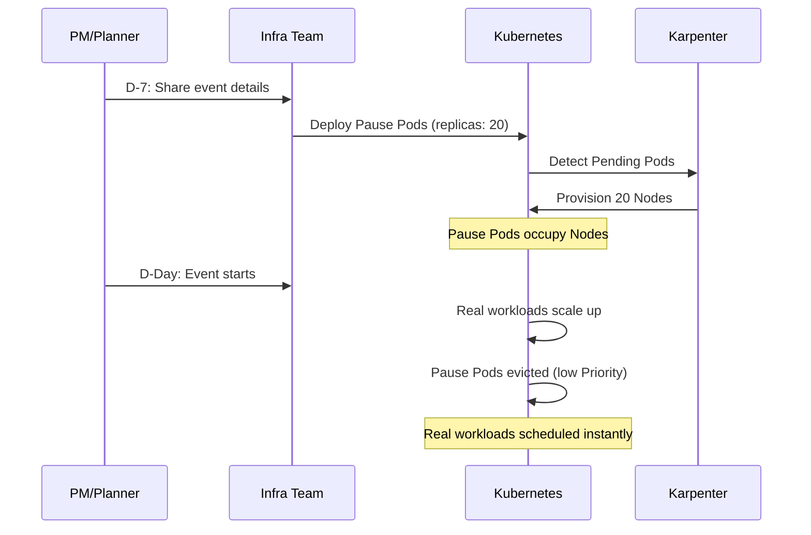
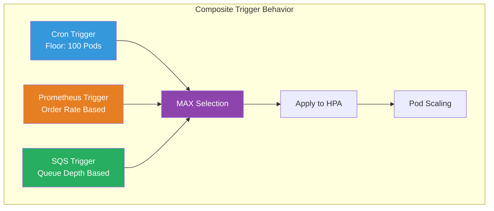
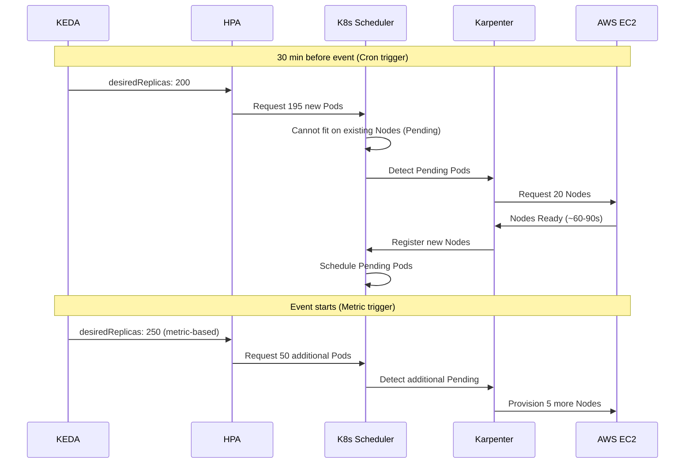

# イベントキャパシティプランニング プレイブック

> **サポート対象バージョン**: Kubernetes 1.28+, KEDA 2.14+, Karpenter 0.37+
> **最終更新**: April 25, 2026

< [前へ: EKS アップグレード運用](./11-upgrade-operations.md) | [目次](./README.md) | [次へ: FinOps コスト可視化](./13-finops-cost-platform.md) >

---

## 概要

フラッシュセール、マーケティングキャンペーン、季節イベントでは、トラフィック急増に確実に対応するために、プロアクティブなインフラストラクチャのキャパシティプランニングが必要です。このプレイブックは、**運用エンジニア**と**非技術系ステークホルダー**（PM、マーケター）の双方に向けて、実践的で実行可能なガイダンスを提供します。

Pod レベルのスケーリングには KEDA、Node レベルのプロビジョニングには Karpenter を組み合わせることで、cron ベースの事前スケーリングを安全な下限として使いながら、ビジネスメトリクスでリアルタイムの弾力性を駆動する、堅牢なイベントスケーリング戦略を作成できます。

### 学習目標

- イベントタイプごとのトラフィックパターンとスケーリング戦略を理解する
- キャパシティプランニングワークシートを使ってインフラストラクチャ要件を見積もる
- KEDA cron + ビジネスメトリクスの複合トリガーを設定する
- Karpenter warm pool と EC2 Capacity Reservations を活用する
- エンドツーエンドの KEDA + Karpenter 連携を実装する
- イベント固有の Runbook と運用プロセスを構築する

---

## 1. イベントキャパシティプランニングフレームワーク

### 1.1 イベントタイプの分類

| イベントタイプ | トラフィック倍率 | ランプアップ時間 | 継続時間 | 予測可能性 | 例 |
|-----------|-------------------|-------------|----------|---------------|---------|
| フラッシュセール | 10-50x | 秒 | 1-4 時間 | 高 | 時間限定セール、限定版ローンチ |
| プロダクトローンチ | 5-20x | 分 | 1-7 日 | 高 | 新機能リリース、アプリ更新 |
| マーケティングキャンペーン | 3-10x | 分-時間 | 時間-日 | 中 | テレビ広告、SNS でのバイラル |
| 季節イベント | 5-30x | 時間 | 1-7 日 | 高 | ブラックフライデー、年末セール |
| 予期しない急増 | 5-100x | 秒 | 不確定 | 低 | ニュース/SNS でのバイラル、ボット攻撃 |

### 1.2 キャパシティプランニングワークシート

PM とプランナーが記入し、インフラチームへ引き渡せる標準ワークシートです。

**入力（PM/プランナーが記入）:**

| 項目 | 説明 | 例の値 |
|-------|------------|---------------|
| イベントタイプ | フラッシュセール / マーケティング / 季節 | フラッシュセール |
| 想定同時ユーザー数 | ピーク時の同時接続数 | 100,000 |
| 想定ピーク RPM | 1 分あたりの最大リクエスト数 | 600,000 |
| イベント開始時刻 | 日付と時刻（ローカル TZ） | 2026-05-01 12:00 KST |
| イベント継続時間 | ピークトラフィックの時間 | 2 時間 |
| ランプアップ時間 | ピークトラフィックに到達するまでの時間 | 10 秒 |
| ベースライントラフィック | 通常時の RPM | 30,000 |

**計算式:**

```
Required Pods  = Peak RPM ÷ RPM per Pod
Required Nodes = Required Pods ÷ Pods per Node
Estimated Cost = Nodes × Hourly Cost × (Event Hours + Pre-scale + Cooldown)

Example:
- RPM per Pod: 3,000 (measured via load test)
- Required Pods: 600,000 ÷ 3,000 = 200 Pods
- Pods per Node: 10 (c5.4xlarge)
- Required Nodes: 200 ÷ 10 = 20 Nodes
- Safety margin (+30%): 26 Nodes
- Cost: 26 × $0.68/hr × (2hr event + 1hr pre + 1hr cooldown) = ~$70.72
```

### 1.3 D-30 から D+1 までのタイムラインチェックリスト

| 時期 | オーナー | タスク | 完了 |
|------|-------|------|------|
| **D-30** | PM + Infra | イベント詳細を共有する（ワークシートを記入） | ☐ |
| **D-30** | Infra | Capacity Reservations をリクエストする（必要な場合） | ☐ |
| **D-30** | Finance | 追加インフラストラクチャ予算を承認する | ☐ |
| **D-14** | Infra | 目標 RPM の 120% で負荷テストを実行する | ☐ |
| **D-14** | Infra | ボトルネックを特定して解消する | ☐ |
| **D-7** | Infra | KEDA ScaledObject をデプロイする（cron 事前スケーリング） | ☐ |
| **D-7** | Infra | Karpenter イベント NodePool をデプロイする | ☐ |
| **D-7** | Infra | 監視ダッシュボードを設定する | ☐ |
| **D-3** | Infra | 事前スケーリングのドライランを行う（ライブトラフィックなしで検証） | ☐ |
| **D-1** | Infra + PM | 最終確認: Pod/Node 数、アラートチャネル、ダッシュボード URL | ☐ |
| **D-1** | Infra | War room を設置し、オンコールを割り当てる | ☐ |
| **D-Day** | Infra | 事前スケーリングを確認する（イベント 30 分前） | ☐ |
| **D-Day** | Infra | リアルタイム監視と手動介入の待機を行う | ☐ |
| **D+1** | Infra | スケールダウンを確認し、残存リソースをクリーンアップする | ☐ |
| **D+1** | Infra + PM | ポストモーテム: 予測 vs 実績、コスト分析 | ☐ |

---

## 2. 事前スケーリング戦略

### 2.1 KEDA Cron ベースの事前スケーリング

初期トラフィックのスパイクを吸収するため、イベント前に Pod をスケールアップします。

**単一イベントウィンドウ:**

```yaml
apiVersion: keda.sh/v1alpha1
kind: ScaledObject
metadata:
  name: flash-sale-prescale
  namespace: ecommerce
spec:
  scaleTargetRef:
    name: order-service
  minReplicaCount: 5
  maxReplicaCount: 300
  triggers:
    # Pre-scale 30 min before the event
    - type: cron
      metadata:
        timezone: Asia/Seoul
        start: "30 11 1 5 *"    # May 1st, 11:30
        end: "30 14 1 5 *"      # May 1st, 14:30
        desiredReplicas: "200"
```

**複数リージョンのイベントウィンドウ:**

```yaml
apiVersion: keda.sh/v1alpha1
kind: ScaledObject
metadata:
  name: global-sale-prescale
  namespace: ecommerce
spec:
  scaleTargetRef:
    name: order-service
  minReplicaCount: 5
  maxReplicaCount: 500
  triggers:
    # Korea flash sale (KST 12:00-14:00)
    - type: cron
      metadata:
        timezone: Asia/Seoul
        start: "30 11 1 5 *"
        end: "30 14 1 5 *"
        desiredReplicas: "200"
    # Japan flash sale (JST 18:00-20:00)
    - type: cron
      metadata:
        timezone: Asia/Tokyo
        start: "30 17 1 5 *"
        end: "30 20 1 5 *"
        desiredReplicas: "150"
    # US flash sale (EST 09:00-11:00)
    - type: cron
      metadata:
        timezone: America/New_York
        start: "30 8 1 5 *"
        end: "30 11 1 5 *"
        desiredReplicas: "180"
```

### 2.2 Karpenter Warm Pools

Pod のスケジューリング遅延をなくすため、イベント前に Node を事前プロビジョニングします。

```yaml
apiVersion: karpenter.sh/v1
kind: NodePool
metadata:
  name: event-warm-pool
spec:
  template:
    metadata:
      labels:
        workload-type: event
        pool: warm
    spec:
      requirements:
        - key: kubernetes.io/arch
          operator: In
          values: ["amd64"]
        - key: karpenter.sh/capacity-type
          operator: In
          values: ["on-demand"]
        - key: node.kubernetes.io/instance-type
          operator: In
          values:
            - c5.4xlarge
            - c5.2xlarge
            - m5.4xlarge
      nodeClassRef:
        group: karpenter.k8s.aws
        kind: EC2NodeClass
        name: event-nodes
  limits:
    cpu: "640"
    memory: 1280Gi
  disruption:
    consolidationPolicy: WhenEmpty
    consolidateAfter: 30m
  weight: 100   # Higher weight = preferred over default NodePool
---
apiVersion: karpenter.k8s.aws/v1
kind: EC2NodeClass
metadata:
  name: event-nodes
spec:
  amiSelectorTerms:
    - alias: al2023@latest
  subnetSelectorTerms:
    - tags:
        karpenter.sh/discovery: my-cluster
  securityGroupSelectorTerms:
    - tags:
        karpenter.sh/discovery: my-cluster
  blockDeviceMappings:
    - deviceName: /dev/xvda
      ebs:
        volumeSize: 100Gi
        volumeType: gp3
        iops: 5000
        throughput: 250
  tags:
    event: flash-sale-2026-05
    cost-center: marketing
```

### 2.3 EC2 Capacity Reservations

大規模イベント向けにインスタンスの可用性を保証します。

**Terraform HCL:**

```hcl
resource "aws_ec2_capacity_reservation" "flash_sale" {
  instance_type     = "c5.4xlarge"
  instance_platform = "Linux/UNIX"
  availability_zone = "ap-northeast-2a"
  instance_count    = 15
  instance_match_criteria = "targeted"

  end_date_type = "limited"
  end_date      = "2026-05-01T15:00:00Z"

  tags = {
    Name       = "flash-sale-2026-05"
    Event      = "flash-sale"
    CostCenter = "marketing"
  }
}

resource "aws_ec2_capacity_reservation" "flash_sale_2b" {
  instance_type     = "c5.4xlarge"
  instance_platform = "Linux/UNIX"
  availability_zone = "ap-northeast-2b"
  instance_count    = 11
  instance_match_criteria = "targeted"
  end_date_type = "limited"
  end_date      = "2026-05-01T15:00:00Z"
  tags = {
    Name       = "flash-sale-2026-05-2b"
    Event      = "flash-sale"
    CostCenter = "marketing"
  }
}
```

**Karpenter で Capacity Reservations をターゲットにする:**

```yaml
apiVersion: karpenter.k8s.aws/v1
kind: EC2NodeClass
metadata:
  name: event-reserved
spec:
  amiSelectorTerms:
    - alias: al2023@latest
  subnetSelectorTerms:
    - tags:
        karpenter.sh/discovery: my-cluster
  securityGroupSelectorTerms:
    - tags:
        karpenter.sh/discovery: my-cluster
  capacityReservationSelectorTerms:
    - tags:
        Event: flash-sale
```

### 2.4 Pause Pods（プレースホルダースケーリング）

低優先度のプレースホルダー Pod を使って Node を事前にウォームアップします。実際のワークロードがキャパシティを必要とすると、自動的に退避されます。

```yaml
apiVersion: scheduling.k8s.io/v1
kind: PriorityClass
metadata:
  name: pause-priority
value: -10
globalDefault: false
description: "Pause pods for pre-warming nodes - evicted by real workloads"
---
apiVersion: apps/v1
kind: Deployment
metadata:
  name: event-pause-pods
  namespace: ecommerce
  labels:
    purpose: node-warm-pool
spec:
  replicas: 20
  selector:
    matchLabels:
      app: pause-placeholder
  template:
    metadata:
      labels:
        app: pause-placeholder
    spec:
      priorityClassName: pause-priority
      terminationGracePeriodSeconds: 0
      containers:
        - name: pause
          image: registry.k8s.io/pause:3.9
          resources:
            requests:
              cpu: "14"
              memory: 24Gi
            limits:
              cpu: "14"
              memory: 24Gi
      tolerations:
        - key: event-workload
          operator: Exists
          effect: NoSchedule
```

**仕組み:**



---

## 3. ビジネスメトリクス駆動のスケーリング

### 3.1 注文レートベースのスケーリング

Prometheus に収集されたビジネスメトリクスに基づいてスケールします。

**PrometheusRule（Recording Rules）:**

```yaml
apiVersion: monitoring.coreos.com/v1
kind: PrometheusRule
metadata:
  name: business-metrics
  namespace: monitoring
spec:
  groups:
    - name: business.rules
      interval: 15s
      rules:
        - record: business:orders_per_minute:rate5m
          expr: sum(rate(order_completed_total[5m])) * 60
        - record: business:page_views_per_minute:rate5m
          expr: sum(rate(nginx_http_requests_total{path=~"/product.*"}[5m])) * 60
        - record: business:cart_additions_per_minute:rate5m
          expr: sum(rate(cart_add_total[5m])) * 60
```

**KEDA ScaledObject（注文レート）:**

```yaml
apiVersion: keda.sh/v1alpha1
kind: ScaledObject
metadata:
  name: order-service-scaler
  namespace: ecommerce
spec:
  scaleTargetRef:
    name: order-service
  pollingInterval: 10
  cooldownPeriod: 60
  minReplicaCount: 5
  maxReplicaCount: 300
  triggers:
    - type: prometheus
      metadata:
        serverAddress: http://prometheus.monitoring.svc:9090
        query: business:orders_per_minute:rate5m
        threshold: "150"
        activationThreshold: "10"
  advanced:
    horizontalPodAutoscalerConfig:
      behavior:
        scaleUp:
          stabilizationWindowSeconds: 0
          policies:
            - type: Percent
              value: 100
              periodSeconds: 15
        scaleDown:
          stabilizationWindowSeconds: 300
          policies:
            - type: Percent
              value: 10
              periodSeconds: 60
```

### 3.2 ページビュー / セッションベースのスケーリング

Frontend のスケーリングには CloudWatch メトリクスを使用します。

```yaml
apiVersion: keda.sh/v1alpha1
kind: ScaledObject
metadata:
  name: frontend-pageview-scaler
  namespace: ecommerce
spec:
  scaleTargetRef:
    name: frontend-web
  pollingInterval: 15
  cooldownPeriod: 120
  minReplicaCount: 3
  maxReplicaCount: 200
  triggers:
    - type: aws-cloudwatch
      metadata:
        namespace: ECommerce/Frontend
        dimensionName: Service
        dimensionValue: frontend-web
        metricName: PageViewsPerMinute
        targetMetricValue: "5000"
        minMetricValue: "100"
        metricStatPeriod: "60"
        metricStatType: Sum
        awsRegion: ap-northeast-2
      authenticationRef:
        name: keda-aws-credentials
---
apiVersion: keda.sh/v1alpha1
kind: TriggerAuthentication
metadata:
  name: keda-aws-credentials
  namespace: ecommerce
spec:
  podIdentity:
    provider: aws
```

### 3.3 SQS キュー深度スケーリング

キューのバックログに基づいて、注文処理ワーカーをスケールします。

```yaml
apiVersion: keda.sh/v1alpha1
kind: ScaledObject
metadata:
  name: order-worker-scaler
  namespace: ecommerce
spec:
  scaleTargetRef:
    name: order-worker
  pollingInterval: 5
  cooldownPeriod: 30
  minReplicaCount: 2
  maxReplicaCount: 100
  triggers:
    - type: aws-sqs-queue
      metadata:
        queueURL: https://sqs.ap-northeast-2.amazonaws.com/123456789012/order-processing
        queueLength: "5"
        awsRegion: ap-northeast-2
        activationQueueLength: "1"
      authenticationRef:
        name: keda-aws-credentials
```

### 3.4 複合トリガー設定

**Cron が下限を設定し、メトリクスが上限を決定します。**

```yaml
apiVersion: keda.sh/v1alpha1
kind: ScaledObject
metadata:
  name: order-service-composite
  namespace: ecommerce
spec:
  scaleTargetRef:
    name: order-service
  pollingInterval: 10
  cooldownPeriod: 120
  minReplicaCount: 5
  maxReplicaCount: 300
  triggers:
    # Floor: guarantee minimum 100 Pods during event window
    - type: cron
      metadata:
        timezone: Asia/Seoul
        start: "30 11 1 5 *"
        end: "30 14 1 5 *"
        desiredReplicas: "100"
    # Ceiling: scale beyond 100 based on actual order volume
    - type: prometheus
      metadata:
        serverAddress: http://prometheus.monitoring.svc:9090
        query: business:orders_per_minute:rate5m
        threshold: "150"
        activationThreshold: "10"
    # Auxiliary: also consider SQS backlog
    - type: aws-sqs-queue
      metadata:
        queueURL: https://sqs.ap-northeast-2.amazonaws.com/123456789012/order-processing
        queueLength: "10"
        awsRegion: ap-northeast-2
      authenticationRef:
        name: keda-aws-credentials
```

KEDA は、すべてのトリガーの中から**最大レプリカ数**を選択します。cron が 100 を要求し、Prometheus が 150 を要求する場合、結果は 150 になります。



---

## 4. KEDA + Karpenter の連携

### 4.1 Pod レベルと Node レベルのスケーリング



### 4.2 スケーリングタイミングの最適化

| フェーズ | 所要時間 | 最適化 |
|-------|----------|-------------|
| KEDA polling → HPA update | 10-30s | pollingInterval を短くする |
| HPA → Pod creation | 1-5s | scaleUp stabilization: 0 |
| Pod Pending → Node provisioning | 60-90s | Karpenter（CA の 3-5 分に対して） |
| Node Ready → Pod Running | 10-30s | イメージを事前キャッシュする |
| **Total cold start** | **~2 min** | **Warm Pool で解消** |

**イメージ事前キャッシュ DaemonSet:**

```yaml
apiVersion: apps/v1
kind: DaemonSet
metadata:
  name: image-cache
  namespace: kube-system
spec:
  selector:
    matchLabels:
      app: image-cache
  template:
    metadata:
      labels:
        app: image-cache
    spec:
      initContainers:
        - name: cache-order-service
          image: 123456789012.dkr.ecr.ap-northeast-2.amazonaws.com/order-service:v2.5.0
          command: ["sh", "-c", "echo cached"]
        - name: cache-frontend
          image: 123456789012.dkr.ecr.ap-northeast-2.amazonaws.com/frontend:v3.1.0
          command: ["sh", "-c", "echo cached"]
      containers:
        - name: pause
          image: registry.k8s.io/pause:3.9
          resources:
            requests:
              cpu: 10m
              memory: 16Mi
      tolerations:
        - operator: Exists
```

### 4.3 エンドツーエンド例: フラッシュセールシナリオ

5 月 1 日 12:00 KST のフラッシュセール向けの完全な設定です。

**1) KEDA ScaledObject:**

```yaml
apiVersion: keda.sh/v1alpha1
kind: ScaledObject
metadata:
  name: flash-sale-order-service
  namespace: ecommerce
spec:
  scaleTargetRef:
    name: order-service
  pollingInterval: 10
  cooldownPeriod: 180
  minReplicaCount: 5
  maxReplicaCount: 300
  triggers:
    - type: cron
      metadata:
        timezone: Asia/Seoul
        start: "30 11 1 5 *"
        end: "00 15 1 5 *"
        desiredReplicas: "150"
    - type: prometheus
      metadata:
        serverAddress: http://prometheus.monitoring.svc:9090
        query: business:orders_per_minute:rate5m
        threshold: "150"
  advanced:
    horizontalPodAutoscalerConfig:
      behavior:
        scaleUp:
          stabilizationWindowSeconds: 0
          policies:
            - type: Percent
              value: 100
              periodSeconds: 15
        scaleDown:
          stabilizationWindowSeconds: 600
          policies:
            - type: Percent
              value: 5
              periodSeconds: 60
```

**2) Karpenter NodePool:**

```yaml
apiVersion: karpenter.sh/v1
kind: NodePool
metadata:
  name: flash-sale-pool
spec:
  template:
    metadata:
      labels:
        event: flash-sale-2026-05
    spec:
      requirements:
        - key: karpenter.sh/capacity-type
          operator: In
          values: ["on-demand", "spot"]
        - key: node.kubernetes.io/instance-type
          operator: In
          values: ["c5.4xlarge", "c5.2xlarge", "c6i.4xlarge", "c6i.2xlarge"]
      nodeClassRef:
        group: karpenter.k8s.aws
        kind: EC2NodeClass
        name: event-nodes
  limits:
    cpu: "800"
    memory: 1600Gi
  disruption:
    consolidationPolicy: WhenEmpty
    consolidateAfter: 30m
  weight: 100
```

**3) PodDisruptionBudget:**

```yaml
apiVersion: policy/v1
kind: PodDisruptionBudget
metadata:
  name: order-service-pdb
  namespace: ecommerce
spec:
  minAvailable: "80%"
  selector:
    matchLabels:
      app: order-service
```

**4) タイムライン可視化:**

```
Time    11:00  11:30  12:00  12:30  13:00  13:30  14:00  14:30  15:00
        ──────────────────────────────────────────────────────────
Pods:     5     150    250    280    260    200    150     50      5
Nodes:    2      20     28     30     28     22     20      8      2
Traffic:  1x     1x    20x    35x    25x    15x    10x     2x     1x
        ──────────────────────────────────────────────────────────
             ▲                                           ▲
         Cron fires                                  Cron ends
         Pre-scaling                                 Cooldown starts
```

---

## 5. Runbook: イベント固有のプレイブック

### 5.1 フラッシュセール Runbook

**D-7: 事前設定をデプロイ**

```bash
# 1. Label the event namespace
kubectl label namespace ecommerce event=flash-sale-2026-05

# 2. Deploy KEDA ScaledObject
kubectl apply -f flash-sale-scaledobject.yaml

# 3. Deploy Karpenter NodePool
kubectl apply -f flash-sale-nodepool.yaml

# 4. Deploy PDB
kubectl apply -f order-service-pdb.yaml

# 5. Deploy image cache DaemonSet
kubectl apply -f image-cache-daemonset.yaml
```

**D-1: 最終確認**

```bash
# Verify ScaledObject status
kubectl get scaledobject -n ecommerce
kubectl describe scaledobject flash-sale-order-service -n ecommerce

# Verify Karpenter NodePool
kubectl get nodepool flash-sale-pool
kubectl describe nodepool flash-sale-pool

# Record baseline
echo "=== Baseline ==="
echo "Pods: $(kubectl get pods -n ecommerce -l app=order-service --no-headers | wc -l)"
echo "Nodes: $(kubectl get nodes --no-headers | wc -l)"
```

**D-Day: イベント監視**

```bash
# Real-time Pod count monitoring
watch -n 5 'kubectl get pods -n ecommerce -l app=order-service --no-headers | wc -l'

# Real-time Node count monitoring
watch -n 10 'kubectl get nodes -l event=flash-sale-2026-05 --no-headers | wc -l'

# Watch HPA status
kubectl get hpa -n ecommerce -w

# Emergency manual scale (if metrics are slow)
kubectl scale deployment order-service -n ecommerce --replicas=250
```

**D+1: クリーンアップと分析**

```bash
# Remove event ScaledObject (restore normal config)
kubectl delete scaledobject flash-sale-order-service -n ecommerce

# Remove event NodePool
kubectl delete nodepool flash-sale-pool

# Cost analysis via Kubecost API
kubectl port-forward -n kubecost svc/kubecost-cost-analyzer 9090:9090 &
curl -s "http://localhost:9090/model/allocation?window=2d&aggregate=label:event" | jq '.data'
```

### 5.2 マーケティングキャンペーン Runbook

マーケティングキャンペーンではランプアップが段階的なため、段階的な cron トリガーを使用します。

```yaml
apiVersion: keda.sh/v1alpha1
kind: ScaledObject
metadata:
  name: campaign-gradual-scale
  namespace: ecommerce
spec:
  scaleTargetRef:
    name: frontend-web
  minReplicaCount: 3
  maxReplicaCount: 100
  triggers:
    # Campaign start: moderate scale-up
    - type: cron
      metadata:
        timezone: Asia/Seoul
        start: "0 9 1 5 *"
        end: "0 12 1 5 *"
        desiredReplicas: "20"
    # Peak hours: full scale
    - type: cron
      metadata:
        timezone: Asia/Seoul
        start: "0 12 1 5 *"
        end: "0 22 1 5 *"
        desiredReplicas: "50"
    # Metric-based additional scaling
    - type: prometheus
      metadata:
        serverAddress: http://prometheus.monitoring.svc:9090
        query: sum(rate(nginx_http_requests_total{service="frontend-web"}[2m])) * 60
        threshold: "10000"
```

### 5.3 緊急対応 Runbook

予期しないトラフィック急増に対する即時対応手順です。

```bash
#!/bin/bash
# emergency-scale.sh

NAMESPACE=${1:-ecommerce}
DEPLOYMENT=${2:-order-service}
TARGET_REPLICAS=${3:-100}

echo "=== Emergency Scaling ==="
echo "Target: ${NAMESPACE}/${DEPLOYMENT}"
echo "Desired Replicas: ${TARGET_REPLICAS}"

# 1. Immediate manual scale
kubectl scale deployment ${DEPLOYMENT} \
  -n ${NAMESPACE} \
  --replicas=${TARGET_REPLICAS}

# 2. Temporarily raise HPA minimum
kubectl patch hpa ${DEPLOYMENT} \
  -n ${NAMESPACE} \
  --type='json' \
  -p='[{"op":"replace","path":"/spec/minReplicas","value":'${TARGET_REPLICAS}'}]'

# 3. Apply emergency NodePool
cat <<EOF | kubectl apply -f -
apiVersion: karpenter.sh/v1
kind: NodePool
metadata:
  name: emergency-pool
spec:
  template:
    spec:
      requirements:
        - key: karpenter.sh/capacity-type
          operator: In
          values: ["on-demand"]
        - key: node.kubernetes.io/instance-type
          operator: In
          values: ["c5.4xlarge", "c6i.4xlarge", "m5.4xlarge"]
      nodeClassRef:
        group: karpenter.k8s.aws
        kind: EC2NodeClass
        name: default
  limits:
    cpu: "500"
  weight: 200
EOF

echo "=== Scaling Status ==="
kubectl get pods -n ${NAMESPACE} -l app=${DEPLOYMENT} --no-headers | wc -l
kubectl get nodes --no-headers | wc -l
```

---

## 6. 監視とダッシュボード

### 6.1 イベント期間ダッシュボード

リアルタイムイベント監視の主要パネル:

| パネル | PromQL | 目的 |
|-------|--------|---------|
| RPS | `sum(rate(http_requests_total[1m]))` | 1 秒あたりのリクエスト数 |
| Pod Count | `count(kube_pod_info{namespace="ecommerce"})` | 現在の Pod 数 |
| Node Count | `count(kube_node_info)` | 現在の Node 数 |
| Error Rate | `sum(rate(http_requests_total{code=~"5.."}[1m])) / sum(rate(http_requests_total[1m]))` | エラー率 |
| P99 Latency | `histogram_quantile(0.99, sum(rate(http_request_duration_seconds_bucket[1m])) by (le))` | 応答時間 |
| Queue Depth | `aws_sqs_approximate_number_of_messages_visible` | SQS バックログ |
| Cost/Hour | `sum(node_cost_hourly)` | 現在のインフラコスト |

**Grafana Dashboard JSON（主要パネル）:**

```json
{
  "dashboard": {
    "title": "Event Capacity Dashboard",
    "tags": ["event", "capacity"],
    "panels": [
      {
        "title": "Requests Per Second",
        "type": "timeseries",
        "gridPos": {"h": 8, "w": 8, "x": 0, "y": 0},
        "targets": [
          {
            "expr": "sum(rate(http_requests_total{namespace=\"ecommerce\"}[1m]))",
            "legendFormat": "RPS"
          }
        ],
        "fieldConfig": {
          "defaults": {
            "thresholds": {
              "steps": [
                {"color": "green", "value": null},
                {"color": "yellow", "value": 5000},
                {"color": "red", "value": 8000}
              ]
            }
          }
        }
      },
      {
        "title": "Pod Count vs Target",
        "type": "timeseries",
        "gridPos": {"h": 8, "w": 8, "x": 8, "y": 0},
        "targets": [
          {
            "expr": "count(kube_pod_status_phase{namespace=\"ecommerce\",phase=\"Running\"})",
            "legendFormat": "Running Pods"
          },
          {
            "expr": "kube_horizontalpodautoscaler_spec_target_metric{namespace=\"ecommerce\"}",
            "legendFormat": "Target"
          }
        ]
      },
      {
        "title": "Node Count",
        "type": "stat",
        "gridPos": {"h": 8, "w": 8, "x": 16, "y": 0},
        "targets": [
          {
            "expr": "count(kube_node_info)",
            "legendFormat": "Total Nodes"
          }
        ]
      }
    ]
  }
}
```

### 6.2 イベント後分析

**ポストモーテムテンプレート:**

| メトリクス | 予測 | 実績 | 差分 |
|--------|----------|--------|---------|
| Peak RPM | 600,000 | 520,000 | -13% |
| Max Pod Count | 200 | 175 | -12.5% |
| Max Node Count | 26 | 22 | -15% |
| Peak P99 Latency | 200ms | 180ms | -10% |
| Error Rate | < 0.1% | 0.02% | OK |
| Total Event Cost | $70.72 | $59.84 | -15% |
| Revenue | $500,000 | $620,000 | +24% |
| Infra Cost / Revenue | 0.014% | 0.010% | OK |

```bash
# Cost analysis via Kubecost for the event period
curl -s "http://kubecost:9090/model/allocation" \
  --data-urlencode "window=2026-05-01T02:00:00Z,2026-05-01T08:00:00Z" \
  --data-urlencode "aggregate=namespace" \
  --data-urlencode "accumulate=true" | jq '
  .data[0] | to_entries[] | 
  select(.key == "ecommerce") | 
  {namespace: .key, totalCost: .value.totalCost, cpuCost: .value.cpuCost, memCost: .value.ramCost}'
```

---

## 7. コスト管理

### 7.1 イベントコスト見積もり

| インスタンスタイプ | vCPU | メモリ | 時間あたりコスト（Seoul） | Pod 容量 |
|-------------|------|--------|--------------------|----|
| c5.2xlarge | 8 | 16 GiB | $0.34 | 約 5 pods |
| c5.4xlarge | 16 | 32 GiB | $0.68 | 約 10 pods |
| c6i.4xlarge | 16 | 32 GiB | $0.72 | 約 10 pods |
| m5.4xlarge | 16 | 64 GiB | $0.77 | 約 10 pods |

**Spot vs On-Demand 意思決定マトリクス:**

| 基準 | On-Demand を使用 | Spot が許容可能 |
|----------|--------------|----------------|
| イベントの重要度 | 売上に影響する | 補助サービス |
| 中断許容度 | 許容不可 | OK（リトライロジックあり） |
| イベント継続時間 | < 2 時間 | > 4 時間 |
| Spot Savings | < 50% | > 60% |

### 7.2 自動スケールダウン

```yaml
# Gradual scale-down after event
advanced:
  horizontalPodAutoscalerConfig:
    behavior:
      scaleDown:
        stabilizationWindowSeconds: 600
        policies:
          - type: Percent
            value: 10
            periodSeconds: 120
```

**Karpenter Consolidation のティアダウン:**

```bash
# 1. Switch event NodePool to aggressive consolidation
kubectl patch nodepool flash-sale-pool --type='merge' -p '
  {"spec":{"disruption":{"consolidationPolicy":"WhenEmptyOrUnderutilized","consolidateAfter":"5m"}}}'

# 2. Remove event NodePool after 30 min
sleep 1800 && kubectl delete nodepool flash-sale-pool

# 3. Release Capacity Reservations (Terraform)
terraform destroy -target=aws_ec2_capacity_reservation.flash_sale
```

---

## 8. ベストプラクティスとアンチパターン

### ベストプラクティス

| # | プラクティス | 説明 |
|---|---------|-------------|
| 1 | 早期に負荷テストを行う | イベントの 2 週間前に目標 RPM の 120% で実行する |
| 2 | cron + メトリクスを組み合わせる | Cron が下限を設定し、メトリクスが上限を決定する |
| 3 | 段階的にスケールダウンする | 急激に落とすのではなく、一度に 10% ずつ削減する |
| 4 | すべてにタグ付けする | コスト追跡のため、すべてのリソースにイベント名でラベルを付ける |
| 5 | 非技術系ステークホルダーを含める | ダッシュボード URL とステータスを PM と共有する |
| 6 | すべてのイベントでポストモーテムを行う | 予測と実績を比較して精度を向上させる |
| 7 | warm pool を使用する | 2 分のコールドスタートを完全になくす |

### アンチパターン

| # | アンチパターン | 問題 | 代替策 |
|---|-------------|---------|-------------|
| 1 | 手動スケーリングのみ | 夜間/週末のイベントに対応できない | KEDA cron で自動化する |
| 2 | maxReplicas なし | コスト爆発、リソース枯渇 | 常に上限を設定する |
| 3 | 直前の設定変更 | 検証する時間がなく、障害リスクがある | D-7 にデプロイし、D-3 に検証する |
| 4 | スケールダウンを忘れる | イベント後も不要なコストが継続する | TTL/cooldown ポリシーを設定する |

---

## 9. 参考資料

- [KEDA Documentation](https://keda.sh/docs/)
- [Karpenter Documentation](https://karpenter.sh/docs/)
- [AWS EC2 Capacity Reservations](https://docs.aws.amazon.com/AWSEC2/latest/UserGuide/ec2-capacity-reservations.html)
- [KEDA Cron Trigger](https://keda.sh/docs/scalers/cron/)
- [Kubernetes HPA Behavior](https://kubernetes.io/docs/tasks/run-application/horizontal-pod-autoscale/#configurable-scaling-behavior)
- [KEDA Event-Driven Scaling](../autoscaling/01-keda.md)
- [Karpenter Node Autoscaling](../autoscaling/02-karpenter.md)
- [Scaling Strategies Deep Dive](./06-scaling-strategies.md)
- [EKS Cost Optimization](../eks/07-eks-cost-optimization.md)
