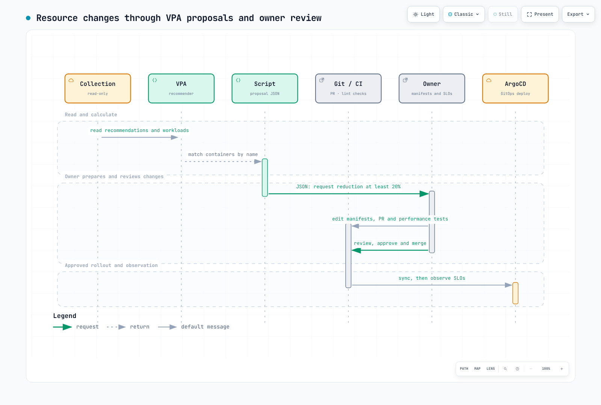

# FinOpsコスト可視化プラットフォーム

> **最終更新**: September 12, 2026。OpenCost 1.121.2 / chart 2.5.31、Kubecost 3.2.4、Kyverno 1.19.1。
> **検証**: Helmレンダリング、Kubernetesスキーマ、Terraformモックプロバイダー、ローカル費用計算、ポリシー評価。本番クラスターへのインストールや実際のAWS請求との照合を示すものではありません。

< [前: イベント容量計画](./12-event-capacity-planning.md) | [目次](./README.md) | [次: Tekton Pipelines](./14-tekton-pipelines.md) >

## 概要

FinOpsはエンジニアリング、財務、製品、事業のチームが協力し、技術支出の価値を管理する取り組みです。コスト削減だけが成功基準ではなく、サービスレベル、成長、単位当たりの採算、信頼できる帰属も重要です。

この章はKubernetes配賦モデル、AWS請求データ、チーム予算を区別し、結び付けます。デプロイ前に例のクラスター名、名前空間、バケット、IAMロールを置き換えてください。インストールコマンドは実リソースを作成します。ここで報告する検証はローカルで行いました。

## 1. FinOps運用モデル

Informはデータ収集、配賦、可視化を扱います。Optimizeは測定を改善につなげます。Operateは所有権、予算、レビューを維持します。これらの段階は繰り返されます。


[インタラクティブな図を見る](https://www.atomai.click/kubernetes-docs/archmaps/en-ops-13-finops-cost-platform-0.html)

| 役割 | 責務 |
| --- | --- |
| プラットフォーム | 信頼できる収集、費用データのアクセス制御、アップグレード |
| サービスチーム | ラベル、リソースrequests、性能テスト、変更レビュー |
| 財務 / FinOps | 請求照合、共有費用ルール、予算、予測 |
| 製品 / 事業 | 単位当たりの採算、価値、投資優先順位 |

Crawl/Walk/Runは特定分野の能力を表し、普遍的な1–3か月や6–12か月の予定ではありません。自動チャージバックや削除の前に、データ品質と所有権を確立します。

## 2. 費用データとインストール

### 2.1 測定値の区別

| 測定値 | 意味 | 制限 |
| --- | --- | --- |
| 現在の配賦レート、USD/時間 | 現在の配賦と価格モデル | 実際の月額支出ではない |
| 期間指定の配賦モデル費用 | 明示期間のKubernetesへの帰属 | 範囲、保持、モデルに依存 |
| CUR 2.0 / Cost Explorer | AWS請求ベースの費用 | 更新遅延、割引、クレジット、税、償却方法の選択 |
| 線形の月末見積もり | 現時点の費用 / 完了日数 × その月の日数 | 季節性や変化する需要はモデル化しない |

EC2のCPUとメモリは一般に別々の課金製品ではありません。OpenCostのコア/GiBあたり価格はインスタンス費用を配賦します。任意のCPU/RAM価格や二重の一律契約割引を請求として提示しないでください。同じインフラのCloud Cost合計とAllocation合計を加えると二重計上になる場合があります。

### 2.2 OpenCostのインストール

[可観測性スタック](./09-observability-stack.md)のPrometheus OperatorとServiceMonitor CRD、適切な`gp3` StorageClassを前提とします。EKSストレージはEBS CSIドライバーかAuto ModeのStorageClass設定を使う場合があります。例の`release: prometheus`は実際のPrometheus ServiceMonitorセレクターに一致する必要があります。

以前のPrometheus保持7日では1か月全体を再構成できません。月次分析には十分な保持とストレージが必要です。保持を増やしても削除済みデータは戻りません。以下のエクスポーターPVCはPrometheusストレージを代替しません。

**`opencost-values.yaml`**

```yaml
serviceAccount:
  create: true
  name: opencost
opencost:
  mcp:
    enabled: false
  exporter:
    defaultClusterId: eks-production
    resources:
      requests:
        cpu: 100m
        memory: 256Mi
      limits:
        memory: 2Gi
    persistence:
      enabled: true
      accessMode: ReadWriteOnce
      storageClass: gp3
      size: 10Gi
  prometheus:
    internal:
      enabled: true
      serviceName: prometheus-kube-prometheus-prometheus
      namespaceName: observability
      port: 9090
    external:
      enabled: false
  metrics:
    serviceMonitor:
      enabled: true
      namespace: opencost
      additionalLabels:
        release: prometheus
      honorLabels: true
  customPricing:
    enabled: false
  cloudCost:
    enabled: false
  ui:
    enabled: true
    ingress:
      enabled: false
```

```bash
helm repo add opencost https://opencost.github.io/opencost-helm-chart
helm repo update opencost
helm upgrade --install opencost opencost/opencost \
  --version 2.5.31 --namespace opencost --create-namespace \
  -f opencost-values.yaml --wait --timeout 10m
kubectl -n opencost get pods,pvc,svc,servicemonitor
kubectl -n opencost port-forward service/opencost 9090:9090 9003:9003
```

ローカルUIは`9090`、APIは`9003`を使います。`opencost.prometheus`と`opencost.cloudCost`はexporterの子ではありません。チャート2.5.31はMCPをデフォルト有効にするため、この基準設定は明示的に無効にします。MCPで費用ツールを公開するなら認証とアクセス範囲を別途設計してください。費用データMCPはドキュメント検索MCPとは別です。

### 2.3 Kubecost 3.xの選択

Kubecostは別製品・別デプロイの選択肢です。3.xはClickHouseストレージと`finops-agent`収集を使います。2.xの`kubecostModel`、Prometheus、ETL設定をそのままコピーしないでください。既存2.xには中間エージェント、再取り込み、機能制約を含む公式移行手順が必要です。

現在のチャートリポジトリは`https://kubecost.github.io/kubecost/`です。これは機能を限定したインストール基準で、Cluster Controller、Admission Controller、予測を明示的に無効にします。既存インストールやストレージのその場置換コマンドとして使わないでください。

**`kubecost-values.yaml`**

```yaml
global:
  clusterId: eks-production
  defaultStorageClass: gp3
frontend:
  enabled: true
  service:
    type: ClusterIP
localStore:
  enabled: true
  persistentVolume:
    enabled: true
    size: 32Gi
    storageClass: gp3
finopsagent:
  enabled: true
aggregator:
  enabled: true
cloudCost:
  enabled: false
networkCosts:
  enabled: false
clusterController:
  enabled: false
kubecostAdmissionController:
  enabled: false
forecasting:
  enabled: false
ingress:
  enabled: false
telemetry:
  enabled: false
```

```bash
helm repo add kubecost https://kubecost.github.io/kubecost/
helm repo update kubecost
helm template kubecost kubecost/kubecost --version 3.2.4 \
  --namespace kubecost -f kubecost-values.yaml > kubecost-rendered.yaml
# Review storage, RBAC, images and product entitlements before installation.
helm install kubecost kubecost/kubecost --version 3.2.4 \
  --namespace kubecost --create-namespace -f kubecost-values.yaml
```

SSO、細粒度RBAC、マルチクラスター機能の利用権を確認してください。SAML/OIDCのvaluesがあっても全デプロイで有効になるわけではありません。`global.acknowledged`はEnterpriseのメジャー更新確認で、一般的なライセンス承諾ではありません。内部ALBはユーザー認証をしません。

### 2.4 CUR 2.0、Athena、OpenCost Cloud Cost

以下のTerraformは**新しいCUR 2.0エクスポート、S3バケット2つ、Athenaワークグループ、OpenCost IRSAロール**を定義します。既存リソースを管理する前に所有権とインポートを確認します。組織全体の請求データには適切な管理アカウント権限が必要です。

Glueクローラーとテーブル作成は含みません。Data ExportsのAthena処理手順に従い、初回配信を待ってから、エクスポートの**データディレクトリ**でGlueテーブルとパーティションを作成・更新します。マニフェストやメタデータをデータテーブルに混ぜないでください。作成結果のDB名とテーブル名を指定します。Lake Formation保護には追加の付与が必要です。

`COST_AND_USAGE_REPORT`はData Exports SQLのソースであり、普遍的なAthena Glueテーブル名ではありません。結果スキーマを確認してください。CUR 2.0は`billing_period`パーティションを使い、旧CURの`year`/`month`構成と想定してはいけません。

Data ExportsはSSE-S3で配信します。直接KMS暗号化配信を要求する設定をコピーしないでください。KMSが必要なら、文書化された配信後暗号化処理と利用者権限を一緒に設計します。復元が必要なアーカイブストレージは、使用中データへのクエリを壊す場合があります。

**`cur.tf`**

```hcl
terraform {
  required_version = ">= 1.12.0"
  required_providers {
    aws = {
      source  = "hashicorp/aws"
      version = "= 6.64.0"
    }
  }
}

provider "aws" {
  region = var.region
}

provider "aws" {
  alias  = "billing"
  region = "us-east-1"
}

variable "region" {
  type    = string
  default = "ap-northeast-2"
}

variable "cur_bucket" {
  type = string
}

variable "results_bucket" {
  type = string
  validation {
    condition     = var.results_bucket != var.cur_bucket
    error_message = "Use separate CUR source and Athena result buckets."
  }
}

variable "oidc_provider_arn" {
  type = string
}

variable "oidc_issuer" {
  type = string
}

variable "glue_database" {
  type = string
}

variable "glue_table" {
  type = string
}

data "aws_caller_identity" "current" {}
data "aws_partition" "current" {}

locals {
  account = data.aws_caller_identity.current.account_id
  arn     = "arn:${data.aws_partition.current.partition}"
  issuer  = trimprefix(trimsuffix(var.oidc_issuer, "/"), "https://")
  buckets = { cur = var.cur_bucket, results = var.results_bucket }
}

resource "aws_s3_bucket" "cost" {
  for_each      = local.buckets
  bucket        = each.value
  force_destroy = false
}

resource "aws_s3_bucket_public_access_block" "cost" {
  for_each                = aws_s3_bucket.cost
  bucket                  = each.value.id
  block_public_acls       = true
  block_public_policy     = true
  ignore_public_acls      = true
  restrict_public_buckets = true
}

resource "aws_s3_bucket_ownership_controls" "cost" {
  for_each = aws_s3_bucket.cost
  bucket   = each.value.id
  rule {
    object_ownership = "BucketOwnerEnforced"
  }
}

resource "aws_s3_bucket_server_side_encryption_configuration" "cost" {
  for_each = aws_s3_bucket.cost
  bucket   = each.value.id
  rule {
    apply_server_side_encryption_by_default {
      sse_algorithm = "AES256"
    }
  }
}

resource "aws_s3_bucket_policy" "delivery" {
  bucket = aws_s3_bucket.cost["cur"].id
  policy = jsonencode({
    Version = "2012-10-17"
    Statement = [{
      Sid       = "AllowDataExports"
      Effect    = "Allow"
      Principal = { Service = "bcm-data-exports.amazonaws.com" }
      Action    = "s3:PutObject"
      Resource  = "${aws_s3_bucket.cost["cur"].arn}/cur/*"
      Condition = {
        StringEquals = { "aws:SourceAccount" = local.account }
        ArnLike = {
          "aws:SourceArn" = "${local.arn}:bcm-data-exports:us-east-1:${local.account}:export/*"
        }
      }
    }]
  })
}

resource "aws_bcmdataexports_export" "cur" {
  provider = aws.billing
  depends_on = [
    aws_s3_bucket_policy.delivery,
    aws_s3_bucket_public_access_block.cost,
    aws_s3_bucket_server_side_encryption_configuration.cost
  ]
  export {
    name = "opencost-cur"
    data_query {
      query_statement = "SELECT * FROM COST_AND_USAGE_REPORT"
      table_configurations = {
        COST_AND_USAGE_REPORT = {
          BILLING_VIEW_ARN                      = "${local.arn}:billing::${local.account}:billingview/primary"
          TIME_GRANULARITY                      = "HOURLY"
          INCLUDE_RESOURCES                     = "TRUE"
          INCLUDE_MANUAL_DISCOUNT_COMPATIBILITY = "FALSE"
          INCLUDE_SPLIT_COST_ALLOCATION_DATA    = "FALSE"
        }
      }
    }
    destination_configurations {
      s3_destination {
        s3_bucket = aws_s3_bucket.cost["cur"].bucket
        s3_prefix = "cur"
        s3_region = var.region
        s3_output_configurations {
          overwrite   = "OVERWRITE_REPORT"
          format      = "PARQUET"
          compression = "PARQUET"
          output_type = "CUSTOM"
        }
      }
    }
    refresh_cadence {
      frequency = "SYNCHRONOUS"
    }
  }
}

resource "aws_athena_workgroup" "opencost" {
  name          = "opencost-cur"
  force_destroy = false
  configuration {
    enforce_workgroup_configuration    = true
    publish_cloudwatch_metrics_enabled = true
    bytes_scanned_cutoff_per_query     = 10737418240
    result_configuration {
      output_location       = "s3://${aws_s3_bucket.cost["results"].bucket}/opencost/"
      expected_bucket_owner = local.account
      encryption_configuration {
        encryption_option = "SSE_S3"
      }
    }
  }
}

resource "aws_iam_role" "opencost" {
  name = "opencost-cur-reader"
  assume_role_policy = jsonencode({
    Version = "2012-10-17"
    Statement = [{
      Effect    = "Allow"
      Principal = { Federated = var.oidc_provider_arn }
      Action    = "sts:AssumeRoleWithWebIdentity"
      Condition = {
        StringEquals = {
          "${local.issuer}:aud" = "sts.amazonaws.com"
          "${local.issuer}:sub" = "system:serviceaccount:opencost:opencost"
        }
      }
    }]
  })
}

resource "aws_iam_role_policy" "opencost" {
  role = aws_iam_role.opencost.id
  policy = jsonencode({
    Version = "2012-10-17"
    Statement = [
      {
        Effect = "Allow"
        Action = ["athena:StartQueryExecution", "athena:StopQueryExecution",
        "athena:GetQueryExecution", "athena:GetQueryResults", "athena:GetWorkGroup"]
        Resource = aws_athena_workgroup.opencost.arn
      },
      {
        Effect = "Allow"
        Action = ["glue:GetDatabase", "glue:GetDatabases", "glue:GetTable",
        "glue:GetTables", "glue:GetPartitions"]
        Resource = [
          "${local.arn}:glue:${var.region}:${local.account}:catalog",
          "${local.arn}:glue:${var.region}:${local.account}:database/${var.glue_database}",
          "${local.arn}:glue:${var.region}:${local.account}:table/${var.glue_database}/${var.glue_table}"
        ]
      },
      {
        Effect   = "Allow"
        Action   = "s3:GetBucketLocation"
        Resource = [for b in aws_s3_bucket.cost : b.arn]
      },
      {
        Effect    = "Allow"
        Action    = "s3:ListBucket"
        Resource  = aws_s3_bucket.cost["cur"].arn
        Condition = { StringLike = { "s3:prefix" = ["cur", "cur/*"] } }
      },
      {
        Effect    = "Allow"
        Action    = "s3:ListBucket"
        Resource  = aws_s3_bucket.cost["results"].arn
        Condition = { StringLike = { "s3:prefix" = ["opencost", "opencost/*"] } }
      },
      {
        Effect   = "Allow"
        Action   = "s3:GetObject"
        Resource = "${aws_s3_bucket.cost["cur"].arn}/cur/*"
      },
      {
        Effect   = "Allow"
        Action   = ["s3:GetObject", "s3:PutObject", "s3:AbortMultipartUpload"]
        Resource = "${aws_s3_bucket.cost["results"].arn}/opencost/*"
      }
    ]
  })
}

output "opencost_role_arn" {
  value = aws_iam_role.opencost.arn
}

output "cur_export_arn" {
  value = aws_bcmdataexports_export.cur.arn
}

output "athena_results" {
  value = "s3://${aws_s3_bucket.cost["results"].bucket}/opencost/"
}
```

`glue_database`と`glue_table`はクエリ対象を識別し、作成しません。Athenaスキャン上限の例はクエリあたり10 GiBです。失敗を調べ、データセットに合わせて設定します。時間単位のレコードは毎時間のレポート配信を意味しません。

例は**IRSA**を使います。既存OIDCプロバイダーARNとissuerを指定し、信頼ポリシー`sub`を実際の`opencost/opencost` ServiceAccountに合わせます。EKS Pod IdentityはIRSAアノテーションでなく、別の信頼ポリシーと関連付けを使います。

**`cloud-integration.json`**

```json
{
  "aws": {
    "athena": [
      {
        "bucket": "s3://REPLACE_QUERY_RESULTS_BUCKET/opencost/",
        "region": "ap-northeast-2",
        "database": "REPLACE_GLUE_DATABASE",
        "catalog": "AwsDataCatalog",
        "table": "REPLACE_GLUE_TABLE",
        "workgroup": "opencost-cur",
        "account": "123456789012",
        "authorizer": {
          "authorizerType": "AWSServiceAccount"
        }
      }
    ]
  }
}
```

**`opencost-cloud-values.yaml`**

```yaml
serviceAccount:
  create: true
  name: opencost
  annotations:
    eks.amazonaws.com/role-arn: arn:aws:iam::123456789012:role/opencost-cur-reader
opencost:
  cloudIntegrationSecret: opencost-cloud-integrations
  cloudCost:
    enabled: true
```

```bash
# Replace all placeholders and account IDs in the files first.
kubectl -n opencost create secret generic opencost-cloud-integrations \
  --from-file=cloud-integration.json=cloud-integration.json \
  --dry-run=client -o yaml | kubectl apply -f -
helm upgrade opencost opencost/opencost --version 2.5.31 \
  --namespace opencost -f opencost-values.yaml -f opencost-cloud-values.yaml
```

JSONの`bucket`は**Athenaクエリ結果バケット**で、CURソースバケットではありません。`AWSServiceAccount`は静的アクセスキーでなくAWS SDKデフォルト認証情報チェーンを使います。請求統合が動作すると主張する前に、ソース読み取り、結果書き込み、Secretマウント、インポーターの鮮度を検証します。

有効化前はコスト配分タグキーがない場合があります。AWSは現在、管理アカウントで最大12か月のバックフィルをサポートしますが、その期間に実際にリソースにタグが存在していたことと処理遅延に依存します。今タグを付けても過去のタグ付けは作り出せません。

## 3. ショーバックとチャージバック

ショーバックは利用チームに支出を可視化し、チャージバックは合意した会計ルールで配賦・請求します。モデル値が自動的に社内請求になるわけではありません。先に期間、通貨、直接/共有/アイドル/未配賦区分、税、クレジット、返金、丸めを定義します。

### 3.1 ラベルとポリシー

チーム集計には名前空間の`team`、細かい帰属にはPodテンプレートの`team` / `cost-center`ラベルを使います。KubernetesラベルとAWSコスト配分タグは別データです。teamラベルなしでも名前空間配賦は動作し得ますが、チーム対応は保証されません。

Kyverno 1.19.1はClusterPolicyが非推奨と警告します。新例は`policies.kyverno.io/v1`のCEL `ValidatingPolicy`を使い、対応CRDとコントローラー版が必要です。`finops.example.com/enabled=true`の名前空間を対象に、Podコントローラーテンプレートのチェックを生成します。

**`cost-labels.yaml`**

```yaml
apiVersion: policies.kyverno.io/v1
kind: ValidatingPolicy
metadata:
  name: finops-pod-labels
spec:
  validationActions: [Audit]
  evaluation:
    admission:
      enabled: true
    background:
      enabled: true
  autogen:
    podControllers:
      controllers: [deployments, statefulsets, daemonsets, jobs, cronjobs]
  matchConstraints:
    namespaceSelector:
      matchLabels:
        finops.example.com/enabled: "true"
    resourceRules:
      - apiGroups: [""]
        apiVersions: [v1]
        operations: [CREATE, UPDATE]
        resources: [pods]
  validations:
    - expression: >-
        ['team', 'cost-center'].all(label,
          object.metadata.?labels[label].orValue('') != '')
      message: "Add team and cost-center labels to the Pod template."
```

**`resource-requests.yaml`**

```yaml
apiVersion: policies.kyverno.io/v1
kind: ValidatingPolicy
metadata:
  name: finops-container-requests
spec:
  validationActions: [Audit]
  evaluation:
    admission:
      enabled: true
    background:
      enabled: true
  autogen:
    podControllers:
      controllers: [deployments, statefulsets, daemonsets, jobs, cronjobs]
  matchConstraints:
    namespaceSelector:
      matchLabels:
        finops.example.com/enabled: "true"
    resourceRules:
      - apiGroups: [""]
        apiVersions: [v1]
        operations: [CREATE, UPDATE]
        resources: [pods]
  validations:
    - expression: >-
        object.spec.containers.all(c,
          has(c.resources) && has(c.resources.requests) &&
          ['cpu', 'memory'].all(r,
            r in c.resources.requests &&
            quantity(c.resources.requests[r]).isGreaterThan(quantity('0'))))
      message: "Set positive CPU and memory requests for each regular container."
```

`Audit`は違反をブロックしません。背景レポートと範囲を確認し、所有者と問題を解決してから選択ポリシーを`Deny`へ切り替えます。利用者向け警告が必要なら`Warn`を別途選びます。ローカルCLIはAuditポリシーでテスト失敗を返す場合がありますが、アドミッションが拒否される証明ではありません。

requestポリシーは**すべての通常コンテナの正のCPU/メモリrequests**を確認します。initコンテナ、Podレベル予算、limit戦略には別ポリシーが必要です。一律4コア / 8 GiBのlimitsでは、アプリの適正サイズは示されません。

```yaml
apiVersion: v1
kind: Namespace
metadata:
  name: team-backend
  labels:
    team: backend
    finops.example.com/enabled: "true"
---
apiVersion: v1
kind: ResourceQuota
metadata:
  name: team-capacity
  namespace: team-backend
spec:
  hard:
    requests.cpu: "20"
    requests.memory: 40Gi
    requests.storage: 200Gi
    persistentvolumeclaims: "20"
    pods: "100"
```

このクォータはリソース上限の例で、金額予算や全クラウド支出上限ではありません。現使用量と自動スケーリング最大値に合わせ、作成リクエストの拒否も計画します。

### 3.2 期間指定の配賦API

OpenCost 1.121.2の`/allocation/compute`を使います。製品と版に対応する期間、集約、応答構造を確認します。`includeIdle`と`shareIdle`はブール値で、`shareIdle=weighted`は文書化されたブール形式ではありません。

```bash
curl --fail --silent --show-error --get \
  'http://127.0.0.1:9003/allocation/compute' \
  --data-urlencode 'window=2026-09-01T00:00:00Z,2026-09-12T00:00:00Z' \
  --data-urlencode 'aggregate=namespace' \
  --data-urlencode 'includeIdle=true' \
  --data-urlencode 'shareIdle=false'
```

### 3.3 共有費用の配賦と総額維持

これは**計算検証用の合成USD入力で、実請求ではありません**。重複しない区分は直接6,500、共有2,500、アイドル1,000です。共有費用は直接費用で重み付けし、アイドルは均等配分します。1セント未満の端数は最大剰余法を使い、同順位はチーム名の辞書順で決めます。


[インタラクティブな図を見る](https://www.atomai.click/kubernetes-docs/archmaps/en-ops-13-finops-cost-platform-1.html)

```text
Team     Direct    Shared     Idle      Total
A        3000.00   1153.85    333.34     4487.19
B        2000.00    769.23    333.33     3102.56
C        1500.00    576.92    333.33     2410.25
Total    6500.00   2500.00   1000.00    10000.00
```

**`allocation-example.json`**

```json
{
  "description": "Synthetic reconciled expense pool, not an actual account bill.",
  "currency": "USD",
  "direct": {
    "team-a": "3000.00",
    "team-b": "2000.00",
    "team-c": "1500.00"
  },
  "shared": "2500.00",
  "idle": "1000.00",
  "unallocated": "0.00"
}
```

**`allocate_costs.py`**

```python
"""Allocate one reconciled USD expense pool using explicit, conserved cent amounts."""
import argparse
import json
from decimal import Decimal
from fractions import Fraction


def cents(value):
    if isinstance(value, bool):
        raise ValueError("Money cannot be boolean")
    value=Decimal(str(value))
    if not value.is_finite() or value < 0:
        raise ValueError("Use finite nonnegative expense amounts; handle refunds explicitly")
    scaled=value*100
    if scaled != scaled.to_integral_value():
        raise ValueError("Settle source amounts to cents under an approved rounding policy first")
    return int(scaled)


def money(value):
    return f"{Decimal(value)/100:.2f}"


def distribute(total, weights):
    if not weights:
        raise ValueError("At least one allocation target is required")
    rational={}
    for name, weight in weights.items():
        value=Decimal(str(weight))
        if not value.is_finite() or value < 0:
            raise ValueError("Weights must be finite and nonnegative")
        rational[name]=Fraction(value)
    denominator=sum(rational.values(),Fraction(0))
    if denominator==0:
        if total:
            raise ValueError("A positive pool cannot be allocated with zero total weight")
        return {name:0 for name in weights}
    exact={name:Fraction(total)*weight/denominator for name,weight in rational.items()}
    result={name:value.numerator//value.denominator for name,value in exact.items()}
    remainder=total-sum(result.values())
    # Largest remainder; ties resolved by stable target name.
    order=sorted(exact,key=lambda name:(-(exact[name]-result[name]),name))
    for name in order[:remainder]:
        result[name]+=1
    assert sum(result.values())==total
    return result


def allocate(config):
    if config.get("currency")!="USD":
        raise ValueError("This example accepts a single USD ledger; do not mix currencies")
    direct={name:cents(value) for name,value in config["direct"].items()}
    if not direct:
        raise ValueError("No teams supplied")
    shared=cents(config["shared"])
    idle=cents(config["idle"])
    unallocated=cents(config.get("unallocated","0"))
    shared_alloc=distribute(shared,direct)
    idle_alloc=distribute(idle,{name:1 for name in direct})
    teams={name:{"direct":money(value),"shared":money(shared_alloc[name]),"idle":money(idle_alloc[name]),
                 "total":money(value+shared_alloc[name]+idle_alloc[name])} for name,value in sorted(direct.items())}
    source_total=sum(direct.values())+shared+idle+unallocated
    allocated_total=sum(cents(value["total"]) for value in teams.values())+unallocated
    assert source_total==allocated_total
    return {"currency":"USD","policy":"Shared weighted by direct cost; idle split equally; unallocated retained",
            "rounding":"Exact cents; largest remainder with lexical tie-break",
            "teams":teams,"unallocated":money(unallocated),"source_total":money(source_total),
            "allocated_total":money(allocated_total),
            "limits":["Use one reconciled pool; do not add overlapping Allocation and Cloud Cost totals.",
                      "This policy is an example, not an inherently fair or mandatory chargeback rule.",
                      "Refunds, credits, taxes and currency conversion require explicit separate policies."]}


if __name__=="__main__":
    parser=argparse.ArgumentParser()
    parser.add_argument("input")
    args=parser.parse_args()
    try:
        with open(args.input,encoding="utf-8") as stream:
            result=allocate(json.load(stream))
    except (ValueError,KeyError,ArithmeticError) as error:
        parser.error(str(error))
    print(json.dumps(result,ensure_ascii=False,indent=2))
```

```bash
python3 allocate_costs.py allocation-example.json
```

帰属しない金額は`unallocated`として保持します。この計算ツールは負の費用や返金を自動再配分しません。実会計にはクレジット、返金、為替換算の別ルールが必要です。例の方針が本質的に全組織で最も公平なわけではありません。

### 3.4 PrometheusとGrafana

ルールは**1クラスターのPrometheus**を前提とします。中央Prometheus/Thanosクエリは、全集約と結合で実クラスター識別子を保持する必要があります。ノード名だけで複数クラスターを結合すると費用が混ざり得ます。

`node_cpu_hourly_cost`はコアあたり、`node_ram_hourly_cost`はGiBあたり毎時です。配賦メトリクスを掛け、`max`で重複スクレイプを除きます。`kubecost_container_cpu_cost`などのメトリクスを作り出さないでください。ラベル結合前に、このkube-state-metrics設定を既存可観測性チャートvaluesにマージします。

```yaml
kube-state-metrics:
  metricLabelsAllowlist:
    - namespaces=[team]
```

**`cost-rules.yaml`**

```yaml
groups:
  - name: finops-current-rates
    rules:
      - record: finops:node_cpu_hourly_cost
        expr: max by (node) (node_cpu_hourly_cost)
      - record: finops:node_ram_hourly_cost
        expr: max by (node) (node_ram_hourly_cost)
      - record: finops:namespace_cpu_cost_per_hour
        expr: |
          sum by (namespace) (
            max by (namespace, pod, container, node) (container_cpu_allocation{container!=""})
            * on (node) group_left finops:node_cpu_hourly_cost
          )
      - record: finops:namespace_ram_cost_per_hour
        expr: |
          sum by (namespace) (
            max by (namespace, pod, container, node) (container_memory_allocation_bytes{container!=""}) / 1073741824
            * on (node) group_left finops:node_ram_hourly_cost
          )
      - record: finops:namespace_compute_cost_per_hour
        expr: finops:namespace_cpu_cost_per_hour + finops:namespace_ram_cost_per_hour
      - record: finops:team_compute_cost_per_hour
        expr: |
          sum by (label_team) (
            finops:namespace_compute_cost_per_hour
            * on (namespace) group_left (label_team)
              max by (namespace, label_team) (kube_namespace_labels{label_team!=""})
          )
      - alert: OpenCostMetricsUnavailable
        expr: absent(node_cpu_hourly_cost)
        for: 15m
        labels:
          severity: warning
        annotations:
          summary: "OpenCost CPU pricing metrics are absent"
      - alert: KubernetesComputeRateAboveReviewThreshold
        expr: sum(finops:namespace_compute_cost_per_hour) > 20
        for: 30m
        labels:
          severity: warning
        annotations:
          summary: "Allocated compute model exceeds the example USD 20/hour threshold"
```

ファイルはPrometheusルールファイル形式です。Operatorでは`PrometheusRule.spec`下に置き、メタデータラベルを実ルールセレクターに合わせます。30分間USD 20/時間はモデルデータのレビューしきい値例です。`for`は条件の持続を要求し、誤検知をなくすものではありません。

Grafanaパネルでは`finops:namespace_compute_cost_per_hour`と`finops:team_compute_cost_per_hour`を**USD/時間**と表示できます。配賦CPU/RAMレートであり、全ストレージ、ネットワーク、コントロールプレーン、アイドル費用を含む請求ではありません。`* 730`パネルは固定730時間見積もりと明示します。価格欠損は0費用でなく欠損データとして表示します。

teamラベルなしの名前空間はチーム集約から消える場合があります。名前空間全体とチームの合計を比較します。ダッシュボード変数やフォルダーはデータソース認可を適用しません。チーム分離にはサーバー側データソース権限や別テナントを使い、他チームへのクエリが拒否されるかテストします。

## 4. 請求に基づく異常検出

`DIMENSIONAL` / `SERVICE`のCost Anomaly DetectionモニターはAWSサービス支出を対象にします。「EKS」と名付けてもEKSに限定されません。タグ、リンクアカウント、Cost Categoriesを使うCUSTOMモニターでは対応範囲とデータの有無を確認します。適切なら既存モニターARNを再利用します。

この任意設定は前のTerraformファイルと併置します。`DAILY` EMAIL要約と`IMMEDIATE` SNS通知を区別します。SNS配信も請求更新と異常検出に従い、即時の支出停止ではありません。トピックには別途承認した購読者が必要です。例はSlack購読を作成しません。

**`anomaly.tf`**

```hcl
# Optional: supply an existing monitor ARN to avoid duplicating a SERVICE monitor.
variable "cost_monitor_arn" {
  type = string
}

variable "notification_email" {
  type = string
}

resource "aws_ce_anomaly_subscription" "daily" {
  provider         = aws.billing
  name             = "daily-cost-anomalies"
  frequency        = "DAILY"
  monitor_arn_list = [var.cost_monitor_arn]
  threshold_expression {
    dimension {
      key           = "ANOMALY_TOTAL_IMPACT_ABSOLUTE"
      match_options = ["GREATER_THAN_OR_EQUAL"]
      values        = ["100"]
    }
  }
  subscriber {
    type    = "EMAIL"
    address = var.notification_email
  }
}

resource "aws_sns_topic" "anomalies" {
  provider = aws.billing
  name     = "cost-anomalies"
}

resource "aws_sns_topic_policy" "anomalies" {
  provider = aws.billing
  arn      = aws_sns_topic.anomalies.arn
  policy = jsonencode({
    Version = "2012-10-17"
    Statement = [{
      Effect    = "Allow"
      Principal = { Service = "costalerts.amazonaws.com" }
      Action    = "sns:Publish"
      Resource  = aws_sns_topic.anomalies.arn
      Condition = {
        StringEquals = { "aws:SourceAccount" = local.account }
        ArnLike = {
          "aws:SourceArn" = "${local.arn}:ce::${local.account}:anomalysubscription/*"
        }
      }
    }]
  })
}

resource "aws_ce_anomaly_subscription" "immediate" {
  provider         = aws.billing
  depends_on       = [aws_sns_topic_policy.anomalies]
  name             = "immediate-cost-anomalies"
  frequency        = "IMMEDIATE"
  monitor_arn_list = [var.cost_monitor_arn]
  threshold_expression {
    dimension {
      key           = "ANOMALY_TOTAL_IMPACT_ABSOLUTE"
      match_options = ["GREATER_THAN_OR_EQUAL"]
      values        = ["100"]
    }
  }
  subscriber {
    type    = "SNS"
    address = aws_sns_topic.anomalies.arn
  }
}
```

リソースと購読の作成には実際の費用と通知の影響があります。KMS暗号化SNSでは`costalerts.amazonaws.com`に必要なキー権限も設定し、SourceAccount/SourceArnを制限します。例のUSD 100しきい値を組織に合わせます。

AWS Budgets ActionsはIAM/SCP操作に加え、対応EC2/RDS操作も実行できます。更新遅延と操作範囲は残り、全支出を即停止する固定上限ではありません。

## 5. チーム予算と定期レポート

### 5.1 明示的な数値予算

`label_replace`は名前空間アノテーション文字列を数値時系列に変換しません。例はJSONから明示的USD予算を解析します。予算欠損は`null`比率となり、0、負数、不正数値の予算は拒否します。

**`budgets.json`**

```json
{
  "currency": "USD",
  "namespaces": {
    "backend-production": "3000.00",
    "frontend-production": "2000.00"
  }
}
```

### 5.2 月次モデルレポートと任意のSlack配信

スクリプトはPython 3.12標準ライブラリのみを使います。完了したUTC日付をクエリし、`--as-of`は**含まない終了日**です。月初日は前の完了月を報告します。空データや複数タイムステップは誤ったUSD 0にならず失敗します。完全な過去範囲は証明できないため、API警告とインポーター鮮度を確認します。

デフォルトはJSONファイル作成だけでSlackに送りません。配信には`--send`と`--webhook-file`の両方が必要です。別チャネルには別のincoming webhookが必要で、ペイロードの`channel`上書きは使いません。

**`report_costs.py`**

```python
"""Read-only OpenCost monthly model-cost report and optional reviewed Slack delivery."""
import argparse
import calendar
import json
from datetime import date, datetime, timedelta, timezone
from decimal import Decimal, ROUND_HALF_UP
from pathlib import Path
from urllib.parse import urlencode, urlsplit
from urllib.request import Request, build_opener, HTTPRedirectHandler


class NoRedirect(HTTPRedirectHandler):
    def redirect_request(self, req, fp, code, msg, headers, newurl):
        return None


def decimal_value(value, name, positive=False):
    if value is None or isinstance(value, bool):
        raise ValueError(f"{name}: missing/invalid number")
    amount=Decimal(str(value))
    if not amount.is_finite() or (positive and amount <= 0):
        raise ValueError(f"{name}: invalid finite range")
    return amount


def usd(value):
    return format(value.quantize(Decimal("0.01"),rounding=ROUND_HALF_UP),"f")


def month_window(as_of):
    end=date.fromisoformat(as_of)
    month_reference=end if end.day>1 else end-timedelta(days=1)
    start=month_reference.replace(day=1)
    completed=(end-start).days
    return start,end,completed,calendar.monthrange(start.year,start.month)[1]


def summarize(payload, budgets, as_of):
    start,end,days,month_days=month_window(as_of)
    if not isinstance(payload,dict) or not isinstance(budgets,dict) or not isinstance(budgets.get("namespaces",{}),dict):
        raise ValueError("Expected API and budget JSON objects")
    if budgets.get("currency")!="USD":
        raise ValueError("This report requires an explicitly configured USD cost source and budgets")
    if payload.get("code",200)!=200 or payload.get("status","success")!="success" or payload.get("errors"):
        raise ValueError("Cost API reported an error")
    sets=payload.get("data")
    if not isinstance(sets,list) or len(sets)!=1 or not isinstance(sets[0],dict) or not sets[0]:
        raise ValueError("Expected one nonempty whole-window allocation set; missing data is not zero cost")
    namespace_costs={}
    for namespace,allocation in sets[0].items():
        if not isinstance(allocation,dict) or "totalCost" not in allocation:
            raise ValueError(f"{namespace}: missing allocation cost")
        namespace_costs[namespace]=decimal_value(allocation["totalCost"],namespace)
    total=sum(namespace_costs.values(),Decimal(0))
    rows=[]
    for namespace,cost in sorted(namespace_costs.items(),key=lambda row:(-row[1],row[0])):
        budget=budgets.get("namespaces",{}).get(namespace)
        budget_value=None if budget is None else decimal_value(budget,"budget",positive=True)
        projected=cost*Decimal(month_days)/Decimal(days)
        rows.append({
            "namespace":namespace,
            "model_cost_to_date_usd":usd(cost),
            "linear_month_estimate_usd":usd(projected),
            "budget_usd":None if budget_value is None else usd(budget_value),
            "model_budget_ratio":None if budget_value is None else str(cost/budget_value),
            "linear_estimate_budget_ratio":None if budget_value is None else str(projected/budget_value),
        })
    return {
        "source":"OpenCost allocation model, not an AWS invoice",
        "currency":"USD","window_start":start.isoformat()+"T00:00:00Z",
        "window_end_exclusive":end.isoformat()+"T00:00:00Z",
        "completed_calendar_days":days,"days_in_month":month_days,
        "total_model_cost_to_date_usd":usd(total),
        "total_linear_month_estimate_usd":usd(total*Decimal(month_days)/Decimal(days)),
        "namespaces":rows,"api_warnings":payload.get("warnings",[]),
        "limits":[
            "Linear estimates assume complete coverage and stable daily cost; inspect retention, gaps and importer freshness.",
            "Idle and unallocated buckets are retained; this is not automatic chargeback.",
            "Calendar-to-date model cost, a linear estimate and actual billed cost are different quantities.",
            "Do not add overlapping cloud-billing and Kubernetes-allocation totals."
        ]
    }


def get_allocation(base_url, as_of):
    start,end,_,_=month_window(as_of)
    parsed=urlsplit(base_url)
    if parsed.scheme not in ("http","https") or not parsed.netloc or parsed.username or parsed.query or parsed.fragment:
        raise ValueError("Use an HTTP(S) API base URL without credentials, query or fragment")
    query=urlencode({
        "window":start.isoformat()+"T00:00:00Z,"+end.isoformat()+"T00:00:00Z",
        "aggregate":"namespace","includeIdle":"true","shareIdle":"false","resolution":"1m"
    })
    request=Request(base_url.rstrip("/")+"/allocation/compute?"+query,
                    headers={"Accept":"application/json"},method="GET")
    with build_opener(NoRedirect).open(request,timeout=30) as response:
        if response.status != 200:
            raise ValueError(f"Cost API status {response.status}")
        body=response.read(10*1024*1024+1)
    if len(body)>10*1024*1024:
        raise ValueError("Cost API response exceeded the configured limit")
    return json.loads(body,parse_float=Decimal)


def slack_payload(report):
    # Dynamic names stay in plain_text blocks to avoid markup/mention interpretation.
    header=f"Calendar-month Kubernetes model costs — {report['window_end_exclusive'][:10]}"
    blocks=[{"type":"header","text":{"type":"plain_text","text":header}},
            {"type":"section","text":{"type":"plain_text","text":
                f"UTC window: {report['window_start']} to {report['window_end_exclusive']} (exclusive)\n"
                f"Model cost: USD {report['total_model_cost_to_date_usd']}\n"
                f"Linear estimate: USD {report['total_linear_month_estimate_usd']}\n"
                "This is an allocation estimate, not an AWS invoice."}}]
    for row in report["namespaces"][:10]:
        text=f"{row['namespace']}: USD {row['model_cost_to_date_usd']}"
        blocks.append({"type":"section","text":{"type":"plain_text","text":text[:2900]}})
    omitted=max(0,len(report["namespaces"])-10)
    if omitted:
        blocks.append({"type":"section","text":{"type":"plain_text","text":
            f"{omitted} additional buckets are included in the total. See the full JSON report."}})
    return {"blocks":blocks}


def send_slack(payload, webhook_file):
    url=Path(webhook_file).read_text().strip()
    parsed=urlsplit(url)
    if parsed.scheme!="https" or parsed.hostname not in ("hooks.slack.com","hooks.slack-gov.com"):
        raise ValueError("Use a trusted HTTPS Slack incoming-webhook URL file")
    body=json.dumps(payload,ensure_ascii=False).encode()
    request=Request(url,data=body,headers={"Content-Type":"application/json"},method="POST")
    with build_opener(NoRedirect).open(request,timeout=15) as response:
        result=response.read(1024).decode().strip()
        if response.status!=200 or result!="ok":
            raise ValueError("Slack did not acknowledge the message")


def main():
    parser=argparse.ArgumentParser()
    source=parser.add_mutually_exclusive_group(required=True)
    source.add_argument("--input")
    source.add_argument("--api-url")
    parser.add_argument("--budgets",required=True)
    parser.add_argument("--as-of",default=datetime.now(timezone.utc).date().isoformat(),
                        help="Exclusive UTC reporting end date")
    parser.add_argument("--report",default="cost-report.json")
    parser.add_argument("--slack-payload",default="slack-payload.json")
    parser.add_argument("--print-report",action="store_true",
                        help="Write model-cost JSON to stdout for controlled log collection")
    parser.add_argument("--send",action="store_true")
    parser.add_argument("--webhook-file")
    args=parser.parse_args()
    try:
        if args.send and not args.webhook_file:
            raise ValueError("--send requires --webhook-file")
        payload=(json.loads(Path(args.input).read_text(),parse_float=Decimal) if args.input
                 else get_allocation(args.api_url,args.as_of))
        budgets=json.loads(Path(args.budgets).read_text(),parse_float=Decimal)
        report=summarize(payload,budgets,args.as_of)
        slack=slack_payload(report)
        Path(args.report).write_text(json.dumps(report,ensure_ascii=False,indent=2)+"\n")
        Path(args.slack_payload).write_text(json.dumps(slack,ensure_ascii=False,indent=2)+"\n")
        if args.print_report:
            print(json.dumps(report,ensure_ascii=False))
        if args.send:
            send_slack(slack,args.webhook_file)
        print(f"Report written: {args.report}; Slack delivery: {'requested' if args.send else 'disabled'}")
    except (ValueError,KeyError,ArithmeticError,OSError) as error:
        parser.exit(1,f"Cost report failed: {error}\n")


if __name__=="__main__":
    main()
```

```bash
python3 report_costs.py \
  --api-url http://127.0.0.1:9003 \
  --budgets budgets.json --as-of 2026-09-12 \
  --report cost-report.json --slack-payload slack-payload.json
```

合成データで総モデル費用**USD 1,610.10**、線形月末見積もり**USD 4,391.18**を検証しました。読者のアカウント費用ではありません。固定730時間予測でなく、30日ある9月の完了11日を使います。

### 5.3 CronJobとして実行

スクリプトと予算をConfigMapに保存します。このCronJobは毎日**09:00 Asia/Seoul**に動作し、標準出力へレポートを表示し、Slack送信はしません。報告境界はUTCのままです。ログに内部費用情報が含まれるため、アクセスと保持を設定します。`emptyDir`の出力ファイルはPod削除で消えます。

```bash
kubectl -n opencost create configmap finops-report-code \
  --from-file=report_costs.py --from-file=budgets.json \
  --dry-run=client -o yaml | kubectl apply -f -
```

**`reporter-cronjob.yaml`**

```yaml
apiVersion: batch/v1
kind: CronJob
metadata:
  name: finops-report
  namespace: opencost
spec:
  schedule: "0 9 * * *"
  timeZone: Asia/Seoul
  concurrencyPolicy: Forbid
  startingDeadlineSeconds: 1800
  successfulJobsHistoryLimit: 2
  failedJobsHistoryLimit: 2
  jobTemplate:
    spec:
      backoffLimit: 0
      activeDeadlineSeconds: 180
      template:
        spec:
          automountServiceAccountToken: false
          restartPolicy: Never
          securityContext:
            runAsNonRoot: true
            runAsUser: 10001
            runAsGroup: 10001
            fsGroup: 10001
            seccompProfile:
              type: RuntimeDefault
          containers:
            - name: report
              image: python:3.12.13-slim
              command: [python, /app/report_costs.py]
              args:
                - --print-report
                - --api-url
                - http://opencost.opencost.svc.cluster.local:9003
                - --budgets
                - /app/budgets.json
                - --report
                - /output/cost-report.json
                - --slack-payload
                - /output/slack-payload.json
              resources:
                requests:
                  cpu: 50m
                  memory: 64Mi
                limits:
                  memory: 256Mi
              securityContext:
                readOnlyRootFilesystem: true
                allowPrivilegeEscalation: false
                capabilities:
                  drop: [ALL]
              volumeMounts:
                - name: app
                  mountPath: /app
                  readOnly: true
                - name: output
                  mountPath: /output
          volumes:
            - name: app
              configMap:
                name: finops-report-code
            - name: output
              emptyDir: {}
```

デプロイ前にイメージダイジェストとプラットフォーム対応を確認し、ダイジェストを固定します。Python版と標準ライブラリコードはローカルテスト済みですが、コンテナイメージ取得やクラスターCronJob実行は行っていません。

運用Slack配信を有効にするにはwebhookをSecretファイルでマウントし、`--send --webhook-file /secrets/webhook`を追加します。文書、Git、ログに入れないでください。`concurrencyPolicy: Forbid`と`backoffLimit: 0`は重複リスクを減らしますが、exactly-once配信を提供しません。確認応答喪失後の再試行は重複を生む場合があり、配信台帳や重複排除が必要か判断します。

## 6. リソースの適正化

### 6.1 VPA推奨の収集

VPA recommenderとCRDがインストール済みという前提です。`Off`で観測し、同じワークロードを複数VPAで対象にしないでください。Goldilocks管理なら手動例で重複させません。`target`はrequestの推奨値で、`upperBound`は必須コンテナlimitではありません。

**`vpa.yaml`**

```yaml
apiVersion: autoscaling.k8s.io/v1
kind: VerticalPodAutoscaler
metadata:
  name: backend-api
  namespace: team-backend
spec:
  targetRef:
    apiVersion: apps/v1
    kind: Deployment
    name: backend-api
  updatePolicy:
    updateMode: "Off"
  resourcePolicy:
    containerPolicies:
      - containerName: "*"
        controlledResources: [cpu, memory]
        controlledValues: RequestsOnly
```

Goldilocksは名前空間ごとに有効化する任意のVPA推奨ダッシュボードです。インストール前に現チャート依存関係、コントローラー権限、ダッシュボードアクセスを確認し、recommenderを重複追加しないでください。`goldilocks.fairwinds.com/enabled=true`ラベル自体は節約や変更承認になりません。

### 6.2 変更提案の生成

このスクリプトは**クラスターを変更せず、PRも作成しません**。`kubectl` JSONスナップショットを読み、Deployment/StatefulSetコンテナを名前で対応付け、最低20%のrequest削減を提案します。例でquantityパーサーをテストした`kubernetes==36.0.3`が必要です。

推奨が十分な通信、ピーク、復旧シナリオをカバーするか、CPU request変更がHPA使用率計算に影響するかを確認します。initコンテナとPodレベルリソースは別レビュー事項です。重複VPA、不明コンテナ、欠けたrequestsは推測しません。

```bash
python3 -m venv .venv
.venv/bin/python -m pip install 'kubernetes==36.0.3'
kubectl --context YOUR_CONTEXT get deployments,statefulsets -A -o json > workloads.json
kubectl --context YOUR_CONTEXT get vpa -A -o json > vpas.json
.venv/bin/python recommend_resources.py \
  --workloads workloads.json --vpas vpas.json --threshold 0.20 > proposals.json
```

**`recommend_resources.py`**

```python
#!/usr/bin/env python3
"""Build review proposals from kubectl JSON snapshots; never patch workloads."""
import argparse
import json
from collections import Counter
from decimal import Decimal
from pathlib import Path

from kubernetes.utils.quantity import parse_quantity


def quantity(value):
    parsed = parse_quantity(str(value))
    if not parsed.is_finite() or parsed <= 0:
        raise ValueError("resource quantity must be finite and positive")
    return parsed


def propose(workloads, vpas, threshold=Decimal("0.20")):
    if not Decimal(0) < threshold < Decimal(1):
        raise ValueError("threshold must be between zero and one")
    index = {}
    for w in workloads.get("items", []):
        key = (w["metadata"].get("namespace", "default"), w["kind"], w["metadata"]["name"])
        index[key] = w
    results = []
    targets = Counter(
        (v["metadata"].get("namespace", "default"),
         v.get("spec", {}).get("targetRef", {}).get("kind"),
         v.get("spec", {}).get("targetRef", {}).get("name"))
        for v in vpas.get("items", [])
    )
    for v in vpas.get("items", []):
        namespace = v["metadata"].get("namespace", "default")
        target = v.get("spec", {}).get("targetRef", {})
        key = (namespace, target.get("kind"), target.get("name"))
        row = {"vpa": v["metadata"]["name"], "namespace": namespace,
               "kind": key[1], "workload": key[2], "proposals": [], "warnings": []}
        if target.get("apiVersion") != "apps/v1" or key[1] not in ("Deployment", "StatefulSet"):
            row["warnings"].append("unsupported target: only apps/v1 Deployment/StatefulSet")
        elif targets[key] > 1:
            row["warnings"].append("duplicate VPA target: remove overlap before proceeding")
        elif key not in index:
            row["warnings"].append("target missing from workload snapshot")
        else:
            workload = index[key]
            pod = workload["spec"]["template"]["spec"]
            containers = {c["name"]: c for c in pod["containers"]}
            conditions = v.get("status", {}).get("conditions", [])
            if not any(c.get("type") == "RecommendationProvided" and c.get("status") == "True" for c in conditions):
                row["warnings"].append("RecommendationProvided is not True")
            else:
                recommendations = v.get("status", {}).get("recommendation", {}).get("containerRecommendations", [])
                if not recommendations:
                    row["warnings"].append("recommendations missing")
                for rec in recommendations:
                    name = rec.get("containerName")
                    if name not in containers:
                        row["warnings"].append(f"unknown container {name}")
                        continue
                    container = containers[name]
                    for resource in ("cpu", "memory"):
                        current = container.get("resources", {}).get("requests", {}).get(resource)
                        target_value = rec.get("target", {}).get(resource)
                        if current is None or target_value is None:
                            row["warnings"].append(f"{name}/{resource}: missing current request or target")
                            continue
                        try:
                            current_number, target_number = quantity(current), quantity(target_value)
                            reduction = (current_number - target_number) / current_number
                            limit = container.get("resources", {}).get("limits", {}).get(resource)
                            if limit is not None and target_number > quantity(limit):
                                row["warnings"].append(f"{name}/{resource}: target exceeds existing limit")
                                continue
                        except (ValueError, ArithmeticError) as error:
                            row["warnings"].append(f"{name}/{resource}: invalid quantity ({error})")
                            continue
                        if reduction >= threshold:
                            row["proposals"].append({
                                "container": name, "resource": resource,
                                "currentRequest": current, "proposedRequest": target_value,
                                "requestReductionRatio": str(reduction),
                                "estimatedBillingSavings": None
                            })
                if pod.get("initContainers") or pod.get("resources"):
                    row["warnings"].append("init containers and Pod-level resources require separate review")
        results.append(row)
    return {"mode": "proposal-only", "threshold": str(threshold), "workloads": results,
            "limitations": ["No PR, patch, or cluster change is created.",
                            "VPA history, peak load, HPA interaction, and SLOs require human review.",
                            "Lower requests do not guarantee fewer nodes or billing savings."]}


if __name__ == "__main__":
    parser = argparse.ArgumentParser()
    parser.add_argument("--workloads", type=Path, required=True)
    parser.add_argument("--vpas", type=Path, required=True)
    parser.add_argument("--threshold", type=Decimal, default=Decimal("0.20"))
    args = parser.parse_args()
    print(json.dumps(propose(json.loads(args.workloads.read_text()),
                             json.loads(args.vpas.read_text()), args.threshold), indent=2))
```



[インタラクティブな図を見る](https://www.atomai.click/kubernetes-docs/archmaps/en-ops-13-finops-cost-platform-2.html)

`estimatedBillingSavings`は`null`です。requests縮小はノード数やコミットメント費用の減少を保証しません。所有者が実Gitマニフェストを編集し、性能テスト、PRレビュー、ロールアウト後SLO観察を行います。自動化にはリポジトリファイル対応付け、認証、重複PR処理、CI、承認ルールが必要です。

## 7. アイドル候補とガバナンス

### 7.1 削除指示ではなくレビュー一覧

この単一クラスタークエリは、現在Podボリューム参照がないBound PVCを探します。ゲージを1と比較し、名前空間とclaim名の両方で一致させます。

```promql
(kube_persistentvolumeclaim_status_phase{phase="Bound"} == 1)
unless on (namespace, persistentvolumeclaim)
kube_pod_spec_volumes_persistentvolumeclaims_info
```

ゼロへ縮小したStatefulSetのデータ、復旧ボリューム、一時停止Jobも含まれる場合があります。削除前に所有権、復旧要件、最終使用、スナップショット、保持を確認します。7日前に作成したDeploymentが7日間ずっと0レプリカだった証明にはなりません。連続履歴、範囲、欠損を検証してください。

CPUやメモリ使用量が低いことは、突発負荷や待機ワークロードでは妥当な場合があります。PodをDeploymentへ集約するには所有関係（ReplicaSet → Deployment）、名前空間、クラスター識別子が必要です。ネットワーク受信だけでは業務トラフィックやリソースの必要性を識別できません。

### 7.2 定期レビュー

| 頻度 | レビュー |
| --- | --- |
| 毎日 | 収集の欠損、インポーター鮮度、異常、予算見積もり |
| 毎週 | アイドル候補の所有権、VPA提案、SLO影響 |
| 毎月 | 請求照合、割引、クレジット、未帰属費用、共有ルール、単位当たりの採算 |

期間、通貨、モデル/請求ソースの違い、更新時刻、配賦方針、未帰属額、承認者を記録します。ラベル完備で完全な精度が得られる、request削減が節約に等しい、ダッシュボードフィルターがチームアクセスを制御する、といった想定は避けてください。

## 8. 参考資料

- [FinOps Foundationの定義](https://www.finops.org/introduction/what-is-finops/)
- [OpenCost 1.121.2リリース](https://github.com/opencost/opencost/releases/tag/v1.121.2)
- [OpenCost Helmチャート](https://github.com/opencost/opencost-helm-chart)
- [OpenCost API](https://opencost.io/docs/integrations/api/)
- [OpenCost AWSオーソライザーのソース](https://github.com/opencost/opencost/blob/v1.121.2/pkg/cloud/aws/authorizer.go)
- [Kubecostチャートと移行](https://github.com/kubecost/cost-analyzer-helm-chart)
- [AWS Data Exports](https://docs.aws.amazon.com/cur/latest/userguide/what-is-data-exports.html)
- [Data Exports暗号化](https://docs.aws.amazon.com/cur/latest/userguide/data-protection.html)
- [Data Exportsバケットポリシー](https://docs.aws.amazon.com/cur/latest/userguide/dataexports-s3-bucket.html)
- [コスト配分タグのバックフィル](https://docs.aws.amazon.com/awsaccountbilling/latest/aboutv2/cost-allocation-backfill.html)
- [コスト異常SNS権限](https://docs.aws.amazon.com/cost-management/latest/userguide/ad-SNS.html)
- [Kyverno CEL移行](https://kyverno.io/docs/guides/migration-to-cel/)
- [Kyverno ValidatingPolicy](https://kyverno.io/docs/policy-types/validating-policy/)
- [Goldilocks](https://goldilocks.docs.fairwinds.com/)


- [可観測性スタック](./09-observability-stack.md)
- [リソース最適化](./10-resource-optimization.md)
- [イベント容量計画](./12-event-capacity-planning.md)
