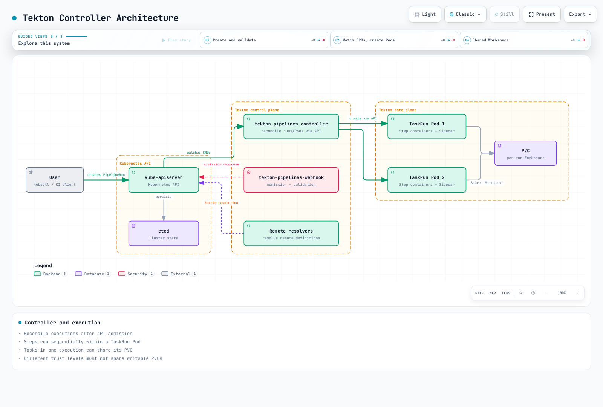
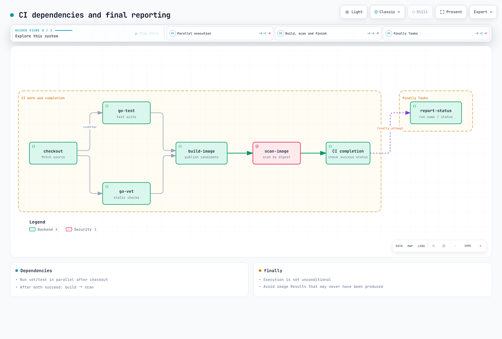
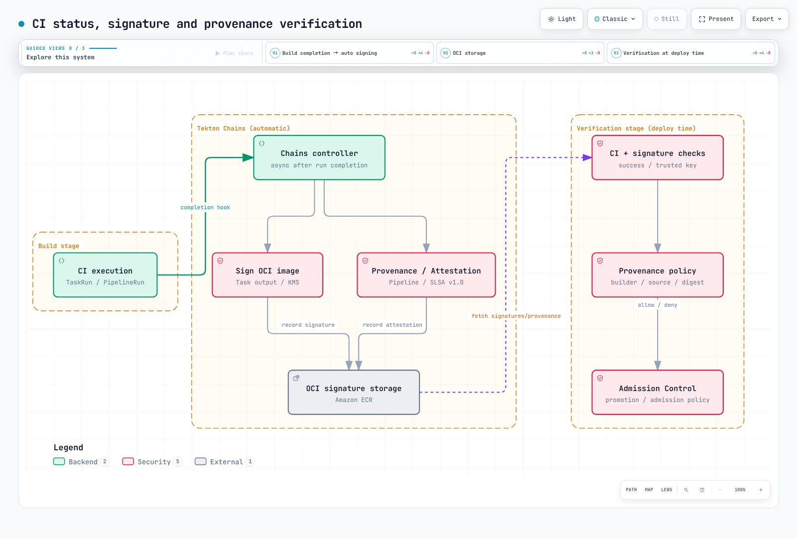

# Tekton Pipelines: KubernetesネイティブCI

> **最終更新**: September 12, 2026。Pipelines 1.16.0、Triggers 0.37.0、Chains 0.29.0、Dashboard 0.72.0、tkn 0.46.0。
> **検証**: リリースCRDスキーマ、Task依存関係、ローカルスクリプト、モックプログラム。実際のEKSインストール、イメージのビルド/プッシュ、KMS署名、外部Webhook、通知は実行していません。

< [前: FinOps](./13-finops-cost-platform.md) | [目次](./README.md) | [次: ゾーン運用](./15-zonal-operations-guide.md) >

## 概要

TektonはKubernetes APIでTask、Pipeline、その実行を定義します。運用者は引き続きコントローラー、ワーカー容量、ストレージ、更新、アクセスを管理します。他CIもKubernetes実行環境、自動スケーリング、アテステーションをサポートできるため、独占的サポートや運用費ゼロという主張は避けます。

例は**承認済みリポジトリの保護されたmainブランチ**のGoアプリCIを実行します。clone → vet/test並列実行 → 候補イメージ公開 → ダイジェスト指定スキャンの順です。Chains処理と暗号学的検証後に、別途レビューされたGitOps変更を行います。外部フォークPRはこのPipelineのIRSAロール、PVC、署名権限を共有してはいけません。

## 1. 実行モデル

| コンポーネント | 役割 |
| --- | --- |
| Task / Pipeline | 再利用可能な処理と依存関係の定義 |
| TaskRun / PipelineRun | パラメーターと状態を持つ実行 |
| Step / Sidecar | 順次処理 / 補助サービス。通常TaskRun Pod内 |
| Workspace / Result | ボリュームのバインド / 小さな出力値。独立CRDではない |

Task定義自体はPodではなく、TaskRunの実行で作成されます。Resultは文字列、配列、オブジェクト型をサポートします。大きなレポートは成果物ストレージに保存します。同じPodのStepはネットワークとボリュームを共有し、相互に信頼しないコード間の強い境界ではありません。


[インタラクティブな図を見る](https://www.atomai.click/kubernetes-docs/archmaps/en-ops-14-tekton-pipelines-0.html)



[インタラクティブな図を見る](https://www.atomai.click/kubernetes-docs/archmaps/en-ops-14-tekton-pipelines-1.html)

## 2. インストールと実行権限

### 2.1 バージョンとインストール経路

公式最小要件はKubernetes 1.28ですが、この章のセキュリティフィールドとスキーマ検証はKubernetes 1.36が対象です。上流最小要件は現在のEKS対応版への推奨ではありません。Dashboard 0.72.0はPipelines 1.15 LTS/1.16とTriggers 0.37 LTSを明示的にサポートします。

これはバージョン固定の手動インストール例です。公式ガイドは本番ライフサイクル管理にTekton Operatorも案内します。手動applyとOperator管理リソースを混ぜる前に所有者を選びます。コマンドは実クラスターを変更するため、無条件で競合を強制せず所有権を確認してください。

```bash
kubectl version -o yaml
kubectl get storageclass

curl --fail --location \
  https://infra.tekton.dev/tekton-releases/pipeline/previous/v1.16.0/release.yaml \
  -o pipelines-release.yaml
kubectl apply --server-side --field-manager=tekton-install -f pipelines-release.yaml
kubectl wait --for=condition=Established --timeout=120s \
  crd/tasks.tekton.dev crd/taskruns.tekton.dev \
  crd/pipelines.tekton.dev crd/pipelineruns.tekton.dev
kubectl -n tekton-pipelines wait deployment --all \
  --for=condition=Available --timeout=300s

kubectl apply --server-side -f \
  https://infra.tekton.dev/tekton-releases/triggers/previous/v0.37.0/release.yaml
kubectl apply --server-side -f \
  https://infra.tekton.dev/tekton-releases/triggers/previous/v0.37.0/interceptors.yaml
kubectl apply --server-side -f \
  https://infra.tekton.dev/tekton-releases/chains/previous/v0.29.0/release.yaml
kubectl apply --server-side -f \
  https://infra.tekton.dev/tekton-releases/dashboard/previous/v0.72.0/release.yaml
kubectl -n tekton-pipelines port-forward service/tekton-dashboard 9097:9097
```

`release.yaml`は読み取り専用Dashboard、`release-full.yaml`は書き込み機能もインストールします。読み取り専用モードはユーザー認証や名前空間ごとの権限制御を自動提供しません。運用公開前に認証プロキシ/OIDCとアクセスモデルを検証します。内部ALBは認証ではありません。Cognito統合には実HTTPSリスナー、Cognito/OIDCエンドポイント、Secretが必要です。

`https://tekton.dev/helm-charts`はこの例で動作する公式チャートリポジトリではありません。以前の存在しないチャートとvaluesをインストールしないでください。

### 2.2 現在の設定の意味

| 設定 | 現在の意味 |
| --- | --- |
| `feature-flags.coschedule: workspaces` | PVC Workspaceを共有するTaskRunを同じ場所にスケジュール。このRWO例で維持 |
| `disable-affinity-assistant` | v0.68後に削除された旧フラグ |
| `set-security-context: true` | Tekton注入コンテナの1.16デフォルト。ユーザーStepには独自の互換コンテキストが必要 |
| `results-from: termination-message` | デフォルト経路。Kubernetes終了メッセージ制限に従う |
| `max-result-size` | `sidecar-logs`に適用。単独変更でデフォルト終了メッセージは拡大しない |
| デフォルトタイムアウト | `config-defaults`で管理。例はPipelineRunで明示設定 |

`running-in-environment-with-injected-sidecars`はWorkspace分離ではなく、`keep-pod-on-cancel`はPipelineRun保持TTLではありません。小さな抜粋で完全なConfigMapを置き換えないでください。

### 2.3 ServiceAccountとIAMロールの分離

コントローラーは`tekton-pipelines` / `tekton-chains`、ビルドは`tekton-builds`を使います。単純なTask/Pipeline名参照は同じ名前空間内で解決します。共有名前空間のTaskを名前だけでは参照できません。

先にIAMロールを作成します。各IRSA信頼ポリシーは既存クラスターOIDCプロバイダー、`aud=sts.amazonaws.com`、正確な`sub=system:serviceaccount:tekton-builds:<SA name>`に制限します。ECRリポジトリを事前作成し、ビルドに`CreateRepository`は不要です。名前にかかわらず、`ci-readonly`にこの例ではKubernetes API Roleはなく、デフォルトの非特権実行アカウントです。

**`service-accounts.yaml`**

```yaml
apiVersion: v1
kind: Namespace
metadata:
  name: tekton-builds
---
apiVersion: v1
kind: ServiceAccount
metadata:
  name: ci-readonly
  namespace: tekton-builds
automountServiceAccountToken: false
---
apiVersion: v1
kind: ServiceAccount
metadata:
  name: ci-image-push
  namespace: tekton-builds
  annotations:
    eks.amazonaws.com/role-arn: arn:aws:iam::123456789012:role/tekton-candidate-push
automountServiceAccountToken: false
---
apiVersion: v1
kind: ServiceAccount
metadata:
  name: ci-image-read
  namespace: tekton-builds
  annotations:
    eks.amazonaws.com/role-arn: arn:aws:iam::123456789012:role/tekton-candidate-read
automountServiceAccountToken: false
---
apiVersion: v1
kind: ServiceAccount
metadata:
  name: ci-triggers
  namespace: tekton-builds
---
apiVersion: rbac.authorization.k8s.io/v1
kind: Role
metadata:
  name: ci-triggers
  namespace: tekton-builds
rules:
  - apiGroups: [triggers.tekton.dev]
    resources: [eventlisteners, triggers, triggerbindings, triggertemplates, interceptors]
    verbs: [get, list, watch]
  - apiGroups: [tekton.dev]
    resources: [pipelineruns]
    verbs: [create]
  - apiGroups: [""]
    resources: [configmaps]
    verbs: [get, list, watch]
  - apiGroups: [""]
    resources: [secrets]
    resourceNames: [github-webhook]
    verbs: [get]
---
apiVersion: rbac.authorization.k8s.io/v1
kind: RoleBinding
metadata:
  name: ci-triggers
  namespace: tekton-builds
subjects:
  - kind: ServiceAccount
    name: ci-triggers
    namespace: tekton-builds
roleRef:
  apiGroup: rbac.authorization.k8s.io
  kind: Role
  name: ci-triggers
---
apiVersion: rbac.authorization.k8s.io/v1
kind: ClusterRole
metadata:
  name: ci-triggers-interceptors
rules:
  - apiGroups: [triggers.tekton.dev]
    resources: [clusterinterceptors, clustertriggerbindings]
    verbs: [get, list, watch]
---
apiVersion: rbac.authorization.k8s.io/v1
kind: ClusterRoleBinding
metadata:
  name: ci-triggers-interceptors
subjects:
  - kind: ServiceAccount
    name: ci-triggers
    namespace: tekton-builds
roleRef:
  apiGroup: rbac.authorization.k8s.io
  kind: ClusterRole
  name: ci-triggers-interceptors
```

**`ecr-push-policy.json`**

```json
{
  "Version": "2012-10-17",
  "Statement": [
    {
      "Effect": "Allow",
      "Action": "ecr:GetAuthorizationToken",
      "Resource": "*",
      "Condition": {
        "StringEquals": {"aws:RequestedRegion": "ap-northeast-2"}
      }
    },
    {
      "Effect": "Allow",
      "Action": [
        "ecr:BatchCheckLayerAvailability",
        "ecr:GetDownloadUrlForLayer",
        "ecr:BatchGetImage",
        "ecr:InitiateLayerUpload",
        "ecr:UploadLayerPart",
        "ecr:CompleteLayerUpload",
        "ecr:PutImage"
      ],
      "Resource": "arn:aws:ecr:ap-northeast-2:123456789012:repository/myapp-candidates"
    }
  ]
}
```

**`ecr-read-policy.json`**

```json
{
  "Version": "2012-10-17",
  "Statement": [
    {
      "Effect": "Allow",
      "Action": "ecr:GetAuthorizationToken",
      "Resource": "*",
      "Condition": {
        "StringEquals": {"aws:RequestedRegion": "ap-northeast-2"}
      }
    },
    {
      "Effect": "Allow",
      "Action": [
        "ecr:BatchCheckLayerAvailability",
        "ecr:GetDownloadUrlForLayer",
        "ecr:BatchGetImage"
      ],
      "Resource": "arn:aws:ecr:ap-northeast-2:123456789012:repository/myapp-candidates"
    }
  ]
}
```

pushポリシーを`tekton-candidate-push`、readポリシーを`tekton-candidate-read`に付けます。すべての箇所でアカウント、リージョン、リポジトリを置き換えます。`GetAuthorizationToken`はリポジトリ単位のリソース範囲をサポートしないため、分離して要求リージョンで制限します。

IRSAはPod内のAWS SDK/CLI呼び出しを認証します。kubeletのECRイメージ取得はノードロール、Fargate実行ロール、imagePullSecretsによる別経路です。TaskのIRSAアノテーションだけではImagePullBackOffは直りません。

## 3. 完全なTask定義

6つのTaskで整合した1例を構成します。ソースリポジトリにはGoモジュール、テスト、Dockerfileが必要です。checkout固定の`myorg/myapp` URLを承認済みリポジトリへ置き換え、Trigger許可リストと合わせます。Webhook入力から任意Git URLやシェルコマンドを受け入れないでください。

Tekton置換は文字列置換です。script本文へ埋め込まず、環境変数か引数でparamsを渡します。完全な40文字コミットを検証します。ECR認証ファイルにはTaskローカル`emptyDir`を使います。読み取り専用Secretボリュームへ書いたり、別Stepのイメージにツールが存在すると想定したりしないでください。

Rootless BuildKitには、ユーザー名前空間、マウント、適切なseccomp/AppArmor設定を備える検証済み専用ビルド環境が必要です。`Unconfined`と`--oci-worker-no-process-sandbox`はrestricted名前空間ポリシーが拒否する明示的なセキュリティ上のトレードオフです。普遍的に安全なデフォルトではありません。外部PRには別環境を使います。

**`tasks.yaml`**

```yaml
apiVersion: tekton.dev/v1
kind: Task
metadata:
  name: checkout
  namespace: tekton-builds
spec:
  params:
  - name: revision
    type: string
  workspaces:
  - name: source
  results:
  - name: CHAINS-GIT_URL
    type: string
  - name: CHAINS-GIT_COMMIT
    type: string
  steps:
  - name: checkout
    image: golang:1.27.1
    script: |
      #!/usr/bin/env bash
      set -euo pipefail
      if [[ ! "$REVISION" =~ ^[0-9a-f]{40}$ ]]; then
        echo "Expected a full commit SHA" >&2
        exit 1
      fi
      cd "$SOURCE"
      git init .
      git config credential.helper ''
      git remote add origin "$REPOSITORY"
      git -c protocol.file.allow=never fetch --depth=1 origin "$REVISION"
      git -c advice.detachedHead=false checkout --detach FETCH_HEAD
      test "$(git rev-parse HEAD)" = "$REVISION"
      printf '%s' "$REPOSITORY" > "$GIT_URL_RESULT"
      printf '%s' "$REVISION" > "$GIT_COMMIT_RESULT"
    env:
    - name: REVISION
      value: $(params.revision)
    - name: REPOSITORY
      value: https://github.com/myorg/myapp.git
    - name: SOURCE
      value: $(workspaces.source.path)
    - name: GIT_URL_RESULT
      value: $(results.CHAINS-GIT_URL.path)
    - name: GIT_COMMIT_RESULT
      value: $(results.CHAINS-GIT_COMMIT.path)
    computeResources:
      requests:
        cpu: 100m
        memory: 128Mi
      limits:
        memory: 1Gi
  stepTemplate:
    securityContext:
      runAsUser: 1000
      runAsGroup: 1000
---
apiVersion: tekton.dev/v1
kind: Task
metadata:
  name: go-vet
  namespace: tekton-builds
spec:
  params: []
  workspaces:
  - name: source
  results: []
  steps:
  - name: vet
    image: golang:1.27.1
    script: |
      #!/usr/bin/env bash
      set -euo pipefail
      cd "$SOURCE"
      go vet ./...
    env:
    - name: SOURCE
      value: $(workspaces.source.path)
    - name: GOCACHE
      value: /tmp/go-build
    - name: GOMODCACHE
      value: /tmp/go-mod
    computeResources:
      requests:
        cpu: 100m
        memory: 128Mi
      limits:
        memory: 1Gi
  stepTemplate:
    securityContext:
      runAsUser: 1000
      runAsGroup: 1000
---
apiVersion: tekton.dev/v1
kind: Task
metadata:
  name: go-test
  namespace: tekton-builds
spec:
  params: []
  workspaces:
  - name: source
  results: []
  steps:
  - name: test
    image: golang:1.27.1
    script: |
      #!/usr/bin/env bash
      set -euo pipefail
      cd "$SOURCE"
      go test -count=1 -race -coverprofile=/tmp/coverage.out ./...
      go tool cover -func=/tmp/coverage.out
    env:
    - name: SOURCE
      value: $(workspaces.source.path)
    - name: GOCACHE
      value: /tmp/go-build
    - name: GOMODCACHE
      value: /tmp/go-mod
    computeResources:
      requests:
        cpu: 100m
        memory: 128Mi
      limits:
        memory: 1Gi
  stepTemplate:
    securityContext:
      runAsUser: 1000
      runAsGroup: 1000
---
apiVersion: tekton.dev/v1
kind: Task
metadata:
  name: build-image
  namespace: tekton-builds
spec:
  params:
  - name: image
    type: string
  - name: revision
    type: string
  - name: region
    type: string
  workspaces:
  - name: source
  results:
  - name: IMAGE_URL
    type: string
  - name: IMAGE_DIGEST
    type: string
  steps:
  - name: ecr-token
    image: public.ecr.aws/aws-cli/aws-cli:2.36.44
    script: |
      #!/bin/bash
      set -euo pipefail
      umask 077
      aws ecr get-authorization-token --region "$AWS_REGION" \
        --query 'authorizationData[0].authorizationToken' --output text > /auth/token
    env:
    - name: AWS_REGION
      value: $(params.region)
    - name: AWS_DEFAULT_REGION
      value: $(params.region)
    computeResources:
      requests:
        cpu: 100m
        memory: 128Mi
      limits:
        memory: 1Gi
    volumeMounts:
    - name: auth
      mountPath: /auth
  - name: docker-config
    image: python:3.12.13-slim
    script: |
      #!/usr/bin/env python3
      import base64, json, os, re
      from pathlib import Path
      image, region = os.environ["IMAGE"], os.environ["REGION"]
      match = re.fullmatch(r"([0-9]{12})\.dkr\.ecr\.([a-z0-9-]+)\.amazonaws\.com/([a-z0-9][a-z0-9._/-]*)", image)
      if not match or match.group(2) != region or ".." in match.group(3):
          raise SystemExit("Use a private ECR repository in the configured region")
      token = Path("/auth/token").read_text().strip()
      decoded = base64.b64decode(token, validate=True)
      if not decoded.startswith(b"AWS:") or len(decoded) <= 4:
          raise SystemExit("Invalid ECR authorization token")
      Path("/auth/config.json").write_text(json.dumps({"auths": {image.split("/")[0]: {"auth": token}}}))
      Path("/auth/config.json").chmod(0o600)
      Path("/auth/token").unlink()
    env:
    - name: IMAGE
      value: $(params.image)
    - name: REGION
      value: $(params.region)
    computeResources:
      requests:
        cpu: 100m
        memory: 128Mi
      limits:
        memory: 1Gi
    volumeMounts:
    - name: auth
      mountPath: /auth
  - name: build-and-push
    image: moby/buildkit:v0.33.0-rootless
    script: |
      #!/bin/sh
      set -eu
      case "$REVISION" in *[!0-9a-f]*|"") echo "Invalid commit tag" >&2; exit 1;; esac
      test "${#REVISION}" -eq 40
      buildctl-daemonless.sh build \
        --frontend dockerfile.v0 \
        --local "context=$SOURCE" --local "dockerfile=$SOURCE" \
        --output "type=image,name=$IMAGE:$REVISION,push=true" \
        --metadata-file /build-result/metadata.json
    env:
    - name: SOURCE
      value: $(workspaces.source.path)
    - name: IMAGE
      value: $(params.image)
    - name: REVISION
      value: $(params.revision)
    - name: DOCKER_CONFIG
      value: /auth
    - name: BUILDKITD_FLAGS
      value: --oci-worker-no-process-sandbox
    computeResources:
      requests:
        cpu: '1'
        memory: 1Gi
      limits:
        memory: 4Gi
    securityContext:
      runAsUser: 1000
      runAsGroup: 1000
      seccompProfile:
        type: Unconfined
      appArmorProfile:
        type: Unconfined
    volumeMounts:
    - name: auth
      mountPath: /auth
      readOnly: true
    - name: buildkit-state
      mountPath: /home/user/.local/share/buildkit
    - name: build-result
      mountPath: /build-result
  - name: record-digest
    image: python:3.12.13-slim
    script: |
      #!/usr/bin/env python3
      import json, os, re
      from pathlib import Path
      data = json.loads(Path("/build-result/metadata.json").read_text())
      digest = data.get("containerimage.digest", "")
      if not re.fullmatch(r"sha256:[0-9a-f]{64}", digest):
          raise SystemExit("BuildKit did not return an image digest")
      Path(os.environ["URL_RESULT"]).write_text(os.environ["IMAGE"])
      Path(os.environ["DIGEST_RESULT"]).write_text(digest)
    env:
    - name: IMAGE
      value: $(params.image)
    - name: URL_RESULT
      value: $(results.IMAGE_URL.path)
    - name: DIGEST_RESULT
      value: $(results.IMAGE_DIGEST.path)
    computeResources:
      requests:
        cpu: 100m
        memory: 128Mi
      limits:
        memory: 1Gi
    volumeMounts:
    - name: build-result
      mountPath: /build-result
      readOnly: true
  volumes:
  - name: auth
    emptyDir: {}
  - name: buildkit-state
    emptyDir: {}
  - name: build-result
    emptyDir: {}
  stepTemplate:
    securityContext:
      runAsUser: 1000
      runAsGroup: 1000
---
apiVersion: tekton.dev/v1
kind: Task
metadata:
  name: scan-image
  namespace: tekton-builds
spec:
  params:
  - name: image
    type: string
  - name: digest
    type: string
  - name: region
    type: string
  workspaces: []
  results: []
  steps:
  - name: ecr-token
    image: public.ecr.aws/aws-cli/aws-cli:2.36.44
    script: |
      #!/bin/bash
      set -euo pipefail
      umask 077
      aws ecr get-authorization-token --region "$AWS_REGION" \
        --query 'authorizationData[0].authorizationToken' --output text > /auth/token
    env:
    - name: AWS_REGION
      value: $(params.region)
    - name: AWS_DEFAULT_REGION
      value: $(params.region)
    computeResources:
      requests:
        cpu: 100m
        memory: 128Mi
      limits:
        memory: 1Gi
    volumeMounts:
    - name: auth
      mountPath: /auth
  - name: docker-config
    image: python:3.12.13-slim
    script: |
      #!/usr/bin/env python3
      import base64, json, os, re
      from pathlib import Path
      image, region = os.environ["IMAGE"], os.environ["REGION"]
      match = re.fullmatch(r"([0-9]{12})\.dkr\.ecr\.([a-z0-9-]+)\.amazonaws\.com/([a-z0-9][a-z0-9._/-]*)", image)
      if not match or match.group(2) != region or ".." in match.group(3):
          raise SystemExit("Use a private ECR repository in the configured region")
      token = Path("/auth/token").read_text().strip()
      decoded = base64.b64decode(token, validate=True)
      if not decoded.startswith(b"AWS:") or len(decoded) <= 4:
          raise SystemExit("Invalid ECR authorization token")
      Path("/auth/config.json").write_text(json.dumps({"auths": {image.split("/")[0]: {"auth": token}}}))
      Path("/auth/config.json").chmod(0o600)
      Path("/auth/token").unlink()
    env:
    - name: IMAGE
      value: $(params.image)
    - name: REGION
      value: $(params.region)
    computeResources:
      requests:
        cpu: 100m
        memory: 128Mi
      limits:
        memory: 1Gi
    volumeMounts:
    - name: auth
      mountPath: /auth
  - name: scan
    image: aquasec/trivy:0.74.0
    script: |
      #!/bin/sh
      set -eu
      trivy image --scanners vuln --severity HIGH,CRITICAL \
        --exit-code 1 --format json --output /tmp/trivy-report.json "$IMAGE@$DIGEST"
    env:
    - name: IMAGE
      value: $(params.image)
    - name: DIGEST
      value: $(params.digest)
    - name: DOCKER_CONFIG
      value: /auth
    - name: TRIVY_CACHE_DIR
      value: /tmp/trivy-cache
    computeResources:
      requests:
        cpu: 100m
        memory: 128Mi
      limits:
        memory: 1Gi
    volumeMounts:
    - name: auth
      mountPath: /auth
      readOnly: true
  volumes:
  - name: auth
    emptyDir: {}
  stepTemplate:
    securityContext:
      runAsUser: 1000
      runAsGroup: 1000
---
apiVersion: tekton.dev/v1
kind: Task
metadata:
  name: report-status
  namespace: tekton-builds
spec:
  params:
  - name: run
    type: string
  - name: status
    type: string
  workspaces: []
  results: []
  steps:
  - name: report
    image: python:3.12.13-slim
    script: |
      #!/usr/bin/env python3
      import json, os
      print(json.dumps({"pipelineRun": os.environ["RUN"], "status": os.environ["STATUS"]}))
    env:
    - name: RUN
      value: $(params.run)
    - name: STATUS
      value: $(params.status)
    computeResources:
      requests:
        cpu: 100m
        memory: 128Mi
      limits:
        memory: 1Gi
  stepTemplate:
    securityContext:
      runAsUser: 1000
      runAsGroup: 1000
```

元のGoogle Kanikoリポジトリはアーカイブ済みです。新例はBuildKit 0.33.0を使います。Rootlessは完全なプロセス分離を保証しません。本番前にイメージダイジェスト/プラットフォームを検証・固定し、実ノードで書き込み可能パスとセキュリティコンテキストをテストします。

検出事項によるスキャナー終了コード1も他エラーコードも、すべてTaskを失敗させます。レポート欠損を「脆弱性ゼロ」にしてはいけません。`/tmp/trivy-report.json`は一時ファイルです。長期保持が必要なら実行クリーンアップ前に承認済み成果物ストアへ出力します。

## 4. Pipelineと実行



[インタラクティブな図を見る](https://www.atomai.click/kubernetes-docs/archmaps/en-ops-14-tekton-pipelines-2.html)

**`pipeline.yaml`**

```yaml
apiVersion: tekton.dev/v1
kind: Pipeline
metadata:
  name: trusted-image-ci
  namespace: tekton-builds
spec:
  params:
    - name: revision
      type: string
    - name: image
      type: string
    - name: region
      type: string
      default: ap-northeast-2
  workspaces:
    - name: source
  results:
    - name: CHAINS-GIT_URL
      value: $(tasks.clone.results.CHAINS-GIT_URL)
    - name: CHAINS-GIT_COMMIT
      value: $(tasks.clone.results.CHAINS-GIT_COMMIT)
    - name: IMAGE_URL
      value: $(tasks.build.results.IMAGE_URL)
    - name: IMAGE_DIGEST
      value: $(tasks.build.results.IMAGE_DIGEST)
  tasks:
    - name: clone
      taskRef:
        name: checkout
      params:
        - name: revision
          value: $(params.revision)
      workspaces:
        - name: source
          workspace: source
    - name: lint
      runAfter: [clone]
      taskRef:
        name: go-vet
      workspaces:
        - name: source
          workspace: source
    - name: test
      runAfter: [clone]
      taskRef:
        name: go-test
      workspaces:
        - name: source
          workspace: source
    - name: build
      runAfter: [lint, test]
      taskRef:
        name: build-image
      params:
        - name: image
          value: $(params.image)
        - name: revision
          value: $(tasks.clone.results.CHAINS-GIT_COMMIT)
        - name: region
          value: $(params.region)
      workspaces:
        - name: source
          workspace: source
    - name: scan
      runAfter: [build]
      taskRef:
        name: scan-image
      params:
        - name: image
          value: $(tasks.build.results.IMAGE_URL)
        - name: digest
          value: $(tasks.build.results.IMAGE_DIGEST)
        - name: region
          value: $(params.region)
  finally:
    - name: report
      taskRef:
        name: report-status
      params:
        - name: run
          value: $(context.pipelineRun.name)
        - name: status
          value: $(tasks.status)
```

**`pipelinerun.yaml`**

```yaml
apiVersion: tekton.dev/v1
kind: PipelineRun
metadata:
  generateName: trusted-image-ci-
  namespace: tekton-builds
spec:
  pipelineRef:
    name: trusted-image-ci
  params:
    - name: revision
      value: REPLACE_WITH_FULL_40_CHARACTER_COMMIT_SHA
    - name: image
      value: 123456789012.dkr.ecr.ap-northeast-2.amazonaws.com/myapp-candidates
  workspaces:
    - name: source
      volumeClaimTemplate:
        spec:
          accessModes: [ReadWriteOnce]
          storageClassName: gp3
          resources:
            requests:
              storage: 10Gi
  taskRunTemplate:
    serviceAccountName: ci-readonly
    podTemplate:
      automountServiceAccountToken: false
      securityContext:
        fsGroup: 1000
  taskRunSpecs:
    - pipelineTaskName: build
      serviceAccountName: ci-image-push
    - pipelineTaskName: scan
      serviceAccountName: ci-image-read
  timeouts:
    pipeline: 1h
    tasks: 50m
    finally: 5m
```

```bash
kubectl apply -f service-accounts.yaml
kubectl apply -f tasks.yaml -f pipeline.yaml
# Replace the commit placeholder and provision the referenced IAM roles first.
kubectl create -f pipelinerun.yaml
tkn pipelinerun logs --last -n tekton-builds --follow --exit-with-pipelinerun-error
```

実行ごとに新PVCを作成します。ReadWriteOnceは同一ノードの複数Podを許可しますが、複数ノードRWXではありません。emptyDirは異なるTaskRun Pod間の共有ストレージではありません。信頼レベルごとにキャッシュを分離し、同時書き込みを調整します。

`finally`は通常Taskの後に動きますが、無条件ではありません。欠けたResultへの参照でスキップされる場合があり、キャンセルモード、全体タイムアウト、リソース障害、未解決参照でも実行できなくなります。例は生成されない可能性があるイメージResultを避け、実行名と`tasks.status`だけを報告します。複数finally Task間の順序を想定しないでください。

## 5. WebhookとTrigger

このTriggerは最初にGitHub HMACを検証し、次に**リポジトリ、ブランチ、削除状態、完全SHA**を確認します。Git URL、ECRパス、Task名、ServiceAccountは信頼する定義内で固定します。外部PRイベントをこのテンプレートに接続しないでください。HMACは配信元を検証し、PRコードのデプロイを認可しません。


[インタラクティブな図を見る](https://www.atomai.click/kubernetes-docs/archmaps/en-ops-14-tekton-pipelines-3.html)

**`triggers.yaml`**

```yaml
apiVersion: triggers.tekton.dev/v1beta1
kind: EventListener
metadata:
  name: trusted-github
  namespace: tekton-builds
spec:
  serviceAccountName: ci-triggers
  triggers:
    - name: protected-main-push
      interceptors:
        - ref:
            name: github
          params:
            - name: secretRef
              value:
                secretName: github-webhook
                secretKey: token
            - name: eventTypes
              value: [push]
        - ref:
            name: cel
          params:
            - name: filter
              value: >-
                body.repository.full_name == 'myorg/myapp' &&
                body.ref == 'refs/heads/main' &&
                body.deleted == false &&
                body.after.matches('^[0-9a-f]{40}$')
      bindings:
        - ref: trusted-commit
      template:
        ref: trusted-image-ci
---
apiVersion: triggers.tekton.dev/v1beta1
kind: TriggerBinding
metadata:
  name: trusted-commit
  namespace: tekton-builds
spec:
  params:
    - name: revision
      value: $(body.after)
---
apiVersion: triggers.tekton.dev/v1beta1
kind: TriggerTemplate
metadata:
  name: trusted-image-ci
  namespace: tekton-builds
spec:
  params:
    - name: revision
  resourcetemplates:
    - apiVersion: tekton.dev/v1
      kind: PipelineRun
      metadata:
        generateName: trusted-image-ci-
        namespace: tekton-builds
      spec:
        pipelineRef:
          name: trusted-image-ci
        params:
          - name: revision
            value: $(tt.params.revision)
          - name: image
            value: 123456789012.dkr.ecr.ap-northeast-2.amazonaws.com/myapp-candidates
        workspaces:
          - name: source
            volumeClaimTemplate:
              spec:
                accessModes: [ReadWriteOnce]
                storageClassName: gp3
                resources:
                  requests:
                    storage: 10Gi
        taskRunTemplate:
          serviceAccountName: ci-readonly
          podTemplate:
            automountServiceAccountToken: false
            securityContext:
              fsGroup: 1000
        taskRunSpecs:
          - pipelineTaskName: build
            serviceAccountName: ci-image-push
          - pipelineTaskName: scan
            serviceAccountName: ci-image-read
        timeouts:
          pipeline: 1h
          tasks: 50m
          finally: 5m
```

`github-webhook` Secretの`token`はGitHubのWebhookシークレットと一致する必要があります。Gitでなく保護されたストレージから供給します。外部HTTPSエンドポイントと配信再試行/重複排除方針は別途設定します。EventListenerはデフォルトで内部Serviceを持ち、このYAMLだけではインターネットエンドポイントを作成しません。

HMAC検証のためTLS終端とGateway/Ingress処理を通じて元本文を保持します。コールバックに適切な認証、レート制限、可用性、固定ルーティングを適用します。静かな時間帯は自動的にWebhook障害を意味しません。実配信結果とEventListener処理エラーを確認してください。

`head_commit`が常に存在すると想定したり、1つのsplit要素で`refs/heads/feature/a`を切り詰めたりしないでください。ファイル変更フィルターは追加、変更、削除パスとペイロード制限を考慮する必要があります。例は業務固有のパスフィルターを作り出しません。

## 6. Chainsと署名検証

### 6.1 CI成功と署名完了は別

Chainsは完了TaskRun/PipelineRunを処理する独立コントローラーです。イメージ署名だけでは全テストとスキャンの成功は証明されません。`chains.tekton.dev/signed=true`はデプロイ承認でも暗号学的検証でもありません。

Pipelineレベルの来歴情報はPipeline完了後に作成されます。Pipeline内部で自身のアテステーションを待つと、その順序と矛盾する場合があります。例はCI完了後に別の検証と昇格手順を使います。



[インタラクティブな図を見る](https://www.atomai.click/kubernetes-docs/archmaps/en-ops-14-tekton-pipelines-4.html)

### 6.2 KMS設定

既存の非対称`SIGN_VERIFY` KMSキーを使います。キーARNと`builder.id`を置き換えます。 **ChainsコントローラーServiceAccount `tekton-chains/tekton-chains-controller`** に別のIRSAロールを設定し、候補リポジトリへのECR書き込みと以下のKMS権限を付けます。ビルドPodへのIRSAロール付与ではコントローラーに認証情報は渡りません。

現在のOCIバックエンドはKubernetes認証情報検索とデフォルト/ECR credential-helperチェーンを使います。コントローラーの環境にAWS IDを設定し、実際の署名アップロードを検証します。ビルドTaskの`/auth` emptyDirはChainsが読める共有Secretではありません。

**`chains-kms-policy.json`**

```json
{
  "Version": "2012-10-17",
  "Statement": [{
    "Effect": "Allow",
    "Action": ["kms:Sign", "kms:GetPublicKey", "kms:DescribeKey"],
    "Resource": "arn:aws:kms:ap-northeast-2:123456789012:key/REPLACE_KEY_ID"
  }]
}
```

**`chains-config.yaml`**

```yaml
apiVersion: v1
kind: ConfigMap
metadata:
  name: chains-config
  namespace: tekton-chains
data:
  artifacts.taskrun.storage: ""
  artifacts.pipelinerun.format: slsa/v2alpha3
  artifacts.pipelinerun.storage: oci
  artifacts.pipelinerun.signer: kms
  artifacts.oci.format: simplesigning
  artifacts.oci.storage: oci
  artifacts.oci.signer: kms
  signers.kms.kmsref: awskms:///arn:aws:kms:ap-northeast-2:123456789012:key/REPLACE_KEY_ID
  signers.x509.fulcio.enabled: "false"
  transparency.enabled: "false"
  storage.oci.encoding-format: dsse
  builder.id: https://ci.example.com/tekton/trusted-image-ci
  builddefinition.buildtype: https://tekton.dev/chains/v2/slsa
```

フォーマッター名`slsa/v1`はSLSA provenance v1.0を意味しません。現Chainsでは`slsa/v1` / `in-toto`はv0.2、`slsa/v2alpha3` / `slsa/v2alpha4`はv1.0に対応します。例はPipelineレベル`slsa/v2alpha3`を使い、重複するTaskレベル来歴保存を無効にし、イメージ署名を別に有効化します。

`storage.oci.encoding-format: dsse`は従来の`.sig` / `.att`保存を維持します。0.29の`sigstore-bundle`はOCI 1.1 referrersを使うため、ストレージと検証ツールを一緒に変更します。ここではRekorアップロードを無効にし、検証は明示的に内部公開鍵ポリシーに従います。必要なら公開されるビルドメタデータのレビューも含め、透明性を別途設定します。

キーレス署名には実際のFulcioサービスが信頼する発行者と有効ワークロードトークンが必要です。EKS PodにGitHub Actions発行者文字列を設定しても認証は提供されません。署名とアテステーションだけで特定SLSAレベルは成立しません。

### 6.3 実行と成果物を独立して検証

スクリプトは**信頼するAPIから読み取った**PipelineRunについて、CI成功、Chains処理完了、承認リポジトリ/コミット/イメージ出力を確認します。署名は検証しません。後続Cosign確認と来歴ポリシーレビューも必要です。

**`check_run.py`**

```python
"""Check trusted API output before separate cryptographic artifact verification."""
import argparse
import json
import re
from pathlib import Path


def check(run, repository, revision, image):
    if run.get("kind") != "PipelineRun" or run.get("apiVersion") != "tekton.dev/v1":
        raise ValueError("Expected a tekton.dev/v1 PipelineRun")
    metadata = run.get("metadata", {})
    if metadata.get("namespace") != "tekton-builds" or not metadata.get("uid"):
        raise ValueError("Unexpected namespace or missing run UID")
    if run.get("spec", {}).get("pipelineRef", {}).get("name") != "trusted-image-ci":
        raise ValueError("Unexpected pipeline")
    succeeded = [c for c in run.get("status", {}).get("conditions", []) if c.get("type") == "Succeeded"]
    if len(succeeded) != 1 or succeeded[0].get("status") != "True":
        raise ValueError("CI has not succeeded")
    if not run.get("status", {}).get("completionTime"):
        raise ValueError("CI completion time is missing")
    if metadata.get("annotations", {}).get("chains.tekton.dev/signed") != "true":
        raise ValueError("Chains has not completed; retry later with a fresh API read")
    results = {}
    for result in run.get("status", {}).get("results", []):
        if result["name"] in results:
            raise ValueError("Duplicate result")
        results[result["name"]] = result["value"]
    if not re.fullmatch(r"[0-9a-f]{40}", revision):
        raise ValueError("Expected full source revision")
    expected = {"CHAINS-GIT_URL": repository, "CHAINS-GIT_COMMIT": revision, "IMAGE_URL": image}
    if any(results.get(k) != v for k, v in expected.items()):
        raise ValueError("Run outputs do not match the approved source and repository")
    digest = results.get("IMAGE_DIGEST", "")
    if not isinstance(digest, str) or not re.fullmatch(r"sha256:[0-9a-f]{64}", digest):
        raise ValueError("Missing or invalid image digest")
    return image + "@" + digest


if __name__ == "__main__":
    parser = argparse.ArgumentParser()
    parser.add_argument("--run", type=Path, required=True)
    parser.add_argument("--repository", required=True)
    parser.add_argument("--revision", required=True)
    parser.add_argument("--image", required=True)
    args = parser.parse_args()
    try:
        print(check(json.loads(args.run.read_text()), args.repository, args.revision, args.image))
    except (ValueError, KeyError, TypeError) as error:
        parser.exit(1, f"Run gate failed: {error}\n")
```

```bash
set -euo pipefail
DOCS_RUN="REPLACE_PIPELINERUN_NAME"
DOCS_REVISION="REPLACE_WITH_FULL_40_CHARACTER_COMMIT_SHA"
DOCS_IMAGE="123456789012.dkr.ecr.ap-northeast-2.amazonaws.com/myapp-candidates"
kubectl -n tekton-builds get pipelinerun "$DOCS_RUN" -o json > run.json
DOCS_IMAGE_REF="$(python3 check_run.py --run run.json \
  --repository https://github.com/myorg/myapp.git \
  --revision "$DOCS_REVISION" --image "$DOCS_IMAGE")"

# chains.pub must be the independently trusted public key for the configured KMS key.
# Registry read authentication must already be configured.
# Explicit private-key policy: verify signatures, without requiring a Rekor entry.
cosign verify --key chains.pub --insecure-ignore-tlog=true "$DOCS_IMAGE_REF" \
  > verified-signature.json
cosign verify-attestation --key chains.pub --insecure-ignore-tlog=true \
  --type https://slsa.dev/provenance/v1 "$DOCS_IMAGE_REF" \
  > verified-attestations.json
```

`--insecure-ignore-tlog`は公開Rekorエントリを要求しない明示的選択です。信頼する鍵による署名検証は有効のままです。組織方針で透明性検証が必要なら、この例外でなく検証チェーンを設定してください。

検証済みアテステーションのsubject digest、`runDetails.builder.id`、`buildDefinition.buildType`、正確なソースURI/コミット、承認Task/Pipeline定義にポリシーを適用します。任意の生成者の有効署名や別ビルドのアテステーションでは不十分です。上のコマンドは組織固有チェックを自動実装しません。

同じ信頼する鍵/ID、ダイジェスト、来歴条件でアドミッション検証を別途設定します。不完全な`BEGIN PUBLIC KEY ...`を適用したり、存在しないpredicateフィールドを比較したりしないでください。インストール版の現在のKyverno ImageValidatingPolicyとレジストリ認証を確認し、正しい/誤った鍵やソース、未署名イメージの受け入れ/拒否をテストします。

## 7. GitOpsへの引き継ぎ

検証済み`repository@sha256:...`で実Kustomize/Helm設定を更新します。この章はPRの自動プッシュ、作成、マージTaskを含みません。所有者か別途承認された昇格フローが固定リポジトリ/ファイルを編集し、CIとレビュー後にマージします。TektonのkubectlデプロイとArgoCDの両方で同じマニフェストを管理しないでください。


[インタラクティブな図を見る](https://www.atomai.click/kubernetes-docs/archmaps/en-ops-14-tekton-pipelines-5.html)

```bash
# In a reviewed checkout with the Kustomize CLI installed:
cd overlays/production
kustomize edit set image "myapp=$DOCS_IMAGE_REF"
kustomize build . > /tmp/rendered-myapp.yaml
git diff -- kustomization.yaml
# Run repository checks and submit the focused change for review.
```

イメージ参照を`cut -d: -f1/2`で分割するとレジストリポートやダイジェストが壊れます。完全な参照をツールに渡します。SSH known_hostsは信頼する経路で用意し、未検証のssh-keyscan結果は信頼の基点ではありません。1つのStepのホームへコピーした認証情報は別Stepに自動共有されません。

ArgoCDはGitマニフェストを同期し、kubelet/コンテナランタイムがアプリイメージを取得します。同期完了とアプリ健全性を別々に確認します。ロールバックはデータやスキーマ変更を自動復元しません。

## 8. 運用とクリーンアップ

### 8.1 実行記録とPVC

`keep`と`keep-since`はtkn削除コマンドなどのツールオプションで、組み込みPipelineRun TTLフィールドではありません。tkn 0.46.0の`pipelinerun delete`に`--dry-run`はありません。削除前にログ、スキャンレポート、署名/来歴、監査データの保持を確認します。経過時間の方針なしで成功Podをすべて削除しないでください。

ツールは1名前空間で**レビュー候補だけ**を出力します。7日超前に完了した成功実行と14日超前の失敗実行です。作成時刻でなく完了時刻を使い、Chainsとアーカイブ確認を要求します。`ci.example.com/archive-complete`は実アーカイブ成功後に運用者が記録するアノテーションで、自動Tektonフィールドではありません。スクリプトはKubernetes APIを呼ばず、削除もしません。

**`cleanup_candidates.py`**

```python
"""Print names for review; this script never deletes Kubernetes objects."""
import argparse
import json
from datetime import datetime, timedelta, timezone
from pathlib import Path


def timestamp(value):
    parsed = datetime.fromisoformat(value.replace("Z", "+00:00"))
    if parsed.tzinfo is None:
        raise ValueError("Timezone required")
    return parsed.astimezone(timezone.utc)


def candidates(document, now, namespace):
    if now.tzinfo is None:
        raise ValueError("Timezone required")
    result, skipped = [], []
    for obj in document.get("items", []):
        meta, status = obj.get("metadata", {}), obj.get("status", {})
        name = meta.get("name", "<unnamed>")
        conditions = [c for c in status.get("conditions", []) if c.get("type") == "Succeeded"]
        annotations = meta.get("annotations", {})
        if (obj.get("kind") != "PipelineRun" or meta.get("namespace") != namespace
                or not meta.get("uid") or len(conditions) != 1
                or conditions[0].get("status") not in ("True", "False")):
            skipped.append({"name": name, "reason": "not a terminal run in the selected namespace"})
            continue
        if annotations.get("ci.example.com/retain") == "true":
            skipped.append({"name": name, "reason": "retention hold"})
            continue
        if (annotations.get("chains.tekton.dev/signed") != "true"
                or annotations.get("ci.example.com/archive-complete") != "true"):
            skipped.append({"name": name, "reason": "Chains processing or archive acknowledgement incomplete"})
            continue
        try:
            completed = timestamp(status["completionTime"])
        except (ValueError, KeyError, TypeError, AttributeError):
            skipped.append({"name": name, "reason": "invalid completion time"})
            continue
        retention_days = 7 if conditions[0]["status"] == "True" else 14
        if completed < now - timedelta(days=retention_days):
            result.append({"namespace": namespace, "name": name, "uid": meta["uid"],
                           "completed": completed.isoformat(), "retentionDays": retention_days})
    return {"mode": "review-only", "candidates": result, "skipped": skipped}


if __name__ == "__main__":
    parser = argparse.ArgumentParser()
    parser.add_argument("--input", type=Path, required=True)
    parser.add_argument("--namespace", default="tekton-builds")
    parser.add_argument("--now", default=datetime.now(timezone.utc).isoformat())
    args = parser.parse_args()
    print(json.dumps(candidates(json.loads(args.input.read_text()), timestamp(args.now), args.namespace), indent=2))
```

```bash
kubectl -n tekton-builds get pipelineruns -o json > runs.json
python3 cleanup_candidates.py --input runs.json --namespace tekton-builds
```

PVCライフサイクルは`coschedule`に依存します。

| モード | 完了後のvolumeClaimTemplate PVC |
| --- | --- |
| `workspaces` | デフォルト保持。Runアノテーション`tekton.dev/auto-cleanup-pvc: "true"`で完了時クリーンアップを有効化 |
| `pipelineruns`, `isolate-pipelinerun` | 完了時にクリーンアップ |
| `disabled` | owner-reference GC。Run削除時の動作を確認 |

Workspaceへ直接バインドした既存PVCは、そのアノテーションでは削除されません。まだアーカイブが必要なデータに自動クリーンアップを有効にしないでください。TaskRunを孤立と分類する前にownerReferencesを調べます。

### 8.2 監視

Pipelines 1.16はOpenTelemetryでメトリクスを公開します。`config-observability`で`metrics-protocol: prometheus`を設定すると、コントローラーServiceのポート名は **`http-metrics`** です。ServiceMonitor選択とPrometheus選択の両方を合わせます。

**`servicemonitor.yaml`**

```yaml
apiVersion: monitoring.coreos.com/v1
kind: ServiceMonitor
metadata:
  name: tekton-pipelines
  namespace: observability
  labels:
    release: prometheus
spec:
  namespaceSelector:
    matchNames: [tekton-pipelines]
  selector:
    matchLabels:
      app.kubernetes.io/component: controller
      app.kubernetes.io/part-of: tekton-pipelines
  endpoints:
    - port: http-metrics
      path: /metrics
      interval: 30s
      honorLabels: true
```

**`monitoring-rules.yaml`**

```yaml
groups:
  - name: tekton-ci
    rules:
      - record: tekton:completed_duration_seconds:mean1h
        expr: |
          sum(rate(tekton_pipelines_controller_pipelinerun_duration_seconds_sum[1h]))
          /
          sum(rate(tekton_pipelines_controller_pipelinerun_duration_seconds_count[1h]))
      - alert: TektonCompletedRunFailureRatio
        expr: |
          (
            sum(increase(tekton_pipelines_controller_pipelinerun_total{status="failed"}[1h]))
            /
            sum(increase(tekton_pipelines_controller_pipelinerun_total{status=~"success|failed"}[1h]))
            > 0.30
          )
          and
          (
            sum(increase(tekton_pipelines_controller_pipelinerun_total{status=~"success|failed"}[1h])) >= 10
          )
        for: 15m
        labels:
          severity: warning
        annotations:
          summary: "More than 30% failed among at least 10 completed non-cancelled CI runs"
      - alert: TektonControllerMetricsUnavailable
        expr: |
          absent(up{namespace="tekton-pipelines",service="tekton-pipelines-controller",endpoint="http-metrics"} == 1)
        for: 5m
        labels:
          severity: warning
        annotations:
          summary: "No healthy scrape target for the Tekton controller"
```

ファイルは通常Prometheusルール形式です。Operator使用時は`PrometheusRule.spec`下に置きます。現在の完了数は`pipelinerun_total`、実行中数は`running_pipelineruns`です。カウンター状態は`success`、`failed`、`cancelled`で、namespaceラベルはありません。例はキャンセルを除き、クラスター全体の成功/失敗を比較します。

平均所要時間は**ヒストグラムsumの総和をcountの総和で割って**計算します。系列ごとの平均の平均は全体平均ではありません。完了所要時間メトリクスの`status=running`は実行中Runの経過時間を示しません。実RunのstartTime、条件、Pod状態を確認します。

### 8.3 トラブルシューティングとログ

```bash
tkn pipelinerun describe "$DOCS_RUN" -n tekton-builds
tkn pipelinerun logs "$DOCS_RUN" -n tekton-builds --log-failed
tkn pipelinerun logs "$DOCS_RUN" -n tekton-builds --task build
kubectl -n tekton-builds get pipelinerun "$DOCS_RUN" -o yaml
kubectl -n tekton-builds describe pod -l "tekton.dev/pipelineRun=$DOCS_RUN"
kubectl -n tekton-pipelines logs deployment/tekton-pipelines-controller --tail=100
kubectl -n tekton-chains logs deployment/tekton-chains-controller --tail=100
```

`--last`は最新実行を選び、最新失敗実行ではありません。未対応CRD条件フィールドセレクターでなくJSONから条件を読みます。Loki/Alloyが実際に収集した名前空間とPipelineRunラベルを照会します。コントローラー名前空間のファイルだけでは`tekton-builds`で動くビルドを見逃します。

Pending Podはクォータ、ノード、PVC、スケジューリングイベントを確認します。YAMLでgp3 RWOをRWXに変えてもEFSのようには動きません。タイムアウト延長では、大きすぎるResult、権限、Task不足、ツール不在は直りません。

## 9. 再利用と運用上の選択

- **サイドカー**: DB準備状態と実接続を確認します。sleepは準備完了の証拠ではありません。インストール版のネイティブサイドカー機能設定と終了動作を確認します。
- **StepAction**: 機能は1.16で安定版ですが、リリースのストレージAPIは`tekton.dev/v1beta1`のままです。実ツール、認証情報、結果パスを利用Taskに接続します。
- **カタログ**: Hubサービスの非推奨化とCLIへの内部化は別です。tkn 0.46のHubコマンドは長期サービス可用性を保証しません。承認定義を固定コミットまたは検証済みOCIバンドルダイジェストで管理し、resolverアクセスを制限します。
- **ネットワーキング**: NetworkPolicyのTCP 443と`to: []`は全宛先のそのポートを許可し、ECR/GitHubドメイン許可リストではありません。必要なDNS、STS/ECR/S3、レジストリ、API経路を実CNI/プロキシ/VPC設計で制限します。
- **Spotと費用**: Karpenterは`karpenter.sh/capacity-type: spot`、EKS Managed Node Groupは実際の`eks.amazonaws.com/capacityType`ラベルを使います。中断、再試行、クォータ、ストレージを考慮します。実行中ビルドPodがなくても総費用ゼロではありません。
- **キャッシュ**: ワークロード固有の再利用を測定します。普遍的な40–60%改善を約束しないでください。異なる信頼レベルで書き込み可能キャッシュを共有してはいけません。

## 10. 参考資料

- [Pipelines 1.16.0](https://github.com/tektoncd/pipeline/releases/tag/v1.16.0)
- [Triggers 0.37.0](https://github.com/tektoncd/triggers/releases/tag/v0.37.0)
- [Chains 0.29.0](https://github.com/tektoncd/chains/releases/tag/v0.29.0)
- [Dashboard 0.72.0](https://github.com/tektoncd/dashboard/releases/tag/v0.72.0)
- [Pipelinesセキュリティモデル](https://github.com/tektoncd/pipeline/blob/v1.16.0/docs/security/README.md)
- [アフィニティとPVCライフサイクル](https://github.com/tektoncd/pipeline/blob/v1.16.0/docs/affinityassistants.md)
- [Pipelinesメトリクス](https://github.com/tektoncd/pipeline/blob/v1.16.0/docs/metrics.md)
- [Chains設定](https://github.com/tektoncd/chains/blob/v0.29.0/docs/config.md)
- [SLSAフォーマッターと型ヒント](https://github.com/tektoncd/chains/blob/v0.29.0/docs/slsa-provenance.md)
- [BuildKit rootless要件](https://github.com/moby/buildkit/blob/v0.33.0/docs/rootless.md)
- [Cosign 3.1.3](https://github.com/sigstore/cosign/releases/tag/v3.1.3)
- [CIインフラ](./03-ci-pipelines.md)
- [GitOpsマルチクラスター](./04-gitops-multi-cluster.md)
- [可観測性スタック](./09-observability-stack.md)
