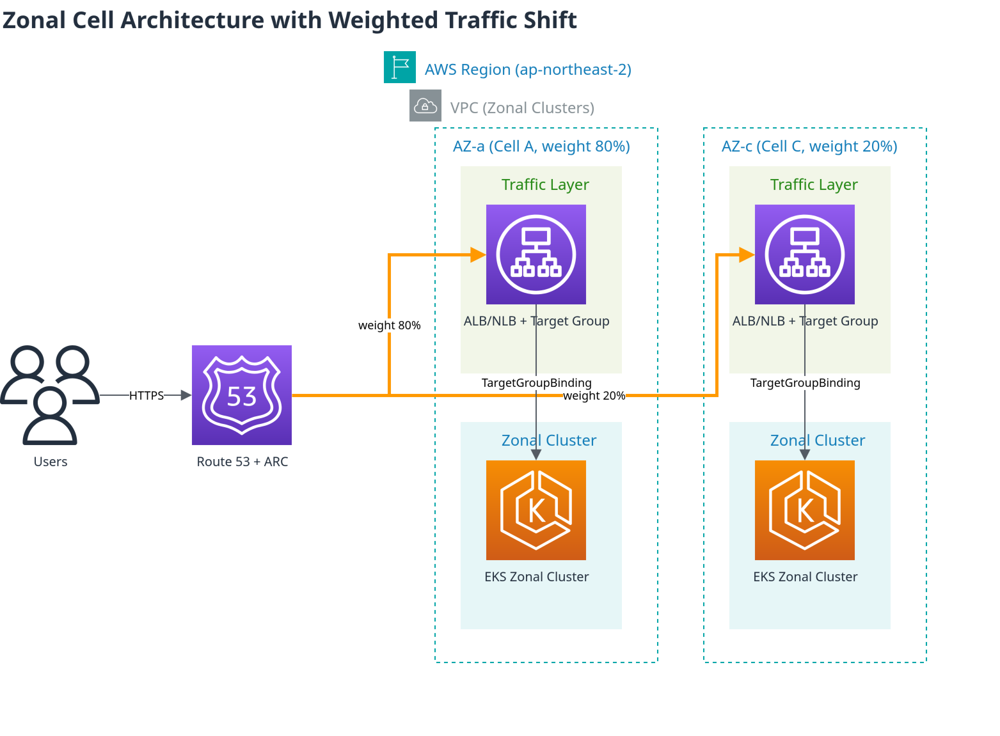
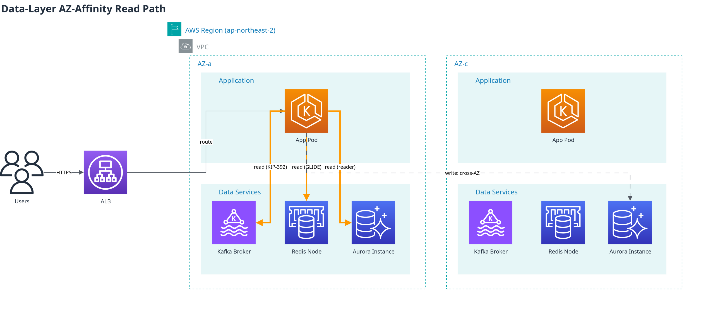
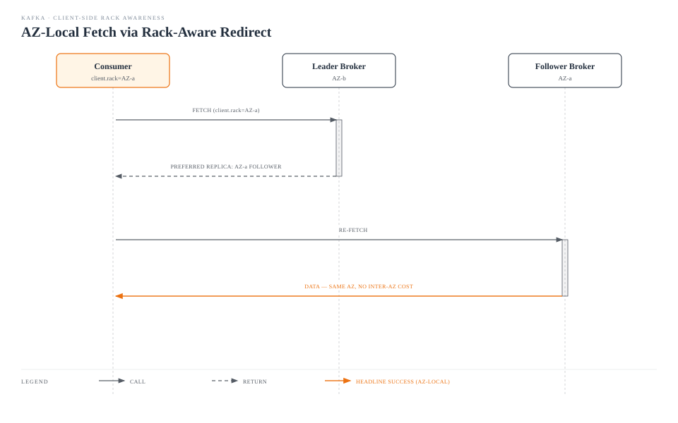

# ゾーンクラスター運用: トラフィックシフト、アップグレードのロールバック、データレイヤーの AZ アフィニティ

> **対応バージョン**: Amazon EKS 1.33+, AWS Load Balancer Controller 2.9+, Kafka 2.4+ (KIP-392), Valkey GLIDE 1.x
> **最終更新**: July 21, 2026

< [前へ: Tekton Pipelines](14-tekton-pipelines.md) | [目次](./README.md) | [次へ: トラブルシューティングプレイブック](16-troubleshooting-playbook.md) >

***

顧客からの質問で最も多いテーマは「運用」です。繰り返し登場する組み合わせがあります。**障害を分離するためにクラスターをゾーンごとに分割し、ロードバランサーのターゲットグループの重みでトラフィックをシフトし、問題が発生した場合は新しいクラスターを立ち上げるのではなくその場でロールバックする。** 本ガイドでは、この組み合わせを単一の運用戦略としてまとめ、通常は欠けている要素、すなわち **DB/cache/messaging レイヤーの読み取りパスをゾーンに固定すること** を追加します。

各要素の詳細な手順は、このリポジトリ内の別の場所にすでにあります。本ドキュメントでは、これらを組み合わせて使用する理由を説明し、これまで存在しなかったデータレイヤーの不足部分を補います。

## 目次

1. [ゾーン運用を行う理由](#why-zonal-operations)
2. [トラフィックレイヤー: Target Group + TargetGroupBinding + 重みのシフト](#traffic-layer-target-group--targetgroupbinding--weight-shifting)
3. [アップグレード: インプレース + ネイティブロールバックが標準になった理由](#upgrades-why-in-place--native-rollback-became-the-default)
4. [データレイヤー: 読み取りパスをゾーンに固定する](#data-layer-pinning-the-read-path-to-a-zone)
5. [推奨する組み合わせの概要](#recommended-combination-summary)

***

## ゾーン運用を行う理由

マルチ AZ の単一クラスターと、AZ ごとに 1 クラスターのフリート（zonal/single-zone）には、それぞれ異なるトレードオフがあります。

| 観点 | マルチ AZ 単一クラスター | ゾーン（single-zone）クラスター |
|--------|--------------------------|-------------------------------|
| 障害分離 | AZ 障害はクラスターの一部に影響する | AZ 障害はそのゾーンクラスターだけに影響し、残りは影響を受けない |
| クロス AZ コスト | Pod 間トラフィックが AZ 境界をまたぐ（$0.01/GB） | 同一 AZ のトラフィックのみで、AZ 間転送コストなし |
| アップグレード | ローリングアップデートにより、クラスター全体が一度にバージョン移行する | ゾーンごとに順次アップグレードし、他のゾーンは以前のバージョンに留まる |
| 運用の複雑さ | 管理するクラスターは 1 つ | 同期を保つ必要がある N 個のクラスターとトラフィックルーティングレイヤー |

AWS はこの正確なパターンを [Cell-Based Architecture for Amazon EKS Guidance](https://aws.amazon.com/solutions/guidance/cell-based-architecture-for-amazon-eks/) として提供しています。ここでは、1 つのゾーンクラスターが「cell」、Region 内の cell 群が「supercell」です。cell の前にあるルーティングレイヤー（Route 53 weighted routing と Application Recovery Controller）がフェイルオーバーを処理し、各 cell 内の ALB がその内部でトラフィックを分散します。重要な特性は、トラフィックが cell 境界をまたがないことです。そのため、そもそも AZ 間データ転送コストが発生しません。

ゾーン/blue-green アーキテクチャ自体はすでに [`ops/02-infrastructure-advanced.md`](02-infrastructure-advanced.md#1-bluegreen-architecture-overview) で、Multi-AZ/Cell-Based Architecture の成熟度モデルの観点は [`eks/10-eks-resiliency.md`](../eks/10-eks-resiliency.md) で扱っています。本ガイドでは、その上でトラフィックシフト、アップグレード、データ読み取りを 1 つの運用ループに結び付けます。

***

## トラフィックレイヤー: Target Group + TargetGroupBinding + 重みのシフト



複数のゾーンクラスター間でトラフィックを移動するための標準パターン:

1. Terraform などの IaC を使用して、クラスターの**外部**に NLB/ALB と Target Groups を作成します（クラスターが置き換えられてもロードバランサーが存続するようにするためです）。
2. 各ゾーンクラスターの Service を `TargetGroupBinding` CRD でその Target Group にバインドします。
3. クラスター内部には一切変更を加えず、ロードバランサー上の **Target Group の重み**を調整してクラスター間でトラフィックを移動します。

```yaml
apiVersion: elbv2.k8s.aws/v1beta1
kind: TargetGroupBinding
metadata:
  name: zone-a-tgb
  namespace: production
spec:
  targetGroupARN: arn:aws:elasticloadbalancing:ap-northeast-2:ACCOUNT:targetgroup/zone-a-tg/xxxxxxxxxxxx
  serviceRef:
    name: app-service
    port: 80
  targetType: ip
```

```bash
# Adjust weight between target groups in the ALB listener's forward action
aws elbv2 modify-listener \
  --listener-arn "$LISTENER_ARN" \
  --default-actions '[{
    "Type": "forward",
    "ForwardConfig": {
      "TargetGroups": [
        {"TargetGroupArn": "'"$ZONE_A_TG_ARN"'", "Weight": 20},
        {"TargetGroupArn": "'"$ZONE_C_TG_ARN"'", "Weight": 80}
      ]
    }
  }]'
```

TargetGroupBinding の基本/高度/マルチポート構成は [`networking/03-aws-lb-controller.md`](../networking/03-aws-lb-controller.md#targetgroupbinding) で、NLB の重み付き Target Group と Route 53 weighted routing の完全な Terraform セットアップは [`ops/02-infrastructure-advanced.md`](02-infrastructure-advanced.md#2-nlb-weighted-target-groups) で扱っています。

**計画的なシフトと障害起点のシフト**: 重みの調整は、アップグレードやデプロイなどの**計画的な**移行に使用します。AZ 障害のような予期しない状況は、[ARC (Application Recovery Controller) Zonal Shift](../eks/10-eks-resiliency.md#arc-zonal-shift) が検出して自動的にシフトします。この 2 つのメカニズムは競合せず、計画的な役割とリアクティブな役割を分担します。

> **2026 年 7 月の更新**: ARC zonal shift/autoshift は、[EKS Auto Mode クラスターでもサポートされるようになりました](https://aws.amazon.com/about-aws/whats-new/2026/07/eks-auto-mode-arc-zonal-shift)。Auto Mode では設定するフラグも管理する Karpenter バージョンもありません。クラスターで ARC zonal shift を有効にするだけで、シフトが有効になると、障害のある AZ における新規ノードのプロビジョニングと自発的な中断（consolidation/drift）が自動的に停止します。

***

## アップグレード: インプレース + ネイティブロールバックが標準になった理由

2026 年 7 月、Amazon EKS は [ネイティブ Kubernetes バージョンロールバックを GA しました](https://aws.amazon.com/blogs/containers/announcing-amazon-eks-rollback-for-safe-and-reliable-management-of-cluster-upgrades/)。アップグレード後に問題が発生した場合、**7 日以内に、一度に 1 マイナーバージョン**ずつ戻すことができ、Rollback Readiness Insights がロールバック前に API 互換性、kubelet のバージョンスキュー、add-on バージョンを自動的に事前確認します。Auto Mode クラスターでは、ロールバックは control plane だけでなく data plane（worker node）も対象です。ただし、次のセクションのように self-managed node group でゾーンクラスターをインプレースアップグレードする場合、この自動 data-plane ロールバックは適用されません。control plane のみが戻るため、node/AMI/add-on の変更は個別に戻す必要があります。いずれの場合も追加料金はかかりません。

この機能が登場する前は、「新しいバージョンに問題がある場合どうするか」への唯一の答えは、切り替え前に検証できる常設 blue/green クラスターフリートでした。現在では、すでにゾーン（single-zone-per-cluster）構成を運用しているチームには、より軽量な選択肢があります。各ゾーンクラスターをゾーンごとにインプレースでアップグレードし、ネイティブロールバックを安全策として使用する方法です。

| アプローチ | 適切なケース |
|----------|---------------------------|
| **常設 blue/green クラスターフリート** | 切り替え前に完全に分離されたクラスターで実際の本番トラフィックに対して新バージョンを検証する必要がある場合、または node/AMI/add-on の変更を一括で戻す必要がある場合（ネイティブロールバックは control plane のみを戻します） |
| **ゾーン型インプレース + ネイティブロールバック** | アップグレードだけでなく可用性の理由からすでにゾーンクラスターを運用しており、常に完全な 2 つのクラスターフリートを運用するコストを避けたく、即時のクラスター単位フェイルバックではなく約 7 日間のロールバック適格期間を許容できる場合 |
| **Route 53 weighted DNS カットオーバー** | クラスターが完全に異なる Region/account に存在する場合、または NLB レイヤー自体を置き換える必要がある場合 |

実行 runbook（NLB の重みをシフト -> インプレースアップグレード -> 検証 -> 重みを復元、および完全な blue/green フリートが依然として適切なケース）は、すでに [`ops/11-upgrade-operations.md` の「Alternative: Zonal In-Place Upgrade with Native Rollback」](11-upgrade-operations.md#alternative-zonal-in-place-upgrade-with-native-rollback) セクションに記載されているため、ここでは繰り返しません。ロールバックが適格となる正確な条件（ターゲットバージョンで作成したクラスターはロールバックできない、すでに再アップグレードしたクラスターはできないなど）は、[`eks/08-eks-upgrades.md` の Rollback Procedure](../eks/08-eks-upgrades.md#rollback-procedure) を参照してください。

***

## データレイヤー: 読み取りパスをゾーンに固定する

ゾーンアーキテクチャを採用するチームでは、トラフィックシフトとアップグレードがすでに導入されていることがほとんどです。見落とされがちなのは **DB/cache/messaging の読み取りパス**です。アプリケーション Pod は 1 つの AZ 内に完全に配置されていても、通信先の DB reader、cache replica、Kafka broker が AZ 間でラウンドロビンに割り当てられ、請求書が届くまで誰にも気付かない AZ 間コストとレイテンシーが発生します。

基礎となる原則はどこでも同じです。**書き込みは leader/primary に送る必要があるため、いずれにしても AZ をまたぐ可能性があります。一方、読み取りは同一 AZ の replica にルーティングできます。** 読み取りが大半を占めるワークロード（cache、lookup query、consumer）では、それだけで AZ 間コストの大きな割合を削減できます。



これを実現するには、Pod が自身の AZ を認識している必要があります。Kubernetes Downward API はノードのゾーンラベル（`topology.kubernetes.io/zone`）を Pod に直接注入しないため、次のいずれかが必要です。

- **EC2 IMDS lookup**: Pod または sidecar が `http://169.254.169.254/latest/meta-data/placement/availability-zone` を直接呼び出す
- **Admission-time label injection**: Kyverno などの mutating policy がノードの `topology.k8s.aws/zone-id` ラベルを Pod annotation にコピーする。これは AWS が [MSK-on-EKS rack awareness guide](https://aws.amazon.com/blogs/big-data/optimize-traffic-costs-of-amazon-msk-consumers-on-amazon-eks-with-rack-awareness/) で推奨するパターンです。Kyverno policy の記述方法については、このリポジトリの [`security/01-kyverno-policy-management.md`](../security/01-kyverno-policy-management.md) を参照してください
- **組み込みの operator サポート**: Strimzi のような operator は rack-awareness を第一級の機能として扱うため、init-container がカスタム実装なしでこれを処理する

### Kafka: KIP-392 Follower Fetching

[KIP-392](https://cwiki.apache.org/confluence/display/KAFKA/KIP-392:+Allow+consumers+to+fetch+from+closest+replica)（Kafka 2.4+）により、consumer は常に partition leader にアクセスするのではなく、**自身と同じ rack（AZ）内の follower replica**から直接 fetch できます。



- **Broker**: `replica.selector.class=org.apache.kafka.common.replica.RackAwareReplicaSelector` を設定し、すべての broker に `broker.rack`（AZ ID）を付与します
- **Consumer**: 上記のゾーン認識方法のいずれかで取得した consumer 自身の AZ ID に、`client.rack` consumer property を設定します
- **Strimzi を使用する場合**、operator がこれをネイティブにサポートします:

  ```yaml
  apiVersion: kafka.strimzi.io/v1beta2
  kind: Kafka
  spec:
    kafka:
      rack:
        topologyKey: topology.kubernetes.io/zone
      config:
        replica.selector.class: org.apache.kafka.common.replica.RackAwareReplicaSelector
  ```

  `rack.topologyKey` を設定すると、Strimzi は `broker.rack` を自動設定し、init-container 経由で client rack を注入します。
- さらに知っておくべき点として、[KIP-881](https://cwiki.apache.org/confluence/display/KAFKA/KIP-881%3A+Rack-aware+Partition+Assignment+for+Kafka+Consumers) はこれをさらに進め、consumer group 自体の partition assignment を rack-aware にします。

EKS 上での Kafka 運用全般については、[`data-on-eks/kafka/`](../data-on-eks/kafka/README.md) を参照してください。

### Redis/Valkey (ElastiCache): AZ アフィニティ読み取り戦略

[Valkey GLIDE](https://valkey.io/blog/az-affinity-strategy/) client は、`ReadFrom` 設定を通じて 4 つの読み取り戦略をサポートします。

| 戦略 | 動作 |
|----------|----------|
| `PRIMARY` | 常に primary から読み取る（デフォルト、AZ 非依存） |
| `PREFER_REPLICA` | replica 間でラウンドロビンし、障害時にフォールバックする |
| `AZ_AFFINITY` | 同一 AZ の replica を優先し、それ以外の場合にフォールバックする |
| `AZ_AFFINITY_REPLICAS_AND_PRIMARY` | 最初に同一 AZ の replica、次に同一 AZ の primary、最後の手段として他の AZ を使用する |

読み取り負荷の高いワークロード（>99% reads）では、コスト削減と可用性のバランスとして `AZ_AFFINITY_REPLICAS_AND_PRIMARY` を推奨します。

```python
from glide import GlideClient, GlideClientConfiguration, ReadFrom

config = GlideClientConfiguration(
    addresses=[...],
    read_from=ReadFrom.AZ_AFFINITY_REPLICAS_AND_PRIMARY,
    client_az="ap-northeast-2a",  # the pod's AZ, obtained via one of the methods above
)
client = await GlideClient.create(config)
```

実際の事例として、HotelTrader は Valkey GLIDE の AZ-affinity routing を採用した後、AZ 間データ転送コストを 95% 削減し、平均レイテンシーを 49% 改善しました（AZ awareness がない場合、cache request は AZ 間でランダムに分散され、不必要な転送コストが発生していました）。詳細については、[AWS database blog post](https://aws.amazon.com/blogs/database/how-hoteltrader-cut-inter-az-cost-95-and-latency-by-49-with-valkey-glide-on-amazon-elasticache/) を参照してください。

### Aurora/RDS: Reader Endpoint の制限と回避策

Aurora のデフォルト reader endpoint は、**AZ awareness のないラウンドロビン DNS**です。同じ AZ の replica に優先順位はありません。これは機能の欠落というより現在の実際の制約です。オープンな [aws-advanced-jdbc-wrapper#1139](https://github.com/aws/aws-advanced-jdbc-wrapper/issues/1139) issue では、AZ affinity 自体が要望されています。

回避策は 2 つあります。

1. **AZ ごとの custom endpoint**: 特定の AZ にある replica instance を custom endpoint にグループ化し、その AZ のアプリケーショントラフィックをそこに向けます。

   ```bash
   aws rds create-db-cluster-endpoint \
     --db-cluster-identifier my-aurora-cluster \
     --db-cluster-endpoint-identifier reader-az-a \
     --endpoint-type READER \
     --static-members db-instance-az-a-1 db-instance-az-a-2
   ```

2. **AWS Advanced JDBC Wrapper**: read/write splitting と `fastestResponse` reader-selection strategy を提供します。真の AZ affinity ではありませんが、通常は同一 AZ の reader である、最も速く応答する reader を優先します。

真の AZ affinity が必要な場合、上記のオープン issue が解決されるまで、option 1（custom endpoint）が唯一信頼できる方法です。

### 補完的な Kubernetes Service レイヤーの選択肢

アプリケーションレイヤーで Service トラフィック自体を AZ に固定するには、[Topology Aware Routing (GA)](../eks/12-kubernetes-version-roadmap.md) を参照してください。service mesh を実行している場合は、[Istio Zone-Aware Routing](../service-mesh/istio/resilience/03-zone-aware-routing.md) を参照してください。これらを上記のデータレイヤー戦略と組み合わせることで、application から cache/DB/messaging までの読み取りパス全体が AZ 内に留まります。

***

## 推奨する組み合わせの概要

| レイヤー | 2026 年時点の推奨 | 代替/フォールバック |
|-------|--------------------------|------------------------|
| アーキテクチャ | ゾーン（single-zone）クラスター + Cell-Based Architecture | マルチ AZ 単一クラスター（小規模な ops team） |
| トラフィックシフト | Target Group + TargetGroupBinding + 重み調整 | Route 53 weighted DNS（異なる Region/account） |
| 障害対応 | ARC Zonal Shift（自動） | 手動の重み調整 |
| アップグレード | ゾーン型インプレース + EKS ネイティブロールバック（7 日間） | 常設 blue/green クラスターフリート（完全な事前検証が必要な場合） |
| Kafka 読み取り | KIP-392（`client.rack` + `RackAwareReplicaSelector`）、または Strimzi の `rack.topologyKey` | Region 全体へのフォールバックを許可する（ローカル follower がない場合は自動） |
| Cache 読み取り | Valkey GLIDE `AZ_AFFINITY_REPLICAS_AND_PRIMARY` | `PREFER_REPLICA`（AZ awareness が不要な場合） |
| DB 読み取り | Aurora の AZ ごとの custom endpoint | AWS Advanced JDBC Wrapper `fastestResponse` |

推奨するロールアウト順序は **トラフィックシフトレイヤー -> アップグレード/ロールバック -> データ読み取りレイヤー**です。前のレイヤーが導入されていないと、後のレイヤーの効果（特にコスト削減）を測定することが難しいためです。

***

< [前へ: Tekton Pipelines](14-tekton-pipelines.md) | [目次](./README.md) | [次へ: トラブルシューティングプレイブック](16-troubleshooting-playbook.md) >
