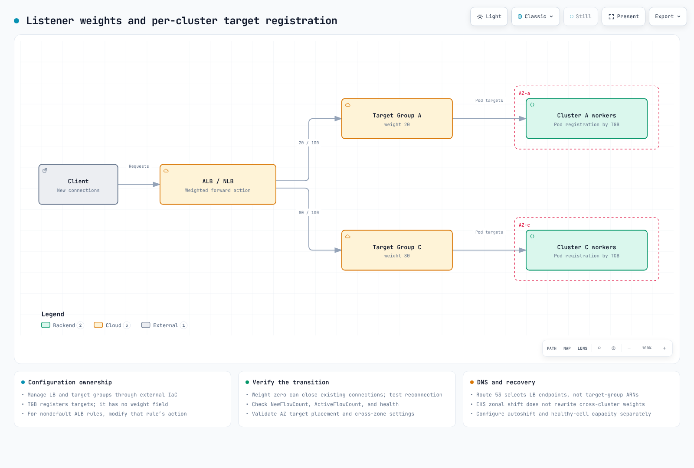

# ゾーン単位のクラスター運用：トラフィック切り替え、アップグレードのロールバック、データ層の AZ アフィニティ

> **レビュー基準**: EKS のロールバックと ARC のドキュメント、Strimzi 1.2.0、Valkey GLIDE 2.5.2、AWS Advanced JDBC Wrapper 4.4.0
> **最終レビュー**: September 11, 2026。設定例は確認しましたが、稼働中クラスターの切り替えや障害実験は実施していません。

< [前へ：Tekton Pipelines](14-tekton-pipelines.md) | [目次](./README.md) | [次へ：トラブルシューティングプレイブック](16-troubleshooting-playbook.md) >

***

このガイドでは、**ワーカーを AZ 内に配置したクラスター間のトラフィック切り替え、条件付きのバージョンロールバック、AZ を考慮したデータ読み取り**を組み合わせます。ゾーン単位のクラスター群は、すべてのチームにとって標準となるアーキテクチャではありません。セルの容量、ルーティング、デプロイ、データ依存関係を独立して運用できる場合に検討してください。

ここで「ゾーン単位」とは、**ワーカーとアプリケーションの配置**を指します。[マネージド EKS コントロールプレーン](https://docs.aws.amazon.com/eks/latest/userguide/eks-architecture.html)は引き続き複数の AZ に分散されます。クラスター全体が一つの AZ 内にあるわけではありません。

## 目次

1. [ゾーン単位で運用する理由](#why-zonal-operations)
2. [トラフィック層：ターゲットグループ + TargetGroupBinding + 重みの切り替え](#traffic-layer-target-group--targetgroupbinding--weight-shifting)
3. [アップグレード：インプレース更新とネイティブロールバックの条件](#upgrades-conditions-for-in-place-and-native-rollback)
4. [データ層：同一 AZ からの読み取りを優先](#data-layer-prefer-same-az-reads)
5. [推奨する組み合わせのまとめ](#recommended-combination-summary)

***

## ゾーン単位で運用する理由 {#why-zonal-operations}

| 観点 | マルチ AZ の単一クラスター | ワーカーをそれぞれ一つの AZ に配置したクラスター群 |
|--------|------------------------|--------------------------------------|
| 障害分離 | 正常な AZ のレプリカと余剰容量で復旧に対応 | セル内の全ワーカーを失う可能性がある。共有データベース、ルーティング、リージョンの依存先は他のセルにも影響し得る |
| クロス AZ コスト | サービスとデータの経路による | ローカルのアプリケーショントラフィックは減らせるが、レプリケーション、共有サービス、LB 転送は引き続き AZ をまたぐ場合がある |
| アップグレード | バージョンスキューを管理しながらコントロールプレーンとノードを段階的に更新 | セルごとの順次アップグレードには、互換性のあるバージョンと残りのセルの容量が必要 |
| 運用の複雑さ | 一つのクラスター | 複数のクラスターとルーティングの調整 |

AWS の [Amazon EKS 向けセルベースアーキテクチャのガイダンス](https://aws.amazon.com/solutions/guidance/cell-based-architecture-for-amazon-eks/)を参照してください。セル間の依存を最小化し、正常なセルが障害セルのトラフィックを引き受けられるように容量を設計します。DNS でセルごとの LB を選ぶ方式と、一つの LB の背後にあるターゲットグループに重みを付ける方式は、異なるルーティング設計です。実際のトラフィック経路と各サービスの課金ルールを使ってコストを測定してください。

関連ガイド：[高度なインフラストラクチャ](02-infrastructure-advanced.md)、[EKS のレジリエンシー](../eks/10-eks-resiliency.md)。

***


## トラフィック層：ターゲットグループ + TargetGroupBinding + 重みの切り替え {#traffic-layer-target-group--targetgroupbinding--weight-shifting}



[🔍 インタラクティブな図を見る](https://www.atomai.click/kubernetes-docs/archmaps/en-ops-15-zonal-operations-guide-0.html)

二つのクラスターで一つの LB を共有する場合：

1. IaC を使って NLB／ALB とターゲットグループをクラスター外で作成し、クラスターの置き換えによって LB が削除されないようにします。
2. `TargetGroupBinding` で各クラスターの Service をそれぞれのターゲットグループに関連付けます。
3. **リスナーの forward アクション**で重みを変更します。TGB 自体に重みのフィールドはありません。ターゲットグループとリスナー設定の管理責任を IaC とコントローラーの間で明確に割り当てます。

TGB の例では、`production` 名前空間、`app-service:80`、対象 VPC 内の IP ターゲットグループ、AWS Load Balancer Controller が既に存在することを前提とします。例の ARN を置き換え、ターゲットの正常性とネットワークアクセスを確認してください。

この例は、**別途インストールした AWS Load Balancer Controller** を使用します。Auto Mode 組み込みの TGB は eks.amazonaws.com/v1 を使用し、[タグとライフサイクルのルール](https://docs.aws.amazon.com/eks/latest/userguide/auto-configure-alb.html)が異なります。AWS のドキュメントでは、その組み込み TGB またはクラスターを削除するとターゲットグループも削除されると説明しています。この所有権モデルを、ここで使う外部管理のターゲットグループと混同しないでください。

```yaml
apiVersion: elbv2.k8s.aws/v1beta1
kind: TargetGroupBinding
metadata:
  name: zone-a-tgb
  namespace: production
spec:
  targetGroupARN: arn:aws:elasticloadbalancing:ap-northeast-2:ACCOUNT:targetgroup/zone-a-tg/xxxxxxxxxxxx
  serviceRef:
    name: app-service
    port: 80
  targetType: ip
```

```bash
set -euo pipefail
# NLB listener whose existing default action forwards to these two groups.
# Nondefault ALB rules require modify-rule, not this operation.
: "${LISTENER_ARN:?}" "${ZONE_A_TG_ARN:?}" "${ZONE_C_TG_ARN:?}"
aws elbv2 describe-listeners \
  --listener-arns "$LISTENER_ARN" \
  --query 'Listeners[0].DefaultActions' --output json > current-actions.json
jq -e --arg a "$ZONE_A_TG_ARN" --arg c "$ZONE_C_TG_ARN" '
  if $a == $c or length != 1 or .[0].Type != "forward"
     or ([.[0].ForwardConfig.TargetGroups[].TargetGroupArn] | sort)
        != ([$a, $c] | sort)
  then error("Expected one forward action with exactly the two selected groups")
  else
    .[0].ForwardConfig.TargetGroups |= map(
      .Weight = (if .TargetGroupArn == $a then 20 else 80 end))
  end
' current-actions.json > proposed-actions.json &&
aws elbv2 modify-listener \
  --listener-arn "$LISTENER_ARN" \
  --default-actions file://proposed-actions.json
```

実行前に、この変更と IaC 計画の整合性を取ってください。通常の NLB の重み変更は**新規フロー**に影響しますが、**重みゼロは別途扱う必要があります**。[現在のユーザーガイド](https://docs.aws.amazon.com/elasticloadbalancing/latest/network/load-balancer-listeners.html)では、ゼロに設定してから間もなく、そのグループは新規接続を受け付けなくなり、既存接続も閉じられると説明しています。既存接続が自然に終了するまで維持されるとは考えず、ゼロに切り替える前にアプリケーションのドレイン、再接続、リトライの動作をテストしてください。[公式ガイド](https://aws.amazon.com/blogs/networking-and-content-delivery/network-load-balancers-now-support-weighted-target-groups/)に従って、ノードを変更する前にターゲットグループごとの `NewFlowCount` と `ActiveFlowCount`、正常性、エラー率、接続ドレインを確認します。ターゲットグループのプロトコル／IP バージョンの互換性とクロスゾーン設定も確認してください。ターゲットがそれぞれ異なる AZ に限定される場合、クロスゾーン負荷分散を無効にすると、意図した重みの分配が実現しないことがあります。

Route 53 の加重レコードが選択するのは**LB の DNS エンドポイント**であり、ターゲットグループ ARN ではありません。TTL、クライアントキャッシュ、長時間接続があるため、DNS の切り替えも即時には完了しません。周辺の設定は [AWS Load Balancer Controller](../networking/03-aws-lb-controller.md)と[高度なインフラストラクチャ](02-infrastructure-advanced.md)を参照してください。

**計画的な切り替えと障害対応：** 重みの変更は計画的な移行を支援しますが、自動障害検出は提供しません。[ARC zonal shift](https://docs.aws.amazon.com/eks/latest/userguide/zone-shift.html)はオペレーターが開始します。**Zonal autoshift** には、別途の有効化、練習、アラーム設定が必要です。EKS リソースのシフトは、そのクラスター内で障害 AZ のエンドポイント／ノードの扱いを変更しますが、別のクラスターのターゲットグループの重みを書き換えるわけではありません。LB リソースのシフトも別途計画してください。

> **EKS Auto Mode のサポート：** [July 2026 のリリース](https://aws.amazon.com/about-aws/whats-new/2026/07/eks-auto-mode-arc-zonal-shift/)以降、クラスターの zonal shift を有効にすると、シフト中の障害 AZ で Auto Mode が新規プロビジョニングと自発的な中断を制限できます。これだけでは autoshift は有効になりません。**ワーカーが存在する唯一の AZ からシフトすると、サービス停止を引き起こす可能性があります。** EKS のシフトには、正常な AZ のレプリカ、CoreDNS、余剰容量が必要です。ワーカーが一つの AZ にあるセルでは、復旧の一部としてセル外部のルーティングが必要です。

***

## アップグレード：インプレース更新とネイティブロールバックの条件 {#upgrades-conditions-for-in-place-and-native-rollback}

July 2026 に導入された [EKS のネイティブバージョンロールバック](https://docs.aws.amazon.com/eks/latest/userguide/rollback-cluster.html)は、**アップグレード完了後七日以内に開始した場合、直前のマイナーバージョンに戻せます**。七日間は利用資格の期間であり、復旧時間の保証ではありません。作成時のバージョン、サポート状態、その後のアップグレード、機能の互換性、Rollback Readiness Insights を確認してください。

- **Auto Mode：** EKS は Auto Mode ノードを先に、その後コントロールプレーンをロールバックします。PDB と NodePool の中断予算は引き続き適用されます。ロールバックは即時ではありません。
- **マネージドノードグループ：** `UpdateNodegroupVersion` で別途ロールバックします。セルフマネージドノードと Hybrid ノードはオペレーターが別途準備します。ノードはコントロールプレーンより新しいバージョンで動作してはいけません。
- **アドオン、データ、アプリケーション：** ロールバックは、アドオンのバージョン、etcd データ、永続ボリュームのデータ、アプリケーションの変更を復元しません。互換性とデータ移行の復旧は独立して計画してください。
- **`--force`：** readiness insights はバイパスできますが、利用資格の前提条件や Auto Mode の中断制御はバイパスできません。問題を解消してから通常のロールバック手順に従ってください。

ロールバック機能自体に追加料金はありませんが、既存のクラスター、コンピューティング、トラフィックの料金は引き続き発生します。残りのセルの容量と復旧目標を検証したうえで、インプレース更新かブルー／グリーンかを選択してください。

| 方式 | 適する条件 |
|----------|------------------------|
| **ブルー／グリーンクラスター** | 別環境で検証し、旧環境へトラフィックを戻せる状態を維持する。共有データの変更には独立した復旧計画が必要 |
| **ゾーン単位のインプレース更新 + ネイティブロールバック** | 既存セル群がトラフィックを引き受けられ、利用資格、互換性、復旧時間がテスト済み |
| **Route 53 の加重 DNS 切り替え** | クロスリージョン／アカウント構成などで LB エンドポイントが異なり、DNS キャッシュと正常性の動作を考慮している |

運用の順序は、**残りのセルの容量を確認 → 重みを切り替え → 接続ドレインを確認 → アップグレード → 検証 → 重みを復元**です。詳しい手順とノード固有の条件は、[アップグレード運用](11-upgrade-operations.md)と [EKS のアップグレード](../eks/08-eks-upgrades.md)を参照してください。

***

## データ層：同一 AZ からの読み取りを優先 {#data-layer-prefer-same-az-reads}

同じ AZ に適切なレプリカがあり、アプリケーションがその整合性の動作を許容できる場合は、ローカル読み取りを優先します。書き込み、レプリケーション、初期メタデータ要求、障害時のフォールバックは引き続き AZ をまたぐことがあります。レプリケーション遅延、エラー、実際の接続先、転送量を併せて測定してください。


[🔍 インタラクティブな図を見る](https://www.atomai.click/kubernetes-docs/archmaps/en-ops-15-zonal-operations-guide-1.html)

まず Pod の AZ を特定してください。Downward API は Pod のフィールドを公開しますが、ノードラベルを直接問い合わせるわけではありません。

- **ノードメタデータの注入：** 通常の Pod 作成時のアドミッションはスケジューリング前に行われるため、配置先ノードはまだ不明です。[AWS MSK ガイド](https://aws.amazon.com/blogs/big-data/optimize-traffic-costs-of-amazon-msk-consumers-on-amazon-eks-with-rack-awareness/)では、**`Pod/binding` リクエスト**を処理し、選択されたノードを読み取って AZ ID を注入します。Kyverno の binding リクエストフィルター、ノード読み取り RBAC、Pod 起動前の処理完了を一体として設定してください。
- **スケジューリング後の参照：** Downward API で `spec.nodeName` を公開し、信頼できる初期化コンポーネントでノードラベルを読み取ります。すべてのアプリケーションに広範なノード読み取り権限を付与しないでください。
- **EC2 IMDSv2：** EC2 メタデータアクセスを意図的に許可している場合は、配置情報を読む前にトークンを取得します。IMDSv1 の GET が使えると考えたり、メタデータ制限を無差別に外したりしないでください。これは Fargate に直接適用できる方法ではありません。
- **Operator のサポート：** Strimzi は管理対象ブローカーと対応するクライアントリソースのラックアウェアネスを設定します。無関係のアプリケーション Deployment の `client.rack` を自動設定するわけではありません。

**AZ 名と AZ ID を混同しないでください。** Kafka の `broker.rack` と `client.rack` は一致する文字列を使用する必要があります。MSK が AZ ID を使う場合、`ap-northeast-2a` のような名前に置き換えないでください。GLIDE の `client_az` も、サーバーが報告する AZ 値と一致させる必要があります。

### Kafka：KIP-392 によるフォロワーからの読み取り

Kafka 2.4 で導入された [KIP-392](https://cwiki.apache.org/confluence/display/KAFKA/KIP-392:+Allow+consumers+to+fetch+from+closest+replica)は、コンシューマーが同じラックのレプリカから読み取ることを可能にします。これは機能が導入されたバージョンであり、現在 Kafka 2.4 をデプロイすることを推奨するものではありません。


[🔍 インタラクティブな図を見る](https://www.atomai.click/kubernetes-docs/archmaps/en-ops-15-zonal-operations-guide-10.html)

- **ブローカー：** `replica.selector.class=org.apache.kafka.common.replica.RackAwareReplicaSelector` と `broker.rack` を設定します。
- **コンシューマー：** `client.rack` にコンシューマーのラックを設定します。適切なローカルレプリカがない場合は、リーダーにフォールバックします。
- **Strimzi 1.2.0：** 以下は**既存の Kafka CR にマージする設定抜粋**であり、完全なデプロイではありません。KafkaNodePool、リスナー、ストレージ、その他の設定も必要です。Strimzi 1.0 以降、CR API は `v1` です。ラックの種類も指定してください。

```yaml
apiVersion: kafka.strimzi.io/v1
kind: Kafka
metadata:
  name: my-cluster
spec:
  kafka:
    rack:
      type: topology-label
      topologyKey: topology.kubernetes.io/zone
    config:
      replica.selector.class: org.apache.kafka.common.replica.RackAwareReplicaSelector
```

これによりブローカーの `broker.rack` が設定されます。通常のアプリケーションコンシューマーの `client.rack` は別途設定してください。KafkaConnect、MirrorMaker 2、Bridge には、それぞれ CR のラック設定があります。[Strimzi ドキュメント](https://strimzi.io/docs/operators/1.2.0/configuring.html)に従ってブローカーの配置も分散させてください。フォロワーからの読み取りは、レプリケーション遅延によって読み取りレイテンシーが増加することがあります。

[KIP-881](https://cwiki.apache.org/confluence/display/KAFKA/KIP-881%3A+Rack-aware+Partition+Assignment+for+Kafka+Consumers)はラックを考慮したパーティション割り当てに関するもので、別の仕組みです。コンシューマーのバージョンと assignor のサポートを確認してください。デプロイ方法は [EKS 上の Kafka](../data-on-eks/kafka/README.md)を参照してください。

### Redis／Valkey（ElastiCache）：AZ アフィニティの読み取り戦略

以下は、本章で扱う主要な [Valkey GLIDE](https://valkey.io/blog/az-affinity-strategy/) の `ReadFrom` 選択肢です。GLIDE 2.5.2 には `ALL_NODES` もあり、この表は列挙値の全一覧ではありません。

| 戦略 | 動作 |
|----------|----------|
| `PRIMARY` | プライマリから読み取る（デフォルト） |
| `PREFER_REPLICA` | レプリカ間でラウンドロビンし、利用可能なレプリカがなければプライマリを使う |
| `AZ_AFFINITY` | ローカルレプリカを優先し、その後は他のレプリカまたはプライマリを使う |
| `AZ_AFFINITY_REPLICAS_AND_PRIMARY` | ローカルレプリカ → ローカルプライマリ → 他の AZ のレプリカまたはプライマリ |

アプリケーションが古いデータを許容できる場合にレプリカ読み取りを検討してください。読み取りの割合だけで戦略は決まりません。サーバーの AZ メタデータのサポート／設定、プライマリ負荷、フォールバックを確認します。**データの最新性や書き込み直後の読み取り**を必要とするリクエストは別途設計し、データモデルに適する場合はプライマリ読み取りを使うなどの方法を検討してください。

この `valkey-glide==2.5.2` の例は、接続を開かずに**クラスターモード用の設定を作成**します。TLS を有効にしており、認証が必要な場合は `credentials` を指定してください。クラスターモードを無効にする場合は、代わりに `GlideClientConfiguration` と `GlideClient` を使用します。

```python
from glide import GlideClusterClientConfiguration, NodeAddress, ReadFrom


def cache_config(host: str, client_az: str, credentials=None):
    if not host or not client_az:
        raise ValueError("Cache endpoint and client AZ are required")
    return GlideClusterClientConfiguration(
        addresses=[NodeAddress(host, 6379)],
        use_tls=True,
        credentials=credentials,
        read_from=ReadFrom.AZ_AFFINITY_REPLICAS_AND_PRIMARY,
        client_az=client_az,
    )
```

[HotelTrader の事例](https://aws.amazon.com/blogs/database/how-hoteltrader-cut-inter-az-cost-95-and-latency-by-49-with-valkey-glide-on-amazon-elasticache/)では、**AZ を考慮したルーティングとリクエストのバッチ処理の両方**を導入した後、クロス AZ 転送コストが 95%、平均レイテンシーが 49% 低下したと報告されています。これは当該 ECS／ElastiCache ワークロードの結果であり、ルーティングオプションだけの効果を保証するものではありません。

### Aurora／RDS：リーダーエンドポイントの制約と代替策

Aurora の[デフォルトのリーダーエンドポイント](https://docs.aws.amazon.com/AmazonRDS/latest/AuroraUserGuide/Aurora.Endpoints.Reader.html)は、リードレプリカ間で**接続**を分散します。AZ の優先やクエリ単位の分散は保証しません。レプリカがない場合はライターに接続することがあります。DNS の変更だけでは、プール内の既存接続は別のインスタンスへ移動しません。

1. **AZ ごとのカスタムエンドポイント：** AZ とリーダーの役割を確認してから、インスタンス ID を明示的に選択します。この作成例の名前を実際のリソースに置き換えてください。

   ```bash
   aws rds create-db-cluster-endpoint \
     --db-cluster-identifier my-aurora-cluster \
     --db-cluster-endpoint-identifier reader-az-a \
     --endpoint-type READER \
     --static-members db-instance-az-a-1 db-instance-az-a-2
   ```

   CLI／API は `READER` エンドポイントをサポートします。ライターに昇格したメンバーは除外され、新しいレプリカは静的リストに自動追加されません。[メンバーシップの動作](https://docs.aws.amazon.com/AmazonRDS/latest/AuroraUserGuide/Aurora.Endpoints.Custom.Considerations.html)を確認し、ローカルリーダーがなくなった場合に備えて、アプリケーションのフォールバック先エンドポイントまたは明確な障害時ポリシーを用意してください。

2. **AWS Advanced JDBC Wrapper 4.4.0：** [`fastestResponse`](https://github.com/aws/aws-advanced-jdbc-wrapper/blob/4.4.0/docs/using-the-jdbc-driver/HostSelectionStrategies.md)は測定した応答時間でホストを選択します。`fastestResponseStrategy` プラグインも読み込んでください。これは AZ ラベルによる制約ではなく、最速のホストがローカルである保証はありません。

[Issue #1139](https://github.com/aws/aws-advanced-jdbc-wrapper/issues/1139)は、2.5.5 の応答時間機能が要望を満たすという議論を経て、**May 2025 にクローズ**されました。カスタムエンドポイントだけが解決策であることを示す未解決の機能要求ではありません。

### 補完的な Kubernetes Service 層の選択肢

[Topology Aware Routing](https://kubernetes.io/docs/concepts/services-networking/topology-aware-routing/)と [Istio のゾーン対応ルーティング](../service-mesh/istio/resilience/03-zone-aware-routing.md)は、Service エンドポイントの選択を補完します。ローカルエンドポイントの不足、正常性の変化、設定によって、トラフィックが他の AZ に送られる場合があります。外部 DB／キャッシュ／Kafka への接続を自動制御するものではありません。優先設定は、読み取り経路全体が一つの AZ 内に留まることの保証ではありません。

***

## 推奨する組み合わせのまとめ {#recommended-combination-summary}

| 層 | 選択基準 | 代替策／フォールバック |
|-------|--------------------|----------------------|
| アーキテクチャ | 独立したセル運用と正常セルの容量 | マルチ AZ の単一クラスターも引き続き有効な選択肢 |
| トラフィック切り替え | LB の forward アクションの重みと TGB のターゲット登録 | Route 53 は LB エンドポイントを選択 |
| 障害対応 | 手動の zonal shift／別途有効化する autoshift | 単一 AZ のワーカーセルにはセル外部のルーティングが必要 |
| アップグレード | テスト済みの利用資格、互換性、復旧時間 | ブルー／グリーン。データ復旧は別途対応 |
| Kafka 読み取り | ブローカーのセレクターと一致するコンシューマーラック | 適切なローカルレプリカがない場合はリーダー |
| キャッシュ読み取り | データの最新性と AZ メタデータに合う GLIDE 戦略 | リモートへのフォールバックとプライマリ負荷を確認 |
| DB 読み取り | 保守されたローカルリーダーリスト、または応答時間による選択 | ローカルリーダーの不在と再接続に対応 |

負荷、コスト、復旧時間の基準値を測定し、本番環境外でトラフィック切り替えとロールバックを練習してください。読み取り経路の最適化は独立して導入することもできます。小さな範囲で整合性、フォールバック、コストを検証してから拡大してください。

***

< [前へ：Tekton Pipelines](14-tekton-pipelines.md) | [目次](./README.md) | [次へ：トラブルシューティングプレイブック](16-troubleshooting-playbook.md) >
