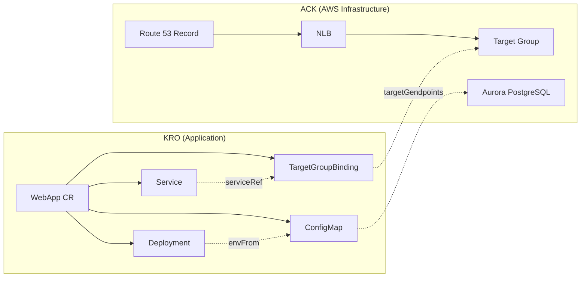

# ExampleCorp Order System: ACK + KRO 統合デプロイ

> **最終更新**: February 21, 2026

## シナリオ概要

ExampleCorp の Order API を Kubernetes にデプロイするエンドツーエンドの例です。ACK は AWS インフラストラクチャ (NLB、Aurora PostgreSQL、Route 53) をプロビジョニングし、KRO はアプリケーションリソース (Deployment、Service、TargetGroupBinding、ConfigMap) を単一の Custom Resource として管理します。

```
ACK (AWS Infrastructure)    KRO (App Deployment)
─────────────────────     ─────────────────────
NLB + TargetGroup    ←──  TargetGroupBinding
Aurora PostgreSQL    ←──  ConfigMap (endpoints)
Route 53 Record           Deployment + Service
```

ACK は [ACK ドキュメント](./02-ack.md) で説明されている ELBv2、Route 53、RDS controllers を使用してインフラストラクチャを作成し、KRO はこのインフラストラクチャを参照するアプリケーションリソースを単一の CR として管理します。

## アーキテクチャ図



## ステップ 1: ACK によるインフラストラクチャのプロビジョニング

ACK controllers (elbv2、route53、rds) を使用して、次のインフラストラクチャをプロビジョニングします。各リソースの詳細な YAML については、[ACK リソース例](./ack/03-elbv2-route53-rds.md) を参照してください。

- **NLB + TargetGroup + Listener**: アプリケーショントラフィックの受け口
- **Route 53 DNS Record**: `app.example.com` → NLB マッピング
- **Aurora PostgreSQL**: DBSubnetGroup + DBCluster + Writer + 2 Readers + Custom Endpoint

## ステップ 2: KRO ResourceGraphDefinition

```yaml
apiVersion: kro.run/v1alpha1
kind: ResourceGraphDefinition
metadata:
  name: webapp-graph
spec:
  resourceKind:
    group: kro.example.com
    kind: WebApp
    version: v1
  childResources:
    # 1. ConfigMap — Aurora connection info
    - apiVersion: v1
      kind: ConfigMap
      nameTemplate: "{{.parent.metadata.name}}-db-config"
      template: |
        data:
          DB_WRITER_HOST: "{{.parent.spec.aurora.writerEndpoint}}"
          DB_READER_HOST: "{{.parent.spec.aurora.readerEndpoint}}"
          DB_PORT: "{{.parent.spec.aurora.port}}"
          DB_NAME: "{{.parent.spec.aurora.dbName}}"

    # 2. Deployment — App container
    - apiVersion: apps/v1
      kind: Deployment
      nameTemplate: "{{.parent.metadata.name}}"
      template: |
        spec:
          replicas: {{.parent.spec.replicas}}
          selector:
            matchLabels:
              app: {{.parent.spec.appName}}
          template:
            metadata:
              labels:
                app: {{.parent.spec.appName}}
            spec:
              containers:
              - name: {{.parent.spec.appName}}
                image: {{.parent.spec.image}}
                ports:
                - containerPort: {{.parent.spec.port}}
                envFrom:
                - configMapRef:
                    name: {{.children.configmap.metadata.name}}

    # 3. Service — ClusterIP
    - apiVersion: v1
      kind: Service
      nameTemplate: "{{.parent.metadata.name}}"
      template: |
        spec:
          selector:
            app: {{.parent.spec.appName}}
          ports:
          - port: {{.parent.spec.port}}
            targetPort: {{.parent.spec.port}}
          type: ClusterIP

    # 4. TargetGroupBinding — ACK Target Group connection
    - apiVersion: elbv2.k8s.aws/v1beta1
      kind: TargetGroupBinding
      nameTemplate: "{{.parent.metadata.name}}-tgb"
      template: |
        spec:
          targetGroupARN: {{.parent.spec.targetGroupARN}}
          serviceRef:
            name: {{.children.service.metadata.name}}
            port: {{.parent.spec.port}}
          targetType: ip

  statusMappings:
    - childResource:
        kind: Deployment
        name: "{{.parent.metadata.name}}"
      conditions:
        - type: Available
          mapping:
            type: Ready
    - childResource:
        kind: Service
        name: "{{.parent.metadata.name}}"
      fieldMappings:
        - child: "spec.clusterIP"
          parent: "status.serviceIP"
```

### 入力フィールドの説明

| フィールド | 説明 |
|-------|-------------|
| `appName` | アプリケーション名 (labels、selectors で使用) |
| `image` | Container image URI |
| `replicas` | Deployment replica 数 |
| `port` | Container と service のポート |
| `targetGroupARN` | ACK によって作成された Target Group ARN |
| `aurora.writerEndpoint` | ACK DBCluster Writer endpoint |
| `aurora.readerEndpoint` | ACK DBCluster Reader endpoint |
| `aurora.port` | Aurora port (default 5432) |
| `aurora.dbName` | Database name |

## ステップ 3: アプリケーションのデプロイ

```yaml
apiVersion: kro.example.com/v1
kind: WebApp
metadata:
  name: order-api
  namespace: production
spec:
  appName: order-api
  image: 123456789012.dkr.ecr.ap-northeast-2.amazonaws.com/order-api:v1.2.0
  replicas: 3
  port: 8080
  targetGroupARN: <ACK TargetGroup's .status.targetGroupARN>
  aurora:
    writerEndpoint: <ACK DBCluster's .status.endpoint>
    readerEndpoint: <ACK DBCluster's .status.readerEndpoint>
    port: "5432"
    dbName: orders
```

ACK によって作成されたインフラストラクチャの出力値 (Target Group ARN、Aurora endpoints) を KRO CR spec に注入します。

## ステップ 4: 検証

```bash
# Check WebApp CR status
kubectl get webapp order-api -n production -o yaml

# Check created resources
kubectl get deploy,svc,targetgroupbinding,configmap -n production -l app=order-api
```

## 運用パターン

### 新しい Services の追加

新しい WebApp CR を追加するだけで、既存のインフラストラクチャを再利用できます。

```yaml
apiVersion: kro.example.com/v1
kind: WebApp
metadata:
  name: payment-api
  namespace: production
spec:
  appName: payment-api
  image: 123456789012.dkr.ecr.ap-northeast-2.amazonaws.com/payment-api:v1.0.0
  replicas: 2
  port: 8080
  targetGroupARN: <new Target Group ARN>
  aurora:
    writerEndpoint: <existing Aurora Writer Endpoint>
    readerEndpoint: <existing Aurora Reader Endpoint>
    port: "5432"
    dbName: payments
```

### Aurora のスケーリング

Read Replicas を水平スケールするために ACK DBInstances を追加します。

```yaml
apiVersion: rds.services.k8s.aws/v1alpha1
kind: DBInstance
metadata:
  name: my-aurora-reader-3
  namespace: infra
spec:
  dbInstanceIdentifier: my-aurora-reader-3
  dbClusterIdentifier: my-aurora-cluster
  dbInstanceClass: db.r6g.xlarge
  engine: aurora-postgresql
```

### Blue/Green Deployment

KRO CR を置き換えることで、ゼロダウンタイムデプロイを実行します。新しいバージョンの CR を適用すると、KRO が Deployment を自動的に更新します。

## 参考ドキュメント

- [ACK のコンセプトとインストール](./02-ack.md)
- [ACK リソース例: ELBv2、Route 53、RDS](./ack/03-elbv2-route53-rds.md)
- [KRO のコンセプトと RGD](./03-kro.md)
