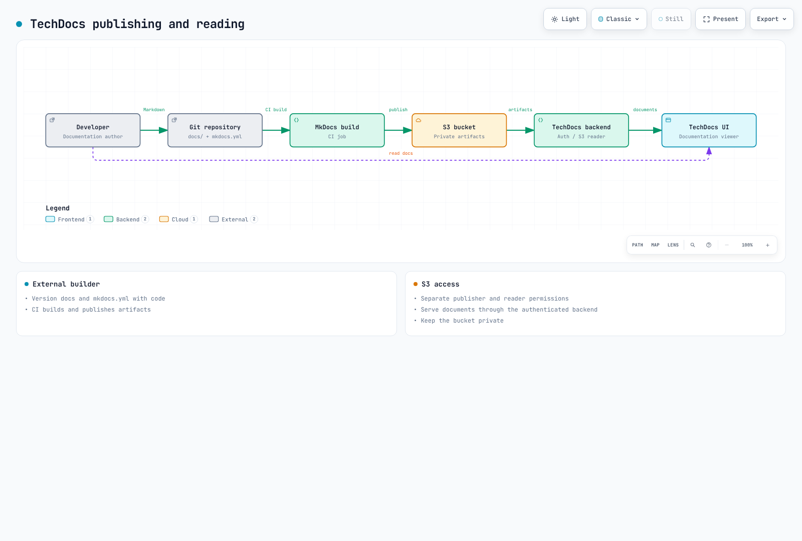

# Internal Developer Portal としての Backstage

> **最終更新**: September 12, 2026 · Backstage 1.54.7 / Helm chart 2.10.0

## 役割と導入範囲

Backstage は Spotify で生まれた Apache 2.0 ライセンスのオープンソース開発者ポータルフレームワークです。CNCF では Incubating として掲載されています。ポータルは IDP のユーザー向け部分になり得ますが、すべてのインフラストラクチャ、デリバリー、ポリシー、運用自動化を置き換えるものではありません。

Software Catalog は所有者、API、リソース間の関係をモデル化します。Software Templates は準備済みの skeleton に対して設定済みのアクションを実行します。TechDocs はドキュメントのビルド、公開、閲覧を扱います。Search には設定済みの collator とインデックスバックエンドが必要です。コードとドキュメントを同じ場所に配置しても、コンテンツが自動的に最新の状態に保たれるわけではありません。

Port、Cortex、Humanitec、OpsLevel、その他の製品を比較する際は、現在のホスティング、データ境界、拡張 API、人員/サブスクリプション/インフラストラクチャのコストを評価してください。未検証の plugin/導入数、普遍的なランキング、または Backstage のコストがインフラストラクチャのみであるという主張は避けてください。ライセンス条件と運用コストは別の論点です。

## アーキテクチャと Plugins

React frontend と Node.js backend は、catalog、scaffolder、auth、TechDocs plugin を構成します。必要な module をインストールして登録してください。Plugin が本質的に独立したデプロイまたはセキュリティ分離を提供するわけではありません。選択したアプリケーションアーキテクチャに応じて、従来の EntityPage または新しい frontend extension API を使用してください。


[インタラクティブ図](https://www.atomai.click/kubernetes-docs/archmaps/en-platform-engineering-06-backstage-idp-0.html)

## アプリケーション作成、ビルド、バージョン

Backstage のリリース、個別の npm package バージョン、Helm chart バージョン、カスタム image リビジョンは別々の値です。リリース 1.54.7 には Node.js 22 または 24 が必要です。以前の Node 20 Dockerfile は現在のデフォルトではありません。

検査した create-app package は 0.9.1 です。生成後に lockfile、packageManager、frontend/backend 構造を確認してください。以下のコマンドはアプリケーションのビルドフローを説明するものです。この監査では完全な Backstage application はビルドしていません。

```bash
npx @backstage/create-app@0.9.1
# In the generated app, using its supported Node/Yarn versions:
yarn install --immutable
yarn tsc
yarn build:backend
```

生成された packages/backend/Dockerfile を確認してください。現在の template は skeleton.tar.gz を展開し、production dependency をインストールし、bundle.tar.gz を展開して packages/backend を実行します。単に dist をコピーして node packages/backend/dist を実行する方法は、その bundle format と一致しません。

host/container の Node major と native-module ABI を一致させ、OS/architecture image を検証してください。image の node user と競合する、UID 1000 の 2 番目の user を作成しないでください。ECR/push 権限と image digest は別途準備してください。credential を image、build argument、environment variable に埋め込まないでください。外部 TechDocs build を使用する場合、reader image でドキュメントビルド toolchain を実行する必要はありません。

## Credential File を使用する EKS 設定

以下は設定例です。example.invalid と、承認済みの organization、bucket、OIDC client の値を置き換えてください。これは PostgreSQL、identity provider、GitHub、S3 への接続の証拠ではありません。

承認された provider/ESO フローを通じて backstage-credentials を準備し、file として mount してください。Backstage の実際の loader は `$file` を解決し、末尾の改行を削除します。config/mount path を一致させ、各 plugin がローテーションされた値をいつ再読み込みするか検証してください。SubPath mount と起動時のみの設定では rollout が必要になることがあります。

この例では、1 つの PostgreSQL database を plugin schema に分割しています。ensureExists/ensureSchemaExists は無効化されており、schema/database を準備する必要があります。同じ credential 経由でアクセスする schema は独立したセキュリティ境界ではありません。migration 権限を確認し、**plugins × replicas** 全体の pool connection を集計してください。RDS CA を検証し、TLS verification を有効なままにしてください。

```yaml
app:
  title: Example Developer Portal
  baseUrl: https://backstage.example.com
backend:
  baseUrl: https://backstage.example.com
  listen:
    port: 7007
  cors:
    origin: https://backstage.example.com
    credentials: true
  database:
    client: pg
    pluginDivisionMode: schema
    ensureExists: false
    ensureSchemaExists: false
    connection:
      host: backstage-db.example.invalid
      port: 5432
      database: backstage
      user: backstage
      password:
        $file: /var/run/backstage-secrets/postgres-password
      ssl:
        rejectUnauthorized: true
        ca:
          $file: /var/run/backstage-public/rds-ca.pem
    knexConfig:
      pool:
        min: 0
        max: 10
  auditor:
    severityLogLevelMappings:
      low: debug
      medium: info
      high: warn
      critical: error
auth:
  environment: production
  session:
    secret:
      $file: /var/run/backstage-secrets/auth-session-secret
  providers:
    oidc:
      production:
        metadataUrl: https://issuer.example.invalid/.well-known/openid-configuration
        clientId: replace-with-approved-client-id
        clientSecret:
          $file: /var/run/backstage-secrets/oidc-client-secret
        additionalScopes: [profile, email]
        signIn:
          resolvers:
            - resolver: emailMatchingUserEntityProfileEmail
permission:
  enabled: true
integrations:
  github:
    - host: github.com
      token:
        $file: /var/run/backstage-secrets/github-token
catalog:
  providers:
    github:
      approvedOrg:
        organization: replace-approved-org
        catalogPath: /catalog-info.yaml
        filters:
          branch: main
          repository: "^approved-.*$"
        schedule:
          frequency: {minutes: 30}
          timeout: {minutes: 3}
  rules:
    - allow: [Component, API, Resource, System, Domain, Group, User, Template, Location]
techdocs:
  builder: external
  publisher:
    type: awsS3
    awsS3:
      bucketName: replace-approved-techdocs-bucket
      region: us-west-2
```

backend は RDS IAM authentication もサポートしていますが、signer package、rds-db:connect、database-user の設定、TLS が必要です。このフローを password-file の例と自動的に混在させないでください。

## Helm 設定と HA

設定済みの Backstage application を含む image をビルドしてください。以下の example.invalid image はプレースホルダーです。最初に ServiceAccount、credential Secret、RDS CA ConfigMap、app-config ConfigMap を準備してください。デフォルトでは public ingress は作成されません。承認済みの内部アクセスまたは CloudFront-fronted access、authentication、TLS、network control は引き続き運用要件です。

```yaml
fullnameOverride: backstage
backstage:
  image:
    registry: example.invalid
    repository: backstage
    tag: replace-with-reviewed-app-revision
  replicas: 3
  resources:
    requests:
      cpu: 250m
      memory: 512Mi
    limits:
      cpu: "1"
      memory: 1Gi
  extraEnvVarsSecrets: []
  extraAppConfig:
    - filename: app-config.production.yaml
      configMapRef: backstage-app-config
  extraVolumeMounts:
    - name: credentials
      mountPath: /var/run/backstage-secrets
      readOnly: true
    - name: public-config
      mountPath: /var/run/backstage-public
      readOnly: true
  extraVolumes:
    - name: credentials
      secret:
        secretName: backstage-credentials
    - name: public-config
      configMap:
        name: backstage-public-config
  readinessProbe:
    httpGet:
      path: /.backstage/health/v1/readiness
      port: 7007
  livenessProbe:
    httpGet:
      path: /.backstage/health/v1/liveness
      port: 7007
  strategy:
    type: RollingUpdate
    rollingUpdate:
      maxUnavailable: 0
      maxSurge: 1
serviceAccount:
  create: false
  name: backstage
  automountServiceAccountToken: false
postgresql:
  enabled: false
ingress:
  enabled: false
```

examples/platform/backstage/app-config-configmap.yaml は、その設定を data.app-config.production.yaml の下に保存します。これは extraAppConfig の filename/configMapRef と一致し、secret value ではなく file reference を含みます。

```bash
helm template backstage backstage/backstage   --version 2.10.0 --namespace backstage   -f examples/platform/backstage/helm-values.yaml
```

最初に公式の backstage.github.io/charts repository を登録してください。この監査ではその chart をローカルでダウンロードして render しました。serviceAccount はトップレベルの chart value であり、backstage.serviceAccount ではありません。以前の backstage.podDisruptionBudget value は chart 2.10.0 では PDB を作成しません。この resource は別途準備してください。

```yaml
apiVersion: policy/v1
kind: PodDisruptionBudget
metadata:
  name: backstage
  namespace: backstage
spec:
  minAvailable: 2
  selector:
    matchLabels:
      app.kubernetes.io/name: backstage
      app.kubernetes.io/instance: backstage
```

現在の health path は /.backstage/health/v1/readiness と liveness です。load-balancer health check を実際の backend に一致させてください。3 つの replica または PDB だけでは、AZ 分散、database HA、zero downtime は保証されません。topology rule、共有 database/session state、background task、upgrade migration を検証してください。

## OIDC Sign-In と Identity

OIDC backend provider module を登録し、frontend sign-in を設定してください。metadataUrl は、選択した Cognito pool または Okta issuer に対する信頼済み issuer discovery を識別する必要があります。現在の provider は追加 scope に additionalScopes を使用します。

emailMatchingUserEntityProfileEmail は catalog-user resolver の例です。issuer/email verification、enrollment boundary、重複 email を確認してください。任意の外部 claim を catalog administrator にマッピングしないでください。dangerouslyAllowSignInWithoutUserInCatalog は無効のままにしてください。同じ provider ID の下で、組み込み provider と custom resolver module の両方を登録することは避けてください。

## Software Catalog

これら 8 つの entity は、解決可能な owner/system/domain reference を持つ 7 種類をカバーしています。Resource dependency は Component.dependsOn で宣言してください。独自に作った dependencyOf field が backend relation を自動作成すると想定しないでください。Resource entity を登録しても AWS infrastructure はプロビジョニングされません。


[インタラクティブ図](https://www.atomai.click/kubernetes-docs/archmaps/en-platform-engineering-06-backstage-idp-1.html)

```yaml
apiVersion: backstage.io/v1alpha1
kind: Domain
metadata:
  name: commerce
spec:
  owner: group:default/platform-team
---
apiVersion: backstage.io/v1alpha1
kind: System
metadata:
  name: order-system
spec:
  owner: group:default/backend-team
  domain: commerce
---
apiVersion: backstage.io/v1alpha1
kind: Component
metadata:
  name: order-api
  annotations:
    backstage.io/techdocs-ref: dir:.
    backstage.io/kubernetes-id: order-api
    backstage.io/kubernetes-namespace: production
    github.com/project-slug: replace-approved-org/order-api
    argocd/app-name: order-api
spec:
  type: service
  lifecycle: production
  owner: group:default/backend-team
  system: order-system
  providesApis:
  - order-rest-api
  dependsOn:
  - resource:default/order-db
---
apiVersion: backstage.io/v1alpha1
kind: API
metadata:
  name: order-rest-api
spec:
  type: openapi
  lifecycle: production
  owner: group:default/backend-team
  system: order-system
  definition: "openapi: 3.0.3\ninfo:\n  title: Order API\n  version: 1.0.0\npaths:\n\
    \  /orders:\n    get:\n      responses:\n        \"200\":\n          description:\
    \ Orders returned\n"
---
apiVersion: backstage.io/v1alpha1
kind: Resource
metadata:
  name: order-db
spec:
  type: database
  owner: group:default/backend-team
  system: order-system
---
apiVersion: backstage.io/v1alpha1
kind: Group
metadata:
  name: platform-team
spec:
  type: team
  children: []
---
apiVersion: backstage.io/v1alpha1
kind: Group
metadata:
  name: backend-team
spec:
  type: team
  children: []
  members:
  - alice
---
apiVersion: backstage.io/v1alpha1
kind: User
metadata:
  name: alice
spec:
  profile:
    displayName: Alice
    email: alice@example.com
  memberOf:
  - backend-team
```

GitHub discovery には integration credential と catalog-backend-module-github module が必要です。実際の organization に対して catalogPath、branch/repository filter、scheduling を設定してください。すべての repository や任意の Location が安全に取り込めると想定するのではなく、信頼済み source を制限してください。file location は container path と一致する必要があります。glob string だけでは登録は確立されません。

## Software Templates と GitOps

これは **catalog と TechDocs file 専用の完全な小規模 skeleton** です。runtime、Dockerfile、Helm、CI を備えた完全に実装済みの microservice としては示していません。runtime golden path には、実際の言語固有 source、test、image build、chart、environment value、pipeline が必要です。checkbox を追加しても database や HPA はプロビジョニングされません。

```yaml
apiVersion: scaffolder.backstage.io/v1beta3
kind: Template
metadata:
  name: reviewed-documentation-starter
  title: Reviewed documentation starter
  description: Creates a catalog and TechDocs skeleton; it does not deploy an application.
spec:
  owner: group:default/platform-team
  type: documentation
  parameters:
    - title: Service metadata
      required: [name, description, owner, repoUrl]
      properties:
        name:
          type: string
          pattern: "^[a-z][a-z0-9-]{1,38}[a-z0-9]$"
        description:
          type: string
          maxLength: 200
        owner:
          type: string
          enum: [group:default/backend-team, group:default/platform-team]
        repoUrl:
          type: string
          ui:field: RepoUrlPicker
          ui:options:
            allowedHosts: [github.com]
            allowedOwners: [replace-approved-org]
  steps:
    - id: fetch
      name: Render the complete documentation skeleton
      action: fetch:template
      input:
        url: ./skeleton
        values:
          name: ${{ parameters.name }}
          description: ${{ parameters.description }}
          owner: ${{ parameters.owner }}
    - id: publish
      name: Create the approved repository
      action: publish:github
      input:
        repoUrl: ${{ parameters.repoUrl }}
        allowedHosts: [github.com]
        repoVisibility: private
        defaultBranch: main
        description: ${{ parameters.description }}
    - id: register
      name: Register the published catalog entity
      action: catalog:register
      input:
        repoContentsUrl: ${{ steps.publish.output.repoContentsUrl }}
        catalogInfoPath: /catalog-info.yaml
  output:
    links:
      - title: Repository
        url: ${{ steps.publish.output.remoteUrl }}
      - title: Catalog
        entityRef: ${{ steps.register.output.entityRef }}
```

template/skeleton directory には catalog-info.yaml、mkdocs.yml、docs/index.md が含まれます。dump-encoded description/owner value は、テスト済みの quote/newline を含む YAML string を保持します。OwnerPicker entity reference は GitHub team slug ではありません。単純な文字列置換によって collaborator permission を付与しないでください。RepoUrlPicker の制限は UI の動作であり、backend action check や GitHub credential scope の代替ではありません。

publish:github には GitHub action module が必要です。登録済み action とその実際の input schema を検査してください。この例では repository 公開後に登録します。infrastructure の publish:github:pull-request フローでは、merge まで存在しない main-branch file を即座に登録しないでください。後から discovery/registration を実行してください。

ACK/kro DatabaseClaim は組み込み kind ではありません。現在の [ACK](02-ack.md)、[kro](03-kro.md)、[integration](05-example-corp-app.md) の例を使用して、検証済みの RGD/CRD、controller、permission を準備してください。Catalog entity reference には ':' と '/' が含まれるため、Kubernetes label value にそのままコピーすることはできません。

@roadiehq/scaffolder-backend-argocd 1.8.1 は argocd:create-resources を提供します。appName、argoInstance、namespace、repoUrl、path が必要です。projectName/labelValue は任意です。namespace は deployment destination であり、古い revision input はこの action の schema にはありません。backend module と token を登録し、AppProject、destination、repository permission を制限してください。ここでは repository 作成も ArgoCD API call も実行していません。

workflow skeleton では Backstage Nunjucks expression と GitHub expression を区別してください。前者の CI は contents:read で git push を試行しており、繰り返し self-commit をトリガーする可能性がありました。適切な authentication、branch protection、merge check を備えた別の GitOps PR を通じて、レビュー済み image digest を提案してください。

## TechDocs と S3

external builder では、CI が build/publish を実行し、Backstage backend は S3 を読み取ります。reader と publisher の IAM role を分離してください。デフォルトで runtime reader に PutObject/DeleteObject を付与しないでください。4 つすべての S3 Block Public Access 設定を有効化し、該当する場合は KMS key policy/permission を設定してください。ACK field name は blockPublicACLs/ignorePublicACLs です。



[インタラクティブ図](https://www.atomai.click/kubernetes-docs/archmaps/en-platform-engineering-06-backstage-idp-2.html)

TechDocs は引き続き credentials.roleArn をサポートしていますが、deprecated としています。この例では、準備済み workload identity/SDK credential を優先してこれを省略しています。必要に応じて aws account/provider configuration を使用してください。reader/publisher の bucketRootPath を一致させ、実際の CLI で namespace/kind/name entity key を検証してください。

小規模 skeleton は strict mode の MkDocs/techdocs-core でビルドしました。これはすべての service のドキュメントをビルドしたものではありません。publishing CI には、信頼済み branch/event、id-token:write、制約された OIDC trust、publisher permission が必要です。この監査では S3 に何も upload していません。

## Kubernetes、ArgoCD、Cost Plugins

Kubernetes plugin には frontend/backend registration、実際の endpoint/CA、authentication、RBAC が必要です。出力された長期有効 ServiceAccount token を environment variable にコピーしないでください。EKS AWS authentication には workload identity、target-role/EKS access、Kubernetes authorization が必要であり、x-k8s-aws-id は実際の cluster name と一致させます。

server-side cluster credential は Backstage user 間で共有される場合があります。multiTenant locator と catalog namespace/id selector は authorization boundary ではありません。user ごとの data scope、backend permission coverage、cluster RBAC を確認してください。workload label を catalog annotation と一致させてください。Pod log には pods/log authorization と feature configuration が必要です。KEDA/Karpenter customResource を listing しても専用の scaling UI は生成されません。実際の CRD status field を使用してください。

ArgoCD UI plugin と scaffolder action は、package、registration、permission が別々です。検査した Roadie UI package は 2.12.5 です。古い @kubecost/backstage-plugin および backend package name は npm 404 を返しました。installable command としては維持されていません。保守されている integration または検証済みの cost-API adapter を選択してください。allocation と pricing の意味は UI card とは別に確認してください。

## Permission Framework

permission.enabled:true は team policy をインストールしません。競合する allow-all policy registration なしに、この module を backend に登録してください。これは、deprecated の user.info や古い user.identity shape ではなく、現在の PolicyQueryUser および AuthService/UserInfoService interface を使用します。

この例では、信頼済み platform-team administrator、authentication 済み catalog read、owner-conditional catalog deletion を明示的に許可し、その他の action を拒否します。これはポータル全体の完全な allowlist ではありません。必要な action を慎重に追加してください。User が自らより高い privilege を付与できないよう、Group/User source を保護してください。


[インタラクティブ図](https://www.atomai.click/kubernetes-docs/archmaps/en-platform-engineering-06-backstage-idp-3.html)

```typescript
import {
  AuthorizeResult,
  isPermission,
  type PolicyDecision,
} from '@backstage/plugin-permission-common';
import type {
  PermissionPolicy,
  PolicyQuery,
  PolicyQueryUser,
} from '@backstage/plugin-permission-node';
import {
  catalogEntityDeletePermission,
  catalogEntityReadPermission,
} from '@backstage/plugin-catalog-common/alpha';
import {
  coreServices,
  createBackendModule,
  type AuthService,
  type UserInfoService,
} from '@backstage/backend-plugin-api';
import { policyExtensionPoint } from '@backstage/plugin-permission-node/alpha';

export class TeamPolicy implements PermissionPolicy {
  constructor(
    private readonly userInfo: UserInfoService,
    private readonly auth: Pick<AuthService, 'isPrincipal'>,
  ) {}

  async handle(
    request: PolicyQuery,
    user?: PolicyQueryUser,
  ): Promise<PolicyDecision> {
    if (!user || !this.auth.isPrincipal(user.credentials, 'user')) {
      return { result: AuthorizeResult.DENY };
    }
    const { ownershipEntityRefs } = await this.userInfo.getUserInfo(
      user.credentials,
    );
    if (ownershipEntityRefs.includes('group:default/platform-team')) {
      return { result: AuthorizeResult.ALLOW };
    }
    if (isPermission(request.permission, catalogEntityReadPermission)) {
      return { result: AuthorizeResult.ALLOW };
    }
    if (
      isPermission(request.permission, catalogEntityDeletePermission) &&
      ownershipEntityRefs.length > 0
    ) {
      return {
        result: AuthorizeResult.CONDITIONAL,
        pluginId: 'catalog',
        resourceType: 'catalog-entity',
        conditions: {
          resourceType: 'catalog-entity',
          rule: 'IS_ENTITY_OWNER',
          params: { claims: ownershipEntityRefs },
        },
      };
    }
    // Add explicit grants for required plugin actions after reviewing their scope.
    return { result: AuthorizeResult.DENY };
  }
}

export const teamPolicyModule = createBackendModule({
  pluginId: 'permission',
  moduleId: 'reviewed-team-policy',
  register(reg) {
    reg.registerInit({
      deps: {
        policy: policyExtensionPoint,
        userInfo: coreServices.userInfo,
        auth: coreServices.auth,
      },
      async init({ policy, userInfo, auth }) {
        policy.setPolicy(new TeamPolicy(userInfo, auth));
      },
    });
  },
});
```

CONDITIONAL decision は catalog backend によって実際の entity relation に適用されなければなりません。Catalog deletion は GitHub modification や ArgoCD deployment privilege とは別です。これを「owner はあらゆる update を実行できる」と一般化しないでください。8 つの policy case では、実際の OIDC や catalog ownership evaluator ではなく、mock identity service を使用しました。

## 監査、復旧、アップグレード

現在の core Auditor Service はデフォルトで rootLogger を通じてログを記録し、backend.auditor.severityLogLevelMappings をサポートします。以前の backend.audit および backend.events.modules awsCloudWatch setting は audit collection を自動設定しません。どの event を plugin が実際に emit するか確認してから、別の pipeline で log を転送してください。event metadata に credential や personal data を漏洩させないでください。

実際の RPO/RTO 要件に対して、PostgreSQL snapshot/PITR、TechDocs versioning/replication/lifecycle、configuration/catalog source、secret-provider recovery を計画してください。shared-database schema、Aurora replica、S3 replication だけでは、完全な isolation、backup、automatic failover は提供されません。Aurora restoration には instance、networking、endpoint cutover の検証も必要です。

upgrade では release note と plugin compatibility を確認し、次に versions:bump、lockfile、type/test、image、staging database migration を検証してください。汎用的な backstage-cli db:migrate command が存在すると想定しないでください。plugin/backend migration lifecycle に従ってください。古い image を復元しても database schema は自動復元されません。

## 検証範囲

元のガイドは、韓国語版 2,279 行と英語版 2,226 行、それぞれの 143 行の quiz、118 個の一意な code block を読みました。確認には、公式 chart rendering、実際の loader file include 5 件、catalog entity 8 件と無効 input 1 件、TypeScript/8 つの policy case、template-string case 2 件、小規模な TechDocs build が含まれます。

完全な Backstage app/image、PostgreSQL/OIDC、GitHub/ArgoCD/Kubernetes/AWS API、実際の template action、deployment、load、HA test は実行していません。placeholder と operator prerequisite は明示されています。

- [Backstage 1.54.7](https://github.com/backstage/backstage/tree/v1.54.7)
- [Helm chart 2.10.0](https://github.com/backstage/charts/releases/tag/backstage-2.10.0)
- [Configuration](https://backstage.io/docs/conf/writing/)
- [Kubernetes authentication](https://backstage.io/docs/features/kubernetes/authentication/)
- [Permission policy](https://backstage.io/docs/permissions/writing-a-policy/)
- [Auditor](https://backstage.io/docs/backend-system/core-services/auditor/)
- [TechDocs](https://backstage.io/docs/features/techdocs/configuration/)
- [CNCF project](https://www.cncf.io/projects/backstage/)

[Backstage クイズ](../quizzes/platform-engineering/06-backstage-idp-quiz.md)
