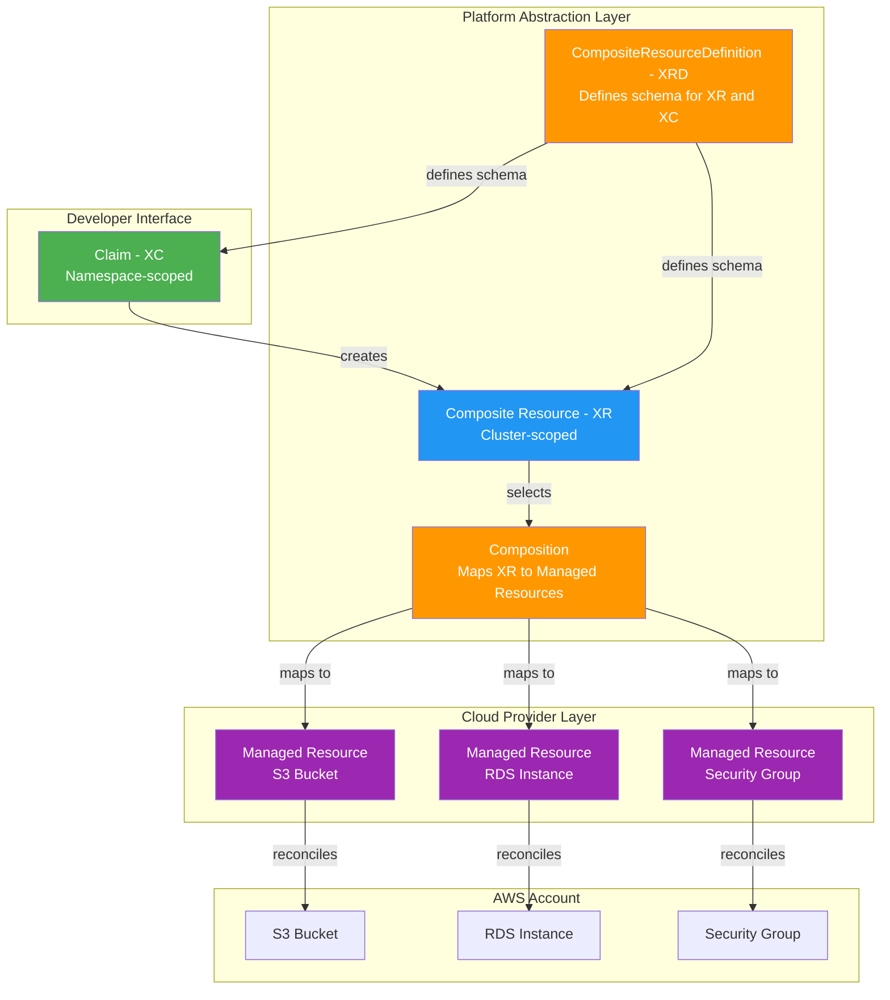
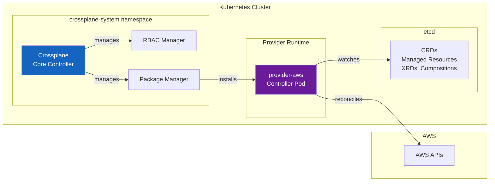
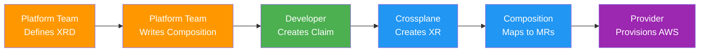
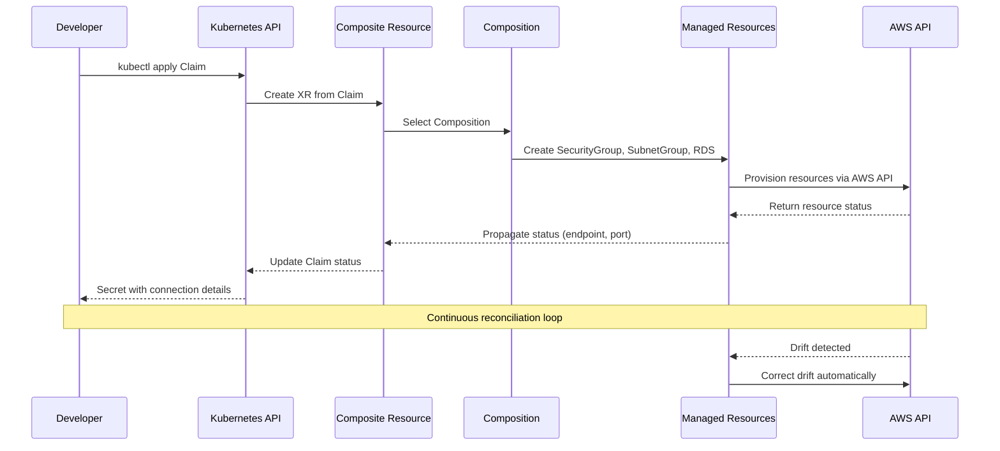
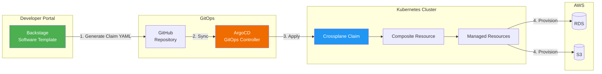

# Crossplane

> **サポート対象バージョン**: Crossplane v1.17+, Provider-AWS v1.15+
> **最終更新**: June 2025

## 目次

- [概要](#overview)
- [学習目標](#learning-objectives)
- [Crossplane アーキテクチャ](#crossplane-architecture)
- [EKS のインストールと設定](#eks-installation-and-configuration)
- [Managed Resources](#managed-resources)
- [Compositions（プラットフォーム抽象化）](#compositions-platform-abstraction)
- [Claims（セルフサービス）](#claims-self-service)
- [ACK と Crossplane の比較](#ack-vs-crossplane)
- [Backstage + Crossplane 統合](#backstage--crossplane-integration)
- [本番運用](#production-operations)
- [ベストプラクティス](#best-practices)
- [参考資料](#references)

---

## 概要

### Crossplane とは？

Crossplane は、Kubernetes をインフラストラクチャ向けのユニバーサルな control plane へ拡張する、オープンソースの CNCF Graduated プロジェクトです。Cloud resources をプロビジョニングするために別のツールや言語を導入するのではなく、Crossplane を使うと、アプリケーションですでに利用している同じ Kubernetes API、kubectl コマンド、GitOps workflow で infrastructure を定義、構成、管理できます。

Crossplane の中核は、Kubernetes cluster を、AWS、GCP、Azure などのあらゆる cloud provider、さらにはオンプレミスシステムにまたがる resources をオーケストレーションできる control plane に変換することです。Infrastructure engineers は Compositions と呼ばれる高レベルの抽象化を定義し、application developers は underlying cloud-specific details を知ることなく、Claims を通じてそれらの抽象化を利用します。

### なぜ Crossplane なのか？

従来の infrastructure management アプローチでは、チームが provider 固有の tools や languages を学ぶ必要があります。

- **Terraform** は HCL を使用し、state file management が必要で、Kubernetes ecosystem の外部で動作します
- **CloudFormation** は AWS 専用で、独自の template language を使用します
- **Pulumi** は汎用プログラミング言語と別個の state backend を必要とします

Crossplane は、infrastructure management を Kubernetes API に直接持ち込むことで、これらの課題に対処します。

1. **Kubernetes-Native**: Infrastructure は Kubernetes Custom Resources として定義されます。新しい language や CLI を学ぶ必要はありません
2. **継続的な Reconciliation**: あらゆる Kubernetes controller と同様に、Crossplane は desired state と actual state を継続的に調整し、drift を自動的に検出して修正します
3. **構成可能な抽象化**: Platform teams は reusable infrastructure abstractions（Compositions）を構築し、developers はシンプルな Claims を通じて利用します
4. **Multi-Cloud**: 単一の control plane で AWS、GCP、Azure などにまたがる resources を管理できます
5. **GitOps Compatible**: Infrastructure definitions は Git に保存される標準 YAML であり、ArgoCD や FluxCD を通じてデプロイできます

### Infrastructure as Code ツール比較

| 観点 | Crossplane | Terraform | ACK | CloudFormation | Pulumi |
|----------|-----------|-----------|-----|----------------|--------|
| **Interface** | Kubernetes API (YAML) | HCL | Kubernetes API (YAML) | JSON/YAML templates | General-purpose code |
| **State Management** | Kubernetes etcd | Terraform state file | Kubernetes etcd | CloudFormation stack | Pulumi state backend |
| **Drift Detection** | 継続的（controller） | `plan`/`apply` 時 | 継続的（controller） | Drift detection API | `preview`/`up` 時 |
| **Abstraction Layer** | Compositions + Claims | Modules | なし（1:1 mapping） | Nested stacks | Component resources |
| **Multi-Cloud** | はい（複数 Providers） | はい（複数 providers） | AWS のみ | AWS のみ | はい（複数 providers） |
| **Self-Service** | Claims（namespace-scoped） | Terraform Cloud workspaces | 組み込みなし | Service Catalog | Automation API |
| **GitOps Integration** | Native（Kubernetes resources） | Wrapper が必要（Atlantis） | Native（Kubernetes resources） | 限定的 | Wrapper が必要 |
| **CNCF Status** | Graduated | N/A (HashiCorp) | N/A (AWS) | N/A (AWS) | N/A (Pulumi Inc.) |
| **Learning Curve** | 中（Kubernetes + XRDs） | 中（HCL） | 低（simple CRDs） | 中（templates） | 中（programming） |

### CNCF プロジェクトの歴史

Crossplane は Upbound によって作成され、2020 年 6 月に CNCF Sandbox に受け入れられました。2021 年 9 月に Incubating status へ移行し、2024 年 11 月に Graduated status を達成して、Kubernetes、Prometheus、Envoy と並ぶ成熟した CNCF project の 1 つとなりました。この graduation は、project の production readiness、強固な governance、業界全体での幅広い adoption を反映しています。

---

## 学習目標

このドキュメントを完了すると、次のことができるようになります。

1. Crossplane の architecture と、Kubernetes を universal control plane に拡張する仕組みを**説明**する
2. IRSA で Provider-AWS を設定した Amazon EKS 上に Crossplane を**インストール**する
3. Kubernetes から直接 AWS services（S3、RDS、VPC）をプロビジョニングする Managed Resources を**作成**する
4. Platform abstractions を構築するための CompositeResourceDefinitions（XRDs）と Compositions を**設計**する
5. Developer self-service のために namespace-scoped Claims を通じて infrastructure を**プロビジョニング**する
6. Use case に適した tool を選ぶために ACK と Crossplane を**比較**する
7. 完全な IDP workflow のために Crossplane を Backstage および ArgoCD と**統合**する
8. Monitoring、upgrade strategies、drift detection を備えた Crossplane の本番運用を**行う**

---

## Crossplane アーキテクチャ

### コアコンセプト

Crossplane は、infrastructure abstraction を提供するために連携する 5 つの基本概念を導入します。



**1. Provider**: 特定の cloud provider 向けの CRDs と controllers をインストールする Crossplane package です。たとえば、`provider-aws` はすべての AWS service（S3、RDS、VPC、IAM など）向けの CRDs をインストールし、それらの AWS resources を作成、更新、削除する方法を知っている controllers を実行します。

**2. Managed Resource (MR)**: 外部 cloud resource を Kubernetes Custom Resource として 1:1 で表現したものです。S3 bucket 用の Managed Resource は、AWS 内の実際の S3 bucket に直接 mapping されます。Managed Resources は cluster-scoped で、Crossplane の最も低レベルの primitive です。

**3. Composite Resource (XR)**: CompositeResourceDefinition によって定義される、より高レベルの cluster-scoped custom resource です。XR は infrastructure の論理的な grouping を表します。たとえば、「Database」XR は、RDS instance、security group、subnet group を単一の unit に合成できます。

**4. Composition**: Composite Resource がプロビジョニングされたときに、どの Managed Resources を作成するかを定義する mapping layer です。Composition は「recipe」を指定します。つまり、「Database」type の XR が与えられたら、これらの具体的な Managed Resources をこの設定で作成し、XR spec の値を MR fields に patch します。

**5. Claim (XC)**: Composite Resource の namespace-scoped projection です。Claims は developer-facing interface です。`team-alpha` namespace の developer は、cluster-level permissions を必要とせずに「DatabaseClaim」を作成できます。Claim は underlying XR を作成し、その XR が Composition をトリガーします。

### Control Plane アーキテクチャ

Crossplane は Kubernetes cluster 内で一連の controllers として実行されます。



- **Crossplane Core Controller**: Compositions、XRDs、および XRs と Managed Resources の mapping の lifecycle を管理します
- **RBAC Manager**: XRDs 向けの Kubernetes RBAC ClusterRoles を自動生成し、Claims を namespaces で使用できるようにします
- **Package Manager**: Providers と Configurations（XRDs + Compositions の bundle）をインストールおよびアップグレードします
- **Provider Controllers**: インストールされた各 Provider は独自の controller pod(s) を実行し、Managed Resources を監視して cloud API に対して reconcile します

---

## EKS のインストールと設定

### 前提条件

- Amazon EKS cluster (v1.27+)
- cluster access が設定された kubectl
- Helm v3.x がインストール済み
- 適切な IAM permissions を持つ AWS account
- EKS cluster に OIDC provider が設定済み（IRSA 用）

### Step 1: Helm による Crossplane のインストール

```bash
# Add the Crossplane Helm repository
helm repo add crossplane-stable https://charts.crossplane.io/stable
helm repo update

# Create the crossplane-system namespace and install Crossplane
helm install crossplane \
  crossplane-stable/crossplane \
  --namespace crossplane-system \
  --create-namespace \
  --version 1.17.1 \
  --set args='{"--enable-usages"}' \
  --wait
```

インストールを確認します。

```bash
# Check Crossplane pods are running
kubectl get pods -n crossplane-system

# Expected output:
# NAME                                       READY   STATUS    RESTARTS   AGE
# crossplane-6d67f8c8b5-abc12               1/1     Running   0          2m
# crossplane-rbac-manager-7f8d9c4b6-def34   1/1     Running   0          2m

# Verify Crossplane CRDs are installed
kubectl get crds | grep crossplane
```

### Step 2: Provider-AWS のインストール

AWS provider をインストールします。これにより、サポートされているすべての AWS services 向けの CRDs が登録されます。

```yaml
# provider-aws.yaml
apiVersion: pkg.crossplane.io/v1
kind: Provider
metadata:
  name: provider-aws-s3
spec:
  package: xpkg.upbound.io/upbound/provider-aws-s3:v1.15.0
  runtimeConfigRef:
    name: provider-aws-runtime
---
apiVersion: pkg.crossplane.io/v1
kind: Provider
metadata:
  name: provider-aws-rds
spec:
  package: xpkg.upbound.io/upbound/provider-aws-rds:v1.15.0
  runtimeConfigRef:
    name: provider-aws-runtime
---
apiVersion: pkg.crossplane.io/v1
kind: Provider
metadata:
  name: provider-aws-ec2
spec:
  package: xpkg.upbound.io/upbound/provider-aws-ec2:v1.15.0
  runtimeConfigRef:
    name: provider-aws-runtime
---
apiVersion: pkg.crossplane.io/v1
kind: Provider
metadata:
  name: provider-aws-iam
spec:
  package: xpkg.upbound.io/upbound/provider-aws-iam:v1.15.0
  runtimeConfigRef:
    name: provider-aws-runtime
```

```bash
kubectl apply -f provider-aws.yaml

# Wait for Providers to become healthy
kubectl get providers.pkg.crossplane.io
# NAME               INSTALLED   HEALTHY   PACKAGE                                              AGE
# provider-aws-s3    True        True      xpkg.upbound.io/upbound/provider-aws-s3:v1.15.0     60s
# provider-aws-rds   True        True      xpkg.upbound.io/upbound/provider-aws-rds:v1.15.0    60s
# provider-aws-ec2   True        True      xpkg.upbound.io/upbound/provider-aws-ec2:v1.15.0    60s
# provider-aws-iam   True        True      xpkg.upbound.io/upbound/provider-aws-iam:v1.15.0    60s
```

> **注記**: Upbound の provider-family アプローチでは、AWS service ごとに 1 つの provider（例: `provider-aws-s3`、`provider-aws-rds`）をインストールします。これは production では monolithic な `provider-aws` より推奨されるアプローチです。CRD footprint と memory usage を削減できるためです。

### Step 3: IRSA による IAM の設定

IAM Roles for Service Accounts（IRSA）を使用して、Crossplane Provider-AWS controllers 用の IAM role を作成します。

```bash
# Set environment variables
export CLUSTER_NAME=my-eks-cluster
export AWS_ACCOUNT_ID=$(aws sts get-caller-identity --query Account --output text)
export OIDC_PROVIDER=$(aws eks describe-cluster --name $CLUSTER_NAME \
  --query "cluster.identity.oidc.issuer" --output text | sed 's|https://||')

# Create IAM policy for Crossplane (scope to required services)
cat > crossplane-policy.json << 'EOF'
{
  "Version": "2012-10-17",
  "Statement": [
    {
      "Effect": "Allow",
      "Action": [
        "s3:*",
        "rds:*",
        "ec2:*",
        "iam:*"
      ],
      "Resource": "*",
      "Condition": {
        "StringEquals": {
          "aws:RequestedRegion": "ap-northeast-2"
        }
      }
    }
  ]
}
EOF

aws iam create-policy \
  --policy-name CrossplaneProviderPolicy \
  --policy-document file://crossplane-policy.json

# Create IAM trust policy for IRSA
cat > trust-policy.json << EOF
{
  "Version": "2012-10-17",
  "Statement": [
    {
      "Effect": "Allow",
      "Principal": {
        "Federated": "arn:aws:iam::${AWS_ACCOUNT_ID}:oidc-provider/${OIDC_PROVIDER}"
      },
      "Action": "sts:AssumeRoleWithWebIdentity",
      "Condition": {
        "StringLike": {
          "${OIDC_PROVIDER}:sub": "system:serviceaccount:crossplane-system:provider-aws-*"
        }
      }
    }
  ]
}
EOF

aws iam create-role \
  --role-name CrossplaneProviderAWSRole \
  --assume-role-policy-document file://trust-policy.json

aws iam attach-role-policy \
  --role-name CrossplaneProviderAWSRole \
  --policy-arn arn:aws:iam::${AWS_ACCOUNT_ID}:policy/CrossplaneProviderPolicy
```

### Step 4: DeploymentRuntimeConfig の設定

DeploymentRuntimeConfig は、IRSA に必要な service account annotation を含め、Provider pods のデプロイ方法を制御します。

```yaml
# deployment-runtime-config.yaml
apiVersion: pkg.crossplane.io/v1beta1
kind: DeploymentRuntimeConfig
metadata:
  name: provider-aws-runtime
spec:
  deploymentTemplate:
    spec:
      replicas: 1
      selector: {}
      template:
        spec:
          serviceAccountName: provider-aws-runtime
          containers:
            - name: package-runtime
              resources:
                requests:
                  cpu: 100m
                  memory: 256Mi
                limits:
                  cpu: 500m
                  memory: 512Mi
  serviceAccountTemplate:
    metadata:
      name: provider-aws-runtime
      annotations:
        eks.amazonaws.com/role-arn: arn:aws:iam::<AWS_ACCOUNT_ID>:role/CrossplaneProviderAWSRole
```

```bash
kubectl apply -f deployment-runtime-config.yaml
```

### Step 5: ProviderConfig の作成

ProviderConfig は、AWS で認証する方法を Provider に伝えます。IRSA の場合、この configuration は注入された IAM credentials を使用するよう Provider に指示するだけです。

```yaml
# provider-config.yaml
apiVersion: aws.upbound.io/v1beta1
kind: ProviderConfig
metadata:
  name: default
spec:
  credentials:
    source: IRSA
```

```bash
kubectl apply -f provider-config.yaml

# Verify ProviderConfig
kubectl get providerconfig.aws.upbound.io
```

> **セキュリティ注記**: `default` ProviderConfig は、`providerConfigRef` を指定しない Managed Resources によって自動的に使用されます。Multi-tenant environments では、適切に scope された IAM roles を持つ separate ProviderConfigs を team ごとに作成してください。

---

## Managed Resources

Managed Resources は Crossplane の building blocks です。それぞれが単一の cloud resource に直接 mapping されます。このセクションでは、一般的な AWS resources のプロビジョニングを示します。

### S3 Bucket

```yaml
# s3-bucket.yaml
apiVersion: s3.aws.upbound.io/v1beta2
kind: Bucket
metadata:
  name: my-app-data-bucket
  annotations:
    crossplane.io/external-name: my-app-data-bucket-prod-abc123
spec:
  forProvider:
    region: ap-northeast-2
    tags:
      Environment: production
      ManagedBy: crossplane
  providerConfigRef:
    name: default
---
apiVersion: s3.aws.upbound.io/v1beta1
kind: BucketVersioning
metadata:
  name: my-app-data-bucket-versioning
spec:
  forProvider:
    region: ap-northeast-2
    bucketRef:
      name: my-app-data-bucket
    versioningConfiguration:
      - status: Enabled
  providerConfigRef:
    name: default
---
apiVersion: s3.aws.upbound.io/v1beta2
kind: BucketServerSideEncryptionConfiguration
metadata:
  name: my-app-data-bucket-encryption
spec:
  forProvider:
    region: ap-northeast-2
    bucketRef:
      name: my-app-data-bucket
    rule:
      - applyServerSideEncryptionByDefault:
          - sseAlgorithm: aws:kms
  providerConfigRef:
    name: default
---
apiVersion: s3.aws.upbound.io/v1beta1
kind: BucketPublicAccessBlock
metadata:
  name: my-app-data-bucket-public-access
spec:
  forProvider:
    region: ap-northeast-2
    bucketRef:
      name: my-app-data-bucket
    blockPublicAcls: true
    blockPublicPolicy: true
    ignorePublicAcls: true
    restrictPublicBuckets: true
  providerConfigRef:
    name: default
```

### RDS Instance

```yaml
# rds-instance.yaml
apiVersion: rds.aws.upbound.io/v1beta2
kind: Instance
metadata:
  name: my-app-postgres
  annotations:
    crossplane.io/external-name: my-app-postgres-prod
spec:
  forProvider:
    region: ap-northeast-2
    engine: postgres
    engineVersion: "16.4"
    instanceClass: db.r6g.large
    allocatedStorage: 100
    maxAllocatedStorage: 500
    storageType: gp3
    storageEncrypted: true
    multiAz: true
    dbName: myapp
    username: admin
    passwordSecretRef:
      name: rds-master-password
      namespace: crossplane-system
      key: password
    dbSubnetGroupNameRef:
      name: my-app-db-subnet-group
    vpcSecurityGroupIdRefs:
      - name: my-app-db-sg
    backupRetentionPeriod: 7
    deletionProtection: true
    skipFinalSnapshot: false
    finalSnapshotIdentifier: my-app-postgres-final
    publiclyAccessible: false
    tags:
      Environment: production
      ManagedBy: crossplane
  providerConfigRef:
    name: default
  writeConnectionSecretToRef:
    name: rds-connection-details
    namespace: crossplane-system
```

### VPC と Networking

```yaml
# vpc.yaml
apiVersion: ec2.aws.upbound.io/v1beta1
kind: VPC
metadata:
  name: my-app-vpc
spec:
  forProvider:
    region: ap-northeast-2
    cidrBlock: 10.0.0.0/16
    enableDnsHostnames: true
    enableDnsSupport: true
    tags:
      Name: my-app-vpc
      ManagedBy: crossplane
  providerConfigRef:
    name: default
---
# subnet-private-a.yaml
apiVersion: ec2.aws.upbound.io/v1beta1
kind: Subnet
metadata:
  name: my-app-private-a
spec:
  forProvider:
    region: ap-northeast-2
    availabilityZone: ap-northeast-2a
    vpcIdRef:
      name: my-app-vpc
    cidrBlock: 10.0.1.0/24
    mapPublicIpOnLaunch: false
    tags:
      Name: my-app-private-a
      Type: private
  providerConfigRef:
    name: default
---
# subnet-private-c.yaml
apiVersion: ec2.aws.upbound.io/v1beta1
kind: Subnet
metadata:
  name: my-app-private-c
spec:
  forProvider:
    region: ap-northeast-2
    availabilityZone: ap-northeast-2c
    vpcIdRef:
      name: my-app-vpc
    cidrBlock: 10.0.2.0/24
    mapPublicIpOnLaunch: false
    tags:
      Name: my-app-private-c
      Type: private
  providerConfigRef:
    name: default
```

### Security Group

```yaml
# security-group.yaml
apiVersion: ec2.aws.upbound.io/v1beta1
kind: SecurityGroup
metadata:
  name: my-app-db-sg
spec:
  forProvider:
    region: ap-northeast-2
    vpcIdRef:
      name: my-app-vpc
    name: my-app-db-sg
    description: Security group for RDS database
    tags:
      Name: my-app-db-sg
      ManagedBy: crossplane
  providerConfigRef:
    name: default
---
apiVersion: ec2.aws.upbound.io/v1beta1
kind: SecurityGroupRule
metadata:
  name: my-app-db-sg-ingress-postgres
spec:
  forProvider:
    region: ap-northeast-2
    type: ingress
    fromPort: 5432
    toPort: 5432
    protocol: tcp
    cidrBlocks:
      - 10.0.0.0/16
    securityGroupIdRef:
      name: my-app-db-sg
    description: Allow PostgreSQL from VPC
  providerConfigRef:
    name: default
```

### Resource Status の確認

Managed Resources を適用した後、provisioning status を確認します。

```bash
# Check overall status of all Managed Resources
kubectl get managed

# Check specific resource with conditions
kubectl get bucket.s3.aws.upbound.io my-app-data-bucket -o yaml

# Example output showing a healthy resource:
# status:
#   conditions:
#   - lastTransitionTime: "2025-06-15T10:30:00Z"
#     reason: Available
#     status: "True"
#     type: Ready
#   - lastTransitionTime: "2025-06-15T10:30:00Z"
#     reason: ReconcileSuccess
#     status: "True"
#     type: Synced
#   atProvider:
#     arn: arn:aws:s3:::my-app-data-bucket-prod-abc123
#     id: my-app-data-bucket-prod-abc123
#     region: ap-northeast-2

# Check RDS instance status
kubectl get instance.rds.aws.upbound.io my-app-postgres

# Watch resources until they become ready
kubectl get managed -w

# Describe a resource for detailed events
kubectl describe instance.rds.aws.upbound.io my-app-postgres
```

監視すべき主要な status conditions は次のとおりです。

| Condition | Status | 意味 |
|-----------|--------|---------|
| `Ready` | `True` | 外部 resource が存在し、利用可能です |
| `Ready` | `False` | resource が作成中、またはエラーがあります |
| `Synced` | `True` | Crossplane controller が正常に reconcile しました |
| `Synced` | `False` | Reconciliation に失敗しました（詳細は events を確認） |

---

## Compositions（プラットフォーム抽象化）

Compositions は Crossplane の value proposition の中心です。Platform teams は、cloud-specific complexity を隠蔽する reusable infrastructure blueprints を定義できます。

### Workflow 概要



### Step 1: CompositeResourceDefinition (XRD) の定義

XRD は custom API の schema を定義します。この例では、developers が利用する `PostgreSQLDatabase` API を作成します。

```yaml
# xrd-database.yaml
apiVersion: apiextensions.crossplane.io/v1
kind: CompositeResourceDefinition
metadata:
  name: xpostgresqldatabases.database.example.com
spec:
  group: database.example.com
  names:
    kind: XPostgreSQLDatabase
    plural: xpostgresqldatabases
  claimNames:
    kind: PostgreSQLDatabase
    plural: postgresqldatabases
  versions:
    - name: v1alpha1
      served: true
      referenceable: true
      schema:
        openAPIV3Schema:
          type: object
          properties:
            spec:
              type: object
              properties:
                parameters:
                  type: object
                  description: Database configuration parameters
                  properties:
                    storageGB:
                      type: integer
                      description: Storage size in GB
                      minimum: 20
                      maximum: 1000
                      default: 100
                    instanceClass:
                      type: string
                      description: RDS instance class
                      enum:
                        - db.t4g.micro
                        - db.t4g.small
                        - db.t4g.medium
                        - db.r6g.large
                        - db.r6g.xlarge
                      default: db.t4g.medium
                    engineVersion:
                      type: string
                      description: PostgreSQL engine version
                      enum:
                        - "15.8"
                        - "16.4"
                      default: "16.4"
                    highAvailability:
                      type: boolean
                      description: Enable Multi-AZ deployment
                      default: false
                    backupRetentionDays:
                      type: integer
                      description: Number of days to retain backups
                      minimum: 1
                      maximum: 35
                      default: 7
                    environment:
                      type: string
                      description: Deployment environment
                      enum:
                        - dev
                        - staging
                        - production
                      default: dev
                  required:
                    - storageGB
                    - environment
              required:
                - parameters
            status:
              type: object
              properties:
                endpoint:
                  type: string
                  description: Database endpoint address
                port:
                  type: integer
                  description: Database port
                dbName:
                  type: string
                  description: Database name
      additionalPrinterColumns:
        - name: Engine Version
          type: string
          jsonPath: .spec.parameters.engineVersion
        - name: Instance Class
          type: string
          jsonPath: .spec.parameters.instanceClass
        - name: HA
          type: boolean
          jsonPath: .spec.parameters.highAvailability
        - name: Environment
          type: string
          jsonPath: .spec.parameters.environment
        - name: Ready
          type: string
          jsonPath: .status.conditions[?(@.type=='Ready')].status
        - name: Synced
          type: string
          jsonPath: .status.conditions[?(@.type=='Synced')].status
        - name: Age
          type: date
          jsonPath: .metadata.creationTimestamp
```

```bash
kubectl apply -f xrd-database.yaml

# Verify the XRD and the generated CRDs
kubectl get xrd
kubectl get crd | grep database.example.com
# xpostgresqldatabases.database.example.com
# postgresqldatabases.database.example.com   <-- Claim CRD
```

### Step 2: Composition の作成

Composition は、`XPostgreSQLDatabase` がプロビジョニングされたときに作成する具体的な AWS resources を定義します。この例では、RDS instance を security group と DB subnet group とともに package 化します。

```yaml
# composition-database.yaml
apiVersion: apiextensions.crossplane.io/v1
kind: Composition
metadata:
  name: xpostgresqldatabases.aws.database.example.com
  labels:
    provider: aws
    service: rds
spec:
  compositeTypeRef:
    apiVersion: database.example.com/v1alpha1
    kind: XPostgreSQLDatabase

  writeConnectionSecretsToNamespace: crossplane-system

  patchSets:
    - name: common-tags
      patches:
        - type: FromCompositeFieldPath
          fromFieldPath: spec.parameters.environment
          toFieldPath: spec.forProvider.tags.Environment
        - type: FromCompositeFieldPath
          fromFieldPath: metadata.labels[crossplane.io/claim-namespace]
          toFieldPath: spec.forProvider.tags.Team
        - type: ToCompositeFieldPath
          fromFieldPath: metadata.annotations[crossplane.io/external-name]
          toFieldPath: status.externalName
          policy:
            fromFieldPath: Optional

  resources:
    # --- Security Group ---
    - name: security-group
      base:
        apiVersion: ec2.aws.upbound.io/v1beta1
        kind: SecurityGroup
        spec:
          forProvider:
            region: ap-northeast-2
            description: Crossplane-managed RDS security group
            vpcId: vpc-0abc123def456789  # Replace with your VPC ID
          providerConfigRef:
            name: default
      patches:
        - type: PatchSet
          patchSetName: common-tags
        - type: CombineFromComposite
          combine:
            variables:
              - fromFieldPath: metadata.labels[crossplane.io/claim-namespace]
              - fromFieldPath: metadata.labels[crossplane.io/claim-name]
            strategy: string
            string:
              fmt: "%s-%s-db-sg"
          toFieldPath: spec.forProvider.name

    # --- Security Group Ingress Rule ---
    - name: security-group-rule
      base:
        apiVersion: ec2.aws.upbound.io/v1beta1
        kind: SecurityGroupRule
        spec:
          forProvider:
            region: ap-northeast-2
            type: ingress
            fromPort: 5432
            toPort: 5432
            protocol: tcp
            cidrBlocks:
              - 10.0.0.0/16
            description: Allow PostgreSQL from VPC CIDR
          providerConfigRef:
            name: default
      patches:
        - type: FromCompositeFieldPath
          fromFieldPath: metadata.uid
          toFieldPath: spec.forProvider.securityGroupIdSelector.matchLabels.crossplane.io/composite
          policy:
            fromFieldPath: Required

    # --- DB Subnet Group ---
    - name: db-subnet-group
      base:
        apiVersion: rds.aws.upbound.io/v1beta1
        kind: SubnetGroup
        spec:
          forProvider:
            region: ap-northeast-2
            description: Crossplane-managed DB subnet group
            subnetIds:
              - subnet-0aaa111bbb222ccc3  # private-a
              - subnet-0ddd444eee555fff6  # private-c
          providerConfigRef:
            name: default
      patches:
        - type: PatchSet
          patchSetName: common-tags
        - type: CombineFromComposite
          combine:
            variables:
              - fromFieldPath: metadata.labels[crossplane.io/claim-namespace]
              - fromFieldPath: metadata.labels[crossplane.io/claim-name]
            strategy: string
            string:
              fmt: "%s-%s-db-subnet-group"
          toFieldPath: metadata.annotations[crossplane.io/external-name]

    # --- RDS Instance ---
    - name: rds-instance
      base:
        apiVersion: rds.aws.upbound.io/v1beta2
        kind: Instance
        spec:
          forProvider:
            region: ap-northeast-2
            engine: postgres
            storageType: gp3
            storageEncrypted: true
            publiclyAccessible: false
            autoMinorVersionUpgrade: true
            deletionProtection: false
            skipFinalSnapshot: false
            username: admin
            autoGeneratePassword: true
            passwordSecretRef: null
          providerConfigRef:
            name: default
      patches:
        - type: PatchSet
          patchSetName: common-tags
        # Storage
        - type: FromCompositeFieldPath
          fromFieldPath: spec.parameters.storageGB
          toFieldPath: spec.forProvider.allocatedStorage
        # Instance class
        - type: FromCompositeFieldPath
          fromFieldPath: spec.parameters.instanceClass
          toFieldPath: spec.forProvider.instanceClass
        # Engine version
        - type: FromCompositeFieldPath
          fromFieldPath: spec.parameters.engineVersion
          toFieldPath: spec.forProvider.engineVersion
        # Multi-AZ
        - type: FromCompositeFieldPath
          fromFieldPath: spec.parameters.highAvailability
          toFieldPath: spec.forProvider.multiAz
        # Backup retention
        - type: FromCompositeFieldPath
          fromFieldPath: spec.parameters.backupRetentionDays
          toFieldPath: spec.forProvider.backupRetentionPeriod
        # Database name from claim name
        - type: FromCompositeFieldPath
          fromFieldPath: metadata.labels[crossplane.io/claim-name]
          toFieldPath: spec.forProvider.dbName
          transforms:
            - type: string
              string:
                type: Convert
                convert: ToLower
            - type: string
              string:
                type: Regexp
                regexp:
                  match: '[^a-z0-9]'
                  group: 0
        # External name
        - type: CombineFromComposite
          combine:
            variables:
              - fromFieldPath: spec.parameters.environment
              - fromFieldPath: metadata.labels[crossplane.io/claim-namespace]
              - fromFieldPath: metadata.labels[crossplane.io/claim-name]
            strategy: string
            string:
              fmt: "%s-%s-%s"
          toFieldPath: metadata.annotations[crossplane.io/external-name]
        # Reference security group
        - type: FromCompositeFieldPath
          fromFieldPath: metadata.uid
          toFieldPath: spec.forProvider.vpcSecurityGroupIdSelector.matchLabels.crossplane.io/composite
          policy:
            fromFieldPath: Required
        # Reference subnet group
        - type: FromCompositeFieldPath
          fromFieldPath: metadata.uid
          toFieldPath: spec.forProvider.dbSubnetGroupNameSelector.matchLabels.crossplane.io/composite
          policy:
            fromFieldPath: Required
        # Environment-specific: production gets deletion protection
        - type: FromCompositeFieldPath
          fromFieldPath: spec.parameters.environment
          toFieldPath: spec.forProvider.deletionProtection
          transforms:
            - type: map
              map:
                dev: "false"
                staging: "false"
                production: "true"
        # Max allocated storage (autoscaling) = 5x base
        - type: FromCompositeFieldPath
          fromFieldPath: spec.parameters.storageGB
          toFieldPath: spec.forProvider.maxAllocatedStorage
          transforms:
            - type: math
              math:
                type: Multiply
                multiply: 5
        # Status: propagate endpoint to XR
        - type: ToCompositeFieldPath
          fromFieldPath: status.atProvider.address
          toFieldPath: status.endpoint
          policy:
            fromFieldPath: Optional
        - type: ToCompositeFieldPath
          fromFieldPath: status.atProvider.port
          toFieldPath: status.port
          policy:
            fromFieldPath: Optional
        - type: ToCompositeFieldPath
          fromFieldPath: spec.forProvider.dbName
          toFieldPath: status.dbName
          policy:
            fromFieldPath: Optional
      connectionDetails:
        - name: endpoint
          fromFieldPath: status.atProvider.address
        - name: port
          fromFieldPath: status.atProvider.port
          type: FromFieldPath
        - name: username
          fromFieldPath: spec.forProvider.username
          type: FromFieldPath
        - name: password
          fromConnectionSecretKey: attribute.password
```

```bash
kubectl apply -f composition-database.yaml

# Verify the Composition
kubectl get compositions
# NAME                                              XR-KIND              XR-APIVERSION                      AGE
# xpostgresqldatabases.aws.database.example.com     XPostgreSQLDatabase  database.example.com/v1alpha1      10s
```

### Patch と Transform の詳細

Crossplane Compositions は patches を使用して、Composite Resource と Managed Resources の間で data を移動します。主要な patch types は次のとおりです。

| Patch Type | Direction | 説明 |
|-----------|-----------|-------------|
| `FromCompositeFieldPath` | XR -> MR | XR spec から Managed Resource field へ値をコピーします |
| `ToCompositeFieldPath` | MR -> XR | Managed Resource status から XR status へ値をコピーします |
| `CombineFromComposite` | XR -> MR | Format string を使用して複数の XR fields を 1 つの MR field に結合します |
| `CombineToComposite` | MR -> XR | 複数の MR fields を 1 つの XR field に結合します |
| `PatchSet` | N/A | 名前付きの reusable な patch group を適用します |

Transforms は patch される値を変更します。

| Transform | 説明 | 例 |
|-----------|-------------|---------|
| `map` | 個別の値を map します | `dev` -> `db.t4g.micro` |
| `math` | 算術演算 | storage を 5 倍にする |
| `string` | 文字列操作 | Format, Convert, Regexp |
| `convert` | 型変換 | String から integer |

---

## Claims（セルフサービス）

Claims は Crossplane Compositions に対する developer-facing interface です。namespace-scoped であるため、developers は infrastructure をプロビジョニングするために自分の namespace 内の RBAC permissions だけを必要とします。

### Claim による Database の作成

上記で定義した XRD と Composition により、developer はシンプルな Claim で完全に設定された PostgreSQL database をプロビジョニングできます。

```yaml
# database-claim-dev.yaml
apiVersion: database.example.com/v1alpha1
kind: PostgreSQLDatabase
metadata:
  name: orders-db
  namespace: team-alpha
spec:
  parameters:
    storageGB: 50
    instanceClass: db.t4g.small
    engineVersion: "16.4"
    highAvailability: false
    backupRetentionDays: 3
    environment: dev
  compositionRef:
    name: xpostgresqldatabases.aws.database.example.com
  writeConnectionSecretToRef:
    name: orders-db-connection
```

```bash
kubectl apply -f database-claim-dev.yaml

# Watch the Claim status
kubectl get postgresqldatabase orders-db -n team-alpha -w
# NAME        ENGINE VERSION   INSTANCE CLASS   HA      ENVIRONMENT   READY   SYNCED   AGE
# orders-db   16.4             db.t4g.small     false   dev           True    True     8m

# Check the underlying XR created by the Claim
kubectl get xpostgresqldatabase
# NAME                   ENGINE VERSION   INSTANCE CLASS   HA      ENVIRONMENT   READY   SYNCED   AGE
# orders-db-abc12        16.4             db.t4g.small     false   dev           True    True     8m

# Check all Managed Resources created by the Composition
kubectl get managed -l crossplane.io/claim-name=orders-db
```

### Production Database Claim

Production では、developer は parameters を変更するだけです。Multi-AZ、より高性能な instance classes、deletion protection の有効化といった複雑さは Composition が処理します。

```yaml
# database-claim-prod.yaml
apiVersion: database.example.com/v1alpha1
kind: PostgreSQLDatabase
metadata:
  name: orders-db
  namespace: team-alpha-prod
spec:
  parameters:
    storageGB: 200
    instanceClass: db.r6g.large
    engineVersion: "16.4"
    highAvailability: true
    backupRetentionDays: 30
    environment: production
  compositionRef:
    name: xpostgresqldatabases.aws.database.example.com
  writeConnectionSecretToRef:
    name: orders-db-connection
```

### Connection Details

Database がプロビジョニングされると、Crossplane は connection details を含む Kubernetes Secret を自動的に作成します。

```bash
# View the auto-generated connection secret
kubectl get secret orders-db-connection -n team-alpha -o yaml

# The secret contains:
# data:
#   endpoint: <base64-encoded RDS endpoint>
#   port: <base64-encoded port>
#   username: <base64-encoded username>
#   password: <base64-encoded auto-generated password>
```

Applications は secret を直接参照できます。

```yaml
# application-deployment.yaml
apiVersion: apps/v1
kind: Deployment
metadata:
  name: orders-api
  namespace: team-alpha
spec:
  replicas: 2
  selector:
    matchLabels:
      app: orders-api
  template:
    metadata:
      labels:
        app: orders-api
    spec:
      containers:
        - name: orders-api
          image: 123456789012.dkr.ecr.ap-northeast-2.amazonaws.com/orders-api:v1.0.0
          env:
            - name: DB_HOST
              valueFrom:
                secretKeyRef:
                  name: orders-db-connection
                  key: endpoint
            - name: DB_PORT
              valueFrom:
                secretKeyRef:
                  name: orders-db-connection
                  key: port
            - name: DB_USER
              valueFrom:
                secretKeyRef:
                  name: orders-db-connection
                  key: username
            - name: DB_PASSWORD
              valueFrom:
                secretKeyRef:
                  name: orders-db-connection
                  key: password
```

### Claim Lifecycle



---

## ACK と Crossplane の比較

[AWS Controllers for Kubernetes (ACK)](./02-ack.md) と Crossplane はどちらも Kubernetes API を通じて AWS resources を管理しますが、目的が異なり、異なる abstraction levels で動作します。

### 詳細比較

| 観点 | ACK | Crossplane |
|----------|-----|-----------|
| **Scope** | AWS のみ | Multi-cloud（AWS、GCP、Azure など） |
| **Abstraction Level** | 1:1 resource mapping | Compositions + Claims（platform abstraction） |
| **Resource Coverage** | 約 25 の AWS service controllers | provider-aws family による 900+ AWS resources |
| **Custom APIs** | サポートなし | XRDs で custom platform APIs を定義 |
| **Composition** | サポートなし | Compositions が複数 resources を package 化 |
| **Self-Service** | Cluster-scoped CRs のみ | Tenants 向け namespace-scoped Claims |
| **Maintained By** | AWS | Upbound / CNCF community |
| **CNCF Status** | CNCF project ではない | Graduated |
| **IAM Integration** | IRSA（native） | IRSA（DeploymentRuntimeConfig 経由） |
| **State Management** | Kubernetes etcd | Kubernetes etcd |
| **Drift Detection** | はい（continuous） | はい（continuous） |
| **Package System** | Controller ごとの Helm charts | Crossplane packages（OCI images） |
| **Learning Curve** | 低（simple CRDs） | 中（XRDs、Compositions、patches） |
| **Multi-Tenancy** | 手動 RBAC | Claims + namespaces による built-in |
| **Connection Secrets** | Controller によって異なる | 標準化された writeConnectionSecretToRef |

### ACK を使うべき場合

ACK は次の場合に適しています。

- **AWS-only infrastructure**: 組織が AWS のみを使用しており、multi-cloud requirements がない
- **シンプルな resource provisioning**: Abstraction layers なしで AWS resources を直接 1:1 管理したい
- **迅速な adoption**: Minimal learning curve で Kubernetes から AWS resources を管理する最短経路が欲しい
- **AWS-native support**: EKS と緊密に統合された、AWS が直接保守する tooling を好む
- **限定された scope**: 少数の AWS service types（例: S3 と SQS のみ）を管理する

### Crossplane を使うべき場合

Crossplane は次の場合に適しています。

- **Platform engineering**: Internal Developer Platform を構築しており、developer-friendly な custom APIs が必要
- **Multi-cloud**: 単一の control plane から AWS、GCP、Azure、その他の providers にまたがる resources を管理する
- **Self-service infrastructure**: Development teams が cluster-admin access なしで namespace-scoped Claims を通じて infrastructure をプロビジョニングする必要がある
- **Composition が不可欠**: Infrastructure patterns が、unit としてプロビジョニングすべき複数の関連 resources（例: RDS + SecurityGroup + SubnetGroup）を含む
- **標準化**: Compositions を通じて organizational standards（naming、tagging、security baselines）を強制したい

### ACK と Crossplane を併用する

ACK と Crossplane は相互排他的ではありません。Pragmatic なアプローチは次のとおりです。

1. Abstraction が不要なシンプルで直接的な AWS resource management（例: SQS queues、SNS topics の管理）には **ACK** を使用する
2. Composition と self-service Claims の恩恵を受ける complex infrastructure patterns（例: database stacks、networking setups）には **Crossplane** を使用する
3. どちらの tool も state を Kubernetes etcd に保存し、GitOps workflows（ArgoCD、FluxCD）と連携します

---

## Backstage + Crossplane 統合

Developer portal としての [Backstage](./06-backstage-idp.md) と、infrastructure provisioning engine としての Crossplane を組み合わせることで、強力な self-service platform を作成できます。Developers は Backstage の catalog から infrastructure を選択し、Crossplane Claims が生成されて Git に commit され、ArgoCD によってデプロイされます。

### アーキテクチャ概要



### Crossplane Claims 向け Backstage Software Template

Developers が form を通じて database をプロビジョニングできる Backstage Software Template を作成します。

```yaml
# backstage-template-database.yaml
apiVersion: scaffolder.backstage.io/v1beta3
kind: Template
metadata:
  name: provision-database
  title: Provision PostgreSQL Database
  description: Self-service PostgreSQL database provisioning via Crossplane
  tags:
    - database
    - crossplane
    - aws
    - rds
spec:
  owner: platform-team
  type: infrastructure

  parameters:
    - title: Database Configuration
      required:
        - name
        - environment
        - storageGB
      properties:
        name:
          title: Database Name
          type: string
          pattern: '^[a-z][a-z0-9-]{2,28}[a-z0-9]$'
          description: Lowercase alphanumeric, 4-30 characters
        environment:
          title: Environment
          type: string
          enum:
            - dev
            - staging
            - production
          default: dev
        storageGB:
          title: Storage (GB)
          type: integer
          enum:
            - 20
            - 50
            - 100
            - 200
            - 500
          default: 50
        instanceClass:
          title: Instance Class
          type: string
          enum:
            - db.t4g.micro
            - db.t4g.small
            - db.t4g.medium
            - db.r6g.large
          default: db.t4g.small
        highAvailability:
          title: Multi-AZ (High Availability)
          type: boolean
          default: false

    - title: Repository Information
      required:
        - repoUrl
      properties:
        repoUrl:
          title: Infrastructure Repository
          type: string
          ui:field: RepoUrlPicker
          ui:options:
            allowedHosts:
              - github.com

  steps:
    - id: generate
      name: Generate Crossplane Claim
      action: fetch:template
      input:
        url: ./skeleton
        targetPath: ./infrastructure
        values:
          name: ${{ parameters.name }}
          environment: ${{ parameters.environment }}
          storageGB: ${{ parameters.storageGB }}
          instanceClass: ${{ parameters.instanceClass }}
          highAvailability: ${{ parameters.highAvailability }}

    - id: publish
      name: Create Pull Request
      action: publish:github:pull-request
      input:
        repoUrl: ${{ parameters.repoUrl }}
        branchName: infra/provision-${{ parameters.name }}-db
        title: "Provision database: ${{ parameters.name }}"
        description: |
          ## Database Provisioning Request

          | Parameter | Value |
          |-----------|-------|
          | Name | ${{ parameters.name }} |
          | Environment | ${{ parameters.environment }} |
          | Storage | ${{ parameters.storageGB }} GB |
          | Instance Class | ${{ parameters.instanceClass }} |
          | High Availability | ${{ parameters.highAvailability }} |

          This PR was created automatically by the Backstage self-service portal.
          Merging will trigger ArgoCD to apply the Crossplane Claim.

  output:
    links:
      - title: Pull Request
        url: ${{ steps.publish.output.remoteUrl }}
```

Template skeleton directory には Claim YAML が含まれます。

```yaml
# skeleton/claim.yaml
apiVersion: database.example.com/v1alpha1
kind: PostgreSQLDatabase
metadata:
  name: ${{ values.name }}
  namespace: ${{ values.namespace | default("default") }}
spec:
  parameters:
    storageGB: ${{ values.storageGB }}
    instanceClass: ${{ values.instanceClass }}
    engineVersion: "16.4"
    highAvailability: ${{ values.highAvailability }}
    backupRetentionDays: ${{ values.environment == "production" and 30 or 7 }}
    environment: ${{ values.environment }}
  compositionRef:
    name: xpostgresqldatabases.aws.database.example.com
  writeConnectionSecretToRef:
    name: ${{ values.name }}-connection
```

### GitOps Workflow: ArgoCD + Crossplane

ArgoCD が infrastructure repository を監視し、PR が merge されたときに Crossplane Claims を自動的に適用するよう設定します。詳細な ArgoCD configuration については [ArgoCD Applications](../gitops/argocd/02-applications.md) を参照してください。

```yaml
# argocd-application-crossplane-claims.yaml
apiVersion: argoproj.io/v1alpha1
kind: Application
metadata:
  name: crossplane-claims
  namespace: argocd
spec:
  project: infrastructure
  source:
    repoURL: https://github.com/your-org/infrastructure-claims
    targetRevision: main
    path: claims/
    directory:
      recurse: true
  destination:
    server: https://kubernetes.default.svc
  syncPolicy:
    automated:
      prune: false        # Do not auto-delete Claims (protects infrastructure)
      selfHeal: true       # Re-apply if someone manually modifies a Claim
    syncOptions:
      - CreateNamespace=true
    retry:
      limit: 3
      backoff:
        duration: 30s
        factor: 2
        maxDuration: 5m
```

### End-to-End Self-Service Flow

完全な self-service infrastructure workflow は次のとおりです。

1. **Developer** が Backstage を開き、template catalog から「Provision PostgreSQL Database」を選択する
2. **Backstage** が form を rendering し、developer が name、environment、size、instance class を入力する
3. **Backstage Template** が Crossplane Claim YAML を生成し、infrastructure repository に Pull Request を作成する
4. **Reviewer**（platform team または automated policy check）が PR を承認して merge する
5. **ArgoCD** が Git 内の新しい Claim を検出し、Kubernetes cluster に適用する
6. **Crossplane** が Composite Resource を作成し、一致する Composition を選択して Managed Resources をプロビジョニングする
7. **AWS Provider** が AWS API を呼び出して RDS instance、security group、subnet group を作成する
8. **Connection Secret** が developer の namespace に endpoint、port、credentials とともに自動作成される
9. **Developer** が application Deployment で Secret を参照する

---

## 本番運用

### State Management と Drift Detection

Crossplane は desired state（Kubernetes resources）と actual state（cloud resources）を継続的に reconcile します。デフォルトでは、reconciliation loop は 10 分ごとに実行されますが、これは設定可能です。

```yaml
# provider-aws.yaml with custom poll interval
apiVersion: pkg.crossplane.io/v1
kind: Provider
metadata:
  name: provider-aws-rds
spec:
  package: xpkg.upbound.io/upbound/provider-aws-rds:v1.15.0
  runtimeConfigRef:
    name: provider-aws-runtime
```

```bash
# Override the poll interval via DeploymentRuntimeConfig
# Add to the container args:
# --poll=5m          # Check every 5 minutes instead of 10
# --max-reconcile-rate=10   # Max concurrent reconciliations
```

Drift が検出された場合（誰かが Crossplane の外部で resource を変更した場合）、controller は次の reconciliation cycle で自動的に修正します。Drift events を確認するには次のようにします。

```bash
# Check events on a specific Managed Resource
kubectl describe instance.rds.aws.upbound.io my-app-postgres

# Events:
# Type     Reason                   Age   Message
# ----     ------                   ----  -------
# Normal   CreatedExternalResource  30m   Successfully requested creation...
# Warning  LateInitialized          25m   Late-initialized spec fields...
# Normal   UpdatedExternalResource   5m   Successfully requested update... (drift corrected)
```

### 既存 Resources の Import

Crossplane は、Crossplane の外部で作成された resources（例: console や Terraform で作成された既存 RDS instances）を取り込むことができます。

```yaml
# Import an existing RDS instance by setting the external-name annotation
apiVersion: rds.aws.upbound.io/v1beta2
kind: Instance
metadata:
  name: imported-legacy-db
  annotations:
    crossplane.io/external-name: my-existing-rds-instance-id
spec:
  forProvider:
    region: ap-northeast-2
    engine: postgres
    engineVersion: "16.4"
    instanceClass: db.r6g.large
    allocatedStorage: 200
  providerConfigRef:
    name: default
```

適用後、Crossplane は既存 resource を observe し、管理下に置きます。Spec への変更は actual resource に適用されます。

### Upgrade Strategy

#### Crossplane Core の Upgrade

```bash
# Check current version
helm list -n crossplane-system

# Review changelog for breaking changes before upgrading
# https://github.com/crossplane/crossplane/releases

# Upgrade Crossplane core
helm upgrade crossplane \
  crossplane-stable/crossplane \
  --namespace crossplane-system \
  --version 1.18.0 \
  --wait

# Verify pods restart successfully
kubectl get pods -n crossplane-system -w
```

#### Providers の Upgrade

Provider upgrades は CRD changes を伴うため、慎重に実行する必要があります。

```yaml
# Update the Provider version
apiVersion: pkg.crossplane.io/v1
kind: Provider
metadata:
  name: provider-aws-rds
spec:
  package: xpkg.upbound.io/upbound/provider-aws-rds:v1.16.0  # Updated version
  runtimeConfigRef:
    name: provider-aws-runtime
```

```bash
kubectl apply -f provider-aws-updated.yaml

# Monitor the upgrade
kubectl get providers.pkg.crossplane.io -w
# Wait for HEALTHY=True

# Verify no resources entered an error state
kubectl get managed | grep -v "True.*True"
```

**Provider upgrade のベストプラクティス:**

1. **Release notes を読む**: Breaking changes、deprecated fields、API version bumps を確認します
2. **まず non-production で upgrade する**: Production の前に dev/staging clusters でテストします
3. **Provider を 1 つずつ upgrade する**: すべての providers を同時に upgrade しないでください
4. **Upgrade 後に監視する**: 少なくとも 1 reconciliation cycle の間、Managed Resources の `Synced=False` conditions を監視します
5. **Exact versions に固定する**: 常に exact versions（例: `v1.16.0`）を指定し、`latest` や floating tags は絶対に使用しないでください

### Monitoring と Alerting

Crossplane とその Providers は Prometheus metrics を公開します。Provisioning failures と reconciliation issues を検出するために monitoring を設定します。

```yaml
# prometheus-servicemonitor.yaml
apiVersion: monitoring.coreos.com/v1
kind: ServiceMonitor
metadata:
  name: crossplane-metrics
  namespace: crossplane-system
  labels:
    release: prometheus
spec:
  selector:
    matchLabels:
      app: crossplane
  endpoints:
    - port: metrics
      interval: 30s
      path: /metrics
---
apiVersion: monitoring.coreos.com/v1
kind: ServiceMonitor
metadata:
  name: provider-aws-metrics
  namespace: crossplane-system
  labels:
    release: prometheus
spec:
  selector:
    matchLabels:
      pkg.crossplane.io/revision: provider-aws-rds
  endpoints:
    - port: metrics
      interval: 30s
      path: /metrics
```

監視すべき主要な metrics は次のとおりです。

| Metric | 説明 | Alert Threshold |
|--------|-------------|-----------------|
| `certwatcher_read_certificate_errors_total` | Certificate read failures | > 0 |
| `controller_runtime_reconcile_errors_total` | Reconciliation errors | 5 分あたり > 5 |
| `controller_runtime_reconcile_time_seconds` | Reconciliation duration | p99 > 30s |
| `workqueue_depth` | Reconciliation 待ちの items | > 100 |
| `workqueue_retries_total` | Retry count | 継続的な増加 |

Prometheus alerting rules の例:

```yaml
# crossplane-alerts.yaml
apiVersion: monitoring.coreos.com/v1
kind: PrometheusRule
metadata:
  name: crossplane-alerts
  namespace: crossplane-system
spec:
  groups:
    - name: crossplane
      rules:
        - alert: CrossplaneReconcileErrors
          expr: rate(controller_runtime_reconcile_errors_total[5m]) > 0
          for: 10m
          labels:
            severity: warning
          annotations:
            summary: "Crossplane reconciliation errors detected"
            description: "Controller {{ $labels.controller }} has reconciliation errors."

        - alert: CrossplaneManagedResourceNotReady
          expr: |
            kube_customresource_status_condition{
              group=~".*\\.aws\\.upbound\\.io",
              status="False",
              condition="Ready"
            } == 1
          for: 30m
          labels:
            severity: critical
          annotations:
            summary: "Managed Resource not ready for 30 minutes"
            description: "{{ $labels.customresource_kind }}/{{ $labels.customresource_name }} is not Ready."

        - alert: CrossplaneManagedResourceNotSynced
          expr: |
            kube_customresource_status_condition{
              group=~".*\\.aws\\.upbound\\.io",
              status="False",
              condition="Synced"
            } == 1
          for: 15m
          labels:
            severity: critical
          annotations:
            summary: "Managed Resource not synced for 15 minutes"
            description: "{{ $labels.customresource_kind }}/{{ $labels.customresource_name }} is not Synced."
```

---

## ベストプラクティス

### Composition Design Principles

1. **Developer experience から始める**: Claim consumer の視点で XRD schema を設計します。API はシンプルで直感的であり、cloud-specific complexity を隠蔽する必要があります。Developers が変更する必要のある parameters のみを公開します。

2. **Environment-based defaults を使用する**: `environment` parameter を活用し、developers がそれらを知る必要なく、production-appropriate values（Multi-AZ、deletion protection、longer backup retention）を自動設定します。

    ```yaml
    # In Composition: map environment to deletion protection
    - type: FromCompositeFieldPath
      fromFieldPath: spec.parameters.environment
      toFieldPath: spec.forProvider.deletionProtection
      transforms:
        - type: map
          map:
            dev: "false"
            staging: "false"
            production: "true"
    ```

3. **一貫性のために PatchSets を使用する**: Common patches（tags、region、provider config）を PatchSets で定義し、Composition 内のすべての resources から参照します。これにより、同じ Composition 内の resources 間で tag drift が発生するのを防げます。

4. **XRDs を versioning する**: Initial APIs には `v1alpha1` を使用し、schema が安定するにつれて `v1beta1` と `v1` に昇格します。Served version から fields を削除してはいけません。代わりに new versions を追加してください。

5. **Composition size を制限する**: Composition が 10〜15 resources を超える場合は、複数の Compositions に分割するか、nested XRs（他の XRs を参照する Compositions）を使用することを検討してください。

### Naming Conventions

すべての Crossplane resources に対して、一貫した naming conventions を確立します。

| Resource Type | Convention | Example |
|--------------|-----------|---------|
| XRD | `x<plural>.<group>` | `xpostgresqldatabases.database.example.com` |
| Composition | `<xrd-plural>.<provider>.<group>` | `xpostgresqldatabases.aws.database.example.com` |
| Claim | `<descriptive-name>` | `orders-db` |
| Managed Resource | `<claim-name>-<resource-type>` | Patches により auto-generated |
| ProviderConfig | `default` or `<team>-<environment>` | `team-alpha-production` |
| Connection Secret | `<claim-name>-connection` | `orders-db-connection` |

### Secret Management

1. **`writeConnectionSecretToRef` を使用する**: Secrets を手動作成するのではなく、必ず Crossplane の built-in connection secret mechanism を通じて connection details を伝播します。

2. **Secrets を claim namespaces に scope する**: Claims は Claim の namespace に connection Secrets を自動作成し、適切な RBAC isolation を保証します。

3. **External Secrets Operator と統合する**: AWS Secrets Manager や HashiCorp Vault に secrets を保存する組織では、Crossplane と併せて External Secrets Operator を使用し、connection details を同期します。

    ```yaml
    # ExternalSecret that reads the Crossplane-generated secret
    # and syncs it to AWS Secrets Manager for non-Kubernetes consumers
    apiVersion: external-secrets.io/v1beta1
    kind: ExternalSecret
    metadata:
      name: orders-db-external
      namespace: team-alpha
    spec:
      refreshInterval: 1h
      secretStoreRef:
        name: aws-secrets-manager
        kind: ClusterSecretStore
      dataFrom:
        - sourceRef:
            generatorRef:
              apiVersion: v1
              kind: Secret
              name: orders-db-connection
    ```

4. **Credentials を rotate する**: Crossplane は database credentials を自動 rotate しません。CronJobs を使用して rotation strategy を実装するか、AWS Secrets Manager automatic rotation と統合します。

### Multi-Tenancy

1. **Tenant ごとに 1 つの ProviderConfig**: Strict multi-tenancy scenarios では、各 tenant の AWS resources に scope された IAM roles を持つ separate ProviderConfigs を作成します。

    ```yaml
    apiVersion: aws.upbound.io/v1beta1
    kind: ProviderConfig
    metadata:
      name: team-alpha
    spec:
      credentials:
        source: IRSA
      assumeRoleChain:
        - roleARN: arn:aws:iam::111122223333:role/CrossplaneTeamAlphaRole
    ```

2. **Namespace isolation**: Claims は本質的に namespace-scoped です。Kubernetes RBAC と network policies と組み合わせて、tenant boundaries を強制します。

3. **Resource quotas**: Kubernetes ResourceQuotas または Kyverno policies を使用して、namespace ごとの Claims の数と size を制限します。

    ```yaml
    # Kyverno policy to limit database Claims per namespace
    apiVersion: kyverno.io/v1
    kind: ClusterPolicy
    metadata:
      name: limit-database-claims
    spec:
      validationFailureAction: Enforce
      rules:
        - name: limit-storage-size
          match:
            any:
              - resources:
                  kinds:
                    - PostgreSQLDatabase
          validate:
            message: "Storage cannot exceed 500GB in non-production environments"
            deny:
              conditions:
                all:
                  - key: "{{ request.object.spec.parameters.environment }}"
                    operator: NotEquals
                    value: production
                  - key: "{{ request.object.spec.parameters.storageGB }}"
                    operator: GreaterThan
                    value: 500
    ```

4. **Cost attribution**: Composition patches で team namespace label を使用して、すべての AWS resources に cost allocation tags を付与し、AWS Cost Explorer で team ごとの cost tracking を可能にします。

### Resource Deletion Safety

1. 重要 resources の誤削除を防ぐために、**Crossplane の Usage resource を使用する**。

    ```yaml
    apiVersion: apiextensions.crossplane.io/v1alpha1
    kind: Usage
    metadata:
      name: protect-production-db
    spec:
      of:
        apiVersion: rds.aws.upbound.io/v1beta2
        kind: Instance
        resourceRef:
          name: production-orders-db
      reason: "Protected production database - requires manual Usage deletion first"
    ```

2. Kubernetes object が削除されても cloud resource が削除されないように、critical Managed Resources に **`deletionPolicy: Orphan`** を設定します。

    ```yaml
    apiVersion: rds.aws.upbound.io/v1beta2
    kind: Instance
    metadata:
      name: critical-database
    spec:
      deletionPolicy: Orphan  # Default is "Delete"
      forProvider:
        # ...
    ```

---

## 参考資料

### 公式ドキュメント

- [Crossplane 公式ドキュメント](https://docs.crossplane.io/)
- [Crossplane GitHub Repository](https://github.com/crossplane/crossplane)
- [Upbound Provider-AWS Documentation](https://marketplace.upbound.io/providers/upbound/provider-family-aws/)
- [Crossplane Composition Functions](https://docs.crossplane.io/latest/concepts/composition-functions/)
- [Crossplane API Reference](https://doc.crds.dev/github.com/crossplane/crossplane)

### CNCF と Community

- [CNCF Crossplane Project Page](https://www.cncf.io/projects/crossplane/)
- [Crossplane Slack Community](https://slack.crossplane.io/)
- [Crossplane Blog](https://blog.crossplane.io/)
- [Upbound Blog](https://www.upbound.io/blog)

### AWS 統合

- [EKS IRSA Documentation](https://docs.aws.amazon.com/eks/latest/userguide/iam-roles-for-service-accounts.html)
- [AWS Provider CRD Reference](https://marketplace.upbound.io/providers/upbound/provider-aws-rds/)
- [Crossplane on AWS Prescriptive Guidance](https://docs.aws.amazon.com/prescriptive-guidance/latest/patterns/manage-aws-resources-with-crossplane.html)

### この Repository 内の関連ドキュメント

- [AWS Controllers for Kubernetes (ACK)](./02-ack.md) -- AWS-native Kubernetes resource management。比較については [ACK と Crossplane の比較](#ack-vs-crossplane) を参照してください
- [Backstage IDP](./06-backstage-idp.md) -- Internal Developer Platform framework。Self-service infrastructure のために Crossplane と統合します
- [ArgoCD Applications](../gitops/argocd/02-applications.md) -- Crossplane Claims のための GitOps deployment
- [Platform Engineering Overview](./00-platform-engineering-overview.md) -- IDP concepts と reference architecture
- [Kubernetes Extension Mechanisms](./04-kubernetes-extensions.md) -- Crossplane の基盤となる CRDs と controllers
- [Kubernetes Resource Operator (KRO)](./03-kro.md) -- 代替の resource composition approach

---

[前へ: Backstage IDP](./06-backstage-idp.md) | [次へ: vCluster](./08-vcluster.md)
