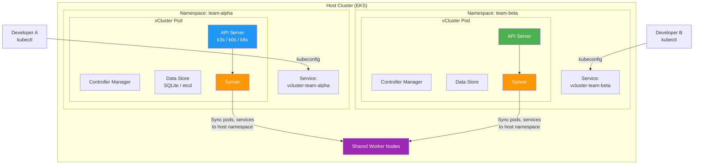
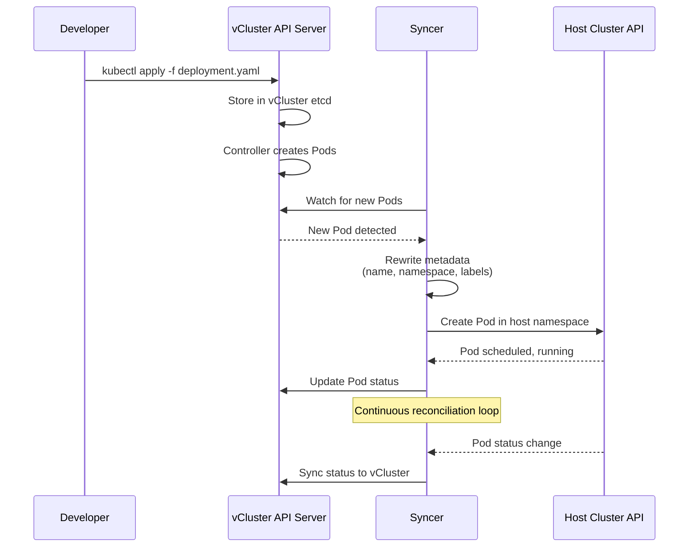
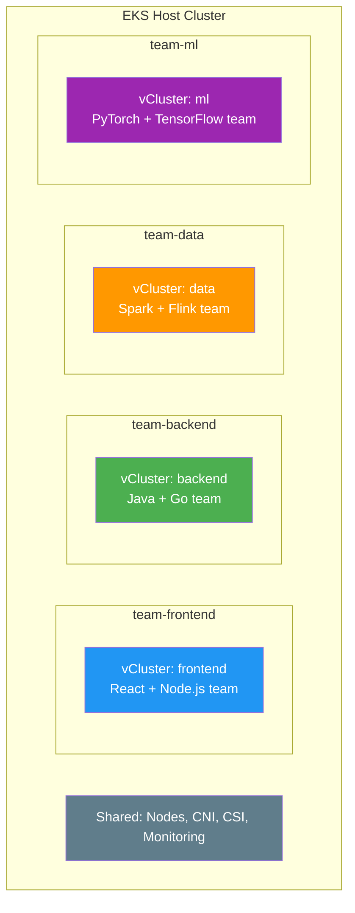
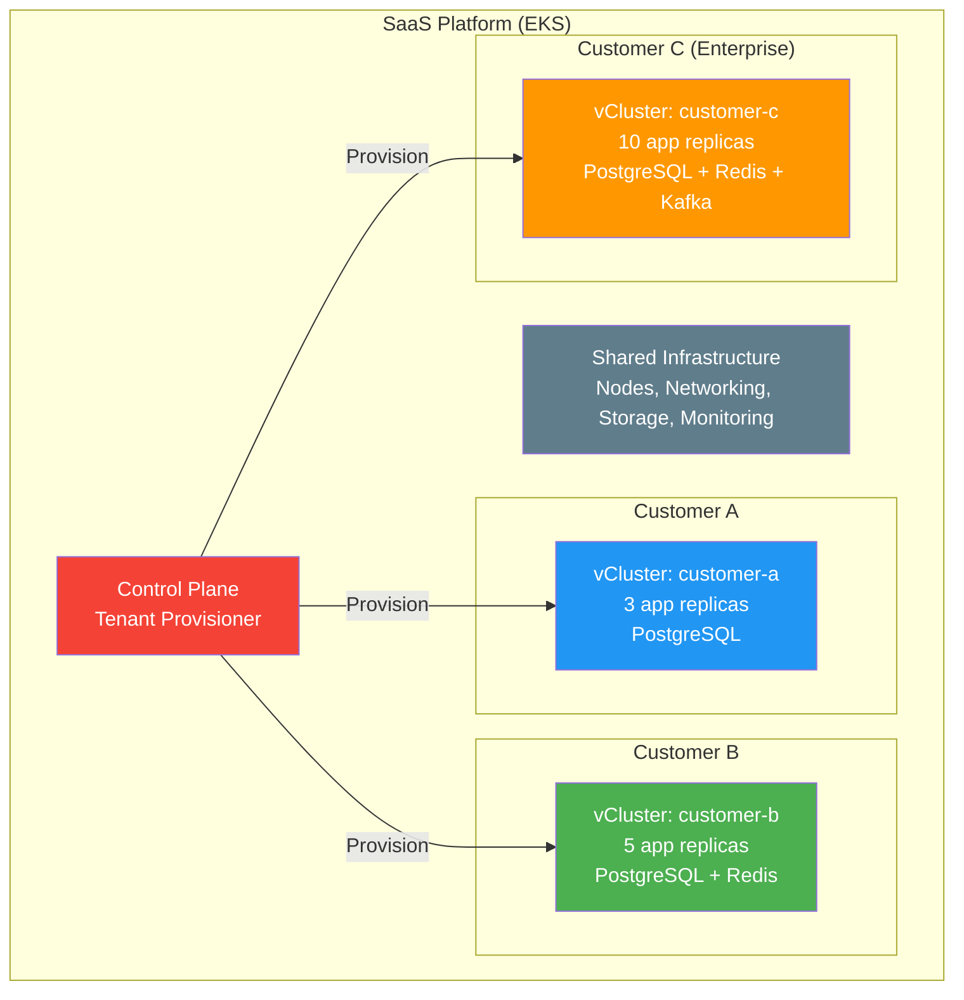
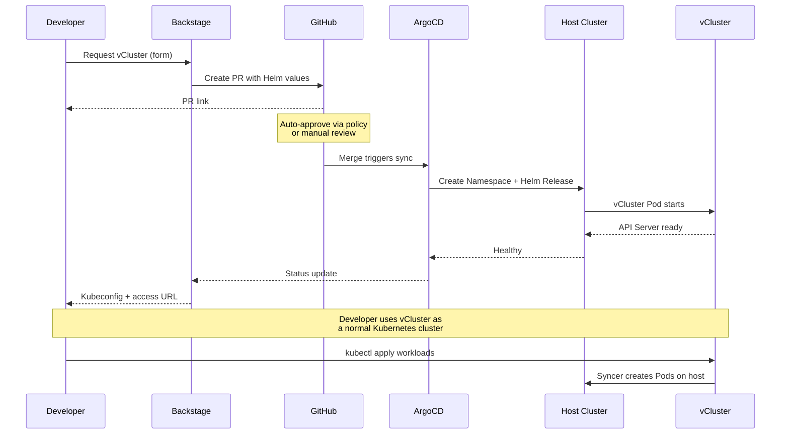

# vCluster

> **サポートされるバージョン**: vCluster v0.21+, vCluster Pro v0.21+
> **最終更新**: June 2025

## Table of Contents

- [Overview](#overview)
- [Learning Objectives](#learning-objectives)
- [vCluster Architecture](#vcluster-architecture)
- [EKS Installation and Configuration](#eks-installation-and-configuration)
- [Virtual Cluster Operations](#virtual-cluster-operations)
- [Multi-Tenancy Patterns](#multi-tenancy-patterns)
- [Security and Isolation](#security-and-isolation)
- [Backstage + vCluster Integration](#backstage--vcluster-integration)
- [Production Operations](#production-operations)
- [Best Practices](#best-practices)
- [References](#references)

---

## Overview

### What is vCluster?

vCluster は Loft Labs によるオープンソースプロジェクトで、ホスト Kubernetes cluster の namespace 内で動作する、完全に機能する仮想 Kubernetes cluster を作成します。各仮想 cluster には専用の API server、control plane、syncer がありますが、基盤となる worker nodes と host cluster の container runtime を共有します。ユーザーや workload から見ると、仮想 cluster は実際の cluster と区別がつきません。CRDs、admission webhooks、RBAC、そして完全な Kubernetes API をサポートしながら、追加の infrastructure は不要です。

Namespace と RBAC のみに依存する従来の multi-tenancy アプローチとは異なり、vCluster は真の control plane 分離を提供します。各 tenant は完全な Kubernetes control plane を受け取り、その中で cluster-admin として操作し、独自の CRDs をインストールし、独自の admission controllers を設定し、cluster-scoped resources を管理できます。これらはすべて、他の tenants や host cluster に影響を与えることなく行えます。

### Why Virtual Clusters?

Kubernetes における multi-tenancy の従来のアプローチには、それぞれ大きなトレードオフがあります。

- **Namespace isolation** は基本的な分離を提供しますが、CRDs、cluster-scoped resources、admission webhooks は分離できません。Tenants は単一の API server を共有し、共有 resources をめぐって調整する必要があります。
- **Separate physical clusters** は強力な分離を提供しますが、infrastructure コスト、運用負荷、管理の複雑さを増大させます。新しい cluster のプロビジョニングには数分から数時間かかります。
- **Virtual clusters** はこれらの両極端の中間に位置します。各 tenant に専用の API server と完全な cluster-admin access を提供する強力な分離を実現しながら、基盤となる compute、storage、networking infrastructure を共有します。

### Multi-Tenancy Approach Comparison

| Criteria | Namespace Isolation | vCluster | Physical Cluster |
|----------|-------------------|----------|-----------------|
| **Isolation Level** | Low (shared API server) | High (dedicated API server) | Highest (separate infrastructure) |
| **CRD Isolation** | None (shared across cluster) | Full (per-vCluster CRDs) | Full |
| **Cluster-Admin Access** | Not possible for tenants | Yes (within vCluster) | Yes |
| **Admission Webhooks** | Shared (cluster-wide) | Isolated (per-vCluster) | Isolated |
| **RBAC Complexity** | High (many role bindings) | Low (cluster-admin per tenant) | Low |
| **Provisioning Time** | Seconds (create namespace) | Seconds to minutes | Minutes to hours |
| **Infrastructure Cost** | Lowest (shared everything) | Low (shared nodes, minimal overhead) | Highest (dedicated nodes) |
| **Resource Overhead** | None | ~100-200 MiB per vCluster | Full control plane per cluster |
| **Operational Overhead** | Low | Medium | High (cluster lifecycle) |
| **Node Sharing** | Yes | Yes | No (unless multi-cluster scheduling) |
| **Network Isolation** | Requires NetworkPolicy | Requires NetworkPolicy + Syncer rules | Physical separation possible |
| **Scalability** | Limited by API server load | Hundreds per host cluster | Limited by infrastructure budget |
| **GitOps Compatibility** | Native | Native (standard kubeconfig) | Native |

### CNCF Sandbox Project

vCluster は 2024 年 11 月に CNCF Sandbox に採択され、cloud-native コミュニティが virtual clusters を multi-tenancy と platform engineering の正当なパターンとして認識していることを示しました。このプロジェクトは GitHub stars が 7,000 を超え、スタートアップから Fortune 500 企業まで幅広い組織で production 利用されています。Loft Labs の商用製品である vCluster Pro は、集中管理、Sleep Mode、Auto-Delete、高度な RBAC など、大規模な multi-tenant operations 向けに設計された機能を追加します。

---

## Learning Objectives

このドキュメントを完了すると、次のことができるようになります。

1. 仮想 cluster の概念と、vCluster が単一の host cluster 内で control plane 分離を実現する方法を **説明** できる
2. multi-tenancy アプローチ（namespaces、vCluster、physical clusters）を **比較** し、ユースケースに適した戦略を選択できる
3. CLI と Helm を使用して Amazon EKS に vCluster を **インストール** し、EBS CSI、ALB Ingress、IRSA 向けの EKS 固有設定を適用できる
4. pause、resume、deletion などの lifecycle operations を含め、virtual clusters を **作成および管理** できる
5. virtual clusters と host clusters の間を流れる Kubernetes resources を制御する resource synchronization rules を **設定** できる
6. development environments、CI/CD pipelines、preview environments、multi-tenant SaaS platforms 向けの multi-tenancy patterns を **設計** できる
7. NetworkPolicy isolation、ResourceQuota enforcement、Pod Security Standards、RBAC を含む security controls を **実装** できる
8. Internal Developer Platform における self-service virtual cluster provisioning のために、vCluster を Backstage および ArgoCD と **統合** できる
9. monitoring、backup、upgrade strategies、Sleep Mode と Auto-Delete による cost optimization を用いて、production で vCluster を **運用** できる

---

## vCluster Architecture

### Virtual Control Plane

各 vCluster は、host cluster 上の単一の pod（または StatefulSet）内で軽量な Kubernetes control plane を実行します。仮想 control plane は、API server、controller manager、data store（etcd または軽量な代替）で構成されます。Syncer component は、選択された resources を同期することで、virtual cluster と host cluster の橋渡しをします。



### Syncer Component

Syncer は vCluster の中核的な革新です。virtual cluster と host cluster の間で双方向の橋渡しとして動作し、境界を越えて Kubernetes resources を変換・同期します。ユーザーが vCluster 内で Pod を作成すると、Syncer は host namespace 内に対応する Pod を作成します。ただし、virtual clusters 間の衝突を防ぐために、names、labels、metadata は書き換えられます。



**Resource synchronization の動作:**

| Resource Type | Direction | Behavior |
|--------------|-----------|----------|
| Pods | vCluster -> Host | Created in host namespace with rewritten names |
| Services | vCluster -> Host | Synced to host; ClusterIP re-mapped |
| Endpoints | Bidirectional | Kept in sync for service discovery |
| ConfigMaps | vCluster -> Host (for mounted) | Only synced if referenced by a synced Pod |
| Secrets | vCluster -> Host (for mounted) | Only synced if referenced by a synced Pod |
| Ingresses | vCluster -> Host | Synced to host for ingress controller processing |
| PersistentVolumeClaims | vCluster -> Host | Synced to host for storage provisioning |
| PersistentVolumes | Host -> vCluster | Synced from host after PVC binding |
| StorageClasses | Host -> vCluster | Synced from host so tenants can select storage |
| IngressClasses | Host -> vCluster | Synced from host for ingress configuration |
| CSIDrivers | Host -> vCluster | Synced from host for volume support |
| CSINodes | Host -> vCluster | Synced from host for scheduling |
| Nodes | Host -> vCluster (virtual) | Fake or real node objects synced for scheduling |

### Backing Distributions

vCluster は、仮想 control plane backend として 3 つの Kubernetes distributions をサポートします。

| Distribution | Default | Control Plane Footprint | CRD Support | Notes |
|-------------|---------|------------------------|-------------|-------|
| **k3s** | Yes | ~100 MiB RAM, ~0.5 CPU | Full | Lightweight, fast startup. Built-in CoreDNS, Traefik disabled in vCluster mode. |
| **k0s** | No | ~150 MiB RAM, ~0.5 CPU | Full | Zero-friction Kubernetes by Mirantis. Single binary, minimal dependencies. |
| **Vanilla k8s** | No | ~500 MiB RAM, ~1 CPU | Full | Upstream Kubernetes API server + etcd. Highest fidelity, highest resource cost. Recommended when exact API compatibility is critical. |

Distribution の選択は resource overhead に影響しますが、機能には影響しません。3 つすべてが CRDs、admission webhooks、完全な Kubernetes API surface をサポートします。ほとんどの platform engineering のユースケースでは、k3s が互換性と resource efficiency の最適なバランスを提供します。

### Relationship with Host Cluster

Virtual cluster と host cluster は、明確な責務分離を維持します。

- **Virtual cluster owns**: API resources（Deployments、StatefulSets、CRDs、RBAC、admission webhooks）、workload scheduling decisions（tenant の視点）、および vCluster 内の namespace-scoped objects。
- **Host cluster owns**: 実際の Pod scheduling on nodes、networking（CNI、NetworkPolicy enforcement）、storage provisioning（CSI drivers、StorageClasses）、および physical resource allocation。
- **Syncer bridges**: Virtual cluster resources を host cluster resources に変換し、status を戻します。Syncer は vCluster name を含むように resource names を書き換え、衝突を防ぎます。たとえば、vCluster `team-alpha` 内の `nginx` という名前の Pod は、host namespace では `nginx-x-default-x-team-alpha` になります。

---

## EKS Installation and Configuration

### Prerequisites

EKS に vCluster をインストールする前に、次を確認してください。

```bash
# Verify EKS cluster access
kubectl cluster-info
kubectl get nodes

# Required: Helm v3.10+
helm version

# Required: kubectl v1.28+
kubectl version --client
```

### vCluster CLI Installation

vCluster CLI は、virtual clusters を作成および管理する最も簡単な方法を提供します。

```bash
# macOS
brew install loft-sh/tap/vcluster

# Linux (amd64)
curl -L -o vcluster "https://github.com/loft-sh/vcluster/releases/latest/download/vcluster-linux-amd64"
chmod +x vcluster
sudo mv vcluster /usr/local/bin/

# Verify installation
vcluster --version
# vcluster version 0.21.x
```

### Helm Installation

GitOps workflows やプログラムによる管理では、vCluster を Helm 経由でデプロイできます。

```bash
# Add the vCluster Helm repository
helm repo add loft-sh https://charts.loft.sh
helm repo update

# Install a vCluster named "team-alpha" in namespace "team-alpha"
kubectl create namespace team-alpha

helm install team-alpha loft-sh/vcluster \
  --namespace team-alpha \
  --values vcluster-values.yaml \
  --version 0.21.0
```

### vcluster.yaml Configuration File

`vcluster.yaml` file は virtual cluster のあらゆる側面を制御します。以下は、EKS 向けの完全で production-ready な設定です。

```yaml
# vcluster.yaml -- Complete EKS production configuration
# Documentation: https://www.vcluster.com/docs/vcluster/configure/vcluster-yaml

# --- Control Plane Configuration ---
controlPlane:
  # Backing distribution: k3s (default), k0s, or k8s
  distro:
    k3s:
      enabled: true
      image:
        repository: rancher/k3s
        tag: v1.31.2-k3s1
      # Disable k3s built-in components not needed in vCluster
      extraArgs:
        - --disable=traefik,servicelb,metrics-server,local-storage

  # StatefulSet configuration for the vCluster control plane
  statefulSet:
    resources:
      requests:
        cpu: 200m
        memory: 256Mi
      limits:
        cpu: "1"
        memory: 1Gi
    persistence:
      # Use EBS for the vCluster data store
      size: 10Gi
      storageClass: gp3
    labels:
      app.kubernetes.io/managed-by: vcluster
      team: platform
    scheduling:
      nodeSelector:
        node.kubernetes.io/instance-type: m6i.large
      tolerations:
        - key: dedicated
          operator: Equal
          value: vcluster
          effect: NoSchedule

  # Ingress for API server access (optional -- alternative to LoadBalancer)
  ingress:
    enabled: false

  # Service configuration for API server access
  service:
    spec:
      type: ClusterIP  # Use ClusterIP with vcluster connect, or LoadBalancer for direct access

# --- Syncer Configuration ---
sync:
  # Resources synced FROM the virtual cluster TO the host cluster
  toHost:
    pods:
      enabled: true
    services:
      enabled: true
    configmaps:
      enabled: true
    secrets:
      enabled: true
    endpoints:
      enabled: true
    persistentvolumeclaims:
      enabled: true
    ingresses:
      enabled: true
    serviceaccounts:
      enabled: true
    networkpolicies:
      enabled: true

  # Resources synced FROM the host cluster TO the virtual cluster
  fromHost:
    nodes:
      enabled: true
      selector:
        labels:
          vcluster-enabled: "true"
    storageClasses:
      enabled: true
    ingressClasses:
      enabled: true
    csiDrivers:
      enabled: true
    csiNodes:
      enabled: true
    csiStorageCapacities:
      enabled: true

# --- Networking Configuration ---
networking:
  # Reuse host cluster DNS for external resolution
  replicateServices:
    fromHost:
      - from: kube-system/aws-load-balancer-webhook-service
        to: kube-system/aws-load-balancer-webhook-service
    toHost: []

  # Resolve DNS via host cluster CoreDNS
  resolveDNS:
    - hostname: "*.amazonaws.com"
      target: host
      service: ""

# --- Plugin Configuration ---
plugins: {}

# --- RBAC Configuration ---
rbac:
  # Role used by the Syncer on the host cluster
  role:
    # Extra rules needed for EKS-specific resources
    extraRules:
      - apiGroups: ["networking.k8s.io"]
        resources: ["networkpolicies"]
        verbs: ["create", "delete", "patch", "update", "get", "list", "watch"]

  # ClusterRole for host-level access
  clusterRole:
    extraRules:
      - apiGroups: ["storage.k8s.io"]
        resources: ["storageclasses", "csinodes", "csidrivers", "csistoragecapacities"]
        verbs: ["get", "list", "watch"]

# --- Export / Import CRDs ---
exportKubeconfig:
  context: vcluster-team-alpha
  server: https://localhost:8443

# --- Telemetry ---
telemetry:
  enabled: false
```

### EKS-Specific Configuration

#### EBS CSI Driver Integration

Amazon EBS CSI driver は host cluster 上で実行されます。vCluster tenants は StorageClass synchronization を通じてそれを透過的に利用します。

```yaml
# Verify EBS CSI driver is running on the host
# kubectl get pods -n kube-system -l app.kubernetes.io/name=aws-ebs-csi-driver

# vcluster.yaml -- StorageClass sync (enabled by default)
sync:
  fromHost:
    storageClasses:
      enabled: true

# Inside the vCluster, tenants can now use EBS StorageClasses:
# kubectl get sc
# NAME            PROVISIONER             RECLAIMPOLICY   VOLUMEBINDINGMODE
# gp3 (default)   ebs.csi.aws.com         Delete          WaitForFirstConsumer
```

特定の StorageClass を vCluster 内で利用可能にするには、次のようにします。

```yaml
# StorageClass on the host cluster
apiVersion: storage.k8s.io/v1
kind: StorageClass
metadata:
  name: gp3
  annotations:
    storageclass.kubernetes.io/is-default-class: "true"
provisioner: ebs.csi.aws.com
parameters:
  type: gp3
  encrypted: "true"
volumeBindingMode: WaitForFirstConsumer
allowVolumeExpansion: true
```

#### ALB Ingress Controller Integration

AWS Load Balancer Controller は host cluster 上で実行されます。vCluster は Ingress resources を host に同期し、そこで controller によって処理されます。

```yaml
# vcluster.yaml -- Ingress sync configuration
sync:
  toHost:
    ingresses:
      enabled: true

# Inside the vCluster, tenants create Ingresses that reference the ALB class:
# ---
# apiVersion: networking.k8s.io/v1
# kind: Ingress
# metadata:
#   name: my-app
#   annotations:
#     alb.ingress.kubernetes.io/scheme: internet-facing
#     alb.ingress.kubernetes.io/target-type: ip
# spec:
#   ingressClassName: alb
#   rules:
#     - host: app.example.com
#       http:
#         paths:
#           - path: /
#             pathType: Prefix
#             backend:
#               service:
#                 name: my-app
#                 port:
#                   number: 80
```

#### IRSA (IAM Roles for Service Accounts) Integration

IRSA は vCluster と host cluster の間で調整が必要です。実際の Pods は host 上で実行されるためです。Syncer は ServiceAccount annotations を host に同期し、IRSA mutating webhook が正しい IAM credentials を注入できるようにする必要があります。

```yaml
# vcluster.yaml -- ServiceAccount sync for IRSA
sync:
  toHost:
    serviceaccounts:
      enabled: true

# Step 1: Create the IAM role with the OIDC trust policy
# The trust policy must reference the HOST cluster's OIDC provider,
# and the service account namespace must be the HOST namespace (e.g., team-alpha),
# not the vCluster's internal namespace.

# Step 2: Inside the vCluster, create a ServiceAccount with the IAM role annotation
# ---
# apiVersion: v1
# kind: ServiceAccount
# metadata:
#   name: s3-reader
#   namespace: default
#   annotations:
#     eks.amazonaws.com/role-arn: arn:aws:iam::123456789012:role/vcluster-team-alpha-s3-reader
```

**vCluster workloads 向けの IRSA trust policy:**

```json
{
  "Version": "2012-10-17",
  "Statement": [
    {
      "Effect": "Allow",
      "Principal": {
        "Federated": "arn:aws:iam::123456789012:oidc-provider/oidc.eks.us-west-2.amazonaws.com/id/EXAMPLED539D4633E53DE1B71EXAMPLE"
      },
      "Action": "sts:AssumeRoleWithWebIdentity",
      "Condition": {
        "StringEquals": {
          "oidc.eks.us-west-2.amazonaws.com/id/EXAMPLED539D4633E53DE1B71EXAMPLE:sub": "system:serviceaccount:team-alpha:s3-reader-x-default-x-team-alpha"
        }
      }
    }
  ]
}
```

`sub` claim 内の書き換えられた ServiceAccount name、`s3-reader-x-default-x-team-alpha` に注意してください。Syncer は vCluster namespace を含めるように ServiceAccount name を書き換えるため、OIDC trust policy はこの書き換え後の name と一致する必要があります。

#### Resource Limits for vCluster Control Plane

単一の vCluster が host resources を過剰に消費するのを防ぐため、vCluster control plane に resource limits を適用します。

```yaml
# vcluster.yaml -- Resource limits
controlPlane:
  statefulSet:
    resources:
      requests:
        cpu: 200m
        memory: 256Mi
      limits:
        cpu: "1"
        memory: 1Gi
    persistence:
      size: 10Gi
      storageClass: gp3

# Additionally, set a ResourceQuota on the host namespace
# to limit the total resources a vCluster's workloads can consume
# ---
# apiVersion: v1
# kind: ResourceQuota
# metadata:
#   name: team-alpha-quota
#   namespace: team-alpha
# spec:
#   hard:
#     requests.cpu: "8"
#     requests.memory: 16Gi
#     limits.cpu: "16"
#     limits.memory: 32Gi
#     pods: "50"
#     persistentvolumeclaims: "10"
```

---

## Virtual Cluster Operations

### Create a Virtual Cluster

```bash
# Using the vCluster CLI (quickest method)
vcluster create team-alpha \
  --namespace team-alpha \
  --connect=false \
  --values vcluster-values.yaml

# Using Helm (GitOps-friendly)
helm install team-alpha loft-sh/vcluster \
  --namespace team-alpha \
  --create-namespace \
  --values vcluster-values.yaml

# Verify the vCluster is running
kubectl get pods -n team-alpha
# NAME                                    READY   STATUS    RESTARTS   AGE
# team-alpha-0                            1/1     Running   0          45s

kubectl get statefulset -n team-alpha
# NAME         READY   AGE
# team-alpha   1/1     50s
```

### Connect and Access the Virtual Cluster

```bash
# Connect using the CLI (sets up port forwarding + kubeconfig automatically)
vcluster connect team-alpha --namespace team-alpha

# This modifies your kubeconfig and switches context.
# You are now inside the virtual cluster:
kubectl get namespaces
# NAME              STATUS   AGE
# default           Active   2m
# kube-system       Active   2m
# kube-public       Active   2m
# kube-node-lease   Active   2m

# Verify you have cluster-admin access
kubectl auth can-i '*' '*'
# yes

# Disconnect (restore previous kubeconfig context)
vcluster disconnect
```

### Export Kubeconfig for External Access

CI/CD pipelines や team への配布のために、standalone kubeconfig を export します。

```bash
# Export kubeconfig to a file
vcluster connect team-alpha \
  --namespace team-alpha \
  --update-current=false \
  --kube-config ./team-alpha-kubeconfig.yaml

# Use the exported kubeconfig
export KUBECONFIG=./team-alpha-kubeconfig.yaml
kubectl get nodes
```

Port forwarding なしの永続的な access には、LoadBalancer または Ingress 経由で vCluster API server を公開します。

```yaml
# vcluster.yaml -- LoadBalancer service for direct access
controlPlane:
  service:
    spec:
      type: LoadBalancer
      annotations:
        service.beta.kubernetes.io/aws-load-balancer-scheme: internal
        service.beta.kubernetes.io/aws-load-balancer-type: nlb
```

### Delete a Virtual Cluster

```bash
# Using the CLI
vcluster delete team-alpha --namespace team-alpha

# Using Helm
helm uninstall team-alpha --namespace team-alpha

# Clean up the namespace (optional -- removes PVCs and any remaining resources)
kubectl delete namespace team-alpha
```

vCluster が削除されると、Syncer は host namespace に作成したすべての resources をクリーンアップします。vCluster の workloads によってプロビジョニングされた PersistentVolumes は、StorageClass の reclaim policy に従います。

### Pause and Resume (vCluster Pro)

vCluster Pro は、off-hours に resources を節約するための virtual clusters の一時停止をサポートします。一時停止された vCluster は StatefulSet をゼロ replicas に scale し、ディスク上のすべての data を保持したまま CPU と memory を解放します。

```bash
# Pause a vCluster (scales to 0 replicas)
vcluster pause team-alpha --namespace team-alpha

# Verify the vCluster is paused
kubectl get statefulset -n team-alpha
# NAME         READY   AGE
# team-alpha   0/1     24h

# Resume a vCluster
vcluster resume team-alpha --namespace team-alpha

# The vCluster restarts with all state intact
kubectl get statefulset -n team-alpha
# NAME         READY   AGE
# team-alpha   1/1     24h
```

### Resource Synchronization Rules

#### syncToHost -- Virtual Cluster to Host

実際の実行のために host cluster 上に存在する必要がある、vCluster 内で作成された resources。

```yaml
# vcluster.yaml
sync:
  toHost:
    # Core workload resources
    pods:
      enabled: true
      # Translate labels to avoid conflicts
      translatePatches:
        - path: metadata.labels.app
          expression: "'vcluster-' + value"
    services:
      enabled: true
    endpoints:
      enabled: true

    # Configuration resources (synced only if referenced by a Pod)
    configmaps:
      enabled: true
    secrets:
      enabled: true

    # Storage resources
    persistentvolumeclaims:
      enabled: true

    # Networking resources
    ingresses:
      enabled: true
    networkpolicies:
      enabled: true

    # Custom resources (sync CRDs from vCluster to host)
    customResources:
      certificates.cert-manager.io:
        enabled: true
```

#### syncFromHost -- Host to Virtual Cluster

Host cluster 上に存在し、vCluster 内で見えるようにすべき resources。

```yaml
# vcluster.yaml
sync:
  fromHost:
    # Node information for scheduling decisions
    nodes:
      enabled: true
      selector:
        labels:
          vcluster-enabled: "true"
      # Optionally clear node status to hide host details
      clearImageStatus: true

    # Storage infrastructure
    storageClasses:
      enabled: true
    csiDrivers:
      enabled: true
    csiNodes:
      enabled: true
    csiStorageCapacities:
      enabled: true

    # Networking infrastructure
    ingressClasses:
      enabled: true

    # Custom resources from host
    customResources:
      clusterissuers.cert-manager.io:
        enabled: true
```

### Storage Synchronization

Tenant が vCluster 内で PVC を作成すると、Syncer は host namespace に対応する PVC を作成します。Host cluster の CSI driver が実際の volume をプロビジョニングします。

```yaml
# Inside the vCluster -- tenant creates a PVC
apiVersion: v1
kind: PersistentVolumeClaim
metadata:
  name: data-volume
  namespace: default
spec:
  accessModes:
    - ReadWriteOnce
  storageClassName: gp3
  resources:
    requests:
      storage: 20Gi
---
# On the host cluster, the Syncer creates:
# PVC name: data-volume-x-default-x-team-alpha
# Namespace: team-alpha
# The EBS CSI driver provisions the volume as usual
```

### Service Exposure

Tenants は、vCluster 内から 3 つの方法で services を公開できます。

**LoadBalancer（production services に推奨）:**

```yaml
# Inside the vCluster
apiVersion: v1
kind: Service
metadata:
  name: my-api
  namespace: default
  annotations:
    service.beta.kubernetes.io/aws-load-balancer-scheme: internet-facing
    service.beta.kubernetes.io/aws-load-balancer-type: nlb
spec:
  type: LoadBalancer
  selector:
    app: my-api
  ports:
    - port: 443
      targetPort: 8443
      protocol: TCP
# The Syncer creates this Service on the host cluster.
# The AWS Load Balancer Controller provisions an NLB.
```

**Ingress（HTTP/HTTPS services に推奨）:**

```yaml
# Inside the vCluster
apiVersion: networking.k8s.io/v1
kind: Ingress
metadata:
  name: my-app
  namespace: default
  annotations:
    alb.ingress.kubernetes.io/scheme: internet-facing
    alb.ingress.kubernetes.io/target-type: ip
    alb.ingress.kubernetes.io/certificate-arn: arn:aws:acm:us-west-2:123456789012:certificate/abc-123
spec:
  ingressClassName: alb
  rules:
    - host: myapp.example.com
      http:
        paths:
          - path: /
            pathType: Prefix
            backend:
              service:
                name: my-app
                port:
                  number: 80
```

**NodePort（testing and development 用）:**

```yaml
# Inside the vCluster
apiVersion: v1
kind: Service
metadata:
  name: debug-service
  namespace: default
spec:
  type: NodePort
  selector:
    app: debug
  ports:
    - port: 8080
      targetPort: 8080
      nodePort: 30080
```

---

## Multi-Tenancy Patterns

### Pattern 1: Development Environment Isolation (Per-Team vCluster)

各 development team に日常作業用の専用 vCluster を割り当てます。Teams は vCluster 内で cluster-admin access を持ち、必要な CRDs や tools を他に影響を与えずにインストールできます。



```yaml
# vcluster-team-frontend.yaml
controlPlane:
  distro:
    k3s:
      enabled: true
  statefulSet:
    resources:
      requests:
        cpu: 200m
        memory: 256Mi
      limits:
        cpu: "1"
        memory: 1Gi
    labels:
      team: frontend
      environment: development

sync:
  toHost:
    pods:
      enabled: true
    services:
      enabled: true
    ingresses:
      enabled: true
    persistentvolumeclaims:
      enabled: true
  fromHost:
    storageClasses:
      enabled: true
    ingressClasses:
      enabled: true
    nodes:
      enabled: true
```

```bash
# Create vClusters for each team
for team in frontend backend data ml; do
  kubectl create namespace "team-${team}"

  vcluster create "${team}" \
    --namespace "team-${team}" \
    --values "vcluster-team-${team}.yaml" \
    --connect=false
done

# Distribute kubeconfigs to each team
for team in frontend backend data ml; do
  vcluster connect "${team}" \
    --namespace "team-${team}" \
    --update-current=false \
    --kube-config "./kubeconfigs/${team}-kubeconfig.yaml"
done
```

### Pattern 2: CI/CD Ephemeral Environments

各 CI/CD pipeline run ごとに新しい vCluster を作成します。vCluster は pipeline の開始時に作成され、その中で tests が実行され、pipeline の完了時に破棄されます。これにより、すべての test run でクリーンな environment が保証されます。

```yaml
# .github/workflows/integration-test.yaml
name: Integration Tests
on:
  push:
    branches: [main, develop]

jobs:
  test:
    runs-on: ubuntu-latest
    steps:
      - uses: actions/checkout@v4

      - name: Install vCluster CLI
        run: |
          curl -L -o vcluster "https://github.com/loft-sh/vcluster/releases/latest/download/vcluster-linux-amd64"
          chmod +x vcluster
          sudo mv vcluster /usr/local/bin/

      - name: Configure kubectl
        uses: aws-actions/configure-aws-credentials@v4
        with:
          role-to-assume: arn:aws:iam::123456789012:role/github-actions-eks
          aws-region: us-west-2
      - run: aws eks update-kubeconfig --name my-cluster --region us-west-2

      - name: Create ephemeral vCluster
        run: |
          VCLUSTER_NAME="ci-${GITHUB_RUN_ID}-${GITHUB_RUN_ATTEMPT}"
          vcluster create "${VCLUSTER_NAME}" \
            --namespace ci-environments \
            --connect=true \
            --values ci-vcluster.yaml

      - name: Run integration tests
        run: |
          kubectl apply -f ./k8s/manifests/
          kubectl wait --for=condition=available deployment/my-app --timeout=120s
          make integration-test

      - name: Cleanup vCluster
        if: always()
        run: |
          VCLUSTER_NAME="ci-${GITHUB_RUN_ID}-${GITHUB_RUN_ATTEMPT}"
          vcluster delete "${VCLUSTER_NAME}" \
            --namespace ci-environments \
            --delete-namespace=false
```

```yaml
# ci-vcluster.yaml -- Minimal configuration for CI
controlPlane:
  distro:
    k3s:
      enabled: true
  statefulSet:
    resources:
      requests:
        cpu: 100m
        memory: 128Mi
      limits:
        cpu: 500m
        memory: 512Mi
    persistence:
      size: 5Gi

sync:
  toHost:
    pods:
      enabled: true
    services:
      enabled: true
    configmaps:
      enabled: true
    secrets:
      enabled: true
  fromHost:
    storageClasses:
      enabled: true
```

### Pattern 3: Preview Environments (Per-PR vCluster)

すべての pull request に対して vCluster を作成し、reviewers が変更の live preview にアクセスできるようにします。

```yaml
# .github/workflows/preview.yaml
name: Preview Environment
on:
  pull_request:
    types: [opened, synchronize, reopened]

jobs:
  preview:
    runs-on: ubuntu-latest
    steps:
      - uses: actions/checkout@v4

      - name: Setup tools
        run: |
          curl -L -o vcluster "https://github.com/loft-sh/vcluster/releases/latest/download/vcluster-linux-amd64"
          chmod +x vcluster && sudo mv vcluster /usr/local/bin/

      - name: Configure EKS access
        uses: aws-actions/configure-aws-credentials@v4
        with:
          role-to-assume: arn:aws:iam::123456789012:role/github-actions-eks
          aws-region: us-west-2
      - run: aws eks update-kubeconfig --name my-cluster --region us-west-2

      - name: Create or update preview vCluster
        run: |
          VCLUSTER_NAME="pr-${{ github.event.pull_request.number }}"

          # Create if it does not exist
          if ! vcluster list --namespace preview-envs | grep -q "${VCLUSTER_NAME}"; then
            vcluster create "${VCLUSTER_NAME}" \
              --namespace preview-envs \
              --values preview-vcluster.yaml \
              --connect=true
          else
            vcluster connect "${VCLUSTER_NAME}" \
              --namespace preview-envs
          fi

          # Deploy the application
          kubectl apply -f ./k8s/manifests/
          kubectl set image deployment/my-app \
            my-app=123456789012.dkr.ecr.us-west-2.amazonaws.com/my-app:pr-${{ github.event.pull_request.number }}

      - name: Post preview URL
        uses: actions/github-script@v7
        with:
          script: |
            github.rest.issues.createComment({
              issue_number: context.issue.number,
              owner: context.repo.owner,
              repo: context.repo.repo,
              body: `Preview environment ready: https://pr-${context.issue.number}.preview.example.com`
            })
```

```yaml
# Cleanup workflow when PR is closed
# .github/workflows/preview-cleanup.yaml
name: Preview Cleanup
on:
  pull_request:
    types: [closed]

jobs:
  cleanup:
    runs-on: ubuntu-latest
    steps:
      - name: Delete preview vCluster
        run: |
          VCLUSTER_NAME="pr-${{ github.event.pull_request.number }}"
          vcluster delete "${VCLUSTER_NAME}" \
            --namespace preview-envs \
            --delete-namespace=false
```

### Pattern 4: Training Environments

Kubernetes training sessions 向けに分離された vClusters をプロビジョニングします。各 participant は pre-installed sample applications を持つ専用 cluster を受け取ります。

```bash
#!/bin/bash
# provision-training.sh -- Create vClusters for a training session

TRAINING_ID="k8s-workshop-$(date +%Y%m%d)"
PARTICIPANT_COUNT=25

for i in $(seq 1 ${PARTICIPANT_COUNT}); do
  VCLUSTER_NAME="${TRAINING_ID}-student-${i}"

  vcluster create "${VCLUSTER_NAME}" \
    --namespace training \
    --values training-vcluster.yaml \
    --connect=false &

  echo "Creating vCluster for student ${i}..."
done

wait
echo "All ${PARTICIPANT_COUNT} vClusters created."

# Export kubeconfigs for distribution
for i in $(seq 1 ${PARTICIPANT_COUNT}); do
  VCLUSTER_NAME="${TRAINING_ID}-student-${i}"

  vcluster connect "${VCLUSTER_NAME}" \
    --namespace training \
    --update-current=false \
    --kube-config "./kubeconfigs/student-${i}.yaml"
done
```

```yaml
# training-vcluster.yaml
controlPlane:
  distro:
    k3s:
      enabled: true
  statefulSet:
    resources:
      requests:
        cpu: 100m
        memory: 128Mi
      limits:
        cpu: 500m
        memory: 512Mi
    persistence:
      size: 2Gi

sync:
  toHost:
    pods:
      enabled: true
    services:
      enabled: true
  fromHost:
    storageClasses:
      enabled: true
    nodes:
      enabled: true
```

### Pattern 5: Multi-Tenant SaaS Platform

顧客に Kubernetes-based functionality を提供する SaaS platforms では、vCluster により shared infrastructure 上で per-customer isolation が可能になります。



```yaml
# saas-customer-vcluster.yaml -- Per-customer vCluster with tiered resources
controlPlane:
  distro:
    k3s:
      enabled: true
  statefulSet:
    resources:
      requests:
        cpu: 200m
        memory: 256Mi
      limits:
        cpu: "2"
        memory: 2Gi
    persistence:
      size: 20Gi
      storageClass: gp3

sync:
  toHost:
    pods:
      enabled: true
    services:
      enabled: true
    ingresses:
      enabled: true
    persistentvolumeclaims:
      enabled: true
    networkpolicies:
      enabled: true
  fromHost:
    storageClasses:
      enabled: true
    ingressClasses:
      enabled: true
    nodes:
      enabled: true
      selector:
        labels:
          node-pool: saas-tenants
```

---

## Security and Isolation

### NetworkPolicy Isolation

vCluster namespaces 間の traffic を制限するため、host cluster に NetworkPolicies を適用します。Syncer は実際の Pods を host namespace に作成するため、host-level NetworkPolicies は CNI によって enforced されます。

```yaml
# host-network-policy.yaml -- Isolate vCluster namespace traffic
apiVersion: networking.k8s.io/v1
kind: NetworkPolicy
metadata:
  name: vcluster-isolation
  namespace: team-alpha
spec:
  podSelector: {}   # Apply to all Pods in the namespace
  policyTypes:
    - Ingress
    - Egress
  ingress:
    # Allow traffic within the same namespace
    - from:
        - podSelector: {}
    # Allow traffic from the vCluster control plane
    - from:
        - podSelector:
            matchLabels:
              app: vcluster
  egress:
    # Allow traffic within the same namespace
    - to:
        - podSelector: {}
    # Allow DNS resolution
    - to:
        - namespaceSelector: {}
          podSelector:
            matchLabels:
              k8s-app: kube-dns
      ports:
        - protocol: UDP
          port: 53
        - protocol: TCP
          port: 53
    # Allow egress to AWS services (S3, RDS, etc.)
    - to:
        - ipBlock:
            cidr: 0.0.0.0/0
            except:
              - 10.0.0.0/8     # Block access to other private subnets
      ports:
        - protocol: TCP
          port: 443
---
# Deny cross-namespace traffic from other vClusters
apiVersion: networking.k8s.io/v1
kind: NetworkPolicy
metadata:
  name: deny-cross-vcluster
  namespace: team-alpha
spec:
  podSelector: {}
  policyTypes:
    - Ingress
  ingress:
    # Only allow from same namespace
    - from:
        - podSelector: {}
```

### ResourceQuota Enforcement

vCluster が消費できる合計 resources を制限するため、host namespace に ResourceQuotas を適用します。これにより、単一の tenant が他を圧迫することを防げます。

```yaml
# host-resource-quota.yaml
apiVersion: v1
kind: ResourceQuota
metadata:
  name: vcluster-resource-quota
  namespace: team-alpha
spec:
  hard:
    # Compute limits
    requests.cpu: "8"
    requests.memory: 16Gi
    limits.cpu: "16"
    limits.memory: 32Gi

    # Object count limits
    pods: "50"
    services: "20"
    services.loadbalancers: "2"
    services.nodeports: "5"
    persistentvolumeclaims: "10"
    secrets: "50"
    configmaps: "50"

    # Storage limits
    requests.storage: 100Gi
---
# LimitRange for default resource requests/limits
apiVersion: v1
kind: LimitRange
metadata:
  name: vcluster-limit-range
  namespace: team-alpha
spec:
  limits:
    - type: Container
      default:
        cpu: 500m
        memory: 512Mi
      defaultRequest:
        cpu: 100m
        memory: 128Mi
      max:
        cpu: "4"
        memory: 8Gi
    - type: PersistentVolumeClaim
      max:
        storage: 50Gi
```

### Pod Security Standards

vCluster tenants によって作成される Pods の security capabilities を制限するため、host namespace に Pod Security Standards を適用します。Syncer は実際の Pods を host namespace に作成するため、これらの制限は host level で enforced されます。

```yaml
# Apply Pod Security Standards to the host namespace
apiVersion: v1
kind: Namespace
metadata:
  name: team-alpha
  labels:
    pod-security.kubernetes.io/enforce: restricted
    pod-security.kubernetes.io/enforce-version: latest
    pod-security.kubernetes.io/audit: restricted
    pod-security.kubernetes.io/audit-version: latest
    pod-security.kubernetes.io/warn: restricted
    pod-security.kubernetes.io/warn-version: latest
```

より細かな制御には、host cluster 上で Kyverno のような policy engine を使用します。

```yaml
# kyverno-policy-vcluster.yaml
apiVersion: kyverno.io/v1
kind: ClusterPolicy
metadata:
  name: vcluster-pod-restrictions
spec:
  validationFailureAction: Enforce
  background: true
  rules:
    - name: restrict-host-namespaces
      match:
        any:
          - resources:
              kinds:
                - Pod
              namespaces:
                - "team-*"
      validate:
        message: "Pods in vCluster namespaces must not use host namespaces."
        pattern:
          spec:
            =(hostNetwork): false
            =(hostPID): false
            =(hostIPC): false

    - name: restrict-privileged
      match:
        any:
          - resources:
              kinds:
                - Pod
              namespaces:
                - "team-*"
      validate:
        message: "Privileged containers are not allowed in vCluster namespaces."
        pattern:
          spec:
            containers:
              - =(securityContext):
                  =(privileged): false
            =(initContainers):
              - =(securityContext):
                  =(privileged): false

    - name: restrict-image-registries
      match:
        any:
          - resources:
              kinds:
                - Pod
              namespaces:
                - "team-*"
      validate:
        message: "Images must come from approved registries."
        pattern:
          spec:
            containers:
              - image: "123456789012.dkr.ecr.*.amazonaws.com/* | docker.io/library/*"
            =(initContainers):
              - image: "123456789012.dkr.ecr.*.amazonaws.com/* | docker.io/library/*"
```

### Admission Webhook Synchronization

デフォルトでは、vCluster 内で設定された admission webhooks はその vCluster 内の resources にのみ適用されます。ただし、host cluster の admission webhooks は、Syncer によって作成されたものを含む、すべての namespaces のすべての Pods に適用されます。これにより layered security model が作られます。

1. **Host cluster webhooks**（例: Kyverno、OPA Gatekeeper、Pod Security Admission）は、すべての vClusters に baseline security を enforced します
2. **vCluster-local webhooks** は、その tenant 固有の追加 policies を enforced します

```yaml
# Inside a vCluster, a tenant can install their own admission webhooks:
# For example, installing Kyverno inside the vCluster:
# helm install kyverno kyverno/kyverno --namespace kyverno --create-namespace

# The tenant's Kyverno policies affect resources INSIDE the vCluster.
# The host cluster's Kyverno policies affect the ACTUAL Pods on the host.
```

### RBAC Configuration

**Host cluster RBAC** -- vClusters を管理できるユーザーを制限します。

```yaml
# ClusterRole for vCluster administrators
apiVersion: rbac.authorization.k8s.io/v1
kind: ClusterRole
metadata:
  name: vcluster-admin
rules:
  - apiGroups: [""]
    resources: ["namespaces"]
    verbs: ["create", "get", "list", "watch"]
  - apiGroups: ["apps"]
    resources: ["statefulsets"]
    verbs: ["*"]
  - apiGroups: [""]
    resources: ["services", "configmaps", "secrets", "serviceaccounts"]
    verbs: ["*"]
  - apiGroups: ["rbac.authorization.k8s.io"]
    resources: ["roles", "rolebindings"]
    verbs: ["*"]
---
# Bind to the platform engineering team
apiVersion: rbac.authorization.k8s.io/v1
kind: ClusterRoleBinding
metadata:
  name: vcluster-admin-binding
subjects:
  - kind: Group
    name: platform-engineering
    apiGroup: rbac.authorization.k8s.io
roleRef:
  kind: ClusterRole
  name: vcluster-admin
  apiGroup: rbac.authorization.k8s.io
```

**Inside the vCluster** -- tenants はデフォルトで完全な cluster-admin access を持ちます。vCluster 内の access を制限する場合（例: sub-teams 向け）は、次のようにします。

```yaml
# Inside the vCluster -- restrict a sub-team to specific namespaces
apiVersion: rbac.authorization.k8s.io/v1
kind: Role
metadata:
  name: developer
  namespace: app-staging
rules:
  - apiGroups: ["", "apps", "batch"]
    resources: ["*"]
    verbs: ["*"]
  - apiGroups: ["networking.k8s.io"]
    resources: ["ingresses"]
    verbs: ["get", "list", "watch", "create", "update", "patch"]
---
apiVersion: rbac.authorization.k8s.io/v1
kind: RoleBinding
metadata:
  name: developer-binding
  namespace: app-staging
subjects:
  - kind: Group
    name: sub-team-alpha
    apiGroup: rbac.authorization.k8s.io
roleRef:
  kind: Role
  name: developer
  apiGroup: rbac.authorization.k8s.io
```

### Host Cluster Access Restriction

デフォルトでは、Syncer は host cluster 上で限定された permissions で動作します。Syncer が実行できる内容を制限することで、さらに絞り込めます。

```yaml
# vcluster.yaml -- Restrict Syncer permissions
rbac:
  role:
    # Only allow the Syncer to manage specific resource types
    extraRules: []
    # The default rules cover pods, services, configmaps, secrets, etc.

  clusterRole:
    # Disable cluster-level access if not needed
    extraRules: []

# Restrict which namespaces the vCluster's Pods can reference
sync:
  toHost:
    pods:
      enabled: true
      # Enforce that pods cannot mount host paths
      patches:
        - path: spec.volumes[*].hostPath
          op: remove
```

---

## Backstage + vCluster Integration

### Provisioning vCluster from Backstage Templates

vCluster provisioning を [Backstage](./06-backstage-idp.md) Internal Developer Platform に統合し、developers が form を通じて virtual clusters を self-service で利用できるようにします。

```yaml
# backstage-template-vcluster.yaml
apiVersion: scaffolder.backstage.io/v1beta3
kind: Template
metadata:
  name: provision-vcluster
  title: Provision Virtual Kubernetes Cluster
  description: Self-service virtual cluster for development and testing
  tags:
    - vcluster
    - kubernetes
    - multi-tenancy
spec:
  owner: platform-team
  type: environment

  parameters:
    - title: Virtual Cluster Configuration
      required:
        - name
        - team
        - purpose
      properties:
        name:
          title: Cluster Name
          type: string
          pattern: '^[a-z][a-z0-9-]{2,28}[a-z0-9]$'
          description: Lowercase alphanumeric with hyphens, 4-30 characters
        team:
          title: Team
          type: string
          enum:
            - frontend
            - backend
            - data
            - ml
            - qa
        purpose:
          title: Purpose
          type: string
          enum:
            - development
            - testing
            - preview
            - training
          default: development
        size:
          title: Cluster Size
          type: string
          enum:
            - small
            - medium
            - large
          default: small
          description: |
            small: 4 CPU / 8Gi, 20 pods
            medium: 8 CPU / 16Gi, 50 pods
            large: 16 CPU / 32Gi, 100 pods
        ttlHours:
          title: Time-to-Live (hours)
          type: integer
          default: 72
          minimum: 1
          maximum: 720
          description: Auto-delete after this many hours (max 30 days)

    - title: Repository
      required:
        - repoUrl
      properties:
        repoUrl:
          title: Infrastructure Repository
          type: string
          ui:field: RepoUrlPicker
          ui:options:
            allowedHosts:
              - github.com

  steps:
    - id: generate
      name: Generate vCluster manifests
      action: fetch:template
      input:
        url: ./skeleton
        targetPath: ./vcluster
        values:
          name: ${{ parameters.name }}
          team: ${{ parameters.team }}
          purpose: ${{ parameters.purpose }}
          size: ${{ parameters.size }}
          ttlHours: ${{ parameters.ttlHours }}
          namespace: "vc-${{ parameters.team }}-${{ parameters.name }}"

    - id: publish
      name: Create Pull Request
      action: publish:github:pull-request
      input:
        repoUrl: ${{ parameters.repoUrl }}
        branchName: "vcluster/${{ parameters.team }}/${{ parameters.name }}"
        title: "Provision vCluster: ${{ parameters.name }} for ${{ parameters.team }}"
        description: |
          ## Virtual Cluster Provisioning Request

          | Parameter | Value |
          |-----------|-------|
          | Name | ${{ parameters.name }} |
          | Team | ${{ parameters.team }} |
          | Purpose | ${{ parameters.purpose }} |
          | Size | ${{ parameters.size }} |
          | TTL | ${{ parameters.ttlHours }} hours |

          Created by the Backstage self-service portal.
          Merging will trigger ArgoCD to provision the vCluster.

  output:
    links:
      - title: Pull Request
        url: ${{ steps.publish.output.remoteUrl }}
```

Template skeleton:

```yaml
# skeleton/vcluster.yaml
apiVersion: v1
kind: Namespace
metadata:
  name: ${{ values.namespace }}
  labels:
    managed-by: backstage
    team: ${{ values.team }}
    purpose: ${{ values.purpose }}
    vcluster.loft.sh/auto-delete: "${{ values.ttlHours }}h"
---
# skeleton/helm-release.yaml (for ArgoCD or FluxCD)
apiVersion: argoproj.io/v1alpha1
kind: Application
metadata:
  name: vcluster-${{ values.name }}
  namespace: argocd
  labels:
    team: ${{ values.team }}
    purpose: ${{ values.purpose }}
  annotations:
    argocd.argoproj.io/sync-wave: "1"
spec:
  project: vcluster-tenants
  source:
    repoURL: https://charts.loft.sh
    chart: vcluster
    targetRevision: 0.21.0
    helm:
      valuesObject:
        controlPlane:
          distro:
            k3s:
              enabled: true
          statefulSet:
            resources:
              requests:
                cpu: |-
                  200m400m800m
                memory: |-
                  256Mi512Mi1Gi
        sync:
          toHost:
            pods:
              enabled: true
            services:
              enabled: true
            ingresses:
              enabled: true
          fromHost:
            storageClasses:
              enabled: true
            ingressClasses:
              enabled: true
  destination:
    server: https://kubernetes.default.svc
    namespace: ${{ values.namespace }}
  syncPolicy:
    automated:
      selfHeal: true
    syncOptions:
      - CreateNamespace=true
```

### GitOps Workflow: ArgoCD + vCluster

vCluster lifecycle を GitOps によって完全に管理します。ArgoCD は vCluster Helm releases の repository を監視し、それらを host cluster に適用します。

```yaml
# argocd-appset-vclusters.yaml
apiVersion: argoproj.io/v1alpha1
kind: ApplicationSet
metadata:
  name: vclusters
  namespace: argocd
spec:
  goTemplate: true
  generators:
    - git:
        repoURL: https://github.com/your-org/platform-config
        revision: main
        directories:
          - path: vclusters/*/

  template:
    metadata:
      name: "vcluster-{{ .path.basename }}"
      namespace: argocd
    spec:
      project: vcluster-tenants
      source:
        repoURL: https://github.com/your-org/platform-config
        targetRevision: main
        path: "{{ .path.path }}"
      destination:
        server: https://kubernetes.default.svc
      syncPolicy:
        automated:
          selfHeal: true
          prune: true
        syncOptions:
          - CreateNamespace=true
```

この ApplicationSet は、config repository の `vclusters/` 配下のすべての directory に対して ArgoCD Application を自動的に作成します。新しい vCluster をプロビジョニングするには、Helm values を含む directory を追加します。廃止するには、その directory を削除します。

### Self-Service Dev Environments in IDP

Self-service virtual clusters のための完全な developer workflow は次のとおりです。



---

## Production Operations

### Monitoring and Alerting

Prometheus metrics を使用して、host cluster から vCluster health を監視します。

```yaml
# prometheus-vcluster-rules.yaml
apiVersion: monitoring.coreos.com/v1
kind: PrometheusRule
metadata:
  name: vcluster-alerts
  namespace: monitoring
spec:
  groups:
    - name: vcluster.health
      rules:
        - alert: VClusterDown
          expr: |
            kube_statefulset_status_replicas_ready{
              statefulset=~".*",
              namespace=~"team-.*|vc-.*"
            } == 0
          for: 5m
          labels:
            severity: critical
          annotations:
            summary: "vCluster {{ $labels.statefulset }} in {{ $labels.namespace }} is down"
            description: "The vCluster StatefulSet has 0 ready replicas for 5 minutes."

        - alert: VClusterHighMemory
          expr: |
            container_memory_working_set_bytes{
              pod=~".*-0",
              namespace=~"team-.*|vc-.*",
              container="syncer"
            } / container_spec_memory_limit_bytes{
              pod=~".*-0",
              namespace=~"team-.*|vc-.*",
              container="syncer"
            } > 0.85
          for: 10m
          labels:
            severity: warning
          annotations:
            summary: "vCluster {{ $labels.pod }} memory usage above 85%"
            description: "Consider increasing memory limits or reducing workload."

        - alert: VClusterPVCNearFull
          expr: |
            kubelet_volume_stats_used_bytes{
              namespace=~"team-.*|vc-.*",
              persistentvolumeclaim=~"data-.*"
            } / kubelet_volume_stats_capacity_bytes{
              namespace=~"team-.*|vc-.*",
              persistentvolumeclaim=~"data-.*"
            } > 0.80
          for: 15m
          labels:
            severity: warning
          annotations:
            summary: "vCluster PVC {{ $labels.persistentvolumeclaim }} is 80% full"

        - alert: VClusterSyncErrors
          expr: |
            rate(
              vcluster_syncer_reconcile_errors_total[5m]
            ) > 0.1
          for: 10m
          labels:
            severity: warning
          annotations:
            summary: "vCluster Syncer reconciliation errors detected"
```

**vCluster monitoring 用 Grafana dashboard queries:**

```
# Total vClusters running
count(kube_statefulset_status_replicas_ready{namespace=~"team-.*|vc-.*"} > 0)

# CPU usage per vCluster
sum by (namespace) (rate(container_cpu_usage_seconds_total{namespace=~"team-.*|vc-.*"}[5m]))

# Memory usage per vCluster
sum by (namespace) (container_memory_working_set_bytes{namespace=~"team-.*|vc-.*"})

# Pods per vCluster namespace
count by (namespace) (kube_pod_info{namespace=~"team-.*|vc-.*"})
```

### Backup and Recovery

vCluster StatefulSet が使用する PersistentVolume をバックアップすることで、vCluster state をバックアップします。PV には vCluster の etcd data（または k3s の SQLite database）が含まれます。

```yaml
# Velero backup for vCluster data
# Install Velero on the host cluster first
# (see observability and ops documentation for Velero setup)

# Schedule regular backups of vCluster namespaces
apiVersion: velero.io/v1
kind: Schedule
metadata:
  name: vcluster-backup
  namespace: velero
spec:
  schedule: "0 2 * * *"   # Daily at 2 AM
  template:
    includedNamespaces:
      - "team-*"
      - "vc-*"
    includedResources:
      - persistentvolumeclaims
      - persistentvolumes
      - statefulsets
      - services
      - configmaps
      - secrets
    storageLocation: aws-s3
    volumeSnapshotLocations:
      - aws-ebs
    ttl: 168h   # Retain for 7 days
```

**Recovery procedure:**

```bash
# List available backups
velero backup get

# Restore a specific vCluster
velero restore create \
  --from-backup vcluster-backup-20250620020000 \
  --include-namespaces team-alpha \
  --restore-volumes=true

# Verify the vCluster restarts with its state intact
kubectl get statefulset -n team-alpha
kubectl get pvc -n team-alpha
```

### Upgrade Strategy

#### Upgrading the vCluster CLI

```bash
# Check current version
vcluster --version

# Upgrade via package manager
brew upgrade loft-sh/tap/vcluster

# Or download the latest release
curl -L -o vcluster "https://github.com/loft-sh/vcluster/releases/latest/download/vcluster-linux-amd64"
chmod +x vcluster && sudo mv vcluster /usr/local/bin/
```

#### Upgrading vCluster Instances

Helm release を更新して、個々の vClusters を upgrade します。

```bash
# Check current chart version
helm list -n team-alpha
# NAME         NAMESPACE    REVISION  STATUS    CHART            APP VERSION
# team-alpha   team-alpha   1         deployed  vcluster-0.21.0  0.21.0

# Review release notes for breaking changes
# https://github.com/loft-sh/vcluster/releases

# Upgrade to a new version
helm upgrade team-alpha loft-sh/vcluster \
  --namespace team-alpha \
  --version 0.22.0 \
  --values vcluster-values.yaml \
  --wait

# Verify the upgrade
kubectl get statefulset -n team-alpha -w
# Wait for the new Pod to become Ready

# Test connectivity
vcluster connect team-alpha --namespace team-alpha
kubectl get nodes
kubectl get namespaces
```

**Upgrade best practices:**

1. 毎回 upgrade 前に **release notes を読む**。breaking changes や新しい configuration options を確認します
2. Production instances を upgrade する前に、**non-production vClusters を先に upgrade** し、smoke tests を実行します
3. Rollback が必要な場合に備えて、upgrade 前に **PVC をバックアップ** します
4. すべての instances を同時に batch-upgrade するのではなく、**一度に 1 つの vCluster を upgrade** します
5. GitOps manifests では **Helm chart versions を固定** し、`latest` は絶対に使用しません

#### Rolling Upgrade Across All vClusters

```bash
#!/bin/bash
# upgrade-all-vclusters.sh
TARGET_VERSION="0.22.0"

# Get all vCluster Helm releases
VCLUSTERS=$(helm list --all-namespaces -f 'vcluster' -q)

for vc in ${VCLUSTERS}; do
  NS=$(helm list --all-namespaces -f "^${vc}$" -o json | jq -r '.[0].namespace')

  echo "Upgrading ${vc} in ${NS} to ${TARGET_VERSION}..."

  helm upgrade "${vc}" loft-sh/vcluster \
    --namespace "${NS}" \
    --version "${TARGET_VERSION}" \
    --reuse-values \
    --wait \
    --timeout 5m

  # Verify health before continuing
  kubectl rollout status statefulset/"${vc}" -n "${NS}" --timeout=120s

  echo "Successfully upgraded ${vc}."
done
```

### Cost Management

#### Sleep Mode (vCluster Pro)

Off-hours に vClusters を自動的に pause して compute costs を節約します。

```yaml
# vcluster-pro-sleep.yaml
# Requires vCluster Pro license
apiVersion: management.loft.sh/v1
kind: VirtualCluster
metadata:
  name: team-alpha
  namespace: team-alpha
spec:
  sleepMode:
    # Auto-sleep after 30 minutes of inactivity
    afterInactivity: 1800
    # Schedule-based sleep: pause at 8 PM, wake at 8 AM (UTC)
    sleepSchedule: "0 20 * * 1-5"     # Sleep at 8 PM weekdays
    wakeSchedule: "0 8 * * 1-5"       # Wake at 8 AM weekdays
    # Auto-wake on API request
    autoWakeup: true
```

**Cost savings calculation:**

| Metric | Without Sleep Mode | With Sleep Mode | Savings |
|--------|-------------------|-----------------|---------|
| Active hours/week | 168 | 50 (10h x 5 days) | 70% |
| vCluster CPU (per vCluster) | 0.2 CPU x 168h | 0.2 CPU x 50h | 70% |
| Workload CPU (per vCluster, ~2 CPU avg) | 2 CPU x 168h | 2 CPU x 50h | 70% |
| Cost per vCluster/month (m5.large @ $0.096/hr) | ~$30 | ~$9 | ~$21 saved |
| 50 vClusters/month | ~$1,500 | ~$450 | ~$1,050 saved |

#### Auto-Delete (vCluster Pro)

TTL を超えた vClusters を自動的に削除し、resource sprawl を防ぎます。

```yaml
# vcluster-pro-auto-delete.yaml
apiVersion: management.loft.sh/v1
kind: VirtualCluster
metadata:
  name: ci-run-12345
  namespace: ci-environments
spec:
  autoDelete:
    # Delete after 4 hours of inactivity
    afterInactivity: 14400
```

Open-source vCluster では、CronJob で TTL を実装します。

```yaml
# vcluster-ttl-cleaner.yaml
apiVersion: batch/v1
kind: CronJob
metadata:
  name: vcluster-ttl-cleaner
  namespace: platform-system
spec:
  schedule: "*/30 * * * *"   # Run every 30 minutes
  jobTemplate:
    spec:
      template:
        spec:
          serviceAccountName: vcluster-cleaner
          containers:
            - name: cleaner
              image: bitnami/kubectl:1.31
              command:
                - /bin/bash
                - -c
                - |
                  # Find vCluster namespaces past their TTL
                  for ns in $(kubectl get ns -l managed-by=backstage -o name); do
                    CREATED=$(kubectl get ${ns} -o jsonpath='{.metadata.creationTimestamp}')
                    TTL=$(kubectl get ${ns} -o jsonpath='{.metadata.labels.vcluster\.loft\.sh/auto-delete}' 2>/dev/null)

                    if [ -z "${TTL}" ]; then
                      continue
                    fi

                    TTL_SECONDS=$(echo "${TTL}" | sed 's/h//' | awk '{print $1 * 3600}')
                    CREATED_EPOCH=$(date -d "${CREATED}" +%s)
                    NOW_EPOCH=$(date +%s)
                    AGE=$((NOW_EPOCH - CREATED_EPOCH))

                    if [ ${AGE} -gt ${TTL_SECONDS} ]; then
                      echo "Deleting expired vCluster namespace: ${ns}"
                      kubectl delete ${ns}
                    fi
                  done
          restartPolicy: OnFailure
```

### Large-Scale Operation Considerations

単一の host cluster 上で数十から数百の vClusters を実行する場合は、次の点を考慮します。

| Concern | Recommendation |
|---------|---------------|
| **API server load** | Each vCluster Syncer makes API calls to the host. Use `--max-reconcile-rate` to throttle. Consider dedicated API server nodes. |
| **etcd performance** | Host cluster etcd stores metadata for all synced resources. Monitor etcd latency and consider larger instance types for the control plane. |
| **Node capacity** | Each vCluster control plane consumes ~200 MiB. 100 vClusters need ~20 GiB just for control planes. Use dedicated node pools. |
| **IP address exhaustion** | Each synced Pod gets a host cluster IP. Plan VPC CIDR ranges for the expected Pod count across all vClusters. |
| **DNS load** | vClusters generate DNS queries to host CoreDNS. Scale CoreDNS replicas and enable NodeLocal DNSCache. |
| **Storage IOPS** | Each vCluster PVC needs sustained IOPS for its data store. Use gp3 volumes with provisioned IOPS for host-intensive workloads. |
| **Monitoring cardinality** | Hundreds of vClusters multiply Prometheus metric cardinality. Use recording rules and aggregation to manage costs. |

```yaml
# Dedicated node pool for vCluster control planes
apiVersion: karpenter.sh/v1
kind: NodePool
metadata:
  name: vcluster-control-planes
spec:
  template:
    metadata:
      labels:
        node-pool: vcluster
    spec:
      nodeClassRef:
        group: karpenter.k8s.aws
        kind: EC2NodeClass
        name: default
      requirements:
        - key: node.kubernetes.io/instance-type
          operator: In
          values: ["m6i.large", "m6i.xlarge"]
        - key: karpenter.sh/capacity-type
          operator: In
          values: ["on-demand"]
      taints:
        - key: dedicated
          value: vcluster
          effect: NoSchedule
  limits:
    cpu: "64"
    memory: 128Gi
```

---

## Best Practices

### Resource Governance

1. **Host namespaces には必ず ResourceQuotas を設定する**: すべての vCluster namespace に、team の resource allocation に一致する ResourceQuota を設定する必要があります。Quotas がないと、単一の vCluster の workloads が無制限に host resources を消費できます。

2. **Defaults には LimitRanges を使用する**: 明示的な resource definitions がない Pods でも bounded allocations を受け取れるように、LimitRange によって default resource requests and limits を設定します。

3. **Control plane と workload node pools を分離する**: vCluster StatefulSets を dedicated nodes 上で実行し、control plane の不安定さが workloads に影響すること、およびその逆を防ぎます。

4. **Host cluster capacity を監視する**: すべての vClusters にわたる aggregate resource consumption を追跡します。Total committed resources が host capacity に近づいたら alert します。

### Naming Conventions

vCluster resources を scale しても識別しやすくするため、一貫した naming を確立します。

| Resource | Convention | Example |
|----------|-----------|---------|
| Namespace | `vc-<team>-<name>` or `team-<name>` | `vc-frontend-dev`, `team-alpha` |
| vCluster name | `<team>-<purpose>` or `<purpose>-<id>` | `frontend-dev`, `ci-12345` |
| Helm release | Same as vCluster name | `frontend-dev` |
| Kubeconfig context | `vcluster-<team>-<name>` | `vcluster-frontend-dev` |
| Labels | `team`, `purpose`, `environment` | `team: frontend`, `purpose: development` |
| Host NetworkPolicy | `vcluster-isolation-<namespace>` | `vcluster-isolation-team-alpha` |

### Lifecycle Management

1. **Ephemeral vClusters には TTL を実装する**: CI/CD と preview vClusters には最大 TTL を設定する必要があります。Auto-Delete（Pro）または上記の CronJob approach を使用します。

2. **Development vClusters には Sleep Mode を使用する**: Development environments は通常 working hours のみ active です。Sleep Mode は costs を 60〜70% 削減します。

3. **Unused vClusters を audit する**: Workload Pods がゼロの vClusters を特定するため、weekly audit を実行します。Owning team に通知し、grace period 後に auto-delete します。

4. **vCluster configurations を標準化する**: 任意の configurations を許可するのではなく、検証済みの `vcluster.yaml` profiles（small、medium、large）の library を維持します。これらを Backstage templates 経由で公開します。

5. **すべての components の version を固定する**: vCluster Helm chart version、backing distribution version（k3s tag）、vCluster CLI version を固定します。Tested combination matrix を文書化します。

### Cost Optimization

1. **Control plane resources を適正化する**: vCluster Pods の実際の CPU と memory usage を監視し、それに合わせて resource requests を調整します。Control plane の over-provisioning は一般的な waste の原因です。

2. **Workload nodes には Spot instances を使用する**: vCluster workloads（特に development と CI/CD）は interruptions を許容します。Workload node pools では Karpenter による Spot instance provisioning を使用します。

3. **Idle vClusters を統合する**: 複数の teams が low-utilization vClusters を持つ場合、多数の idle clusters を維持する代わりに、より少数の大きな vClusters を共有することを検討します。

4. **Cost allocation のためにすべての resources に tag を付ける**: Syncer の label rewriting を使用して、すべての host-level resources が cost allocation tags を持つようにします。これにより、AWS Cost Explorer で per-team および per-vCluster の cost attribution が可能になります。

5. **Storage limits を設定する**: LimitRange で PVC sizes を制限し、ResourceQuota で total storage を制限します。Unbounded storage requests は予期しない costs の一般的な原因です。

---

## References

### Official Documentation

- [vCluster 公式ドキュメント](https://www.vcluster.com/docs)
- [vCluster GitHub Repository](https://github.com/loft-sh/vcluster)
- [vCluster Configuration Reference (vcluster.yaml)](https://www.vcluster.com/docs/vcluster/configure/vcluster-yaml)
- [vCluster Pro Documentation](https://www.vcluster.com/docs/vcluster-pro)
- [vCluster Helm Chart](https://artifacthub.io/packages/helm/loft/vcluster)

### CNCF and Community

- [CNCF vCluster Sandbox Page](https://www.cncf.io/projects/vcluster/)
- [Loft Labs Blog](https://loft.sh/blog)
- [vCluster Slack Community](https://slack.loft.sh/)
- [Virtual Clusters: Scalable Multi-Tenancy (KubeCon talk)](https://www.youtube.com/results?search_query=vcluster+kubecon)

### AWS and EKS Integration

- [EKS IRSA Documentation](https://docs.aws.amazon.com/eks/latest/userguide/iam-roles-for-service-accounts.html)
- [AWS Load Balancer Controller](https://kubernetes-sigs.github.io/aws-load-balancer-controller/)
- [Amazon EBS CSI Driver](https://docs.aws.amazon.com/eks/latest/userguide/ebs-csi.html)
- [EKS Best Practices Guide - Multi-Tenancy](https://aws.github.io/aws-eks-best-practices/security/docs/multitenancy/)

### Related Documentation in This Repository

- [Crossplane](./07-crossplane.md) -- Kubernetes API 経由の infrastructure provisioning。per-tenant infrastructure のために vCluster と組み合わせることができます
- [Backstage IDP](./06-backstage-idp.md) -- Internal Developer Platform framework。self-service virtual cluster provisioning のために vCluster と統合します
- [Platform Engineering Overview](./00-platform-engineering-overview.md) -- IDP concepts と reference architecture
- [Network Policies](../security/04-network-policies.md) -- vCluster namespaces 向けの host-level network isolation
- [Pod Security Standards](../security/03-pod-security-standards.md) -- vCluster workloads への security baselines の enforcement
- [Kyverno Policy Management](../security/01-kyverno-policy-management.md) -- vCluster namespaces 向けの policy enforcement
- [ArgoCD](../gitops/argocd/README.md) -- vCluster lifecycle management のための GitOps deployment
- [Karpenter](../autoscaling/02-karpenter.md) -- vCluster workload node pools 向けの node autoscaling

---

[前へ: Crossplane](./07-crossplane.md) | 次へ: なし
