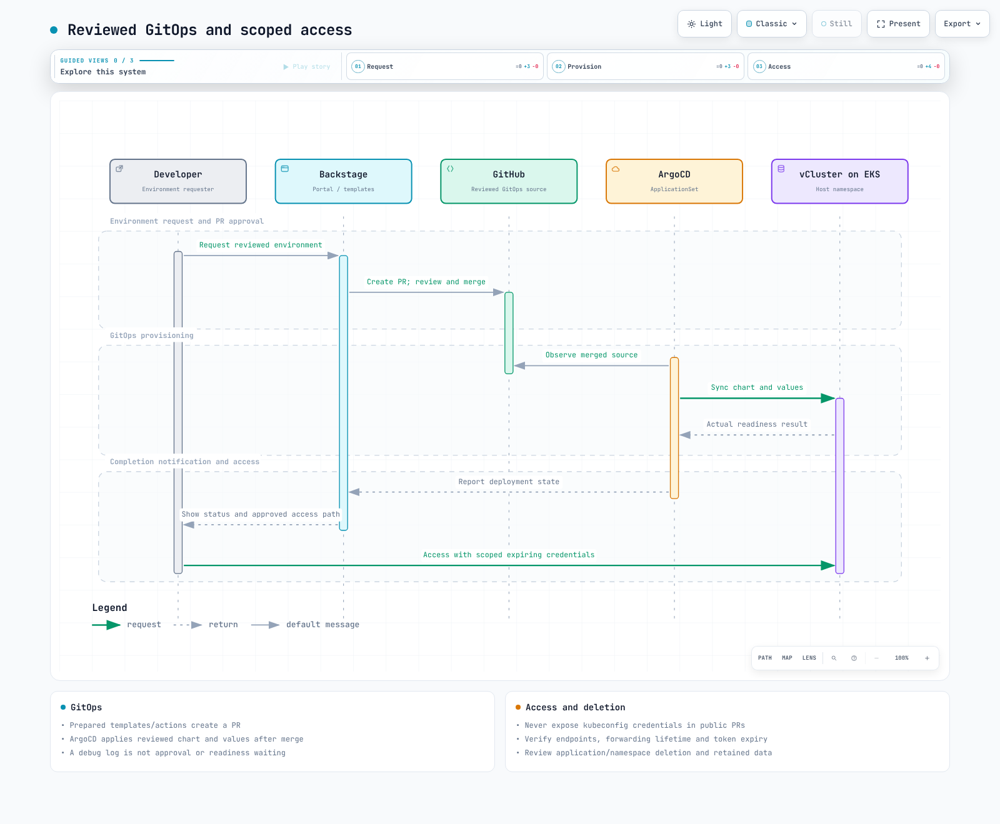

# vCluster

> **最終更新**: September 13, 2026 · レビュー基準: vCluster 0.37.0

## 概念と分離境界

vClusterはテナント別Kubernetes API、controller、data storeを提供できます。この**Shared Nodes**例ではworkloadがhost cluster nodeで動き、kernel、CNI、CSI、容量を共有します。API/RBAC分離だけでは完全なhardware/network/performance分離は成立しません。

| モード | 評価する境界 |
| --- | --- |
| Namespace | API server、cluster resource、nodeを共有。RBAC、quota、network policyが必要。 |
| Shared Nodes vCluster | テナントAPIを分離しworkload node、CNI、CSIを共有。 |
| Dedicated/Private Nodes | Node配置と実Private NodesのCNI/CSI境界を確認。 |
| Standalone | Host control-plane clusterなしのインフラ上で動く別モード。 |
| 独立Kubernetes cluster | 分離は共有account、VPC、管理者、hardwareにも依存。 |

公開リポジトリはApache 2.0です。配布イメージ、Platform機能、サポート、利用権は別確認です。元の「November 2024からCNCF Sandbox」という主張は公式project pageで確認できず削除されました。Kubernetes適合性とCNCF所属は別です。

30秒未満の作成、100–200MiB負荷、数百cluster、60–70%節約を約束しないでください。実profile、host API負荷、PVC、image取得、workload、課金モデルを測ります。


[インタラクティブな図](https://www.atomai.click/kubernetes-docs/archmaps/en-platform-engineering-08-vcluster-10.html)

## 現在のバージョンと基準

レビュー中GitHub latestは0.36.1を返しましたが、September 8, 2026付の明示stable 0.37.0を確認しました。例はCLI/chart 0.37.0と確認済みghcr.io/loft-sh/kubernetes:v1.36.3を対象にします。image実行と完全runtime互換性は別チェックです。

現schemaに旧k3s/k0s distro設定はありません。k8s設定、backing store、正確な版を区別します。既定imageはvcluster-proで、名前だけではsourceライセンスや無料利用権は決まりません。

Shared Nodes profileは1レプリカ、組み込みDB、PVCです。運用者はgp3/CSI、quota、ID、host policyを準備します。

```yaml
controlPlane:
  distro:
    k8s:
      enabled: true
      image:
        tag: v1.36.3
  backingStore:
    database:
      embedded:
        enabled: true
  statefulSet:
    highAvailability:
      replicas: 1
    resources:
      requests:
        cpu: 200m
        memory: 512Mi
        ephemeral-storage: 1Gi
      limits:
        cpu: "2"
        memory: 4Gi
        ephemeral-storage: 10Gi
    persistence:
      volumeClaim:
        enabled: true
        storageClass: gp3
        size: 10Gi
        retentionPolicy: Retain
  service:
    spec:
      type: ClusterIP
  ingress:
    enabled: false
sync:
  fromHost:
    nodes:
      enabled: false
    storageClasses:
      enabled: true
  toHost:
    pods:
      enabled: true
    services:
      enabled: true
    configMaps:
      enabled: true
      all: false
    secrets:
      enabled: true
      all: false
    persistentVolumeClaims:
      enabled: true
    ingresses:
      enabled: false
    serviceAccounts:
      enabled: false
    networkPolicies:
      enabled: false
privateNodes:
  enabled: false
policies:
  podSecurityStandard: restricted
telemetry:
  enabled: false
```

profileは実schema/Helm確認を通過しました。ただしHelmはruntime sourceが拒否する組み込みDB/3レプリカ構成もrenderします。HAには対応store、quorum、storage、復旧検証が必要で、replica増加だけでは不足です。

configMaps、serviceAccounts、persistentVolumeClaimsなどのキーは大文字小文字を区別します。StorageClass/CSIのAuto defaultはモード依存で、普遍的同期ではありません。profileはIngress、ServiceAccount、NetworkPolicy同期を明示無効にします。


[インタラクティブな図](https://www.atomai.click/kubernetes-docs/archmaps/en-platform-engineering-08-vcluster-11.html)

仮想Deployment/ReplicaSet controllerと実host Podを区別します。Syncerの名前/ラベル変換はmode、長さ、版に依存します。IRSA trustや運用スクリプトで推測しないでください。fromHost.nodes可視性はworkload node分離を自動強制しません。

## インストールとアクセス

正しいOS/architectureのCLIを選び公式checksumを確認します。例コマンドは実clusterへ影響し得るためHOST_CONTEXTとnamespaceを先に確認します。監査でcreate/delete/snapshotは実行していません。

```bash
helm repo add loft-sh https://charts.loft.sh
helm repo update
helm template team-alpha loft-sh/vcluster   --version 0.37.0 --namespace vcluster-team-alpha   -f examples/platform/vcluster/vcluster.yaml

# After the reviewed host prerequisites are ready:
vcluster create team-alpha --driver helm --context HOST_CONTEXT   --namespace vcluster-team-alpha --chart-version 0.37.0   --values examples/platform/vcluster/vcluster.yaml --connect=false

# Keep the forwarding lifetime tied to the child command:
vcluster connect team-alpha --driver helm --context HOST_CONTEXT   --namespace vcluster-team-alpha --background-proxy=false --   kubectl get namespaces
```

connectはアクセス経路とkubeconfigを管理します。旧--update-current/--kube-configは削除ではなく非推奨別名です。--printは認証情報を出し得るため、会話、ログ、PRでなく制限ファイルへ保存します。

再利用外部kubeconfigには到達API、一致SAN/CA、適切な認証期限が必要です。localhost転送先保存では転送停止後のアクセスは残りません。背景proxyはDockerと追加imageが必要な場合があります。管理者共有でなく利用者別最小権限ServiceAccountを使い、--token-expirationを確認します。

host操作は--context HOST_CONTEXTを使い、namespace削除/backupを誤ってtenantへ向けないようにします。並列研修環境作成では全終了コードを収集し、失敗後に全準備完了と報告しません。

## EKSストレージ、Ingress、IAM

Shared NodesではPVCをhostへ同期しhost CSIがvolumeを扱います。StorageClass、volumeBindingMode、topology、reclaim、retentionを一緒に確認します。現profileはstatefulSet.persistence.volumeClaim.storageClass/sizeです。

Ingress同期には実host LBC/IngressClass、Service参照、TLS、SG、承認経路が必要です。host LBC webhook Serviceをtenantへ複製してもALB統合は成立しません。ServiceアノテーションはcontrolPlane.service.annotations下に置きます。service.spec.annotationsはServiceSpecフィールドではありません。

ServiceAccount同期無効時はhost workload-ServiceAccount動作、有効時は実変換/同期を確認します。仮想PodアノテーションコピーだけではIRSAを設定しません。host ServiceAccount、token issuer/subject/audience、role trust、注入を確認します。tenant制御IAM-roleアノテーションを制限します。

## 分離とガバナンス

```yaml
apiVersion: v1
kind: Namespace
metadata:
  name: vcluster-team-alpha
  labels:
    platform.example.com/tenant: team-alpha
    pod-security.kubernetes.io/enforce: baseline
    pod-security.kubernetes.io/enforce-version: v1.36
---
apiVersion: v1
kind: ResourceQuota
metadata:
  name: vcluster-budget
  namespace: vcluster-team-alpha
spec:
  hard:
    requests.cpu: "8"
    requests.memory: 16Gi
    limits.cpu: "16"
    limits.memory: 32Gi
    requests.ephemeral-storage: 20Gi
    limits.ephemeral-storage: 80Gi
    pods: "50"
    services: "20"
    services.loadbalancers: "0"
    services.nodeports: "0"
    persistentvolumeclaims: "10"
    requests.storage: 100Gi
---
apiVersion: v1
kind: LimitRange
metadata:
  name: workload-defaults
  namespace: vcluster-team-alpha
spec:
  limits:
    - type: Container
      defaultRequest:
        cpu: 100m
        memory: 128Mi
        ephemeral-storage: 128Mi
      default:
        cpu: "1"
        memory: 512Mi
        ephemeral-storage: 1Gi
```

LimitRangeはephemeral-storage requests/limitsを省略した通常/initにもdefaultを設定します。limitなしPodはephemeral-storage quota適用を免れる場合があるため、最終変換tenant Podとcontrol-plane initを確認します。値はquota計算用で、容量予約/性能保証ではありません。

チャートはcontrol-plane SyncerをUID 0でrenderします。host名前空間にrestrictedを盲目的適用すると制御が拒否され得ます。host baseline admissionとprofileのpolicies.podSecurityStandard: restrictedは、host Podと仮想workload検証という別層です。変換Podを実host policyで確認します。

quota予算はcontrol plane、CoreDNS、tenant、storageを含みます。node容量を予約せず性能も保証しません。生成Role/ClusterRoleとSecretアクセスを調べ、tenantに任意host Secret/Role変更を与えないでください。

必要なら次のvaluesでチャートのnetwork policyをrenderします。

```yaml
policies:
  networkPolicy:
    enabled: true
    workload:
      publicEgress:
        enabled: false
```

実renderはworkloadの公開Egressを無効にしましたが、443/8443/6443などcontrol-planeの広いEgressを残しました。完全host API遮断としては示しません。NetworkPolicy Allowは加算的で、別「deny」を加えて既存許可を減らせません。

Syncerにはhost APIアクセスが必要です。同じdeny-egressを制御へ適用すると同期停止し得ます。DNS、endpoint IP/DNAT、必要app/DB/registry経路、CNI動作を確認します。default deny/例外には信頼するcontrol-plane/workload分類を使います。


[インタラクティブな図](https://www.atomai.click/kubernetes-docs/archmaps/en-platform-engineering-08-vcluster-12.html)

## Pause、Sleep、削除、スナップショット

現CLI pauseは仮想control planeを縮小しworkloadを除去して、resumeで再作成します。PVC/Serviceは別保持動作です。Podメモリ保存のsuspendやbackupではありません。手動pauseと自動sleep/wake条件を区別します。

ライフサイクル設定は任意です。利用権、controller、workload動作を先に確認します。ここでは自動削除は有効にしません。

```yaml
# Optional configuration: verify product entitlement and workload behavior first.
sleep:
  auto:
    afterInactivity: 30m
    schedule: "0 20 * * 1-5"
    timezone: Etc/UTC
    wakeup:
      schedule: "0 8 * * 1-5"
# No automatic deletion is enabled by this example.
deletion:
  prevent: true
```

現設定はsleep.autoやdeletion.autoです。旧架空management.loft.sh/VirtualClusterフィールドは現契約ではありません。TTLラベル/アノテーションだけでは削除は起きません。実controller policyを使い、所有権、active workload、backupを確認します。

namespace削除はPVCと残存workloadを消し得ます。PVC保持、PV回収、外部resourceも含めvcluster delete、Helm uninstall、ArgoCD Application除去を区別します。削除防止がhost管理者のnamespace直接削除まで防ぐとは限りません。

snapshot createは非同期要求を送ります。要求成功はreadyや復元成功ではありません。PV名はEBS volume IDではなく、spec.csi.driverとvolumeHandleを確認します。稼働DB snapshotには整合性、静止化、復元テストが必要です。

0.37はdeploy.volumeSnapshotControllerを拒否しますが、volumeSnapshots/volumeSnapshotContentsの対同期を再びサポートします。古いschemaコメントから全snapshot同期削除とは判断しませんでした。CSI snapshot controller/classと両optionを準備し、復元は別テストします。Secretの平文exportは完全backup戦略ではありません。


[インタラクティブな図](https://www.atomai.click/kubernetes-docs/archmaps/en-platform-engineering-08-vcluster-14.html)

## Backstage、ArgoCD、一時環境

チーム開発、CI、preview、研修、SaaSは信頼、性能、寿命要件が異なります。開発workloadが全Spot中断に耐える、SaaS tenantが相互影響しないと想定しないでください。

CIではhost ID、信頼event/branch、OIDC権限を設定します。未信頼forkへhost認証情報を露出しません。create/connect/test/cleanupでnamespace/contextを明示し、転送寿命をテストに結び付けます。独立cleanup jobにもツール/IDが必要です。全終了コードを確認します。

ApplicationSetには以前欠けた$values sourceRefを含めます。gitops-config.yamlをvclusters/team-alpha/config.yamlに、review済みvcluster.yamlを隣に保存します。repositoryとAppProject/destination権限を承認値に置換します。

```yaml
apiVersion: argoproj.io/v1alpha1
kind: ApplicationSet
metadata:
  name: reviewed-vclusters
  namespace: argocd
spec:
  goTemplate: true
  goTemplateOptions: ["missingkey=error"]
  generators:
    - git:
        repoURL: https://github.com/REPLACE_APPROVED_ORG/platform-config
        revision: main
        files:
          - path: vclusters/*/config.yaml
  syncPolicy:
    preserveResourcesOnDeletion: true
  template:
    metadata:
      name: "vcluster-{{ .name }}"
    spec:
      project: vcluster-tenants
      sources:
        - repoURL: https://charts.loft.sh
          chart: vcluster
          targetRevision: "0.37.0"
          helm:
            releaseName: "{{ .name }}"
            valueFiles:
              - "$values/vclusters/{{ .name }}/vcluster.yaml"
        - repoURL: https://github.com/REPLACE_APPROVED_ORG/platform-config
          targetRevision: main
          ref: values
      destination:
        server: https://kubernetes.default.svc
        namespace: "{{ .namespace }}"
      syncPolicy:
        automated:
          selfHeal: true
          prune: false
        syncOptions: [CreateNamespace=true]
```

preserveResourcesOnDeletionとprune:falseは設定除去を即データ削除にしない意図的選択です。保持resource所有権/費用と別廃止処理を追跡します。Backstageのdebug:logは承認やデプロイ待機を実装しません。



[インタラクティブな図](https://www.atomai.click/kubernetes-docs/archmaps/en-platform-engineering-08-vcluster-13.html)

## 可観測性、リソース、費用

意図的pauseで希望0のStatefulSetへ自動alertしないでください。単一集約absent()は他が正常なら1失敗clusterを見逃し得ます。実job/namespace/pod/containerラベル、metrics endpoint、期待状態一覧を使います。chart container名はsyncerです。架空vcluster_syncer_*を作らないでください。

requestsは使用率や請求ではありません。CPU 1と250m、memory 1Giと512Miは単なる数値文字列として加算できません。examples/platform/vcluster/usageはKubernetes PodRequestsで単位、init、overhead、Pod-level requestsを扱います。

```bash
# Run inside examples/platform/vcluster/usage with the pinned Go dependencies:
kubectl --context HOST_CONTEXT get pods -n vcluster-team-alpha -o json | go run .
```

ツールは未終了Podのspecベースrequestsを合計し、実RSS/CPU、resize状態、PVC費用ではありません。合成3ケースをテストし、実cluster照会はしていません。

active時間168から50への削減でnode、EBS、LB、license費が比例削減されるわけではありません。実node縮小、保持storage、commitment、最小容量を請求と比較します。KubernetesラベルはAWSコスト配分タグへ自動変換されません。

EKS利用者に管理API server/etcdのreplicaやinstanceを直接resizeするよう指示しないでください。対応managed-plane設定/quotaと要求負荷を確認します。chart/CLI/Kubernetes/store組を固定し、backup/stagingを検証し、別namespaceの同名Helm releaseも考慮します。

## 実施した確認

韓国語1,998行、英語2,171行、両143行quiz、106個の一意code blockを読みました。0.37.0 schema、Helm profile、lifecycle/network-policy render、公式checksum/image index、Kubernetes resource計算を検証し、schema/runtime検証の違いを記録しました。

0.36.1で非推奨接続flag確認を2回試み、既存clusterへ読み取り専用照会してUnauthorizedとなりました。resource変更はなく、その後0.37はversion/help/sourceとoffline chartに限定しました。vCluster作成、image実行、sleep/削除/snapshot/復元、network分離、IAM認証、負荷、節約は検証していません。

- [vCluster 0.37.0](https://github.com/loft-sh/vcluster/releases/tag/v0.37.0)
- [バージョン付き設定](https://github.com/loft-sh/vcluster/blob/v0.37.0/config/values.yaml)
- [バージョン付きschema](https://github.com/loft-sh/vcluster/blob/v0.37.0/chart/values.schema.json)
- [アーキテクチャ](https://www.vcluster.com/docs/vcluster/introduction/architecture)
- [Sleep設定](https://www.vcluster.com/docs/vcluster/configure/vcluster-yaml/sleep)

[Backstage](06-backstage-idp.md) · [Crossplane](07-crossplane.md)

[vClusterクイズ](../quizzes/platform-engineering/08-vcluster-quiz.md)
