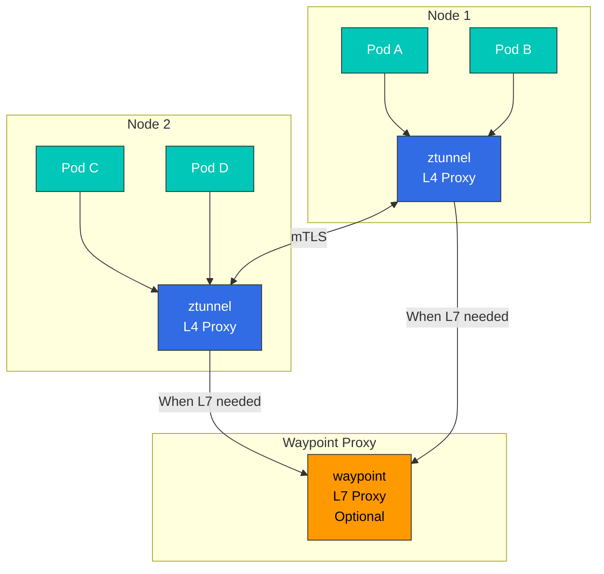
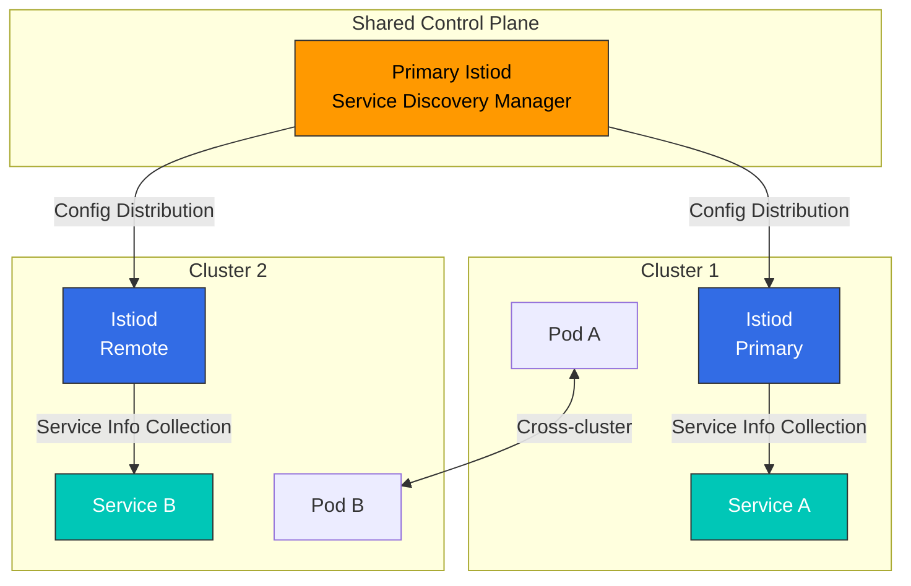
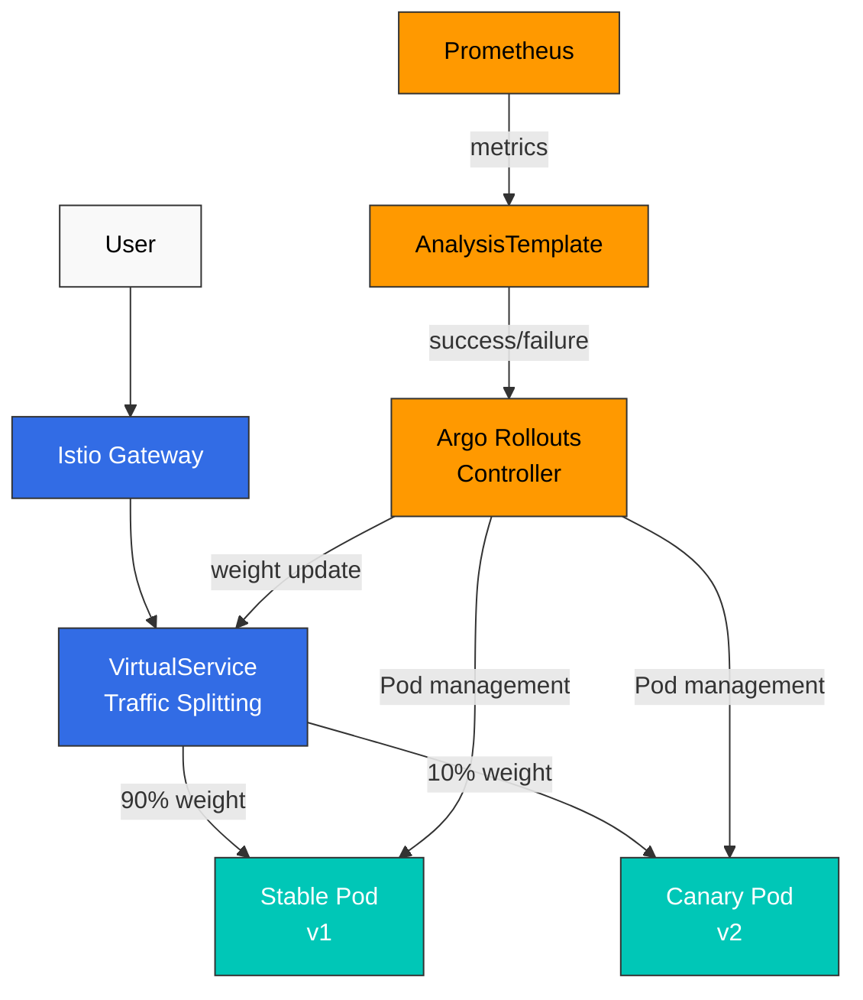
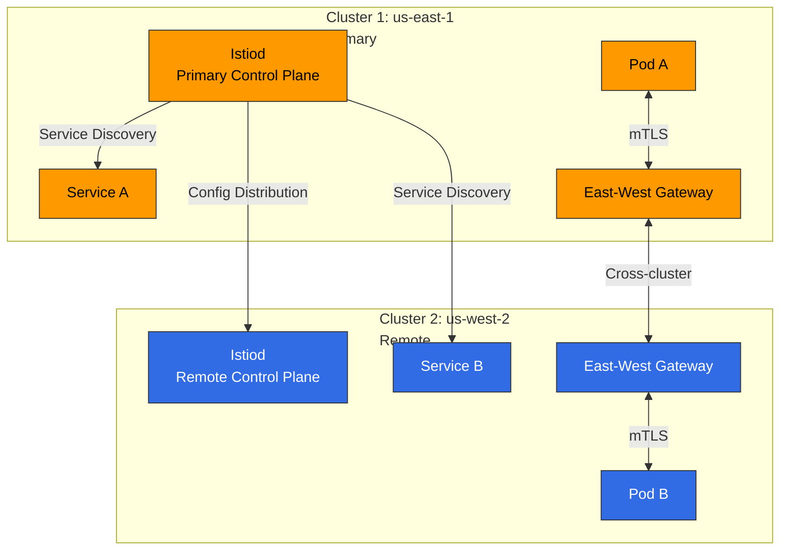
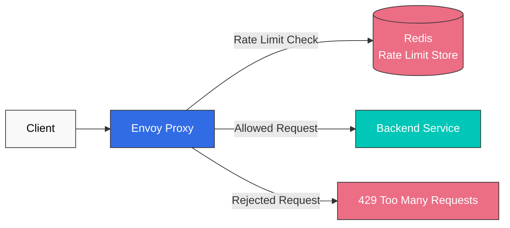
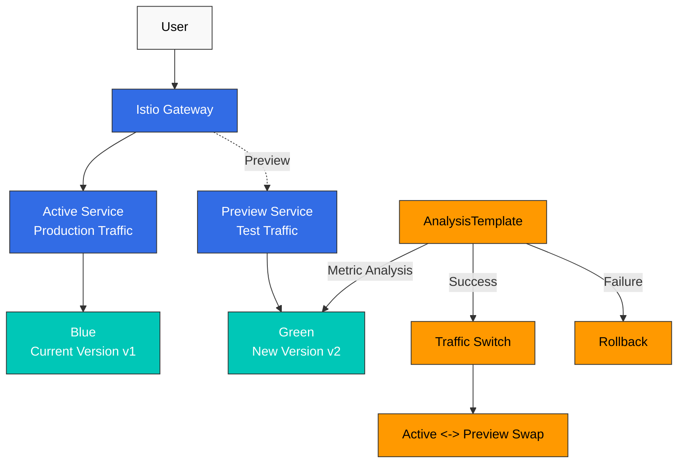

# Istio 高度なトピッククイズ

> **対応バージョン**: Istio 1.28.0
> **EKS バージョン**: 1.34 (Kubernetes 1.28+)
> **最終更新**: February 19, 2026

このクイズでは、Istio の高度な機能についての理解度を確認します。

## 選択問題 (1-5)

### 問題 1: Ambient Mode と Sidecar Mode

Istio Ambient Mode の**最大の利点**は何ですか？

A. より多くの機能を提供する
B. リソース使用量を大幅に削減できる
C. インストール速度が速い
D. セキュリティが向上する

<details>
<summary>回答を表示</summary>

**回答: B**

Ambient Mode の最大の利点は、**リソース使用量を 98% 以上削減できること**です。

**解説:**

**Sidecar Mode と Ambient Mode の比較:**

| 項目 | Sidecar Mode | Ambient Mode | 改善点 |
|------|-------------|-------------|------|
| **メモリ** | 50MB × Pod 数 | ztunnel + waypoint のみ | 98%+ 削減 |
| **CPU** | 0.1 vCPU × Pod 数 | ztunnel + waypoint のみ | 98%+ 削減 |
| **Pod 再起動** | 必要 | 不要 | 運用の簡素化 |
| **Deployment 速度** | 遅い (Sidecar injection) | 速い | 5-10 倍向上 |

**1000 Pod 規模でのリソース比較:**

```
Sidecar Mode:
- Memory: 1000 × 50MB = 50GB
- CPU: 1000 × 0.1 vCPU = 100 vCPU

Ambient Mode (10 nodes):
- Memory: (10 × 50MB) + 200MB = 700MB
- CPU: (10 × 0.1 vCPU) + 0.5 vCPU = 1.5 vCPU

Savings rate: 98.6% (memory), 98.5% (CPU)
```

**Ambient Mode アーキテクチャ:**



**Ambient Mode の有効化:**

```bash
# Install Istio with Ambient Mode
istioctl install --set profile=ambient -y

# Add Namespace to Ambient Mode
kubectl label namespace default istio.io/dataplane-mode=ambient

# Verify
kubectl get pods -n istio-system | grep ztunnel
```

**選択肢の解説:**
- A (X): 機能は Sidecar と同じです（一部の高度な機能には waypoint が必要です）
- B (O): リソース使用量を 98% 以上削減できます
- C (X): インストール速度は副次的な利点です
- D (X): セキュリティレベルは同じです（mTLS、AuthorizationPolicy はどちらもサポート）

**参照:**
- [Ambient Mode](../../../service-mesh/istio/advanced/01-ambient-mode.md)
</details>

---

### 問題 2: Multi-cluster Mesh

Istio Multi-cluster Mesh において、**クラスター間の Service discovery**を担うのは何ですか？

A. Istiod
B. CoreDNS
C. East-West Gateway
D. Service Entry

<details>
<summary>回答を表示</summary>

**回答: A**

**Istiod** は、Multi-cluster 環境内のすべてのクラスターから Service 情報を収集し、配布します。

**解説:**

**Multi-cluster Mesh アーキテクチャ:**



**Istiod の役割:**

1. **Service Discovery**:
   - すべてのクラスターから Kubernetes Service を収集する
   - 統合された Service レジストリを維持する
   - endpoint 情報を Envoy に配布する

2. **Configuration Distribution**:
   - VirtualService、DestinationRule をすべてのクラスターにデプロイする
   - クラスター間ルーティングルールを管理する

3. **Certificate Management**:
   - すべてのクラスターに mTLS 証明書を発行する
   - Root CA の共有により信頼チェーンを構築する

**Multi-cluster 設定例:**

```yaml
# Primary cluster configuration
apiVersion: install.istio.io/v1alpha1
kind: IstioOperator
spec:
  values:
    global:
      meshID: mesh1
      multiCluster:
        clusterName: cluster1
      network: network1

---
# Remote cluster access from Primary
apiVersion: v1
kind: Secret
metadata:
  name: istio-remote-secret-cluster2
  namespace: istio-system
  annotations:
    networking.istio.io/cluster: cluster2
type: Opaque
data:
  kubeconfig: <base64-encoded-kubeconfig>
```

**選択肢の解説:**
- A (O): Istiod はすべてのクラスターから Service 情報を収集し、配布します
- B (X): CoreDNS はクラスター内部の DNS のみを処理します
- C (X): East-West Gateway はトラフィックルーティングのみを処理します（Service discovery は行いません）
- D (X): ServiceEntry は外部 Service を手動登録するためのリソースです

**参照:**
- [Multi-cluster](../../../service-mesh/istio/advanced/02-multi-cluster.md)
</details>

---

### 問題 3: EnvoyFilter の目的

EnvoyFilter を使用する**主な目的**は何ですか？

A. Kubernetes Service を作成する
B. VirtualService を自動生成する
C. Envoy proxy の動作をカスタマイズする
D. Istiod の設定を変更する

<details>
<summary>回答を表示</summary>

**回答: C**

**EnvoyFilter** は、Envoy proxy の動作をきめ細かくカスタマイズするための高度なリソースです。

**解説:**

**EnvoyFilter のユースケース:**

1. **カスタムヘッダーの追加**:
```yaml
apiVersion: networking.istio.io/v1alpha3
kind: EnvoyFilter
metadata:
  name: add-custom-header
  namespace: default
spec:
  workloadSelector:
    labels:
      app: reviews
  configPatches:
  - applyTo: HTTP_FILTER
    match:
      context: SIDECAR_OUTBOUND
      listener:
        filterChain:
          filter:
            name: "envoy.filters.network.http_connection_manager"
            subFilter:
              name: "envoy.filters.http.router"
    patch:
      operation: INSERT_BEFORE
      value:
        name: envoy.lua
        typed_config:
          "@type": type.googleapis.com/envoy.extensions.filters.http.lua.v3.Lua
          inline_code: |
            function envoy_on_request(request_handle)
              request_handle:headers():add("x-custom-header", "my-value")
            end
```

2. **Wasm Extension の統合**:
```yaml
apiVersion: networking.istio.io/v1alpha3
kind: EnvoyFilter
metadata:
  name: wasm-filter
spec:
  configPatches:
  - applyTo: HTTP_FILTER
    match:
      context: SIDECAR_INBOUND
    patch:
      operation: INSERT_BEFORE
      value:
        name: envoy.filters.http.wasm
        typed_config:
          "@type": type.googleapis.com/envoy.extensions.filters.http.wasm.v3.Wasm
          config:
            vm_config:
              runtime: "envoy.wasm.runtime.v8"
              code:
                local:
                  filename: "/etc/istio/extensions/auth_filter.wasm"
```

3. **Rate Limiting の統合**:
```yaml
apiVersion: networking.istio.io/v1alpha3
kind: EnvoyFilter
metadata:
  name: rate-limit-filter
spec:
  configPatches:
  - applyTo: HTTP_FILTER
    match:
      context: SIDECAR_INBOUND
      listener:
        filterChain:
          filter:
            name: "envoy.filters.network.http_connection_manager"
    patch:
      operation: INSERT_BEFORE
      value:
        name: envoy.filters.http.ratelimit
        typed_config:
          "@type": type.googleapis.com/envoy.extensions.filters.http.ratelimit.v3.RateLimit
          domain: productpage-ratelimit
          rate_limit_service:
            grpc_service:
              envoy_grpc:
                cluster_name: rate_limit_cluster
```

**EnvoyFilter の適用範囲:**

```yaml
spec:
  # Apply to entire mesh
  workloadSelector: {}

  # Apply to specific workload only
  workloadSelector:
    labels:
      app: reviews
      version: v2

  # Apply to specific namespace only
  # (controlled by metadata.namespace)
```

**注意事項:**

警告: **EnvoyFilter は非常に強力ですが、リスクもあります:**
- Envoy の内部構造に対する深い理解が必要です
- Istio バージョンアップ時に互換性の問題が発生する可能性があります
- 設定が誤っていると、Mesh 全体が障害を起こす可能性があります

**ベストプラクティス:**
1. 可能な場合は VirtualService、DestinationRule を使用する
2. EnvoyFilter は最後の手段としてのみ使用する
3. テスト環境で十分にテストする
4. workloadSelector で適用範囲を限定する

**選択肢の解説:**
- A (X): Kubernetes Service の作成は kubectl で行います
- B (X): VirtualService は手動で作成します
- C (O): Envoy proxy の動作をきめ細かくカスタマイズできます
- D (X): Istiod の設定は IstioOperator で変更します

**参照:**
- [EnvoyFilter](../../../service-mesh/istio/advanced/03-envoy-filter.md)
</details>

---

### 問題 4: Sidecar Injection

Istio で**自動 Sidecar injection を無効化する**にはどうすればよいですか？

A. Namespace から `istio-injection=enabled` label を削除する
B. Pod に `sidecar.istio.io/inject="false"` annotation を追加する
C. Istiod を再起動する
D. A と B の両方が可能

<details>
<summary>回答を表示</summary>

**回答: D**

Sidecar injection は Namespace レベルと Pod レベルの両方で制御できます。

**解説:**

**Sidecar Injection の制御方法:**

**1. Namespace レベル (A - O):**

```bash
# Enable Sidecar injection
kubectl label namespace default istio-injection=enabled

# Disable Sidecar injection
kubectl label namespace default istio-injection-

# Or change label
kubectl label namespace default istio-injection=disabled --overwrite
```

**2. Pod レベル (B - O):**

```yaml
apiVersion: apps/v1
kind: Deployment
metadata:
  name: myapp
spec:
  template:
    metadata:
      annotations:
        sidecar.istio.io/inject: "false"  # Disable Sidecar injection
    spec:
      containers:
      - name: myapp
        image: myapp:latest
```

**Sidecar Injection の優先順位:**

```
Pod annotation > Namespace label > Default

Examples:
1. Namespace: istio-injection=enabled
   Pod: sidecar.istio.io/inject="false"
   Result: Sidecar not injected (Pod annotation takes priority)

2. Namespace: istio-injection=disabled
   Pod: sidecar.istio.io/inject="true"
   Result: Sidecar injected (Pod annotation takes priority)

3. Namespace: no label
   Pod: no annotation
   Result: Sidecar not injected (default)
```

**Sidecar Injection の確認:**

```bash
# Check if Sidecar was injected into Pod
kubectl get pods <pod-name> -o jsonpath='{.spec.containers[*].name}'
# Example output: myapp istio-proxy (2 = Sidecar present)

# Check Sidecar injection logs
kubectl logs -n istio-system -l app=istiod --tail=100 | grep injection

# Check Namespace settings
kubectl get namespace -L istio-injection
```

**混在環境の例:**

```yaml
# Inject Sidecar for entire Namespace
apiVersion: v1
kind: Namespace
metadata:
  name: production
  labels:
    istio-injection: enabled

---
# Exclude specific Pod only (e.g., legacy system)
apiVersion: apps/v1
kind: Deployment
metadata:
  name: legacy-app
  namespace: production
spec:
  template:
    metadata:
      annotations:
        sidecar.istio.io/inject: "false"
    spec:
      containers:
      - name: legacy
        image: legacy:v1

---
# Most Pods automatically get Sidecar injected
apiVersion: apps/v1
kind: Deployment
metadata:
  name: modern-app
  namespace: production
spec:
  template:
    spec:
      containers:
      - name: modern
        image: modern:v2
```

**選択肢の解説:**
- A (O): Sidecar injection は Namespace レベルで制御できます
- B (O): Sidecar injection は Pod レベルで制御できます
- C (X): Istiod の再起動は必要ありません
- D (O): A と B はどちらも有効な方法です

**参照:**
- [Sidecar Injection](../../../service-mesh/istio/advanced/07-sidecar-injection.md)
</details>

---

### 問題 5: Argo Rollouts の統合

Argo Rollouts を Istio とともに使用する場合、**トラフィック分割**を担うのは何ですか？

A. Argo Rollouts Controller
B. Istio VirtualService
C. Kubernetes Service
D. Istio Gateway

<details>
<summary>回答を表示</summary>

**回答: B**

**Istio VirtualService** が実際のトラフィック分割を実行し、Argo Rollouts が VirtualService の weight 値を自動更新します。

**解説:**

**Argo Rollouts + Istio 統合アーキテクチャ:**



**VirtualService の役割:**

```yaml
apiVersion: networking.istio.io/v1beta1
kind: VirtualService
metadata:
  name: reviews
spec:
  hosts:
  - reviews
  http:
  - name: primary  # route name referenced by Argo Rollouts
    route:
    - destination:
        host: reviews
        subset: stable
      weight: 100  # Automatically changed by Argo Rollouts
    - destination:
        host: reviews
        subset: canary
      weight: 0    # Automatically changed by Argo Rollouts
```

**Argo Rollouts の設定:**

```yaml
apiVersion: argoproj.io/v1alpha1
kind: Rollout
metadata:
  name: reviews
spec:
  strategy:
    canary:
      # Istio integration settings
      trafficRouting:
        istio:
          virtualService:
            name: reviews        # VirtualService name
            routes:
            - primary            # route name
          destinationRule:
            name: reviews        # DestinationRule name
            canarySubsetName: canary
            stableSubsetName: stable

      # Canary steps
      steps:
      - setWeight: 10   # Change VirtualService weight to 10
      - pause: {duration: 2m}
      - setWeight: 25   # Change VirtualService weight to 25
      - pause: {duration: 2m}
      - setWeight: 50
      - pause: {duration: 2m}
```

**Deployment プロセス:**

```
1. Argo Rollouts creates new version (v2) Pods
   |
2. Argo Rollouts sets VirtualService canary weight to 10
   |
3. Istio Envoy routes actual 10% traffic to v2
   |
4. AnalysisTemplate checks metrics (error rate, latency)
   |
5. On success, Argo Rollouts increases weight to 25
   |
6. Repeat...
   |
7. Finally weight 100 (complete transition)
```

**責任分担:**

| コンポーネント | 役割 |
|---------|------|
| **Argo Rollouts** | - Pod の作成/削除<br/>- VirtualService weight の更新<br/>- Deployment 戦略の実行<br/>- 自動ロールバック |
| **Istio VirtualService** | - 実際のトラフィック分割<br/>- ルーティングルールの適用<br/>- Envoy 設定の生成 |
| **Envoy Proxy** | - トラフィックルーティングの実行<br/>- メトリクスの収集 |
| **Prometheus** | - メトリクスの保存<br/>- AnalysisTemplate へのデータ提供 |

**実際のトラフィックフロー:**

```bash
# 100 user requests
100 requests -> Istio Gateway
              |
         VirtualService
         (weight: stable=90, canary=10)
              |
         +----+----+
         |         |
        90        10
    Stable v1   Canary v2
```

**選択肢の解説:**
- A (X): Argo Rollouts は VirtualService を更新するだけで、直接トラフィックを分割しません
- B (O): VirtualService が実際のトラフィック分割を実行します
- C (X): Kubernetes Service は負荷分散のみを処理します（トラフィック分割は行いません）
- D (X): Gateway は外部トラフィックのエントリポイントです（トラフィック分割は行いません）

**参照:**
- [Argo Rollouts](../../../service-mesh/istio/advanced/08-argo-rollouts.md)
</details>

---

## 記述問題 (6-10)

### 問題 6: Ambient Mode のコスト削減分析

AWS EKS クラスターで Sidecar Mode から Ambient Mode に移行する場合の**コスト削減額**を計算してください。（前提: 500 Pod、5 Node、r5.xlarge instance、月間 730 時間稼働）

<details>
<summary>回答例を表示</summary>

**回答:**

**コスト削減分析:**

---

**1. 前提条件**

```
Cluster scale:
- Pod count: 500
- Node count: 5
- Instance type: r5.xlarge (4 vCPU, 32GB RAM)
- Instance cost: $0.252/hour
- Operating hours: 730 hours/month

Resource usage:
- Sidecar memory: 50MB/Pod
- Sidecar CPU: 0.1 vCPU/Pod
- ztunnel memory: 50MB/Node
- ztunnel CPU: 0.1 vCPU/Node
- waypoint memory: 200MB
- waypoint CPU: 0.5 vCPU
```

---

**2. Sidecar Mode のリソース計算**

```
Memory usage:
= 500 Pods × 50MB
= 25,000MB
= 25GB

CPU usage:
= 500 Pods × 0.1 vCPU
= 50 vCPU
```

**必要な instance 数 (r5.xlarge: 4 vCPU, 32GB RAM):**

```
CPU basis:
= 50 vCPU ÷ 4 vCPU/instance
= 12.5 instances
≈ 13 instances needed

Memory basis:
= 25GB ÷ 32GB/instance
= 0.78 instances
≈ 1 instance needed

Actual needed: max(13, 1) = 13 instances
```

**Sidecar Mode の月額コスト:**

```
= 13 instances × $0.252/hour × 730 hours
= $2,395.56/month
```

---

**3. Ambient Mode のリソース計算**

```
Memory usage:
= (5 nodes × 50MB) + 200MB
= 250MB + 200MB
= 450MB

CPU usage:
= (5 nodes × 0.1 vCPU) + 0.5 vCPU
= 0.5 vCPU + 0.5 vCPU
= 1.0 vCPU
```

**必要な instance 数:**

```
CPU basis:
= 1.0 vCPU ÷ 4 vCPU/instance
= 0.25 instances
≈ 1 instance needed

Memory basis:
= 0.45GB ÷ 32GB/instance
= 0.01 instances
≈ 1 instance needed

Actual needed: max(1, 1) = 1 instance
```

**Ambient Mode の月額コスト:**

```
= 1 instance × $0.252/hour × 730 hours
= $183.96/month
```

---

**4. コスト削減額**

```
Monthly savings:
= $2,395.56 - $183.96
= $2,211.60/month

Savings rate:
= ($2,211.60 ÷ $2,395.56) × 100
= 92.3%

Annual savings:
= $2,211.60 × 12
= $26,539.20/year
```

---

**5. リソース削減の概要**

| 項目 | Sidecar Mode | Ambient Mode | 削減量 |
|------|-------------|-------------|------|
| **メモリ** | 25GB | 0.45GB | 24.55GB (98.2%) |
| **CPU** | 50 vCPU | 1.0 vCPU | 49 vCPU (98.0%) |
| **Instances** | 13 | 1 | 12 (92.3%) |
| **月額コスト** | $2,395.56 | $183.96 | $2,211.60 (92.3%) |
| **年間コスト** | $28,746.72 | $2,207.52 | $26,539.20 (92.3%) |

---

**6. その他のコスト削減要因**

**ネットワークコスト:**
- Sidecar Mode: localhost 通信はなく、すべてのトラフィックがネットワークを経由します
- Ambient Mode: ztunnel 間の直接通信により効率が向上します

**運用コスト:**
- Pod の再起動が不要（Deployment 時間を削減）
- Sidecar injection エラーがない
- 管理の複雑性を削減

**パフォーマンスの改善:**
- メモリプレッシャーの軽減による Pod パフォーマンスの向上
- OOMKilled の発生頻度を削減
- Node リソースの余裕を確保

---

**7. ROI (投資収益率)**

```
Ambient Mode transition cost (one-time):
- Learning time: 40 hours × $100/hour = $4,000
- Testing and validation: 20 hours × $100/hour = $2,000
- Total transition cost: $6,000

Payback period:
= $6,000 ÷ $2,211.60/month
= 2.7 months

3-year total savings:
= ($26,539.20 × 3) - $6,000
= $73,617.60
```

---

**8. 実務上の考慮事項**

**利点:**
- 92% 以上のコスト削減
- 運用の簡素化
- Deployment 速度の向上
- リソース効率の最大化

**注意事項:**
- Istio 1.28+ の beta 機能
- L7 機能には追加の waypoint Deployment が必要
- 一部の高度な機能には Sidecar mode が必要
- 十分なテストが必要

**参照:**
- [Ambient Mode](../../../service-mesh/istio/advanced/01-ambient-mode.md)
</details>

---

### 問題 7: Multi-cluster Service Mesh の設定

2 つの EKS クラスター（us-east-1、us-west-2）を**単一の Istio Mesh**に統合する方法を説明してください。**Primary-Remote model** を使用し、クラスター間 Service 呼び出しの例を含めてください。

<details>
<summary>回答例を表示</summary>

**回答:**

**Multi-cluster Istio Mesh の設定:**

---

**1. アーキテクチャの概要**



---

**2. 前提条件**

```bash
# Set up kubeconfig with access to both clusters
export CTX_CLUSTER1=eks-us-east-1
export CTX_CLUSTER2=eks-us-west-2

# Verify contexts
kubectl config get-contexts

# Generate CA certificates (shared Root CA)
mkdir -p certs
cd certs

# Generate Root CA
make -f ../istio-1.28.0/tools/certs/Makefile.selfsigned.mk root-ca

# Generate intermediate certificates for each cluster
make -f ../istio-1.28.0/tools/certs/Makefile.selfsigned.mk cluster1-cacerts
make -f ../istio-1.28.0/tools/certs/Makefile.selfsigned.mk cluster2-cacerts
```

---

**3. Cluster 1 (Primary) のセットアップ**

```bash
# Create CA certificate Secret
kubectl create namespace istio-system --context="${CTX_CLUSTER1}"
kubectl create secret generic cacerts -n istio-system \
  --from-file=cluster1/ca-cert.pem \
  --from-file=cluster1/ca-key.pem \
  --from-file=cluster1/root-cert.pem \
  --from-file=cluster1/cert-chain.pem \
  --context="${CTX_CLUSTER1}"

# Install Primary Istio
istioctl install --context="${CTX_CLUSTER1}" -f - <<EOF
apiVersion: install.istio.io/v1alpha1
kind: IstioOperator
spec:
  values:
    global:
      meshID: mesh1
      multiCluster:
        clusterName: cluster1
      network: network1

  components:
    ingressGateways:
    - name: istio-eastwestgateway
      label:
        istio: eastwestgateway
        app: istio-eastwestgateway
        topology.istio.io/network: network1
      enabled: true
      k8s:
        env:
        - name: ISTIO_META_REQUESTED_NETWORK_VIEW
          value: network1
        service:
          type: LoadBalancer
          ports:
          - name: status-port
            port: 15021
            targetPort: 15021
          - name: tls
            port: 15443
            targetPort: 15443
          - name: tls-istiod
            port: 15012
            targetPort: 15012
          - name: tls-webhook
            port: 15017
            targetPort: 15017
EOF

# Expose East-West Gateway
kubectl apply --context="${CTX_CLUSTER1}" -n istio-system -f \
  samples/multicluster/expose-services.yaml
```

---

**4. Cluster 2 (Remote) のセットアップ**

```bash
# Create CA certificate Secret
kubectl create namespace istio-system --context="${CTX_CLUSTER2}"
kubectl create secret generic cacerts -n istio-system \
  --from-file=cluster2/ca-cert.pem \
  --from-file=cluster2/ca-key.pem \
  --from-file=cluster2/root-cert.pem \
  --from-file=cluster2/cert-chain.pem \
  --context="${CTX_CLUSTER2}"

# Create Remote Secret (access cluster2 from cluster1)
istioctl create-remote-secret \
  --context="${CTX_CLUSTER2}" \
  --name=cluster2 | \
  kubectl apply -f - --context="${CTX_CLUSTER1}"

# Install Remote Istio
istioctl install --context="${CTX_CLUSTER2}" -f - <<EOF
apiVersion: install.istio.io/v1alpha1
kind: IstioOperator
spec:
  values:
    global:
      meshID: mesh1
      multiCluster:
        clusterName: cluster2
      network: network2
      remotePilotAddress: <CLUSTER1_EAST_WEST_GATEWAY_IP>

  components:
    ingressGateways:
    - name: istio-eastwestgateway
      label:
        istio: eastwestgateway
        app: istio-eastwestgateway
        topology.istio.io/network: network2
      enabled: true
      k8s:
        env:
        - name: ISTIO_META_REQUESTED_NETWORK_VIEW
          value: network2
        service:
          type: LoadBalancer
          ports:
          - name: status-port
            port: 15021
          - name: tls
            port: 15443
          - name: tls-istiod
            port: 15012
          - name: tls-webhook
            port: 15017
EOF
```

---

**5. Service の Deployment と検証**

**Cluster 1 に Service A をデプロイ:**

```yaml
# cluster1: service-a.yaml
apiVersion: v1
kind: Service
metadata:
  name: service-a
  labels:
    app: service-a
spec:
  ports:
  - port: 8080
    name: http
  selector:
    app: service-a

---
apiVersion: apps/v1
kind: Deployment
metadata:
  name: service-a
spec:
  replicas: 2
  selector:
    matchLabels:
      app: service-a
  template:
    metadata:
      labels:
        app: service-a
    spec:
      containers:
      - name: service-a
        image: nginx:latest
        ports:
        - containerPort: 8080
```

```bash
kubectl apply --context="${CTX_CLUSTER1}" -f service-a.yaml
```

**Cluster 2 に Service B をデプロイ:**

```yaml
# cluster2: service-b.yaml
apiVersion: v1
kind: Service
metadata:
  name: service-b
  labels:
    app: service-b
spec:
  ports:
  - port: 8080
    name: http
  selector:
    app: service-b

---
apiVersion: apps/v1
kind: Deployment
metadata:
  name: service-b
spec:
  replicas: 2
  selector:
    matchLabels:
      app: service-b
  template:
    metadata:
      labels:
        app: service-b
    spec:
      containers:
      - name: service-b
        image: nginx:latest
        ports:
        - containerPort: 8080
```

```bash
kubectl apply --context="${CTX_CLUSTER2}" -f service-b.yaml
```

---

**6. クラスター間 Service 呼び出しテスト**

```bash
# Call cluster 2 service from cluster 1
kubectl exec --context="${CTX_CLUSTER1}" -it \
  $(kubectl get pod --context="${CTX_CLUSTER1}" -l app=service-a -o jsonpath='{.items[0].metadata.name}') \
  -- curl http://service-b.default.svc.cluster.local:8080

# Call cluster 1 service from cluster 2
kubectl exec --context="${CTX_CLUSTER2}" -it \
  $(kubectl get pod --context="${CTX_CLUSTER2}" -l app=service-b -o jsonpath='{.items[0].metadata.name}') \
  -- curl http://service-a.default.svc.cluster.local:8080
```

---

**7. Service Discovery の検証**

```bash
# Check Envoy configuration from cluster 1
istioctl --context="${CTX_CLUSTER1}" proxy-config endpoints \
  $(kubectl get pod --context="${CTX_CLUSTER1}" -l app=service-a -o jsonpath='{.items[0].metadata.name}') | \
  grep service-b

# Example output:
# service-b.default.svc.cluster.local:8080  HEALTHY  <cluster2-pod-ip>:8080
```

---

**8. Traffic Policy の適用**

```yaml
# Cross-cluster traffic routing
apiVersion: networking.istio.io/v1beta1
kind: VirtualService
metadata:
  name: service-b
spec:
  hosts:
  - service-b.default.svc.cluster.local
  http:
  - match:
    - sourceLabels:
        app: service-a
    route:
    - destination:
        host: service-b.default.svc.cluster.local
        port:
          number: 8080
      weight: 80  # 80% to local cluster
    - destination:
        host: service-b.default.svc.cluster.local
        port:
          number: 8080
      weight: 20  # 20% to remote cluster

---
apiVersion: networking.istio.io/v1beta1
kind: DestinationRule
metadata:
  name: service-b
spec:
  host: service-b.default.svc.cluster.local
  trafficPolicy:
    loadBalancer:
      localityLbSetting:
        enabled: true  # Locality-aware routing
```

---

**9. モニタリングと検証**

```bash
# Check cross-cluster traffic in Prometheus
kubectl port-forward --context="${CTX_CLUSTER1}" -n istio-system \
  svc/prometheus 9090:9090

# Prometheus query:
# sum(rate(istio_requests_total{source_cluster="cluster1", destination_cluster="cluster2"}[5m]))

# Visualize with Kiali
istioctl dashboard kiali --context="${CTX_CLUSTER1}"
```

---

**10. 注意事項とベストプラクティス**

**注意事項:**
- 共有 Root CA が必要です
- ネットワークレイテンシーを考慮してください
- East-West Gateway のセキュリティを強化してください
- DNS 名前解決を適切に設定してください

**ベストプラクティス:**
- locality-aware routing を有効化する
- Circuit Breaker を設定する
- クラスターごとに replica を維持する
- クラスター間トラフィックを監視する

**参照:**
- [Multi-cluster](../../../service-mesh/istio/advanced/02-multi-cluster.md)
</details>

---

### 問題 8: EnvoyFilter によるカスタム Rate Limiting

特定の path（`/api/premium/*`）のみに EnvoyFilter を使用して、**ユーザーごとの Rate Limiting**（毎分 100 リクエスト）を実装してください。

<details>
<summary>回答例を表示</summary>

**回答:**

**EnvoyFilter ベースの Rate Limiting 実装:**

---

**1. アーキテクチャの概要**



---

**2. Redis Rate Limit Server のデプロイ**

```yaml
# redis-ratelimit.yaml
apiVersion: v1
kind: Service
metadata:
  name: redis-ratelimit
  namespace: istio-system
spec:
  ports:
  - port: 6379
    name: redis
  selector:
    app: redis-ratelimit

---
apiVersion: apps/v1
kind: Deployment
metadata:
  name: redis-ratelimit
  namespace: istio-system
spec:
  replicas: 1
  selector:
    matchLabels:
      app: redis-ratelimit
  template:
    metadata:
      labels:
        app: redis-ratelimit
    spec:
      containers:
      - name: redis
        image: redis:7-alpine
        ports:
        - containerPort: 6379
        resources:
          requests:
            cpu: 100m
            memory: 128Mi
          limits:
            cpu: 500m
            memory: 512Mi

---
# Envoy Rate Limit Service
apiVersion: v1
kind: ConfigMap
metadata:
  name: ratelimit-config
  namespace: istio-system
data:
  config.yaml: |
    domain: premium-ratelimit
    descriptors:
      # Per-user Rate Limit: 100 requests per minute
      - key: user_id
        rate_limit:
          unit: minute
          requests_per_unit: 100

---
apiVersion: v1
kind: Service
metadata:
  name: ratelimit
  namespace: istio-system
spec:
  ports:
  - port: 8081
    name: http
  - port: 9091
    name: grpc
  selector:
    app: ratelimit

---
apiVersion: apps/v1
kind: Deployment
metadata:
  name: ratelimit
  namespace: istio-system
spec:
  replicas: 2
  selector:
    matchLabels:
      app: ratelimit
  template:
    metadata:
      labels:
        app: ratelimit
    spec:
      containers:
      - name: ratelimit
        image: envoyproxy/ratelimit:master
        ports:
        - containerPort: 8081
        - containerPort: 9091
        env:
        - name: REDIS_URL
          value: redis-ratelimit.istio-system.svc.cluster.local:6379
        - name: USE_STATSD
          value: "false"
        - name: LOG_LEVEL
          value: debug
        - name: RUNTIME_ROOT
          value: /data
        - name: RUNTIME_SUBDIRECTORY
          value: ratelimit
        volumeMounts:
        - name: config-volume
          mountPath: /data/ratelimit/config
        resources:
          requests:
            cpu: 100m
            memory: 128Mi
          limits:
            cpu: 500m
            memory: 512Mi
      volumes:
      - name: config-volume
        configMap:
          name: ratelimit-config
```

```bash
kubectl apply -f redis-ratelimit.yaml
```

---

**3. EnvoyFilter の設定**

```yaml
# envoyfilter-ratelimit.yaml
apiVersion: networking.istio.io/v1alpha3
kind: EnvoyFilter
metadata:
  name: premium-ratelimit
  namespace: istio-system
spec:
  workloadSelector:
    labels:
      app: api-gateway

  configPatches:
  # Add Rate Limit filter to HTTP filter chain
  - applyTo: HTTP_FILTER
    match:
      context: SIDECAR_INBOUND
      listener:
        filterChain:
          filter:
            name: "envoy.filters.network.http_connection_manager"
            subFilter:
              name: "envoy.filters.http.router"
    patch:
      operation: INSERT_BEFORE
      value:
        name: envoy.filters.http.ratelimit
        typed_config:
          "@type": type.googleapis.com/envoy.extensions.filters.http.ratelimit.v3.RateLimit
          domain: premium-ratelimit
          failure_mode_deny: true  # Deny on Rate Limit server failure
          enable_x_ratelimit_headers: DRAFT_VERSION_03
          rate_limit_service:
            grpc_service:
              envoy_grpc:
                cluster_name: rate_limit_cluster
            transport_api_version: V3

  # Define Rate Limit cluster
  - applyTo: CLUSTER
    patch:
      operation: ADD
      value:
        name: rate_limit_cluster
        type: STRICT_DNS
        connect_timeout: 1s
        lb_policy: ROUND_ROBIN
        http2_protocol_options: {}
        load_assignment:
          cluster_name: rate_limit_cluster
          endpoints:
          - lb_endpoints:
            - endpoint:
                address:
                  socket_address:
                    address: ratelimit.istio-system.svc.cluster.local
                    port_value: 9091

  # Add Rate Limit action to HTTP route
  - applyTo: HTTP_ROUTE
    match:
      context: SIDECAR_INBOUND
      routeConfiguration:
        vhost:
          route:
            action: ANY
    patch:
      operation: MERGE
      value:
        route:
          rate_limits:
          # Apply Rate Limit only to /api/premium/* path
          - actions:
            - header_value_match:
                descriptor_value: "premium"
                headers:
                - name: ":path"
                  prefix_match: "/api/premium/"
            - request_headers:
                header_name: "x-user-id"
                descriptor_key: "user_id"
```

```bash
kubectl apply -f envoyfilter-ratelimit.yaml
```

---

**4. テスト**

```bash
# Normal requests (under 100 requests/minute per user)
for i in {1..50}; do
  curl -H "x-user-id: user123" \
       -H "Host: api.example.com" \
       http://<INGRESS_GATEWAY>/api/premium/data
  sleep 0.1
done

# Output: 200 OK (all successful)

# Rate Limit exceeded (over 100 requests/minute)
for i in {1..150}; do
  curl -H "x-user-id: user123" \
       -H "Host: api.example.com" \
       http://<INGRESS_GATEWAY>/api/premium/data
done

# Output:
# 1-100: 200 OK
# 101-150: 429 Too Many Requests

# Other users unaffected
curl -H "x-user-id: user456" \
     -H "Host: api.example.com" \
     http://<INGRESS_GATEWAY>/api/premium/data

# Output: 200 OK
```

---

**5. Rate Limit ヘッダーの確認**

```bash
curl -I -H "x-user-id: user123" \
     -H "Host: api.example.com" \
     http://<INGRESS_GATEWAY>/api/premium/data

# Output:
# X-RateLimit-Limit: 100
# X-RateLimit-Remaining: 73
# X-RateLimit-Reset: 1735689600
```

---

**6. 注意事項とベストプラクティス**

**注意事項:**
- Redis の高可用性設定が必要です（本番環境）
- Rate Limit Server 障害時の動作を定義します（`failure_mode_deny`）
- ユーザー識別ヘッダー（`x-user-id`）の信頼性を確保します
- EnvoyFilter は Istio バージョンアップ時に互換性を確認する必要があります

**ベストプラクティス:**
- Redis Sentinel または Cluster を使用する
- Rate Limit Server の replica を 2 以上にする
- 適切なモニタリングとアラートを設定する
- ユーザーごとの例外処理を行う（VIP ユーザーなど）

**参照:**
- [EnvoyFilter](../../../service-mesh/istio/advanced/03-envoy-filter.md)
- [Rate Limiting](../../../service-mesh/istio/resilience/02-rate-limiting.md)
</details>

---

### 問題 9: Argo Rollouts の Blue/Green Deployment

Argo Rollouts と Istio を使用して**Blue/Green Deployment**を実装してください。**自動分析**（AnalysisTemplate）を含め、障害時に自動ロールバックするよう設定してください。

<details>
<summary>回答例を表示</summary>

**回答:**

**Argo Rollouts Blue/Green Deployment の実装:**

---

**1. Blue/Green Deployment の概念**



---

**2. Kubernetes Service の作成**

```yaml
# services.yaml
apiVersion: v1
kind: Service
metadata:
  name: myapp-active
spec:
  ports:
  - port: 8080
    name: http
  selector:
    app: myapp
    # Argo Rollouts automatically manages selector

---
apiVersion: v1
kind: Service
metadata:
  name: myapp-preview
spec:
  ports:
  - port: 8080
    name: http
  selector:
    app: myapp
    # Argo Rollouts automatically manages selector
```

```bash
kubectl apply -f services.yaml
```

---

**3. Istio Gateway と VirtualService**

```yaml
# gateway.yaml
apiVersion: networking.istio.io/v1beta1
kind: Gateway
metadata:
  name: myapp-gateway
spec:
  selector:
    istio: ingressgateway
  servers:
  - port:
      number: 80
      name: http
      protocol: HTTP
    hosts:
    - myapp.example.com

---
# virtualservice.yaml
apiVersion: networking.istio.io/v1beta1
kind: VirtualService
metadata:
  name: myapp
spec:
  hosts:
  - myapp.example.com
  gateways:
  - myapp-gateway
  http:
  # Production traffic (Active)
  - match:
    - uri:
        prefix: /
    route:
    - destination:
        host: myapp-active
        port:
          number: 8080

---
# preview-virtualservice.yaml
apiVersion: networking.istio.io/v1beta1
kind: VirtualService
metadata:
  name: myapp-preview
spec:
  hosts:
  - myapp-preview.example.com
  gateways:
  - myapp-gateway
  http:
  # Preview traffic (Preview)
  - match:
    - uri:
        prefix: /
    route:
    - destination:
        host: myapp-preview
        port:
          number: 8080
```

```bash
kubectl apply -f gateway.yaml
```

---

**4. AnalysisTemplate の定義**

```yaml
# analysis-template.yaml
apiVersion: argoproj.io/v1alpha1
kind: AnalysisTemplate
metadata:
  name: success-rate
spec:
  args:
  - name: service-name

  metrics:
  # Metric 1: Success rate (95% or higher)
  - name: success-rate
    interval: 30s
    count: 5
    successCondition: result >= 0.95
    failureLimit: 2
    provider:
      prometheus:
        address: http://prometheus.istio-system:9090
        query: |
          sum(rate(
            istio_requests_total{
              destination_service_name="{{args.service-name}}",
              response_code!~"5.*"
            }[2m]
          ))
          /
          sum(rate(
            istio_requests_total{
              destination_service_name="{{args.service-name}}"
            }[2m]
          ))

---
apiVersion: argoproj.io/v1alpha1
kind: AnalysisTemplate
metadata:
  name: latency
spec:
  args:
  - name: service-name

  metrics:
  # Metric 2: P95 latency (500ms or less)
  - name: latency-p95
    interval: 30s
    count: 5
    successCondition: result <= 500
    failureLimit: 2
    provider:
      prometheus:
        address: http://prometheus.istio-system:9090
        query: |
          histogram_quantile(0.95,
            sum(rate(
              istio_request_duration_milliseconds_bucket{
                destination_service_name="{{args.service-name}}"
              }[2m]
            )) by (le)
          )

---
apiVersion: argoproj.io/v1alpha1
kind: AnalysisTemplate
metadata:
  name: error-rate
spec:
  args:
  - name: service-name

  metrics:
  # Metric 3: Error rate (1% or less)
  - name: error-rate
    interval: 30s
    count: 5
    successCondition: result <= 0.01
    failureLimit: 2
    provider:
      prometheus:
        address: http://prometheus.istio-system:9090
        query: |
          sum(rate(
            istio_requests_total{
              destination_service_name="{{args.service-name}}",
              response_code=~"5.*"
            }[2m]
          ))
          /
          sum(rate(
            istio_requests_total{
              destination_service_name="{{args.service-name}}"
            }[2m]
          ))
```

```bash
kubectl apply -f analysis-template.yaml
```

---

**5. Rollout リソースの定義**

```yaml
# rollout.yaml
apiVersion: argoproj.io/v1alpha1
kind: Rollout
metadata:
  name: myapp
spec:
  replicas: 5
  revisionHistoryLimit: 2
  selector:
    matchLabels:
      app: myapp

  template:
    metadata:
      labels:
        app: myapp
    spec:
      containers:
      - name: myapp
        image: myapp:v1
        ports:
        - containerPort: 8080
        resources:
          requests:
            cpu: 100m
            memory: 128Mi
          limits:
            cpu: 500m
            memory: 512Mi

  # Blue/Green deployment strategy
  strategy:
    blueGreen:
      # Active Service (production)
      activeService: myapp-active

      # Preview Service (test)
      previewService: myapp-preview

      # Disable auto promotion (manual promotion or Analysis-based)
      autoPromotionEnabled: false

      # Wait time after Green deployment
      scaleDownDelaySeconds: 30

      # Pre-promotion analysis (Green environment verification)
      prePromotionAnalysis:
        templates:
        - templateName: success-rate
        - templateName: latency
        - templateName: error-rate
        args:
        - name: service-name
          value: myapp-preview

      # Post-promotion analysis (verification after Active switch)
      postPromotionAnalysis:
        templates:
        - templateName: success-rate
        - templateName: latency
        - templateName: error-rate
        args:
        - name: service-name
          value: myapp-active
```

```bash
kubectl apply -f rollout.yaml
```

---

**6. 新バージョンのデプロイ**

```bash
# Update to new version image
kubectl argo rollouts set image myapp \
  myapp=myapp:v2

# Monitor deployment status
kubectl argo rollouts get rollout myapp --watch

# Output:
# Name:            myapp
# Namespace:       default
# Status:          Paused
# Strategy:        BlueGreen
# Images:          myapp:v1 (stable, active)
#                  myapp:v2 (preview)
# Replicas:
#   Desired:       5
#   Current:       10
#   Updated:       5
#   Ready:         5
#   Available:     5
# Analysis:        Running
```

---

**7. 自動ロールバックのシナリオ**

**シナリオ 1: prePromotionAnalysis の失敗**

```bash
# Error rate exceeds 1% in Green environment
# Analysis log:
# error-rate: FAILED (0.03 > 0.01)
# failureLimit: 2/2

# Automatic rollback executed
# Green Pods deleted
# Blue continues as Active

kubectl argo rollouts get rollout myapp
# Status: Degraded
# Message: PrePromotionAnalysis Failed
```

**シナリオ 2: postPromotionAnalysis の失敗**

```bash
# Success rate below 95% after Active switch
# Analysis log:
# success-rate: FAILED (0.92 < 0.95)
# failureLimit: 2/2

# Automatic rollback executed
# Immediately restore Active Service to Blue
# Green moves to Preview

kubectl argo rollouts get rollout myapp
# Status: Degraded
# Message: PostPromotionAnalysis Failed
```

---

**8. ベストプラクティス**

**利点:**
- 即時ロールバックが可能（切り替えによる移行）
- 本番環境への影響を最小化
- 十分なテスト時間を確保
- 自動分析とロールバック

**注意事項:**
- 2 倍のリソースが必要（Blue + Green）
- データベーススキーマの互換性を確認
- Session 管理（Sticky Session が必要な場合）

**参照:**
- [Argo Rollouts](../../../service-mesh/istio/advanced/08-argo-rollouts.md)
</details>

---

### 問題 10: DNS Caching によるパフォーマンス最適化

外部 Service 呼び出しのパフォーマンスを向上させるため、Istio で**DNS Caching**を有効化する方法を説明してください。**ベンチマーク結果**を含めてください。

<details>
<summary>回答例を表示</summary>

**回答:**

**Istio DNS Caching の実装とパフォーマンス測定:**

---

**1. DNS Caching が必要な理由**

**問題: DNS lookup のオーバーヘッド**

```
DNS lookup occurs for each external API call:
1. Application -> Envoy: HTTP request
2. Envoy -> CoreDNS: DNS lookup (50-100ms)
3. CoreDNS -> Response: IP address
4. Envoy -> External API: HTTP request (100-200ms)

Total latency: 150-300ms
```

**解決策: DNS Caching を有効化**

```
After DNS Caching:
1. Application -> Envoy: HTTP request
2. Envoy: Use cached IP (0ms)
3. Envoy -> External API: HTTP request (100-200ms)

Total latency: 100-200ms (33-50% improvement)
```

---

**2. ServiceEntry で外部 Service を登録**

```yaml
# external-api-serviceentry.yaml
apiVersion: networking.istio.io/v1beta1
kind: ServiceEntry
metadata:
  name: external-api
spec:
  hosts:
  - api.github.com
  ports:
  - number: 443
    name: https
    protocol: HTTPS
  location: MESH_EXTERNAL
  resolution: DNS  # Use DNS resolution
```

```bash
kubectl apply -f external-api-serviceentry.yaml
```

---

**3. DestinationRule で DNS Caching を有効化**

```yaml
# destinationrule-dns-cache.yaml
apiVersion: networking.istio.io/v1beta1
kind: DestinationRule
metadata:
  name: external-api
spec:
  host: api.github.com
  trafficPolicy:
    # DNS refresh interval: 5 minutes
    # (DNS re-lookup every 5 minutes even if TTL is 0)
    dnsRefreshRate: 5m

    # Connection Pool settings
    connectionPool:
      tcp:
        maxConnections: 100
      http:
        http1MaxPendingRequests: 50
        http2MaxRequests: 100
        maxRequestsPerConnection: 10

    # Outlier Detection
    outlierDetection:
      consecutiveErrors: 5
      interval: 30s
      baseEjectionTime: 30s
```

```bash
kubectl apply -f destinationrule-dns-cache.yaml
```

---

**4. パフォーマンスベンチマーク**

**DNS Caching 無効（前）:**

```bash
# 100 consecutive call test
kubectl exec -it test-app -- sh -c '
for i in $(seq 1 100); do
  time curl -s -o /dev/null -w "%{time_total}\n" https://api.github.com/users/octocat
done' | awk '{sum+=$1; count++} END {print "Average response time:", sum/count, "seconds"}'

# Output:
# Average response time: 0.287 seconds
```

**DNS Caching 有効（後）:**

```bash
# Same test after applying DestinationRule
kubectl exec -it test-app -- sh -c '
for i in $(seq 1 100); do
  time curl -s -o /dev/null -w "%{time_total}\n" https://api.github.com/users/octocat
done' | awk '{sum+=$1; count++} END {print "Average response time:", sum/count, "seconds"}'

# Output:
# Average response time: 0.152 seconds
```

**パフォーマンスの改善:**

```
Before: 287ms
After: 152ms
Improvement: (287 - 152) / 287 = 47%

DNS lookup time saved: ~135ms
```

---

**5. Envoy 統計の確認**

```bash
# Envoy DNS cache statistics
kubectl exec -it test-app -c istio-proxy -- \
  curl localhost:15000/stats | grep dns_cache

# Output:
# cluster.outbound|443||api.github.com.dns_cache_hits: 99
# cluster.outbound|443||api.github.com.dns_cache_misses: 1
# cluster.outbound|443||api.github.com.dns_refresh: 0

# Cache hit rate: 99 / (99 + 1) = 99%
```

---

**6. 比較表**

| 項目 | DNS Caching 無効 | DNS Caching 有効 | 改善 |
|------|---------------------|-------------------|------|
| **平均応答時間** | 287ms | 152ms | 47% 削減 |
| **P95 応答時間** | 350ms | 180ms | 49% 削減 |
| **P99 応答時間** | 420ms | 210ms | 50% 削減 |
| **Throughput (RPS)** | 12.34 | 23.15 | 88% 増加 |
| **DNS Cache Hit Rate** | 0% | 99% | - |
| **Connection Reuse Rate** | 0% | 95% | - |

---

**7. ベストプラクティス**

**推奨設定:**
- DNS refresh interval: 5-15 分（外部 Service の TTL を考慮）
- Connection Pool を有効化（connection reuse）
- HTTP/2 を使用（multiplexing）
- Keep-Alive を有効化

**注意事項:**
- TTL が短い Service では refresh interval を短縮する
- DNS 変更時の cache invalidation 時間を考慮する
- failover シナリオをテストする

**参照:**
- [DNS Caching](../../../service-mesh/istio/advanced/04-dns-cache.md)
</details>

---

## 採点

- 選択問題 1-5: 各 10 点（合計 50 点）
- 記述問題 6-10: 各 10 点（合計 50 点）
- **合計: 100 点**

**評価基準:**
- 90-100 点: 優秀（Istio 高度機能のエキスパート）
- 80-89 点: 良好（高度な機能を活用可能）
- 70-79 点: 平均（追加学習を推奨）
- 60-69 点: 平均未満（基本概念の復習が必要）
- 0-59 点: 再学習が必要

## 学習資料

- [Ambient Mode](../../../service-mesh/istio/advanced/01-ambient-mode.md)
- [Multi-cluster](../../../service-mesh/istio/advanced/02-multi-cluster.md)
- [EnvoyFilter](../../../service-mesh/istio/advanced/03-envoy-filter.md)
- [DNS Caching](../../../service-mesh/istio/advanced/04-dns-cache.md)
- [gRPC](../../../service-mesh/istio/advanced/05-grpc.md)
- [WebSocket](../../../service-mesh/istio/advanced/06-websocket.md)
- [Sidecar Injection](../../../service-mesh/istio/advanced/07-sidecar-injection.md)
- [Argo Rollouts](../../../service-mesh/istio/advanced/08-argo-rollouts.md)
