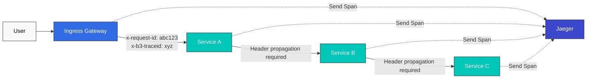
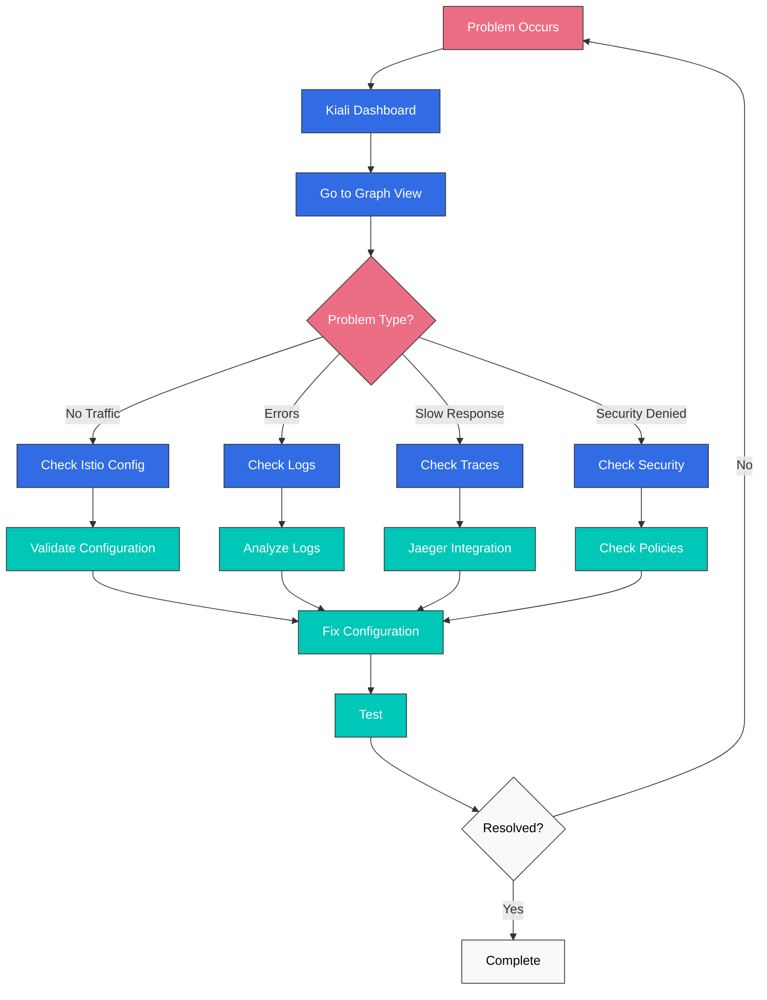

# オブザーバビリティクイズ

> **対応バージョン**: Istio 1.28.0 **EKS バージョン**: 1.34 (Kubernetes 1.28+) **最終更新**: February 19, 2026

このクイズでは、Istio のオブザーバビリティ機能に関する理解を確認します。

## 選択問題（1～5）

### 問題 1: Prometheus メトリクス

Istio で Prometheus によりデフォルトで収集されるメトリクスでは**ない**ものはどれですか？

A. istio\_requests\_total（総リクエスト数） B. istio\_request\_duration\_milliseconds（リクエストレイテンシー） C. istio\_request\_bytes（リクエストサイズ） D. istio\_pod\_cpu\_usage（Pod CPU 使用量）

<details>

<summary>回答を表示</summary>

**回答: D**

Istio Envoy が収集するのは**トラフィック関連メトリクス**のみであり、Pod CPU 使用量は **Kubernetes Metrics Server** または **cAdvisor** が収集します。

**解説:**

**Istio が収集するメトリクス:**

1. **istio\_requests\_total (A - O)**

```promql
# Total requests by service
sum(rate(istio_requests_total[5m])) by (destination_service_name)
```

2. **istio\_request\_duration\_milliseconds (B - O)**

```promql
# P95 latency
histogram_quantile(0.95,
  sum(rate(istio_request_duration_milliseconds_bucket[5m])) by (le)
)
```

3. **istio\_request\_bytes (C - O)**

```promql
# Request size
sum(rate(istio_request_bytes_sum[5m])) by (destination_service_name)
```

4. **istio\_pod\_cpu\_usage (D - X)**

* これは Istio メトリクスではありません
* Kubernetes メトリクス: `container_cpu_usage_seconds_total`
* Prometheus で収集するには kube-state-metrics が必要です

**Istio メトリクスのカテゴリ:**

| カテゴリ     | メトリクスの例                                | 説明                          |
| ------------ | --------------------------------------------- | ----------------------------- |
| **Request**  | istio\_requests\_total                        | リクエスト数、レスポンスコード |
| **Duration** | istio\_request\_duration\_milliseconds        | レイテンシー分布              |
| **Size**     | istio\_request\_bytes, istio\_response\_bytes | トラフィックサイズ            |
| **TCP**      | istio\_tcp\_connections\_opened\_total        | TCP 接続                      |

**Golden Signals の例:**

```promql
# 1. Latency
histogram_quantile(0.95,
  sum(rate(
    istio_request_duration_milliseconds_bucket{
      destination_service_name="reviews"
    }[5m]
  )) by (le)
)

# 2. Traffic
sum(rate(
  istio_requests_total{
    destination_service_name="reviews"
  }[5m]
))

# 3. Errors (error rate)
sum(rate(
  istio_requests_total{
    destination_service_name="reviews",
    response_code=~"5.."
  }[5m]
))
/
sum(rate(
  istio_requests_total{
    destination_service_name="reviews"
  }[5m]
))

# 4. Saturation - Uses Kubernetes metrics
sum(rate(
  container_cpu_usage_seconds_total{
    pod=~"reviews-.*"
  }[5m]
))
```

**メトリクスの確認:**

```bash
# Check metrics via Envoy Admin API
kubectl exec <pod-name> -c istio-proxy -- \
  curl localhost:15000/stats/prometheus

# Check in Prometheus
kubectl port-forward -n istio-system svc/prometheus 9090:9090
# Query at http://localhost:9090
```

**参考資料:**

* [Metrics](../../../service-mesh/istio/observability/01-metrics.md)

</details>

***

### 問題 2: 分散トレーシング

Istio で分散トレーシングに必要な**最小構成**は何ですか？

A. アプリケーションが trace ID を生成する必要がある B. アプリケーションが HTTP ヘッダーを伝播する必要がある C. すべての Service に Jaeger client をインストールする必要がある D. Envoy がすべてを自動処理する

<details>

<summary>回答を表示</summary>

**回答: B**

Istio Envoy は trace ID を自動生成しますが、**アプリケーションが HTTP ヘッダーを次の Service に伝播する必要があります**。

**解説:**

**分散トレーシングの仕組み:**



**伝播する HTTP ヘッダー:**

```yaml
# Zipkin (B3) headers
x-b3-traceid: Trace ID
x-b3-spanid: Current Span ID
x-b3-parentspanid: Parent Span ID
x-b3-sampled: Sampling decision
x-b3-flags: Flags

# Or single header
b3: {traceid}-{spanid}-{sampled}-{parentspanid}

# Istio internal headers
x-request-id: Unique request ID

# Jaeger native headers (optional)
uber-trace-id
```

**アプリケーションコードの例:**

```python
# Python Flask example
from flask import Flask, request
import requests

app = Flask(__name__)

@app.route('/api/users')
def get_users():
    # 1. Extract received headers
    headers = {}
    for header in ['x-request-id', 'x-b3-traceid', 'x-b3-spanid',
                   'x-b3-parentspanid', 'x-b3-sampled', 'x-b3-flags']:
        if header in request.headers:
            headers[header] = request.headers[header]

    # 2. Propagate headers when calling next service
    response = requests.get(
        'http://user-service/users',
        headers=headers  # Header propagation required
    )

    return response.json()
```

```javascript
// Node.js Express example
const express = require('express');
const axios = require('axios');
const app = express();

app.get('/api/users', async (req, res) => {
  // 1. Extract received headers
  const tracingHeaders = {};
  ['x-request-id', 'x-b3-traceid', 'x-b3-spanid',
   'x-b3-parentspanid', 'x-b3-sampled', 'x-b3-flags'].forEach(header => {
    if (req.headers[header]) {
      tracingHeaders[header] = req.headers[header];
    }
  });

  // 2. Propagate headers when calling next service
  const response = await axios.get('http://user-service/users', {
    headers: tracingHeaders  // Header propagation required
  });

  res.json(response.data);
});
```

**各選択肢の分析:**

* **A (X)**: Envoy が trace ID を自動生成します
* **B (O)**: アプリケーションが HTTP ヘッダーを伝播する必要があります（必須）
* **C (X)**: Jaeger client は不要で、Envoy が Span を送信します
* **D (X)**: Envoy は Span を作成・送信しますが、ヘッダー伝播はアプリケーションの責任です

**サンプリング設定:**

```yaml
apiVersion: install.istio.io/v1alpha1
kind: IstioOperator
spec:
  meshConfig:
    defaultConfig:
      tracing:
        sampling: 1.0  # 100% sampling (development)
        # sampling: 10.0  # 10% sampling (production)
```

**Jaeger へのアクセス:**

```bash
istioctl dashboard jaeger
```

**参考資料:**

* [Distributed Tracing](https://github.com/Atom-oh/kubernetes-docs/blob/main/en/service-mesh/istio/observability/02-distributed-tracing.md)

</details>

***

### 問題 3: Kiali の可視化

Kiali が提供**しない**機能はどれですか？

A. Service トポロジーの可視化 B. トラフィックフロー分析 C. Canary Deployment の自動実行 D. Istio 設定の検証

<details>

<summary>回答を表示</summary>

**回答: C**

Kiali は**監視および分析ツール**であり、Deployment の実行は **Argo Rollouts** のようなツールが担います。

**解説:**

**Kiali の主な機能:**

**1. Service トポロジーの可視化（A - O）**

```bash
# Open Kiali dashboard
istioctl dashboard kiali

# Features:
# - Real-time service connection display
# - Traffic flow direction display
# - Service status (healthy/error)
# - Response time display
```

**Graph view の例:**

```
Frontend → Backend → Database
   ↓
External API

Color codes:
- Green: Normal
- Red: Error
- Gray: No traffic
```

**2. トラフィックフロー分析（B - O）**

Kiali には次が表示されます:

* リクエスト数（RPS）
* エラー率（%）
* P50/P95/P99 レイテンシー
* TCP 接続数

**3. Canary Deployment の自動実行（C - X）**

* Kiali は Deployment を実行しません
* Kiali はトラフィック分割の状態を**可視化するだけ**です
* Deployment の実行: Argo Rollouts、Flagger

**4. Istio 設定の検証（D - O）**

```yaml
# Items Kiali validates:

1. VirtualService errors:
   - Non-existent host reference
   - Invalid subset reference
   - Weight sum not equal to 100

2. DestinationRule errors:
   - Subset labels don't match Pods
   - Duplicate subset names

3. Gateway errors:
   - Missing TLS certificate
   - Invalid selector

4. AuthorizationPolicy errors:
   - Conflicting policies
   - Invalid principal format
```

**Kiali のインストール:**

```bash
# Install Kiali included in Istio samples
kubectl apply -f samples/addons/kiali.yaml

# Or install with Helm
helm repo add kiali https://kiali.org/helm-charts
helm install kiali-server kiali/kiali-server \
  --namespace istio-system
```

**Kiali の主なメニュー:**

```
1. Overview: Service summary by Namespace
2. Graph: Service topology
3. Applications: Application list
4. Workloads: Deployment, StatefulSet, etc.
5. Services: Kubernetes Service
6. Istio Config: VirtualService, DestinationRule, etc.
```

**Kiali と他ツールの比較:**

| ツール            | 役割                                | Deployment の実行 |
| ----------------- | ----------------------------------- | -------------------- |
| **Kiali**         | 可視化、分析、検証                  | いいえ               |
| **Argo Rollouts** | Progressive Delivery                | はい                  |
| **Flagger**       | Canary Deployment の自動実行        | はい                  |
| **Grafana**       | メトリクスダッシュボード            | いいえ               |
| **Jaeger**        | 分散トレーシング                    | いいえ               |

**実践的な使用例:**

```bash
# 1. Check service topology in Kiali
istioctl dashboard kiali

# 2. Detect anomalies in Graph view
#    - reviews service error rate 5%
#    - productpage → reviews latency increase

# 3. Check details in Workload view
#    - Check reviews-v2 Pod logs
#    - Check Envoy metrics

# 4. Validate configuration in Istio Config view
#    - Found typo in VirtualService
#    - Fix and redeploy
```

**参考資料:**

* [Visualization](https://github.com/Atom-oh/kubernetes-docs/blob/main/en/service-mesh/istio/observability/04-visualization.md)
* [Kiali Official Documentation](https://kiali.io/docs/)

</details>

***

### 問題 4: Access Log の設定

Istio で Access Log の出力を **JSON 形式**に設定するにはどうしますか？

A. IstioOperator で meshConfig.accessLogEncoding を JSON に設定する B. Envoy ConfigMap を直接変更する C. 各 Pod に annotation を追加する D. Prometheus query で JSON に変換する

<details>

<summary>回答を表示</summary>

**回答: A**

IstioOperator の **meshConfig.accessLogEncoding** フィールドを `JSON` に設定します。

**解説:**

**JSON 形式の Access Log 設定:**

```yaml
apiVersion: install.istio.io/v1alpha1
kind: IstioOperator
spec:
  meshConfig:
    # Enable Access Log
    accessLogFile: /dev/stdout

    # Output in JSON format
    accessLogEncoding: JSON

    # Define custom JSON format
    accessLogFormat: |
      {
        "start_time": "%START_TIME%",
        "method": "%REQ(:METHOD)%",
        "path": "%REQ(X-ENVOY-ORIGINAL-PATH?:PATH)%",
        "protocol": "%PROTOCOL%",
        "response_code": "%RESPONSE_CODE%",
        "response_flags": "%RESPONSE_FLAGS%",
        "bytes_received": "%BYTES_RECEIVED%",
        "bytes_sent": "%BYTES_SENT%",
        "duration": "%DURATION%",
        "upstream_service_time": "%RESP(X-ENVOY-UPSTREAM-SERVICE-TIME)%",
        "x_forwarded_for": "%REQ(X-FORWARDED-FOR)%",
        "user_agent": "%REQ(USER-AGENT)%",
        "request_id": "%REQ(X-REQUEST-ID)%",
        "authority": "%REQ(:AUTHORITY)%",
        "upstream_host": "%UPSTREAM_HOST%",
        "upstream_cluster": "%UPSTREAM_CLUSTER%",
        "upstream_local_address": "%UPSTREAM_LOCAL_ADDRESS%",
        "downstream_local_address": "%DOWNSTREAM_LOCAL_ADDRESS%",
        "downstream_remote_address": "%DOWNSTREAM_REMOTE_ADDRESS%",
        "requested_server_name": "%REQUESTED_SERVER_NAME%",
        "route_name": "%ROUTE_NAME%"
      }
```

**出力例:**

```json
{
  "start_time": "2025-01-20T10:30:00.123Z",
  "method": "GET",
  "path": "/api/users",
  "protocol": "HTTP/1.1",
  "response_code": 200,
  "response_flags": "-",
  "bytes_received": 0,
  "bytes_sent": 1234,
  "duration": 42,
  "upstream_service_time": "40",
  "x_forwarded_for": "192.168.1.100",
  "user_agent": "Mozilla/5.0",
  "request_id": "abc-123-def",
  "authority": "example.com",
  "upstream_host": "10.0.1.20:8080",
  "upstream_cluster": "outbound|8080||backend.default.svc.cluster.local",
  "upstream_local_address": "10.0.1.10:54321",
  "downstream_local_address": "10.0.1.10:8080",
  "downstream_remote_address": "10.0.1.5:12345",
  "requested_server_name": "-",
  "route_name": "default"
}
```

**Namespace ごとの設定:**

```yaml
apiVersion: telemetry.istio.io/v1alpha1
kind: Telemetry
metadata:
  name: access-logging
  namespace: production
spec:
  accessLogging:
  - providers:
    - name: envoy
    # Can configure JSON format for specific Namespace only
```

**Envoy 形式変数:**

```yaml
# Key variables:
%START_TIME%: Request start time
%REQ(HEADER)%: Request header
%RESP(HEADER)%: Response header
%RESPONSE_CODE%: HTTP response code
%DURATION%: Total duration (ms)
%BYTES_RECEIVED%: Bytes received
%BYTES_SENT%: Bytes sent
%UPSTREAM_HOST%: Upstream server address
%DOWNSTREAM_REMOTE_ADDRESS%: Client address
```

**CloudWatch Logs との統合:**

```yaml
apiVersion: v1
kind: ConfigMap
metadata:
  name: fluent-bit-config
  namespace: istio-system
data:
  output.conf: |
    [OUTPUT]
        Name cloudwatch_logs
        Match *
        region us-east-1
        log_group_name /aws/eks/istio/access-logs
        log_stream_prefix istio-
        auto_create_group true
```

**ログの確認:**

```bash
# Check Pod's Access Log
kubectl logs <pod-name> -c istio-proxy

# Real-time monitoring
kubectl logs -f <pod-name> -c istio-proxy | jq .

# Filter specific response codes
kubectl logs <pod-name> -c istio-proxy | \
  jq 'select(.response_code == "500")'
```

**TEXT 形式と JSON 形式の比較:**

| 項目            | TEXT         | JSON            |
| --------------- | ------------ | --------------- |
| **可読性**      | 高い（人間） | 低い（人間）    |
| **パース**      | 困難         | 容易（機械）    |
| **サイズ**      | 小さい       | 大きい          |
| **構造**        | 非構造化     | 構造化          |
| **クエリ**      | 困難         | 容易（jq など） |

**TEXT 形式の例:**

```
[2025-01-20T10:30:00.123Z] "GET /api/users HTTP/1.1" 200 - "-" "-" 0 1234 42 40 "192.168.1.100" "Mozilla/5.0" "abc-123-def" "example.com" "10.0.1.20:8080" outbound|8080||backend.default.svc.cluster.local 10.0.1.10:54321 10.0.1.10:8080 10.0.1.5:12345 - default
```

**参考資料:**

* [Logging](../../../service-mesh/istio/observability/03-logging.md)
* [Envoy Access Log Format](https://www.envoyproxy.io/docs/envoy/latest/configuration/observability/access_log/usage)

</details>

***

### 問題 5: Grafana ダッシュボード

Istio のインストール時にデフォルトで提供**されない** Grafana ダッシュボードはどれですか？

A. Istio Service Dashboard B. Istio Workload Dashboard C. Istio Performance Dashboard D. Istio Cost Dashboard

<details>

<summary>回答を表示</summary>

**回答: D**

Istio はデフォルトでは **Cost Dashboard を提供しません**。

**解説:**

**Istio のデフォルト Grafana ダッシュボード:**

**1. Istio Service Dashboard（A - O）**

```
Service-level metrics:
- Request Volume (request count)
- Request Duration (P50, P95, P99)
- Request Size / Response Size
- Success Rate
- 4xx, 5xx error trends
```

**2. Istio Workload Dashboard（B - O）**

```
Workload (Pod) level metrics:
- Incoming Request Volume
- Incoming Success Rate
- Incoming Request Duration
- Incoming Request Size
- Outgoing Request Volume
- Outgoing Success Rate
```

**3. Istio Performance Dashboard（C - O）**

```
Istio's own performance metrics:
- Pilot performance (xDS push time)
- Envoy memory usage
- Envoy CPU usage
- Sidecar injection success rate
- Configuration sync latency
```

**4. Istio Control Plane Dashboard**

```
Control Plane metrics:
- Istiod resource usage
- xDS connection count
- Webhook performance
- Certificate issuance statistics
```

**5. Istio Mesh Dashboard**

```
Overall mesh metrics:
- Total request count
- Overall success rate
- Global P99 latency
- Service count, Pod count
```

**Cost Dashboard は利用不可（D - X）**

コスト関連メトリクス用のカスタムダッシュボードを作成する必要があります:

```promql
# Cross-AZ traffic cost estimation
sum(rate(istio_requests_total{
  source_cluster="us-east-1a",
  destination_cluster!="us-east-1a"
}[5m])) * 86400 * 30 * 0.01 / 1000000

# Sidecar resource cost (memory basis)
sum(container_memory_usage_bytes{
  container="istio-proxy"
}) / 1024 / 1024 / 1024 * 30 * 0.01
```

**Grafana のインストールとアクセス:**

```bash
# Install Grafana
kubectl apply -f samples/addons/grafana.yaml

# Access Grafana
istioctl dashboard grafana

# Or port forwarding
kubectl port-forward -n istio-system svc/grafana 3000:3000
# http://localhost:3000
```

**カスタムダッシュボードの作成:**

```json
{
  "dashboard": {
    "title": "Istio Custom Metrics",
    "panels": [
      {
        "title": "Request Rate",
        "targets": [
          {
            "expr": "sum(rate(istio_requests_total[5m])) by (destination_service_name)"
          }
        ]
      },
      {
        "title": "Error Rate",
        "targets": [
          {
            "expr": "sum(rate(istio_requests_total{response_code=~\"5..\"}[5m])) / sum(rate(istio_requests_total[5m]))"
          }
        ]
      }
    ]
  }
}
```

**ダッシュボード変数の使用:**

```yaml
# Add Namespace variable
variables:
  - name: namespace
    type: query
    query: label_values(istio_requests_total, destination_workload_namespace)

# Use variable in panel
expr: |
  sum(rate(
    istio_requests_total{
      destination_workload_namespace="$namespace"
    }[5m]
  )) by (destination_service_name)
```

**参考資料:**

* [Visualization](https://github.com/Atom-oh/kubernetes-docs/blob/main/en/service-mesh/istio/observability/04-visualization.md)
* [Grafana Official Documentation](https://grafana.com/docs/)

</details>

***

## 記述問題（6～10）

### 問題 6: Golden Signals の監視

Istio と Prometheus を使用して、Google SRE の **Golden Signals**（Latency、Traffic、Errors、Saturation）を監視する方法を説明してください。各シグナルの **Prometheus query** と **alerting rule** を含めてください。

<details>

<summary>回答を表示</summary>

**回答:**

**Golden Signals の監視実装:**

***

**1. Latency**

**Prometheus query:**

```promql
# P95 latency
histogram_quantile(0.95,
  sum(rate(
    istio_request_duration_milliseconds_bucket{
      destination_service_name="reviews"
    }[5m]
  )) by (le)
)

# P99 latency
histogram_quantile(0.99,
  sum(rate(
    istio_request_duration_milliseconds_bucket{
      destination_service_name="reviews"
    }[5m]
  )) by (le)
)

# P50 latency (median)
histogram_quantile(0.50,
  sum(rate(
    istio_request_duration_milliseconds_bucket{
      destination_service_name="reviews"
    }[5m]
  )) by (le)
)
```

**alerting rule:**

```yaml
apiVersion: monitoring.coreos.com/v1
kind: PrometheusRule
metadata:
  name: istio-latency-alerts
  namespace: monitoring
spec:
  groups:
  - name: latency
    interval: 30s
    rules:
    # P95 latency exceeds 500ms
    - alert: HighLatency
      expr: |
        histogram_quantile(0.95,
          sum(rate(
            istio_request_duration_milliseconds_bucket[5m]
          )) by (le, destination_service_name)
        ) > 500
      for: 5m
      labels:
        severity: warning
      annotations:
        summary: "High latency detected on {{ $labels.destination_service_name }}"
        description: "P95 latency is {{ $value }}ms"

    # P99 latency exceeds 1 second
    - alert: CriticalLatency
      expr: |
        histogram_quantile(0.99,
          sum(rate(
            istio_request_duration_milliseconds_bucket[5m]
          )) by (le, destination_service_name)
        ) > 1000
      for: 5m
      labels:
        severity: critical
      annotations:
        summary: "Critical latency on {{ $labels.destination_service_name }}"
```

***

**2. Traffic**

**Prometheus query:**

```promql
# Requests per second (RPS)
sum(rate(
  istio_requests_total{
    destination_service_name="reviews"
  }[5m]
))

# RPS by service
sum(rate(
  istio_requests_total[5m]
)) by (destination_service_name)

# RPS by HTTP method
sum(rate(
  istio_requests_total[5m]
)) by (request_method)
```

**alerting rule:**

```yaml
apiVersion: monitoring.coreos.com/v1
kind: PrometheusRule
metadata:
  name: istio-traffic-alerts
spec:
  groups:
  - name: traffic
    rules:
    # Traffic spike (2x normal)
    - alert: TrafficSpike
      expr: |
        sum(rate(istio_requests_total[5m])) by (destination_service_name)
        >
        sum(rate(istio_requests_total[1h] offset 1h)) by (destination_service_name) * 2
      for: 5m
      labels:
        severity: warning
      annotations:
        summary: "Traffic spike on {{ $labels.destination_service_name }}"

    # Traffic drop (below 50% of normal)
    - alert: TrafficDrop
      expr: |
        sum(rate(istio_requests_total[5m])) by (destination_service_name)
        <
        sum(rate(istio_requests_total[1h] offset 1h)) by (destination_service_name) * 0.5
      for: 10m
      labels:
        severity: warning
```

***

**3. Errors**

**Prometheus query:**

```promql
# Error rate (5xx)
sum(rate(
  istio_requests_total{
    destination_service_name="reviews",
    response_code=~"5.."
  }[5m]
))
/
sum(rate(
  istio_requests_total{
    destination_service_name="reviews"
  }[5m]
))

# 4xx + 5xx error rate
sum(rate(
  istio_requests_total{
    destination_service_name="reviews",
    response_code=~"[45].."
  }[5m]
))
/
sum(rate(
  istio_requests_total{
    destination_service_name="reviews"
  }[5m]
))

# Distribution by response code
sum(rate(
  istio_requests_total[5m]
)) by (response_code, destination_service_name)
```

**alerting rule:**

```yaml
apiVersion: monitoring.coreos.com/v1
kind: PrometheusRule
metadata:
  name: istio-error-alerts
spec:
  groups:
  - name: errors
    rules:
    # Error rate > 1%
    - alert: HighErrorRate
      expr: |
        (
          sum(rate(istio_requests_total{response_code=~"5.."}[5m])) by (destination_service_name)
          /
          sum(rate(istio_requests_total[5m])) by (destination_service_name)
        ) > 0.01
      for: 5m
      labels:
        severity: warning
      annotations:
        summary: "High error rate on {{ $labels.destination_service_name }}"
        description: "Error rate is {{ $value | humanizePercentage }}"

    # Error rate > 5%
    - alert: CriticalErrorRate
      expr: |
        (
          sum(rate(istio_requests_total{response_code=~"5.."}[5m])) by (destination_service_name)
          /
          sum(rate(istio_requests_total[5m])) by (destination_service_name)
        ) > 0.05
      for: 2m
      labels:
        severity: critical
```

***

**4. Saturation**

**Prometheus query:**

```promql
# Envoy CPU usage
sum(rate(
  container_cpu_usage_seconds_total{
    pod=~".*",
    container="istio-proxy"
  }[5m]
)) by (pod)

# Envoy memory usage
sum(
  container_memory_usage_bytes{
    pod=~".*",
    container="istio-proxy"
  }
) by (pod)

# Envoy connection count
sum(
  envoy_cluster_upstream_cx_active
) by (cluster_name)

# Envoy pending requests
sum(
  envoy_cluster_upstream_rq_pending_active
) by (cluster_name)
```

**alerting rule:**

```yaml
apiVersion: monitoring.coreos.com/v1
kind: PrometheusRule
metadata:
  name: istio-saturation-alerts
spec:
  groups:
  - name: saturation
    rules:
    # Envoy CPU > 80%
    - alert: HighEnvoyCPU
      expr: |
        sum(rate(
          container_cpu_usage_seconds_total{
            container="istio-proxy"
          }[5m]
        )) by (pod, namespace)
        /
        sum(
          container_spec_cpu_quota{
            container="istio-proxy"
          } / 100000
        ) by (pod, namespace)
        > 0.8
      for: 5m
      labels:
        severity: warning

    # Envoy Memory > 80%
    - alert: HighEnvoyMemory
      expr: |
        sum(
          container_memory_usage_bytes{
            container="istio-proxy"
          }
        ) by (pod, namespace)
        /
        sum(
          container_spec_memory_limit_bytes{
            container="istio-proxy"
          }
        ) by (pod, namespace)
        > 0.8
      for: 5m
      labels:
        severity: warning

    # Connection Pool Saturated
    - alert: ConnectionPoolSaturated
      expr: |
        envoy_cluster_upstream_cx_active
        /
        envoy_cluster_circuit_breakers_default_cx_open
        > 0.9
      for: 5m
      labels:
        severity: critical
```

***

**Grafana ダッシュボードの設定:**

```json
{
  "dashboard": {
    "title": "Golden Signals",
    "panels": [
      {
        "title": "Latency (P95, P99)",
        "targets": [
          {"expr": "histogram_quantile(0.95, sum(rate(istio_request_duration_milliseconds_bucket[5m])) by (le))"},
          {"expr": "histogram_quantile(0.99, sum(rate(istio_request_duration_milliseconds_bucket[5m])) by (le))"}
        ]
      },
      {
        "title": "Traffic (RPS)",
        "targets": [
          {"expr": "sum(rate(istio_requests_total[5m])) by (destination_service_name)"}
        ]
      },
      {
        "title": "Errors (Rate)",
        "targets": [
          {"expr": "sum(rate(istio_requests_total{response_code=~\"5..\"}[5m])) / sum(rate(istio_requests_total[5m]))"}
        ]
      },
      {
        "title": "Saturation (CPU, Memory)",
        "targets": [
          {"expr": "sum(rate(container_cpu_usage_seconds_total{container=\"istio-proxy\"}[5m])) by (pod)"},
          {"expr": "sum(container_memory_usage_bytes{container=\"istio-proxy\"}) by (pod)"}
        ]
      }
    ]
  }
}
```

**参考資料:**

* [Metrics](../../../service-mesh/istio/observability/01-metrics.md)
* [Google SRE Book - Monitoring](https://sre.google/sre-book/monitoring-distributed-systems/)

</details>

***

### 問題 7: Jaeger によるパフォーマンスボトルネックの特定

分散トレーシングツール Jaeger を使用して、マイクロサービスアーキテクチャの**パフォーマンスボトルネック**を特定する方法を説明してください。**Trace の分析方法**と**実践的なデバッグシナリオ**を含めてください。

<details>

<summary>回答を表示</summary>

**回答:**

**Jaeger によるパフォーマンスボトルネック分析:**

***

**1. Jaeger のインストールと設定**

```bash
# Install Jaeger
kubectl apply -f samples/addons/jaeger.yaml

# Enable Tracing (100% sampling)
istioctl install --set values.pilot.traceSampling=100.0
```

```yaml
# Or configure with IstioOperator
apiVersion: install.istio.io/v1alpha1
kind: IstioOperator
spec:
  meshConfig:
    defaultConfig:
      tracing:
        sampling: 100.0  # Development: 100%, Production: 1-10%
        zipkin:
          address: jaeger-collector.istio-system:9411
```

***

**2. Trace 構造の理解**

```
Trace
└─ Span 1: Ingress Gateway (total 150ms)
   └─ Span 2: Frontend (total 140ms)
      ├─ Span 3: Backend API (total 100ms)
      │  ├─ Span 4: Database Query (80ms)  ← Bottleneck!
      │  └─ Span 5: Cache Check (10ms)
      └─ Span 6: External API (30ms)
```

**Span の情報:**

* **Duration**: Span に費やされた時間
* **Tags**: メタデータ（HTTP method、URL、response code）
* **Logs**: イベント（エラー、警告）
* **親子関係**: 呼び出し階層

***

**3. 実践的なデバッグシナリオ**

**シナリオ 1: 高い P99 レイテンシー**

**症状:**

```promql
# P99 latency is 2 seconds
histogram_quantile(0.99,
  sum(rate(
    istio_request_duration_milliseconds_bucket[5m]
  )) by (le)
) = 2000
```

**Jaeger の分析手順:**

```bash
# 1. Access Jaeger UI
istioctl dashboard jaeger

# 2. Set search criteria
Service: productpage
Lookback: Last 1 hour
Min Duration: 2000ms  # Filter only 2+ seconds
Limit Results: 20

# 3. Analyze results
```

**特定された問題:**

```
Trace ID: abc-123-def
Total Duration: 2.1 seconds

├─ productpage (2.1s)
   └─ reviews (2.0s)  ← Bottleneck!
      └─ ratings (1.9s)  ← Actual bottleneck!
         └─ MongoDB Query (1.8s)  ← Root cause!
```

**解決策:**

```yaml
# 1. Optimize MongoDB query
# - Add index
# - Query tuning

# 2. Add caching
apiVersion: v1
kind: ConfigMap
metadata:
  name: ratings-config
data:
  redis.conf: |
    host: redis.default.svc.cluster.local
    port: 6379
    ttl: 300

# 3. Set Timeout
apiVersion: networking.istio.io/v1beta1
kind: VirtualService
metadata:
  name: ratings
spec:
  hosts:
  - ratings
  http:
  - timeout: 500ms  # Set timeout
    retries:
      attempts: 3
      perTryTimeout: 200ms
```

***

**シナリオ 2: 断続的なタイムアウト**

**Jaeger の分析:**

```
# Normal Trace
Trace ID: normal-001
Duration: 120ms
├─ frontend (120ms)
   └─ backend (100ms)
      └─ database (80ms)

# Timeout Trace
Trace ID: timeout-001
Duration: 10,000ms  ← Abnormal!
├─ frontend (10,000ms)
   └─ backend (9,980ms)
      └─ database (9,950ms)  ← Bottleneck!
         └─ Error: Connection timeout
```

**Span の詳細を確認:**

```json
{
  "traceID": "timeout-001",
  "spanID": "span-db",
  "operationName": "database.query",
  "duration": 9950000,
  "tags": {
    "db.statement": "SELECT * FROM users WHERE status = 'active'",
    "db.type": "postgresql",
    "error": true
  },
  "logs": [
    {
      "timestamp": 1234567890,
      "fields": [
        {"key": "event", "value": "error"},
        {"key": "error.kind", "value": "ConnectionTimeout"},
        {"key": "message", "value": "Connection pool exhausted"}
      ]
    }
  ]
}
```

**解決策:**

```yaml
# Increase Connection Pool
apiVersion: networking.istio.io/v1beta1
kind: DestinationRule
metadata:
  name: database
spec:
  host: database
  trafficPolicy:
    connectionPool:
      tcp:
        maxConnections: 100  # 50 → 100
      http:
        http1MaxPendingRequests: 50
        maxRequestsPerConnection: 2
```

***

**シナリオ 3: 連鎖するレイテンシー**

**Jaeger の分析:**

```
Trace ID: cascade-001
Total Duration: 5.2 seconds

├─ frontend (5.2s)
   ├─ backend-a (2.0s)
   │  └─ database (1.9s)
   ├─ backend-b (2.0s)  ← Sequential call issue!
   │  └─ external-api (1.9s)
   └─ backend-c (1.0s)
      └─ cache (0.9s)

Problem: Sequential execution of parallelizable calls
```

**解決策（アプリケーションの変更）:**

```python
# Sequential calls (Before)
def get_user_data(user_id):
    profile = call_backend_a(user_id)      # 2 seconds
    orders = call_backend_b(user_id)       # 2 seconds
    recommendations = call_backend_c(user_id)  # 1 second
    return merge(profile, orders, recommendations)

# Total time: 5 seconds

# Parallel calls (After)
import asyncio

async def get_user_data(user_id):
    profile, orders, recommendations = await asyncio.gather(
        call_backend_a(user_id),      # 2 seconds
        call_backend_b(user_id),       # 2 seconds
        call_backend_c(user_id)        # 1 second
    )
    return merge(profile, orders, recommendations)

# Total time: 2 seconds (longest call)
```

***

**4. Jaeger UI のヒント**

**Service の依存関係（Service Dependency Graph）:**

```bash
# Jaeger UI → Dependencies tab
# - Visualize service call relationships
# - Display error rates
# - Display request counts
```

**Trace の比較:**

```bash
# 1. Select normal Trace
# 2. Select slow Trace
# 3. Click Compare button
# 4. Check time differences per Span
```

**詳細な依存関係グラフ:**

```bash
# Check detailed dependencies for specific Trace
# - Time spent per Span
# - Parallel/sequential execution status
# - Critical Path
```

***

**5. パフォーマンス最適化チェックリスト**

```yaml
# 1. Remove unnecessary calls
# - N+1 query problem
# - Duplicate API calls

# 2. Parallel processing
# - Execute independent calls in parallel
# - Use asyncio, Promise.all, etc.

# 3. Caching
# - Redis, Memcached
# - CDN (static resources)

# 4. Connection Pool tuning
# - Appropriate max connections
# - Enable Keep-Alive

# 5. Timeout settings
# - Appropriate timeout (not too long)
# - Fail Fast

# 6. Database optimization
# - Add indexes
# - Query optimization
# - Use read replicas
```

***

**6. Prometheus + Jaeger の統合**

```promql
# Find Traces with high latency
histogram_quantile(0.99,
  sum(rate(
    istio_request_duration_milliseconds_bucket[5m]
  )) by (le, destination_service_name)
) > 1000

# After checking in Prometheus, search Traces in Jaeger for that time period
```

**参考資料:**

* [Distributed Tracing](https://github.com/Atom-oh/kubernetes-docs/blob/main/en/service-mesh/istio/observability/02-distributed-tracing.md)
* [Jaeger Official Documentation](https://www.jaegertracing.io/docs/)

</details>

***

### 問題 8: Kiali を使用した Service Mesh のトラブルシューティング

Kiali を使用して、Istio Service Mesh の**一般的な問題**（設定エラー、トラフィック異常、セキュリティポリシーの競合）を診断して解決する方法を説明してください。

<details>

<summary>回答を表示</summary>

**回答:**

**Kiali を使用した Service Mesh のトラブルシューティング:**

***

**1. 設定エラーの診断**

**問題 1: VirtualService Host エラー**

**症状:**

```bash
# Service call failure
curl http://reviews:9080
# 503 Service Unavailable
```

**Kiali による診断:**

```bash
# 1. Access Kiali dashboard
istioctl dashboard kiali

# 2. Istio Config → VirtualServices tab
# 3. Warning indicator on reviews VirtualService

# 4. Click for details
```

**Kiali のエラーメッセージ:**

```
Warning: VirtualService 'reviews-vs' has issues:
- Host 'reviews.default.svc.cluster.local' references service 'reviews'
  but service does not exist
- Subset 'v2' references DestinationRule 'reviews-dr'
  but subset is not defined
```

**解決策:**

```yaml
# Incorrect configuration
apiVersion: networking.istio.io/v1beta1
kind: VirtualService
metadata:
  name: reviews-vs
spec:
  hosts:
  - reviews.default.svc.cluster.local  # Service doesn't exist!
  http:
  - route:
    - destination:
        host: reviews
        subset: v2  # Not defined in DestinationRule!

---
# Correct configuration
apiVersion: networking.istio.io/v1beta1
kind: VirtualService
metadata:
  name: reviews-vs
spec:
  hosts:
  - reviews  # Service name only
  http:
  - route:
    - destination:
        host: reviews
        subset: v1  # Existing subset

---
apiVersion: networking.istio.io/v1beta1
kind: DestinationRule
metadata:
  name: reviews-dr
spec:
  host: reviews
  subsets:
  - name: v1
    labels:
      version: v1
```

***

**問題 2: DestinationRule Subset ラベルの不一致**

**Kiali による診断:**

```
In Graph view:
- No traffic being sent to reviews service
- Kiali shows red dashed line

In Istio Config tab:
Warning: DestinationRule 'reviews-dr' has issues:
- Subset 'v1' selects labels {version: v1}
  but no pods match these labels
```

**問題の確認:**

```bash
# Check Pod labels
kubectl get pods -l app=reviews --show-labels

# Output:
NAME            LABELS
reviews-v1-xxx  app=reviews,version=1.0  ← version=1.0 (wrong)
```

**解決策:**

```yaml
# Incorrect DestinationRule
apiVersion: networking.istio.io/v1beta1
kind: DestinationRule
spec:
  subsets:
  - name: v1
    labels:
      version: v1  # Pod has version=1.0

# Corrected DestinationRule
apiVersion: networking.istio.io/v1beta1
kind: DestinationRule
spec:
  subsets:
  - name: v1
    labels:
      version: "1.0"  # Match Pod label
```

***

**2. トラフィック異常の診断**

**問題 3: トラフィックの不均衡**

**Kiali Graph view で確認:**

```
frontend → backend-v1 (90% traffic)  ← Expected: 50%
frontend → backend-v2 (10% traffic)  ← Expected: 50%
```

**根本原因分析:**

```bash
# Kiali → Workloads tab → backend
# Check Pod status:

backend-v1: 5 pods (all Ready)
backend-v2: 5 pods (3 Ready, 2 Terminating)

# Problem: backend-v2 Pods not starting normally
```

**解決策:**

```bash
# 1. Check backend-v2 logs in Kiali
Workloads → backend-v2 → Logs tab

# 2. Analyze logs
Error: Cannot connect to database
Connection: postgresql://db:5432

# 3. Fix
kubectl edit deployment backend-v2
# Fix database connection string

# 4. Verify traffic balance in Kiali
# After few minutes: 50% / 50% normalized
```

***

**問題 4: 循環依存**

**Kiali Graph view で確認:**

```
service-a → service-b
    ↑           ↓
    └───────────┘

Circular dependency detected!
```

**Kiali アラート:**

```
Warning: Circular dependency detected:
service-a → service-b → service-a
```

**解決策:**

```yaml
# Architecture redesign needed
# Before:
service-a ↔ service-b

# After:
service-a → service-c (common service)
service-b → service-c
```

***

**3. セキュリティポリシー競合の診断**

**問題 5: AuthorizationPolicy の競合**

**症状:**

```bash
# frontend → backend call fails
curl http://backend:8080
# 403 RBAC: access denied
```

**Kiali による診断:**

```bash
# Kiali → Istio Config → Authorization Policies

Policy 1:
apiVersion: security.istio.io/v1beta1
kind: AuthorizationPolicy
metadata:
  name: deny-all
spec: {}  # Deny all requests

Policy 2:
apiVersion: security.istio.io/v1beta1
kind: AuthorizationPolicy
metadata:
  name: allow-frontend
spec:
  action: ALLOW
  rules:
  - from:
    - source:
        principals: ["cluster.local/ns/default/sa/frontend"]

# Kiali warning:
Warning: Policy conflict detected:
- deny-all denies all traffic
- allow-frontend allows traffic from frontend
- Evaluation order: DENY policies are evaluated first
```

**解決策:**

```yaml
# Correct configuration (per-Namespace separation)
---
# deny-all applies only to specific service
apiVersion: security.istio.io/v1beta1
kind: AuthorizationPolicy
metadata:
  name: backend-deny-all
spec:
  selector:
    matchLabels:
      app: backend
  # Empty rules = deny all requests

---
# Explicit allow policy
apiVersion: security.istio.io/v1beta1
kind: AuthorizationPolicy
metadata:
  name: backend-allow-frontend
spec:
  selector:
    matchLabels:
      app: backend
  action: ALLOW
  rules:
  - from:
    - source:
        principals: ["cluster.local/ns/default/sa/frontend"]
```

***

**問題 6: mTLS モードの不一致**

**Kiali Security view で確認:**

```
service-a: mTLS STRICT
service-b: mTLS PERMISSIVE
service-c: mTLS DISABLED

Kiali warning:
Warning: mTLS configuration mismatch detected
- service-a requires mTLS but service-c has mTLS disabled
- Connection may fail
```

**解決策:**

```yaml
# Apply consistent mTLS policy across entire mesh
apiVersion: security.istio.io/v1beta1
kind: PeerAuthentication
metadata:
  name: default
  namespace: istio-system
spec:
  mtls:
    mode: STRICT  # Apply STRICT to all services
```

***

**4. Kiali の高度な機能**

**カスタム時間範囲:**

```bash
# Kiali → Graph view
# Time Range: Last 1 hour
# Refresh Interval: Every 15s

# Analyze specific time period
# - Check before/after incident
# - Compare before/after deployment
```

**トラフィックアニメーション:**

```bash
# Kiali → Graph view
# Display: Enable Traffic Animation

# Real-time traffic flow visualization
# - Request size shown as animation speed
# - Errors shown in red
```

**エッジラベル:**

```bash
# Kiali → Graph view
# Edge Labels:
# - Request percentage
# - Request per second
# - Response time (95th percentile)

# Check traffic split ratio
frontend → backend-v1: 80% (8 rps)
frontend → backend-v2: 20% (2 rps)
```

**Service の詳細:**

```bash
# Kiali → Services → backend

Tabs:
1. Overview: Summary information
2. Traffic: Inbound/Outbound traffic
3. Inbound Metrics: Metric charts
4. Traces: Jaeger trace integration
5. Envoy: Envoy configuration check
```

***

**5. トラブルシューティングのワークフロー**



**参考資料:**

* [Visualization](https://github.com/Atom-oh/kubernetes-docs/blob/main/en/service-mesh/istio/observability/04-visualization.md)
* [Kiali Official Documentation](https://kiali.io/docs/)

</details>

***

### 問題 9: 本番オブザーバビリティスタックのセットアップ

本番 Kubernetes cluster 向けに、Istio オブザーバビリティスタック（Prometheus、Grafana、Jaeger、Kiali）を **High Availability（HA）** 構成でデプロイする方法を説明してください。**永続ストレージ**、**スケーリング**、および **バックアップ**の戦略を含めてください。

<details>

<summary>回答を表示</summary>

**回答:**

**本番オブザーバビリティスタックのセットアップ:**

回答が長いため、以下を含む完全な実装の詳細については韓国語のソースファイルを参照してください:

1. Helm（kube-prometheus-stack）による **Prometheus HA 構成**
2. S3 backend を使用した**長期メトリクスストレージ向け Thanos**
3. Elasticsearch backend を使用した **Jaeger HA 構成**
4. **Kiali HA 構成**
5. Velero による**バックアップおよびリカバリ戦略**
6. PrometheusRules による**監視およびアラート**

**参考資料:**

* [Prometheus Operator](https://github.com/prometheus-operator/prometheus-operator)
* [Thanos](https://thanos.io/tip/thanos/getting-started.md/)
* [Jaeger Operator](https://www.jaegertracing.io/docs/latest/operator/)

</details>

***

### 問題 10: カスタムメトリクスとダッシュボードの作成

Istio Envoy が収集するデフォルトメトリクスを超えて、**ビジネスメトリクス**（例: 注文数、支払い成功率）を収集し、Grafana のカスタムダッシュボードを作成する方法を説明してください。

<details>

<summary>回答を表示</summary>

**回答:**

**カスタムメトリクスとダッシュボードの作成:**

回答が長いため、以下を含む完全な実装の詳細については韓国語のソースファイルを参照してください:

1. **アプリケーションからのメトリクス公開**（Python Flask および Node.js Express の例）
2. **Kubernetes ServiceMonitor の設定**
3. ビジネスメトリクスの **Prometheus query**
4. **Grafana カスタムダッシュボード**の JSON 設定
5. ConfigMap による**ダッシュボードプロビジョニング**
6. PrometheusRules による**アラート設定**

**参考資料:**

* [Metrics](../../../service-mesh/istio/observability/01-metrics.md)
* [Prometheus Client Libraries](https://prometheus.io/docs/instrumenting/clientlibs/)
* [Grafana Provisioning](https://grafana.com/docs/grafana/latest/administration/provisioning/)

</details>

***

## スコア計算

* 選択問題 1～5: 各 10 点（合計 50 点）
* 記述問題 6～10: 各 10 点（合計 50 点）
* **合計: 100 点**

**評価基準:**

* 90～100 点: 優秀（Istio オブザーバビリティエキスパート）
* 80～89 点: 良好（本番監視に対応可能）
* 70～79 点: 平均（追加学習を推奨）
* 60～69 点: 平均以下（基本概念の復習が必要）
* 0～59 点: 再学習が必要

## 学習リソース

* [Metrics](../../../service-mesh/istio/observability/01-metrics.md)
* [Distributed Tracing](https://github.com/Atom-oh/kubernetes-docs/blob/main/en/service-mesh/istio/observability/02-distributed-tracing.md)
* [Logging](../../../service-mesh/istio/observability/03-logging.md)
* [Visualization](https://github.com/Atom-oh/kubernetes-docs/blob/main/en/service-mesh/istio/observability/04-visualization.md)
