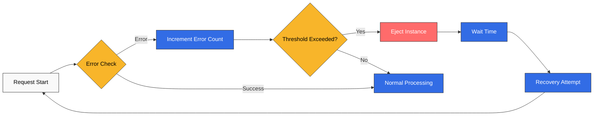
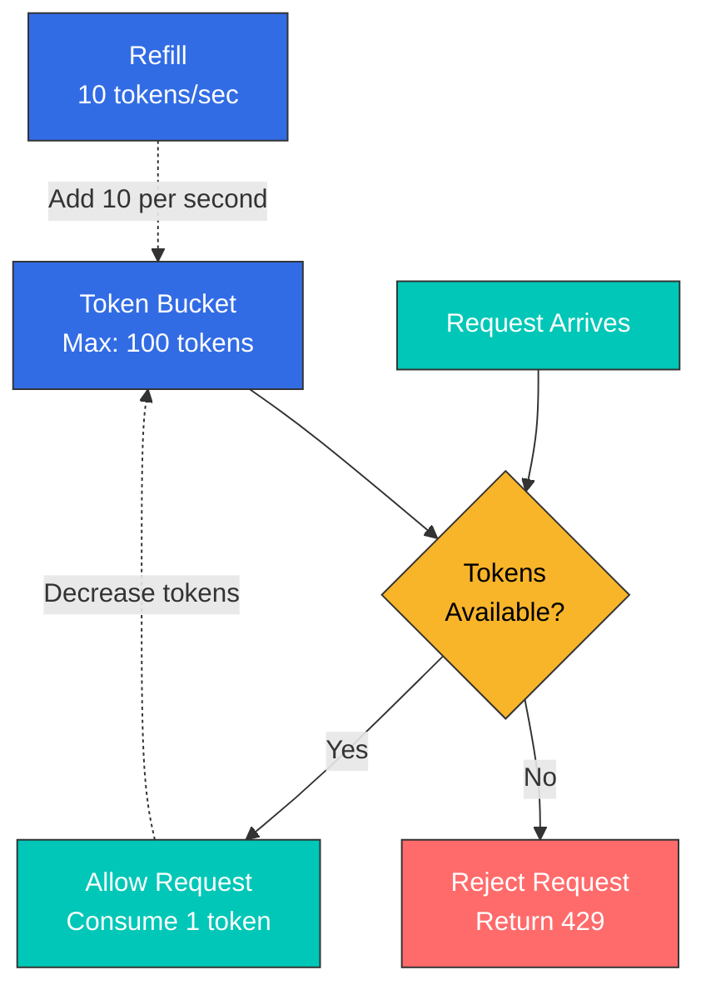
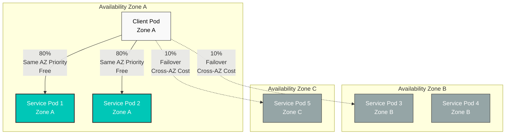
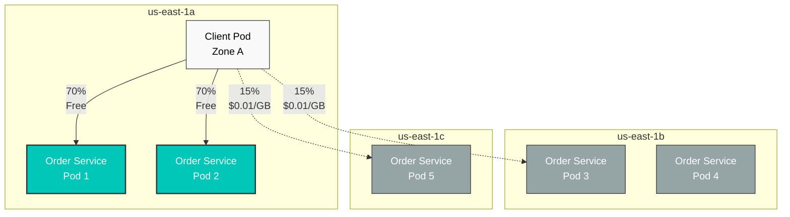

# レジリエンスクイズ

> **対応バージョン**: Istio 1.28.0 **EKS バージョン**: 1.34 (Kubernetes 1.28+) **最終更新**: February 19, 2026

このクイズでは、Istio のレジリエンス機能に関する理解度を確認します。

## 選択式問題（1～5）

### 問題 1: Outlier Detection の基本概念

次のうち、Outlier Detection の主な目的では**ない**ものはどれですか？

A. 異常な動作をするインスタンスを自動検出する B. しきい値超過時にトラフィックプールから自動的に除外する C. 除外したインスタンスを完全に削除する D. 一定時間後に自動的に復旧を試行する

<details>

<summary>回答を表示</summary>

**回答: C**

Outlier Detection はインスタンスを**削除せず**、トラフィックプールから一時的に除外します。

**解説:**

**Outlier Detection の仕組み:**



**主な機能:**

1. **自動検出**: エラー率、レイテンシー、応答失敗を自動的に監視する
2. **自動除外**: しきい値超過時にトラフィックプールから一時的に除外する
3. **自動復旧**: baseEjectionTime 後に自動的に復旧を試行する
4. **一時的な措置**: インスタンスを削除せず、トラフィックのみを遮断する

**選択肢 C が誤りである理由:**

* Outlier Detection は Circuit Breaker パターンです
* インスタンスを削除せず、**一時的に除外**します
* 復旧試行が成功すれば、トラフィックの受信を再開します

**参考資料:**

* [Outlier Detection](../../../service-mesh/istio/resilience/01-outlier-detection.md)

</details>

***

### 問題 2: Rate Limiting の種類の比較

Local Rate Limiting と Global Rate Limiting を正しく比較している記述はどれですか？

A. Local Rate Limiting のほうが精度が高い B. Global Rate Limiting のほうが高速である C. Local Rate Limiting は各 Envoy proxy で独立してリクエストを制限する D. Global Rate Limiting は外部サービスなしで動作する

<details>

<summary>回答を表示</summary>

**回答: C**

Local Rate Limiting は、**各 Envoy proxy で独立して**リクエストを制限します。

**解説:**

**Local と Global Rate Limiting の比較:**

| 特性              | Local Rate Limiting | Global Rate Limiting       |
| ----------------- | ------------------- | -------------------------- |
| **精度**          | 低い（インスタンス単位） | 高い（クラスター全体）     |
| **パフォーマンス** | 非常に高速          | やや低速                   |
| **複雑性**        | 低い                | 高い（外部サービスが必要） |
| **ユースケース**  | 一般的な保護        | 正確な制限が必要な場合     |

**Local Rate Limiting の特性:**

```yaml
# Limits 100 req/s per pod
# With 3 pods, up to 300 req/s total is allowed
apiVersion: networking.istio.io/v1beta1
kind: EnvoyFilter
metadata:
  name: local-ratelimit
spec:
  workloadSelector:
    labels:
      app: myapp
  configPatches:
  - applyTo: HTTP_FILTER
    patch:
      operation: INSERT_BEFORE
      value:
        name: envoy.filters.http.local_ratelimit
        typed_config:
          "@type": type.googleapis.com/envoy.extensions.filters.http.local_ratelimit.v3.LocalRateLimit
          stat_prefix: http_local_rate_limiter
          token_bucket:
            max_tokens: 100        # Maximum token count
            tokens_per_fill: 10    # Add 10 per second
            fill_interval: 1s
```

**Global Rate Limiting の特性:**

```yaml
# Limits total to 100 req/s
# Allows only 100 req/s regardless of pod count
# Requires centralized Rate Limit server (e.g., Redis)
```

**Token Bucket アルゴリズム:**



**参考資料:**

* [Rate Limiting](../../../service-mesh/istio/resilience/02-rate-limiting.md)

</details>

***

### 問題 3: Zone Aware Routing の利点

Zone Aware Routing を使用する利点では**ない**ものはどれですか？

A. 同一 AZ 通信によるレイテンシーの削減 B. クロス AZ データ転送料金の削減 C. すべてのトラフィックを単一の AZ に集中させることによるパフォーマンス向上 D. 障害時の他の AZ への自動フェイルオーバー

<details>

<summary>回答を表示</summary>

**回答: C**

Zone Aware Routing はトラフィックを単一の AZ に**集中させるのではなく**、可用性を確保しながら同一 AZ を優先します。

**解説:**

**Zone Aware Routing の正しい動作:**



**Zone Aware Routing の実際の利点:**

1. **レイテンシーの削減**:
   * 同一 AZ 通信: \~0.5ms
   * クロス AZ 通信: \~1-2ms
2. **コスト削減**:
   * AWS クロス AZ 転送: GB あたり $0.01-0.02
   * 高トラフィック環境では月額数百～数千ドルを削減
3. **可用性の向上**:
   * 同一 AZ の Pod に障害が発生した場合、他の AZ へ自動フェイルオーバーする
   * 単一 AZ への集中は**誤ったアプローチ**です（可用性を低下させます）
4. **パフォーマンスの最適化**:
   * ネットワークホップを削減
   * 帯域幅を最適化

**DestinationRule 設定例:**

```yaml
apiVersion: networking.istio.io/v1beta1
kind: DestinationRule
metadata:
  name: myapp
spec:
  host: myapp
  trafficPolicy:
    loadBalancer:
      localityLbSetting:
        enabled: true
        distribute:
        - from: us-east-1/us-east-1a/*
          to:
            "us-east-1/us-east-1a/*": 80   # Same AZ 80%
            "us-east-1/us-east-1b/*": 10   # Other AZ 10%
            "us-east-1/us-east-1c/*": 10   # Other AZ 10%
```

**参考資料:**

* [Zone Aware Routing](../../../service-mesh/istio/resilience/03-zone-aware-routing.md)

</details>

***

### 問題 4: Outlier Detection のパラメータ

次の Outlier Detection 設定で、インスタンスが除外される条件は何ですか？

```yaml
outlierDetection:
  consecutiveErrors: 5
  interval: 30s
  baseEjectionTime: 30s
  maxEjectionPercent: 50
```

A. エラーが 5 秒間発生した場合 B. 5 回連続でエラーが発生した場合 C. 30 秒間のエラー率が 50% を超えた場合 D. 30 秒ごとに無条件で除外する

<details>

<summary>回答を表示</summary>

**回答: B**

`consecutiveErrors: 5` は、**5 回連続で**エラーが発生したときにインスタンスを除外します。

**解説:**

**主要な Outlier Detection パラメータ:**

| パラメータ             | 説明                    | デフォルト | 推奨値       |
| ---------------------- | ----------------------- | ---------- | ------------ |
| **consecutiveErrors**  | 連続エラーのしきい値    | 5          | 3-10         |
| **interval**           | 分析間隔                | 10s        | 10s-60s      |
| **baseEjectionTime**   | 最小除外時間            | 30s        | 30s-300s     |
| **maxEjectionPercent** | 最大除外割合            | 10%        | 10%-50%      |

**パラメータの詳細説明:**

**consecutiveErrors**

```yaml
# Sensitive service (fast detection)
consecutiveErrors: 3

# General service
consecutiveErrors: 5

# Lenient setting (prevent false positives)
consecutiveErrors: 10
```

**interval**

```yaml
# Fast detection (high load)
interval: 10s

# Typical case
interval: 30s

# Stable service
interval: 60s
```

**baseEjectionTime**

```yaml
# Quick recovery attempt
baseEjectionTime: 30s

# Typical case
baseEjectionTime: 60s

# Cautious recovery
baseEjectionTime: 300s
```

**maxEjectionPercent**

```yaml
# Conservative (stability priority)
maxEjectionPercent: 10

# Balanced setting
maxEjectionPercent: 30

# Aggressive (performance priority)
maxEjectionPercent: 50
```

**完全な DestinationRule の例:**

```yaml
apiVersion: networking.istio.io/v1beta1
kind: DestinationRule
metadata:
  name: reviews-outlier
  namespace: default
spec:
  host: reviews
  trafficPolicy:
    outlierDetection:
      consecutiveErrors: 5          # 5 consecutive errors
      interval: 30s                 # Evaluate every 30 seconds
      baseEjectionTime: 30s         # Eject for 30 seconds
      maxEjectionPercent: 50        # Allow ejection up to 50%
      minHealthPercent: 50          # Maintain at least 50% healthy
```

**動作例:**

```
T=0: Pod-1 has 5 consecutive errors → Ejected
T=30s: interval cycle reached, attempt recovery of ejected pod
T=30s: If Pod-1 is healthy → Recovered
T=30s: If Pod-1 still has errors → Additional 30s ejection (cumulative)
```

**参考資料:**

* [Outlier Detection](../../../service-mesh/istio/resilience/01-outlier-detection.md)

</details>

***

### 問題 5: Token Bucket アルゴリズム

次の Rate Limiting 設定で処理できる、1 秒あたりの平均リクエスト数はいくつですか？

```yaml
token_bucket:
  max_tokens: 100
  tokens_per_fill: 10
  fill_interval: 1s
```

A. 10 req/s B. 100 req/s C. 110 req/s D. 1000 req/s

<details>

<summary>回答を表示</summary>

**回答: A**

`tokens_per_fill: 10` および `fill_interval: 1s` では、**毎秒 10 トークンが追加される**ため、平均は **10 req/s** です。

**解説:**

**Token Bucket アルゴリズムのパラメータ:**

* **max\_tokens**: バケットに保存できる最大トークン数（バースト許容量）
* **tokens\_per\_fill**: fill\_interval ごとに追加するトークン数（**平均スループット**）
* **fill\_interval**: トークン追加の間隔

**計算方法:**

```
Average request rate = tokens_per_fill / fill_interval
                     = 10 / 1s
                     = 10 req/s

Burst throughput = max_tokens
                 = 100 req (for a brief moment)
```

**時間経過に伴う動作:**

```
T=0: 100 tokens in bucket (initial state)
     Can handle 100 requests simultaneously

T=0.1s: Bucket empty (0 tokens)
        Additional requests rejected

T=1s: 10 tokens added (Refill)
      Can handle 10 requests

T=2s: 10 tokens added
      Can handle 10 requests

Average: 10 req/s (sustainable throughput)
Burst: 100 req/s (only for brief moment)
```

**実用的な設定例:**

```yaml
# Scenario 1: General API endpoint
token_bucket:
  max_tokens: 100        # Allow burst of 100
  tokens_per_fill: 10    # Average 10 req/s
  fill_interval: 1s

# Scenario 2: High-performance API
token_bucket:
  max_tokens: 1000       # Allow burst of 1000
  tokens_per_fill: 100   # Average 100 req/s
  fill_interval: 1s

# Scenario 3: Limited resource
token_bucket:
  max_tokens: 10         # Only 10 burst
  tokens_per_fill: 1     # Average 1 req/s
  fill_interval: 1s
```

**完全な EnvoyFilter の例:**

```yaml
apiVersion: networking.istio.io/v1beta1
kind: EnvoyFilter
metadata:
  name: local-ratelimit
  namespace: default
spec:
  workloadSelector:
    labels:
      app: myapp
  configPatches:
  - applyTo: HTTP_FILTER
    match:
      context: SIDECAR_INBOUND
      listener:
        filterChain:
          filter:
            name: "envoy.filters.network.http_connection_manager"
            subFilter:
              name: "envoy.filters.http.router"
    patch:
      operation: INSERT_BEFORE
      value:
        name: envoy.filters.http.local_ratelimit
        typed_config:
          "@type": type.googleapis.com/envoy.extensions.filters.http.local_ratelimit.v3.LocalRateLimit
          stat_prefix: http_local_rate_limiter
          token_bucket:
            max_tokens: 100        # Burst
            tokens_per_fill: 10    # Average throughput
            fill_interval: 1s
          filter_enabled:
            runtime_key: local_rate_limit_enabled
            default_value:
              numerator: 100
              denominator: HUNDRED
```

**参考資料:**

* [Rate Limiting](../../../service-mesh/istio/resilience/02-rate-limiting.md)

</details>

***

## 記述式問題（6～10）

### 問題 6: Outlier Detection の実装

本番環境で稼働する `product-service` が断続的に遅くなり、タイムアウトが発生しています。問題のあるインスタンスを自動的に除外するため、Outlier Detection を実装したいと考えています。次の要件を満たす DestinationRule を作成してください。

**要件:**

* 3 回連続のエラー後に除外する
* 20 秒ごとに評価する
* 除外したインスタンスは 60 秒後に復旧を試行する
* 最大 30% の除外を許可する
* 502、503、504 の gateway エラーも検出する

<details>

<summary>回答を表示</summary>

**回答:**

```yaml
apiVersion: networking.istio.io/v1beta1
kind: DestinationRule
metadata:
  name: product-service-outlier
  namespace: production
spec:
  host: product-service
  trafficPolicy:
    outlierDetection:
      # Consecutive error threshold
      consecutiveErrors: 3
      consecutive5xxErrors: 3
      consecutiveGatewayErrors: 3  # Detect 502, 503, 504

      # Analysis interval
      interval: 20s

      # Ejection time
      baseEjectionTime: 60s

      # Maximum ejection ratio
      maxEjectionPercent: 30

      # Minimum healthy ratio (maintain 70% or more)
      minHealthPercent: 70

      # Minimum request count (evaluate only with 5+ requests)
      enforcingConsecutive5xx: 100
      enforcingConsecutiveGatewayFailure: 100
```

**解説:**

**1. consecutiveErrors と consecutive5xxErrors および consecutiveGatewayErrors の違い**

| パラメータ                   | 検出対象                                    | ユースケース                 |
| ---------------------------- | ------------------------------------------- | ---------------------------- |
| **consecutiveErrors**        | すべてのエラー（5xx、接続失敗など）         | 一般的なエラー検出           |
| **consecutive5xxErrors**     | 5xx エラーのみ                              | サーバーエラーのみ           |
| **consecutiveGatewayErrors** | 502、503、504 のみ                          | Gateway 問題の検出           |

**2. パラメータの説明**

**interval: 20s**

* 20 秒ごとに Outlier Detection を実行する
* 各インスタンスのエラー率を評価する

**baseEjectionTime: 60s**

* 除外したインスタンスは最低 60 秒間トラフィックを受信しない
* 再度除外されると時間が増加する（60s -> 120s -> 180s...）

**maxEjectionPercent: 30**

* 同時に最大 30% のインスタンスの除外を許可する
* 例: Pod が 10 個の場合、除外できるのは最大 3 個のみ
* 可用性を確保する

**minHealthPercent: 70**

* インスタンスの最低 70% を正常な状態に維持する
* maxEjectionPercent を補完する設定

**3. 動作例**

```
Initial state: All 10 pods healthy

T=0:   Pod-1 has 3 consecutive 503 errors
       -> Pod-1 ejected (9 healthy)

T=20s: Pod-2 has 3 consecutive 502 errors
       -> Pod-2 ejected (8 healthy)

T=40s: Pod-3 has 3 consecutive 504 errors
       -> Pod-3 ejected (7 healthy)

T=40s: Pod-4 has 3 consecutive errors
       -> Not ejected (maxEjectionPercent 30% reached)
       -> 30% = only 3 can be ejected

T=60s: Pod-1 recovery attempt
       -> If healthy, traffic reception resumes
```

**4. モニタリング**

```bash
# Check Outlier Detection events
kubectl logs <envoy-pod> -c istio-proxy | grep outlier

# Prometheus metrics
envoy_cluster_outlier_detection_ejections_active
envoy_cluster_outlier_detection_ejections_total
```

**5. 本番環境での考慮事項**

**高感度サービス（高速検出）:**

```yaml
outlierDetection:
  consecutiveErrors: 3
  interval: 10s
  baseEjectionTime: 30s
  maxEjectionPercent: 50
```

**安定したサービス（誤検知の防止）:**

```yaml
outlierDetection:
  consecutiveErrors: 10
  interval: 60s
  baseEjectionTime: 300s
  maxEjectionPercent: 10
```

**参考資料:**

* [Outlier Detection](../../../service-mesh/istio/resilience/01-outlier-detection.md)

</details>

***

### 問題 7: Local Rate Limiting の適用

`api-gateway` Service が DDoS 攻撃を受けています。各 Envoy proxy を 1 秒あたり 50 リクエスト、最大 200 のバーストに制限する Local Rate Limiting を適用したいと考えています。EnvoyFilter を作成してください。

追加要件:

* rate limit が適用されたときに `X-RateLimit-Limit` ヘッダーを追加する
* 429 応答に `Retry-After: 1` ヘッダーを含める

<details>

<summary>回答を表示</summary>

**回答:**

```yaml
apiVersion: networking.istio.io/v1beta1
kind: EnvoyFilter
metadata:
  name: api-gateway-ratelimit
  namespace: production
spec:
  workloadSelector:
    labels:
      app: api-gateway
  configPatches:
  - applyTo: HTTP_FILTER
    match:
      context: SIDECAR_INBOUND
      listener:
        filterChain:
          filter:
            name: "envoy.filters.network.http_connection_manager"
            subFilter:
              name: "envoy.filters.http.router"
    patch:
      operation: INSERT_BEFORE
      value:
        name: envoy.filters.http.local_ratelimit
        typed_config:
          "@type": type.googleapis.com/envoy.extensions.filters.http.local_ratelimit.v3.LocalRateLimit
          stat_prefix: http_local_rate_limiter

          # Token Bucket configuration
          token_bucket:
            max_tokens: 200         # Burst: max 200
            tokens_per_fill: 50     # Average: 50 per second
            fill_interval: 1s       # Add 50 every second

          # Enable Rate Limit
          filter_enabled:
            runtime_key: local_rate_limit_enabled
            default_value:
              numerator: 100        # 100%
              denominator: HUNDRED

          # Enforce Rate Limit
          filter_enforced:
            runtime_key: local_rate_limit_enforced
            default_value:
              numerator: 100        # 100%
              denominator: HUNDRED

          # Add response headers
          response_headers_to_add:
          # Rate limit info
          - append: false
            header:
              key: X-RateLimit-Limit
              value: '50'

          # Current remaining tokens
          - append: false
            header:
              key: X-RateLimit-Remaining
              value: '%DYNAMIC_METADATA(envoy.extensions.filters.http.local_ratelimit:tokens_remaining)%'

          # Whether rate limit was applied
          - append: false
            header:
              key: X-Local-Rate-Limit
              value: 'true'

          # 429 response Retry-After header
          rate_limited_status:
            code: TOO_MANY_REQUESTS  # 429

          # Retry-After header addition (requires separate patch)

  # Add Retry-After header for 429 responses
  - applyTo: HTTP_ROUTE
    match:
      context: SIDECAR_INBOUND
    patch:
      operation: MERGE
      value:
        response_headers_to_add:
        - header:
            key: Retry-After
            value: '1'
          append: false
```

**解説:**

**1. Token Bucket の計算**

```
Average processing rate: tokens_per_fill / fill_interval
                       = 50 / 1s
                       = 50 req/s

Burst processing: max_tokens
                = 200 req (for brief moment)
```

**2. シナリオ別の動作**

**通常トラフィック（40 req/s）:**

```
50 tokens added per second, 40 used
-> Always has capacity
```

**バーストトラフィック（瞬間的に 200 req/s）:**

```
T=0: 200 tokens available
     All 200 requests processed

T=0.1s: 0 tokens
        Additional requests rejected (429 returned)

T=1s: 50 tokens added
      50 requests processed
```

**継続的な過負荷（100 req/s）:**

```
50 tokens added per second
Only 50 of 100 requests processed
Remaining 50 return 429
```

**3. 応答ヘッダーの例**

**通常のリクエスト:**

```http
HTTP/1.1 200 OK
X-RateLimit-Limit: 50
X-RateLimit-Remaining: 45
X-Local-Rate-Limit: true
```

**rate limit 超過時:**

```http
HTTP/1.1 429 Too Many Requests
X-RateLimit-Limit: 50
X-RateLimit-Remaining: 0
X-Local-Rate-Limit: true
Retry-After: 1
```

**4. パスベースの Rate Limiting**

より細かな制御を行うには、パスごとに異なる制限を設定します。

```yaml
apiVersion: networking.istio.io/v1beta1
kind: EnvoyFilter
metadata:
  name: path-based-ratelimit
spec:
  workloadSelector:
    labels:
      app: api-gateway
  configPatches:
  - applyTo: HTTP_FILTER
    patch:
      operation: INSERT_BEFORE
      value:
        name: envoy.filters.http.local_ratelimit
        typed_config:
          "@type": type.googleapis.com/envoy.extensions.filters.http.local_ratelimit.v3.LocalRateLimit
          stat_prefix: http_local_rate_limiter

          # Path-based configuration
          descriptors:
          # /api/login: 10 per second
          - entries:
            - key: path
              value: /api/login
            token_bucket:
              max_tokens: 30
              tokens_per_fill: 10
              fill_interval: 1s

          # /api/search: 100 per second
          - entries:
            - key: path
              value: /api/search
            token_bucket:
              max_tokens: 300
              tokens_per_fill: 100
              fill_interval: 1s
```

**5. モニタリング**

```bash
# Prometheus metrics
envoy_http_local_rate_limit_enabled
envoy_http_local_rate_limit_enforced
envoy_http_local_rate_limit_rate_limited

# 429 response count
sum(rate(istio_requests_total{response_code="429"}[5m]))
```

**参考資料:**

* [Rate Limiting](../../../service-mesh/istio/resilience/02-rate-limiting.md)

</details>

***

### 問題 8: Zone Aware Routing の設定

AWS EKS クラスターは 3 つの AZ（us-east-1a、us-east-1b、us-east-1c）に分散されています。クロス AZ データ転送料金を削減するため、`order-service` に Zone Aware Routing を設定したいと考えています。

**要件:**

* トラフィックの 70% を同一 AZ の Pod に送信する
* 残りの AZ にはそれぞれ 15% を分配する
* AZ 全体の障害時に他の AZ へ自動フェイルオーバーする
* 正常な Pod が 50% 以上の場合にのみ Zone Aware を適用する

<details>

<summary>回答を表示</summary>

**回答:**

```yaml
apiVersion: networking.istio.io/v1beta1
kind: DestinationRule
metadata:
  name: order-service-locality
  namespace: production
spec:
  host: order-service
  trafficPolicy:
    loadBalancer:
      localityLbSetting:
        # Enable Zone Aware Routing
        enabled: true

        # Traffic distribution ratio
        distribute:
        # Traffic originating from us-east-1a
        - from: us-east-1/us-east-1a/*
          to:
            "us-east-1/us-east-1a/*": 70   # Same AZ 70%
            "us-east-1/us-east-1b/*": 15   # Other AZ 15%
            "us-east-1/us-east-1c/*": 15   # Other AZ 15%

        # Traffic originating from us-east-1b
        - from: us-east-1/us-east-1b/*
          to:
            "us-east-1/us-east-1b/*": 70
            "us-east-1/us-east-1a/*": 15
            "us-east-1/us-east-1c/*": 15

        # Traffic originating from us-east-1c
        - from: us-east-1/us-east-1c/*
          to:
            "us-east-1/us-east-1c/*": 70
            "us-east-1/us-east-1a/*": 15
            "us-east-1/us-east-1b/*": 15

        # Failover configuration
        failover:
        # On us-east-1a failure
        - from: us-east-1/us-east-1a
          to: us-east-1/us-east-1b    # Priority 1: us-east-1b

        # On us-east-1b failure
        - from: us-east-1/us-east-1b
          to: us-east-1/us-east-1c    # Priority 1: us-east-1c

        # On us-east-1c failure
        - from: us-east-1/us-east-1c
          to: us-east-1/us-east-1a    # Priority 1: us-east-1a

    # Outlier Detection (healthy pod determination)
    outlierDetection:
      consecutiveErrors: 5
      interval: 30s
      baseEjectionTime: 30s

      # Maintain minimum 50% healthy
      minHealthPercent: 50
```

**解説:**

**1. Kubernetes Node ラベルの確認**

AWS EKS は Topology ラベルを自動的に追加します。

```bash
kubectl get nodes -L topology.kubernetes.io/zone -L topology.kubernetes.io/region

# Example output:
# NAME                          ZONE         REGION
# ip-10-0-1-10.ec2.internal     us-east-1a   us-east-1
# ip-10-0-2-20.ec2.internal     us-east-1b   us-east-1
# ip-10-0-3-30.ec2.internal     us-east-1c   us-east-1
```

**2. Locality 階層**

```
Region/Zone/SubZone

Examples:
us-east-1/us-east-1a/*
us-east-1/us-east-1b/*
us-east-1/us-east-1c/*
```

**3. トラフィックフロー図**



**4. コスト削減の計算**

**シナリオ**: 月間トラフィック 1TB

**Zone Aware なし（均等分配）:**

```
Total traffic: 1TB
Cross-AZ: 66.7% (667GB)
Cost: 667GB x $0.01 = $6.67
```

**Zone Aware あり（同一 AZ 70%）:**

```
Total traffic: 1TB
Cross-AZ: 30% (300GB)
Cost: 300GB x $0.01 = $3.00

Savings: $6.67 - $3.00 = $3.67 (55% savings)
```

**大容量環境（100TB/月）:**

```
Without Zone Aware: $667
With Zone Aware: $300

Savings: $367/month = $4,404/year
```

**5. フェイルオーバーのシナリオ**

**通常状態:**

```
Client in us-east-1a
-> 70% us-east-1a pods
-> 15% us-east-1b pods
-> 15% us-east-1c pods
```

**us-east-1a 全体の障害:**

```
Client in us-east-1a
-> failover: switch to us-east-1b
-> 100% us-east-1b pods

(If us-east-1b also fails -> switch to us-east-1c)
```

**一部の Pod が異常（Outlier Detection）:**

```
us-east-1a: 2 pods (1 healthy, 1 ejected)
us-east-1b: 2 pods (all healthy)

-> minHealthPercent: 50% satisfied
-> Zone Aware continues to apply
-> Unhealthy pod doesn't receive traffic
```

**6. モニタリング**

```bash
# Check locality-based traffic
kubectl exec <pod> -c istio-proxy -- \
  curl localhost:15000/clusters | grep locality

# Prometheus query
# Same-zone traffic ratio
sum(rate(istio_requests_total{
  source_workload_namespace="production",
  source_canonical_service="client",
  destination_canonical_service="order-service"
}[5m])) by (source_cluster_zone, destination_cluster_zone)
```

**7. AWS EKS 固有の設定**

**AZ ごとに EKS node group を設定する:**

```yaml
# eksctl config
managedNodeGroups:
- name: ng-us-east-1a
  availabilityZones: ["us-east-1a"]
  labels:
    topology.kubernetes.io/zone: us-east-1a

- name: ng-us-east-1b
  availabilityZones: ["us-east-1b"]
  labels:
    topology.kubernetes.io/zone: us-east-1b

- name: ng-us-east-1c
  availabilityZones: ["us-east-1c"]
  labels:
    topology.kubernetes.io/zone: us-east-1c
```

**Pod を AZ 間で均等に分散する:**

```yaml
apiVersion: apps/v1
kind: Deployment
metadata:
  name: order-service
spec:
  replicas: 9
  template:
    spec:
      topologySpreadConstraints:
      - maxSkew: 1
        topologyKey: topology.kubernetes.io/zone
        whenUnsatisfiable: DoNotSchedule
        labelSelector:
          matchLabels:
            app: order-service
```

**参考資料:**

* [Zone Aware Routing](../../../service-mesh/istio/resilience/03-zone-aware-routing.md)

</details>

***

### 問題 9: 複合レジリエンス戦略

`payment-service` は外部決済 API を呼び出す重要な Service です。次の複合レジリエンス戦略を実装してください。

1. **Outlier Detection**: 3 回連続のエラー後にインスタンスを除外する
2. **Retry**: 502、503、504 エラー時に最大 3 回再試行する
3. **Timeout**: リクエストごとに 5 秒のタイムアウトを設定する
4. **Circuit Breaker**: エラー率が 50% を超えた場合に Service 全体を遮断する

DestinationRule と VirtualService を作成してください。

<details>

<summary>回答を表示</summary>

**回答:**

```yaml
# ========================================
# DestinationRule: Outlier Detection + Circuit Breaker
# ========================================
apiVersion: networking.istio.io/v1beta1
kind: DestinationRule
metadata:
  name: payment-service-resilience
  namespace: production
spec:
  host: payment-service
  trafficPolicy:
    # Connection Pool (Circuit Breaker)
    connectionPool:
      tcp:
        maxConnections: 100          # Maximum concurrent connections
      http:
        http1MaxPendingRequests: 50  # Pending request count
        http2MaxRequests: 100        # HTTP/2 maximum requests
        maxRequestsPerConnection: 2  # Maximum requests per connection
        maxRetries: 3                # Maximum retry count

    # Outlier Detection
    outlierDetection:
      # Consecutive error detection
      consecutiveErrors: 3
      consecutive5xxErrors: 3
      consecutiveGatewayErrors: 3

      # Analysis interval
      interval: 10s

      # Ejection time
      baseEjectionTime: 30s

      # Maximum ejection ratio
      maxEjectionPercent: 50

      # Error rate based ejection (Circuit Breaker)
      splitExternalLocalOriginErrors: true

      # Eject when error rate exceeds 50%
      enforcingLocalOriginSuccessRate: 100
      enforcingSuccessRate: 100
      successRateMinimumHosts: 3
      successRateRequestVolume: 10
      successRateStdevFactor: 1900  # 50% error rate

---
# ========================================
# VirtualService: Retry + Timeout
# ========================================
apiVersion: networking.istio.io/v1beta1
kind: VirtualService
metadata:
  name: payment-service-retry
  namespace: production
spec:
  hosts:
  - payment-service
  http:
  - match:
    - uri:
        prefix: /payment
    route:
    - destination:
        host: payment-service
        port:
          number: 8080

    # Timeout configuration
    timeout: 5s

    # Retry configuration
    retries:
      attempts: 3                    # Maximum 3 retries
      perTryTimeout: 2s              # 2 second timeout per retry
      retryOn: 5xx,reset,connect-failure,refused-stream,retriable-4xx
      retryRemoteLocalities: true    # Retry on pods in other AZs
```

**解説:**

**1. Outlier Detection（インスタンスレベル）**

**連続エラー検出:**

```yaml
consecutiveErrors: 3
consecutive5xxErrors: 3
consecutiveGatewayErrors: 3
```

* 特定の Pod で 3 回連続エラーが発生した場合 -> その Pod のみを除外する
* 他の正常な Pod は引き続きトラフィックを受信する

**2. Circuit Breaker（Service レベル）**

**エラー率に基づく遮断:**

```yaml
successRateStdevFactor: 1900  # 50% error rate
successRateMinimumHosts: 3    # Minimum 3 pods
successRateRequestVolume: 10  # Minimum 10 requests
```

**動作:**

```
Error rate < 50%: Normal operation
Error rate >= 50%: Entire service blocked (Circuit Open)

Circuit Open state:
- All requests immediately return 503
- Recovery attempt after baseEjectionTime (Circuit Half-Open)
```

**3. Retry 戦略**

**再試行条件（retryOn）:**

| 条件                  | 説明                       |
| --------------------- | -------------------------- |
| **5xx**               | すべての 5xx エラー         |
| **reset**             | 接続リセット               |
| **connect-failure**   | 接続失敗                   |
| **refused-stream**    | HTTP/2 ストリームの拒否    |
| **retriable-4xx**     | 再試行可能な 4xx（409、429）|

**Retry タイムライン:**

```
T=0:    First attempt (2s timeout)
T=2s:   Timeout -> 2nd attempt
T=4s:   Timeout -> 3rd attempt
T=6s:   Timeout -> Final failure (503 returned)

Total time: 6s (but VirtualService timeout: 5s)
-> Final failure after 5 seconds
```

**4. Timeout の階層**

```
VirtualService timeout: 5s
|
Retry perTryTimeout: 2s
|
DestinationRule connectionPool
```

**完全なタイムライン:**

```
attempt=1: 2s timeout
attempt=2: 2s timeout
attempt=3: 1s timeout (5s total limit reached)
```

**5. 完全な動作例**

**シナリオ 1: 一時的なネットワーク問題**

```
Pod-1: 502 error (1st)
-> Retry -> Pod-2: 200 OK

Result: Client receives success response
Pod-1: Error count 1 (not yet ejected)
```

**シナリオ 2: 特定の Pod の問題**

```
Pod-1: 503 error (1st)
-> Retry -> Pod-1: 503 error (2nd)
-> Retry -> Pod-1: 503 error (3rd)
-> Pod-1 ejected

-> Retry -> Pod-2: 200 OK

Result: Client receives success response
Pod-1: Traffic blocked for 30 seconds
```

**シナリオ 3: Service 全体の障害（Circuit Breaker）**

```
Error rate exceeds 50% on all pods
-> Circuit Breaker Open
-> All new requests immediately return 503 (no retries)

After baseEjectionTime:
-> Circuit Half-Open
-> Test with some requests
-> If successful, Circuit Closed
-> If failed, Circuit Open again
```

**6. Connection Pool（追加の保護）**

```yaml
connectionPool:
  tcp:
    maxConnections: 100
  http:
    http1MaxPendingRequests: 50
    http2MaxRequests: 100
```

**動作:**

* 同時接続数が 100 を超える -> 新規接続は拒否される
* 保留中のリクエスト数が 50 を超える -> 503 が返される
* Service の過負荷を防止する

**7. モニタリング**

```bash
# Circuit Breaker status
kubectl exec <pod> -c istio-proxy -- \
  curl localhost:15000/stats | grep circuit_breakers

# Outlier Detection events
kubectl logs <pod> -c istio-proxy | grep outlier

# Prometheus queries
# Retry count
sum(rate(envoy_cluster_upstream_rq_retry[5m]))

# Circuit Breaker activation count
sum(rate(envoy_cluster_circuit_breakers_default_rq_pending_open[5m]))

# Timeout occurrence count
sum(rate(istio_requests_total{response_flags=~".*UT.*"}[5m]))
```

**8. 本番環境での考慮事項**

**外部 API 呼び出しの場合:**

```yaml
# More lenient settings
timeout: 10s
retries:
  attempts: 5
  perTryTimeout: 3s
outlierDetection:
  consecutiveErrors: 10
  baseEjectionTime: 300s
```

**内部 Service 間通信の場合:**

```yaml
# Stricter settings
timeout: 1s
retries:
  attempts: 2
  perTryTimeout: 500ms
outlierDetection:
  consecutiveErrors: 3
  baseEjectionTime: 30s
```

**参考資料:**

* [Outlier Detection](../../../service-mesh/istio/resilience/01-outlier-detection.md)
* [Traffic Management](https://github.com/Atom-oh/kubernetes-docs/blob/main/en/service-mesh/istio/traffic/README.md)

</details>

***

### 問題 10: パフォーマンス最適化とコスト削減

大規模なマイクロサービス環境で、月間ネットワークコストが $5,000 です。Istio のレジリエンス機能を使用して、パフォーマンスを最適化しコストを削減する包括的な戦略を策定してください。

**現在の状況:**

* 100 の Service が 3 つの AZ に均等に分散されている
* 月間トラフィック: 500TB
* 平均応答時間: 150ms
* エラー率: 3%

**目標:**

* クロス AZ コストを 50% 削減する
* 平均応答時間を 100ms 未満にする
* エラー率を 1% 未満にする

<details>

<summary>回答を表示</summary>

**回答:**

### 包括的なレジリエンス戦略

#### 1. Zone Aware Routing（コスト削減 + パフォーマンス向上）

**DestinationRule テンプレート:**

```yaml
apiVersion: networking.istio.io/v1beta1
kind: DestinationRule
metadata:
  name: zone-aware-template
  namespace: production
spec:
  host: "*"  # Apply to all services
  trafficPolicy:
    loadBalancer:
      localityLbSetting:
        enabled: true
        distribute:
        - from: us-east-1/us-east-1a/*
          to:
            "us-east-1/us-east-1a/*": 80
            "us-east-1/us-east-1b/*": 10
            "us-east-1/us-east-1c/*": 10
        - from: us-east-1/us-east-1b/*
          to:
            "us-east-1/us-east-1b/*": 80
            "us-east-1/us-east-1a/*": 10
            "us-east-1/us-east-1c/*": 10
        - from: us-east-1/us-east-1c/*
          to:
            "us-east-1/us-east-1c/*": 80
            "us-east-1/us-east-1a/*": 10
            "us-east-1/us-east-1b/*": 10
```

**コスト削減の計算:**

```
Current state (even distribution):
- Cross-AZ traffic: 66.7% (333TB)
- Cost: 333TB x $0.015/GB = $5,000

With Zone Aware (80% same AZ):
- Cross-AZ traffic: 20% (100TB)
- Cost: 100TB x $0.015/GB = $1,500

Savings: $5,000 - $1,500 = $3,500/month (70% savings)
```

**パフォーマンスの向上:**

```
Current (cross-AZ latency):
- Average latency: ~1.5ms

With Zone Aware:
- Same AZ latency: ~0.3ms
- Cross-AZ latency: ~1.5ms
- Weighted average: 0.3x0.8 + 1.5x0.2 = 0.54ms

Improvement: 1.5ms -> 0.54ms (64% improvement)
```

#### 2. Outlier Detection（エラー率の削減）

**高感度な検出設定:**

```yaml
apiVersion: networking.istio.io/v1beta1
kind: DestinationRule
metadata:
  name: strict-outlier-detection
  namespace: production
spec:
  host: "*"
  trafficPolicy:
    outlierDetection:
      consecutiveErrors: 3           # Fast detection
      consecutive5xxErrors: 3
      consecutiveGatewayErrors: 2    # More sensitive to gateway errors

      interval: 10s                  # Fast evaluation
      baseEjectionTime: 60s          # Sufficient recovery time
      maxEjectionPercent: 30         # Ensure availability

      # Error rate based ejection
      enforcingSuccessRate: 100
      successRateMinimumHosts: 3
      successRateRequestVolume: 10
```

**エラー率削減の効果:**

```
Current error rate: 3%
- Problematic pods continue receiving traffic
- Additional load from retries

With Outlier Detection:
- Immediately eject problem pods
- Route only to healthy pods
- Expected error rate: under 1%

Additional effects:
- Reduced retry count -> Reduced network load
- Response time improvement
```

#### 3. Rate Limiting（Service の保護）

**tier ベースの Rate Limiting:**

```yaml
# Critical services (payments, authentication)
apiVersion: networking.istio.io/v1beta1
kind: EnvoyFilter
metadata:
  name: critical-service-ratelimit
spec:
  workloadSelector:
    labels:
      tier: critical
  configPatches:
  - applyTo: HTTP_FILTER
    patch:
      operation: INSERT_BEFORE
      value:
        name: envoy.filters.http.local_ratelimit
        typed_config:
          "@type": type.googleapis.com/envoy.extensions.filters.http.local_ratelimit.v3.LocalRateLimit
          token_bucket:
            max_tokens: 500
            tokens_per_fill: 100
            fill_interval: 1s

---
# Standard services
apiVersion: networking.istio.io/v1beta1
kind: EnvoyFilter
metadata:
  name: standard-service-ratelimit
spec:
  workloadSelector:
    labels:
      tier: standard
  configPatches:
  - applyTo: HTTP_FILTER
    patch:
      operation: INSERT_BEFORE
      value:
        name: envoy.filters.http.local_ratelimit
        typed_config:
          "@type": type.googleapis.com/envoy.extensions.filters.http.local_ratelimit.v3.LocalRateLimit
          token_bucket:
            max_tokens: 200
            tokens_per_fill: 50
            fill_interval: 1s
```

#### 4. 包括的なパフォーマンス最適化

**応答時間を改善する戦略:**

```yaml
apiVersion: networking.istio.io/v1beta1
kind: DestinationRule
metadata:
  name: performance-optimization
  namespace: production
spec:
  host: "*"
  trafficPolicy:
    # Connection Pool optimization
    connectionPool:
      tcp:
        maxConnections: 1000
        connectTimeout: 1s
      http:
        http1MaxPendingRequests: 100
        http2MaxRequests: 1000
        maxRequestsPerConnection: 10
        idleTimeout: 60s

    # Zone Aware Routing
    loadBalancer:
      localityLbSetting:
        enabled: true

    # Outlier Detection
    outlierDetection:
      consecutiveErrors: 3
      interval: 10s
      baseEjectionTime: 60s

---
apiVersion: networking.istio.io/v1beta1
kind: VirtualService
metadata:
  name: performance-routing
  namespace: production
spec:
  hosts:
  - "*"
  http:
  - route:
    - destination:
        host: service

    # Timeout optimization
    timeout: 3s

    # Retry strategy
    retries:
      attempts: 2
      perTryTimeout: 1s
      retryOn: 5xx,reset,connect-failure
```

#### 5. 実装ロードマップ

**フェーズ 1: Zone Aware Routing（第 1～2 週）**

```bash
# 1. Check node Topology
kubectl get nodes -L topology.kubernetes.io/zone

# 2. Check pod AZ distribution
kubectl get pods -o wide | awk '{print $7}' | sort | uniq -c

# 3. Apply Zone Aware DestinationRule
kubectl apply -f zone-aware-template.yaml

# 4. Set up cost monitoring
# Monitor cross-AZ data transfer in CloudWatch
```

**期待される効果:**

* コスト: $5,000 -> $1,500（70% 削減）
* レイテンシー: 150ms -> 120ms（20% 改善）

**フェーズ 2: Outlier Detection（第 3～4 週）**

```bash
# 1. Apply Outlier Detection to each service
kubectl apply -f strict-outlier-detection.yaml

# 2. Set up monitoring dashboard
# Check Outlier ejection metrics in Grafana

# 3. Monitor error rate
```

**期待される効果:**

* エラー率: 3% -> 1.5%（50% 削減）
* レイテンシー: 120ms -> 100ms（さらなる改善）

**フェーズ 3: Rate Limiting（第 5～6 週）**

```bash
# 1. Apply tier-based Rate Limiting
kubectl apply -f critical-service-ratelimit.yaml
kubectl apply -f standard-service-ratelimit.yaml

# 2. Monitor 429 response rate
# Adjust to ensure normal traffic is not blocked
```

**期待される効果:**

* DDoS 保護
* Service の安定性向上
* 不要なリソース消費の防止

#### 6. モニタリングと検証

**Grafana ダッシュボード:**

```promql
# Cross-AZ traffic ratio
100 * sum(rate(istio_requests_total{
  source_cluster_zone!="",
  destination_cluster_zone!="",
  source_cluster_zone!=destination_cluster_zone
}[5m])) /
sum(rate(istio_requests_total{
  source_cluster_zone!="",
  destination_cluster_zone!=""
}[5m]))

# Average response time
histogram_quantile(0.50,
  sum(rate(istio_request_duration_milliseconds_bucket[5m]))
  by (le, destination_service_name)
)

# Error rate
100 * sum(rate(istio_requests_total{response_code=~"5.."}[5m])) /
sum(rate(istio_requests_total[5m]))

# Outlier ejection events
sum(rate(envoy_cluster_outlier_detection_ejections_active[5m]))

# Rate limit application count
sum(rate(envoy_http_local_rate_limit_rate_limited[5m]))
```

#### 7. 最終結果の予測

| 指標                    | 現在    | 目標   | 期待結果               |
| ----------------------- | ------- | ------ | ---------------------- |
| **月間ネットワークコスト** | $5,000  | $2,500 | $1,500（70% 削減）     |
| **平均応答時間**        | 150ms   | 100ms  | 95ms（37% 改善）       |
| **エラー率**            | 3%      | 1%     | 0.8%（73% 削減）       |
| **クロス AZ トラフィック** | 66.7%   | 33%    | 20%（70% 削減）        |

#### 8. その他の最適化機会

**キャッシュ戦略:**

```yaml
# Place Redis/Memcached in same AZ
# Improved cache hit rate + Network cost savings
```

**Service Mesh の最適化:**

```yaml
# Consider Ambient Mode (Reduce Sidecar overhead)
# 30-50% reduction in resource usage
# Additional response time improvement
```

**Auto Scaling:**

```yaml
# HPA + Zone Aware Routing
# Independent scaling per AZ based on traffic patterns
# Maximize cost efficiency
```

**参考資料:**

* [Zone Aware Routing](../../../service-mesh/istio/resilience/03-zone-aware-routing.md)
* [Outlier Detection](../../../service-mesh/istio/resilience/01-outlier-detection.md)
* [Rate Limiting](../../../service-mesh/istio/resilience/02-rate-limiting.md)

</details>

***

## スコア計算

* 選択式問題 1～5: 各 10 点（合計 50 点）
* 記述式問題 6～10: 各 10 点（合計 50 点）
* **合計: 100 点**

**評価基準:**

* 90～100 点: 優秀（Istio レジリエンスエキスパート）
* 80～89 点: 良好（本番運用対応）
* 70～79 点: 平均（追加学習推奨）
* 60～69 点: 平均未満（基本概念の見直しが必要）
* 0～59 点: 再学習が必要

## 学習リソース

* [Outlier Detection](../../../service-mesh/istio/resilience/01-outlier-detection.md)
* [Rate Limiting](../../../service-mesh/istio/resilience/02-rate-limiting.md)
* [Zone Aware Routing](../../../service-mesh/istio/resilience/03-zone-aware-routing.md)
