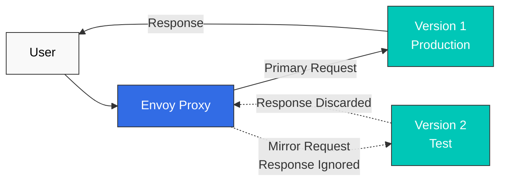

# トラフィック管理クイズ

> **対応バージョン**: Istio 1.28.0 **EKS バージョン**: 1.34 (Kubernetes 1.28+) **最終更新**: February 23, 2026

このクイズでは、Istio のトラフィック管理機能に関する理解度を確認します。

## 選択問題 (1-5)

### 問題 1: VirtualService の役割

VirtualService についての記述として**正しい**ものはどれですか？

A. Kubernetes Service を置き換えるリソースである B. ロードバランシングアルゴリズムのみを定義できる C. ルーティングルールを定義し、トラフィックを制御する D. Control Plane でのみ動作する

<details>

<summary>回答を表示</summary>

**回答: C**

VirtualService は、**ルーティングルール**を定義してトラフィックを制御する Istio の中核 CRD です。

**解説:**

* A (X): VirtualService は Kubernetes Service を置き換えるのではなく、Service の上にルーティングルールを追加する
* B (X): ロードバランシングは DestinationRule が処理し、VirtualService はルーティングルールを定義する
* C (O): VirtualService は次を定義する:
  * HTTP/TCP ルーティングルール
  * URL パスベースのルーティング
  * ヘッダーベースのルーティング
  * 重みベースのトラフィック分割
  * Timeout および Retry の設定
* D (X): VirtualService は Data Plane の Envoy で動作する

**例:**

```yaml
apiVersion: networking.istio.io/v1beta1
kind: VirtualService
metadata:
  name: reviews
spec:
  hosts:
  - reviews
  http:
  - match:
    - headers:
        end-user:
          exact: jason
    route:
    - destination:
        host: reviews
        subset: v2
  - route:
    - destination:
        host: reviews
        subset: v1
```

**参照:**

* [ルーティング](../../../service-mesh/istio/traffic-management/02-routing.md)
* [VirtualService の概念](../../../service-mesh/istio/02-basic-concepts.md#virtualservice)

</details>

***

### 問題 2: DestinationRule の機能

DestinationRule が実行する機能として**該当しない**ものはどれですか？

A. subset の定義 B. ロードバランシングアルゴリズムの設定 C. HTTP パスベースのルーティング D. Connection Pool の設定

<details>

<summary>回答を表示</summary>

**回答: C**

HTTP パスベースのルーティングは **VirtualService** の役割です。

**解説:**

**DestinationRule の主な機能:**

1. **Subset の定義 (A - O)**

```yaml
apiVersion: networking.istio.io/v1beta1
kind: DestinationRule
metadata:
  name: reviews
spec:
  host: reviews
  subsets:
  - name: v1
    labels:
      version: v1
  - name: v2
    labels:
      version: v2
```

2. **ロードバランシングの設定 (B - O)**

```yaml
spec:
  trafficPolicy:
    loadBalancer:
      simple: ROUND_ROBIN  # RANDOM, LEAST_REQUEST, etc.
```

3. **Connection Pool の設定 (D - O)**

```yaml
spec:
  trafficPolicy:
    connectionPool:
      tcp:
        maxConnections: 100
      http:
        http1MaxPendingRequests: 50
```

4. **HTTP パスベースのルーティング (C - X)**

* これは VirtualService の役割です:

```yaml
# Handled by VirtualService
apiVersion: networking.istio.io/v1beta1
kind: VirtualService
spec:
  http:
  - match:
    - uri:
        prefix: /api  # Path-based routing
    route:
    - destination:
        host: api-service
```

**比較表:**

| 機能              | VirtualService | DestinationRule |
| ----------------- | -------------- | --------------- |
| ルーティングルール | はい           | いいえ          |
| パスマッチング     | はい           | いいえ          |
| Subset の定義     | いいえ         | はい            |
| ロードバランシング | いいえ         | はい            |
| Connection Pool   | いいえ         | はい            |

**参照:**

* [ロードバランシング](https://github.com/Atom-oh/kubernetes-docs/blob/main/en/service-mesh/istio/traffic-management/05-load-balancing.md)
* [Connection Pool](https://github.com/Atom-oh/kubernetes-docs/blob/main/en/service-mesh/istio/traffic-management/08-connection-pool.md)

</details>

***

### 問題 3: Canary Deployment のトラフィック分割

次の VirtualService 設定における v1 と v2 のトラフィック比率はどれですか？

```yaml
apiVersion: networking.istio.io/v1beta1
kind: VirtualService
metadata:
  name: reviews
spec:
  hosts:
  - reviews
  http:
  - route:
    - destination:
        host: reviews
        subset: v1
      weight: 80
    - destination:
        host: reviews
        subset: v2
      weight: 20
```

A. v1: 50%、v2: 50% B. v1: 80%、v2: 20% C. v1: 20%、v2: 80% D. v1: 100%、v2: 0%

<details>

<summary>回答を表示</summary>

**回答: B**

weight の値が **v1: 80、v2: 20** であるため、トラフィックは **v1 に 80%**、**v2 に 20%** 配分されます。

**解説:**

**重みベースのトラフィック分割:**

* `weight` フィールドは相対比率を表す
* 合計の重み: 80 + 20 = 100
* v1 の比率: 80/100 = 80%
* v2 の比率: 20/100 = 20%

**Canary Deployment の段階:**

```yaml
# Stage 1: 10% Canary
- weight: 90  # v1
- weight: 10  # v2

# Stage 2: 25% Canary
- weight: 75  # v1
- weight: 25  # v2

# Stage 3: 50% Canary
- weight: 50  # v1
- weight: 50  # v2

# Stage 4: 100% v2
- weight: 0   # v1
- weight: 100 # v2
```

**Argo Rollouts による自動 Canary:**

```yaml
apiVersion: argoproj.io/v1alpha1
kind: Rollout
spec:
  strategy:
    canary:
      trafficRouting:
        istio:
          virtualService:
            name: reviews
      steps:
      - setWeight: 10
      - pause: {duration: 2m}
      - setWeight: 25
      - pause: {duration: 2m}
      - setWeight: 50
      - pause: {duration: 2m}
```

**参照:**

* [トラフィック分割](https://github.com/Atom-oh/kubernetes-docs/blob/main/en/service-mesh/istio/traffic-management/03-traffic-splitting.md)
* [Argo Rollouts 統合](../../../service-mesh/istio/advanced/08-argo-rollouts.md)

</details>

***

### 問題 4: Gateway の目的

Istio Gateway の主な役割として**該当しない**ものはどれですか？

A. クラスター外部から内部へのトラフィックのエントリーポイント B. TLS 終端と証明書管理 C. Service 間の mTLS 暗号化 D. 外部トラフィックのロードバランシング

<details>

<summary>回答を表示</summary>

**回答: C**

Service 間の mTLS 暗号化は **Sidecar Envoy** と **PeerAuthentication** の役割です。

**解説:**

**Gateway の主な役割:**

1. **Ingress/Egress トラフィックのエントリーポイント (A - O)**

```yaml
apiVersion: networking.istio.io/v1beta1
kind: Gateway
metadata:
  name: bookinfo-gateway
spec:
  selector:
    istio: ingressgateway  # Select Ingress Gateway Pod
  servers:
  - port:
      number: 80
      name: http
      protocol: HTTP
    hosts:
    - "*"
```

2. **TLS 終端 (B - O)**

```yaml
spec:
  servers:
  - port:
      number: 443
      name: https
      protocol: HTTPS
    tls:
      mode: SIMPLE
      credentialName: bookinfo-secret  # TLS certificate
    hosts:
    - bookinfo.example.com
```

3. **外部トラフィックのロードバランシング (D - O)**

* Gateway は Kubernetes LoadBalancer Service と統合される
* 外部トラフィックをクラスター内に分散する

4. **Service 間の mTLS (C - X)**

* これは Sidecar Envoy の役割です:

```yaml
# Enable mTLS with PeerAuthentication
apiVersion: security.istio.io/v1beta1
kind: PeerAuthentication
metadata:
  name: default
spec:
  mtls:
    mode: STRICT
```

**Gateway と Sidecar の役割:**

| 機能                         | Gateway | Sidecar Envoy |
| ---------------------------- | ------- | ------------- |
| 外部 -> 内部トラフィック     | はい    | いいえ        |
| TLS 終端                     | はい    | いいえ        |
| Service 間の mTLS            | いいえ  | はい          |
| 内部ルーティング             | いいえ  | はい          |

**参照:**

* [Gateway](https://github.com/Atom-oh/kubernetes-docs/blob/main/en/service-mesh/istio/traffic-management/01-gateway.md)
* [mTLS](../../../service-mesh/istio/security/01-mtls.md)

</details>

***

### 問題 5: Timeout と Retry のポリシー

次の VirtualService 設定は何を意味しますか？

```yaml
apiVersion: networking.istio.io/v1beta1
kind: VirtualService
metadata:
  name: reviews
spec:
  hosts:
  - reviews
  http:
  - route:
    - destination:
        host: reviews
    timeout: 10s
    retries:
      attempts: 3
      perTryTimeout: 2s
```

A. 合計 10 秒以内で最大 3 回 Retry し、各試行は 2 秒に制限される B. 合計 2 秒以内で最大 3 回 Retry し、各試行は 10 秒に制限される C. 合計 10 秒以内に無制限に Retry し、各試行は 2 秒に制限される D. Retry せずに 10 秒後に失敗する

<details>

<summary>回答を表示</summary>

**回答: A**

この設定では、**合計 10 秒以内**に**最大 3 回** Retry し、**各試行は 2 秒に制限**されます。

**解説:**

**設定の解釈:**

```yaml
timeout: 10s           # Maximum time for entire request
retries:
  attempts: 3          # Maximum retry count
  perTryTimeout: 2s    # Time limit for each attempt
```

**実行シナリオ:**

```
Scenario 1: First attempt succeeds
+- 1st attempt: 1.5s elapsed -> Success
+- Total time: 1.5s

Scenario 2: Success after 2 attempts
+- 1st attempt: 2s timeout -> Failure
+- 2nd attempt: 1.8s elapsed -> Success
+- Total time: 3.8s

Scenario 3: All 3 attempts fail
+- 1st attempt: 2s timeout -> Failure
+- 2nd attempt: 2s timeout -> Failure
+- 3rd attempt: 2s timeout -> Failure
+- Total time: 6s (fails before 10s)

Scenario 4: Overall timeout
+- 1st attempt: 2s timeout -> Failure
+- 2nd attempt: 2s timeout -> Failure
+- 3rd attempt: 2s timeout -> Failure
+- 4th attempt: hasn't passed 2s but reached overall 10s
+- Total time: 10s (overall timeout)
```

**Retry 条件の設定:**

```yaml
retries:
  attempts: 3
  perTryTimeout: 2s
  retryOn: 5xx,connect-failure,refused-stream  # Retry conditions
```

**ベストプラクティス:**

```yaml
# Typical settings
timeout: 30s
retries:
  attempts: 3
  perTryTimeout: 10s
  retryOn: 5xx,gateway-error,reset,connect-failure
```

**注意事項:**

* すべての Retry を許容するため、`timeout` >= `attempts x perTryTimeout` とする
* Retry が多すぎるとカスケード障害を引き起こす可能性がある
* Retry は冪等な操作に対してのみ推奨される

**参照:**

* [Timeout と Retry](https://github.com/Atom-oh/kubernetes-docs/blob/main/en/service-mesh/istio/traffic-management/06-timeout-retry.md)

</details>

***

## 短答問題 (6-10)

### 問題 6: Argo Rollouts + Istio Canary Deployment

Argo Rollouts と Istio を組み合わせて自動 Canary Deployment を実装するプロセスを説明してください。**必要なリソース**（Rollout、VirtualService、DestinationRule、AnalysisTemplate）と**自動ロールバック条件**を含めてください。

<details>

<summary>回答を表示</summary>

**回答:**

**Argo Rollouts + Istio Canary Deployment の実装:**

***

**1. Service の作成（基本的な Kubernetes Service）**

```yaml
apiVersion: v1
kind: Service
metadata:
  name: reviews
spec:
  ports:
  - port: 9080
    name: http
  selector:
    app: reviews  # Select all Pods from Rollout
```

***

**2. DestinationRule の定義（Subset の定義）**

```yaml
apiVersion: networking.istio.io/v1beta1
kind: DestinationRule
metadata:
  name: reviews-destrule
spec:
  host: reviews
  subsets:
  - name: stable
    labels: {}  # Managed automatically by Rollout
  - name: canary
    labels: {}  # Managed automatically by Rollout
```

**重要**: Rollout は Pod に `rollouts-pod-template-hash` ラベルを自動的に追加し、このラベルを使用して subset を区別します。

***

**3. VirtualService の定義（トラフィック分割）**

```yaml
apiVersion: networking.istio.io/v1beta1
kind: VirtualService
metadata:
  name: reviews-vsvc
spec:
  hosts:
  - reviews
  http:
  - name: primary  # Route name referenced by Rollout (required)
    route:
    - destination:
        host: reviews
        subset: stable
      weight: 100  # Automatically modified by Rollout
    - destination:
        host: reviews
        subset: canary
      weight: 0    # Automatically modified by Rollout
```

**要点:**

* `http[].name` フィールドは必須
* Rollout はこの VirtualService 内の `weight` 値のみを自動的に更新する

***

**4. AnalysisTemplate の定義（自動ロールバック条件）**

**成功率の分析:**

```yaml
apiVersion: argoproj.io/v1alpha1
kind: AnalysisTemplate
metadata:
  name: success-rate
spec:
  args:
  - name: service-name

  metrics:
  - name: success-rate
    interval: 30s
    count: 4  # 4 measurements (total 2 minutes)
    successCondition: result >= 0.95  # 95% or higher success rate
    failureLimit: 2  # Auto rollback after 2 failures
    provider:
      prometheus:
        address: http://prometheus.istio-system:9090
        query: |
          sum(rate(
            istio_requests_total{
              destination_service_name="{{args.service-name}}",
              response_code!~"5.*"
            }[2m]
          ))
          /
          sum(rate(
            istio_requests_total{
              destination_service_name="{{args.service-name}}"
            }[2m]
          ))
```

**レイテンシーの分析:**

```yaml
apiVersion: argoproj.io/v1alpha1
kind: AnalysisTemplate
metadata:
  name: latency
spec:
  args:
  - name: service-name

  metrics:
  - name: latency-p95
    interval: 30s
    count: 4
    successCondition: result <= 500  # P95 latency 500ms or less
    failureLimit: 2
    provider:
      prometheus:
        address: http://prometheus.istio-system:9090
        query: |
          histogram_quantile(0.95,
            sum(rate(
              istio_request_duration_milliseconds_bucket{
                destination_service_name="{{args.service-name}}"
              }[2m]
            )) by (le)
          )
```

***

**5. Rollout リソースの定義（Canary 戦略）**

```yaml
apiVersion: argoproj.io/v1alpha1
kind: Rollout
metadata:
  name: reviews
spec:
  replicas: 5
  revisionHistoryLimit: 2
  selector:
    matchLabels:
      app: reviews
  template:
    metadata:
      labels:
        app: reviews
    spec:
      containers:
      - name: reviews
        image: istio/examples-bookinfo-reviews-v2:1.17.0
        ports:
        - containerPort: 9080

  # Canary deployment strategy
  strategy:
    canary:
      # Traffic control via Istio VirtualService
      trafficRouting:
        istio:
          virtualService:
            name: reviews-vsvc
            routes:
            - primary
          destinationRule:
            name: reviews-destrule
            canarySubsetName: canary
            stableSubsetName: stable

      # Define Canary stages
      steps:
      - setWeight: 10    # 10% traffic to Canary
      - pause:
          duration: 2m

      - setWeight: 25    # 25% traffic to Canary
      - pause:
          duration: 2m

      - setWeight: 50    # 50% traffic to Canary
      - pause:
          duration: 2m

      - setWeight: 75    # 75% traffic to Canary
      - pause:
          duration: 2m

      # Automatic metric analysis
      analysis:
        templates:
        - templateName: success-rate
        - templateName: latency
        startingStep: 1
        args:
        - name: service-name
          value: reviews
```

***

**6. デプロイの実行と監視**

```bash
# Install Argo Rollouts
kubectl create namespace argo-rollouts
kubectl apply -n argo-rollouts -f https://github.com/argoproj/argo-rollouts/releases/latest/download/install.yaml

# Deploy resources
kubectl apply -f service.yaml
kubectl apply -f destination-rule.yaml
kubectl apply -f virtual-service.yaml
kubectl apply -f analysis-templates.yaml
kubectl apply -f rollout.yaml

# Deploy new version
kubectl argo rollouts set image reviews \
  reviews=istio/examples-bookinfo-reviews-v3:1.17.0

# Monitor deployment status in real-time
kubectl argo rollouts get rollout reviews --watch

# Rollout dashboard
kubectl argo rollouts dashboard
```

***

**自動ロールバックのシナリオ:**

**シナリオ 1: エラー率 > 5%**

```
10% Canary -> Analysis starts
+- Measurement 1 (30s): 6% error rate -> Failure (1/2)
+- Measurement 2 (30s): 7% error rate -> Failure (2/2)
+- Auto rollback executed -> Stable 100%
```

**シナリオ 2: レイテンシー > 500ms**

```
25% Canary -> Analysis starts
+- Measurement 1 (30s): P95 600ms -> Failure (1/2)
+- Measurement 2 (30s): P95 550ms -> Failure (2/2)
+- Auto rollback executed -> Stable 100%
```

**シナリオ 3: すべてのメトリクスが正常**

```
10% Canary -> Analysis passed -> 25% Canary
25% Canary -> Analysis passed -> 50% Canary
50% Canary -> Analysis passed -> 75% Canary
75% Canary -> Analysis passed -> 100% Canary
```

***

**主な利点:**

1. **完全自動化**: 人の介入なしでデプロイが進行する
2. **即時ロールバック**: メトリクスの失敗検出後、数秒以内にロールバックする
3. **安全なデプロイ**: 各段階で自動検証する
4. **一貫したプロセス**: 標準化されたデプロイ戦略

**参照:**

* [トラフィック分割](https://github.com/Atom-oh/kubernetes-docs/blob/main/en/service-mesh/istio/traffic-management/03-traffic-splitting.md)
* [Argo Rollouts](../../../service-mesh/istio/advanced/08-argo-rollouts.md)

</details>

***

### 問題 7: Blue/Green Deployment と Canary Deployment

Blue/Green Deployment と Canary Deployment の**違い**を比較し、それぞれの**長所と短所**、および**ユースケース**を説明してください。

<details>

<summary>回答を表示</summary>

**回答:**

**Blue/Green Deployment と Canary Deployment の比較:**

***

**1. デプロイ方式の違い**

**Blue/Green Deployment:**

```
Blue (current version) --+
                         +--> [100% Traffic]
Green (new version) -----+

Stage 1: Blue 100% active
Stage 2: Deploy and test Green (0% traffic)
Stage 3: Switch traffic (Blue 0% -> Green 100%)
Stage 4: Remove Blue
```

**Canary Deployment:**

```
Stable (current version) --> 90% -> 75% -> 50% -> 0%
Canary (new version) -----> 10% -> 25% -> 50% -> 100%

Gradually increase traffic
```

***

**2. 詳細な比較表**

| 項目               | Blue/Green                         | Canary                                   |
| ------------------ | ---------------------------------- | ---------------------------------------- |
| **トラフィック切替** | 即時に 100% 切替                   | 段階的に増加（10% -> 100%）              |
| **ロールバック速度** | 即時（1 回の切替）                 | 高速（現在の段階からのみ）                |
| **リソース使用量** | 2 倍（Blue + Green）               | 1 倍 + 少量（Stable + Canary）           |
| **リスクレベル**   | 中（全ユーザーに同時に影響）       | 低（少数のユーザーから開始）             |
| **テスト期間**     | デプロイ前に十分なテスト           | 本番環境で段階的に検証                   |
| **複雑さ**         | 低                                 | 中（メトリクス分析が必要）                |
| **ユーザーへの影響** | 全ユーザーが同時に影響を受ける     | 少数のユーザーから段階的に影響を受ける   |

***

**3. Istio の実装例**

**Blue/Green Deployment（Argo Rollouts）:**

```yaml
apiVersion: argoproj.io/v1alpha1
kind: Rollout
metadata:
  name: myapp
spec:
  replicas: 5
  strategy:
    blueGreen:
      activeService: myapp-active    # Blue (production)
      previewService: myapp-preview  # Green (test)
      autoPromotionEnabled: false    # Manual approval
      scaleDownDelaySeconds: 30      # Remove previous version 30s after Green -> Blue switch

      # Pre-promotion testing
      prePromotionAnalysis:
        templates:
        - templateName: smoke-tests

      # Post-promotion validation
      postPromotionAnalysis:
        templates:
        - templateName: performance-tests
```

**Canary Deployment（Argo Rollouts）:**

```yaml
apiVersion: argoproj.io/v1alpha1
kind: Rollout
metadata:
  name: myapp
spec:
  replicas: 5
  strategy:
    canary:
      trafficRouting:
        istio:
          virtualService:
            name: myapp-vsvc
      steps:
      - setWeight: 10
      - pause: {duration: 2m}
      - analysis:
          templates:
          - templateName: success-rate
      - setWeight: 25
      - pause: {duration: 2m}
      - analysis:
          templates:
          - templateName: success-rate
      - setWeight: 50
      - pause: {duration: 2m}
      - setWeight: 100
```

***

**4. 長所と短所の比較**

**Blue/Green の長所:**

* シンプルな構成（Blue <-> Green の切替のみ）
* 即時ロールバックが可能（切替の反転）
* デプロイ前に十分なテストが可能
* 予測可能な動作

**Blue/Green の短所:**

* 2 倍のリソースが必要
* 全ユーザーに同時に影響する
* データベース移行が複雑
* 段階的な検証ができない

**Canary の長所:**

* 少数のユーザーから段階的に検証できる
* リソース効率がよい（1 倍 + 少量）
* 本番環境で実際の検証ができる
* 自動ロールバックが可能（メトリクスベース）

**Canary の短所:**

* 設定が複雑（メトリクス、分析）
* 監視が必要
* デプロイ時間が長い
* バージョンの共存期間がある

***

**5. ユースケース**

**Blue/Green が推奨されるシナリオ:**

1. **重要なリリース**: 十分なテスト後に迅速に切り替える
2. **データベースの変更なし**: スキーマ変更がない場合
3. **即時ロールバックが必要**: 問題発生時に迅速な復旧が必要な場合
4. **十分なリソース**: 2 倍のリソースを確保できる場合
5. **予測可能な変更**: 事前テストで十分に検証できる場合

**例:**

```
- Major feature releases
- Complete UI redesign
- API version upgrades
- Marketing campaign integration (switch at specific time)
```

**Canary が推奨されるシナリオ:**

1. **実験的な機能**: まず少数のユーザーでテストする
2. **リソースの制約**: 2 倍のリソースを利用できない場合
3. **段階的な検証**: 本番環境で実データを用いて検証する
4. **自動デプロイ**: CI/CD での自動デプロイ
5. **マイクロサービス**: Service の依存関係が複雑な場合

**例:**

```
- A/B testing
- Performance optimization
- Bug fixes
- Minor feature additions
- Daily deployment (Continuous Deployment)
```

***

**6. ハイブリッドアプローチ**

実際には、両方の戦略を組み合わせることができます:

```yaml
# Stage 1: Gradual validation with Canary
10% -> 25% -> 50%

# Stage 2: Final switch with Blue/Green
50% -> 100% (instant switch)
```

**参照:**

* [トラフィック分割](https://github.com/Atom-oh/kubernetes-docs/blob/main/en/service-mesh/istio/traffic-management/03-traffic-splitting.md)
* [Blue/Green Deployment](https://github.com/Atom-oh/kubernetes-docs/blob/main/en/service-mesh/istio/traffic-management/03-traffic-splitting.md#bluegreen-deployment)

</details>

***

### 問題 8: トラフィックミラーリング（Shadow Testing）

Traffic Mirroring を使用して新しいバージョンを安全にテストする方法を説明してください。**ユースケース**、**設定方法**、および**注意事項**を含めてください。

<details>

<summary>回答を表示</summary>

**回答:**

**Traffic Mirroring の概念:**

Traffic Mirroring は、本番トラフィックを複製して新しいバージョンに送信し、**レスポンスを無視する**手法です。「shadow testing」とも呼ばれます。

***

**1. 仕組み**



**主な特性:**

* ユーザーは v1 のレスポンスのみを受け取る
* v2 のレスポンスは Envoy によって破棄される
* v2 のエラーはユーザーに影響しない

***

**2. 設定方法**

**基本的なミラーリング（100%）:**

```yaml
apiVersion: networking.istio.io/v1beta1
kind: VirtualService
metadata:
  name: reviews
spec:
  hosts:
  - reviews
  http:
  - route:
    - destination:
        host: reviews
        subset: v1
      weight: 100  # Primary traffic
    mirror:
      host: reviews
      subset: v2  # Mirror target
    mirrorPercentage:
      value: 100  # 100% mirroring
```

**部分的なミラーリング（50%）:**

```yaml
spec:
  http:
  - route:
    - destination:
        host: reviews
        subset: v1
      weight: 100
    mirror:
      host: reviews
      subset: v2
    mirrorPercentage:
      value: 50  # Only 50% mirroring (reduce traffic load)
```

**ミラーリングと Canary の組み合わせ:**

```yaml
spec:
  http:
  - route:
    # Primary traffic: 90% v1, 10% v2
    - destination:
        host: reviews
        subset: v1
      weight: 90
    - destination:
        host: reviews
        subset: v2
      weight: 10

    # Mirroring: Mirror all traffic to v3 (test)
    mirror:
      host: reviews
      subset: v3
    mirrorPercentage:
      value: 100
```

***

**3. ユースケース**

**ケース 1: 新バージョンのパフォーマンステスト**

```
Purpose: Verify if v2's performance is better than v1

1. Run v1 (production) + v2 (mirror) simultaneously
2. Monitor v2's latency, CPU, memory
3. If v2 is faster than v1 -> Proceed with Canary deployment
4. If v2 is slower than v1 -> Optimize and retest
```

**ケース 2: データベース移行の検証**

```
Purpose: Verify new database schema

1. v1 -> Existing DB
2. v2 -> New DB (mirroring)
3. Verify v2's query performance and error rate
4. If no issues -> Switch to v2
```

**ケース 3: バグ修正の検証**

```
Purpose: Verify that bug fix actually works

1. Run v1 (with bug) + v2 (fixed version, mirror)
2. Test v2 with production traffic
3. If v2's error rate decreases -> Deploy
```

**ケース 4: キャッシュのウォームアップ**

```
Purpose: Pre-populate new version's cache

1. Warm cache via mirroring before v2 deployment
2. Once v2's cache is sufficiently populated
3. No cold start when switching to v2
```

***

**4. 監視の設定**

**Prometheus Query でミラートラフィックを監視:**

```promql
# v2 (mirror) error rate
sum(rate(
  istio_requests_total{
    destination_version="v2",
    response_code=~"5.."
  }[5m]
))
/
sum(rate(
  istio_requests_total{
    destination_version="v2"
  }[5m]
))

# v1 vs v2 latency comparison
histogram_quantile(0.95,
  sum(rate(
    istio_request_duration_milliseconds_bucket[5m]
  )) by (destination_version, le)
)
```

**Grafana Dashboard:**

```yaml
# Panel 1: Error rate comparison (v1 vs v2)
# Panel 2: Latency comparison (P50, P95, P99)
# Panel 3: CPU/Memory usage
# Panel 4: Request count (v1: actual, v2: mirror)
```

***

**5. 注意事項**

**警告 - 負荷の増加:**

```
Mirroring increases service load.

Example:
- v1: 1000 RPS
- v2: 1000 RPS (mirror)
- Total load: 2000 RPS

Solution: Set mirrorPercentage to 50% or less
```

**警告 - 副作用に注意:**

```yaml
# Don't mirror write operations!

# Bad example
POST /api/orders  # Both v1 and v2 create orders -> Duplicates!

# Good example
GET /api/orders   # Mirror only read-only operations
```

**警告 - コスト:**

```
Mirroring increases resources and costs.

- 2x computing resources
- 2x network traffic
- 2x database queries

Solution: Mirror only for short periods (1-2 days)
```

**警告 - レスポンスを検証できない:**

```
Mirror traffic responses are discarded, so
you cannot validate response content.

Can validate:
- Error rate
- Latency
- Resource usage

Cannot validate:
- Response data accuracy
- Business logic verification
```

***

**6. ベストプラクティス**

```yaml
# Good examples
1. Mirror only read-only APIs
2. mirrorPercentage: 50% (reduce load)
3. Short-term testing (1-2 days)
4. Automatic validation based on metrics

# Bad examples
1. Mirroring write operations (duplicate data)
2. mirrorPercentage: 100% (overload)
3. Long-term mirroring (cost increase)
4. Manual validation (slow)
```

**参照:**

* [Traffic Mirroring](https://github.com/Atom-oh/kubernetes-docs/blob/main/en/service-mesh/istio/traffic-management/04-traffic-mirroring.md)

</details>

***

### 問題 9: ローカリティロードバランシング（Zone Aware Routing）

Istio の Locality Load Balancing を使用して、AWS EKS における**クロス AZ コストを削減する**方法を説明してください。設定例と**推定コスト削減額**を含めてください。

<details>

<summary>回答を表示</summary>

**回答:**

**Locality Load Balancing の概念:**

Locality Load Balancing は、ネットワークレイテンシーとクロス AZ コストを削減するために、**同じ Availability Zone (AZ) 内の Service へ優先的にルーティングする**機能です。

***

**1. AWS EKS におけるクロス AZ コスト**

**コスト構造:**

```
Same AZ traffic: Free
Cross-AZ traffic: $0.01-0.02 per GB
Cross-Region traffic: $0.02-0.09 per GB
```

**計算例:**

```
Service A (us-east-1a) -> Service B (us-east-1b)
- Monthly traffic: 1TB = 1000GB
- Cross-AZ cost: 1000GB x $0.01 = $10/month

If 80% traffic is routed to same AZ:
- Same AZ: 800GB x $0 = $0
- Cross-AZ: 200GB x $0.01 = $2/month
- Savings: $8/month (80%)
```

***

**2. EKS Pod のトポロジーラベル**

EKS ノードには、トポロジーラベルが自動的に設定されます:

```yaml
# EKS node labels (automatic)
topology.kubernetes.io/region: us-east-1
topology.kubernetes.io/zone: us-east-1a

# Pods inherit node labels
```

***

**3. Locality Load Balancing の設定**

**基本設定（同一 AZ 優先）:**

```yaml
apiVersion: networking.istio.io/v1beta1
kind: DestinationRule
metadata:
  name: reviews
spec:
  host: reviews
  trafficPolicy:
    loadBalancer:
      localityLbSetting:
        enabled: true
        # 100% routing to same AZ if Pods exist there
        # Automatic failover to other AZ if not
```

**高度な設定（重み付き分散）:**

```yaml
apiVersion: networking.istio.io/v1beta1
kind: DestinationRule
metadata:
  name: reviews
spec:
  host: reviews
  trafficPolicy:
    loadBalancer:
      localityLbSetting:
        enabled: true
        distribute:
        # Traffic originating from us-east-1a
        - from: us-east-1/us-east-1a/*
          to:
            "us-east-1/us-east-1a/*": 80  # Same AZ 80%
            "us-east-1/us-east-1b/*": 20  # Other AZ 20% (for failover)

        # Traffic originating from us-east-1b
        - from: us-east-1/us-east-1b/*
          to:
            "us-east-1/us-east-1b/*": 80  # Same AZ 80%
            "us-east-1/us-east-1a/*": 20  # Other AZ 20% (for failover)
```

**フェイルオーバーポリシー:**

```yaml
spec:
  trafficPolicy:
    loadBalancer:
      localityLbSetting:
        enabled: true
        failover:
        # On us-east-1a failure, route to us-east-1b
        - from: us-east-1/us-east-1a
          to: us-east-1/us-east-1b

        # On us-east-1 complete failure, route to us-west-2
        - from: us-east-1
          to: us-west-2
```

***

**4. Outlier Detection との組み合わせ**

```yaml
apiVersion: networking.istio.io/v1beta1
kind: DestinationRule
metadata:
  name: reviews
spec:
  host: reviews
  trafficPolicy:
    # Locality Load Balancing
    loadBalancer:
      localityLbSetting:
        enabled: true

    # Outlier Detection (exclude unhealthy instances)
    outlierDetection:
      consecutiveErrors: 5
      interval: 30s
      baseEjectionTime: 30s
      maxEjectionPercent: 50
```

**動作:**

```
1. 同じ AZ（us-east-1a）の Pod を優先する
2. 5 回連続で失敗した後、その Pod を除外する
3. 他の AZ（us-east-1b）の正常な Pod へ自動的に切り替える
4. 30 秒後に除外した Pod を再試行する
```

***

**5. コスト削減の計算**

**シナリオ: 大規模マイクロサービスアーキテクチャ**

```
Assumptions:
- Number of services: 20
- Monthly traffic between each service: 500GB
- Total monthly traffic: 20 x 20 x 500GB = 200TB
- Cross-AZ ratio (without Locality LB): 70%
- Cross-AZ ratio (with Locality LB): 20%
```

**Locality LB なし:**

```
Cross-AZ traffic: 200TB x 70% = 140TB
Cost: 140,000GB x $0.01 = $1,400/month
```

**Locality LB あり:**

```
Cross-AZ traffic: 200TB x 20% = 40TB
Cost: 40,000GB x $0.01 = $400/month

Savings: $1,400 - $400 = $1,000/month (71% savings)
Annual savings: $1,000 x 12 = $12,000/year
```

***

**6. パフォーマンスの改善**

**レイテンシーの改善:**

```
Same AZ communication: ~1ms
Cross-AZ communication: ~2-3ms

With Locality LB:
- 30-50% reduction in average latency
- 40-60% reduction in P99 latency
```

**実測例:**

```bash
# us-east-1a -> us-east-1a (same AZ)
$ kubectl exec -it pod-a -- curl -w "%{time_total}\n" http://service-b
0.001s

# us-east-1a -> us-east-1b (cross-AZ)
$ kubectl exec -it pod-a -- curl -w "%{time_total}\n" http://service-b
0.003s
```

***

**7. 監視**

**Prometheus Query:**

```promql
# Traffic distribution by Locality
sum(rate(
  istio_requests_total[5m]
)) by (
  source_workload_namespace,
  destination_workload_namespace,
  source_canonical_service,
  destination_canonical_service
)

# Cross-AZ traffic ratio
sum(rate(istio_requests_total{
  source_cluster="us-east-1a",
  destination_cluster!="us-east-1a"
}[5m]))
/
sum(rate(istio_requests_total[5m]))
```

**Grafana Dashboard:**

```yaml
Panel 1: Request count by Locality (us-east-1a, us-east-1b, us-east-1c)
Panel 2: Cross-AZ traffic ratio (target: <20%)
Panel 3: Latency (same AZ vs cross-AZ)
Panel 4: Estimated cost (cross-AZ traffic x $0.01/GB)
```

***

**8. 注意事項**

**警告 - 不均衡な負荷:**

```
If all traffic concentrates on one AZ, overload can occur

Solutions:
- Deploy sufficient replicas in each AZ
- Configure HPA (Horizontal Pod Autoscaler)
- Ensure minimum replicas with PodDisruptionBudget
```

**警告 - AZ 障害:**

```
If entire AZ fails, traffic moves to other AZs

Failover policy configuration required:
- from: us-east-1/us-east-1a
  to: us-east-1/us-east-1b
```

**警告 - コールドスタート:**

```
On failover, Pods in other AZ may be in cold start state

Solutions:
- Maintain at least 1 replica in each AZ
- Verify ready state with Readiness Probe
```

***

**9. ベストプラクティス**

```yaml
# Recommended configuration
apiVersion: networking.istio.io/v1beta1
kind: DestinationRule
metadata:
  name: production-service
spec:
  host: production-service
  trafficPolicy:
    loadBalancer:
      localityLbSetting:
        enabled: true
        distribute:
        - from: us-east-1/us-east-1a/*
          to:
            "us-east-1/us-east-1a/*": 80  # Cost savings
            "us-east-1/us-east-1b/*": 15  # Failover
            "us-east-1/us-east-1c/*": 5   # Additional backup

    outlierDetection:
      consecutiveErrors: 5
      interval: 30s
      baseEjectionTime: 30s

    connectionPool:
      tcp:
        maxConnections: 100
      http:
        http1MaxPendingRequests: 50
```

**参照:**

* [Zone Aware Routing](../../../service-mesh/istio/resilience/03-zone-aware-routing.md)
* [AWS EKS のコスト最適化](../../../service-mesh/istio/best-practices.md#cost-optimization)

</details>

***

### 問題 10: Gateway の TLS 設定

Istio Gateway で **TLS 終端**を設定し、**HTTPS リダイレクト**をセットアップする方法を説明してください。ACM (AWS Certificate Manager) 証明書を使用する場合と、自己署名証明書を使用する場合の両方を含めてください。

<details>

<summary>回答を表示</summary>

**回答:**

**Istio Gateway の TLS 設定:**

***

**1. 自己署名証明書を使用する場合（Kubernetes Secret）**

**ステップ 1: TLS 証明書の生成**

```bash
# Generate self-signed certificate (for testing)
openssl req -x509 -nodes -days 365 -newkey rsa:2048 \
  -keyout bookinfo.key \
  -out bookinfo.crt \
  -subj "/CN=bookinfo.example.com"

# Or use Let's Encrypt certificate
certbot certonly --standalone -d bookinfo.example.com
```

**ステップ 2: Kubernetes Secret の作成**

```bash
# Create Secret for Istio to use
kubectl create -n istio-system secret tls bookinfo-secret \
  --key=bookinfo.key \
  --cert=bookinfo.crt

# Verify Secret
kubectl get secret bookinfo-secret -n istio-system
```

**ステップ 3: Gateway の設定（HTTPS + HTTP -> HTTPS リダイレクト）**

```yaml
apiVersion: networking.istio.io/v1beta1
kind: Gateway
metadata:
  name: bookinfo-gateway
  namespace: default
spec:
  selector:
    istio: ingressgateway
  servers:
  # HTTPS (port 443)
  - port:
      number: 443
      name: https
      protocol: HTTPS
    tls:
      mode: SIMPLE  # One-way TLS (server certificate only)
      credentialName: bookinfo-secret  # Kubernetes Secret name
    hosts:
    - bookinfo.example.com

  # HTTP (port 80) - Redirect to HTTPS
  - port:
      number: 80
      name: http
      protocol: HTTP
    hosts:
    - bookinfo.example.com
    tls:
      httpsRedirect: true  # HTTP -> HTTPS redirect
```

**ステップ 4: VirtualService の接続**

```yaml
apiVersion: networking.istio.io/v1beta1
kind: VirtualService
metadata:
  name: bookinfo-vs
  namespace: default
spec:
  hosts:
  - bookinfo.example.com
  gateways:
  - bookinfo-gateway
  http:
  - match:
    - uri:
        prefix: /productpage
    route:
    - destination:
        host: productpage
        port:
          number: 9080
    timeout: 10s
    retries:
      attempts: 3
      perTryTimeout: 2s
```

**ステップ 5: テスト**

```bash
# HTTPS access
curl -v https://bookinfo.example.com/productpage

# HTTP access -> HTTPS redirect verification
curl -v http://bookinfo.example.com/productpage
# Output:
# HTTP/1.1 301 Moved Permanently
# location: https://bookinfo.example.com/productpage
```

***

**2. AWS ACM 証明書を使用する場合（NLB Annotation）**

AWS EKS では、ACM 証明書による NLB での TLS 終端が推奨されるアプローチです。

**ステップ 1: ACM 証明書の発行**

```bash
# Issue ACM certificate via AWS Console or CLI
aws acm request-certificate \
  --domain-name bookinfo.example.com \
  --validation-method DNS \
  --region us-east-1

# Get ARN
aws acm list-certificates --region us-east-1
# Output: arn:aws:acm:us-east-1:123456789012:certificate/abc123
```

**ステップ 2: Istio Ingress Gateway Service の変更**

```yaml
apiVersion: v1
kind: Service
metadata:
  name: istio-ingressgateway
  namespace: istio-system
  annotations:
    # Use NLB
    service.beta.kubernetes.io/aws-load-balancer-type: "nlb"

    # TLS termination (ACM certificate)
    service.beta.kubernetes.io/aws-load-balancer-ssl-cert: "arn:aws:acm:us-east-1:123456789012:certificate/abc123"
    service.beta.kubernetes.io/aws-load-balancer-ssl-ports: "443"

    # HTTP -> HTTPS redirect (NLB level)
    service.beta.kubernetes.io/aws-load-balancer-ssl-negotiation-policy: "ELBSecurityPolicy-TLS-1-2-2017-01"

    # Cross-AZ load balancing
    service.beta.kubernetes.io/aws-load-balancer-cross-zone-load-balancing-enabled: "true"

spec:
  type: LoadBalancer
  selector:
    istio: ingressgateway
    app: istio-ingressgateway
  ports:
  # HTTP (80) - NLB redirects to HTTPS(443)
  - name: http
    port: 80
    targetPort: 8080
    protocol: TCP

  # HTTPS (443) - NLB terminates TLS and forwards to 8443
  - name: https
    port: 443
    targetPort: 8443
    protocol: TCP
```

**ステップ 3: Gateway の設定（TLS Passthrough）**

```yaml
apiVersion: networking.istio.io/v1beta1
kind: Gateway
metadata:
  name: bookinfo-gateway
spec:
  selector:
    istio: ingressgateway
  servers:
  # Receive as HTTP since NLB terminated TLS
  - port:
      number: 8443
      name: http
      protocol: HTTP  # NLB already terminated TLS
    hosts:
    - bookinfo.example.com
```

***

**3. Mutual TLS (mTLS) - クライアント認証**

クライアントも証明書を提示する必要がある場合:

```yaml
apiVersion: networking.istio.io/v1beta1
kind: Gateway
metadata:
  name: secure-gateway
spec:
  selector:
    istio: ingressgateway
  servers:
  - port:
      number: 443
      name: https-mutual
      protocol: HTTPS
    tls:
      mode: MUTUAL  # Two-way TLS
      credentialName: server-cert-secret  # Server certificate
      caCertificates: /etc/istio/client-ca/ca-chain.crt  # Client CA
    hosts:
    - secure.example.com
```

**クライアント証明書で接続:**

```bash
curl --cert client.crt --key client.key \
  https://secure.example.com/api
```

***

**4. ワイルドカード証明書**

複数のサブドメインに 1 つの証明書を使用します:

```bash
# Generate wildcard certificate
openssl req -x509 -nodes -days 365 -newkey rsa:2048 \
  -keyout wildcard.key \
  -out wildcard.crt \
  -subj "/CN=*.example.com"

# Create Secret
kubectl create -n istio-system secret tls wildcard-secret \
  --key=wildcard.key \
  --cert=wildcard.crt
```

```yaml
apiVersion: networking.istio.io/v1beta1
kind: Gateway
metadata:
  name: wildcard-gateway
spec:
  selector:
    istio: ingressgateway
  servers:
  - port:
      number: 443
      name: https
      protocol: HTTPS
    tls:
      mode: SIMPLE
      credentialName: wildcard-secret
    hosts:
    - "*.example.com"  # Allow all subdomains
```

**VirtualService によるサブドメイン別ルーティング:**

```yaml
apiVersion: networking.istio.io/v1beta1
kind: VirtualService
metadata:
  name: multi-subdomain
spec:
  hosts:
  - api.example.com
  - web.example.com
  - admin.example.com
  gateways:
  - wildcard-gateway
  http:
  - match:
    - uri:
        prefix: /api
      authority:
        exact: api.example.com
    route:
    - destination:
        host: api-service

  - match:
    - authority:
        exact: web.example.com
    route:
    - destination:
        host: web-service

  - match:
    - authority:
        exact: admin.example.com
    route:
    - destination:
        host: admin-service
```

***

**5. TLS バージョンと Cipher Suite の設定**

```yaml
apiVersion: networking.istio.io/v1beta1
kind: Gateway
metadata:
  name: secure-gateway
spec:
  selector:
    istio: ingressgateway
  servers:
  - port:
      number: 443
      name: https
      protocol: HTTPS
    tls:
      mode: SIMPLE
      credentialName: bookinfo-secret
      minProtocolVersion: TLSV1_2  # Allow only TLS 1.2 and above
      maxProtocolVersion: TLSV1_3
      cipherSuites:
      - ECDHE-ECDSA-AES256-GCM-SHA384
      - ECDHE-RSA-AES256-GCM-SHA384
      - ECDHE-ECDSA-AES128-GCM-SHA256
    hosts:
    - bookinfo.example.com
```

***

**6. 証明書の自動更新（cert-manager）**

```bash
# Install cert-manager
kubectl apply -f https://github.com/cert-manager/cert-manager/releases/download/v1.13.0/cert-manager.yaml

# Create Let's Encrypt Issuer
kubectl apply -f - <<EOF
apiVersion: cert-manager.io/v1
kind: ClusterIssuer
metadata:
  name: letsencrypt-prod
spec:
  acme:
    server: https://acme-v02.api.letsencrypt.org/directory
    email: admin@example.com
    privateKeySecretRef:
      name: letsencrypt-prod
    solvers:
    - http01:
        ingress:
          class: istio
EOF

# Create Certificate resource (auto-renewal)
kubectl apply -f - <<EOF
apiVersion: cert-manager.io/v1
kind: Certificate
metadata:
  name: bookinfo-cert
  namespace: istio-system
spec:
  secretName: bookinfo-secret
  issuerRef:
    name: letsencrypt-prod
    kind: ClusterIssuer
  dnsNames:
  - bookinfo.example.com
EOF
```

***

**7. ベストプラクティス**

```yaml
# Recommended configuration
apiVersion: networking.istio.io/v1beta1
kind: Gateway
metadata:
  name: production-gateway
spec:
  selector:
    istio: ingressgateway
  servers:
  # HTTPS (recommended)
  - port:
      number: 443
      name: https
      protocol: HTTPS
    tls:
      mode: SIMPLE
      credentialName: prod-tls-secret
      minProtocolVersion: TLSV1_2  # Security hardening
    hosts:
    - "*.example.com"

  # HTTP -> HTTPS redirect
  - port:
      number: 80
      name: http
      protocol: HTTP
    hosts:
    - "*.example.com"
    tls:
      httpsRedirect: true
```

**注記:**

* TLS 1.2 以降を使用する
* 強力な Cipher Suite を設定する
* 証明書を自動更新する（cert-manager）
* HTTP -> HTTPS リダイレクトを有効にする
* 本番環境では自己署名証明書を使用しない
* TLS 1.0/1.1 を使用しない

**参照:**

* [Gateway](https://github.com/Atom-oh/kubernetes-docs/blob/main/en/service-mesh/istio/traffic-management/01-gateway.md)
* [TLS 設定](https://github.com/Atom-oh/kubernetes-docs/blob/main/en/service-mesh/istio/traffic-management/01-gateway.md#tls-configuration)

</details>

***

## スコア計算

* 選択問題 1-5: 各 10 点（合計 50 点）
* 短答問題 6-10: 各 10 点（合計 50 点）
* **合計: 100 点**

**評価基準:**

* 90-100 点: 優秀（Istio トラフィック管理エキスパート）
* 80-89 点: 良好（本番運用の準備完了）
* 70-79 点: 平均（追加学習を推奨）
* 60-69 点: 平均未満（基本概念の復習が必要）
* 0-59 点: 再学習が必要

## 学習リソース

* [トラフィック管理ドキュメント](../../../service-mesh/istio/traffic-management/)
* [VirtualService](../../../service-mesh/istio/traffic-management/02-routing.md)
* [Gateway](https://github.com/Atom-oh/kubernetes-docs/blob/main/en/service-mesh/istio/traffic-management/01-gateway.md)
* [トラフィック分割](https://github.com/Atom-oh/kubernetes-docs/blob/main/en/service-mesh/istio/traffic-management/03-traffic-splitting.md)
* [Argo Rollouts](../../../service-mesh/istio/advanced/08-argo-rollouts.md)
