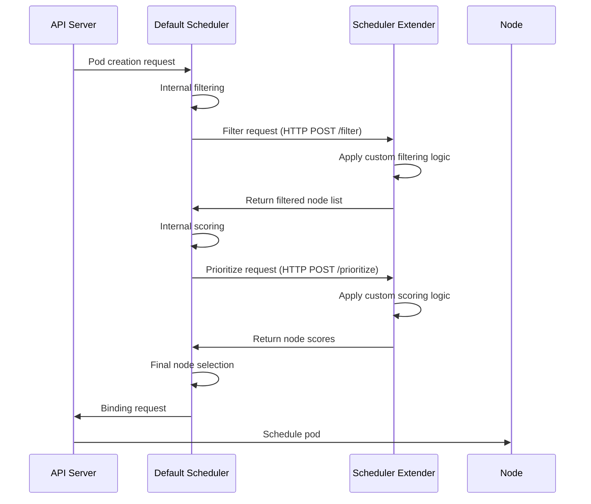

# パート 2: 実装

## Scheduler Extender アプローチ

Scheduler Extender アプローチは、default scheduler の機能を拡張する方法です。このアプローチでは、default scheduler が HTTP リクエストを介して外部サービス（Scheduler Extender）を呼び出し、追加の filtering と priority 機能を提供します。

### Scheduler Extender アーキテクチャ

次の図は、Scheduler Extender アプローチのアーキテクチャを示しています:

### Scheduler Extender ワークフロー

Scheduler Extender のワークフローは次のとおりです:



### Scheduler Extender の実装

Scheduler Extender は次の HTTP エンドポイントを提供する必要があります:

1. **Filter**: Pod を実行できない Node を除外します。
2. **Prioritize**: Node に priority score を割り当てます。
3. **Bind**: Pod を Node に bind します（任意）。
4. **Prefilter**: filtering の前に Pod を検査します（任意）。
5. **Prescore**: scoring の前に Pod を検査します（任意）。

Go を使用した簡単な Scheduler Extender の例を示します:

```go
package main

import (
    "encoding/json"
    "log"
    "net/http"

    "github.com/julienschmidt/httprouter"
    extenderv1 "k8s.io/kube-scheduler/extender/v1"
)

func main() {
    router := httprouter.New()
    router.POST("/filter", filterHandler)
    router.POST("/prioritize", prioritizeHandler)

    log.Fatal(http.ListenAndServe(":8888", router))
}

// Filter handler
func filterHandler(w http.ResponseWriter, r *http.Request, _ httprouter.Params) {
    var extenderArgs extenderv1.ExtenderArgs
    var extenderFilterResult extenderv1.ExtenderFilterResult

    if err := json.NewDecoder(r.Body).Decode(&extenderArgs); err != nil {
        http.Error(w, err.Error(), http.StatusBadRequest)
        return
    }

    // Simple example allowing all nodes
    extenderFilterResult.Nodes = extenderArgs.Nodes
    extenderFilterResult.FailedNodes = make(map[string]string)

    // Filter nodes based on specific conditions
    // Example: Allow only nodes with GPUs for pods requiring GPUs
    if requiresGPU(&extenderArgs.Pod) {
        filteredNodes := &extenderv1.NodeList{
            Items: make([]extenderv1.Node, 0),
        }

        for _, node := range extenderArgs.Nodes.Items {
            if hasGPU(&node) {
                filteredNodes.Items = append(filteredNodes.Items, node)
            } else {
                extenderFilterResult.FailedNodes[node.Name] = "Node does not have GPU"
            }
        }

        extenderFilterResult.Nodes = filteredNodes
    }

    if err := json.NewEncoder(w).Encode(extenderFilterResult); err != nil {
        http.Error(w, err.Error(), http.StatusInternalServerError)
        return
    }
}

// Prioritize handler
func prioritizeHandler(w http.ResponseWriter, r *http.Request, _ httprouter.Params) {
    var extenderArgs extenderv1.ExtenderArgs
    var hostPriorityList extenderv1.HostPriorityList

    if err := json.NewDecoder(r.Body).Decode(&extenderArgs); err != nil {
        http.Error(w, err.Error(), http.StatusBadRequest)
        return
    }

    // Assign scores to each node
    hostPriorityList = make(extenderv1.HostPriorityList, len(extenderArgs.Nodes.Items))
    for i, node := range extenderArgs.Nodes.Items {
        // Simple example: assign same score to all nodes
        hostPriorityList[i] = extenderv1.HostPriority{
            Host:  node.Name,
            Score: 1,
        }

        // Adjust score based on specific conditions
        // Example: Assign higher score to nodes with more GPU memory
        if requiresGPU(&extenderArgs.Pod) && hasGPU(&node) {
            gpuMemory := getGPUMemory(&node)
            hostPriorityList[i].Score = int64(gpuMemory / 1024) // Convert to GB
        }
    }

    if err := json.NewEncoder(w).Encode(hostPriorityList); err != nil {
        http.Error(w, err.Error(), http.StatusInternalServerError)
        return
    }
}

// Function to check GPU requirements
func requiresGPU(pod *extenderv1.Pod) bool {
    // Check GPU requirements from pod's resource requests
    for _, container := range pod.Spec.Containers {
        if _, ok := container.Resources.Requests["nvidia.com/gpu"]; ok {
            return true
        }
    }
    return false
}

// Function to check if node has GPU
func hasGPU(node *extenderv1.Node) bool {
    // Check GPU from node's capacity
    if _, ok := node.Status.Capacity["nvidia.com/gpu"]; ok {
        return true
    }
    return false
}

// Function to check node's GPU memory
func getGPUMemory(node *extenderv1.Node) int {
    // Check GPU memory from node labels
    if memoryStr, ok := node.Labels["gpu.nvidia.com/memory"]; ok {
        var memory int
        fmt.Sscanf(memoryStr, "%d", &memory)
        return memory
    }
    return 0
}
```

### Scheduler Extender の Deployment

Scheduler Extender を container image として build し、Kubernetes に deploy します:

```yaml
apiVersion: apps/v1
kind: Deployment
metadata:
  name: scheduler-extender
  namespace: kube-system
spec:
  replicas: 1
  selector:
    matchLabels:
      app: scheduler-extender
  template:
    metadata:
      labels:
        app: scheduler-extender
    spec:
      containers:
      - name: scheduler-extender
        image: your-registry/scheduler-extender:latest
        ports:
        - containerPort: 8888
        resources:
          requests:
            cpu: "100m"
            memory: "100Mi"
          limits:
            cpu: "200m"
            memory: "200Mi"
---
apiVersion: v1
kind: Service
metadata:
  name: scheduler-extender
  namespace: kube-system
spec:
  selector:
    app: scheduler-extender
  ports:
  - port: 8888
    targetPort: 8888
```

### Scheduler Configuration

Scheduler Extender を使用するには、default scheduler の configuration を変更する必要があります。EKS では、次のように設定できます:

1. Scheduler configuration file を作成します:

```yaml
apiVersion: kubescheduler.config.k8s.io/v1beta1
kind: KubeSchedulerConfiguration
clientConnection:
  kubeconfig: /etc/kubernetes/scheduler.conf
extenders:
- urlPrefix: "http://scheduler-extender.kube-system.svc.cluster.local:8888"
  filterVerb: "filter"
  prioritizeVerb: "prioritize"
  weight: 1
  enableHTTPS: false
  nodeCacheCapable: false
```

2. Scheduler configuration を ConfigMap として作成します:

```yaml
apiVersion: v1
kind: ConfigMap
metadata:
  name: scheduler-config
  namespace: kube-system
data:
  scheduler-config.yaml: |
    apiVersion: kubescheduler.config.k8s.io/v1beta1
    kind: KubeSchedulerConfiguration
    clientConnection:
      kubeconfig: /etc/kubernetes/scheduler.conf
    extenders:
    - urlPrefix: "http://scheduler-extender.kube-system.svc.cluster.local:8888"
      filterVerb: "filter"
      prioritizeVerb: "prioritize"
      weight: 1
      enableHTTPS: false
      nodeCacheCapable: false
```

3. Custom Scheduler Deployment:

```yaml
apiVersion: apps/v1
kind: Deployment
metadata:
  name: custom-scheduler
  namespace: kube-system
spec:
  replicas: 1
  selector:
    matchLabels:
      app: custom-scheduler
  template:
    metadata:
      labels:
        app: custom-scheduler
    spec:
      serviceAccountName: custom-scheduler
      containers:
      - name: kube-scheduler
        image: k8s.gcr.io/kube-scheduler:v1.23.0
        command:
        - kube-scheduler
        - --config=/etc/kubernetes/scheduler-config.yaml
        - --v=3
        volumeMounts:
        - name: scheduler-config
          mountPath: /etc/kubernetes/scheduler-config.yaml
          subPath: scheduler-config.yaml
        - name: kubeconfig
          mountPath: /etc/kubernetes/scheduler.conf
          readOnly: true
      volumes:
      - name: scheduler-config
        configMap:
          name: scheduler-config
      - name: kubeconfig
        hostPath:
          path: /etc/kubernetes/scheduler.conf
          type: File
```

## Scheduler Framework Plugins

Kubernetes 1.15 で導入された Scheduler Framework は、plugin ベースのアーキテクチャを提供します。このアプローチにより、scheduling pipeline のさまざまな段階で plugin を実装できます。

### Scheduler Framework アーキテクチャ

次の図は、Scheduler Framework のアーキテクチャを示しています:

### Scheduler Framework Plugin Configuration

次の図は、Scheduler Framework plugin configuration を示しています:

### Scheduling Framework Extension Points

Scheduling Framework は次の extension point を提供します:

1. **QueueSort**: scheduling queue 内の Pod の順序を決定します。
2. **PreFilter**: filtering の前に Pod を検査し、filtering data を準備します。
3. **Filter**: Pod を実行できない Node を除外します。
4. **PreScore**: scoring の前に Pod を検査し、scoring data を準備します。
5. **Score**: Node に score を割り当てます。
6. **NormalizeScore**: 各 scoring plugin からの score を正規化します。
7. **Reserve**: Pod の resource を予約します。
8. **Permit**: Pod を schedule できるかどうかを決定します。
9. **PreBind**: binding の前に必要な操作を実行します。
10. **Bind**: Pod を Node に bind します。
11. **PostBind**: binding の後に必要な操作を実行します。

### Scheduler Plugin Implementation

Go を使用した簡単な Scheduler plugin の例を示します:

```go
package main

import (
    "context"
    "fmt"

    v1 "k8s.io/api/core/v1"
    "k8s.io/apimachinery/pkg/runtime"
    "k8s.io/kubernetes/pkg/scheduler/framework"
)

// GPUSchedulerPlugin is a plugin that filters and scores nodes based on GPU requirements.
type GPUSchedulerPlugin struct{}

var _ framework.FilterPlugin = &GPUSchedulerPlugin{}
var _ framework.ScorePlugin = &GPUSchedulerPlugin{}

// Name returns the name of the plugin.
func (gsp *GPUSchedulerPlugin) Name() string {
    return "GPUScheduler"
}

// Filter filters out nodes where the pod cannot run.
func (gsp *GPUSchedulerPlugin) Filter(ctx context.Context, state *framework.CycleState, pod *v1.Pod, node *framework.NodeInfo) *framework.Status {
    // For pods with GPU requirements, allow only nodes with GPUs
    if requiresGPU(pod) && !hasGPU(node.Node()) {
        return framework.NewStatus(framework.Unschedulable, "Node does not have GPU")
    }
    return framework.NewStatus(framework.Success, "")
}

// Score assigns scores to nodes.
func (gsp *GPUSchedulerPlugin) Score(ctx context.Context, state *framework.CycleState, pod *v1.Pod, nodeName string) (int64, *framework.Status) {
    nodeInfo, err := state.Read(framework.NodeInfoKey)
    if err != nil {
        return 0, framework.NewStatus(framework.Error, fmt.Sprintf("Error reading node info: %v", err))
    }

    node := nodeInfo.(*framework.NodeInfo).Node()

    // For pods with GPU requirements, assign scores based on GPU memory
    if requiresGPU(pod) && hasGPU(node) {
        gpuMemory := getGPUMemory(node)
        return int64(gpuMemory / 1024), framework.NewStatus(framework.Success, "") // Convert to GB
    }

    return 0, framework.NewStatus(framework.Success, "")
}

// ScoreExtensions returns extensions for the score plugin.
func (gsp *GPUSchedulerPlugin) ScoreExtensions() framework.ScoreExtensions {
    return gsp
}

// NormalizeScore normalizes the scores.
func (gsp *GPUSchedulerPlugin) NormalizeScore(ctx context.Context, state *framework.CycleState, pod *v1.Pod, scores framework.NodeScoreList) *framework.Status {
    // Find maximum score
    var maxScore int64 = 1
    for _, score := range scores {
        if score.Score > maxScore {
            maxScore = score.Score
        }
    }

    // Normalize scores (0-100 range)
    for i := range scores {
        if maxScore > 0 {
            scores[i].Score = scores[i].Score * 100 / maxScore
        } else {
            scores[i].Score = 0
        }
    }

    return framework.NewStatus(framework.Success, "")
}

// Function to check GPU requirements
func requiresGPU(pod *v1.Pod) bool {
    // Check GPU requirements from pod's resource requests
    for _, container := range pod.Spec.Containers {
        if _, ok := container.Resources.Requests["nvidia.com/gpu"]; ok {
            return true
        }
    }
    return false
}

// Function to check if node has GPU
func hasGPU(node *v1.Node) bool {
    // Check GPU from node's capacity
    if _, ok := node.Status.Capacity["nvidia.com/gpu"]; ok {
        return true
    }
    return false
}

// Function to check node's GPU memory
func getGPUMemory(node *v1.Node) int {
    // Check GPU memory from node labels
    if memoryStr, ok := node.Labels["gpu.nvidia.com/memory"]; ok {
        var memory int
        fmt.Sscanf(memoryStr, "%d", &memory)
        return memory
    }
    return 0
}

// New creates a new instance of the plugin.
func New(_ runtime.Object, _ framework.Handle) (framework.Plugin, error) {
    return &GPUSchedulerPlugin{}, nil
}
```

### Scheduler Plugin Registration

Scheduler plugin を登録するには、scheduler configuration file を変更する必要があります:

```yaml
apiVersion: kubescheduler.config.k8s.io/v1beta1
kind: KubeSchedulerConfiguration
clientConnection:
  kubeconfig: /etc/kubernetes/scheduler.conf
profiles:
- schedulerName: custom-scheduler
  plugins:
    filter:
      enabled:
      - name: GPUScheduler
    score:
      enabled:
      - name: GPUScheduler
        weight: 10
  pluginConfig:
  - name: GPUScheduler
    args: {}
```

## EKS における Scheduler Framework の実装

Amazon EKS で Scheduler Framework を実装する際は、次の点を考慮してください:

1. **Container Image Build**: Custom scheduler plugin を container image として build し、Amazon ECR などの container registry に push します。
2. **Scheduler Configuration**: Scheduler configuration を ConfigMap として作成し、custom scheduler pod に mount します。
3. **RBAC Permissions**: Custom scheduler が必要な resource に access できるように、適切な RBAC permission を設定します。
4. **Node Labeling**: 特定の hardware 特性（例: GPU）に従って Node に label を付けます。

### EKS Scheduler Framework アーキテクチャ

次の図は、EKS で Scheduler Framework を実装する方法を示しています:&#x20;

### EKS Scheduler Framework Implementation Steps

1. **Custom Scheduler Plugin Development**:

```go
// main.go
package main

import (
    "os"

    "k8s.io/component-base/logs"
    "k8s.io/kubernetes/cmd/kube-scheduler/app"
    "k8s.io/kubernetes/pkg/scheduler/framework/plugins/defaultbinder"
    "k8s.io/kubernetes/pkg/scheduler/framework/plugins/defaultpreemption"
    "k8s.io/kubernetes/pkg/scheduler/framework/plugins/nodeaffinity"
    "k8s.io/kubernetes/pkg/scheduler/framework/plugins/nodename"
    "k8s.io/kubernetes/pkg/scheduler/framework/plugins/nodeports"
    "k8s.io/kubernetes/pkg/scheduler/framework/plugins/noderesources"
    "k8s.io/kubernetes/pkg/scheduler/framework/plugins/nodeunschedulable"
    "k8s.io/kubernetes/pkg/scheduler/framework/plugins/podtopologyspread"
    "k8s.io/kubernetes/pkg/scheduler/framework/plugins/queuesort"
    "k8s.io/kubernetes/pkg/scheduler/framework/plugins/tainttoleration"
    "k8s.io/kubernetes/pkg/scheduler/framework/plugins/volumebinding"
    "k8s.io/kubernetes/pkg/scheduler/framework/plugins/volumerestrictions"
    "k8s.io/kubernetes/pkg/scheduler/framework/plugins/volumezone"

    // Import custom plugins
    "example.com/gpu-scheduler/pkg/gpuplugin"
    "example.com/gpu-scheduler/pkg/spotplugin"
    "example.com/gpu-scheduler/pkg/azplugin"
)

func main() {
    command := app.NewSchedulerCommand(
        app.WithPlugin(gpuplugin.Name, gpuplugin.New),
        app.WithPlugin(spotplugin.Name, spotplugin.New),
        app.WithPlugin(azplugin.Name, azplugin.New),
        // Include default plugins
        app.WithPlugin(defaultpreemption.Name, defaultpreemption.New),
        app.WithPlugin(noderesources.FitName, noderesources.NewFit),
        app.WithPlugin(noderesources.BalancedAllocationName, noderesources.NewBalancedAllocation),
        app.WithPlugin(nodename.Name, nodename.New),
        app.WithPlugin(nodeports.Name, nodeports.New),
        app.WithPlugin(nodeaffinity.Name, nodeaffinity.New),
        app.WithPlugin(nodeunschedulable.Name, nodeunschedulable.New),
        app.WithPlugin(tainttoleration.Name, tainttoleration.New),
        app.WithPlugin(volumerestrictions.Name, volumerestrictions.New),
        app.WithPlugin(volumebinding.Name, volumebinding.New),
        app.WithPlugin(volumezone.Name, volumezone.New),
        app.WithPlugin(podtopologyspread.Name, podtopologyspread.New),
        app.WithPlugin(defaultbinder.Name, defaultbinder.New),
        app.WithPlugin(queuesort.Name, queuesort.New),
    )

    logs.InitLogs()
    defer logs.FlushLogs()

    if err := command.Execute(); err != nil {
        os.Exit(1)
    }
}
```

2. **Dockerfile Creation**:

```dockerfile
FROM golang:1.17 as builder

WORKDIR /go/src/example.com/gpu-scheduler
COPY . .

RUN CGO_ENABLED=0 GOOS=linux go build -a -installsuffix cgo -o kube-scheduler .

FROM alpine:3.14
RUN apk --no-cache add ca-certificates

WORKDIR /
COPY --from=builder /go/src/example.com/gpu-scheduler/kube-scheduler .

ENTRYPOINT ["/kube-scheduler"]
```

3. **Image Build and Push**:

```bash
docker build -t your-registry/gpu-scheduler:latest .
docker push your-registry/gpu-scheduler:latest
```

4. **Scheduler Configuration ConfigMap Creation**:

```yaml
apiVersion: v1
kind: ConfigMap
metadata:
  name: gpu-scheduler-config
  namespace: kube-system
data:
  scheduler-config.yaml: |
    apiVersion: kubescheduler.config.k8s.io/v1beta1
    kind: KubeSchedulerConfiguration
    clientConnection:
      kubeconfig: /etc/kubernetes/scheduler.conf
    profiles:
    - schedulerName: gpu-scheduler
      plugins:
        queueSort:
          enabled:
          - name: PrioritySort
        preFilter:
          enabled:
          - name: NodeResourcesFit
          - name: NodePorts
          - name: PodTopologySpread
          - name: InterPodAffinity
          - name: VolumeBinding
          - name: NodeAffinity
          - name: GPUScheduler
        filter:
          enabled:
          - name: NodeUnschedulable
          - name: NodeName
          - name: TaintToleration
          - name: NodeAffinity
          - name: NodePorts
          - name: NodeResourcesFit
          - name: VolumeRestrictions
          - name: EBSLimits
          - name: VolumeBinding
          - name: VolumeZone
          - name: PodTopologySpread
          - name: InterPodAffinity
          - name: GPUScheduler
          - name: SpotScheduler
          - name: AZScheduler
        preScore:
          enabled:
          - name: InterPodAffinity
          - name: PodTopologySpread
          - name: TaintToleration
          - name: NodeAffinity
          - name: GPUScheduler
        score:
          enabled:
          - name: NodeResourcesBalancedAllocation
            weight: 1
          - name: ImageLocality
            weight: 1
          - name: InterPodAffinity
            weight: 1
          - name: NodeResourcesFit
            weight: 1
          - name: NodeAffinity
            weight: 1
          - name: PodTopologySpread
            weight: 2
          - name: TaintToleration
            weight: 1
          - name: GPUScheduler
            weight: 10
          - name: SpotScheduler
            weight: 5
          - name: AZScheduler
            weight: 3
        reserve:
          enabled:
          - name: VolumeBinding
        permit:
          enabled: []
        preBind:
          enabled:
          - name: VolumeBinding
        bind:
          enabled:
          - name: DefaultBinder
        postBind:
          enabled: []
      pluginConfig:
      - name: GPUScheduler
        args: {}
      - name: SpotScheduler
        args: {}
      - name: AZScheduler
        args: {}
```

5. **Custom Scheduler Deployment**:

```yaml
apiVersion: v1
kind: ServiceAccount
metadata:
  name: gpu-scheduler
  namespace: kube-system
---
apiVersion: rbac.authorization.k8s.io/v1
kind: ClusterRole
metadata:
  name: gpu-scheduler
rules:
- apiGroups: [""]
  resources: ["pods"]
  verbs: ["get", "list", "watch", "update", "patch"]
- apiGroups: [""]
  resources: ["pods/binding"]
  verbs: ["create"]
- apiGroups: [""]
  resources: ["nodes"]
  verbs: ["get", "list", "watch"]
- apiGroups: [""]
  resources: ["events"]
  verbs: ["create", "patch", "update"]
---
apiVersion: rbac.authorization.k8s.io/v1
kind: ClusterRoleBinding
metadata:
  name: gpu-scheduler
subjects:
- kind: ServiceAccount
  name: gpu-scheduler
  namespace: kube-system
roleRef:
  kind: ClusterRole
  name: gpu-scheduler
  apiGroup: rbac.authorization.k8s.io
---
apiVersion: apps/v1
kind: Deployment
metadata:
  name: gpu-scheduler
  namespace: kube-system
spec:
  replicas: 1
  selector:
    matchLabels:
      app: gpu-scheduler
  template:
    metadata:
      labels:
        app: gpu-scheduler
    spec:
      serviceAccountName: gpu-scheduler
      containers:
      - name: gpu-scheduler
        image: your-registry/gpu-scheduler:latest
        args:
        - --config=/etc/kubernetes/scheduler-config.yaml
        - --v=3
        volumeMounts:
        - name: scheduler-config
          mountPath: /etc/kubernetes/scheduler-config.yaml
          subPath: scheduler-config.yaml
      volumes:
      - name: scheduler-config
        configMap:
          name: gpu-scheduler-config
```

6. **Specifying Scheduler in Pod**:

```yaml
apiVersion: v1
kind: Pod
metadata:
  name: gpu-pod
spec:
  schedulerName: gpu-scheduler
  containers:
  - name: cuda-container
    image: nvidia/cuda:11.0-base
    resources:
      limits:
        nvidia.com/gpu: 1
```

## まとめ

この章では、Scheduler Extender アプローチと Scheduler Framework plugin を使用して custom scheduler を実装する方法を扱いました。また、EKS cluster で Scheduler Framework を実装する方法についても説明しました。

次の章では、EKS における custom scheduler の実装事例と monitoring 方法について見ていきます。

## クイズ

この章で学んだことを確認するために、[トピッククイズ](../quizzes/scheduling/02-custom-scheduler-part2-quiz.md) に挑戦してみてください。
