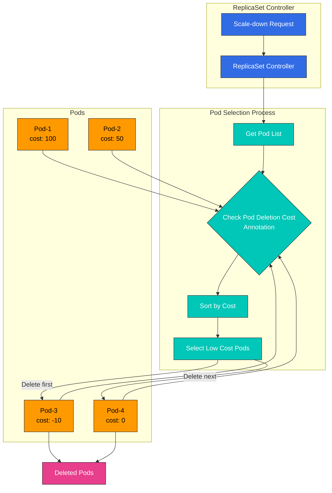

# パート 3: 高度な機能

## EKS における custom scheduler（カスタムスケジューラー）の実装事例

このセクションでは、EKS で custom scheduler を実装する実際の事例を見ていきます。

### ケース 1: GPU Workload 最適化 Scheduler

AI/ML Workload を実行する EKS cluster では、GPU リソースを効率的に利用することが重要です。以下は、GPU Workload を最適化する custom scheduler の実装事例です。

#### GPU Workload 最適化 Scheduler のアーキテクチャ

次の図は、GPU Workload 最適化 Scheduler のアーキテクチャを示しています。

#### GPU Workload Scheduling Workflow

次の図は、GPU Workload の scheduling workflow を示しています。

#### 要件

1. GPU メモリ要件に基づく Node 選択
2. GPU モデル（例: NVIDIA A100、V100、T4 など）に基づく Node 選択
3. GPU 利用率を考慮した Node 選択
4. マルチ GPU インスタンスでの GPU 共有最適化

#### 実装アプローチ

この事例では、scheduler framework plugin アプローチを使用します。

1. **Node Labeling**: 各 Node に GPU 関連情報を label として追加します。

```bash
# Add GPU model label
kubectl label node <node-name> gpu.nvidia.com/model=A100

# Add GPU memory label
kubectl label node <node-name> gpu.nvidia.com/memory=40960

# Add GPU count label
kubectl label node <node-name> gpu.nvidia.com/count=8
```

2. **Custom Scheduler Plugin Implementation**:

```go
// GPUTopologyPlugin is a scheduler plugin that considers GPU topology.
type GPUTopologyPlugin struct {
    handle framework.Handle
}

// Filter filters nodes based on GPU requirements.
func (gtp *GPUTopologyPlugin) Filter(ctx context.Context, state *framework.CycleState, pod *v1.Pod, node *framework.NodeInfo) *framework.Status {
    // Check GPU requirements
    gpuReq := getGPURequest(pod)
    if gpuReq == 0 {
        return framework.NewStatus(framework.Success, "")
    }

    // Check node's GPU info
    gpuCount := getGPUCount(node.Node())
    if gpuCount < gpuReq {
        return framework.NewStatus(framework.Unschedulable, "Not enough GPUs")
    }

    // Check GPU model requirements
    requiredModel := getRequiredGPUModel(pod)
    if requiredModel != "" && getGPUModel(node.Node()) != requiredModel {
        return framework.NewStatus(framework.Unschedulable, "GPU model mismatch")
    }

    // Check GPU memory requirements
    memReq := getGPUMemoryRequest(pod)
    if memReq > 0 && getGPUMemory(node.Node()) < memReq {
        return framework.NewStatus(framework.Unschedulable, "Not enough GPU memory")
    }

    return framework.NewStatus(framework.Success, "")
}

// Score assigns scores to nodes based on GPU topology.
func (gtp *GPUTopologyPlugin) Score(ctx context.Context, state *framework.CycleState, pod *v1.Pod, nodeName string) (int64, *framework.Status) {
    nodeInfo, err := gtp.handle.SnapshotSharedLister().NodeInfos().Get(nodeName)
    if err != nil {
        return 0, framework.NewStatus(framework.Error, fmt.Sprintf("Error getting node info: %v", err))
    }

    node := nodeInfo.Node()

    // Return default score if no GPU requirements
    gpuReq := getGPURequest(pod)
    if gpuReq == 0 {
        return 0, framework.NewStatus(framework.Success, "")
    }

    // Check GPU utilization
    gpuUtilization := getGPUUtilization(node)

    // Calculate score based on GPU count
    gpuCount := getGPUCount(node)

    // Assign higher score to nodes with available GPUs slightly more than requested
    // This is for efficient GPU resource utilization
    score := 100 - int64(math.Abs(float64(gpuCount-gpuReq))*10)
    if score < 0 {
        score = 0
    }

    // Assign higher score to nodes with low GPU utilization
    utilizationScore := int64((1.0 - gpuUtilization) * 100)

    // Final score is weighted average of both scores
    finalScore := (score * 7 + utilizationScore * 3) / 10

    return finalScore, framework.NewStatus(framework.Success, "")
}
```

3. **Scheduler Configuration**:

```yaml
apiVersion: kubescheduler.config.k8s.io/v1beta1
kind: KubeSchedulerConfiguration
clientConnection:
  kubeconfig: /etc/kubernetes/scheduler.conf
profiles:
- schedulerName: gpu-scheduler
  plugins:
    filter:
      enabled:
      - name: GPUTopologyPlugin
    score:
      enabled:
      - name: GPUTopologyPlugin
        weight: 10
  pluginConfig:
  - name: GPUTopologyPlugin
    args: {}
```

4. **Pod Spec での GPU 要件の指定**:

```yaml
apiVersion: v1
kind: Pod
metadata:
  name: gpu-pod
  annotations:
    gpu.nvidia.com/model: "A100"
    gpu.nvidia.com/memory: "40960"
spec:
  schedulerName: gpu-scheduler
  containers:
  - name: gpu-container
    image: nvidia/cuda:11.6.0-base-ubuntu20.04
    resources:
      limits:
        nvidia.com/gpu: 2
```

### ケース 2: Network Locality 最適化 Scheduler

EKS cluster では、ネットワークコストを最適化するために、network locality を考慮する custom scheduler を実装できます。

#### Network Locality 最適化 Scheduler のアーキテクチャ

次の図は、Network Locality 最適化 Scheduler のアーキテクチャを示しています。

#### Network Locality 最適化 Workflow

次の図は、Network Locality 最適化 Scheduler の workflow を示しています。

## Pod Deletion Cost による Scale-Down 最適化

Kubernetes 1.22 で導入された Pod Deletion Cost は、ReplicaSet、Deployment、StatefulSet などの Workload リソースが scale down するときに、どの Pod を先に削除するかを制御できる機能です。これは、アプリケーションの可用性とパフォーマンスを最適化するのに役立ちます。

### Pod Deletion Cost の概念

Pod Deletion Cost は、`controller.kubernetes.io/pod-deletion-cost` annotation を通じて各 Pod にコスト値を割り当てます。Scale-down 時には、コストが低い Pod が先に削除されます。

**主な機能**:

* デフォルト値: 0
* 範囲: -2147483648 から 2147483647（int32 の範囲）
* 値が高い = より重要な Pod（後で削除される）
* 値が低い = 重要度が低い Pod（先に削除される）

### Pod Deletion Cost のアーキテクチャ

次の図は、scale-down 中に Pod Deletion Cost がどのように機能するかを示しています。



### ユースケース

#### 1. ウォームアップ済みキャッシュ Pod の保護

アプリケーションが起動時にキャッシュをロードする場合、ウォームアップ済み Pod を維持する優先度を上げることでパフォーマンスを最適化できます。

```yaml
apiVersion: v1
kind: Pod
metadata:
  name: app-pod-warmed-up
  annotations:
    controller.kubernetes.io/pod-deletion-cost: "100"  # Cache warmed up
spec:
  containers:
  - name: app
    image: my-app:latest
    lifecycle:
      postStart:
        exec:
          command:
          - /bin/sh
          - -c
          - |
            # Cache warm-up
            /app/warm-cache.sh
            # Increase deletion cost after warm-up complete
            kubectl annotate pod $HOSTNAME \
              controller.kubernetes.io/pod-deletion-cost=100 --overwrite
```

#### 2. アクティブな接続を持つ Pod の保護

WebSocket または長時間実行される接続を持つ Pod を保護します。

```go
// Go example: Dynamically update deletion cost based on active connection count
package main

import (
    "context"
    "fmt"
    "os"
    "time"

    metav1 "k8s.io/apimachinery/pkg/apis/meta/v1"
    "k8s.io/client-go/kubernetes"
    "k8s.io/client-go/rest"
)

type ConnectionTracker struct {
    activeConnections int
    k8sClient         *kubernetes.Clientset
    podName           string
    namespace         string
}

func NewConnectionTracker() (*ConnectionTracker, error) {
    config, err := rest.InClusterConfig()
    if err != nil {
        return nil, err
    }

    clientset, err := kubernetes.NewForConfig(config)
    if err != nil {
        return nil, err
    }

    return &ConnectionTracker{
        k8sClient: clientset,
        podName:   os.Getenv("POD_NAME"),
        namespace: os.Getenv("POD_NAMESPACE"),
    }, nil
}

func (ct *ConnectionTracker) UpdateDeletionCost() error {
    // Set deletion cost proportional to active connection count
    // 10 cost per connection, max 1000
    cost := ct.activeConnections * 10
    if cost > 1000 {
        cost = 1000
    }

    pod, err := ct.k8sClient.CoreV1().Pods(ct.namespace).Get(
        context.TODO(),
        ct.podName,
        metav1.GetOptions{},
    )
    if err != nil {
        return err
    }

    if pod.Annotations == nil {
        pod.Annotations = make(map[string]string)
    }

    pod.Annotations["controller.kubernetes.io/pod-deletion-cost"] = fmt.Sprintf("%d", cost)

    _, err = ct.k8sClient.CoreV1().Pods(ct.namespace).Update(
        context.TODO(),
        pod,
        metav1.UpdateOptions{},
    )

    return err
}

func (ct *ConnectionTracker) StartPeriodicUpdate() {
    ticker := time.NewTicker(30 * time.Second)
    defer ticker.Stop()

    for range ticker.C {
        if err := ct.UpdateDeletionCost(); err != nil {
            fmt.Printf("Failed to update deletion cost: %v\n", err)
        }
    }
}

func (ct *ConnectionTracker) OnConnectionOpen() {
    ct.activeConnections++
}

func (ct *ConnectionTracker) OnConnectionClose() {
    ct.activeConnections--
    if ct.activeConnections < 0 {
        ct.activeConnections = 0
    }
}
```

#### 3. Data Locality を持つ Pod の保護

特定の Node 上のデータをキャッシュまたは使用する Pod を保護します。

```yaml
apiVersion: apps/v1
kind: Deployment
metadata:
  name: data-processor
spec:
  replicas: 5
  selector:
    matchLabels:
      app: data-processor
  template:
    metadata:
      labels:
        app: data-processor
      annotations:
        # Set high cost for pods with high data locality
        controller.kubernetes.io/pod-deletion-cost: "50"
    spec:
      affinity:
        podAntiAffinity:
          preferredDuringSchedulingIgnoredDuringExecution:
          - weight: 100
            podAffinityTerm:
              labelSelector:
                matchExpressions:
                - key: app
                  operator: In
                  values:
                  - data-processor
              topologyKey: kubernetes.io/hostname
      containers:
      - name: processor
        image: data-processor:latest
        env:
        - name: POD_NAME
          valueFrom:
            fieldRef:
              fieldPath: metadata.name
        - name: POD_NAMESPACE
          valueFrom:
            fieldRef:
              fieldPath: metadata.namespace
```

#### 4. 新しく起動した Pod の削除を優先

新しく起動した Pod はまだ完全にウォームアップされていない可能性があるため、先に削除します。

```yaml
apiVersion: v1
kind: Pod
metadata:
  name: app-pod-new
  annotations:
    controller.kubernetes.io/pod-deletion-cost: "-50"  # New pods have low cost
spec:
  containers:
  - name: app
    image: my-app:latest
    lifecycle:
      postStart:
        exec:
          command:
          - /bin/sh
          - -c
          - |
            # Initially low cost
            sleep 60
            # Change to normal cost after 1 minute
            kubectl annotate pod $HOSTNAME \
              controller.kubernetes.io/pod-deletion-cost=0 --overwrite
```

### Horizontal Pod Autoscaler との統合

HPA と併用する場合、scale-down 中に重要な Pod を保護するために Pod Deletion Cost を活用できます。

```yaml
apiVersion: autoscaling/v2
kind: HorizontalPodAutoscaler
metadata:
  name: app-hpa
spec:
  scaleTargetRef:
    apiVersion: apps/v1
    kind: Deployment
    name: app
  minReplicas: 3
  maxReplicas: 10
  metrics:
  - type: Resource
    resource:
      name: cpu
      target:
        type: Utilization
        averageUtilization: 70
  behavior:
    scaleDown:
      stabilizationWindowSeconds: 300  # 5-minute stabilization period
      policies:
      - type: Percent
        value: 50
        periodSeconds: 60
      - type: Pods
        value: 2
        periodSeconds: 60
      selectPolicy: Min
```

### Dynamic Pod Deletion Cost 更新パターン

Pod の重要度がリアルタイムに変化する場合、deletion cost を動的に更新できます。

```python
# Python example: Dynamic deletion cost update based on metrics
from kubernetes import client, config
import time
import os

class DeletionCostManager:
    def __init__(self):
        config.load_incluster_config()
        self.v1 = client.CoreV1Api()
        self.pod_name = os.environ.get('POD_NAME')
        self.namespace = os.environ.get('POD_NAMESPACE')

    def calculate_cost(self, metrics):
        """
        Calculate deletion cost based on metrics
        - Active request count
        - Cache hit rate
        - Average response time
        """
        base_cost = 0

        # Higher cost for more active requests
        active_requests = metrics.get('active_requests', 0)
        base_cost += active_requests * 5

        # Higher cost for higher cache hit rate
        cache_hit_rate = metrics.get('cache_hit_rate', 0)
        base_cost += int(cache_hit_rate * 100)

        # Higher cost for faster response time (optimized pod)
        avg_response_time = metrics.get('avg_response_time_ms', 1000)
        if avg_response_time < 100:
            base_cost += 50
        elif avg_response_time < 500:
            base_cost += 20

        # Limit to max 1000
        return min(base_cost, 1000)

    def update_deletion_cost(self, cost):
        """Update pod's deletion cost annotation"""
        try:
            pod = self.v1.read_namespaced_pod(
                name=self.pod_name,
                namespace=self.namespace
            )

            if pod.metadata.annotations is None:
                pod.metadata.annotations = {}

            pod.metadata.annotations['controller.kubernetes.io/pod-deletion-cost'] = str(cost)

            self.v1.patch_namespaced_pod(
                name=self.pod_name,
                namespace=self.namespace,
                body=pod
            )

            print(f"Updated deletion cost to {cost}")
        except Exception as e:
            print(f"Error updating deletion cost: {e}")

    def run(self, get_metrics_func):
        """Periodically collect metrics and update deletion cost"""
        while True:
            try:
                metrics = get_metrics_func()
                cost = self.calculate_cost(metrics)
                self.update_deletion_cost(cost)
            except Exception as e:
                print(f"Error in main loop: {e}")

            time.sleep(30)  # Update every 30 seconds

# Usage example
def get_app_metrics():
    """Collect application metrics (implementation required)"""
    return {
        'active_requests': 15,
        'cache_hit_rate': 0.85,
        'avg_response_time_ms': 120
    }

if __name__ == '__main__':
    manager = DeletionCostManager()
    manager.run(get_app_metrics)
```

### Monitoring と Debugging

Pod Deletion Cost が正しく機能していることを確認する方法は次のとおりです。

```bash
# 1. Check pod's deletion cost
kubectl get pods -o custom-columns=\
NAME:.metadata.name,\
DELETION_COST:.metadata.annotations.controller\.kubernetes\.io/pod-deletion-cost

# 2. Check all pod deletion costs for a specific Deployment
kubectl get pods -l app=my-app -o json | \
  jq -r '.items[] | "\(.metadata.name): \(.metadata.annotations["controller.kubernetes.io/pod-deletion-cost"] // "0")"'

# 3. Scale-down simulation
kubectl scale deployment my-app --replicas=3

# 4. Check which pods were deleted
kubectl get events --field-selector involvedObject.kind=Pod,reason=Killing \
  --sort-by='.lastTimestamp'
```

### Prometheus Metrics Collection

```yaml
# ServiceMonitor for Pod Deletion Cost metrics
apiVersion: monitoring.coreos.com/v1
kind: ServiceMonitor
metadata:
  name: pod-deletion-cost-monitor
  namespace: monitoring
spec:
  selector:
    matchLabels:
      app: my-app
  endpoints:
  - port: metrics
    interval: 30s
    relabelings:
    - sourceLabels: [__meta_kubernetes_pod_annotation_controller_kubernetes_io_pod_deletion_cost]
      targetLabel: pod_deletion_cost
```

### Grafana Dashboard

```json
{
  "dashboard": {
    "title": "Pod Deletion Cost Monitoring",
    "panels": [
      {
        "title": "Pod Deletion Cost Distribution",
        "targets": [
          {
            "expr": "kube_pod_annotations{annotation_controller_kubernetes_io_pod_deletion_cost!=\"\"}"
          }
        ],
        "type": "graph"
      },
      {
        "title": "Pods by Deletion Cost Range",
        "targets": [
          {
            "expr": "count(kube_pod_annotations{annotation_controller_kubernetes_io_pod_deletion_cost=~\"[0-9]+\"}) by (annotation_controller_kubernetes_io_pod_deletion_cost)"
          }
        ],
        "type": "piechart"
      }
    ]
  }
}
```

### ベストプラクティス

1. **一貫したコスト範囲を使用する**: チーム内で一貫したコスト範囲を定義して使用します。
   * `-100 to -1`: 先に削除（新しい Pod、ウォームアップ中の Pod）
   * `0`: デフォルト（通常の Pod）
   * `1 to 100`: 中程度の重要度（アクティブな接続を持つ Pod）
   * `100 to 1000`: 高い重要度（ウォームアップ済みキャッシュを持つ Pod、多数の接続を持つ Pod）
2. **動的更新**: Pod の状態が変化したときに deletion cost を動的に更新します。
3. **上限を設定する**: 過度に大きな値による問題を防ぐため、deletion cost に上限を設定します。
4. **Monitoring**: Deletion cost の分布を monitoring し、期待どおりに機能していることを確認します。
5. **Testing**: 本番環境に適用する前に、staging 環境で scale-down 動作をテストします。
6. **Documentation**: 各コスト範囲の意味を文書化します。

### 制限事項

* **Pod Disruption Budget との相互作用**: 併用する場合は PDB が優先されます。
* **Kubernetes Version**: 1.22 以降でのみ利用できます。
* **Workload Type Limitation**: ReplicaSet controller を使用する Workload（Deployment、ReplicaSet）でのみ機能します。
* **Node Failure**: Node が完全に障害になった場合、deletion cost は考慮されません。

## Custom Scheduler の Monitoring と Debugging

Custom scheduler の実装後は、monitoring と debugging が重要です。このセクションでは、custom scheduler を monitoring および debugging する方法を扱います。

### Monitoring Architecture

次の図は、EKS で custom scheduler を monitoring するためのアーキテクチャを示しています。

### 主な Monitoring Metrics

次の図は、custom scheduler の主な monitoring metrics とその関係を示しています。

### Logging

Custom scheduler のログを確認することで、scheduling の判断を理解できます。

```bash
kubectl logs -n kube-system -l app=custom-scheduler
```

### Events の確認

Pod scheduling に関連する events を確認できます。

```bash
kubectl get events --field-selector involvedObject.name=<pod-name>
```

### Metrics Collection

Prometheus を使用して custom scheduler metrics を収集できます。

```yaml
apiVersion: monitoring.coreos.com/v1
kind: ServiceMonitor
metadata:
  name: custom-scheduler
  namespace: monitoring
spec:
  selector:
    matchLabels:
      app: custom-scheduler
  endpoints:
  - port: metrics
    interval: 15s
```

### Dashboard Configuration

Grafana を使用して custom scheduler metrics を可視化できます。

```yaml
apiVersion: v1
kind: ConfigMap
metadata:
  name: custom-scheduler-dashboard
  namespace: monitoring
data:
  custom-scheduler-dashboard.json: |
    {
      "annotations": {
        "list": [
          {
            "builtIn": 1,
            "datasource": "-- Grafana --",
            "enable": true,
            "hide": true,
            "iconColor": "rgba(0, 211, 255, 1)",
            "name": "Annotations & Alerts",
            "type": "dashboard"
          }
        ]
      },
      "editable": true,
      "gnetId": null,
      "graphTooltip": 0,
      "id": 1,
      "links": [],
      "panels": [
        {
          "aliasColors": {},
          "bars": false,
          "dashLength": 10,
          "dashes": false,
          "datasource": null,
          "fieldConfig": {
            "defaults": {
              "custom": {}
            },
            "overrides": []
          },
          "fill": 1,
          "fillGradient": 0,
          "gridPos": {
            "h": 8,
            "w": 12,
            "x": 0,
            "y": 0
          },
          "hiddenSeries": false,
          "id": 2,
          "legend": {
            "avg": false,
            "current": false,
            "max": false,
            "min": false,
            "show": true,
            "total": false,
            "values": false
          },
          "lines": true,
          "linewidth": 1,
          "nullPointMode": "null",
          "options": {
            "alertThreshold": true
          },
          "percentage": false,
          "pluginVersion": "7.2.0",
          "pointradius": 2,
          "points": false,
          "renderer": "flot",
          "seriesOverrides": [],
          "spaceLength": 10,
          "stack": false,
          "steppedLine": false,
          "targets": [
            {
              "expr": "scheduler_scheduling_duration_seconds_count",
              "interval": "",
              "legendFormat": "",
              "refId": "A"
            }
          ],
          "thresholds": [],
          "timeFrom": null,
          "timeRegions": [],
          "timeShift": null,
          "title": "Scheduling Duration",
          "tooltip": {
            "shared": true,
            "sort": 0,
            "value_type": "individual"
          },
          "type": "graph",
          "xaxis": {
            "buckets": null,
            "mode": "time",
            "name": null,
            "show": true,
            "values": []
          },
          "yaxes": [
            {
              "format": "short",
              "label": null,
              "logBase": 1,
              "max": null,
              "min": null,
              "show": true
            },
            {
              "format": "short",
              "label": null,
              "logBase": 1,
              "max": null,
              "min": null,
              "show": true
            }
          ],
          "yaxis": {
            "align": false,
            "alignLevel": null
          }
        }
      ],
      "schemaVersion": 26,
      "style": "dark",
      "tags": [],
      "templating": {
        "list": []
      },
      "time": {
        "from": "now-6h",
        "to": "now"
      },
      "timepicker": {},
      "timezone": "",
      "title": "Custom Scheduler Dashboard",
      "uid": "custom-scheduler",
      "version": 1
    }
```

## まとめ

Custom scheduler は、特定の要件に合わせて Kubernetes の scheduling 動作をカスタマイズする強力な方法です。EKS では、multiple scheduler approach、scheduler extender approach、scheduler framework plugin approach など、さまざまな方法で custom scheduler を実装できます。

Custom scheduler は、GPU Workload 最適化や network locality 最適化など、さまざまなケースで活用できます。Custom scheduler を実装する際は、monitoring と debugging ツールも設定することが重要です。

## クイズ

この章で学んだ内容を確認するために、[トピッククイズ](../quizzes/scheduling/02-custom-scheduler-part3-quiz.md) に挑戦してください。
