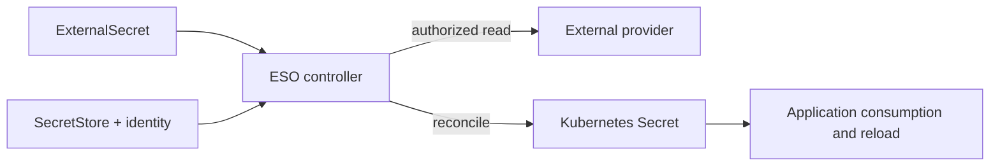
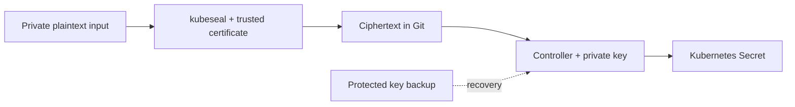

# Secrets Management

> **最終更新**: September 13, 2026

この章では、native Secret、ESO、AWS ストア、Sealed Secrets、Vault、SOPS の責任範囲と統合要件を分けて説明します。[完全なサンプルファイル](https://github.com/Atom-oh/kubernetes-docs/tree/main/examples/security/secrets-management)を使用してください。クラスタ/AWS のインストールおよび実際の認証情報ローテーションは実行していません。

## Table of Contents

- [Kubernetes Native Secrets](#kubernetes-native-secrets)
- [Encryption, Updates and Audit Boundaries](#encryption-updates-and-audit-boundaries)
- [External Secrets Operator (ESO)](#external-secrets-operator-eso)
- [PushSecret (Reverse Sync)](#pushsecret-reverse-sync)
- [AWS Secrets Manager Integration](#aws-secrets-manager-integration)
- [AWS Systems Manager Parameter Store Integration](#aws-systems-manager-parameter-store-integration)
- [Sealed Secrets](#sealed-secrets)
- [HashiCorp Vault Integration](#hashicorp-vault-integration)
- [Vault CSI Driver and Argo CD Vault Plugin](#vault-csi-driver-and-argo-cd-vault-plugin)
- [SOPS (Secrets OPerationS)](#sops-secrets-operations)
- [EKS Pod Identity and IRSA](#eks-pod-identity-and-irsa)
- [Tool Comparison](#tool-comparison)
- [Best Practices](#best-practices)
- [Summary](#summary)
- [References](#references)

## Kubernetes Native Secrets {#kubernetes-native-secrets}

### Secret Overview

Secret は、アクセス制御、ストレージ、消費に関するセマンティクスを持つ API オブジェクトです。
JSON/YAML の `data` 表現には Base64 が使用されますが、エンコードは暗号化ではありません。
`stringData` は平文入力を受け取り、`data` にマージされます。これはより強力な
保護メカニズムではなく、server-side apply とも適切に連携しません。実際の認証情報を追跡対象のマニフェスト、シェル履歴、ログに書き込まないでください。

### Secret Types

| Type | Purpose |
|---|---|
| `Opaque` | Application-defined values |
| `kubernetes.io/service-account-token` | Explicitly created legacy long-lived token; prefer TokenRequest/projected short-lived tokens |
| `kubernetes.io/dockerconfigjson` | Registry credentials |
| `kubernetes.io/basic-auth` / `kubernetes.io/ssh-auth` | Basic or SSH authentication data |
| `kubernetes.io/tls` | Certificate and private key |

### Creating Secrets

保護されたファイルと明示的な namespace を使用します。パスは、承認済みの認証情報プロセスを通じて提供されたファイルに置き換えてください。これらのコマンドでは結果の Secret は表示されませんが、オペレーターには引き続き適切な Kubernetes アクセスが必要です。

```bash
kubectl -n production create secret generic db-credentials   --from-file=username=/secure/input/username   --from-file=password=/secure/input/password   --from-file=host=/secure/input/host
kubectl -n production create secret generic ssh-key   --type=kubernetes.io/ssh-auth   --from-file=ssh-privatekey=/secure/input/id_rsa
kubectl -n production create secret tls app-tls   --cert=/secure/input/tls.crt --key=/secure/input/tls.key
kubectl -n production create secret generic regcred   --type=kubernetes.io/dockerconfigjson   --from-file=.dockerconfigjson=/secure/input/docker-config.json
```

リテラルフラグは**機密でないフィクスチャ**には便利ですが、コマンド引数内の実際のパスワードは履歴やプロセス検査に現れる可能性があります。

### Using Secrets

`secretKeyRef` は 1 つのキーを選択し、`envFrom.secretRef` はすべてのキーをインポートします。環境変数はすでに実行中のコンテナでは更新されません。マウントされた Secret ボリュームは通常、最終的には更新されますが、`subPath` マウントはその更新を受け取りません。アプリケーションは必要に応じてファイルを再オープン/再ロードする必要があります。同期は再ロードではありません。

次のマニフェストは、非 root のアプリケーショングループが読み取り可能なファイルを提供します。アプリケーションイメージは明示的な置き換え用プレースホルダーであり、実行していません。アプリケーションの ServiceAccount は、マウントされた Secret を消費するだけであれば Secret の `get` 権限を必要としません。kubelet がマウントを実行するためです。ただし、Pod を作成する権限により、namespace の Secret へ間接的にアクセスできる可能性があります。

```yaml
# Replace the image with a reviewed application that reads /etc/app-secrets.
# This Pod is a manifest example; it was not started.
apiVersion: v1
kind: Pod
metadata:
  name: secret-file-consumer
  namespace: production
spec:
  automountServiceAccountToken: false
  securityContext:
    runAsNonRoot: true
    runAsUser: 10001
    runAsGroup: 10001
    fsGroup: 10001
    seccompProfile:
      type: RuntimeDefault
  containers:
    - name: app
      image: registry.example.com/team/app:replace-with-reviewed-tag
      securityContext:
        allowPrivilegeEscalation: false
        readOnlyRootFilesystem: true
        capabilities:
          drop: [ALL]
      volumeMounts:
        - name: secrets
          mountPath: /etc/app-secrets
          readOnly: true
  volumes:
    - name: secrets
      secret:
        secretName: db-credentials
        defaultMode: 0440
        items:
          - key: username
            path: username
          - key: password
            path: password
          - key: host
            path: host
```

## Encryption, Updates and Audit Boundaries {#encryption-updates-and-audit-boundaries}

### Limitations of Secrets

- Upstream の自己管理 Kubernetes には、適切な保存時暗号化構成が必要です。**EKS 1.28+ では、AWS 所有の KMS キーによるすべての Kubernetes API データの envelope encryption がデフォルトで有効**であり、customer-managed key のオプションもあります。
- 保存時暗号化は、認可済みの API リーダー、侵害されたアプリケーション、または Secret を消費する Pod の作成を許可されたプリンシパルを阻止しません。
- `immutable: true` は Secret の**データ**を固定しますが、すべてのメタデータを固定するものではありません。また、mutable に戻すことはできません。稼働中の依存関係を削除するのではなく、新しい Secret 名と制御されたワークロードのロールアウトを推奨します。
- プロバイダー認証情報のローテーション、Secret の更新、ファイルの伝播、アプリケーションの再ロードは別個の操作です。
- API 監査イベントには Secret へのアクセスが記録される場合があります。監査先を保護し、Secret のリクエスト/レスポンス本文をログに記録しないでください。マウント済みファイルの読み取りは、アプリケーションの読み取りごとに 1 つの API 監査イベントとなるわけではありません。

### etcd Encryption Configuration

`EncryptionConfiguration` ファイルは**自己管理 API server**用であり、EKS managed control plane にインストールできるファイルではありません。複数のプロバイダーがある場合、最初のプロバイダーが新規書き込みを暗号化し、後続のプロバイダーは既存データの復号をサポートします。`identity` は平文の読み取りを許可するため、意図せず最初のプロバイダーとして平文書き込みポリシーにならないようにする必要があります。

自己管理 KMS v2 統合では、実際のプラグインソケット、可用性、キーライフサイクルを Kubernetes のドキュメントに従って構成してください。以前の例は AES-CBC、KMS v1 形式のキャッシュ、EKS ラベルを混在させており、EKS のインストール手順ではありませんでした。暗号化を有効にしても、既存の保存済みオブジェクトがすべて自動的に再書き込みされるわけではありません。バックアップ、移行、検証の手順に従ってください。


## External Secrets Operator (ESO) {#external-secrets-operator-eso}

### ESO Overview

ESO は外部の値を Kubernetes Secret に調整します。Store リソースはプロバイダーアクセスを記述し、controller が呼び出しを実行します。SecretStore は独立して実行されるプロキシではありません。



### ESO Installation

固定されたベースラインは chart/application の**2.10.0**です。Helm が宣言する Kubernetes 制約は、すべての EKS/add-on の組み合わせに対する互換性テストではありません。

```bash
helm repo add external-secrets https://charts.external-secrets.io
helm repo update external-secrets
helm upgrade --install external-secrets external-secrets/external-secrets   --version 2.10.0 --namespace external-secrets --create-namespace   --values eso-values.yaml
```

提供される values は、デフォルトで PushSecret の調整を無効にします。Chart RBAC は controller 管理権限です。namespace スコープのストアだけでは、cluster-wide controller をテナント分離境界に変えることはできません。

### SecretStore Configuration

次の完全なリソースセットは IRSA を使用します。最初に IAM role/trust を作成してください。参照される ServiceAccount は SecretStore と同じ namespace である **production** にあります。ClusterSecretStore では、代わりに `serviceAccountRef` に明示的な namespace が必要です。また、共有ストアを使用できる namespace も制限してください。

### ExternalSecret Definition

現在の SecretStore/ExternalSecret の例では `external-secrets.io/v1` を使用します。`Periodic` はデフォルトの更新ポリシーです。正の `refreshInterval` は調整をスケジュールしますが、プロバイダーエラー/バックオフがあるため配信期限ではありません。`OnChange` と `CreatedOnce` のトリガーは異なります。`creationPolicy: Owner` は Kubernetes owner reference に影響します。`deletionPolicy: Retain` はプロバイダー削除の処理を説明するものであり、ExternalSecret のあらゆる削除からの保護を意味するものではありません。

明示的なキー選択により、意図しない露出を制限できます。`dataFrom.extract` は、意図した場合にすべてのプロパティをインポートできます。テンプレートでは構造化された値をエスケープする必要があります。パスワードを PostgreSQL URL に直接挿入すると、URL 構文が破損する可能性があります。個別のフィールドとアプリケーションの接続ビルダーを推奨します。

```yaml
apiVersion: v1
kind: Namespace
metadata:
  name: production
---
apiVersion: v1
kind: ServiceAccount
metadata:
  name: external-secrets-reader
  namespace: production
  annotations:
    eks.amazonaws.com/role-arn: arn:aws:iam::123456789012:role/production-secret-reader
---
apiVersion: external-secrets.io/v1
kind: SecretStore
metadata:
  name: aws-secretsmanager
  namespace: production
spec:
  provider:
    aws:
      service: SecretsManager
      region: ap-northeast-2
      auth:
        jwt:
          serviceAccountRef:
            name: external-secrets-reader
---
apiVersion: external-secrets.io/v1
kind: ExternalSecret
metadata:
  name: database-credentials
  namespace: production
spec:
  refreshPolicy: Periodic
  refreshInterval: 1h
  secretStoreRef:
    name: aws-secretsmanager
    kind: SecretStore
  target:
    name: db-credentials
    creationPolicy: Owner
    deletionPolicy: Retain
  data:
    - secretKey: username
      remoteRef:
        key: production/database
        property: username
    - secretKey: password
      remoteRef:
        key: production/database
        property: password
    - secretKey: host
      remoteRef:
        key: production/database
        property: host
```

## PushSecret (Reverse Sync) {#pushsecret-reverse-sync}

PushSecret は、上記の読み取り専用の例には含まれない、別個の逆方向書き込み機能です。バージョン **2.10.0** では依然として API が `external-secrets.io/v1alpha1` として公開されています。すべての ESO リソースを盲目的に v1 へ変更するのではなく、インストール済みの CRD を確認してください。

有効にする前に、別個の writer identity、許可するリモートキー、`updatePolicy`、`deletionPolicy` を選択してください。そうしない場合、ローカル Kubernetes の書き込みによって、他のシステムで使用される認証情報が上書きされる可能性があります。同じキーで pull/push のフィードバックループを避けてください。ストアの読み取り権限は、プロバイダーへの書き込み権限を付与しません。


## AWS Secrets Manager Integration {#aws-secrets-manager-integration}

### IRSA Setup

提供される `irsa-trust.json` は、正確な cluster OIDC issuer、`aud`、および `system:serviceaccount:production:external-secrets-reader` subject をバインドします。使用前に、例の account/OIDC ID を置き換え、IAM OIDC provider を作成してください。

`aws-reader-policy.json` は 1 つの Secrets Manager secret と 1 つの SSM parameter を読み取ります。6 つの `?` 文字はサービス生成の secret ARN suffix をカバーします。利用可能な場合は実際の ARN を使用してください。`ListSecrets`、ワイルドカード検出、認証情報の書き込み、ローテーションは許可しません。customer-managed KMS キーには、適切に制限された復号 grant **と**互換性のある KMS key policy が必要です。

### Creating Secrets in AWS Secrets Manager

認証情報のペイロードはプライベートファイルに保持してください。次の操作はオペレーターの例であり、AWS に対して実行していません。

```bash
aws secretsmanager create-secret --region ap-northeast-2   --name production/database --secret-string file:///secure/input/database.json
aws secretsmanager put-secret-value --region ap-northeast-2   --secret-id production/database --secret-string file:///secure/input/database-next.json
```

保存されたパスワードのみを更新しても、データベースのパスワードは更新されません。Secrets Manager には managed-rotation 統合と Lambda ベースのローテーションがあります。Lambda のレシピには、サポートされるローテーション関数、権限、ネットワークアクセス、ターゲット認証情報の更新ロジックが必要です。コマンド内に ARN と 30 日のスケジュールがあるだけで自動化されるわけではありません。

### Complete AWS ESO Example

一致する trust と reader policy で上記のリソースセットを使用してください。結果の値を表示せずに、SecretStore と ExternalSecret の準備完了を待ちます。

```bash
kubectl -n production wait secretstore/aws-secretsmanager   --for=condition=Ready --timeout=120s
kubectl -n production wait externalsecret/database-credentials   --for=condition=Ready --timeout=120s
```

最初の同期が成功しても、その後のローテーション/再ロードが成功することは証明されません。承認済みのテストを使用して、プロバイダーバージョン、調整ステータス、アプリケーション認証を検証してください。native Secret を消費するワークロードは、ESO role を継承する必要がありません。

```json
{
  "Version": "2012-10-17",
  "Statement": [
    {
      "Sid": "ReadOneSecret",
      "Effect": "Allow",
      "Action": ["secretsmanager:GetSecretValue", "secretsmanager:DescribeSecret"],
      "Resource": "arn:aws:secretsmanager:ap-northeast-2:123456789012:secret:production/database-??????",
      "Condition": {"StringEquals": {"aws:RequestedRegion": "ap-northeast-2"}}
    },
    {
      "Sid": "ReadOneParameter",
      "Effect": "Allow",
      "Action": ["ssm:GetParameter", "ssm:GetParameters"],
      "Resource": "arn:aws:ssm:ap-northeast-2:123456789012:parameter/production/api/key",
      "Condition": {"StringEquals": {"aws:RequestedRegion": "ap-northeast-2"}}
    }
  ]
}
```

## AWS Systems Manager Parameter Store Integration {#aws-systems-manager-parameter-store-integration}

### Parameter Store Setup

`SecureString` と選択した KMS key を使用してください。CLI 入力には、プライベートな `--cli-input-json file:///secure/input/parameter.json` を使用すると、値を引数に含めずに済みます。ファイルには、実際の `Name`、`Value`、`Type`、および意図した上書き/キー設定が含まれている必要があります。`get-parameter --with-decryption` を通常のステータス確認コマンドとして使用しないでください。平文を返します。

KMS 権限は、AWS-managed の `aws/ssm` キーと customer managed key で異なります。Parameter Store の認可、KMS の認可、パス階層がすべて一致する必要があります。広範な再帰的パス読み取りは、子 parameter を露出させる可能性があります。

### ESO Parameter Store Configuration

これは明示的に作成した production ServiceAccount を再利用します。reader policy には指定された parameter が含まれます。Secret Manager 権限だけでは SSM をカバーしません。

```yaml
apiVersion: external-secrets.io/v1
kind: SecretStore
metadata:
  name: aws-parameter-store
  namespace: production
spec:
  provider:
    aws:
      service: ParameterStore
      region: ap-northeast-2
      auth:
        jwt:
          serviceAccountRef:
            name: external-secrets-reader
---
apiVersion: external-secrets.io/v1
kind: ExternalSecret
metadata:
  name: ssm-parameters
  namespace: production
spec:
  refreshPolicy: Periodic
  refreshInterval: 1h
  secretStoreRef:
    name: aws-parameter-store
    kind: SecretStore
  target:
    name: app-config
    creationPolicy: Owner
    deletionPolicy: Retain
  data:
    - secretKey: api-key
      remoteRef:
        key: /production/api/key
```

## Sealed Secrets {#sealed-secrets}

### Sealed Secrets Overview

公開証明書が暗号化を行います。適切な秘密鍵を保持する者は、認可されたバックアップ/リカバリーオペレーターを含め、誰でも復号できます。controller は数学的に可能な唯一の復号者ではありません。名前やその他のメタデータは可視のままであり、侵害された古いキーは Git 履歴に保持された暗号文を露出させる可能性があります。



### Sealed Secrets Installation

chart **2.20.0**、controller/CLI **0.40.0** を使用してください。古い `bitnami-labs.github.io/sealed-secrets` インデックスは、このレビュー中に 404 を返しました。

```bash
helm repo add sealed-secrets https://bitnami.github.io/sealed-secrets
helm repo update sealed-secrets
helm upgrade --install sealed-secrets sealed-secrets/sealed-secrets   --version 2.20.0 --namespace kube-system   --set-string fullnameOverride=sealed-secrets-controller
```

OS/architecture に一致する CLI リリースを選択し、インストール前に公開済みチェックサムを検証してください。Linux arm64 の CLI/crypto の動作はローカルでテストしました。

### Creating SealedSecrets

意図した認証済みクラスタコンテキストから証明書を取得し、その出所を検証してください。攻撃者に置き換えられた証明書による暗号化は安全ではありません。

```bash
kubeseal --fetch-cert --controller-name=sealed-secrets-controller   --controller-namespace=kube-system > sealed-secrets-pub.pem
kubectl -n production create secret generic app-sealed   --from-file=password=/secure/input/password --dry-run=client -o json   | kubeseal --cert sealed-secrets-pub.pem --scope strict --format yaml   > sealed-secret.yaml
```

パイプラインは `set -o pipefail` で実行し、信頼済みアーティファクトを置き換える前にプライベートな一時ファイルを介して出力を書き込んでください。コミットする前に成功を確認してください。

### SealedSecret YAML

実際に生成された `bitnami.com/v1alpha1` SealedSecret を使用してください。`...` で終わる文字列は説明用であり、復号可能な暗号文ではありません。メタデータと template の名前/namespace を一貫させてください。

### Scope Settings

`strict` は namespace と名前をバインドし、`namespace-wide` は namespace 内での名前変更を許可し、`cluster-wide` は他の namespace での使用を許可します。より広いスコープは、そのアクセスを意図する場合にのみ選択してください。各暗号化コマンドに証明書/入力/出力を指定してください。`kubeseal --scope` 単体は完全なワークフローではありません。

### Key Rotation

シーリングキーは controller の構成済みスケジュール（デフォルト 30 日）で更新されます。古いキーは復号用に保持されます。これはアプリケーションのパスワードをローテーションするものではありません。**必要なすべての過去のシーリングキー**のバックアップを、プライベートなファイル権限と Git 外部のストレージで保護してください。`kubeseal --re-encrypt` は controller と現在のキーを使用します。再暗号化しても古い Git 暗号文が消去されたり、すでに漏洩した認証情報が無効化されたりすることはありません。バックアップに依存する前にリカバリーをテストしてください。


## HashiCorp Vault Integration {#hashicorp-vault-integration}

### Vault Architecture

Vault の secret engine、認証、audit device は別個の機能です。Agent Injector、Vault CSI provider、Argo CD Vault Plugin は、異なる identity と配信パスを通じて Vault を消費します。AVP は Argo CD repo-server でマニフェストをレンダリングします。runtime Pod secret mount ではありません。

### Vault Installation (Helm)

chart **0.34.1** のデフォルトは Vault 2.0.4 です。この例では、server と injected Agent image を明示的に **2.1.0** に上書きします。chart の TLS 無効な開発用デフォルトを継承するのではなく、TLS を有効にします。

```bash
helm repo add hashicorp https://helm.releases.hashicorp.com
helm repo update hashicorp
helm upgrade --install vault hashicorp/vault --version 0.34.1   --namespace vault --create-namespace --values vault-values.yaml
```

values は**レンダリング専用のベースライン**であり、本番環境対応のインストールではありません。使用前に、service/Pod endpoint に一致する SAN を備えた key、certificate、CA を含む `vault-server-tls`、動作する gp3 StorageClass、配置/リソース、ネットワークアクセス、初期化/unseal、Raft 参加、バックアップ/リカバリーを用意してください。3 つの Pod があっても、機能する 3 メンバーの quorum を証明するものではありません。`auditStorage` はストレージをマウントするだけです。Vault audit device は別途構成してください。

開発モードでは便利な初期化/unseal 動作が維持されるため、隔離されたローカルテストのままにする必要があります。レビューでは、HA や Kubernetes 認証の検証ではなく、JSON template のレンダリングをテストする目的だけで loopback dev-TLS を使用しました。

### Kubernetes Authentication Setup

Kubernetes 内で実行される Vault では、サポート対象の Vault バージョンがローカルの projected reviewer token を再読み込みできます。短命トークンを `token_reviewer_jwt` に貼り付け、それが永続的に更新されると想定しないでください。Vault ServiceAccount には、意図した TokenReview 認可（一般的にはレビュー済みの `system:auth-delegator` binding）が必要です。

正確なパスの policy を作成し、`production/app-sa` をバインドして、例では projected token と `audience=vault` を使用してください。実際の API server と信頼された CA を構成します。KV v2 mount の有効化、そのパスへの値の設定、オペレーターの認証が前提条件です。サンプルはこれらを自動的には作成しません。

```hcl
path "secret/data/production/config" {
  capabilities = ["read"]
}
```

### Vault Agent Injector

シェルの `export` 文ではなく、構造化された JSON を書き込みます。引用符、改行、`$()` を含むパスワードもデータのままにしなければなりません。`/bin/sh` も `source` コマンドを普遍的にサポートしているわけではありません。提供される例では Agent 用に専用の audience token を使用し、デフォルトのアプリケーション API token は使用しません。

アプリケーションは `/vault/secrets/config.json` を解析し、適切なタイミングで再ロードする必要があります。新しい静的 KV データのレンダリングは自動的なアプリケーション再ロードではなく、dynamic lease には独自の更新/期限切れ動作があります。

```yaml
# Requires a configured Vault Kubernetes auth role, KV v2 path and trusted CA.
# The application must parse JSON and reopen the file on refresh.
apiVersion: v1
kind: ServiceAccount
metadata:
  name: app-sa
  namespace: production
---
apiVersion: apps/v1
kind: Deployment
metadata:
  name: secret-json-consumer
  namespace: production
spec:
  replicas: 1
  selector:
    matchLabels:
      app: secret-json-consumer
  template:
    metadata:
      labels:
        app: secret-json-consumer
      annotations:
        vault.hashicorp.com/agent-inject: "true"
        vault.hashicorp.com/role: app-role
        vault.hashicorp.com/agent-service-account-token-volume-name: vault-token
        vault.hashicorp.com/tls-secret: vault-client-ca
        vault.hashicorp.com/ca-cert: /vault/tls/ca.crt
        vault.hashicorp.com/agent-inject-secret-config.json: secret/data/production/config
        vault.hashicorp.com/agent-inject-template-config.json: |
          {{- with secret "secret/data/production/config" -}}
          {{ .Data.data | toJSON }}
          {{- end }}
    spec:
      serviceAccountName: app-sa
      automountServiceAccountToken: false
      volumes:
        - name: vault-token
          projected:
            sources:
              - serviceAccountToken:
                  path: token
                  audience: vault
                  expirationSeconds: 3600
      containers:
        - name: app
          image: registry.example.com/team/app:replace-with-reviewed-tag
```

## Vault CSI Driver and Argo CD Vault Plugin {#vault-csi-driver-and-argo-cd-vault-plugin}

### Vault CSI Driver

Secrets Store CSI Driver と Vault provider の両方をインストールしてください。Vault chart の `csi` フラグを有効にするだけでは、すべての依存関係はインストールされません。provider は SecretProviderClass と消費する Pod の identity を使用します。

信頼された CA を使用した HTTPS を使用してください。`vaultCACertPath` は provider Pod **内部**のファイルパスであるため、そこに CA をマウントします。アプリケーション Pod にのみ存在するパスでは不十分です。`audience`、auth mount、role を一貫して構成してください。例を動作させるために TLS 検証を回避しないでください。

オプションの `secretObjects` 同期には Driver の同期機能とボリュームをマウントする Pod が必要です。ローテーションには Driver のローテーションサポートとアプリケーションの再ロード戦略も必要です。同期された Secret をソースとする環境変数は、実行中のコンテナでは依然として更新されません。native AWS ASCP/CSI も別の選択肢です。そのプラットフォームと identity のサポートを個別に評価してください。

### ArgoCD Vault Plugin (AVP)

古い `argocd-cm.configManagementPlugins` メカニズムは、現在の Argo CD では廃止されています。repo-server **CMP sidecar** を構成し、その sidecar 内の `/home/argocd/cmp-server/config/plugin.yaml` に `argocd-plugin.yaml` を配置してください。この ConfigManagementPlugin 形式のドキュメントは **Kubernetes CRD ではありません**。

image には AVP **1.18.1** とその依存関係が含まれている必要があります。バージョン指定の plugin 選択では、Application source で `argocd-vault-plugin-v1.18.1` を使用します。Argo CD ガイドに従って、sidecar の Vault 認証、CA、検出または明示的な選択、共有 socket、隔離された一時ディレクトリを構成してください。

`<password>` のような AVP プレースホルダーは、マニフェスト生成中に解決されます。復号された値は Argo CD のレンダリング/cache/API パスを通過します。repo と application のアクセスを制限し、debug 出力でマニフェストが露出しないようにしてください。


## SOPS (Secrets OPerationS) {#sops-secrets-operations}

### SOPS Overview

SOPS は、構成済みの age/PGP/KMS identity で保護されたデータキーを使用してファイル値を暗号化します。暗号化および復号する権利は、Git アクセスとは別のものです。テスト済みのベースラインは **SOPS 3.13.3 / age 1.3.2** です。

### SOPS Installation and Setup

OS/architecture 用のチェックサム検証済みバイナリをインストールしてください。制限的な権限で repository 外部に age identity を生成し、その公開 recipient のみを `.sops.yaml` にコピーします。`AGE-SECRET-KEY-...` を Git に含めないでください。

```bash
umask 077
age-keygen -o /secure/keys/docs-age.key
age-keygen -y /secure/keys/docs-age.key
```

Kubernetes YAML ファイルでは、`encrypted_regex: '^(data|stringData)$'` によりリソースメタデータが保持されます。作成ルールでは**最初に一致するパスルール**が使用されます。構成キーは `kms` であり、`aws_kms` ではありません。重複しないパターンを選び、リダイレクト後の出力名だけでなく、実際に SOPS に渡されるパスをテストしてください。

`sops-config.example.yaml` を `.sops.yaml` にコピーし、公開 recipient を置き換え、そのディレクトリ外で実行する場合はその構成を明示的に使用してください。

```yaml
# Copy to .sops.yaml and replace the public age recipient before encryption.
# The private age identity stays outside the repository.
creation_rules:
  - path_regex: '(^|/)app-secret(\.enc)?\.yaml$'
    encrypted_regex: '^(data|stringData)$'
    age: REPLACE_WITH_YOUR_PUBLIC_AGE_RECIPIENT
```

### Encrypting Secrets with SOPS

recipient を構成した後、保護された入力ファイルを暗号化し、値を表示せずにローカルの往復処理を検証してください。

```bash
sops encrypt /secure/input/app-secret.yaml > app-secret.enc.yaml
SOPS_AGE_KEY_FILE=/secure/keys/docs-age.key   sops decrypt app-secret.enc.yaml > /secure/output/app-secret.yaml
SOPS_AGE_KEY_FILE=/secure/keys/docs-age.key sops edit app-secret.enc.yaml
```

`SOPS_AGE_KEY_FILE` の値は秘密鍵ではなくパスです。プライベートな権限とアトミックな出力処理を適用してください。そうしないと、コマンドの失敗により出力先が切り詰められた状態で残る可能性があります。エディターの一時ファイルやバックアップも保護が必要です。

### Encrypted File Format

生成された `sops` メタデータと MAC を保持してください。`ENC[...data:...]` の省略表現は、有効なデプロイ可能ファイルではありません。値が暗号化され、意図したメタデータが読み取り可能なままであることをテストしてください。復号が成功した場合は完全性を検証する必要があります。破損を回避するために MAC チェックを無効にしないでください。

### FluxCD SOPS Integration

既存の `flux-system/sops-age` Secret を、private identity ファイルから作成してください。キー名は `.agekey` で終わる必要があります。以下の Kustomization はその Secret と、すでに構成済みの GitRepository を参照します。Kubernetes/RBAC および Flux の復号権限は、引き続きセキュリティ境界です。

```yaml
# Create flux-system/sops-age from a private age.agekey file separately.
# Never put an actual AGE-SECRET-KEY value in a tracked manifest.
apiVersion: kustomize.toolkit.fluxcd.io/v1
kind: Kustomization
metadata:
  name: app
  namespace: flux-system
spec:
  interval: 10m
  path: ./k8s
  prune: true
  sourceRef:
    kind: GitRepository
    name: my-repo
  decryption:
    provider: sops
    secretRef:
      name: sops-age
```

### AWS KMS with SOPS

有効な KMS key ARN と制限された identity/key policy を使用してください。複数の recipient は通常、すべてのキーが復号を認可する必要があることを自動的に意味するのではなく、代替の復号者を提供します。threshold key group は別の機能です。`sops updatekeys` は recipient を変更し、`sops rotate` はファイルの data key をローテーションします。いずれもファイル内に保存されたアプリケーション/データベース認証情報を変更するものではありません。


## EKS Pod Identity and IRSA {#eks-pod-identity-and-irsa}

### IRSA (IAM Roles for Service Accounts)

IRSA は cluster OIDC provider と role trust policy を使用します。SDK は projected token を**一時的な AWS 認証情報**と交換します。認証情報なしで AWS を呼び出すわけではありません。サポート対象の SDK/default credential chain と正確な namespace/ServiceAccount binding を使用してください。環境変数/static 認証情報が優先される場合があります。

### EKS Pod Identity (New)

Pod Identity には、service trust principal `pods.eks.amazonaws.com`、`sts:AssumeRole`/`sts:TagSession`、サポート対象の SDK/platform、および association が必要です。IAM role 管理は引き続きあなたの責任です。agent は EKS Auto Mode に組み込まれています。重複してインストールしないでください。選択する前に、現在の Fargate、Windows、hybrid、その他の platform サポートを確認してください。

ESO では、**controller の** ServiceAccount を role に関連付けます。`SecretStore.auth.jwt.serviceAccountRef` は、別の Pod-Identity-associated ServiceAccount になりすますことはできません。したがって、以下の代替ストアでは `auth` を省略しています。IRSA の例と組み合わせて、ストア単位で同じ identity 境界を期待しないでください。

### IRSA vs Pod Identity Comparison

| Concern | IRSA | EKS Pod Identity |
|---|---|---|
| Trust | Cluster OIDC issuer, audience and subject | EKS service principal and configured conditions/session tags |
| Binding | ServiceAccount annotation | EKS association for exact cluster/namespace/ServiceAccount |
| Credentials | Temporary STS credentials | Temporary credentials delivered through the supported agent/SDK path |
| Selection | Platform support and existing trust/operating model | Platform support, associations and operating model |

新しいクラスタか古いクラスタかという年数だけでは、選択ルールになりません。

```yaml
# Alternative to IRSA. Associate the actual ESO controller ServiceAccount
# external-secrets/external-secrets-controller with a constrained Pod Identity role.
# This store intentionally has no auth.jwt.serviceAccountRef.
apiVersion: external-secrets.io/v1
kind: SecretStore
metadata:
  name: aws-controller-identity
  namespace: production
spec:
  provider:
    aws:
      service: SecretsManager
      region: ap-northeast-2
```

## Tool Comparison {#tool-comparison}

### Secrets Management Tool Comparison Table

| Tool | Responsibility | Key limitation |
|---|---|---|
| Native Secret | Kubernetes delivery object | Protect API/RBAC/storage and application consumption |
| ESO | Synchronize external values into Secrets | Sync is not provider credential rotation or app reload |
| Sealed Secrets | Public-key encryption for Git | Protect private/backup keys; renewal is not credential rotation |
| Vault | Engines, identity, leases and configured audit | Operate TLS, storage/quorum, unseal, policies and audit devices |
| SOPS | Encrypted files and recipient/data-key management | Secure decryptor identities and plaintext processing |

### Recommendations by Use Case

信頼できる情報源、ローテーション/再ロードのニーズ、platform サポート、チームの運用能力、災害復旧、コストに基づいて選択してください。Git には、値を含まない ESO reference、SealedSecret の暗号文、または SOPS の暗号文を保持できます。単一のツールだけでコンプライアンスを確立したり、すべての利用を自動的に監査可能にしたりすることはできません。


## Best Practices {#best-practices}

### 1. Secret Creation and Storage

実際の値と秘密鍵を Git、コマンド引数、build output から除外してください。暗号化されたアーティファクトをレビューし、意図しない平文や意図しない recipient が含まれていないか確認してください。

### 2. Principle of Least Privilege

API リーダーは、名前付き Secret に対する `get` に制限された Role を使用できます。mounted-file consumer は、マウントを読むだけであれば、そのような Role を必要としません。Pod 作成、exec/debug、controller 管理、外部プロバイダーアクセスも制限してください。namespace の分離は、これらの実際の認可境界によって裏付けられていなければなりません。

### 3. Secret Rotation

チェーン全体をテストしてください。ターゲット認証情報を変更し、プロバイダーバージョンを公開し、調整し、必要に応じてファイルを更新/再起動し、アプリケーションを再ロードし、認証を検証して、古い認証情報を安全に無効化します。タイマーだけでは、このチェーンが動作する証拠にはなりません。

### 4. Auditing and Monitoring

Falco syscall event には Kubernetes API audit field が自動的に含まれるわけではありません。Kubernetes audit rule には、適切な audit source/plugin と配信パイプラインが必要です。古い `kevt`/wildcard-list の例では、このセットアップは確立されませんでした。明示的な許可 identity、拒否/成功アクセスのセマンティクス、保護された出力を備えた、テスト済みの audit pipeline を推奨します。`in` リスト内で `*` で終わる文字列が、自動的に prefix match になるわけではありません。すべての kube-system ServiceAccount を認可済みの secret reader と分類しないでください。

### 5. Environment Separation

開発環境と本番環境には、別々のプロバイダーパス、制限された role、namespace store、運用 owner を使用してください。リソース名だけでは分離になりません。

## Summary {#summary}

Native Secret は、そのアクセス、ストレージ、消費、ライフサイクルが制御されている場合、有効な本番環境の配信オブジェクトであり続けます。外部ストアと暗号化ツールは追加の問題を解決しますが、Kubernetes/アプリケーションのセキュリティ要件を取り除くものではありません。

### Key Recommendations

定義された信頼できる情報源、最小権限、保護されたキー、検証済みのリカバリー、観測されたローテーション/再ロードプロセスを使用してください。ローカル検証の証跡は、本番デプロイメントの証明とは意図的に分離されています。


## References {#references}

- [Kubernetes Secrets](https://kubernetes.io/docs/concepts/configuration/secret/)
- [EKS default envelope encryption](https://docs.aws.amazon.com/eks/latest/userguide/envelope-encryption.html)
- [ESO AWS authentication](https://external-secrets.io/latest/provider/aws-access/)
- [ESO ExternalSecret refresh policies](https://external-secrets.io/latest/api/externalsecret/)
- [Sealed Secrets 0.40.0](https://github.com/bitnami/sealed-secrets/tree/v0.40.0)
- [Vault Kubernetes authentication](https://developer.hashicorp.com/vault/docs/auth/kubernetes)
- [Vault injector annotations](https://developer.hashicorp.com/vault/docs/deploy/kubernetes/injector/annotations)
- [Vault CSI configuration](https://developer.hashicorp.com/vault/docs/deploy/kubernetes/csi/configurations)
- [Argo CD CMP sidecars](https://argo-cd.readthedocs.io/en/stable/operator-manual/config-management-plugins/)
- [SOPS configuration](https://getsops.io/docs/usage/identities/config-file/)
- [Flux SOPS decryption](https://fluxcd.io/flux/components/kustomize/kustomizations/#decryption)
- [EKS Pod Identity](https://docs.aws.amazon.com/eks/latest/userguide/pod-identities.html)
