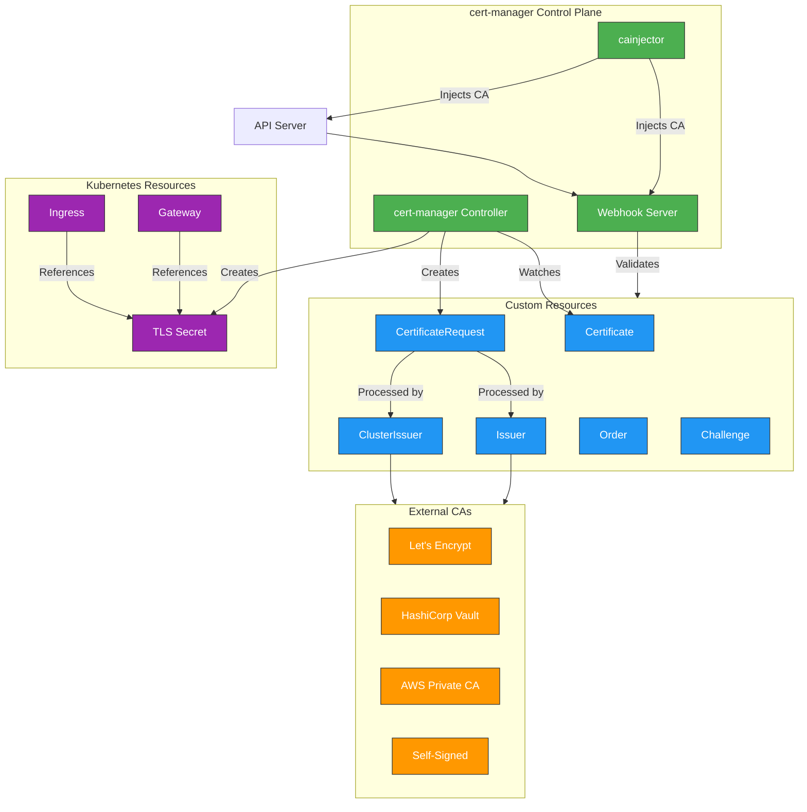
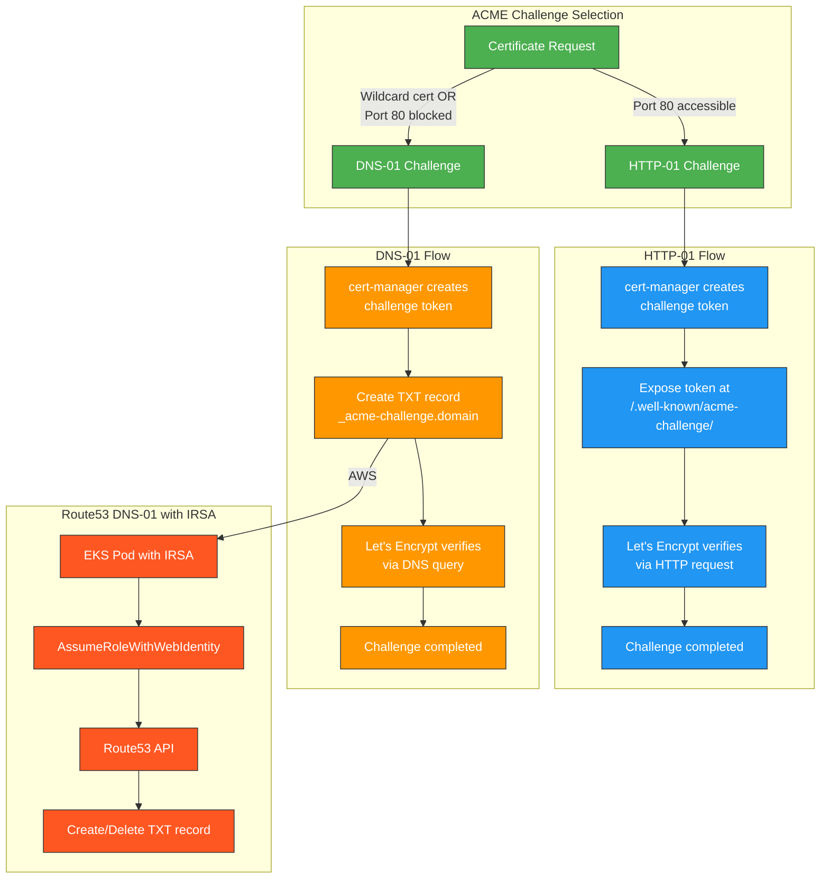
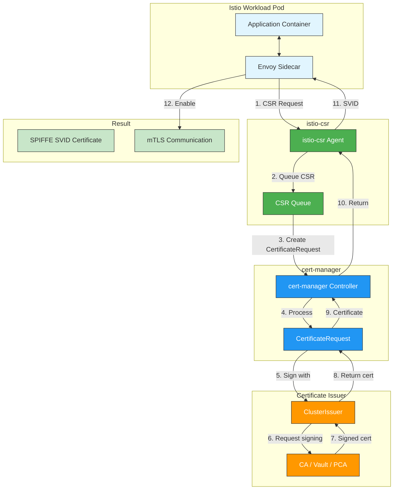

# Certificate Management with cert-manager

> **サポート対象バージョン**: cert-manager 1.16+, Kubernetes 1.31, 1.32, 1.33
> **最終更新**: July 13, 2026

cert-manager は、Kubernetes 向けの強力で拡張性の高い X.509 certificate controller です。Let's Encrypt、HashiCorp Vault、Venafi、private PKI systems など、さまざまなソースからの TLS certificates の管理と発行を自動化します。

## Table of Contents

1. [Overview](#overview)
2. [Architecture](#architecture)
3. [Installation](#installation)
4. [Core Concepts](#core-concepts)
5. [Issuer Types](#issuer-types)
6. [EKS Integration Patterns](#eks-integration-patterns)
7. [AWS-Native Alternative: ACM + ACK](#aws-native-alternative-acm--ack)
8. [Service Mesh Integration](#service-mesh-integration)
9. [trust-manager](#trust-manager)
10. [Monitoring and Troubleshooting](#monitoring-and-troubleshooting)
11. [Best Practices](#best-practices)
12. [Summary and References](#summary-and-references)

---

## Overview

### What cert-manager Solves

Kubernetes environments における手動の certificate management には、重要な運用上の課題があります。

| Challenge | Impact | cert-manager Solution |
|-----------|--------|----------------------|
| **Manual renewal** | 期限切れ certificates による Service outages | 期限切れ前の automatic renewal |
| **Inconsistent processes** | Security gaps と configuration drift | 宣言的な Certificate resources |
| **Key management** | Key exposure のリスク | Automatic key generation と rotation |
| **Multi-issuer complexity** | Operational overhead | すべての CA types に対する統一された interface |
| **GitOps incompatibility** | Secrets を version control できない | Certificate CRs は GitOps-friendly |

### Project Status

cert-manager は **CNCF Graduated project** であり、production-ready な成熟度を示しています。

- 初回リリース: 2017
- CNCF Sandbox: 2020
- CNCF Incubating: 2022
- CNCF Graduated: 2024
- Venafi、Red Hat、community からの active maintainers
- 10,000 を超える GitHub stars と幅広い production adoption

### Why Certificate Lifecycle Automation Matters

```
┌─────────────────────────────────────────────────────────────────────────┐
│              Certificate Lifecycle Without Automation                    │
├─────────────────────────────────────────────────────────────────────────┤
│                                                                         │
│  Day 1: Generate CSR → Day 2: Submit to CA → Day 3: Receive cert       │
│  Day 4: Configure application → Day 89: Forget about renewal           │
│  Day 90: Certificate expires → Day 90: Production outage!              │
│                                                                         │
├─────────────────────────────────────────────────────────────────────────┤
│              Certificate Lifecycle With cert-manager                     │
├─────────────────────────────────────────────────────────────────────────┤
│                                                                         │
│  Day 1: Apply Certificate CR → cert-manager handles everything         │
│  Day 60: Automatic renewal triggered → Zero intervention required      │
│  Day 90: New certificate active → No outage, no manual work            │
│                                                                         │
└─────────────────────────────────────────────────────────────────────────┘
```

---

## Architecture

### Component Overview

cert-manager は、certificate lifecycles を管理するために連携して動作する 3 つの主要 components で構成されています。



### Component Responsibilities

| Component | Responsibility | Key Functions |
|-----------|---------------|---------------|
| **Controller** | メイン reconciliation loop | Certificate CRs を監視し、CertificateRequests を作成し、発行済み certificates を保存する |
| **Webhook** | Admission control | cert-manager resources を検証および変更する |
| **cainjector** | CA bundle injection | CA certificates を webhooks と API server に注入する |

### Certificate Issuance Flow

```mermaid
flowchart LR
    subgraph User["User Action"]
        U[Create Certificate CR]
    end

    subgraph Controller["cert-manager Controller"]
        DETECT[Detect new Certificate]
        CREATECR[Create CertificateRequest]
        PROCESS[Process with Issuer]
        STORE[Store in Secret]
    end

    subgraph ACME["ACME Flow (if applicable)"]
        ORDER[Create Order]
        CHALLENGE[Create Challenge]
        SOLVE[Solve Challenge]
        FINALIZE[Finalize Order]
    end

    subgraph Output["Result"]
        SECRET[TLS Secret Created]
        READY[Certificate Ready]
    end

    U --> DETECT
    DETECT --> CREATECR
    CREATECR --> PROCESS

    PROCESS --> |ACME Issuer| ORDER
    ORDER --> CHALLENGE
    CHALLENGE --> SOLVE
    SOLVE --> FINALIZE
    FINALIZE --> STORE

    PROCESS --> |Non-ACME| STORE

    STORE --> SECRET
    SECRET --> READY

    classDef user fill:#E1F5FE,stroke:#333
    classDef controller fill:#4CAF50,stroke:#333,color:white
    classDef acme fill:#FF9800,stroke:#333,color:white
    classDef output fill:#C8E6C9,stroke:#333

    class U user
    class DETECT,CREATECR,PROCESS,STORE controller
    class ORDER,CHALLENGE,SOLVE,FINALIZE acme
    class SECRET,READY output
```



---

## Installation

### Prerequisites

cert-manager をインストールする前に、次を確認してください。

- Kubernetes cluster version 1.25+
- Cluster admin access で構成済みの `kubectl`
- Helm 3.x (Helm installation method の場合)

### Installation with Helm (Recommended)

```bash
# Add the Jetstack Helm repository
helm repo add jetstack https://charts.jetstack.io
helm repo update

# Install cert-manager with CRDs
helm install cert-manager jetstack/cert-manager \
  --namespace cert-manager \
  --create-namespace \
  --version v1.16.2 \
  --set crds.enabled=true \
  --set prometheus.enabled=true \
  --set webhook.timeoutSeconds=30
```

### Production Helm Values

```yaml
# cert-manager-values.yaml
crds:
  enabled: true
  keep: true

replicaCount: 2

podDisruptionBudget:
  enabled: true
  minAvailable: 1

resources:
  requests:
    cpu: 50m
    memory: 64Mi
  limits:
    cpu: 200m
    memory: 256Mi

prometheus:
  enabled: true
  servicemonitor:
    enabled: true
    namespace: monitoring

webhook:
  replicaCount: 2
  timeoutSeconds: 30
  resources:
    requests:
      cpu: 25m
      memory: 32Mi
    limits:
      cpu: 100m
      memory: 128Mi

cainjector:
  replicaCount: 2
  resources:
    requests:
      cpu: 25m
      memory: 64Mi
    limits:
      cpu: 100m
      memory: 256Mi

# For EKS with IRSA
serviceAccount:
  annotations:
    eks.amazonaws.com/role-arn: arn:aws:iam::ACCOUNT_ID:role/cert-manager-role

# Global settings
global:
  leaderElection:
    namespace: cert-manager
  logLevel: 2
```

```bash
# Install with custom values
helm install cert-manager jetstack/cert-manager \
  --namespace cert-manager \
  --create-namespace \
  --version v1.16.2 \
  -f cert-manager-values.yaml
```

### Installation with kubectl

```bash
# Install cert-manager manifests (includes CRDs)
kubectl apply -f https://github.com/cert-manager/cert-manager/releases/download/v1.16.2/cert-manager.yaml

# Verify installation
kubectl get pods -n cert-manager
```

### Verify Installation

```bash
# Check all pods are running
kubectl get pods -n cert-manager

# Expected output:
# NAME                                       READY   STATUS    RESTARTS   AGE
# cert-manager-5d7f97b46d-xxxxx              1/1     Running   0          2m
# cert-manager-cainjector-7f694c4c58-xxxxx   1/1     Running   0          2m
# cert-manager-webhook-7cd8c769bb-xxxxx      1/1     Running   0          2m

# Check CRDs are installed
kubectl get crd | grep cert-manager

# Expected output:
# certificaterequests.cert-manager.io
# certificates.cert-manager.io
# challenges.acme.cert-manager.io
# clusterissuers.cert-manager.io
# issuers.cert-manager.io
# orders.acme.cert-manager.io

# Test with cmctl (optional)
# Install cmctl: https://cert-manager.io/docs/reference/cmctl/
cmctl check api
```

---

## Core Concepts

### Custom Resource Definitions (CRDs)

cert-manager は、certificate lifecycle を管理するための複数の CRDs を導入します。

| CRD | Scope | Purpose |
|-----|-------|---------|
| **Certificate** | Namespaced | 目的の certificate properties を宣言する |
| **CertificateRequest** | Namespaced | Issuer に紐づく CSR を表す |
| **Issuer** | Namespaced | Certificates の取得方法を定義する (namespace-scoped) |
| **ClusterIssuer** | Cluster | Certificates の取得方法を定義する (cluster-wide) |
| **Order** | Namespaced | ACME order を表す |
| **Challenge** | Namespaced | ACME challenge を表す |

### Certificate Resource

Certificate resource は、certificates を要求するための主要 interface です。

```yaml
apiVersion: cert-manager.io/v1
kind: Certificate
metadata:
  name: example-com-tls
  namespace: default
spec:
  # Secret where the certificate will be stored
  secretName: example-com-tls-secret

  # Certificate duration (default: 2160h = 90 days)
  duration: 2160h

  # Renewal window (default: 360h = 15 days before expiry)
  renewBefore: 360h

  # Subject fields
  subject:
    organizations:
      - Example Inc

  # Common name (deprecated, use dnsNames)
  commonName: example.com

  # Private key settings
  privateKey:
    algorithm: RSA
    size: 2048
    rotationPolicy: Always

  # Usages
  usages:
    - digital signature
    - key encipherment
    - server auth

  # DNS names for the certificate
  dnsNames:
    - example.com
    - www.example.com
    - api.example.com

  # IP addresses (optional)
  ipAddresses:
    - 192.168.1.1

  # Reference to the issuer
  issuerRef:
    name: letsencrypt-prod
    kind: ClusterIssuer
    group: cert-manager.io
```

### Issuer vs ClusterIssuer

```yaml
# Issuer - namespace-scoped
apiVersion: cert-manager.io/v1
kind: Issuer
metadata:
  name: ca-issuer
  namespace: my-namespace  # Only usable in this namespace
spec:
  ca:
    secretName: ca-key-pair

---
# ClusterIssuer - cluster-wide
apiVersion: cert-manager.io/v1
kind: ClusterIssuer
metadata:
  name: letsencrypt-prod  # No namespace, available cluster-wide
spec:
  acme:
    server: https://acme-v02.api.letsencrypt.org/directory
    email: admin@example.com
    privateKeySecretRef:
      name: letsencrypt-prod-account-key
    solvers:
      - http01:
          ingress:
            class: nginx
```

### CertificateRequest Resource

CertificateRequests は通常、cert-manager によって自動的に作成されます。

```yaml
apiVersion: cert-manager.io/v1
kind: CertificateRequest
metadata:
  name: example-com-tls-xxxxx
  namespace: default
spec:
  # Base64-encoded CSR
  request: LS0tLS1CRUdJTi...

  # Reference to the issuer
  issuerRef:
    name: letsencrypt-prod
    kind: ClusterIssuer
    group: cert-manager.io

  # Requested duration
  duration: 2160h

  # Usages
  usages:
    - digital signature
    - key encipherment
    - server auth
```

---

## Issuer Types

### SelfSigned Issuer (Development/Testing)

Self-signed certificates は、development および testing environments で役立ちます。

```yaml
apiVersion: cert-manager.io/v1
kind: ClusterIssuer
metadata:
  name: selfsigned-issuer
spec:
  selfSigned: {}

---
# Create a self-signed CA certificate
apiVersion: cert-manager.io/v1
kind: Certificate
metadata:
  name: selfsigned-ca
  namespace: cert-manager
spec:
  isCA: true
  commonName: selfsigned-ca
  secretName: selfsigned-ca-secret
  privateKey:
    algorithm: ECDSA
    size: 256
  issuerRef:
    name: selfsigned-issuer
    kind: ClusterIssuer
    group: cert-manager.io
```

### CA Issuer (Internal PKI)

独自の internal Certificate Authority を持つ組織向けです。

```yaml
# First, create a Secret with the CA certificate and key
apiVersion: v1
kind: Secret
metadata:
  name: ca-key-pair
  namespace: cert-manager
type: kubernetes.io/tls
data:
  tls.crt: LS0tLS1CRUdJTi...  # Base64-encoded CA certificate
  tls.key: LS0tLS1CRUdJTi...  # Base64-encoded CA private key

---
apiVersion: cert-manager.io/v1
kind: ClusterIssuer
metadata:
  name: ca-issuer
spec:
  ca:
    secretName: ca-key-pair

---
# Request a certificate from the CA issuer
apiVersion: cert-manager.io/v1
kind: Certificate
metadata:
  name: internal-service-tls
  namespace: default
spec:
  secretName: internal-service-tls-secret
  duration: 8760h  # 1 year
  renewBefore: 720h  # 30 days
  dnsNames:
    - internal-service.default.svc.cluster.local
    - internal-service.default.svc
    - internal-service
  issuerRef:
    name: ca-issuer
    kind: ClusterIssuer
```

### ACME / Let's Encrypt

ACME (Automatic Certificate Management Environment) は、Let's Encrypt やその他の ACME-compatible CAs とともに使用されます。

#### ACME Challenge Types



#### HTTP-01 Solver

```yaml
apiVersion: cert-manager.io/v1
kind: ClusterIssuer
metadata:
  name: letsencrypt-prod
spec:
  acme:
    # Let's Encrypt production server
    server: https://acme-v02.api.letsencrypt.org/directory

    # Email for certificate expiry notifications
    email: admin@example.com

    # Secret to store the ACME account private key
    privateKeySecretRef:
      name: letsencrypt-prod-account-key

    # HTTP-01 solver configuration
    solvers:
      - http01:
          ingress:
            class: nginx
            # Or specify a specific ingress name
            # ingressTemplate:
            #   metadata:
            #     annotations:
            #       kubernetes.io/ingress.class: nginx
```

#### DNS-01 Solver with Route53 and IRSA

```yaml
# IAM Policy for cert-manager (create via AWS CLI or Terraform)
# {
#   "Version": "2012-10-17",
#   "Statement": [
#     {
#       "Effect": "Allow",
#       "Action": "route53:GetChange",
#       "Resource": "arn:aws:route53:::change/*"
#     },
#     {
#       "Effect": "Allow",
#       "Action": [
#         "route53:ChangeResourceRecordSets",
#         "route53:ListResourceRecordSets"
#       ],
#       "Resource": "arn:aws:route53:::hostedzone/HOSTED_ZONE_ID"
#     },
#     {
#       "Effect": "Allow",
#       "Action": "route53:ListHostedZonesByName",
#       "Resource": "*"
#     }
#   ]
# }

---
apiVersion: cert-manager.io/v1
kind: ClusterIssuer
metadata:
  name: letsencrypt-dns01
spec:
  acme:
    server: https://acme-v02.api.letsencrypt.org/directory
    email: admin@example.com
    privateKeySecretRef:
      name: letsencrypt-dns01-account-key
    solvers:
      # DNS-01 solver for Route53
      - selector:
          dnsZones:
            - "example.com"
        dns01:
          route53:
            region: us-east-1
            hostedZoneID: Z1234567890ABC
            # Using IRSA - no credentials needed in the spec
            # cert-manager ServiceAccount must have the IAM role annotation

---
# Wildcard certificate (only possible with DNS-01)
apiVersion: cert-manager.io/v1
kind: Certificate
metadata:
  name: wildcard-example-com
  namespace: default
spec:
  secretName: wildcard-example-com-tls
  dnsNames:
    - "example.com"
    - "*.example.com"
  issuerRef:
    name: letsencrypt-dns01
    kind: ClusterIssuer
```

### AWS Private CA Issuer

AWS Private Certificate Authority が必要な enterprise environments 向けです。

```bash
# Install AWS PCA Issuer
helm repo add awspca https://cert-manager.github.io/aws-privateca-issuer
helm install aws-pca-issuer awspca/aws-privateca-issuer \
  --namespace cert-manager \
  --set serviceAccount.annotations."eks\.amazonaws\.com/role-arn"=arn:aws:iam::ACCOUNT_ID:role/aws-pca-issuer-role
```

```yaml
# IAM Policy for AWS PCA Issuer
# {
#   "Version": "2012-10-17",
#   "Statement": [
#     {
#       "Effect": "Allow",
#       "Action": [
#         "acm-pca:IssueCertificate",
#         "acm-pca:GetCertificate",
#         "acm-pca:DescribeCertificateAuthority"
#       ],
#       "Resource": "arn:aws:acm-pca:REGION:ACCOUNT_ID:certificate-authority/CA_ID"
#     }
#   ]
# }

---
apiVersion: awspca.cert-manager.io/v1beta1
kind: AWSPCAClusterIssuer
metadata:
  name: aws-pca-issuer
spec:
  arn: arn:aws:acm-pca:us-east-1:123456789012:certificate-authority/xxxxxxxx-xxxx-xxxx-xxxx-xxxxxxxxxxxx
  region: us-east-1

---
apiVersion: cert-manager.io/v1
kind: Certificate
metadata:
  name: internal-mtls-cert
  namespace: default
spec:
  secretName: internal-mtls-tls
  duration: 8760h
  renewBefore: 720h
  commonName: service.internal.example.com
  dnsNames:
    - service.internal.example.com
  usages:
    - digital signature
    - key encipherment
    - server auth
    - client auth  # For mTLS
  issuerRef:
    name: aws-pca-issuer
    kind: AWSPCAClusterIssuer
    group: awspca.cert-manager.io
```

### HashiCorp Vault PKI

HashiCorp Vault を PKI backend として使用している組織向けです。

```yaml
apiVersion: cert-manager.io/v1
kind: ClusterIssuer
metadata:
  name: vault-issuer
spec:
  vault:
    # Vault server address
    server: https://vault.example.com

    # PKI secrets engine path
    path: pki/sign/my-role

    # Vault namespace (Enterprise only)
    # namespace: admin

    # CA bundle for Vault TLS
    caBundle: LS0tLS1CRUdJTi...

    # Authentication method
    auth:
      # Kubernetes auth method
      kubernetes:
        role: cert-manager
        mountPath: /v1/auth/kubernetes
        serviceAccountRef:
          name: cert-manager
          # namespace: cert-manager  # Optional, defaults to issuer namespace

      # Or use AppRole auth
      # appRole:
      #   path: approle
      #   roleId: my-role-id
      #   secretRef:
      #     name: vault-approle-secret
      #     key: secretId

---
# Vault configuration (run in Vault)
# vault secrets enable pki
# vault secrets tune -max-lease-ttl=8760h pki
# vault write pki/root/generate/internal \
#     common_name="Example Root CA" \
#     ttl=87600h
# vault write pki/roles/my-role \
#     allowed_domains="example.com" \
#     allow_subdomains=true \
#     max_ttl=72h
# vault write auth/kubernetes/role/cert-manager \
#     bound_service_account_names=cert-manager \
#     bound_service_account_namespaces=cert-manager \
#     policies=pki-policy \
#     ttl=1h
```

---

## EKS Integration Patterns

### TLS Termination Comparison

| Approach | TLS Termination | Certificate Source | Use Case |
|----------|----------------|-------------------|----------|
| **ALB + ACM** | ALB で | AWS Certificate Manager | AWS-managed certs を使う public-facing |
| **ALB + cert-manager** | ALB で | cert-manager | custom CA を使う public-facing |
| **NLB + Ingress** | Ingress Controller で | cert-manager | Layer 4 load balancing |
| **NLB + Pod** | Pod で | cert-manager | End-to-end encryption |
| **Gateway API** | Gateway で | cert-manager | Modern API、future-proof |

> ACM certificates も native Kubernetes resources として定義および reconciliation できるようになりました。以下の [AWS-Native Alternative: ACM + ACK](#aws-native-alternative-acm--ack) を参照してください。

### ALB Ingress with ACM vs cert-manager

```yaml
# Option 1: ALB with ACM (AWS-managed certificates)
apiVersion: networking.k8s.io/v1
kind: Ingress
metadata:
  name: app-ingress-acm
  annotations:
    kubernetes.io/ingress.class: alb
    alb.ingress.kubernetes.io/scheme: internet-facing
    alb.ingress.kubernetes.io/target-type: ip
    alb.ingress.kubernetes.io/listen-ports: '[{"HTTPS":443}]'
    # ACM certificate ARN
    alb.ingress.kubernetes.io/certificate-arn: arn:aws:acm:us-east-1:123456789012:certificate/xxxxxxxx
    alb.ingress.kubernetes.io/ssl-policy: ELBSecurityPolicy-TLS13-1-2-2021-06
spec:
  rules:
    - host: app.example.com
      http:
        paths:
          - path: /
            pathType: Prefix
            backend:
              service:
                name: app-service
                port:
                  number: 80

---
# Option 2: Ingress-nginx with cert-manager
apiVersion: networking.k8s.io/v1
kind: Ingress
metadata:
  name: app-ingress-certmanager
  annotations:
    kubernetes.io/ingress.class: nginx
    cert-manager.io/cluster-issuer: letsencrypt-prod
spec:
  tls:
    - hosts:
        - app.example.com
      secretName: app-example-com-tls
  rules:
    - host: app.example.com
      http:
        paths:
          - path: /
            pathType: Prefix
            backend:
              service:
                name: app-service
                port:
                  number: 80
```

### NLB with TLS Termination at Ingress Controller

```yaml
# NLB Service for ingress-nginx
apiVersion: v1
kind: Service
metadata:
  name: ingress-nginx-controller
  namespace: ingress-nginx
  annotations:
    service.beta.kubernetes.io/aws-load-balancer-type: external
    service.beta.kubernetes.io/aws-load-balancer-nlb-target-type: ip
    service.beta.kubernetes.io/aws-load-balancer-scheme: internet-facing
spec:
  type: LoadBalancer
  ports:
    - name: https
      port: 443
      targetPort: 443
      protocol: TCP
  selector:
    app.kubernetes.io/name: ingress-nginx

---
# Certificate for ingress controller
apiVersion: cert-manager.io/v1
kind: Certificate
metadata:
  name: ingress-tls
  namespace: ingress-nginx
spec:
  secretName: ingress-tls-secret
  dnsNames:
    - "*.example.com"
    - example.com
  issuerRef:
    name: letsencrypt-dns01
    kind: ClusterIssuer
```

### Gateway API Integration

```yaml
# Install Gateway API CRDs
# kubectl apply -f https://github.com/kubernetes-sigs/gateway-api/releases/download/v1.2.0/standard-install.yaml

---
apiVersion: gateway.networking.k8s.io/v1
kind: Gateway
metadata:
  name: main-gateway
  namespace: default
  annotations:
    cert-manager.io/cluster-issuer: letsencrypt-prod
spec:
  gatewayClassName: nginx  # or istio, envoy, etc.
  listeners:
    - name: https
      port: 443
      protocol: HTTPS
      hostname: "*.example.com"
      tls:
        mode: Terminate
        certificateRefs:
          - name: wildcard-example-com-tls
            kind: Secret
      allowedRoutes:
        namespaces:
          from: All

---
apiVersion: gateway.networking.k8s.io/v1
kind: HTTPRoute
metadata:
  name: app-route
  namespace: default
spec:
  parentRefs:
    - name: main-gateway
      namespace: default
  hostnames:
    - app.example.com
  rules:
    - matches:
        - path:
            type: PathPrefix
            value: /
      backendRefs:
        - name: app-service
          port: 80
```

---

## AWS-Native Alternative: ACM + ACK

### Overview

2025 年 12 月 15 日、AWS は ACM と AWS Controllers for Kubernetes (ACK) を統合する [Kubernetes 向けの AWS Certificate Manager (ACM) による automated certificate management](https://aws.amazon.com/about-aws/whats-new/2025/12/acm-automated-certificate-management-kubernetes) を発表しました。ACM ACK controller を cluster にインストールすると、certificates を native Kubernetes custom resources (YAML) として定義でき、ACK controller が lifecycle 全体を自動的に処理します。つまり、発行要求、domain/ownership validation の完了、対応する Kubernetes Secret の作成と更新です。

cert-manager が、Let's Encrypt やその他の ACME issuers、Vault、AWS Private CA、self-signed など幅広い issuers をサポートする CNCF open-source solution であるのに対し、ACM+ACK integration は **AWS-native alternative** です。IAM/ACM ecosystem にすでに投資している組織では、別の open-source controller を運用せずに同種の automation を実現できます。

### July 2026 Update: ACM Now Supports the ACME Protocol

2026 年 7 月、ACM は [ACME protocol による public certificates の発行](https://aws.amazon.com/about-aws/whats-new/2026/07/aws-certificate-manager-acme/) のサポートを追加しました。Amazon Trust Services から 45 日間有効な public TLS certificates を発行する、fully managed ACME server endpoint を provisioning できます。この endpoint は、Certbot、acme.sh、Kubernetes 向け cert-manager を含む任意の ACMEv2-compatible client から使用できます。つまり、ACK controller をインストールしなくても、cert-manager の既存 ACME Issuer の `server` field を ACM ACME endpoint に向けるだけで、ACM public certificates を利用できるようになりました。

PKI administrators は endpoint level で centralized governance を適用できます。domain scopes の制限や wildcard policies の適用を行い、DNS credentials を配布せずに application teams へ certificate requests を委任できます。すべての activity は CloudTrail logging と CloudWatch metrics で監査可能です。CA/Browser Forum が 2029 年までに 47 日間の certificate lifetimes を義務付ける中で、cert-manager + ACM ACME endpoint の組み合わせは Let's Encrypt に対する AWS-native alternative として位置付けられます。

### Supported Certificate Types

| Type | Use Case |
|------|----------|
| **ACM Exportable Public Certificates** | Pods/Ingress で直接使用するために Kubernetes Secret へ export される public-domain certificates |
| **AWS Private CA** | Private PKI を必要とする internal services と service-mesh (Istio, Linkerd) mTLS workloads |

### Applicable Scenarios

- Application Pod 内で直接行う TLS termination (NGINX、custom applications)
- Service mesh (Istio, Linkerd) workload certificates
- ALB/NLB-native certificate integration を使用しない third-party Ingress Controllers (NGINX Ingress、Traefik)
- 一貫した certificate management が必要な multi-cluster/hybrid environments

### Example: Defining a Certificate via ACK

```yaml
apiVersion: acm.services.k8s.aws/v1alpha1
kind: Certificate
metadata:
  name: example-com-tls
  namespace: default
spec:
  domainName: example.com
  subjectAlternativeNames:
    - "*.example.com"
  validationMethod: DNS
  tags:
    - key: managed-by
      value: ack
```

ACK controller はこの resource を監視し、ACM へ certificate を要求し、発行が完了すると resulting Kubernetes Secret を作成または更新します。正確な field names と Secret-export mechanism は ACM ACK controller version によって異なる場合があるため、インストール前に official documentation を確認してください。

### Comparison with cert-manager

| Aspect | cert-manager | ACM + ACK |
|--------|--------------|-----------|
| **Issuers** | Let's Encrypt、Vault、AWS PCA など | ACM (public)、AWS Private CA |
| **Ecosystem** | CNCF open source、vendor-neutral | AWS-native、IAM-based access control |
| **What you install** | cert-manager controller | ACM 用 ACK service controller |
| **Cost** | 無料 (infrastructure cost のみ) | Standard ACM/AWS Private CA pricing。Kubernetes integration 自体の追加料金なし |
| **Best fit** | Multi-cloud、または ACME issuers が必要 | ACM/IAM をすでに使用している AWS-centric organizations |

2 つの approaches は mutually exclusive ではありません。たとえば、public-domain certificates は ACM+ACK で管理し、internal mTLS certificates は引き続き AWS PCA Issuer を使う cert-manager で管理できます。

---

## Service Mesh Integration

### Istio with istio-csr

istio-csr は、Istio と統合して workload certificates を提供する cert-manager agent です。Default の istiod CA を cert-manager によって署名された certificates に置き換えます。



#### Installing istio-csr

```bash
# Create issuer for istio-csr
kubectl apply -f - <<EOF
apiVersion: cert-manager.io/v1
kind: ClusterIssuer
metadata:
  name: istio-ca
spec:
  ca:
    secretName: istio-ca-secret
EOF

# Install istio-csr
helm repo add jetstack https://charts.jetstack.io
helm install istio-csr jetstack/cert-manager-istio-csr \
  --namespace cert-manager \
  --set app.certmanager.issuer.name=istio-ca \
  --set app.certmanager.issuer.kind=ClusterIssuer \
  --set app.certmanager.issuer.group=cert-manager.io \
  --set app.tls.certificateDuration=1h \
  --set app.tls.istiodCertificateDuration=1h \
  --set app.tls.rootCAFile=/var/run/secrets/istio-csr/ca.pem
```

#### Configuring Istio to use istio-csr

```yaml
# IstioOperator configuration
apiVersion: install.istio.io/v1alpha1
kind: IstioOperator
metadata:
  name: istio
  namespace: istio-system
spec:
  profile: default
  meshConfig:
    # Use istio-csr for workload certificates
    caCertificates:
      - pem: |
          # CA certificate from cert-manager
    defaultConfig:
      proxyMetadata:
        # Point to istio-csr for certificate signing
        ISTIO_META_CERT_SIGNER: istio-csr.cert-manager.svc
  components:
    pilot:
      k8s:
        env:
          # Disable istiod CA
          - name: ENABLE_CA_SERVER
            value: "false"
          # Use external CA
          - name: EXTERNAL_CA
            value: ISTIOD_RA_KUBERNETES_API
        overlays:
          - apiVersion: apps/v1
            kind: Deployment
            name: istiod
            patches:
              - path: spec.template.spec.containers[0].volumeMounts[-]
                value:
                  name: istio-csr-ca-configmap
                  mountPath: /var/run/secrets/istiod/tls
                  readOnly: true
              - path: spec.template.spec.volumes[-]
                value:
                  name: istio-csr-ca-configmap
                  configMap:
                    name: istio-csr-ca-configmap
```

### Linkerd Trust Anchor Management

Linkerd では、mTLS のために trust anchor certificate が必要です。cert-manager でこれを管理できます。

```yaml
# Create a self-signed issuer for the trust anchor
apiVersion: cert-manager.io/v1
kind: ClusterIssuer
metadata:
  name: linkerd-trust-anchor
spec:
  selfSigned: {}

---
# Trust anchor certificate (root CA)
apiVersion: cert-manager.io/v1
kind: Certificate
metadata:
  name: linkerd-trust-anchor
  namespace: linkerd
spec:
  isCA: true
  commonName: root.linkerd.cluster.local
  secretName: linkerd-trust-anchor
  privateKey:
    algorithm: ECDSA
    size: 256
  duration: 87600h  # 10 years
  renewBefore: 8760h  # 1 year
  issuerRef:
    name: linkerd-trust-anchor
    kind: ClusterIssuer

---
# Issuer using the trust anchor
apiVersion: cert-manager.io/v1
kind: Issuer
metadata:
  name: linkerd-identity-issuer
  namespace: linkerd
spec:
  ca:
    secretName: linkerd-trust-anchor

---
# Identity issuer certificate
apiVersion: cert-manager.io/v1
kind: Certificate
metadata:
  name: linkerd-identity-issuer
  namespace: linkerd
spec:
  isCA: true
  commonName: identity.linkerd.cluster.local
  secretName: linkerd-identity-issuer
  privateKey:
    algorithm: ECDSA
    size: 256
  duration: 48h
  renewBefore: 25h
  issuerRef:
    name: linkerd-identity-issuer
    kind: Issuer
```

```bash
# Install Linkerd with cert-manager managed certificates
linkerd install \
  --identity-trust-anchors-file <(kubectl get secret linkerd-trust-anchor -n linkerd -o jsonpath='{.data.ca\.crt}' | base64 -d) \
  --identity-issuer-certificate-file <(kubectl get secret linkerd-identity-issuer -n linkerd -o jsonpath='{.data.tls\.crt}' | base64 -d) \
  --identity-issuer-key-file <(kubectl get secret linkerd-identity-issuer -n linkerd -o jsonpath='{.data.tls\.key}' | base64 -d) \
  | kubectl apply -f -
```

---

## trust-manager

trust-manager は、CA trust bundles を namespaces 全体に配布する cert-manager の companion project です。

### Installing trust-manager

```bash
helm repo add jetstack https://charts.jetstack.io
helm install trust-manager jetstack/trust-manager \
  --namespace cert-manager \
  --set app.trust.namespace=cert-manager
```

### Bundle Resource

```yaml
apiVersion: trust.cert-manager.io/v1alpha1
kind: Bundle
metadata:
  name: public-bundle
spec:
  sources:
    # Include default CA certificates
    - useDefaultCAs: true

    # Include specific ConfigMap
    - configMap:
        name: my-ca-bundle
        key: ca-bundle.crt

    # Include from Secret
    - secret:
        name: internal-ca
        key: tls.crt

    # Inline CA certificate
    - inlineString: |
        -----BEGIN CERTIFICATE-----
        MIIBkTCB+wIJAKHBfpEgcMFuMA0GCSqGSIb3DQEBCwUAMBExDzANBgNVBAMMBnJv
        ...
        -----END CERTIFICATE-----

  target:
    # Create ConfigMap in all namespaces
    configMap:
      key: ca-bundle.crt

    # Or specify namespaces
    # namespaceSelector:
    #   matchLabels:
    #     trust-bundle: enabled
```

### Using Trust Bundles in Applications

```yaml
apiVersion: apps/v1
kind: Deployment
metadata:
  name: app-with-trust-bundle
spec:
  template:
    spec:
      containers:
        - name: app
          image: myapp:latest
          volumeMounts:
            - name: ca-bundle
              mountPath: /etc/ssl/certs/ca-certificates.crt
              subPath: ca-bundle.crt
              readOnly: true
          env:
            - name: SSL_CERT_FILE
              value: /etc/ssl/certs/ca-certificates.crt
      volumes:
        - name: ca-bundle
          configMap:
            name: public-bundle
```

---

## Monitoring and Troubleshooting

### Prometheus Metrics

cert-manager は、certificate health を monitoring するための metrics を公開します。

```yaml
# ServiceMonitor for Prometheus Operator
apiVersion: monitoring.coreos.com/v1
kind: ServiceMonitor
metadata:
  name: cert-manager
  namespace: monitoring
spec:
  selector:
    matchLabels:
      app.kubernetes.io/name: cert-manager
  namespaceSelector:
    matchNames:
      - cert-manager
  endpoints:
    - port: tcp-prometheus-servicemonitor
      interval: 30s
```

### Key Metrics

| Metric | Description | Alert Threshold |
|--------|-------------|-----------------|
| `certmanager_certificate_ready_status` | Certificate ready state (1=ready, 0=not ready) | != 1 |
| `certmanager_certificate_expiration_timestamp_seconds` | Certificate expiry timestamp | < 7 days |
| `certmanager_certificate_renewal_timestamp_seconds` | 次回 renewal timestamp | Past due |
| `certmanager_controller_sync_call_count` | Controller sync operations | Spike detection |
| `certmanager_http_acme_client_request_count` | ACME HTTP requests | Rate limiting detection |

### PrometheusRule for Alerting

```yaml
apiVersion: monitoring.coreos.com/v1
kind: PrometheusRule
metadata:
  name: cert-manager-alerts
  namespace: monitoring
spec:
  groups:
    - name: cert-manager
      rules:
        - alert: CertificateNotReady
          expr: certmanager_certificate_ready_status == 0
          for: 10m
          labels:
            severity: warning
          annotations:
            summary: "Certificate {{ $labels.name }} in {{ $labels.namespace }} is not ready"
            description: "Certificate has been in not-ready state for more than 10 minutes"

        - alert: CertificateExpiringSoon
          expr: (certmanager_certificate_expiration_timestamp_seconds - time()) < 604800
          for: 1h
          labels:
            severity: warning
          annotations:
            summary: "Certificate {{ $labels.name }} expires in less than 7 days"
            description: "Certificate will expire in {{ $value | humanizeDuration }}"

        - alert: CertificateExpiryCritical
          expr: (certmanager_certificate_expiration_timestamp_seconds - time()) < 86400
          for: 10m
          labels:
            severity: critical
          annotations:
            summary: "Certificate {{ $labels.name }} expires in less than 24 hours"
            description: "Certificate will expire in {{ $value | humanizeDuration }}"
```

### Certificate Readiness Check

```bash
# Check certificate status
kubectl get certificates -A

# Detailed certificate status
kubectl describe certificate <name> -n <namespace>

# Check CertificateRequest status
kubectl get certificaterequests -A

# View certificate details
kubectl get secret <secret-name> -o jsonpath='{.data.tls\.crt}' | base64 -d | openssl x509 -text -noout
```

### Common Errors and Solutions

| Error | Cause | Solution |
|-------|-------|----------|
| `Waiting for HTTP-01 challenge propagation` | Challenge endpoint にアクセスできない | Ingress、Service、firewall rules を確認する |
| `DNS problem: NXDOMAIN` | DNS record が作成されていない | Route53 permissions、hosted zone ID を確認する |
| `Error presenting challenge: 403 Forbidden` | IRSA/IAM permissions issue | ServiceAccount annotations、IAM policy を確認する |
| `acme: error code 429` | Rate limit exceeded | 1 時間待ち、testing には staging server を使用する |
| `certificate is not valid for any names` | DNS name mismatch | Certificate spec の `dnsNames` を確認する |
| `Error getting keypair for CA issuer` | CA secret がない、または形式が不正 | 正しい keys を持つ CA secret が存在するか確認する |

### cmctl CLI Tool

```bash
# Install cmctl
# Linux
curl -fsSL https://github.com/cert-manager/cmctl/releases/download/v2.1.0/cmctl_linux_amd64.tar.gz | tar xz
sudo mv cmctl /usr/local/bin/

# Verify API is ready
cmctl check api

# Check certificate status
cmctl status certificate <name> -n <namespace>

# Manually trigger renewal
cmctl renew <certificate-name> -n <namespace>

# Create CertificateRequest for testing
cmctl create certificaterequest my-cr \
  --from-certificate-file cert.yaml \
  --namespace default

# Approve/Deny CertificateRequest (if approval is required)
cmctl approve <certificaterequest-name> -n <namespace>
cmctl deny <certificaterequest-name> -n <namespace>

# Convert legacy cert-manager resources
cmctl convert -f old-resources.yaml
```

---

## Best Practices

### Renewal Buffer Configuration

Certificate expiry を防ぐため、適切な renewal windows を設定します。

```yaml
apiVersion: cert-manager.io/v1
kind: Certificate
metadata:
  name: example-cert
spec:
  # Certificate valid for 90 days
  duration: 2160h

  # Renew 30 days before expiry (gives time for issues)
  renewBefore: 720h

  # For short-lived certificates (1 hour)
  # duration: 1h
  # renewBefore: 30m
```

### Backup CA Strategy

Disaster recovery のため、常に CA backup を維持してください。

```bash
# Backup CA certificate and key
kubectl get secret ca-key-pair -n cert-manager -o yaml > ca-backup.yaml

# Store securely (encrypted, off-cluster)
# Consider using AWS Secrets Manager or HashiCorp Vault for CA storage

# Restore procedure
kubectl apply -f ca-backup.yaml
```

### Multi-Tenant Issuer Strategy

```yaml
# ClusterIssuer for shared infrastructure
apiVersion: cert-manager.io/v1
kind: ClusterIssuer
metadata:
  name: letsencrypt-prod
spec:
  acme:
    server: https://acme-v02.api.letsencrypt.org/directory
    email: platform-team@example.com
    privateKeySecretRef:
      name: letsencrypt-prod-key
    solvers:
      - http01:
          ingress:
            class: nginx

---
# Namespace-scoped Issuer for team-specific CA
apiVersion: cert-manager.io/v1
kind: Issuer
metadata:
  name: team-a-ca
  namespace: team-a
spec:
  ca:
    secretName: team-a-ca-keypair

---
# RBAC for namespace issuers
apiVersion: rbac.authorization.k8s.io/v1
kind: Role
metadata:
  name: cert-manager-issuer-admin
  namespace: team-a
rules:
  - apiGroups: ["cert-manager.io"]
    resources: ["issuers"]
    verbs: ["create", "delete", "get", "list", "patch", "update", "watch"]
  - apiGroups: ["cert-manager.io"]
    resources: ["certificates", "certificaterequests"]
    verbs: ["create", "delete", "get", "list", "patch", "update", "watch"]
```

### RBAC Configuration

```yaml
# Allow developers to create Certificates but not Issuers
apiVersion: rbac.authorization.k8s.io/v1
kind: ClusterRole
metadata:
  name: cert-manager-certificate-creator
rules:
  - apiGroups: ["cert-manager.io"]
    resources: ["certificates"]
    verbs: ["create", "delete", "get", "list", "watch"]
  - apiGroups: [""]
    resources: ["secrets"]
    verbs: ["get", "list", "watch"]
    # Note: Don't grant create/delete on secrets unless needed

---
apiVersion: rbac.authorization.k8s.io/v1
kind: ClusterRoleBinding
metadata:
  name: developers-certificate-creator
subjects:
  - kind: Group
    name: developers
    apiGroup: rbac.authorization.k8s.io
roleRef:
  kind: ClusterRole
  name: cert-manager-certificate-creator
  apiGroup: rbac.authorization.k8s.io
```

### Private Key Rotation

```yaml
apiVersion: cert-manager.io/v1
kind: Certificate
metadata:
  name: rotating-cert
spec:
  secretName: rotating-cert-tls
  dnsNames:
    - app.example.com
  privateKey:
    # Rotate key on each renewal
    rotationPolicy: Always
    algorithm: ECDSA
    size: 256
  issuerRef:
    name: ca-issuer
    kind: ClusterIssuer
```

---

## Summary and References

### Key Concepts Summary

| Concept | Description |
|---------|-------------|
| **Certificate** | 目的の certificate を宣言し、issuance をトリガーする |
| **Issuer** | Namespace-scoped certificate authority configuration |
| **ClusterIssuer** | Cluster-wide certificate authority configuration |
| **CertificateRequest** | 単一の certificate signing request を表す |
| **ACME** | Automated certificate issuance のための protocol (Let's Encrypt) |
| **HTTP-01** | HTTP endpoint verification による ACME challenge |
| **DNS-01** | DNS TXT record verification による ACME challenge |
| **trust-manager** | CA bundles を namespaces 全体に配布する |
| **istio-csr** | Workload certs のために cert-manager と Istio を統合する |

### Issuer Selection Guide

| Scenario | Recommended Issuer |
|----------|-------------------|
| Development/Testing | SelfSigned または CA |
| Public websites | ACME (Let's Encrypt) |
| Existing PKI を持つ internal services | CA または Vault |
| AWS-native enterprise | AWS PCA |
| Multi-cloud enterprise | Vault PKI |
| Service mesh workloads | istio-csr/Linkerd integration を伴う CA |

### Official References

| Resource | URL |
|----------|-----|
| cert-manager Documentation | https://cert-manager.io/docs/ |
| cert-manager GitHub | https://github.com/cert-manager/cert-manager |
| ACME Protocol RFC | https://datatracker.ietf.org/doc/html/rfc8555 |
| Let's Encrypt Documentation | https://letsencrypt.org/docs/ |
| AWS PCA Issuer | https://github.com/cert-manager/aws-privateca-issuer |
| ACM Automated Certificate Management for Kubernetes (Dec 15, 2025) | https://aws.amazon.com/about-aws/whats-new/2025/12/acm-automated-certificate-management-kubernetes |
| istio-csr | https://github.com/cert-manager/istio-csr |
| trust-manager | https://github.com/cert-manager/trust-manager |
| cmctl CLI | https://cert-manager.io/docs/reference/cmctl/ |
| Helm Chart | https://artifacthub.io/packages/helm/cert-manager/cert-manager |

### Version Compatibility Matrix

| cert-manager | Kubernetes | Helm |
|--------------|------------|------|
| 1.16.x | 1.28 - 1.33 | 3.x |
| 1.15.x | 1.27 - 1.32 | 3.x |
| 1.14.x | 1.26 - 1.31 | 3.x |
| 1.13.x | 1.25 - 1.30 | 3.x |
