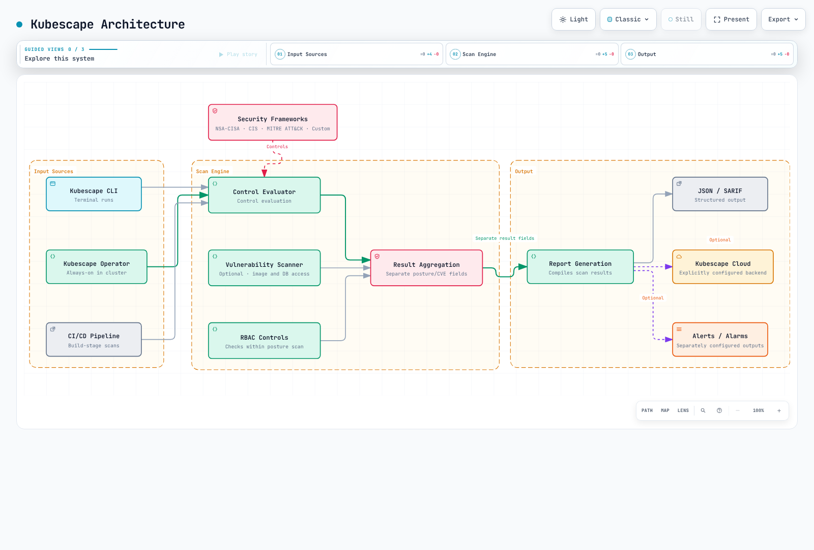
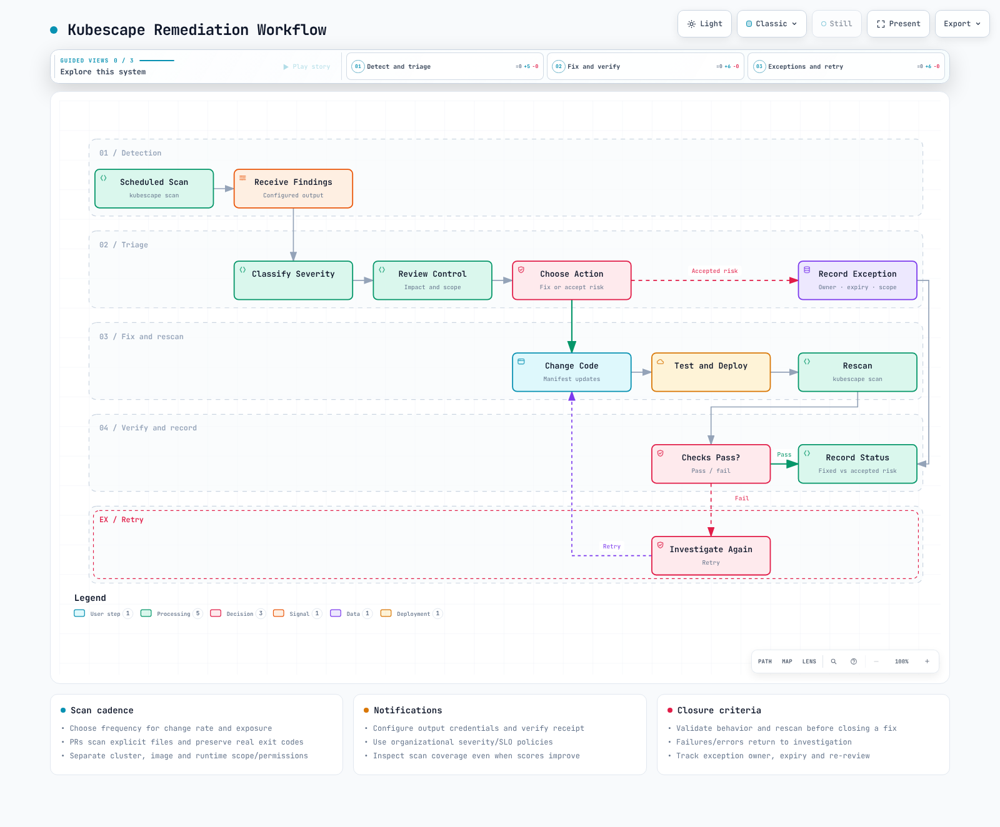

# KubescapeによるSecurity Posture Management

> **最終更新**: September 13, 2026
> **検証ベースライン**: CLI 4.0.14およびOperator chart 1.40.4。chartのscanner imageはCLIとは別の4.0.13です。Policy hashはexample directoryに記録されています。

KubescapeはKubernetes設定と、選択されたimage/runtimeデータを評価します。**scanの成功はsecurityの保証でもcompliance認定でもありません。利用できないcoverageは別途特定する必要があります。** このガイドは、local YAML、policy bundle、実際のCLI、およびchart renderingで確認しました。live cluster scan、node-agent installation、registry image/DB scan、SaaS送信は実施していません。

<span id="what-kubescape-solves"></span>
<span id="cncf-sandbox-project"></span>
<span id="comparison-with-similar-tools"></span>
<span id="kubescape-architecture"></span>

## 概要

Kubescapeは2022年12月13日にCNCFへ参加し、**2025年1月13日にIncubatingとなりました**。以前のSandboxの説明および古いtool maturity比較表は、現在のガイダンスではありません。

CLIは明示的なfileまたはcluster scanを実行します。Operatorは有効なcapabilityに従い、continuous/scheduledな動作を提供します。Configuration control、RBAC analysis、image CVE、runtime detectionにはそれぞれ異なるscopeがあります。kube-benchのnode/CIS check、Polarisのworkload policy、Trivyのimage/configuration scanは、包括的な優劣の主張ではなく、version管理された要件と比較してください。



[インタラクティブ図を表示](https://www.atomai.click/kubernetes-docs/archmaps/en-security-11-kubescape-0.html)


<span id="linux-and-macos"></span>
<span id="windows"></span>
<span id="container-image"></span>
<span id="helm-operator-installation-in-cluster"></span>
<span id="operator-configuration-values"></span>
<span id="kubescape-cloud-saas"></span>

## インストール

### CLIのインストール

[公式4.0.14 release](https://github.com/kubescape/kubescape/releases/tag/v4.0.14)からOS/CPUに対応するassetをdownloadし、そのchecksumを検証します。このLinux AMD64の例では確認済みのarchive hashを固定しています。ARM64には異なるarchive/hashが必要です。

```bash
curl --fail --location \
  https://github.com/kubescape/kubescape/releases/download/v4.0.14/kubescape_4.0.14_linux_amd64.tar.gz \
  --output kubescape.tgz
printf '%s  %s\n' '1d253b70f88e80b74f68af73ccd422f897381468300be7cc486fdd656d907a40' kubescape.tgz | sha256sum --check
tar -xzf kubescape.tgz kubescape
./kubescape version
./kubescape scan --help
```

Homebrew/Krewまたはその他のinstallerを使用する際は、実際のpackage versionを確認してください。installerの実行とkubeconfigの公開範囲を、意図したscopeに制限してください。`kubescape scan`でfile targetを省略すると、current clusterをscanする場合があります。

### Helm Operatorのインストール

[example directory](https://github.com/Atom-oh/kubernetes-docs/tree/main/examples/security/kubescape)をdownloadし、`examples/security/kubescape`からこれらのcommandを実行します。このprofileはposture checkとmetricsに焦点を当て、node/image/runtime/remediation capabilityを明示的に無効化します。

```bash
helm repo add kubescape https://kubescape.github.io/helm-charts
helm repo update kubescape
helm upgrade --install kubescape kubescape/kubescape-operator \
  --version 1.40.4 --namespace kubescape --create-namespace \
  --values operator-values.yaml
```

```yaml
clusterName: documentation-cluster
defaultFrameworks:
- nsa
- mitre
capabilities:
  continuousScan: enable
  configurationScan: enable
  nodeScan: disable
  nodeSbomGeneration: disable
  vulnerabilityScan: disable
  relevancy: disable
  runtimeObservability: disable
  networkPolicyService: disable
  networkEventsStreaming: disable
  runtimeDetection: disable
  nodeProfileService: disable
  admissionController: disable
  httpDetection: disable
  seccompProfileService: disable
  prometheusExporter: enable
  riskAcceptance: disable
  remediation: disable
  manageWorkloads: disable
global:
  enableClusterWideSecretAccess: false
persistence:
  storageClass: gp3
kubescapeScheduler:
  scanSchedule: 0 8 * * *
```


`gp3` StorageClass/CSI driverを準備し、namespace、RBAC、CRD、aggregated APIの可用性を検証してください。EKS Auto Modeと通常のEBS CSI StorageClassでは、異なるprovisionerを使用する場合があります。Helm renderingはinstallation、persistence、またはscan成功を保証しません。

`credentials.cloudSecret`はaccount IDではなく、既存のSecret名です。SaaSが必要な場合は、backend/account/accessKey/data scopeを明示的に設定し、認可してください。CLIの`--submit`は送信を要求します。local exampleでは`--keep-local`と分離したcacheを使用します。host privilege、kernel/BTF、対応するnode typeを確認した後、node/runtime featureを別途有効化してください。

<span id="nsa-cisa-kubernetes-hardening-guide"></span>
<span id="cis-kubernetes-benchmark"></span>
<span id="mitre-att-ck-framework"></span>
<span id="framework-comparison"></span>

## Security Framework

### FrameworkとControl

Framework名とcontrol数はpolicy bundleに依存します。確認したdownloadにはNSA、MITRE、SOC2、ArmoBest、DevOpsBest、AllControls、およびversion付きCIS frameworkが含まれていました。NSAには26個のcontrolが含まれており、すべてがlocal Podに適用できるわけではありません。

```bash
kubescape list frameworks
kubescape list controls --framework NSA
kubescape list controls --framework NSA --search container
```

確認したbundleの例の名前には、`cis-v1.12.0`および`cis-eks-t1.8.0`があります。`cis-v1.23`または`cis`が汎用aliasであると想定しないでください。Policy updateはcoverage/scoreを変更します。binary versionとpolicy hashを一緒に記録してください。

| Control ID | 確認したbundle名 |
|---|---|
| C-0004 | Resources memory limit and request |
| C-0009 | Resource limits |
| C-0013 | Non-root containers |
| C-0016 | Allow privilege escalation |
| C-0034 | Automatic mapping of service account |
| C-0035 | Administrative Roles |
| C-0036 | Validate admission controller (validating) |
| C-0039 | Validate admission controller (mutating) |
| C-0057 | Privileged container |

C-0036/0039は、wildcard-RBAC/risky-ServiceAccount controlではありません。Severityもbundleに依存します。確認したC-0057はHighであり、常にCriticalではありません。

### Custom Framework

`--use-from`はlocal policy objectをloadします。YAML名と解決されていないcontrol ID listが、実行可能なframeworkであるとは限りません。exampleの`policies/nsa.json`は、license、provenance、SHA recordを備えたテスト済みbundleです。`kubescape policy init`や`kubescape policy test`など、現在のCLI featureを使用して新しいRego controlを作成・テストし、その後organizational requirementをレビューしてください。

<span id="scanning-pipeline-flow"></span>
<span id="cluster-scanning"></span>
<span id="specific-control-scanning"></span>
<span id="yaml-and-helm-manifest-scanning-shift-left"></span>
<span id="image-vulnerability-scanning"></span>
<span id="rbac-visualization-and-analysis"></span>

## CLI Scanning


[インタラクティブ図を表示](https://www.atomai.click/kubernetes-docs/archmaps/en-security-11-kubescape-1.html)


### ClusterとLocal Inputの比較

```bash
# This accesses the current cluster; check authorization and scope first.
kubescape scan framework nsa --include-namespaces production
# Explicit local-file scan:
kubescape scan framework nsa secure-pod.yaml \
  --use-from policies/nsa.json --controls-config policies/controls-inputs.json \
  --exceptions no-exceptions.json --keep-local \
  --format json --output report.json
```

`--format/-f`はformatを選択し、`--output/-o`はfile名を指定します。`-o json > report.json`はJSON outputを選択しません。Version 4.0.14はJSON/SARIF/HTML/PDF/JUnit/gitlab-sastなどのformatをサポートします。受信側toolが想定するものを選択してください。

有効なvalueを明示するため、scanの前にHelm/Kustomizeをlocalでrenderしてください。Local checkはAPI defaulting、admission、IAM authorization、network behaviorを再現しません。確認したCLIでは、`--include-api-audit`、`--custom-framework`、`--sort-by`は不明でした。`scan rbac`を現在の独立したsubcommandとして提示しないでください。

### 実際のLocal Result

`insecure-pod.yaml`は、**deployment recipeではなくsynthetic scan fixtureです**。存在しない`runAsRoot`ではなく、実際のprivileged/runAsUser fieldを使用します。`secure-pod.yaml`もconfigurationのみを示します。実際にdeploymentする前にapplication imageを置き換えてください。

| Local input | Compliance | score | 結果 |
|---|---:|---:|---|
| Insecure Pod | 55 | 62.5 | High failure |
| Secure Pod | 95 | 6.818182 | High gateはpassするが、すべてのcontrolがpassするわけではない |

これらのvalueは、添付されたpolicy snapshotと1つのlocal Podに適用されます。cluster securityやexploitabilityを測定するものではありません。

### ImageおよびRBAC Analysis

`kubescape scan image IMAGE`でimage scanを明示的に要求してください。CLI 4.0.14はsource dependencyでGrype 0.104.1およびSyft 1.42.3を使用します。Operatorのkubevuln componentは別途version管理されています。registry credential、platform、database freshness、scan errorを検証してください。Host scanはimage scanとは異なり、追加のhost access/resource creationを必要とする場合があります。

RBAC controlは、認可されたAPI scope内で収集したRole/Bindingを評価します。RoleBindingはそのnamespace内でaccessを付与し、すべてのnamespaceに付与するわけではありません。Static analysisだけでは、未使用のpermission、外部IAM authorization、またはすべての有効なaccess pathを確立できません。

<span id="continuous-scanning-architecture"></span>
<span id="operator-components"></span>
<span id="scheduled-scanning-configuration"></span>
<span id="vulnerability-scanning-integration"></span>
<span id="runtime-threat-detection-node-agent-with-ebpf"></span>
<span id="kubernetes-api-attack-detection"></span>

## Operator Mode（In-Cluster）


[インタラクティブ図を表示](https://www.atomai.click/kubernetes-docs/archmaps/en-security-11-kubescape-2.html)


chartの`kubescapeScheduler.scanSchedule`および`requestBody.commands[].args.scanV1` fieldを使用してください。`defaultFrameworks`はtargetのないrequestにdefaultを提供し、明示的な`targetNames`が優先されます。`scanSchedule`を含む任意のConfigMapを作成しても、controllerがそれを使用することは保証されません。

`spdx.softwarecomposition.kubescape.io/v1beta1`のresultは、通常のすべてのCRDではなくstorage componentの**aggregated API**によって提供されます。個別のCRDにはSecurityException、ClusterSecurityException、OperatorCommandがあります。resultをqueryする前に、実際の名前/scopeを確認してください。

```bash
kubectl get apiservices v1beta1.spdx.softwarecomposition.kubescape.io
kubectl api-resources --api-group=spdx.softwarecomposition.kubescape.io
kubectl get pods,pvc -n kubescape
```

古いScanSchedule、VulnerabilityScanConfig、ThreatDetectionConfig、AcceptedRisk、ScanConfigurationのexampleを、このchartによってinstallされるAPIとして提示しないでください。Node-agent profile/detectionには、選択したimageに対応する実際のAPI/capabilityを使用する必要があります。有効なconfigurationは、すべてのnodeで正常なcollectionまたはdetectionが行われている証明ではありません。

<span id="risk-score-calculation"></span>
<span id="severity-levels"></span>
<span id="viewing-risk-scores"></span>
<span id="prioritization-strategy"></span>

## Risk Scoring

`summaryDetails.complianceScore`と`summaryDetails.score`は異なるaggregateです。complianceが高いほどpassしたcheckが多いことを示します。risk scoreは同じvalueでも、単純に`100-compliance`でもありません。架空のseverity weightやresponse SLAを、汎用的なKubescape formulaとして提示しないでください。

```bash
jq '{compliance: .summaryDetails.complianceScore, risk: .summaryDetails.score,
     failed: [.summaryDetails.controls[] | select(.status == "failed") | {controlID, name, severity}]}' report.json
```

`--compliance-threshold`は**最低compliance score**として、`--severity-threshold`はfailed-control severityに使用してください。local score 55はthreshold 55でexit 0、56でexit 1を返しました。`--min-severity`はoutputをfilterしますが、現在のgate calculationの代わりにはなりません。

**Version 4.0.14はdeprecated compatibility flagとして`--fail-threshold`を受け付けますが、そのvalueを無視します。** テストでは、`--fail-threshold 0`のみを指定すると、failed findingがあってもexit 0が返りました。その無効なflagを、`--scan-images`/`--skip-controls`のように引き続き処理されるoptionや、本当に不明なflagと区別してください。

<span id="ci-cd-integration-workflow"></span>
<span id="github-actions-workflow"></span>
<span id="gitlab-ci-cd-integration"></span>
<span id="jenkins-pipeline-integration"></span>
<span id="threshold-based-gates"></span>

<span id="cicd-integration"></span>

## CI/CD Integration


[インタラクティブ図を表示](https://www.atomai.click/kubernetes-docs/archmaps/en-security-11-kubescape-3.html)


### 共通Security Gate

```bash
#!/usr/bin/env bash
# Scan explicit local manifests with an isolated Kubernetes/client configuration.
set -euo pipefail
if [[ $# -ne 2 ]]; then
  printf 'Usage: %s LOCAL_MANIFEST OUTPUT_JSON\n' "$0" >&2
  exit 2
fi
manifest_path=$1
report_path=$2
if [[ ! -f $manifest_path ]]; then
  printf 'Expected an existing local manifest file: %s\n' "$manifest_path" >&2
  exit 2
fi
# An absolute operand cannot be parsed as a flag such as --help.
manifest_path="$(cd -- "$(dirname -- "$manifest_path")" && pwd)/$(basename -- "$manifest_path")"
script_dir=$(cd -- "$(dirname -- "${BASH_SOURCE[0]}")" && pwd)
: "${KUBESCAPE_BIN:=kubescape}"
: "${COMPLIANCE_MINIMUM:=90}"
: "${SEVERITY_LIMIT:=high}"
umask 077
scan_temp_dir=$(mktemp -d "${TMPDIR:-/tmp}/kubescape-local.XXXXXX")
trap 'rm -rf -- "$scan_temp_dir"' EXIT
mkdir -- "$scan_temp_dir/cache"
cat > "$scan_temp_dir/kubeconfig" <<'YAML'
apiVersion: v1
kind: Config
clusters: []
contexts: []
users: []
current-context: ''
YAML
# Block inherited in-cluster discovery as well as kubeconfig and cached backend state.
env -u KUBERNETES_SERVICE_HOST -u KUBERNETES_SERVICE_PORT -u KUBERNETES_PORT -u KUBERNETES_MASTER \
  KUBECONFIG="$scan_temp_dir/kubeconfig" KS_CACHE_DIR="$scan_temp_dir/cache" \
  "$KUBESCAPE_BIN" --cache-dir "$scan_temp_dir/cache" scan framework nsa "$manifest_path" \
  --kubeconfig "$scan_temp_dir/kubeconfig" --host-scan=false \
  --use-from "$script_dir/policies/nsa.json" \
  --controls-config "$script_dir/policies/controls-inputs.json" \
  --exceptions "$script_dir/no-exceptions.json" \
  --honor-inline-exceptions=false \
  --keep-local \
  --compliance-threshold "$COMPLIANCE_MINIMUM" \
  --severity-threshold "$SEVERITY_LIMIT" \
  --format json --output "$report_path"
```


CI gateはskip-control annotationを無視し、空のkubeconfigとfresh cacheを使用し、継承されたin-cluster discoveryをclearします。`--keep-local`だけではKubernetes API accessを防止できません。hostile loopback API contextを用いた5つのnative testでは、requestは0件で、想定どおりのfailure/success codeが生成されました。

input不足、scan error、threshold failureはnonzeroを返します。`continue-on-error`または`|| true`で隠さないでください。report uploadはfailure後に実行できますが、successを決定するものではありません。controlを除外すると評価対象のdenominatorが変わるため、記録する必要があります。

### GitHub Actions

[検証済みworkflow](https://github.com/Atom-oh/kubernetes-docs/blob/main/examples/security/kubescape/github-actions.yaml)はbinary/checksumを固定し、local policy snapshotで`k8s/rendered.yaml`のみをscanします。projectは先にそのfileを生成する必要があります。存在しない場合、jobはfailureになります。permissionは`contents:read`であり、PR commentやSaaS送信は行いません。

### GitLabおよびJenkins

どちらのsystemでも、同じ`scan-manifests.sh` exit codeを保持してreportをarchiveできます。汎用のKubescape JSONはGitLab SASTやCode Quality schemaではありません。統合SAST reportでは、現在の`--format gitlab-sast` outputを受信側versionで検証してください。Jenkinsの`readJSON`/`publishHTML`にはpluginが必要です。pipelineが生成していないHTML fileをpublishしないでください。

<span id="eks-specific-controls"></span>
<span id="aws-auth-configmap-analysis"></span>
<span id="irsa-iam-roles-for-service-accounts-validation"></span>
<span id="eks-security-best-practices-scan"></span>

## EKS固有ガイド

Kubernetes manifest scanでは、EKS control-plane configuration、IAM、access entry、Pod Identity/IRSA、node policyを完全には検証できません。`aws-auth`はlegacy authentication pathです。現在のauthentication modeとaccess entryを調査してください。`system:masters`またはemergency IAM userはleast-privilegeのexampleではありません。

C-0034はservice account tokenのautomountをcheckするものであり、完全なIRSA trust/aud/sub/IAM policyを対象とするものではありません。projectされたSTS tokenと自動のKubernetes API token mountingを区別してください。実際のworkload identityと許可されたAWS operationを別途検証してください。

host-scanningおよびremediation permission/mutationを有効化する前にレビューしてください。exampleではcluster-wide Secret accessとremediationを無効化していますが、operatorは引き続きinstallationに必要なscanner/operator/storage RBACを調査する必要があります。

<span id="exception-policies"></span>
<span id="applying-exceptions-via-cli"></span>
<span id="accepted-risks-documentation"></span>
<span id="inline-resource-exceptions"></span>

## Control Exception Handling

### CLI Exception

```json
[
  {
    "name": "documentation-privileged-exception",
    "policyType": "postureExceptionPolicy",
    "actions": [
      "alertOnly"
    ],
    "resources": [
      {
        "designatorType": "Attributes",
        "attributes": {
          "namespace": "demo-app",
          "kind": "Pod",
          "name": "insecure-example"
        }
      }
    ],
    "posturePolicies": [
      {
        "controlID": "C-0057"
      }
    ]
  }
]
```


これはCLIが使用する**JSON array**であり、ConfigMap wrapperではありません。テスト済みの`alertOnly` exceptionは、failureとcompliance 55を維持したままC-0057をacknowledgedとしました。`--exclude-controls C-0057`はcontrolを評価から除外し、denominatorとscoreを変更しました。exceptionはremediationではありません。

### In-Cluster Exception

```yaml
apiVersion: kubescape.io/v1beta1
kind: SecurityException
metadata:
  name: documentation-privileged-exception
  namespace: demo-app
spec:
  author: documentation-security-team
  reason: Synthetic scan example; replace with an approved owner and justification.
  expiresAt: '2026-09-30T00:00:00Z'
  match:
    resources:
      - apiGroup: ''
        kind: Pod
        name: insecure-example
  posture:
    - controlID: C-0057
      action: alert_only
```


現在のAPIは`kubescape.io/v1beta1`のSecurityException/ClusterSecurityExceptionです。承認済みpolicyに従ってnamespace scope、match、posture action、expiry、ownershipを設定してください。schemaのsuccessは、controller enforcement、RBAC、CEL behaviorを保証しません。CLIの`alertOnly`はCRDの`alert_only`とは異なります。exception処理のために架空のignore annotationに依存しないでください。

<span id="periodic-scanning-schedule"></span>
<span id="scanning-configuration"></span>
<span id="compliance-reporting"></span>
<span id="remediation-workflow"></span>
<span id="integration-with-other-security-tools"></span>
<span id="prometheus-metrics-integration"></span>

## ベストプラクティス



[インタラクティブ図を表示](https://www.atomai.click/kubernetes-docs/archmaps/en-security-11-kubescape-4.html)


scope、pass/fail/unavailable check、policy hash、tool image、exception owner、expiry dateを記録してください。scoreは同等のinput/policy間でのみ比較してください。Node scan、image scan、runtime detectionは別個のevidence sourceです。

### Prometheus Integration

```yaml
apiVersion: monitoring.coreos.com/v1
kind: PodMonitor
metadata:
  name: kubescape-posture
  namespace: monitoring
spec:
  namespaceSelector:
    matchNames: [kubescape]
  selector:
    matchLabels:
      app.kubernetes.io/name: kubescape-operator
      app.kubernetes.io/instance: kubescape
      app.kubernetes.io/component: prometheus-exporter
  podMetricsEndpoints:
    - port: metrics
      path: /metrics
      interval: 60s
```


確認したexporter Podはcontainer port 8080を`metrics`と命名していますが、そのService portには名前がありません。したがって、このexampleでは実際のPod labelと名前付きportに一致するPodMonitorを使用します。Prometheus OperatorとPrometheus PodMonitor selectionは別個の前提条件です。

実際のexporter 0.2.23のgauge例は`kubescape_controls_total_cluster_high`および`kubescape_controls_total_workload_high`です。`_total` suffixが付いていても、それらはcounterではありません。古い`kubescape_compliance_score`/`critical_findings`/`last_scan_timestamp`名は、確立された共通metricsではありません。missing scrapeとstale dataは別途monitorしてください。

<span id="table-of-contents"></span>
<span id="key-takeaways"></span>
<span id="quick-reference-commands"></span>
<span id="references"></span>
<span id="related-documentation"></span>

## まとめとReference

Local validationでは、binary/checksum、policy snapshot、threshold boundary/severity/deprecated gate、exception/exclusion behavior、公開済みshell gate、Helm rendering、SecurityException schema、PodMonitor targeting、GitHub Actions syntax、30件のdiagram browser caseを対象にしました。実際のAWS/Kubernetes/registry/notification/SaaS operationは実施していません。

- [CNCF Kubescapeの歴史](https://www.cncf.io/projects/kubescape/)
- [Kubescape documentation](https://kubescape.io/docs/)
- [Frameworkとcontrol](https://kubescape.io/docs/frameworks-and-controls/)
- [Operator documentation](https://kubescape.io/docs/operator/)
- [CLI 4.0.14](https://github.com/kubescape/kubescape/releases/tag/v4.0.14)
- [固定されたCLI flag](https://github.com/kubescape/kubescape/blob/v4.0.14/cmd/scan/scan.go)
- [Operator chart 1.40.4](https://github.com/kubescape/helm-charts/releases/tag/kubescape-operator-1.40.4)
- [Policy library](https://github.com/kubescape/regolibrary)
- [Exporter metrics 0.2.23](https://github.com/kubescape/prometheus-exporter/blob/v0.2.23/metrics/metrics.go)
- [Runtime security](./08-runtime-security.md)
- [EKS security practices](./06-eks-security-best-practices.md)
