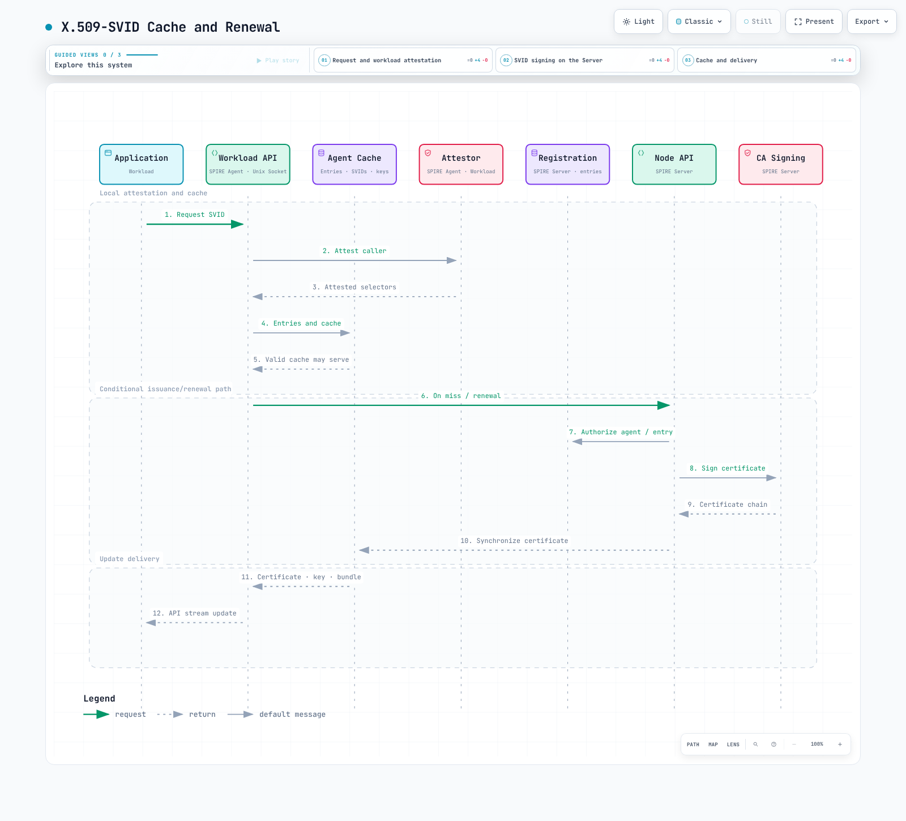

# SPIFFE/SPIRE によるワークロードアイデンティティ

> **最終更新**: September 13, 2026
> **検証基準**: SPIRE 1.15.3, hardened chart 0.30.2 / CRD chart 0.6.1, Controller Manager 0.7.0, chart CSI image 0.2.7（現行の CSI 0.2.13 ドキュメントとも照合）, go-spiffe 2.8.1。chart がレンダリングするイメージバージョンは個別に確認してください。

SPIFFE はワークロードアイデンティティ、クレデンシャル、配布、信頼のフォーマットを定義し、SPIRE がそれらを実装します。**アイデンティティを発行しても、トラフィックが自動的に暗号化されたり、サービスアクセスが認可されたりするわけではありません。** このガイドはローカルの設定、スキーマ、ライブラリ、chart、図を検証したものです。実際のクラスター、AWS CA、SPIRE アテステーション、メッシュのインストールは実施していません。

## Overview

SPIFFE と SPIRE は CNCF Graduated プロジェクトです。CNCF のプロジェクトページには、それぞれ 2022 年 8 月 23 日と 8 月 22 日が記録されています。プロジェクトの成熟度は、個々のデプロイの検証とは別の話です。

IP/Pod が変化しても安定したアイデンティティが得られる点は有用ですが、アプリケーション側には依然として Workload API クライアント、SDK、プロキシ、または明示的なファイルアダプターが必要です。「あらゆるワークロードでアプリケーション変更が不要」というのは普遍的な保証ではありません。この章は SPIRE の X.509/JWT パスに焦点を当てており、別途公開されている **Incubating WIT-SVID 仕様** がすべてのデプロイでサポートされることは前提としていません。

<span id="svid-spiffe-verifiable-identity-document"></span>
<span id="x-509-svid-vs-jwt-svid-comparison"></span>
<span id="trust-bundle"></span>
<span id="trust-domain"></span>

## Core Concepts

### SPIFFE ID

```text
spiffe://example.org/ns/payments/sa/payment-processor
```

ID はスキーム、trust domain（信頼ドメイン）、および任意のパスで構成されます。クエリ、フラグメント、ポート、ドットセグメント、パーセントエンコードされたパス要素は許可されません。DNS 風の安定した trust domain 名は有用ですが、DNS で解決可能である必要はありません。IPv4 形式や数値のみの名前が一律に無効というわけではありません。構文上の妥当性と命名のガイダンスは区別してください。

### SVIDs and Validation

| Concern | X.509-SVID | JWT-SVID |
|---|---|---|
| Identity | SPIFFE URI SAN in the leaf | sub |
| Validation | Chain, lifetime, SVID rules, trust domain | Signature, subject, audience, expiry |
| Use | TLS client/server authentication | APIs accepting bearer tokens |
| Key | Workload/agent private-key path | Issuer retains signing private key |
| Lifetime | Policy and actual issuance | Policy and actual token exp |

CN は SPIFFE のアイデンティティではありません。ローカルの go-spiffe テストでは、CN のみ、複数の SPIFFE URI、期限切れ、誤った trust domain がいずれも拒否されました。audience の検証は受信者を制限しますが、リプレイ検知ではありません。同一の有効な bearer token は再度検証を通過しました。必要な箇所には適切な TLS/トークン利用ポリシーとリプレイ対策を適用してください。

trust bundle には X.509 authority、JWT 検証鍵、メタデータが含まれます。PEM、SPIFFE bundle JSON、任意の YAML は相互に置き換えられるものではありません。公開する bundle にワークロードや CA の秘密鍵を含めてはいけません。

<span id="spire-server"></span>
<span id="spire-agent"></span>
<span id="svid-issuance-flow"></span>

## SPIRE Architecture


[View interactive diagram](https://www.atomai.click/kubernetes-docs/archmaps/en-security-12-spiffe-spire-0.html)


Server は agent のアテステーション、登録、X.509/JWT の署名を管理します。DataStore と KeyManager は永続化の責務が異なります。AWS Private CA のような UpstreamAuthority は SPIRE の中間 CA に署名しますが、すべてのワークロード leaf 署名処理を置き換えるものではありません。

Agent は自身の API を呼び出したプロセスをアテストし、同期されたエントリと SVID キャッシュを使用します。キャッシュが有効であれば、API リクエストごとに Server による新規発行は不要です。利用側はストリーム、SDK、プロキシを通じて更新されたクレデンシャルを取り込む必要があります。



[View interactive diagram](https://www.atomai.click/kubernetes-docs/archmaps/en-security-12-spiffe-spire-1.html)


<span id="prerequisites"></span>
<span id="helm-installation-recommended"></span>
<span id="namespace-layout"></span>
<span id="high-availability-configuration"></span>
<span id="verify-installation"></span>

## Installation

[example directory](https://github.com/Atom-oh/kubernetes-docs/tree/main/examples/security/spiffe) をダウンロードし、`examples/security/spiffe` で作業してください。hostPath/CSI/カーネル/kubelet の要件を確認します。必要なアクセスが利用できない Fargate などのホストでは、同じ DaemonSet が動作すると想定できません。

```bash
helm repo add spiffe https://spiffe.github.io/helm-charts-hardened
helm repo update spiffe
helm upgrade --install spire-crds spiffe/spire-crds \
  --version 0.6.1 --namespace spire-system --create-namespace
helm upgrade --install spire spiffe/spire \
  --version 0.30.2 --namespace spire-system --values lab-values.yaml
```

### Single-Server Lab

```yaml
global:
  spire:
    trustDomain: example.org
    clusterName: documentation
    caSubject:
      organization: Documentation Lab
      country: KR
    namespaces:
      server:
        name: spire-system
      system:
        name: spire-system
  installAndUpgradeHooks:
    enabled: false
  deleteHooks:
    enabled: false
spire-server:
  replicaCount: 1
  controllerManager:
    enabled: true
    identities:
      clusterSPIFFEIDs:
        default:
          enabled: false
        oidc-discovery-provider:
          enabled: false
        test-keys:
          enabled: false
  externalControllerManagers:
    enabled: false
  persistence:
    enabled: true
    size: 1Gi
spire-agent:
  workloadAttestors:
    k8s:
      verification:
        type: apiServerCA
    unix:
      enabled: true
spiffe-oidc-discovery-provider:
  enabled: false
spiffe-csi-driver:
  enabled: true
```


これは単一 Server・SQLite のラボ構成です。広範なデフォルト、テスト用、未使用の OIDC アイデンティティは無効化しており、ワークロードの選択は別途 ClusterSPIFFEID で行います。chart のデフォルトでは kubelet の検証がスキップされるため、apiServerCA を明示的に設定しています。これは実際の kubelet serving 証明書がその CA で検証できることを前提としています。別の PKI を使う場合は、検証を無効化するのではなく、適切な CA/ホスト証明書の方式を用いてください。

このプロファイルではインストール/削除の hook を無効にしています。必要なマイグレーションやクリーンアップは個別に実施してください。レンダリング結果には Controller Manager サイドカーを含む Server StatefulSet と、Agent および CSI の DaemonSet が含まれます。リリース固有のリソース名、ラベル、ソケットパスを確認してください。

### High Availability

[ha-values.yaml](https://github.com/Atom-oh/kubernetes-docs/blob/main/examples/security/spiffe/ha-values.yaml) では 3 レプリカ、共有 PostgreSQL、既存のパスワード Secret、CA をマウントした verify-full の TLS、実際の Pod ラベルに一致する anti-affinity を使用します。独立した 3 つの SQLite レプリカは共有 HA データストアではありません。

まず PostgreSQL/DNS、CA の ConfigMap、`spire-database` Secret のキー `password`、StorageClass、接続性を準備します。この例では `extraEnv.valueFrom.secretKeyRef` を用いて `PGPASSWORD` に生のパスワードを渡します。chart の `dataStore.sql.externalSecret` による補間を無効化し、`password` は空のままにするため、生成される接続文字列にパスワードは含まれません。SPIRE の PostgreSQL ドライバーは `PGPASSWORD` を別途読み取るため、引用符、バックスラッシュ、空白、ドル記号が JSON/DSN パーサーに入り込みません。実際のパスワードを事前にエスケープしたり URI エンコードしたりしないでください。

SPIRE 1.15.3 のネイティブ設定と lib/pq 1.12.3 のパース検査では、`sslmode=verify-full` と CA パスを維持しつつ、6 種類の合成パスワードケースを確認しました。これらの検査では PostgreSQL への接続やフェイルオーバーのテストは行っていません。環境変数として渡される Secret の変更は Server Pod の再起動が必要です。データベースのパスワードローテーションは再起動と合わせて計画し、可用性を検証してください。HA にはさらに鍵の永続化、バックアップ、bundle のロールオーバー、復旧テストが必要です。

<span id="attestation-flow"></span>
<span id="kubernetes-psat-projected-service-account-token"></span>
<span id="aws-instance-identity-document-iid"></span>
<span id="join-token-bootstrap"></span>
<span id="node-attestor-comparison"></span>

## Node Attestation


[View interactive diagram](https://www.atomai.click/kubernetes-docs/archmaps/en-security-12-spiffe-spire-2.html)


k8s_psat は agent の projected ServiceAccount token を **Kubernetes TokenReview** で検証し、その後 namespace/SA/Pod/node の情報を確認します。これは IRSA が用いる IAM OIDC プロバイダーのフローではありません。論理的なクラスター名、token の audience、SA の許可リスト、TokenReview の権限を一致させてください。

デフォルトの agent ID は `spiffe://TRUST_DOMAIN/spire/agent/k8s_psat/CLUSTER/NODE_UID` の形式に従います。現行バージョンでは Pod UID モードも利用できます。parentID を独自に作り出すのではなく、登録済みの agent/alias ID を確認してください。token generate、entry create、bundle set は実際の状態を変更します。

aws_iid は EC2 インスタンスアイデンティティを利用する代替手段です。PSAT より一律に強固というわけでもなく、EKS 以外の環境に限定されるわけでもありません。skip_block_device、ローカル検証の前提、許可アカウント、追加のセレクターを確認してください。静的な AWS クレデンシャルを ConfigMap に置かないでください。

<span id="kubernetes-workload-attestor"></span>
<span id="registration-entry-examples"></span>
<span id="unix-workload-attestor"></span>

## Workload Attestation

Agent は呼び出し元の PID/cgroups と kubelet の情報を使用します。安全でない kubelet のポート 10255 や skip_kubelet_verification=true をデフォルトにしないでください。安全な認証、正しい serving CA、ネットワークアクセスが前提条件です。

よく使われるセレクターには k8s:ns、k8s:sa、k8s:pod-label、k8s:pod-uid、k8s:container-name/image があります。container-image は Kubernetes が報告するタグ/ダイジェストを反映します。nginx:* は glob セレクターではありません。タグ文字列はサプライチェーンの検証にはなりません。必要な場合は、適切なダイジェスト/署名のアテステーションを別途利用してください。

namespace/Pod のラベルを変更できる、または ServiceAccount 配下で Pod を作成できるプリンシパルは、アイデンティティの適格性に影響を与えられます。namespace/SA/Pod の作成制御と、アイデンティティポリシーの所有権をまとめて管理してください。Unix の UID/GID/パス/ハッシュのセレクターも、プラグイン設定と脅威モデルに依存します。

<span id="spiffe-csi-driver"></span>
<span id="spire-controller-manager"></span>
<span id="envoy-sds-integration"></span>

## Kubernetes Integration

### CSI Mounts the API Socket

chart に含まれる SPIFFE CSI 0.2.7 および現行の 0.2.13 の実装は、**Workload API の Unix ソケットを含むディレクトリ**をマウントします。svid.pem、svid.key、bundle.pem といったファイルを自動生成するわけではありません。ファイルベースのアプリケーションには、別途アダプターと更新/リロードの処理が必要です。

```yaml
apiVersion: v1
kind: Namespace
metadata:
  name: payments
  labels:
    spiffe-enabled: 'true'
---
apiVersion: v1
kind: ServiceAccount
metadata:
  name: payment-processor
  namespace: payments
---
apiVersion: spire.spiffe.io/v1alpha1
kind: ClusterSPIFFEID
metadata:
  name: payments-workload
spec:
  spiffeIDTemplate: spiffe://{{ .TrustDomain }}/ns/{{ .PodMeta.Namespace }}/sa/{{
    .PodSpec.ServiceAccountName }}
  namespaceSelector:
    matchLabels:
      spiffe-enabled: 'true'
  podSelector:
    matchLabels:
      spiffe-managed: 'true'
  workloadSelectorTemplates:
  - k8s:ns:{{ .PodMeta.Namespace }}
  - k8s:sa:{{ .PodSpec.ServiceAccountName }}
  - k8s:container-name:app
  ttl: 1h
  jwtTtl: 5m
---
apiVersion: v1
kind: Pod
metadata:
  name: payment-processor
  namespace: payments
  labels:
    spiffe-managed: 'true'
spec:
  serviceAccountName: payment-processor
  containers:
  - name: app
    image: registry.example.com/team/payment-app:REPLACE_WITH_APPROVED_VERSION
    env:
    - name: SPIFFE_ENDPOINT_SOCKET
      value: unix:///spiffe-workload-api/spire-agent.sock
    volumeMounts:
    - name: spiffe-workload-api
      mountPath: /spiffe-workload-api
      readOnly: true
  volumes:
  - name: spiffe-workload-api
    csi:
      driver: csi.spiffe.io
      readOnly: true
```


アプリケーションイメージは、実際に Workload API を利用するものに置き換えてください。chart の identity の jwtTTL と CRD の jwtTtl を区別してください。上記の明示的なセレクターは app コンテナを対象としています。Envoy コンテナを別に置く場合は、それに対応するプロキシの登録ポリシーが必要です。

### Envoy SDS

[complete bootstrap example](https://github.com/Atom-oh/kubernetes-docs/blob/main/examples/security/spiffe/envoy.yaml) には HTTP フィルター、SDS クラスター、require_client_certificate:true、許可するピア URI の完全一致マッチャーが含まれます。Envoy プロセスはアテスト可能でなければならず、名前付きの server/client の両アイデンティティが登録されている必要があります。

SDS は Workload API と公開の agent ソケットを共有します。証明書のリソース名にはワークロードの SPIFFE ID または default を使い、検証コンテキストには trust domain の ID または ROOTCA/ALL を使います。特に ALL について、SPIFFE の証明書バリデーターのサポート状況を確認してください。プロトコルスキーマと URI マッチャーの実装は検証済みですが、実際の Envoy/SDS/mTLS ハンドシェイクは実行していません。

<span id="istio-spire-integration"></span>
<span id="cilium-spire-mutual-authentication"></span>
<span id="linkerd-identity-trust-anchors"></span>

## Service Mesh Integration

### Istio

Istio の CA アドレスを SPIRE Server のポート 8081 に向けたり、存在しない ENABLE_SPIFFE_IDENTITY/PILOT_ENABLE_SPIRE_INTEGRATION 変数を使ったりしないでください。現行の[公式インテグレーション](https://istio.io/latest/docs/ops/integrations/spire/)は、CSI ソケットのマウント、SPIRE の登録、sidecar/gateway のテンプレートを設定します。

native sidecar を使う場合、istio-proxy は initContainer となるため、そこにパッチを当てる必要があります。native sidecar モードを明示的に無効化した場合は代わりに containers を使用します。インストール済みのバージョン、テンプレート、ソケット、readiness を検証してください。完全な injector の ConfigMap を部分的なスニペットで置き換えないでください。

### Cilium

Cilium 1.20.1 の相互認証は **beta であり、通常の接続とは帯域外（out-of-band）で行われます**。トラフィックの暗号化には WireGuard/IPsec の個別設定が必要です。SPIFFE ID を含む任意のラベルは、認証されたアイデンティティポリシーではありません。

公式のセットアップでは authentication.mutual.spire.enabled を、同梱のインストールを使う場合は authentication.mutual.spire.install.enabled を使用します。同梱の SPIRE と外部の SPIRE の設定は明確に区別し、[pinned installation source](https://github.com/cilium/cilium/blob/v1.20.1/Documentation/network/servicemesh/mutual-authentication/installation.rst) を参照してください。エンドポイントセレクター/認証モード、アイデンティティ発行、暗号化はそれぞれ別の責務です。

### Linkerd

Linkerd が PEM の root を期待する箇所に SPIRE の bundle JSON を渡したり、SPIRE の CA 秘密鍵を issuer の鍵としてコピーしたりしないでください。Linkerd には適切な issuer 証明書/鍵と信頼された root が必要で、更新と root のロールオーバーも必要です。[検証済みの cert-manager/Linkerd の手順](./10-cert-manager.md#linkerd-and-trust-manager)を参照してください。root の信頼を共有するだけでは、SPIFFE Workload API や SDS の統合にはなりません。

<span id="federation-trust-establishment"></span>
<span id="configuring-federation"></span>
<span id="federated-registration-entries"></span>
<span id="multi-cloud-federation-example"></span>

## Federation


[View interactive diagram](https://www.atomai.click/kubernetes-docs/archmaps/en-security-12-spiffe-spire-3.html)


信頼の方向はそれぞれ明示的に設定してください。federation は相互の信頼や認可を自動的に確立するものではありません。bundle エンドポイントの接続性、TLS 検証、更新の失敗、有効期限、ロールオーバーを運用してください。

```yaml
apiVersion: spire.spiffe.io/v1alpha1
kind: ClusterFederatedTrustDomain
metadata:
  name: partner-domain
spec:
  trustDomain: partner.example.org
  bundleEndpointURL: https://bundle.partner.example.org
  bundleEndpointProfile:
    type: https_web
```


この https_web の例は、有効な Web PKI 証明書を持つ実在のエンドポイントを前提としています。https_spiffe ではさらに endpointSPIFFEID と、**認証されたブートストラップ経路で取得した初期の信頼 bundle** が必要です。URL を設定するだけでは不十分です。該当するワークロードの federatesWith リストには、partner.example.org のような trust domain 名のみを指定します。trust bundle の取得と、ピアワークロードの認可は別のことです。

<span id="irsa-vs-spiffe-comparison"></span>
<span id="pod-identity-vs-spire"></span>
<span id="hybrid-use-cases"></span>
<span id="eks-specific-node-attestation"></span>

## EKS Integration

IRSA/Pod Identity は AWS API のクレデンシャル経路を提供し、SPIFFE/SPIRE はワークロードアイデンティティの経路を提供します。どちらか一方が他方を置き換えるものではなく、すべての環境で両方が必要になるわけでもありません。IRSA はクロスアカウント構成をサポートし、互換性のある SDK/projected token の挙動を通じてクレデンシャルを更新します。Pod の再起動が本質的に必要というわけではありません。12 時間という固定の有効期間を前提にしないでください。

ServiceAccount に IRSA を設定し、aud/sub の信頼関係と AWS の権限を検証してください。Pod のアノテーションや AWS_ROLE_ARN 環境変数だけでは不十分です。ワークロードの mTLS には、アプリケーション/プロキシが SVID を利用し、ピアのアイデンティティを個別に認可する必要があります。

### AWS Private CA

完全な server の plugins セクション内で、[pinned plugin fields](https://github.com/spiffe/spire/blob/v1.15.3/doc/plugin_server_upstreamauthority_aws_pca.md) を使用してください。以下はプラグインの断片であり、単独で実行可能な server 設定ではありません。

```hcl
# Merge this plugin into an otherwise complete server configuration.
UpstreamAuthority "aws_pca" {
  plugin_data {
    region = "ap-northeast-2"
    certificate_authority_arn = "arn:aws:acm-pca:ap-northeast-2:111122223333:certificate-authority/REPLACE_CA_ID"
    ca_signing_template_arn = "arn:aws:acm-pca:::template/SubordinateCACertificate_PathLen0/V1"
  }
}
```


SPIRE は中間 CA を保有し、leaf に署名します。[ポリシー例](https://github.com/Atom-oh/kubernetes-docs/blob/main/examples/security/spiffe/aws-pca-policy.json)を用いて、DescribeCertificateAuthority/IssueCertificate/GetCertificate を対象の CA ARN に限定してください。署名アルゴリズム/テンプレートは実際の CA に合わせて選択します。supplemental_bundle_path には追加の PEM authority を指定するもので、バックアップリージョンではありません。aws_kms の KeyManager と UpstreamAuthority のプラグインを区別してください。

## Best Practices and Troubleshooting

有効期間は、更新の失敗、クロックスキュー、発行負荷、オフライン期間を踏まえて調整してください。短い TTL はあらゆる失効や JWT リプレイの問題を解決するものではありません。bundle set は信頼する bundle を変更しますが、CA の秘密鍵をローテーションするものではありません。

ネットワークポリシーでは、Server↔Agent 間のトラフィックに加えて、DNS、Kubernetes TokenReview/API、データストア、上流の CA/KMS、federation、テレメトリーも考慮しなければなりません。ある namespace の Pod セレクターは、別の namespace の agent を選択しません。ポリシーが必要なすべての通信を許可していると主張する前に、実際の接続性を検証してください。

agent Pod 内で api fetch を実行すると、アテストされるのはその呼び出しプロセスであり、アプリケーションのコンテキストではありません。承認された手順のもとで、対象のワークロードのコンテキストから診断してください。ログに含まれる機微なセレクター、token、鍵は制限してください。

<span id="table-of-contents"></span>
<span id="the-zero-trust-identity-problem"></span>
<span id="spiffe-specification-overview"></span>
<span id="cncf-graduation-status"></span>
<span id="best-practices"></span>
<span id="trust-domain-naming"></span>
<span id="svid-ttl-tuning"></span>
<span id="high-availability-deployment"></span>
<span id="key-rotation"></span>
<span id="security-hardening"></span>
<span id="troubleshooting"></span>
<span id="common-issues"></span>
<span id="health-checks"></span>
<span id="key-takeaways"></span>
<span id="architecture-decision-guide"></span>
<span id="references"></span>

## Summary and References

ローカル検証では、server/agent の設定、9 件の ID ケース、5 件の X.509 ケース、6 件の JWT ケース、ラボ/HA の Helm、CRD/Pod のスキーマ、Envoy の protobuf スキーマ、8 つの図に対する 24 件のブラウザケースを対象としました。実際のアテステーション、クラスターへのインストール、DB 接続、AWS での発行、federation の交換、mTLS トラフィックは実行していません。

- [SPIFFE ID specification](https://spiffe.io/docs/latest/spiffe-specs/spiffe-id/)
- [X.509-SVID](https://spiffe.io/docs/latest/spiffe-specs/x509-svid/)
- [JWT-SVID](https://spiffe.io/docs/latest/spiffe-specs/jwt-svid/)
- [Incubating WIT-SVID](https://spiffe.io/docs/latest/spiffe-specs/wit-svid/)
- [Trust domain and bundle](https://spiffe.io/docs/latest/spiffe-specs/spiffe_trust_domain_and_bundle/)
- [Federation specification](https://spiffe.io/docs/latest/spiffe-specs/spiffe_federation/)
- [SPIFFE CNCF history](https://www.cncf.io/projects/spiffe/)
- [SPIRE CNCF history](https://www.cncf.io/projects/spire/)
- [SPIRE 1.15.3](https://github.com/spiffe/spire/releases/tag/v1.15.3)
- [SPIFFE CSI 0.2.13](https://github.com/spiffe/spiffe-csi/blob/v0.2.13/README.md)
- [Hardened Helm charts](https://github.com/spiffe/helm-charts-hardened)
- [Cilium 1.20.1 mutual authentication](https://github.com/cilium/cilium/blob/v1.20.1/Documentation/network/servicemesh/mutual-authentication/mutual-authentication.rst)
