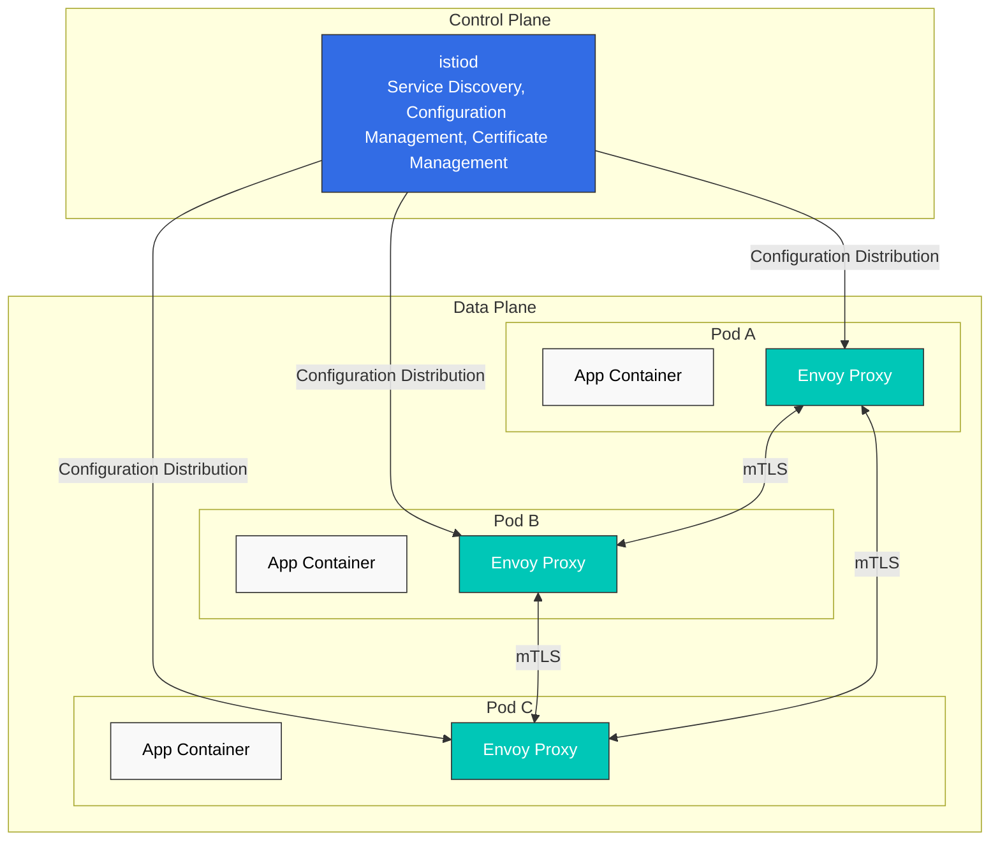

# Istio

> **対応バージョン**: Istio 1.28.0
> **EKS バージョン**: 1.34 (Kubernetes 1.28+)
> **最終更新**: February 23, 2026

## 目次

- [概要](#introduction)
- [主要機能](#key-features)
- [アーキテクチャ概要](#architecture-overview)
- [詳細ドキュメント](#detailed-documentation)
- [クイックスタート](#quick-start)
- [学習リソース](#learning-resources)

## 概要

Istio は、マイクロサービスアプリケーション向けのオープンソース Service Mesh プラットフォームです。Service Mesh は、サービス間通信を処理するインフラストラクチャレイヤーであり、アプリケーションコードを変更せずにサービス間の通信を制御および観測できます。

### Service Mesh とは？

Service Mesh は、以下のコア機能を提供します。

1. **Traffic Management**: サービス間のトラフィックフローを制御
2. **Security**: サービス間通信の暗号化と認証
3. **Observability**: サービス間通信の可視性

### Istio の主な利点

- **プラットフォーム非依存**: さまざまな環境（Kubernetes、VM など）で動作
- **透過的な統合**: アプリケーションコードを変更せずに適用可能
- **自動 mTLS**: サービス間通信を自動的に暗号化
- **高度な Traffic Management**: ルーティング、ロードバランシング、フォールトインジェクションなど
- **詳細なメトリクス**: サービス間通信に関する詳細なメトリクス
- **ポリシー適用**: アクセス制御とレート制限

## 主要機能

### 1. Traffic Management

Istio は強力な Traffic Management 機能を提供します。

- **Gateway**: 外部トラフィックを Mesh にルーティング
- **VirtualService**: サービス間のルーティングルールを定義
- **DestinationRule**: ロードバランシングとコネクションプールを設定
- **Traffic Splitting**: Canary Deployment と A/B テストをサポート
- **Argo Rollouts Integration**: 段階的デリバリーを自動化

### 2. Security

包括的な Security 機能：

- **mTLS**: サービス間の自動暗号化
- **Authorization Policy**: きめ細かなアクセス制御
- **Request Authentication**: JWT ベースの認証
- **Peer Authentication**: サービス間認証ポリシー

### 3. Observability

Service Mesh 全体の可視性：

- **Metrics**: Prometheus 統合
- **Distributed Tracing**: Jaeger/Zipkin をサポート
- **Logging**: アクセスログと構造化ログ
- **Visualization**: Kiali ダッシュボード

### 4. Resilience

サービスの Resilience パターン：

- **Circuit Breaker**: 過負荷を防止
- **Retry**: 自動リトライ
- **Timeout**: リクエストタイムアウトを設定
- **Outlier Detection**: 不健全なインスタンスを除外
- **Rate Limiting**: リクエストレート制限

## アーキテクチャ概要

Istio は **Control Plane** と **Data Plane** で構成されます。



### Control Plane (istiod)

istiod は Istio の中央制御コンポーネントであり、以下を提供します。

- **Service Discovery**: Mesh のサービスレジストリを維持
- **Configuration Management**: Istio 設定を保存および配布
- **Certificate Management**: mTLS 用の証明書を生成およびローテーション

### Data Plane (Envoy Proxy)

Envoy は、各 Pod に Sidecar としてデプロイされる高性能プロキシです。

- **Traffic Routing**: サービス間のトラフィックを制御
- **Load Balancing**: サービスインスタンス間にトラフィックを分散
- **Security**: mTLS の暗号化と認証
- **Observability**: メトリクス、ログ、トレースを収集

## 詳細ドキュメント

すべての Istio 機能に関する詳細ガイドです。

### 📚 基本ドキュメント

| ドキュメント | 説明 |
|----------|-------------|
| [インストールガイド](istio/01-installation.md) | Istio のインストールと初期設定 |
| [コアコンセプト](istio/02-basic-concepts.md) | Istio の基本コンセプトと用語 |
| [コンポーネント](istio/03-architecture.md) | Istio のアーキテクチャとコンポーネント |

### 🚦 Traffic Management

| ドキュメント | 説明 |
|----------|-------------|
| [Gateway & VirtualService](istio/traffic-management/01-gateway-virtualservice.md) | Ingress/Egress Gateway の設定 |
| [ルーティング](istio/traffic-management/02-routing.md) | VirtualService のルーティングルール |
| [DestinationRule](istio/traffic-management/03-destination-rule.md) | Service トラフィックポリシー |
| [Traffic Splitting](istio/traffic-management/04-traffic-splitting.md) | Canary Deployment と A/B テスト |
| [Timeout と Retry](istio/traffic-management/05-retry-timeout.md) | Timeout と Retry のポリシー |
| [Load Balancing](istio/traffic-management/06-load-balancing.md) | さまざまなロードバランシング戦略 |
| [Circuit Breaker](istio/traffic-management/07-circuit-breaker.md) | Circuit Breaker パターンの実装 |
| [Fault Injection](istio/traffic-management/08-fault-injection.md) | カオスエンジニアリング |
| [Traffic Mirroring](istio/traffic-management/09-traffic-mirror.md) | トラフィックミラーリングとシャドーテスト |
| [Session Affinity](istio/traffic-management/10-session-affinity.md) | Session Affinity の設定 |

### 🔐 Security

| ドキュメント | 説明 |
|----------|-------------|
| [mTLS](istio/security/01-mtls.md) | サービス間 mTLS の設定 |
| [Authorization Policy](istio/security/03-authorization.md) | アクセス制御ポリシー |
| [Request Authentication](istio/security/02-authentication.md) | JWT ベースの認証 |
| [Peer Authentication](istio/security/02-authentication.md) | サービス間認証 |

### 📊 Observability

| ドキュメント | 説明 |
|----------|-------------|
| [Metrics](istio/observability/01-metrics.md) | Prometheus メトリクスの収集 |
| [Distributed Tracing](istio/observability/02-tracing.md) | Jaeger/Zipkin 統合 |
| [Logging](istio/observability/03-logging.md) | アクセスログと構造化ログ |
| [Visualization](istio/observability/04-dashboards.md) | Kiali、Grafana ダッシュボード |

### 💪 Resilience

| ドキュメント | 説明 |
|----------|-------------|
| [Outlier Detection](istio/resilience/01-outlier-detection.md) | 不健全なインスタンスの検出 |
| [Rate Limiting](istio/resilience/02-rate-limiting.md) | ローカルおよびグローバルのレート制限 |
| [Zone Aware Routing](istio/resilience/03-zone-aware-routing.md) | ローカリティ対応ルーティング |

### 🚀 高度なトピック

| ドキュメント | 説明 |
|----------|-------------|
| [Ambient Mode](istio/advanced/01-ambient-mode.md) | Sidecar を使用しない Service Mesh |
| [Multi-cluster](istio/advanced/02-multi-cluster.md) | マルチクラスター Mesh の設定 |
| [EnvoyFilter](istio/advanced/03-envoy-filter.md) | Envoy のカスタマイズ |
| [DNS Caching](istio/advanced/04-dns-cache.md) | DNS キャッシュによるパフォーマンス向上 |
| [gRPC](istio/advanced/05-grpc.md) | gRPC プロトコルのサポート |
| [WebSocket](istio/advanced/06-websocket.md) | WebSocket 接続のサポート |
| [Sidecar Injection](istio/advanced/07-sidecar-injection.md) | Sidecar Injection のメカニズム |
| [Argo Rollouts](istio/advanced/08-argo-rollouts.md) | Progressive Delivery 統合 |

### ✅ ベストプラクティス

| ドキュメント | 説明 |
|----------|-------------|
| [ベストプラクティス](istio/best-practices.md) | 本番環境向けチェックリストと推奨事項 |

## クイックスタート

### 1. 前提条件

- Kubernetes クラスター（v1.28+）
- kubectl が設定済み
- 管理者権限

### 2. Istio をインストール

```bash
# Download Istioctl
curl -L https://istio.io/downloadIstio | sh -
cd istio-1.28.0
export PATH=$PWD/bin:$PATH

# Install with default profile
istioctl install --set profile=default -y

# Enable Sidecar injection on namespace
kubectl label namespace default istio-injection=enabled
```

### 3. サンプルアプリケーションをデプロイ

```bash
# Deploy Bookinfo sample application
kubectl apply -f samples/bookinfo/platform/kube/bookinfo.yaml

# Create Gateway
kubectl apply -f samples/bookinfo/networking/bookinfo-gateway.yaml

# Verify installation
kubectl get pods
kubectl get svc istio-ingressgateway -n istio-system
```

### 4. トラフィックを送信

```bash
# Check Ingress Gateway address
export INGRESS_HOST=$(kubectl get svc istio-ingressgateway -n istio-system -o jsonpath='{.status.loadBalancer.ingress[0].hostname}')
export INGRESS_PORT=$(kubectl get svc istio-ingressgateway -n istio-system -o jsonpath='{.spec.ports[?(@.name=="http2")].port}')
export GATEWAY_URL=$INGRESS_HOST:$INGRESS_PORT

# Access application
curl -s "http://${GATEWAY_URL}/productpage"
```

### 5. Observability ツールにアクセス

```bash
# Kiali dashboard
istioctl dashboard kiali

# Prometheus
istioctl dashboard prometheus

# Grafana
istioctl dashboard grafana

# Jaeger
istioctl dashboard jaeger
```

## 学習リソース

### 公式ドキュメント

- [Istio 公式ドキュメント](https://istio.io/latest/docs/)
- [Istio GitHub リポジトリ](https://github.com/istio/istio)
- [Envoy Proxy ドキュメント](https://www.envoyproxy.io/docs/envoy/latest/)

### AWS 関連

- [AWS EKS Workshop - Istio](https://www.eksworkshop.com/docs/security/servicemesh/)
- [AWS App Mesh vs Istio](https://aws.amazon.com/blogs/containers/choosing-between-aws-app-mesh-and-istio/)

### コミュニティ

- [Istio Discuss](https://discuss.istio.io/)
- [Istio Slack](https://istio.slack.com/)
- [CNCF Istio ワーキンググループ](https://github.com/cncf/tag-app-delivery)

### 追加リソース

- [Service Mesh Patterns (O'Reilly)](https://www.oreilly.com/library/view/service-mesh-patterns/9781492086444/)
- [Istio in Action (Manning)](https://www.manning.com/books/istio-in-action)
- [Istio パフォーマンス最適化ガイド](https://istio.io/latest/docs/ops/deployment/performance-and-scalability/)

## クイズ

Istio の理解度を確認するには、[Istio クイズ](../quizzes/service-mesh/02-istio-quiz.md)に挑戦してください。

クイズでは、以下のトピックを扱います。

- Service Mesh の基本コンセプト
- Istio のアーキテクチャ
- Traffic Management（Canary Deployment）
- Security（mTLS）
- Gateway と Ingress
- Observability ツール
- 最新の Service Mesh トレンド
- Rate Limiting
- ローカリティルーティング
- Amazon EKS 統合

---

**次のステップ**: [インストールガイド](istio/01-installation.md)を参照して Istio をインストールし、[コアコンセプト](istio/02-basic-concepts.md)で基本概念を学びましょう。
