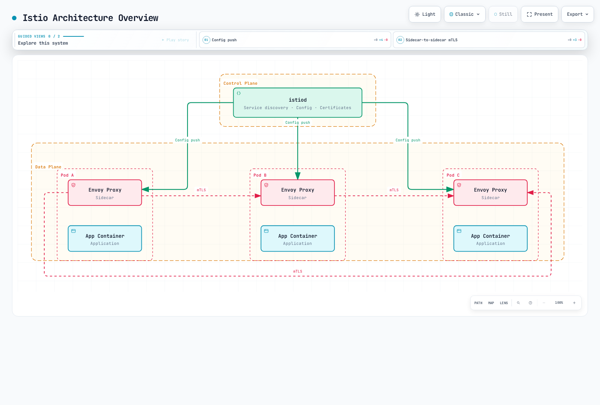

# Istio

> **最終更新**: September 11, 2026 · Istio 1.31のガイダンス

この概要は以前の章URLを利用可能なまま保持します。詳細手順と互換性表は、保守されている[Istioドキュメント索引](istio/README.md)と[インストールガイド](istio/01-installation.md)が管理しています。現在の設定にはそちらを使ってください。

## 目次

- [はじめに](#introduction)
- [主な機能](#key-features)
- [アーキテクチャ概要](#architecture-overview)
- [詳細ドキュメント](#detailed-documentation)
- [クイックスタート](#quick-start)
- [学習資料](#learning-resources)

## はじめに {#introduction}

Istioはマイクロサービスアプリ向けオープンソースのサービスメッシュプラットフォームです。サービスメッシュはサービス間通信を扱うインフラ層で、インフラレベルで通信を制御・観測できます。トレースコンテキスト伝播、安全な終了、業務の冪等性には引き続きアプリの関与が必要です。

### サービスメッシュとは

サービスメッシュは次の中核機能を提供します。

1. **トラフィック管理**: サービス間の通信フローを制御
2. **セキュリティ**: サービス間通信の暗号化と認証
3. **可観測性**: サービス間通信の可視化

### Istioの主な利点

- **プラットフォーム非依存**: Kubernetes、VMなど多様な環境で動作
- **透過的統合**: 多くのネットワーク制御はアプリの業務ロジック変更なしで追加可能
- **ワークロードmTLS**: 参加メッシュ経路で管理IDと転送保護を提供。適用と例外を確認
- **高度なトラフィック管理**: ルーティング、負荷分散、障害注入など
- **詳細メトリクス**: サービス間通信の詳細なメトリクス
- **ポリシー適用**: アクセス制御と明示設定するローカル/グローバルレート制限

## 主な機能 {#key-features}

### 1. トラフィック管理

Istioは強力なトラフィック管理機能を提供します。

- **ゲートウェイ**: 外部通信をルーティング。Istio GatewayリソースとKubernetes Gateway APIを区別
- **VirtualService / HTTPRoute**: 選択データプレーンとコントローラーがサポートするAPIでルーティングを設定
- **DestinationRule**: 負荷分散と接続プールを設定
- **トラフィック分割**: カナリアデプロイとA/Bテストをサポート
- **Argo Rollouts統合**: 別途設定する分析と失敗処理による段階的デリバリー

### 2. セキュリティ

包括的なセキュリティ機能:

- **mTLS**: 参加ワークロードの転送にID認証と暗号化
- **認可ポリシー**: 細粒度アクセス制御
- **リクエスト認証**: JWT検証。JWT必須の場合はAuthorizationPolicyを使用
- **ピア認証**: ワークロード受信mTLSポリシー

### 3. 可観測性

選択モード向けに設定するテレメトリーとバックエンド統合:

- **メトリクス**: Prometheus統合
- **分散トレーシング**: OpenTelemetryとJaegerなど、設定済みトレースprovider/バックエンド。アプリがコンテキストを伝播
- **ログ記録**: アクセスログと構造化ログ
- **可視化**: Kialiダッシュボード

### 4. 耐障害性

サービスの耐障害性パターン:

- **サーキットブレーカー**: 接続/要求プール制限。過負荷防止の保証ではない
- **再試行**: 繰り返して安全な操作に明示的予算。結果不明の書き込み再試行は無効化
- **タイムアウト**: 要求タイムアウト設定
- **外れ値検出**: 異常インスタンスを除外
- **レート制限**: 設定したローカルトークンバケットまたはグローバルレート制限サービス

## アーキテクチャ概要 {#architecture-overview}

Istioは**コントロールプレーン**と**データプレーン**からなります。以下はサイドカー形式で、ambientトポロジーではありません。



[🔍 インタラクティブな図を見る](https://www.atomai.click/kubernetes-docs/archmaps/en-service-mesh-02-istio-0.html)

### コントロールプレーン（istiod）

istiodはIstioの中央制御コンポーネントで、次を提供します。

- **サービス検出**: メッシュのサービスレジストリを維持
- **設定管理**: 設定を監視・変換し、プロキシ設定を配布。APIリソースはKubernetesが永続化
- **証明書管理**: 設定CAを使いワークロード証明書要求とローテーションを管理

### データプレーン: サイドカーとAmbient

サイドカーモードでは参加アプリPodごとにEnvoyが併設されます。

- **トラフィックルーティング**: サービス間通信を制御
- **負荷分散**: サービスインスタンスへ通信を分散
- **セキュリティ**: mTLS暗号化と認証
- **可観測性**: メトリクス、ログ、トレースを収集

AmbientはL4転送にノードレベルztunnel、対応L7機能に任意のEnvoy waypointを使います。全アプリPodにEnvoyを注入しません。モードで機能対応、ポリシー接続、リソース使用が異なり、このトポロジーから固定節約率や普遍的性能優位性は導けません。[Ambientモード](istio/advanced/01-ambient-mode.md)を参照してください。

## 詳細ドキュメント {#detailed-documentation}

以下のリンクは保守されているサブツリーへの学習案内です。索引には追加・新規トピックもあります。

### 📚 基本文書

| 文書 | 説明 |
|----------|-------------|
| [インストールガイド](istio/01-installation.md) | Istioインストールと初期設定 |
| [主要概念](istio/02-basic-concepts.md) | Istioの基本概念と用語 |
| [コンポーネント](istio/03-architecture.md) | Istioアーキテクチャとコンポーネント |

### 🚦 トラフィック管理

| 文書 | 説明 |
|----------|-------------|
| [GatewayとVirtualService](istio/traffic-management/01-gateway-virtualservice.md) | Ingress/Egress Gateway設定 |
| [ルーティング](istio/traffic-management/02-routing.md) | VirtualServiceルーティングルール |
| [DestinationRule](istio/traffic-management/03-destination-rule.md) | サービス通信ポリシー |
| [トラフィック分割](istio/traffic-management/04-traffic-splitting.md) | カナリアデプロイとA/Bテスト |
| [タイムアウトと再試行](istio/traffic-management/05-retry-timeout.md) | タイムアウト/再試行ポリシー |
| [負荷分散](istio/traffic-management/06-load-balancing.md) | 多様な負荷分散戦略 |
| [サーキットブレーカー](istio/traffic-management/07-circuit-breaker.md) | サーキットブレーカーパターン実装 |
| [障害注入](istio/traffic-management/08-fault-injection.md) | カオスエンジニアリング |
| [トラフィックミラーリング](istio/traffic-management/09-traffic-mirror.md) | 通信ミラーリングとシャドーテスト |
| [セッションアフィニティ](istio/traffic-management/10-session-affinity.md) | セッションアフィニティ設定 |

### 🔐 セキュリティ

| 文書 | 説明 |
|----------|-------------|
| [mTLS](istio/security/01-mtls.md) | サービス間mTLS設定 |
| [認可ポリシー](istio/security/03-authorization.md) | アクセス制御ポリシー |
| [リクエスト認証](istio/security/02-authentication.md) | JWTベース認証 |
| [ピア認証](istio/security/01-mtls.md) | サービス間認証 |

### 📊 可観測性

| 文書 | 説明 |
|----------|-------------|
| [メトリクス](istio/observability/01-metrics.md) | Prometheusメトリクス収集 |
| [分散トレーシング](istio/observability/02-tracing.md) | Jaeger/Zipkin統合 |
| [ログ記録](istio/observability/03-logging.md) | アクセスログと構造化ログ |
| [可視化](istio/observability/04-dashboards.md) | Kiali、Grafanaダッシュボード |

### 💪 耐障害性

| 文書 | 説明 |
|----------|-------------|
| [外れ値検出](istio/resilience/01-outlier-detection.md) | 異常インスタンス検出 |
| [レート制限](istio/resilience/02-rate-limiting.md) | ローカル/グローバルレート制限 |
| [ゾーンを考慮したルーティング](istio/resilience/03-zone-aware-routing.md) | ローカリティ対応ルーティング |

### 🚀 高度なトピック

| 文書 | 説明 |
|----------|-------------|
| [Ambientモード](istio/advanced/01-ambient-mode.md) | サイドカーなしのサービスメッシュ |
| [マルチクラスター](istio/advanced/02-multi-cluster.md) | マルチクラスターメッシュ設定 |
| [EnvoyFilter](istio/advanced/03-envoy-filter.md) | Envoyカスタマイズ |
| [DNS捕捉とキャッシュ](istio/advanced/04-dns-cache.md) | DNS捕捉、解決、実測キャッシュ動作 |
| [gRPC](istio/advanced/05-grpc.md) | gRPCプロトコル対応 |
| [WebSocket](istio/advanced/06-websocket.md) | WebSocket接続対応 |
| [サイドカー注入](istio/advanced/07-sidecar-injection.md) | サイドカー注入の仕組み |
| [Argo Rollouts](istio/advanced/08-argo-rollouts.md) | 段階的デリバリー統合 |

### ✅ ベストプラクティス

| 文書 | 説明 |
|----------|-------------|
| [ベストプラクティス](istio/best-practices.md) | 本番チェックリストと推奨事項 |

## クイックスタート {#quick-start}

1. [インストールガイド](istio/01-installation.md)で正確なIstio/Kubernetes/EKS互換範囲を確認します。一般的な「Kubernetes 1.28+」では現Istioリリースに不十分です。
2. サイドカーかambientを選び、ガイドの固定CLI/チャート、隔離名前空間、プラットフォーム前提条件に従います。版不明の最新CLIを取得してから古い版のディレクトリに移らないでください。
3. 保守ガイドの対応版BookinfoとGateway手順を使います。デフォルトプロファイルはIngress Gateway Deploymentを自動提供せず、Gateway設定オブジェクトだけでは各インストールに必要な全Gateway/LoadBalancerを作りません。
4. 実Gatewayアドレス、Serviceポート、ルート状態、HTTP応答を確認します。ロードバランサーはIPかホスト名を公開できます。AWS専用ホスト名フィールドや特定ポート名を想定しないでください。
5. ダッシュボードコマンド使用前に選択した[可観測性バックエンド](istio/observability/README.md)をインストール・設定します。Prometheus、Grafana、Kiali、トレースストレージはデフォルトIstioプロファイルでは自動導入されません。

その手順完了後の基本確認:

```bash
istioctl version
istioctl analyze -A
istioctl proxy-status
```

プロキシ状態は診断入力の1つです。Ambient参加とztunnelには独自確認が必要で、analyzerで問題がなくてもエンドツーエンド通信テストではありません。

## 学習資料 {#learning-resources}

### 公式ドキュメント

- [Istio公式ドキュメント](https://istio.io/latest/docs/)
- [Istio GitHubリポジトリ](https://github.com/istio/istio)
- [Envoy Proxyドキュメント](https://www.envoyproxy.io/docs/envoy/latest/)

### AWSとコミュニティ

- [Amazon EKS上のIstio](https://istio.io/latest/docs/setup/platform-setup/amazon-eks/)
- [保守されているAWS統合ガイド](istio/04-aws-integration.md)
- [AWS App Meshライフサイクル通知](https://docs.aws.amazon.com/app-mesh/latest/userguide/what-is-app-mesh.html): AWSはSeptember 30, 2026にサポート終了としています。移行要件を評価してください。新規デプロイの推奨ではありません。
- [Istioコミュニティ、チャネル、ワーキンググループ](https://istio.io/latest/get-involved/)

### 追加資料

- [Service Mesh Patterns（O'Reilly）](https://www.oreilly.com/library/view/service-mesh-patterns/9781492086444/)
- [Istio in Action（Manning）](https://www.manning.com/books/istio-in-action)
- [Istio性能最適化ガイド](https://istio.io/latest/docs/ops/deployment/performance-and-scalability/)

## クイズ

Istioの理解を確認するには、[Istioクイズ](../quizzes/service-mesh/02-istio-quiz.md)に挑戦してください。

クイズは次を扱います。

- サービスメッシュの基本概念
- Istioアーキテクチャ
- トラフィック管理（カナリアデプロイ）
- セキュリティ（mTLS）
- GatewayとIngress
- 可観測性ツール
- サイドカーとambientモード
- レート制限
- ローカリティルーティング
- Amazon EKS統合

---

**次のステップ**: [インストールガイド](istio/01-installation.md)でIstioを導入し、[主要概念](istio/02-basic-concepts.md)で基礎を学んでください。
